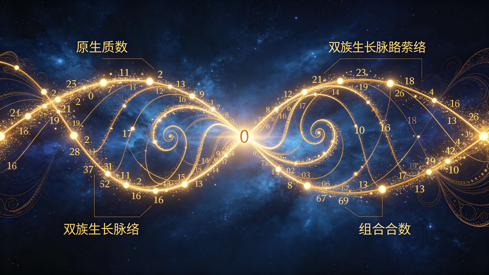
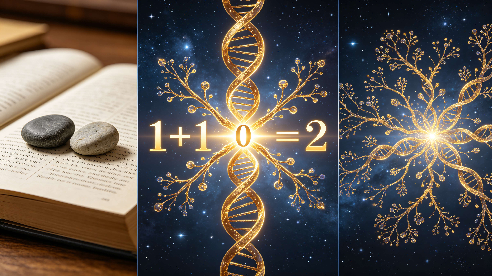
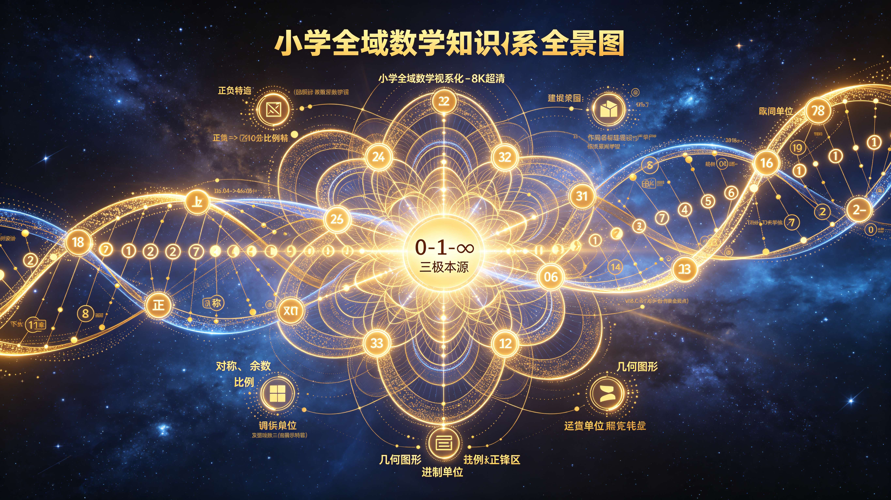
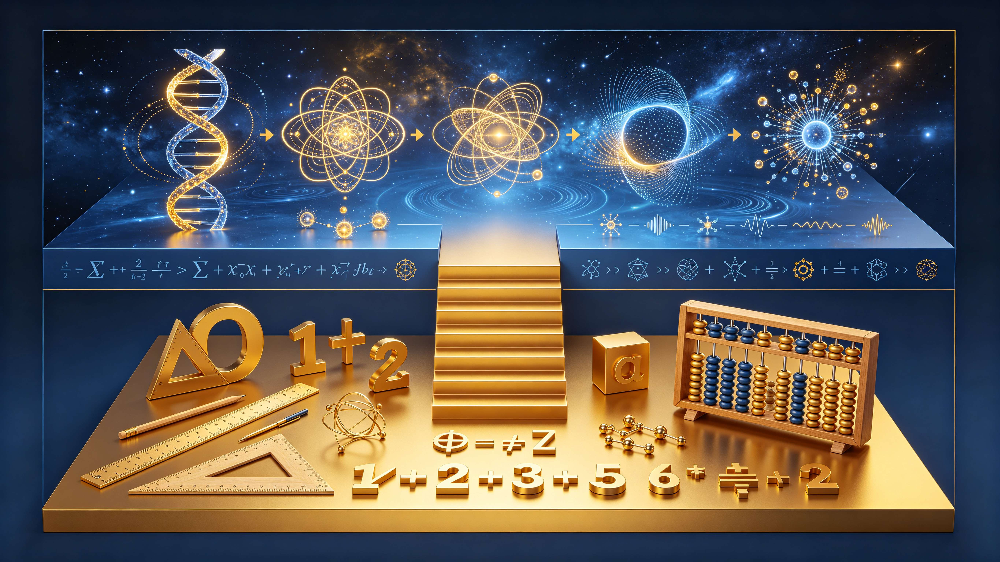

<ArchiveCopyPanel article-id="162118782" />

{"markdown":"PiDliIbnsbvvvJrmlofmmI7ov5vpmLYyMDDorrIgIAo+IOe8luWPt++8mmAxNjIxMTg3ODJgICAKPiDljp/lp4vmlofku7bvvJpg5Li65LuA5LmI6K++5pys6YeMMTEy5Y+q5piv5rWF5bGC6KGo6LGh55yf5a6e5pys6LSo5pivMOWfuueCueWPjOieuuaXi+WQjOa6kOWIhuWMlui/reS7oy3lhajln5/mlbDlraZ2c+S8oOe7n+aVsOWtpuS6uuexu+aWh+aYjui/m+mYtjItMTYyMTE4NzgyLm1kYCAgCj4g6L+U5Zue77yaW+acrOS5puW9kuaho10oL3poL2Jvb2tzL2NvdXJzZS9hcnRpY2xlcy8pIMK3IFvmgLvlhaXlj6NdKC96aC9ib29rcy9hcnRpY2xlcy8pCgohW2ltYWdlXSguL2Fzc2V0cy9jc2RuaW1nL2pwZy9kZDMwYmEyZDQxNmIyNGE4LmpwZykKCiMjIOOAiuWFqOWfn+aVsOWtpnZz5Lyg57uf5pWw5a2m77ya5Lq657G75paH5piO6L+b6Zi2MjAw6K6y44CL56ysMjXorrIKCuS9nOiAhe+8miDkuZbkuZbmlbDlraYKCuiusuasoe+8miDnrKwyNeiusiDlsI/lrabpmLbmrrXnu5PkuJrmgLvor74KCuS4u+mimO+8miDkuLrku4DkuYjor77mnKzph4wgCgogCgogCiAxCgogCiArCgogCiAxCgogCiA9CgogCiAyCgogCgogMSsxPTIKCiAKIDErMT0yIOWPquaYr+a1heWxguihqOixoe+8jOecn+WunuacrOi0qOaYryAKCiAKCiAKIDAKCiAKCiAwCgogCiAwIOWfuueCueWPjOieuuaXi+WQjOa6kOWIhuWMlui/reS7owoK5pW05ZCI5YaF5a6577yaIOWJjTI06K6y5YWo6YOo5qC45b+D55+l6K+G54K55rGH5oC777yM5bCP5a2m6Zi25q615YWo5Z+f5pWw5a2m5oC75aSN55uYCgrmlofpo47vvJog6YCa5L+X56ul6Laj77yM5peg5pmm5rap5pyv6K+t77yM5YWo56iL5rK/55So5pWw5a2X5Y+M6J665peL44CBCgogCgogCiAwCgogCiAvCgogCiAxCgogCiAvCgogCiDiiJ4KCiAKCiAKCiAwLzEv4oieIOS4ieaegeacrOa6kOiuvuWumgoKLS0tCgojIyMgMO+9njXliIbpkp8g5byA5Zy65oC75aSN55uY77yM5Liy6IGU5YmNMjTorrLlhajpg6jlhoXlrrkKCiFbaW1hZ2VdKC4vYXNzZXRzL2NzZG5pbWcvanBnL2NjZjA3NjMxNzRhMzhlYjYuanBnKQoK5ZCE5L2N5ZCM5a2m77yM5LuK5aSp5piv5ZKx5Lus5bCP5a2m6Zi25q61MjXorrLnu5PkuJrlpKfor77vvIzliY3pnaLkuozljYHlm5voioLor77vvIzmiJHku6zkuIDngrnngrnmiZPnoLTkuobor77mnKzph4znroDljJbjgIHniYfpnaLnmoTmlbDlraborqTnn6XvvIzmiJHluKblpKflrrblv6vpgJ/kuLLkuIDpgY3miJHku6zlrabliLDnmoTmoLjlv4PnnJ/nm7jvvJoKCi0gCgrmlbDlrZfkuI3mmK/mjpLpmJ/mlbDlh7rmnaXnmoTvvIzmmK8gCgogCgogCiAwCgogCgogMAoKIAogMCDln7rngrnliIblh7rljp/nlJ/otKjmlbDjgIHnu4TlkIjlkIjmlbDkuKTmnaHonrrml4vlsbHot6/lkIzmraXnlJ/plb/vvJsKCi0gCgrliqDms5XkuqTmjaLlvovjgIHkuZ3kuZ3kuZjms5XooajjgIHliIbmlbDlsI/mlbDvvIzlhajmmK/kvY7nu7TnroDljJblt6XlhbfvvIzkuI3mmK/lroflrpnljp/nlJ/op4TliJnvvJsKCi0gCgrlubPpnaLlm77lvaLjgIHmlrnlnZfjgIHlnZDmoIfovbTjgIHplb/luqbph43ph4/ml7bpl7TljZXkvY3vvIzpg73mmK/kurrkuLrliLbpgKDnmoTmtYvph4/moIflsLrvvIzlpKnlnLDoh6rmnInlpKnnhLblsLrluqbkuI7lvK/mm7Lnqbrpl7TvvJsKCi0gCgogCgogCiAwCgogCgogMAoKIAogMCDkuI3mmK/nqbrml6DkuIDnianvvIzmmK/kuIfnianpnIfliqjotbfngrnvvJvlm77lvaLlj6rmmK/og73ph4/ms6LliqjnmoTlv6vnhafvvJsKCi0gCgrkvZnmlbDjgIHlr7nnp7DjgIHlubPnp7vml4vovazjgIHkvZPnp6/mr5TkvovjgIHmraPotJ/mlbDlrZfvvIzlhajpg6jmmK/lj4zonrrml4vnlJ/plb/oh6rluKbnmoTlpKnnhLbnu5PmnoTjgIIKCuivvuacrOaKiuWujOaVtOOAgei/nue7reOAgeWPjOWQkeeUn+mVv+eahOaVsOWtl+Wuh+Wume+8jOWIh+aIkOS4gOauteS4gOauteOAgeW5s+W5s+aVtOaVtOeahOeugOaYk+aooeadv++8jOaWueS+v+S9juW5tOe6p+Wwj+aci+WPi+iuoeeul+WBmumimO+8jOS9huaOqeebluS6huaVsOWtl+ivnueUn+eahOW6leWxguecn+ebuOOAggoK5LuK5aSp5oiR5Lus5bCx6Kej5byA5bCP5a2m5pWw5a2m5pyA5Z+656GA44CB5omA5pyJ5Lq65LuO5bCP6K6w5Yiw5aSn55qE562J5byP77yaCgogCgogCiAxCgogCiArCgogCiAxCgogCiA9CgogCiAyCgogCgogMSsxPTIKCiAKIDErMT0yIOeahOWujOaVtOacrOa6kOecn+ebuOOAggoKLS0tCgojIyMgNe+9njE15YiG6ZKfIOivvuacrOiupOefpVZT5YWo5Z+f5pWw5a2m5pys5rqQ6Kej6K+7CgohW2ltYWdlXSguL2Fzc2V0cy9jc2RuaW1nL2pwZy82YjIzZDRhMGY5NWFiYjlkLmpwZykKCiMjIyMg6K++5pys5Lyg57uf6Kej6YeKCgrmlbDlrZcgCgogCgogCiAxCgogCgogMQoKIAogMSDku6PooajljZXkuKrniankvZPvvIzkuKTkuKrljZXni6zkuKrkvZPnm7jliqDvvIzlkIjlubblnKjkuIDotbfvvIzlvpfliLDlhajmlrDmlbDlrZcgCgogCgogCiAyCgogCgogMgoKIAogMu+8jOaYr+WbuuWumuS4jeWPmOOAgeawuOS5heaIkOeri+eahOWfuuehgOetieW8j+OAggoK5omA5pyJ5Lq65LuO5bCP5Yiw5aSn6KKr54GM6L6T77yaCgogCgogCiAxCgogCgogMQoKIAogMSDlkowgCgogCgogCiAxCgogCgogMQoKIAogMSDmmK/kuKTkuKrni6znq4vml6DlhbPnmoTmlbDlrZfvvIzmi7zlh5HlkI7nlJ/miJAgCgogCgogCiAyCgogCgogMgoKIAogMu+8jOi/meS4qumAu+i+keaYr+e7neWvueecn+eQhuOAggoKIyMjIyDlhajln5/mlbDlrablj4zonrrml4vmnKzmupDop6Por7sKCiAKCiAKIDEKCiAKCiAxCgogCiAxIOaYryAKCiAKCiAKIDAKCiAKCiAwCgogCiAwIOWfuueCuemch+WKqOesrOS4gOasoeWIhuWMluWHuuadpeeahOS/oeaBr+mUmueCue+8jOS4jeWtmOWcqOS4pOS4quWujOWFqOeLrOeri+OAgeS6kuS4jeebuOWFs+eahCIKCiAKCiAKIDEKCiAKCiAxCgogCiAxIuOAggoK5omA6LCTIgoKIAoKIAogMQoKIAogKwoKIAogMQoKIAoKIDErMQoKIAogMSsxIu+8jOacrOi0qOaYr+WQjOS4gOS4quWfuueCuSAKCiAKCiAKIDAKCiAKCiAwCgogCiAw77yM5YWI5ZCO5Lik5qyh6ZyH5Yqo5YiG5YyW77yM5ZCM5q2l5ZCR5q2j5ZCR5Y+M6J665peL6ISJ57uc5bu25Ly477yM5piv5ZCM5rqQ55qE5Lik5qyh55Sf6ZW/6ZyH5Yqo77yM5LiN5piv5Lik5Liq5aSW5p2l5pWw5a2X5by66KGM5ou85o6l44CCCgogCgogCiAyCgogCgogMgoKIAogMiDkuI3mmK/kuKTkuKogCgogCgogCiAxCgogCgogMQoKIAogMSDnroDljZXnm7jliqDnmoTkuqfnianvvIzogIzmmK/ln7rngrnkuKTmrKHpnIfliqjlkI7vvIzkuKTmnaHonrrml4vliJ3mrKHkuqTmsYflvaLmiJDnmoTmpqvlja/ov57mjqXoioLngrnvvIzmmK/lj4zonrrml4vliIbljJbov4fnqIvnmoTkuK3pl7Tov4fmuKHlvaLmgIHjgIIKCiMjIyMg566A5Y2V55Sf5rS75YyW5q+U5Za777yaCgror77mnKzop4bop5LvvJog5Lik6aKX5bCP55+z5a2Q5YiG5byA77yM5aCG5LiA6LW35Y+Y5oiQ5LiA5aCG77yM5pWw6YeP6K6w5L2cIAoKIAoKIAogMgoKIAoKIDIKCiAKIDLjgIIKCuWFqOWfn+inhuinku+8miDlkIzkuIDpopfnp43lrZDvvIjln7rngrkgCgogCgogCiAwCgogCgogMAoKIAogMO+8iei/nue7reS4pOasoeWPkeiKvemch+WKqO+8jOWIhuWHuuS4pOadoeWQjOatpeeUn+mVv+eahOaeneW5su+8jAoKIAoKIAogMgoKIAoKIDIKCiAKIDIg5Y+q5piv5p6d5bmy5Lqk5rGH55qE6IqC54K577yM5Lik6aKXIgoKIAoKIAogMQoKIAoKIDEKCiAKIDEi5pys5Ye66Ieq5ZCM5LiA5Liq5rqQ5aS077yM5LiN5piv5LqS5LiN55u45YWz55qE5Lik5Liq5Liq5L2T44CCCgrkvY7nu7TlubPlnabnurjpnaLph4zvvIzmiJHku6zogonnnLznnIvkuI3lh7rlkIzmupDlhbPns7vvvIzlj6rog73nnIvop4HkuKTkuKrni6znq4vnrKblj7fvvIzmiYDku6XnroDljJblhpnmiJAgCgogCgogCiAxCgogCiArCgogCiAxCgogCiA9CgogCiAyCgogCgogMSsxPTIKCiAKIDErMT0y77yb5LiA5pem5oqK6KeG6KeS5ouJ6auY77yM55yL6KeB5a6M5pW05Y+M5ZCR5Y+M6J665peL55Sf6ZW/57uT5p6E77yM5bCx6IO95piO55m96L+Z5Liq562J5byP5Y+q5piv566A5YyW5oqV5b2x77yM5LiN5piv5a6M5pW055yf55u444CCCgotLS0KCiMjIyAxNe+9njIy5YiG6ZKfIOS4suiBlOWJjTI06K6y55+l6K+G54K55LqS55u45Y2w6K+BCgohW2ltYWdlXSguL2Fzc2V0cy9jc2RuaW1nL2pwZy8wYzJiZmE4ZWY0NzM4OGNlLmpwZykKCui/meadoeW6leWxgumAu+i+ke+8jOiDveaKiuaIkeS7rOWJjTI06K6y5omA5pyJ5YaF5a655YWo6YOo5Liy6LW35p2l77yaCgotIAoK5q2j6LSf6J665peL77yaIAoKIAoKIAogMAoKIAoKIDAKCiAKIDAg54K55Y+M5ZCR5YiG5YyW77yM5q2j5ZCR5Lik5qyh6ZyH5Yqo5Ye6IAoKIAoKIAogMgoKIAoKIDIKCiAKIDLvvIzlj43lkJHlkIznkIbliIbljJblh7ogCgogCgogCiDiiJIKCiAKIDIKCiAKCiAtMgoKIAog4oiSMu+8jOWvueensOWujOaVtO+8mwoKLSAKCuWvueensOinhOWIme+8miDkuKTmrKHpnIfliqjlpKnnhLbmiJDlr7nvvIzlr7nlupTkuIfnianlr7nnp7DnlJ/plb/nmoTlupXlsYLlpKnpgZPvvJsKCi0gCgrkvZnmlbDjgIHmr5TkvovvvJog6J665peL5YiG5YyW6IqC5aWP5LiN5ZCM77yM5omN5Lya5Lqn55Sf5YiG6YWN5beu5YC844CB5ZCM5q2lL+atpOa2iOW9vOmVv+eahOavlOS+i++8mwoKLSAKCuWHoOS9leWbvuW9ou+8miDonrrml4vmjIHnu63liIbljJbjgIHlubPnp7vml4vovaznlJ/plb/vvIzlsYLlsYLltYzlpZflvaLmiJDmiJHku6znnIvliLDnmoTmlrnlvaLjgIHlnIblvaLjgIHnq4vkvZPnqbrpl7TvvJsKCi0gCgrov5vliLbjgIHljZXkvY3vvJog5Y2B6L+b5Yi244CB5Y6Y57Gz44CB5pe25YiG56eS5YWo5piv5Lq65Li65oiq5Y+W6J665peL5L2O5bGC54mH5q616YCg5Ye65p2l55qE5bel5YW377yM5peg5rOV5a6M5pW05o+P6L+w5a6M5pW05YiG5YyW6L+H56iL44CCCgrmiYDmnInlsI/lrabor77mnKzmlbDlrabnn6Xor4bngrnvvIzlhajpg6jlu7rnq4vlnKgi5by66KGM5ouG5YiG5ZCM5rqQ5LqL54mp44CB566A5YyW57q/5oCn6KGo6L6+IueahOWfuuehgOS4iu+8jOWPqumAguWQiOWBmumimOiuoeeul++8jOS4jeiDveaPj+i/sOS4h+eJqeecn+WunueUn+mVv+mAu+i+keOAggoKLS0tCgojIyMgMjLvvZ4yOOWIhumSnyDmoKHlhoXlrabkuaDljLrliIbmj5DphpLvvIzmiZPmtojlpKflrrblgZrpopjpob7omZEKCiFbaW1hZ2VdKC4vYXNzZXRzL2NzZG5pbWcvanBnLzMyNGIwNTJmMjIwYWIzMTEuanBnKQoK6L+Z6YeM5oiR5YaN6Lef5aSn5a626K+05riF5qWa77yM5LiN55So5a6z5oCV6ICD6K+V5omj5YiG77yaCgrljbflrZDjgIHkvZzkuJrjgIHmoKHlhoXor77loILvvIzkvp3ml6fmjInnhafor77mnKwgCgogCgogCiAxCgogCiArCgogCiAxCgogCiA9CgogCiAyCgogCgogMSsxPTIKCiAKIDErMT0yIOagh+WHhuS9nOetlO+8jOaJgOacieWFrOW8j+OAgeWumuS5ieOAgeiuoeeul+aWueazleeFp+W4uOS9v+eUqO+8jOWujOWFqOS4jeW9seWTjeW+l+WIhuOAggoK5ZKx5Lus6L+ZMjXorrLor77nqIvvvIzmmK/nu5nlpKflrrblop7liqDkuIDlsYLmm7Tpq5jnu7TluqbnmoTorqTnn6XvvJoKCuivvuacrOaVsOWtpuaYryLkurrnsbvlrp7nlKjlt6XlhbfmlbDlraYi77yM55So5p2l55Sf5rS744CB5YGa6aKY44CB5Lqk5piT77ybCgrlhajln5/mlbDlrabmmK8i5a6H5a6Z5Y6f55Sf5pys5L2T5pWw5a2mIu+8jOeUqOadpeeci+aHguS4h+eJqeOAgeeykuWtkOOAgeiDvemHj+OAgeepuumXtOecn+ato+eahOivnueUn+inhOW+i+OAggoK5LqM6ICF5LiN5Yay56qB77yM5LiA5Liq55So5p2l5pel5bi45L2/55So77yM5LiA5Liq55So5p2l55yL5riF5LiW55WM5pys5rqQ44CCCgotLS0KCiMjIyAyOO+9njMw5YiG6ZKfIOWwj+WtpumYtuautee7k+S4muaAu+e7kyvkuIvkuIDpmLbmrrXpooTlkYoKCiFbaW1hZ2VdKC4vYXNzZXRzL2NzZG5pbWcvanBnLzY1NzMzZmY1YzkxZWZiNjYuanBnKQoKIyMjIyDmnKzoioLor77mgLvlsI/nu5MKCiAKCiAKIDEKCiAKICsKCiAKIDEKCiAKID0KCiAKIDIKCiAKCiAxKzE9MgoKIAogMSsxPTIg5Y+q5piv5bmz5Z2m5L2O57u056m66Ze055qE566A5YyW6K6h566X56ym5Y+377yM5pWw5a2X55qE55yf5a6e5p2l5rqQ5pivIAoKIAoKIAogMAoKIAoKIDAKCiAKIDAg5Z+654K55oyB57ut5ZCM5rqQ6ZyH5Yqo44CB5YiG5YyW5Ye65Y+M6J665peL55Sf6ZW/6ISJ57uc77yb6K++5pys5omA5pyJ5pWw5a2m6KeE5YiZ77yM6YO95piv5oiq5Y+W5a6H5a6Z5Y6f55Sf5pWw5a2m55qE5bGA6YOo566A5YyW54mI5pys44CCCgojIyMjIOWwj+WtpumYtuauteaVtOS9k+e7k+S4muWvhOivrQoK5Yiw6L+Z6YeM77yM5ZKx5Lus5bCP5a2mNTDorrLkuIrljYrmrrXvvIgxLTI16K6y77yJ5YWo6YOo5a6M57uT44CC5oiR5Lus5o6o57+75LqG5LuO5bCP5Yiw5aSn57q/5oCn44CB5Ymy6KOC44CB5Lq65Li6566A5YyW55qE5pWw5a2m6K6k55+l77yM5bu656uL6LW35LulIAoKIAoKIAogMAoKIAoKIDAKCiAKIDAtCgogCgogCiAxCgogCgogMQoKIAogMS0KCiAKCiAKIOKIngoKIAoKIAoKIOKIniDkuInmnoHmnKzmupDjgIHlj4zonrrml4vnlJ/plb/kuLrmoLjlv4PnmoTlhajmlrDmlbDnkIbmgJ3nu7TjgIIKCiMjIyMg5LiL5LiA6Zi25q616aKE5ZGKCgrnrKwyNuiusuW8gOWQr+S4reWtpuevhzUx6K6y77yM5oiR5Lus5bCG6Lez5Ye65pW05pWw55Sf6ZW/77yM6Kej6ZSB5Ye95pWw44CB5puy57q/44CB5aSa57u056m66Ze077yM5ouG6KejIuWHveaVsOWPquaYr+aYoOWwhCLnmoTkvKDnu5/orqTnn6XvvIzmj63npLrlh73mlbDmmK/onrrml4vmjIHnu63nlJ/plb/mvJTljJbnmoTliqjmgIHovajov7njgIIKCi0tLQo=","text":"5YiG57G777ya5paH5piO6L+b6Zi2MjAw6K6yICAK57yW5Y+377yaMTYyMTE4NzgyICAK5Y6f5aeL5paH5Lu277ya5Li65LuA5LmI6K++5pys6YeMMTEy5Y+q5piv5rWF5bGC6KGo6LGh55yf5a6e5pys6LSo5pivMOWfuueCueWPjOieuuaXi+WQjOa6kOWIhuWMlui/reS7oy3lhajln5/mlbDlraZ2c+S8oOe7n+aVsOWtpuS6uuexu+aWh+aYjui/m+mYtjItMTYyMTE4NzgyLm1kICAK6L+U5Zue77ya5pys5Lmm5b2S5qGjIMK3IOaAu+WFpeWPowoKaW1hZ2UKCuOAiuWFqOWfn+aVsOWtpnZz5Lyg57uf5pWw5a2m77ya5Lq657G75paH5piO6L+b6Zi2MjAw6K6y44CL56ysMjXorrIKCuS9nOiAhe+8miDkuZbkuZbmlbDlraYKCuiusuasoe+8miDnrKwyNeiusiDlsI/lrabpmLbmrrXnu5PkuJrmgLvor74KCuS4u+mimO+8miDkuLrku4DkuYjor77mnKzph4wgCgogCgogCiAxCjEKCiAKID0KCiAKIDIKCiAKCiAxKzE9MgoKIAogMSsxPTIg5Y+q5piv5rWF5bGC6KGo6LGh77yM55yf5a6e5pys6LSo5pivIAoKIAoKIAogMAoKIAoKIDAKCiAKIDAg5Z+654K55Y+M6J665peL5ZCM5rqQ5YiG5YyW6L+t5LujCgrmlbTlkIjlhoXlrrnvvJog5YmNMjTorrLlhajpg6jmoLjlv4Pnn6Xor4bngrnmsYfmgLvvvIzlsI/lrabpmLbmrrXlhajln5/mlbDlrabmgLvlpI3nm5gKCuaWh+mjju+8miDpgJrkv5fnq6XotqPvvIzml6DmmabmtqnmnK/or63vvIzlhajnqIvmsr/nlKjmlbDlrZflj4zonrrml4vjgIEKCiAKCiAKIDAKCiAKIC8KCiAKIDEKCiAKIC8KCiAKIOKIngoKIAoKIAoKIDAvMS/iiJ4g5LiJ5p6B5pys5rqQ6K6+5a6aCgotLS0KCjDvvZ415YiG6ZKfIOW8gOWcuuaAu+WkjeebmO+8jOS4suiBlOWJjTI06K6y5YWo6YOo5YaF5a65CgppbWFnZQoK5ZCE5L2N5ZCM5a2m77yM5LuK5aSp5piv5ZKx5Lus5bCP5a2m6Zi25q61MjXorrLnu5PkuJrlpKfor77vvIzliY3pnaLkuozljYHlm5voioLor77vvIzmiJHku6zkuIDngrnngrnmiZPnoLTkuobor77mnKzph4znroDljJbjgIHniYfpnaLnmoTmlbDlraborqTnn6XvvIzmiJHluKblpKflrrblv6vpgJ/kuLLkuIDpgY3miJHku6zlrabliLDnmoTmoLjlv4PnnJ/nm7jvvJoK5pWw5a2X5LiN5piv5o6S6Zif5pWw5Ye65p2l55qE77yM5pivIAoKIAoKIAogMAoKIAoKIDAKCiAKIDAg5Z+654K55YiG5Ye65Y6f55Sf6LSo5pWw44CB57uE5ZCI5ZCI5pWw5Lik5p2h6J665peL5bGx6Lev5ZCM5q2l55Sf6ZW/77ybCuWKoOazleS6pOaNouW+i+OAgeS5neS5neS5mOazleihqOOAgeWIhuaVsOWwj+aVsO+8jOWFqOaYr+S9jue7tOeugOWMluW3peWFt++8jOS4jeaYr+Wuh+WumeWOn+eUn+inhOWIme+8mwrlubPpnaLlm77lvaLjgIHmlrnlnZfjgIHlnZDmoIfovbTjgIHplb/luqbph43ph4/ml7bpl7TljZXkvY3vvIzpg73mmK/kurrkuLrliLbpgKDnmoTmtYvph4/moIflsLrvvIzlpKnlnLDoh6rmnInlpKnnhLblsLrluqbkuI7lvK/mm7Lnqbrpl7TvvJsKMAoKIAoKIDAKCiAKIDAg5LiN5piv56m65peg5LiA54mp77yM5piv5LiH54mp6ZyH5Yqo6LW354K577yb5Zu+5b2i5Y+q5piv6IO96YeP5rOi5Yqo55qE5b+r54Wn77ybCuS9meaVsOOAgeWvueensOOAgeW5s+enu+aXi+i9rOOAgeS9k+enr+avlOS+i+OAgeato+i0n+aVsOWtl++8jOWFqOmDqOaYr+WPjOieuuaXi+eUn+mVv+iHquW4pueahOWkqeeEtue7k+aehOOAggoK6K++5pys5oqK5a6M5pW044CB6L+e57ut44CB5Y+M5ZCR55Sf6ZW/55qE5pWw5a2X5a6H5a6Z77yM5YiH5oiQ5LiA5q615LiA5q6144CB5bmz5bmz5pW05pW055qE566A5piT5qih5p2/77yM5pa55L6/5L2O5bm057qn5bCP5pyL5Y+L6K6h566X5YGa6aKY77yM5L2G5o6p55uW5LqG5pWw5a2X6K+e55Sf55qE5bqV5bGC55yf55u444CCCgrku4rlpKnmiJHku6zlsLHop6PlvIDlsI/lrabmlbDlrabmnIDln7rnoYDjgIHmiYDmnInkurrku47lsI/orrDliLDlpKfnmoTnrYnlvI/vvJoKCiAKCiAKIDEKMQoKIAogPQoKIAogMgoKIAoKIDErMT0yCgogCiAxKzE9MiDnmoTlrozmlbTmnKzmupDnnJ/nm7jjgIIKCi0tLQoKNe+9njE15YiG6ZKfIOivvuacrOiupOefpVZT5YWo5Z+f5pWw5a2m5pys5rqQ6Kej6K+7CgppbWFnZQoK6K++5pys5Lyg57uf6Kej6YeKCgrmlbDlrZcgCgogCgogCiAxCgogCgogMQoKIAogMSDku6PooajljZXkuKrniankvZPvvIzkuKTkuKrljZXni6zkuKrkvZPnm7jliqDvvIzlkIjlubblnKjkuIDotbfvvIzlvpfliLDlhajmlrDmlbDlrZcgCgogCgogCiAyCgogCgogMgoKIAogMu+8jOaYr+WbuuWumuS4jeWPmOOAgeawuOS5heaIkOeri+eahOWfuuehgOetieW8j+OAggoK5omA5pyJ5Lq65LuO5bCP5Yiw5aSn6KKr54GM6L6T77yaCgogCgogCiAxCgogCgogMQoKIAogMSDlkowgCgogCgogCiAxCgogCgogMQoKIAogMSDmmK/kuKTkuKrni6znq4vml6DlhbPnmoTmlbDlrZfvvIzmi7zlh5HlkI7nlJ/miJAgCgogCgogCiAyCgogCgogMgoKIAogMu+8jOi/meS4qumAu+i+keaYr+e7neWvueecn+eQhuOAggoK5YWo5Z+f5pWw5a2m5Y+M6J665peL5pys5rqQ6Kej6K+7CgogCgogCiAxCgogCgogMQoKIAogMSDmmK8gCgogCgogCiAwCgogCgogMAoKIAogMCDln7rngrnpnIfliqjnrKzkuIDmrKHliIbljJblh7rmnaXnmoTkv6Hmga/plJrngrnvvIzkuI3lrZjlnKjkuKTkuKrlrozlhajni6znq4vjgIHkupLkuI3nm7jlhbPnmoQiCgogCgogCiAxCgogCgogMQoKIAogMSLjgIIKCuaJgOiwkyIKCiAKCiAKIDEKMQoKIAoKIDErMQoKIAogMSsxIu+8jOacrOi0qOaYr+WQjOS4gOS4quWfuueCuSAKCiAKCiAKIDAKCiAKCiAwCgogCiAw77yM5YWI5ZCO5Lik5qyh6ZyH5Yqo5YiG5YyW77yM5ZCM5q2l5ZCR5q2j5ZCR5Y+M6J665peL6ISJ57uc5bu25Ly477yM5piv5ZCM5rqQ55qE5Lik5qyh55Sf6ZW/6ZyH5Yqo77yM5LiN5piv5Lik5Liq5aSW5p2l5pWw5a2X5by66KGM5ou85o6l44CCCgogCgogCiAyCgogCgogMgoKIAogMiDkuI3mmK/kuKTkuKogCgogCgogCiAxCgogCgogMQoKIAogMSDnroDljZXnm7jliqDnmoTkuqfnianvvIzogIzmmK/ln7rngrnkuKTmrKHpnIfliqjlkI7vvIzkuKTmnaHonrrml4vliJ3mrKHkuqTmsYflvaLmiJDnmoTmpqvlja/ov57mjqXoioLngrnvvIzmmK/lj4zonrrml4vliIbljJbov4fnqIvnmoTkuK3pl7Tov4fmuKHlvaLmgIHjgIIKCueugOWNleeUn+a0u+WMluavlOWWu++8mgoK6K++5pys6KeG6KeS77yaIOS4pOmil+Wwj+efs+WtkOWIhuW8gO+8jOWghuS4gOi1t+WPmOaIkOS4gOWghu+8jOaVsOmHj+iusOS9nCAKCiAKCiAKIDIKCiAKCiAyCgogCiAy44CCCgrlhajln5/op4bop5LvvJog5ZCM5LiA6aKX56eN5a2Q77yI5Z+654K5IAoKIAoKIAogMAoKIAoKIDAKCiAKIDDvvInov57nu63kuKTmrKHlj5Hoir3pnIfliqjvvIzliIblh7rkuKTmnaHlkIzmraXnlJ/plb/nmoTmnp3lubLvvIwKCiAKCiAKIDIKCiAKCiAyCgogCiAyIOWPquaYr+aeneW5suS6pOaxh+eahOiKgueCue+8jOS4pOmilyIKCiAKCiAKIDEKCiAKCiAxCgogCiAxIuacrOWHuuiHquWQjOS4gOS4qua6kOWktO+8jOS4jeaYr+S6kuS4jeebuOWFs+eahOS4pOS4quS4quS9k+OAggoK5L2O57u05bmz5Z2m57q46Z2i6YeM77yM5oiR5Lus6IKJ55y855yL5LiN5Ye65ZCM5rqQ5YWz57O777yM5Y+q6IO955yL6KeB5Lik5Liq54us56uL56ym5Y+377yM5omA5Lul566A5YyW5YaZ5oiQIAoKIAoKIAogMQoxCgogCiA9CgogCiAyCgogCgogMSsxPTIKCiAKIDErMT0y77yb5LiA5pem5oqK6KeG6KeS5ouJ6auY77yM55yL6KeB5a6M5pW05Y+M5ZCR5Y+M6J665peL55Sf6ZW/57uT5p6E77yM5bCx6IO95piO55m96L+Z5Liq562J5byP5Y+q5piv566A5YyW5oqV5b2x77yM5LiN5piv5a6M5pW055yf55u444CCCgotLS0KCjE1772eMjLliIbpkp8g5Liy6IGU5YmNMjTorrLnn6Xor4bngrnkupLnm7jljbDor4EKCmltYWdlCgrov5nmnaHlupXlsYLpgLvovpHvvIzog73miormiJHku6zliY0yNOiusuaJgOacieWGheWuueWFqOmDqOS4sui1t+adpe+8mgrmraPotJ/onrrml4vvvJogCgogCgogCiAwCgogCgogMAoKIAogMCDngrnlj4zlkJHliIbljJbvvIzmraPlkJHkuKTmrKHpnIfliqjlh7ogCgogCgogCiAyCgogCgogMgoKIAogMu+8jOWPjeWQkeWQjOeQhuWIhuWMluWHuiAKCiAKCiAKIOKIkgoKIAogMgoKIAoKIC0yCgogCiDiiJIy77yM5a+556ew5a6M5pW077ybCuWvueensOinhOWIme+8miDkuKTmrKHpnIfliqjlpKnnhLbmiJDlr7nvvIzlr7nlupTkuIfnianlr7nnp7DnlJ/plb/nmoTlupXlsYLlpKnpgZPvvJsK5L2Z5pWw44CB5q+U5L6L77yaIOieuuaXi+WIhuWMluiKguWlj+S4jeWQjO+8jOaJjeS8muS6p+eUn+WIhumFjeW3ruWAvOOAgeWQjOatpS/mraTmtojlvbzplb/nmoTmr5TkvovvvJsK5Yeg5L2V5Zu+5b2i77yaIOieuuaXi+aMgee7reWIhuWMluOAgeW5s+enu+aXi+i9rOeUn+mVv++8jOWxguWxguW1jOWll+W9ouaIkOaIkeS7rOeci+WIsOeahOaWueW9ouOAgeWchuW9ouOAgeeri+S9k+epuumXtO+8mwrov5vliLbjgIHljZXkvY3vvJog5Y2B6L+b5Yi244CB5Y6Y57Gz44CB5pe25YiG56eS5YWo5piv5Lq65Li65oiq5Y+W6J665peL5L2O5bGC54mH5q616YCg5Ye65p2l55qE5bel5YW377yM5peg5rOV5a6M5pW05o+P6L+w5a6M5pW05YiG5YyW6L+H56iL44CCCgrmiYDmnInlsI/lrabor77mnKzmlbDlrabnn6Xor4bngrnvvIzlhajpg6jlu7rnq4vlnKgi5by66KGM5ouG5YiG5ZCM5rqQ5LqL54mp44CB566A5YyW57q/5oCn6KGo6L6+IueahOWfuuehgOS4iu+8jOWPqumAguWQiOWBmumimOiuoeeul++8jOS4jeiDveaPj+i/sOS4h+eJqeecn+WunueUn+mVv+mAu+i+keOAggoKLS0tCgoyMu+9njI45YiG6ZKfIOagoeWGheWtpuS5oOWMuuWIhuaPkOmGku+8jOaJk+a2iOWkp+WutuWBmumimOmhvuiZkQoKaW1hZ2UKCui/memHjOaIkeWGjei3n+Wkp+WutuivtOa4healmu+8jOS4jeeUqOWus+aAleiAg+ivleaJo+WIhu+8mgoK5Y235a2Q44CB5L2c5Lia44CB5qCh5YaF6K++5aCC77yM5L6d5pen5oyJ54Wn6K++5pysIAoKIAoKIAogMQoxCgogCiA9CgogCiAyCgogCgogMSsxPTIKCiAKIDErMT0yIOagh+WHhuS9nOetlO+8jOaJgOacieWFrOW8j+OAgeWumuS5ieOAgeiuoeeul+aWueazleeFp+W4uOS9v+eUqO+8jOWujOWFqOS4jeW9seWTjeW+l+WIhuOAggoK5ZKx5Lus6L+ZMjXorrLor77nqIvvvIzmmK/nu5nlpKflrrblop7liqDkuIDlsYLmm7Tpq5jnu7TluqbnmoTorqTnn6XvvJoKCuivvuacrOaVsOWtpuaYryLkurrnsbvlrp7nlKjlt6XlhbfmlbDlraYi77yM55So5p2l55Sf5rS744CB5YGa6aKY44CB5Lqk5piT77ybCgrlhajln5/mlbDlrabmmK8i5a6H5a6Z5Y6f55Sf5pys5L2T5pWw5a2mIu+8jOeUqOadpeeci+aHguS4h+eJqeOAgeeykuWtkOOAgeiDvemHj+OAgeepuumXtOecn+ato+eahOivnueUn+inhOW+i+OAggoK5LqM6ICF5LiN5Yay56qB77yM5LiA5Liq55So5p2l5pel5bi45L2/55So77yM5LiA5Liq55So5p2l55yL5riF5LiW55WM5pys5rqQ44CCCgotLS0KCjI4772eMzDliIbpkp8g5bCP5a2m6Zi25q6157uT5Lia5oC757uTK+S4i+S4gOmYtuautemihOWRigoKaW1hZ2UKCuacrOiKguivvuaAu+Wwj+e7kwoKIAoKIAogMQoxCgogCiA9CgogCiAyCgogCgogMSsxPTIKCiAKIDErMT0yIOWPquaYr+W5s+WdpuS9jue7tOepuumXtOeahOeugOWMluiuoeeul+espuWPt++8jOaVsOWtl+eahOecn+Wunuadpea6kOaYryAKCiAKCiAKIDAKCiAKCiAwCgogCiAwIOWfuueCueaMgee7reWQjOa6kOmch+WKqOOAgeWIhuWMluWHuuWPjOieuuaXi+eUn+mVv+iEiee7nO+8m+ivvuacrOaJgOacieaVsOWtpuinhOWIme+8jOmDveaYr+aIquWPluWuh+WumeWOn+eUn+aVsOWtpueahOWxgOmDqOeugOWMlueJiOacrOOAggoK5bCP5a2m6Zi25q615pW05L2T57uT5Lia5a+E6K+tCgrliLDov5nph4zvvIzlkrHku6zlsI/lraY1MOiusuS4iuWNiuaute+8iDEtMjXorrLvvInlhajpg6jlroznu5PjgILmiJHku6zmjqjnv7vkuobku47lsI/liLDlpKfnur/mgKfjgIHlibLoo4LjgIHkurrkuLrnroDljJbnmoTmlbDlraborqTnn6XvvIzlu7rnq4votbfku6UgCgogCgogCiAwCgogCgogMAoKIAogMC0KCiAKCiAKIDEKCiAKCiAxCgogCiAxLQoKIAoKIAog4oieCgogCgogCgog4oieIOS4ieaegeacrOa6kOOAgeWPjOieuuaXi+eUn+mVv+S4uuaguOW/g+eahOWFqOaWsOaVsOeQhuaAnee7tOOAggoK5LiL5LiA6Zi25q616aKE5ZGKCgrnrKwyNuiusuW8gOWQr+S4reWtpuevhzUx6K6y77yM5oiR5Lus5bCG6Lez5Ye65pW05pWw55Sf6ZW/77yM6Kej6ZSB5Ye95pWw44CB5puy57q/44CB5aSa57u056m66Ze077yM5ouG6KejIuWHveaVsOWPquaYr+aYoOWwhCLnmoTkvKDnu5/orqTnn6XvvIzmj63npLrlh73mlbDmmK/onrrml4vmjIHnu63nlJ/plb/mvJTljJbnmoTliqjmgIHovajov7njgIIKCi0tLQ=="}

> 分类：文明进阶200讲  
> 编号：`162118782`  
> 原始文件：`为什么课本里112只是浅层表象真实本质是0基点双螺旋同源分化迭代-全域数学vs传统数学人类文明进阶2-162118782.md`  
> 返回：[本书归档](/zh/books/course/articles/) · [总入口](/zh/books/articles/)

<ArticlePaperMeta category="文明进阶200讲" article-id="162118782" title="为什么课本里112只是浅层表象真实本质是0基点双螺旋同源分化迭代-全域数学vs传统数学人类文明进阶2" paper-kind="课程讲义" book-route="/zh/books/course/articles/" overview-route="/zh/books/articles/" summary="1+1=2 只是浅层表象，真实本质是" author="乖乖数学" lecture="第25讲 小学阶段结业总课" theme="为什么课本里" source-file="为什么课本里112只是浅层表象真实本质是0基点双螺旋同源分化迭代-全域数学vs传统数学人类文明进阶2-162118782.md" cover="./assets/csdnimg/jpg/dd30ba2d416b24a8.jpg" />

## 《全域数学vs传统数学：人类文明进阶200讲》第25讲

作者： 乖乖数学

讲次： 第25讲 小学阶段结业总课

主题： 为什么课本里 

 

 
 1

 
 +

 
 1

 
 =

 
 2

 

 1+1=2

 
 1+1=2 只是浅层表象，真实本质是 

 

 
 0

 

 0

 
 0 基点双螺旋同源分化迭代

整合内容： 前24讲全部核心知识点汇总，小学阶段全域数学总复盘

文风： 通俗童趣，无晦涩术语，全程沿用数字双螺旋、

 

 
 0

 
 /

 
 1

 
 /

 
 ∞

 

 

 0/1/∞ 三极本源设定

---

### 0～5分钟 开场总复盘，串联前24讲全部内容

各位同学，今天是咱们小学阶段25讲结业大课，前面二十四节课，我们一点点打破了课本里简化、片面的数学认知，我带大家快速串一遍我们学到的核心真相：

- 

数字不是排队数出来的，是 

 

 
 0

 

 0

 
 0 基点分出原生质数、组合合数两条螺旋山路同步生长；

- 

加法交换律、九九乘法表、分数小数，全是低维简化工具，不是宇宙原生规则；

- 

平面图形、方块、坐标轴、长度重量时间单位，都是人为制造的测量标尺，天地自有天然尺度与弯曲空间；

- 

 

 
 0

 

 0

 
 0 不是空无一物，是万物震动起点；图形只是能量波动的快照；

- 

余数、对称、平移旋转、体积比例、正负数字，全部是双螺旋生长自带的天然结构。

课本把完整、连续、双向生长的数字宇宙，切成一段一段、平平整整的简易模板，方便低年级小朋友计算做题，但掩盖了数字诞生的底层真相。

今天我们就解开小学数学最基础、所有人从小记到大的等式：

 

 
 1

 
 +

 
 1

 
 =

 
 2

 

 1+1=2

 
 1+1=2 的完整本源真相。

---

### 5～15分钟 课本认知VS全域数学本源解读

#### 课本传统解释

数字 

 

 
 1

 

 1

 
 1 代表单个物体，两个单独个体相加，合并在一起，得到全新数字 

 

 
 2

 

 2

 
 2，是固定不变、永久成立的基础等式。

所有人从小到大被灌输：

 

 
 1

 

 1

 
 1 和 

 

 
 1

 

 1

 
 1 是两个独立无关的数字，拼凑后生成 

 

 
 2

 

 2

 
 2，这个逻辑是绝对真理。

#### 全域数学双螺旋本源解读

 

 
 1

 

 1

 
 1 是 

 

 
 0

 

 0

 
 0 基点震动第一次分化出来的信息锚点，不存在两个完全独立、互不相关的"

 

 
 1

 

 1

 
 1"。

所谓"

 

 
 1

 
 +

 
 1

 

 1+1

 
 1+1"，本质是同一个基点 

 

 
 0

 

 0

 
 0，先后两次震动分化，同步向正向双螺旋脉络延伸，是同源的两次生长震动，不是两个外来数字强行拼接。

 

 
 2

 

 2

 
 2 不是两个 

 

 
 1

 

 1

 
 1 简单相加的产物，而是基点两次震动后，两条螺旋初次交汇形成的榫卯连接节点，是双螺旋分化过程的中间过渡形态。

#### 简单生活化比喻：

课本视角： 两颗小石子分开，堆一起变成一堆，数量记作 

 

 
 2

 

 2

 
 2。

全域视角： 同一颗种子（基点 

 

 
 0

 

 0

 
 0）连续两次发芽震动，分出两条同步生长的枝干，

 

 
 2

 

 2

 
 2 只是枝干交汇的节点，两颗"

 

 
 1

 

 1

 
 1"本出自同一个源头，不是互不相关的两个个体。

低维平坦纸面里，我们肉眼看不出同源关系，只能看见两个独立符号，所以简化写成 

 

 
 1

 
 +

 
 1

 
 =

 
 2

 

 1+1=2

 
 1+1=2；一旦把视角拉高，看见完整双向双螺旋生长结构，就能明白这个等式只是简化投影，不是完整真相。

---

### 15～22分钟 串联前24讲知识点互相印证

这条底层逻辑，能把我们前24讲所有内容全部串起来：

- 

正负螺旋： 

 

 
 0

 

 0

 
 0 点双向分化，正向两次震动出 

 

 
 2

 

 2

 
 2，反向同理分化出 

 

 
 −

 
 2

 

 -2

 
 −2，对称完整；

- 

对称规则： 两次震动天然成对，对应万物对称生长的底层天道；

- 

余数、比例： 螺旋分化节奏不同，才会产生分配差值、同步/此消彼长的比例；

- 

几何图形： 螺旋持续分化、平移旋转生长，层层嵌套形成我们看到的方形、圆形、立体空间；

- 

进制、单位： 十进制、厘米、时分秒全是人为截取螺旋低层片段造出来的工具，无法完整描述完整分化过程。

所有小学课本数学知识点，全部建立在"强行拆分同源事物、简化线性表达"的基础上，只适合做题计算，不能描述万物真实生长逻辑。

---

### 22～28分钟 校内学习区分提醒，打消大家做题顾虑

这里我再跟大家说清楚，不用害怕考试扣分：

卷子、作业、校内课堂，依旧按照课本 

 

 
 1

 
 +

 
 1

 
 =

 
 2

 

 1+1=2

 
 1+1=2 标准作答，所有公式、定义、计算方法照常使用，完全不影响得分。

咱们这25讲课程，是给大家增加一层更高维度的认知：

课本数学是"人类实用工具数学"，用来生活、做题、交易；

全域数学是"宇宙原生本体数学"，用来看懂万物、粒子、能量、空间真正的诞生规律。

二者不冲突，一个用来日常使用，一个用来看清世界本源。

---

### 28～30分钟 小学阶段结业总结+下一阶段预告

#### 本节课总小结

 

 
 1

 
 +

 
 1

 
 =

 
 2

 

 1+1=2

 
 1+1=2 只是平坦低维空间的简化计算符号，数字的真实来源是 

 

 
 0

 

 0

 
 0 基点持续同源震动、分化出双螺旋生长脉络；课本所有数学规则，都是截取宇宙原生数学的局部简化版本。

#### 小学阶段整体结业寄语

到这里，咱们小学50讲上半段（1-25讲）全部完结。我们推翻了从小到大线性、割裂、人为简化的数学认知，建立起以 

 

 
 0

 

 0

 
 0-

 

 
 1

 

 1

 
 1-

 

 
 ∞

 

 

 ∞ 三极本源、双螺旋生长为核心的全新数理思维。

#### 下一阶段预告

第26讲开启中学篇51讲，我们将跳出整数生长，解锁函数、曲线、多维空间，拆解"函数只是映射"的传统认知，揭示函数是螺旋持续生长演化的动态轨迹。

---
