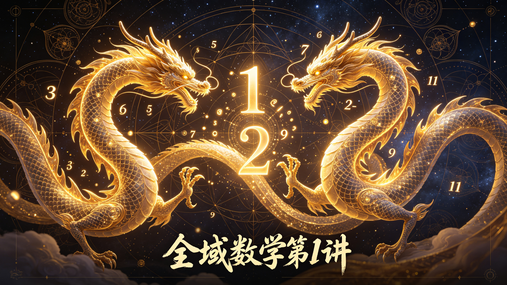
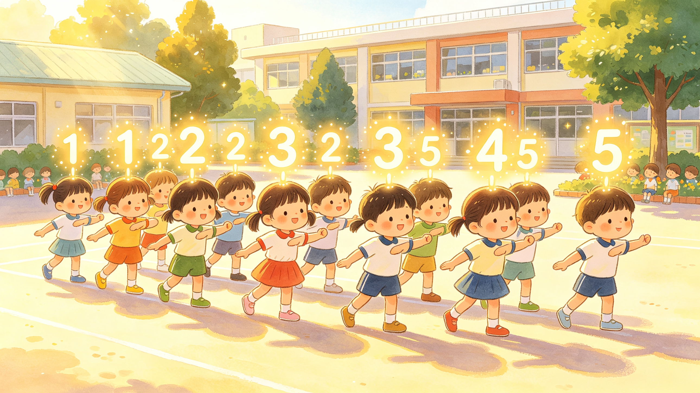
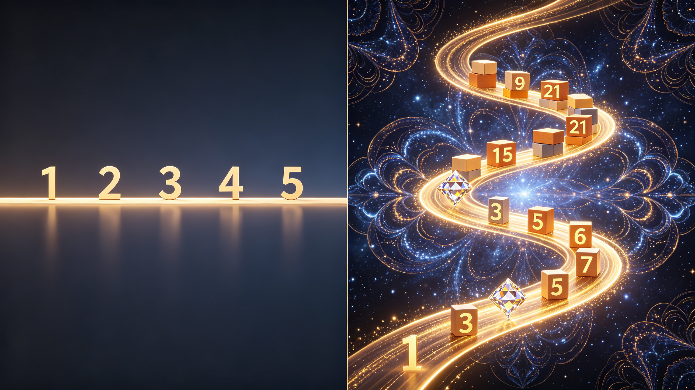
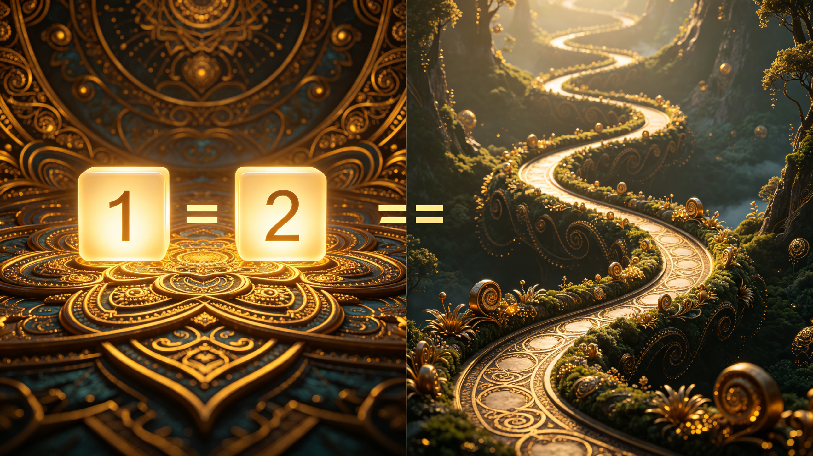

<ArchiveCopyPanel article-id="162123493" />

{"markdown":"PiDliIbnsbvvvJrmlofmmI7ov5vpmLYyMDDorrIgIAo+IOe8luWPt++8mmAxNjIxMjM0OTNgICAKPiDljp/lp4vmlofku7bvvJpg5pWw5a2X5LiN5piv5o6S6Zif5o6S5Ye65p2l55qE5piv5Lik5p2h6ZW/6b6Z5LiA6LW36ZW/5Ye65p2l55qELeWFqOWfn+aVsOWtpnZz5Lyg57uf5pWw5a2m5Lq657G75paH5piO6L+b6Zi2MjAw6K6y56ysMeiusi0xNjIxMjM0OTMubWRgICAKPiDov5Tlm57vvJpb5pys5Lmm5b2S5qGjXSgvemgvYm9va3MvY291cnNlL2FydGljbGVzLykgwrcgW+aAu+WFpeWPo10oL3poL2Jvb2tzL2FydGljbGVzLykKCiMjIOOAiuWFqOWfn+aVsOWtpnZz5Lyg57uf5pWw5a2m77ya5Lq657G75paH5piO6L+b6Zi2MjAw6K6y44CL56ysMeiusgoK5L2c6ICF77ya5LmW5LmW5pWw5a2mCgrorrLmrKHvvJrnrKwx6K6yCgrkuLvpopjvvJrmlbDlrZfkuI3mmK/mjpLpmJ/mjpLlh7rmnaXnmoTvvIzmmK/kuKTmnaHplb/pvpnkuIDotbfplb/lh7rmnaXnmoQKCuWvueagh+S8oOe7n+aVsOWtpu+8mjHjgIEy44CBM+OAgTTpobrnnYDmlbAKCuaOiOivvuiwg+aAp++8muWPo+ivreWMluOAgeWwj+aVheS6i+OAgeOAiuaVsOacr+W3peWdiuOAi+erpei2o+axn+a5luavlOWWu++8jOS4jeeUqOWbm+WFg+aVsOOAgea1geW9ouOAgeabsueOh+etiemavuivjQoKLS0tCgohW+WFqOWfn+aVsOWtpuesrDHorrLlsIHpnaJdKGh0dHBzOi8vaS1ibG9nLmNzZG5pbWcuY24vaW1nX2NvbnZlcnQvZDIzMDBkZWEyNTEzZTQzOWFkY2Q0MDBlOWNiNDBmMmIuanBlZykKCi0tLQoKIyMjIOOAkDAtM+WIhumSnyDlvIDlnLrogYrlpKnvvIzlsI/mnIvlj4vnp5LlkKzmh4LjgJEKCuWQjOWtpuS7rO+8jOWkp+WutuWlve+8gQoK5ZKx5Lus5LuO5bCP5Yiw5aSn77yM5aSn5Lq66YO95piv6L+Z5LmI5pWZ5oiR5Lus6K6k5pWw5a2X55qE77yaMe+8jDLvvIwz77yMNO+8jDXvvIzkuIDkuKrot5/nnYDkuIDkuKrlvoDlkI7mjpLvvIzlg4/lsI/mnIvlj4vmjpLpmJ/lgZrmk43jgIIKCuaJgOacieS6uumDveinieW+l++8jOaVsOWtl+WwseaYr+aMiemhuuW6j+S4gOS4quS4gOS4quWKoDHlj5jlh7rmnaXnmoTvvIzlr7nkuI3lr7nvvJ8KCuS7iuWkqeWSseS7rOaNouS4gOS4quWFqOaWsOeci+azle+8jOS4jeeUqOmavuaHguWFrOW8j++8jOWPqueUqOWwj+aVheS6i++8muaVsOWtl+S4jeaYr+aOkumYn+adpeeahO+8jOaYr+S4pOadoemVv+mVv+eahOmYn+S8je+8jOS4gOi1t+W+gOS4iuaFouaFoumVv+WHuuadpeeahOOAggoKIVvmlbDlrZfmjpLpmJ/nmoTkvKDnu5/mpoLlv7VdKGh0dHBzOi8vaS1ibG9nLmNzZG5pbWcuY24vaW1nX2NvbnZlcnQvYzdmNmYwMmYyNjVmZDg3N2U1NDdkNTI1MzFmZGJmNzMuanBlZykKCuaIkeaYr+S5luS5luaVsOWtpu+8jOW5s+aXtuWWnOasouaKiumavuaHgueahOaVsOWtpuWGmeaIkOaxn+a5luWwj+aVheS6i+OAiuaVsOacr+W3peWdiuOAi++8jOS7iuWkqeWSseS7rOaKm+W8gOaer+eHpeivvuacrO+8jOaNouS4quinhuinkueci+aVsOWtl+OAggoKLS0tCgojIyMg44CQMy0xMuWIhumSnyDlsI/mlYXkuovnsbvmr5TvvIznroDljJblj4zonrrml4vmpoLlv7XvvIzml6DkuJPkuJrlkI3or43jgJEKCuWSseS7rOaKiuaVsOWtl+S4lueVjOaDs+ixoeaIkOS4gOW6p+Wkp+Wxse+8jOWxseS4iuacieS4pOadoeawuOi/nOW5tuaOkuW+gOS4iuW7tuS8uOeahOWwj+i3r++8mgoK56ys5LiA5p2h5bCP6Lev77yM6LWw55qE5piv5Y+q6IO95ouG5oiQ6Ieq5bex5ZKMMeeahOaVsOWtl++8mjPjgIE144CBN+OAgTEx44CBMTPigKbigKYz44CBNeOAgTfjgIExMeOAgTEz4oCm4oCmM+OAgTXjgIE344CBMTHjgIExM+KApuKApgoK6L+Z56eN5pWw5a2X5rKh5rOV5ouG5oiQ5Lik5Liq5pu05bCP5pWw5a2X55u45LmY77yM5bCx5YOP54us5LiA5peg5LqM55qE5Y6f55+z77yM5ZKx5Lus5Y+r5a6DIuWOn+eUn+aVsOWtlyLvvJsKCuesrOS6jOadoeWwj+i3r++8jOi1sOeahOaYr+iDveaLhuW8gOebuOS5mOeahOaVsOWtl++8mjnjgIExNeOAgTIx44CBMjXigKbigKY544CBMTXjgIEyMeOAgTI14oCm4oCmOeOAgTE144CBMjHjgIEyNeKApuKApgoK5a6D5Lus6YO95piv5LiK6Z2i6YKj5Lqb5Y6f55Sf5pWw5a2X5ou85o6l57uE5ZCI5Ye65p2l55qE77yM5bCx5YOP5Y6f55+z5ou85Ye65p2l55qE56ev5pyo77yM5ZKx5Lus5Y+rIue7hOWQiOaVsOWtlyLjgIIKCiFb5Lik5p2h5bCP6Lev5Y+M6J665peL5LiK5Y2HXShodHRwczovL2ktYmxvZy5jc2RuaW1nLmNuL2ltZ19jb252ZXJ0LzNmNGE4YTQyNTZlNzI4ZWY0ZjFiNGJhYjIxZGFlYzdiLmpwZWcpCgrlho3nnIvmlbDlrZcx5ZKM5pWw5a2XMu+8mgoKMeaYr+S4pOadoeWwj+i3r+WFseWQjOeahOi1t+eCue+8jOebuOW9k+S6juWxseiEmueahOS4gOWdl+efs+WktO+8jOS4pOadoei3r+mDveS7jui/memHjOWHuuWPke+8mwoKMuaYr+WUr+S4gOWNleeLrOS4gOadoeWwj+i3r+eahOefremAmumBk++8jOaYr+i/nuaOpeS4pOadoemVv+i3r+eahOWwj+ahpeOAggoKIVvmlbDlrZcx6LW354K55LiO5pWw5a2XMuWwj+ahpV0oaHR0cHM6Ly9pLWJsb2cuY3NkbmltZy5jbi9pbWdfY29udmVydC9jY2QyODMyNjQwOWYyMWJlZmM3MzA0ZmE5ZTNiZDNhOS5qcGVnKQoK6K++5pys5oqK5bGx6ISa55+z5aS044CB5bCP5qGl44CB5Lik5p2h6Lev5LiK5omA5pyJ5pWw5a2X77yM5YWo6YOo5ouJ5oiQ5LiA5p2h55u055u055qE6Zif5LyN77yMMeOAgTLjgIEz44CBNOOAgTXigKbigKYx44CBMuOAgTPjgIE044CBNeKApuKApjHjgIEy44CBM+OAgTTjgIE14oCm4oCmCgrov5nlsLHlpb3mr5TmiorlsbHkuIrkuKTmnaHliIblvIDnmoTlsI/ot6/vvIzlvLrooYzmjrDmiJDkuIDmnaHlubPlnLDpmJ/kvI3vvIznnIvnnYDmlbTpvZDvvIzljbTnnIvkuI3liLDmlbDlrZfmnKzmnaXnlJ/plb/nmoTmoLflrZDjgIIKCi0tLQoKIyMjIOOAkDEyLTIw5YiG6ZKfIOeugOWNleWvueavlO+8jOWPqueUqOWwj+WtpueUn+Wtpui/h+eahOefpeivhuOAkQoKIyMjIyDor77mnKzph4znmoTkvKDnu5/nnIvms5UKCi0gCgrmlbDlrZfkuIDkuKrmjqXkuIDkuKrmjpLpmJ/vvIzlkI7kuIDkuKrmlbDlrZcgPT09IOWJjeS4gOS4quaVsOWtl+WGjeWKoCAxMTEKCi0gCgrljp/nlJ/mlbDlrZfjgIHnu4TlkIjmlbDlrZflj6rmmK/lkI7mnaXkurrkuLrliIblh7rmnaXnmoTkuKTnsbsKCi0gCgrliqDms5XjgIHmlbDmlbDlj6rmmK/kurrnsbvnlKjmnaXorqHmlbDnmoTlip7ms5UKCiMjIyMg5ZKx5Lus5YWo5Z+f5pWw5a2m566A5Y2V55yL5rOVCgotIAoK5pWw5a2X5LuO6LW354K5IDExMSDliIblvIDvvIzliIbmiJDkuKTmnaHot6/lkIzmraXnlJ/plb/vvIzkuI3mmK/kuIDmnaHnm7Tnur/mjpLpmJ8KCi0gCgrlpKnnlJ/lsLHliIbkuKTnsbvvvJrkuI3og73mi4bliIbnmoTljp/nlJ/mlbDlrZfjgIHmi7zmjqXogIzmiJDnmoTnu4TlkIjmlbDlrZfvvIzmmK/mlbDlrZfmnKzmnaXnmoTmoLflrZAKCi0gCgrkuI3mmK/miJHku6znoazpgKDlh7rmlbDlrZfvvIzmlbDlrZfmnKzouqvlsLHlg4/lsI/ojYnkuIDmoLfvvIzpobrnnYDkuKTmnaHot6/mhaLmhaIi6ZW/IuWHuuadpQoKIVvkvKDnu5/mlbDlraZ2c+WFqOWfn+aVsOWtpuWvueavlF0oaHR0cHM6Ly9pLWJsb2cuY3NkbmltZy5jbi9pbWdfY29udmVydC85YmZhOWExODJmZDMwMDgyMTEyMWYwZTU1YTEzOTYyZi5qcGVnKQoK5Li+5Liq5pyA566A5Y2V55qE5L6L5a2Q77yaCgror77mnKzor7QgMTExIOWKoCAxMTEg562J5LqOIDIyMu+8jOaYr+S4pOS4quaVsOWtl+WHkeWcqOS4gOi1t+WPmOWHuiAyMjLvvJsKCuWSseS7rOaNouS4queugOWNleeQhuino++8mui1t+eCuSAxMTEg6ZyH5Yqo5LiA5qyh77yM5pCt5Ye65bCP5qGl5pWw5a2XIDIyMu+8mwoK5YaN5oyB57ut5b6A5LiL55Sf6ZW/77yM5omN5YiG5byA5Lik5p2h5aSn6Lev77yM5LiA6L656ZW/5Ye65Y6f55Sf5pWw5a2X77yM5LiA6L656ZW/5Ye657uE5ZCI5pWw5a2X44CCCgrnlKjlhazlvI/ooajnpLrlsLHmmK/vvJoKCjErMT0yMSArIDEgPSAyMSsxPTIKCuS9huWcqOWFqOWfn+aVsOWtpueahOinhuinkumHjO+8jOi/meabtOWDj+aYr++8mgoKLS0tCgojIyMg44CQMjAtMjbliIbpkp8g6LS05ZCI5bCP5a2m5a2m5Lmg77yM6ZmN5L2O55CG6Kej6Zeo5qeb77yM6aKE5Z+L56ysMjXorrLkvI/nrJTjgJEKCuacieWQjOWtpuS8mumXru+8mui/meS5iOWtpu+8jOW5s+aXtuWBmumimOS8muWPl+W9seWTjeWQl++8nwoK5a6M5YWo5LiN5Lya77yM6K++5pys55qE5Yqg5YeP5LmY6Zmk54Wn5qC36IO955So77yM5Y+q5piv5oiR5Lus5aSa5oeC5LiA5bGC5pWw5a2X5pys5p2l55qE5qC35a2Q44CCCgror77mnKzlkYror4nmiJHku6zvvIzkuI3nrqEgMTExIOWKoCAyMjIg6L+Y5pivIDIyMiDliqAgMTEx77yM57uT5p6c6YO95LiA5qC377yM6L+Z5piv5Yqg5rOV5Lqk5o2i5b6L44CCCgphK2I9YithYSArIGIgPSBiICsgYWErYj1iK2EKCuetieWtpuWIsOWQjumdouesrDI16K6y77yI5bCP5a2m5Lit5pyf5q+V5Lia6K++77yJ77yM5oiR5Lus5Lya6K6y5Yiw77yaCgrlj6rmnInlnKjnroDljZXmlbDlrZfmjpLpmJ/nmoTml7blgJnvvIzliY3lkI7osIPmjaLnu5PmnpzkuI3lj5jvvJsKCuetieaVsOWtl+W+gOmrmOWkhOeUn+mVv++8jOS4pOadoeWwj+i3r+WIhuW8gOW+iOi/nOS5i+WQju+8jOmhuuW6j+aNouS4gOS4i++8jOe7k+aenOWwseS4jeS4gOagt+WVpuOAggoKIVvliqDms5XkuqTmjaLlvovnmoTlj5jljJZdKGh0dHBzOi8vaS1ibG9nLmNzZG5pbWcuY24vaW1nX2NvbnZlcnQvZjQwMThiZWMxZWQ0ZWU1MTExMGZlOTVhM2UxNTcyZTIuanBlZykKCi0tLQoKIyMjIOOAkDI2LTI55YiG6ZKfIOa4qeWSjOaUtuWwvu+8jOS4jeaZpua2qe+8jOeVmeeugOWNleaCrOW/teOAkQoK5oC757uT5LiA5LiL5LuK5aSp55qE5YaF5a6577yaCgror77mnKzmiormiYDmnInmlbDlrZfmjpLmiJDkuIDmnaHnm7Tnur/vvIzmlrnkvr/miJHku6zlgZrpopjvvJsKCuS9huaVsOWtl+ecn+WunueahOagt+WtkO+8jOaYr+S7jiAxMTEg5Ye65Y+R77yM5Lik5p2h5bCP6Lev5ZCM5q2l5ZCR5LiK55Sf6ZW/77yM5LiA5p2h5Y6f55Sf5pWw5a2X44CB5LiA5p2h57uE5ZCI5pWw5a2X44CCCgohW+ieuuaXi+S4iuWNh+eahOaVsOWtl+Wkqeair10oaHR0cHM6Ly9pLWJsb2cuY3NkbmltZy5jbi9pbWdfY29udmVydC82OGUxNTIzYzdiZjVkZmZhZWI0NWY5MzRmNTg4Y2JjMy5qcGVnKQoK5LiL5LiA6IqC6K++77yM5oiR5Lus6IGK6IGK77ya5Li65LuA5LmI5pyJ5pe25YCZ5pWw5a2X5o2i5Liq6aG65bqP77yM6K6h566X57uT5p6c5Lya5LiN5LiA5qC344CCCgotLS0K","text":"5YiG57G777ya5paH5piO6L+b6Zi2MjAw6K6yICAK57yW5Y+377yaMTYyMTIzNDkzICAK5Y6f5aeL5paH5Lu277ya5pWw5a2X5LiN5piv5o6S6Zif5o6S5Ye65p2l55qE5piv5Lik5p2h6ZW/6b6Z5LiA6LW36ZW/5Ye65p2l55qELeWFqOWfn+aVsOWtpnZz5Lyg57uf5pWw5a2m5Lq657G75paH5piO6L+b6Zi2MjAw6K6y56ysMeiusi0xNjIxMjM0OTMubWQgIArov5Tlm57vvJrmnKzkuablvZLmoaMgwrcg5oC75YWl5Y+jCgrjgIrlhajln5/mlbDlraZ2c+S8oOe7n+aVsOWtpu+8muS6uuexu+aWh+aYjui/m+mYtjIwMOiusuOAi+esrDHorrIKCuS9nOiAhe+8muS5luS5luaVsOWtpgoK6K6y5qyh77ya56ysMeiusgoK5Li76aKY77ya5pWw5a2X5LiN5piv5o6S6Zif5o6S5Ye65p2l55qE77yM5piv5Lik5p2h6ZW/6b6Z5LiA6LW36ZW/5Ye65p2l55qECgrlr7nmoIfkvKDnu5/mlbDlrabvvJox44CBMuOAgTPjgIE06aG6552A5pWwCgrmjojor77osIPmgKfvvJrlj6Por63ljJbjgIHlsI/mlYXkuovjgIHjgIrmlbDmnK/lt6XlnYrjgIvnq6XotqPmsZ/muZbmr5TllrvvvIzkuI3nlKjlm5vlhYPmlbDjgIHmtYHlvaLjgIHmm7LnjofnrYnpmr7or40KCi0tLQoK5YWo5Z+f5pWw5a2m56ysMeiusuWwgemdogoKLS0tCgrjgJAwLTPliIbpkp8g5byA5Zy66IGK5aSp77yM5bCP5pyL5Y+L56eS5ZCs5oeC44CRCgrlkIzlrabku6zvvIzlpKflrrblpb3vvIEKCuWSseS7rOS7juWwj+WIsOWkp++8jOWkp+S6uumDveaYr+i/meS5iOaVmeaIkeS7rOiupOaVsOWtl+eahO+8mjHvvIwy77yMM++8jDTvvIw177yM5LiA5Liq6Lef552A5LiA5Liq5b6A5ZCO5o6S77yM5YOP5bCP5pyL5Y+L5o6S6Zif5YGa5pON44CCCgrmiYDmnInkurrpg73op4nlvpfvvIzmlbDlrZflsLHmmK/mjInpobrluo/kuIDkuKrkuIDkuKrliqAx5Y+Y5Ye65p2l55qE77yM5a+55LiN5a+577yfCgrku4rlpKnlkrHku6zmjaLkuIDkuKrlhajmlrDnnIvms5XvvIzkuI3nlKjpmr7mh4LlhazlvI/vvIzlj6rnlKjlsI/mlYXkuovvvJrmlbDlrZfkuI3mmK/mjpLpmJ/mnaXnmoTvvIzmmK/kuKTmnaHplb/plb/nmoTpmJ/kvI3vvIzkuIDotbflvoDkuIrmhaLmhaLplb/lh7rmnaXnmoTjgIIKCuaVsOWtl+aOkumYn+eahOS8oOe7n+amguW/tQoK5oiR5piv5LmW5LmW5pWw5a2m77yM5bmz5pe25Zac5qyi5oqK6Zq+5oeC55qE5pWw5a2m5YaZ5oiQ5rGf5rmW5bCP5pWF5LqL44CK5pWw5pyv5bel5Z2K44CL77yM5LuK5aSp5ZKx5Lus5oqb5byA5p6v54el6K++5pys77yM5o2i5Liq6KeG6KeS55yL5pWw5a2X44CCCgotLS0KCuOAkDMtMTLliIbpkp8g5bCP5pWF5LqL57G75q+U77yM566A5YyW5Y+M6J665peL5qaC5b+177yM5peg5LiT5Lia5ZCN6K+N44CRCgrlkrHku6zmiormlbDlrZfkuJbnlYzmg7PosaHmiJDkuIDluqflpKflsbHvvIzlsbHkuIrmnInkuKTmnaHmsLjov5zlubbmjpLlvoDkuIrlu7bkvLjnmoTlsI/ot6/vvJoKCuesrOS4gOadoeWwj+i3r++8jOi1sOeahOaYr+WPquiDveaLhuaIkOiHquW3seWSjDHnmoTmlbDlrZfvvJoz44CBNeOAgTfjgIExMeOAgTEz4oCm4oCmM+OAgTXjgIE344CBMTHjgIExM+KApuKApjPjgIE144CBN+OAgTEx44CBMTPigKbigKYKCui/meenjeaVsOWtl+ayoeazleaLhuaIkOS4pOS4quabtOWwj+aVsOWtl+ebuOS5mO+8jOWwseWDj+eLrOS4gOaXoOS6jOeahOWOn+efs++8jOWSseS7rOWPq+WugyLljp/nlJ/mlbDlrZci77ybCgrnrKzkuozmnaHlsI/ot6/vvIzotbDnmoTmmK/og73mi4blvIDnm7jkuZjnmoTmlbDlrZfvvJo544CBMTXjgIEyMeOAgTI14oCm4oCmOeOAgTE144CBMjHjgIEyNeKApuKApjnjgIExNeOAgTIx44CBMjXigKbigKYKCuWug+S7rOmDveaYr+S4iumdoumCo+S6m+WOn+eUn+aVsOWtl+aLvOaOpee7hOWQiOWHuuadpeeahO+8jOWwseWDj+WOn+efs+aLvOWHuuadpeeahOenr+acqO+8jOWSseS7rOWPqyLnu4TlkIjmlbDlrZci44CCCgrkuKTmnaHlsI/ot6/lj4zonrrml4vkuIrljYcKCuWGjeeci+aVsOWtlzHlkozmlbDlrZcy77yaCgox5piv5Lik5p2h5bCP6Lev5YWx5ZCM55qE6LW354K577yM55u45b2T5LqO5bGx6ISa55qE5LiA5Z2X55+z5aS077yM5Lik5p2h6Lev6YO95LuO6L+Z6YeM5Ye65Y+R77ybCgoy5piv5ZSv5LiA5Y2V54us5LiA5p2h5bCP6Lev55qE55+t6YCa6YGT77yM5piv6L+e5o6l5Lik5p2h6ZW/6Lev55qE5bCP5qGl44CCCgrmlbDlrZcx6LW354K55LiO5pWw5a2XMuWwj+ahpQoK6K++5pys5oqK5bGx6ISa55+z5aS044CB5bCP5qGl44CB5Lik5p2h6Lev5LiK5omA5pyJ5pWw5a2X77yM5YWo6YOo5ouJ5oiQ5LiA5p2h55u055u055qE6Zif5LyN77yMMeOAgTLjgIEz44CBNOOAgTXigKbigKYx44CBMuOAgTPjgIE044CBNeKApuKApjHjgIEy44CBM+OAgTTjgIE14oCm4oCmCgrov5nlsLHlpb3mr5TmiorlsbHkuIrkuKTmnaHliIblvIDnmoTlsI/ot6/vvIzlvLrooYzmjrDmiJDkuIDmnaHlubPlnLDpmJ/kvI3vvIznnIvnnYDmlbTpvZDvvIzljbTnnIvkuI3liLDmlbDlrZfmnKzmnaXnlJ/plb/nmoTmoLflrZDjgIIKCi0tLQoK44CQMTItMjDliIbpkp8g566A5Y2V5a+55q+U77yM5Y+q55So5bCP5a2m55Sf5a2m6L+H55qE55+l6K+G44CRCgror77mnKzph4znmoTkvKDnu5/nnIvms5UK5pWw5a2X5LiA5Liq5o6l5LiA5Liq5o6S6Zif77yM5ZCO5LiA5Liq5pWw5a2XID09PSDliY3kuIDkuKrmlbDlrZflho3liqAgMTExCuWOn+eUn+aVsOWtl+OAgee7hOWQiOaVsOWtl+WPquaYr+WQjuadpeS6uuS4uuWIhuWHuuadpeeahOS4pOexuwrliqDms5XjgIHmlbDmlbDlj6rmmK/kurrnsbvnlKjmnaXorqHmlbDnmoTlip7ms5UKCuWSseS7rOWFqOWfn+aVsOWtpueugOWNleeci+azlQrmlbDlrZfku47otbfngrkgMTExIOWIhuW8gO+8jOWIhuaIkOS4pOadoei3r+WQjOatpeeUn+mVv++8jOS4jeaYr+S4gOadoeebtOe6v+aOkumYnwrlpKnnlJ/lsLHliIbkuKTnsbvvvJrkuI3og73mi4bliIbnmoTljp/nlJ/mlbDlrZfjgIHmi7zmjqXogIzmiJDnmoTnu4TlkIjmlbDlrZfvvIzmmK/mlbDlrZfmnKzmnaXnmoTmoLflrZAK5LiN5piv5oiR5Lus56Gs6YCg5Ye65pWw5a2X77yM5pWw5a2X5pys6Lqr5bCx5YOP5bCP6I2J5LiA5qC377yM6aG6552A5Lik5p2h6Lev5oWi5oWiIumVvyLlh7rmnaUKCuS8oOe7n+aVsOWtpnZz5YWo5Z+f5pWw5a2m5a+55q+UCgrkuL7kuKrmnIDnroDljZXnmoTkvovlrZDvvJoKCuivvuacrOivtCAxMTEg5YqgIDExMSDnrYnkuo4gMjIy77yM5piv5Lik5Liq5pWw5a2X5YeR5Zyo5LiA6LW35Y+Y5Ye6IDIyMu+8mwoK5ZKx5Lus5o2i5Liq566A5Y2V55CG6Kej77ya6LW354K5IDExMSDpnIfliqjkuIDmrKHvvIzmkK3lh7rlsI/moaXmlbDlrZcgMjIy77ybCgrlho3mjIHnu63lvoDkuIvnlJ/plb/vvIzmiY3liIblvIDkuKTmnaHlpKfot6/vvIzkuIDovrnplb/lh7rljp/nlJ/mlbDlrZfvvIzkuIDovrnplb/lh7rnu4TlkIjmlbDlrZfjgIIKCueUqOWFrOW8j+ihqOekuuWwseaYr++8mgoKMSsxPTIxICsgMSA9IDIxKzE9MgoK5L2G5Zyo5YWo5Z+f5pWw5a2m55qE6KeG6KeS6YeM77yM6L+Z5pu05YOP5piv77yaCgotLS0KCuOAkDIwLTI25YiG6ZKfIOi0tOWQiOWwj+WtpuWtpuS5oO+8jOmZjeS9jueQhuino+mXqOanm++8jOmihOWfi+esrDI16K6y5LyP56yU44CRCgrmnInlkIzlrabkvJrpl67vvJrov5nkuYjlrabvvIzlubPml7blgZrpopjkvJrlj5flvbHlk43lkJfvvJ8KCuWujOWFqOS4jeS8mu+8jOivvuacrOeahOWKoOWHj+S5mOmZpOeFp+agt+iDveeUqO+8jOWPquaYr+aIkeS7rOWkmuaHguS4gOWxguaVsOWtl+acrOadpeeahOagt+WtkOOAggoK6K++5pys5ZGK6K+J5oiR5Lus77yM5LiN566hIDExMSDliqAgMjIyIOi/mOaYryAyMjIg5YqgIDExMe+8jOe7k+aenOmDveS4gOagt++8jOi/meaYr+WKoOazleS6pOaNouW+i+OAggoKYStiPWIrYWEgKyBiID0gYiArIGFhK2I9YithCgrnrYnlrabliLDlkI7pnaLnrKwyNeiusu+8iOWwj+WtpuS4reacn+avleS4muivvu+8ie+8jOaIkeS7rOS8muiusuWIsO+8mgoK5Y+q5pyJ5Zyo566A5Y2V5pWw5a2X5o6S6Zif55qE5pe25YCZ77yM5YmN5ZCO6LCD5o2i57uT5p6c5LiN5Y+Y77ybCgrnrYnmlbDlrZflvoDpq5jlpITnlJ/plb/vvIzkuKTmnaHlsI/ot6/liIblvIDlvojov5zkuYvlkI7vvIzpobrluo/mjaLkuIDkuIvvvIznu5PmnpzlsLHkuI3kuIDmoLfllabjgIIKCuWKoOazleS6pOaNouW+i+eahOWPmOWMlgoKLS0tCgrjgJAyNi0yOeWIhumSnyDmuKnlkozmlLblsL7vvIzkuI3mmabmtqnvvIznlZnnroDljZXmgqzlv7XjgJEKCuaAu+e7k+S4gOS4i+S7iuWkqeeahOWGheWuue+8mgoK6K++5pys5oqK5omA5pyJ5pWw5a2X5o6S5oiQ5LiA5p2h55u057q/77yM5pa55L6/5oiR5Lus5YGa6aKY77ybCgrkvYbmlbDlrZfnnJ/lrp7nmoTmoLflrZDvvIzmmK/ku44gMTExIOWHuuWPke+8jOS4pOadoeWwj+i3r+WQjOatpeWQkeS4iueUn+mVv++8jOS4gOadoeWOn+eUn+aVsOWtl+OAgeS4gOadoee7hOWQiOaVsOWtl+OAggoK6J665peL5LiK5Y2H55qE5pWw5a2X5aSp5qKvCgrkuIvkuIDoioLor77vvIzmiJHku6zogYrogYrvvJrkuLrku4DkuYjmnInml7blgJnmlbDlrZfmjaLkuKrpobrluo/vvIzorqHnrpfnu5PmnpzkvJrkuI3kuIDmoLfjgIIKCi0tLQ=="}

> 分类：文明进阶200讲  
> 编号：`162123493`  
> 原始文件：`数字不是排队排出来的是两条长龙一起长出来的-全域数学vs传统数学人类文明进阶200讲第1讲-162123493.md`  
> 返回：[本书归档](/zh/books/course/articles/) · [总入口](/zh/books/articles/)

## 《全域数学vs传统数学：人类文明进阶200讲》第1讲

作者：乖乖数学

讲次：第1讲

主题：数字不是排队排出来的，是两条长龙一起长出来的

对标传统数学：1、2、3、4顺着数

授课调性：口语化、小故事、《数术工坊》童趣江湖比喻，不用四元数、流形、曲率等难词

---

---

### 【0-3分钟 开场聊天，小朋友秒听懂】

同学们，大家好！

咱们从小到大，大人都是这么教我们认数字的：1，2，3，4，5，一个跟着一个往后排，像小朋友排队做操。

所有人都觉得，数字就是按顺序一个一个加1变出来的，对不对？

今天咱们换一个全新看法，不用难懂公式，只用小故事：数字不是排队来的，是两条长长的队伍，一起往上慢慢长出来的。

我是乖乖数学，平时喜欢把难懂的数学写成江湖小故事《数术工坊》，今天咱们抛开枯燥课本，换个视角看数字。

---

### 【3-12分钟 小故事类比，简化双螺旋概念，无专业名词】

咱们把数字世界想象成一座大山，山上有两条永远并排往上延伸的小路：

第一条小路，走的是只能拆成自己和1的数字：3、5、7、11、13……3、5、7、11、13……3、5、7、11、13……

这种数字没法拆成两个更小数字相乘，就像独一无二的原石，咱们叫它"原生数字"；

第二条小路，走的是能拆开相乘的数字：9、15、21、25……9、15、21、25……9、15、21、25……

它们都是上面那些原生数字拼接组合出来的，就像原石拼出来的积木，咱们叫"组合数字"。

再看数字1和数字2：

1是两条小路共同的起点，相当于山脚的一块石头，两条路都从这里出发；

2是唯一单独一条小路的短通道，是连接两条长路的小桥。

课本把山脚石头、小桥、两条路上所有数字，全部拉成一条直直的队伍，1、2、3、4、5……1、2、3、4、5……1、2、3、4、5……

这就好比把山上两条分开的小路，强行掰成一条平地队伍，看着整齐，却看不到数字本来生长的样子。

---

### 【12-20分钟 简单对比，只用小学生学过的知识】

#### 课本里的传统看法

- 

数字一个接一个排队，后一个数字 === 前一个数字再加 111

- 

原生数字、组合数字只是后来人为分出来的两类

- 

加法、数数只是人类用来计数的办法

#### 咱们全域数学简单看法

- 

数字从起点 111 分开，分成两条路同步生长，不是一条直线排队

- 

天生就分两类：不能拆分的原生数字、拼接而成的组合数字，是数字本来的样子

- 

不是我们硬造出数字，数字本身就像小草一样，顺着两条路慢慢"长"出来

举个最简单的例子：

课本说 111 加 111 等于 222，是两个数字凑在一起变出 222；

咱们换个简单理解：起点 111 震动一次，搭出小桥数字 222；

再持续往下生长，才分开两条大路，一边长出原生数字，一边长出组合数字。

用公式表示就是：

1+1=21 + 1 = 21+1=2

但在全域数学的视角里，这更像是：

---

### 【20-26分钟 贴合小学学习，降低理解门槛，预埋第25讲伏笔】

有同学会问：这么学，平时做题会受影响吗？

完全不会，课本的加减乘除照样能用，只是我们多懂一层数字本来的样子。

课本告诉我们，不管 111 加 222 还是 222 加 111，结果都一样，这是加法交换律。

a+b=b+aa + b = b + aa+b=b+a

等学到后面第25讲（小学中期毕业课），我们会讲到：

只有在简单数字排队的时候，前后调换结果不变；

等数字往高处生长，两条小路分开很远之后，顺序换一下，结果就不一样啦。

---

### 【26-29分钟 温和收尾，不晦涩，留简单悬念】

总结一下今天的内容：

课本把所有数字排成一条直线，方便我们做题；

但数字真实的样子，是从 111 出发，两条小路同步向上生长，一条原生数字、一条组合数字。

下一节课，我们聊聊：为什么有时候数字换个顺序，计算结果会不一样。

---
