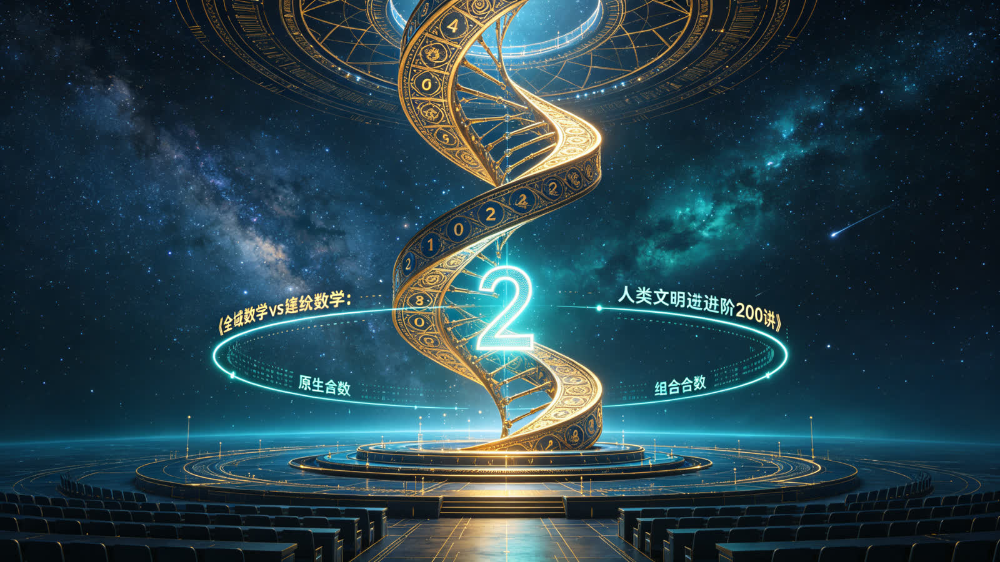
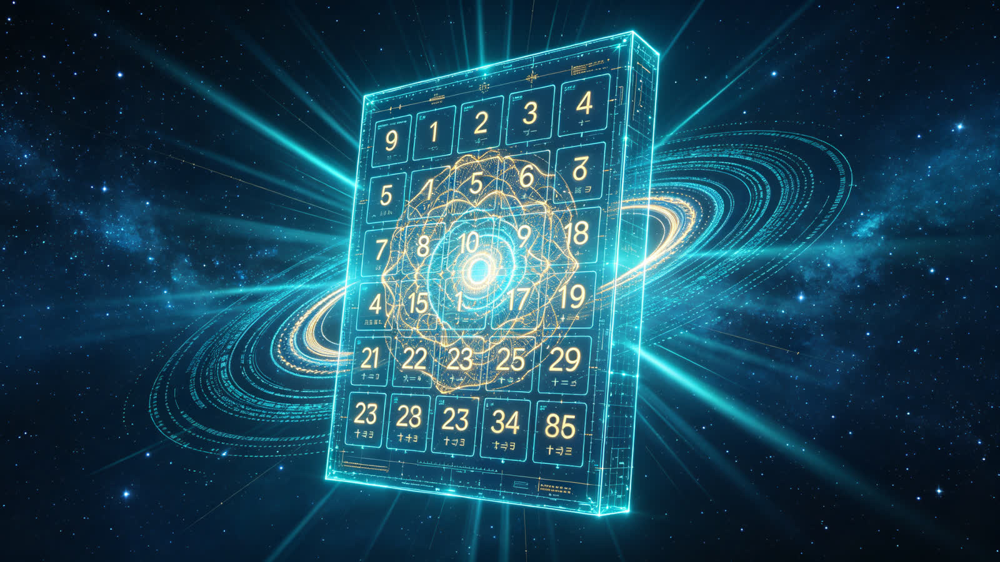
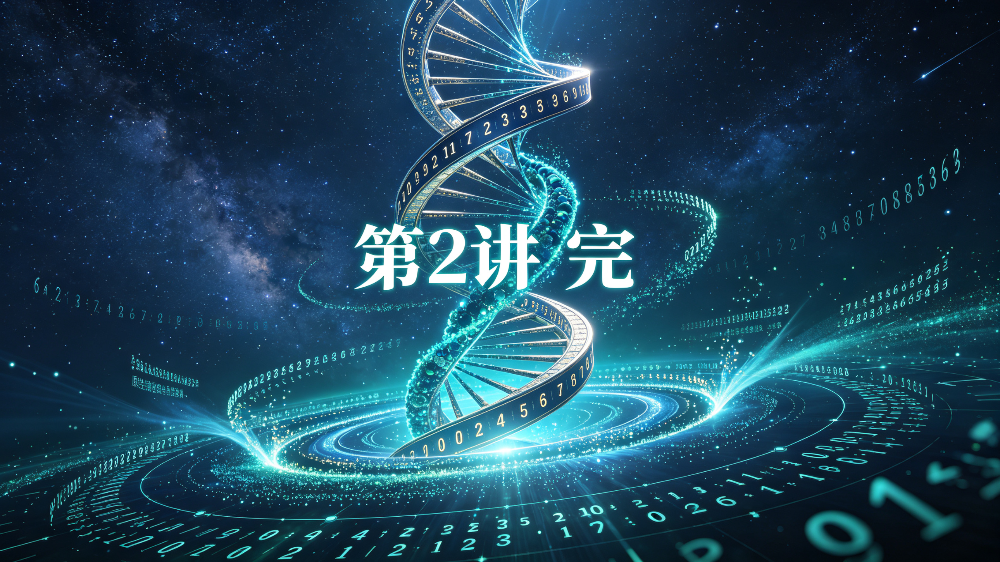

<ArchiveCopyPanel article-id="162140886" />

{"markdown":"PiDliIbnsbvvvJrmlofmmI7ov5vpmLYyMDDorrIgIAo+IOe8luWPt++8mmAxNjIxNDA4ODZgICAKPiDljp/lp4vmlofku7bvvJpg5Lqk5o2i5LiN5piv5rC46L+c5oiQ56uL566A5Y2V5Yqg5rOV5Y+q5piv54m55L6LLeWFqOWfn+aVsOWtpnZz5Lyg57uf5pWw5a2m5Lq657G75paH5piO6L+b6Zi2MjAw6K6y56ysMuiusi0xNjIxNDA4ODYubWRgICAKPiDov5Tlm57vvJpb5pys5Lmm5b2S5qGjXSgvemgvYm9va3MvY291cnNlL2FydGljbGVzLykgwrcgW+aAu+WFpeWPo10oL3poL2Jvb2tzL2FydGljbGVzLykKCiFb56ysMuiusiDlsIHpnaJdKC4vYXNzZXRzL2NzZG5pbWcvanBnL2NmNTFiYTc1NmRjMWFiOTAuanBnKQoKIyMg44CK5YWo5Z+f5pWw5a2mdnPkvKDnu5/mlbDlrabvvJrkurrnsbvmlofmmI7ov5vpmLYyMDDorrLjgIvnrKwy6K6yCgrorrLmrKHvvJrnrKwy6K6yCgrkuLvpopjvvJrkuqTmjaLkuI3mmK/msLjov5zmiJDnq4vvvIznroDljZXliqDms5Xlj6rmmK/nibnkvosKCuWvueagh+S8oOe7n+aVsOWtpu+8muWKoOazleS6pOaNouW+iyAxKzI9MisxMSsyPTIrMTErMj0yKzEKCuiwg+aAp++8muerpei2o+aVheS6i+OAgeaXoOS4k+S4muacr+ivreOAgei0tOWQiOOAiuaVsOacr+W3peWdiuOAi+mAmuS/l+WPmeS6iwoKLS0tCgojIyMg44CQMC0z5YiG6ZKfIOWkjeS5oOWvvOWFpe+8jOihlOaOpeS4iuiKguivvuOAkQoKIVvmlbDlrZflj4zlsbHot6/nlJ/plb/npLrmhI/lm75dKC4vYXNzZXRzL2NzZG5pbWcvanBnL2YxMGFjN2Q5MTExNWIwMDMuanBnKQoK5ZCE5L2N5ZCM5a2m77yM5ZKx5Lus5LiK6IqC6K++55+l6YGT5LqG77ya5pWw5a2X5LiN5piv5LiA5p2h55u057q/5o6S6Zif77yM6ICM5piv5LuOIDExMSDlh7rlj5HvvIzkuKTmnaHlsI/ot6/kuIDotbflvoDkuIrplb/vvIzkuIDmnaHljp/nlJ/otKjmlbDjgIHkuIDmnaHnu4TlkIjlkIjmlbDjgIIKCuivvuacrOS4uuS6huaWueS+v+iuoeeul++8jOaKiuaJgOacieaVsOWtl+aLieaIkOS4gOaOku+8jOS6juaYr+acieS6huW+iOWkmueugOWNleWlveeUqOeahOinhOWIme+8jOS7iuWkqeWSseS7rOiBiuacgOWfuuehgOeahOS4gOadoe+8muWKoOazleS6pOaNouW+i+OAggoK6ICB5biI5Zyo6K++5aCC6YO95Lya6K+077ya5Lik5Liq5pWw5a2X55u45Yqg77yM5YmN5ZCO6LCD5o2i5L2N572u77yM5b6X5pWw5LiN5Y+Y77yMMSsyPTIrMTErMj0yKzExKzI9Misx77yMMys1PTUrMzMrNT01KzMzKzU9NSsz77yM5rC46L+c6YO95a+544CCCgrku4rlpKnlkrHku6zorrLnnJ/or53vvJrov5nmnaHop4TlvovvvIzlj6rpgILlkIjlubPlnLDnn63ot53nprvnmoTlsI/mlbDvvIzmlbDlrZflvoDpq5jlpITnlJ/plb/kuYvlkI7vvIzmjaLpobrluo/nu5PmnpzlsLHlj5jkuobjgIIKCi0tLQoKIyMjIOOAkDMtMTPliIbpkp8g55Sf5rS75YyW5bCP5pWF5LqL57G75q+U77yM6Zu26Zq+5oeC6K+N5rGH44CRCgohW+W5s+WcsOaQreenr+acqOS6pOaNouekuuaEj+Wbvl0oLi9hc3NldHMvY3NkbmltZy9qcGcvM2FmNDIyMzg0MWRhNmU2Ni5qcGcpCgrmi7/mkK3np6/mnKjkuL7kvovlrZDvvIzlr7nlupTlkrHku6zmlbDlrZfkuKTmnaHlsbHot6/vvJoKCuWcuuaZrzHvvJrlubPlnLDnjqnkuKTlnZflsI/np6/mnKjvvIzkuIDlnZfmoIcgMTEx44CB5LiA5Z2X5qCHIDIyMuOAggoK5YWI5ou/IDExMSDlho3mi78gMjIyIOWghui1t+adpe+8jOWSjOWFiOaLvyAyMjIg5YaN5ou/IDExMSDloIbotbfmnaXvvIznp6/mnKjmgLvpq5jluqbkuIDmqKHkuIDmoLfvvIzov5nlsLHmmK/or77mnKznmoTkuqTmjaLlvovjgIIKCui/meaYr+S9jumYtuOAgeeugOWNleeahOaDheWGte+8jOS4pOadoeWxsei3r+i/mOayoeWIhuW8gO+8jOaMqOW+l+W+iOi/ke+8jOiwgeWFiOiwgeWQjueci+S4jeWHuuW3ruWIq+OAggoKIVvkuKTmnaHmlbDlrZflsbHot6/lr7nmr5Tlm75dKC4vYXNzZXRzL2NzZG5pbWcvanBnL2Q4MmViZDEwNTUwMDdhMWMuanBnKQoK5Zy65pmvMu+8muWSseS7rOmhuuedgOS4pOadoeWxsei3r+W+gOmrmOWkhOi1sO+8jOS4gOi+ueaYr+WOn+eUn+aVsOWtlyAzMzPvvIzkuIDovrnmmK/nu4TlkIjmlbDlrZcgOTk544CCCgrnrKzkuIDnp43pobrluo/vvJrlhYjotbDljp/nlJ/mlbDlrZcgMzMz77yM5YaN6LWw57uE5ZCI5pWw5a2XIDk5Oe+8mwoK56ys5LqM56eN6aG65bqP77ya5YWI6LWw57uE5ZCI5pWw5a2XIDk5Oe+8jOWGjei1sOWOn+eUn+aVsOWtlyAzMzPjgIIKCuS4pOadoeWxsei3r+mrmOS9juOAgeWuveeqhOacrOadpeWwseS4jeS4gOagt++8jOWFiOWQjui1sO+8jOi1sOi/h+eahOi3r+eoi+OAgeeci+WIsOeahOmjjuaZr+WujOWFqOS4jeWQjOOAggoK5pS+5Yiw5pWw5a2X6L+Q566X6YeM77yM6aG65bqP5LiA5Y+Y77yM5YaF5Zyo55qE57uT5p6E5bCx5LiN5LiA5qC377yM57uT5p6c6Ieq54S25LiN6IO95a6M5YWo562J5ZCM44CCCgror77mnKzlj6rmi7/lubPlnLDlsI/mlbDlrZfkuL7kvovvvIzlj6rorrLmnIDnroDljZXnmoTmg4XlhrXvvIzljbTmsqHlkYror4nlpKflrrbvvJrmlbDlrZfplb/lpKfkuYvlkI7vvIzov5nlpZfop4TliJnkvJrlpLHmlYjjgIIKCi0tLQoKIyMjIOOAkDEzLTIy5YiG6ZKfIOeugOWNleWvueavlO+8jOWPqueUqOWwj+WtpueOsOacieefpeivhuOAkQoKIVvkvKDnu5/mlbDlrabkuI7lhajln5/mlbDlrablr7nmr5RdKC4vYXNzZXRzL2NzZG5pbWcvanBnLzBlN2UyYmIyYmIwZTg0Y2EuanBnKQoK5Lyg57uf6K++5pys6KeC54K5CgotIAoK5Lu75oSP5Lik5Liq5pWw55u45Yqg77yM5Lqk5o2i5L2N572u77yM5ZKM5LiN5Y+Y77yM5piv5rC45LmF6YCa55So5rOV5YiZCgotIAoK5pWw5a2X5LiN5YiG56eN57G777yM5LiN5YiG5aSn5bCP77yM6L+Q566X6KeE5YiZ57uf5LiA5LiN5Y+YCgrlhajln5/mlbDlrabpgJrkv5fop4LngrkKCi0gCgrkuqTmjaLnm7jnrYnlj6rmmK/kvY7pmLblsI/mlbDnmoTnibnmrornjrDosaHvvIzkuI3mmK/kuIfnianpgJrnlKjop4TlvosKCi0gCgrmlbDlrZfliIbljp/nlJ/jgIHnu4TlkIjkuKTmnaHnlJ/plb/ot6/nur/vvIznsbvlnovkuI3lkIzvvIzov5Dnrpfpobrluo/kvJrmlLnlj5jlhoXlnKjnu5PmnoQKCi0gCgror77mnKzop4TliJnmmK8i566A5YyW5bel5YW3Iu+8jOS4jeaYr+aVsOWtl+acrOadpeeahOeUn+mVv+inhOW+iwoKIVvnmbvlsbHot6/lvoTpobrluo/pmpDllrtdKC4vYXNzZXRzL2NzZG5pbWcvanBnL2I1YWY5MzE2ZTlmOGNiN2MuanBnKQoK5Li+5Liq5aW955CG6Kej55qE5q+U5Za777yaCgrlsLHlg4/kuIrlsbHmuLjnjqnvvIzlhYjotbDlubPnvJPlsI/ot6/vvIzlho3otbDpmaHls63lsbHot6/vvJsKCuWSjOWFiOeIrOmZoeWdoe+8jOWGjei1sOW5s+i3r++8jOaVtOautei3r+eahOS9k+aEn+OAgei3r+eoi+a2iOiAl+WujOWFqOS4jeS4gOagt+OAggoK5pWw5a2X6L+Q566X5Lmf5piv5ZCM55CG77yM6aG65bqP5Lya5pS55Y+Y5YaF5Zyo57uT5p6E77yM5Y+q5piv5bCP5pWw5beu6Led5aSq5bCP77yM5oiR5Lus55yL5LiN5Ye65p2l44CCCgotLS0KCiMjIyDjgJAyMi0yN+WIhumSnyDnu5PlkIjor77loILlrabkuaDvvIzmiZPmtojpob7omZHjgJEKCuWkp+WutuS4jeeUqOWus+aAle+8jOW5s+aXtuWGmeS9nOS4muOAgeiAg+ivle+8jOS+neaXp+WPr+S7peeUqOWKoOazleS6pOaNouW+i+WBmumimO+8jOWujOWFqOS4jeW9seWTjeW+l+WIhuOAggoK6K++5pys6L+Z5aWX6KeE5YiZ5piv57uZ5oiR5Lus5pel5bi46K6h566X55So55qE566A5piT5bel5YW377yM5aSf55So44CB5pa55L6/44CCCgrmiJHku6zov5npl6jor77lj6rmmK/lpJrlrabkuIDlsYLvvJrlt6XlhbfmmK/kurrkuLrnroDljJblh7rmnaXnmoTvvIzmlbDlrZfnnJ/lrp7nlJ/plb/nmoTop4Tlvovmm7TlpI3mnYLjgIHmm7TlrozmlbTjgIIKCuWQjOaXtuWfi+WlveesrCAyNTI1MjUg6K6y5bCP5a2m5q+V5Lia6K++5LyP56yU77ya562J5Yiw56ysIDI1MjUyNSDorrLvvIzmiJHku6zkvJrlrozmlbTmi4bop6PvvIzkuLrku4DkuYggMSsxMSsxMSsxIOS4jeWPquaYr+eugOWNleetieS6jiAyMjLvvIzogIzmmK/kuKTmnaHlsbHot6/kuIDmrKHlkIzmraXnlJ/plb/jgIIKCi0tLQoKIyMjIOOAkDI3LTMw5YiG6ZKfIOivvuWgguaAu+e7kyvkuIvoioLor77pooTlkYrjgJEKCiFb5Lmd5Lmd5LmY5rOV6KGo57uT5p6E5oqV5b2x6aKE5ZGKXSguL2Fzc2V0cy9jc2RuaW1nL2pwZy8zMzQ3YzUyZWYzNjcwMDRmLmpwZykKCuS7iuaXpeWwj+e7k++8mgoK5Yqg5rOV5Lqk5o2i5b6L5Y+q5piv5bCP5pWw5a2X55qE54m55L6L77yM5pWw5a2X5YiG5Lik5p2h6YGT6Lev55Sf6ZW/77yM6aG65bqP5LiN5ZCM77yM5YaF5Zyo57uT5p6E5LiN5ZCM77yM5LiN6IO96ZqP5L6/5LqS5o2i44CCCgrkuIvkuIDoioLor77vvJoKCuS5neS5neS5mOazleihqOWPquaYr+aVsOWtl+ecn+Wunue7k+aehOeahOeugOaYk+aKleW9se+8jOaIkeS7rOiBiuiBiuaVsOWtl+aAjuS5iOWxguWxgui/reS7o+eUn+mVv+OAggoKLS0tCgohW+esrDLorrIg57uT5bC+55S76Z2iXSguL2Fzc2V0cy9jc2RuaW1nL2pwZy85NTlmZGFlOGVlMzk0YTBiLmpwZykK","text":"5YiG57G777ya5paH5piO6L+b6Zi2MjAw6K6yICAK57yW5Y+377yaMTYyMTQwODg2ICAK5Y6f5aeL5paH5Lu277ya5Lqk5o2i5LiN5piv5rC46L+c5oiQ56uL566A5Y2V5Yqg5rOV5Y+q5piv54m55L6LLeWFqOWfn+aVsOWtpnZz5Lyg57uf5pWw5a2m5Lq657G75paH5piO6L+b6Zi2MjAw6K6y56ysMuiusi0xNjIxNDA4ODYubWQgIArov5Tlm57vvJrmnKzkuablvZLmoaMgwrcg5oC75YWl5Y+jCgrnrKwy6K6yIOWwgemdogoK44CK5YWo5Z+f5pWw5a2mdnPkvKDnu5/mlbDlrabvvJrkurrnsbvmlofmmI7ov5vpmLYyMDDorrLjgIvnrKwy6K6yCgrorrLmrKHvvJrnrKwy6K6yCgrkuLvpopjvvJrkuqTmjaLkuI3mmK/msLjov5zmiJDnq4vvvIznroDljZXliqDms5Xlj6rmmK/nibnkvosKCuWvueagh+S8oOe7n+aVsOWtpu+8muWKoOazleS6pOaNouW+iyAxKzI9MisxMSsyPTIrMTErMj0yKzEKCuiwg+aAp++8muerpei2o+aVheS6i+OAgeaXoOS4k+S4muacr+ivreOAgei0tOWQiOOAiuaVsOacr+W3peWdiuOAi+mAmuS/l+WPmeS6iwoKLS0tCgrjgJAwLTPliIbpkp8g5aSN5Lmg5a+85YWl77yM6KGU5o6l5LiK6IqC6K++44CRCgrmlbDlrZflj4zlsbHot6/nlJ/plb/npLrmhI/lm74KCuWQhOS9jeWQjOWtpu+8jOWSseS7rOS4iuiKguivvuefpemBk+S6hu+8muaVsOWtl+S4jeaYr+S4gOadoeebtOe6v+aOkumYn++8jOiAjOaYr+S7jiAxMTEg5Ye65Y+R77yM5Lik5p2h5bCP6Lev5LiA6LW35b6A5LiK6ZW/77yM5LiA5p2h5Y6f55Sf6LSo5pWw44CB5LiA5p2h57uE5ZCI5ZCI5pWw44CCCgror77mnKzkuLrkuobmlrnkvr/orqHnrpfvvIzmiormiYDmnInmlbDlrZfmi4nmiJDkuIDmjpLvvIzkuo7mmK/mnInkuoblvojlpJrnroDljZXlpb3nlKjnmoTop4TliJnvvIzku4rlpKnlkrHku6zogYrmnIDln7rnoYDnmoTkuIDmnaHvvJrliqDms5XkuqTmjaLlvovjgIIKCuiAgeW4iOWcqOivvuWggumDveS8muivtO+8muS4pOS4quaVsOWtl+ebuOWKoO+8jOWJjeWQjuiwg+aNouS9jee9ru+8jOW+l+aVsOS4jeWPmO+8jDErMj0yKzExKzI9MisxMSsyPTIrMe+8jDMrNT01KzMzKzU9NSszMys1PTUrM++8jOawuOi/nOmDveWvueOAggoK5LuK5aSp5ZKx5Lus6K6y55yf6K+d77ya6L+Z5p2h6KeE5b6L77yM5Y+q6YCC5ZCI5bmz5Zyw55+t6Led56a755qE5bCP5pWw77yM5pWw5a2X5b6A6auY5aSE55Sf6ZW/5LmL5ZCO77yM5o2i6aG65bqP57uT5p6c5bCx5Y+Y5LqG44CCCgotLS0KCuOAkDMtMTPliIbpkp8g55Sf5rS75YyW5bCP5pWF5LqL57G75q+U77yM6Zu26Zq+5oeC6K+N5rGH44CRCgrlubPlnLDmkK3np6/mnKjkuqTmjaLnpLrmhI/lm74KCuaLv+aQreenr+acqOS4vuS+i+WtkO+8jOWvueW6lOWSseS7rOaVsOWtl+S4pOadoeWxsei3r++8mgoK5Zy65pmvMe+8muW5s+WcsOeOqeS4pOWdl+Wwj+enr+acqO+8jOS4gOWdl+aghyAxMTHjgIHkuIDlnZfmoIcgMjIy44CCCgrlhYjmi78gMTExIOWGjeaLvyAyMjIg5aCG6LW35p2l77yM5ZKM5YWI5ou/IDIyMiDlho3mi78gMTExIOWghui1t+adpe+8jOenr+acqOaAu+mrmOW6puS4gOaooeS4gOagt++8jOi/meWwseaYr+ivvuacrOeahOS6pOaNouW+i+OAggoK6L+Z5piv5L2O6Zi244CB566A5Y2V55qE5oOF5Ya177yM5Lik5p2h5bGx6Lev6L+Y5rKh5YiG5byA77yM5oyo5b6X5b6I6L+R77yM6LCB5YWI6LCB5ZCO55yL5LiN5Ye65beu5Yir44CCCgrkuKTmnaHmlbDlrZflsbHot6/lr7nmr5Tlm74KCuWcuuaZrzLvvJrlkrHku6zpobrnnYDkuKTmnaHlsbHot6/lvoDpq5jlpITotbDvvIzkuIDovrnmmK/ljp/nlJ/mlbDlrZcgMzMz77yM5LiA6L655piv57uE5ZCI5pWw5a2XIDk5OeOAggoK56ys5LiA56eN6aG65bqP77ya5YWI6LWw5Y6f55Sf5pWw5a2XIDMzM++8jOWGjei1sOe7hOWQiOaVsOWtlyA5OTnvvJsKCuesrOS6jOenjemhuuW6j++8muWFiOi1sOe7hOWQiOaVsOWtlyA5OTnvvIzlho3otbDljp/nlJ/mlbDlrZcgMzMz44CCCgrkuKTmnaHlsbHot6/pq5jkvY7jgIHlrr3nqoTmnKzmnaXlsLHkuI3kuIDmoLfvvIzlhYjlkI7otbDvvIzotbDov4fnmoTot6/nqIvjgIHnnIvliLDnmoTpo47mma/lrozlhajkuI3lkIzjgIIKCuaUvuWIsOaVsOWtl+i/kOeul+mHjO+8jOmhuuW6j+S4gOWPmO+8jOWGheWcqOeahOe7k+aehOWwseS4jeS4gOagt++8jOe7k+aenOiHqueEtuS4jeiDveWujOWFqOetieWQjOOAggoK6K++5pys5Y+q5ou/5bmz5Zyw5bCP5pWw5a2X5Li+5L6L77yM5Y+q6K6y5pyA566A5Y2V55qE5oOF5Ya177yM5Y205rKh5ZGK6K+J5aSn5a6277ya5pWw5a2X6ZW/5aSn5LmL5ZCO77yM6L+Z5aWX6KeE5YiZ5Lya5aSx5pWI44CCCgotLS0KCuOAkDEzLTIy5YiG6ZKfIOeugOWNleWvueavlO+8jOWPqueUqOWwj+WtpueOsOacieefpeivhuOAkQoK5Lyg57uf5pWw5a2m5LiO5YWo5Z+f5pWw5a2m5a+55q+UCgrkvKDnu5/or77mnKzop4LngrkK5Lu75oSP5Lik5Liq5pWw55u45Yqg77yM5Lqk5o2i5L2N572u77yM5ZKM5LiN5Y+Y77yM5piv5rC45LmF6YCa55So5rOV5YiZCuaVsOWtl+S4jeWIhuenjeexu++8jOS4jeWIhuWkp+Wwj++8jOi/kOeul+inhOWImee7n+S4gOS4jeWPmAoK5YWo5Z+f5pWw5a2m6YCa5L+X6KeC54K5CuS6pOaNouebuOetieWPquaYr+S9jumYtuWwj+aVsOeahOeJueauiueOsOixoe+8jOS4jeaYr+S4h+eJqemAmueUqOinhOW+iwrmlbDlrZfliIbljp/nlJ/jgIHnu4TlkIjkuKTmnaHnlJ/plb/ot6/nur/vvIznsbvlnovkuI3lkIzvvIzov5Dnrpfpobrluo/kvJrmlLnlj5jlhoXlnKjnu5PmnoQK6K++5pys6KeE5YiZ5pivIueugOWMluW3peWFtyLvvIzkuI3mmK/mlbDlrZfmnKzmnaXnmoTnlJ/plb/op4TlvosKCueZu+Wxsei3r+W+hOmhuuW6j+makOWWuwoK5Li+5Liq5aW955CG6Kej55qE5q+U5Za777yaCgrlsLHlg4/kuIrlsbHmuLjnjqnvvIzlhYjotbDlubPnvJPlsI/ot6/vvIzlho3otbDpmaHls63lsbHot6/vvJsKCuWSjOWFiOeIrOmZoeWdoe+8jOWGjei1sOW5s+i3r++8jOaVtOautei3r+eahOS9k+aEn+OAgei3r+eoi+a2iOiAl+WujOWFqOS4jeS4gOagt+OAggoK5pWw5a2X6L+Q566X5Lmf5piv5ZCM55CG77yM6aG65bqP5Lya5pS55Y+Y5YaF5Zyo57uT5p6E77yM5Y+q5piv5bCP5pWw5beu6Led5aSq5bCP77yM5oiR5Lus55yL5LiN5Ye65p2l44CCCgotLS0KCuOAkDIyLTI35YiG6ZKfIOe7k+WQiOivvuWgguWtpuS5oO+8jOaJk+a2iOmhvuiZkeOAkQoK5aSn5a625LiN55So5a6z5oCV77yM5bmz5pe25YaZ5L2c5Lia44CB6ICD6K+V77yM5L6d5pen5Y+v5Lul55So5Yqg5rOV5Lqk5o2i5b6L5YGa6aKY77yM5a6M5YWo5LiN5b2x5ZON5b6X5YiG44CCCgror77mnKzov5nlpZfop4TliJnmmK/nu5nmiJHku6zml6XluLjorqHnrpfnlKjnmoTnroDmmJPlt6XlhbfvvIzlpJ/nlKjjgIHmlrnkvr/jgIIKCuaIkeS7rOi/memXqOivvuWPquaYr+WkmuWtpuS4gOWxgu+8muW3peWFt+aYr+S6uuS4uueugOWMluWHuuadpeeahO+8jOaVsOWtl+ecn+WunueUn+mVv+eahOinhOW+i+abtOWkjeadguOAgeabtOWujOaVtOOAggoK5ZCM5pe25Z+L5aW956ysIDI1MjUyNSDorrLlsI/lrabmr5XkuJror77kvI/nrJTvvJrnrYnliLDnrKwgMjUyNTI1IOiusu+8jOaIkeS7rOS8muWujOaVtOaLhuino++8jOS4uuS7gOS5iCAxKzExKzExKzEg5LiN5Y+q5piv566A5Y2V562J5LqOIDIyMu+8jOiAjOaYr+S4pOadoeWxsei3r+S4gOasoeWQjOatpeeUn+mVv+OAggoKLS0tCgrjgJAyNy0zMOWIhumSnyDor77loILmgLvnu5Mr5LiL6IqC6K++6aKE5ZGK44CRCgrkuZ3kuZ3kuZjms5Xooajnu5PmnoTmipXlvbHpooTlkYoKCuS7iuaXpeWwj+e7k++8mgoK5Yqg5rOV5Lqk5o2i5b6L5Y+q5piv5bCP5pWw5a2X55qE54m55L6L77yM5pWw5a2X5YiG5Lik5p2h6YGT6Lev55Sf6ZW/77yM6aG65bqP5LiN5ZCM77yM5YaF5Zyo57uT5p6E5LiN5ZCM77yM5LiN6IO96ZqP5L6/5LqS5o2i44CCCgrkuIvkuIDoioLor77vvJoKCuS5neS5neS5mOazleihqOWPquaYr+aVsOWtl+ecn+Wunue7k+aehOeahOeugOaYk+aKleW9se+8jOaIkeS7rOiBiuiBiuaVsOWtl+aAjuS5iOWxguWxgui/reS7o+eUn+mVv+OAggoKLS0tCgrnrKwy6K6yIOe7k+WwvueUu+mdog=="}

> 分类：文明进阶200讲  
> 编号：`162140886`  
> 原始文件：`交换不是永远成立简单加法只是特例-全域数学vs传统数学人类文明进阶200讲第2讲-162140886.md`  
> 返回：[本书归档](/zh/books/course/articles/) · [总入口](/zh/books/articles/)

<ArticlePaperMeta category="文明进阶200讲" article-id="162140886" title="交换不是永远成立简单加法只是特例-全域数学vs传统数学人类文明进阶200讲第2讲" paper-kind="课程讲义" book-route="/zh/books/course/articles/" overview-route="/zh/books/articles/" summary="调性：童趣故事、无专业术语、贴合《数术工坊》通俗叙事" author="乖乖数学" lecture="第2讲" theme="交换不是永远成立，简单加法只是特例" contrast="加法交换律 1+2=2+11+2=2+11+2=2+1" source-file="交换不是永远成立简单加法只是特例-全域数学vs传统数学人类文明进阶200讲第2讲-162140886.md" cover="./assets/csdnimg/jpg/cf51ba756dc1ab90.jpg" />

## 《全域数学vs传统数学：人类文明进阶200讲》第2讲

讲次：第2讲

主题：交换不是永远成立，简单加法只是特例

对标传统数学：加法交换律 1+2=2+11+2=2+11+2=2+1

调性：童趣故事、无专业术语、贴合《数术工坊》通俗叙事

---

### 【0-3分钟 复习导入，衔接上节课】

各位同学，咱们上节课知道了：数字不是一条直线排队，而是从 111 出发，两条小路一起往上长，一条原生质数、一条组合合数。

课本为了方便计算，把所有数字拉成一排，于是有了很多简单好用的规则，今天咱们聊最基础的一条：加法交换律。

老师在课堂都会说：两个数字相加，前后调换位置，得数不变，1+2=2+11+2=2+11+2=2+1，3+5=5+33+5=5+33+5=5+3，永远都对。

今天咱们讲真话：这条规律，只适合平地短距离的小数，数字往高处生长之后，换顺序结果就变了。

---

### 【3-13分钟 生活化小故事类比，零难懂词汇】

拿搭积木举例子，对应咱们数字两条山路：

场景1：平地玩两块小积木，一块标 111、一块标 222。

先拿 111 再拿 222 堆起来，和先拿 222 再拿 111 堆起来，积木总高度一模一样，这就是课本的交换律。

这是低阶、简单的情况，两条山路还没分开，挨得很近，谁先谁后看不出差别。

场景2：咱们顺着两条山路往高处走，一边是原生数字 333，一边是组合数字 999。

第一种顺序：先走原生数字 333，再走组合数字 999；

第二种顺序：先走组合数字 999，再走原生数字 333。

两条山路高低、宽窄本来就不一样，先后走，走过的路程、看到的风景完全不同。

放到数字运算里，顺序一变，内在的结构就不一样，结果自然不能完全等同。

课本只拿平地小数字举例，只讲最简单的情况，却没告诉大家：数字长大之后，这套规则会失效。

---

### 【13-22分钟 简单对比，只用小学现有知识】

传统课本观点

- 

任意两个数相加，交换位置，和不变，是永久通用法则

- 

数字不分种类，不分大小，运算规则统一不变

全域数学通俗观点

- 

交换相等只是低阶小数的特殊现象，不是万物通用规律

- 

数字分原生、组合两条生长路线，类型不同，运算顺序会改变内在结构

- 

课本规则是"简化工具"，不是数字本来的生长规律

举个好理解的比喻：

就像上山游玩，先走平缓小路，再走陡峭山路；

和先爬陡坡，再走平路，整段路的体感、路程消耗完全不一样。

数字运算也是同理，顺序会改变内在结构，只是小数差距太小，我们看不出来。

---

### 【22-27分钟 结合课堂学习，打消顾虑】

大家不用害怕，平时写作业、考试，依旧可以用加法交换律做题，完全不影响得分。

课本这套规则是给我们日常计算用的简易工具，够用、方便。

我们这门课只是多学一层：工具是人为简化出来的，数字真实生长的规律更复杂、更完整。

同时埋好第 252525 讲小学毕业课伏笔：等到第 252525 讲，我们会完整拆解，为什么 1+11+11+1 不只是简单等于 222，而是两条山路一次同步生长。

---

### 【27-30分钟 课堂总结+下节课预告】

今日小结：

加法交换律只是小数字的特例，数字分两条道路生长，顺序不同，内在结构不同，不能随便互换。

下一节课：

九九乘法表只是数字真实结构的简易投影，我们聊聊数字怎么层层迭代生长。

---

