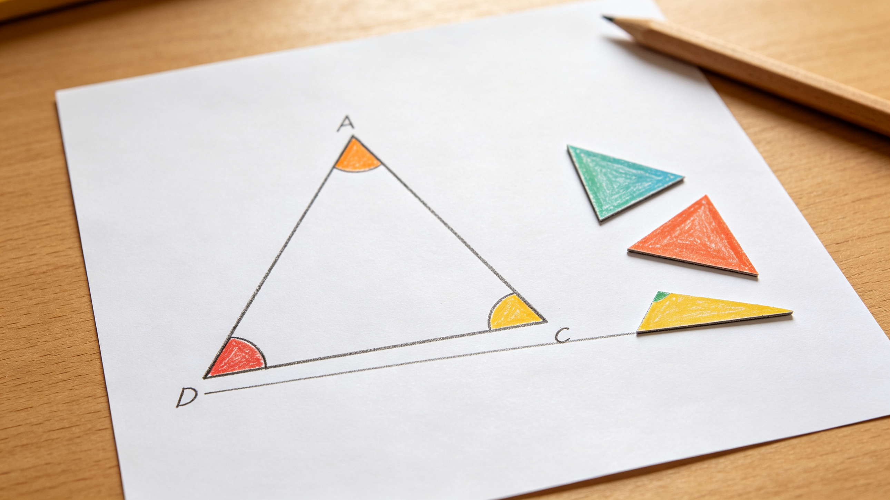
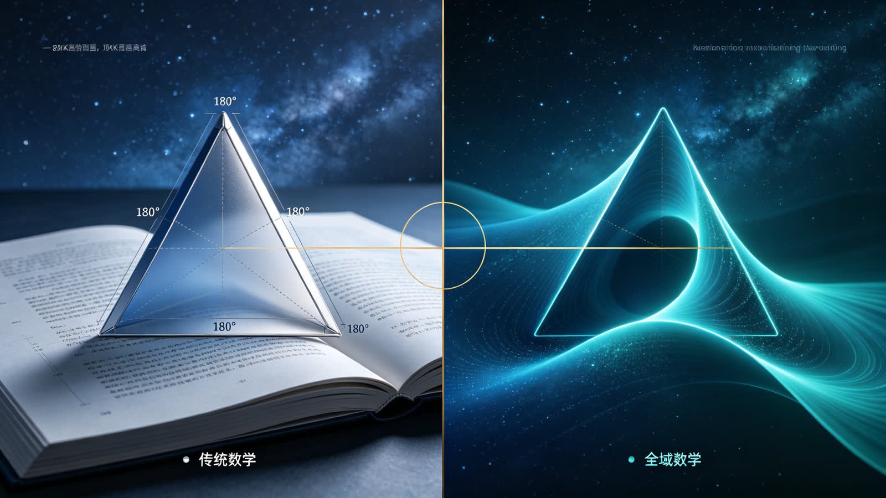
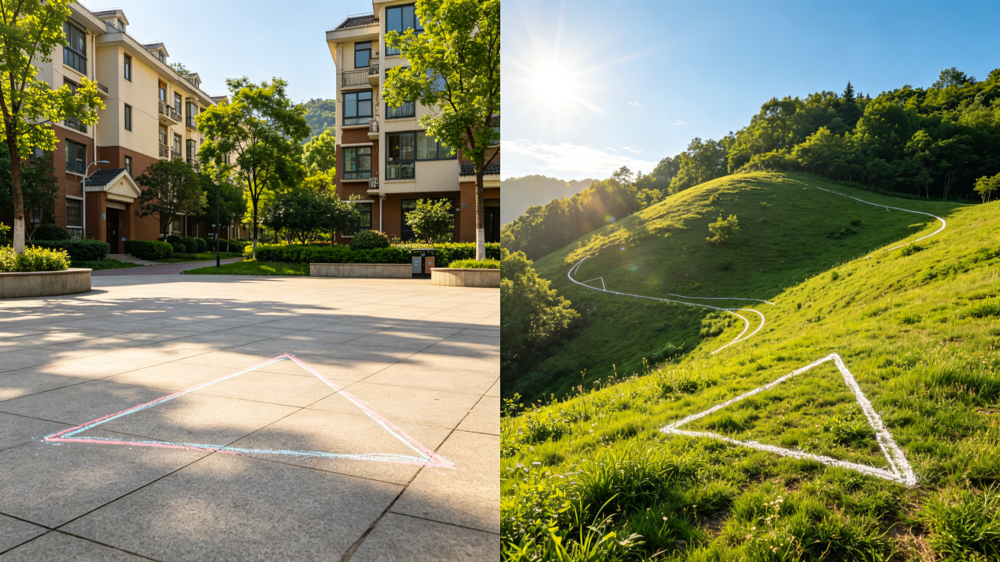

<ArchiveCopyPanel article-id="162141831" />

{"markdown":"PiDliIbnsbvvvJrmlofmmI7ov5vpmLYyMDDorrIgIAo+IOe8luWPt++8mmAxNjIxNDE4MzFgICAKPiDljp/lp4vmlofku7bvvJpg5LiJ6KeS5b2i5YaF6KeS5ZKM5LiN5rC46L+c5pivMTgw5bmz5Zyw5Y+q5piv5LiA5bCP54mH5aSp5ZywLeWFqOWfn+aVsOWtpnZz5Lyg57uf5pWw5a2m5Lq657G75paH5piO6L+b6Zi2MjAw6K6y56ysNuiusi0xNjIxNDE4MzEubWRgICAKPiDov5Tlm57vvJpb5pys5Lmm5b2S5qGjXSgvemgvYm9va3MvY291cnNlL2FydGljbGVzLykgwrcgW+aAu+WFpeWPo10oL3poL2Jvb2tzL2FydGljbGVzLykKCiMjIOOAiuWFqOWfn+aVsOWtpnZz5Lyg57uf5pWw5a2m77ya5Lq657G75paH5piO6L+b6Zi2MjAw6K6y44CL56ysNuiusiDlsI/lrabpgJrkv5fniYjpgJDlrZfnqL8KCiFb56ysNuiusuWwgemdou+8muS4ieinkuW9ouWGheinkuS4juepuumXtOWHoOS9lV0oLi9hc3NldHMvY3NkbmltZy9qcGcvNTZkN2RkZTRmZjA2YTc4Yy5qcGcpCgrkvZzogIXvvJrkuZbkuZbmlbDlraYKCuiusuasoe+8muesrDborrIKCuS4u+mimO+8muS4ieinkuW9ouWGheinkuWSjOS4jeawuOi/nOaYrzE4MOKImDE4MF5cY2lyYzE4MOKImO+8jOW5s+WcsOWPquaYr+S4gOWwj+eJh+WkqeWcsAoK5a+55qCH6K++5pys55+l6K+G54K577ya5LiJ6KeS5b2i5YaF6KeS5ZKMCgrpo47moLzvvJrlpKfnmb3or53jgIHnlJ/mtLvljJbmr5TllrvvvIzml6DlpI3mnYLmnK/or63vvIzlu7bnu63lj4zlsbHot6/orr7lrpoKCi0tLQoKIyMjIDDvvZ4z5YiG6ZKfIOWkjeS5oOWvvOWFpQoKIVvmlbDlrZfnmoTkuKTmnaHnlJ/plb/lsbHot69dKC4vYXNzZXRzL2NzZG5pbWcvanBnLzQ0YzQzYzVhMTNiZGM4YWQuanBnKQoK5ZCM5a2m5Lus77yM5YmN5Yeg6IqC6K++5oiR5Lus5LiA55u05Zyo6IGK5pWw5a2X55qE5Lik5p2h55Sf6ZW/5bGx6Lev77yM55+l6YGT5LqG5YiG5pWw44CB5bCP5pWw6YO95piv5Lik5p2h6Lev6ZW/55+t6YWN5q+U5Y+Y5Ye65p2l55qE44CCCgrov5noioLor77miJHku6zmjaLkuKror53popjvvIzor7Tor7Tlh6DkvZXph4zmnIDluLjop4HnmoTkuInop5LlvaLjgIIKCuWtpuagoeiAgeW4iOmDveS8muWRiuivieWkp+Wutu+8mumaj+S+v+eUu+S4gOS4quS4ieinkuW9ou+8jOS4ieS4quinkuWKoOi1t+adpeS4gOWumuetieS6jjE4MDE4MDE4MOW6pu+8jOi/meaYr+WbuuWumuS4jeWPmOeahOWumueQhuOAggoK5LuK5aSp5ZKx5Lus5bCx5ouT5bGV55y855WM77ya5Y+q5pyJ5Zyo5bmz5bmz55qE5qGM6Z2i5LiK55S75LiJ6KeS5b2i77yM5omN5ruh6LazMTgwMTgwMTgw5bqm77yb5aaC5p6c5Zyw6Z2i5piv5byv5puy55qE77yM6L+Z5Liq6KeE5b6L5bCx5LiN5oiQ56uL5LqG44CCCgotLS0KCiMjIyAz772eMTPliIbpkp8g566A5Y2V57G75q+U6K6y6KejCgohW+W5s+mdouS4ieinkuW9ouWGheinkuWSjOekuuaEj10oLi9hc3NldHMvY3NkbmltZy9qcGcvMDhmMzE5MmIyYTUxMWIxMS5qcGcpCgrlkrHku6zmi7/nmq7nkIPkuL7kvovlrZDvvIzmiYDmnInkurrpg73op4Hov4fnr67nkIPjgIHotrPnkIPjgIIKCuesrOS4gOenjeaDheWGte+8muWcqOW5s+aVtOeahOeZvee6uOS4iumdoueUu+S4ieinkuW9ou+8jOe6uOWujOWFqOS4jeW8r++8jOS4ieS4quinkuaLvOWcqOS4gOi1t+WImuWlveaYr+S4gOadoeW5s+ebtOe6v++8jOS5n+WwseaYrzE4MOKImDE4MF5cY2lyYzE4MOKImO+8jOi/meWwseaYr+ivvuacrOaVmeaIkeS7rOeahOaDheWGteOAggoKIVvnkIPpnaLkuInop5LlvaLlhoXop5LlkoznpLrmhI9dKC4vYXNzZXRzL2NzZG5pbWcvanBnLzEyNTE0YTViZjc4NTk1YzguanBnKQoK56ys5LqM56eN5oOF5Ya177ya5Zyo55qu55CD6KGo6Z2i55S75LiA5Liq5aSn5aSn55qE5LiJ6KeS5b2i77yM55qu55CD5piv6byT6LW35p2l5byv5puy55qE55CD6Z2i44CCCgrkvaDmiorkuInkuKrop5LliarkuIvmnaXmi7zlnKjkuIDotbfvvIzkvJrlj5HnjrDkuInkuKrop5LliqDotbfmnaXvvIzov5zov5zlpKfkuo4xODDiiJgxODBeXGNpcmMxODDiiJjjgIIKCuivvuacrOWPquaLv+W5s+aVtOeZvee6uOS4vuS+i++8jOWPquaVmeW5s+WdpuepuumXtOeahOinhOWIme+8jOWNtOayoeWRiuivieWwj+aci+WPi++8jOS4lueVjOS4jeWPquacieW5s+W5s+eahOW5s+mdouOAggoK5bCx5YOP5LmL5YmN55qE5Yqg5rOV5Lqk5o2i5b6L44CB5Lmd5Lmd5LmY5rOV6KGo77yM6K++5pys5pWZ55qE6YO95piv5bmz5Z2m44CB566A5Y2V55qE54m55L6L77yM5LiN5piv5YWo5LiW55WM6YCa55So55qE5YWo6YOo6KeE5YiZ44CCCgotLS0KCiMjIyAxM++9njIy5YiG6ZKfIOivvuacrOingueCuSB2cyDlhajln5/mlbDlrabpgJrkv5fop4LngrkKCiFb5Lyg57uf5pWw5a2mIHZzIOWFqOWfn+aVsOWtpuWvueavlF0oLi9hc3NldHMvY3NkbmltZy9qcGcvZWI1Zjg1Y2VhZTU4NjRjYi5qcGcpCgojIyMjIOS8oOe7n+ivvuacrOiupOefpQoKLSAKCuaJgOacieS4ieinkuW9ouWGheinkuWSjOWbuuWumjE4MOKImDE4MF5cY2lyYzE4MOKImO+8jOawuOi/nOS4jeS8muaUueWPmAoKLSAKCuS4lueVjOaJgOacieWcsOaWuemDveaYr+W5s+aVtOW5s+mdou+8jOWbvuW9ouinhOWImee7n+S4gAoKLSAKCuinkuW6puWkp+Wwj+WPquaYr+S6uuS4uua1i+mHj+WHuuadpeeahOaVsOWAvAoKIyMjIyDlhajln5/mlbDlrabpgJrkv5forqTnn6UKCi0gCgoxODDiiJgxODBeXGNpcmMxODDiiJjlj6rmmK/lubPlnablubPpnaLkuJPlsZ7nibnkvovvvIzmm7LpnaLjgIHlvKflvaLpnaLkuIrnmoTkuInop5LlvaLlhoXop5LlkozkvJrlj5jlpKfmiJblj5jlsI8KCi0gCgrnqbrpl7TmnInlubPmnInlvK/vvIzkuI3lkIzlvaLnirbnmoTnqbrpl7TvvIzlm77lvaLoh6rluKbkuI3kuIDmoLfnmoTop4TlvosKCi0gCgrop5LluqbmmK/nqbrpl7TlvK/mm7LnqIvluqbluKbmnaXnmoTlpKnnhLbnibnlvoHvvIzkuI3mmK/kurrkuLrop4TlrpoKCiFb5bmz5Zyw5bm/5Zy6IHZzIOWxseWdoeeQg+mdol0oLi9hc3NldHMvY3NkbmltZy9qcGcvZGZlYzczNmEwMWQ3NmJkNC5qcGcpCgrnroDljZXmr5TllrvvvJoKCuW5s+WcsOWlveavlOWwj+WMuuW5s+WdpuW5v+Wcuu+8jOeQg+mdouWDj+WxseWdoeOAgeearueQg+ihqOmdouOAggoK5ZCM5qC35piv5LiJ6KeS5b2i77yM5pS+5Zyo5bmz5Zyw5ZKM5bGx5Z2h5LiK77yM5qih5qC344CB6KeS5bqm5oC75ZKM5a6M5YWo5LiN5LiA5qC377yM5LiN6IO95LiA5qaC6ICM6K6644CCCgotLS0KCiMjIyAyMu+9njI35YiG6ZKfIOagoeWGheWtpuS5oOaPkOmGku+8jOS4jeW9seWTjeiAg+ivleW+l+WIhgoK5aSn5a625LiK6K++5YGa6aKY44CB5Y2V5YWD5rWL6K+V77yM5Y235a2Q5LiK5omA5pyJ5Zu+5b2i6buY6K6k6YO95piv55S75Zyo5bmz5pW057q45LiK55qE77yM55u05o6l55So5YaF6KeS5ZKMMTgw4oiYMTgwXlxjaXJjMTgw4oiY6K6h566X5a6M5YWo5rKh6Zeu6aKY77yM5LiN5Lya5omj5YiG44CCCgrmiJHku6zov5noioLor77lj6rmmK/lpJrkuobop6PkuIDlsYLnnJ/lrp7kuJbnlYzvvJrlubPlnablj6rmmK/kuIDlsI/pg6jliIbvvIzov5jmnInlvojlpJrlvK/mm7LnmoTnqbrpl7TvvIzlm77lvaLop4TliJnkvJrlj5HnlJ/lj5jljJbjgIIKCuS8j+eslOmTuuWeq++8muesrDI16K6y5bCP5a2m5q+V5Lia6K++77yM5rGH5oC75YmNMjTorrLlhajpg6jnn6Xor4bngrnvvIzlrozmlbTorrLop6PmlbDlrZflj4zonrrml4vnlJ/plb/mnKzmupDjgIIKCi0tLQoKIyMjIDI3772eMzDliIbpkp8g6K++5aCC5oC757uTK+S4i+iKguivvumihOWRigoKIVvonrrml4vkuIrljYfnu5PlsL7nlLvpnaJdKC4vYXNzZXRzL2NzZG5pbWcvanBnLzc0YmQxYTg1NTUwY2Q4MjcuanBnKQoKIyMjIyDmnKzoioLor77lsI/nu5PvvJoKCuS4ieinkuW9ouWGheinkuWSjDE4MOKImDE4MF5cY2lyYzE4MOKImOWPquaYr+W5s+mdoueJueS+i++8jOabsumdouepuumXtOmHjOeahOS4ieinkuW9ouS8muaJk+egtOi/meS4quinhOW+i+OAggoKIyMjIyDkuIvkuIDoioLor77vvJoKCuWchuW9oumdouenr+WFrOW8j+WPquaYr+eugOaYk+eul+azle+8jOWchueQg++8iOi2s+eQg++8ieaJjeaYr+S4h+eJqeWkqeeEtuW9ouaAgeOAggo=","text":"5YiG57G777ya5paH5piO6L+b6Zi2MjAw6K6yICAK57yW5Y+377yaMTYyMTQxODMxICAK5Y6f5aeL5paH5Lu277ya5LiJ6KeS5b2i5YaF6KeS5ZKM5LiN5rC46L+c5pivMTgw5bmz5Zyw5Y+q5piv5LiA5bCP54mH5aSp5ZywLeWFqOWfn+aVsOWtpnZz5Lyg57uf5pWw5a2m5Lq657G75paH5piO6L+b6Zi2MjAw6K6y56ysNuiusi0xNjIxNDE4MzEubWQgIArov5Tlm57vvJrmnKzkuablvZLmoaMgwrcg5oC75YWl5Y+jCgrjgIrlhajln5/mlbDlraZ2c+S8oOe7n+aVsOWtpu+8muS6uuexu+aWh+aYjui/m+mYtjIwMOiusuOAi+esrDborrIg5bCP5a2m6YCa5L+X54mI6YCQ5a2X56i/CgrnrKw26K6y5bCB6Z2i77ya5LiJ6KeS5b2i5YaF6KeS5LiO56m66Ze05Yeg5L2VCgrkvZzogIXvvJrkuZbkuZbmlbDlraYKCuiusuasoe+8muesrDborrIKCuS4u+mimO+8muS4ieinkuW9ouWGheinkuWSjOS4jeawuOi/nOaYrzE4MOKImDE4MF5cY2lyYzE4MOKImO+8jOW5s+WcsOWPquaYr+S4gOWwj+eJh+WkqeWcsAoK5a+55qCH6K++5pys55+l6K+G54K577ya5LiJ6KeS5b2i5YaF6KeS5ZKMCgrpo47moLzvvJrlpKfnmb3or53jgIHnlJ/mtLvljJbmr5TllrvvvIzml6DlpI3mnYLmnK/or63vvIzlu7bnu63lj4zlsbHot6/orr7lrpoKCi0tLQoKMO+9njPliIbpkp8g5aSN5Lmg5a+85YWlCgrmlbDlrZfnmoTkuKTmnaHnlJ/plb/lsbHot68KCuWQjOWtpuS7rO+8jOWJjeWHoOiKguivvuaIkeS7rOS4gOebtOWcqOiBiuaVsOWtl+eahOS4pOadoeeUn+mVv+Wxsei3r++8jOefpemBk+S6huWIhuaVsOOAgeWwj+aVsOmDveaYr+S4pOadoei3r+mVv+efremFjeavlOWPmOWHuuadpeeahOOAggoK6L+Z6IqC6K++5oiR5Lus5o2i5Liq6K+d6aKY77yM6K+06K+05Yeg5L2V6YeM5pyA5bi46KeB55qE5LiJ6KeS5b2i44CCCgrlrabmoKHogIHluIjpg73kvJrlkYror4nlpKflrrbvvJrpmo/kvr/nlLvkuIDkuKrkuInop5LlvaLvvIzkuInkuKrop5LliqDotbfmnaXkuIDlrprnrYnkuo4xODAxODAxODDluqbvvIzov5nmmK/lm7rlrprkuI3lj5jnmoTlrprnkIbjgIIKCuS7iuWkqeWSseS7rOWwseaLk+WxleecvOeVjO+8muWPquacieWcqOW5s+W5s+eahOahjOmdouS4iueUu+S4ieinkuW9ou+8jOaJjea7oei2szE4MDE4MDE4MOW6pu+8m+WmguaenOWcsOmdouaYr+W8r+absueahO+8jOi/meS4quinhOW+i+WwseS4jeaIkOeri+S6huOAggoKLS0tCgoz772eMTPliIbpkp8g566A5Y2V57G75q+U6K6y6KejCgrlubPpnaLkuInop5LlvaLlhoXop5LlkoznpLrmhI8KCuWSseS7rOaLv+earueQg+S4vuS+i+WtkO+8jOaJgOacieS6uumDveingei/h+evrueQg+OAgei2s+eQg+OAggoK56ys5LiA56eN5oOF5Ya177ya5Zyo5bmz5pW055qE55m957q45LiK6Z2i55S75LiJ6KeS5b2i77yM57q45a6M5YWo5LiN5byv77yM5LiJ5Liq6KeS5ou85Zyo5LiA6LW35Yia5aW95piv5LiA5p2h5bmz55u057q/77yM5Lmf5bCx5pivMTgw4oiYMTgwXlxjaXJjMTgw4oiY77yM6L+Z5bCx5piv6K++5pys5pWZ5oiR5Lus55qE5oOF5Ya144CCCgrnkIPpnaLkuInop5LlvaLlhoXop5LlkoznpLrmhI8KCuesrOS6jOenjeaDheWGte+8muWcqOearueQg+ihqOmdoueUu+S4gOS4quWkp+Wkp+eahOS4ieinkuW9ou+8jOearueQg+aYr+m8k+i1t+adpeW8r+absueahOeQg+mdouOAggoK5L2g5oqK5LiJ5Liq6KeS5Ymq5LiL5p2l5ou85Zyo5LiA6LW377yM5Lya5Y+R546w5LiJ5Liq6KeS5Yqg6LW35p2l77yM6L+c6L+c5aSn5LqOMTgw4oiYMTgwXlxjaXJjMTgw4oiY44CCCgror77mnKzlj6rmi7/lubPmlbTnmb3nurjkuL7kvovvvIzlj6rmlZnlubPlnabnqbrpl7TnmoTop4TliJnvvIzljbTmsqHlkYror4nlsI/mnIvlj4vvvIzkuJbnlYzkuI3lj6rmnInlubPlubPnmoTlubPpnaLjgIIKCuWwseWDj+S5i+WJjeeahOWKoOazleS6pOaNouW+i+OAgeS5neS5neS5mOazleihqO+8jOivvuacrOaVmeeahOmDveaYr+W5s+WdpuOAgeeugOWNleeahOeJueS+i++8jOS4jeaYr+WFqOS4lueVjOmAmueUqOeahOWFqOmDqOinhOWImeOAggoKLS0tCgoxM++9njIy5YiG6ZKfIOivvuacrOingueCuSB2cyDlhajln5/mlbDlrabpgJrkv5fop4LngrkKCuS8oOe7n+aVsOWtpiB2cyDlhajln5/mlbDlrablr7nmr5QKCuS8oOe7n+ivvuacrOiupOefpQrmiYDmnInkuInop5LlvaLlhoXop5Llkozlm7rlrpoxODDiiJgxODBeXGNpcmMxODDiiJjvvIzmsLjov5zkuI3kvJrmlLnlj5gK5LiW55WM5omA5pyJ5Zyw5pa56YO95piv5bmz5pW05bmz6Z2i77yM5Zu+5b2i6KeE5YiZ57uf5LiACuinkuW6puWkp+Wwj+WPquaYr+S6uuS4uua1i+mHj+WHuuadpeeahOaVsOWAvAoK5YWo5Z+f5pWw5a2m6YCa5L+X6K6k55+lCjE4MOKImDE4MF5cY2lyYzE4MOKImOWPquaYr+W5s+WdpuW5s+mdouS4k+WxnueJueS+i++8jOabsumdouOAgeW8p+W9oumdouS4iueahOS4ieinkuW9ouWGheinkuWSjOS8muWPmOWkp+aIluWPmOWwjwrnqbrpl7TmnInlubPmnInlvK/vvIzkuI3lkIzlvaLnirbnmoTnqbrpl7TvvIzlm77lvaLoh6rluKbkuI3kuIDmoLfnmoTop4TlvosK6KeS5bqm5piv56m66Ze05byv5puy56iL5bqm5bim5p2l55qE5aSp54S254m55b6B77yM5LiN5piv5Lq65Li66KeE5a6aCgrlubPlnLDlub/lnLogdnMg5bGx5Z2h55CD6Z2iCgrnroDljZXmr5TllrvvvJoKCuW5s+WcsOWlveavlOWwj+WMuuW5s+WdpuW5v+Wcuu+8jOeQg+mdouWDj+WxseWdoeOAgeearueQg+ihqOmdouOAggoK5ZCM5qC35piv5LiJ6KeS5b2i77yM5pS+5Zyo5bmz5Zyw5ZKM5bGx5Z2h5LiK77yM5qih5qC344CB6KeS5bqm5oC75ZKM5a6M5YWo5LiN5LiA5qC377yM5LiN6IO95LiA5qaC6ICM6K6644CCCgotLS0KCjIy772eMjfliIbpkp8g5qCh5YaF5a2m5Lmg5o+Q6YaS77yM5LiN5b2x5ZON6ICD6K+V5b6X5YiGCgrlpKflrrbkuIror77lgZrpopjjgIHljZXlhYPmtYvor5XvvIzljbflrZDkuIrmiYDmnInlm77lvaLpu5jorqTpg73mmK/nlLvlnKjlubPmlbTnurjkuIrnmoTvvIznm7TmjqXnlKjlhoXop5LlkowxODDiiJgxODBeXGNpcmMxODDiiJjorqHnrpflrozlhajmsqHpl67popjvvIzkuI3kvJrmiaPliIbjgIIKCuaIkeS7rOi/meiKguivvuWPquaYr+WkmuS6huino+S4gOWxguecn+WunuS4lueVjO+8muW5s+WdpuWPquaYr+S4gOWwj+mDqOWIhu+8jOi/mOacieW+iOWkmuW8r+absueahOepuumXtO+8jOWbvuW9ouinhOWImeS8muWPkeeUn+WPmOWMluOAggoK5LyP56yU6ZO65Z6r77ya56ysMjXorrLlsI/lrabmr5XkuJror77vvIzmsYfmgLvliY0yNOiusuWFqOmDqOefpeivhueCue+8jOWujOaVtOiusuino+aVsOWtl+WPjOieuuaXi+eUn+mVv+acrOa6kOOAggoKLS0tCgoyN++9njMw5YiG6ZKfIOivvuWgguaAu+e7kyvkuIvoioLor77pooTlkYoKCuieuuaXi+S4iuWNh+e7k+WwvueUu+mdogoK5pys6IqC6K++5bCP57uT77yaCgrkuInop5LlvaLlhoXop5LlkowxODDiiJgxODBeXGNpcmMxODDiiJjlj6rmmK/lubPpnaLnibnkvovvvIzmm7LpnaLnqbrpl7Tph4znmoTkuInop5LlvaLkvJrmiZPnoLTov5nkuKrop4TlvovjgIIKCuS4i+S4gOiKguivvu+8mgoK5ZyG5b2i6Z2i56ev5YWs5byP5Y+q5piv566A5piT566X5rOV77yM5ZyG55CD77yI6Laz55CD77yJ5omN5piv5LiH54mp5aSp54S25b2i5oCB44CC"}

> 分类：文明进阶200讲  
> 编号：`162141831`  
> 原始文件：`三角形内角和不永远是180平地只是一小片天地-全域数学vs传统数学人类文明进阶200讲第6讲-162141831.md`  
> 返回：[本书归档](/zh/books/course/articles/) · [总入口](/zh/books/articles/)

<ArticlePaperMeta category="文明进阶200讲" article-id="162141831" title="三角形内角和不永远是180平地只是一小片天地-全域数学vs传统数学人类文明进阶200讲第6讲" paper-kind="课程讲义" book-route="/zh/books/course/articles/" overview-route="/zh/books/articles/" summary="风格：大白话、生活化比喻，无复杂术语，延续双山路设定" author="乖乖数学" lecture="第6讲" theme="三角形内角和不永远是180∘180^\circ180∘，平地只是一小片天地" source-file="三角形内角和不永远是180平地只是一小片天地-全域数学vs传统数学人类文明进阶200讲第6讲-162141831.md" cover="./assets/csdnimg/jpg/56d7dde4ff06a78c.jpg" />

## 《全域数学vs传统数学：人类文明进阶200讲》第6讲 小学通俗版逐字稿

作者：乖乖数学

讲次：第6讲

主题：三角形内角和不永远是180∘180^\circ180∘，平地只是一小片天地

对标课本知识点：三角形内角和

风格：大白话、生活化比喻，无复杂术语，延续双山路设定

---

### 0～3分钟 复习导入

同学们，前几节课我们一直在聊数字的两条生长山路，知道了分数、小数都是两条路长短配比变出来的。

这节课我们换个话题，说说几何里最常见的三角形。

学校老师都会告诉大家：随便画一个三角形，三个角加起来一定等于180180180度，这是固定不变的定理。

今天咱们就拓展眼界：只有在平平的桌面上画三角形，才满足180180180度；如果地面是弯曲的，这个规律就不成立了。

---

### 3～13分钟 简单类比讲解

咱们拿皮球举例子，所有人都见过篮球、足球。

第一种情况：在平整的白纸上面画三角形，纸完全不弯，三个角拼在一起刚好是一条平直线，也就是180∘180^\circ180∘，这就是课本教我们的情况。

第二种情况：在皮球表面画一个大大的三角形，皮球是鼓起来弯曲的球面。

你把三个角剪下来拼在一起，会发现三个角加起来，远远大于180∘180^\circ180∘。

课本只拿平整白纸举例，只教平坦空间的规则，却没告诉小朋友，世界不只有平平的平面。

就像之前的加法交换律、九九乘法表，课本教的都是平坦、简单的特例，不是全世界通用的全部规则。

---

### 13～22分钟 课本观点 vs 全域数学通俗观点

#### 传统课本认知

- 

所有三角形内角和固定180∘180^\circ180∘，永远不会改变

- 

世界所有地方都是平整平面，图形规则统一

- 

角度大小只是人为测量出来的数值

#### 全域数学通俗认知

- 

180∘180^\circ180∘只是平坦平面专属特例，曲面、弧形面上的三角形内角和会变大或变小

- 

空间有平有弯，不同形状的空间，图形自带不一样的规律

- 

角度是空间弯曲程度带来的天然特征，不是人为规定

简单比喻：

平地好比小区平坦广场，球面像山坡、皮球表面。

同样是三角形，放在平地和山坡上，模样、角度总和完全不一样，不能一概而论。

---

### 22～27分钟 校内学习提醒，不影响考试得分

大家上课做题、单元测试，卷子上所有图形默认都是画在平整纸上的，直接用内角和180∘180^\circ180∘计算完全没问题，不会扣分。

我们这节课只是多了解一层真实世界：平坦只是一小部分，还有很多弯曲的空间，图形规则会发生变化。

伏笔铺垫：第25讲小学毕业课，汇总前24讲全部知识点，完整讲解数字双螺旋生长本源。

---

### 27～30分钟 课堂总结+下节课预告

#### 本节课小结：

三角形内角和180∘180^\circ180∘只是平面特例，曲面空间里的三角形会打破这个规律。

#### 下一节课：

圆形面积公式只是简易算法，圆球（足球）才是万物天然形态。
