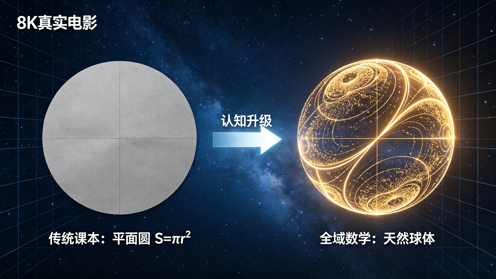
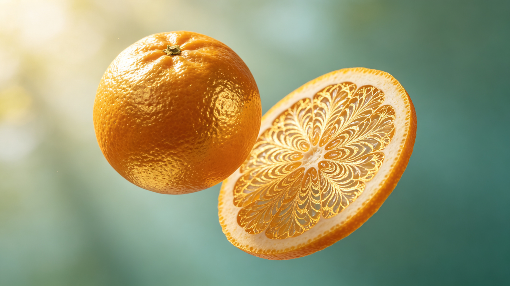
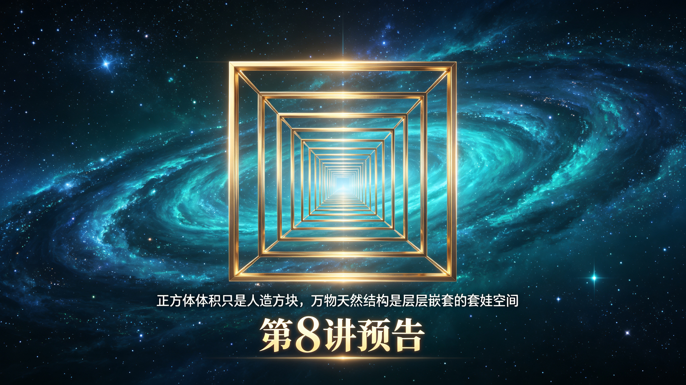

<ArchiveCopyPanel article-id="162141855" />

{"markdown":"PiDliIbnsbvvvJrmlofmmI7ov5vpmLYyMDDorrIgIAo+IOe8luWPt++8mmAxNjIxNDE4NTVgICAKPiDljp/lp4vmlofku7bvvJpg5ZyG6Z2i56ev5YWs5byP5Y+q5piv57q46Z2i566A5YyW566X5rOV55CD5b2i5omN5piv5LiH54mp5aSp54S25b2i5oCBLeWFqOWfn+aVsOWtpnZz5Lyg57uf5pWw5a2m5Lq657G75paH5piO6L+b6Zi2MjAw6K6y56ysN+iusi0xNjIxNDE4NTUubWRgICAKPiDov5Tlm57vvJpb5pys5Lmm5b2S5qGjXSgvemgvYm9va3MvY291cnNlL2FydGljbGVzLykgwrcgW+aAu+WFpeWPo10oL3poL2Jvb2tzL2FydGljbGVzLykKCiFb56ysN+iusiDnkIPlvaLmiY3mmK/kuIfnianlpKnnhLblvaLmgIFdKGh0dHBzOi8vaS1ibG9nLmNzZG5pbWcuY24vaW1nX2NvbnZlcnQvZDJjNmU1YzUyY2FjM2ZmMzFjOTc3ODllYzJhMzY5NzMuanBlZykKCiMjIOOAiuWFqOWfn+aVsOWtpnZz5Lyg57uf5pWw5a2m77ya5Lq657G75paH5piO6L+b6Zi2MjAw6K6y44CL56ysN+iusiDlsI/lrabpgJrkv5fniYjpgJDlrZfnqL8KCuS9nOiAhe+8miDkuZbkuZbmlbDlraYKCuiusuasoe+8miDnrKw36K6yCgrkuLvpopjvvJog5ZyG6Z2i56ev5YWs5byP5Y+q5piv57q46Z2i566A5YyW566X5rOV77yM55CD5b2i5omN5piv5LiH54mp5aSp54S25b2i5oCBCgrlr7nmoIfor77mnKznn6Xor4bngrnvvJog5ZyG55qE6Z2i56ev6K6h566XCgrmlofpo47vvJog5aSn55m96K+d44CB55Sf5rS75YyW5q+U5Za777yM5peg5pmm5rap5LiT5Lia6K+N77yM5bu257ut5pWw5a2X5Y+M5bGx6Lev44CB5puy6Z2i56m66Ze06K6+5a6aCgotLS0KCiMjIyAw772eM+WIhumSnyDlpI3kuaDlr7zlhaUKCiFb5puy6Z2i56m66Ze05LiO5pWw5a2X5Y+M6J665peL5bGx6LevXShodHRwczovL2ktYmxvZy5jc2RuaW1nLmNuL2ltZ19jb252ZXJ0Lzc1OTExNzUwNTJiNTg2MGMzOTI3ZDZjYjFhODI2Y2FjLmpwZWcpCgrlkIzlrabku6zvvIzkuIrkuIDoioLor77miJHku6znn6XpgZPvvIzkuInop5LlvaLlhoXop5LlkowxODDluqblj6rpgILnlKjkuo7lubPmlbTnurjpnaLvvIzmlL7liLDlvK/mm7LnmoTnkIPpnaLlsLHkuI3miJDnq4vjgIIKCui/meiKguivvuWSseS7rOiBiuivvuacrOmHjOeahOWchuW9ouOAguaVsOWtpuivvuS4iuiAgeW4iOS8muaVmeaIkeS7rOWchueahOmdouenr+WFrOW8j++8jOaKiuWchuWIh+aIkOaXoOaVsOWwj+S4ieinkuaLvOaIkOmVv+aWueW9ouadpeiuoeeul+OAggoK5LuK5aSp5oiR5Lus5o2i5Liq6KeG6KeS77ya6K++5pys55qE5ZyG5b2i5Y+q5piv5omB5bmz57q454mH77yM5aSn6Ieq54S26YeM5aSp54S26ZW/5oiQ55qE5YWo5piv5ZyG55CD77yM57q454mH5ZyG5Y+q5piv5ZyG55CD5YiH5LiL5p2l55qE5LiA5bCP54mH5aSW55qu44CCCgotLS0KCiMjIyAz772eMTPliIbpkp8g55Sf5rS75YyW57G75q+U6K6y6KejCgohW+Wkp+iHqueEtuS4reeahOeQg+S9k+W9ouaAgV0oaHR0cHM6Ly9pLWJsb2cuY3NkbmltZy5jbi9pbWdfY29udmVydC81MzUxOWVjMzM0OGEzMTYyMzBlMTQxNWRjYWEzMGIwNi5qcGVnKQoK5aSn5a625bmz5pe2546p55qE6Laz55CD44CB5LmS5LmT55CD44CB5qmY5a2Q44CB5pif55CD77yM5YWo5piv5ZyG5ZyG55qE55CD5L2T77yM5rKh5pyJ5aSp54S25omB5bmz55qE5ZyG54mH44CCCgror77mnKzkuLrkuobmlrnkvr/lsI/mnIvlj4vorqHnrpfvvIzmiornkIPkvZPliIfkuIvoloToloTkuIDlsYLvvIzljovlubPlj5jmiJDnurjniYflnIbvvIzlho3mi4bliIbmi7zlh5Hmjqjlr7zpnaLnp6/lhazlvI/jgIIKCuS4vuS4quS+i+WtkO+8mgoK5YWo5Z+f6YCa5L+X6Kej6K+777yaIOaJgeW5s+WchuWPquaYr+eQg+S9k+eahOWxgOmDqOWIh+eJh++8jOecn+WunuWkqeeEtueJqeS9k+aYr+eri+S9k+WchueQg++8m+e6uOeJh+WchueahOiuoeeul+WFrOW8j++8jOWPquiDveeul+i/meeJhyLlpJbnmq4i55qE5aSn5bCP77yM5rKh5rOV5a6M5pW05o+P6L+w5pW05Liq55CD5L2T44CCCgrlsLHlg4/miJHku6zkuYvliY3lrabnmoTkuZ3kuZ3kuZjms5XooajjgIHliqDms5XkuqTmjaLlvovvvIzpg73mmK/miKrlj5blsYDpg6jjgIHnroDljJblkI7nmoTlt6XlhbfvvIzkuI3mmK/kuovnianlrozmlbTmnKzmnaXmqKHmoLfjgIIKCi0tLQoKIyMjIDEz772eMjLliIbpkp8g6K++5pys6KeC54K5dnPlhajln5/mlbDlrabop4Lngrnlr7nmr5QKCiFb5Lyg57uf6K++5pysdnPlhajln5/mlbDlrablr7nmr5RdKGh0dHBzOi8vaS1ibG9nLmNzZG5pbWcuY24vaW1nX2NvbnZlcnQvOTI0MGVkNWRlOTQzYzk4MDEwNTRlMzE0ODAxNmRjZmQuanBlZykKCiMjIyMg5Lyg57uf6K++5pys6K6k55+lCgotIAoKLSAKCuW5s+mdouWchuW9ouaYr+WfuuehgOWbvuW9ou+8jOeQg+S9k+WPquaYr+WchuaLieS8uOWHuuadpeeahOeri+S9k+WbvuW9ogoKLSAKCuWFiOacieW5s+mdouWchu+8jOWQjuacieWchueQgwoKIyMjIyDlhajln5/mlbDlrabpgJrkv5forqTnn6UKCi0gCgrlpKfoh6rnhLbljp/nlJ/lvaLmgIHmmK/nkIPkvZPvvIzmiYHlubPlnIblj6rmmK/nkIPkvZPooajpnaLnmoTkuIDlsI/lnZfliIfniYcKCi0gCgrlnIbpnaLnp6/lhazlvI/lj6rpgILphY3lubPpnaLoloTniYfvvIzkuI3og73lrozmlbTooajovr7nq4vkvZPnkIPlvaLnmoTlhajpg6jnibnlvoEKCi0gCgrkuIfniannlJ/plb/kvJjlhYjplb/miJDnkIPlvaLvvIzlubPpnaLlm77lvaLmmK/kurrkuLrnroDljJbliqDlt6Xlh7rmnaXnmoQKCiFb5qmY5a2Q5LiO5qmY5a2Q55qu55qE5q+U5Za7XShodHRwczovL2ktYmxvZy5jc2RuaW1nLmNuL2ltZ19jb252ZXJ0L2U1YTllZmE4NjkwYmFmMDFlZmFkNTMxMDBkMDhiOTQzLmpwZWcpCgrnroDljZXmr5TllrvvvJoKCuapmOWtkOacrOi6q+aYr+WchueQg++8jOS9oOWJpeS4gOWdl+apmOWtkOearuWOi+W5s++8jOi/meWdl+earuWwseaYr+ivvuacrOmHjOeahOWchu+8m+S4jeiDveaLv+S4gOWdl+apmOearu+8jOS7o+ihqOaVtOS4quapmOWtkOOAggoKLS0tCgojIyMgMjLvvZ4yN+WIhumSnyDmoKHlhoXlrabkuaDmj5DphpLvvIzkuI3lvbHlk43ogIPor5UKCuW5s+aXtuaVsOWtpuS9nOS4muOAgeiAg+ivle+8jOmimOebrumHjOWHuueOsOeahOWchumDveaYr+W5s+mdouWbvuW9ou+8jOebtOaOpeWll+eUqOWchumdouenr+WFrOW8j+iuoeeul+WujOWFqOato+ehru+8jOS4jeS8muaJo+WIhuOAggoK5ZKx5Lus6L+Z6IqC6K++5Y+q5piv5ouT5bGV6K6k55+l77ya6K++5pys5Y+q5pWZ5YiH54mH566A5YyW5qih5Z6L77yM5aSn6Ieq54S255yf5a6e5a2Y5Zyo55qE5Z+656GA5b2i5oCB5piv55CD5L2T44CCCgrkvI/nrJTpk7rlnqvvvJog56ysMjXorrLlsI/lrabmr5XkuJrkuJPlnLrvvIzmlbTlkIjliY0yNOiusuWFqOmDqOWGheWuue+8jOWujOaVtOaLhuino+aVsOWtl+WPjOieuuaXi+eUn+mVv+W6leWxgumAu+i+keOAggoKLS0tCgojIyMgMjfvvZ4zMOWIhumSnyDor77loILmgLvnu5Mr5LiL6IqC6K++6aKE5ZGKCgohW+esrDjorrLpooTlkYog5bGC5bGC5bWM5aWX5aWX5aiD56m66Ze0XShodHRwczovL2ktYmxvZy5jc2RuaW1nLmNuL2ltZ19jb252ZXJ0L2Q4YWU1NzU3NDhkNWQ1YjMzY2QyMjIzNDY0NTg1OTg4LmpwZWcpCgojIyMjIOacrOiKguivvuWwj+e7k++8mgoK5bmz6Z2i5ZyG5piv55CD5L2T55qE5YiH54mH566A5YyW5b2i5oCB77yM6K++5pys5ZyG6Z2i56ev5YWs5byP5LuF6YCC55So5LqO5bmz5pW06JaE54mH44CCCgojIyMjIOS4i+S4gOiKguivvu+8mgoK5q2j5pa55L2T5L2T56ev5Y+q5piv5Lq66YCg5pa55Z2X77yM5LiH54mp5aSp54S257uT5p6E5piv5bGC5bGC5bWM5aWX55qE5aWX5aiD56m66Ze044CCCg==","text":"5YiG57G777ya5paH5piO6L+b6Zi2MjAw6K6yICAK57yW5Y+377yaMTYyMTQxODU1ICAK5Y6f5aeL5paH5Lu277ya5ZyG6Z2i56ev5YWs5byP5Y+q5piv57q46Z2i566A5YyW566X5rOV55CD5b2i5omN5piv5LiH54mp5aSp54S25b2i5oCBLeWFqOWfn+aVsOWtpnZz5Lyg57uf5pWw5a2m5Lq657G75paH5piO6L+b6Zi2MjAw6K6y56ysN+iusi0xNjIxNDE4NTUubWQgIArov5Tlm57vvJrmnKzkuablvZLmoaMgwrcg5oC75YWl5Y+jCgrnrKw36K6yIOeQg+W9ouaJjeaYr+S4h+eJqeWkqeeEtuW9ouaAgQoK44CK5YWo5Z+f5pWw5a2mdnPkvKDnu5/mlbDlrabvvJrkurrnsbvmlofmmI7ov5vpmLYyMDDorrLjgIvnrKw36K6yIOWwj+WtpumAmuS/l+eJiOmAkOWtl+eovwoK5L2c6ICF77yaIOS5luS5luaVsOWtpgoK6K6y5qyh77yaIOesrDforrIKCuS4u+mimO+8miDlnIbpnaLnp6/lhazlvI/lj6rmmK/nurjpnaLnroDljJbnrpfms5XvvIznkIPlvaLmiY3mmK/kuIfnianlpKnnhLblvaLmgIEKCuWvueagh+ivvuacrOefpeivhueCue+8miDlnIbnmoTpnaLnp6/orqHnrpcKCuaWh+mjju+8miDlpKfnmb3or53jgIHnlJ/mtLvljJbmr5TllrvvvIzml6DmmabmtqnkuJPkuJror43vvIzlu7bnu63mlbDlrZflj4zlsbHot6/jgIHmm7LpnaLnqbrpl7Torr7lrpoKCi0tLQoKMO+9njPliIbpkp8g5aSN5Lmg5a+85YWlCgrmm7LpnaLnqbrpl7TkuI7mlbDlrZflj4zonrrml4vlsbHot68KCuWQjOWtpuS7rO+8jOS4iuS4gOiKguivvuaIkeS7rOefpemBk++8jOS4ieinkuW9ouWGheinkuWSjDE4MOW6puWPqumAgueUqOS6juW5s+aVtOe6uOmdou+8jOaUvuWIsOW8r+absueahOeQg+mdouWwseS4jeaIkOeri+OAggoK6L+Z6IqC6K++5ZKx5Lus6IGK6K++5pys6YeM55qE5ZyG5b2i44CC5pWw5a2m6K++5LiK6ICB5biI5Lya5pWZ5oiR5Lus5ZyG55qE6Z2i56ev5YWs5byP77yM5oqK5ZyG5YiH5oiQ5peg5pWw5bCP5LiJ6KeS5ou85oiQ6ZW/5pa55b2i5p2l6K6h566X44CCCgrku4rlpKnmiJHku6zmjaLkuKrop4bop5LvvJror77mnKznmoTlnIblvaLlj6rmmK/miYHlubPnurjniYfvvIzlpKfoh6rnhLbph4zlpKnnhLbplb/miJDnmoTlhajmmK/lnIbnkIPvvIznurjniYflnIblj6rmmK/lnIbnkIPliIfkuIvmnaXnmoTkuIDlsI/niYflpJbnmq7jgIIKCi0tLQoKM++9njEz5YiG6ZKfIOeUn+a0u+WMluexu+avlOiusuinowoK5aSn6Ieq54S25Lit55qE55CD5L2T5b2i5oCBCgrlpKflrrblubPml7bnjqnnmoTotrPnkIPjgIHkuZLkuZPnkIPjgIHmqZjlrZDjgIHmmJ/nkIPvvIzlhajmmK/lnIblnIbnmoTnkIPkvZPvvIzmsqHmnInlpKnnhLbmiYHlubPnmoTlnIbniYfjgIIKCuivvuacrOS4uuS6huaWueS+v+Wwj+aci+WPi+iuoeeul++8jOaKiueQg+S9k+WIh+S4i+iWhOiWhOS4gOWxgu+8jOWOi+W5s+WPmOaIkOe6uOeJh+Wchu+8jOWGjeaLhuWIhuaLvOWHkeaOqOWvvOmdouenr+WFrOW8j+OAggoK5Li+5Liq5L6L5a2Q77yaCgrlhajln5/pgJrkv5fop6Por7vvvJog5omB5bmz5ZyG5Y+q5piv55CD5L2T55qE5bGA6YOo5YiH54mH77yM55yf5a6e5aSp54S254mp5L2T5piv56uL5L2T5ZyG55CD77yb57q454mH5ZyG55qE6K6h566X5YWs5byP77yM5Y+q6IO9566X6L+Z54mHIuWklueariLnmoTlpKflsI/vvIzmsqHms5XlrozmlbTmj4/ov7DmlbTkuKrnkIPkvZPjgIIKCuWwseWDj+aIkeS7rOS5i+WJjeWtpueahOS5neS5neS5mOazleihqOOAgeWKoOazleS6pOaNouW+i++8jOmDveaYr+aIquWPluWxgOmDqOOAgeeugOWMluWQjueahOW3peWFt++8jOS4jeaYr+S6i+eJqeWujOaVtOacrOadpeaooeagt+OAggoKLS0tCgoxM++9njIy5YiG6ZKfIOivvuacrOingueCuXZz5YWo5Z+f5pWw5a2m6KeC54K55a+55q+UCgrkvKDnu5/or77mnKx2c+WFqOWfn+aVsOWtpuWvueavlAoK5Lyg57uf6K++5pys6K6k55+lCuW5s+mdouWchuW9ouaYr+WfuuehgOWbvuW9ou+8jOeQg+S9k+WPquaYr+WchuaLieS8uOWHuuadpeeahOeri+S9k+WbvuW9ogrlhYjmnInlubPpnaLlnIbvvIzlkI7mnInlnIbnkIMKCuWFqOWfn+aVsOWtpumAmuS/l+iupOefpQrlpKfoh6rnhLbljp/nlJ/lvaLmgIHmmK/nkIPkvZPvvIzmiYHlubPlnIblj6rmmK/nkIPkvZPooajpnaLnmoTkuIDlsI/lnZfliIfniYcK5ZyG6Z2i56ev5YWs5byP5Y+q6YCC6YWN5bmz6Z2i6JaE54mH77yM5LiN6IO95a6M5pW06KGo6L6+56uL5L2T55CD5b2i55qE5YWo6YOo54m55b6BCuS4h+eJqeeUn+mVv+S8mOWFiOmVv+aIkOeQg+W9ou+8jOW5s+mdouWbvuW9ouaYr+S6uuS4uueugOWMluWKoOW3peWHuuadpeeahAoK5qmY5a2Q5LiO5qmY5a2Q55qu55qE5q+U5Za7CgrnroDljZXmr5TllrvvvJoKCuapmOWtkOacrOi6q+aYr+WchueQg++8jOS9oOWJpeS4gOWdl+apmOWtkOearuWOi+W5s++8jOi/meWdl+earuWwseaYr+ivvuacrOmHjOeahOWchu+8m+S4jeiDveaLv+S4gOWdl+apmOearu+8jOS7o+ihqOaVtOS4quapmOWtkOOAggoKLS0tCgoyMu+9njI35YiG6ZKfIOagoeWGheWtpuS5oOaPkOmGku+8jOS4jeW9seWTjeiAg+ivlQoK5bmz5pe25pWw5a2m5L2c5Lia44CB6ICD6K+V77yM6aKY55uu6YeM5Ye6546w55qE5ZyG6YO95piv5bmz6Z2i5Zu+5b2i77yM55u05o6l5aWX55So5ZyG6Z2i56ev5YWs5byP6K6h566X5a6M5YWo5q2j56Gu77yM5LiN5Lya5omj5YiG44CCCgrlkrHku6zov5noioLor77lj6rmmK/mi5PlsZXorqTnn6XvvJror77mnKzlj6rmlZnliIfniYfnroDljJbmqKHlnovvvIzlpKfoh6rnhLbnnJ/lrp7lrZjlnKjnmoTln7rnoYDlvaLmgIHmmK/nkIPkvZPjgIIKCuS8j+eslOmTuuWeq++8miDnrKwyNeiusuWwj+WtpuavleS4muS4k+Wcuu+8jOaVtOWQiOWJjTI06K6y5YWo6YOo5YaF5a6577yM5a6M5pW05ouG6Kej5pWw5a2X5Y+M6J665peL55Sf6ZW/5bqV5bGC6YC76L6R44CCCgotLS0KCjI3772eMzDliIbpkp8g6K++5aCC5oC757uTK+S4i+iKguivvumihOWRigoK56ysOOiusumihOWRiiDlsYLlsYLltYzlpZflpZflqIPnqbrpl7QKCuacrOiKguivvuWwj+e7k++8mgoK5bmz6Z2i5ZyG5piv55CD5L2T55qE5YiH54mH566A5YyW5b2i5oCB77yM6K++5pys5ZyG6Z2i56ev5YWs5byP5LuF6YCC55So5LqO5bmz5pW06JaE54mH44CCCgrkuIvkuIDoioLor77vvJoKCuato+aWueS9k+S9k+enr+WPquaYr+S6uumAoOaWueWdl++8jOS4h+eJqeWkqeeEtue7k+aehOaYr+WxguWxguW1jOWll+eahOWll+Wog+epuumXtOOAgg=="}

> 分类：文明进阶200讲  
> 编号：`162141855`  
> 原始文件：`圆面积公式只是纸面简化算法球形才是万物天然形态-全域数学vs传统数学人类文明进阶200讲第7讲-162141855.md`  
> 返回：[本书归档](/zh/books/course/articles/) · [总入口](/zh/books/articles/)

## 《全域数学vs传统数学：人类文明进阶200讲》第7讲 小学通俗版逐字稿

作者： 乖乖数学

讲次： 第7讲

主题： 圆面积公式只是纸面简化算法，球形才是万物天然形态

对标课本知识点： 圆的面积计算

文风： 大白话、生活化比喻，无晦涩专业词，延续数字双山路、曲面空间设定

---

### 0～3分钟 复习导入

同学们，上一节课我们知道，三角形内角和180度只适用于平整纸面，放到弯曲的球面就不成立。

这节课咱们聊课本里的圆形。数学课上老师会教我们圆的面积公式，把圆切成无数小三角拼成长方形来计算。

今天我们换个视角：课本的圆形只是扁平纸片，大自然里天然长成的全是圆球，纸片圆只是圆球切下来的一小片外皮。

---

### 3～13分钟 生活化类比讲解

大家平时玩的足球、乒乓球、橘子、星球，全是圆圆的球体，没有天然扁平的圆片。

课本为了方便小朋友计算，把球体切下薄薄一层，压平变成纸片圆，再拆分拼凑推导面积公式。

举个例子：

全域通俗解读： 扁平圆只是球体的局部切片，真实天然物体是立体圆球；纸片圆的计算公式，只能算这片"外皮"的大小，没法完整描述整个球体。

就像我们之前学的九九乘法表、加法交换律，都是截取局部、简化后的工具，不是事物完整本来模样。

---

### 13～22分钟 课本观点vs全域数学观点对比

#### 传统课本认知

- 

- 

平面圆形是基础图形，球体只是圆拉伸出来的立体图形

- 

先有平面圆，后有圆球

#### 全域数学通俗认知

- 

大自然原生形态是球体，扁平圆只是球体表面的一小块切片

- 

圆面积公式只适配平面薄片，不能完整表达立体球形的全部特征

- 

万物生长优先长成球形，平面图形是人为简化加工出来的

简单比喻：

橘子本身是圆球，你剥一块橘子皮压平，这块皮就是课本里的圆；不能拿一块橘皮，代表整个橘子。

---

### 22～27分钟 校内学习提醒，不影响考试

平时数学作业、考试，题目里出现的圆都是平面图形，直接套用圆面积公式计算完全正确，不会扣分。

咱们这节课只是拓展认知：课本只教切片简化模型，大自然真实存在的基础形态是球体。

伏笔铺垫： 第25讲小学毕业专场，整合前24讲全部内容，完整拆解数字双螺旋生长底层逻辑。

---

### 27～30分钟 课堂总结+下节课预告

#### 本节课小结：

平面圆是球体的切片简化形态，课本圆面积公式仅适用于平整薄片。

#### 下一节课：

正方体体积只是人造方块，万物天然结构是层层嵌套的套娃空间。
