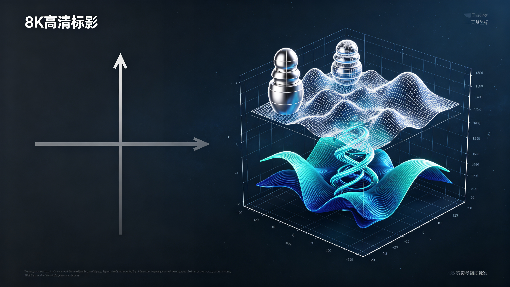

<ArchiveCopyPanel article-id="162142153" />

{"markdown":"PiDliIbnsbvvvJrmlofmmI7ov5vpmLYyMDDorrIgIAo+IOe8luWPt++8mmAxNjIxNDIxNTNgICAKPiDljp/lp4vmlofku7bvvJpg5qiq56uW5Z2Q5qCH6L205Y+q5piv5Lq66YCg5bC65a2Q5aSp5Zyw6Ieq5bim5LiJ5aWX5aSp54S25Z2Q5qCHLeWFqOWfn+aVsOWtpnZz5Lyg57uf5pWw5a2m5Lq657G75paH5piO6L+b6Zi2MjAw6K6y56ysOeiusuWwj+WtpumAmuS/l+eJiC0xNjIxNDIxNTMubWRgICAKPiDov5Tlm57vvJpb5pys5Lmm5b2S5qGjXSgvemgvYm9va3MvY291cnNlL2FydGljbGVzLykgwrcgW+aAu+WFpeWPo10oL3poL2Jvb2tzL2FydGljbGVzLykKCiFb56ysOeiusiDmqKrnq5blnZDmoIfovbTlj6rmmK/kurrpgKDlsLrlrZDvvIzlpKnlnLDoh6rluKbkuInlpZflpKnnhLblnZDmoIddKC4vYXNzZXRzL2NzZG5pbWcvanBnLzQzNDJlNWY5NDlmN2ZmZmMuanBnKQoKIyMg44CK5YWo5Z+f5pWw5a2mdnPkvKDnu5/mlbDlrabvvJrkurrnsbvmlofmmI7ov5vpmLYyMDDorrLjgIvnrKw56K6yIOWwj+WtpumAmuS/l+eJiOmAkOWtl+eovwoK5L2c6ICF77yaIOS5luS5luaVsOWtpgoK6K6y5qyh77yaIOesrDnorrIKCuS4u+mimO+8miDmqKrnq5blnZDmoIfovbTlj6rmmK/kurrpgKDlsLrlrZDvvIzlpKnlnLDoh6rluKbkuInlpZflpKnnhLblnZDmoIcKCuWvueagh+ivvuacrOefpeivhueCue+8miDlubPpnaLnm7Top5LlnZDmoIfns7sKCuaWh+mjju+8miDnq6XotqPlpKfnmb3or53vvIzml6DkuJPkuJrpmr7or43vvIzlu7bnu63lpZflqIPjgIHlj4zlsbHot6/jgIHoh6rnhLbljp/nlJ/nu5PmnoTorr7lrpoKCi0tLQoKIyMjIDDvvZ4z5YiG6ZKfIOWkjeS5oOWvvOWFpQoKIVvlpZflqIPlvI/nqbrpl7Tnu5PmnoRdKC4vYXNzZXRzL2NzZG5pbWcvanBnLzg5YjdmZTUxNzg1N2MxYTQuanBnKQoK5ZCM5a2m5Lus77yM5LiK6IqC6K++5oiR5Lus55+l6YGT77yM5pa55pa55q2j5q2j55qE56ev5pyo5pa55Z2X5piv5Lq657G76YCg5Ye65p2l55qE566A5YyW5qih5Z6L77yM5aSn6Ieq54S255yf5a6e56m66Ze05piv5LiA5bGC5aWX5LiA5bGC55qE5aWX5aiD57uT5p6E44CCCgrmlbDlrabor77miJHku6znu4/luLjnlLvljYHlrZflnZDmoIfovbTvvIzkuIDmnaHmqKrnur/jgIHkuIDmnaHnq5bnur/vvIznlKjmnaXmoIforrDlm77lvaLnmoTkvY3nva7jgILogIHluIjlkYror4nmiJHku6zvvIzmiYDmnInlm77lvaLkvY3nva7vvIzpg73og73nlKjov5nkuKTmnaHnur/moIflh7rmnaXjgIIKCuS7iuWkqeaIkeS7rOaNouS4quaAnei3r++8muWNgeWtl+WdkOagh+i9tOWPquaYr+S6uuexu+eUu+WcqOe6uOS4iueahOeugOaYk+WwuuWtkO+8jOecn+WunuWkqeWcsOmHjO+8jOacrOadpeWwseacieS4ieWll+iHquW4pueahOWumuS9jee6v+e0ou+8jOS4jeeUqOS6uuS4uueUu+aoque6v+erlue6v+OAggoKLS0tCgojIyMgM++9njEz5YiG6ZKfIOeUn+a0u+WMluexu+avlOiusuinowoK5oiR5Lus5YWI55yL6K++5pys6YeM55qE5Z2Q5qCH57O777yaCgrnurjkuIrkuIDmnaHmqKrovbTjgIHkuIDmnaHnq5bovbTvvIzkuqTlj4nmiJDnm7Top5LvvIzkuIDkuKrngrnphY3kuKTkuKrmlbDlrZfvvIzlsLHog73or7Tlh7rlroPlnKjlk6rvvIzlj6rpgILlkIjlubPmlbTnmb3nurjjgIIKCuWGjeeci+Wkp+iHqueEtuacrOi6q++8mgoK5LiW55WM5pyJ5LiJ5qC35aSp54S25a2Y5Zyo55qEIuWumuS9jee6v+e0oiLvvIzmiJHnlKjnroDljZXnmoTor53orrLnu5nlpKflrrblkKzvvJoKCiMjIyMg56ys5LiA5qC377ya6L+c6L+R5rex5rWFCgohW+i/nOi/kea3sea1heKAlOKAlOWxguWPoOeahOepuumXtOWdkOagh10oLi9hc3NldHMvY3NkbmltZy9qcGcvNWVlMDUyY2JkMDE0Y2JjMy5qcGcpCgrlr7nlupTnqbrpl7Tph4zlpJbvvIzlg4/lpZflqIPkuIDlsYLkuIDlsYLjgIIKCuS9oOermeWcqOWxseS4iueci+mjjuaZr++8jOi/keWkhOeahOiNieOAgei/nOWkhOeahOagkeOAgeabtOi/nOeahOS6ke+8jOWug+S7rOS4jeWcqOWQjOS4gOS4qiLlsYIi5LiK44CC6L+Z5bCx5piv5aSn6Ieq54S26Ieq5bim55qE56ys5LiA5aWX5Z2Q5qCH4oCU4oCU5rex5rWF44CCCgojIyMjIOesrOS6jOagt++8mumrmOS9jui1t+S8jwoKIVvpq5jkvY7otbfkvI/igJTigJTmm7LpnaLnmoTlpKnnhLblnZDmoIddKC4vYXNzZXRzL2NzZG5pbWcvanBnLzUzYzRkYzUzODJiMTk3MGIuanBnKQoK5a+55bqU5bGx5Z2h44CB5Zyw6Z2i5byv5puy56iL5bqm44CCCgrlpKflnLDkuI3mmK/lubPnmoTvvIzmnInlsbHlnaHjgIHmnInlsbHosLfjgIHmnInlnZHlnZHmtLzmtLzjgILkuIDlj6romoLomoHku47lsbHohJrniKzliLDlsbHpobbvvIzlroPotbDov4fnmoTot6/kuI3mmK/nm7Tnur/vvIzogIzmmK/pobrnnYDlnLDpnaLnmoTlvK/mm7LlnKjotbDjgILov5nlsLHmmK/nrKzkuozlpZflpKnnhLblnZDmoIfigJTigJTmm7LluqbjgIIKCiMjIyMg56ys5LiJ5qC377ya5rWB6L2s5pa55ZCRCgohW+a1gei9rOaWueWQkeKAlOKAlOWPjOieuuaXi+eahOeUn+mVv+WdkOagh10oLi9hc3NldHMvY3NkbmltZy9qcGcvMDg0YmRlZDM1NTViNjAwYS5qcGcpCgrkuIfniannlJ/plb/jgIHmsJTmtYHotbDliqjnmoTotbDlkJHvvIzlsLHmmK/miJHku6zkuYvliY3or7TnmoTmlbDlrZflj4zlsbHot6/jgIIKCuays+awtOW+gOS9juWkhOa1ge+8jOiXpOiUk+mhuuedgOaUr+aetuW+gOS4iueIrO+8jOmjjuS7juWxseiwt+WQueWQkeWxsemhtuOAguWkp+iHqueEtumHjOeahOS4nOilv+mDveacieiHquW3seeahCLotbDlkJEi77yM5LiN5piv6ZqP5L6/5Lmx6LWw55qE44CC6L+Z5bCx5piv56ys5LiJ5aWX5aSp54S25Z2Q5qCH4oCU4oCU5rWB5Yqo44CCCgrov5nkuInmoLfkuJzopb/ml7bml7bliLvliLvpg73lrZjlnKjvvIzkuI3nlKjmiJHku6znlLvnur/mnaHjgIIKCuivvuacrOWPquaIquWPluS6hiLmqKrjgIHnq5Yi5Lik5p2h5bmz55u057q/5p2h77yM5b+955Wl5LqG5aSp5Zyw6Ieq5bim55qE5rex5rWF44CB5byv5puy44CB5rWB5Yqo57q/57Si77yM55u45b2T5LqO5Y+q5ou/5Lik5qC55bCP5pyo5qON77yM5bCx5oOz5LiI6YeP5pW054mH5aSn5bGx44CCCgrkuL7kuKrnroDljZXkvovlrZDvvJoKCuWcqOe6uOS4iuagh+iusOS4gOajteagke+8jOWPqueUqOaoquOAgeerluS4pOS4quaVsOWtl++8mwoK5L2G546w5a6e6YeM6L+Z5qO15qCR77yM5pyJ56a75oiR5Lus5aSa6L+c44CB6ZW/5Zyo5LiK5Z2h6L+Y5piv5LiL5Z2h44CB5p6d5Y+26aG6552A6aOO5b6A5ZOq6L656ZW/77yM5LiJ5aWX5aSp54S25L+h5oGv77yM57q46Z2i5Z2Q5qCH6L205a6M5YWo5L2T546w5LiN5Ye65p2l44CCCgotLS0KCiMjIyAxM++9njIy5YiG6ZKfIOivvuacrOingueCuXZz5YWo5Z+f5pWw5a2m6YCa5L+X6KeC54K5CgohW+W5s+mdouWdkOagh+ezuyB2cyDkuInlpZflpKnnhLblnZDmoIddKC4vYXNzZXRzL2NzZG5pbWcvanBnLzc0NWNjZDI3NTZmMDEyMjEuanBnKQoKIyMjIyDkvKDnu5/or77mnKzorqTnn6UKCi0gCgrmqKrnq5bnm7Top5LlnZDmoIfovbTmmK/lrprkvY3kuIfniannmoTln7rnoYDlt6XlhbcKCi0gCgrku7vkvZXniankvZPkvY3nva7vvIzlj6rnlKjkuKTkuKrmlbDlrZflsLHog73lrozmlbTmj4/ov7AKCi0gCgrlnZDmoIfnur/mnaHmmK/kurrnlLvlh7rmnaXnmoTvvIzoh6rnhLbnlYzmsqHmnInoh6rluKblrprkvY3op4TliJkKCiMjIyMg5YWo5Z+f5pWw5a2m6YCa5L+X6K6k55+lCgotIAoK5Y2B5a2X5Z2Q5qCH6L205Y+q5piv57q46Z2i566A5YyW5bel5YW377yM5Y+q6IO955So5Zyo5bmz5pW05bmz6Z2iCgotIAoK5a6M5pW05o+P6L+w54mp5L2T77yM6ZyA6KaB5rex5rWF44CB5puy5bqm44CB5rWB5Yqo5LiJ5aWX5aSp54S25Z2Q5qCHCgotIAoK5aSp5Zyw5pys6Lqr6Ieq5bim5a6a5L2N6KeE5b6L77yM5Z2Q5qCH6L205Y+q5piv5qih5Lu/6Ieq54S25YGa5Ye65p2l55qE566A5piT5bC65a2QCgrnroDljZXmr5TllrvvvJoKCuWNgeWtl+WdkOagh+i9tOWDj+S4gOaKiuWPquacieS4pOS4quWIu+W6pueahOefreebtOWwuu+8mwoK5aSp5Zyw5LiJ5aWX5aSp54S25Z2Q5qCH77yM5piv6KaG55uW5pW054mH5bGx5p6X55qE5a6M5pW05a+86Iiq5Zyw5Zu+77yM5YaF5a655Liw5a+M5b6X5aSa44CCCgotLS0KCiMjIyAyMu+9njI35YiG6ZKfIOagoeWGheWtpuS5oOaPkOmGku+8jOS4jeW9seWTjeiAg+ivleWBmumimAoK5aSn5a625YaZ5L2c5Lia44CB6ICD6K+V55S75Zu+77yM6aKY55uu6YeM5YWo6YOo55So5bmz6Z2i55u06KeS5Z2Q5qCH57O777yM5oyJ6K++5aCC5pa55rOV5om+54K544CB55S75Zu+5a6M5YWo5q2j56Gu77yM5LiN5Lya5omj5YiG44CCCgrov5noioLor77lj6rmmK/mi5PlsZXorqTnn6XvvJror77mnKzlnZDmoIfovbTmmK/nroDljJbniYjlt6XlhbfvvIznnJ/lrp7kuJbnlYzmnInkuInlpZflpKnnhLbnmoTnqbrpl7TlrprkvY3moIflsLrjgIIKCuS8j+eslOmTuuWeq++8miDnrKwyNeiusuWwj+WtpuavleS4muS4k+Wcuu+8jOaVtOWQiOWJjTI06K6y5YWo6YOo55+l6K+G54K577yM5a6M5pW06K6y6Kej5pWw5a2X5Y+M6J665peL5Y6f55Sf55Sf6ZW/6YC76L6R44CCCgotLS0KCiMjIyAyN++9njMw5YiG6ZKfIOivvuWgguaAu+e7kyvkuIvoioLor77pooTlkYoKCiFb56m655m956m66Ze05Lit6Lez5Yqo55qE6IO96YePXSguL2Fzc2V0cy9jc2RuaW1nL2pwZy9jZjM2MDQ5NjZmZjkzMTE1LmpwZykKCiMjIyMg5pys6IqC6K++5bCP57uT77yaCgrmqKrnq5bnm7Top5LlnZDmoIfovbTmmK/kurrliLbpgKDnmoTnroDmmJPmoIflsLrvvIzlpKnlnLDljp/nlJ/oh6rluKbkuInlpZflrozmlbTlrprkvY3lnZDmoIfjgIIKCiMjIyMg5LiL5LiA6IqC6K++6aKE5ZGK77yaCgrnqbrnmb3kuI3ku6Pooajku4DkuYjpg73msqHmnInvvIznqbrnqbrnmoTlnLDmlrnol4/nnYDkuI3lgZzot7PliqjnmoTog73ph4/jgIIK","text":"5YiG57G777ya5paH5piO6L+b6Zi2MjAw6K6yICAK57yW5Y+377yaMTYyMTQyMTUzICAK5Y6f5aeL5paH5Lu277ya5qiq56uW5Z2Q5qCH6L205Y+q5piv5Lq66YCg5bC65a2Q5aSp5Zyw6Ieq5bim5LiJ5aWX5aSp54S25Z2Q5qCHLeWFqOWfn+aVsOWtpnZz5Lyg57uf5pWw5a2m5Lq657G75paH5piO6L+b6Zi2MjAw6K6y56ysOeiusuWwj+WtpumAmuS/l+eJiC0xNjIxNDIxNTMubWQgIArov5Tlm57vvJrmnKzkuablvZLmoaMgwrcg5oC75YWl5Y+jCgrnrKw56K6yIOaoquerluWdkOagh+i9tOWPquaYr+S6uumAoOWwuuWtkO+8jOWkqeWcsOiHquW4puS4ieWll+WkqeeEtuWdkOaghwoK44CK5YWo5Z+f5pWw5a2mdnPkvKDnu5/mlbDlrabvvJrkurrnsbvmlofmmI7ov5vpmLYyMDDorrLjgIvnrKw56K6yIOWwj+WtpumAmuS/l+eJiOmAkOWtl+eovwoK5L2c6ICF77yaIOS5luS5luaVsOWtpgoK6K6y5qyh77yaIOesrDnorrIKCuS4u+mimO+8miDmqKrnq5blnZDmoIfovbTlj6rmmK/kurrpgKDlsLrlrZDvvIzlpKnlnLDoh6rluKbkuInlpZflpKnnhLblnZDmoIcKCuWvueagh+ivvuacrOefpeivhueCue+8miDlubPpnaLnm7Top5LlnZDmoIfns7sKCuaWh+mjju+8miDnq6XotqPlpKfnmb3or53vvIzml6DkuJPkuJrpmr7or43vvIzlu7bnu63lpZflqIPjgIHlj4zlsbHot6/jgIHoh6rnhLbljp/nlJ/nu5PmnoTorr7lrpoKCi0tLQoKMO+9njPliIbpkp8g5aSN5Lmg5a+85YWlCgrlpZflqIPlvI/nqbrpl7Tnu5PmnoQKCuWQjOWtpuS7rO+8jOS4iuiKguivvuaIkeS7rOefpemBk++8jOaWueaWueato+ato+eahOenr+acqOaWueWdl+aYr+S6uuexu+mAoOWHuuadpeeahOeugOWMluaooeWei++8jOWkp+iHqueEtuecn+WunuepuumXtOaYr+S4gOWxguWll+S4gOWxgueahOWll+Wog+e7k+aehOOAggoK5pWw5a2m6K++5oiR5Lus57uP5bi455S75Y2B5a2X5Z2Q5qCH6L2077yM5LiA5p2h5qiq57q/44CB5LiA5p2h56uW57q/77yM55So5p2l5qCH6K6w5Zu+5b2i55qE5L2N572u44CC6ICB5biI5ZGK6K+J5oiR5Lus77yM5omA5pyJ5Zu+5b2i5L2N572u77yM6YO96IO955So6L+Z5Lik5p2h57q/5qCH5Ye65p2l44CCCgrku4rlpKnmiJHku6zmjaLkuKrmgJ3ot6/vvJrljYHlrZflnZDmoIfovbTlj6rmmK/kurrnsbvnlLvlnKjnurjkuIrnmoTnroDmmJPlsLrlrZDvvIznnJ/lrp7lpKnlnLDph4zvvIzmnKzmnaXlsLHmnInkuInlpZfoh6rluKbnmoTlrprkvY3nur/ntKLvvIzkuI3nlKjkurrkuLrnlLvmqKrnur/nq5bnur/jgIIKCi0tLQoKM++9njEz5YiG6ZKfIOeUn+a0u+WMluexu+avlOiusuinowoK5oiR5Lus5YWI55yL6K++5pys6YeM55qE5Z2Q5qCH57O777yaCgrnurjkuIrkuIDmnaHmqKrovbTjgIHkuIDmnaHnq5bovbTvvIzkuqTlj4nmiJDnm7Top5LvvIzkuIDkuKrngrnphY3kuKTkuKrmlbDlrZfvvIzlsLHog73or7Tlh7rlroPlnKjlk6rvvIzlj6rpgILlkIjlubPmlbTnmb3nurjjgIIKCuWGjeeci+Wkp+iHqueEtuacrOi6q++8mgoK5LiW55WM5pyJ5LiJ5qC35aSp54S25a2Y5Zyo55qEIuWumuS9jee6v+e0oiLvvIzmiJHnlKjnroDljZXnmoTor53orrLnu5nlpKflrrblkKzvvJoKCuesrOS4gOagt++8mui/nOi/kea3sea1hQoK6L+c6L+R5rex5rWF4oCU4oCU5bGC5Y+g55qE56m66Ze05Z2Q5qCHCgrlr7nlupTnqbrpl7Tph4zlpJbvvIzlg4/lpZflqIPkuIDlsYLkuIDlsYLjgIIKCuS9oOermeWcqOWxseS4iueci+mjjuaZr++8jOi/keWkhOeahOiNieOAgei/nOWkhOeahOagkeOAgeabtOi/nOeahOS6ke+8jOWug+S7rOS4jeWcqOWQjOS4gOS4qiLlsYIi5LiK44CC6L+Z5bCx5piv5aSn6Ieq54S26Ieq5bim55qE56ys5LiA5aWX5Z2Q5qCH4oCU4oCU5rex5rWF44CCCgrnrKzkuozmoLfvvJrpq5jkvY7otbfkvI8KCumrmOS9jui1t+S8j+KAlOKAlOabsumdoueahOWkqeeEtuWdkOaghwoK5a+55bqU5bGx5Z2h44CB5Zyw6Z2i5byv5puy56iL5bqm44CCCgrlpKflnLDkuI3mmK/lubPnmoTvvIzmnInlsbHlnaHjgIHmnInlsbHosLfjgIHmnInlnZHlnZHmtLzmtLzjgILkuIDlj6romoLomoHku47lsbHohJrniKzliLDlsbHpobbvvIzlroPotbDov4fnmoTot6/kuI3mmK/nm7Tnur/vvIzogIzmmK/pobrnnYDlnLDpnaLnmoTlvK/mm7LlnKjotbDjgILov5nlsLHmmK/nrKzkuozlpZflpKnnhLblnZDmoIfigJTigJTmm7LluqbjgIIKCuesrOS4ieagt++8mua1gei9rOaWueWQkQoK5rWB6L2s5pa55ZCR4oCU4oCU5Y+M6J665peL55qE55Sf6ZW/5Z2Q5qCHCgrkuIfniannlJ/plb/jgIHmsJTmtYHotbDliqjnmoTotbDlkJHvvIzlsLHmmK/miJHku6zkuYvliY3or7TnmoTmlbDlrZflj4zlsbHot6/jgIIKCuays+awtOW+gOS9juWkhOa1ge+8jOiXpOiUk+mhuuedgOaUr+aetuW+gOS4iueIrO+8jOmjjuS7juWxseiwt+WQueWQkeWxsemhtuOAguWkp+iHqueEtumHjOeahOS4nOilv+mDveacieiHquW3seeahCLotbDlkJEi77yM5LiN5piv6ZqP5L6/5Lmx6LWw55qE44CC6L+Z5bCx5piv56ys5LiJ5aWX5aSp54S25Z2Q5qCH4oCU4oCU5rWB5Yqo44CCCgrov5nkuInmoLfkuJzopb/ml7bml7bliLvliLvpg73lrZjlnKjvvIzkuI3nlKjmiJHku6znlLvnur/mnaHjgIIKCuivvuacrOWPquaIquWPluS6hiLmqKrjgIHnq5Yi5Lik5p2h5bmz55u057q/5p2h77yM5b+955Wl5LqG5aSp5Zyw6Ieq5bim55qE5rex5rWF44CB5byv5puy44CB5rWB5Yqo57q/57Si77yM55u45b2T5LqO5Y+q5ou/5Lik5qC55bCP5pyo5qON77yM5bCx5oOz5LiI6YeP5pW054mH5aSn5bGx44CCCgrkuL7kuKrnroDljZXkvovlrZDvvJoKCuWcqOe6uOS4iuagh+iusOS4gOajteagke+8jOWPqueUqOaoquOAgeerluS4pOS4quaVsOWtl++8mwoK5L2G546w5a6e6YeM6L+Z5qO15qCR77yM5pyJ56a75oiR5Lus5aSa6L+c44CB6ZW/5Zyo5LiK5Z2h6L+Y5piv5LiL5Z2h44CB5p6d5Y+26aG6552A6aOO5b6A5ZOq6L656ZW/77yM5LiJ5aWX5aSp54S25L+h5oGv77yM57q46Z2i5Z2Q5qCH6L205a6M5YWo5L2T546w5LiN5Ye65p2l44CCCgotLS0KCjEz772eMjLliIbpkp8g6K++5pys6KeC54K5dnPlhajln5/mlbDlrabpgJrkv5fop4LngrkKCuW5s+mdouWdkOagh+ezuyB2cyDkuInlpZflpKnnhLblnZDmoIcKCuS8oOe7n+ivvuacrOiupOefpQrmqKrnq5bnm7Top5LlnZDmoIfovbTmmK/lrprkvY3kuIfniannmoTln7rnoYDlt6XlhbcK5Lu75L2V54mp5L2T5L2N572u77yM5Y+q55So5Lik5Liq5pWw5a2X5bCx6IO95a6M5pW05o+P6L+wCuWdkOagh+e6v+adoeaYr+S6uueUu+WHuuadpeeahO+8jOiHqueEtueVjOayoeacieiHquW4puWumuS9jeinhOWImQoK5YWo5Z+f5pWw5a2m6YCa5L+X6K6k55+lCuWNgeWtl+WdkOagh+i9tOWPquaYr+e6uOmdoueugOWMluW3peWFt++8jOWPquiDveeUqOWcqOW5s+aVtOW5s+mdogrlrozmlbTmj4/ov7DniankvZPvvIzpnIDopoHmt7HmtYXjgIHmm7LluqbjgIHmtYHliqjkuInlpZflpKnnhLblnZDmoIcK5aSp5Zyw5pys6Lqr6Ieq5bim5a6a5L2N6KeE5b6L77yM5Z2Q5qCH6L205Y+q5piv5qih5Lu/6Ieq54S25YGa5Ye65p2l55qE566A5piT5bC65a2QCgrnroDljZXmr5TllrvvvJoKCuWNgeWtl+WdkOagh+i9tOWDj+S4gOaKiuWPquacieS4pOS4quWIu+W6pueahOefreebtOWwuu+8mwoK5aSp5Zyw5LiJ5aWX5aSp54S25Z2Q5qCH77yM5piv6KaG55uW5pW054mH5bGx5p6X55qE5a6M5pW05a+86Iiq5Zyw5Zu+77yM5YaF5a655Liw5a+M5b6X5aSa44CCCgotLS0KCjIy772eMjfliIbpkp8g5qCh5YaF5a2m5Lmg5o+Q6YaS77yM5LiN5b2x5ZON6ICD6K+V5YGa6aKYCgrlpKflrrblhpnkvZzkuJrjgIHogIPor5XnlLvlm77vvIzpopjnm67ph4zlhajpg6jnlKjlubPpnaLnm7Top5LlnZDmoIfns7vvvIzmjInor77loILmlrnms5Xmib7ngrnjgIHnlLvlm77lrozlhajmraPnoa7vvIzkuI3kvJrmiaPliIbjgIIKCui/meiKguivvuWPquaYr+aLk+WxleiupOefpe+8muivvuacrOWdkOagh+i9tOaYr+eugOWMlueJiOW3peWFt++8jOecn+WunuS4lueVjOacieS4ieWll+WkqeeEtueahOepuumXtOWumuS9jeagh+WwuuOAggoK5LyP56yU6ZO65Z6r77yaIOesrDI16K6y5bCP5a2m5q+V5Lia5LiT5Zy677yM5pW05ZCI5YmNMjTorrLlhajpg6jnn6Xor4bngrnvvIzlrozmlbTorrLop6PmlbDlrZflj4zonrrml4vljp/nlJ/nlJ/plb/pgLvovpHjgIIKCi0tLQoKMjfvvZ4zMOWIhumSnyDor77loILmgLvnu5Mr5LiL6IqC6K++6aKE5ZGKCgrnqbrnmb3nqbrpl7TkuK3ot7PliqjnmoTog73ph48KCuacrOiKguivvuWwj+e7k++8mgoK5qiq56uW55u06KeS5Z2Q5qCH6L205piv5Lq65Yi26YCg55qE566A5piT5qCH5bC677yM5aSp5Zyw5Y6f55Sf6Ieq5bim5LiJ5aWX5a6M5pW05a6a5L2N5Z2Q5qCH44CCCgrkuIvkuIDoioLor77pooTlkYrvvJoKCuepuueZveS4jeS7o+ihqOS7gOS5iOmDveayoeacie+8jOepuuepuueahOWcsOaWueiXj+edgOS4jeWBnOi3s+WKqOeahOiDvemHj+OAgg=="}

> 分类：文明进阶200讲  
> 编号：`162142153`  
> 原始文件：`横竖坐标轴只是人造尺子天地自带三套天然坐标-全域数学vs传统数学人类文明进阶200讲第9讲小学通俗版-162142153.md`  
> 返回：[本书归档](/zh/books/course/articles/) · [总入口](/zh/books/articles/)

<ArticlePaperMeta category="文明进阶200讲" article-id="162142153" title="横竖坐标轴只是人造尺子天地自带三套天然坐标-全域数学vs传统数学人类文明进阶200讲第9讲小学通俗版" paper-kind="课程讲义" book-route="/zh/books/course/articles/" overview-route="/zh/books/articles/" summary="对标课本知识点： 平面直角坐标系" author="乖乖数学" lecture="第9讲" theme="横竖坐标轴只是人造尺子，天地自带三套天然坐标" source-file="横竖坐标轴只是人造尺子天地自带三套天然坐标-全域数学vs传统数学人类文明进阶200讲第9讲小学通俗版-162142153.md" cover="./assets/csdnimg/jpg/4342e5f949f7fffc.jpg" />

## 《全域数学vs传统数学：人类文明进阶200讲》第9讲 小学通俗版逐字稿

作者： 乖乖数学

讲次： 第9讲

主题： 横竖坐标轴只是人造尺子，天地自带三套天然坐标

对标课本知识点： 平面直角坐标系

文风： 童趣大白话，无专业难词，延续套娃、双山路、自然原生结构设定

---

### 0～3分钟 复习导入

同学们，上节课我们知道，方方正正的积木方块是人类造出来的简化模型，大自然真实空间是一层套一层的套娃结构。

数学课我们经常画十字坐标轴，一条横线、一条竖线，用来标记图形的位置。老师告诉我们，所有图形位置，都能用这两条线标出来。

今天我们换个思路：十字坐标轴只是人类画在纸上的简易尺子，真实天地里，本来就有三套自带的定位线索，不用人为画横线竖线。

---

### 3～13分钟 生活化类比讲解

我们先看课本里的坐标系：

纸上一条横轴、一条竖轴，交叉成直角，一个点配两个数字，就能说出它在哪，只适合平整白纸。

再看大自然本身：

世界有三样天然存在的"定位线索"，我用简单的话讲给大家听：

#### 第一样：远近深浅

对应空间里外，像套娃一层一层。

你站在山上看风景，近处的草、远处的树、更远的云，它们不在同一个"层"上。这就是大自然自带的第一套坐标——深浅。

#### 第二样：高低起伏

对应山坡、地面弯曲程度。

大地不是平的，有山坡、有山谷、有坑坑洼洼。一只蚂蚁从山脚爬到山顶，它走过的路不是直线，而是顺着地面的弯曲在走。这就是第二套天然坐标——曲度。

#### 第三样：流转方向

万物生长、气流走动的走向，就是我们之前说的数字双山路。

河水往低处流，藤蔓顺着支架往上爬，风从山谷吹向山顶。大自然里的东西都有自己的"走向"，不是随便乱走的。这就是第三套天然坐标——流动。

这三样东西时时刻刻都存在，不用我们画线条。

课本只截取了"横、竖"两条平直线条，忽略了天地自带的深浅、弯曲、流动线索，相当于只拿两根小木棍，就想丈量整片大山。

举个简单例子：

在纸上标记一棵树，只用横、竖两个数字；

但现实里这棵树，有离我们多远、长在上坡还是下坡、枝叶顺着风往哪边长，三套天然信息，纸面坐标轴完全体现不出来。

---

### 13～22分钟 课本观点vs全域数学通俗观点

#### 传统课本认知

- 

横竖直角坐标轴是定位万物的基础工具

- 

任何物体位置，只用两个数字就能完整描述

- 

坐标线条是人画出来的，自然界没有自带定位规则

#### 全域数学通俗认知

- 

十字坐标轴只是纸面简化工具，只能用在平整平面

- 

完整描述物体，需要深浅、曲度、流动三套天然坐标

- 

天地本身自带定位规律，坐标轴只是模仿自然做出来的简易尺子

简单比喻：

十字坐标轴像一把只有两个刻度的短直尺；

天地三套天然坐标，是覆盖整片山林的完整导航地图，内容丰富得多。

---

### 22～27分钟 校内学习提醒，不影响考试做题

大家写作业、考试画图，题目里全部用平面直角坐标系，按课堂方法找点、画图完全正确，不会扣分。

这节课只是拓展认知：课本坐标轴是简化版工具，真实世界有三套天然的空间定位标尺。

伏笔铺垫： 第25讲小学毕业专场，整合前24讲全部知识点，完整讲解数字双螺旋原生生长逻辑。

---

### 27～30分钟 课堂总结+下节课预告

#### 本节课小结：

横竖直角坐标轴是人制造的简易标尺，天地原生自带三套完整定位坐标。

#### 下一节课预告：

空白不代表什么都没有，空空的地方藏着不停跳动的能量。
