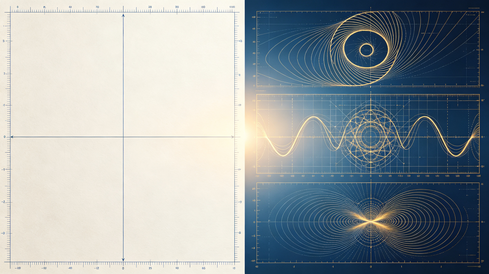
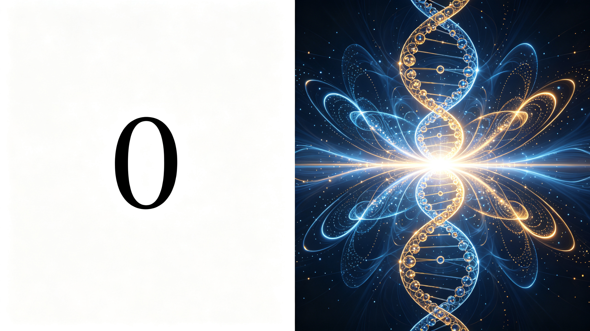

<ArchiveCopyPanel article-id="162142195" />

{"markdown":"PiDliIbnsbvvvJrmlofmmI7ov5vpmLYyMDDorrIgIAo+IOe8luWPt++8mmAxNjIxNDIxOTVgICAKPiDljp/lp4vmlofku7bvvJpg56m655m95LiN5piv5LiA5peg5omA5pyJ56m65pe356m66Ze06JeP552A5LiN5YGc6Lez5Yqo55qE6IO96YePLeWFqOWfn+aVsOWtpnZz5Lyg57uf5pWw5a2m5Lq657G75paH5piO6L+b6Zi2MjAw6K6y56ysMTDorrLlsI/lrabpgJrkv5ctMTYyMTQyMTk1Lm1kYCAgCj4g6L+U5Zue77yaW+acrOS5puW9kuaho10oL3poL2Jvb2tzL2NvdXJzZS9hcnRpY2xlcy8pIMK3IFvmgLvlhaXlj6NdKC96aC9ib29rcy9hcnRpY2xlcy8pCgojIyDjgIrlhajln5/mlbDlraZ2c+S8oOe7n+aVsOWtpu+8muS6uuexu+aWh+aYjui/m+mYtjIwMOiusuOAi+esrDEw6K6yIOWwj+WtpumAmuS/l+eJiOmAkOWtl+eovwoKIVvnrKwxMOiusuWwgemdou+8muepuueZveS4jeaYr+S4gOaXoOaJgOaciV0oLi9hc3NldHMvY3NkbmltZy9qcGcvOTNlMWEzMWIwNjI0ZGQ0Yi5qcGcpCgrkvZzogIXvvJog5LmW5LmW5pWw5a2mCgrorrLmrKHvvJog56ysMTDorrIKCuS4u+mimO+8miDnqbrnmb3kuI3mmK/kuIDml6DmiYDmnInvvIznqbrml7fnqbrpl7Tol4/nnYDkuI3lgZzot7PliqjnmoTog73ph48KCuWvueagh+ivvuacrOefpeivhueCue+8miAiMDAw5Luj6KGo56m644CB5rKh5pyJ5Lic6KW/IuWfuuehgOiupOefpQoK5paH6aOO77yaIOeugOWNleWPo+ivreOAgeeUn+a0u+WMluS+i+WtkO+8jOaXoOS4k+S4muacr+ivre+8jOW7tue7reWJjemdouWFqOWll+avlOWWu+S9k+ezuwoKLS0tCgojIyMgMO+9njPliIbpkp8g5aSN5Lmg5a+85YWlCgohW+WkjeS5oOWvvOWFpe+8muWdkOagh+WwuuS4juWkp+iHqueEtueahOWumuS9jeagh+Wwul0oLi9hc3NldHMvY3NkbmltZy9qcGcvYWIzOTdmMDg0Mjg0MmNlMy5qcGcpCgrlkIzlrabku6zvvIzkuIrkuIDoioLor77miJHku6zogYrkuobnurjkuIrnmoTmqKrnq5blnZDmoIflj6rmmK/nroDmmJPlsLrlrZDvvIzlpKfoh6rnhLbmnKzouqvmnInkuInlpZflrozmlbTnmoTlrprkvY3moIflsLrjgIIKCuaVsOWtpuivvuS4iuiAgeW4iOmDveS8muiusu+8jOaVsOWtlzAwMOWwseaYr+S7gOS5iOmDveayoeacie+8jOe6uOS4iuepuueZveeahOWcsOaWue+8jOS7o+ihqOS4jeWtmOWcqOS7u+S9leeJqeS9k+OAggoK5LuK5aSp5oiR5Lus6KaB5omT56C06L+Z5Liq566A5Y2V6K6k55+l77ya55yL6LW35p2l56m656m66I2h6I2h55qE5Zyw5pa577yM5bm25LiN5piv5a6M5YWo6Jma5peg77yM6YeM6Z2i5LiA55u05pyJ55yL5LiN6KeB55qE5Yqo6Z2Z44CB6IO96YeP5Zyo5LiN5YGc6LW35LyP6Lez5Yqo44CCCgotLS0KCiMjIyAz772eMTPliIbpkp8g55Sf5rS75YyW57G75q+U6K6y6KejCgrlpKflrrblj6/ku6Xmg7PosaHkuKTkuKrlnLrmma/vvJoKCiMjIyMg5Zy65pmv5LiA77ya6K++5pys6YeM55qE6K6k55+lCgohW+WcuuaZr+S4gO+8muivvuacrOmHjOeahDDorqTnn6VdKC4vYXNzZXRzL2NzZG5pbWcvanBnLzQwMTY2MWYzYjYwNTVkM2IuanBnKQoK5qGM5LiK5rKh5pyJ6Iu55p6c77yM5oiR5Lus5bCx6K6w5L2cMDAw77yb55m957q456m655m95Yy65Z+f77yM5Luj6KGo5rKh5pyJ5Zu+5b2i44CB5rKh5pyJ5pWw5a2X77yM56m65peg5LiA54mp44CC6L+Z5piv5Li65LqG5pa55L6/5YGa6aKY566A5YyW5Ye65p2l55qE6K+05rOV44CCCgojIyMjIOWcuuaZr+S6jO+8muecn+WunuS4lueVjOeahOagt+WtkAoKIVvlnLrmma/kuozvvJrnnJ/lrp7kuJbnlYznmoTog73ph4/ms6LliqhdKC4vYXNzZXRzL2NzZG5pbWcvanBnLzlkZWFiM2JkYzg3NTFjYTAuanBnKQoK5bCx566X5qGM5a2Q5LiK5LiN5pS+6Iu55p6c77yM56m65rCU44CB55yL5LiN6KeB55qE5b6u5bCP57KS5a2Q5LiA55u06aOY5Zyo5Zub5ZGo77yb5bCx566X5piv5ryG6buR56m65pe355qE5Zyw5pa577yM5Lmf5pyJ57uG5b6u55qE6IO96YeP5p2l5Zue5rOi5Yqo77yM5LiN5Lya5b275bqV6Z2Z5q2i5LiN5Yqo44CCCgojIyMjIOaUvuWIsOaVsOWtl+WPjOWxsei3r+S9k+ezu+mHjAoKIVvmlbDlrZflj4zlsbHot6/kvZPns7vvvJow5piv5YWx5ZCM6LW354K5XSguL2Fzc2V0cy9jc2RuaW1nL2pwZy8wNTk5NTc3YjlkNWRmNDIzLmpwZykKCjAwMOS4jeaYryLmtojlpLHjgIHkuI3lrZjlnKgi77yM5piv5Lik5p2h55Sf6ZW/5bGx6Lev5YWx5ZCM55qE6LW354K55Z+654K577yM5piv5omA5pyJ5pWw5a2X55Sf6ZW/6ZyH5Yqo55qE5rqQ5aS077yM5LiH54mp6YO95piv5LuO6L+Z5Liq5Z+654K56ZyH5Yqo44CB5YiG5YyW5ZCO5oWi5oWi6ZW/5Ye65p2l55qE44CCCgojIyMjIOWwj+aci+WPi+iDveeci+aHgueahOS+i+WtkAoKIVvlkLnmsJTnkIPmr5TllrvvvJow5YOP5rKh5YWF5rCU55qE5rCU55CDXSguL2Fzc2V0cy9jc2RuaW1nL2pwZy81OTM0YjYwY2E0ZDBhN2M0LmpwZykKCuWQueawlOeQg++8jOawlOeQg+ayoeWQueawlOeahOaXtuWAmeaJgeaJgeepuuepuu+8jOeci+edgOS7gOS5iOmDveayoeacie+8jOS9humHjOmdouS+neaXp+W4g+a7oeepuuawlOWIhuWtkO+8mzAwMOWwseWDj+i/meS4quayoeWFheawlOeahOawlOeQg+i1t+eCue+8jOWPquaYr+i/mOayoeWQkeWklueUn+mVv+WHuuaVsOWtl+OAgeeJqei0qO+8jOacrOi6q+iHquW4puWtleiCsuS4h+eJqeeahOWKm+mHj++8jOS4jeaYr+W9u+W6leeahOepuuaXoOOAggoKLS0tCgojIyMgMTPvvZ4yMuWIhumSnyDor77mnKzop4LngrkgdnMg5YWo5Z+f5pWw5a2m6YCa5L+X6KeC54K5CgohW+S8oOe7n+iupOefpSB2cyDlhajln5/mlbDlrablr7nmr5RdKC4vYXNzZXRzL2NzZG5pbWcvanBnLzZlYWFlOTExOWNhNmM0YzIuanBnKQoKIyMjIyDkvKDnu5/or77mnKzorqTnn6UKCi0gCgrmlbDlrZcwMDAgPSDlrozlhajmsqHmnInjgIHnqbrnmb3jgIHkuI3lrZjlnKjku7vkvZXkuovniakKCi0gCgrnqbrnmb3ljLrln5/msqHmnInku7vkvZXlj5jljJbjgIHmsqHmnInog73ph4/vvIzpnZnmraLkuI3liqgKCi0gCgowMDDlj6rmmK/nlKjmnaXmoIforrAi5rKh5pyJ5pWw6YePIueahOW3peWFt+aVsOWtlwoKIyMjIyDlhajln5/mlbDlrabpgJrkv5forqTnn6UKCi0gCgowMDDmmK/kuIfniannlJ/plb/nmoTpnIfliqjln7rngrnvvIzmmK/lj4zonrrml4vlsbHot6/lhbHlkIzotbfngrnvvIzkuI3mmK/omZrml6AKCi0gCgrogonnnLznnIvnnYDnqbrnmb3nmoTnqbrpl7TvvIzlhoXpg6jlrZjlnKjmjIHnu63nu4blvq7nmoTotbfkvI/ms6LliqgKCi0gCgoi5LuA5LmI6YO95rKh5pyJIuWPquaYr+iCieecvOinguWvn+eahOWxgOmZkO+8jOepuumXtOacrOi6q+iHquW4puWfuuehgOiDvemHjwoKIyMjIyDnroDljZXmr5TllrsKCiFb56eN5a2Q5q+U5Za777ya6JW06JeP55Sf6ZW/5r2c5YqbXSguL2Fzc2V0cy9jc2RuaW1nL2pwZy81M2I5YzU0MzgwZTk2YmZkLmpwZykKCjAwMOWlveavlOS4gOmil+i/mOayoeWPkeiKveeahOenjeWtkO+8jOeci+edgOWFieeng+eng++8jOWNtOiXj+edgOmVv+WHuuaVtOajteWkp+agkeeahOWFqOmDqOa9nOWKm++8m+ivvuacrOWPqueci+WIsCLmsqHplb/lh7rmnpzlrp4i77yM5b+955Wl5LqG56eN5a2Q5pys6Lqr6JW06JeP55qE55Sf6ZW/5Yqb6YeP44CCCgotLS0KCiMjIyAyMu+9njI35YiG6ZKfIOagoeWGheWtpuS5oOaPkOmGku+8jOS4jeW9seWTjeiAg+ivleW+l+WIhgoK5bmz5pe25YaZ5L2c5Lia44CB5YGa6K6h566X6aKY77yMMDAw5Luj6KGoIuayoeacieaVsOmHjyLnmoTnlKjms5Xlrozlhajlj6/ku6XmraPluLjkvb/nlKjvvIzlgZrpopjkuI3kvJrlh7rplJnmiaPliIbjgIIKCui/meiKguivvuWPquaYr+aLk+Wxlea3seWxguiupOefpe+8muivvuacrOaKijAwMOeugOWMluaIkCLnqbrml6Ai5pa55L6/5L2O5bm057qn55CG6Kej77yM5a6D55yf5q2j55qE6Lqr5Lu95piv5omA5pyJ5pWw5a2X44CB5LiH54mp6K+e55Sf55qE5Yid5aeL5Z+654K544CCCgrkvI/nrJTpk7rlnqvvvJog56ysMjXorrLlsI/lrabmr5XkuJrkuJPlnLrvvIzmsYfmgLvliY0yNOiusuWFqOmDqOWGheWuue+8jOWujOaVtOaLhuinozAwMOOAgTExMeWPjOieuuaXi+aVsOWtl+eUn+mVv+eahOW6leWxgumAu+i+keOAggoKLS0tCgojIyMgMjfvvZ4zMOWIhumSnyDor77loILmgLvnu5Mr5LiL6IqC6K++6aKE5ZGKCgohW+S4i+iKguivvumihOWRiu+8muWHoOS9leWbvuW9ouaYr+iDvemHj+eahOW9seWtkF0oLi9hc3NldHMvY3NkbmltZy9qcGcvMjZlZWIxMzM4OTYxOTEwOS5qcGcpCgojIyMjIOacrOiKguivvuWwj+e7kwoKMDAw5LiN5Luj6KGo5LiA5peg5omA5pyJ77yM5a6D5piv5LiH54mp55Sf6ZW/55qE6LW354K577yM56m655m956m66Ze06YeM5LiA55u05a2Y5Zyo57uG5b6u55qE6IO96YeP5rOi5Yqo44CCCgojIyMjIOS4i+S4gOiKguivvumihOWRigoK5oiR5Lus5bmz5pe255yL5Yiw55qE5ZyG5b2i44CB5pa55b2i77yM5Y+q5piv6IO96YeP5rOi5Yqo55WZ5LiL55qE6Z2Z5oCB5b2x5a2Q44CCCgotLS0KCiFb56ysMTDorrLnu5PlsL7nlLvpnaJdKC4vYXNzZXRzL2NzZG5pbWcvanBnLzk1YWYyNGE4MGJjZDAwODQuanBnKQo=","text":"5YiG57G777ya5paH5piO6L+b6Zi2MjAw6K6yICAK57yW5Y+377yaMTYyMTQyMTk1ICAK5Y6f5aeL5paH5Lu277ya56m655m95LiN5piv5LiA5peg5omA5pyJ56m65pe356m66Ze06JeP552A5LiN5YGc6Lez5Yqo55qE6IO96YePLeWFqOWfn+aVsOWtpnZz5Lyg57uf5pWw5a2m5Lq657G75paH5piO6L+b6Zi2MjAw6K6y56ysMTDorrLlsI/lrabpgJrkv5ctMTYyMTQyMTk1Lm1kICAK6L+U5Zue77ya5pys5Lmm5b2S5qGjIMK3IOaAu+WFpeWPowoK44CK5YWo5Z+f5pWw5a2mdnPkvKDnu5/mlbDlrabvvJrkurrnsbvmlofmmI7ov5vpmLYyMDDorrLjgIvnrKwxMOiusiDlsI/lrabpgJrkv5fniYjpgJDlrZfnqL8KCuesrDEw6K6y5bCB6Z2i77ya56m655m95LiN5piv5LiA5peg5omA5pyJCgrkvZzogIXvvJog5LmW5LmW5pWw5a2mCgrorrLmrKHvvJog56ysMTDorrIKCuS4u+mimO+8miDnqbrnmb3kuI3mmK/kuIDml6DmiYDmnInvvIznqbrml7fnqbrpl7Tol4/nnYDkuI3lgZzot7PliqjnmoTog73ph48KCuWvueagh+ivvuacrOefpeivhueCue+8miAiMDAw5Luj6KGo56m644CB5rKh5pyJ5Lic6KW/IuWfuuehgOiupOefpQoK5paH6aOO77yaIOeugOWNleWPo+ivreOAgeeUn+a0u+WMluS+i+WtkO+8jOaXoOS4k+S4muacr+ivre+8jOW7tue7reWJjemdouWFqOWll+avlOWWu+S9k+ezuwoKLS0tCgow772eM+WIhumSnyDlpI3kuaDlr7zlhaUKCuWkjeS5oOWvvOWFpe+8muWdkOagh+WwuuS4juWkp+iHqueEtueahOWumuS9jeagh+WwugoK5ZCM5a2m5Lus77yM5LiK5LiA6IqC6K++5oiR5Lus6IGK5LqG57q45LiK55qE5qiq56uW5Z2Q5qCH5Y+q5piv566A5piT5bC65a2Q77yM5aSn6Ieq54S25pys6Lqr5pyJ5LiJ5aWX5a6M5pW055qE5a6a5L2N5qCH5bC644CCCgrmlbDlrabor77kuIrogIHluIjpg73kvJrorrLvvIzmlbDlrZcwMDDlsLHmmK/ku4DkuYjpg73msqHmnInvvIznurjkuIrnqbrnmb3nmoTlnLDmlrnvvIzku6PooajkuI3lrZjlnKjku7vkvZXniankvZPjgIIKCuS7iuWkqeaIkeS7rOimgeaJk+egtOi/meS4queugOWNleiupOefpe+8mueci+i1t+adpeepuuepuuiNoeiNoeeahOWcsOaWue+8jOW5tuS4jeaYr+WujOWFqOiZmuaXoO+8jOmHjOmdouS4gOebtOacieeci+S4jeingeeahOWKqOmdmeOAgeiDvemHj+WcqOS4jeWBnOi1t+S8j+i3s+WKqOOAggoKLS0tCgoz772eMTPliIbpkp8g55Sf5rS75YyW57G75q+U6K6y6KejCgrlpKflrrblj6/ku6Xmg7PosaHkuKTkuKrlnLrmma/vvJoKCuWcuuaZr+S4gO+8muivvuacrOmHjOeahOiupOefpQoK5Zy65pmv5LiA77ya6K++5pys6YeM55qEMOiupOefpQoK5qGM5LiK5rKh5pyJ6Iu55p6c77yM5oiR5Lus5bCx6K6w5L2cMDAw77yb55m957q456m655m95Yy65Z+f77yM5Luj6KGo5rKh5pyJ5Zu+5b2i44CB5rKh5pyJ5pWw5a2X77yM56m65peg5LiA54mp44CC6L+Z5piv5Li65LqG5pa55L6/5YGa6aKY566A5YyW5Ye65p2l55qE6K+05rOV44CCCgrlnLrmma/kuozvvJrnnJ/lrp7kuJbnlYznmoTmoLflrZAKCuWcuuaZr+S6jO+8muecn+WunuS4lueVjOeahOiDvemHj+azouWKqAoK5bCx566X5qGM5a2Q5LiK5LiN5pS+6Iu55p6c77yM56m65rCU44CB55yL5LiN6KeB55qE5b6u5bCP57KS5a2Q5LiA55u06aOY5Zyo5Zub5ZGo77yb5bCx566X5piv5ryG6buR56m65pe355qE5Zyw5pa577yM5Lmf5pyJ57uG5b6u55qE6IO96YeP5p2l5Zue5rOi5Yqo77yM5LiN5Lya5b275bqV6Z2Z5q2i5LiN5Yqo44CCCgrmlL7liLDmlbDlrZflj4zlsbHot6/kvZPns7vph4wKCuaVsOWtl+WPjOWxsei3r+S9k+ezu++8mjDmmK/lhbHlkIzotbfngrkKCjAwMOS4jeaYryLmtojlpLHjgIHkuI3lrZjlnKgi77yM5piv5Lik5p2h55Sf6ZW/5bGx6Lev5YWx5ZCM55qE6LW354K55Z+654K577yM5piv5omA5pyJ5pWw5a2X55Sf6ZW/6ZyH5Yqo55qE5rqQ5aS077yM5LiH54mp6YO95piv5LuO6L+Z5Liq5Z+654K56ZyH5Yqo44CB5YiG5YyW5ZCO5oWi5oWi6ZW/5Ye65p2l55qE44CCCgrlsI/mnIvlj4vog73nnIvmh4LnmoTkvovlrZAKCuWQueawlOeQg+avlOWWu++8mjDlg4/msqHlhYXmsJTnmoTmsJTnkIMKCuWQueawlOeQg++8jOawlOeQg+ayoeWQueawlOeahOaXtuWAmeaJgeaJgeepuuepuu+8jOeci+edgOS7gOS5iOmDveayoeacie+8jOS9humHjOmdouS+neaXp+W4g+a7oeepuuawlOWIhuWtkO+8mzAwMOWwseWDj+i/meS4quayoeWFheawlOeahOawlOeQg+i1t+eCue+8jOWPquaYr+i/mOayoeWQkeWklueUn+mVv+WHuuaVsOWtl+OAgeeJqei0qO+8jOacrOi6q+iHquW4puWtleiCsuS4h+eJqeeahOWKm+mHj++8jOS4jeaYr+W9u+W6leeahOepuuaXoOOAggoKLS0tCgoxM++9njIy5YiG6ZKfIOivvuacrOingueCuSB2cyDlhajln5/mlbDlrabpgJrkv5fop4LngrkKCuS8oOe7n+iupOefpSB2cyDlhajln5/mlbDlrablr7nmr5QKCuS8oOe7n+ivvuacrOiupOefpQrmlbDlrZcwMDAgPSDlrozlhajmsqHmnInjgIHnqbrnmb3jgIHkuI3lrZjlnKjku7vkvZXkuovniakK56m655m95Yy65Z+f5rKh5pyJ5Lu75L2V5Y+Y5YyW44CB5rKh5pyJ6IO96YeP77yM6Z2Z5q2i5LiN5YqoCjAwMOWPquaYr+eUqOadpeagh+iusCLmsqHmnInmlbDph48i55qE5bel5YW35pWw5a2XCgrlhajln5/mlbDlrabpgJrkv5forqTnn6UKMDAw5piv5LiH54mp55Sf6ZW/55qE6ZyH5Yqo5Z+654K577yM5piv5Y+M6J665peL5bGx6Lev5YWx5ZCM6LW354K577yM5LiN5piv6Jma5pegCuiCieecvOeci+edgOepuueZveeahOepuumXtO+8jOWGhemDqOWtmOWcqOaMgee7ree7huW+rueahOi1t+S8j+azouWKqAoi5LuA5LmI6YO95rKh5pyJIuWPquaYr+iCieecvOinguWvn+eahOWxgOmZkO+8jOepuumXtOacrOi6q+iHquW4puWfuuehgOiDvemHjwoK566A5Y2V5q+U5Za7Cgrnp43lrZDmr5TllrvvvJrolbTol4/nlJ/plb/mvZzlipsKCjAwMOWlveavlOS4gOmil+i/mOayoeWPkeiKveeahOenjeWtkO+8jOeci+edgOWFieeng+eng++8jOWNtOiXj+edgOmVv+WHuuaVtOajteWkp+agkeeahOWFqOmDqOa9nOWKm++8m+ivvuacrOWPqueci+WIsCLmsqHplb/lh7rmnpzlrp4i77yM5b+955Wl5LqG56eN5a2Q5pys6Lqr6JW06JeP55qE55Sf6ZW/5Yqb6YeP44CCCgotLS0KCjIy772eMjfliIbpkp8g5qCh5YaF5a2m5Lmg5o+Q6YaS77yM5LiN5b2x5ZON6ICD6K+V5b6X5YiGCgrlubPml7blhpnkvZzkuJrjgIHlgZrorqHnrpfpopjvvIwwMDDku6Pooagi5rKh5pyJ5pWw6YePIueahOeUqOazleWujOWFqOWPr+S7peato+W4uOS9v+eUqO+8jOWBmumimOS4jeS8muWHuumUmeaJo+WIhuOAggoK6L+Z6IqC6K++5Y+q5piv5ouT5bGV5rex5bGC6K6k55+l77ya6K++5pys5oqKMDAw566A5YyW5oiQIuepuuaXoCLmlrnkvr/kvY7lubTnuqfnkIbop6PvvIzlroPnnJ/mraPnmoTouqvku73mmK/miYDmnInmlbDlrZfjgIHkuIfnianor57nlJ/nmoTliJ3lp4vln7rngrnjgIIKCuS8j+eslOmTuuWeq++8miDnrKwyNeiusuWwj+WtpuavleS4muS4k+Wcuu+8jOaxh+aAu+WJjTI06K6y5YWo6YOo5YaF5a6577yM5a6M5pW05ouG6KejMDAw44CBMTEx5Y+M6J665peL5pWw5a2X55Sf6ZW/55qE5bqV5bGC6YC76L6R44CCCgotLS0KCjI3772eMzDliIbpkp8g6K++5aCC5oC757uTK+S4i+iKguivvumihOWRigoK5LiL6IqC6K++6aKE5ZGK77ya5Yeg5L2V5Zu+5b2i5piv6IO96YeP55qE5b2x5a2QCgrmnKzoioLor77lsI/nu5MKCjAwMOS4jeS7o+ihqOS4gOaXoOaJgOacie+8jOWug+aYr+S4h+eJqeeUn+mVv+eahOi1t+eCue+8jOepuueZveepuumXtOmHjOS4gOebtOWtmOWcqOe7huW+rueahOiDvemHj+azouWKqOOAggoK5LiL5LiA6IqC6K++6aKE5ZGKCgrmiJHku6zlubPml7bnnIvliLDnmoTlnIblvaLjgIHmlrnlvaLvvIzlj6rmmK/og73ph4/ms6LliqjnlZnkuIvnmoTpnZnmgIHlvbHlrZDjgIIKCi0tLQoK56ysMTDorrLnu5PlsL7nlLvpnaI="}

> 分类：文明进阶200讲  
> 编号：`162142195`  
> 原始文件：`空白不是一无所有空旷空间藏着不停跳动的能量-全域数学vs传统数学人类文明进阶200讲第10讲小学通俗-162142195.md`  
> 返回：[本书归档](/zh/books/course/articles/) · [总入口](/zh/books/articles/)

<ArticlePaperMeta category="文明进阶200讲" article-id="162142195" title="空白不是一无所有空旷空间藏着不停跳动的能量-全域数学vs传统数学人类文明进阶200讲第10讲小学通俗" paper-kind="课程讲义" book-route="/zh/books/course/articles/" overview-route="/zh/books/articles/" summary="对标课本知识点： &quot;000代表空、没有东西&quot;基础认知" author="乖乖数学" lecture="第10讲" theme="空白不是一无所有，空旷空间藏着不停跳动的能量" source-file="空白不是一无所有空旷空间藏着不停跳动的能量-全域数学vs传统数学人类文明进阶200讲第10讲小学通俗-162142195.md" cover="./assets/csdnimg/jpg/93e1a31b0624dd4b.jpg" />

## 《全域数学vs传统数学：人类文明进阶200讲》第10讲 小学通俗版逐字稿

作者： 乖乖数学

讲次： 第10讲

主题： 空白不是一无所有，空旷空间藏着不停跳动的能量

对标课本知识点： "000代表空、没有东西"基础认知

文风： 简单口语、生活化例子，无专业术语，延续前面全套比喻体系

---

### 0～3分钟 复习导入

同学们，上一节课我们聊了纸上的横竖坐标只是简易尺子，大自然本身有三套完整的定位标尺。

数学课上老师都会讲，数字000就是什么都没有，纸上空白的地方，代表不存在任何物体。

今天我们要打破这个简单认知：看起来空空荡荡的地方，并不是完全虚无，里面一直有看不见的动静、能量在不停起伏跳动。

---

### 3～13分钟 生活化类比讲解

大家可以想象两个场景：

#### 场景一：课本里的认知

桌上没有苹果，我们就记作000；白纸空白区域，代表没有图形、没有数字，空无一物。这是为了方便做题简化出来的说法。

#### 场景二：真实世界的样子

就算桌子上不放苹果，空气、看不见的微小粒子一直飘在四周；就算是漆黑空旷的地方，也有细微的能量来回波动，不会彻底静止不动。

#### 放到数字双山路体系里

000不是"消失、不存在"，是两条生长山路共同的起点基点，是所有数字生长震动的源头，万物都是从这个基点震动、分化后慢慢长出来的。

#### 小朋友能看懂的例子

吹气球，气球没吹气的时候扁扁空空，看着什么都没有，但里面依旧布满空气分子；000就像这个没充气的气球起点，只是还没向外生长出数字、物质，本身自带孕育万物的力量，不是彻底的空无。

---

### 13～22分钟 课本观点 vs 全域数学通俗观点

#### 传统课本认知

- 

数字000 = 完全没有、空白、不存在任何事物

- 

空白区域没有任何变化、没有能量，静止不动

- 

000只是用来标记"没有数量"的工具数字

#### 全域数学通俗认知

- 

000是万物生长的震动基点，是双螺旋山路共同起点，不是虚无

- 

肉眼看着空白的空间，内部存在持续细微的起伏波动

- 

"什么都没有"只是肉眼观察的局限，空间本身自带基础能量

#### 简单比喻

000好比一颗还没发芽的种子，看着光秃秃，却藏着长出整棵大树的全部潜力；课本只看到"没长出果实"，忽略了种子本身蕴藏的生长力量。

---

### 22～27分钟 校内学习提醒，不影响考试得分

平时写作业、做计算题，000代表"没有数量"的用法完全可以正常使用，做题不会出错扣分。

这节课只是拓展深层认知：课本把000简化成"空无"方便低年级理解，它真正的身份是所有数字、万物诞生的初始基点。

伏笔铺垫： 第25讲小学毕业专场，汇总前24讲全部内容，完整拆解000、111双螺旋数字生长的底层逻辑。

---

### 27～30分钟 课堂总结+下节课预告

#### 本节课小结

000不代表一无所有，它是万物生长的起点，空白空间里一直存在细微的能量波动。

#### 下一节课预告

我们平时看到的圆形、方形，只是能量波动留下的静态影子。

---

