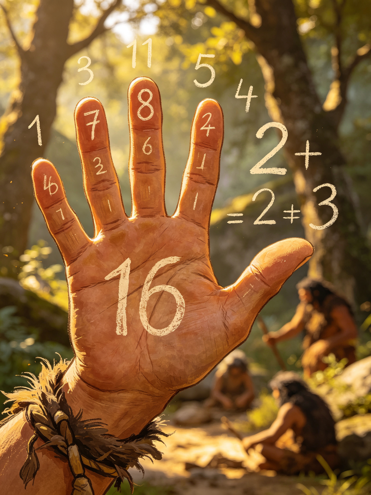

<ArchiveCopyPanel article-id="162178458" />

{"markdown":"PiDliIbnsbvvvJrmlofmmI7ov5vpmLYyMDDorrIgIAo+IOe8luWPt++8mmAxNjIxNzg0NThgICAKPiDljp/lp4vmlofku7bvvJpg5Y2B6L+b5Yi25Y+q5piv5Lq657G76K6h5pWw5Lmg5oOv5pWw5a2X55Sf6ZW/5pys5bCx5pyJ5aSa56eN6L+b5L2N6KeE5b6LLeWFqOWfn+aVsOWtpnZz5Lyg57uf5pWw5a2m5Lq657G75paH5piO6L+b6Zi2MjAw6K6y56ysMTPorrLlsI8tMTYyMTc4NDU4Lm1kYCAgCj4g6L+U5Zue77yaW+acrOS5puW9kuaho10oL3poL2Jvb2tzL2NvdXJzZS9hcnRpY2xlcy8pIMK3IFvmgLvlhaXlj6NdKC96aC9ib29rcy9hcnRpY2xlcy8pCgrkvZzogIXvvJog5LmW5LmW5pWw5a2mCgotLS0KCiMjIOOAiuWFqOWfn+aVsOWtpnZz5Lyg57uf5pWw5a2m77ya5Lq657G75paH5piO6L+b6Zi2MjAw6K6y44CL56ysMTPorrIg5bCP5a2m6YCa5L+X54mI6YCQ5a2X56i/CgohW+WPjOieuuaXi+aVsOWtl+eUn+mVv+Wwgemdol0oLi9hc3NldHMvY3NkbmltZy9qcGcvNTdmMDFhMGIxMGJmMDQzOC5qcGcpCgotLS0KCuiusuasoe+8miDnrKwxM+iusgoK5Li76aKY77yaIOWNgei/m+WItuWPquaYr+S6uuexu+iuoeaVsOS5oOaDr++8jOaVsOWtl+eUn+mVv+acrOWwseacieWkmuenjei/m+S9jeinhOW+iwoK5a+55qCH6K++5pys55+l6K+G54K577yaIOWNgei/m+WItuiuoeaVsOOAgeaVsOS9jeiupOivhgoK5paH6aOO77yaIOWPo+ivreeugOWNleaYk+aHgu+8jOaXoOS4k+S4mumavuivje+8jOW7tue7reWPjOieuuaXi+OAgeiHqueEtuWOn+eUn+S9k+ezu+avlOWWuwoKLS0tCgojIyMgMO+9njPliIbpkp8g5aSN5Lmg5a+85YWlCgohW+WPjOieuuaXi+Wxsei3r+WIhuW9oueUn+mVv10oLi9hc3NldHMvY3NkbmltZy9qcGcvYWVhZjkwNmEzNDcwNTIyZS5qcGcpCgrlkIzlrabku6zvvIzkuIroioLor77miJHku6zogYrkuobljpjnsbPjgIHnsbPpg73mmK/kurrkuLrlgZrlh7rmnaXnmoTlsLrlrZDvvIzoirHojYnjgIHmlbDlrZfonrrml4vmnKzouqvoh6rluKblpKnnhLbplb/nn63mr5TkvovjgIIKCuaVsOWtpuivvuS7juS4gOW5tOe6p+W8gOWni++8jOiAgeW4iOWwseWPjeWkjeWRiuivieaIkeS7rO+8muaVsOWtl+mAouWNgei/m+S4gO+8jOS4quS9jea7oeWNgeWPmOWNgeS9je+8jOWNgeS9jea7oeWNgeWPmOeZvuS9je+8jOWFqOS4lueVjOmAmueUqOWNgei/m+WItuOAggoK5LuK5aSp5ZKx5Lus5omT56C05Zu65pyJ6K6k55+l77ya6YCi5Y2B6L+b5LiA5Y+q5piv5Y+k5Lq65pa55L6/5o6w5omL5oyH5pWw5pWw5a6a5LiL55qE5Lmg5oOv77yM5pWw5a2X5Lik5p2h55Sf6ZW/5bGx6Lev77yM5aSp54S25a2Y5Zyo5aSa56eN6L+b5L2N6IqC5aWP77yM5LiN5Y+q5pyJ5Y2B6L+b5Yi25LiA56eN6KeE5YiZ44CCCgrku47mlbDlrabnmoTop5LluqbnnIvvvIzku7vmhI/ov5vliLYgYmJiIOS4i+eahOaVsOS9jeadg+mHjemDvemBteW+qu+8mgoKYjAsYjEsYjIsYjMs4oCmYl4wLCBiXjEsIGJeMiwgYl4zLCBcbGRvdHNiMCxiMSxiMixiMyzigKYKCuWNgei/m+WItuWPquaYr+W9kyBiPTEwYj0xMGI9MTAg5pe255qE54m55q6K5oOF5Ya177yaCgoxMDA9MSwxMDE9MTAsMTAyPTEwMCwxMDM9MTAwMCzigKYxMF4wPTEsXHF1YWQgMTBeMT0xMCxccXVhZCAxMF4yPTEwMCxccXVhZCAxMF4zPTEwMDAsXHF1YWQgXGxkb3RzMTAwPTEsMTAxPTEwLDEwMj0xMDAsMTAzPTEwMDAs4oCmCgotLS0KCiMjIyAz772eMTPliIbpkp8g55Sf5rS75YyW57G75q+U6K6y6KejCgrlhYjor7Tor77mnKzph4znmoTljYHov5vliLbmnaXmupDvvJoKCiFb6L+c5Y+k5omL5oyH6K6h5pWw5LiO5Y2B6L+b5Yi26LW35rqQXSguL2Fzc2V0cy9jc2RuaW1nL2pwZy9kNmEwYjA0N2JjYTdlZjQ5LmpwZykKCuWPpOaXtuWAmeS6uuacieWNgeagueaJi+aMh++8jOaVsOWIsOWNgeagueWwseiusOaIkOS4gOe7hO+8jOaFouaFouW9ouaIkOmAouWNgei/m+S4gOeahOiuoeaVsOaWueazle+8jOWPquaYr+S4uuS6huaWueS+v+S6uuexu+iuoeeul+OAgeS6pOa1geOAggoK5pS+5Yiw5oiR5Lus5pWw5a2X5Y+M6J665peL5L2T57O76YeM55yL77yaCgrljp/nlJ/mlbDlrZfjgIHnu4TlkIjmlbDlrZfkuKTmnaHlsbHot6/lkIzmraXnlJ/plb/vvIzlroPku6zkuKTkuKTphY3lr7njgIHliIblsYLlj6DliqDnmoToioLlpY/lkITkuI3nm7jlkIzvvIzmnInnmoTkuInlsYLkuIDnu4TjgIHmnInnmoTkupTlsYLkuIDnu4TjgIHmnInnmoTkuIPlsYLkuIDnu4TvvIzlr7nlupTkuI3lkIzlpKnnhLbov5vkvY3jgIIKCuS4vuS4pOS4quWwj+aci+WPi+iDveeci+aHgueahOS+i+WtkO+8mgoKLSAKCuS4gOWRqOS4g+Wkqe+8jOaYr+WkqeeEtuS4g+e7hOW+queOr++8m+S4gOW5tOWNgeS6jOS4quaciO+8jOaYr+WNgeS6jOi/m+S9jeW+queOr++8jOeUn+a0u+mHjOacrOadpeWwseS4jeaYr+WFqOmDqOaMieWNgeWIhue7hO+8mwoKLSAKCuaVsOWtl+WOn+eUn+iEiee7nOmHjO+8jDPjgIE144CBN+i/meexu+WOn+eUn+aVsOWtl+S8muiHquaIkOS4gOe7hOeUn+mVv++8jOebuOW9k+S6juS4iei/m+WItuOAgeS6lOi/m+WItuOAgeS4g+i/m+WItueahOWkqeeEtuWOn+Wei++8jOS4jeaYr+S6uuexu+WHreepuuWIm+mAoOOAggoKIVvlpJrnu7Tov5vkvY3nqbrpl7Tlh6DkvZXnu5PmnoRdKC4vYXNzZXRzL2NzZG5pbWcvanBnL2M3MzdjYWMwYzU2MjMyZTYuanBnKQoK6K++5pys5Y+q5pWZ5Y2B6L+b5Yi277yM5oqK5omA5pyJ5pWw5a2X6YO95by66KGM5oyJ5Y2B5YiG57uE77yM5bCx5YOP5LiN566h5LuA5LmI5Lic6KW/77yM5YWo6YO956Gs5aGe6L+b5Y2B5Liq5qC85a2Q6YeM77yM5o6p55uW5LqG5pWw5a2X5pys6Lqr5aSa5qC355qE55Sf6ZW/6IqC5aWP44CCCgrkuI3lkIzov5vliLbnmoTmnKzotKjvvIzlhbblrp7mmK/kuI3lkIznmoTliIbnu4TmlrnlvI/jgILmr5TlpoLkuInov5vliLbkuIvvvIzmr4/kuInkvY3lsLHov5vkuIDkvY3vvJoKCjMwPTEsMzE9MywzMj05LDMzPTI3LOKApjNeMD0xLFxxdWFkIDNeMT0zLFxxdWFkIDNeMj05LFxxdWFkIDNeMz0yNyxccXVhZCBcbGRvdHMzMD0xLDMxPTMsMzI9OSwzMz0yNyzigKYKCuS6lOi/m+WItuS4i++8mgoKNTA9MSw1MT01LDUyPTI1LDUzPTEyNSzigKY1XjA9MSxccXVhZCA1XjE9NSxccXVhZCA1XjI9MjUsXHF1YWQgNV4zPTEyNSxccXVhZCBcbGRvdHM1MD0xLDUxPTUsNTI9MjUsNTM9MTI1LOKApgoK5LiD6L+b5Yi25LiL77yaCgo3MD0xLDcxPTcsNzI9NDksNzM9MzQzLOKApjdeMD0xLFxxdWFkIDdeMT03LFxxdWFkIDdeMj00OSxccXVhZCA3XjM9MzQzLFxxdWFkIFxsZG90czcwPTEsNzE9Nyw3Mj00OSw3Mz0zNDMs4oCmCgrmr4/kuIDnp43ov5vliLbvvIzpg73mmK/mlbDlrZfnlJ/plb/nmoTkuIDnp43lpKnnhLboioLlpY/jgIIKCi0tLQoKIyMjIDEz772eMjLliIbpkp8g6K++5pys6KeC54K5IHZzIOWFqOWfn+aVsOWtpumAmuS/l+ingueCuQoKIVvkvKDnu5/ljYHov5vliLbkuI7lhajln5/mlbDlrablr7nmr5RdKC4vYXNzZXRzL2NzZG5pbWcvanBnL2QzZmEwYjM5OTUyZTY1ZTcuanBnKQoKIyMjIyDkvKDnu5/or77mnKzorqTnn6UKCi0gCgrljYHov5vliLbmmK/llK/kuIDmoIflh4borqHmlbDop4TliJnvvIzmiYDmnInmlbDlrZfpg73pgKLljYHov5vkuIAKCi0gCgrkuKrkvY3jgIHljYHkvY3jgIHnmb7kvY3nmoTliJLliIbmmK/mlbDlrZflpKnnlJ/oh6rluKbnmoTnu5PmnoQKCi0gCgrlhbbku5bov5vliLblj6rmmK/nibnmrorlhrfpl6jnlKjms5XvvIzkuI3pgJrnlKgKCiMjIyMg5YWo5Z+f5pWw5a2m6YCa5L+X6K6k55+lCgotIAoK5Y2B6L+b5Yi25Y+q5piv5Lq657G75L6d6Z2g5omL5oyH5Yib6YCg55qE5L6/5Yip5bel5YW377yM5LiN5piv5a6H5a6Z5Y6f55Sf6K6h5pWw6KeE5YiZCgotIAoK5pWw5a2X5Y+M6J665peL55Sf6ZW/6Ieq5bim5LiJ44CB5LqU44CB5LiD562J5aSa56eN5aSp54S25YiG57uE5b6q546vCgotIAoK5Y2B6L+b5Yi25Y+q5piv5LyX5aSa6L+b5L2N6KeE5YiZ6YeM55qE5YW25Lit5LiA56eN77yM5LiN6IO95Luj6KGo5pWw5a2X5YWo6YOo55Sf6ZW/6KeE5b6LCgrnroDljZXmr5TllrvvvJoKCuWNgei/m+WItuWlveavlOe7n+S4gOeahOWNgeagvOaUtue6s+ebku+8mwoK5pWw5a2X5Y6f55Sf6L+b5L2N5piv5ZCE5byP5ZCE5qC344CB5aSn5bCP5LiN5LiA55qE5aSp54S25pS257qz5qC877yM5LiJ5qC844CB5LqU5qC844CB5LiD5qC86YO95a2Y5Zyo44CCCgrku47mlbDlrabmnKzotKjkuIror7TvvIzku7vmhI/mraPmlbTmlbAgYj4xYj4xYj4xIOmDveWPr+S7peS9nOS4uui/m+S9jeWfuuaVsOOAguS4gOS4quaVsCBOTk4g5ZyoIGJiYiDov5vliLbkuIvlj6/ku6XooajnpLrkuLrvvJoKCuWFtuS4reavj+S4gOS9jeaVsOWtlyBhaWFfaWFp4oCLIOeahOWPluWAvOiMg+WbtOaYryAw4omkYWkw4omkYWnigIs8YuOAggoK5b2TIGI9MTBiPTEwYj0xMCDml7bvvIzov5nlsLHmmK/miJHku6znhp/mgonnmoTljYHov5vliLbvvJvlvZMgYj0yYj0yYj0yIOaXtu+8jOWwseaYr+iuoeeul+acuuS9v+eUqOeahOS6jOi/m+WItu+8m+W9kyBiPTE2Yj0xNmI9MTYg5pe277yM5bCx5piv5Y2B5YWt6L+b5Yi244CC5q+P5LiA56eN6YCJ5oup77yM6YO95omT5byA5LqG6KeC5a+f5pWw5a2X5LiW55WM55qE5LiA5omH5paw56qX5Y+j44CCCgotLS0KCiMjIyAyMu+9njI35YiG6ZKfIOagoeWGheWtpuS5oOaPkOmGku+8jOS4jeW9seWTjeiAg+ivleWBmumimAoK5pel5bi45YaZ5L2c5Lia44CB5Y+j566X44CB5pWw5L2N5o2i566X77yM5YWo6YOo5oyJ5Y2B6L+b5Yi26K6h566X5a6M5YWo5q2j56Gu77yM6ICD6K+V5LiN5Lya5omj5YiG44CCCgrmnKzoioLor77lj6rmmK/mi5PlsZXorqTnn6XvvJrljYHov5vliLbmmK/kurrnsbvlj5HmmI7nmoTorqHmlbDkuaDmg6/vvIzmlbDlrZfmnKzouqvnlJ/plb/mi6XmnInlpJrnp43lpKnnhLbov5vkvY3oioLlpY/jgIIKCuS8j+eslOmTuuWeq++8muesrDI16K6y5bCP5a2m5q+V5Lia5LiT5Zy677yM5rGH5oC75YmNMjTorrLlhajpg6jlhoXlrrnvvIzlrozmlbTmorPnkIYw44CBMei1t+eCueWPjOieuuaXi+WujOaVtOeUn+mVv+mAu+i+keOAggoKLS0tCgojIyMgMjfvvZ4zMOWIhumSnyDor77loILmgLvnu5Mr5LiL6IqC6K++6aKE5ZGKCgohW+Wuh+WumeiDvemHj+Wxgue6p+e7k+WwvueUu+mdol0oLi9hc3NldHMvY3NkbmltZy9qcGcvNzI1ZmY4NTdkNWMwNDQ0OC5qcGcpCgojIyMjIOacrOiKguivvuWwj+e7k++8mgoK5Y2B6L+b5Yi25piv5Lq65Li66K6h5pWw5Lmg5oOv77yM5pWw5a2X5Y+M6J665peL55Sf6ZW/6Ieq5bim5aSa56eN5aSp54S26L+b5L2N5YiG57uE6KeE5b6L44CCCgojIyMjIOS4i+S4gOiKguivvu+8mgoK6YeN6YeP5Y2V5L2N5piv5Lq65Li656ew6YeN5qCH5YeG77yM5LiH54mp6Ieq5bim5Y6f55Sf6IO96YeP6L276YeN5bGC57qn44CCCgrigJTkvZzogIXvvJog5LmW5LmW5pWw5a2mCgotLS0KCiMjIOOAiuWFqOWfn+aVsOWtpnZz5Lyg57uf5pWw5a2m77ya5Lq657G75paH5piO6L+b6Zi2MjAw6K6y44CL56ysMTPorrIg5bCP5a2m6YCa5L+X54mI6YCQ5a2X56i/CgohW+WPjOieuuaXi+aVsOWtl+eUn+mVv+Wwgemdol0oLi9hc3NldHMvY3NkbmltZy9qcGcvNTdmMDFhMGIxMGJmMDQzOC5qcGcpCgotLS0KCuiusuasoe+8miDnrKwxM+iusgoK5Li76aKY77yaIOWNgei/m+WItuWPquaYr+S6uuexu+iuoeaVsOS5oOaDr++8jOaVsOWtl+eUn+mVv+acrOWwseacieWkmuenjei/m+S9jeinhOW+iwoK5a+55qCH6K++5pys55+l6K+G54K577yaIOWNgei/m+WItuiuoeaVsOOAgeaVsOS9jeiupOivhgoK5paH6aOO77yaIOWPo+ivreeugOWNleaYk+aHgu+8jOaXoOS4k+S4mumavuivje+8jOW7tue7reWPjOieuuaXi+OAgeiHqueEtuWOn+eUn+S9k+ezu+avlOWWuwoKLS0tCgojIyMgMO+9njPliIbpkp8g5aSN5Lmg5a+85YWlCgohW+WPjOieuuaXi+Wxsei3r+WIhuW9oueUn+mVv10oLi9hc3NldHMvY3NkbmltZy9qcGcvYWVhZjkwNmEzNDcwNTIyZS5qcGcpCgrlkIzlrabku6zvvIzkuIroioLor77miJHku6zogYrkuobljpjnsbPjgIHnsbPpg73mmK/kurrkuLrlgZrlh7rmnaXnmoTlsLrlrZDvvIzoirHojYnjgIHmlbDlrZfonrrml4vmnKzouqvoh6rluKblpKnnhLbplb/nn63mr5TkvovjgIIKCuaVsOWtpuivvuS7juS4gOW5tOe6p+W8gOWni++8jOiAgeW4iOWwseWPjeWkjeWRiuivieaIkeS7rO+8muaVsOWtl+mAouWNgei/m+S4gO+8jOS4quS9jea7oeWNgeWPmOWNgeS9je+8jOWNgeS9jea7oeWNgeWPmOeZvuS9je+8jOWFqOS4lueVjOmAmueUqOWNgei/m+WItuOAggoK5LuK5aSp5ZKx5Lus5omT56C05Zu65pyJ6K6k55+l77ya6YCi5Y2B6L+b5LiA5Y+q5piv5Y+k5Lq65pa55L6/5o6w5omL5oyH5pWw5pWw5a6a5LiL55qE5Lmg5oOv77yM5pWw5a2X5Lik5p2h55Sf6ZW/5bGx6Lev77yM5aSp54S25a2Y5Zyo5aSa56eN6L+b5L2N6IqC5aWP77yM5LiN5Y+q5pyJ5Y2B6L+b5Yi25LiA56eN6KeE5YiZ44CCCgrku47mlbDlrabnmoTop5LluqbnnIvvvIzku7vmhI/ov5vliLYgYmJiIOS4i+eahOaVsOS9jeadg+mHjemDvemBteW+qu+8mgoKYjAsYjEsYjIsYjMs4oCmYl4wLCBiXjEsIGJeMiwgYl4zLCBcbGRvdHNiMCxiMSxiMixiMyzigKYKCuWNgei/m+WItuWPquaYr+W9kyBiPTEwYj0xMGI9MTAg5pe255qE54m55q6K5oOF5Ya177yaCgoxMDA9MSwxMDE9MTAsMTAyPTEwMCwxMDM9MTAwMCzigKYxMF4wPTEsXHF1YWQgMTBeMT0xMCxccXVhZCAxMF4yPTEwMCxccXVhZCAxMF4zPTEwMDAsXHF1YWQgXGxkb3RzMTAwPTEsMTAxPTEwLDEwMj0xMDAsMTAzPTEwMDAs4oCmCgotLS0KCiMjIyAz772eMTPliIbpkp8g55Sf5rS75YyW57G75q+U6K6y6KejCgrlhYjor7Tor77mnKzph4znmoTljYHov5vliLbmnaXmupDvvJoKCiFb6L+c5Y+k5omL5oyH6K6h5pWw5LiO5Y2B6L+b5Yi26LW35rqQXSguL2Fzc2V0cy9jc2RuaW1nL2pwZy9kNmEwYjA0N2JjYTdlZjQ5LmpwZykKCuWPpOaXtuWAmeS6uuacieWNgeagueaJi+aMh++8jOaVsOWIsOWNgeagueWwseiusOaIkOS4gOe7hO+8jOaFouaFouW9ouaIkOmAouWNgei/m+S4gOeahOiuoeaVsOaWueazle+8jOWPquaYr+S4uuS6huaWueS+v+S6uuexu+iuoeeul+OAgeS6pOa1geOAggoK5pS+5Yiw5oiR5Lus5pWw5a2X5Y+M6J665peL5L2T57O76YeM55yL77yaCgrljp/nlJ/mlbDlrZfjgIHnu4TlkIjmlbDlrZfkuKTmnaHlsbHot6/lkIzmraXnlJ/plb/vvIzlroPku6zkuKTkuKTphY3lr7njgIHliIblsYLlj6DliqDnmoToioLlpY/lkITkuI3nm7jlkIzvvIzmnInnmoTkuInlsYLkuIDnu4TjgIHmnInnmoTkupTlsYLkuIDnu4TjgIHmnInnmoTkuIPlsYLkuIDnu4TvvIzlr7nlupTkuI3lkIzlpKnnhLbov5vkvY3jgIIKCuS4vuS4pOS4quWwj+aci+WPi+iDveeci+aHgueahOS+i+WtkO+8mgoKLSAKCuS4gOWRqOS4g+Wkqe+8jOaYr+WkqeeEtuS4g+e7hOW+queOr++8m+S4gOW5tOWNgeS6jOS4quaciO+8jOaYr+WNgeS6jOi/m+S9jeW+queOr++8jOeUn+a0u+mHjOacrOadpeWwseS4jeaYr+WFqOmDqOaMieWNgeWIhue7hO+8mwoKLSAKCuaVsOWtl+WOn+eUn+iEiee7nOmHjO+8jDPjgIE144CBN+i/meexu+WOn+eUn+aVsOWtl+S8muiHquaIkOS4gOe7hOeUn+mVv++8jOebuOW9k+S6juS4iei/m+WItuOAgeS6lOi/m+WItuOAgeS4g+i/m+WItueahOWkqeeEtuWOn+Wei++8jOS4jeaYr+S6uuexu+WHreepuuWIm+mAoOOAggoKIVvlpJrnu7Tov5vkvY3nqbrpl7Tlh6DkvZXnu5PmnoRdKC4vYXNzZXRzL2NzZG5pbWcvanBnL2M3MzdjYWMwYzU2MjMyZTYuanBnKQoK6K++5pys5Y+q5pWZ5Y2B6L+b5Yi277yM5oqK5omA5pyJ5pWw5a2X6YO95by66KGM5oyJ5Y2B5YiG57uE77yM5bCx5YOP5LiN566h5LuA5LmI5Lic6KW/77yM5YWo6YO956Gs5aGe6L+b5Y2B5Liq5qC85a2Q6YeM77yM5o6p55uW5LqG5pWw5a2X5pys6Lqr5aSa5qC355qE55Sf6ZW/6IqC5aWP44CCCgrkuI3lkIzov5vliLbnmoTmnKzotKjvvIzlhbblrp7mmK/kuI3lkIznmoTliIbnu4TmlrnlvI/jgILmr5TlpoLkuInov5vliLbkuIvvvIzmr4/kuInkvY3lsLHov5vkuIDkvY3vvJoKCjMwPTEsMzE9MywzMj05LDMzPTI3LOKApjNeMD0xLFxxdWFkIDNeMT0zLFxxdWFkIDNeMj05LFxxdWFkIDNeMz0yNyxccXVhZCBcbGRvdHMzMD0xLDMxPTMsMzI9OSwzMz0yNyzigKYKCuS6lOi/m+WItuS4i++8mgoKNTA9MSw1MT01LDUyPTI1LDUzPTEyNSzigKY1XjA9MSxccXVhZCA1XjE9NSxccXVhZCA1XjI9MjUsXHF1YWQgNV4zPTEyNSxccXVhZCBcbGRvdHM1MD0xLDUxPTUsNTI9MjUsNTM9MTI1LOKApgoK5LiD6L+b5Yi25LiL77yaCgo3MD0xLDcxPTcsNzI9NDksNzM9MzQzLOKApjdeMD0xLFxxdWFkIDdeMT03LFxxdWFkIDdeMj00OSxccXVhZCA3XjM9MzQzLFxxdWFkIFxsZG90czcwPTEsNzE9Nyw3Mj00OSw3Mz0zNDMs4oCmCgrmr4/kuIDnp43ov5vliLbvvIzpg73mmK/mlbDlrZfnlJ/plb/nmoTkuIDnp43lpKnnhLboioLlpY/jgIIKCi0tLQoKIyMjIDEz772eMjLliIbpkp8g6K++5pys6KeC54K5IHZzIOWFqOWfn+aVsOWtpumAmuS/l+ingueCuQoKIVvkvKDnu5/ljYHov5vliLbkuI7lhajln5/mlbDlrablr7nmr5RdKC4vYXNzZXRzL2NzZG5pbWcvanBnL2QzZmEwYjM5OTUyZTY1ZTcuanBnKQoKIyMjIyDkvKDnu5/or77mnKzorqTnn6UKCi0gCgrljYHov5vliLbmmK/llK/kuIDmoIflh4borqHmlbDop4TliJnvvIzmiYDmnInmlbDlrZfpg73pgKLljYHov5vkuIAKCi0gCgrkuKrkvY3jgIHljYHkvY3jgIHnmb7kvY3nmoTliJLliIbmmK/mlbDlrZflpKnnlJ/oh6rluKbnmoTnu5PmnoQKCi0gCgrlhbbku5bov5vliLblj6rmmK/nibnmrorlhrfpl6jnlKjms5XvvIzkuI3pgJrnlKgKCiMjIyMg5YWo5Z+f5pWw5a2m6YCa5L+X6K6k55+lCgotIAoK5Y2B6L+b5Yi25Y+q5piv5Lq657G75L6d6Z2g5omL5oyH5Yib6YCg55qE5L6/5Yip5bel5YW377yM5LiN5piv5a6H5a6Z5Y6f55Sf6K6h5pWw6KeE5YiZCgotIAoK5pWw5a2X5Y+M6J665peL55Sf6ZW/6Ieq5bim5LiJ44CB5LqU44CB5LiD562J5aSa56eN5aSp54S25YiG57uE5b6q546vCgotIAoK5Y2B6L+b5Yi25Y+q5piv5LyX5aSa6L+b5L2N6KeE5YiZ6YeM55qE5YW25Lit5LiA56eN77yM5LiN6IO95Luj6KGo5pWw5a2X5YWo6YOo55Sf6ZW/6KeE5b6LCgrnroDljZXmr5TllrvvvJoKCuWNgei/m+WItuWlveavlOe7n+S4gOeahOWNgeagvOaUtue6s+ebku+8mwoK5pWw5a2X5Y6f55Sf6L+b5L2N5piv5ZCE5byP5ZCE5qC344CB5aSn5bCP5LiN5LiA55qE5aSp54S25pS257qz5qC877yM5LiJ5qC844CB5LqU5qC844CB5LiD5qC86YO95a2Y5Zyo44CCCgrku47mlbDlrabmnKzotKjkuIror7TvvIzku7vmhI/mraPmlbTmlbAgYj4xYj4xYj4xIOmDveWPr+S7peS9nOS4uui/m+S9jeWfuuaVsOOAguS4gOS4quaVsCBOTk4g5ZyoIGJiYiDov5vliLbkuIvlj6/ku6XooajnpLrkuLrvvJoKCuWFtuS4reavj+S4gOS9jeaVsOWtlyBhaWFfaWFp4oCLIOeahOWPluWAvOiMg+WbtOaYryAw4omkYWkw4omkYWnigIs8YuOAggoK5b2TIGI9MTBiPTEwYj0xMCDml7bvvIzov5nlsLHmmK/miJHku6znhp/mgonnmoTljYHov5vliLbvvJvlvZMgYj0yYj0yYj0yIOaXtu+8jOWwseaYr+iuoeeul+acuuS9v+eUqOeahOS6jOi/m+WItu+8m+W9kyBiPTE2Yj0xNmI9MTYg5pe277yM5bCx5piv5Y2B5YWt6L+b5Yi244CC5q+P5LiA56eN6YCJ5oup77yM6YO95omT5byA5LqG6KeC5a+f5pWw5a2X5LiW55WM55qE5LiA5omH5paw56qX5Y+j44CCCgotLS0KCiMjIyAyMu+9njI35YiG6ZKfIOagoeWGheWtpuS5oOaPkOmGku+8jOS4jeW9seWTjeiAg+ivleWBmumimAoK5pel5bi45YaZ5L2c5Lia44CB5Y+j566X44CB5pWw5L2N5o2i566X77yM5YWo6YOo5oyJ5Y2B6L+b5Yi26K6h566X5a6M5YWo5q2j56Gu77yM6ICD6K+V5LiN5Lya5omj5YiG44CCCgrmnKzoioLor77lj6rmmK/mi5PlsZXorqTnn6XvvJrljYHov5vliLbmmK/kurrnsbvlj5HmmI7nmoTorqHmlbDkuaDmg6/vvIzmlbDlrZfmnKzouqvnlJ/plb/mi6XmnInlpJrnp43lpKnnhLbov5vkvY3oioLlpY/jgIIKCuS8j+eslOmTuuWeq++8muesrDI16K6y5bCP5a2m5q+V5Lia5LiT5Zy677yM5rGH5oC75YmNMjTorrLlhajpg6jlhoXlrrnvvIzlrozmlbTmorPnkIYw44CBMei1t+eCueWPjOieuuaXi+WujOaVtOeUn+mVv+mAu+i+keOAggoKLS0tCgojIyMgMjfvvZ4zMOWIhumSnyDor77loILmgLvnu5Mr5LiL6IqC6K++6aKE5ZGKCgohW+Wuh+WumeiDvemHj+Wxgue6p+e7k+WwvueUu+mdol0oLi9hc3NldHMvY3NkbmltZy9qcGcvNzI1ZmY4NTdkNWMwNDQ0OC5qcGcpCgojIyMjIOacrOiKguivvuWwj+e7k++8mgoK5Y2B6L+b5Yi25piv5Lq65Li66K6h5pWw5Lmg5oOv77yM5pWw5a2X5Y+M6J665peL55Sf6ZW/6Ieq5bim5aSa56eN5aSp54S26L+b5L2N5YiG57uE6KeE5b6L44CCCgojIyMjIOS4i+S4gOiKguivvu+8mgoK6YeN6YeP5Y2V5L2N5piv5Lq65Li656ew6YeN5qCH5YeG77yM5LiH54mp6Ieq5bim5Y6f55Sf6IO96YeP6L276YeN5bGC57qn44CCCgotLS0K","text":"5YiG57G777ya5paH5piO6L+b6Zi2MjAw6K6yICAK57yW5Y+377yaMTYyMTc4NDU4ICAK5Y6f5aeL5paH5Lu277ya5Y2B6L+b5Yi25Y+q5piv5Lq657G76K6h5pWw5Lmg5oOv5pWw5a2X55Sf6ZW/5pys5bCx5pyJ5aSa56eN6L+b5L2N6KeE5b6LLeWFqOWfn+aVsOWtpnZz5Lyg57uf5pWw5a2m5Lq657G75paH5piO6L+b6Zi2MjAw6K6y56ysMTPorrLlsI8tMTYyMTc4NDU4Lm1kICAK6L+U5Zue77ya5pys5Lmm5b2S5qGjIMK3IOaAu+WFpeWPowoK5L2c6ICF77yaIOS5luS5luaVsOWtpgoKLS0tCgrjgIrlhajln5/mlbDlraZ2c+S8oOe7n+aVsOWtpu+8muS6uuexu+aWh+aYjui/m+mYtjIwMOiusuOAi+esrDEz6K6yIOWwj+WtpumAmuS/l+eJiOmAkOWtl+eovwoK5Y+M6J665peL5pWw5a2X55Sf6ZW/5bCB6Z2iCgotLS0KCuiusuasoe+8miDnrKwxM+iusgoK5Li76aKY77yaIOWNgei/m+WItuWPquaYr+S6uuexu+iuoeaVsOS5oOaDr++8jOaVsOWtl+eUn+mVv+acrOWwseacieWkmuenjei/m+S9jeinhOW+iwoK5a+55qCH6K++5pys55+l6K+G54K577yaIOWNgei/m+WItuiuoeaVsOOAgeaVsOS9jeiupOivhgoK5paH6aOO77yaIOWPo+ivreeugOWNleaYk+aHgu+8jOaXoOS4k+S4mumavuivje+8jOW7tue7reWPjOieuuaXi+OAgeiHqueEtuWOn+eUn+S9k+ezu+avlOWWuwoKLS0tCgow772eM+WIhumSnyDlpI3kuaDlr7zlhaUKCuWPjOieuuaXi+Wxsei3r+WIhuW9oueUn+mVvwoK5ZCM5a2m5Lus77yM5LiK6IqC6K++5oiR5Lus6IGK5LqG5Y6Y57Gz44CB57Gz6YO95piv5Lq65Li65YGa5Ye65p2l55qE5bC65a2Q77yM6Iqx6I2J44CB5pWw5a2X6J665peL5pys6Lqr6Ieq5bim5aSp54S26ZW/55+t5q+U5L6L44CCCgrmlbDlrabor77ku47kuIDlubTnuqflvIDlp4vvvIzogIHluIjlsLHlj43lpI3lkYror4nmiJHku6zvvJrmlbDlrZfpgKLljYHov5vkuIDvvIzkuKrkvY3mu6HljYHlj5jljYHkvY3vvIzljYHkvY3mu6HljYHlj5jnmb7kvY3vvIzlhajkuJbnlYzpgJrnlKjljYHov5vliLbjgIIKCuS7iuWkqeWSseS7rOaJk+egtOWbuuacieiupOefpe+8mumAouWNgei/m+S4gOWPquaYr+WPpOS6uuaWueS+v+aOsOaJi+aMh+aVsOaVsOWumuS4i+eahOS5oOaDr++8jOaVsOWtl+S4pOadoeeUn+mVv+Wxsei3r++8jOWkqeeEtuWtmOWcqOWkmuenjei/m+S9jeiKguWlj++8jOS4jeWPquacieWNgei/m+WItuS4gOenjeinhOWImeOAggoK5LuO5pWw5a2m55qE6KeS5bqm55yL77yM5Lu75oSP6L+b5Yi2IGJiYiDkuIvnmoTmlbDkvY3mnYPph43pg73pgbXlvqrvvJoKCmIwLGIxLGIyLGIzLOKApmJeMCwgYl4xLCBiXjIsIGJeMywgXGxkb3RzYjAsYjEsYjIsYjMs4oCmCgrljYHov5vliLblj6rmmK/lvZMgYj0xMGI9MTBiPTEwIOaXtueahOeJueauiuaDheWGte+8mgoKMTAwPTEsMTAxPTEwLDEwMj0xMDAsMTAzPTEwMDAs4oCmMTBeMD0xLFxxdWFkIDEwXjE9MTAsXHF1YWQgMTBeMj0xMDAsXHF1YWQgMTBeMz0xMDAwLFxxdWFkIFxsZG90czEwMD0xLDEwMT0xMCwxMDI9MTAwLDEwMz0xMDAwLOKApgoKLS0tCgoz772eMTPliIbpkp8g55Sf5rS75YyW57G75q+U6K6y6KejCgrlhYjor7Tor77mnKzph4znmoTljYHov5vliLbmnaXmupDvvJoKCui/nOWPpOaJi+aMh+iuoeaVsOS4juWNgei/m+WItui1t+a6kAoK5Y+k5pe25YCZ5Lq65pyJ5Y2B5qC55omL5oyH77yM5pWw5Yiw5Y2B5qC55bCx6K6w5oiQ5LiA57uE77yM5oWi5oWi5b2i5oiQ6YCi5Y2B6L+b5LiA55qE6K6h5pWw5pa55rOV77yM5Y+q5piv5Li65LqG5pa55L6/5Lq657G76K6h566X44CB5Lqk5rWB44CCCgrmlL7liLDmiJHku6zmlbDlrZflj4zonrrml4vkvZPns7vph4znnIvvvJoKCuWOn+eUn+aVsOWtl+OAgee7hOWQiOaVsOWtl+S4pOadoeWxsei3r+WQjOatpeeUn+mVv++8jOWug+S7rOS4pOS4pOmFjeWvueOAgeWIhuWxguWPoOWKoOeahOiKguWlj+WQhOS4jeebuOWQjO+8jOacieeahOS4ieWxguS4gOe7hOOAgeacieeahOS6lOWxguS4gOe7hOOAgeacieeahOS4g+WxguS4gOe7hO+8jOWvueW6lOS4jeWQjOWkqeeEtui/m+S9jeOAggoK5Li+5Lik5Liq5bCP5pyL5Y+L6IO955yL5oeC55qE5L6L5a2Q77yaCuS4gOWRqOS4g+Wkqe+8jOaYr+WkqeeEtuS4g+e7hOW+queOr++8m+S4gOW5tOWNgeS6jOS4quaciO+8jOaYr+WNgeS6jOi/m+S9jeW+queOr++8jOeUn+a0u+mHjOacrOadpeWwseS4jeaYr+WFqOmDqOaMieWNgeWIhue7hO+8mwrmlbDlrZfljp/nlJ/ohInnu5zph4zvvIwz44CBNeOAgTfov5nnsbvljp/nlJ/mlbDlrZfkvJroh6rmiJDkuIDnu4TnlJ/plb/vvIznm7jlvZPkuo7kuInov5vliLbjgIHkupTov5vliLbjgIHkuIPov5vliLbnmoTlpKnnhLbljp/lnovvvIzkuI3mmK/kurrnsbvlh63nqbrliJvpgKDjgIIKCuWkmue7tOi/m+S9jeepuumXtOWHoOS9lee7k+aehAoK6K++5pys5Y+q5pWZ5Y2B6L+b5Yi277yM5oqK5omA5pyJ5pWw5a2X6YO95by66KGM5oyJ5Y2B5YiG57uE77yM5bCx5YOP5LiN566h5LuA5LmI5Lic6KW/77yM5YWo6YO956Gs5aGe6L+b5Y2B5Liq5qC85a2Q6YeM77yM5o6p55uW5LqG5pWw5a2X5pys6Lqr5aSa5qC355qE55Sf6ZW/6IqC5aWP44CCCgrkuI3lkIzov5vliLbnmoTmnKzotKjvvIzlhbblrp7mmK/kuI3lkIznmoTliIbnu4TmlrnlvI/jgILmr5TlpoLkuInov5vliLbkuIvvvIzmr4/kuInkvY3lsLHov5vkuIDkvY3vvJoKCjMwPTEsMzE9MywzMj05LDMzPTI3LOKApjNeMD0xLFxxdWFkIDNeMT0zLFxxdWFkIDNeMj05LFxxdWFkIDNeMz0yNyxccXVhZCBcbGRvdHMzMD0xLDMxPTMsMzI9OSwzMz0yNyzigKYKCuS6lOi/m+WItuS4i++8mgoKNTA9MSw1MT01LDUyPTI1LDUzPTEyNSzigKY1XjA9MSxccXVhZCA1XjE9NSxccXVhZCA1XjI9MjUsXHF1YWQgNV4zPTEyNSxccXVhZCBcbGRvdHM1MD0xLDUxPTUsNTI9MjUsNTM9MTI1LOKApgoK5LiD6L+b5Yi25LiL77yaCgo3MD0xLDcxPTcsNzI9NDksNzM9MzQzLOKApjdeMD0xLFxxdWFkIDdeMT03LFxxdWFkIDdeMj00OSxccXVhZCA3XjM9MzQzLFxxdWFkIFxsZG90czcwPTEsNzE9Nyw3Mj00OSw3Mz0zNDMs4oCmCgrmr4/kuIDnp43ov5vliLbvvIzpg73mmK/mlbDlrZfnlJ/plb/nmoTkuIDnp43lpKnnhLboioLlpY/jgIIKCi0tLQoKMTPvvZ4yMuWIhumSnyDor77mnKzop4LngrkgdnMg5YWo5Z+f5pWw5a2m6YCa5L+X6KeC54K5CgrkvKDnu5/ljYHov5vliLbkuI7lhajln5/mlbDlrablr7nmr5QKCuS8oOe7n+ivvuacrOiupOefpQrljYHov5vliLbmmK/llK/kuIDmoIflh4borqHmlbDop4TliJnvvIzmiYDmnInmlbDlrZfpg73pgKLljYHov5vkuIAK5Liq5L2N44CB5Y2B5L2N44CB55m+5L2N55qE5YiS5YiG5piv5pWw5a2X5aSp55Sf6Ieq5bim55qE57uT5p6ECuWFtuS7lui/m+WItuWPquaYr+eJueauiuWGt+mXqOeUqOazle+8jOS4jemAmueUqAoK5YWo5Z+f5pWw5a2m6YCa5L+X6K6k55+lCuWNgei/m+WItuWPquaYr+S6uuexu+S+nemdoOaJi+aMh+WIm+mAoOeahOS+v+WIqeW3peWFt++8jOS4jeaYr+Wuh+WumeWOn+eUn+iuoeaVsOinhOWImQrmlbDlrZflj4zonrrml4vnlJ/plb/oh6rluKbkuInjgIHkupTjgIHkuIPnrYnlpJrnp43lpKnnhLbliIbnu4Tlvqrnjq8K5Y2B6L+b5Yi25Y+q5piv5LyX5aSa6L+b5L2N6KeE5YiZ6YeM55qE5YW25Lit5LiA56eN77yM5LiN6IO95Luj6KGo5pWw5a2X5YWo6YOo55Sf6ZW/6KeE5b6LCgrnroDljZXmr5TllrvvvJoKCuWNgei/m+WItuWlveavlOe7n+S4gOeahOWNgeagvOaUtue6s+ebku+8mwoK5pWw5a2X5Y6f55Sf6L+b5L2N5piv5ZCE5byP5ZCE5qC344CB5aSn5bCP5LiN5LiA55qE5aSp54S25pS257qz5qC877yM5LiJ5qC844CB5LqU5qC844CB5LiD5qC86YO95a2Y5Zyo44CCCgrku47mlbDlrabmnKzotKjkuIror7TvvIzku7vmhI/mraPmlbTmlbAgYj4xYj4xYj4xIOmDveWPr+S7peS9nOS4uui/m+S9jeWfuuaVsOOAguS4gOS4quaVsCBOTk4g5ZyoIGJiYiDov5vliLbkuIvlj6/ku6XooajnpLrkuLrvvJoKCuWFtuS4reavj+S4gOS9jeaVsOWtlyBhaWFpYWnigIsg55qE5Y+W5YC86IyD5Zu05pivIDDiiaRhaTDiiaRhaeKAizFiPjFiPjEg6YO95Y+v5Lul5L2c5Li66L+b5L2N5Z+65pWw44CC5LiA5Liq5pWwIE5OTiDlnKggYmJiIOi/m+WItuS4i+WPr+S7peihqOekuuS4uu+8mgoK5YW25Lit5q+P5LiA5L2N5pWw5a2XIGFpYWlhaeKAiyDnmoTlj5blgLzojIPlm7TmmK8gMOKJpGFpMOKJpGFp4oCLPGLjgIIKCuW9kyBiPTEwYj0xMGI9MTAg5pe277yM6L+Z5bCx5piv5oiR5Lus54af5oKJ55qE5Y2B6L+b5Yi277yb5b2TIGI9MmI9MmI9MiDml7bvvIzlsLHmmK/orqHnrpfmnLrkvb/nlKjnmoTkuozov5vliLbvvJvlvZMgYj0xNmI9MTZiPTE2IOaXtu+8jOWwseaYr+WNgeWFrei/m+WItuOAguavj+S4gOenjemAieaLqe+8jOmDveaJk+W8gOS6huinguWvn+aVsOWtl+S4lueVjOeahOS4gOaJh+aWsOeql+WPo+OAggoKLS0tCgoyMu+9njI35YiG6ZKfIOagoeWGheWtpuS5oOaPkOmGku+8jOS4jeW9seWTjeiAg+ivleWBmumimAoK5pel5bi45YaZ5L2c5Lia44CB5Y+j566X44CB5pWw5L2N5o2i566X77yM5YWo6YOo5oyJ5Y2B6L+b5Yi26K6h566X5a6M5YWo5q2j56Gu77yM6ICD6K+V5LiN5Lya5omj5YiG44CCCgrmnKzoioLor77lj6rmmK/mi5PlsZXorqTnn6XvvJrljYHov5vliLbmmK/kurrnsbvlj5HmmI7nmoTorqHmlbDkuaDmg6/vvIzmlbDlrZfmnKzouqvnlJ/plb/mi6XmnInlpJrnp43lpKnnhLbov5vkvY3oioLlpY/jgIIKCuS8j+eslOmTuuWeq++8muesrDI16K6y5bCP5a2m5q+V5Lia5LiT5Zy677yM5rGH5oC75YmNMjTorrLlhajpg6jlhoXlrrnvvIzlrozmlbTmorPnkIYw44CBMei1t+eCueWPjOieuuaXi+WujOaVtOeUn+mVv+mAu+i+keOAggoKLS0tCgoyN++9njMw5YiG6ZKfIOivvuWgguaAu+e7kyvkuIvoioLor77pooTlkYoKCuWuh+WumeiDvemHj+Wxgue6p+e7k+WwvueUu+mdogoK5pys6IqC6K++5bCP57uT77yaCgrljYHov5vliLbmmK/kurrkuLrorqHmlbDkuaDmg6/vvIzmlbDlrZflj4zonrrml4vnlJ/plb/oh6rluKblpJrnp43lpKnnhLbov5vkvY3liIbnu4Top4TlvovjgIIKCuS4i+S4gOiKguivvu+8mgoK6YeN6YeP5Y2V5L2N5piv5Lq65Li656ew6YeN5qCH5YeG77yM5LiH54mp6Ieq5bim5Y6f55Sf6IO96YeP6L276YeN5bGC57qn44CCCgotLS0="}

> 分类：文明进阶200讲  
> 编号：`162178458`  
> 原始文件：`十进制只是人类计数习惯数字生长本就有多种进位规律-全域数学vs传统数学人类文明进阶200讲第13讲小-162178458.md`  
> 返回：[本书归档](/zh/books/course/articles/) · [总入口](/zh/books/articles/)

<ArticlePaperMeta category="文明进阶200讲" article-id="162178458" title="十进制只是人类计数习惯数字生长本就有多种进位规律-全域数学vs传统数学人类文明进阶200讲第13讲小" paper-kind="课程讲义" book-route="/zh/books/course/articles/" overview-route="/zh/books/articles/" summary="对标课本知识点： 十进制计数、数位认识" author="乖乖数学" lecture="第13讲" theme="十进制只是人类计数习惯，数字生长本就有多种进位规律" source-file="十进制只是人类计数习惯数字生长本就有多种进位规律-全域数学vs传统数学人类文明进阶200讲第13讲小-162178458.md" cover="./assets/csdnimg/jpg/57f01a0b10bf0438.jpg" />

作者： 乖乖数学

---

## 《全域数学vs传统数学：人类文明进阶200讲》第13讲 小学通俗版逐字稿

---

讲次： 第13讲

主题： 十进制只是人类计数习惯，数字生长本就有多种进位规律

对标课本知识点： 十进制计数、数位认识

文风： 口语简单易懂，无专业难词，延续双螺旋、自然原生体系比喻

---

### 0～3分钟 复习导入

同学们，上节课我们聊了厘米、米都是人为做出来的尺子，花草、数字螺旋本身自带天然长短比例。

数学课从一年级开始，老师就反复告诉我们：数字逢十进一，个位满十变十位，十位满十变百位，全世界通用十进制。

今天咱们打破固有认知：逢十进一只是古人方便掰手指数数定下的习惯，数字两条生长山路，天然存在多种进位节奏，不只有十进制一种规则。

从数学的角度看，任意进制 bbb 下的数位权重都遵循：

b0,b1,b2,b3,…b^0, b^1, b^2, b^3, \ldotsb0,b1,b2,b3,…

十进制只是当 b=10b=10b=10 时的特殊情况：

100=1,101=10,102=100,103=1000,…10^0=1,\quad 10^1=10,\quad 10^2=100,\quad 10^3=1000,\quad \ldots100=1,101=10,102=100,103=1000,…

---

### 3～13分钟 生活化类比讲解

先说课本里的十进制来源：

古时候人有十根手指，数到十根就记成一组，慢慢形成逢十进一的计数方法，只是为了方便人类计算、交流。

放到我们数字双螺旋体系里看：

原生数字、组合数字两条山路同步生长，它们两两配对、分层叠加的节奏各不相同，有的三层一组、有的五层一组、有的七层一组，对应不同天然进位。

举两个小朋友能看懂的例子：

- 

一周七天，是天然七组循环；一年十二个月，是十二进位循环，生活里本来就不是全部按十分组；

- 

数字原生脉络里，3、5、7这类原生数字会自成一组生长，相当于三进制、五进制、七进制的天然原型，不是人类凭空创造。

课本只教十进制，把所有数字都强行按十分组，就像不管什么东西，全都硬塞进十个格子里，掩盖了数字本身多样的生长节奏。

不同进制的本质，其实是不同的分组方式。比如三进制下，每三位就进一位：

30=1,31=3,32=9,33=27,…3^0=1,\quad 3^1=3,\quad 3^2=9,\quad 3^3=27,\quad \ldots30=1,31=3,32=9,33=27,…

五进制下：

50=1,51=5,52=25,53=125,…5^0=1,\quad 5^1=5,\quad 5^2=25,\quad 5^3=125,\quad \ldots50=1,51=5,52=25,53=125,…

七进制下：

70=1,71=7,72=49,73=343,…7^0=1,\quad 7^1=7,\quad 7^2=49,\quad 7^3=343,\quad \ldots70=1,71=7,72=49,73=343,…

每一种进制，都是数字生长的一种天然节奏。

---

### 13～22分钟 课本观点 vs 全域数学通俗观点

#### 传统课本认知

- 

十进制是唯一标准计数规则，所有数字都逢十进一

- 

个位、十位、百位的划分是数字天生自带的结构

- 

其他进制只是特殊冷门用法，不通用

#### 全域数学通俗认知

- 

十进制只是人类依靠手指创造的便利工具，不是宇宙原生计数规则

- 

数字双螺旋生长自带三、五、七等多种天然分组循环

- 

十进制只是众多进位规则里的其中一种，不能代表数字全部生长规律

简单比喻：

十进制好比统一的十格收纳盒；

数字原生进位是各式各样、大小不一的天然收纳格，三格、五格、七格都存在。

从数学本质上说，任意正整数 b>1b>1b>1 都可以作为进位基数。一个数 NNN 在 bbb 进制下可以表示为：

其中每一位数字 aia_iai​ 的取值范围是 0≤ai0≤ai​<b。

当 b=10b=10b=10 时，这就是我们熟悉的十进制；当 b=2b=2b=2 时，就是计算机使用的二进制；当 b=16b=16b=16 时，就是十六进制。每一种选择，都打开了观察数字世界的一扇新窗口。

---

### 22～27分钟 校内学习提醒，不影响考试做题

日常写作业、口算、数位换算，全部按十进制计算完全正确，考试不会扣分。

本节课只是拓展认知：十进制是人类发明的计数习惯，数字本身生长拥有多种天然进位节奏。

伏笔铺垫：第25讲小学毕业专场，汇总前24讲全部内容，完整梳理0、1起点双螺旋完整生长逻辑。

---

### 27～30分钟 课堂总结+下节课预告

#### 本节课小结：

十进制是人为计数习惯，数字双螺旋生长自带多种天然进位分组规律。

#### 下一节课：

重量单位是人为称重标准，万物自带原生能量轻重层级。

—作者： 乖乖数学

---

## 《全域数学vs传统数学：人类文明进阶200讲》第13讲 小学通俗版逐字稿

---

讲次： 第13讲

主题： 十进制只是人类计数习惯，数字生长本就有多种进位规律

对标课本知识点： 十进制计数、数位认识

文风： 口语简单易懂，无专业难词，延续双螺旋、自然原生体系比喻

---

### 0～3分钟 复习导入

同学们，上节课我们聊了厘米、米都是人为做出来的尺子，花草、数字螺旋本身自带天然长短比例。

数学课从一年级开始，老师就反复告诉我们：数字逢十进一，个位满十变十位，十位满十变百位，全世界通用十进制。

今天咱们打破固有认知：逢十进一只是古人方便掰手指数数定下的习惯，数字两条生长山路，天然存在多种进位节奏，不只有十进制一种规则。

从数学的角度看，任意进制 bbb 下的数位权重都遵循：

b0,b1,b2,b3,…b^0, b^1, b^2, b^3, \ldotsb0,b1,b2,b3,…

十进制只是当 b=10b=10b=10 时的特殊情况：

100=1,101=10,102=100,103=1000,…10^0=1,\quad 10^1=10,\quad 10^2=100,\quad 10^3=1000,\quad \ldots100=1,101=10,102=100,103=1000,…

---

### 3～13分钟 生活化类比讲解

先说课本里的十进制来源：

古时候人有十根手指，数到十根就记成一组，慢慢形成逢十进一的计数方法，只是为了方便人类计算、交流。

放到我们数字双螺旋体系里看：

原生数字、组合数字两条山路同步生长，它们两两配对、分层叠加的节奏各不相同，有的三层一组、有的五层一组、有的七层一组，对应不同天然进位。

举两个小朋友能看懂的例子：

- 

一周七天，是天然七组循环；一年十二个月，是十二进位循环，生活里本来就不是全部按十分组；

- 

数字原生脉络里，3、5、7这类原生数字会自成一组生长，相当于三进制、五进制、七进制的天然原型，不是人类凭空创造。

课本只教十进制，把所有数字都强行按十分组，就像不管什么东西，全都硬塞进十个格子里，掩盖了数字本身多样的生长节奏。

不同进制的本质，其实是不同的分组方式。比如三进制下，每三位就进一位：

30=1,31=3,32=9,33=27,…3^0=1,\quad 3^1=3,\quad 3^2=9,\quad 3^3=27,\quad \ldots30=1,31=3,32=9,33=27,…

五进制下：

50=1,51=5,52=25,53=125,…5^0=1,\quad 5^1=5,\quad 5^2=25,\quad 5^3=125,\quad \ldots50=1,51=5,52=25,53=125,…

七进制下：

70=1,71=7,72=49,73=343,…7^0=1,\quad 7^1=7,\quad 7^2=49,\quad 7^3=343,\quad \ldots70=1,71=7,72=49,73=343,…

每一种进制，都是数字生长的一种天然节奏。

---

### 13～22分钟 课本观点 vs 全域数学通俗观点

#### 传统课本认知

- 

十进制是唯一标准计数规则，所有数字都逢十进一

- 

个位、十位、百位的划分是数字天生自带的结构

- 

其他进制只是特殊冷门用法，不通用

#### 全域数学通俗认知

- 

十进制只是人类依靠手指创造的便利工具，不是宇宙原生计数规则

- 

数字双螺旋生长自带三、五、七等多种天然分组循环

- 

十进制只是众多进位规则里的其中一种，不能代表数字全部生长规律

简单比喻：

十进制好比统一的十格收纳盒；

数字原生进位是各式各样、大小不一的天然收纳格，三格、五格、七格都存在。

从数学本质上说，任意正整数 b>1b>1b>1 都可以作为进位基数。一个数 NNN 在 bbb 进制下可以表示为：

其中每一位数字 aia_iai​ 的取值范围是 0≤ai0≤ai​<b。

当 b=10b=10b=10 时，这就是我们熟悉的十进制；当 b=2b=2b=2 时，就是计算机使用的二进制；当 b=16b=16b=16 时，就是十六进制。每一种选择，都打开了观察数字世界的一扇新窗口。

---

### 22～27分钟 校内学习提醒，不影响考试做题

日常写作业、口算、数位换算，全部按十进制计算完全正确，考试不会扣分。

本节课只是拓展认知：十进制是人类发明的计数习惯，数字本身生长拥有多种天然进位节奏。

伏笔铺垫：第25讲小学毕业专场，汇总前24讲全部内容，完整梳理0、1起点双螺旋完整生长逻辑。

---

### 27～30分钟 课堂总结+下节课预告

#### 本节课小结：

十进制是人为计数习惯，数字双螺旋生长自带多种天然进位分组规律。

#### 下一节课：

重量单位是人为称重标准，万物自带原生能量轻重层级。

---
