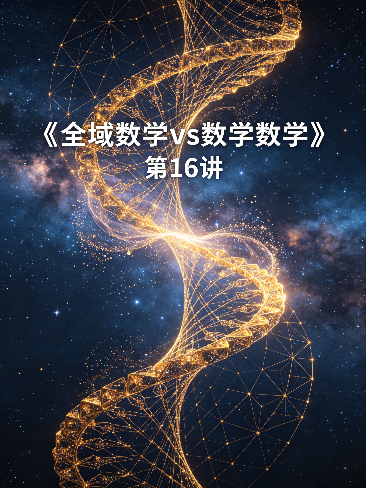
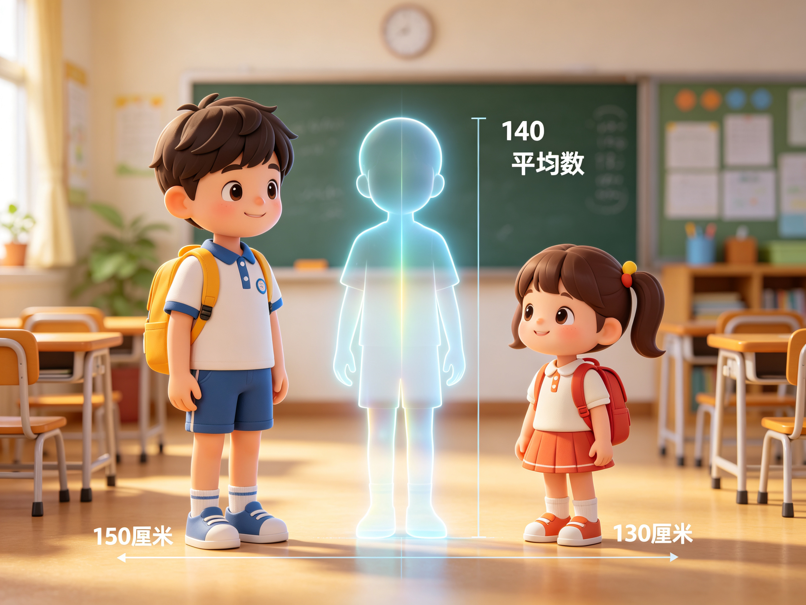

<ArchiveCopyPanel article-id="162178954" />

{"markdown":"PiDliIbnsbvvvJrmlofmmI7ov5vpmLYyMDDorrIgIAo+IOe8luWPt++8mmAxNjIxNzg5NTRgICAKPiDljp/lp4vmlofku7bvvJpg5bmz5Z2H5pWw5Y+q5piv5Lq65Li65oqY5Lit566X5rOV5LiH54mp5pys6Lqr5LiN5Lya6Ieq5Yqo5oq55bmz5beu5YirLeWFqOWfn+aVsOWtpnZz5Lyg57uf5pWw5a2m5Lq657G75paH5piO6L+b6Zi2MjAw6K6y56ysMTborrLlsI/lraYtMTYyMTc4OTU0Lm1kYCAgCj4g6L+U5Zue77yaW+acrOS5puW9kuaho10oL3poL2Jvb2tzL2NvdXJzZS9hcnRpY2xlcy8pIMK3IFvmgLvlhaXlj6NdKC96aC9ib29rcy9hcnRpY2xlcy8pCgrkvZzogIXvvJog5LmW5LmW5pWw5a2mCgojIyDjgIrlhajln5/mlbDlraZ2c+S8oOe7n+aVsOWtpu+8muS6uuexu+aWh+aYjui/m+mYtjIwMOiusuOAi+esrDE26K6yIOWwj+WtpumAmuS/l+eJiOmAkOWtl+eovwoKIVvnrKwxNuiusuWwgemdol0oLi9hc3NldHMvY3NkbmltZy9qcGcvMTI0OTVmZWM2NzkzN2YyNy5qcGcpCgotLS0KCuiusuasoe+8miDnrKwxNuiusgoK5Li76aKY77yaIOW5s+Wdh+aVsOWPquaYr+S6uuS4uuaKmOS4reeul+azle+8jOS4h+eJqeacrOi6q+S4jeS8muiHquWKqOaKueW5s+W3ruWIqwoK5a+55qCH6K++5pys55+l6K+G54K577yaIOW5s+Wdh+aVsOWIneatpeiupOivhgoK5paH6aOO77yaIOerpei2o+Wkp+eZveivne+8jOaXoOmavuaHguS4k+S4muacr+ivre+8jOW7tue7reWFqOWll+WPjOieuuaXi+iHqueEtuS9k+ezu+avlOWWuwoKLS0tCgojIyMgMO+9njPliIbpkp8g5aSN5Lmg5a+85YWlCgohW+aXtumXtOWIu+W6puS4juiHqueEtueUn+mVv10oLi9hc3NldHMvY3NkbmltZy9qcGcvOTBiYmU4YWUzZDZjOGY1NS5qcGcpCgrlkIzlrabku6zvvIzkuIrkuIDoioLor77miJHku6znn6XpgZPvvIzlsI/ml7bjgIHliIbpkp/jgIHnp5Lpg73mmK/kurrnsbvliIfliIblh7rmnaXnmoTml7bpl7TliLvluqbvvIzoirHojYnjgIHmmJ/nkIPoh6rmnInljp/nlJ/nlJ/plb/oioLlpY/vvIzkuI3kvJrooqvmiJHku6znmoTorqHml7bmoIflh4bnuqbmnZ/jgIIKCui/meWtpuacn+aVsOWtpuivvuaIkeS7rOS8muWtpuW5s+Wdh+aVsO+8jOiAgeW4iOaVmeaIkeS7rOaKiuWHoOS7veaVsOWtl+WFqOmDqOWKoOi1t+adpe+8jOWGjeW5s+WIhu+8jOeul+WHuuS4gOS4quW5s+Wdh+aVsOWAvO+8jOeUqOadpeS7o+ihqOaVtOS9k+awtOW5s+OAggoK5LuK5aSp5ZKx5Lus5o2i5Liq6KeS5bqm77ya5bmz5Z2H5pWw5Y+q5piv5Lq65Li6566X5Ye65p2l55qE5oqY5Lit5pWw5a2X77yM55yf5a6e5LiW55WM6YeM55qE5LqL54mp5aSp55Sf5ZCE5pyJ5beu5Yir77yM5LiN5Lya6Ieq5Yqo5Y+Y5b6X5LiA5qih5LiA5qC344CCCgotLS0KCiMjIyAz772eMTPliIbpkp8g55Sf5rS75YyW57G75q+U6K6y6KejCgohW+WPjOieuuaXi+aVsOWtl+Wxsei3r10oLi9hc3NldHMvY3NkbmltZy9qcGcvMjQ2YTMxM2NlMjJlYzliZi5qcGcpCgrlhYjorrLor77mnKzph4zlubPlnYfmlbDnmoTnlKjlpITvvJoKCuePree6p+WQjOWtpui6q+mrmOOAgeWHoOetkOawtOaenOmHjemHj+OAgeWHoOasoeiAg+ivleWIhuaVsO+8jOaKiuWFqOmDqOaVsOWAvOaxguWSjOWGjeWdh+WIhu+8jOW+l+WIsOS4gOS4que7n+S4gOaVsOWtl++8jOaWueS+v+aIkeS7rOW/q+mAn+WvueavlOOAgeaxh+aKpeaVsOaNru+8jOaYr+eugOWMlue7n+iuoeeahOW3peWFt+OAggoK5pS+5Yiw5oiR5Lus5pWw5a2X5Y+M6J665peL55qE5L2T57O75p2l55yL77yaCgrkuIDmnaHljp/nlJ/mlbDlrZflsbHot6/jgIHkuIDmnaHnu4TlkIjmlbDlrZflsbHot6/vvIzkuKTmnaHot6/kuIrnmoTmlbDlrZflpKflsI/jgIHpl7TpmpTlpKnnlJ/kuI3kuIDmoLfvvIzmnInpq5jmnInkvY7jgIHmnInnlo/mnInlr4bvvIzlt67ot53mmK/lpKnnhLblrZjlnKjnmoTjgILlpoLmnpzlvLrooYzmiorlroPku6zliqDlnKjkuIDotbflubPliIbvvIzlsLHkvJrmjqnnm5bkuKTmnaHlsbHot6/mnKzouqvnmoTnlJ/plb/ljLrliKvjgIIKCiFb5bmz5Z2H5pWw6Lqr6auY5a+55q+UXSguL2Fzc2V0cy9jc2RuaW1nL2pwZy83MGQ1YzQ1ZTdkMzgxOTk4LmpwZykKCuS4vuS4queUn+a0u+mHjOeugOWNleeahOS+i+WtkO+8mgoK5bCP5piO6Lqr6auYMTUw5Y6Y57Gz77yM5bCP57qiMTMw5Y6Y57Gz77yM6K++5pys566X5bmz5Z2H5pWwMTQw5Y6Y57Gz44CCCgrlhajln5/pgJrkv5fop6Por7vvvJrkuJbnlYzkuIrkuI3lrZjlnKjkuIDkuKrouqvpq5gxNDDljpjnsbPnmoTnnJ/kurrvvIzov5nkuKrmlbDlrZflj6rmmK/miJHku6zmipjkuK3lh5Hlh7rmnaXnmoTomZrmi5/mlbDvvJvlsI/mmI7pq5jjgIHlsI/nuqLnn67nmoTnnJ/lrp7lt67ot53vvIzkuI3kvJrlm6DkuLrnrpflh7rlubPlnYfmlbDlsLHmtojlpLHjgIIKCuivvuacrOS5oOaDr+eUqOW5s+Wdh+aVsOaOqeebluS4quS9k+W3ruW8gu+8jOWwseWDj+aKiumrmOefruS4jeWQjOeahOagkeacqOWFqOmDqOS/ruWJquaIkOWQjOS4gOmrmOW6pu+8jOWPquiDveeci+WIsOe7n+S4gOe7k+aenO+8jOeci+S4jeingeavj+S4gOagt+S6i+eJqeWOn+acrOeLrOacieeahOeJueW+geOAggoKLS0tCgojIyMgMTPvvZ4yMuWIhumSnyDor77mnKzop4LngrkgdnMg5YWo5Z+f5pWw5a2m6YCa5L+X6KeC54K5CgohW+S4ieenjeaenOaxgea3t+WQiOavlOWWu10oLi9hc3NldHMvY3NkbmltZy9qcGcvZTQyZjliOTg4MTdhZGM4MS5qcGcpCgojIyMjIOS8oOe7n+ivvuacrOiupOefpQoKLSAKCuW5s+Wdh+aVsOWPr+S7peS7o+ihqOS4gOe7hOS6i+eJqeecn+WunueahOaVtOS9k+awtOW5swoKLSAKCuaKueW5s+mrmOS9juW3rui3neS5i+WQju+8jOW+l+WIsOeahOW5s+Wdh+aVsOWtl+aYr+WuouinguWtmOWcqOeahOagh+WHhgoKLSAKCuS6i+eJqeS5i+mXtOeahOW3ruW8guS4jemHjeimge+8jOeUqOW5s+Wdh+aVsOWwseiDveamguaLrOWFqOmDqOS/oeaBrwoKIyMjIyDlhajln5/mlbDlrabpgJrkv5forqTnn6UKCi0gCgrlubPlnYfmlbDmmK/kurrlt6XorqHnrpfnmoTomZrmi5/mipjkuK3mlbDlgLzvvIznjrDlrp7ph4zkuI3lrZjlnKjlr7nlupTnmoTnnJ/lrp7kuovniakKCi0gCgrkuIfnianlpKnnlJ/mnInlpKflsI/jgIHpq5jkvY7jgIHnlo/lr4blt67liKvvvIzlt67lvILmmK/nlJ/plb/oh6rluKbnmoTluLjmgIEKCi0gCgrlubPlnYfmlbDkvJrmjqnnm5bkuKTmnaHmlbDlrZflsbHot6/jgIHlkITnsbvniankvZPmnKzouqvnmoTlpKnnhLbljLrliKvvvIzlj6rpgILlkIjnspfnlaXkvLDnrpcKCueugOWNleavlOWWu++8mgoK5bmz5Z2H5pWw5aW95q+U5oqK55Sc44CB6YW444CB6Ium5LiJ56eN5p6c5rGB5YWo6YOo5re35Zyo5LiA6LW36LCD5Ye655qE5Lit5ZKM6aWu5paZ77ybCgrmr4/np43mnpzmsYHljp/mnKzni6zmnInnmoTlkbPpgZPvvIjkuovniannnJ/lrp7lt67lvILvvInvvIzlnKjmt7flkIjkuYvlkI7lsLHnnIvkuI3op4HkuobjgIIKCi0tLQoKIyMjIDIy772eMjfliIbpkp8g5qCh5YaF5a2m5Lmg5o+Q6YaS77yM5LiN5b2x5ZON6ICD6K+V5b6X5YiGCgror77loILlgZrpopjjgIHlupTnlKjpopjmsYLlubPlnYfmlbDvvIzmjInnhafor77mnKzmraXpqqTorqHnrpflrozlhajmraPnoa7vvIzogIPor5XkuI3kvJrmiaPliIbjgIIKCui/meiKguivvuWPquaYr+aLk+Wxlea3seWxguiupOefpe+8muW5s+Wdh+aVsOWPquaYr+eyl+eVpee7n+iuoeW3peWFt++8jOecn+WunuS4h+eJqeawuOi/nOWtmOWcqOWkqeeEtuW3ruWIq++8jOS4jeS8muiHquWKqOWdh+etieOAggoK5LyP56yU6ZO65Z6r77ya56ysMjXorrLlsI/lrabmr5XkuJrkuJPlnLrvvIzmsYfmgLvliY0yNOiusuWFqOmDqOefpeivhueCue+8jOWujOaVtOais+eQhjDjgIEx5Y+M6J665peL5pWw5a2X55Sf6ZW/5a6M5pW05pys5rqQ6YC76L6R44CCCgotLS0KCiMjIyAyN++9njMw5YiG6ZKfIOivvuWgguaAu+e7kyvkuIvoioLor77pooTlkYoKCiFb57uT5bC+55S76Z2i77ya6L+e57ut5rWB5Yqo55qE5LiH54mp5Y+Y5YyWXSguL2Fzc2V0cy9jc2RuaW1nL2pwZy9hZDQ3ODE3MTBjZDc0MDgwLmpwZykKCiMjIyMg5pys6IqC6K++5bCP57uT77yaCgrlubPlnYfmlbDmmK/kurrnrpflh7rnmoTomZrmi5/mipjkuK3mlbDvvIzkuIfnianlpKnnlJ/lrZjlnKjlt67liKvvvIzkuI3kvJroh6rliqjmirnlubPlt67ot53jgIIKCiMjIyMg5LiL5LiA6IqC6K++77yaCgrnu5/orqHlm77mmK/kurrkuLrmlbTnkIbnmoTnroDljJbnlLvpnaLvvIzkuIfnianlj5jljJbmnKzmnaXmmK/ov57nu63mtYHliqjnmoTjgIIK","text":"5YiG57G777ya5paH5piO6L+b6Zi2MjAw6K6yICAK57yW5Y+377yaMTYyMTc4OTU0ICAK5Y6f5aeL5paH5Lu277ya5bmz5Z2H5pWw5Y+q5piv5Lq65Li65oqY5Lit566X5rOV5LiH54mp5pys6Lqr5LiN5Lya6Ieq5Yqo5oq55bmz5beu5YirLeWFqOWfn+aVsOWtpnZz5Lyg57uf5pWw5a2m5Lq657G75paH5piO6L+b6Zi2MjAw6K6y56ysMTborrLlsI/lraYtMTYyMTc4OTU0Lm1kICAK6L+U5Zue77ya5pys5Lmm5b2S5qGjIMK3IOaAu+WFpeWPowoK5L2c6ICF77yaIOS5luS5luaVsOWtpgoK44CK5YWo5Z+f5pWw5a2mdnPkvKDnu5/mlbDlrabvvJrkurrnsbvmlofmmI7ov5vpmLYyMDDorrLjgIvnrKwxNuiusiDlsI/lrabpgJrkv5fniYjpgJDlrZfnqL8KCuesrDE26K6y5bCB6Z2iCgotLS0KCuiusuasoe+8miDnrKwxNuiusgoK5Li76aKY77yaIOW5s+Wdh+aVsOWPquaYr+S6uuS4uuaKmOS4reeul+azle+8jOS4h+eJqeacrOi6q+S4jeS8muiHquWKqOaKueW5s+W3ruWIqwoK5a+55qCH6K++5pys55+l6K+G54K577yaIOW5s+Wdh+aVsOWIneatpeiupOivhgoK5paH6aOO77yaIOerpei2o+Wkp+eZveivne+8jOaXoOmavuaHguS4k+S4muacr+ivre+8jOW7tue7reWFqOWll+WPjOieuuaXi+iHqueEtuS9k+ezu+avlOWWuwoKLS0tCgow772eM+WIhumSnyDlpI3kuaDlr7zlhaUKCuaXtumXtOWIu+W6puS4juiHqueEtueUn+mVvwoK5ZCM5a2m5Lus77yM5LiK5LiA6IqC6K++5oiR5Lus55+l6YGT77yM5bCP5pe244CB5YiG6ZKf44CB56eS6YO95piv5Lq657G75YiH5YiG5Ye65p2l55qE5pe26Ze05Yi75bqm77yM6Iqx6I2J44CB5pif55CD6Ieq5pyJ5Y6f55Sf55Sf6ZW/6IqC5aWP77yM5LiN5Lya6KKr5oiR5Lus55qE6K6h5pe25qCH5YeG57qm5p2f44CCCgrov5nlrabmnJ/mlbDlrabor77miJHku6zkvJrlrablubPlnYfmlbDvvIzogIHluIjmlZnmiJHku6zmiorlh6Dku73mlbDlrZflhajpg6jliqDotbfmnaXvvIzlho3lubPliIbvvIznrpflh7rkuIDkuKrlubPlnYfmlbDlgLzvvIznlKjmnaXku6PooajmlbTkvZPmsLTlubPjgIIKCuS7iuWkqeWSseS7rOaNouS4quinkuW6pu+8muW5s+Wdh+aVsOWPquaYr+S6uuS4uueul+WHuuadpeeahOaKmOS4reaVsOWtl++8jOecn+WunuS4lueVjOmHjOeahOS6i+eJqeWkqeeUn+WQhOacieW3ruWIq++8jOS4jeS8muiHquWKqOWPmOW+l+S4gOaooeS4gOagt+OAggoKLS0tCgoz772eMTPliIbpkp8g55Sf5rS75YyW57G75q+U6K6y6KejCgrlj4zonrrml4vmlbDlrZflsbHot68KCuWFiOiusuivvuacrOmHjOW5s+Wdh+aVsOeahOeUqOWkhO+8mgoK54+t57qn5ZCM5a2m6Lqr6auY44CB5Yeg562Q5rC05p6c6YeN6YeP44CB5Yeg5qyh6ICD6K+V5YiG5pWw77yM5oqK5YWo6YOo5pWw5YC85rGC5ZKM5YaN5Z2H5YiG77yM5b6X5Yiw5LiA5Liq57uf5LiA5pWw5a2X77yM5pa55L6/5oiR5Lus5b+r6YCf5a+55q+U44CB5rGH5oql5pWw5o2u77yM5piv566A5YyW57uf6K6h55qE5bel5YW344CCCgrmlL7liLDmiJHku6zmlbDlrZflj4zonrrml4vnmoTkvZPns7vmnaXnnIvvvJoKCuS4gOadoeWOn+eUn+aVsOWtl+Wxsei3r+OAgeS4gOadoee7hOWQiOaVsOWtl+Wxsei3r++8jOS4pOadoei3r+S4iueahOaVsOWtl+Wkp+Wwj+OAgemXtOmalOWkqeeUn+S4jeS4gOagt++8jOaciemrmOacieS9juOAgeacieeWj+acieWvhu+8jOW3rui3neaYr+WkqeeEtuWtmOWcqOeahOOAguWmguaenOW8uuihjOaKiuWug+S7rOWKoOWcqOS4gOi1t+W5s+WIhu+8jOWwseS8muaOqeebluS4pOadoeWxsei3r+acrOi6q+eahOeUn+mVv+WMuuWIq+OAggoK5bmz5Z2H5pWw6Lqr6auY5a+55q+UCgrkuL7kuKrnlJ/mtLvph4znroDljZXnmoTkvovlrZDvvJoKCuWwj+aYjui6q+mrmDE1MOWOmOexs++8jOWwj+e6ojEzMOWOmOexs++8jOivvuacrOeul+W5s+Wdh+aVsDE0MOWOmOexs+OAggoK5YWo5Z+f6YCa5L+X6Kej6K+777ya5LiW55WM5LiK5LiN5a2Y5Zyo5LiA5Liq6Lqr6auYMTQw5Y6Y57Gz55qE55yf5Lq677yM6L+Z5Liq5pWw5a2X5Y+q5piv5oiR5Lus5oqY5Lit5YeR5Ye65p2l55qE6Jma5ouf5pWw77yb5bCP5piO6auY44CB5bCP57qi55+u55qE55yf5a6e5beu6Led77yM5LiN5Lya5Zug5Li6566X5Ye65bmz5Z2H5pWw5bCx5raI5aSx44CCCgror77mnKzkuaDmg6/nlKjlubPlnYfmlbDmjqnnm5bkuKrkvZPlt67lvILvvIzlsLHlg4/miorpq5jnn67kuI3lkIznmoTmoJHmnKjlhajpg6jkv67liarmiJDlkIzkuIDpq5jluqbvvIzlj6rog73nnIvliLDnu5/kuIDnu5PmnpzvvIznnIvkuI3op4Hmr4/kuIDmoLfkuovnianljp/mnKzni6zmnInnmoTnibnlvoHjgIIKCi0tLQoKMTPvvZ4yMuWIhumSnyDor77mnKzop4LngrkgdnMg5YWo5Z+f5pWw5a2m6YCa5L+X6KeC54K5CgrkuInnp43mnpzmsYHmt7flkIjmr5TllrsKCuS8oOe7n+ivvuacrOiupOefpQrlubPlnYfmlbDlj6/ku6Xku6PooajkuIDnu4TkuovniannnJ/lrp7nmoTmlbTkvZPmsLTlubMK5oq55bmz6auY5L2O5beu6Led5LmL5ZCO77yM5b6X5Yiw55qE5bmz5Z2H5pWw5a2X5piv5a6i6KeC5a2Y5Zyo55qE5qCH5YeGCuS6i+eJqeS5i+mXtOeahOW3ruW8guS4jemHjeimge+8jOeUqOW5s+Wdh+aVsOWwseiDveamguaLrOWFqOmDqOS/oeaBrwoK5YWo5Z+f5pWw5a2m6YCa5L+X6K6k55+lCuW5s+Wdh+aVsOaYr+S6uuW3peiuoeeul+eahOiZmuaLn+aKmOS4reaVsOWAvO+8jOeOsOWunumHjOS4jeWtmOWcqOWvueW6lOeahOecn+WunuS6i+eJqQrkuIfnianlpKnnlJ/mnInlpKflsI/jgIHpq5jkvY7jgIHnlo/lr4blt67liKvvvIzlt67lvILmmK/nlJ/plb/oh6rluKbnmoTluLjmgIEK5bmz5Z2H5pWw5Lya5o6p55uW5Lik5p2h5pWw5a2X5bGx6Lev44CB5ZCE57G754mp5L2T5pys6Lqr55qE5aSp54S25Yy65Yir77yM5Y+q6YCC5ZCI57KX55Wl5Lyw566XCgrnroDljZXmr5TllrvvvJoKCuW5s+Wdh+aVsOWlveavlOaKiueUnOOAgemFuOOAgeiLpuS4ieenjeaenOaxgeWFqOmDqOa3t+WcqOS4gOi1t+iwg+WHuueahOS4reWSjOmlruaWme+8mwoK5q+P56eN5p6c5rGB5Y6f5pys54us5pyJ55qE5ZGz6YGT77yI5LqL54mp55yf5a6e5beu5byC77yJ77yM5Zyo5re35ZCI5LmL5ZCO5bCx55yL5LiN6KeB5LqG44CCCgotLS0KCjIy772eMjfliIbpkp8g5qCh5YaF5a2m5Lmg5o+Q6YaS77yM5LiN5b2x5ZON6ICD6K+V5b6X5YiGCgror77loILlgZrpopjjgIHlupTnlKjpopjmsYLlubPlnYfmlbDvvIzmjInnhafor77mnKzmraXpqqTorqHnrpflrozlhajmraPnoa7vvIzogIPor5XkuI3kvJrmiaPliIbjgIIKCui/meiKguivvuWPquaYr+aLk+Wxlea3seWxguiupOefpe+8muW5s+Wdh+aVsOWPquaYr+eyl+eVpee7n+iuoeW3peWFt++8jOecn+WunuS4h+eJqeawuOi/nOWtmOWcqOWkqeeEtuW3ruWIq++8jOS4jeS8muiHquWKqOWdh+etieOAggoK5LyP56yU6ZO65Z6r77ya56ysMjXorrLlsI/lrabmr5XkuJrkuJPlnLrvvIzmsYfmgLvliY0yNOiusuWFqOmDqOefpeivhueCue+8jOWujOaVtOais+eQhjDjgIEx5Y+M6J665peL5pWw5a2X55Sf6ZW/5a6M5pW05pys5rqQ6YC76L6R44CCCgotLS0KCjI3772eMzDliIbpkp8g6K++5aCC5oC757uTK+S4i+iKguivvumihOWRigoK57uT5bC+55S76Z2i77ya6L+e57ut5rWB5Yqo55qE5LiH54mp5Y+Y5YyWCgrmnKzoioLor77lsI/nu5PvvJoKCuW5s+Wdh+aVsOaYr+S6uueul+WHuueahOiZmuaLn+aKmOS4reaVsO+8jOS4h+eJqeWkqeeUn+WtmOWcqOW3ruWIq++8jOS4jeS8muiHquWKqOaKueW5s+W3rui3neOAggoK5LiL5LiA6IqC6K++77yaCgrnu5/orqHlm77mmK/kurrkuLrmlbTnkIbnmoTnroDljJbnlLvpnaLvvIzkuIfnianlj5jljJbmnKzmnaXmmK/ov57nu63mtYHliqjnmoTjgII="}

> 分类：文明进阶200讲  
> 编号：`162178954`  
> 原始文件：`平均数只是人为折中算法万物本身不会自动抹平差别-全域数学vs传统数学人类文明进阶200讲第16讲小学-162178954.md`  
> 返回：[本书归档](/zh/books/course/articles/) · [总入口](/zh/books/articles/)

<ArticlePaperMeta category="文明进阶200讲" article-id="162178954" title="平均数只是人为折中算法万物本身不会自动抹平差别-全域数学vs传统数学人类文明进阶200讲第16讲小学" paper-kind="课程讲义" book-route="/zh/books/course/articles/" overview-route="/zh/books/articles/" summary="对标课本知识点： 平均数初步认识" author="乖乖数学" lecture="第16讲" theme="平均数只是人为折中算法，万物本身不会自动抹平差别" source-file="平均数只是人为折中算法万物本身不会自动抹平差别-全域数学vs传统数学人类文明进阶200讲第16讲小学-162178954.md" cover="./assets/csdnimg/jpg/12495fec67937f27.jpg" />

作者： 乖乖数学

## 《全域数学vs传统数学：人类文明进阶200讲》第16讲 小学通俗版逐字稿

---

讲次： 第16讲

主题： 平均数只是人为折中算法，万物本身不会自动抹平差别

对标课本知识点： 平均数初步认识

文风： 童趣大白话，无难懂专业术语，延续全套双螺旋自然体系比喻

---

### 0～3分钟 复习导入

同学们，上一节课我们知道，小时、分钟、秒都是人类切分出来的时间刻度，花草、星球自有原生生长节奏，不会被我们的计时标准约束。

这学期数学课我们会学平均数，老师教我们把几份数字全部加起来，再平分，算出一个平均数值，用来代表整体水平。

今天咱们换个角度：平均数只是人为算出来的折中数字，真实世界里的事物天生各有差别，不会自动变得一模一样。

---

### 3～13分钟 生活化类比讲解

先讲课本里平均数的用处：

班级同学身高、几筐水果重量、几次考试分数，把全部数值求和再均分，得到一个统一数字，方便我们快速对比、汇报数据，是简化统计的工具。

放到我们数字双螺旋的体系来看：

一条原生数字山路、一条组合数字山路，两条路上的数字大小、间隔天生不一样，有高有低、有疏有密，差距是天然存在的。如果强行把它们加在一起平分，就会掩盖两条山路本身的生长区别。

举个生活里简单的例子：

小明身高150厘米，小红130厘米，课本算平均数140厘米。

全域通俗解读：世界上不存在一个身高140厘米的真人，这个数字只是我们折中凑出来的虚拟数；小明高、小红矮的真实差距，不会因为算出平均数就消失。

课本习惯用平均数掩盖个体差异，就像把高矮不同的树木全部修剪成同一高度，只能看到统一结果，看不见每一样事物原本独有的特征。

---

### 13～22分钟 课本观点 vs 全域数学通俗观点

#### 传统课本认知

- 

平均数可以代表一组事物真实的整体水平

- 

抹平高低差距之后，得到的平均数字是客观存在的标准

- 

事物之间的差异不重要，用平均数就能概括全部信息

#### 全域数学通俗认知

- 

平均数是人工计算的虚拟折中数值，现实里不存在对应的真实事物

- 

万物天生有大小、高低、疏密差别，差异是生长自带的常态

- 

平均数会掩盖两条数字山路、各类物体本身的天然区别，只适合粗略估算

简单比喻：

平均数好比把甜、酸、苦三种果汁全部混在一起调出的中和饮料；

每种果汁原本独有的味道（事物真实差异），在混合之后就看不见了。

---

### 22～27分钟 校内学习提醒，不影响考试得分

课堂做题、应用题求平均数，按照课本步骤计算完全正确，考试不会扣分。

这节课只是拓展深层认知：平均数只是粗略统计工具，真实万物永远存在天然差别，不会自动均等。

伏笔铺垫：第25讲小学毕业专场，汇总前24讲全部知识点，完整梳理0、1双螺旋数字生长完整本源逻辑。

---

### 27～30分钟 课堂总结+下节课预告

#### 本节课小结：

平均数是人算出的虚拟折中数，万物天生存在差别，不会自动抹平差距。

#### 下一节课：

统计图是人为整理的简化画面，万物变化本来是连续流动的。
