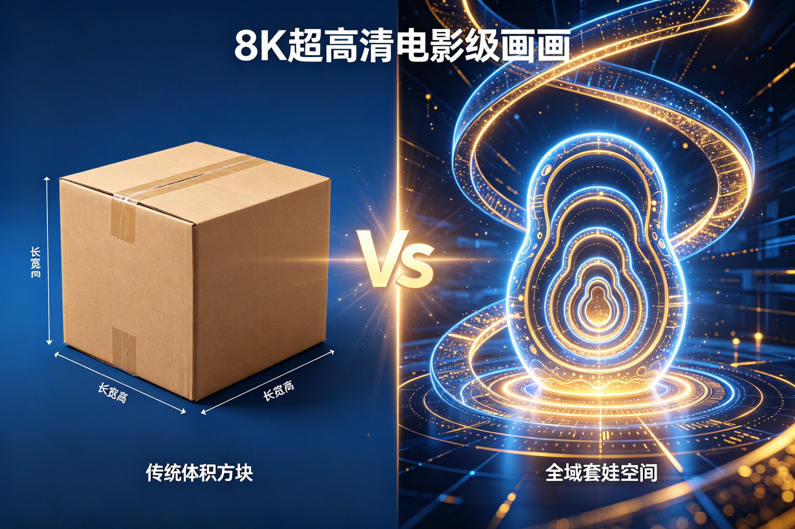

<ArchiveCopyPanel article-id="162189256" />

{"markdown":"PiDliIbnsbvvvJrmlofmmI7ov5vpmLYyMDDorrIgIAo+IOe8luWPt++8mmAxNjIxODkyNTZgICAKPiDljp/lp4vmlofku7bvvJpg5L2T56ev5Y+q5piv5aSW6YOo5a6557qz6YeP5aSa5bGC5bWM5aWX5aWX5aiD57uT5p6E5omN5piv56uL5L2T56m66Ze05pys5rqQLeWFqOWfn+aVsOWtpnZz5Lyg57uf5pWw5a2m5Lq657G75paH5piO6L+b6Zi2MjAw6K6y56ysMjLorrItMTYyMTg5MjU2Lm1kYCAgCj4g6L+U5Zue77yaW+acrOS5puW9kuaho10oL3poL2Jvb2tzL2NvdXJzZS9hcnRpY2xlcy8pIMK3IFvmgLvlhaXlj6NdKC96aC9ib29rcy9hcnRpY2xlcy8pCgohW+esrDIy6K6yIOWll+Wog+epuumXtOacrOa6kF0oLi9hc3NldHMvY3NkbmltZy9qcGcvM2FkMzdlNDdjOThlOGI5OC5qcGcpCgrkvZzogIXvvJog5LmW5LmW5pWw5a2mCgojIyDjgIrlhajln5/mlbDlraZ2c+S8oOe7n+aVsOWtpu+8muS6uuexu+aWh+aYjui/m+mYtjIwMOiusuOAi+esrDIy6K6yIOWwj+WtpumAmuS/l+eJiOmAkOWtl+eovwoKLS0tCgrorrLmrKHvvJog56ysMjLorrIKCuS4u+mimO+8miDkvZPnp6/lj6rmmK/lpJbpg6jlrrnnurPph4/vvIzlpJrlsYLltYzlpZflpZflqIPnu5PmnoTmiY3mmK/nq4vkvZPnqbrpl7TmnKzmupAKCuWvueagh+ivvuacrOefpeivhueCue+8miDplb/mlrnkvZPjgIHmraPmlrnkvZPkvZPnp6/orqHnrpcKCuaWh+mjju+8miDnq6XotqPlj6Por63vvIzml6Dpmr7mh4LkuJPkuJrmnK/or63vvIzlu7bnu63lj4zonrrml4vjgIHlpZflqIPljp/nlJ/mr5TllrvkvZPns7sKCi0tLQoKIyMjIDDvvZ4z5YiG6ZKfIOWkjeS5oOWvvOWFpQoKIVvmlbDlrZflj4zonrrml4vnlJ/plb/ohInnu5xdKC4vYXNzZXRzL2NzZG5pbWcvanBnLzA4MjhmNGNjN2Q2YThkMjMuanBnKQoK5ZCM5a2m5Lus77yM5LiK5LiA6IqC6K++5oiR5Lus55+l6YGT5ZGo6ZW/44CB6Z2i56ev5Y+q5piv54mp5L2T5aSW6KGo55qE5rWF5bGC5pWw5o2u77yM5Zu+5b2i55yf5q2j55qE5qC45b+D5piv5YaF6YOo5Lik5p2h5pWw5a2X6J665peL5LiN5pat55Sf6ZW/56ev57Sv55qE6ISJ57uc5oC76YeP44CCCgrov5noioLor77miJHku6zogYrnq4vkvZPlm77lvaLnmoTkvZPnp6/jgILmlbDlrabor77ogIHluIjkvJrmlZnvvJrplb/Dl+WuvcOX6auY5bCx6IO9566X5Ye655uS5a2Q6IO96KOF5aSa5bCR5Lic6KW/77yM6L+Z5Liq5pWw5a2X5bCx5piv5L2T56ev77yM55So5p2l5Luj6KGo56uL5L2T54mp5L2T55qE5aSn5bCP44CCCgrku4rlpKnmiJHku6zmjaLkuKrlhajmlrDop4bop5LvvJrkvZPnp6/lj6rmmK/miJHku6znlKjmnaXooaHph4/nm5LlrZDog73oo4XlpJrlsJHkuJzopb/nmoTlpJblnKjmoIflh4bvvIzlpKnlnLDpl7TmiYDmnInnq4vkvZPnqbrpl7TlpKnnlJ/mmK/kuIDlsYLlpZfkuIDlsYLnmoTlpZflqIPnu5PmnoTvvIzov5nmiY3mmK/nq4vkvZPnqbrpl7TnnJ/mraPnmoTmnKzmnaXmqKHmoLfjgIIKCi0tLQoKIyMjIDPvvZ4xM+WIhumSnyDnlJ/mtLvljJbnsbvmr5TorrLop6MKCiFb5aSa5bGC5bWM5aWX5aWX5aiD56m66Ze057uT5p6EXSguL2Fzc2V0cy9jc2RuaW1nL2pwZy9kOWNjYzc3MGFhNWQyMDA1LmpwZykKCuWFiOiusuivvuacrOmHjOeahOS9k+enr+amguW/te+8mgoK5Lq65Li66YCg5Ye65pa55Z2X55uS5a2Q77yM55So6ZW/5a696auY55u45LmY77yM566X5Ye65YaF6YOo6IO95a6557qz54mp5ZOB55qE56m66Ze05aSn5bCP77yM5Y+q5YWz5rOoIuiDveijheWkmuWwkSLov5nkuKrnu5PmnpzvvIzmiornq4vkvZPnqbrpl7TnroDljJbmiJDlm7rlrprlrrnph4/jgIIKCuS9k+enr+WFrOW8j++8mgoKVj3plb/Dl+WuvcOX6auYViA9IOmVvyBcdGltZXMg5a69IFx0aW1lcyDpq5hWPemVv8OX5a69w5fpq5gKCuaUvuWIsOWFqOWfn+aVsOWtpueahOWll+Wog+epuumXtOmAu+i+kemHjO+8mgoK5omA5pyJ56uL5L2T5LqL54mp77yM5LuO5b6u5bCP57KS5a2Q5Yiw5pif55CD77yM6YO95piv5aSn56m66Ze05YyF6KO55bCP56m66Ze077yM5LiA5bGC5LiA5bGC6L+e57ut5bWM5aWX55Sf6ZW/77yM5rKh5pyJ55Sf56Gs55qE6L6555WM44CC5oiR5Lus5LmL5YmN6K+055qE5pWw5a2X5Y+M6J665peL77yM5bCx5piv5Zyo5LiA5bGC5LiA5bGC55qE5aWX5aiD5aS55bGC6YeM55uY5peL55Sf6ZW/44CCCgrkuL7kuKrnroDljZXkvovlrZDvvJoKCuivvuacrOinhuinku+8muS4gOS4que6uOeusemVvzPlrr0y6auYMe+8jOS9k+enrzbvvIzlj6rog73nnIvlh7rnrrHlrZDnmoTlrrnnurPnqbrpl7TjgIIKClY9M8OXMsOXMT02ViA9IDMgXHRpbWVzIDIgXHRpbWVzIDEgPSA2Vj0zw5cyw5cxPTYKCuWFqOWfn+mAmuS/l+ino+ivu++8mue6uOeuseWPquaYr+aIquWPluS6huS4gOWwj+auteinhOaVtOeahOW1jOWll+epuumXtO+8m+ecn+WunuS4lueVjOmHjO+8jOepuumXtOayoeacieWbuuWumuaWueWdl+i+ueeVjO+8jOWkp+WxguWll+Wwj+Wxgu+8jOaXoOmZkOW7tuS8uO+8jOieuuaXi+iEiee7nOWcqOavj+S4gOWxguWkueWxguWQjOatpeeUn+mVv+OAggoK6K++5pys5by66KGM5oqK6L+e57ut5bWM5aWX55qE5a6M5pW056m66Ze05YiH5Ymy5oiQ5pa55pa55q2j5q2j55qE55uS5a2Q77yM5Y+q6K6h566X55uS5a2Q5YaF6YOo55qE5a6557qz6YeP77yM55yL5LiN6KeB56m66Ze05bGC5bGC5YyF6KO555qE5Y6f55Sf57uT5p6E44CCCgotLS0KCiMjIyAxM++9njIy5YiG6ZKfIOivvuacrOingueCuSB2cyDlhajln5/mlbDlrabpgJrkv5fop4LngrkKCiFb5Lyg57uf5L2T56evIHZzIOWFqOWfn+Wll+Wog+epuumXtF0oLi9hc3NldHMvY3NkbmltZy9qcGcvMzA3ZDlkNjhlOTA0NTRiZi5qcGcpCgojIyMjIOS8oOe7n+ivvuacrOiupOefpQoKLSAKCuS9k+enr+aYr+eri+S9k+eJqeS9k+WujOaVtOWkp+Wwj+eahOWUr+S4gOagh+WHhgoKLSAKCueri+S9k+epuumXtOeUseS4gOWdl+Wdl+eLrOeri+aWueWdl+aLvOaOpeiAjOaIkO+8jOavj+WxgueVjOmZkOa4heaZsAoKLSAKCuepuumXtOeahOS9nOeUqOWPquaYr+WtmOaUvueJqeS9k++8jOS4jeWtmOWcqOWkmuWxguW1jOWll+eahOWGheWcqOe7k+aehAoKIyMjIyDlhajln5/mlbDlrabpgJrkv5forqTnn6UKCi0gCgrkvZPnp6/lj6rmmK/kurrkuLrmtYvnrpfnmoTlrrnnurPlrrnph4/vvIzku4Xog73mj4/ov7DlsYDpg6jmlrnlnZfnqbrpl7QKCi0gCgrlroflrpnljp/nlJ/nq4vkvZPnqbrpl7TmmK/ov57nu63lpJrlsYLlpZflqIPltYzlpZfnu5PmnoTvvIzml6Dlm7rlrprmo7Hop5LliIblibIKCi0gCgrmlbDlrZflj4zonrrml4vlnKjlkITlsYLlpLnlsYLlkIzmraXnlJ/plb/vvIzltYzlpZfnu5PmnoTmiY3mmK/nq4vkvZPnqbrpl7TnmoTlupXlsYLpqqjmnrYKCueugOWNleavlOWWu++8mgoK6K++5pys55qE5L2T56ev5aaC5ZCM5Y2V54us5ouG5YiG5Ye65p2l55qE5LiA5qC85pS257qz55uS77ybCgrljp/nlJ/ltYzlpZfnqbrpl7TmmK/kuIDmlbTlpZfml6DpmZDlsYLkv4TnvZfmlq/lpZflqIPvvIzkuIDlsYLljIXoo7nkuIDlsYLvvIzmmK/nq4vkvZPnqbrpl7TkuI7nlJ/kv7HmnaXnmoTlvaLmgIHjgIIKCi0tLQoKIyMjIDIy772eMjfliIbpkp8g5qCh5YaF5a2m5Lmg5o+Q6YaS77yM5LiN5b2x5ZON6ICD6K+V5b6X5YiGCgohW+ivvuWgguWtpuS5oOWcuuaZr10oLi9hc3NldHMvY3NkbmltZy9qcGcvYWI5MTFlMTQwMGMxYjExOC5qcGcpCgrlubPml7bkvZPnp6/orqHnrpfpopjjgIHlrrnlmajlupTnlKjpopjvvIznhafluLjkvb/nlKjplb/Dl+WuvcOX6auY5YWs5byP6K6h566X77yM5YGa6aKY5LiN5Lya5omj5YiG44CCCgpWPWHDl2LDl2hWID0gYSBcdGltZXMgYiBcdGltZXMgaFY9YcOXYsOXaAoK5pys6IqC6K++5Y+q5piv5ouT5bGV6K6k55+l77ya5L2T56ev5Y+q5piv5Lq66YCg5pa55Z2X5a655Zmo55qE5a6557qz5rWL566X5YC877yM5aSa5bGC5bWM5aWX5aWX5aiD57uT5p6E5omN5piv56uL5L2T56m66Ze055qE5pys5rqQ5b2i5oCB44CCCgojIyMjIOS8j+eslOmTuuWeq++8muesrDI16K6y5bCP5a2m5q+V5Lia5LiT5Zy6CgohW+avleS4muW6huWFuOWPjOieuuaXi+Wxsei3r10oLi9hc3NldHMvY3NkbmltZy9qcGcvNDE5ZWNjNzEyNmIyY2FkYi5qcGcpCgrnrKwyNeiusuWwj+WtpuavleS4muS4k+Wcuu+8jOaxh+aAu+WJjTI06K6y5YWo6YOo55+l6K+G54K577yM5a6M5pW05qKz55CGMOOAgTHln7rngrnlj4zonrrml4vlhajlpZfmlbDlrZfnlJ/plb/mnKzmupDpgLvovpHjgIIKCi0tLQoKIyMjIDI3772eMzDliIbpkp8g6K++5aCC5oC757uTK+S4i+iKguivvumihOWRigoKIVvmraPlj43mr5Tkvovlj4zonrrml4vnlJ/plb/oioLlpY9dKC4vYXNzZXRzL2NzZG5pbWcvanBnL2QyMGQwODhjYmMzMjIwYzQuanBnKQoKIyMjIyDmnKzoioLor77lsI/nu5PvvJoKCuS9k+enr+S7heS4uuaWueWdl+WuueWZqOeahOWuuee6s+ihoemHj+agh+WHhu+8jOeri+S9k+epuumXtOeahOacrOa6kOaYr+WxguWxguWMheijueOAgeaXoOmZkOW1jOWll+eahOWll+Wog+e7k+aehOOAggoKIyMjIyDkuIvkuIDoioLor77vvJoKCuato+WPjeavlOS+i+S4jeaYr+eugOWNleWAjeaVsOWFs+ezu++8jOaYr+WPjOieuuaXi+S4pOadoeWxsei3r+eahOeUn+mVv+WMuemFjeiKguWlj+OAggoKLS0tCgohW+WFqOWfn+aVsOWtpuWuh+WumeacrOa6kF0oLi9hc3NldHMvY3NkbmltZy9qcGcvN2U0OWE0OTRhODUyYjE2NC5qcGcpCg==","text":"5YiG57G777ya5paH5piO6L+b6Zi2MjAw6K6yICAK57yW5Y+377yaMTYyMTg5MjU2ICAK5Y6f5aeL5paH5Lu277ya5L2T56ev5Y+q5piv5aSW6YOo5a6557qz6YeP5aSa5bGC5bWM5aWX5aWX5aiD57uT5p6E5omN5piv56uL5L2T56m66Ze05pys5rqQLeWFqOWfn+aVsOWtpnZz5Lyg57uf5pWw5a2m5Lq657G75paH5piO6L+b6Zi2MjAw6K6y56ysMjLorrItMTYyMTg5MjU2Lm1kICAK6L+U5Zue77ya5pys5Lmm5b2S5qGjIMK3IOaAu+WFpeWPowoK56ysMjLorrIg5aWX5aiD56m66Ze05pys5rqQCgrkvZzogIXvvJog5LmW5LmW5pWw5a2mCgrjgIrlhajln5/mlbDlraZ2c+S8oOe7n+aVsOWtpu+8muS6uuexu+aWh+aYjui/m+mYtjIwMOiusuOAi+esrDIy6K6yIOWwj+WtpumAmuS/l+eJiOmAkOWtl+eovwoKLS0tCgrorrLmrKHvvJog56ysMjLorrIKCuS4u+mimO+8miDkvZPnp6/lj6rmmK/lpJbpg6jlrrnnurPph4/vvIzlpJrlsYLltYzlpZflpZflqIPnu5PmnoTmiY3mmK/nq4vkvZPnqbrpl7TmnKzmupAKCuWvueagh+ivvuacrOefpeivhueCue+8miDplb/mlrnkvZPjgIHmraPmlrnkvZPkvZPnp6/orqHnrpcKCuaWh+mjju+8miDnq6XotqPlj6Por63vvIzml6Dpmr7mh4LkuJPkuJrmnK/or63vvIzlu7bnu63lj4zonrrml4vjgIHlpZflqIPljp/nlJ/mr5TllrvkvZPns7sKCi0tLQoKMO+9njPliIbpkp8g5aSN5Lmg5a+85YWlCgrmlbDlrZflj4zonrrml4vnlJ/plb/ohInnu5wKCuWQjOWtpuS7rO+8jOS4iuS4gOiKguivvuaIkeS7rOefpemBk+WRqOmVv+OAgemdouenr+WPquaYr+eJqeS9k+WkluihqOeahOa1heWxguaVsOaNru+8jOWbvuW9ouecn+ato+eahOaguOW/g+aYr+WGhemDqOS4pOadoeaVsOWtl+ieuuaXi+S4jeaWreeUn+mVv+enr+e0r+eahOiEiee7nOaAu+mHj+OAggoK6L+Z6IqC6K++5oiR5Lus6IGK56uL5L2T5Zu+5b2i55qE5L2T56ev44CC5pWw5a2m6K++6ICB5biI5Lya5pWZ77ya6ZW/w5flrr3Dl+mrmOWwseiDveeul+WHuuebkuWtkOiDveijheWkmuWwkeS4nOilv++8jOi/meS4quaVsOWtl+WwseaYr+S9k+enr++8jOeUqOadpeS7o+ihqOeri+S9k+eJqeS9k+eahOWkp+Wwj+OAggoK5LuK5aSp5oiR5Lus5o2i5Liq5YWo5paw6KeG6KeS77ya5L2T56ev5Y+q5piv5oiR5Lus55So5p2l6KGh6YeP55uS5a2Q6IO96KOF5aSa5bCR5Lic6KW/55qE5aSW5Zyo5qCH5YeG77yM5aSp5Zyw6Ze05omA5pyJ56uL5L2T56m66Ze05aSp55Sf5piv5LiA5bGC5aWX5LiA5bGC55qE5aWX5aiD57uT5p6E77yM6L+Z5omN5piv56uL5L2T56m66Ze055yf5q2j55qE5pys5p2l5qih5qC344CCCgotLS0KCjPvvZ4xM+WIhumSnyDnlJ/mtLvljJbnsbvmr5TorrLop6MKCuWkmuWxguW1jOWll+Wll+Wog+epuumXtOe7k+aehAoK5YWI6K6y6K++5pys6YeM55qE5L2T56ev5qaC5b+177yaCgrkurrkuLrpgKDlh7rmlrnlnZfnm5LlrZDvvIznlKjplb/lrr3pq5jnm7jkuZjvvIznrpflh7rlhoXpg6jog73lrrnnurPnianlk4HnmoTnqbrpl7TlpKflsI/vvIzlj6rlhbPms6gi6IO96KOF5aSa5bCRIui/meS4que7k+aenO+8jOaKiueri+S9k+epuumXtOeugOWMluaIkOWbuuWumuWuuemHj+OAggoK5L2T56ev5YWs5byP77yaCgpWPemVv8OX5a69w5fpq5hWID0g6ZW/IFx0aW1lcyDlrr0gXHRpbWVzIOmrmFY96ZW/w5flrr3Dl+mrmAoK5pS+5Yiw5YWo5Z+f5pWw5a2m55qE5aWX5aiD56m66Ze06YC76L6R6YeM77yaCgrmiYDmnInnq4vkvZPkuovnianvvIzku47lvq7lsI/nspLlrZDliLDmmJ/nkIPvvIzpg73mmK/lpKfnqbrpl7TljIXoo7nlsI/nqbrpl7TvvIzkuIDlsYLkuIDlsYLov57nu63ltYzlpZfnlJ/plb/vvIzmsqHmnInnlJ/noaznmoTovrnnlYzjgILmiJHku6zkuYvliY3or7TnmoTmlbDlrZflj4zonrrml4vvvIzlsLHmmK/lnKjkuIDlsYLkuIDlsYLnmoTlpZflqIPlpLnlsYLph4znm5jml4vnlJ/plb/jgIIKCuS4vuS4queugOWNleS+i+WtkO+8mgoK6K++5pys6KeG6KeS77ya5LiA5Liq57q4566x6ZW/M+WuvTLpq5gx77yM5L2T56evNu+8jOWPquiDveeci+WHuueuseWtkOeahOWuuee6s+epuumXtOOAggoKVj0zw5cyw5cxPTZWID0gMyBcdGltZXMgMiBcdGltZXMgMSA9IDZWPTPDlzLDlzE9NgoK5YWo5Z+f6YCa5L+X6Kej6K+777ya57q4566x5Y+q5piv5oiq5Y+W5LqG5LiA5bCP5q616KeE5pW055qE5bWM5aWX56m66Ze077yb55yf5a6e5LiW55WM6YeM77yM56m66Ze05rKh5pyJ5Zu65a6a5pa55Z2X6L6555WM77yM5aSn5bGC5aWX5bCP5bGC77yM5peg6ZmQ5bu25Ly477yM6J665peL6ISJ57uc5Zyo5q+P5LiA5bGC5aS55bGC5ZCM5q2l55Sf6ZW/44CCCgror77mnKzlvLrooYzmiorov57nu63ltYzlpZfnmoTlrozmlbTnqbrpl7TliIflibLmiJDmlrnmlrnmraPmraPnmoTnm5LlrZDvvIzlj6rorqHnrpfnm5LlrZDlhoXpg6jnmoTlrrnnurPph4/vvIznnIvkuI3op4Hnqbrpl7TlsYLlsYLljIXoo7nnmoTljp/nlJ/nu5PmnoTjgIIKCi0tLQoKMTPvvZ4yMuWIhumSnyDor77mnKzop4LngrkgdnMg5YWo5Z+f5pWw5a2m6YCa5L+X6KeC54K5CgrkvKDnu5/kvZPnp68gdnMg5YWo5Z+f5aWX5aiD56m66Ze0CgrkvKDnu5/or77mnKzorqTnn6UK5L2T56ev5piv56uL5L2T54mp5L2T5a6M5pW05aSn5bCP55qE5ZSv5LiA5qCH5YeGCueri+S9k+epuumXtOeUseS4gOWdl+Wdl+eLrOeri+aWueWdl+aLvOaOpeiAjOaIkO+8jOavj+WxgueVjOmZkOa4heaZsArnqbrpl7TnmoTkvZznlKjlj6rmmK/lrZjmlL7niankvZPvvIzkuI3lrZjlnKjlpJrlsYLltYzlpZfnmoTlhoXlnKjnu5PmnoQKCuWFqOWfn+aVsOWtpumAmuS/l+iupOefpQrkvZPnp6/lj6rmmK/kurrkuLrmtYvnrpfnmoTlrrnnurPlrrnph4/vvIzku4Xog73mj4/ov7DlsYDpg6jmlrnlnZfnqbrpl7QK5a6H5a6Z5Y6f55Sf56uL5L2T56m66Ze05piv6L+e57ut5aSa5bGC5aWX5aiD5bWM5aWX57uT5p6E77yM5peg5Zu65a6a5qOx6KeS5YiG5YmyCuaVsOWtl+WPjOieuuaXi+WcqOWQhOWxguWkueWxguWQjOatpeeUn+mVv++8jOW1jOWll+e7k+aehOaJjeaYr+eri+S9k+epuumXtOeahOW6leWxgumqqOaetgoK566A5Y2V5q+U5Za777yaCgror77mnKznmoTkvZPnp6/lpoLlkIzljZXni6zmi4bliIblh7rmnaXnmoTkuIDmoLzmlLbnurPnm5LvvJsKCuWOn+eUn+W1jOWll+epuumXtOaYr+S4gOaVtOWll+aXoOmZkOWxguS/hOe9l+aWr+Wll+Wog++8jOS4gOWxguWMheijueS4gOWxgu+8jOaYr+eri+S9k+epuumXtOS4jueUn+S/seadpeeahOW9ouaAgeOAggoKLS0tCgoyMu+9njI35YiG6ZKfIOagoeWGheWtpuS5oOaPkOmGku+8jOS4jeW9seWTjeiAg+ivleW+l+WIhgoK6K++5aCC5a2m5Lmg5Zy65pmvCgrlubPml7bkvZPnp6/orqHnrpfpopjjgIHlrrnlmajlupTnlKjpopjvvIznhafluLjkvb/nlKjplb/Dl+WuvcOX6auY5YWs5byP6K6h566X77yM5YGa6aKY5LiN5Lya5omj5YiG44CCCgpWPWHDl2LDl2hWID0gYSBcdGltZXMgYiBcdGltZXMgaFY9YcOXYsOXaAoK5pys6IqC6K++5Y+q5piv5ouT5bGV6K6k55+l77ya5L2T56ev5Y+q5piv5Lq66YCg5pa55Z2X5a655Zmo55qE5a6557qz5rWL566X5YC877yM5aSa5bGC5bWM5aWX5aWX5aiD57uT5p6E5omN5piv56uL5L2T56m66Ze055qE5pys5rqQ5b2i5oCB44CCCgrkvI/nrJTpk7rlnqvvvJrnrKwyNeiusuWwj+WtpuavleS4muS4k+WcugoK5q+V5Lia5bqG5YW45Y+M6J665peL5bGx6LevCgrnrKwyNeiusuWwj+WtpuavleS4muS4k+Wcuu+8jOaxh+aAu+WJjTI06K6y5YWo6YOo55+l6K+G54K577yM5a6M5pW05qKz55CGMOOAgTHln7rngrnlj4zonrrml4vlhajlpZfmlbDlrZfnlJ/plb/mnKzmupDpgLvovpHjgIIKCi0tLQoKMjfvvZ4zMOWIhumSnyDor77loILmgLvnu5Mr5LiL6IqC6K++6aKE5ZGKCgrmraPlj43mr5Tkvovlj4zonrrml4vnlJ/plb/oioLlpY8KCuacrOiKguivvuWwj+e7k++8mgoK5L2T56ev5LuF5Li65pa55Z2X5a655Zmo55qE5a6557qz6KGh6YeP5qCH5YeG77yM56uL5L2T56m66Ze055qE5pys5rqQ5piv5bGC5bGC5YyF6KO544CB5peg6ZmQ5bWM5aWX55qE5aWX5aiD57uT5p6E44CCCgrkuIvkuIDoioLor77vvJoKCuato+WPjeavlOS+i+S4jeaYr+eugOWNleWAjeaVsOWFs+ezu++8jOaYr+WPjOieuuaXi+S4pOadoeWxsei3r+eahOeUn+mVv+WMuemFjeiKguWlj+OAggoKLS0tCgrlhajln5/mlbDlrablroflrpnmnKzmupA="}

> 分类：文明进阶200讲  
> 编号：`162189256`  
> 原始文件：`体积只是外部容纳量多层嵌套套娃结构才是立体空间本源-全域数学vs传统数学人类文明进阶200讲第22讲-162189256.md`  
> 返回：[本书归档](/zh/books/course/articles/) · [总入口](/zh/books/articles/)

<ArticlePaperMeta category="文明进阶200讲" article-id="162189256" title="体积只是外部容纳量多层嵌套套娃结构才是立体空间本源-全域数学vs传统数学人类文明进阶200讲第22讲" paper-kind="课程讲义" book-route="/zh/books/course/articles/" overview-route="/zh/books/articles/" summary="对标课本知识点： 长方体、正方体体积计算" author="乖乖数学" lecture="第22讲" theme="体积只是外部容纳量，多层嵌套套娃结构才是立体空间本源" source-file="体积只是外部容纳量多层嵌套套娃结构才是立体空间本源-全域数学vs传统数学人类文明进阶200讲第22讲-162189256.md" cover="./assets/csdnimg/jpg/3ad37e47c98e8b98.jpg" />

作者： 乖乖数学

## 《全域数学vs传统数学：人类文明进阶200讲》第22讲 小学通俗版逐字稿

---

讲次： 第22讲

主题： 体积只是外部容纳量，多层嵌套套娃结构才是立体空间本源

对标课本知识点： 长方体、正方体体积计算

文风： 童趣口语，无难懂专业术语，延续双螺旋、套娃原生比喻体系

---

### 0～3分钟 复习导入

同学们，上一节课我们知道周长、面积只是物体外表的浅层数据，图形真正的核心是内部两条数字螺旋不断生长积累的脉络总量。

这节课我们聊立体图形的体积。数学课老师会教：长×宽×高就能算出盒子能装多少东西，这个数字就是体积，用来代表立体物体的大小。

今天我们换个全新视角：体积只是我们用来衡量盒子能装多少东西的外在标准，天地间所有立体空间天生是一层套一层的套娃结构，这才是立体空间真正的本来模样。

---

### 3～13分钟 生活化类比讲解

先讲课本里的体积概念：

人为造出方块盒子，用长宽高相乘，算出内部能容纳物品的空间大小，只关注"能装多少"这个结果，把立体空间简化成固定容量。

体积公式：

V=长×宽×高V = 长 \times 宽 \times 高V=长×宽×高

放到全域数学的套娃空间逻辑里：

所有立体事物，从微小粒子到星球，都是大空间包裹小空间，一层一层连续嵌套生长，没有生硬的边界。我们之前说的数字双螺旋，就是在一层一层的套娃夹层里盘旋生长。

举个简单例子：

课本视角：一个纸箱长3宽2高1，体积6，只能看出箱子的容纳空间。

V=3×2×1=6V = 3 \times 2 \times 1 = 6V=3×2×1=6

全域通俗解读：纸箱只是截取了一小段规整的嵌套空间；真实世界里，空间没有固定方块边界，大层套小层，无限延伸，螺旋脉络在每一层夹层同步生长。

课本强行把连续嵌套的完整空间切割成方方正正的盒子，只计算盒子内部的容纳量，看不见空间层层包裹的原生结构。

---

### 13～22分钟 课本观点 vs 全域数学通俗观点

#### 传统课本认知

- 

体积是立体物体完整大小的唯一标准

- 

立体空间由一块块独立方块拼接而成，每层界限清晰

- 

空间的作用只是存放物体，不存在多层嵌套的内在结构

#### 全域数学通俗认知

- 

体积只是人为测算的容纳容量，仅能描述局部方块空间

- 

宇宙原生立体空间是连续多层套娃嵌套结构，无固定棱角分割

- 

数字双螺旋在各层夹层同步生长，嵌套结构才是立体空间的底层骨架

简单比喻：

课本的体积如同单独拆分出来的一格收纳盒；

原生嵌套空间是一整套无限层俄罗斯套娃，一层包裹一层，是立体空间与生俱来的形态。

---

### 22～27分钟 校内学习提醒，不影响考试得分

平时体积计算题、容器应用题，照常使用长×宽×高公式计算，做题不会扣分。

V=a×b×hV = a \times b \times hV=a×b×h

本节课只是拓展认知：体积只是人造方块容器的容纳测算值，多层嵌套套娃结构才是立体空间的本源形态。

#### 伏笔铺垫：第25讲小学毕业专场

第25讲小学毕业专场，汇总前24讲全部知识点，完整梳理0、1基点双螺旋全套数字生长本源逻辑。

---

### 27～30分钟 课堂总结+下节课预告

#### 本节课小结：

体积仅为方块容器的容纳衡量标准，立体空间的本源是层层包裹、无限嵌套的套娃结构。

#### 下一节课：

正反比例不是简单倍数关系，是双螺旋两条山路的生长匹配节奏。

---

