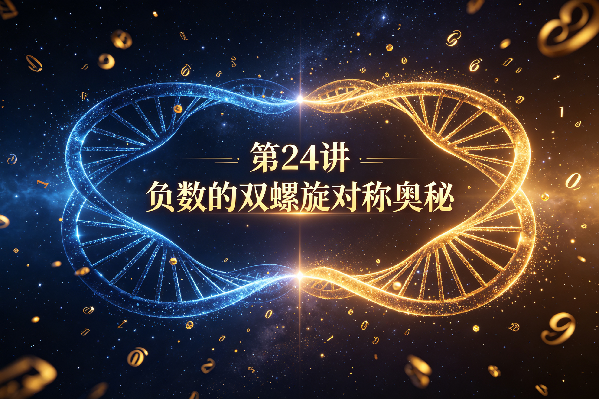
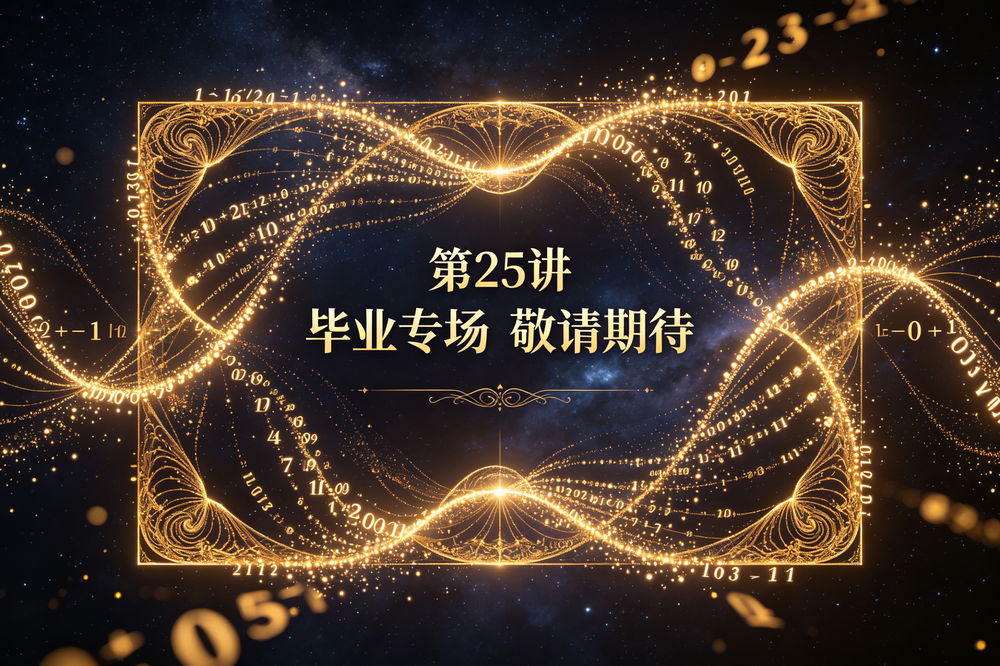

<ArchiveCopyPanel article-id="162189395" />

{"markdown":"PiDliIbnsbvvvJrmlofmmI7ov5vpmLYyMDDorrIgIAo+IOe8luWPt++8mmAxNjIxODkzOTVgICAKPiDljp/lp4vmlofku7bvvJpg6LSf5pWw5LiN5Y+q5piv5q+UMOWwj+eahOaVsOWtl+aYr+WPjOieuuaXi+W3puWPs+S4pOadoeWxsei3r+eahOWvueensOWPjeWQkeiEiee7nC3lhajln5/mlbDlraZ2c+S8oOe7n+aVsOWtpuS6uuexu+aWh+aYjui/m+mYtjIwMOiusuesrC0xNjIxODkzOTUubWRgICAKPiDov5Tlm57vvJpb5pys5Lmm5b2S5qGjXSgvemgvYm9va3MvY291cnNlL2FydGljbGVzLykgwrcgW+aAu+WFpeWPo10oL3poL2Jvb2tzL2FydGljbGVzLykKCuS9nOiAhe+8miDkuZbkuZbmlbDlraYKCiMjIOOAiuWFqOWfn+aVsOWtpnZz5Lyg57uf5pWw5a2m77ya5Lq657G75paH5piO6L+b6Zi2MjAw6K6y44CL56ysMjTorrIg5bCP5a2m6YCa5L+X54mI6YCQ5a2X56i/CgohW+esrDI06K6yIOi0n+aVsOeahOWPjOieuuaXi+WvueensOWlpeenmF0oLi9hc3NldHMvY3NkbmltZy9qcGcvZDllNDY4MTY2MmE4ODU4YS5qcGcpCgrorrLmrKHvvJrnrKwyNOiusgoK5Li76aKY77ya6LSf5pWw5LiN5Y+q5piv5q+UMOWwj+eahOaVsOWtl++8jOaYr+WPjOieuuaXi+W3puWPs+S4pOadoeWxsei3r+eahOWvueensOWPjeWQkeiEiee7nAoK5a+55qCH6K++5pys55+l6K+G54K577ya6LSf5pWw55qE5Yid5q2l6K6k6K+GCgrmlofpo47vvJrnq6XotqPlpKfnmb3or53vvIzml6Dpmr7mh4LkuJPkuJror43msYfvvIzlu7bnu63lhajlpZflj4zonrrml4vjgIHmnKzmupDlr7nnp7Dmr5TllrsKCi0tLQoKIyMjIDDvvZ4z5YiG6ZKfIOWkjeS5oOWvvOWFpQoKIVvmraPlj43mr5Tkvovlj4zonrrml4vliIblvaLnu5PmnoRdKC4vYXNzZXRzL2NzZG5pbWcvanBnLzQzYmYyYTBkY2RiMzc1ODguanBnKQoK5ZCM5a2m5Lus77yM5LiK5LiA6IqC6K++5oiR5Lus5byE5oeC5LqG5q2j5Y+N5q+U5L6L77yM5a6D5LiN5Y+q5piv5pWw5a2X5YCN5pWw6K6h566X77yM5piv5Lik5p2h5pWw5a2X5bGx6Lev55Sf6ZW/5pe25LiA5aKe5LiA5YeP44CB5ZCM5q2l5ouJ6ZW/55qE5aSp54S25bmz6KGh6IqC5aWP44CCCgrov5noioLor77miJHku6zogYror77mnKzph4znmoTotJ/mlbDjgILogIHluIjkvJror7TvvJrmr5Qw5pu05bCP55qE5pWw5bCx5piv6LSf5pWw77yM55So5p2l6KGo56S66Zu25LiL5rip5bqm44CB5qyg6ZKx44CB5Zyw5LiL5qW85bGC77yM5Y+q5piv55So5p2l6K6w5b2V55u45Y+N5oOF5Ya155qE56ym5Y+344CCCgrku4rlpKnmiJHku6zmjaLmnKzmupDop4bop5LvvJrotJ/mlbDkuI3mmK/kurrkuLrpgKDlh7rmnaXnmoTlsI/lj7fmlbDlrZfvvIzmmK/ku44w5Z+654K55YiG5byA77yM5ZKM5q2j5pWw5bGx6Lev5a6M5YWo5a+556ew44CB5Y+N5ZCR5bu25Ly455qE5Y+m5LiA5aWX55Sf6ZW/6ISJ57uc77yM5piv5Y+M6J665peL5a6M5pW05a+556ew57uT5p6E6YeM5LiN5Y+v57y65bCR55qE5LiA5Y2K44CCCgotLS0KCiMjIyAz772eMTPliIbpkp8g55Sf5rS75YyW57G75q+U6K6y6KejCgohW+ato+i0n+a4qeW6puWPjOieuuaXi+aYn+epuuWvueensF0oLi9hc3NldHMvY3NkbmltZy9qcGcvNDQ3NWRmM2IwZDk4MTJiYi5qcGcpCgrlhYjorrLor77mnKzph4znmoTotJ/mlbDnlKjms5XvvJoKCuawlOa4qembtuS4ijXluqborrArNSs1KzXvvIzpm7bkuIs15bqm6K6w4oiSNS014oiSNe+8m+WtmOmSseS4uuato++8jOasoOWAuuS4uui0n++8jOWPquaYr+aLv+ato+i0n+espuWPt+WMuuWIhuS4pOenjeebuOWPjeaDheWGte+8jOaKijDlvZPmiJDliIblibLnur/jgIIKCjDmmK/miYDmnInmlbDlrZflhbHlkIznmoTkuK3lv4PngrnvvIzkuIDmnaHonrrml4vlvoDmraPlkJHlu7bkvLjvvIzplb/lh7rmiJHku6zlubPml7bnlKjnmoQx44CBM+OAgTXjgIE3MeOAgTPjgIE144CBNzHjgIEz44CBNeOAgTfov5nkupvmraPmlbDvvJvlj6bkuIDmnaHonrrml4vlvoDnm7jlj43mlrnlkJHlkIzmraXnlJ/plb/vvIzplb/lh7riiJIx44CB4oiSM+OAgeKIkjUtMeOAgS0z44CBLTXiiJIx44CB4oiSM+OAgeKIkjXov5nnsbvotJ/mlbDjgIIKCuS4pOadoeiEiee7nOS4gOato+S4gOWPje+8jOmVv+W6puOAgeaOkuW4g+inhOW+i+WujOWFqOWvueensO+8jOWQiOWcqOS4gOi1t+aJjeaYr+WujOaVtOeahOaVsOWtl+WPjOieuuaXi+OAggoK5Li+5Liq566A5Y2V5L6L5a2Q77yaCgror77mnKzop4bop5LvvJriiJIzLTPiiJIz5Y+q5piv5q+UMOWwjzPnmoTmlbDlrZfvvIznlKjmnaXooajnpLrpm7bkuIvkuInluqbjgIIKCuWFqOWfn+mAmuS/l+ino+ivu++8muKIkjMtM+KIkjPlkowzMzPmmK/kuIDlr7nlr7nnp7Dljp/nlJ/mlbDlrZfvvIzkuIDmnaHlvoDlpKnkuIrplb/vvIzkuIDmnaHlvoDlnLDkuIvlu7bkvLjvvIzkuKTmnaHonrrml4vmiJDlr7nphY3lpZflh7rnjrDvvIzlpKnnlJ/miJDlr7nlrZjlnKjvvIzkuI3mmK/miJHku6zkuLrkuoborrDmuKnluqblh63nqbrliJvpgKDnmoTnrKblj7fjgIIKCuivvuacrOWPquaKiui0n+aVsOW9k+aIkOiusOW9leebuOWPjeS6i+S7tueahOW3peWFt++8jOW/veeVpeS6huato+i0n+aVsOWtl+acrOWwseaYr+S4gOWll+WujOaVtOWvueensOWPjOieuuaXi+eahOS4pOadoeWPjeWQkeWxsei3r+OAggoKLS0tCgojIyMgMTPvvZ4yMuWIhumSnyDor77mnKzop4LngrkgdnMg5YWo5Z+f5pWw5a2m6YCa5L+X6KeC54K5CgohW+ato+i0n+aVsOWtl+WPjOeUn+agkeiHqueEtuWvueensF0oLi9hc3NldHMvY3NkbmltZy9qcGcvYmVkYzgxNzYwZmE5YjdiNC5qcGcpCgojIyMjIOS8oOe7n+ivvuacrOiupOefpQoKLSAKCjDmmK/mnIDlsI/ovrnnlYzvvIzotJ/mlbDlj6rmmK/kurrkuLrmoIforrDnm7jlj43mg4XlhrXnmoTovoXliqnmlbDlrZcKCi0gCgrmraPmlbDmmK/ln7rnoYDmlbDlrZfvvIzotJ/mlbDlj6rmmK/phY3lpZfooaXlhYXvvIzmsqHmnInni6znq4vnlJ/plb/pgLvovpEKCi0gCgrmraPotJ/lj6rmmK/kurrkuLrop4TlrprnmoTmraPlj43moIforrDvvIzkuI3lrZjlnKjlpKnnhLblr7nnp7Dnu5PmnoQKCiMjIyMg5YWo5Z+f5pWw5a2m6YCa5L+X6K6k55+lCgotIAoKMOaYr+WvueensOS4reW/g+eCue+8jOato+aVsOOAgei0n+aVsOaYr+WPjOWQkeWQjOatpeW7tuS8uOeahOS4pOadoeieuuaXi+Wxsei3r++8jOWcsOS9jeW5s+etiQoKLSAKCui0n+aVsOaLpeacieWSjOato+aVsOWujOWFqOS4gOiHtOeahOeUn+mVv+aOkuW4g+inhOW+i++8jOWOn+eUn+aVsOWtl+OAgee7hOWQiOaVsOWtl+WcqOi0n+WQkeieuuaXi+WQjOagt+WtmOWcqAoKLSAKCuato+i0n+aIkOWvueaYr+WkqeWcsOWOn+eUn+WvueensOinhOWIme+8jOiusOW9lea4qeW6puOAgeasoOasvuWPquaYr+i/meWll+inhOWImeeahOa1heWxguW6lOeUqAoK566A5Y2V5q+U5Za777yaCgror77mnKznmoTmraPotJ/vvIzlpb3mr5TkuIDlvKDnurjmraPpnaLlhpnlrZfkuLrmraPjgIHlj43pnaLlhpnlrZfkuLrotJ/vvIzlj6rmmK/kurrkuLrljLrliIbvvJsKCuacrOa6kOato+i0n++8jOWmguWQjOWkp+agkeWQkeS4i+aJjueahOagkeagueOAgeWQkeS4iumVv+eahOaeneW5su+8jOS4pOadoeiEiee7nOWvueensOWQjOatpeeUn+mVv++8jOe8uuS4gOS4jeWPr+OAggoKLS0tCgojIyMgMjLvvZ4yN+WIhumSnyDmoKHlhoXlrabkuaDmj5DphpLvvIzkuI3lvbHlk43ogIPor5XlvpfliIYKCuW5s+aXtua4qeW6puOAgealvOWxguOAgeaUtuaUr+i0n+aVsOW6lOeUqOmimO+8jOaMieeFp+ivvuacrOinhOWImeS5puWGmeOAgeiuoeeul+WujOWFqOato+ehru+8jOiAg+ivleS4jeS8muaJo+WIhuOAggoK5pys6IqC6K++5Y+q5piv5ouT5bGV5rex5bGC6K6k55+l77ya6LSf5pWw5LiN5piv5Y2V57qv5bCP5LqOMOeahOaVsOWtl++8jOaYr+WSjOato+aVsOWvueensOOAgeWPjeWQkeW7tuS8uOeahOWPpuS4gOaUr+aVsOWtl+eUn+mVv+ieuuaXi+OAggoKIyMjIyDkvI/nrJTph43no4Xpk7rlnqsKCiFbMSsx5Y+M6J665peL5ZCM5rqQ5YiG5YyW5Yib5LiWXSguL2Fzc2V0cy9jc2RuaW1nL2pwZy8zYjAwNmM1OWExZGRhNTg2LmpwZykKCuS4i+S4gOiKguivvuWwseaYr+esrDI16K6y5bCP5a2m5q+V5Lia5LiT5Zy677yM5pW05ZCI5YmNMjTorrLlhajpg6jlhoXlrrnvvIzlrozmlbTmi4bop6PmoLjlv4Plkb3popjigJTigJTkuLrku4DkuYgxKzExKzExKzHkuI3nrYnkuo7liLvmnb/nmoQy77yM6ICM5pivMOWfuueCueWPjOieuuaXi+S4gOasoeWQjOatpeWIhuWMlueUn+mVv+OAggoKLS0tCgojIyMgMjfvvZ4zMOWIhumSnyDor77loILmgLvnu5Mr5LiL6IqC6K++6aKE5ZGKCgrmnKzoioLor77lsI/nu5PvvJoKCuato+aVsOOAgei0n+aVsOaYr+S7pTDkuLrkuK3lv4Plj4zlkJHlu7bkvLjnmoTlr7nnp7Dlj4zonrrml4vvvIzotJ/mlbDmmK/lrozmlbTmlbDlrZfkvZPns7vph4zni6znq4vnmoTlj43lkJHnlJ/plb/ohInnu5zjgIIKCuS4i+S4gOiKguivvu+8muesrDI16K6yIOWwj+WtpuavleS4muS4k+Wcuu+9nOS4uuS7gOS5iDErMeKJoDIxKzEgXG5lcSAyMSsx7oCgPTLvvIzlj6rmmK/lj4zonrrml4vkuIDmrKHlkIzmupDliIbljJbov63ku6MKCiFb56ysMjXorrLmr5XkuJrkuJPlnLrmlazor7fmnJ/lvoVdKC4vYXNzZXRzL2NzZG5pbWcvanBnLzk0ZGU2OGZhOWVkNzZlYzQuanBnKQo=","text":"5YiG57G777ya5paH5piO6L+b6Zi2MjAw6K6yICAK57yW5Y+377yaMTYyMTg5Mzk1ICAK5Y6f5aeL5paH5Lu277ya6LSf5pWw5LiN5Y+q5piv5q+UMOWwj+eahOaVsOWtl+aYr+WPjOieuuaXi+W3puWPs+S4pOadoeWxsei3r+eahOWvueensOWPjeWQkeiEiee7nC3lhajln5/mlbDlraZ2c+S8oOe7n+aVsOWtpuS6uuexu+aWh+aYjui/m+mYtjIwMOiusuesrC0xNjIxODkzOTUubWQgIArov5Tlm57vvJrmnKzkuablvZLmoaMgwrcg5oC75YWl5Y+jCgrkvZzogIXvvJog5LmW5LmW5pWw5a2mCgrjgIrlhajln5/mlbDlraZ2c+S8oOe7n+aVsOWtpu+8muS6uuexu+aWh+aYjui/m+mYtjIwMOiusuOAi+esrDI06K6yIOWwj+WtpumAmuS/l+eJiOmAkOWtl+eovwoK56ysMjTorrIg6LSf5pWw55qE5Y+M6J665peL5a+556ew5aWl56eYCgrorrLmrKHvvJrnrKwyNOiusgoK5Li76aKY77ya6LSf5pWw5LiN5Y+q5piv5q+UMOWwj+eahOaVsOWtl++8jOaYr+WPjOieuuaXi+W3puWPs+S4pOadoeWxsei3r+eahOWvueensOWPjeWQkeiEiee7nAoK5a+55qCH6K++5pys55+l6K+G54K577ya6LSf5pWw55qE5Yid5q2l6K6k6K+GCgrmlofpo47vvJrnq6XotqPlpKfnmb3or53vvIzml6Dpmr7mh4LkuJPkuJror43msYfvvIzlu7bnu63lhajlpZflj4zonrrml4vjgIHmnKzmupDlr7nnp7Dmr5TllrsKCi0tLQoKMO+9njPliIbpkp8g5aSN5Lmg5a+85YWlCgrmraPlj43mr5Tkvovlj4zonrrml4vliIblvaLnu5PmnoQKCuWQjOWtpuS7rO+8jOS4iuS4gOiKguivvuaIkeS7rOW8hOaHguS6huato+WPjeavlOS+i++8jOWug+S4jeWPquaYr+aVsOWtl+WAjeaVsOiuoeeul++8jOaYr+S4pOadoeaVsOWtl+Wxsei3r+eUn+mVv+aXtuS4gOWinuS4gOWHj+OAgeWQjOatpeaLiemVv+eahOWkqeeEtuW5s+ihoeiKguWlj+OAggoK6L+Z6IqC6K++5oiR5Lus6IGK6K++5pys6YeM55qE6LSf5pWw44CC6ICB5biI5Lya6K+077ya5q+UMOabtOWwj+eahOaVsOWwseaYr+i0n+aVsO+8jOeUqOadpeihqOekuumbtuS4i+a4qeW6puOAgeasoOmSseOAgeWcsOS4i+alvOWxgu+8jOWPquaYr+eUqOadpeiusOW9leebuOWPjeaDheWGteeahOespuWPt+OAggoK5LuK5aSp5oiR5Lus5o2i5pys5rqQ6KeG6KeS77ya6LSf5pWw5LiN5piv5Lq65Li66YCg5Ye65p2l55qE5bCP5Y+35pWw5a2X77yM5piv5LuOMOWfuueCueWIhuW8gO+8jOWSjOato+aVsOWxsei3r+WujOWFqOWvueensOOAgeWPjeWQkeW7tuS8uOeahOWPpuS4gOWll+eUn+mVv+iEiee7nO+8jOaYr+WPjOieuuaXi+WujOaVtOWvueensOe7k+aehOmHjOS4jeWPr+e8uuWwkeeahOS4gOWNiuOAggoKLS0tCgoz772eMTPliIbpkp8g55Sf5rS75YyW57G75q+U6K6y6KejCgrmraPotJ/muKnluqblj4zonrrml4vmmJ/nqbrlr7nnp7AKCuWFiOiusuivvuacrOmHjOeahOi0n+aVsOeUqOazle+8mgoK5rCU5rip6Zu25LiKNeW6puiusCs1KzUrNe+8jOmbtuS4izXluqborrDiiJI1LTXiiJI177yb5a2Y6ZKx5Li65q2j77yM5qyg5YC65Li66LSf77yM5Y+q5piv5ou/5q2j6LSf56ym5Y+35Yy65YiG5Lik56eN55u45Y+N5oOF5Ya177yM5oqKMOW9k+aIkOWIhuWJsue6v+OAggoKMOaYr+aJgOacieaVsOWtl+WFseWQjOeahOS4reW/g+eCue+8jOS4gOadoeieuuaXi+W+gOato+WQkeW7tuS8uO+8jOmVv+WHuuaIkeS7rOW5s+aXtueUqOeahDHjgIEz44CBNeOAgTcx44CBM+OAgTXjgIE3MeOAgTPjgIE144CBN+i/meS6m+ato+aVsO+8m+WPpuS4gOadoeieuuaXi+W+gOebuOWPjeaWueWQkeWQjOatpeeUn+mVv++8jOmVv+WHuuKIkjHjgIHiiJIz44CB4oiSNS0x44CBLTPjgIEtNeKIkjHjgIHiiJIz44CB4oiSNei/meexu+i0n+aVsOOAggoK5Lik5p2h6ISJ57uc5LiA5q2j5LiA5Y+N77yM6ZW/5bqm44CB5o6S5biD6KeE5b6L5a6M5YWo5a+556ew77yM5ZCI5Zyo5LiA6LW35omN5piv5a6M5pW055qE5pWw5a2X5Y+M6J665peL44CCCgrkuL7kuKrnroDljZXkvovlrZDvvJoKCuivvuacrOinhuinku+8muKIkjMtM+KIkjPlj6rmmK/mr5Qw5bCPM+eahOaVsOWtl++8jOeUqOadpeihqOekuumbtuS4i+S4ieW6puOAggoK5YWo5Z+f6YCa5L+X6Kej6K+777ya4oiSMy0z4oiSM+WSjDMzM+aYr+S4gOWvueWvueensOWOn+eUn+aVsOWtl++8jOS4gOadoeW+gOWkqeS4iumVv++8jOS4gOadoeW+gOWcsOS4i+W7tuS8uO+8jOS4pOadoeieuuaXi+aIkOWvuemFjeWll+WHuueOsO+8jOWkqeeUn+aIkOWvueWtmOWcqO+8jOS4jeaYr+aIkeS7rOS4uuS6huiusOa4qeW6puWHreepuuWIm+mAoOeahOespuWPt+OAggoK6K++5pys5Y+q5oqK6LSf5pWw5b2T5oiQ6K6w5b2V55u45Y+N5LqL5Lu255qE5bel5YW377yM5b+955Wl5LqG5q2j6LSf5pWw5a2X5pys5bCx5piv5LiA5aWX5a6M5pW05a+556ew5Y+M6J665peL55qE5Lik5p2h5Y+N5ZCR5bGx6Lev44CCCgotLS0KCjEz772eMjLliIbpkp8g6K++5pys6KeC54K5IHZzIOWFqOWfn+aVsOWtpumAmuS/l+ingueCuQoK5q2j6LSf5pWw5a2X5Y+M55Sf5qCR6Ieq54S25a+556ewCgrkvKDnu5/or77mnKzorqTnn6UKMOaYr+acgOWwj+i+ueeVjO+8jOi0n+aVsOWPquaYr+S6uuS4uuagh+iusOebuOWPjeaDheWGteeahOi+heWKqeaVsOWtlwrmraPmlbDmmK/ln7rnoYDmlbDlrZfvvIzotJ/mlbDlj6rmmK/phY3lpZfooaXlhYXvvIzmsqHmnInni6znq4vnlJ/plb/pgLvovpEK5q2j6LSf5Y+q5piv5Lq65Li66KeE5a6a55qE5q2j5Y+N5qCH6K6w77yM5LiN5a2Y5Zyo5aSp54S25a+556ew57uT5p6ECgrlhajln5/mlbDlrabpgJrkv5forqTnn6UKMOaYr+WvueensOS4reW/g+eCue+8jOato+aVsOOAgei0n+aVsOaYr+WPjOWQkeWQjOatpeW7tuS8uOeahOS4pOadoeieuuaXi+Wxsei3r++8jOWcsOS9jeW5s+etiQrotJ/mlbDmi6XmnInlkozmraPmlbDlrozlhajkuIDoh7TnmoTnlJ/plb/mjpLluIPop4TlvovvvIzljp/nlJ/mlbDlrZfjgIHnu4TlkIjmlbDlrZflnKjotJ/lkJHonrrml4vlkIzmoLflrZjlnKgK5q2j6LSf5oiQ5a+55piv5aSp5Zyw5Y6f55Sf5a+556ew6KeE5YiZ77yM6K6w5b2V5rip5bqm44CB5qyg5qy+5Y+q5piv6L+Z5aWX6KeE5YiZ55qE5rWF5bGC5bqU55SoCgrnroDljZXmr5TllrvvvJoKCuivvuacrOeahOato+i0n++8jOWlveavlOS4gOW8oOe6uOato+mdouWGmeWtl+S4uuato+OAgeWPjemdouWGmeWtl+S4uui0n++8jOWPquaYr+S6uuS4uuWMuuWIhu+8mwoK5pys5rqQ5q2j6LSf77yM5aaC5ZCM5aSn5qCR5ZCR5LiL5omO55qE5qCR5qC544CB5ZCR5LiK6ZW/55qE5p6d5bmy77yM5Lik5p2h6ISJ57uc5a+556ew5ZCM5q2l55Sf6ZW/77yM57y65LiA5LiN5Y+v44CCCgotLS0KCjIy772eMjfliIbpkp8g5qCh5YaF5a2m5Lmg5o+Q6YaS77yM5LiN5b2x5ZON6ICD6K+V5b6X5YiGCgrlubPml7bmuKnluqbjgIHmpbzlsYLjgIHmlLbmlK/otJ/mlbDlupTnlKjpopjvvIzmjInnhafor77mnKzop4TliJnkuablhpnjgIHorqHnrpflrozlhajmraPnoa7vvIzogIPor5XkuI3kvJrmiaPliIbjgIIKCuacrOiKguivvuWPquaYr+aLk+Wxlea3seWxguiupOefpe+8mui0n+aVsOS4jeaYr+WNlee6r+Wwj+S6jjDnmoTmlbDlrZfvvIzmmK/lkozmraPmlbDlr7nnp7DjgIHlj43lkJHlu7bkvLjnmoTlj6bkuIDmlK/mlbDlrZfnlJ/plb/onrrml4vjgIIKCuS8j+eslOmHjeejhemTuuWeqwoKMSsx5Y+M6J665peL5ZCM5rqQ5YiG5YyW5Yib5LiWCgrkuIvkuIDoioLor77lsLHmmK/nrKwyNeiusuWwj+WtpuavleS4muS4k+Wcuu+8jOaVtOWQiOWJjTI06K6y5YWo6YOo5YaF5a6577yM5a6M5pW05ouG6Kej5qC45b+D5ZG96aKY4oCU4oCU5Li65LuA5LmIMSsxMSsxMSsx5LiN562J5LqO5Yi75p2/55qEMu+8jOiAjOaYrzDln7rngrnlj4zonrrml4vkuIDmrKHlkIzmraXliIbljJbnlJ/plb/jgIIKCi0tLQoKMjfvvZ4zMOWIhumSnyDor77loILmgLvnu5Mr5LiL6IqC6K++6aKE5ZGKCgrmnKzoioLor77lsI/nu5PvvJoKCuato+aVsOOAgei0n+aVsOaYr+S7pTDkuLrkuK3lv4Plj4zlkJHlu7bkvLjnmoTlr7nnp7Dlj4zonrrml4vvvIzotJ/mlbDmmK/lrozmlbTmlbDlrZfkvZPns7vph4zni6znq4vnmoTlj43lkJHnlJ/plb/ohInnu5zjgIIKCuS4i+S4gOiKguivvu+8muesrDI16K6yIOWwj+WtpuavleS4muS4k+Wcuu+9nOS4uuS7gOS5iDErMeKJoDIxKzEgXG5lcSAyMSsx7oCgPTLvvIzlj6rmmK/lj4zonrrml4vkuIDmrKHlkIzmupDliIbljJbov63ku6MKCuesrDI16K6y5q+V5Lia5LiT5Zy65pWs6K+35pyf5b6F"}

> 分类：文明进阶200讲  
> 编号：`162189395`  
> 原始文件：`负数不只是比0小的数字是双螺旋左右两条山路的对称反向脉络-全域数学vs传统数学人类文明进阶200讲第-162189395.md`  
> 返回：[本书归档](/zh/books/course/articles/) · [总入口](/zh/books/articles/)

<ArticlePaperMeta category="文明进阶200讲" article-id="162189395" title="负数不只是比0小的数字是双螺旋左右两条山路的对称反向脉络-全域数学vs传统数学人类文明进阶200讲第" paper-kind="课程讲义" book-route="/zh/books/course/articles/" overview-route="/zh/books/articles/" summary="文风：童趣大白话，无难懂专业词汇，延续全套双螺旋、本源对称比喻" author="乖乖数学" lecture="第24讲" theme="负数不只是比0小的数字，是双螺旋左右两条山路的对称反向脉络" source-file="负数不只是比0小的数字是双螺旋左右两条山路的对称反向脉络-全域数学vs传统数学人类文明进阶200讲第-162189395.md" cover="./assets/csdnimg/jpg/d9e4681662a8858a.jpg" />

作者： 乖乖数学

## 《全域数学vs传统数学：人类文明进阶200讲》第24讲 小学通俗版逐字稿

讲次：第24讲

主题：负数不只是比0小的数字，是双螺旋左右两条山路的对称反向脉络

对标课本知识点：负数的初步认识

文风：童趣大白话，无难懂专业词汇，延续全套双螺旋、本源对称比喻

---

### 0～3分钟 复习导入

同学们，上一节课我们弄懂了正反比例，它不只是数字倍数计算，是两条数字山路生长时一增一减、同步拉长的天然平衡节奏。

这节课我们聊课本里的负数。老师会说：比0更小的数就是负数，用来表示零下温度、欠钱、地下楼层，只是用来记录相反情况的符号。

今天我们换本源视角：负数不是人为造出来的小号数字，是从0基点分开，和正数山路完全对称、反向延伸的另一套生长脉络，是双螺旋完整对称结构里不可缺少的一半。

---

### 3～13分钟 生活化类比讲解

先讲课本里的负数用法：

气温零上5度记+5+5+5，零下5度记−5-5−5；存钱为正，欠债为负，只是拿正负符号区分两种相反情况，把0当成分割线。

0是所有数字共同的中心点，一条螺旋往正向延伸，长出我们平时用的1、3、5、71、3、5、71、3、5、7这些正数；另一条螺旋往相反方向同步生长，长出−1、−3、−5-1、-3、-5−1、−3、−5这类负数。

两条脉络一正一反，长度、排布规律完全对称，合在一起才是完整的数字双螺旋。

举个简单例子：

课本视角：−3-3−3只是比0小3的数字，用来表示零下三度。

全域通俗解读：−3-3−3和333是一对对称原生数字，一条往天上长，一条往地下延伸，两条螺旋成对配套出现，天生成对存在，不是我们为了记温度凭空创造的符号。

课本只把负数当成记录相反事件的工具，忽略了正负数字本就是一套完整对称双螺旋的两条反向山路。

---

### 13～22分钟 课本观点 vs 全域数学通俗观点

#### 传统课本认知

- 

0是最小边界，负数只是人为标记相反情况的辅助数字

- 

正数是基础数字，负数只是配套补充，没有独立生长逻辑

- 

正负只是人为规定的正反标记，不存在天然对称结构

#### 全域数学通俗认知

- 

0是对称中心点，正数、负数是双向同步延伸的两条螺旋山路，地位平等

- 

负数拥有和正数完全一致的生长排布规律，原生数字、组合数字在负向螺旋同样存在

- 

正负成对是天地原生对称规则，记录温度、欠款只是这套规则的浅层应用

简单比喻：

课本的正负，好比一张纸正面写字为正、反面写字为负，只是人为区分；

本源正负，如同大树向下扎的树根、向上长的枝干，两条脉络对称同步生长，缺一不可。

---

### 22～27分钟 校内学习提醒，不影响考试得分

平时温度、楼层、收支负数应用题，按照课本规则书写、计算完全正确，考试不会扣分。

本节课只是拓展深层认知：负数不是单纯小于0的数字，是和正数对称、反向延伸的另一支数字生长螺旋。

#### 伏笔重磅铺垫

下一节课就是第25讲小学毕业专场，整合前24讲全部内容，完整拆解核心命题——为什么1+11+11+1不等于刻板的2，而是0基点双螺旋一次同步分化生长。

---

### 27～30分钟 课堂总结+下节课预告

本节课小结：

正数、负数是以0为中心双向延伸的对称双螺旋，负数是完整数字体系里独立的反向生长脉络。

下一节课：第25讲 小学毕业专场｜为什么1+1≠21+1 \neq 21+1=2，只是双螺旋一次同源分化迭代

