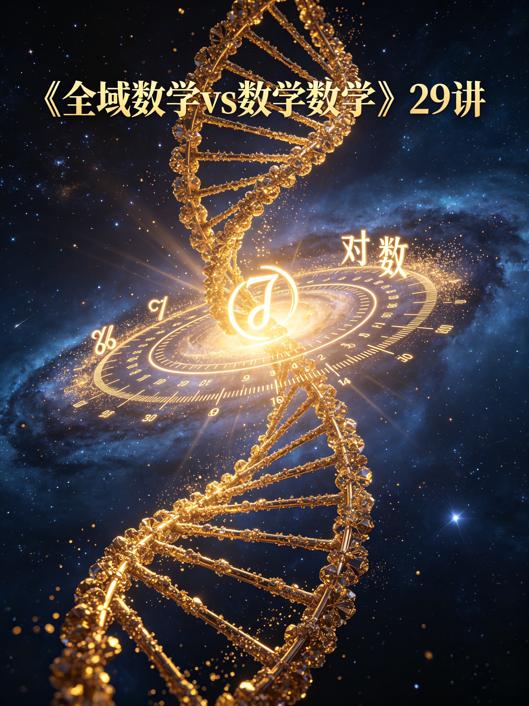
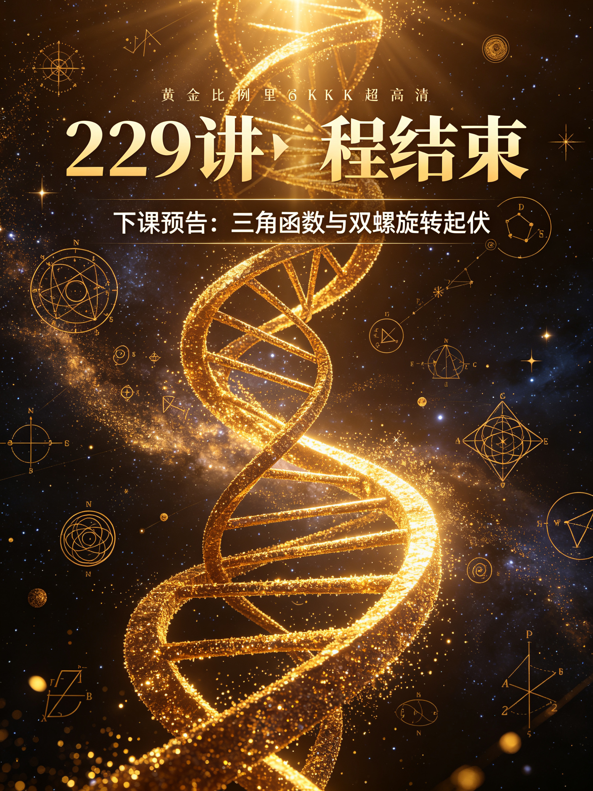

<ArchiveCopyPanel article-id="162212766" />

{"markdown":"PiDliIbnsbvvvJrmlofmmI7ov5vpmLYyMDDorrIgIAo+IOe8luWPt++8mmAxNjIyMTI3NjZgICAKPiDljp/lp4vmlofku7bvvJpg5a+55pWw5LiN5piv5Y+N5ZCR5ouG5YiG6K6h566X5piv5ouG6Kej5Y+M6J665peL5Y+g5Yqg5bGC5pWw55qE6K6h6YeP5qCH5bC6LeWFqOWfn+aVsOWtpnZz5Lyg57uf5pWw5a2m5Lq657G75paH5piO6L+b6Zi2MjAw6K6y56ysMjnorrItMTYyMjEyNzY2Lm1kYCAgCj4g6L+U5Zue77yaW+acrOS5puW9kuaho10oL3poL2Jvb2tzL2NvdXJzZS9hcnRpY2xlcy8pIMK3IFvmgLvlhaXlj6NdKC96aC9ib29rcy9hcnRpY2xlcy8pCgohW+OAiuWFqOWfn+aVsOWtpnZz5Lyg57uf5pWw5a2m44CL56ysMjnorrLlsIHpnaJdKC4vYXNzZXRzL2NzZG5pbWcvanBnL2QyOGI3MWMzNGM3ODY2MDQuanBnKQoKIyMg44CK5YWo5Z+f5pWw5a2mdnPkvKDnu5/mlbDlrabvvJrkurrnsbvmlofmmI7ov5vpmLYyMDDorrLjgIvnrKwyOeiusiDkuK3lrabpgJrkv5fniYjpgJDlrZfnqL8KCuS9nOiAhe+8miDkuZbkuZbmlbDlraYKCuiusuasoe+8miDnrKwyOeiusgoK5Li76aKY77yaIOWvueaVsOS4jeaYr+WPjeWQkeaLhuWIhuiuoeeul++8jOaYr+aLhuino+WPjOieuuaXi+WPoOWKoOWxguaVsOeahOiuoemHj+agh+WwugoK5a+55qCH6K++5pys55+l6K+G54K577yaIOWvueaVsOWfuuehgOamguW/tQoK5paH6aOO77yaIOWkp+eZveivneOAgeaXoOWkjeadguS4k+S4muacr+ivre+8jOW7tue7rTAvMeWfuueCueOAgeWPjOieuuaXi+eUn+mVv+WFqOWll+avlOWWuwoKLS0tCgojIyMgMO+9njPliIbpkp8g5aSN5Lmg5a+85YWlCgohW+WPjOieuuaXi+eUn+mVv+e7k+aehOekuuaEj+Wbvl0oLi9hc3NldHMvY3NkbmltZy9qcGcvZWE5NWU5ZmU5OWVhMWZiMi5qcGcpCgrlkIzlrabku6zvvIzkuIrkuIDoioLor77miJHku6zlrabkuaDkuobmjIfmlbDlh73mlbDvvIznn6XpgZPmiJDlgI3ohqjog4DjgIHmlLbnvKnnmoTmnKzotKjmmK/lj4zonrrml4vkuIDlsYLkuIDlsYLlpI3liLvlj6DliqDnmoTnlJ/plb/mqKHlvI/jgIIKCuaVsOWtpuivvuS4iuiAgeW4iOS8muiusu+8jOWvueaVsOaYr+aMh+aVsOWPjei/h+adpeeahOi/kOeul++8jOW3suefpeWPoOWKoOWQjueahOaAu+mHj++8jOWAkuaOqOS4gOWFseWPoOWKoOS6huWkmuWwkeWxgu+8jOWPquaYr+eUqOadpeino+aWueeoi+eahOiuoeeul+W3peWFt+OAggoK5LuK5aSp5oiR5Lus5o2i5pys5rqQ6KeG6KeS77ya5a+55pWw5LiN5Y+q5piv5Lq65Li65Yib6YCg55qE5Y+N5ZCR6K6h566X5pa55rOV77yM5a6D5piv5LiT6Zeo55So5p2l5LiI6YeP6J665peL5Y+g5Yqg5bGC5pWw55qE5aSp54S25qCH5bC677yM55So5p2l5Yy65YiG6IO96YeP5aCG5Y+g5LqG5aSa5bCR5bGC6ISJ57uc44CCCgotLS0KCiMjIyAz772eMTPliIbpkp8g55Sf5rS75YyW57G75q+U6K6y6KejCgohW+WvueaVsOaLhuino+ieuuaXi+WxguaVsOamguW/teWbvl0oLi9hc3NldHMvY3NkbmltZy9qcGcvNjgzODg1YzZhMDE3NjEwMi5qcGcpCgrlhYjorrLor77mnKzph4znmoTlr7nmlbDnlKjms5XvvJoKCuavlOWmgjLnmoR45qyh5pa5562J5LqOMzLvvIzmsYJ4562J5LqO5aSa5bCR77yM6L+Z5Liq5rGC5bGC5pWw55qE6L+H56iL5bCx5piv5a+55pWw44CC6K++5pys5Y+q5oqK5a6D5b2T5oiQ5oyH5pWw55qE5Y+N5ZCR6Kej6aKY5bel5YW377yM5Y+q5YWz5b+D566X5Ye65pWw5a2X57uT5p6c44CCCgrmlL7liLDlj4zonrrml4vnlJ/plb/kvZPns7vph4zvvJoKCuaMh+aVsOaYr+ieuuaXi+S4gOWxguWxguWPoOWKoO+8jOS4jeaWreWghuenr+WHuuaWsOeahOaAu+mHj++8m+WvueaVsOWwseaYr+mhuuedgOWghuenr+WlveeahOaVtOS9k+e7k+aehO+8jOS4gOWxguS4gOWxguaLhuW8gO+8jOaVsOa4healmuS4gOWFseeUn+mVv+WPoOWKoOS6huWkmuWwkeWxguiEiee7nOOAggoK5bqV5pWw5a+55bqU6J665peL5q+P5LiA5bGC55qE5Y+g5Yqg5YCN546H77yM5a+55pWw566X5Ye65p2l55qE57uT5p6c77yM5bCx5piv5a6M5pW055Sf6ZW/5bGC5pWw44CCCgrkuL7nroDljZXkvovlrZDvvJoKCuivvuacrOinhuinku+8mmxvZ+KBoTIzMj01XGxvZ18yIDMyID0gNWxvZzLigIszMj0177yM5Y+q5piv5Y+N5ZCR566X5Ye65oyH5pWw55qE5pyq55+l5pWw44CCCgrlhajln5/pgJrkv5fop6Por7vvvJrku6Pooajlj4zonrrml4vku6Uy5YCN5YCN546H6L+e57ut5Y+g5YqgNeWxgu+8jOWvueaVsOeul+WHuueahDXvvIzlsLHmmK/lrp7lrp7lnKjlnKjnmoTnlJ/plb/lsYLmlbDvvIzmmK/mj4/ov7Donrrml4vnu5PmnoTnmoTmoLjlv4Pkv6Hmga/vvIzkuI3mmK/ljZXnuq/nmoTorqHnrpfnrZTmoYjjgIIKCuivvuacrOWPquaKiuWvueaVsOW9k+aIkOWPjeWQkeiuoeeul+mimOeahOW3peWFt++8jOW/veeVpeS6huWug+acrOi6q+aYr+S4iOmHj+ieuuaXi+WghuWPoOWxguaVsOeahOS4k+Wxnuagh+WwuuOAggoKLS0tCgojIyMgMTPvvZ4yMuWIhumSnyDor77mnKzop4LngrkgdnMg5YWo5Z+f5pWw5a2m6YCa5L+X6KeC54K5CgohW+ivvuacrOinhuinkuS4juWFqOWfn+aVsOWtpuinhuinkuWvueavlF0oLi9hc3NldHMvY3NkbmltZy9qcGcvYmFkYmJkZjUyNDI0NDNiMi5qcGcpCgojIyMjIOS8oOe7n+ivvuacrOiupOefpQoKLSDlr7nmlbDlj6rmmK/mjIfmlbDnmoTlj43lkJHov5DnrpfvvIzku4XnlKjkuo7op6PmlrnnqIvjgIHljJbnroDnrpflvI8KCi0g5bGC5pWw44CB5YCN546H5piv5Lq65Li66K6+5a6a55qE5pWw5a2X5YWz57O777yM5rKh5pyJ5a+55bqU55qE5a6e54mp57uT5p6ECgotIOWvueaVsOaYr+S6uuexu+WQjuacn+WPkeaYjueahOiuoeeul+aJi+aute+8jOiHqueEtueVjOS4jeWtmOWcqOWvueW6lOinhOW+iwoKIyMjIyDlhajln5/mlbDlrabpgJrkv5forqTnn6UKCi0g5YWI5pyJ6J665peL5YiG5bGC5Y+g5Yqg55qE55Sf6ZW/57uT5p6E77yM5ZCO5pyJ5a+55pWw6L+Z5aWX6K6h6YeP5pa55byP77yM5a+55pWw55So5p2l57uf6K6h5aCG5Y+g5bGC5pWwCgotIOWvueaVsOe7k+aenOS7o+ihqOieuuaXi+eUn+mVv+eahOWIhuWxguaVsOmHj++8jOW6leaVsOWvueW6lOavj+WxguWPoOWKoOiDvemHj+WAjeeOh++8jOmDveaYr+e7k+aehOiHquW4puWxnuaApwoKLSDlo7Dms6LlvLrlvLHjgIHmmJ/kvZPog73ph4/jgIHnianotKjlsYLnuqfliJLliIbvvIzlhajpg6jkvp3pnaDlr7nmlbDmoIflsLrljLrliIblsYLnuqflt67lvIIKCiFb6Ieq54S25Lit55qE5a+55pWw5qCH5bC6546w6LGhXSguL2Fzc2V0cy9jc2RuaW1nL2pwZy8zNjAwM2U3MmFkMmNkNzcwLmpwZykKCueugOWNleavlOWWu++8mgoK6K++5pys55qE5a+55pWw77yM5aW95q+U5ou/5Yiw5LiA5aCG5Y+g5aW955qE57q45byg77yM5Lq65Li65pWw5LiA5YWx5pyJ5aSa5bCR5byg77ybCgrmnKzmupDlr7nmlbDvvIzmmK/lpKnnlJ/phY3lpZfonrrml4vnlJ/plb/nmoTmtYvph4/lt6XlhbfvvIzkuIfnianliIblsYLloIblj6DnmoTnu5PmnoTvvIzlpKnnhLbog73nlKjlr7nmlbDliJLliIblsYLnuqfjgIIKCi0tLQoKIyMjIDIy772eMjfliIbpkp8g5qCh5YaF5a2m5Lmg5o+Q6YaS77yM5LiN5b2x5ZON6ICD6K+V5YGa6aKYCgrlr7nmlbDljJbnroDjgIHlr7nmlbDmlrnnqIvjgIHlh73mlbDlm77lg4/popjlnovvvIzlhajpg6jmjInnhafor77mnKzmoIflh4bmraXpqqTkvZznrZTvvIzogIPor5XkuI3kvJrmiaPliIbjgIIKCuacrOiKguivvuWPquaYr+aLk+WxlemrmOe7tOiupOefpe+8muWvueaVsOS4jeWPquaYr+WPjeWQkeiuoeeul+W3peWFt++8jOaYr+S4iOmHj+WPjOieuuaXi+iDvemHj+WPoOWKoOWxguaVsOeahOWkqeeEtuagh+WwuuOAggoK5LyP56yU6ZO65Z6r77yaIOesrDUw6K6y5Lit5a2m57uT5Lia5LiT5Zy677yM5pW05ZCIMjbigJM1MOiusuWFqOmDqOS4reWtpuWHveaVsOWGheWuue+8jOe7n+S4gOais+eQhuaMh+aVsOOAgeWvueaVsOOAgeS6jOasoeabsue6v+WvueW6lOeahOieuuaXi+i/kOWKqOW9ouaAgeOAggoKLS0tCgojIyMgMjfvvZ4zMOWIhumSnyDor77loILmgLvnu5Mr5LiL6IqC6K++6aKE5ZGKCgohW+esrDI56K6y57uT5p2f6aG15LiO5LiL6IqC6K++6aKE5ZGKXSguL2Fzc2V0cy9jc2RuaW1nL2pwZy9jMmNkMGE3NGNjNWFhYjFmLmpwZykKCiMjIyMg5pys6IqC6K++5bCP57uTCgrmjIfmlbDmmK/onrrml4vliIblsYLlj6DliqDnlJ/plb/vvIzlr7nmlbDmmK/lj43lkJHnu5/orqHlj6DliqDlsYLmlbDvvIzkuozogIXmmK/lkIzkuIDlpZflj4zonrrml4vnu5PmnoTnmoTmraPlj43kuKTnp43op4LmtYvop5LluqbjgIIKCiMjIyMg5LiL5LiA6IqC6K++6aKE5ZGKCgrkuInop5Llh73mlbDkuI3mmK/ovrnop5LmjaLnrpflt6XlhbfvvIzmmK/lj4zonrrml4vml4vovazkuIDlnIjnmoTotbfkvI/ms6LliqjorrDlvZXjgIIK","text":"5YiG57G777ya5paH5piO6L+b6Zi2MjAw6K6yICAK57yW5Y+377yaMTYyMjEyNzY2ICAK5Y6f5aeL5paH5Lu277ya5a+55pWw5LiN5piv5Y+N5ZCR5ouG5YiG6K6h566X5piv5ouG6Kej5Y+M6J665peL5Y+g5Yqg5bGC5pWw55qE6K6h6YeP5qCH5bC6LeWFqOWfn+aVsOWtpnZz5Lyg57uf5pWw5a2m5Lq657G75paH5piO6L+b6Zi2MjAw6K6y56ysMjnorrItMTYyMjEyNzY2Lm1kICAK6L+U5Zue77ya5pys5Lmm5b2S5qGjIMK3IOaAu+WFpeWPowoK44CK5YWo5Z+f5pWw5a2mdnPkvKDnu5/mlbDlrabjgIvnrKwyOeiusuWwgemdogoK44CK5YWo5Z+f5pWw5a2mdnPkvKDnu5/mlbDlrabvvJrkurrnsbvmlofmmI7ov5vpmLYyMDDorrLjgIvnrKwyOeiusiDkuK3lrabpgJrkv5fniYjpgJDlrZfnqL8KCuS9nOiAhe+8miDkuZbkuZbmlbDlraYKCuiusuasoe+8miDnrKwyOeiusgoK5Li76aKY77yaIOWvueaVsOS4jeaYr+WPjeWQkeaLhuWIhuiuoeeul++8jOaYr+aLhuino+WPjOieuuaXi+WPoOWKoOWxguaVsOeahOiuoemHj+agh+WwugoK5a+55qCH6K++5pys55+l6K+G54K577yaIOWvueaVsOWfuuehgOamguW/tQoK5paH6aOO77yaIOWkp+eZveivneOAgeaXoOWkjeadguS4k+S4muacr+ivre+8jOW7tue7rTAvMeWfuueCueOAgeWPjOieuuaXi+eUn+mVv+WFqOWll+avlOWWuwoKLS0tCgow772eM+WIhumSnyDlpI3kuaDlr7zlhaUKCuWPjOieuuaXi+eUn+mVv+e7k+aehOekuuaEj+WbvgoK5ZCM5a2m5Lus77yM5LiK5LiA6IqC6K++5oiR5Lus5a2m5Lmg5LqG5oyH5pWw5Ye95pWw77yM55+l6YGT5oiQ5YCN6Iao6IOA44CB5pS257yp55qE5pys6LSo5piv5Y+M6J665peL5LiA5bGC5LiA5bGC5aSN5Yi75Y+g5Yqg55qE55Sf6ZW/5qih5byP44CCCgrmlbDlrabor77kuIrogIHluIjkvJrorrLvvIzlr7nmlbDmmK/mjIfmlbDlj43ov4fmnaXnmoTov5DnrpfvvIzlt7Lnn6Xlj6DliqDlkI7nmoTmgLvph4/vvIzlgJLmjqjkuIDlhbHlj6DliqDkuoblpJrlsJHlsYLvvIzlj6rmmK/nlKjmnaXop6PmlrnnqIvnmoTorqHnrpflt6XlhbfjgIIKCuS7iuWkqeaIkeS7rOaNouacrOa6kOinhuinku+8muWvueaVsOS4jeWPquaYr+S6uuS4uuWIm+mAoOeahOWPjeWQkeiuoeeul+aWueazle+8jOWug+aYr+S4k+mXqOeUqOadpeS4iOmHj+ieuuaXi+WPoOWKoOWxguaVsOeahOWkqeeEtuagh+Wwuu+8jOeUqOadpeWMuuWIhuiDvemHj+WghuWPoOS6huWkmuWwkeWxguiEiee7nOOAggoKLS0tCgoz772eMTPliIbpkp8g55Sf5rS75YyW57G75q+U6K6y6KejCgrlr7nmlbDmi4bop6Ponrrml4vlsYLmlbDmpoLlv7Xlm74KCuWFiOiusuivvuacrOmHjOeahOWvueaVsOeUqOazle+8mgoK5q+U5aaCMueahHjmrKHmlrnnrYnkuo4zMu+8jOaxgnjnrYnkuo7lpJrlsJHvvIzov5nkuKrmsYLlsYLmlbDnmoTov4fnqIvlsLHmmK/lr7nmlbDjgILor77mnKzlj6rmiorlroPlvZPmiJDmjIfmlbDnmoTlj43lkJHop6Ppopjlt6XlhbfvvIzlj6rlhbPlv4Pnrpflh7rmlbDlrZfnu5PmnpzjgIIKCuaUvuWIsOWPjOieuuaXi+eUn+mVv+S9k+ezu+mHjO+8mgoK5oyH5pWw5piv6J665peL5LiA5bGC5bGC5Y+g5Yqg77yM5LiN5pat5aCG56ev5Ye65paw55qE5oC76YeP77yb5a+55pWw5bCx5piv6aG6552A5aCG56ev5aW955qE5pW05L2T57uT5p6E77yM5LiA5bGC5LiA5bGC5ouG5byA77yM5pWw5riF5qWa5LiA5YWx55Sf6ZW/5Y+g5Yqg5LqG5aSa5bCR5bGC6ISJ57uc44CCCgrlupXmlbDlr7nlupTonrrml4vmr4/kuIDlsYLnmoTlj6DliqDlgI3njofvvIzlr7nmlbDnrpflh7rmnaXnmoTnu5PmnpzvvIzlsLHmmK/lrozmlbTnlJ/plb/lsYLmlbDjgIIKCuS4vueugOWNleS+i+WtkO+8mgoK6K++5pys6KeG6KeS77yabG9n4oGhMjMyPTVcbG9nMiAzMiA9IDVsb2cy4oCLMzI9Ne+8jOWPquaYr+WPjeWQkeeul+WHuuaMh+aVsOeahOacquefpeaVsOOAggoK5YWo5Z+f6YCa5L+X6Kej6K+777ya5Luj6KGo5Y+M6J665peL5LulMuWAjeWAjeeOh+i/nue7reWPoOWKoDXlsYLvvIzlr7nmlbDnrpflh7rnmoQ177yM5bCx5piv5a6e5a6e5Zyo5Zyo55qE55Sf6ZW/5bGC5pWw77yM5piv5o+P6L+w6J665peL57uT5p6E55qE5qC45b+D5L+h5oGv77yM5LiN5piv5Y2V57qv55qE6K6h566X562U5qGI44CCCgror77mnKzlj6rmiorlr7nmlbDlvZPmiJDlj43lkJHorqHnrpfpopjnmoTlt6XlhbfvvIzlv73nlaXkuoblroPmnKzouqvmmK/kuIjph4/onrrml4vloIblj6DlsYLmlbDnmoTkuJPlsZ7moIflsLrjgIIKCi0tLQoKMTPvvZ4yMuWIhumSnyDor77mnKzop4LngrkgdnMg5YWo5Z+f5pWw5a2m6YCa5L+X6KeC54K5Cgror77mnKzop4bop5LkuI7lhajln5/mlbDlrabop4bop5Llr7nmr5QKCuS8oOe7n+ivvuacrOiupOefpQrlr7nmlbDlj6rmmK/mjIfmlbDnmoTlj43lkJHov5DnrpfvvIzku4XnlKjkuo7op6PmlrnnqIvjgIHljJbnroDnrpflvI8K5bGC5pWw44CB5YCN546H5piv5Lq65Li66K6+5a6a55qE5pWw5a2X5YWz57O777yM5rKh5pyJ5a+55bqU55qE5a6e54mp57uT5p6ECuWvueaVsOaYr+S6uuexu+WQjuacn+WPkeaYjueahOiuoeeul+aJi+aute+8jOiHqueEtueVjOS4jeWtmOWcqOWvueW6lOinhOW+iwoK5YWo5Z+f5pWw5a2m6YCa5L+X6K6k55+lCuWFiOacieieuuaXi+WIhuWxguWPoOWKoOeahOeUn+mVv+e7k+aehO+8jOWQjuacieWvueaVsOi/meWll+iuoemHj+aWueW8j++8jOWvueaVsOeUqOadpee7n+iuoeWghuWPoOWxguaVsArlr7nmlbDnu5Pmnpzku6Pooajonrrml4vnlJ/plb/nmoTliIblsYLmlbDph4/vvIzlupXmlbDlr7nlupTmr4/lsYLlj6DliqDog73ph4/lgI3njofvvIzpg73mmK/nu5PmnoToh6rluKblsZ7mgKcK5aOw5rOi5by65byx44CB5pif5L2T6IO96YeP44CB54mp6LSo5bGC57qn5YiS5YiG77yM5YWo6YOo5L6d6Z2g5a+55pWw5qCH5bC65Yy65YiG5bGC57qn5beu5byCCgroh6rnhLbkuK3nmoTlr7nmlbDmoIflsLrnjrDosaEKCueugOWNleavlOWWu++8mgoK6K++5pys55qE5a+55pWw77yM5aW95q+U5ou/5Yiw5LiA5aCG5Y+g5aW955qE57q45byg77yM5Lq65Li65pWw5LiA5YWx5pyJ5aSa5bCR5byg77ybCgrmnKzmupDlr7nmlbDvvIzmmK/lpKnnlJ/phY3lpZfonrrml4vnlJ/plb/nmoTmtYvph4/lt6XlhbfvvIzkuIfnianliIblsYLloIblj6DnmoTnu5PmnoTvvIzlpKnnhLbog73nlKjlr7nmlbDliJLliIblsYLnuqfjgIIKCi0tLQoKMjLvvZ4yN+WIhumSnyDmoKHlhoXlrabkuaDmj5DphpLvvIzkuI3lvbHlk43ogIPor5XlgZrpopgKCuWvueaVsOWMlueugOOAgeWvueaVsOaWueeoi+OAgeWHveaVsOWbvuWDj+mimOWei++8jOWFqOmDqOaMieeFp+ivvuacrOagh+WHhuatpemqpOS9nOetlO+8jOiAg+ivleS4jeS8muaJo+WIhuOAggoK5pys6IqC6K++5Y+q5piv5ouT5bGV6auY57u06K6k55+l77ya5a+55pWw5LiN5Y+q5piv5Y+N5ZCR6K6h566X5bel5YW377yM5piv5LiI6YeP5Y+M6J665peL6IO96YeP5Y+g5Yqg5bGC5pWw55qE5aSp54S25qCH5bC644CCCgrkvI/nrJTpk7rlnqvvvJog56ysNTDorrLkuK3lrabnu5PkuJrkuJPlnLrvvIzmlbTlkIgyNuKAkzUw6K6y5YWo6YOo5Lit5a2m5Ye95pWw5YaF5a6577yM57uf5LiA5qKz55CG5oyH5pWw44CB5a+55pWw44CB5LqM5qyh5puy57q/5a+55bqU55qE6J665peL6L+Q5Yqo5b2i5oCB44CCCgotLS0KCjI3772eMzDliIbpkp8g6K++5aCC5oC757uTK+S4i+iKguivvumihOWRigoK56ysMjnorrLnu5PmnZ/pobXkuI7kuIvoioLor77pooTlkYoKCuacrOiKguivvuWwj+e7kwoK5oyH5pWw5piv6J665peL5YiG5bGC5Y+g5Yqg55Sf6ZW/77yM5a+55pWw5piv5Y+N5ZCR57uf6K6h5Y+g5Yqg5bGC5pWw77yM5LqM6ICF5piv5ZCM5LiA5aWX5Y+M6J665peL57uT5p6E55qE5q2j5Y+N5Lik56eN6KeC5rWL6KeS5bqm44CCCgrkuIvkuIDoioLor77pooTlkYoKCuS4ieinkuWHveaVsOS4jeaYr+i+ueinkuaNoueul+W3peWFt++8jOaYr+WPjOieuuaXi+aXi+i9rOS4gOWciOeahOi1t+S8j+azouWKqOiusOW9leOAgg=="}

> 分类：文明进阶200讲  
> 编号：`162212766`  
> 原始文件：`对数不是反向拆分计算是拆解双螺旋叠加层数的计量标尺-全域数学vs传统数学人类文明进阶200讲第29讲-162212766.md`  
> 返回：[本书归档](/zh/books/course/articles/) · [总入口](/zh/books/articles/)

<ArticlePaperMeta category="文明进阶200讲" article-id="162212766" title="对数不是反向拆分计算是拆解双螺旋叠加层数的计量标尺-全域数学vs传统数学人类文明进阶200讲第29讲" paper-kind="课程讲义" book-route="/zh/books/course/articles/" overview-route="/zh/books/articles/" summary="文风： 大白话、无复杂专业术语，延续0/1基点、双螺旋生长全套比喻" author="乖乖数学" lecture="第29讲" theme="对数不是反向拆分计算，是拆解双螺旋叠加层数的计量标尺" source-file="对数不是反向拆分计算是拆解双螺旋叠加层数的计量标尺-全域数学vs传统数学人类文明进阶200讲第29讲-162212766.md" cover="./assets/csdnimg/jpg/d28b71c34c786604.jpg" />

## 《全域数学vs传统数学：人类文明进阶200讲》第29讲 中学通俗版逐字稿

作者： 乖乖数学

讲次： 第29讲

主题： 对数不是反向拆分计算，是拆解双螺旋叠加层数的计量标尺

对标课本知识点： 对数基础概念

文风： 大白话、无复杂专业术语，延续0/1基点、双螺旋生长全套比喻

---

### 0～3分钟 复习导入

同学们，上一节课我们学习了指数函数，知道成倍膨胀、收缩的本质是双螺旋一层一层复刻叠加的生长模式。

数学课上老师会讲，对数是指数反过来的运算，已知叠加后的总量，倒推一共叠加了多少层，只是用来解方程的计算工具。

今天我们换本源视角：对数不只是人为创造的反向计算方法，它是专门用来丈量螺旋叠加层数的天然标尺，用来区分能量堆叠了多少层脉络。

---

### 3～13分钟 生活化类比讲解

先讲课本里的对数用法：

比如2的x次方等于32，求x等于多少，这个求层数的过程就是对数。课本只把它当成指数的反向解题工具，只关心算出数字结果。

放到双螺旋生长体系里：

指数是螺旋一层层叠加，不断堆积出新的总量；对数就是顺着堆积好的整体结构，一层一层拆开，数清楚一共生长叠加了多少层脉络。

底数对应螺旋每一层的叠加倍率，对数算出来的结果，就是完整生长层数。

举简单例子：

课本视角：log⁡232=5\log_2 32 = 5log2​32=5，只是反向算出指数的未知数。

全域通俗解读：代表双螺旋以2倍倍率连续叠加5层，对数算出的5，就是实实在在的生长层数，是描述螺旋结构的核心信息，不是单纯的计算答案。

课本只把对数当成反向计算题的工具，忽略了它本身是丈量螺旋堆叠层数的专属标尺。

---

### 13～22分钟 课本观点 vs 全域数学通俗观点

#### 传统课本认知

- 对数只是指数的反向运算，仅用于解方程、化简算式

- 层数、倍率是人为设定的数字关系，没有对应的实物结构

- 对数是人类后期发明的计算手段，自然界不存在对应规律

#### 全域数学通俗认知

- 先有螺旋分层叠加的生长结构，后有对数这套计量方式，对数用来统计堆叠层数

- 对数结果代表螺旋生长的分层数量，底数对应每层叠加能量倍率，都是结构自带属性

- 声波强弱、星体能量、物质层级划分，全部依靠对数标尺区分层级差异

简单比喻：

课本的对数，好比拿到一堆叠好的纸张，人为数一共有多少张；

本源对数，是天生配套螺旋生长的测量工具，万物分层堆叠的结构，天然能用对数划分层级。

---

### 22～27分钟 校内学习提醒，不影响考试做题

对数化简、对数方程、函数图像题型，全部按照课本标准步骤作答，考试不会扣分。

本节课只是拓展高维认知：对数不只是反向计算工具，是丈量双螺旋能量叠加层数的天然标尺。

伏笔铺垫： 第50讲中学结业专场，整合26–50讲全部中学函数内容，统一梳理指数、对数、二次曲线对应的螺旋运动形态。

---

### 27～30分钟 课堂总结+下节课预告

#### 本节课小结

指数是螺旋分层叠加生长，对数是反向统计叠加层数，二者是同一套双螺旋结构的正反两种观测角度。

#### 下一节课预告

三角函数不是边角换算工具，是双螺旋旋转一圈的起伏波动记录。
