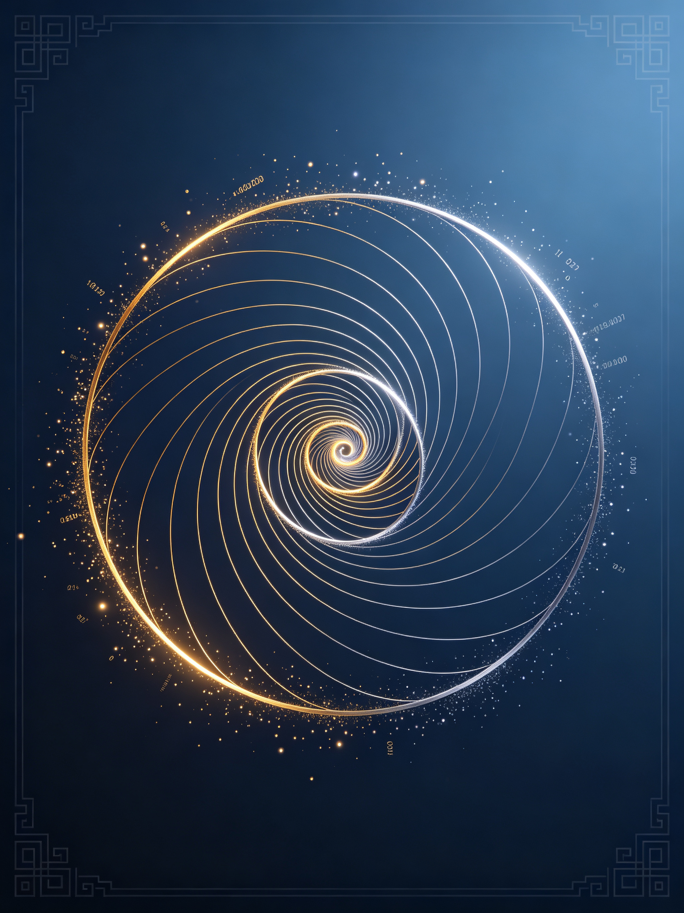
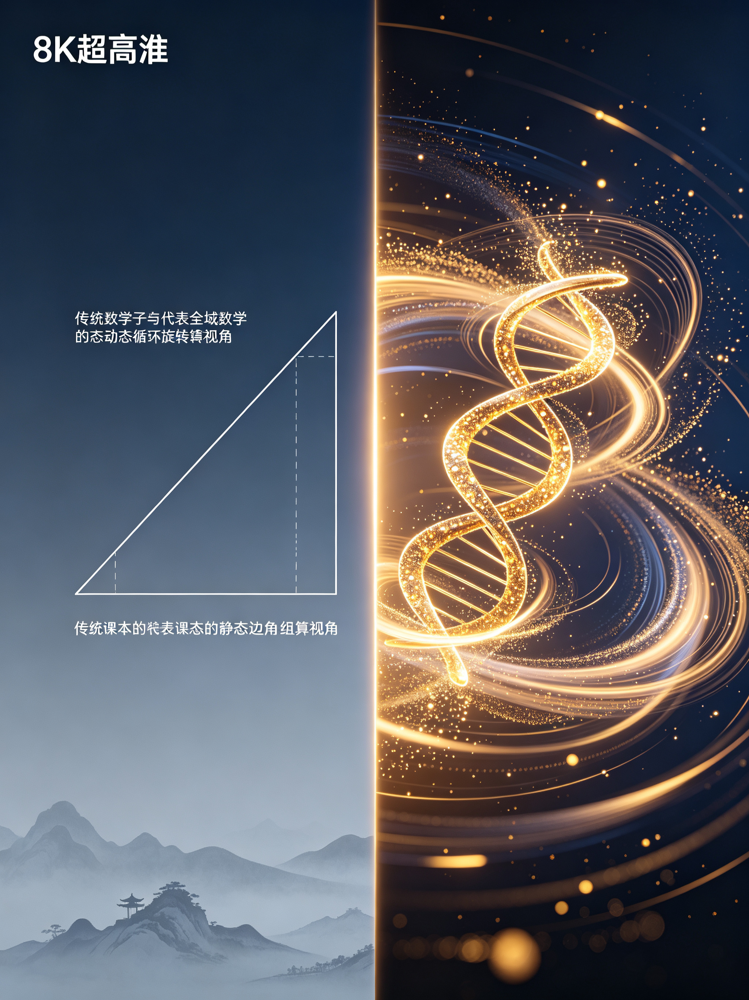

<ArchiveCopyPanel article-id="162246538" />

{"markdown":"PiDliIbnsbvvvJrmlofmmI7ov5vpmLYyMDDorrIgIAo+IOe8luWPt++8mmAxNjIyNDY1MzhgICAKPiDljp/lp4vmlofku7bvvJpg5LiJ6KeS5Ye95pWw5LiN5piv6L656KeS5o2i566X5bel5YW35piv5Y+M6J665peL5peL6L2s5LiA5ZyI55qE6LW35LyP5rOi5Yqo6K6w5b2VLeWFqOWfn+aVsOWtpnZz5Lyg57uf5pWw5a2m5Lq657G75paH5piO6L+b6Zi2MjAw6K6y56ysMy0xNjIyNDY1MzgubWRgICAKPiDov5Tlm57vvJpb5pys5Lmm5b2S5qGjXSgvemgvYm9va3MvY291cnNlL2FydGljbGVzLykgwrcgW+aAu+WFpeWPo10oL3poL2Jvb2tzL2FydGljbGVzLykKCuS9nOiAhe+8miDkuZbkuZbmlbDlraYKCiMjIOOAiuWFqOWfn+aVsOWtpnZz5Lyg57uf5pWw5a2m77ya5Lq657G75paH5piO6L+b6Zi2MjAw6K6y44CL56ysMzDorrIg5Lit5a2m6YCa5L+X54mI6YCQ5a2X56i/CgohW+ivvueoi+Wwgemdol0oLi9hc3NldHMvY3NkbmltZy9qcGcvOGFhZWNhNjEzNjAxYzM4Yy5qcGcpCgotLS0KCuiusuasoe+8miDnrKwzMOiusgoK5Li76aKY77yaIOS4ieinkuWHveaVsOS4jeaYr+i+ueinkuaNoueul+W3peWFt++8jOaYr+WPjOieuuaXi+aXi+i9rOS4gOWciOeahOi1t+S8j+azouWKqOiusOW9lQoK5a+55qCH6K++5pys55+l6K+G54K577yaIOato+W8puOAgeS9meW8puWfuuehgOS4ieinkuWHveaVsAoK5paH6aOO77yaIOWkp+eZveivneOAgeaXoOaZpua2qeS4k+S4muivjeaxh++8jOW7tue7rTAvMeWfuueCueOAgeWPjOieuuaXi+WFqOWll+avlOWWu+S9k+ezuwoKLS0tCgojIyMgMO+9njPliIbpkp8g5aSN5Lmg5a+85YWlCgohW+WkjeS5oOWvvOWFpV0oLi9hc3NldHMvY3NkbmltZy9qcGcvNWIxMjljOTE2NmViMmE1MC5qcGcpCgrlkIzlrabku6zvvIzkuIrkuIDoioLor77miJHku6zliIbmuIXkuobmjIfmlbDlkozlr7nmlbDvvJrmjIfmlbDmmK/onrrml4vlsYLlsYLlj6DliqDnlJ/plb/vvIzlr7nmlbDmmK/lj43lkJHnu5/orqHloIblj6DlsYLmlbDvvIzkuozogIXmmK/lkIzkuIDlpZfnlJ/plb/nu5PmnoTnmoTmraPlj43op4LmtYvop4bop5LjgIIKCuWIneS4reOAgemrmOS4remDveS8muWtpuS5oOS4ieinkuWHveaVsO+8jOivvuWgguS4iuiAgeW4iOivtO+8jOS4ieinkuWHveaVsOWPquaYr+ebtOinkuS4ieinkuW9oumHjOi+uemVv+S6kuebuOaNoueul+eahOW3peWFt++8jOeUqOadpeeul+inkuW6puOAgei+uemVv+OAggoK5LuK5aSp5oiR5Lus5o2i5pys5rqQ6KeG6KeS77ya5q2j5bym44CB5L2Z5bym6L+Z5Lqb5LiJ6KeS5Ye95pWw77yM5qC55pys5LiN5piv5Lq65Li66YCg5Ye65p2l55qE5o2i566X5YWs5byP77yM5piv5Y+M6J665peL57uV5Lit5b+D5a6M5pW05peL6L2s5LiA5pW05ZyI5pe277yM6auY5L2O44CB6L+c6L+R5LiN5pat6LW35LyP55WZ5LiL55qE5a6M5pW05rOi5Yqo6K6w5b2V44CCCgotLS0KCiMjIyAz772eMTPliIbpkp8g55Sf5rS75YyW57G75q+U6K6y6KejCgohW+eUn+a0u+WMluexu+avlF0oLi9hc3NldHMvY3NkbmltZy9qcGcvZmVmNjJlZjNlNjY1OTM4NC5qcGcpCgrlhYjorrLor77mnKzph4znmoTkuInop5Llh73mlbDvvJoKCuaLv+ebtOinkuS4ieinkuW9ou+8jOe7meWumuS4gOS4qumUkOinku+8jOWvuei+ueOAgemCu+i+ueOAgeaWnOi+ueS6kuebuOWBmumZpOazle+8jOW+l+WIsCBzaW7igaFcc2luc2lu44CBY29z4oGhXGNvc2NvcyDmlbDlgLzvvIznlKjmnaXorqHnrpfmlpzlnaHpq5jluqbjgIHml5fmnYbplb/luqbvvIzlj6rlvZPmiJDop6Plh6DkvZXpopjnmoTorqHnrpflt6XlhbfjgIIKCuaUvuWIsOWPjOieuuaXi+eUn+mVv+S9k+ezu+mHjO+8mgoK5Lik5p2h5pWw5a2X5bGx6Lev57uVMOWfuueCueS4gOWciOWciOebmOaXi+S4iuWNh++8jOaXi+i9rOi/h+eoi+S4re+8jOieuuaXi+S4iuavj+S4gOS4queCueemu+S4reW/g+eCueeahOi/nOi/keOAgeS4iuS4i+mrmOS9juS8muaMgee7reWPmOWMluOAggoK5oqK5LiA5ZyI5peL6L2s55qE6auY5L2O6LW35LyP5Y2V54us5ouJ5bmz5bGV5byA77yM55S75Ye65p2l5rOi5rWq57q/5p2h77yM5bCx5piv5q2j5bym44CB5L2Z5bym5puy57q/44CCCgrkuIDlnIjml4vovazlr7nlupQzNjDluqbvvIzlr7nlupTonrrml4vlrozmlbTotbDlrozkuIDova7nlJ/plb/lkajmnJ/vvIzms6Lmtarph43lpI3otbfkvI/vvIzlsLHmmK/onrrml4vlvqrnjq/nlJ/plb/nmoTlpKnnhLbnibnlvoHjgIIKCuS4vueugOWNleS+i+WtkO+8mgoK6K++5pys6KeG6KeS77yac2lu4oGhMzDiiJg9MC41XHNpbiAzMF5cY2lyYyA9IDAuNXNpbjMw4oiYPTAuNe+8jOWPquaYr+S4ieinkuW9oui+uemVv+avlOWAvOOAggoK5YWo5Z+f6YCa5L+X6Kej6K+777ya5Luj6KGo6J665peL5peL6L2s5YiwMzDluqbkvY3nva7ml7bvvIznurXlkJHpq5jluqbliLDovr7ln7rlh4blgLznmoTkuIDljYrvvJvmraPlvKbms6LmtarvvIzmmK/onrrml4vkuI3lgZzovazlnIjluKbmnaXnmoTlkajmnJ/mgKfpq5jkvY7lj5jljJbvvIzlo7Dms6LjgIHlhYnms6LjgIHmmJ/nkIPlhazovazms6LliqjlhajmmK/ov5nlpZfop4TlvovjgIIKCuivvuacrOWPquaIquWPluS4ieinkuW9oumdmeaAgeeahOS4gOWwj+auteinkuW6pu+8jOWBmui+uemVv+aNoueul++8jOeci+S4jeingeiDjOWQjuieuuaXi+aMgee7reW+queOr+aXi+i9rOOAgeWRqOacn+i1t+S8j+eahOWujOaVtOWKqOaAgeOAggoKLS0tCgojIyMgMTPvvZ4yMuWIhumSnyDor77mnKzop4LngrkgdnMg5YWo5Z+f5pWw5a2m6YCa5L+X6KeC54K5CgohW+ivvuacrHZz5YWo5Z+f5a+55q+UXSguL2Fzc2V0cy9jc2RuaW1nL2pwZy8wN2I1YjAwOTFjYWVhMDVjLmpwZykKCiMjIyMg5Lyg57uf6K++5pys6K6k55+lCgotIAoK5LiJ6KeS5Ye95pWw5piv5LiJ6KeS5b2i6L656KeS5o2i566X5LiT55So5YWs5byP77yM5Y+q6YCC55So5LqO55u06KeS5Yeg5L2V5Zu+5b2iCgotIAoK5ZGo5pyf5oCn5rOi5rWq5Zu+5YOP5Y+q5piv5Lq65Li66K6h566X5ZCO55S75Ye655qE6L6F5Yqp5Zu+5b2iCgotIAoK6KeS5bqm44CB5q2j5bym5pWw5YC85piv5Lq65Li66KeE5a6a55qE5o2i566X5YWz57O777yM5ZKM5LiH54mp5b6q546v6L+Q5Yqo5peg5YWzCgojIyMjIOWFqOWfn+aVsOWtpumAmuS/l+iupOefpQoKLSAKCuS4ieinkuWHveaVsOaguea6kOaYr+WPjOieuuaXi+e7leWfuueCueW+queOr+aXi+i9rO+8jOazoua1quabsue6v+aYr+aXi+i9rOi1t+S8j+eahOW5s+mTuuWxleW8gOiusOW9lQoKLSAKCuWRqOacn+mHjeWkjeaYr+ieuuaXi+S4gOWciOWciOW+queOr+eUn+mVv+iHquW4pueahOeJueW+ge+8jOWFieazouOAgeaMr+WKqOOAgeWkqeS9k+i/kOi9rOmDvemBteW+quato+W8puazouWKqAoKLSAKCuS4ieinkuW9oui+ueinkuiuoeeul+WPquaYr+S4ieinkuWHveaVsOaegeS9jue7tOeahOeugOaYk+W6lOeUqO+8jOWPquaYr+i/meWll+W+queOr+inhOW+i+eahOS4gOWwj+mDqOWIhgoK566A5Y2V5q+U5Za777yaCgror77mnKzkuInop5Llh73mlbDvvIzlpoLlkIzmiKrlj5bml4vovazonrrml4vkuIrkuIDkuKrnnqzpl7TnmoTliIfniYfvvIzlj6rnrpfliIfniYfovrnplb/vvJsKCuacrOa6kOS4ieinkuWHveaVsO+8jOaYr+WujOaVtOiusOW9leieuuaXi+i9rOS4gOaVtOWciOmrmOS9juWPmOWMlueahOWFqOeoi+W9leWDj++8jOazouWKqOW+queOr+aYr+WkqeeUn+iHquW4puOAggoKLS0tCgojIyMgMjLvvZ4yN+WIhumSnyDmoKHlhoXlrabkuaDmj5DphpLvvIzkuI3lvbHlk43ogIPor5XlvpfliIYKCuino+S4ieinkuW9ouOAgeS4ieinkuWHveaVsOWbvuWDj+OAgeWRqOacn+iuoeeul+mimO+8jOS4peagvOaMieeFp+ivvuacrOWFrOW8j+OAgeatpemqpOetlOmimO+8jOiAg+ivleS4jeS8muaJo+WIhuOAggoK5pys6IqC6K++5Y+q5piv5ouT5bGV6auY57u06K6k55+l77ya5LiJ6KeS5Ye95pWw5LiN5Y+q5piv5LiJ6KeS5b2i5o2i566X5bel5YW377yM5piv5Y+M6J665peL5b6q546v5peL6L2s5Lqn55Sf55qE5ZGo5pyf5rOi5Yqo6K6w5b2V44CCCgrkvI/nrJTpk7rlnqvvvJrnrKw1MOiusuS4reWtpue7k+S4muS4k+Wcuu+8jOaxh+aAuzI24oCTNTDorrLlhajpg6jlh73mlbDlhoXlrrnvvIznu5/kuIDmorPnkIbkuIDmrKHjgIHkuozmrKHjgIHmjIfmlbDjgIHlr7nmlbDjgIHkuInop5Lmm7Lnur/lr7nlupTnmoTonrrml4vov5DliqjlvaLmgIHjgIIKCi0tLQoKIyMjIDI3772eMzDliIbpkp8g6K++5aCC5oC757uTK+S4i+iKguivvumihOWRigoKIVvnu5PlsL7nlLvpnaJdKC4vYXNzZXRzL2NzZG5pbWcvanBnLzBlYTA4NjUyOWQwMzM3NWQuanBnKQoKIyMjIyDmnKzoioLor77lsI/nu5PvvJoKCuato+W8puOAgeS9meW8puetieS4ieinkuWHveaVsO+8jOacrOi0qOaYr+WPjOieuuaXi+e7leWfuueCueW+queOr+aXi+i9rO+8jOmrmOS9jui1t+S8j+W5s+mTuuWxleW8gOW9ouaIkOeahOWRqOacn+azouWKqOi9qOi/ueOAggoKIyMjIyDkuIvkuIDoioLor77vvJoKCuacieeQhuaVsOOAgeaXoOeQhuaVsOWIkuWIhuS4jeaYr+aVsOWtl+WkqeeUn+WIhuexu++8jOaYr+WPjOieuuaXi+eUn+mVv+S4pOenjeS4jeWQjOiEiee7nOeahOaYvueOsOOAggo=","text":"5YiG57G777ya5paH5piO6L+b6Zi2MjAw6K6yICAK57yW5Y+377yaMTYyMjQ2NTM4ICAK5Y6f5aeL5paH5Lu277ya5LiJ6KeS5Ye95pWw5LiN5piv6L656KeS5o2i566X5bel5YW35piv5Y+M6J665peL5peL6L2s5LiA5ZyI55qE6LW35LyP5rOi5Yqo6K6w5b2VLeWFqOWfn+aVsOWtpnZz5Lyg57uf5pWw5a2m5Lq657G75paH5piO6L+b6Zi2MjAw6K6y56ysMy0xNjIyNDY1MzgubWQgIArov5Tlm57vvJrmnKzkuablvZLmoaMgwrcg5oC75YWl5Y+jCgrkvZzogIXvvJog5LmW5LmW5pWw5a2mCgrjgIrlhajln5/mlbDlraZ2c+S8oOe7n+aVsOWtpu+8muS6uuexu+aWh+aYjui/m+mYtjIwMOiusuOAi+esrDMw6K6yIOS4reWtpumAmuS/l+eJiOmAkOWtl+eovwoK6K++56iL5bCB6Z2iCgotLS0KCuiusuasoe+8miDnrKwzMOiusgoK5Li76aKY77yaIOS4ieinkuWHveaVsOS4jeaYr+i+ueinkuaNoueul+W3peWFt++8jOaYr+WPjOieuuaXi+aXi+i9rOS4gOWciOeahOi1t+S8j+azouWKqOiusOW9lQoK5a+55qCH6K++5pys55+l6K+G54K577yaIOato+W8puOAgeS9meW8puWfuuehgOS4ieinkuWHveaVsAoK5paH6aOO77yaIOWkp+eZveivneOAgeaXoOaZpua2qeS4k+S4muivjeaxh++8jOW7tue7rTAvMeWfuueCueOAgeWPjOieuuaXi+WFqOWll+avlOWWu+S9k+ezuwoKLS0tCgow772eM+WIhumSnyDlpI3kuaDlr7zlhaUKCuWkjeS5oOWvvOWFpQoK5ZCM5a2m5Lus77yM5LiK5LiA6IqC6K++5oiR5Lus5YiG5riF5LqG5oyH5pWw5ZKM5a+55pWw77ya5oyH5pWw5piv6J665peL5bGC5bGC5Y+g5Yqg55Sf6ZW/77yM5a+55pWw5piv5Y+N5ZCR57uf6K6h5aCG5Y+g5bGC5pWw77yM5LqM6ICF5piv5ZCM5LiA5aWX55Sf6ZW/57uT5p6E55qE5q2j5Y+N6KeC5rWL6KeG6KeS44CCCgrliJ3kuK3jgIHpq5jkuK3pg73kvJrlrabkuaDkuInop5Llh73mlbDvvIzor77loILkuIrogIHluIjor7TvvIzkuInop5Llh73mlbDlj6rmmK/nm7Top5LkuInop5LlvaLph4zovrnplb/kupLnm7jmjaLnrpfnmoTlt6XlhbfvvIznlKjmnaXnrpfop5LluqbjgIHovrnplb/jgIIKCuS7iuWkqeaIkeS7rOaNouacrOa6kOinhuinku+8muato+W8puOAgeS9meW8pui/meS6m+S4ieinkuWHveaVsO+8jOagueacrOS4jeaYr+S6uuS4uumAoOWHuuadpeeahOaNoueul+WFrOW8j++8jOaYr+WPjOieuuaXi+e7leS4reW/g+WujOaVtOaXi+i9rOS4gOaVtOWciOaXtu+8jOmrmOS9juOAgei/nOi/keS4jeaWrei1t+S8j+eVmeS4i+eahOWujOaVtOazouWKqOiusOW9leOAggoKLS0tCgoz772eMTPliIbpkp8g55Sf5rS75YyW57G75q+U6K6y6KejCgrnlJ/mtLvljJbnsbvmr5QKCuWFiOiusuivvuacrOmHjOeahOS4ieinkuWHveaVsO+8mgoK5ou/55u06KeS5LiJ6KeS5b2i77yM57uZ5a6a5LiA5Liq6ZSQ6KeS77yM5a+56L6544CB6YK76L6544CB5pac6L655LqS55u45YGa6Zmk5rOV77yM5b6X5YiwIHNpbuKBoVxzaW5zaW7jgIFjb3PigaFcY29zY29zIOaVsOWAvO+8jOeUqOadpeiuoeeul+aWnOWdoemrmOW6puOAgeaXl+adhumVv+W6pu+8jOWPquW9k+aIkOino+WHoOS9lemimOeahOiuoeeul+W3peWFt+OAggoK5pS+5Yiw5Y+M6J665peL55Sf6ZW/5L2T57O76YeM77yaCgrkuKTmnaHmlbDlrZflsbHot6/nu5Uw5Z+654K55LiA5ZyI5ZyI55uY5peL5LiK5Y2H77yM5peL6L2s6L+H56iL5Lit77yM6J665peL5LiK5q+P5LiA5Liq54K556a75Lit5b+D54K555qE6L+c6L+R44CB5LiK5LiL6auY5L2O5Lya5oyB57ut5Y+Y5YyW44CCCgrmiorkuIDlnIjml4vovaznmoTpq5jkvY7otbfkvI/ljZXni6zmi4nlubPlsZXlvIDvvIznlLvlh7rmnaXms6Lmtarnur/mnaHvvIzlsLHmmK/mraPlvKbjgIHkvZnlvKbmm7Lnur/jgIIKCuS4gOWciOaXi+i9rOWvueW6lDM2MOW6pu+8jOWvueW6lOieuuaXi+WujOaVtOi1sOWujOS4gOi9rueUn+mVv+WRqOacn++8jOazoua1qumHjeWkjei1t+S8j++8jOWwseaYr+ieuuaXi+W+queOr+eUn+mVv+eahOWkqeeEtueJueW+geOAggoK5Li+566A5Y2V5L6L5a2Q77yaCgror77mnKzop4bop5LvvJpzaW7igaEzMOKImD0wLjVcc2luIDMwXlxjaXJjID0gMC41c2luMzDiiJg9MC4177yM5Y+q5piv5LiJ6KeS5b2i6L656ZW/5q+U5YC844CCCgrlhajln5/pgJrkv5fop6Por7vvvJrku6Pooajonrrml4vml4vovazliLAzMOW6puS9jee9ruaXtu+8jOe6teWQkemrmOW6puWIsOi+vuWfuuWHhuWAvOeahOS4gOWNiu+8m+ato+W8puazoua1qu+8jOaYr+ieuuaXi+S4jeWBnOi9rOWciOW4puadpeeahOWRqOacn+aAp+mrmOS9juWPmOWMlu+8jOWjsOazouOAgeWFieazouOAgeaYn+eQg+WFrOi9rOazouWKqOWFqOaYr+i/meWll+inhOW+i+OAggoK6K++5pys5Y+q5oiq5Y+W5LiJ6KeS5b2i6Z2Z5oCB55qE5LiA5bCP5q616KeS5bqm77yM5YGa6L656ZW/5o2i566X77yM55yL5LiN6KeB6IOM5ZCO6J665peL5oyB57ut5b6q546v5peL6L2s44CB5ZGo5pyf6LW35LyP55qE5a6M5pW05Yqo5oCB44CCCgotLS0KCjEz772eMjLliIbpkp8g6K++5pys6KeC54K5IHZzIOWFqOWfn+aVsOWtpumAmuS/l+ingueCuQoK6K++5pysdnPlhajln5/lr7nmr5QKCuS8oOe7n+ivvuacrOiupOefpQrkuInop5Llh73mlbDmmK/kuInop5LlvaLovrnop5LmjaLnrpfkuJPnlKjlhazlvI/vvIzlj6rpgILnlKjkuo7nm7Top5Llh6DkvZXlm77lvaIK5ZGo5pyf5oCn5rOi5rWq5Zu+5YOP5Y+q5piv5Lq65Li66K6h566X5ZCO55S75Ye655qE6L6F5Yqp5Zu+5b2iCuinkuW6puOAgeato+W8puaVsOWAvOaYr+S6uuS4uuinhOWumueahOaNoueul+WFs+ezu++8jOWSjOS4h+eJqeW+queOr+i/kOWKqOaXoOWFswoK5YWo5Z+f5pWw5a2m6YCa5L+X6K6k55+lCuS4ieinkuWHveaVsOaguea6kOaYr+WPjOieuuaXi+e7leWfuueCueW+queOr+aXi+i9rO+8jOazoua1quabsue6v+aYr+aXi+i9rOi1t+S8j+eahOW5s+mTuuWxleW8gOiusOW9lQrlkajmnJ/ph43lpI3mmK/onrrml4vkuIDlnIjlnIjlvqrnjq/nlJ/plb/oh6rluKbnmoTnibnlvoHvvIzlhYnms6LjgIHmjK/liqjjgIHlpKnkvZPov5Dovazpg73pgbXlvqrmraPlvKbms6LliqgK5LiJ6KeS5b2i6L656KeS6K6h566X5Y+q5piv5LiJ6KeS5Ye95pWw5p6B5L2O57u055qE566A5piT5bqU55So77yM5Y+q5piv6L+Z5aWX5b6q546v6KeE5b6L55qE5LiA5bCP6YOo5YiGCgrnroDljZXmr5TllrvvvJoKCuivvuacrOS4ieinkuWHveaVsO+8jOWmguWQjOaIquWPluaXi+i9rOieuuaXi+S4iuS4gOS4queerOmXtOeahOWIh+eJh++8jOWPqueul+WIh+eJh+i+uemVv++8mwoK5pys5rqQ5LiJ6KeS5Ye95pWw77yM5piv5a6M5pW06K6w5b2V6J665peL6L2s5LiA5pW05ZyI6auY5L2O5Y+Y5YyW55qE5YWo56iL5b2V5YOP77yM5rOi5Yqo5b6q546v5piv5aSp55Sf6Ieq5bim44CCCgotLS0KCjIy772eMjfliIbpkp8g5qCh5YaF5a2m5Lmg5o+Q6YaS77yM5LiN5b2x5ZON6ICD6K+V5b6X5YiGCgrop6PkuInop5LlvaLjgIHkuInop5Llh73mlbDlm77lg4/jgIHlkajmnJ/orqHnrpfpopjvvIzkuKXmoLzmjInnhafor77mnKzlhazlvI/jgIHmraXpqqTnrZTpopjvvIzogIPor5XkuI3kvJrmiaPliIbjgIIKCuacrOiKguivvuWPquaYr+aLk+WxlemrmOe7tOiupOefpe+8muS4ieinkuWHveaVsOS4jeWPquaYr+S4ieinkuW9ouaNoueul+W3peWFt++8jOaYr+WPjOieuuaXi+W+queOr+aXi+i9rOS6p+eUn+eahOWRqOacn+azouWKqOiusOW9leOAggoK5LyP56yU6ZO65Z6r77ya56ysNTDorrLkuK3lrabnu5PkuJrkuJPlnLrvvIzmsYfmgLsyNuKAkzUw6K6y5YWo6YOo5Ye95pWw5YaF5a6577yM57uf5LiA5qKz55CG5LiA5qyh44CB5LqM5qyh44CB5oyH5pWw44CB5a+55pWw44CB5LiJ6KeS5puy57q/5a+55bqU55qE6J665peL6L+Q5Yqo5b2i5oCB44CCCgotLS0KCjI3772eMzDliIbpkp8g6K++5aCC5oC757uTK+S4i+iKguivvumihOWRigoK57uT5bC+55S76Z2iCgrmnKzoioLor77lsI/nu5PvvJoKCuato+W8puOAgeS9meW8puetieS4ieinkuWHveaVsO+8jOacrOi0qOaYr+WPjOieuuaXi+e7leWfuueCueW+queOr+aXi+i9rO+8jOmrmOS9jui1t+S8j+W5s+mTuuWxleW8gOW9ouaIkOeahOWRqOacn+azouWKqOi9qOi/ueOAggoK5LiL5LiA6IqC6K++77yaCgrmnInnkIbmlbDjgIHml6DnkIbmlbDliJLliIbkuI3mmK/mlbDlrZflpKnnlJ/liIbnsbvvvIzmmK/lj4zonrrml4vnlJ/plb/kuKTnp43kuI3lkIzohInnu5znmoTmmL7njrDjgII="}

> 分类：文明进阶200讲  
> 编号：`162246538`  
> 原始文件：`三角函数不是边角换算工具是双螺旋旋转一圈的起伏波动记录-全域数学vs传统数学人类文明进阶200讲第3-162246538.md`  
> 返回：[本书归档](/zh/books/course/articles/) · [总入口](/zh/books/articles/)

<ArticlePaperMeta category="文明进阶200讲" article-id="162246538" title="三角函数不是边角换算工具是双螺旋旋转一圈的起伏波动记录-全域数学vs传统数学人类文明进阶200讲第3" paper-kind="课程讲义" book-route="/zh/books/course/articles/" overview-route="/zh/books/articles/" summary="对标课本知识点： 正弦、余弦基础三角函数" author="乖乖数学" lecture="第30讲" theme="三角函数不是边角换算工具，是双螺旋旋转一圈的起伏波动记录" source-file="三角函数不是边角换算工具是双螺旋旋转一圈的起伏波动记录-全域数学vs传统数学人类文明进阶200讲第3-162246538.md" cover="./assets/csdnimg/jpg/8aaeca613601c38c.jpg" />

作者： 乖乖数学

## 《全域数学vs传统数学：人类文明进阶200讲》第30讲 中学通俗版逐字稿

---

讲次： 第30讲

主题： 三角函数不是边角换算工具，是双螺旋旋转一圈的起伏波动记录

对标课本知识点： 正弦、余弦基础三角函数

文风： 大白话、无晦涩专业词汇，延续0/1基点、双螺旋全套比喻体系

---

### 0～3分钟 复习导入

同学们，上一节课我们分清了指数和对数：指数是螺旋层层叠加生长，对数是反向统计堆叠层数，二者是同一套生长结构的正反观测视角。

初中、高中都会学习三角函数，课堂上老师说，三角函数只是直角三角形里边长互相换算的工具，用来算角度、边长。

今天我们换本源视角：正弦、余弦这些三角函数，根本不是人为造出来的换算公式，是双螺旋绕中心完整旋转一整圈时，高低、远近不断起伏留下的完整波动记录。

---

### 3～13分钟 生活化类比讲解

先讲课本里的三角函数：

拿直角三角形，给定一个锐角，对边、邻边、斜边互相做除法，得到 sin⁡\sinsin、cos⁡\coscos 数值，用来计算斜坡高度、旗杆长度，只当成解几何题的计算工具。

放到双螺旋生长体系里：

两条数字山路绕0基点一圈圈盘旋上升，旋转过程中，螺旋上每一个点离中心点的远近、上下高低会持续变化。

把一圈旋转的高低起伏单独拉平展开，画出来波浪线条，就是正弦、余弦曲线。

一圈旋转对应360度，对应螺旋完整走完一轮生长周期，波浪重复起伏，就是螺旋循环生长的天然特征。

举简单例子：

课本视角：sin⁡30∘=0.5\sin 30^\circ = 0.5sin30∘=0.5，只是三角形边长比值。

全域通俗解读：代表螺旋旋转到30度位置时，纵向高度到达基准值的一半；正弦波浪，是螺旋不停转圈带来的周期性高低变化，声波、光波、星球公转波动全是这套规律。

课本只截取三角形静态的一小段角度，做边长换算，看不见背后螺旋持续循环旋转、周期起伏的完整动态。

---

### 13～22分钟 课本观点 vs 全域数学通俗观点

#### 传统课本认知

- 

三角函数是三角形边角换算专用公式，只适用于直角几何图形

- 

周期性波浪图像只是人为计算后画出的辅助图形

- 

角度、正弦数值是人为规定的换算关系，和万物循环运动无关

#### 全域数学通俗认知

- 

三角函数根源是双螺旋绕基点循环旋转，波浪曲线是旋转起伏的平铺展开记录

- 

周期重复是螺旋一圈圈循环生长自带的特征，光波、振动、天体运转都遵循正弦波动

- 

三角形边角计算只是三角函数极低维的简易应用，只是这套循环规律的一小部分

简单比喻：

课本三角函数，如同截取旋转螺旋上一个瞬间的切片，只算切片边长；

本源三角函数，是完整记录螺旋转一整圈高低变化的全程录像，波动循环是天生自带。

---

### 22～27分钟 校内学习提醒，不影响考试得分

解三角形、三角函数图像、周期计算题，严格按照课本公式、步骤答题，考试不会扣分。

本节课只是拓展高维认知：三角函数不只是三角形换算工具，是双螺旋循环旋转产生的周期波动记录。

伏笔铺垫：第50讲中学结业专场，汇总26–50讲全部函数内容，统一梳理一次、二次、指数、对数、三角曲线对应的螺旋运动形态。

---

### 27～30分钟 课堂总结+下节课预告

#### 本节课小结：

正弦、余弦等三角函数，本质是双螺旋绕基点循环旋转，高低起伏平铺展开形成的周期波动轨迹。

#### 下一节课：

有理数、无理数划分不是数字天生分类，是双螺旋生长两种不同脉络的显现。
