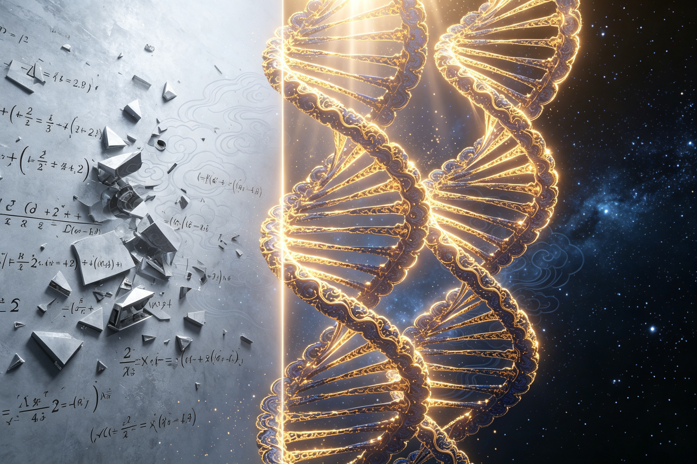

<ArchiveCopyPanel article-id="162247042" />

{"markdown":"PiDliIbnsbvvvJrmlofmmI7ov5vpmLYyMDDorrIgIAo+IOe8luWPt++8mmAxNjIyNDcwNDJgICAKPiDljp/lp4vmlofku7bvvJpg5Zug5byP5YiG6Kej5LiN5Y+q5piv5ouG5YiG566X5byP5piv6L+Y5Y6f5Y+M6J665peL5aSa5bGC5Y+g5Yqg55qE5Y6f5aeL55Sf6ZW/5YiG5bGCLeWFqOWfn+aVsOWtpnZz5Lyg57uf5pWw5a2m5Lq657G75paH5piO6L+b6Zi2MjAw6K6y56ysLTE2MjI0NzA0Mi5tZGAgIAo+IOi/lOWbnu+8mlvmnKzkuablvZLmoaNdKC96aC9ib29rcy9jb3Vyc2UvYXJ0aWNsZXMvKSDCtyBb5oC75YWl5Y+jXSgvemgvYm9va3MvYXJ0aWNsZXMvKQoKIVvnrKwzMuiusiDlm6DlvI/liIbop6NdKC4vYXNzZXRzL2NzZG5pbWcvanBnLzAzOGQzNDAxNDhhYmI5ZDMuanBnKQoK5L2c6ICF77yaIOS5luS5luaVsOWtpgoKIyMg44CK5YWo5Z+f5pWw5a2mdnPkvKDnu5/mlbDlrabvvJrkurrnsbvmlofmmI7ov5vpmLYyMDDorrLjgIvnrKwzMuiusiDkuK3lrabpgJrkv5fniYjpgJDlrZfnqL8KCi0tLQoK6K6y5qyh77yaIOesrDMy6K6yCgrkuLvpopjvvJog5Zug5byP5YiG6Kej5LiN5Y+q5piv5ouG5YiG566X5byP77yM5piv6L+Y5Y6f5Y+M6J665peL5aSa5bGC5Y+g5Yqg55qE5Y6f5aeL55Sf6ZW/5YiG5bGCCgrlr7nmoIfor77mnKznn6Xor4bngrnvvJog5pW05byP5Zug5byP5YiG6KejCgrmlofpo47vvJog5aSn55m96K+d44CB5peg5aSN5p2C5LiT5Lia5pyv6K+t77yM5bu257utMC8x5Z+654K544CB5Y+M6J665peL5YWo5aWX5q+U5Za7CgotLS0KCiMjIyAw772eM+WIhumSnyDlpI3kuaDlr7zlhaUKCiFb5Y+M6J665peL5Lik5p2h55Sf6ZW/5bGx6LevXSguL2Fzc2V0cy9jc2RuaW1nL2pwZy8xYjY3NThlZjVlODQ0MDEyLmpwZykKCuWQjOWtpuS7rO+8jOS4iuS4gOiKguivvuaIkeS7rOWIhua4heS6huacieeQhuaVsOWSjOaXoOeQhuaVsOeahOacrOa6kOWMuuWIq++8muS4pOexu+aVsOWtl+WvueW6lOWPjOieuuaXi+S4pOadoeeUn+mVv+Wxsei3r++8jOe7hOWQiOWQiOaVsOiEiee7nOeUn+aIkOW+queOr+acieeQhuaVsO+8jOWOn+eUn+i0qOaVsOiEiee7nOeUn+aIkOaXoOWRqOacn+aXoOeQhuaVsOOAggoK5Yid5Lit5Luj5pWw6auY6aKR6ICD54K55bCx5piv5Zug5byP5YiG6Kej77yM6ICB5biI5pWZ5oiR5Lus5oqK5LiA6ZW/5Liy5byP5a2Q5ouG5oiQ5aSa5Liq5bCP5byP5a2Q55u45LmY77yM5Y+q5piv566A5YyW6K6h566X44CB6Kej5pa556iL55qE5bel5YW344CCCgrku4rlpKnlkrHku6zmjaLmnKzmupDop4bop5LvvJrlm6DlvI/liIbop6PkuI3mmK/kurrkuLrmi4blvIDku6PmlbDlvI/nmoTop6PpopjmioDlt6fvvIzmmK/lj43lkJHmi4bop6Plj4zonrrml4vlsYLlsYLlj6DliqDnmoTnlJ/plb/nu5PmnoTvvIzov5jljp/lh7rmnIDliJ3liIblsYLnlJ/plb/nmoTljp/lp4vohInnu5zjgIIKCi0tLQoKIyMjIDPvvZ4xM+WIhumSnyDnlJ/mtLvljJbnsbvmr5TorrLop6MKCiFb5aSa5bGC5Y+g5Yqg6J665peL57uT5p6EXSguL2Fzc2V0cy9jc2RuaW1nL2pwZy85MWZkYWY4ZjAwYjUyZWQyLmpwZykKCuWFiOiusuivvuacrOmHjOeahOWboOW8j+WIhuino++8mgoK5ou/5Yiw5aSa6aG55byP77yM5o+Q5Y+W5YWs5YWx6YOo5YiG44CB5aWX55So5bmz5pa55beu44CB5a6M5YWo5bmz5pa55YWs5byP77yM5oqK5pW05L2T5ouG5oiQ5aSa5Liq5Zug5byP55u45LmY77yM5pa55L6/57qm5YiG44CB6Kej5pa556iL77yM5Y+q5L2c5Li66K6h566X5bel5YW35L2/55So44CCCgrmlL7liLDlj4zonrrml4vnlJ/plb/kvZPns7vph4zvvJoKCuaIkeS7rOeci+WIsOeahOWujOaVtOWkmumhueW8j++8jOaYr+aVsOWtl+WPjOieuuaXi+WkmuWxgueUn+mVv+OAgeWkmuWxguWPoOWKoOS5i+WQjuWQiOW5tuWHuuadpeeahOacgOe7iOW9ouaAge+8mwoK5Zug5byP5YiG6Kej77yM5bCx5piv5Y+N5ZCR5LiA5bGC5bGC5Yml56a75Y+g5Yqg57uT5p6E77yM5ouG5Ye65q+P5LiA5bGC5pyA5Yid55Sf6ZW/55qE5Z+656GA6ISJ57uc77yM6L+Y5Y6f6J665peL5Y+g5Yqg5LmL5YmN55qE5Z+656GA5Y2V5YWD44CCCgrlubPmlrnlt67jgIHlrozlhajlubPmlrnlhazlvI/vvIzlr7nlupTkuKTnp43mnIDluLjop4HnmoTonrrml4vlj6DliqDnu4TlkIjlvaLmgIHjgIIKCuS4vueugOWNleS+i+WtkO+8mgoK6K++5pys6KeG6KeS77yaeDLiiJI0PSh4KzIpKHjiiJIyKXheMi00PSh4KzIpKHgtMil4MuKIkjQ9KHgrMikoeOKIkjIp77yM5Y+q5piv5aWX5YWs5byP5ouG5YiG5byP5a2Q44CCCgrlhajln5/pgJrkv5fop6Por7vvvJp4MuKIkjR4XjItNHgy4oiSNOaYr+S4pOauteieuuaXi+WPoOWKoOiejeWQiOWQjueahOaVtOS9k+W9ouaAge+8m+aLhuWIhuWQjih4KzIpKHgrMikoeCsyKeOAgSh44oiSMikoeC0yKSh44oiSMinmmK/kuKTmnaHmnIDliJ3ni6znq4vnlJ/plb/nmoTln7rnoYDohInnu5zvvIzliIbop6Pov4fnqIvlsLHmmK/mi4blvIDlj6DliqDlsYLvvIzmib7lm57ljp/lp4vnlJ/plb/ljZXlhYPjgIIKCuivvuacrOWPquaKiuWIhuino+W9k+aIkOWBmumimOaJi+aute+8jOeci+S4jeWIsOW8j+WtkOiDjOWQjuWkmuWxguieuuaXi+WghuWPoOeahOecn+WunueUn+mVv+i/h+eoi+OAggoKLS0tCgojIyMgMTPvvZ4yMuWIhumSnyDor77mnKzop4LngrkgdnMg5YWo5Z+f5pWw5a2m6YCa5L+X6KeC54K5CgohW+S8oOe7n+aVsOWtpnZz5YWo5Z+f5pWw5a2m5a+55q+UXSguL2Fzc2V0cy9jc2RuaW1nL2pwZy81Zjc0NTUzZTU3MDc2MDZhLmpwZykKCiMjIyMg5Lyg57uf6K++5pys6K6k55+lCgotIAoK5Zug5byP5YiG6Kej5piv5Lq65Li65Yib6YCg55qE5Luj5pWw5oqA5ben77yM5Y+q5Li6566A5YyW6L+Q566X44CB5rGC6Kej5pa556iLCgotIAoK5aSa6aG55byP5piv5Z+656GA77yM5Zug5byP5ouG5YiG5piv5ZCO5pyf5Lq65Li65pON5L2c77yM5LiN5a2Y5Zyo5aSp54S25YiG5bGCCgotIAoK5ZCE57G75YiG6Kej5YWs5byP5Y+q5piv5Lq65Li65oC757uT55qE6K6h566X5aWX6Lev77yM5ZKM5LiH54mp55Sf6ZW/5peg5YWzCgojIyMjIOWFqOWfn+aVsOWtpumAmuS/l+iupOefpQoKLSAKCuWkmumhueW8j+aYr+WPjOieuuaXi+WkmuWxguWPoOWKoOWQjueahOWQiOW5tuS6p+eJqe+8jOWIhuWxgue7k+aehOWkqeeEtuWtmOWcqO+8jOWIhuino+WPquaYr+i/mOWOn+WOn+iyjAoKLSAKCuWFiOacieWkmuWxguieuuaXi+WPoOWKoOeUn+mVv++8jOWQjuacieWQiOW5tuWQjueahOWkmumhueW8j++8jOWIhuino+aYr+mAhuWQkei/mOWOn+eUn+mVv+i/h+eoiwoKLSAKCuW5s+aWueW3ruOAgeWujOWFqOW5s+aWueetieWbuuWumuWIhuino+aooeWei++8jOWvueW6lOieuuaXi+S4pOenjee7j+WFuOWPoOWKoOe7hOWQiOaWueW8jwoK566A5Y2V5q+U5Za777yaCgror77mnKzlm6DlvI/liIbop6Plpb3mr5TmiornspjlnKjkuIDotbfnmoTnp6/mnKjlvLrooYzmi4blvIDvvJsKCuacrOa6kOWboOW8j+WIhuino++8jOaYr+aLhuW8gOS4gOWxguWxguWghuWPoOeahOenr+acqO+8jOi/mOWOn+W9k+WIneS4gOWdl+S4gOWdl+aQreW7uueUn+mVv+eahOWOn+Wni+WIhuWxguOAggoKLS0tCgojIyMgMjLvvZ4yN+WIhumSnyDmoKHlhoXlrabkuaDmj5DphpLvvIzkuI3lvbHlk43ogIPor5XlvpfliIYKCuaPkOWPluWFrOWboOW8j+OAgeWFrOW8j+azleWIhuino+OAgeWboOW8j+WMlueugOiuoeeul+mimO+8jOS4peagvOaMieeFp+ivvuacrOagh+WHhuatpemqpOS9nOetlO+8jOiAg+ivleS4jeS8muaJo+WIhuOAggoK5pys6IqC6K++5Y+q5piv5ouT5bGV6auY57u06K6k55+l77ya5Zug5byP5YiG6Kej5pys6LSo5piv6YCG5ZCR5ouG6Kej5Y+M6J665peL5Y+g5Yqg57uT5p6E77yM6L+Y5Y6f5pWw5a2X5pyA5Yid5YiG5bGC55Sf6ZW/55qE5Z+656GA6ISJ57uc44CCCgrkvI/nrJTpk7rlnqvvvJrnrKw1MOiusuS4reWtpue7k+S4muS4k+Wcuu+8jOaVtOWQiDI24oCTNTDorrLlhajpg6jku6PmlbDjgIHlh73mlbDnn6Xor4bngrnvvIzlrozmlbTkuLLogZTmiYDmnInku6PmlbDov5Dnrpflr7nlupTnmoTonrrml4vnlJ/plb/pgLvovpHjgIIKCi0tLQoKIyMjIDI3772eMzDliIbpkp8g6K++5aCC5oC757uTK+S4i+iKguivvumihOWRigoKIVvonrrml4vkuqTmsYfljYfljY5dKC4vYXNzZXRzL2NzZG5pbWcvanBnLzRiN2Y2M2U0ZThkZGI0MDQuanBnKQoKIyMjIyDmnKzoioLor77lsI/nu5PvvJoKCuWkmumhueW8j+aYr+WPjOieuuaXi+WkmuWxguWPoOWKoOWQjueahOWQiOW5tuW9ouaAge+8jOWboOW8j+WIhuino+aYr+WPjeWQkeWJpeemu+WPoOWKoOWxguOAgei/mOWOn+WOn+Wni+eUn+mVv+WNleWFg+eahOi/h+eoi+OAggoKIyMjIyDkuIvkuIDoioLor77vvJoKCuaWueeoi+e7hOS4jeaYr+Wkmue7hOaVsOWtl+mFjeWvue+8jOaYr+S4pOadoeeLrOeri+aVsOWtl+ieuuaXi+ebuOS6pOeahOS6pOaxh+iKgueCueOAggo=","text":"5YiG57G777ya5paH5piO6L+b6Zi2MjAw6K6yICAK57yW5Y+377yaMTYyMjQ3MDQyICAK5Y6f5aeL5paH5Lu277ya5Zug5byP5YiG6Kej5LiN5Y+q5piv5ouG5YiG566X5byP5piv6L+Y5Y6f5Y+M6J665peL5aSa5bGC5Y+g5Yqg55qE5Y6f5aeL55Sf6ZW/5YiG5bGCLeWFqOWfn+aVsOWtpnZz5Lyg57uf5pWw5a2m5Lq657G75paH5piO6L+b6Zi2MjAw6K6y56ysLTE2MjI0NzA0Mi5tZCAgCui/lOWbnu+8muacrOS5puW9kuahoyDCtyDmgLvlhaXlj6MKCuesrDMy6K6yIOWboOW8j+WIhuinowoK5L2c6ICF77yaIOS5luS5luaVsOWtpgoK44CK5YWo5Z+f5pWw5a2mdnPkvKDnu5/mlbDlrabvvJrkurrnsbvmlofmmI7ov5vpmLYyMDDorrLjgIvnrKwzMuiusiDkuK3lrabpgJrkv5fniYjpgJDlrZfnqL8KCi0tLQoK6K6y5qyh77yaIOesrDMy6K6yCgrkuLvpopjvvJog5Zug5byP5YiG6Kej5LiN5Y+q5piv5ouG5YiG566X5byP77yM5piv6L+Y5Y6f5Y+M6J665peL5aSa5bGC5Y+g5Yqg55qE5Y6f5aeL55Sf6ZW/5YiG5bGCCgrlr7nmoIfor77mnKznn6Xor4bngrnvvJog5pW05byP5Zug5byP5YiG6KejCgrmlofpo47vvJog5aSn55m96K+d44CB5peg5aSN5p2C5LiT5Lia5pyv6K+t77yM5bu257utMC8x5Z+654K544CB5Y+M6J665peL5YWo5aWX5q+U5Za7CgotLS0KCjDvvZ4z5YiG6ZKfIOWkjeS5oOWvvOWFpQoK5Y+M6J665peL5Lik5p2h55Sf6ZW/5bGx6LevCgrlkIzlrabku6zvvIzkuIrkuIDoioLor77miJHku6zliIbmuIXkuobmnInnkIbmlbDlkozml6DnkIbmlbDnmoTmnKzmupDljLrliKvvvJrkuKTnsbvmlbDlrZflr7nlupTlj4zonrrml4vkuKTmnaHnlJ/plb/lsbHot6/vvIznu4TlkIjlkIjmlbDohInnu5znlJ/miJDlvqrnjq/mnInnkIbmlbDvvIzljp/nlJ/otKjmlbDohInnu5znlJ/miJDml6DlkajmnJ/ml6DnkIbmlbDjgIIKCuWIneS4reS7o+aVsOmrmOmikeiAg+eCueWwseaYr+WboOW8j+WIhuino++8jOiAgeW4iOaVmeaIkeS7rOaKiuS4gOmVv+S4suW8j+WtkOaLhuaIkOWkmuS4quWwj+W8j+WtkOebuOS5mO+8jOWPquaYr+eugOWMluiuoeeul+OAgeino+aWueeoi+eahOW3peWFt+OAggoK5LuK5aSp5ZKx5Lus5o2i5pys5rqQ6KeG6KeS77ya5Zug5byP5YiG6Kej5LiN5piv5Lq65Li65ouG5byA5Luj5pWw5byP55qE6Kej6aKY5oqA5ben77yM5piv5Y+N5ZCR5ouG6Kej5Y+M6J665peL5bGC5bGC5Y+g5Yqg55qE55Sf6ZW/57uT5p6E77yM6L+Y5Y6f5Ye65pyA5Yid5YiG5bGC55Sf6ZW/55qE5Y6f5aeL6ISJ57uc44CCCgotLS0KCjPvvZ4xM+WIhumSnyDnlJ/mtLvljJbnsbvmr5TorrLop6MKCuWkmuWxguWPoOWKoOieuuaXi+e7k+aehAoK5YWI6K6y6K++5pys6YeM55qE5Zug5byP5YiG6Kej77yaCgrmi7/liLDlpJrpobnlvI/vvIzmj5Dlj5blhazlhbHpg6jliIbjgIHlpZfnlKjlubPmlrnlt67jgIHlrozlhajlubPmlrnlhazlvI/vvIzmiormlbTkvZPmi4bmiJDlpJrkuKrlm6DlvI/nm7jkuZjvvIzmlrnkvr/nuqbliIbjgIHop6PmlrnnqIvvvIzlj6rkvZzkuLrorqHnrpflt6Xlhbfkvb/nlKjjgIIKCuaUvuWIsOWPjOieuuaXi+eUn+mVv+S9k+ezu+mHjO+8mgoK5oiR5Lus55yL5Yiw55qE5a6M5pW05aSa6aG55byP77yM5piv5pWw5a2X5Y+M6J665peL5aSa5bGC55Sf6ZW/44CB5aSa5bGC5Y+g5Yqg5LmL5ZCO5ZCI5bm25Ye65p2l55qE5pyA57uI5b2i5oCB77ybCgrlm6DlvI/liIbop6PvvIzlsLHmmK/lj43lkJHkuIDlsYLlsYLliaXnprvlj6DliqDnu5PmnoTvvIzmi4blh7rmr4/kuIDlsYLmnIDliJ3nlJ/plb/nmoTln7rnoYDohInnu5zvvIzov5jljp/onrrml4vlj6DliqDkuYvliY3nmoTln7rnoYDljZXlhYPjgIIKCuW5s+aWueW3ruOAgeWujOWFqOW5s+aWueWFrOW8j++8jOWvueW6lOS4pOenjeacgOW4uOingeeahOieuuaXi+WPoOWKoOe7hOWQiOW9ouaAgeOAggoK5Li+566A5Y2V5L6L5a2Q77yaCgror77mnKzop4bop5LvvJp4MuKIkjQ9KHgrMikoeOKIkjIpeF4yLTQ9KHgrMikoeC0yKXgy4oiSND0oeCsyKSh44oiSMinvvIzlj6rmmK/lpZflhazlvI/mi4bliIblvI/lrZDjgIIKCuWFqOWfn+mAmuS/l+ino+ivu++8mngy4oiSNHheMi00eDLiiJI05piv5Lik5q616J665peL5Y+g5Yqg6J6N5ZCI5ZCO55qE5pW05L2T5b2i5oCB77yb5ouG5YiG5ZCOKHgrMikoeCsyKSh4KzIp44CBKHjiiJIyKSh4LTIpKHjiiJIyKeaYr+S4pOadoeacgOWIneeLrOeri+eUn+mVv+eahOWfuuehgOiEiee7nO+8jOWIhuino+i/h+eoi+WwseaYr+aLhuW8gOWPoOWKoOWxgu+8jOaJvuWbnuWOn+Wni+eUn+mVv+WNleWFg+OAggoK6K++5pys5Y+q5oqK5YiG6Kej5b2T5oiQ5YGa6aKY5omL5q6177yM55yL5LiN5Yiw5byP5a2Q6IOM5ZCO5aSa5bGC6J665peL5aCG5Y+g55qE55yf5a6e55Sf6ZW/6L+H56iL44CCCgotLS0KCjEz772eMjLliIbpkp8g6K++5pys6KeC54K5IHZzIOWFqOWfn+aVsOWtpumAmuS/l+ingueCuQoK5Lyg57uf5pWw5a2mdnPlhajln5/mlbDlrablr7nmr5QKCuS8oOe7n+ivvuacrOiupOefpQrlm6DlvI/liIbop6PmmK/kurrkuLrliJvpgKDnmoTku6PmlbDmioDlt6fvvIzlj6rkuLrnroDljJbov5DnrpfjgIHmsYLop6PmlrnnqIsK5aSa6aG55byP5piv5Z+656GA77yM5Zug5byP5ouG5YiG5piv5ZCO5pyf5Lq65Li65pON5L2c77yM5LiN5a2Y5Zyo5aSp54S25YiG5bGCCuWQhOexu+WIhuino+WFrOW8j+WPquaYr+S6uuS4uuaAu+e7k+eahOiuoeeul+Wll+i3r++8jOWSjOS4h+eJqeeUn+mVv+aXoOWFswoK5YWo5Z+f5pWw5a2m6YCa5L+X6K6k55+lCuWkmumhueW8j+aYr+WPjOieuuaXi+WkmuWxguWPoOWKoOWQjueahOWQiOW5tuS6p+eJqe+8jOWIhuWxgue7k+aehOWkqeeEtuWtmOWcqO+8jOWIhuino+WPquaYr+i/mOWOn+WOn+iyjArlhYjmnInlpJrlsYLonrrml4vlj6DliqDnlJ/plb/vvIzlkI7mnInlkIjlubblkI7nmoTlpJrpobnlvI/vvIzliIbop6PmmK/pgIblkJHov5jljp/nlJ/plb/ov4fnqIsK5bmz5pa55beu44CB5a6M5YWo5bmz5pa5562J5Zu65a6a5YiG6Kej5qih5Z6L77yM5a+55bqU6J665peL5Lik56eN57uP5YW45Y+g5Yqg57uE5ZCI5pa55byPCgrnroDljZXmr5TllrvvvJoKCuivvuacrOWboOW8j+WIhuino+WlveavlOaKiueymOWcqOS4gOi1t+eahOenr+acqOW8uuihjOaLhuW8gO+8mwoK5pys5rqQ5Zug5byP5YiG6Kej77yM5piv5ouG5byA5LiA5bGC5bGC5aCG5Y+g55qE56ev5pyo77yM6L+Y5Y6f5b2T5Yid5LiA5Z2X5LiA5Z2X5pCt5bu655Sf6ZW/55qE5Y6f5aeL5YiG5bGC44CCCgotLS0KCjIy772eMjfliIbpkp8g5qCh5YaF5a2m5Lmg5o+Q6YaS77yM5LiN5b2x5ZON6ICD6K+V5b6X5YiGCgrmj5Dlj5blhazlm6DlvI/jgIHlhazlvI/ms5XliIbop6PjgIHlm6DlvI/ljJbnroDorqHnrpfpopjvvIzkuKXmoLzmjInnhafor77mnKzmoIflh4bmraXpqqTkvZznrZTvvIzogIPor5XkuI3kvJrmiaPliIbjgIIKCuacrOiKguivvuWPquaYr+aLk+WxlemrmOe7tOiupOefpe+8muWboOW8j+WIhuino+acrOi0qOaYr+mAhuWQkeaLhuino+WPjOieuuaXi+WPoOWKoOe7k+aehO+8jOi/mOWOn+aVsOWtl+acgOWIneWIhuWxgueUn+mVv+eahOWfuuehgOiEiee7nOOAggoK5LyP56yU6ZO65Z6r77ya56ysNTDorrLkuK3lrabnu5PkuJrkuJPlnLrvvIzmlbTlkIgyNuKAkzUw6K6y5YWo6YOo5Luj5pWw44CB5Ye95pWw55+l6K+G54K577yM5a6M5pW05Liy6IGU5omA5pyJ5Luj5pWw6L+Q566X5a+55bqU55qE6J665peL55Sf6ZW/6YC76L6R44CCCgotLS0KCjI3772eMzDliIbpkp8g6K++5aCC5oC757uTK+S4i+iKguivvumihOWRigoK6J665peL5Lqk5rGH5Y2H5Y2OCgrmnKzoioLor77lsI/nu5PvvJoKCuWkmumhueW8j+aYr+WPjOieuuaXi+WkmuWxguWPoOWKoOWQjueahOWQiOW5tuW9ouaAge+8jOWboOW8j+WIhuino+aYr+WPjeWQkeWJpeemu+WPoOWKoOWxguOAgei/mOWOn+WOn+Wni+eUn+mVv+WNleWFg+eahOi/h+eoi+OAggoK5LiL5LiA6IqC6K++77yaCgrmlrnnqIvnu4TkuI3mmK/lpJrnu4TmlbDlrZfphY3lr7nvvIzmmK/kuKTmnaHni6znq4vmlbDlrZfonrrml4vnm7jkuqTnmoTkuqTmsYfoioLngrnjgII="}

> 分类：文明进阶200讲  
> 编号：`162247042`  
> 原始文件：`因式分解不只是拆分算式是还原双螺旋多层叠加的原始生长分层-全域数学vs传统数学人类文明进阶200讲第-162247042.md`  
> 返回：[本书归档](/zh/books/course/articles/) · [总入口](/zh/books/articles/)

<ArticlePaperMeta category="文明进阶200讲" article-id="162247042" title="因式分解不只是拆分算式是还原双螺旋多层叠加的原始生长分层-全域数学vs传统数学人类文明进阶200讲第" paper-kind="课程讲义" book-route="/zh/books/course/articles/" overview-route="/zh/books/articles/" summary="文风： 大白话、无复杂专业术语，延续0/1基点、双螺旋全套比喻" author="乖乖数学" lecture="第32讲" theme="因式分解不只是拆分算式，是还原双螺旋多层叠加的原始生长分层" source-file="因式分解不只是拆分算式是还原双螺旋多层叠加的原始生长分层-全域数学vs传统数学人类文明进阶200讲第-162247042.md" cover="./assets/csdnimg/jpg/038d340148abb9d3.jpg" />

作者： 乖乖数学

## 《全域数学vs传统数学：人类文明进阶200讲》第32讲 中学通俗版逐字稿

---

讲次： 第32讲

主题： 因式分解不只是拆分算式，是还原双螺旋多层叠加的原始生长分层

对标课本知识点： 整式因式分解

文风： 大白话、无复杂专业术语，延续0/1基点、双螺旋全套比喻

---

### 0～3分钟 复习导入

同学们，上一节课我们分清了有理数和无理数的本源区别：两类数字对应双螺旋两条生长山路，组合合数脉络生成循环有理数，原生质数脉络生成无周期无理数。

初中代数高频考点就是因式分解，老师教我们把一长串式子拆成多个小式子相乘，只是简化计算、解方程的工具。

今天咱们换本源视角：因式分解不是人为拆开代数式的解题技巧，是反向拆解双螺旋层层叠加的生长结构，还原出最初分层生长的原始脉络。

---

### 3～13分钟 生活化类比讲解

先讲课本里的因式分解：

拿到多项式，提取公共部分、套用平方差、完全平方公式，把整体拆成多个因式相乘，方便约分、解方程，只作为计算工具使用。

放到双螺旋生长体系里：

我们看到的完整多项式，是数字双螺旋多层生长、多层叠加之后合并出来的最终形态；

因式分解，就是反向一层层剥离叠加结构，拆出每一层最初生长的基础脉络，还原螺旋叠加之前的基础单元。

平方差、完全平方公式，对应两种最常见的螺旋叠加组合形态。

举简单例子：

课本视角：x2−4=(x+2)(x−2)x^2-4=(x+2)(x-2)x2−4=(x+2)(x−2)，只是套公式拆分式子。

全域通俗解读：x2−4x^2-4x2−4是两段螺旋叠加融合后的整体形态；拆分后(x+2)(x+2)(x+2)、(x−2)(x-2)(x−2)是两条最初独立生长的基础脉络，分解过程就是拆开叠加层，找回原始生长单元。

课本只把分解当成做题手段，看不到式子背后多层螺旋堆叠的真实生长过程。

---

### 13～22分钟 课本观点 vs 全域数学通俗观点

#### 传统课本认知

- 

因式分解是人为创造的代数技巧，只为简化运算、求解方程

- 

多项式是基础，因式拆分是后期人为操作，不存在天然分层

- 

各类分解公式只是人为总结的计算套路，和万物生长无关

#### 全域数学通俗认知

- 

多项式是双螺旋多层叠加后的合并产物，分层结构天然存在，分解只是还原原貌

- 

先有多层螺旋叠加生长，后有合并后的多项式，分解是逆向还原生长过程

- 

平方差、完全平方等固定分解模型，对应螺旋两种经典叠加组合方式

简单比喻：

课本因式分解好比把粘在一起的积木强行拆开；

本源因式分解，是拆开一层层堆叠的积木，还原当初一块一块搭建生长的原始分层。

---

### 22～27分钟 校内学习提醒，不影响考试得分

提取公因式、公式法分解、因式化简计算题，严格按照课本标准步骤作答，考试不会扣分。

本节课只是拓展高维认知：因式分解本质是逆向拆解双螺旋叠加结构，还原数字最初分层生长的基础脉络。

伏笔铺垫：第50讲中学结业专场，整合26–50讲全部代数、函数知识点，完整串联所有代数运算对应的螺旋生长逻辑。

---

### 27～30分钟 课堂总结+下节课预告

#### 本节课小结：

多项式是双螺旋多层叠加后的合并形态，因式分解是反向剥离叠加层、还原原始生长单元的过程。

#### 下一节课：

方程组不是多组数字配对，是两条独立数字螺旋相交的交汇节点。
