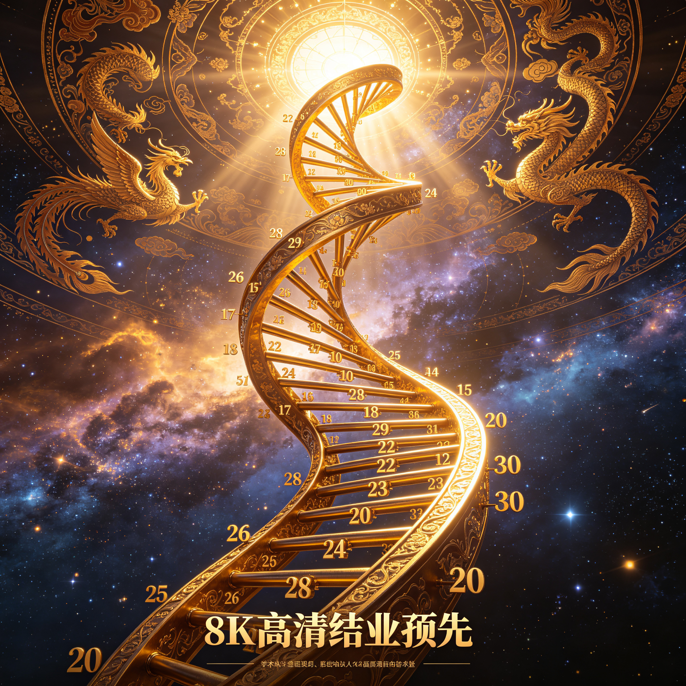
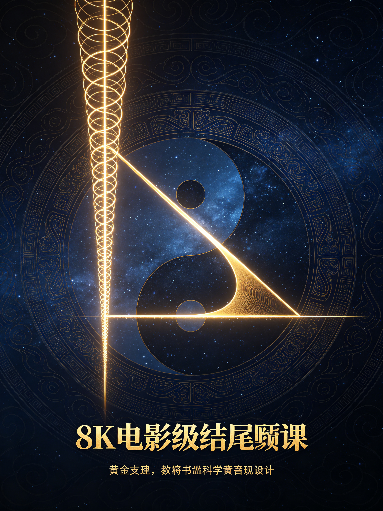

<ArchiveCopyPanel article-id="162247102" />

{"markdown":"PiDliIbnsbvvvJrmlofmmI7ov5vpmLYyMDDorrIgIAo+IOe8luWPt++8mmAxNjIyNDcxMDJgICAKPiDljp/lp4vmlofku7bvvJpg5pa556iL57uE5LiN5piv5aSa57uE5pWw5a2X6YWN5a+55piv5Lik5p2h54us56uL5pWw5a2X6J665peL55u45Lqk55qE5Lqk5rGH6IqC54K5LeWFqOWfn+aVsOWtpnZz5Lyg57uf5pWw5a2m5Lq657G75paH5piO6L+b6Zi2MjAw6K6y56ysMy0xNjIyNDcxMDIubWRgICAKPiDov5Tlm57vvJpb5pys5Lmm5b2S5qGjXSgvemgvYm9va3MvY291cnNlL2FydGljbGVzLykgwrcgW+aAu+WFpeWPo10oL3poL2Jvb2tzL2FydGljbGVzLykKCiFb5Zyo6L+Z6YeM5o+S5YWl5Zu+54mH5o+P6L+wXSguL2Fzc2V0cy9jc2RuaW1nL3BuZy9hMWM4ZjE1OGVlYTE1NDZkLnBuZykKCuS9nOiAhe+8miDkuZbkuZbmlbDlraYKCiMjIOOAiuWFqOWfn+aVsOWtpnZz5Lyg57uf5pWw5a2m77ya5Lq657G75paH5piO6L+b6Zi2MjAw6K6y44CL56ysMzPorrIg5Lit5a2m6YCa5L+X54mI6YCQ5a2X56i/CgotLS0KCuiusuasoe+8miDnrKwzM+iusgoK5Li76aKY77yaIOaWueeoi+e7hOS4jeaYr+Wkmue7hOaVsOWtl+mFjeWvue+8jOaYr+S4pOadoeeLrOeri+aVsOWtl+ieuuaXi+ebuOS6pOeahOS6pOaxh+iKgueCuQoK5a+55qCH6K++5pys55+l6K+G54K577yaIOS6jOWFg+S4gOasoeaWueeoi+e7hAoK5paH6aOO77yaIOWkp+eZveivneOAgeaXoOWkjeadguS4k+S4muacr+ivre+8jOW7tue7rTAvMeWfuueCueOAgeWPjOieuuaXi+WFqOWll+avlOWWuwoKLS0tCgojIyMgMO+9njPliIbpkp8g5aSN5Lmg5a+85YWlCgohW+WPjOieuuaXi+WxguWxguWPoOWKoOe7k+aehF0oLi9hc3NldHMvY3NkbmltZy9qcGcvNWRhMzkwMjBjZTZhYjVhYS5qcGcpCgrlkIzlrabku6zvvIzkuIroioLor77miJHku6zlvITmh4Lkuoblm6DlvI/liIbop6PnmoTmnKzotKjvvIzlroPkuI3mmK/ljZXnuq/mi4bnrpflvI/nmoTop6PpopjmioDlt6fvvIzogIzmmK/lj43lkJHmi4blvIDlj4zonrrml4vlsYLlsYLlj6DliqDnmoTnu5PmnoTvvIzov5jljp/mnIDliJ3nlJ/plb/nmoTln7rnoYDohInnu5zjgIIKCuWIneS4reS7o+aVsOaIkeS7rOS8muWtpuS5oOS6jOWFg+S4gOasoeaWueeoi+e7hO+8jOiAgeW4iOivtO+8muS4pOS4quWQq+aciXh4eOOAgXl5eeeahOW8j+WtkOe7hOWQiOWcqOS4gOi1t++8jOWQjOaXtua7oei2s+S4pOe7hOadoeS7tueahOaVsOWtl++8jOWwseaYr+aWueeoi+e7hOeahOino++8jOWPquaYr+iBlOeri+iuoeeul+eahOW3peWFt+OAggoK5LuK5aSp5oiR5Lus5ouJ6auY57u05bqm55yL5pys5rqQ77ya5pa556iL57uE5LiN5piv5Lq65Li65ou85YeR5Lik57uE566X5byP77yM5q+P5LiA5p2h5byP5a2Q5a+55bqU5LiA5p2h54us56uL55Sf6ZW/6J665peL77yM5pa556iL57uE55qE6Kej77yM5bCx5piv5Lik5p2h6J665peL55u45LqS5Lqk5Y+J44CB56Kw5Yiw5LiA6LW355qE6YKj5Liq5Lqk5rGH54K544CCCgotLS0KCiMjIyAz772eMTPliIbpkp8g55Sf5rS75YyW57G75q+U6K6y6KejCgohW+S4pOadoeaVsOWtl+ieuuaXi+S6pOaxh10oLi9hc3NldHMvY3NkbmltZy9qcGcvZjUzMDk1YzZiYTRkOTFmYi5qcGcpCgrlhYjorrLor77mnKzph4znmoTmlrnnqIvnu4TpgLvovpHvvJoKCuS4gOadoeebtOe6v+W8j+WtkOS7o+ihqOS4gOe7hHh4eOOAgXl5eeWvueW6lOWFs+ezu++8jOWGjeWinuWKoOS4gOadoeebtOe6v+W8j+WtkO+8jOaKiuS4pOe7hOadoeS7tuWQiOWcqOS4gOi1t++8jOaJvuWIsOWQjOaXtuespuWQiOS4pOadoeW8j+WtkOeahOaVsOWtl++8jOWwseaYr+aWueeoi+e7hOeahOino++8jOWPqueUqOadpeWBmumimOaxguWAvOOAggoK5pS+5Yiw5Y+M6J665peL55Sf6ZW/5L2T57O76YeM77yaCgrmr4/kuIDkuKrkuIDmrKHlh73mlbDlvI/lrZDvvIzlr7nlupTkuIDmnaHni6znq4vlu7bkvLjnmoTmlbDlrZfonrrml4vovajov7nvvJsKCuW9k+aIkeS7rOWIl+WHuuaWueeoi+e7hO+8jOWwseaYr+WQjOaXtuingua1i+S4pOadoeS4jeWQjOeUn+mVv+i9qOi/ue+8jOS4pOadoeieuuaXi+W+gOWJjeW7tuS8uO+8jOS8muWHuueOsOS4gOWkhOS6pOWPiemHjeWQiOeahOS9jee9ru+8jOi/meS4qumHjeWQiOeCueWvueW6lOeahOaVsOWtlyh4LHkpKHgseSkoeCx5Ke+8jOWwseaYr+aWueeoi+e7hOeahOino+OAggoK5aaC5p6c5Lik5p2h6J665peL5bmz6KGM44CB5rC46L+c5LiN6Z2g6L+R77yM5bCx5rKh5pyJ5Lqk54K577yM5a+55bqU5pa556iL57uE5peg6Kej77yb5Lik5p2h6J665peL5a6M5YWo6YeN5ZCI77yM5aSE5aSE55u45Lqk77yM5a+55bqU5peg5pWw57uE6Kej44CCCgrkuL7nroDljZXkvovlrZDvvJoKCuivvuacrOinhuinku+8mgoKJiMxMjM7eCt5PTV44oiSeT0xXGJlZ2luJiMxMjM7Y2FzZXMmIzEyNTsgeCt5PTUgXFwgeC15PTEgXGVuZCYjMTIzO2Nhc2VzJiMxMjU7JiMxMjM7eCt5PTV44oiSeT0x4oCLCgrnrpflh7p4PTN4PTN4PTPvvIx5PTJ5PTJ5PTLvvIzlj6rmmK/mu6HotrPkuKTkuKrnrYnlvI/nmoTmlbDlrZfjgIIKCuWFqOWfn+mAmuS/l+ino+ivu++8muesrOS4gOadoeW8j+WtkOaYr+S4gOadoeW5s+e8k+W7tuS8uOeahOieuuaXi++8jOesrOS6jOadoeaYr+WAvuaWnOW6puS4jeWQjOeahOieuuaXi++8jCgzLDIpKDMsMikoMywyKeaYr+S4pOadoeieuuaXi+eUn+mVv+mAlOS4reWUr+S4gOS6pOaxh+eahOS9jee9ru+8jOi/meS4quino+aYr+S4pOadoei9qOi/ueWkqeeEtuebuOS6pOS6p+eUn++8jOS4jeaYr+S6uuS4uueul+WHuuadpeeahOiZmuaLn+aVsOWtl+OAggoK6K++5pys5Y+q55uv552A5pWw5a2X562J5byP6K6h566X77yM5b+955Wl5LqG6Kej55qE6IOM5ZCO5piv5Lik5p2h55Sf6ZW/6J665peL55yf5a6e55u45Lqk55qE56m66Ze05L2N572u5YWz57O744CCCgotLS0KCiMjIyAxM++9njIy5YiG6ZKfIOivvuacrOingueCuSB2cyDlhajln5/mlbDlrabpgJrkv5fop4LngrkKCiFb6K++5pys6KeG6KeSdnPlhajln5/op4bop5Llr7nmr5RdKC4vYXNzZXRzL2NzZG5pbWcvanBnL2YwYjQ4YzM3NjYxMDAxZjcuanBnKQoKIyMjIyDkvKDnu5/or77mnKzorqTnn6UKCi0gCgrmlrnnqIvnu4TmmK/kurrkuLrmiorkuKTkuKrlvI/lrZDmi7zlnKjkuIDotbfvvIzop6PmmK/lvLrooYzlh5Hlh7rnmoTljLnphY3mlbDlrZcKCi0gCgrkuKTmnaHnm7Tnur/lj6rmmK/nurjkuIrnlLvlm77ovoXliqnvvIzkuI3lrZjlnKjnnJ/lrp7nmoTnlJ/plb/ovajov7kKCi0gCgrml6Dop6PjgIHml6DmlbDop6Plj6rmmK/orqHnrpfnibnmrormg4XlhrXvvIzmsqHmnInlr7nlupTnmoTnqbrpl7Tnu5PmnoTlkKvkuYkKCiMjIyMg5YWo5Z+f5pWw5a2m6YCa5L+X6K6k55+lCgotIAoK5q+P5p2h5pa556iL5a+55bqU5LiA5p2h54us56uL5Y+M6J665peL55Sf6ZW/6L2o6L+577yM5pa556iL57uE5Y+q5piv5ZCM5pe26KeC5rWL5Lik5p2h6L2o6L+5CgotIAoK6Kej5piv5Lik5p2h6J665peL5aSp54S255u45Lqk55qE56m66Ze06IqC54K577yM55u45Lqk44CB5bmz6KGM44CB6YeN5ZCI6YO95piv6J665peL6Ieq5bim55qE56m66Ze05YWz57O7CgotIAoK5peg6KejPeieuuaXi+awuOS4jeS6pOaxh++8m+aXoOaVsOinoz3kuKTmnaHonrrml4vlrozlhajph43lkIjnlJ/plb/vvIzmmK/ljp/nlJ/nqbrpl7Tnu5PmnoToh6rluKbkuInnp43nirbmgIEKCiFb5bGx6Ze05bCP6Lev5Lqk5rGH5q+U5Za7XSguL2Fzc2V0cy9jc2RuaW1nL2pwZy8zMDAyZGE5YjIwOWIwODQ4LmpwZykKCueugOWNleavlOWWu++8mgoK6K++5pys5pa556iL57uE5aW95q+U5Lik5byg57q45p2h5LiK55qE5pWw5a2X6KeE5YiZ77yM5Lq65Li65pS+5Zyo5LiA6LW35om+5YWx5ZCM5pWw5a2X77ybCgrmnKzmupDmlrnnqIvnu4TlpoLlkIzkuKTmnaHlsbHpl7TlsI/ot6/vvIzop6PlsLHmmK/kuKTmnaHlsI/ot6/norDpnaLnmoTot6/lj6PvvIzot6/lj6PlrZjlnKjkuI7lkKbvvIzmmK/lsI/ot6/otbDlkJHlpKnnlJ/lhrPlrprjgIIKCi0tLQoKIyMjIDIy772eMjfliIbpkp8g5qCh5YaF5a2m5Lmg5o+Q6YaS77yM5LiN5b2x5ZON6ICD6K+V5YGa6aKYCgrliqDlh4/mtojlhYPjgIHku6PlhaXmtojlhYPjgIHlm77lg4/ms5Xop6PmlrnnqIvnu4TvvIzlhajpg6jmjInnhafliJ3kuK3or77mnKzmraXpqqTkvZznrZTvvIzogIPor5XkuI3kvJrmiaPliIbjgIIKCuacrOiKguivvuWPquaYr+aLk+WxlemrmOe7tOiupOefpe+8muaWueeoi+e7hOeahOino++8jOacrOi0qOaYr+S4pOadoeeLrOeri+aVsOWtl+ieuuaXi+eUn+mVv+i9qOi/ueebuOS6kuS6pOaxh+eahOepuumXtOiKgueCueOAggoKIVvnrKw1MOiusue7k+S4mumihOWRil0oLi9hc3NldHMvY3NkbmltZy9qcGcvOTZiOGJmNDlhMWI2NGQ1Mi5qcGcpCgrkvI/nrJTpk7rlnqvvvJog56ysNTDorrLkuK3lrabnu5PkuJrkuJPlnLrvvIzmlbTlkIgyNuKAkzUw6K6y5YWo6YOo5Luj5pWw44CB5Ye95pWw5YaF5a6577yM5Liy6IGU5omA5pyJ5pa556iL44CB5puy57q/5a+55bqU55qE6J665peL56m66Ze057uT5p6E44CCCgotLS0KCiMjIyAyN++9njMw5YiG6ZKfIOivvuWgguaAu+e7kyvkuIvoioLor77pooTlkYoKCiFb5LiL6IqC6K++5Yu+6IKh5a6a55CG6aKE5ZGKXSguL2Fzc2V0cy9jc2RuaW1nL2pwZy9iNGYzODg1N2YzMDJmZmE0LmpwZykKCiMjIyMg5pys6IqC6K++5bCP57uT77yaCgrljZXkuKrmlrnnqIvmmK/kuIDmnaHmlbDlrZfonrrml4vnlJ/plb/ovajov7nvvIzmlrnnqIvnu4TnmoTop6PmmK/kuKTmnaHonrrml4vnm7jkuqTnmoTnqbrpl7TkuqTmsYfngrnvvIzlubPooYzjgIHph43lkIjlr7nlupTml6Dop6PjgIHml6DmlbDop6PjgIIKCiMjIyMg5LiL5LiA6IqC6K++77yaCgrli77ogqHlrprnkIbkuI3mmK/nm7Top5LkuInop5LlvaLovrnplb/lhazlvI/vvIzmmK/lnoLnm7Tlj4zlkJHonrrml4vnmoTlpKnnhLbplb/luqbphY3mr5TjgIIK","text":"5YiG57G777ya5paH5piO6L+b6Zi2MjAw6K6yICAK57yW5Y+377yaMTYyMjQ3MTAyICAK5Y6f5aeL5paH5Lu277ya5pa556iL57uE5LiN5piv5aSa57uE5pWw5a2X6YWN5a+55piv5Lik5p2h54us56uL5pWw5a2X6J665peL55u45Lqk55qE5Lqk5rGH6IqC54K5LeWFqOWfn+aVsOWtpnZz5Lyg57uf5pWw5a2m5Lq657G75paH5piO6L+b6Zi2MjAw6K6y56ysMy0xNjIyNDcxMDIubWQgIArov5Tlm57vvJrmnKzkuablvZLmoaMgwrcg5oC75YWl5Y+jCgrlnKjov5nph4zmj5LlhaXlm77niYfmj4/ov7AKCuS9nOiAhe+8miDkuZbkuZbmlbDlraYKCuOAiuWFqOWfn+aVsOWtpnZz5Lyg57uf5pWw5a2m77ya5Lq657G75paH5piO6L+b6Zi2MjAw6K6y44CL56ysMzPorrIg5Lit5a2m6YCa5L+X54mI6YCQ5a2X56i/CgotLS0KCuiusuasoe+8miDnrKwzM+iusgoK5Li76aKY77yaIOaWueeoi+e7hOS4jeaYr+Wkmue7hOaVsOWtl+mFjeWvue+8jOaYr+S4pOadoeeLrOeri+aVsOWtl+ieuuaXi+ebuOS6pOeahOS6pOaxh+iKgueCuQoK5a+55qCH6K++5pys55+l6K+G54K577yaIOS6jOWFg+S4gOasoeaWueeoi+e7hAoK5paH6aOO77yaIOWkp+eZveivneOAgeaXoOWkjeadguS4k+S4muacr+ivre+8jOW7tue7rTAvMeWfuueCueOAgeWPjOieuuaXi+WFqOWll+avlOWWuwoKLS0tCgow772eM+WIhumSnyDlpI3kuaDlr7zlhaUKCuWPjOieuuaXi+WxguWxguWPoOWKoOe7k+aehAoK5ZCM5a2m5Lus77yM5LiK6IqC6K++5oiR5Lus5byE5oeC5LqG5Zug5byP5YiG6Kej55qE5pys6LSo77yM5a6D5LiN5piv5Y2V57qv5ouG566X5byP55qE6Kej6aKY5oqA5ben77yM6ICM5piv5Y+N5ZCR5ouG5byA5Y+M6J665peL5bGC5bGC5Y+g5Yqg55qE57uT5p6E77yM6L+Y5Y6f5pyA5Yid55Sf6ZW/55qE5Z+656GA6ISJ57uc44CCCgrliJ3kuK3ku6PmlbDmiJHku6zkvJrlrabkuaDkuozlhYPkuIDmrKHmlrnnqIvnu4TvvIzogIHluIjor7TvvJrkuKTkuKrlkKvmnIl4eHjjgIF5eXnnmoTlvI/lrZDnu4TlkIjlnKjkuIDotbfvvIzlkIzml7bmu6HotrPkuKTnu4TmnaHku7bnmoTmlbDlrZfvvIzlsLHmmK/mlrnnqIvnu4TnmoTop6PvvIzlj6rmmK/ogZTnq4vorqHnrpfnmoTlt6XlhbfjgIIKCuS7iuWkqeaIkeS7rOaLiemrmOe7tOW6pueci+acrOa6kO+8muaWueeoi+e7hOS4jeaYr+S6uuS4uuaLvOWHkeS4pOe7hOeul+W8j++8jOavj+S4gOadoeW8j+WtkOWvueW6lOS4gOadoeeLrOeri+eUn+mVv+ieuuaXi++8jOaWueeoi+e7hOeahOino++8jOWwseaYr+S4pOadoeieuuaXi+ebuOS6kuS6pOWPieOAgeeisOWIsOS4gOi1t+eahOmCo+S4quS6pOaxh+eCueOAggoKLS0tCgoz772eMTPliIbpkp8g55Sf5rS75YyW57G75q+U6K6y6KejCgrkuKTmnaHmlbDlrZfonrrml4vkuqTmsYcKCuWFiOiusuivvuacrOmHjOeahOaWueeoi+e7hOmAu+i+ke+8mgoK5LiA5p2h55u057q/5byP5a2Q5Luj6KGo5LiA57uEeHh444CBeXl55a+55bqU5YWz57O777yM5YaN5aKe5Yqg5LiA5p2h55u057q/5byP5a2Q77yM5oqK5Lik57uE5p2h5Lu25ZCI5Zyo5LiA6LW377yM5om+5Yiw5ZCM5pe256ym5ZCI5Lik5p2h5byP5a2Q55qE5pWw5a2X77yM5bCx5piv5pa556iL57uE55qE6Kej77yM5Y+q55So5p2l5YGa6aKY5rGC5YC844CCCgrmlL7liLDlj4zonrrml4vnlJ/plb/kvZPns7vph4zvvJoKCuavj+S4gOS4quS4gOasoeWHveaVsOW8j+WtkO+8jOWvueW6lOS4gOadoeeLrOeri+W7tuS8uOeahOaVsOWtl+ieuuaXi+i9qOi/ue+8mwoK5b2T5oiR5Lus5YiX5Ye65pa556iL57uE77yM5bCx5piv5ZCM5pe26KeC5rWL5Lik5p2h5LiN5ZCM55Sf6ZW/6L2o6L+577yM5Lik5p2h6J665peL5b6A5YmN5bu25Ly477yM5Lya5Ye6546w5LiA5aSE5Lqk5Y+J6YeN5ZCI55qE5L2N572u77yM6L+Z5Liq6YeN5ZCI54K55a+55bqU55qE5pWw5a2XKHgseSkoeCx5KSh4LHkp77yM5bCx5piv5pa556iL57uE55qE6Kej44CCCgrlpoLmnpzkuKTmnaHonrrml4vlubPooYzjgIHmsLjov5zkuI3pnaDov5HvvIzlsLHmsqHmnInkuqTngrnvvIzlr7nlupTmlrnnqIvnu4Tml6Dop6PvvJvkuKTmnaHonrrml4vlrozlhajph43lkIjvvIzlpITlpITnm7jkuqTvvIzlr7nlupTml6DmlbDnu4Top6PjgIIKCuS4vueugOWNleS+i+WtkO+8mgoK6K++5pys6KeG6KeS77yaCgp7eCt5PTV44oiSeT0xXGJlZ2lue2Nhc2VzfSB4K3k9NSBcXCB4LXk9MSBcZW5ke2Nhc2VzfXt4K3k9NXjiiJJ5PTHigIsKCueul+WHung9M3g9M3g9M++8jHk9Mnk9Mnk9Mu+8jOWPquaYr+a7oei2s+S4pOS4quetieW8j+eahOaVsOWtl+OAggoK5YWo5Z+f6YCa5L+X6Kej6K+777ya56ys5LiA5p2h5byP5a2Q5piv5LiA5p2h5bmz57yT5bu25Ly455qE6J665peL77yM56ys5LqM5p2h5piv5YC+5pac5bqm5LiN5ZCM55qE6J665peL77yMKDMsMikoMywyKSgzLDIp5piv5Lik5p2h6J665peL55Sf6ZW/6YCU5Lit5ZSv5LiA5Lqk5rGH55qE5L2N572u77yM6L+Z5Liq6Kej5piv5Lik5p2h6L2o6L+55aSp54S255u45Lqk5Lqn55Sf77yM5LiN5piv5Lq65Li6566X5Ye65p2l55qE6Jma5ouf5pWw5a2X44CCCgror77mnKzlj6rnm6/nnYDmlbDlrZfnrYnlvI/orqHnrpfvvIzlv73nlaXkuobop6PnmoTog4zlkI7mmK/kuKTmnaHnlJ/plb/onrrml4vnnJ/lrp7nm7jkuqTnmoTnqbrpl7TkvY3nva7lhbPns7vjgIIKCi0tLQoKMTPvvZ4yMuWIhumSnyDor77mnKzop4LngrkgdnMg5YWo5Z+f5pWw5a2m6YCa5L+X6KeC54K5Cgror77mnKzop4bop5J2c+WFqOWfn+inhuinkuWvueavlAoK5Lyg57uf6K++5pys6K6k55+lCuaWueeoi+e7hOaYr+S6uuS4uuaKiuS4pOS4quW8j+WtkOaLvOWcqOS4gOi1t++8jOino+aYr+W8uuihjOWHkeWHuueahOWMuemFjeaVsOWtlwrkuKTmnaHnm7Tnur/lj6rmmK/nurjkuIrnlLvlm77ovoXliqnvvIzkuI3lrZjlnKjnnJ/lrp7nmoTnlJ/plb/ovajov7kK5peg6Kej44CB5peg5pWw6Kej5Y+q5piv6K6h566X54m55q6K5oOF5Ya177yM5rKh5pyJ5a+55bqU55qE56m66Ze057uT5p6E5ZCr5LmJCgrlhajln5/mlbDlrabpgJrkv5forqTnn6UK5q+P5p2h5pa556iL5a+55bqU5LiA5p2h54us56uL5Y+M6J665peL55Sf6ZW/6L2o6L+577yM5pa556iL57uE5Y+q5piv5ZCM5pe26KeC5rWL5Lik5p2h6L2o6L+5Cuino+aYr+S4pOadoeieuuaXi+WkqeeEtuebuOS6pOeahOepuumXtOiKgueCue+8jOebuOS6pOOAgeW5s+ihjOOAgemHjeWQiOmDveaYr+ieuuaXi+iHquW4pueahOepuumXtOWFs+ezuwrml6Dop6M96J665peL5rC45LiN5Lqk5rGH77yb5peg5pWw6KejPeS4pOadoeieuuaXi+WujOWFqOmHjeWQiOeUn+mVv++8jOaYr+WOn+eUn+epuumXtOe7k+aehOiHquW4puS4ieenjeeKtuaAgQoK5bGx6Ze05bCP6Lev5Lqk5rGH5q+U5Za7CgrnroDljZXmr5TllrvvvJoKCuivvuacrOaWueeoi+e7hOWlveavlOS4pOW8oOe6uOadoeS4iueahOaVsOWtl+inhOWIme+8jOS6uuS4uuaUvuWcqOS4gOi1t+aJvuWFseWQjOaVsOWtl++8mwoK5pys5rqQ5pa556iL57uE5aaC5ZCM5Lik5p2h5bGx6Ze05bCP6Lev77yM6Kej5bCx5piv5Lik5p2h5bCP6Lev56Kw6Z2i55qE6Lev5Y+j77yM6Lev5Y+j5a2Y5Zyo5LiO5ZCm77yM5piv5bCP6Lev6LWw5ZCR5aSp55Sf5Yaz5a6a44CCCgotLS0KCjIy772eMjfliIbpkp8g5qCh5YaF5a2m5Lmg5o+Q6YaS77yM5LiN5b2x5ZON6ICD6K+V5YGa6aKYCgrliqDlh4/mtojlhYPjgIHku6PlhaXmtojlhYPjgIHlm77lg4/ms5Xop6PmlrnnqIvnu4TvvIzlhajpg6jmjInnhafliJ3kuK3or77mnKzmraXpqqTkvZznrZTvvIzogIPor5XkuI3kvJrmiaPliIbjgIIKCuacrOiKguivvuWPquaYr+aLk+WxlemrmOe7tOiupOefpe+8muaWueeoi+e7hOeahOino++8jOacrOi0qOaYr+S4pOadoeeLrOeri+aVsOWtl+ieuuaXi+eUn+mVv+i9qOi/ueebuOS6kuS6pOaxh+eahOepuumXtOiKgueCueOAggoK56ysNTDorrLnu5PkuJrpooTlkYoKCuS8j+eslOmTuuWeq++8miDnrKw1MOiusuS4reWtpue7k+S4muS4k+Wcuu+8jOaVtOWQiDI24oCTNTDorrLlhajpg6jku6PmlbDjgIHlh73mlbDlhoXlrrnvvIzkuLLogZTmiYDmnInmlrnnqIvjgIHmm7Lnur/lr7nlupTnmoTonrrml4vnqbrpl7Tnu5PmnoTjgIIKCi0tLQoKMjfvvZ4zMOWIhumSnyDor77loILmgLvnu5Mr5LiL6IqC6K++6aKE5ZGKCgrkuIvoioLor77li77ogqHlrprnkIbpooTlkYoKCuacrOiKguivvuWwj+e7k++8mgoK5Y2V5Liq5pa556iL5piv5LiA5p2h5pWw5a2X6J665peL55Sf6ZW/6L2o6L+577yM5pa556iL57uE55qE6Kej5piv5Lik5p2h6J665peL55u45Lqk55qE56m66Ze05Lqk5rGH54K577yM5bmz6KGM44CB6YeN5ZCI5a+55bqU5peg6Kej44CB5peg5pWw6Kej44CCCgrkuIvkuIDoioLor77vvJoKCuWLvuiCoeWumueQhuS4jeaYr+ebtOinkuS4ieinkuW9oui+uemVv+WFrOW8j++8jOaYr+WeguebtOWPjOWQkeieuuaXi+eahOWkqeeEtumVv+W6pumFjeavlOOAgg=="}

> 分类：文明进阶200讲  
> 编号：`162247102`  
> 原始文件：`方程组不是多组数字配对是两条独立数字螺旋相交的交汇节点-全域数学vs传统数学人类文明进阶200讲第3-162247102.md`  
> 返回：[本书归档](/zh/books/course/articles/) · [总入口](/zh/books/articles/)

<ArticlePaperMeta category="文明进阶200讲" article-id="162247102" title="方程组不是多组数字配对是两条独立数字螺旋相交的交汇节点-全域数学vs传统数学人类文明进阶200讲第3" paper-kind="课程讲义" book-route="/zh/books/course/articles/" overview-route="/zh/books/articles/" summary="对标课本知识点： 二元一次方程组" author="乖乖数学" lecture="第33讲" theme="方程组不是多组数字配对，是两条独立数字螺旋相交的交汇节点" source-file="方程组不是多组数字配对是两条独立数字螺旋相交的交汇节点-全域数学vs传统数学人类文明进阶200讲第3-162247102.md" cover="./assets/csdnimg/png/a1c8f158eea1546d.png" />

作者： 乖乖数学

## 《全域数学vs传统数学：人类文明进阶200讲》第33讲 中学通俗版逐字稿

---

讲次： 第33讲

主题： 方程组不是多组数字配对，是两条独立数字螺旋相交的交汇节点

对标课本知识点： 二元一次方程组

文风： 大白话、无复杂专业术语，延续0/1基点、双螺旋全套比喻

---

### 0～3分钟 复习导入

同学们，上节课我们弄懂了因式分解的本质，它不是单纯拆算式的解题技巧，而是反向拆开双螺旋层层叠加的结构，还原最初生长的基础脉络。

初中代数我们会学习二元一次方程组，老师说：两个含有xxx、yyy的式子组合在一起，同时满足两组条件的数字，就是方程组的解，只是联立计算的工具。

今天我们拉高维度看本源：方程组不是人为拼凑两组算式，每一条式子对应一条独立生长螺旋，方程组的解，就是两条螺旋相互交叉、碰到一起的那个交汇点。

---

### 3～13分钟 生活化类比讲解

先讲课本里的方程组逻辑：

一条直线式子代表一组xxx、yyy对应关系，再增加一条直线式子，把两组条件合在一起，找到同时符合两条式子的数字，就是方程组的解，只用来做题求值。

放到双螺旋生长体系里：

每一个一次函数式子，对应一条独立延伸的数字螺旋轨迹；

当我们列出方程组，就是同时观测两条不同生长轨迹，两条螺旋往前延伸，会出现一处交叉重合的位置，这个重合点对应的数字(x,y)(x,y)(x,y)，就是方程组的解。

如果两条螺旋平行、永远不靠近，就没有交点，对应方程组无解；两条螺旋完全重合，处处相交，对应无数组解。

举简单例子：

课本视角：

&#123;x+y=5x−y=1\begin&#123;cases&#125; x+y=5 \\ x-y=1 \end&#123;cases&#125;&#123;x+y=5x−y=1​

算出x=3x=3x=3，y=2y=2y=2，只是满足两个等式的数字。

全域通俗解读：第一条式子是一条平缓延伸的螺旋，第二条是倾斜度不同的螺旋，(3,2)(3,2)(3,2)是两条螺旋生长途中唯一交汇的位置，这个解是两条轨迹天然相交产生，不是人为算出来的虚拟数字。

课本只盯着数字等式计算，忽略了解的背后是两条生长螺旋真实相交的空间位置关系。

---

### 13～22分钟 课本观点 vs 全域数学通俗观点

#### 传统课本认知

- 

方程组是人为把两个式子拼在一起，解是强行凑出的匹配数字

- 

两条直线只是纸上画图辅助，不存在真实的生长轨迹

- 

无解、无数解只是计算特殊情况，没有对应的空间结构含义

#### 全域数学通俗认知

- 

每条方程对应一条独立双螺旋生长轨迹，方程组只是同时观测两条轨迹

- 

解是两条螺旋天然相交的空间节点，相交、平行、重合都是螺旋自带的空间关系

- 

无解=螺旋永不交汇；无数解=两条螺旋完全重合生长，是原生空间结构自带三种状态

简单比喻：

课本方程组好比两张纸条上的数字规则，人为放在一起找共同数字；

本源方程组如同两条山间小路，解就是两条小路碰面的路口，路口存在与否，是小路走向天生决定。

---

### 22～27分钟 校内学习提醒，不影响考试做题

加减消元、代入消元、图像法解方程组，全部按照初中课本步骤作答，考试不会扣分。

本节课只是拓展高维认知：方程组的解，本质是两条独立数字螺旋生长轨迹相互交汇的空间节点。

伏笔铺垫： 第50讲中学结业专场，整合26–50讲全部代数、函数内容，串联所有方程、曲线对应的螺旋空间结构。

---

### 27～30分钟 课堂总结+下节课预告

#### 本节课小结：

单个方程是一条数字螺旋生长轨迹，方程组的解是两条螺旋相交的空间交汇点，平行、重合对应无解、无数解。

#### 下一节课：

勾股定理不是直角三角形边长公式，是垂直双向螺旋的天然长度配比。
