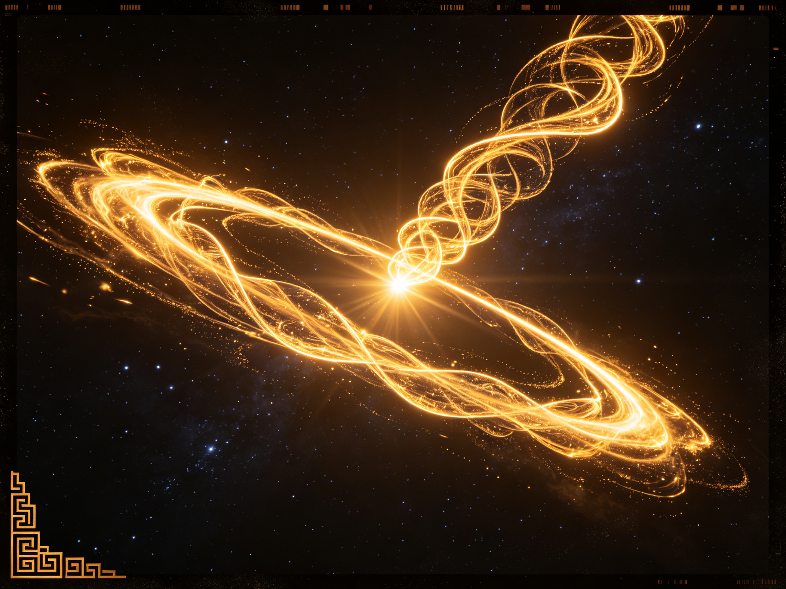

<ArchiveCopyPanel article-id="162247274" />

{"markdown":"PiDliIbnsbvvvJrmlofmmI7ov5vpmLYyMDDorrIgIAo+IOe8luWPt++8mmAxNjIyNDcyNzRgICAKPiDljp/lp4vmlofku7bvvJpg5Yu+6IKh5a6a55CG5LiN5piv55u06KeS5LiJ6KeS5b2i6L656ZW/6K6h566X5YWs5byP5piv5Z6C55u05Y+M5ZCR6J665peL55qE5aSp54S26ZW/5bqm6YWN5q+ULeWFqOWfn+aVsOWtpnZz5Lyg57uf5pWw5a2m5Lq657G75paH5piO6L+b6Zi2MjAtMTYyMjQ3Mjc0Lm1kYCAgCj4g6L+U5Zue77yaW+acrOS5puW9kuaho10oL3poL2Jvb2tzL2NvdXJzZS9hcnRpY2xlcy8pIMK3IFvmgLvlhaXlj6NdKC96aC9ib29rcy9hcnRpY2xlcy8pCgohW+WLvuiCoeWumueQhuWeguebtOWPjOieuuaXi+acrOa6kOe7k+aehF0oLi9hc3NldHMvY3NkbmltZy9qcGcvMTA0NTFjYmQ0ODRjZDI5ZS5qcGcpCgrkvZzogIXvvJog5LmW5LmW5pWw5a2mCgojIyDjgIrlhajln5/mlbDlraZ2c+S8oOe7n+aVsOWtpu+8muS6uuexu+aWh+aYjui/m+mYtjIwMOiusuOAi+esrDM06K6yIOS4reWtpumAmuS/l+eJiOmAkOWtl+eovwoKLS0tCgrorrLmrKHvvJog56ysMzTorrIKCuS4u+mimO+8miDli77ogqHlrprnkIbkuI3mmK/nm7Top5LkuInop5LlvaLovrnplb/orqHnrpflhazlvI/vvIzmmK/lnoLnm7Tlj4zlkJHonrrml4vnmoTlpKnnhLbplb/luqbphY3mr5QKCuWvueagh+ivvuacrOefpeivhueCue+8miDli77ogqHlrprnkIYKCuaWh+mjju+8miDlpKfnmb3or53jgIHml6DmmabmtqnkuJPkuJror43msYfvvIzlu7bnu60wLzHln7rngrnjgIHmlbDlrZflj4zonrrml4vlhajlpZfmr5TllrvkvZPns7sKCi0tLQoKIyMjIDDvvZ4z5YiG6ZKfIOWkjeS5oOWvvOWFpQoKIVvkuozlhYPkuIDmrKHmlrnnqIvnu4Tonrrml4vkuqTmsYfnpLrmhI/lm75dKC4vYXNzZXRzL2NzZG5pbWcvanBnLzk0MDNmZGU0OGIwZDBkYzEuanBnKQoK5ZCM5a2m5Lus77yM5LiK5LiA6IqC6K++5oiR5Lus5byE5oeC5LqG5LqM5YWD5LiA5qyh5pa556iL57uE55qE5pys5rqQ77ya5q+P5LiA5p2h5pa556iL5a+55bqU5LiA5p2h54us56uL55Sf6ZW/6J665peL77yM5pa556iL57uE55qE6Kej5bCx5piv5Lik5p2h6J665peL6L2o6L+55Lqk5rGH55qE6Lev5Y+j77yb5bmz6KGM5peg5Lqk54K55a+55bqU5peg6Kej77yM5a6M5YWo6YeN5ZCI5a+55bqU5peg5pWw6Kej44CCCgrliJ3kuK3lh6DkvZXmoLjlv4Pnn6Xor4bngrnli77ogqHlrprnkIbvvIzogIHluIjkvJrlkYror4nmiJHku6zvvJrnm7Top5LkuInop5LlvaLkuKTmnaHnn63ovrnlubPmlrnnm7jliqDvvIznrYnkuo7mnIDplb/mlpzovrnnmoTlubPmlrnvvIzkuJPpl6jnlKjmnaXnrpfnm7Top5Llm77lvaLovrnplb/jgIIKCuS7iuWkqeaIkeS7rOaNouacrOa6kOinhuinkuino+ivu++8mui/meWll+etieW8j+S4jeaYr+S6uuS4uuaAu+e7k+eahOWHoOS9leiuoeeul+WFrOW8j++8jOaYr+S7jjDln7rngrnliIblh7rkuKTmnaHkupLnm7jlnoLnm7TnmoTnlJ/plb/onrrml4vvvIzkuozogIXlu7bkvLjplb/luqblpKnnhLblvaLmiJDnmoTlm7rlrprphY3mr5TlhbPns7vjgIIKCi0tLQoKIyMjIDPvvZ4xM+WIhumSnyDnlJ/mtLvljJbnsbvmr5TorrLop6MKCiFb5Z6C55u05Y+M6J665peL55Sf6ZW/57uT5p6E56S65oSP5Zu+XSguL2Fzc2V0cy9jc2RuaW1nL2pwZy9hYTc3MzI0OThlOTgyNTY0LmpwZykKCuWFiOiusuivvuacrOmHjOeahOWLvuiCoeWumueQhu+8mgoK5Y+q6KaB5LiJ6KeS5b2i5pyJ5LiA5LiqOTDluqbnm7Top5LvvIzlsLHmu6HotrMgYTIrYjI9YzJhXjIrYl4yPWNeMmEyK2IyPWMy77yM55So5p2l5rGC6auY5bqm44CB6Led56a744CB6L656ZW/77yM5LuF5L2c5Li65Yeg5L2V6K6h566X6aKY5bel5YW344CCCgrmlL7liLDlhajln5/mlbDlrablj4zonrrml4vkvZPns7vvvJoKCuS7jjDln7rngrnliIblh7rkuKTmnaHlrozlhajlnoLnm7TjgIHkupLkuI3lubLmibDnmoTnlJ/plb/ohInnu5zvvIzkuIDmnaHmqKrlkJHlu7bkvLjjgIHkuIDmnaHnurXlkJHlu7bkvLjvvIzkuKTmnaHohInnu5zlkIToh6rntK/np6/nlJ/plb/mgLvph4/vvIjlr7nlupQgYTJhXjJhMuOAgWIyYl4yYjLvvInvvJsKCui/nuaOpeS4pOadoeiEiee7nOacq+err+eahOaWnOe6v++8jOWwseaYr+aKiuS4pOadoeWeguebtOieuuaXi+eahOeUn+mVv+aAu+mHj+WQiOW5tuWQjueahOaAu+iEiee7nO+8jOS5n+WwseaYr+aWnOi+uSBjY2PjgIIKCuW5s+aWueS7o+ihqOieuuaXi+WkmuWxguWPoOWKoOeahOaAu+mHj++8jOWLvuiCoeetieW8j++8jOWwseaYr+WeguebtOWPjOieuuaXi+eUn+mVv+aAu+mHj+eahOWkqeeEtuW5s+ihoeWFs+ezu+OAggoKIVszLTQtNeWLvuiCoeaVsOieuuaXi+WxguWPoOaAu+mHj+WPr+inhuWMll0oLi9hc3NldHMvY3NkbmltZy9qcGcvYjg5ZTc4NGNjNGEzZTNlNy5qcGcpCgrkuL7nroDljZXkvovlrZDvvJoKCuivvuacrOinhuinku+8muebtOinkui+uTPjgIE077yM5pac6L65Ne+8jDMyKzQyPTUyM14yKzReMj01XjIzMis0Mj01Mu+8jOWPquaYr+aVsOWtl+iuoeeul+inhOW+i+OAggoK5YWo5Z+f6YCa5L+X6Kej6K+777ya5qiq5ZCR6J665peL57Sv56evM+WxguWPoOWKoOaAu+mHj++8jOe6teWQkeieuuaXi+e0r+enrzTlsYLlj6DliqDmgLvph4/vvIzkuKTmnaHlnoLnm7TohInnu5zlkIjlubblkI7nmoTlrozmlbTnlJ/plb/ohInnu5zmgLvph4/lr7nlupQ177yMM+OAgTTjgIE155qE6YWN5q+U5piv5Z6C55u06J665peL5aSp55Sf6Ieq5bim55qE5bmz6KGh57uE5ZCI77yM5LiN5piv5Lq65Li65YeR5Ye65p2l55qE5pWw5a2X44CCCgror77mnKzlj6rmiKrlj5blubPpnaLnm7Top5LliIfniYfnrpfovrnplb/vvIznnIvkuI3op4Hog4zlkI7kuKTmnaHlnoLnm7Tonrrml4vlkIzmraXnlJ/plb/jgIHmgLvph4/lkIjlubbnmoTlupXlsYLnu5PmnoTjgIIKCi0tLQoKIyMjIDEz772eMjLliIbpkp8g6K++5pys6KeC54K5IHZzIOWFqOWfn+aVsOWtpumAmuS/l+ingueCuQoKIVvor77mnKzlubPpnaLliIfniYfkuI7lhajln5/nq4vkvZPonrrml4vlr7nmr5RdKC4vYXNzZXRzL2NzZG5pbWcvanBnL2FmYzgzMmYzMzkwZTAyMTUuanBnKQoKIyMjIyDkvKDnu5/or77mnKzorqTnn6UKCi0gCgrli77ogqHlrprnkIbmmK/nm7Top5LkuInop5LlvaLkuJPlsZ7kurrlt6Xmjqjlr7zlhazlvI/vvIzlj6rpgILnlKjkuo7lubPpnaLnm7Top5Llm77lvaIKCi0gCgrlubPmlrnlj6rmmK/ovrnplb/nm7jkuZjorqHnrpfvvIzlkozonrrml4vliIblsYLlj6DliqDnlJ/plb/ml6DlhbMKCi0gCgoz44CBNOOAgTXov5nnsbvmlbTmlbDnu4TlkIjlj6rmmK/lt6flkIjmlbDlrZfvvIzkuI3lrZjlnKjlpKnnhLbnlJ/plb/lhbPogZQKCiMjIyMg5YWo5Z+f5pWw5a2m6YCa5L+X6K6k55+lCgotIAoK5Yu+6IKh5YWz57O75pivMOWfuueCueWIhuWHuueahOS4pOadoeWeguebtOeUn+mVv+ieuuaXi+iHquW4pueahOaAu+mHj+mFjeavlO+8jOebtOinkuWPquaYr+WeguebtOieuuaXi+eahOW5s+mdouaKleW9sQoKLSAKCmEyYV4yYTLjgIFiMmJeMmIyIOWIhuWIq+S7o+ihqOS4pOadoeWeguebtOiEiee7nOWkmuWxguWPoOWKoOeahOaAu+eUn+mVv+mHj++8jOaWnOi+ueaYr+S6jOiAheWQiOW5tuWQjueahOWujOaVtOiEiee7nAoKLSAKCuaJgOacieWLvuiCoeaVsO+8jOmDveaYr+WeguebtOWPjOieuuaXi+WQjOatpeeUn+mVv+W9ouaIkOeahOWkqeeEtumFjeWll+aVsOWAvO+8jOaYr+Wuh+WumemAmueUqOe7k+aehOinhOW+iwoKIVvlpKfmoJHkuLvlubLkvqfmnp3lnoLnm7TnlJ/plb/lpKnnhLblubPooaFdKC4vYXNzZXRzL2NzZG5pbWcvanBnL2Q1MzA1MjEyYjI5OTMwMTcuanBnKQoK566A5Y2V5q+U5Za777yaCgror77mnKzli77ogqHlrprnkIbvvIzlpoLlkIzmi7/kuKTmiorlnoLnm7TlsLrlrZDph4/nurjniYfovrnplb/vvJsKCuacrOa6kOWLvuiCoee7k+aehO+8jOWmguWQjOWkp+agkeaoquWQkeS+p+aeneOAgeerluebtOS4u+W5suS4pOadoeWeguebtOiEiee7nO+8jOaeneW5suaAu+mVv+WkqeeEtua7oei2s+i/meWll+W5s+ihoemFjeavlOOAggoKLS0tCgojIyMgMjLvvZ4yN+WIhumSnyDmoKHlhoXlrabkuaDmj5DphpLvvIzkuI3lvbHlk43ogIPor5XlvpfliIYKCuWHoOS9leaxgui+uemVv+OAgei3neemu+OAgeeri+S9k+WbvuW9ouWvueinkue6v+mimOWei++8jOeFp+W4uOS9v+eUqCBhMitiMj1jMmFeMitiXjI9Y14yYTIrYjI9YzIg6Kej6aKY77yM562U6aKY5a6M5YWo5q2j56Gu77yM5LiN5Lya5omj5YiG44CCCgrmnKzoioLor77lj6rmmK/mi5PlsZXpq5jnu7TorqTnn6XvvJrli77ogqHlrprnkIbmmK/kuKTmnaHkupLnm7jlnoLnm7TnmoTmlbDlrZfonrrml4vvvIznlJ/plb/mgLvph4/lpKnnhLblvaLmiJDnmoTlm7rlrprphY3mr5TnrYnlvI/jgIIKCuS8j+eslOmTuuWeq++8muesrDUw6K6y5Lit5a2m57uT5Lia5LiT5Zy677yM5pW05ZCIMjbigJM1MOiusuWFqOmDqOS7o+aVsOOAgeWHoOS9leOAgeWHveaVsOWGheWuue+8jOe7n+S4gOais+eQhuaJgOacieWHoOS9leWFrOW8j+WvueW6lOeahOieuuaXi+acrOa6kOe7k+aehOOAggoKLS0tCgojIyMgMjfvvZ4zMOWIhumSnyDor77loILmgLvnu5Mr5LiL6IqC6K++6aKE5ZGKCgohW+S4gOWFg+S6jOasoeaWueeoi+aKm+eJqee6v+ieuuaXi+aXi+i9rOiKgueCuV0oLi9hc3NldHMvY3NkbmltZy9qcGcvNmU1M2E1ZmE2NTVjYzAyYS5qcGcpCgojIyMjIOacrOiKguivvuWwj+e7k++8mgoK5Yu+6IKh562J5byP5qC55rqQ5piv5Z+654K55YiG5Ye65Lik5p2h5Z6C55u055Sf6ZW/6J665peL77yM5Lik5p2h6ISJ57uc5Y+g5Yqg5oC76YeP55u45Yqg77yM562J5LqO5ZCI5bm25ZCO5pac6L656ISJ57uc55qE5Y+g5Yqg5oC76YeP44CCCgojIyMjIOS4i+S4gOiKguivvu+8mgoK5LiA5YWD5LqM5qyh5pa556iL5rGC5qC55YWs5byP5LiN5piv6YWN5pa55rOV5o6o5a+857uT5p6c77yM5piv5oqb54mp57q/6J665peL5peL6L2s6IqC54K555qE5aSp54S25Z2Q5qCH44CCCgotLS0KCiFb5YWo5Z+f5pWw5a2m5Lq657G75paH5piO6L+b6Zi25Y+y6K+X5oSP5aKDXSguL2Fzc2V0cy9jc2RuaW1nL2pwZy8yMmExZDVlNTUxMDM3NjhjLmpwZykK","text":"5YiG57G777ya5paH5piO6L+b6Zi2MjAw6K6yICAK57yW5Y+377yaMTYyMjQ3Mjc0ICAK5Y6f5aeL5paH5Lu277ya5Yu+6IKh5a6a55CG5LiN5piv55u06KeS5LiJ6KeS5b2i6L656ZW/6K6h566X5YWs5byP5piv5Z6C55u05Y+M5ZCR6J665peL55qE5aSp54S26ZW/5bqm6YWN5q+ULeWFqOWfn+aVsOWtpnZz5Lyg57uf5pWw5a2m5Lq657G75paH5piO6L+b6Zi2MjAtMTYyMjQ3Mjc0Lm1kICAK6L+U5Zue77ya5pys5Lmm5b2S5qGjIMK3IOaAu+WFpeWPowoK5Yu+6IKh5a6a55CG5Z6C55u05Y+M6J665peL5pys5rqQ57uT5p6ECgrkvZzogIXvvJog5LmW5LmW5pWw5a2mCgrjgIrlhajln5/mlbDlraZ2c+S8oOe7n+aVsOWtpu+8muS6uuexu+aWh+aYjui/m+mYtjIwMOiusuOAi+esrDM06K6yIOS4reWtpumAmuS/l+eJiOmAkOWtl+eovwoKLS0tCgrorrLmrKHvvJog56ysMzTorrIKCuS4u+mimO+8miDli77ogqHlrprnkIbkuI3mmK/nm7Top5LkuInop5LlvaLovrnplb/orqHnrpflhazlvI/vvIzmmK/lnoLnm7Tlj4zlkJHonrrml4vnmoTlpKnnhLbplb/luqbphY3mr5QKCuWvueagh+ivvuacrOefpeivhueCue+8miDli77ogqHlrprnkIYKCuaWh+mjju+8miDlpKfnmb3or53jgIHml6DmmabmtqnkuJPkuJror43msYfvvIzlu7bnu60wLzHln7rngrnjgIHmlbDlrZflj4zonrrml4vlhajlpZfmr5TllrvkvZPns7sKCi0tLQoKMO+9njPliIbpkp8g5aSN5Lmg5a+85YWlCgrkuozlhYPkuIDmrKHmlrnnqIvnu4Tonrrml4vkuqTmsYfnpLrmhI/lm74KCuWQjOWtpuS7rO+8jOS4iuS4gOiKguivvuaIkeS7rOW8hOaHguS6huS6jOWFg+S4gOasoeaWueeoi+e7hOeahOacrOa6kO+8muavj+S4gOadoeaWueeoi+WvueW6lOS4gOadoeeLrOeri+eUn+mVv+ieuuaXi++8jOaWueeoi+e7hOeahOino+WwseaYr+S4pOadoeieuuaXi+i9qOi/ueS6pOaxh+eahOi3r+WPo++8m+W5s+ihjOaXoOS6pOeCueWvueW6lOaXoOino++8jOWujOWFqOmHjeWQiOWvueW6lOaXoOaVsOino+OAggoK5Yid5Lit5Yeg5L2V5qC45b+D55+l6K+G54K55Yu+6IKh5a6a55CG77yM6ICB5biI5Lya5ZGK6K+J5oiR5Lus77ya55u06KeS5LiJ6KeS5b2i5Lik5p2h55+t6L655bmz5pa555u45Yqg77yM562J5LqO5pyA6ZW/5pac6L6555qE5bmz5pa577yM5LiT6Zeo55So5p2l566X55u06KeS5Zu+5b2i6L656ZW/44CCCgrku4rlpKnmiJHku6zmjaLmnKzmupDop4bop5Lop6Por7vvvJrov5nlpZfnrYnlvI/kuI3mmK/kurrkuLrmgLvnu5PnmoTlh6DkvZXorqHnrpflhazlvI/vvIzmmK/ku44w5Z+654K55YiG5Ye65Lik5p2h5LqS55u45Z6C55u055qE55Sf6ZW/6J665peL77yM5LqM6ICF5bu25Ly46ZW/5bqm5aSp54S25b2i5oiQ55qE5Zu65a6a6YWN5q+U5YWz57O744CCCgotLS0KCjPvvZ4xM+WIhumSnyDnlJ/mtLvljJbnsbvmr5TorrLop6MKCuWeguebtOWPjOieuuaXi+eUn+mVv+e7k+aehOekuuaEj+WbvgoK5YWI6K6y6K++5pys6YeM55qE5Yu+6IKh5a6a55CG77yaCgrlj6ropoHkuInop5LlvaLmnInkuIDkuKo5MOW6puebtOinku+8jOWwsea7oei2syBhMitiMj1jMmFeMitiXjI9Y14yYTIrYjI9YzLvvIznlKjmnaXmsYLpq5jluqbjgIHot53nprvjgIHovrnplb/vvIzku4XkvZzkuLrlh6DkvZXorqHnrpfpopjlt6XlhbfjgIIKCuaUvuWIsOWFqOWfn+aVsOWtpuWPjOieuuaXi+S9k+ezu++8mgoK5LuOMOWfuueCueWIhuWHuuS4pOadoeWujOWFqOWeguebtOOAgeS6kuS4jeW5suaJsOeahOeUn+mVv+iEiee7nO+8jOS4gOadoeaoquWQkeW7tuS8uOOAgeS4gOadoee6teWQkeW7tuS8uO+8jOS4pOadoeiEiee7nOWQhOiHque0r+enr+eUn+mVv+aAu+mHj++8iOWvueW6lCBhMmFeMmEy44CBYjJiXjJiMu+8ie+8mwoK6L+e5o6l5Lik5p2h6ISJ57uc5pyr56uv55qE5pac57q/77yM5bCx5piv5oqK5Lik5p2h5Z6C55u06J665peL55qE55Sf6ZW/5oC76YeP5ZCI5bm25ZCO55qE5oC76ISJ57uc77yM5Lmf5bCx5piv5pac6L65IGNjY+OAggoK5bmz5pa55Luj6KGo6J665peL5aSa5bGC5Y+g5Yqg55qE5oC76YeP77yM5Yu+6IKh562J5byP77yM5bCx5piv5Z6C55u05Y+M6J665peL55Sf6ZW/5oC76YeP55qE5aSp54S25bmz6KGh5YWz57O744CCCgozLTQtNeWLvuiCoeaVsOieuuaXi+WxguWPoOaAu+mHj+WPr+inhuWMlgoK5Li+566A5Y2V5L6L5a2Q77yaCgror77mnKzop4bop5LvvJrnm7Top5Lovrkz44CBNO+8jOaWnOi+uTXvvIwzMis0Mj01MjNeMis0XjI9NV4yMzIrNDI9NTLvvIzlj6rmmK/mlbDlrZforqHnrpfop4TlvovjgIIKCuWFqOWfn+mAmuS/l+ino+ivu++8muaoquWQkeieuuaXi+e0r+enrzPlsYLlj6DliqDmgLvph4/vvIznurXlkJHonrrml4vntK/np6805bGC5Y+g5Yqg5oC76YeP77yM5Lik5p2h5Z6C55u06ISJ57uc5ZCI5bm25ZCO55qE5a6M5pW055Sf6ZW/6ISJ57uc5oC76YeP5a+55bqUNe+8jDPjgIE044CBNeeahOmFjeavlOaYr+WeguebtOieuuaXi+WkqeeUn+iHquW4pueahOW5s+ihoee7hOWQiO+8jOS4jeaYr+S6uuS4uuWHkeWHuuadpeeahOaVsOWtl+OAggoK6K++5pys5Y+q5oiq5Y+W5bmz6Z2i55u06KeS5YiH54mH566X6L656ZW/77yM55yL5LiN6KeB6IOM5ZCO5Lik5p2h5Z6C55u06J665peL5ZCM5q2l55Sf6ZW/44CB5oC76YeP5ZCI5bm255qE5bqV5bGC57uT5p6E44CCCgotLS0KCjEz772eMjLliIbpkp8g6K++5pys6KeC54K5IHZzIOWFqOWfn+aVsOWtpumAmuS/l+ingueCuQoK6K++5pys5bmz6Z2i5YiH54mH5LiO5YWo5Z+f56uL5L2T6J665peL5a+55q+UCgrkvKDnu5/or77mnKzorqTnn6UK5Yu+6IKh5a6a55CG5piv55u06KeS5LiJ6KeS5b2i5LiT5bGe5Lq65bel5o6o5a+85YWs5byP77yM5Y+q6YCC55So5LqO5bmz6Z2i55u06KeS5Zu+5b2iCuW5s+aWueWPquaYr+i+uemVv+ebuOS5mOiuoeeul++8jOWSjOieuuaXi+WIhuWxguWPoOWKoOeUn+mVv+aXoOWFswoz44CBNOOAgTXov5nnsbvmlbTmlbDnu4TlkIjlj6rmmK/lt6flkIjmlbDlrZfvvIzkuI3lrZjlnKjlpKnnhLbnlJ/plb/lhbPogZQKCuWFqOWfn+aVsOWtpumAmuS/l+iupOefpQrli77ogqHlhbPns7vmmK8w5Z+654K55YiG5Ye655qE5Lik5p2h5Z6C55u055Sf6ZW/6J665peL6Ieq5bim55qE5oC76YeP6YWN5q+U77yM55u06KeS5Y+q5piv5Z6C55u06J665peL55qE5bmz6Z2i5oqV5b2xCmEyYV4yYTLjgIFiMmJeMmIyIOWIhuWIq+S7o+ihqOS4pOadoeWeguebtOiEiee7nOWkmuWxguWPoOWKoOeahOaAu+eUn+mVv+mHj++8jOaWnOi+ueaYr+S6jOiAheWQiOW5tuWQjueahOWujOaVtOiEiee7nArmiYDmnInli77ogqHmlbDvvIzpg73mmK/lnoLnm7Tlj4zonrrml4vlkIzmraXnlJ/plb/lvaLmiJDnmoTlpKnnhLbphY3lpZfmlbDlgLzvvIzmmK/lroflrpnpgJrnlKjnu5PmnoTop4TlvosKCuWkp+agkeS4u+W5suS+p+aeneWeguebtOeUn+mVv+WkqeeEtuW5s+ihoQoK566A5Y2V5q+U5Za777yaCgror77mnKzli77ogqHlrprnkIbvvIzlpoLlkIzmi7/kuKTmiorlnoLnm7TlsLrlrZDph4/nurjniYfovrnplb/vvJsKCuacrOa6kOWLvuiCoee7k+aehO+8jOWmguWQjOWkp+agkeaoquWQkeS+p+aeneOAgeerluebtOS4u+W5suS4pOadoeWeguebtOiEiee7nO+8jOaeneW5suaAu+mVv+WkqeeEtua7oei2s+i/meWll+W5s+ihoemFjeavlOOAggoKLS0tCgoyMu+9njI35YiG6ZKfIOagoeWGheWtpuS5oOaPkOmGku+8jOS4jeW9seWTjeiAg+ivleW+l+WIhgoK5Yeg5L2V5rGC6L656ZW/44CB6Led56a744CB56uL5L2T5Zu+5b2i5a+56KeS57q/6aKY5Z6L77yM54Wn5bi45L2/55SoIGEyK2IyPWMyYV4yK2JeMj1jXjJhMitiMj1jMiDop6PpopjvvIznrZTpopjlrozlhajmraPnoa7vvIzkuI3kvJrmiaPliIbjgIIKCuacrOiKguivvuWPquaYr+aLk+WxlemrmOe7tOiupOefpe+8muWLvuiCoeWumueQhuaYr+S4pOadoeS6kuebuOWeguebtOeahOaVsOWtl+ieuuaXi++8jOeUn+mVv+aAu+mHj+WkqeeEtuW9ouaIkOeahOWbuuWumumFjeavlOetieW8j+OAggoK5LyP56yU6ZO65Z6r77ya56ysNTDorrLkuK3lrabnu5PkuJrkuJPlnLrvvIzmlbTlkIgyNuKAkzUw6K6y5YWo6YOo5Luj5pWw44CB5Yeg5L2V44CB5Ye95pWw5YaF5a6577yM57uf5LiA5qKz55CG5omA5pyJ5Yeg5L2V5YWs5byP5a+55bqU55qE6J665peL5pys5rqQ57uT5p6E44CCCgotLS0KCjI3772eMzDliIbpkp8g6K++5aCC5oC757uTK+S4i+iKguivvumihOWRigoK5LiA5YWD5LqM5qyh5pa556iL5oqb54mp57q/6J665peL5peL6L2s6IqC54K5CgrmnKzoioLor77lsI/nu5PvvJoKCuWLvuiCoeetieW8j+aguea6kOaYr+WfuueCueWIhuWHuuS4pOadoeWeguebtOeUn+mVv+ieuuaXi++8jOS4pOadoeiEiee7nOWPoOWKoOaAu+mHj+ebuOWKoO+8jOetieS6juWQiOW5tuWQjuaWnOi+ueiEiee7nOeahOWPoOWKoOaAu+mHj+OAggoK5LiL5LiA6IqC6K++77yaCgrkuIDlhYPkuozmrKHmlrnnqIvmsYLmoLnlhazlvI/kuI3mmK/phY3mlrnms5Xmjqjlr7znu5PmnpzvvIzmmK/mipvniannur/onrrml4vml4vovazoioLngrnnmoTlpKnnhLblnZDmoIfjgIIKCi0tLQoK5YWo5Z+f5pWw5a2m5Lq657G75paH5piO6L+b6Zi25Y+y6K+X5oSP5aKD"}

> 分类：文明进阶200讲  
> 编号：`162247274`  
> 原始文件：`勾股定理不是直角三角形边长计算公式是垂直双向螺旋的天然长度配比-全域数学vs传统数学人类文明进阶20-162247274.md`  
> 返回：[本书归档](/zh/books/course/articles/) · [总入口](/zh/books/articles/)

<ArticlePaperMeta category="文明进阶200讲" article-id="162247274" title="勾股定理不是直角三角形边长计算公式是垂直双向螺旋的天然长度配比-全域数学vs传统数学人类文明进阶20" paper-kind="课程讲义" book-route="/zh/books/course/articles/" overview-route="/zh/books/articles/" summary="文风： 大白话、无晦涩专业词汇，延续0/1基点、数字双螺旋全套比喻体系" author="乖乖数学" lecture="第34讲" theme="勾股定理不是直角三角形边长计算公式，是垂直双向螺旋的天然长度配比" source-file="勾股定理不是直角三角形边长计算公式是垂直双向螺旋的天然长度配比-全域数学vs传统数学人类文明进阶20-162247274.md" cover="./assets/csdnimg/jpg/10451cbd484cd29e.jpg" />

作者： 乖乖数学

## 《全域数学vs传统数学：人类文明进阶200讲》第34讲 中学通俗版逐字稿

---

讲次： 第34讲

主题： 勾股定理不是直角三角形边长计算公式，是垂直双向螺旋的天然长度配比

对标课本知识点： 勾股定理

文风： 大白话、无晦涩专业词汇，延续0/1基点、数字双螺旋全套比喻体系

---

### 0～3分钟 复习导入

同学们，上一节课我们弄懂了二元一次方程组的本源：每一条方程对应一条独立生长螺旋，方程组的解就是两条螺旋轨迹交汇的路口；平行无交点对应无解，完全重合对应无数解。

初中几何核心知识点勾股定理，老师会告诉我们：直角三角形两条短边平方相加，等于最长斜边的平方，专门用来算直角图形边长。

今天我们换本源视角解读：这套等式不是人为总结的几何计算公式，是从0基点分出两条互相垂直的生长螺旋，二者延伸长度天然形成的固定配比关系。

---

### 3～13分钟 生活化类比讲解

先讲课本里的勾股定理：

只要三角形有一个90度直角，就满足 a2+b2=c2a^2+b^2=c^2a2+b2=c2，用来求高度、距离、边长，仅作为几何计算题工具。

放到全域数学双螺旋体系：

从0基点分出两条完全垂直、互不干扰的生长脉络，一条横向延伸、一条纵向延伸，两条脉络各自累积生长总量（对应 a2a^2a2、b2b^2b2）；

连接两条脉络末端的斜线，就是把两条垂直螺旋的生长总量合并后的总脉络，也就是斜边 ccc。

平方代表螺旋多层叠加的总量，勾股等式，就是垂直双螺旋生长总量的天然平衡关系。

举简单例子：

课本视角：直角边3、4，斜边5，32+42=523^2+4^2=5^232+42=52，只是数字计算规律。

全域通俗解读：横向螺旋累积3层叠加总量，纵向螺旋累积4层叠加总量，两条垂直脉络合并后的完整生长脉络总量对应5，3、4、5的配比是垂直螺旋天生自带的平衡组合，不是人为凑出来的数字。

课本只截取平面直角切片算边长，看不见背后两条垂直螺旋同步生长、总量合并的底层结构。

---

### 13～22分钟 课本观点 vs 全域数学通俗观点

#### 传统课本认知

- 

勾股定理是直角三角形专属人工推导公式，只适用于平面直角图形

- 

平方只是边长相乘计算，和螺旋分层叠加生长无关

- 

3、4、5这类整数组合只是巧合数字，不存在天然生长关联

#### 全域数学通俗认知

- 

勾股关系是0基点分出的两条垂直生长螺旋自带的总量配比，直角只是垂直螺旋的平面投影

- 

a2a^2a2、b2b^2b2 分别代表两条垂直脉络多层叠加的总生长量，斜边是二者合并后的完整脉络

- 

所有勾股数，都是垂直双螺旋同步生长形成的天然配套数值，是宇宙通用结构规律

简单比喻：

课本勾股定理，如同拿两把垂直尺子量纸片边长；

本源勾股结构，如同大树横向侧枝、竖直主干两条垂直脉络，枝干总长天然满足这套平衡配比。

---

### 22～27分钟 校内学习提醒，不影响考试得分

几何求边长、距离、立体图形对角线题型，照常使用 a2+b2=c2a^2+b^2=c^2a2+b2=c2 解题，答题完全正确，不会扣分。

本节课只是拓展高维认知：勾股定理是两条互相垂直的数字螺旋，生长总量天然形成的固定配比等式。

伏笔铺垫：第50讲中学结业专场，整合26–50讲全部代数、几何、函数内容，统一梳理所有几何公式对应的螺旋本源结构。

---

### 27～30分钟 课堂总结+下节课预告

#### 本节课小结：

勾股等式根源是基点分出两条垂直生长螺旋，两条脉络叠加总量相加，等于合并后斜边脉络的叠加总量。

#### 下一节课：

一元二次方程求根公式不是配方法推导结果，是抛物线螺旋旋转节点的天然坐标。

---

