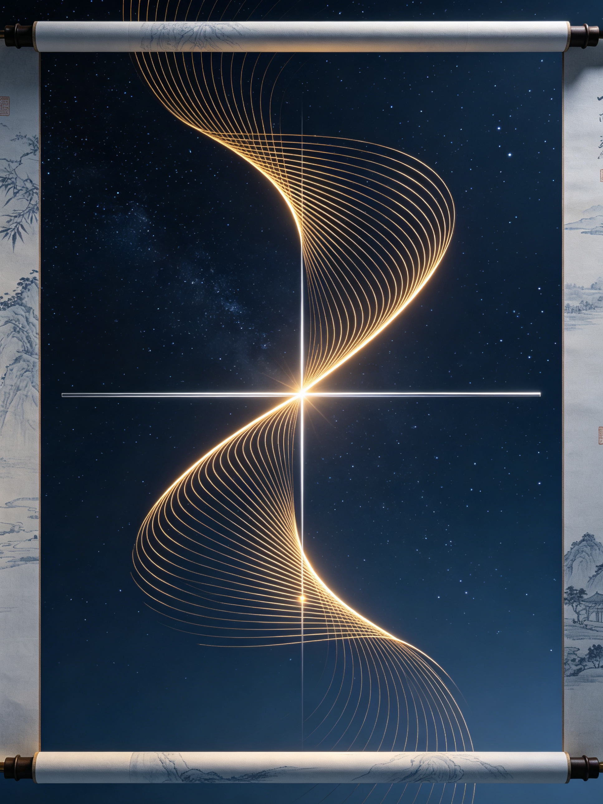

<ArchiveCopyPanel article-id="162247807" />

{"markdown":"PiDliIbnsbvvvJrmlofmmI7ov5vpmLYyMDDorrIgIAo+IOe8luWPt++8mmAxNjIyNDc4MDdgICAKPiDljp/lp4vmlofku7bvvJpg5LiA5YWD5LqM5qyh5pa556iL5rGC5qC55YWs5byP5LiN5piv6YWN5pa55rOV5o6o5a+85Lqn54mp5piv5oqb54mp57q/6J665peL5peL6L2s5Lqk54K555qE5aSp54S25Z2Q5qCHLeWFqOWfn+aVsOWtpnZz5Lyg57uf5pWw5a2m5Lq657G75paH5piO6L+bLTE2MjI0NzgwNy5tZGAgIAo+IOi/lOWbnu+8mlvmnKzkuablvZLmoaNdKC96aC9ib29rcy9jb3Vyc2UvYXJ0aWNsZXMvKSDCtyBb5oC75YWl5Y+jXSgvemgvYm9va3MvYXJ0aWNsZXMvKQoKIVvjgIrlhajln5/mlbDlraZ2c+S8oOe7n+aVsOWtpu+8muS6uuexu+aWh+aYjui/m+mYtjIwMOiusuOAi+esrDM16K6yXSguL2Fzc2V0cy9jc2RuaW1nL2pwZy9hOWU5NmVmZDA0YWJkODA3LmpwZykKCuS9nOiAhe+8miDkuZbkuZbmlbDlraYKCiMjIOOAiuWFqOWfn+aVsOWtpnZz5Lyg57uf5pWw5a2m77ya5Lq657G75paH5piO6L+b6Zi2MjAw6K6y44CL56ysMzXorrIg5Lit5a2m6YCa5L+X54mI6YCQ5a2X56i/CgotLS0KCuiusuasoe+8miDnrKwzNeiusgoK5Li76aKY77yaIOS4gOWFg+S6jOasoeaWueeoi+axguagueWFrOW8j+S4jeaYr+mFjeaWueazleaOqOWvvOS6p+eJqe+8jOaYr+aKm+eJqee6v+ieuuaXi+aXi+i9rOS6pOeCueeahOWkqeeEtuWdkOaghwoK5a+55qCH6K++5pys55+l6K+G54K577yaIOS4gOWFg+S6jOasoeaWueeoi+axguagueWFrOW8jwoK5paH6aOO77yaIOWkp+eZveivneOAgeaXoOaZpua2qeS4k+S4muivjeaxh++8jOW7tue7rTAvMeWfuueCueOAgeWPjOieuuaXi+aVtOWll+avlOWWuwoKLS0tCgojIyMgMO+9njPliIbpkp8g5aSN5Lmg5a+85YWlCgohW+WPjOieuuaXi+S7juWOn+eCueeUn+mVv+ekuuaEj+Wbvl0oLi9hc3NldHMvY3NkbmltZy9qcGcvN2ZmZWIyOTMzNDA0N2M2MC5qcGcpCgrlkIzlrabku6zvvIzkuIrkuIDoioLor77miJHku6zmi4bop6Pkuobli77ogqHlrprnkIbnmoTmnKzmupDvvIzlroPkuI3mmK/nurjniYfkuInop5LlvaLnmoTorqHnrpflt6XlhbfvvIzmmK/ljp/ngrnliIblh7rkuKTmnaHlnoLnm7Tonrrml4vvvIznlJ/plb/mgLvph4/lpKnnlJ/lvaLmiJDnmoTlubPooaHphY3mr5TjgIIKCuWIneS4reS7o+aVsOmHjemavueCueS4gOWFg+S6jOasoeaWueeoi++8jOiAgeW4iOS8mueUqOmFjeaWueazleS4gOatpeatpeWPmOW9ou+8jOaOqOWvvOWHuuaxguagueWFrOW8j++8jOWRiuivieaIkeS7rOi/meaYr+S6uuS4uua8lOeul+aAu+e7k+WHuuadpeeahOS4h+iDveeul+W8j++8jOeUqOadpeW/q+mAn+eul+WHuuaWueeoi+eahOino+OAggoK5LuK5aSp5oiR5Lus5ouJ6auY57u05bqm55yL5riF5pys6LSo77ya5rGC5qC55YWs5byP5LiN5piv5Lq656Gs5YeR5Ye65p2l55qE6K6h566X5byP5a2Q77yM5piv5LqM5qyh6J665peL5peL6L2s6L2o6L+55ZKM5Z+65YeG6Zu254K555u45Lqk5pe277yM5Lqk54K55aSp54S26Ieq5bim55qE5Z2Q5qCH6KeE5b6L44CCCgotLS0KCiMjIyAz772eMTPliIbpkp8g55Sf5rS75YyW57G75q+U6K6y6KejCgohW+aKm+eJqee6v+ieuuaXi+S4juWfuuWHhue6v+ebuOS6pF0oLi9hc3NldHMvY3NkbmltZy9qcGcvMDczYzNjNzgzZTJiNjE5My5qcGcpCgrlhYjorrLor77mnKzph4znmoTmsYLmoLnpgLvovpHvvJoKCuaKiiBheDIrYngrYz0wYXheMitieCtjPTBheDIrYngrYz0wIOmAmui/h+enu+mhueOAgemFjeaWue+8jOaVtOeQhuaIkOWujOWFqOW5s+aWueW8j++8jOW8gOW5s+aWueWQjuW+l+WIsOmAmueUqOaxguagueWFrOW8j++8jOS4jeeuoeezu+aVsOaYr+WkmuWwke+8jOebtOaOpeS7o+WFpeaVsOWtl+WwseiDveeul+WHuuS4pOS4quague+8jOWPquS9nOS4uuino+mimOaNt+W+hOOAggoK5pS+5Yiw5Y+M6J665peL55Sf6ZW/5L2T57O76YeM77yaCgrkuIDlhYPkuozmrKHlvI/lrZDlr7nlupTnmoTmmK/ml4vovazniKzljYfnmoTmipvniannur/onrrml4vvvIzov5nmnaHonrrml4vkuIrkuIvotbfkvI/vvIzkvJrlkoww5Z+65YeG5qiq57q/5Lqn55Sf5LiA5Yiw5Lik5Liq55u45Lqk54K55L2N77ybCgrphY3mlrnnmoTov4fnqIvvvIzlj6rmmK/kurrkuLrmioronrrml4vnmoTml4vovazkuK3lv4PlubPnp7vlm57op4LmtYvljp/ngrnvvIzmoLnlj7fph4znmoTliKTliKvlvI/vvIzku6Pooajonrrml4vlkozln7rlh4bnur/mnInmsqHmnInnm7jkuqTjgIHmnInlh6DkuKrkuqTngrnjgIIKCuaxguagueWFrOW8j+mHjOaVtOWll+WKoOWHj+agueWPt+OAgeWIhuavjTJh55qE57uT5p6E77yM5YWo6YOo5piv6J665peL5peL6L2s5Y2K5b6E44CB5YGP56e76YeP44CB57yg57uV5p2+57Sn6Ieq5bim55qE5aSp54S25pWw5YC85YWz57O777yM5LiN5piv5Lq65Li66L+Q566X5Yib6YCg44CCCgrkuL7nroDljZXkvovlrZDvvJoKCuivvuacrOinhuinku+8mngy4oiSNXgrNj0weF4yLTV4KzY9MHgy4oiSNXgrNj0w77yM5Luj5YWl5YWs5byP566X5Ye6IHg9Mng9Mng9MuOAgXg9M3g9M3g9M++8jOWPquaYr+iuoeeul+W+l+WHuueahOaVsOWtl+ino+OAggoK5YWo5Z+f6YCa5L+X6Kej6K+777ya6L+Z5p2h5oqb54mp57q/6J665peL55Sf6ZW/6YCU5Lit77yM5ZyoIHg9Mng9Mng9MuOAgXg9M3g9M3g9MyDkuKTlpITnqb/ov4cw5Z+65YeG57q/77yM5Lik5Liq5qC55piv6J665peL6L2o6L+55aSp54S25a2Y5Zyo55qE5Lqk5rGH5Z2Q5qCH77yM5YWs5byP5Y+q5piv5oqK6L+Z5aWX5aSp54S25Z2Q5qCH6KeE5b6L5pW055CG5oiQ57uf5LiA5YaZ5rOV44CCCgror77mnKzlj6rnm6/nnYDku6PmlbDlj5jlvaLmvJTnrpfvvIzlv73nlaXkuoblhazlvI/og4zlkI7mmK/onrrml4vml4vovazovajov7nkuI7pm7bngrnnm7jkuqTnmoTnqbrpl7Tljp/nlJ/nu5PmnoTjgIIKCi0tLQoKIyMjIDEz772eMjLliIbpkp8g6K++5pys6KeC54K5IHZzIOWFqOWfn+aVsOWtpumAmuS/l+ingueCuQoKIVvor77mnKzorqTnn6XkuI7lhajln5/mlbDlraborqTnn6Xlr7nmr5RdKC4vYXNzZXRzL2NzZG5pbWcvanBnL2Q1NmRiY2E2MzI1OWViZDMuanBnKQoKIyMjIyDkvKDnu5/or77mnKzorqTnn6UKCi0gCgrmsYLmoLnlhazlvI/mmK/pnaDphY3mlrnms5XkurrkuLrmjqjlr7zlh7rmnaXnmoTlt6XlhbfvvIzlhYjmnInmlrnnqIvvvIzlkI7mnInlhazlvI8KCi0gCgrliKTliKvlvI/lj6rmmK/liKTmlq3op6PkuKrmlbDnmoTorqHnrpfnrKblj7fvvIzmsqHmnInnqbrpl7Tnu5PmnoTlkKvkuYkKCi0gCgrkuKTmoLnlr7nnp7DjgIHpn6bovr7lrprnkIblj6rmmK/orqHnrpfooY3nlJ/nu5PorrrvvIzlkozonrrml4vnlJ/plb/ml6DlhbMKCiMjIyMg5YWo5Z+f5pWw5a2m6YCa5L+X6K6k55+lCgotIAoK5YWI5pyJ5LqM5qyh6J665peL5peL6L2s6LW35LyP55qE56m66Ze06L2o6L+577yM5ZCO5pyJ5pa556iL5LiO5rGC5qC55YWs5byP77yM5YWs5byP5Y+q5piv6K6w5b2V5Lqk54K55Z2Q5qCHCgotIAoK5Yik5Yir5byP5a+55bqU6J665peL5LiO5Z+65YeG57q/55qE55u45Lqk54q25oCB77ya5aSn5LqOMOS4pOS6pOeCueOAgeetieS6jjDnm7jliIfjgIHlsI/kuo4w5peg5a6e5Lqk54K5CgotIAoK5Lik5qC55a+556ew44CB6Z+m6L6+5a6a55CG5Lik5qC55ZKM5LiO56ev77yM6YO95piv6J665peL5Zu057uV5a+556ew6L205peL6L2s6Ieq5bim55qE5a+556ew6KeE5YiZCgrnroDljZXmr5TllrvvvJoKCuivvuacrOaxguagueWFrOW8j++8jOWmguWQjOS6i+WQjuaVtOeQhuWHuueahOi3r+WPo+afpeaJvuivtOaYjuS5pu+8mwoK5pys5rqQ5LqM5qyh6J665peL77yM5piv5LiA5p2h5aSp54S25byv5byv5puy5puy55qE5bGx6Lev77yM5qC55bCx5piv5bGx6Lev5ZKM5Z+65YeG5bmz5Zyw55u45Lqk55qE6Lev5Y+j77yM6Lev5Y+j5L2N572u5aSp55Sf5Zu65a6a44CCCgotLS0KCiMjIyAyMu+9njI35YiG6ZKfIOagoeWGheWtpuS5oOaPkOmGku+8jOS4jeW9seWTjeiAg+ivleWBmumimAoKIVvor77mnKznn6Xor4bkuI7pq5jnu7TorqTnn6XnmoTono3lkIhdKC4vYXNzZXRzL2NzZG5pbWcvanBnLzY0OTVlZjhiNDljZjE5OTEuanBnKQoK6Kej5pa556iL44CB5Yik5Yir5byP5Yik5pat5qC555qE5oOF5Ya144CB6Z+m6L6+5a6a55CG6aKY5Z6L77yM5Lil5qC85oyJ54Wn6K++5pys5YWs5byP44CB5q2l6aqk5L2c562U77yM6ICD6K+V5LiN5Lya5omj5YiG44CCCgrmnKzoioLor77lj6rmmK/mi5PlsZXpq5jnu7TorqTnn6XvvJrkuIDlhYPkuozmrKHmsYLmoLnlhazlvI/vvIzmnKzotKjmmK/mipvniannur/onrrml4vkuI7pm7bngrnln7rlh4bnm7jkuqTngrnkvY3nmoTlpKnnhLblnZDmoIfooajovr7lvI/jgIIKCuS8j+eslOmTuuWeq++8miDnrKw1MOiusuS4reWtpue7k+S4muS4k+Wcuu+8jOaVtOWQiDI24oCTNTDorrLlhajpg6jku6PmlbDjgIHlh6DkvZXjgIHlh73mlbDnn6Xor4bngrnvvIzkuLLogZTmiYDmnInmlrnnqIvjgIHmm7Lnur/lr7nlupTnmoTonrrml4vlupXlsYLnu5PmnoTjgIIKCi0tLQoKIyMjIDI3772eMzDliIbpkp8g6K++5aCC5oC757uTK+S4i+iKguivvumihOWRigoKIVvnm7jkvLzkuInop5LlvaLkuI7lj4zonrrml4vlkIzmupDmipXlvbFdKC4vYXNzZXRzL2NzZG5pbWcvanBnL2M3ZGEwZTM2NTBjYWJjNzUuanBnKQoKIyMjIyDmnKzoioLor77lsI/nu5PvvJoKCuS4gOWFg+S6jOasoeaxguagueWFrOW8j+iusOW9leS6huaKm+eJqee6v+ieuuaXi+S4jumbtuWfuuWHhue6v+ebuOS6pOeahOWkqeeEtuWdkOagh++8jOWIpOWIq+W8j+WvueW6lOS6jOiAheebuOS6pOeahOS4ieenjeepuumXtOeKtuaAgeOAggoKIyMjIyDkuIvkuIDoioLor77vvJoKCuebuOS8vOS4ieinkuW9ouS4jeaYr+WbvuW9oue8qeaUvu+8jOaYr+WPjOieuuaXi+WQjOavlOS+i+W7tuS8uOS6p+eUn+eahOWQjOa6kOaKleW9seOAggoKLS0tCgohW+ieuuaXi+S4iuWNh+iejeWFpeaYn+epuuWuh+WumV0oLi9hc3NldHMvY3NkbmltZy9qcGcvMmFlNjBlYmQ2M2QwMmJlNi5qcGcpCg==","text":"5YiG57G777ya5paH5piO6L+b6Zi2MjAw6K6yICAK57yW5Y+377yaMTYyMjQ3ODA3ICAK5Y6f5aeL5paH5Lu277ya5LiA5YWD5LqM5qyh5pa556iL5rGC5qC55YWs5byP5LiN5piv6YWN5pa55rOV5o6o5a+85Lqn54mp5piv5oqb54mp57q/6J665peL5peL6L2s5Lqk54K555qE5aSp54S25Z2Q5qCHLeWFqOWfn+aVsOWtpnZz5Lyg57uf5pWw5a2m5Lq657G75paH5piO6L+bLTE2MjI0NzgwNy5tZCAgCui/lOWbnu+8muacrOS5puW9kuahoyDCtyDmgLvlhaXlj6MKCuOAiuWFqOWfn+aVsOWtpnZz5Lyg57uf5pWw5a2m77ya5Lq657G75paH5piO6L+b6Zi2MjAw6K6y44CL56ysMzXorrIKCuS9nOiAhe+8miDkuZbkuZbmlbDlraYKCuOAiuWFqOWfn+aVsOWtpnZz5Lyg57uf5pWw5a2m77ya5Lq657G75paH5piO6L+b6Zi2MjAw6K6y44CL56ysMzXorrIg5Lit5a2m6YCa5L+X54mI6YCQ5a2X56i/CgotLS0KCuiusuasoe+8miDnrKwzNeiusgoK5Li76aKY77yaIOS4gOWFg+S6jOasoeaWueeoi+axguagueWFrOW8j+S4jeaYr+mFjeaWueazleaOqOWvvOS6p+eJqe+8jOaYr+aKm+eJqee6v+ieuuaXi+aXi+i9rOS6pOeCueeahOWkqeeEtuWdkOaghwoK5a+55qCH6K++5pys55+l6K+G54K577yaIOS4gOWFg+S6jOasoeaWueeoi+axguagueWFrOW8jwoK5paH6aOO77yaIOWkp+eZveivneOAgeaXoOaZpua2qeS4k+S4muivjeaxh++8jOW7tue7rTAvMeWfuueCueOAgeWPjOieuuaXi+aVtOWll+avlOWWuwoKLS0tCgow772eM+WIhumSnyDlpI3kuaDlr7zlhaUKCuWPjOieuuaXi+S7juWOn+eCueeUn+mVv+ekuuaEj+WbvgoK5ZCM5a2m5Lus77yM5LiK5LiA6IqC6K++5oiR5Lus5ouG6Kej5LqG5Yu+6IKh5a6a55CG55qE5pys5rqQ77yM5a6D5LiN5piv57q454mH5LiJ6KeS5b2i55qE6K6h566X5bel5YW377yM5piv5Y6f54K55YiG5Ye65Lik5p2h5Z6C55u06J665peL77yM55Sf6ZW/5oC76YeP5aSp55Sf5b2i5oiQ55qE5bmz6KGh6YWN5q+U44CCCgrliJ3kuK3ku6PmlbDph43pmr7ngrnkuIDlhYPkuozmrKHmlrnnqIvvvIzogIHluIjkvJrnlKjphY3mlrnms5XkuIDmraXmraXlj5jlvaLvvIzmjqjlr7zlh7rmsYLmoLnlhazlvI/vvIzlkYror4nmiJHku6zov5nmmK/kurrkuLrmvJTnrpfmgLvnu5Plh7rmnaXnmoTkuIfog73nrpflvI/vvIznlKjmnaXlv6vpgJ/nrpflh7rmlrnnqIvnmoTop6PjgIIKCuS7iuWkqeaIkeS7rOaLiemrmOe7tOW6pueci+a4heacrOi0qO+8muaxguagueWFrOW8j+S4jeaYr+S6uuehrOWHkeWHuuadpeeahOiuoeeul+W8j+WtkO+8jOaYr+S6jOasoeieuuaXi+aXi+i9rOi9qOi/ueWSjOWfuuWHhumbtueCueebuOS6pOaXtu+8jOS6pOeCueWkqeeEtuiHquW4pueahOWdkOagh+inhOW+i+OAggoKLS0tCgoz772eMTPliIbpkp8g55Sf5rS75YyW57G75q+U6K6y6KejCgrmipvniannur/onrrml4vkuI7ln7rlh4bnur/nm7jkuqQKCuWFiOiusuivvuacrOmHjOeahOaxguaguemAu+i+ke+8mgoK5oqKIGF4MitieCtjPTBheF4yK2J4K2M9MGF4MitieCtjPTAg6YCa6L+H56e76aG544CB6YWN5pa577yM5pW055CG5oiQ5a6M5YWo5bmz5pa55byP77yM5byA5bmz5pa55ZCO5b6X5Yiw6YCa55So5rGC5qC55YWs5byP77yM5LiN566h57O75pWw5piv5aSa5bCR77yM55u05o6l5Luj5YWl5pWw5a2X5bCx6IO9566X5Ye65Lik5Liq5qC577yM5Y+q5L2c5Li66Kej6aKY5o235b6E44CCCgrmlL7liLDlj4zonrrml4vnlJ/plb/kvZPns7vph4zvvJoKCuS4gOWFg+S6jOasoeW8j+WtkOWvueW6lOeahOaYr+aXi+i9rOeIrOWNh+eahOaKm+eJqee6v+ieuuaXi++8jOi/meadoeieuuaXi+S4iuS4i+i1t+S8j++8jOS8muWSjDDln7rlh4bmqKrnur/kuqfnlJ/kuIDliLDkuKTkuKrnm7jkuqTngrnkvY3vvJsKCumFjeaWueeahOi/h+eoi++8jOWPquaYr+S6uuS4uuaKiuieuuaXi+eahOaXi+i9rOS4reW/g+W5s+enu+Wbnuingua1i+WOn+eCue+8jOagueWPt+mHjOeahOWIpOWIq+W8j++8jOS7o+ihqOieuuaXi+WSjOWfuuWHhue6v+acieayoeacieebuOS6pOOAgeacieWHoOS4quS6pOeCueOAggoK5rGC5qC55YWs5byP6YeM5pW05aWX5Yqg5YeP5qC55Y+344CB5YiG5q+NMmHnmoTnu5PmnoTvvIzlhajpg6jmmK/onrrml4vml4vovazljYrlvoTjgIHlgY/np7vph4/jgIHnvKDnu5Xmnb7ntKfoh6rluKbnmoTlpKnnhLbmlbDlgLzlhbPns7vvvIzkuI3mmK/kurrkuLrov5DnrpfliJvpgKDjgIIKCuS4vueugOWNleS+i+WtkO+8mgoK6K++5pys6KeG6KeS77yaeDLiiJI1eCs2PTB4XjItNXgrNj0weDLiiJI1eCs2PTDvvIzku6PlhaXlhazlvI/nrpflh7ogeD0yeD0yeD0y44CBeD0zeD0zeD0z77yM5Y+q5piv6K6h566X5b6X5Ye655qE5pWw5a2X6Kej44CCCgrlhajln5/pgJrkv5fop6Por7vvvJrov5nmnaHmipvniannur/onrrml4vnlJ/plb/pgJTkuK3vvIzlnKggeD0yeD0yeD0y44CBeD0zeD0zeD0zIOS4pOWkhOepv+i/hzDln7rlh4bnur/vvIzkuKTkuKrmoLnmmK/onrrml4vovajov7nlpKnnhLblrZjlnKjnmoTkuqTmsYflnZDmoIfvvIzlhazlvI/lj6rmmK/miorov5nlpZflpKnnhLblnZDmoIfop4TlvovmlbTnkIbmiJDnu5/kuIDlhpnms5XjgIIKCuivvuacrOWPquebr+edgOS7o+aVsOWPmOW9oua8lOeul++8jOW/veeVpeS6huWFrOW8j+iDjOWQjuaYr+ieuuaXi+aXi+i9rOi9qOi/ueS4jumbtueCueebuOS6pOeahOepuumXtOWOn+eUn+e7k+aehOOAggoKLS0tCgoxM++9njIy5YiG6ZKfIOivvuacrOingueCuSB2cyDlhajln5/mlbDlrabpgJrkv5fop4LngrkKCuivvuacrOiupOefpeS4juWFqOWfn+aVsOWtpuiupOefpeWvueavlAoK5Lyg57uf6K++5pys6K6k55+lCuaxguagueWFrOW8j+aYr+mdoOmFjeaWueazleS6uuS4uuaOqOWvvOWHuuadpeeahOW3peWFt++8jOWFiOacieaWueeoi++8jOWQjuacieWFrOW8jwrliKTliKvlvI/lj6rmmK/liKTmlq3op6PkuKrmlbDnmoTorqHnrpfnrKblj7fvvIzmsqHmnInnqbrpl7Tnu5PmnoTlkKvkuYkK5Lik5qC55a+556ew44CB6Z+m6L6+5a6a55CG5Y+q5piv6K6h566X6KGN55Sf57uT6K6677yM5ZKM6J665peL55Sf6ZW/5peg5YWzCgrlhajln5/mlbDlrabpgJrkv5forqTnn6UK5YWI5pyJ5LqM5qyh6J665peL5peL6L2s6LW35LyP55qE56m66Ze06L2o6L+577yM5ZCO5pyJ5pa556iL5LiO5rGC5qC55YWs5byP77yM5YWs5byP5Y+q5piv6K6w5b2V5Lqk54K55Z2Q5qCHCuWIpOWIq+W8j+WvueW6lOieuuaXi+S4juWfuuWHhue6v+eahOebuOS6pOeKtuaAge+8muWkp+S6jjDkuKTkuqTngrnjgIHnrYnkuo4w55u45YiH44CB5bCP5LqOMOaXoOWunuS6pOeCuQrkuKTmoLnlr7nnp7DjgIHpn6bovr7lrprnkIbkuKTmoLnlkozkuI7np6/vvIzpg73mmK/onrrml4vlm7Tnu5Xlr7nnp7DovbTml4vovazoh6rluKbnmoTlr7nnp7Dop4TliJkKCueugOWNleavlOWWu++8mgoK6K++5pys5rGC5qC55YWs5byP77yM5aaC5ZCM5LqL5ZCO5pW055CG5Ye655qE6Lev5Y+j5p+l5om+6K+05piO5Lmm77ybCgrmnKzmupDkuozmrKHonrrml4vvvIzmmK/kuIDmnaHlpKnnhLblvK/lvK/mm7Lmm7LnmoTlsbHot6/vvIzmoLnlsLHmmK/lsbHot6/lkozln7rlh4blubPlnLDnm7jkuqTnmoTot6/lj6PvvIzot6/lj6PkvY3nva7lpKnnlJ/lm7rlrprjgIIKCi0tLQoKMjLvvZ4yN+WIhumSnyDmoKHlhoXlrabkuaDmj5DphpLvvIzkuI3lvbHlk43ogIPor5XlgZrpopgKCuivvuacrOefpeivhuS4jumrmOe7tOiupOefpeeahOiejeWQiAoK6Kej5pa556iL44CB5Yik5Yir5byP5Yik5pat5qC555qE5oOF5Ya144CB6Z+m6L6+5a6a55CG6aKY5Z6L77yM5Lil5qC85oyJ54Wn6K++5pys5YWs5byP44CB5q2l6aqk5L2c562U77yM6ICD6K+V5LiN5Lya5omj5YiG44CCCgrmnKzoioLor77lj6rmmK/mi5PlsZXpq5jnu7TorqTnn6XvvJrkuIDlhYPkuozmrKHmsYLmoLnlhazlvI/vvIzmnKzotKjmmK/mipvniannur/onrrml4vkuI7pm7bngrnln7rlh4bnm7jkuqTngrnkvY3nmoTlpKnnhLblnZDmoIfooajovr7lvI/jgIIKCuS8j+eslOmTuuWeq++8miDnrKw1MOiusuS4reWtpue7k+S4muS4k+Wcuu+8jOaVtOWQiDI24oCTNTDorrLlhajpg6jku6PmlbDjgIHlh6DkvZXjgIHlh73mlbDnn6Xor4bngrnvvIzkuLLogZTmiYDmnInmlrnnqIvjgIHmm7Lnur/lr7nlupTnmoTonrrml4vlupXlsYLnu5PmnoTjgIIKCi0tLQoKMjfvvZ4zMOWIhumSnyDor77loILmgLvnu5Mr5LiL6IqC6K++6aKE5ZGKCgrnm7jkvLzkuInop5LlvaLkuI7lj4zonrrml4vlkIzmupDmipXlvbEKCuacrOiKguivvuWwj+e7k++8mgoK5LiA5YWD5LqM5qyh5rGC5qC55YWs5byP6K6w5b2V5LqG5oqb54mp57q/6J665peL5LiO6Zu25Z+65YeG57q/55u45Lqk55qE5aSp54S25Z2Q5qCH77yM5Yik5Yir5byP5a+55bqU5LqM6ICF55u45Lqk55qE5LiJ56eN56m66Ze054q25oCB44CCCgrkuIvkuIDoioLor77vvJoKCuebuOS8vOS4ieinkuW9ouS4jeaYr+WbvuW9oue8qeaUvu+8jOaYr+WPjOieuuaXi+WQjOavlOS+i+W7tuS8uOS6p+eUn+eahOWQjOa6kOaKleW9seOAggoKLS0tCgronrrml4vkuIrljYfono3lhaXmmJ/nqbrlroflrpk="}

> 分类：文明进阶200讲  
> 编号：`162247807`  
> 原始文件：`一元二次方程求根公式不是配方法推导产物是抛物线螺旋旋转交点的天然坐标-全域数学vs传统数学人类文明进-162247807.md`  
> 返回：[本书归档](/zh/books/course/articles/) · [总入口](/zh/books/articles/)

<ArticlePaperMeta category="文明进阶200讲" article-id="162247807" title="一元二次方程求根公式不是配方法推导产物是抛物线螺旋旋转交点的天然坐标-全域数学vs传统数学人类文明进" paper-kind="课程讲义" book-route="/zh/books/course/articles/" overview-route="/zh/books/articles/" summary="对标课本知识点： 一元二次方程求根公式" author="乖乖数学" lecture="第35讲" theme="一元二次方程求根公式不是配方法推导产物，是抛物线螺旋旋转交点的天然坐标" source-file="一元二次方程求根公式不是配方法推导产物是抛物线螺旋旋转交点的天然坐标-全域数学vs传统数学人类文明进-162247807.md" cover="./assets/csdnimg/jpg/a9e96efd04abd807.jpg" />

作者： 乖乖数学

## 《全域数学vs传统数学：人类文明进阶200讲》第35讲 中学通俗版逐字稿

---

讲次： 第35讲

主题： 一元二次方程求根公式不是配方法推导产物，是抛物线螺旋旋转交点的天然坐标

对标课本知识点： 一元二次方程求根公式

文风： 大白话、无晦涩专业词汇，延续0/1基点、双螺旋整套比喻

---

### 0～3分钟 复习导入

同学们，上一节课我们拆解了勾股定理的本源，它不是纸片三角形的计算工具，是原点分出两条垂直螺旋，生长总量天生形成的平衡配比。

初中代数重难点一元二次方程，老师会用配方法一步步变形，推导出求根公式，告诉我们这是人为演算总结出来的万能算式，用来快速算出方程的解。

今天我们拉高维度看清本质：求根公式不是人硬凑出来的计算式子，是二次螺旋旋转轨迹和基准零点相交时，交点天然自带的坐标规律。

---

### 3～13分钟 生活化类比讲解

先讲课本里的求根逻辑：

把 ax2+bx+c=0ax^2+bx+c=0ax2+bx+c=0 通过移项、配方，整理成完全平方式，开平方后得到通用求根公式，不管系数是多少，直接代入数字就能算出两个根，只作为解题捷径。

放到双螺旋生长体系里：

一元二次式子对应的是旋转爬升的抛物线螺旋，这条螺旋上下起伏，会和0基准横线产生一到两个相交点位；

配方的过程，只是人为把螺旋的旋转中心平移回观测原点，根号里的判别式，代表螺旋和基准线有没有相交、有几个交点。

求根公式里整套加减根号、分母2a的结构，全部是螺旋旋转半径、偏移量、缠绕松紧自带的天然数值关系，不是人为运算创造。

举简单例子：

课本视角：x2−5x+6=0x^2-5x+6=0x2−5x+6=0，代入公式算出 x=2x=2x=2、x=3x=3x=3，只是计算得出的数字解。

全域通俗解读：这条抛物线螺旋生长途中，在 x=2x=2x=2、x=3x=3x=3 两处穿过0基准线，两个根是螺旋轨迹天然存在的交汇坐标，公式只是把这套天然坐标规律整理成统一写法。

课本只盯着代数变形演算，忽略了公式背后是螺旋旋转轨迹与零点相交的空间原生结构。

---

### 13～22分钟 课本观点 vs 全域数学通俗观点

#### 传统课本认知

- 

求根公式是靠配方法人为推导出来的工具，先有方程，后有公式

- 

判别式只是判断解个数的计算符号，没有空间结构含义

- 

两根对称、韦达定理只是计算衍生结论，和螺旋生长无关

#### 全域数学通俗认知

- 

先有二次螺旋旋转起伏的空间轨迹，后有方程与求根公式，公式只是记录交点坐标

- 

判别式对应螺旋与基准线的相交状态：大于0两交点、等于0相切、小于0无实交点

- 

两根对称、韦达定理两根和与积，都是螺旋围绕对称轴旋转自带的对称规则

简单比喻：

课本求根公式，如同事后整理出的路口查找说明书；

本源二次螺旋，是一条天然弯弯曲曲的山路，根就是山路和基准平地相交的路口，路口位置天生固定。

---

### 22～27分钟 校内学习提醒，不影响考试做题

解方程、判别式判断根的情况、韦达定理题型，严格按照课本公式、步骤作答，考试不会扣分。

本节课只是拓展高维认知：一元二次求根公式，本质是抛物线螺旋与零点基准相交点位的天然坐标表达式。

伏笔铺垫： 第50讲中学结业专场，整合26–50讲全部代数、几何、函数知识点，串联所有方程、曲线对应的螺旋底层结构。

---

### 27～30分钟 课堂总结+下节课预告

#### 本节课小结：

一元二次求根公式记录了抛物线螺旋与零基准线相交的天然坐标，判别式对应二者相交的三种空间状态。

#### 下一节课：

相似三角形不是图形缩放，是双螺旋同比例延伸产生的同源投影。

---

