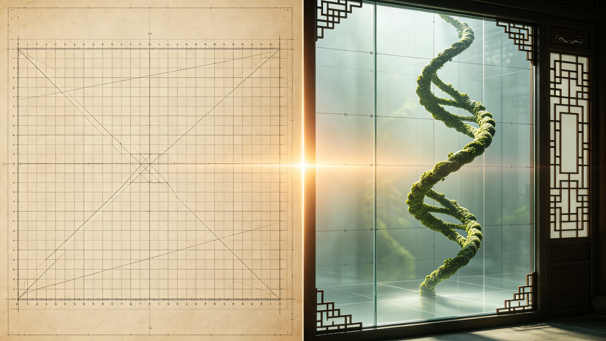

<ArchiveCopyPanel article-id="162249564" />

{"markdown":"PiDliIbnsbvvvJrmlofmmI7ov5vpmLYyMDDorrIgIAo+IOe8luWPt++8mmAxNjIyNDk1NjRgICAKPiDljp/lp4vmlofku7bvvJpg5bmz6Z2i55u06KeS5Z2Q5qCH57O75LiN5Y+q5piv57q46Z2i5Yi75bqm5piv6KeC5rWL5Y+M6J665peL55Sf6ZW/6L2o6L+555qE5LqM57u06KeC5rWL56qX5Y+jLeWFqOWfn+aVsOWtpnZz5Lyg57uf5pWw5a2m5Lq657G75paH5piO6L+b6Zi2MjAtMTYyMjQ5NTY0Lm1kYCAgCj4g6L+U5Zue77yaW+acrOS5puW9kuaho10oL3poL2Jvb2tzL2NvdXJzZS9hcnRpY2xlcy8pIMK3IFvmgLvlhaXlj6NdKC96aC9ib29rcy9hcnRpY2xlcy8pCgohW+Wwgemdol0oLi9hc3NldHMvY3NkbmltZy9qcGcvMTdhNDQ4MzQ1MGYxZmI5OC5qcGcpCgrkvZzogIXvvJog5LmW5LmW5pWw5a2mCgojIyDjgIrlhajln5/mlbDlraZ2c+S8oOe7n+aVsOWtpu+8muS6uuexu+aWh+aYjui/m+mYtjIwMOiusuOAi+esrDM56K6yIOS4reWtpumAmuS/l+eJiOmAkOWtl+eovwoK6K6y5qyh77yaIOesrDM56K6yCgrkuLvpopjvvJog5bmz6Z2i55u06KeS5Z2Q5qCH57O75LiN5Y+q5piv57q46Z2i5Yi75bqm77yM5piv6KeC5rWL5Y+M6J665peL55Sf6ZW/6L2o6L+555qE5LqM57u06KeC5rWL56qX5Y+jCgrlr7nmoIfor77mnKznn6Xor4bngrnvvJog5bmz6Z2i55u06KeS5Z2Q5qCH57O744CB54K555qE5Z2Q5qCHCgrmlofpo47vvJog5aSn55m96K+d44CB5peg5pmm5rap5LiT5Lia6K+N5rGH77yM5bu257utMC8x5Z+654K544CB5Y+M6J665peL5YWo5aWX5q+U5Za7CgotLS0KCiMjIyAw772eM+WIhumSnyDlpI3kuaDlr7zlhaUKCiFb5aSN5Lmg5a+85YWlXSguL2Fzc2V0cy9jc2RuaW1nL2pwZy84NDA3NzRmNmQ2ZTk2NWNlLmpwZykKCuWQjOWtpuS7rO+8jOS4iuS4gOiKguivvuaIkeS7rOW8hOaHguS6hue7n+iuoeS4ieaVsOeahOacrOa6kO+8jOW5s+Wdh+aVsOOAgeS4reS9jeaVsOOAgeS8l+aVsOS4jeaYr+S6uuS4uueul+WHuuadpeeahOaKmOS4reaVsOWtl++8jOWIhuWIq+WvueW6lOWPjOieuuaXi+mbhue+pOmHjOaAu+mHj+Wdh+WIhuOAgeW6j+WIl+WIhueVjOOAgemrmOmikemHjeWkjeS4ieenjeWkqeeEtuiEiee7nOeJueW+geOAggoK5LuO5Yid5Lit5byA56+H5oiR5Lus5bCx5LiA55u05Zyo55So5bmz6Z2i55u06KeS5Z2Q5qCH57O777yM6ICB5biI5ZGK6K+J5oiR5Lus77yM5qiq56uW5Lik5p2h57q/5Lqk5Y+J77yM5YiG5Ye65Zub5Liq6LGh6ZmQ77yM55SoICh4LHkpKHgseSkoeCx5KSDmoIforrDngrnnmoTkvY3nva7vvIzlj6rmmK/kurrkuLrnlLvlnKjnurjkuIrnmoTlrprkvY3lsLrlrZDjgIIKCuS7iuWkqeaIkeS7rOaLiemrmOe7tOW6pueci+a4heW6leWxguecn+ebuO+8muWNgeWtl+WdkOagh+i9tOS4jeaYr+WHreepuuWIm+mAoOeahOWIu+W6puW3peWFt++8jOaYr+S6uuS4uuaQreW7uueahOS6jOe7tOingua1i+eql+WPo++8jOeUqOadpeiusOW9lTDln7rngrnnlJ/lh7rnmoTmraPotJ/lj4zlkJHlj4zonrrml4vvvIzlnKjlubPpnaLkuIrlu7bkvLjjgIHml4vovazjgIHnm7jkuqTnmoTlhajpg6jovajov7njgIIKCi0tLQoKIyMjIDPvvZ4xM+WIhumSnyDnlJ/mtLvljJbnsbvmr5TorrLop6MKCiFb55Sf5rS75YyW57G75q+UXSguL2Fzc2V0cy9jc2RuaW1nL2pwZy8zNjVmMjZhZWJiOTBkOTgwLmpwZykKCuWFiOiusuivvuacrOmHjOeahOWdkOagh+ezu+eUqOazle+8mgoK5qiq6L20IHh4eCDlt6blj7Plu7bkvLjvvIznurXovbQgeXl5IOS4iuS4i+W7tuS8uO+8jOS6pOeCueS4uuWOn+eCuSAwMDDvvIzku7vmhI/kuIDngrnmkK3phY3kuIDnu4TmlbDlrZfvvIzlsLHog73nsr7lh4blrprkvY3kvY3nva7vvIznlLvlh73mlbDjgIHlh6DkvZXlm77lvaLlhajkvp3pnaDov5nlpZfliLvluqbvvIzku4XkvZzkuLrnu5jlm77jgIHorqHnrpfovoXliqnlt6XlhbfjgIIKCuaUvuWIsOWFqOWfn+aVsOWtpuWPjOieuuaXi+S9k+ezu+mHjO+8mgoKMOWfuueCueaYr+aVtOS4quaVsOWtl+S9k+ezu+eahOWvueensOS4reW/g++8jOato+WQkeOAgei0n+WQkeS4pOadoeWOn+eUn+ieuuaXi+OAgeS4pOadoee7hOWQiOieuuaXi+S8muWQkeS4iuS4i+OAgeW3puWPs+Wbm+S4quaWueWQkeWQjOatpeeUn+mVv++8mwoK5oiR5Lus5peg5rOV55u05o6l55yL6KeB5a6M5pW05aSa5bGC5bWM5aWX55qE56uL5L2T6J665peL77yM5LqO5piv5oiq5Y+W5LiA5bGC5bmz5pW05bmz6Z2i77yM55S75Ye65qiq56uW5Lik5p2h5Z+65YeG57q/77yM5YGa5oiQ6KeC5rWL56qX5Y+j77yM5oqK56uL5L2T6J665peL5oqV5bCE5Yiw5bmz6Z2i5LiK77yM5b2i5oiQICh4LHkpKHgseSkoeCx5KSDlnZDmoIfngrnkvY3jgIIKCuaoqui9tOWvueW6lOieuuaXi+W3puWPs+W7tuS8uOeahOeUn+mVv+WIu+W6pu+8jOe6tei9tOWvueW6lOieuuaXi+S4iuS4i+i1t+S8j+eahOiDvemHj+mrmOW6pu+8jOWbm+S4quixoemZkOWvueW6lOieuuaXi+Wbm+S4quS4jeWQjOaWueWQkeeahOeUn+mVv+WMuuWfn+OAggoK5Li+566A5Y2V5L6L5a2Q77yaCgror77mnKzop4bop5LvvJrngrkgKDIs4oiSMykoMiwtMykoMiziiJIzKSDlj6rmmK/mqKrovbTlvoDlj7My5qC844CB57q16L205b6A5LiLM+agvOeahOagh+iusOOAggoKIVvngrnlnZDmoIfnpLrkvotdKC4vYXNzZXRzL2NzZG5pbWcvanBnLzBmZTZkNDNkYjI5NmQ0ODEuanBnKQoK5YWo5Z+f6YCa5L+X6Kej6K+777ya6L+Z5Liq54K55L2N5piv56uL5L2T5Y+M6J665peL5oqV5bCE5Yiw6KeC5rWL5bmz6Z2i5LiK55qE5LiA5aSE55Sf6ZW/6IqC54K577yMMjIyIOS7o+ihqOato+WQkeieuuaXi+W7tuS8uOmVv+W6pu+8jOKIkjMtM+KIkjMg5Luj6KGo6LSf5ZCR6J665peL5LiL5rKJ6auY5bqm77yM5Z2Q5qCH5Y+q5piv6K6w5b2V6J665peL6IqC54K55oqV5b2x5L2N572u55qE5qCH6K6w44CCCgror77mnKzlj6rnm6/nnYDnurjkuIrliLvluqblgZrorqHnrpfnlLvlm77vvIzlv73nlaXkuoblnZDmoIfovbTmnKzotKjmmK/op4LmtYvnq4vkvZPlj4zonrrml4vnmoTkuoznu7TmiKrlj5bnqpflj6PvvIzmiYDmnInmm7Lnur/jgIHkuqTngrnpg73mmK/onrrml4vnmoTlubPpnaLmipXlvbHjgIIKCi0tLQoKIyMjIDEz772eMjLliIbpkp8g6K++5pys6KeC54K5IHZzIOWFqOWfn+aVsOWtpumAmuS/l+ingueCuQoKIVvlr7nmr5Tmr5TllrtdKC4vYXNzZXRzL2NzZG5pbWcvanBnLzc1ZDM1Njk0MDZjMzJkNGMuanBnKQoKIyMjIyDkvKDnu5/or77mnKzorqTnn6UKCi0gCgrlnZDmoIfns7vmmK/kurrkuLrnu5jliLbnmoTliLvluqbnvZHmoLzvvIzoh6rnhLbnlYzkuI3lrZjlnKjmqKrnq5bln7rlh4bnur8KCi0gCgrlnZDmoIfngrnlj6rmmK/kurrkuLrmoIfms6jnmoTkvY3nva7vvIzlkozmlbDlrZfonrrml4vnlJ/plb/ovajov7nml6DlhbMKCi0gCgrlm5vkuKrosaHpmZDlj6rmmK/kurrkuLrliJLliIbljLrln5/vvIzmsqHmnInlr7nlupTnmoTljp/nlJ/nlJ/plb/mlrnlkJHljLrliIYKCiMjIyMg5YWo5Z+f5pWw5a2m6YCa5L+X6K6k55+lCgotIAoK5Z2Q5qCH57O75piv5oiq5Y+W56uL5L2T56m66Ze05b2i5oiQ55qE6KeC5rWL56qX5Y+j77yM55So5p2l6KeC5rWL5Y+M5ZCR5Y+M6J665peL55qE5bmz6Z2i5oqV5b2xCgotIAoKeHh444CBeXl5IOWIhuWIq+iusOW9leieuuaXi+aoquWQkeW7tuS8uOmVv+W6puOAgee6teWQkeiDvemHj+mrmOW6pu+8jOWdkOagh+eCueaYr+ieuuaXi+ecn+WunueUn+mVv+iKgueCueeahOaKleW9sQoKLSAKCuWbm+S4quixoemZkOWvueW6lOieuuaXi+WQkeato+i0n+Wbm+S4quaWueWQkeW7tuS8uOeahOWkqeeEtueUn+mVv+WIhuWMuu+8jOato+i0n+aVsOWtl+ieuuaXi+WQhOiHquWNoOaNruWvueW6lOixoemZkAoK566A5Y2V5q+U5Za777yaCgror77mnKzlnZDmoIfns7vlpoLlkIzkuIDlvKDmlrnmoLznu5jlm77nurjvvIzkurrlt6XnlLvkuIrnur/mnaHnlKjmnaXnlLvlm77vvJsKCuacrOa6kOWdkOagh+ezu+WmguWQjOeql+aIt+eOu+eSg++8jOeri+S9k+ieuuaXi+WcqOeql+WklueUn+mVv++8jOeOu+eSg+S4iueahOaoquerlue6uei3r+W4ruaIkeS7rOiusOW9leeql+WklueJqeS9k+aKleW9seeahOS9jee9ruOAggoKLS0tCgojIyMgMjLvvZ4yN+WIhumSnyDmoKHlhoXlrabkuaDmj5DphpLvvIzkuI3lvbHlk43ogIPor5XlvpfliIYKCuaJvueCueOAgeW5s+enu+WbvuW9ouOAgee7mOWItuWHveaVsOWbvuWDj+OAgeWHoOS9leWdkOagh+iuoeeul+mimO+8jOS4peagvOaMieeFp+ivvuacrOWdkOagh+inhOWImeS9nOetlO+8jOiAg+ivleS4jeS8muaJo+WIhuOAggoK5pys6IqC6K++5Y+q5piv5ouT5bGV6auY57u06K6k55+l77ya5bmz6Z2i55u06KeS5Z2Q5qCH57O75piv5oiq5Y+W56uL5L2T56m66Ze05pCt5bu655qE5LqM57u06KeC5rWL56qX5Y+j77yM55So5p2l6K6w5b2V5Y+M6J665peL55Sf6ZW/6L2o6L+555qE5bmz6Z2i5oqV5b2x44CCCgrkvI/nrJTpk7rlnqvvvJog56ysNTDorrLkuK3lrabnu5PkuJrkuJPlnLrvvIzmlbTlkIgyNuKAkzUw6K6y5YWo6YOo5Lit5a2m5Luj5pWw44CB5Yeg5L2V44CB5Ye95pWw44CB57uf6K6h55+l6K+G54K577yM5a6M5pW05Liy6IGU5Lit5a2m5YWo6YOo5pWw55CG55+l6K+G5a+55bqU55qEMC8xL+KInuS4ieaegeacrOa6kOS4juWPjOieuuaXi+eUn+mVv+mAu+i+keOAggoKLS0tCgojIyMgMjfvvZ4zMOWIhumSnyDor77loILmgLvnu5Mr5LiL6IqC6K++6aKE5ZGKCgrmnKzoioLor77lsI/nu5PvvJoKCuW5s+mdouebtOinkuWdkOagh+ezu+aYr+ingua1i+eri+S9k+WPjOieuuaXi+eahOS6jOe7tOaIquWPlueql+WPo++8jHh4eOOAgXl5eSDlnZDmoIforrDlvZXonrrml4voioLngrnmqKrlkJHjgIHnurXlkJHnmoTmipXlvbHkvY3nva7vvIzlm5vosaHpmZDlr7nlupTonrrml4vlm5vlpKfnlJ/plb/mlrnlkJHjgIIKCuS4i+S4gOiKguivvu+8miDkuozmrKHmoLnlvI/kuI3lj6rmmK/lvIDmlrnov5DnrpfvvIzmmK/lnoLnm7Tlj4zonrrml4vlpKnnhLbphY3mr5TnmoTln7rnoYDljp/nlJ/mlbDlgLzjgIIKCiFb5pS25bC+54mH5bC+XSguL2Fzc2V0cy9jc2RuaW1nL2pwZy9jY2VlZGQ2NjVlMWJmMjA0LmpwZykK","text":"5YiG57G777ya5paH5piO6L+b6Zi2MjAw6K6yICAK57yW5Y+377yaMTYyMjQ5NTY0ICAK5Y6f5aeL5paH5Lu277ya5bmz6Z2i55u06KeS5Z2Q5qCH57O75LiN5Y+q5piv57q46Z2i5Yi75bqm5piv6KeC5rWL5Y+M6J665peL55Sf6ZW/6L2o6L+555qE5LqM57u06KeC5rWL56qX5Y+jLeWFqOWfn+aVsOWtpnZz5Lyg57uf5pWw5a2m5Lq657G75paH5piO6L+b6Zi2MjAtMTYyMjQ5NTY0Lm1kICAK6L+U5Zue77ya5pys5Lmm5b2S5qGjIMK3IOaAu+WFpeWPowoK5bCB6Z2iCgrkvZzogIXvvJog5LmW5LmW5pWw5a2mCgrjgIrlhajln5/mlbDlraZ2c+S8oOe7n+aVsOWtpu+8muS6uuexu+aWh+aYjui/m+mYtjIwMOiusuOAi+esrDM56K6yIOS4reWtpumAmuS/l+eJiOmAkOWtl+eovwoK6K6y5qyh77yaIOesrDM56K6yCgrkuLvpopjvvJog5bmz6Z2i55u06KeS5Z2Q5qCH57O75LiN5Y+q5piv57q46Z2i5Yi75bqm77yM5piv6KeC5rWL5Y+M6J665peL55Sf6ZW/6L2o6L+555qE5LqM57u06KeC5rWL56qX5Y+jCgrlr7nmoIfor77mnKznn6Xor4bngrnvvJog5bmz6Z2i55u06KeS5Z2Q5qCH57O744CB54K555qE5Z2Q5qCHCgrmlofpo47vvJog5aSn55m96K+d44CB5peg5pmm5rap5LiT5Lia6K+N5rGH77yM5bu257utMC8x5Z+654K544CB5Y+M6J665peL5YWo5aWX5q+U5Za7CgotLS0KCjDvvZ4z5YiG6ZKfIOWkjeS5oOWvvOWFpQoK5aSN5Lmg5a+85YWlCgrlkIzlrabku6zvvIzkuIrkuIDoioLor77miJHku6zlvITmh4Lkuobnu5/orqHkuInmlbDnmoTmnKzmupDvvIzlubPlnYfmlbDjgIHkuK3kvY3mlbDjgIHkvJfmlbDkuI3mmK/kurrkuLrnrpflh7rmnaXnmoTmipjkuK3mlbDlrZfvvIzliIbliKvlr7nlupTlj4zonrrml4vpm4bnvqTph4zmgLvph4/lnYfliIbjgIHluo/liJfliIbnlYzjgIHpq5jpopHph43lpI3kuInnp43lpKnnhLbohInnu5znibnlvoHjgIIKCuS7juWIneS4reW8gOevh+aIkeS7rOWwseS4gOebtOWcqOeUqOW5s+mdouebtOinkuWdkOagh+ezu++8jOiAgeW4iOWRiuivieaIkeS7rO+8jOaoquerluS4pOadoee6v+S6pOWPie+8jOWIhuWHuuWbm+S4quixoemZkO+8jOeUqCAoeCx5KSh4LHkpKHgseSkg5qCH6K6w54K555qE5L2N572u77yM5Y+q5piv5Lq65Li655S75Zyo57q45LiK55qE5a6a5L2N5bC65a2Q44CCCgrku4rlpKnmiJHku6zmi4npq5jnu7TluqbnnIvmuIXlupXlsYLnnJ/nm7jvvJrljYHlrZflnZDmoIfovbTkuI3mmK/lh63nqbrliJvpgKDnmoTliLvluqblt6XlhbfvvIzmmK/kurrkuLrmkK3lu7rnmoTkuoznu7Top4LmtYvnqpflj6PvvIznlKjmnaXorrDlvZUw5Z+654K555Sf5Ye655qE5q2j6LSf5Y+M5ZCR5Y+M6J665peL77yM5Zyo5bmz6Z2i5LiK5bu25Ly444CB5peL6L2s44CB55u45Lqk55qE5YWo6YOo6L2o6L+544CCCgotLS0KCjPvvZ4xM+WIhumSnyDnlJ/mtLvljJbnsbvmr5TorrLop6MKCueUn+a0u+WMluexu+avlAoK5YWI6K6y6K++5pys6YeM55qE5Z2Q5qCH57O755So5rOV77yaCgrmqKrovbQgeHh4IOW3puWPs+W7tuS8uO+8jOe6tei9tCB5eXkg5LiK5LiL5bu25Ly477yM5Lqk54K55Li65Y6f54K5IDAwMO+8jOS7u+aEj+S4gOeCueaQremFjeS4gOe7hOaVsOWtl++8jOWwseiDveeyvuWHhuWumuS9jeS9jee9ru+8jOeUu+WHveaVsOOAgeWHoOS9leWbvuW9ouWFqOS+nemdoOi/meWll+WIu+W6pu+8jOS7heS9nOS4uue7mOWbvuOAgeiuoeeul+i+heWKqeW3peWFt+OAggoK5pS+5Yiw5YWo5Z+f5pWw5a2m5Y+M6J665peL5L2T57O76YeM77yaCgow5Z+654K55piv5pW05Liq5pWw5a2X5L2T57O755qE5a+556ew5Lit5b+D77yM5q2j5ZCR44CB6LSf5ZCR5Lik5p2h5Y6f55Sf6J665peL44CB5Lik5p2h57uE5ZCI6J665peL5Lya5ZCR5LiK5LiL44CB5bem5Y+z5Zub5Liq5pa55ZCR5ZCM5q2l55Sf6ZW/77ybCgrmiJHku6zml6Dms5Xnm7TmjqXnnIvop4HlrozmlbTlpJrlsYLltYzlpZfnmoTnq4vkvZPonrrml4vvvIzkuo7mmK/miKrlj5bkuIDlsYLlubPmlbTlubPpnaLvvIznlLvlh7rmqKrnq5bkuKTmnaHln7rlh4bnur/vvIzlgZrmiJDop4LmtYvnqpflj6PvvIzmiornq4vkvZPonrrml4vmipXlsITliLDlubPpnaLkuIrvvIzlvaLmiJAgKHgseSkoeCx5KSh4LHkpIOWdkOagh+eCueS9jeOAggoK5qiq6L205a+55bqU6J665peL5bem5Y+z5bu25Ly455qE55Sf6ZW/5Yi75bqm77yM57q16L205a+55bqU6J665peL5LiK5LiL6LW35LyP55qE6IO96YeP6auY5bqm77yM5Zub5Liq6LGh6ZmQ5a+55bqU6J665peL5Zub5Liq5LiN5ZCM5pa55ZCR55qE55Sf6ZW/5Yy65Z+f44CCCgrkuL7nroDljZXkvovlrZDvvJoKCuivvuacrOinhuinku+8mueCuSAoMiziiJIzKSgyLC0zKSgyLOKIkjMpIOWPquaYr+aoqui9tOW+gOWPszLmoLzjgIHnurXovbTlvoDkuIsz5qC855qE5qCH6K6w44CCCgrngrnlnZDmoIfnpLrkvosKCuWFqOWfn+mAmuS/l+ino+ivu++8mui/meS4queCueS9jeaYr+eri+S9k+WPjOieuuaXi+aKleWwhOWIsOingua1i+W5s+mdouS4iueahOS4gOWkhOeUn+mVv+iKgueCue+8jDIyMiDku6PooajmraPlkJHonrrml4vlu7bkvLjplb/luqbvvIziiJIzLTPiiJIzIOS7o+ihqOi0n+WQkeieuuaXi+S4i+ayiemrmOW6pu+8jOWdkOagh+WPquaYr+iusOW9leieuuaXi+iKgueCueaKleW9seS9jee9rueahOagh+iusOOAggoK6K++5pys5Y+q55uv552A57q45LiK5Yi75bqm5YGa6K6h566X55S75Zu+77yM5b+955Wl5LqG5Z2Q5qCH6L205pys6LSo5piv6KeC5rWL56uL5L2T5Y+M6J665peL55qE5LqM57u05oiq5Y+W56qX5Y+j77yM5omA5pyJ5puy57q/44CB5Lqk54K56YO95piv6J665peL55qE5bmz6Z2i5oqV5b2x44CCCgotLS0KCjEz772eMjLliIbpkp8g6K++5pys6KeC54K5IHZzIOWFqOWfn+aVsOWtpumAmuS/l+ingueCuQoK5a+55q+U5q+U5Za7CgrkvKDnu5/or77mnKzorqTnn6UK5Z2Q5qCH57O75piv5Lq65Li657uY5Yi255qE5Yi75bqm572R5qC877yM6Ieq54S255WM5LiN5a2Y5Zyo5qiq56uW5Z+65YeG57q/CuWdkOagh+eCueWPquaYr+S6uuS4uuagh+azqOeahOS9jee9ru+8jOWSjOaVsOWtl+ieuuaXi+eUn+mVv+i9qOi/ueaXoOWFswrlm5vkuKrosaHpmZDlj6rmmK/kurrkuLrliJLliIbljLrln5/vvIzmsqHmnInlr7nlupTnmoTljp/nlJ/nlJ/plb/mlrnlkJHljLrliIYKCuWFqOWfn+aVsOWtpumAmuS/l+iupOefpQrlnZDmoIfns7vmmK/miKrlj5bnq4vkvZPnqbrpl7TlvaLmiJDnmoTop4LmtYvnqpflj6PvvIznlKjmnaXop4LmtYvlj4zlkJHlj4zonrrml4vnmoTlubPpnaLmipXlvbEKeHh444CBeXl5IOWIhuWIq+iusOW9leieuuaXi+aoquWQkeW7tuS8uOmVv+W6puOAgee6teWQkeiDvemHj+mrmOW6pu+8jOWdkOagh+eCueaYr+ieuuaXi+ecn+WunueUn+mVv+iKgueCueeahOaKleW9sQrlm5vkuKrosaHpmZDlr7nlupTonrrml4vlkJHmraPotJ/lm5vkuKrmlrnlkJHlu7bkvLjnmoTlpKnnhLbnlJ/plb/liIbljLrvvIzmraPotJ/mlbDlrZfonrrml4vlkIToh6rljaDmja7lr7nlupTosaHpmZAKCueugOWNleavlOWWu++8mgoK6K++5pys5Z2Q5qCH57O75aaC5ZCM5LiA5byg5pa55qC857uY5Zu+57q477yM5Lq65bel55S75LiK57q/5p2h55So5p2l55S75Zu+77ybCgrmnKzmupDlnZDmoIfns7vlpoLlkIznqpfmiLfnjrvnkoPvvIznq4vkvZPonrrml4vlnKjnqpflpJbnlJ/plb/vvIznjrvnkoPkuIrnmoTmqKrnq5bnurnot6/luK7miJHku6zorrDlvZXnqpflpJbniankvZPmipXlvbHnmoTkvY3nva7jgIIKCi0tLQoKMjLvvZ4yN+WIhumSnyDmoKHlhoXlrabkuaDmj5DphpLvvIzkuI3lvbHlk43ogIPor5XlvpfliIYKCuaJvueCueOAgeW5s+enu+WbvuW9ouOAgee7mOWItuWHveaVsOWbvuWDj+OAgeWHoOS9leWdkOagh+iuoeeul+mimO+8jOS4peagvOaMieeFp+ivvuacrOWdkOagh+inhOWImeS9nOetlO+8jOiAg+ivleS4jeS8muaJo+WIhuOAggoK5pys6IqC6K++5Y+q5piv5ouT5bGV6auY57u06K6k55+l77ya5bmz6Z2i55u06KeS5Z2Q5qCH57O75piv5oiq5Y+W56uL5L2T56m66Ze05pCt5bu655qE5LqM57u06KeC5rWL56qX5Y+j77yM55So5p2l6K6w5b2V5Y+M6J665peL55Sf6ZW/6L2o6L+555qE5bmz6Z2i5oqV5b2x44CCCgrkvI/nrJTpk7rlnqvvvJog56ysNTDorrLkuK3lrabnu5PkuJrkuJPlnLrvvIzmlbTlkIgyNuKAkzUw6K6y5YWo6YOo5Lit5a2m5Luj5pWw44CB5Yeg5L2V44CB5Ye95pWw44CB57uf6K6h55+l6K+G54K577yM5a6M5pW05Liy6IGU5Lit5a2m5YWo6YOo5pWw55CG55+l6K+G5a+55bqU55qEMC8xL+KInuS4ieaegeacrOa6kOS4juWPjOieuuaXi+eUn+mVv+mAu+i+keOAggoKLS0tCgoyN++9njMw5YiG6ZKfIOivvuWgguaAu+e7kyvkuIvoioLor77pooTlkYoKCuacrOiKguivvuWwj+e7k++8mgoK5bmz6Z2i55u06KeS5Z2Q5qCH57O75piv6KeC5rWL56uL5L2T5Y+M6J665peL55qE5LqM57u05oiq5Y+W56qX5Y+j77yMeHh444CBeXl5IOWdkOagh+iusOW9leieuuaXi+iKgueCueaoquWQkeOAgee6teWQkeeahOaKleW9seS9jee9ru+8jOWbm+ixoemZkOWvueW6lOieuuaXi+Wbm+Wkp+eUn+mVv+aWueWQkeOAggoK5LiL5LiA6IqC6K++77yaIOS6jOasoeagueW8j+S4jeWPquaYr+W8gOaWuei/kOeul++8jOaYr+WeguebtOWPjOieuuaXi+WkqeeEtumFjeavlOeahOWfuuehgOWOn+eUn+aVsOWAvOOAggoK5pS25bC+54mH5bC+"}

> 分类：文明进阶200讲  
> 编号：`162249564`  
> 原始文件：`平面直角坐标系不只是纸面刻度是观测双螺旋生长轨迹的二维观测窗口-全域数学vs传统数学人类文明进阶20-162249564.md`  
> 返回：[本书归档](/zh/books/course/articles/) · [总入口](/zh/books/articles/)

<ArticlePaperMeta category="文明进阶200讲" article-id="162249564" title="平面直角坐标系不只是纸面刻度是观测双螺旋生长轨迹的二维观测窗口-全域数学vs传统数学人类文明进阶20" paper-kind="课程讲义" book-route="/zh/books/course/articles/" overview-route="/zh/books/articles/" summary="对标课本知识点： 平面直角坐标系、点的坐标" author="乖乖数学" lecture="第39讲" theme="平面直角坐标系不只是纸面刻度，是观测双螺旋生长轨迹的二维观测窗口" source-file="平面直角坐标系不只是纸面刻度是观测双螺旋生长轨迹的二维观测窗口-全域数学vs传统数学人类文明进阶20-162249564.md" cover="./assets/csdnimg/jpg/17a4483450f1fb98.jpg" />

作者： 乖乖数学

## 《全域数学vs传统数学：人类文明进阶200讲》第39讲 中学通俗版逐字稿

讲次： 第39讲

主题： 平面直角坐标系不只是纸面刻度，是观测双螺旋生长轨迹的二维观测窗口

对标课本知识点： 平面直角坐标系、点的坐标

文风： 大白话、无晦涩专业词汇，延续0/1基点、双螺旋全套比喻

---

### 0～3分钟 复习导入

同学们，上一节课我们弄懂了统计三数的本源，平均数、中位数、众数不是人为算出来的折中数字，分别对应双螺旋集群里总量均分、序列分界、高频重复三种天然脉络特征。

从初中开篇我们就一直在用平面直角坐标系，老师告诉我们，横竖两条线交叉，分出四个象限，用 (x,y)(x,y)(x,y) 标记点的位置，只是人为画在纸上的定位尺子。

今天我们拉高维度看清底层真相：十字坐标轴不是凭空创造的刻度工具，是人为搭建的二维观测窗口，用来记录0基点生出的正负双向双螺旋，在平面上延伸、旋转、相交的全部轨迹。

---

### 3～13分钟 生活化类比讲解

先讲课本里的坐标系用法：

横轴 xxx 左右延伸，纵轴 yyy 上下延伸，交点为原点 000，任意一点搭配一组数字，就能精准定位位置，画函数、几何图形全依靠这套刻度，仅作为绘图、计算辅助工具。

放到全域数学双螺旋体系里：

0基点是整个数字体系的对称中心，正向、负向两条原生螺旋、两条组合螺旋会向上下、左右四个方向同步生长；

我们无法直接看见完整多层嵌套的立体螺旋，于是截取一层平整平面，画出横竖两条基准线，做成观测窗口，把立体螺旋投射到平面上，形成 (x,y)(x,y)(x,y) 坐标点位。

横轴对应螺旋左右延伸的生长刻度，纵轴对应螺旋上下起伏的能量高度，四个象限对应螺旋四个不同方向的生长区域。

举简单例子：

课本视角：点 (2,−3)(2,-3)(2,−3) 只是横轴往右2格、纵轴往下3格的标记。

全域通俗解读：这个点位是立体双螺旋投射到观测平面上的一处生长节点，222 代表正向螺旋延伸长度，−3-3−3 代表负向螺旋下沉高度，坐标只是记录螺旋节点投影位置的标记。

课本只盯着纸上刻度做计算画图，忽略了坐标轴本质是观测立体双螺旋的二维截取窗口，所有曲线、交点都是螺旋的平面投影。

---

### 13～22分钟 课本观点 vs 全域数学通俗观点

#### 传统课本认知

- 

坐标系是人为绘制的刻度网格，自然界不存在横竖基准线

- 

坐标点只是人为标注的位置，和数字螺旋生长轨迹无关

- 

四个象限只是人为划分区域，没有对应的原生生长方向区分

#### 全域数学通俗认知

- 

坐标系是截取立体空间形成的观测窗口，用来观测双向双螺旋的平面投影

- 

xxx、yyy 分别记录螺旋横向延伸长度、纵向能量高度，坐标点是螺旋真实生长节点的投影

- 

四个象限对应螺旋向正负四个方向延伸的天然生长分区，正负数字螺旋各自占据对应象限

简单比喻：

课本坐标系如同一张方格绘图纸，人工画上线条用来画图；

本源坐标系如同窗户玻璃，立体螺旋在窗外生长，玻璃上的横竖纹路帮我们记录窗外物体投影的位置。

---

### 22～27分钟 校内学习提醒，不影响考试得分

找点、平移图形、绘制函数图像、几何坐标计算题，严格按照课本坐标规则作答，考试不会扣分。

本节课只是拓展高维认知：平面直角坐标系是截取立体空间搭建的二维观测窗口，用来记录双螺旋生长轨迹的平面投影。

伏笔铺垫： 第50讲中学结业专场，整合26–50讲全部中学代数、几何、函数、统计知识点，完整串联中学全部数理知识对应的0/1/∞三极本源与双螺旋生长逻辑。

---

### 27～30分钟 课堂总结+下节课预告

本节课小结：

平面直角坐标系是观测立体双螺旋的二维截取窗口，xxx、yyy 坐标记录螺旋节点横向、纵向的投影位置，四象限对应螺旋四大生长方向。

下一节课： 二次根式不只是开方运算，是垂直双螺旋天然配比的基础原生数值。

