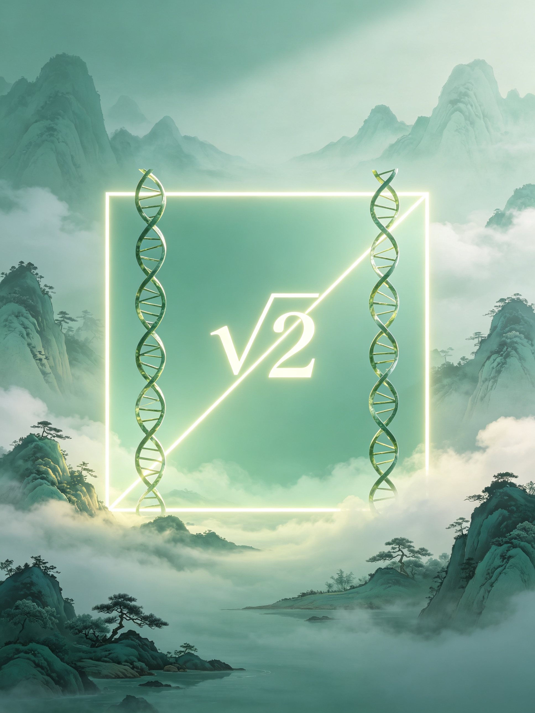

<ArchiveCopyPanel article-id="162249580" />

{"markdown":"PiDliIbnsbvvvJrmlofmmI7ov5vpmLYyMDDorrIgIAo+IOe8luWPt++8mmAxNjIyNDk1ODBgICAKPiDljp/lp4vmlofku7bvvJpg5LqM5qyh5qC55byP5LiN5Y+q5piv5byA5pa56L+Q566X5piv5Z6C55u05Y+M6J665peL5aSp54S26YWN5q+U55qE5Z+656GA5Y6f55Sf5pWw5YC8LeWFqOWfn+aVsOWtpnZz5Lyg57uf5pWw5a2m5Lq657G75paH5piO6L+b6Zi2MjAw6K6y56ysLTE2MjI0OTU4MC5tZGAgIAo+IOi/lOWbnu+8mlvmnKzkuablvZLmoaNdKC96aC9ib29rcy9jb3Vyc2UvYXJ0aWNsZXMvKSDCtyBb5oC75YWl5Y+jXSgvemgvYm9va3MvYXJ0aWNsZXMvKQoKIVvnrKw0MOiusuWwgemdol0oLi9hc3NldHMvY3NkbmltZy9qcGcvMjAzOTE3MjRmYmE4YmRlYS5qcGcpCgrkvZzogIXvvJog5LmW5LmW5pWw5a2mCgojIyDjgIrlhajln5/mlbDlraZ2c+S8oOe7n+aVsOWtpu+8muS6uuexu+aWh+aYjui/m+mYtjIwMOiusuOAi+esrDQw6K6yIOS4reWtpumAmuS/l+eJiOmAkOWtl+eovwoKLS0tCgrorrLmrKHvvJog56ysNDDorrIKCuS4u+mimO+8miDkuozmrKHmoLnlvI/kuI3lj6rmmK/lvIDmlrnov5DnrpfvvIzmmK/lnoLnm7Tlj4zonrrml4vlpKnnhLbphY3mr5TnmoTln7rnoYDljp/nlJ/mlbDlgLwKCuWvueagh+ivvuacrOefpeivhueCue+8miDkuozmrKHmoLnlvI/jgIHmoLnlj7fljJbnroAKCuaWh+mjju+8miDlpKfnmb3or53jgIHml6DmmabmtqnkuJPkuJror43msYfvvIzlu7bnu60wLzHln7rngrnjgIHlj4zonrrml4vlhajlpZfmr5TllrsKCi0tLQoKIyMjIDDvvZ4z5YiG6ZKfIOWkjeS5oOWvvOWFpQoKIVvlpI3kuaDlr7zlhaVdKC4vYXNzZXRzL2NzZG5pbWcvanBnL2Q1MzUzYTE5ODgyZTA4MjQuanBnKQoK5ZCM5a2m5Lus77yM5LiK5LiA6IqC6K++5oiR5Lus5piO55m95LqG5bmz6Z2i55u06KeS5Z2Q5qCH57O755qE5pys5rqQ77yM5a6D5LiN5piv57q45LiK5Lq65bel55S755qE5pa55qC85Yi75bqm77yM5piv5oiq5Y+W56uL5L2T56m66Ze05YGa5Ye65p2l55qE5LqM57u06KeC5rWL56qX5Y+j77yM5omA5pyJ54K544CB57q/5p2h6YO95piv56uL5L2T5Y+M6J665peL5oqV5bCE5Zyo5bmz6Z2i5LiK55qE5b2x5YOP44CCCgrliJ3kuK3ku6PmlbDpopHnuYHlh7rnjrDkuozmrKHmoLnlvI/vvIzogIHluIjlkYror4nmiJHku6zvvIzmoLnlj7flsLHmmK/lubPmlrnnmoTlj43lkJHorqHnrpfvvIzmiorkuI3og73lvIDmiJDmlbTmlbDnmoTmlbDlhpnmiJDmoLnlj7flvaLlvI/vvIzlj6rmmK/ljJbnroDjgIHorqHnrpfnmoTlt6XlhbfjgIIKCuS7iuWkqeaIkeS7rOaNouacrOa6kOinhuinku+8muagueWPt+aVsOWtl+S4jeaYr+S6uuS4uuWBmueahOWPjeWQkei/kOeul+S6p+eJqe+8jOaYr+S7jjDln7rngrnliIblh7rnmoTkuKTmnaHlnoLnm7Tlj4zonrrml4vvvIzlpKnnhLblvaLmiJDnmoTlm7rlrprphY3mr5Tln7rlh4bmlbDvvIzml6DnkIbmlbDlpKflpJrpg73mnaXoh6rov5nnsbvlnoLnm7Tonrrml4vnmoTnlJ/plb/mkK3phY3jgIIKCi0tLQoKIyMjIDPvvZ4xM+WIhumSnyDnlJ/mtLvljJbnsbvmr5TorrLop6MKCuWFiOiusuivvuacrOmHjOS6jOasoeagueW8j+eahOWumuS5ie+8mgoK5LiA5Liq5pWw55qE5bmz5pa5562J5LqO6KKr5byA5pa55pWw77yM6L+Z5Liq5pWw5bCx5piv5a6D55qE5bmz5pa55qC577yM5bim5qC55Y+355qE5byP5a2Q5Y+r5LqM5qyh5qC55byP77yM5YGa6aKY5pe25YyW566A44CB5YiG5q+N5pyJ55CG5YyW77yM55So5p2l566A5YyW566X5byP44CCCgrmlL7liLDlj4zonrrml4vnlJ/plb/kvZPns7vph4zvvJoKCiFb5Y+M6J665peL55Sf6ZW/5L2T57O7XSguL2Fzc2V0cy9jc2RuaW1nL2pwZy9kOTRkNzkwYmI2YTg1OGYyLmpwZykKCjDln7rngrnliIblh7rmqKrlkJHjgIHnurXlkJHkuKTmnaHlnoLnm7TnlJ/plb/ohInnu5zvvIzkuKTmnaHonrrml4vlkIToh6rlu7bkvLjkuIDmrrXplb/luqblkI7vvIzkuKTnq6/ov57nur/nmoTmlpzovrnohInnu5zmlbDlgLzvvIzlvojlpJrml7blgJnml6Dms5Xop4TmlbTnrYnliIbvvIzlsLHlvaLmiJDluKbmoLnlj7fnmoTljp/nlJ/mlbDlgLzjgIIKCuagueWPt+acrOi0qOaYr+eUqOadpeagh+azqOWeguebtOWPjOieuuaXi+mFjeWvueS6p+eUn+eahOWfuuehgOWfuuWHhumHj++8jDJcc3FydCYjMTIzOzImIzEyNTsy4oCL44CBM1xzcXJ0JiMxMjM7MyYjMTI1OzPigIvjgIE1XHNxcnQmIzEyMzs1JiMxMjU7NeKAi+WIhuWIq+WvueW6lOS4jeWQjOWeguebtOmFjeavlOeahOieuuaXi+WOn+eUn+W4uOaVsOOAggoK5YyW566A5qC55byP77yM5bCx5piv5ouG5YiG5aSa5bGC5Y+g5Yqg55qE6J665peL6ISJ57uc77yM5oqK5a6M5pW055Sf6ZW/57uT5p6E5ouG5oiQ5pyA566A5Z+656GA6J665peL5Y2V5YWD44CCCgrkuL7nroDljZXkvovlrZDvvJoKCiFb5qC55byP5Yeg5L2V56S65oSPXSguL2Fzc2V0cy9jc2RuaW1nL2pwZy9mMmZiNzFlZGFmMGZlNjM2LmpwZykKCuivvuacrOinhuinku+8mjg9MjJcc3FydCYjMTIzOzgmIzEyNTs9MlxzcXJ0JiMxMjM7MiYjMTI1OzjigIs9MjLigIvvvIzlj6rmmK/lvIDmlrnljJbnroDorqHnrpfjgIIKCuWFqOWfn+mAmuS/l+ino+ivu++8mjhcc3FydCYjMTIzOzgmIzEyNTs44oCL5a+55bqU55qE5Z6C55u06J665peL5piv5aSa5bGC5Y+g5Yqg57uT5p6E77yM5ouG5YiG5ZCO5Z+656GA5Y2V5YWD5pivMlxzcXJ0JiMxMjM7MiYjMTI1OzLigIvvvIwyMjLku6Pooajlj6DliqDlsYLmlbDvvJsyXHNxcnQmIzEyMzsyJiMxMjU7MuKAi+aYr+aoquerluieuuaXi+mVv+W6pjE6MTE6MTE6MeWeguebtOmFjeWvueWkqeeUn+iHquW4pueahOWfuuWHhuaVsOWAvO+8jOS4jeaYr+iuoeeul+WHuuadpeeahOWwj+aVsOOAggoK6K++5pys5Y+q5oqK5qC55Y+35b2T5oiQ5Y+N5ZCR6K6h566X56ym5Y+377yM55yL5LiN6KeB5qC55byP6IOM5ZCO5piv5Z6C55u05Y+M6J665peL5pCt6YWN5Lqn55Sf55qE5Y6f55Sf5Zu65a6a6YWN5q+U44CCCgotLS0KCiMjIyAxM++9njIy5YiG6ZKfIOivvuacrOingueCuSB2cyDlhajln5/mlbDlrabpgJrkv5fop4LngrkKCiFb6K++5pysdnPlhajln5/lr7nmr5RdKC4vYXNzZXRzL2NzZG5pbWcvanBnLzQxZmI5ZDkwMDBlOWM1MTYuanBnKQoKIyMjIyDkvKDnu5/or77mnKzorqTnn6UKCi0gCgrkuozmrKHmoLnlvI/lj6rmmK/lubPmlrnnmoTpgIbov5DnrpfnrKblj7fvvIzku4XnlKjkuo7nrpflvI/ljJbnroAKCi0gCgrluKbmoLnlj7fmlbDlrZfmmK/nibnmrormrovnvLrlsI/mlbDvvIznkIbmg7PmlbDlrZfmmK/mlbTmlbDjgIHliIbmlbAKCi0gCgrmoLnlvI/ljJbnroDlj6rmmK/kurrkuLrmi4bliIbmlbDlrZfmioDlt6fvvIzlkozonrrml4vnlJ/plb/nu5PmnoTml6DlhbMKCiMjIyMg5YWo5Z+f5pWw5a2m6YCa5L+X6K6k55+lCgotIAoK5LqM5qyh5qC55byP5a+55bqU5Z6C55u05Y+M6J665peL5aSp54S26YWN5q+U5Z+65YeG77yM5piv5pWw5a2X5L2T57O75Y6f55Sf5Z+656GA5pWw5YC877yM5ZKM5pW05pWw5ZCM562J6YeN6KaBCgotIAoK6KKr5byA5pa55pWw5Luj6KGo5aSa5bGC5Y+g5Yqg55qE6J665peL5oC76YeP77yM5YyW566A5qC55byP5bCx5piv5Yml56a75Y+g5Yqg5bGC77yM6L+Y5Y6f5pyA5Z+656GA5Z6C55u06J665peL5Y2V5YWDCgotIAoK5Yeg5L2V5pac6L6544CB5LiJ6KeS5Ye95pWw5bi45pWw44CB56m66Ze06Led56a777yM5YWo6YOo5L6d5omY5qC55byP5a+55bqU55qE5Z6C55u06J665peL6YWN5q+U55Sf5oiQCgrnroDljZXmr5TllrvvvJoKCuivvuacrOeahOagueWPt+WmguWQjOWNlee6r+eahOmZpOazleWPjeWQkeiuoeeul+espuWPt++8mwoK5pys5rqQ5qC55byP5aaC5ZCM5Z6C55u05p6d5bmy5aSp55Sf55qE5Zu65a6a6ZW/5bqm5q+U5YC877yM5piv57uT5p6E6Ieq5bim77yM5LiN5piv5Lq65Li66L+Q566X5Yib6YCg44CCCgotLS0KCiMjIyAyMu+9njI35YiG6ZKfIOagoeWGheWtpuS5oOaPkOmGku+8jOS4jeW9seWTjeiAg+ivleW+l+WIhgoK5qC55byP5YyW566A44CB5YiG5q+N5pyJ55CG5YyW44CB5qC55byP5Yqg5YeP5LmY6Zmk6K6h566X6aKY77yM5Lil5qC85oyJ54Wn6K++5pys6KeE5YiZ6Kej6aKY77yM6ICD6K+V5LiN5Lya5omj5YiG44CCCgrmnKzoioLor77lj6rmmK/mi5PlsZXpq5jnu7TorqTnn6XvvJrkuozmrKHmoLnlvI/lr7nlupTlnoLnm7Tlj4zonrrml4vlpKnnhLbphY3mr5Tln7rlh4bvvIzmoLnlj7fmlbDlrZfmmK/nq4vkvZPnqbrpl7Tnu5PmnoToh6rluKbnmoTljp/nlJ/mlbDlgLzjgIIKCiFb5LyP56yU6ZO65Z6rXSguL2Fzc2V0cy9jc2RuaW1nL2pwZy85ZGZlMmVmMzUyMDYwNDY5LmpwZykKCuS8j+eslOmTuuWeq++8miDnrKw1MOiusuS4reWtpue7k+S4muS4k+Wcuu+8jOaVtOWQiDI24oCTNTDorrLlhajpg6jkuK3lrabku6PmlbDjgIHlh6DkvZXjgIHlh73mlbDjgIHnu5/orqHnn6Xor4bngrnvvIzlrozmlbTmorPnkIbkuK3lrablhajpg6jmlbDnkIblr7nlupTnmoQwLzEv4oie5LiJ5p6B5pys5rqQ5LiO5Y+M6J665peL55Sf6ZW/6YC76L6R44CCCgotLS0KCiMjIyAyN++9njMw5YiG6ZKfIOivvuWgguaAu+e7kyvkuIvoioLor77pooTlkYoKCuacrOiKguivvuWwj+e7k++8mgoK5LqM5qyh5qC55byP5rqQ5LqOMOWfuueCueWeguebtOWPjOieuuaXi+eahOWkqeeEtumVv+W6pumFjeavlO+8jOWMlueugOagueW8j+aYr+WJpeemu+WkmuWxguWPoOWKoOiEiee7nO+8jOi/mOWOn+WfuuehgOWOn+eUn+ieuuaXi+WNleWFg+OAggoK5LiL5LiA6IqC6K++77yaIOWkmui+ueW9ouWGheinkuWSjOS4jeaYr+WbuuWumuiuoeeul+WFrOW8j++8jOaYr+eOr+e7leWfuueCueieuuaXi+aXi+i9rOeahOaAu+i1t+S8j+inkuW6puaAu+WSjOOAggoKIVvniYflsL7mlLblsL5dKC4vYXNzZXRzL2NzZG5pbWcvanBnL2RjOWNkMzZiNTNmNmUzOTQuanBnKQo=","text":"5YiG57G777ya5paH5piO6L+b6Zi2MjAw6K6yICAK57yW5Y+377yaMTYyMjQ5NTgwICAK5Y6f5aeL5paH5Lu277ya5LqM5qyh5qC55byP5LiN5Y+q5piv5byA5pa56L+Q566X5piv5Z6C55u05Y+M6J665peL5aSp54S26YWN5q+U55qE5Z+656GA5Y6f55Sf5pWw5YC8LeWFqOWfn+aVsOWtpnZz5Lyg57uf5pWw5a2m5Lq657G75paH5piO6L+b6Zi2MjAw6K6y56ysLTE2MjI0OTU4MC5tZCAgCui/lOWbnu+8muacrOS5puW9kuahoyDCtyDmgLvlhaXlj6MKCuesrDQw6K6y5bCB6Z2iCgrkvZzogIXvvJog5LmW5LmW5pWw5a2mCgrjgIrlhajln5/mlbDlraZ2c+S8oOe7n+aVsOWtpu+8muS6uuexu+aWh+aYjui/m+mYtjIwMOiusuOAi+esrDQw6K6yIOS4reWtpumAmuS/l+eJiOmAkOWtl+eovwoKLS0tCgrorrLmrKHvvJog56ysNDDorrIKCuS4u+mimO+8miDkuozmrKHmoLnlvI/kuI3lj6rmmK/lvIDmlrnov5DnrpfvvIzmmK/lnoLnm7Tlj4zonrrml4vlpKnnhLbphY3mr5TnmoTln7rnoYDljp/nlJ/mlbDlgLwKCuWvueagh+ivvuacrOefpeivhueCue+8miDkuozmrKHmoLnlvI/jgIHmoLnlj7fljJbnroAKCuaWh+mjju+8miDlpKfnmb3or53jgIHml6DmmabmtqnkuJPkuJror43msYfvvIzlu7bnu60wLzHln7rngrnjgIHlj4zonrrml4vlhajlpZfmr5TllrsKCi0tLQoKMO+9njPliIbpkp8g5aSN5Lmg5a+85YWlCgrlpI3kuaDlr7zlhaUKCuWQjOWtpuS7rO+8jOS4iuS4gOiKguivvuaIkeS7rOaYjueZveS6huW5s+mdouebtOinkuWdkOagh+ezu+eahOacrOa6kO+8jOWug+S4jeaYr+e6uOS4iuS6uuW3peeUu+eahOaWueagvOWIu+W6pu+8jOaYr+aIquWPlueri+S9k+epuumXtOWBmuWHuuadpeeahOS6jOe7tOingua1i+eql+WPo++8jOaJgOacieeCueOAgee6v+adoemDveaYr+eri+S9k+WPjOieuuaXi+aKleWwhOWcqOW5s+mdouS4iueahOW9seWDj+OAggoK5Yid5Lit5Luj5pWw6aKR57mB5Ye6546w5LqM5qyh5qC55byP77yM6ICB5biI5ZGK6K+J5oiR5Lus77yM5qC55Y+35bCx5piv5bmz5pa555qE5Y+N5ZCR6K6h566X77yM5oqK5LiN6IO95byA5oiQ5pW05pWw55qE5pWw5YaZ5oiQ5qC55Y+35b2i5byP77yM5Y+q5piv5YyW566A44CB6K6h566X55qE5bel5YW344CCCgrku4rlpKnmiJHku6zmjaLmnKzmupDop4bop5LvvJrmoLnlj7fmlbDlrZfkuI3mmK/kurrkuLrlgZrnmoTlj43lkJHov5DnrpfkuqfnianvvIzmmK/ku44w5Z+654K55YiG5Ye655qE5Lik5p2h5Z6C55u05Y+M6J665peL77yM5aSp54S25b2i5oiQ55qE5Zu65a6a6YWN5q+U5Z+65YeG5pWw77yM5peg55CG5pWw5aSn5aSa6YO95p2l6Ieq6L+Z57G75Z6C55u06J665peL55qE55Sf6ZW/5pCt6YWN44CCCgotLS0KCjPvvZ4xM+WIhumSnyDnlJ/mtLvljJbnsbvmr5TorrLop6MKCuWFiOiusuivvuacrOmHjOS6jOasoeagueW8j+eahOWumuS5ie+8mgoK5LiA5Liq5pWw55qE5bmz5pa5562J5LqO6KKr5byA5pa55pWw77yM6L+Z5Liq5pWw5bCx5piv5a6D55qE5bmz5pa55qC577yM5bim5qC55Y+355qE5byP5a2Q5Y+r5LqM5qyh5qC55byP77yM5YGa6aKY5pe25YyW566A44CB5YiG5q+N5pyJ55CG5YyW77yM55So5p2l566A5YyW566X5byP44CCCgrmlL7liLDlj4zonrrml4vnlJ/plb/kvZPns7vph4zvvJoKCuWPjOieuuaXi+eUn+mVv+S9k+ezuwoKMOWfuueCueWIhuWHuuaoquWQkeOAgee6teWQkeS4pOadoeWeguebtOeUn+mVv+iEiee7nO+8jOS4pOadoeieuuaXi+WQhOiHquW7tuS8uOS4gOautemVv+W6puWQju+8jOS4pOerr+i/nue6v+eahOaWnOi+ueiEiee7nOaVsOWAvO+8jOW+iOWkmuaXtuWAmeaXoOazleinhOaVtOetieWIhu+8jOWwseW9ouaIkOW4puagueWPt+eahOWOn+eUn+aVsOWAvOOAggoK5qC55Y+35pys6LSo5piv55So5p2l5qCH5rOo5Z6C55u05Y+M6J665peL6YWN5a+55Lqn55Sf55qE5Z+656GA5Z+65YeG6YeP77yMMlxzcXJ0ezJ9MuKAi+OAgTNcc3FydHszfTPigIvjgIE1XHNxcnR7NX014oCL5YiG5Yir5a+55bqU5LiN5ZCM5Z6C55u06YWN5q+U55qE6J665peL5Y6f55Sf5bi45pWw44CCCgrljJbnroDmoLnlvI/vvIzlsLHmmK/mi4bliIblpJrlsYLlj6DliqDnmoTonrrml4vohInnu5zvvIzmiorlrozmlbTnlJ/plb/nu5PmnoTmi4bmiJDmnIDnroDln7rnoYDonrrml4vljZXlhYPjgIIKCuS4vueugOWNleS+i+WtkO+8mgoK5qC55byP5Yeg5L2V56S65oSPCgror77mnKzop4bop5LvvJo4PTIyXHNxcnR7OH09MlxzcXJ0ezJ9OOKAiz0yMuKAi++8jOWPquaYr+W8gOaWueWMlueugOiuoeeul+OAggoK5YWo5Z+f6YCa5L+X6Kej6K+777yaOFxzcXJ0ezh9OOKAi+WvueW6lOeahOWeguebtOieuuaXi+aYr+WkmuWxguWPoOWKoOe7k+aehO+8jOaLhuWIhuWQjuWfuuehgOWNleWFg+aYrzJcc3FydHsyfTLigIvvvIwyMjLku6Pooajlj6DliqDlsYLmlbDvvJsyXHNxcnR7Mn0y4oCL5piv5qiq56uW6J665peL6ZW/5bqmMToxMToxMTox5Z6C55u06YWN5a+55aSp55Sf6Ieq5bim55qE5Z+65YeG5pWw5YC877yM5LiN5piv6K6h566X5Ye65p2l55qE5bCP5pWw44CCCgror77mnKzlj6rmiormoLnlj7flvZPmiJDlj43lkJHorqHnrpfnrKblj7fvvIznnIvkuI3op4HmoLnlvI/og4zlkI7mmK/lnoLnm7Tlj4zonrrml4vmkK3phY3kuqfnlJ/nmoTljp/nlJ/lm7rlrprphY3mr5TjgIIKCi0tLQoKMTPvvZ4yMuWIhumSnyDor77mnKzop4LngrkgdnMg5YWo5Z+f5pWw5a2m6YCa5L+X6KeC54K5Cgror77mnKx2c+WFqOWfn+WvueavlAoK5Lyg57uf6K++5pys6K6k55+lCuS6jOasoeagueW8j+WPquaYr+W5s+aWueeahOmAhui/kOeul+espuWPt++8jOS7heeUqOS6jueul+W8j+WMlueugArluKbmoLnlj7fmlbDlrZfmmK/nibnmrormrovnvLrlsI/mlbDvvIznkIbmg7PmlbDlrZfmmK/mlbTmlbDjgIHliIbmlbAK5qC55byP5YyW566A5Y+q5piv5Lq65Li65ouG5YiG5pWw5a2X5oqA5ben77yM5ZKM6J665peL55Sf6ZW/57uT5p6E5peg5YWzCgrlhajln5/mlbDlrabpgJrkv5forqTnn6UK5LqM5qyh5qC55byP5a+55bqU5Z6C55u05Y+M6J665peL5aSp54S26YWN5q+U5Z+65YeG77yM5piv5pWw5a2X5L2T57O75Y6f55Sf5Z+656GA5pWw5YC877yM5ZKM5pW05pWw5ZCM562J6YeN6KaBCuiiq+W8gOaWueaVsOS7o+ihqOWkmuWxguWPoOWKoOeahOieuuaXi+aAu+mHj++8jOWMlueugOagueW8j+WwseaYr+WJpeemu+WPoOWKoOWxgu+8jOi/mOWOn+acgOWfuuehgOWeguebtOieuuaXi+WNleWFgwrlh6DkvZXmlpzovrnjgIHkuInop5Llh73mlbDluLjmlbDjgIHnqbrpl7Tot53nprvvvIzlhajpg6jkvp3miZjmoLnlvI/lr7nlupTnmoTlnoLnm7Tonrrml4vphY3mr5TnlJ/miJAKCueugOWNleavlOWWu++8mgoK6K++5pys55qE5qC55Y+35aaC5ZCM5Y2V57qv55qE6Zmk5rOV5Y+N5ZCR6K6h566X56ym5Y+377ybCgrmnKzmupDmoLnlvI/lpoLlkIzlnoLnm7Tmnp3lubLlpKnnlJ/nmoTlm7rlrprplb/luqbmr5TlgLzvvIzmmK/nu5PmnoToh6rluKbvvIzkuI3mmK/kurrkuLrov5DnrpfliJvpgKDjgIIKCi0tLQoKMjLvvZ4yN+WIhumSnyDmoKHlhoXlrabkuaDmj5DphpLvvIzkuI3lvbHlk43ogIPor5XlvpfliIYKCuagueW8j+WMlueugOOAgeWIhuavjeacieeQhuWMluOAgeagueW8j+WKoOWHj+S5mOmZpOiuoeeul+mimO+8jOS4peagvOaMieeFp+ivvuacrOinhOWImeino+mimO+8jOiAg+ivleS4jeS8muaJo+WIhuOAggoK5pys6IqC6K++5Y+q5piv5ouT5bGV6auY57u06K6k55+l77ya5LqM5qyh5qC55byP5a+55bqU5Z6C55u05Y+M6J665peL5aSp54S26YWN5q+U5Z+65YeG77yM5qC55Y+35pWw5a2X5piv56uL5L2T56m66Ze057uT5p6E6Ieq5bim55qE5Y6f55Sf5pWw5YC844CCCgrkvI/nrJTpk7rlnqsKCuS8j+eslOmTuuWeq++8miDnrKw1MOiusuS4reWtpue7k+S4muS4k+Wcuu+8jOaVtOWQiDI24oCTNTDorrLlhajpg6jkuK3lrabku6PmlbDjgIHlh6DkvZXjgIHlh73mlbDjgIHnu5/orqHnn6Xor4bngrnvvIzlrozmlbTmorPnkIbkuK3lrablhajpg6jmlbDnkIblr7nlupTnmoQwLzEv4oie5LiJ5p6B5pys5rqQ5LiO5Y+M6J665peL55Sf6ZW/6YC76L6R44CCCgotLS0KCjI3772eMzDliIbpkp8g6K++5aCC5oC757uTK+S4i+iKguivvumihOWRigoK5pys6IqC6K++5bCP57uT77yaCgrkuozmrKHmoLnlvI/mupDkuo4w5Z+654K55Z6C55u05Y+M6J665peL55qE5aSp54S26ZW/5bqm6YWN5q+U77yM5YyW566A5qC55byP5piv5Yml56a75aSa5bGC5Y+g5Yqg6ISJ57uc77yM6L+Y5Y6f5Z+656GA5Y6f55Sf6J665peL5Y2V5YWD44CCCgrkuIvkuIDoioLor77vvJog5aSa6L655b2i5YaF6KeS5ZKM5LiN5piv5Zu65a6a6K6h566X5YWs5byP77yM5piv546v57uV5Z+654K56J665peL5peL6L2s55qE5oC76LW35LyP6KeS5bqm5oC75ZKM44CCCgrniYflsL7mlLblsL4="}

> 分类：文明进阶200讲  
> 编号：`162249580`  
> 原始文件：`二次根式不只是开方运算是垂直双螺旋天然配比的基础原生数值-全域数学vs传统数学人类文明进阶200讲第-162249580.md`  
> 返回：[本书归档](/zh/books/course/articles/) · [总入口](/zh/books/articles/)

<ArticlePaperMeta category="文明进阶200讲" article-id="162249580" title="二次根式不只是开方运算是垂直双螺旋天然配比的基础原生数值-全域数学vs传统数学人类文明进阶200讲第" paper-kind="课程讲义" book-route="/zh/books/course/articles/" overview-route="/zh/books/articles/" summary="对标课本知识点： 二次根式、根号化简" author="乖乖数学" lecture="第40讲" theme="二次根式不只是开方运算，是垂直双螺旋天然配比的基础原生数值" source-file="二次根式不只是开方运算是垂直双螺旋天然配比的基础原生数值-全域数学vs传统数学人类文明进阶200讲第-162249580.md" cover="./assets/csdnimg/jpg/20391724fba8bdea.jpg" />

作者： 乖乖数学

## 《全域数学vs传统数学：人类文明进阶200讲》第40讲 中学通俗版逐字稿

---

讲次： 第40讲

主题： 二次根式不只是开方运算，是垂直双螺旋天然配比的基础原生数值

对标课本知识点： 二次根式、根号化简

文风： 大白话、无晦涩专业词汇，延续0/1基点、双螺旋全套比喻

---

### 0～3分钟 复习导入

同学们，上一节课我们明白了平面直角坐标系的本源，它不是纸上人工画的方格刻度，是截取立体空间做出来的二维观测窗口，所有点、线条都是立体双螺旋投射在平面上的影像。

初中代数频繁出现二次根式，老师告诉我们，根号就是平方的反向计算，把不能开成整数的数写成根号形式，只是化简、计算的工具。

今天我们换本源视角：根号数字不是人为做的反向运算产物，是从0基点分出的两条垂直双螺旋，天然形成的固定配比基准数，无理数大多都来自这类垂直螺旋的生长搭配。

---

### 3～13分钟 生活化类比讲解

先讲课本里二次根式的定义：

一个数的平方等于被开方数，这个数就是它的平方根，带根号的式子叫二次根式，做题时化简、分母有理化，用来简化算式。

放到双螺旋生长体系里：

0基点分出横向、纵向两条垂直生长脉络，两条螺旋各自延伸一段长度后，两端连线的斜边脉络数值，很多时候无法规整等分，就形成带根号的原生数值。

根号本质是用来标注垂直双螺旋配对产生的基础基准量，2\sqrt&#123;2&#125;2​、3\sqrt&#123;3&#125;3​、5\sqrt&#123;5&#125;5​分别对应不同垂直配比的螺旋原生常数。

化简根式，就是拆分多层叠加的螺旋脉络，把完整生长结构拆成最简基础螺旋单元。

举简单例子：

课本视角：8=22\sqrt&#123;8&#125;=2\sqrt&#123;2&#125;8​=22​，只是开方化简计算。

全域通俗解读：8\sqrt&#123;8&#125;8​对应的垂直螺旋是多层叠加结构，拆分后基础单元是2\sqrt&#123;2&#125;2​，222代表叠加层数；2\sqrt&#123;2&#125;2​是横竖螺旋长度1:11:11:1垂直配对天生自带的基准数值，不是计算出来的小数。

课本只把根号当成反向计算符号，看不见根式背后是垂直双螺旋搭配产生的原生固定配比。

---

### 13～22分钟 课本观点 vs 全域数学通俗观点

#### 传统课本认知

- 

二次根式只是平方的逆运算符号，仅用于算式化简

- 

带根号数字是特殊残缺小数，理想数字是整数、分数

- 

根式化简只是人为拆分数字技巧，和螺旋生长结构无关

#### 全域数学通俗认知

- 

二次根式对应垂直双螺旋天然配比基准，是数字体系原生基础数值，和整数同等重要

- 

被开方数代表多层叠加的螺旋总量，化简根式就是剥离叠加层，还原最基础垂直螺旋单元

- 

几何斜边、三角函数常数、空间距离，全部依托根式对应的垂直螺旋配比生成

简单比喻：

课本的根号如同单纯的除法反向计算符号；

本源根式如同垂直枝干天生的固定长度比值，是结构自带，不是人为运算创造。

---

### 22～27分钟 校内学习提醒，不影响考试得分

根式化简、分母有理化、根式加减乘除计算题，严格按照课本规则解题，考试不会扣分。

本节课只是拓展高维认知：二次根式对应垂直双螺旋天然配比基准，根号数字是立体空间结构自带的原生数值。

伏笔铺垫： 第50讲中学结业专场，整合26–50讲全部中学代数、几何、函数、统计知识点，完整梳理中学全部数理对应的0/1/∞三极本源与双螺旋生长逻辑。

---

### 27～30分钟 课堂总结+下节课预告

本节课小结：

二次根式源于0基点垂直双螺旋的天然长度配比，化简根式是剥离多层叠加脉络，还原基础原生螺旋单元。

下一节课： 多边形内角和不是固定计算公式，是环绕基点螺旋旋转的总起伏角度总和。

