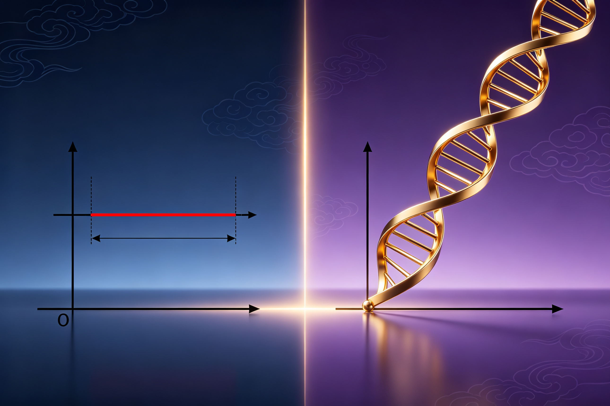

<ArchiveCopyPanel article-id="162282108" />

{"markdown":"PiDliIbnsbvvvJrmlofmmI7ov5vpmLYyMDDorrIgIAo+IOe8luWPt++8mmAxNjIyODIxMDhgICAKPiDljp/lp4vmlofku7bvvJpg5LiA5qyh5LiN562J5byP5LiN5piv6IyD5Zu06ZmQ5Yi2566X5byP5piv5Y+M6J665peL55Sf6ZW/6L2o6L+55Zyo6Zu25Z+65YeG5Y2V5L6n5bu25Ly455qE5Yy66Ze05b2i5oCBLeWFqOWfn+aVsOWtpnZz5Lyg57uf5pWw5a2m5Lq657G75paH5piO6L+bLTE2MjI4MjEwOC5tZGAgIAo+IOi/lOWbnu+8mlvmnKzkuablvZLmoaNdKC96aC9ib29rcy9jb3Vyc2UvYXJ0aWNsZXMvKSDCtyBb5oC75YWl5Y+jXSgvemgvYm9va3MvYXJ0aWNsZXMvKQoKIVvnrKw0NOiusuWwgemdol0oLi9hc3NldHMvY3NkbmltZy9qcGcvYjVmYWIyMmY1ZTg3ZmFkNy5qcGcpCgrkvZzogIXvvJog5LmW5LmW5pWw5a2mCgojIyDjgIrlhajln5/mlbDlraZ2c+S8oOe7n+aVsOWtpu+8muS6uuexu+aWh+aYjui/m+mYtjIwMOiusuOAi+esrDQ06K6yIOS4reWtpumAmuS/l+eJiOmAkOWtl+eovwoKLS0tCgrorrLmrKHvvJog56ysNDTorrIKCuS4u+mimO+8miDkuIDmrKHkuI3nrYnlvI/kuI3mmK/ojIPlm7TpmZDliLbnrpflvI/vvIzmmK/lj4zonrrml4vnlJ/plb/ovajov7nlnKjpm7bln7rlh4bljZXkvqflu7bkvLjnmoTljLrpl7TlvaLmgIEKCuWvueagh+ivvuacrOefpeivhueCue+8miDkuIDlhYPkuIDmrKHkuI3nrYnlvI/jgIHkuI3nrYnlvI/op6Ppm4YKCuaWh+mjju+8miDlpKfnmb3or53jgIHml6DmmabmtqnkuJPkuJror43msYfvvIzlu7bnu60wLzHln7rngrnjgIHlj4zonrrml4vlhajlpZfmr5TllrsKCi0tLQoKIyMjIDDvvZ4z5YiG6ZKfIOWkjeS5oOWvvOWFpQoKIVvlpI3kuaDlr7zlhaVdKC4vYXNzZXRzL2NzZG5pbWcvanBnLzY2NjQ5NmIxZmJkMzM5M2MuanBnKQoK5ZCM5a2m5Lus77yM5LiK5LiA6IqC6K++5oiR5Lus5ZCD6YCP5LqG6L205a+556ew5LiO5Lit5b+D5a+556ew55qE5pys5rqQ77yM5LqM6ICF5LiN5piv57q45LiK5Zu+5b2i5oqY5Y+g5ZCO55qE6KeG6KeJ5pWI5p6c77yM5qC55rqQ5pivMOWfuueCueWIhuWMluWHuuaIkOWvueWQjOatpeeUn+mVv+eahOWPjOieuuaXi++8jOWvueensOaYr+S4h+eJqeeUn+mVv+iHquW4pueahOW6leWxguinhOWImeOAggoK5Yid5Lit5Luj5pWw6YeN6KaB5YaF5a655LiA5YWD5LiA5qyh5LiN562J5byP77yM6ICB5biI5Lya5ZGK6K+J5oiR5Lus77ya5LiN562J5Y+35Luj6KGo5pWw5YC85aSn5bCP5Yy65Yir77yM6Kej6ZuG5piv5LiA5q616L+e57ut5pWw5a2X6IyD5Zu077yM5Y+q5piv55So5p2l562b6YCJ56ym5ZCI5p2h5Lu25pWw5a2X55qE6K6h566X5bel5YW344CCCgrku4rlpKnmiJHku6zmi4npq5jnu7TluqbnnIvmuIXmnKzotKjvvJrkuI3nrYnlvI/kuI3mmK/kurrkuLrliJLlrprnmoTmlbDlrZfpl6jmp5vvvIzmmK/lubPnm7Tlj4zonrrml4vnlJ/plb/ovajov7nlj6rmiKrlj5bpm7bngrnkuIDkvqfljLrpl7TvvIzlvaLmiJDnmoTljZXkvqfnlJ/plb/ljLrln5/vvIzop6Ppm4blsLHmmK/onrrml4vljZXkvqflu7bkvLjlrozmlbTohInnu5zjgIIKCi0tLQoKIyMjIDPvvZ4xM+WIhumSnyDnlJ/mtLvljJbnsbvmr5TorrLop6MKCiFb55Sf5rS75YyW57G75q+UXSguL2Fzc2V0cy9jc2RuaW1nL2pwZy85ZTc4NWRiNTliMmU0ZWM0LmpwZykKCuWFiOiusuivvuacrOmHjOeahOS4jeetieW8j+mAu+i+ke+8mgoK5pS+5Yiw5Y+M6J665peL55Sf6ZW/5L2T57O76YeM77yaCgrkuIDmrKHlh73mlbDlr7nlupTmlbTmnaHml6DpmZDlu7bkvLjnmoTlubPnm7Tonrrml4vvvJsKCuetieW8j+aYr+mUgeWumuieuuaXi+S4jjDln7rlh4bnur/nm7jkuqTnmoTljZXkuIDkuqTngrnvvJsKCuS4jeetieW8j+aYr+iIjeW8g+S6pOeCueWPpuS4gOS+p+eahOieuuaXi+iEiee7nO+8jOWPquS/neeVmeWNleS+p+aMgee7reW7tuS8uOeahOmDqOWIhu+8jOaVsOi9tOS4iueUu+WHuueahOWMuumXtO+8jOWwseaYr+S/neeVmeS4i+adpeeahOWNleS+p+ieuuaXi+eUn+mVv+i9qOi/ueOAggoK5LiN562J5Y+35pa55ZCR77yM5Luj6KGo5oiR5Lus6YCJ5Y+W6J665peL5bem5q616L+Y5piv5Y+z5q6177yb5a6e5b+D54K544CB56m65b+D54K55a+55bqU5piv5ZCm5YyF5ZCr6J665peL5LiO5Z+65YeG57q/5Lqk5rGH55qE5Z+654K544CCCgrkuL7nroDljZXkvovlrZDvvJoKCuivvuacrOinhuinku+8mjJ44oiSND4wMngtND4wMnjiiJI0PjDvvIzop6Ppm4Z4PjJ4PjJ4PjLvvIzlj6rmmK/lpKfkuo4y55qE5omA5pyJ5pWw5a2X44CCCgrlhajln5/pgJrkv5fop6Por7vvvJrov5nmnaHlubPnm7Tonrrml4vlnKh4PTJ4PTJ4PTLlpITnqb/ov4fpm7bngrnln7rlh4bvvIzkuI3nrYnlvI/lj6rpgInlj5bln7rlh4blj7PkvqfmjIHnu63lkJHkuIrlu7bkvLjnmoTonrrml4vohInnu5zvvIx4PjJ4PjJ4PjLlr7nlupTnmoTljLrpl7TvvIzlsLHmmK/ov5nkuIDmrrXlrozmlbTljZXkvqfnlJ/plb/ovajov7nvvIzljLrpl7TkuI3mmK/kurrkuLrliJLlrprvvIzmmK/onrrml4vlpKnnhLblrZjlnKjnmoTljZXkvqflu7bkvLjnu5PmnoTjgIIKCuivvuacrOWPquaKiuino+mbhuW9k+aIkOS6uuS4uuetm+mAieeahOaVsOWtl+iMg+WbtO+8jOeci+S4jeingeWMuumXtOiDjOWQjuaYr+ieuuaXi+iiq+WfuuWHhue6v+WIhuWJsuWQjueahOWNleS+p+WOn+eUn+iEiee7nOOAggoKLS0tCgojIyMgMTPvvZ4yMuWIhumSnyDor77mnKzop4LngrkgdnMg5YWo5Z+f5pWw5a2m6YCa5L+X6KeC54K5CgohW+ivvuacrHZz5YWo5Z+f5a+55q+UXSguL2Fzc2V0cy9jc2RuaW1nL2pwZy80NGYzNTBkZDZjMmZhMjhjLmpwZykKCiMjIyMg5Lyg57uf6K++5pys6K6k55+lCgotIAoK5LiN562J5byP44CB6Kej6ZuG5piv5Lq65Li66K6+5a6a55qE562b6YCJ6KeE5YiZ77yM5pWw5a2X5pys6Lqr5LiN5a2Y5Zyo5aSp54S25Yy66Ze05YiS5YiGCgotIAoK5pWw6L205Yy66Ze05Y+q5piv55S75Zu+6L6F5Yqp77yM5ZKM6J665peL55Sf6ZW/6L2o6L+55YiG5Ymy5peg5YWzCgotIAoK5LiN562J5Y+35Y+q5piv5Lq65Li66KeE5a6a55qE5aSn5bCP5qCH6K6w77yM5peg5bqV5bGC56m66Ze057uT5p6E5ZCr5LmJCgojIyMjIOWFqOWfn+aVsOWtpumAmuS/l+iupOefpQoKLSAKCuWfuuWHhjDngrnlpKnnhLblsIblubPnm7Tlj4zonrrml4vliIblibLkuLrlt6blj7PkuKTmrrXljZXkvqfohInnu5zvvIzkuI3nrYnlvI/lj6rmmK/pgInlj5blhbbkuK3kuIDmrrXop4LmtYsKCi0gCgrop6Ppm4bmlbDovbTlm77lg4/vvIzmmK/ljZXkvqfonrrml4vnlJ/plb/ovajov7nnmoTlubPpnaLmipXlvbHvvIzlrp7lv4PjgIHnqbrlv4Pngrnlr7nlupTmmK/lkKbljIXlkKvliIblibLln7rngrkKCi0gCgrnjrDlrp7kuK3otYTmupDpmIjlgLzjgIHog73ph4/ljLrpl7TjgIHnlJ/plb/ovrnnlYzvvIzlhajpg6jlr7nlupTonrrml4vljZXkvqfljLrpl7Tnu5PmnoQKCiFb6YGT6Lev5q+U5Za7XSguL2Fzc2V0cy9jc2RuaW1nL2pwZy81MGYxNDFiZDc5ZDhhYTYzLmpwZykKCueugOWNleavlOWWu++8mgoK6K++5pys5LiN562J5byP5aW95q+U5Lq65Li65ZyI5Ye66YGT6Lev5YW25Lit5LiA5q6177ybCgrmnKzmupDkuI3nrYnlvI/lpoLlkIzkuIDmnaHplb/ot6/ooqvot6/lj6PliIbmiJDlt6blj7PkuKTmrrXvvIzop6Ppm4blj6rmmK/pgInlj5blhbbkuK3ljYrovrnlpKnnhLblrZjlnKjnmoTpgZPot6/jgIIKCi0tLQoKIyMjIDIy772eMjfliIbpkp8g5qCh5YaF5a2m5Lmg5o+Q6YaS77yM5LiN5b2x5ZON6ICD6K+V5b6X5YiGCgrop6PkuI3nrYnlvI/jgIHmlbDovbTnlLvop6Ppm4bjgIHlj5blgLzojIPlm7TlupTnlKjpopjvvIzkuKXmoLzmjInnhafor77mnKznp7vpobnlj5jlj7fop4TliJnkvZznrZTvvIzogIPor5XkuI3kvJrmiaPliIbjgIIKCuacrOiKguivvuWPquaYr+aLk+WxlemrmOe7tOiupOefpe+8muS4gOWFg+S4gOasoeS4jeetieW8j+ino+mbhu+8jOaYr+W5s+ebtOWPjOieuuaXi+iiq+mbtuWfuuWHhuWIhuWJsuWQju+8jOWNleS+p+W7tuS8uOeahOWkqeeEtuWMuumXtOiEiee7nOOAggoK5LyP56yU6ZO65Z6r77ya56ysNTDorrLkuK3lrabnu5PkuJrkuJPlnLrvvIzmlbTlkIgyNuKAkzUw6K6y5YWo6YOo5Lit5a2m5Luj5pWw44CB5Yeg5L2V44CB5Ye95pWw44CB57uf6K6h55+l6K+G54K577yM5a6M5pW05Liy6IGU5Lit5a2m5YWo6YOo5pWw55CG5a+55bqU55qEMC8xL+KInuS4ieaegeacrOa6kOS4juWPjOieuuaXi+eUn+mVv+mAu+i+keOAggoKLS0tCgojIyMgMjfvvZ4zMOWIhumSnyDor77loILmgLvnu5Mr5LiL6IqC6K++6aKE5ZGKCgohW+ivvuWgguaAu+e7k10oLi9hc3NldHMvY3NkbmltZy9qcGcvZDQxMGIwZmIwYjgzNzgyNi5qcGcpCgojIyMjIOacrOiKguivvuWwj+e7kwoK6Zu25Z+65YeG57q/5YiG5Ymy5bmz55u05Y+M6J665peL5Li65bem5Y+z5Lik5q615Y2V5L6n6ISJ57uc77yM5LiN562J5byP6Kej6ZuG5a+55bqU5Lu75oSP5LiA5L6n5a6M5pW055Sf6ZW/5Yy66Ze077yM5LiN562J5Y+35Luj6KGo6YCJ5Y+W5pa55ZCR44CCCgojIyMjIOS4i+S4gOiKguivvumihOWRigoKIVvkuIvoioLor77pooTlkYpdKC4vYXNzZXRzL2NzZG5pbWcvanBnL2JjZGE2YjQwZTQ4ZjdhMTEuanBnKQoK5bmz56e744CB5peL6L2s44CB6L205a+556ew5LiJ5aSn5Zu+5b2i5Y+Y5o2i77yM5a+55bqU5Y+M6J665peL5bu25Ly444CB546v57uV44CB5a+556ew5LiJ57G75Y6f55Sf6L+Q5Yqo5b2i5oCB44CCCgotLS0KCiFb5YWo5Z+f5pWw5a2m5pS25bC+XSguL2Fzc2V0cy9jc2RuaW1nL2pwZy85OWM4MzJmMmVjY2FjOTQ3LmpwZykK","text":"5YiG57G777ya5paH5piO6L+b6Zi2MjAw6K6yICAK57yW5Y+377yaMTYyMjgyMTA4ICAK5Y6f5aeL5paH5Lu277ya5LiA5qyh5LiN562J5byP5LiN5piv6IyD5Zu06ZmQ5Yi2566X5byP5piv5Y+M6J665peL55Sf6ZW/6L2o6L+55Zyo6Zu25Z+65YeG5Y2V5L6n5bu25Ly455qE5Yy66Ze05b2i5oCBLeWFqOWfn+aVsOWtpnZz5Lyg57uf5pWw5a2m5Lq657G75paH5piO6L+bLTE2MjI4MjEwOC5tZCAgCui/lOWbnu+8muacrOS5puW9kuahoyDCtyDmgLvlhaXlj6MKCuesrDQ06K6y5bCB6Z2iCgrkvZzogIXvvJog5LmW5LmW5pWw5a2mCgrjgIrlhajln5/mlbDlraZ2c+S8oOe7n+aVsOWtpu+8muS6uuexu+aWh+aYjui/m+mYtjIwMOiusuOAi+esrDQ06K6yIOS4reWtpumAmuS/l+eJiOmAkOWtl+eovwoKLS0tCgrorrLmrKHvvJog56ysNDTorrIKCuS4u+mimO+8miDkuIDmrKHkuI3nrYnlvI/kuI3mmK/ojIPlm7TpmZDliLbnrpflvI/vvIzmmK/lj4zonrrml4vnlJ/plb/ovajov7nlnKjpm7bln7rlh4bljZXkvqflu7bkvLjnmoTljLrpl7TlvaLmgIEKCuWvueagh+ivvuacrOefpeivhueCue+8miDkuIDlhYPkuIDmrKHkuI3nrYnlvI/jgIHkuI3nrYnlvI/op6Ppm4YKCuaWh+mjju+8miDlpKfnmb3or53jgIHml6DmmabmtqnkuJPkuJror43msYfvvIzlu7bnu60wLzHln7rngrnjgIHlj4zonrrml4vlhajlpZfmr5TllrsKCi0tLQoKMO+9njPliIbpkp8g5aSN5Lmg5a+85YWlCgrlpI3kuaDlr7zlhaUKCuWQjOWtpuS7rO+8jOS4iuS4gOiKguivvuaIkeS7rOWQg+mAj+S6hui9tOWvueensOS4juS4reW/g+WvueensOeahOacrOa6kO+8jOS6jOiAheS4jeaYr+e6uOS4iuWbvuW9ouaKmOWPoOWQjueahOinhuinieaViOaenO+8jOaguea6kOaYrzDln7rngrnliIbljJblh7rmiJDlr7nlkIzmraXnlJ/plb/nmoTlj4zonrrml4vvvIzlr7nnp7DmmK/kuIfniannlJ/plb/oh6rluKbnmoTlupXlsYLop4TliJnjgIIKCuWIneS4reS7o+aVsOmHjeimgeWGheWuueS4gOWFg+S4gOasoeS4jeetieW8j++8jOiAgeW4iOS8muWRiuivieaIkeS7rO+8muS4jeetieWPt+S7o+ihqOaVsOWAvOWkp+Wwj+WMuuWIq++8jOino+mbhuaYr+S4gOautei/nue7reaVsOWtl+iMg+WbtO+8jOWPquaYr+eUqOadpeetm+mAieespuWQiOadoeS7tuaVsOWtl+eahOiuoeeul+W3peWFt+OAggoK5LuK5aSp5oiR5Lus5ouJ6auY57u05bqm55yL5riF5pys6LSo77ya5LiN562J5byP5LiN5piv5Lq65Li65YiS5a6a55qE5pWw5a2X6Zeo5qeb77yM5piv5bmz55u05Y+M6J665peL55Sf6ZW/6L2o6L+55Y+q5oiq5Y+W6Zu254K55LiA5L6n5Yy66Ze077yM5b2i5oiQ55qE5Y2V5L6n55Sf6ZW/5Yy65Z+f77yM6Kej6ZuG5bCx5piv6J665peL5Y2V5L6n5bu25Ly45a6M5pW06ISJ57uc44CCCgotLS0KCjPvvZ4xM+WIhumSnyDnlJ/mtLvljJbnsbvmr5TorrLop6MKCueUn+a0u+WMluexu+avlAoK5YWI6K6y6K++5pys6YeM55qE5LiN562J5byP6YC76L6R77yaCgrmlL7liLDlj4zonrrml4vnlJ/plb/kvZPns7vph4zvvJoKCuS4gOasoeWHveaVsOWvueW6lOaVtOadoeaXoOmZkOW7tuS8uOeahOW5s+ebtOieuuaXi++8mwoK562J5byP5piv6ZSB5a6a6J665peL5LiOMOWfuuWHhue6v+ebuOS6pOeahOWNleS4gOS6pOeCue+8mwoK5LiN562J5byP5piv6IiN5byD5Lqk54K55Y+m5LiA5L6n55qE6J665peL6ISJ57uc77yM5Y+q5L+d55WZ5Y2V5L6n5oyB57ut5bu25Ly455qE6YOo5YiG77yM5pWw6L205LiK55S75Ye655qE5Yy66Ze077yM5bCx5piv5L+d55WZ5LiL5p2l55qE5Y2V5L6n6J665peL55Sf6ZW/6L2o6L+544CCCgrkuI3nrYnlj7fmlrnlkJHvvIzku6PooajmiJHku6zpgInlj5bonrrml4vlt6bmrrXov5jmmK/lj7PmrrXvvJvlrp7lv4PngrnjgIHnqbrlv4Pngrnlr7nlupTmmK/lkKbljIXlkKvonrrml4vkuI7ln7rlh4bnur/kuqTmsYfnmoTln7rngrnjgIIKCuS4vueugOWNleS+i+WtkO+8mgoK6K++5pys6KeG6KeS77yaMnjiiJI0PjAyeC00PjAyeOKIkjQ+MO+8jOino+mbhng+Mng+Mng+Mu+8jOWPquaYr+Wkp+S6jjLnmoTmiYDmnInmlbDlrZfjgIIKCuWFqOWfn+mAmuS/l+ino+ivu++8mui/meadoeW5s+ebtOieuuaXi+WcqHg9Mng9Mng9MuWkhOepv+i/h+mbtueCueWfuuWHhu+8jOS4jeetieW8j+WPqumAieWPluWfuuWHhuWPs+S+p+aMgee7reWQkeS4iuW7tuS8uOeahOieuuaXi+iEiee7nO+8jHg+Mng+Mng+MuWvueW6lOeahOWMuumXtO+8jOWwseaYr+i/meS4gOauteWujOaVtOWNleS+p+eUn+mVv+i9qOi/ue+8jOWMuumXtOS4jeaYr+S6uuS4uuWIkuWumu+8jOaYr+ieuuaXi+WkqeeEtuWtmOWcqOeahOWNleS+p+W7tuS8uOe7k+aehOOAggoK6K++5pys5Y+q5oqK6Kej6ZuG5b2T5oiQ5Lq65Li6562b6YCJ55qE5pWw5a2X6IyD5Zu077yM55yL5LiN6KeB5Yy66Ze06IOM5ZCO5piv6J665peL6KKr5Z+65YeG57q/5YiG5Ymy5ZCO55qE5Y2V5L6n5Y6f55Sf6ISJ57uc44CCCgotLS0KCjEz772eMjLliIbpkp8g6K++5pys6KeC54K5IHZzIOWFqOWfn+aVsOWtpumAmuS/l+ingueCuQoK6K++5pysdnPlhajln5/lr7nmr5QKCuS8oOe7n+ivvuacrOiupOefpQrkuI3nrYnlvI/jgIHop6Ppm4bmmK/kurrkuLrorr7lrprnmoTnrZvpgInop4TliJnvvIzmlbDlrZfmnKzouqvkuI3lrZjlnKjlpKnnhLbljLrpl7TliJLliIYK5pWw6L205Yy66Ze05Y+q5piv55S75Zu+6L6F5Yqp77yM5ZKM6J665peL55Sf6ZW/6L2o6L+55YiG5Ymy5peg5YWzCuS4jeetieWPt+WPquaYr+S6uuS4uuinhOWumueahOWkp+Wwj+agh+iusO+8jOaXoOW6leWxguepuumXtOe7k+aehOWQq+S5iQoK5YWo5Z+f5pWw5a2m6YCa5L+X6K6k55+lCuWfuuWHhjDngrnlpKnnhLblsIblubPnm7Tlj4zonrrml4vliIblibLkuLrlt6blj7PkuKTmrrXljZXkvqfohInnu5zvvIzkuI3nrYnlvI/lj6rmmK/pgInlj5blhbbkuK3kuIDmrrXop4LmtYsK6Kej6ZuG5pWw6L205Zu+5YOP77yM5piv5Y2V5L6n6J665peL55Sf6ZW/6L2o6L+555qE5bmz6Z2i5oqV5b2x77yM5a6e5b+D44CB56m65b+D54K55a+55bqU5piv5ZCm5YyF5ZCr5YiG5Ymy5Z+654K5CueOsOWunuS4rei1hOa6kOmYiOWAvOOAgeiDvemHj+WMuumXtOOAgeeUn+mVv+i+ueeVjO+8jOWFqOmDqOWvueW6lOieuuaXi+WNleS+p+WMuumXtOe7k+aehAoK6YGT6Lev5q+U5Za7CgrnroDljZXmr5TllrvvvJoKCuivvuacrOS4jeetieW8j+WlveavlOS6uuS4uuWciOWHuumBk+i3r+WFtuS4reS4gOaute+8mwoK5pys5rqQ5LiN562J5byP5aaC5ZCM5LiA5p2h6ZW/6Lev6KKr6Lev5Y+j5YiG5oiQ5bem5Y+z5Lik5q6177yM6Kej6ZuG5Y+q5piv6YCJ5Y+W5YW25Lit5Y2K6L655aSp54S25a2Y5Zyo55qE6YGT6Lev44CCCgotLS0KCjIy772eMjfliIbpkp8g5qCh5YaF5a2m5Lmg5o+Q6YaS77yM5LiN5b2x5ZON6ICD6K+V5b6X5YiGCgrop6PkuI3nrYnlvI/jgIHmlbDovbTnlLvop6Ppm4bjgIHlj5blgLzojIPlm7TlupTnlKjpopjvvIzkuKXmoLzmjInnhafor77mnKznp7vpobnlj5jlj7fop4TliJnkvZznrZTvvIzogIPor5XkuI3kvJrmiaPliIbjgIIKCuacrOiKguivvuWPquaYr+aLk+WxlemrmOe7tOiupOefpe+8muS4gOWFg+S4gOasoeS4jeetieW8j+ino+mbhu+8jOaYr+W5s+ebtOWPjOieuuaXi+iiq+mbtuWfuuWHhuWIhuWJsuWQju+8jOWNleS+p+W7tuS8uOeahOWkqeeEtuWMuumXtOiEiee7nOOAggoK5LyP56yU6ZO65Z6r77ya56ysNTDorrLkuK3lrabnu5PkuJrkuJPlnLrvvIzmlbTlkIgyNuKAkzUw6K6y5YWo6YOo5Lit5a2m5Luj5pWw44CB5Yeg5L2V44CB5Ye95pWw44CB57uf6K6h55+l6K+G54K577yM5a6M5pW05Liy6IGU5Lit5a2m5YWo6YOo5pWw55CG5a+55bqU55qEMC8xL+KInuS4ieaegeacrOa6kOS4juWPjOieuuaXi+eUn+mVv+mAu+i+keOAggoKLS0tCgoyN++9njMw5YiG6ZKfIOivvuWgguaAu+e7kyvkuIvoioLor77pooTlkYoKCuivvuWgguaAu+e7kwoK5pys6IqC6K++5bCP57uTCgrpm7bln7rlh4bnur/liIblibLlubPnm7Tlj4zonrrml4vkuLrlt6blj7PkuKTmrrXljZXkvqfohInnu5zvvIzkuI3nrYnlvI/op6Ppm4blr7nlupTku7vmhI/kuIDkvqflrozmlbTnlJ/plb/ljLrpl7TvvIzkuI3nrYnlj7fku6PooajpgInlj5bmlrnlkJHjgIIKCuS4i+S4gOiKguivvumihOWRigoK5LiL6IqC6K++6aKE5ZGKCgrlubPnp7vjgIHml4vovazjgIHovbTlr7nnp7DkuInlpKflm77lvaLlj5jmjaLvvIzlr7nlupTlj4zonrrml4vlu7bkvLjjgIHnjq/nu5XjgIHlr7nnp7DkuInnsbvljp/nlJ/ov5DliqjlvaLmgIHjgIIKCi0tLQoK5YWo5Z+f5pWw5a2m5pS25bC+"}

> 分类：文明进阶200讲  
> 编号：`162282108`  
> 原始文件：`一次不等式不是范围限制算式是双螺旋生长轨迹在零基准单侧延伸的区间形态-全域数学vs传统数学人类文明进-162282108.md`  
> 返回：[本书归档](/zh/books/course/articles/) · [总入口](/zh/books/articles/)

<ArticlePaperMeta category="文明进阶200讲" article-id="162282108" title="一次不等式不是范围限制算式是双螺旋生长轨迹在零基准单侧延伸的区间形态-全域数学vs传统数学人类文明进" paper-kind="课程讲义" book-route="/zh/books/course/articles/" overview-route="/zh/books/articles/" summary="对标课本知识点： 一元一次不等式、不等式解集" author="乖乖数学" lecture="第44讲" theme="一次不等式不是范围限制算式，是双螺旋生长轨迹在零基准单侧延伸的区间形态" source-file="一次不等式不是范围限制算式是双螺旋生长轨迹在零基准单侧延伸的区间形态-全域数学vs传统数学人类文明进-162282108.md" cover="./assets/csdnimg/jpg/b5fab22f5e87fad7.jpg" />

作者： 乖乖数学

## 《全域数学vs传统数学：人类文明进阶200讲》第44讲 中学通俗版逐字稿

---

讲次： 第44讲

主题： 一次不等式不是范围限制算式，是双螺旋生长轨迹在零基准单侧延伸的区间形态

对标课本知识点： 一元一次不等式、不等式解集

文风： 大白话、无晦涩专业词汇，延续0/1基点、双螺旋全套比喻

---

### 0～3分钟 复习导入

同学们，上一节课我们吃透了轴对称与中心对称的本源，二者不是纸上图形折叠后的视觉效果，根源是0基点分化出成对同步生长的双螺旋，对称是万物生长自带的底层规则。

初中代数重要内容一元一次不等式，老师会告诉我们：不等号代表数值大小区别，解集是一段连续数字范围，只是用来筛选符合条件数字的计算工具。

今天我们拉高维度看清本质：不等式不是人为划定的数字门槛，是平直双螺旋生长轨迹只截取零点一侧区间，形成的单侧生长区域，解集就是螺旋单侧延伸完整脉络。

---

### 3～13分钟 生活化类比讲解

先讲课本里的不等式逻辑：

放到双螺旋生长体系里：

一次函数对应整条无限延伸的平直螺旋；

等式是锁定螺旋与0基准线相交的单一交点；

不等式是舍弃交点另一侧的螺旋脉络，只保留单侧持续延伸的部分，数轴上画出的区间，就是保留下来的单侧螺旋生长轨迹。

不等号方向，代表我们选取螺旋左段还是右段；实心点、空心点对应是否包含螺旋与基准线交汇的基点。

举简单例子：

课本视角：2x−4>02x-4>02x−4>0，解集x>2x>2x>2，只是大于2的所有数字。

全域通俗解读：这条平直螺旋在x=2x=2x=2处穿过零点基准，不等式只选取基准右侧持续向上延伸的螺旋脉络，x>2x>2x>2对应的区间，就是这一段完整单侧生长轨迹，区间不是人为划定，是螺旋天然存在的单侧延伸结构。

课本只把解集当成人为筛选的数字范围，看不见区间背后是螺旋被基准线分割后的单侧原生脉络。

---

### 13～22分钟 课本观点 vs 全域数学通俗观点

#### 传统课本认知

- 

不等式、解集是人为设定的筛选规则，数字本身不存在天然区间划分

- 

数轴区间只是画图辅助，和螺旋生长轨迹分割无关

- 

不等号只是人为规定的大小标记，无底层空间结构含义

#### 全域数学通俗认知

- 

基准0点天然将平直双螺旋分割为左右两段单侧脉络，不等式只是选取其中一段观测

- 

解集数轴图像，是单侧螺旋生长轨迹的平面投影，实心、空心点对应是否包含分割基点

- 

现实中资源阈值、能量区间、生长边界，全部对应螺旋单侧区间结构

简单比喻：

课本不等式好比人为圈出道路其中一段；

本源不等式如同一条长路被路口分成左右两段，解集只是选取其中半边天然存在的道路。

---

### 22～27分钟 校内学习提醒，不影响考试得分

解不等式、数轴画解集、取值范围应用题，严格按照课本移项变号规则作答，考试不会扣分。

本节课只是拓展高维认知：一元一次不等式解集，是平直双螺旋被零基准分割后，单侧延伸的天然区间脉络。

伏笔铺垫：第50讲中学结业专场，整合26–50讲全部中学代数、几何、函数、统计知识点，完整串联中学全部数理对应的0/1/∞三极本源与双螺旋生长逻辑。

---

### 27～30分钟 课堂总结+下节课预告

#### 本节课小结

零基准线分割平直双螺旋为左右两段单侧脉络，不等式解集对应任意一侧完整生长区间，不等号代表选取方向。

#### 下一节课预告

平移、旋转、轴对称三大图形变换，对应双螺旋延伸、环绕、对称三类原生运动形态。

---

