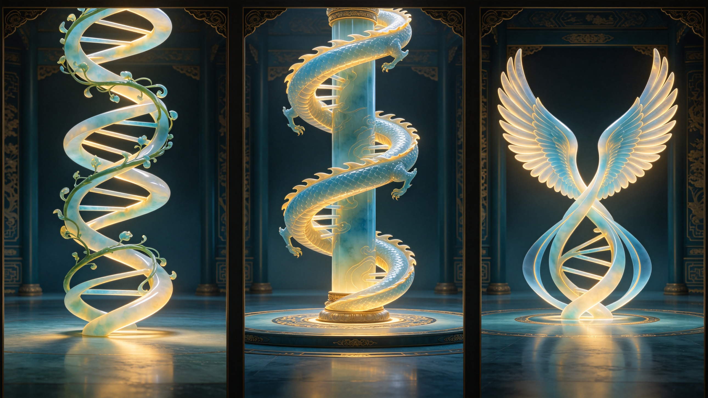

<ArchiveCopyPanel article-id="162282142" />

{"markdown":"PiDliIbnsbvvvJrmlofmmI7ov5vpmLYyMDDorrIgIAo+IOe8luWPt++8mmAxNjIyODIxNDJgICAKPiDljp/lp4vmlofku7bvvJpg5bmz56e75peL6L2s6L205a+556ew5LiJ5aSn5Zu+5b2i5Y+Y5o2i5a+55bqU5Y+M6J665peL5bu25Ly4546v57uV5a+556ew5LiJ57G75Y6f55Sf6L+Q5Yqo5b2i5oCBLeWFqOWfn+aVsOWtpnZz5Lyg57uf5pWw5a2m5Lq657G75paH5piO6L+b6Zi2Mi0xNjIyODIxNDIubWRgICAKPiDov5Tlm57vvJpb5pys5Lmm5b2S5qGjXSgvemgvYm9va3MvY291cnNlL2FydGljbGVzLykgwrcgW+aAu+WFpeWPo10oL3poL2Jvb2tzL2FydGljbGVzLykKCiFb5bCB6Z2iXSguL2Fzc2V0cy9jc2RuaW1nL2pwZy9jZmZmNzY0ZDQwZTM4YjkzLmpwZykKCuS9nOiAhe+8miDkuZbkuZbmlbDlraYKCiMjIOOAiuWFqOWfn+aVsOWtpnZz5Lyg57uf5pWw5a2m77ya5Lq657G75paH5piO6L+b6Zi2MjAw6K6y44CL56ysNDXorrIg5Lit5a2m6YCa5L+X54mI6YCQ5a2X56i/CgrorrLmrKHvvJog56ysNDXorrIKCuS4u+mimO+8miDlubPnp7vjgIHml4vovazjgIHovbTlr7nnp7DkuInlpKflm77lvaLlj5jmjaLvvIzlr7nlupTlj4zonrrml4vlu7bkvLjjgIHnjq/nu5XjgIHlr7nnp7DkuInnsbvljp/nlJ/ov5DliqjlvaLmgIEKCuWvueagh+ivvuacrOefpeivhueCue+8miDlm77lvaLkuInlpKflj5jmjaIKCuaWh+mjju+8miDlpKfnmb3or53jgIHml6DmmabmtqnkuJPkuJror43msYfvvIzlu7bnu60wLzHln7rngrnjgIHlj4zonrrml4vlhajlpZfmr5TllrsKCi0tLQoKIyMjIDDvvZ4z5YiG6ZKfIOWkjeS5oOWvvOWFpQoKIVvlpI3kuaDlr7zlhaVdKC4vYXNzZXRzL2NzZG5pbWcvanBnL2FjYWJmM2YwZDc4MGNlZDUuanBnKQoK5ZCM5a2m5Lus77yM5LiK5LiA6IqC6K++5oiR5Lus5byE5oeC5LqG5LiA5YWD5LiA5qyh5LiN562J5byP55qE5pys5rqQ77yM6Kej6ZuG5LiN5piv5Lq65Li65YiS5a6a55qE5pWw5a2X5Yy66Ze077yM5piv5bmz55u05Y+M6J665peL6KKrMOWfuuWHhuWIhuWJsuWQju+8jOWNleS+p+iHqueEtuW7tuS8uOeahOeUn+mVv+iEiee7nOOAggoK5Yid5Lit5Yeg5L2V5LiJ5aSn5Z+656GA5Y+Y5o2i77ya5bmz56e744CB5peL6L2s44CB6L205a+556ew77yM6K++5pys5bCG5YW25a6a5LmJ5Li657q45LiK5Zu+5b2i55qE5LiJ56eN5omL5Yqo5oyq5Yqo5pa55byP77yM5LuF55So5LqO55S75Zu+44CB5Yeg5L2V6K+B5piO44CCCgrku4rlpKnmiJHku6zlm57lvZLkuInmnoHmnKzmupDop4bop5LvvJrov5nkuInnp43lj5jmjaLmoLnmnKzkuI3mmK/kurrlt6Xmk43kvZzlm77lvaLkuqfnlJ/nmoTkuLTml7bmlYjmnpzvvIzogIzmmK8w5Z+654K55YiG5YyW5Ye655qE5Y+M6J665peL5aSp55Sf6Ieq5bim55qE5LiJ56eN5Z+656GA6L+Q5Yqo5qih5byP77yM5LiW6Ze05omA5pyJ54mp5L2T6L+Q5Yqo44CB5b2i5L2T5ryU5YyW77yM6YO955Sx6L+Z5LiJ57G76L+Q5Yqo57uE5ZCI6ICM5oiQ44CCCgotLS0KCiMjIyAz772eMTPliIbpkp8g55Sf5rS75YyW57G75q+U6K6y6KejCgohW+S4ieWkp+WPmOaNol0oLi9hc3NldHMvY3NkbmltZy9qcGcvMjMyNDVmMDFhZjM5NjYyZS5qcGcpCgrlhYjorrLor77mnKzph4zkuInlpKflj5jmjaLlrprkuYnvvJoKCi0gCgrlubPnp7vvvJrlm77lvaLmsr/nm7Tnur/mlbTkvZPmjKrliqjvvIzlvaLnirbjgIHlpKflsI/jgIHmnJ3lkJHlrozlhajkuI3lj5jvvJsKCi0gCgrml4vovazvvJrlm77lvaLlm7rlrprkuK3lv4PngrnovazlnIjvvIzlsLrlr7jkuI3lj5jvvIzmnJ3lkJHlj5HnlJ/mlLnlj5jvvJsKCi0gCgrovbTlr7nnp7DvvJrmsr/nm7Tnur/lr7nmipjvvIzkuKTkvqflm77lvaLlrozlhajph43lkIjjgIIKCuivvuacrOWPquaKiuS4ieiAheW9k+aIkOeUu+WbvuW3peWFt++8jOWJsuijguWPmOaNouWSjOS4h+eJqeeUn+mVv+eahOWFs+iBlOOAggoK5pS+5Yiw5YWo5Z+f5Y+M6J665peL55Sf6ZW/5L2T57O777yaCgotIAoK5bmz56e75a+55bqU6J665peL5bmz55u05bu25Ly46L+Q5Yqo77ya5Y+M6J665peL5pW05L2T5ZCM5q2l5ZCR5YmN55Sf6ZW/77yM5pW05L2T6Ze06Led44CB6YWN5a+557uT5p6E5LiN5Y+R55Sf5pS55Y+Y77yM5oqV5bCE5Zu+5b2i5bCx5piv5bmz56e777ybCgotIAoK5peL6L2s5a+55bqU6J665peL546v57uV5Z+654K554is5Y2H6L+Q5Yqo77ya5Y+M6J665peL57uVMOWfuueCueS4gOWciOWciOebmOaXi+eUn+mVv++8jOaVtOS9k+i9ruW7k+e7leS4reW/g+i9rOWKqO+8jOaKleWwhOWbvuW9ouWwseaYr+aXi+i9rO+8mwoKLSAKCui9tOWvueensOWvueW6lOWPjOWQkeaIkOWvueieuuaXi+WQjOatpeeUn+mVv++8muWfuueCueWIhuWHuuS4pOadoemVnOWDj+ieuuaXi+WQjOatpeW7tuWxle+8jOS6kuS4uumVnOWDj++8jOaKleWwhOWbvuW9ouWwseaYr+i9tOWvueensOW9ouaAgeOAggoK5Li+566A5Y2V5L6L5a2Q77yaCgror77mnKzop4bop5LvvJrkuInop5LlvaLlkJHlj7PlubPnp7s15qC877yM5Y+q5piv5Lq65Li65oyq5Yqo5Zu+5b2i44CCCgrlhajln5/pgJrkv5fop6Por7vvvJrkuInop5LlvaLova7lu5Plr7nlupTnmoTonrrml4vmlbTkvZPlkIzmraXlkJHliY3lu7bkvLjkuIDmrrXot53nprvvvIzlhoXpg6jnlJ/plb/phY3lr7nnu5PmnoTkuI3lj5jvvIzlubPnp7vlj6rmmK/onrrml4vljp/nlJ/lu7bkvLjov5DliqjnmoTlubPpnaLmipXlvbHvvJvml4vovazjgIHlr7nnp7DlkIznkIbvvIzpg73mmK/onrrml4vlhYjlpKnoh6rluKbov5DliqjvvIzkuI3mmK/kurrmiYvliqjmlLnpgKDlm77lvaLjgIIKCuivvuacrOWPquingua1i+WPmOaNouWQjueahOWbvuW9ouWkluinguWPmOWMlu+8jOW/veeVpeiDjOWQjuaYr+WPjOieuuaXi+acrOi6q+aMgee7reeUn+mVv+i/kOWKqOeahOW6leWxgue7k+aehOOAggoKLS0tCgojIyMgMTPvvZ4yMuWIhumSnyDor77mnKzop4LngrkgdnMg5YWo5Z+f5pWw5a2m6YCa5L+X6KeC54K5CgohW+WvueavlOWbvl0oLi9hc3NldHMvY3NkbmltZy9qcGcvYjFhMjk0MzI0YzhkYWMxZS5qcGcpCgojIyMjIOS8oOe7n+ivvuacrOiupOefpQoKLSAKCuS4ieWkp+WPmOaNouaYr+S6uuaJi+WKqOiwg+aVtOWbvuW9ouS6p+eUn+eahOS4tOaXtuWPmOWMlu+8jOWbvuW9ouacrOi6q+S4jeS8muiHquS4u+W5s+enu+OAgeaXi+i9rAoKLSAKCuW5s+enu+OAgeaXi+i9rOOAgeWvueensOaYr+ebuOS6kueLrOeri+eahOeUu+WbvuaKgOW3p++8jOaXoOe7n+S4gOW6leWxgueUn+mVv+mAu+i+kQoKLSAKCuWPmOaNouS7heWtmOWcqOS6jue6uOmdouWHoOS9lemimO+8jOWSjOWuh+WumeS4h+eJqeOAgeiDvemHj+iEiee7nOi/kOWKqOaXoOWFswoKIyMjIyDlhajln5/mlbDlrabpgJrkv5forqTnn6UKCi0gCgrlubPnp7vjgIHml4vovazjgIHovbTlr7nnp7DmmK/lj4zonrrml4vkuI7nlJ/kv7HmnaXnmoTkuInnsbvln7rnoYDov5DliqjvvIzmiYDmnInlvaLkvZPmvJTljJbpg73nlLHkuInogIXnu4TlkIjnlJ/miJAKCi0gCgrlubPnp7s96J665peL55u057q/5bu25Ly477yM5peL6L2sPeieuuaXi+eOr+e7leWfuueCueebmOaXi++8jOi9tOWvueensD3lj4zlkJHplZzlg4/onrrml4vlkIzmraXnlJ/plb/vvIzkuInogIXnu5/kuIDlvZLkuo4w5Z+654K55YiG5YyW6KeE5YiZCgotIAoK5aSp5L2T5YWs6L2s44CB5qSN54mp55Sf6ZW/44CB57KS5a2Q5oyv5Yqo44CB5YWJ5rOi5Lyg5pKt77yM5YWo6YOo55Sx6L+Z5LiJ57G76J665peL6L+Q5Yqo5Y+g5Yqg5b2i5oiQCgrnroDljZXmr5TllrvvvJoKCuivvuacrOWPmOaNouWmguWQjOS6uuaJi+aMquWKqOe6uOS4iuWbvuahiO+8mwoK5pys5rqQ5Y+Y5o2i5aaC5ZCM6Jek6JST6Ieq54S26ZW/6auY77yI5bmz56e777yJ44CB57uV5p+x5a2Q55uY5peL77yI5peL6L2s77yJ44CB5bem5Y+z5YiG5Y+J5oiQ5a+555Sf6ZW/77yI6L205a+556ew77yJ77yM6L+Q5Yqo5piv55Sf6ZW/6Ieq5bim5bGe5oCn44CCCgotLS0KCiMjIyAyMu+9njI35YiG6ZKfIOagoeWGheWtpuS5oOaPkOmGku+8jOS4jeW9seWTjeiAg+ivleW+l+WIhgoKIVvlrabkuaDmj5DphpJdKC4vYXNzZXRzL2NzZG5pbWcvanBnL2EyZGY0MGMyNzJkZmZkYzUuanBnKQoK5Zu+5b2i5Y+Y5o2i5L2c5Zu+44CB5Yeg5L2V5Y+Y5o2i6K+B5piO6aKY5Z6L77yM5Lil5qC85oyJ54Wn6K++5pys5Yik5a6a5qCH5YeG5L2c562U77yM6ICD6K+V5LiN5Lya5omj5YiG44CCCgrmnKzoioLor77ku4Xmi5PlsZXpq5jnu7TmnKzmupDorqTnn6XvvJrkuInlpKflm77lvaLlj5jmjaLmnKzotKjmmK/lj4zonrrml4vlubPnm7Tlu7bkvLjjgIHnjq/nu5Xnm5jml4vjgIHplZzlg4/lr7nnp7DkuInnsbvljp/nlJ/ov5DliqjnmoTlubPpnaLmipXlvbHjgIIKCuS8j+eslOmTuuWeq++8miDnrKw1MOiusuS4reWtpue7k+S4muS4k+Wcuu+8jOaVtOWQiDI24oCTNTDorrLlhajpg6jkuK3lrabku6PmlbDjgIHlh6DkvZXjgIHlh73mlbDjgIHnu5/orqHnn6Xor4bngrnvvIzlrozmlbTkuLLogZTkuK3lrabpmLbmrrXlhajpg6jmlbDnkIbnn6Xor4blr7nlupTnmoQwLzEv4oie5LiJ5p6B5pys5rqQ44CB5Y+M6J665peL55Sf6ZW/5bqV5bGC6YC76L6R44CCCgotLS0KCiMjIyAyN++9njMw5YiG6ZKfIOivvuWgguaAu+e7kyvkuIvoioLor77pooTlkYoKCiFb6K++5aCC5oC757uTXSguL2Fzc2V0cy9jc2RuaW1nL2pwZy9kM2I0YTM5NDNmNDdhMTMxLmpwZykKCiMjIyMg5pys6IqC6K++5bCP57uT77yaCgrlubPnp7vlr7nlupTonrrml4vlubPnm7Tlu7bkvLjvvIzml4vovazlr7nlupTonrrml4vnjq/nu5Xln7rngrnnm5jml4vvvIzovbTlr7nnp7Dlr7nlupTlj4zlkJHplZzlg4/onrrml4vmiJDlr7nnlJ/plb/vvIzkuInogIXmmK/lj4zonrrml4vkuInlpKfljp/nlJ/ov5DliqjlvaLmgIHjgIIKCiMjIyMg5LiL5LiA6IqC6K++77yaCgrmlrnlt67jgIHmoIflh4blt67kuI3mmK/nprvmlaPmlbDlgLzorqHnrpfvvIzmmK/lj4zonrrml4vnlJ/plb/oioLngrnlgY/nprvkuLvohInnu5znmoTms6LliqjluYXluqbmoIflsLrjgIIKCi0tLQoKIVvmlLblsL7niYflsL5dKC4vYXNzZXRzL2NzZG5pbWcvanBnLzg1OTIxZjFkM2ZjZWY4ZGQuanBnKQo=","text":"5YiG57G777ya5paH5piO6L+b6Zi2MjAw6K6yICAK57yW5Y+377yaMTYyMjgyMTQyICAK5Y6f5aeL5paH5Lu277ya5bmz56e75peL6L2s6L205a+556ew5LiJ5aSn5Zu+5b2i5Y+Y5o2i5a+55bqU5Y+M6J665peL5bu25Ly4546v57uV5a+556ew5LiJ57G75Y6f55Sf6L+Q5Yqo5b2i5oCBLeWFqOWfn+aVsOWtpnZz5Lyg57uf5pWw5a2m5Lq657G75paH5piO6L+b6Zi2Mi0xNjIyODIxNDIubWQgIArov5Tlm57vvJrmnKzkuablvZLmoaMgwrcg5oC75YWl5Y+jCgrlsIHpnaIKCuS9nOiAhe+8miDkuZbkuZbmlbDlraYKCuOAiuWFqOWfn+aVsOWtpnZz5Lyg57uf5pWw5a2m77ya5Lq657G75paH5piO6L+b6Zi2MjAw6K6y44CL56ysNDXorrIg5Lit5a2m6YCa5L+X54mI6YCQ5a2X56i/CgrorrLmrKHvvJog56ysNDXorrIKCuS4u+mimO+8miDlubPnp7vjgIHml4vovazjgIHovbTlr7nnp7DkuInlpKflm77lvaLlj5jmjaLvvIzlr7nlupTlj4zonrrml4vlu7bkvLjjgIHnjq/nu5XjgIHlr7nnp7DkuInnsbvljp/nlJ/ov5DliqjlvaLmgIEKCuWvueagh+ivvuacrOefpeivhueCue+8miDlm77lvaLkuInlpKflj5jmjaIKCuaWh+mjju+8miDlpKfnmb3or53jgIHml6DmmabmtqnkuJPkuJror43msYfvvIzlu7bnu60wLzHln7rngrnjgIHlj4zonrrml4vlhajlpZfmr5TllrsKCi0tLQoKMO+9njPliIbpkp8g5aSN5Lmg5a+85YWlCgrlpI3kuaDlr7zlhaUKCuWQjOWtpuS7rO+8jOS4iuS4gOiKguivvuaIkeS7rOW8hOaHguS6huS4gOWFg+S4gOasoeS4jeetieW8j+eahOacrOa6kO+8jOino+mbhuS4jeaYr+S6uuS4uuWIkuWumueahOaVsOWtl+WMuumXtO+8jOaYr+W5s+ebtOWPjOieuuaXi+iiqzDln7rlh4bliIblibLlkI7vvIzljZXkvqfoh6rnhLblu7bkvLjnmoTnlJ/plb/ohInnu5zjgIIKCuWIneS4reWHoOS9leS4ieWkp+WfuuehgOWPmOaNou+8muW5s+enu+OAgeaXi+i9rOOAgei9tOWvueensO+8jOivvuacrOWwhuWFtuWumuS5ieS4uue6uOS4iuWbvuW9oueahOS4ieenjeaJi+WKqOaMquWKqOaWueW8j++8jOS7heeUqOS6jueUu+WbvuOAgeWHoOS9leivgeaYjuOAggoK5LuK5aSp5oiR5Lus5Zue5b2S5LiJ5p6B5pys5rqQ6KeG6KeS77ya6L+Z5LiJ56eN5Y+Y5o2i5qC55pys5LiN5piv5Lq65bel5pON5L2c5Zu+5b2i5Lqn55Sf55qE5Li05pe25pWI5p6c77yM6ICM5pivMOWfuueCueWIhuWMluWHuueahOWPjOieuuaXi+WkqeeUn+iHquW4pueahOS4ieenjeWfuuehgOi/kOWKqOaooeW8j++8jOS4lumXtOaJgOacieeJqeS9k+i/kOWKqOOAgeW9ouS9k+a8lOWMlu+8jOmDveeUsei/meS4ieexu+i/kOWKqOe7hOWQiOiAjOaIkOOAggoKLS0tCgoz772eMTPliIbpkp8g55Sf5rS75YyW57G75q+U6K6y6KejCgrkuInlpKflj5jmjaIKCuWFiOiusuivvuacrOmHjOS4ieWkp+WPmOaNouWumuS5ie+8mgrlubPnp7vvvJrlm77lvaLmsr/nm7Tnur/mlbTkvZPmjKrliqjvvIzlvaLnirbjgIHlpKflsI/jgIHmnJ3lkJHlrozlhajkuI3lj5jvvJsK5peL6L2s77ya5Zu+5b2i5Zu65a6a5Lit5b+D54K56L2s5ZyI77yM5bC65a+45LiN5Y+Y77yM5pyd5ZCR5Y+R55Sf5pS55Y+Y77ybCui9tOWvueensO+8muayv+ebtOe6v+WvueaKmO+8jOS4pOS+p+WbvuW9ouWujOWFqOmHjeWQiOOAggoK6K++5pys5Y+q5oqK5LiJ6ICF5b2T5oiQ55S75Zu+5bel5YW377yM5Ymy6KOC5Y+Y5o2i5ZKM5LiH54mp55Sf6ZW/55qE5YWz6IGU44CCCgrmlL7liLDlhajln5/lj4zonrrml4vnlJ/plb/kvZPns7vvvJoK5bmz56e75a+55bqU6J665peL5bmz55u05bu25Ly46L+Q5Yqo77ya5Y+M6J665peL5pW05L2T5ZCM5q2l5ZCR5YmN55Sf6ZW/77yM5pW05L2T6Ze06Led44CB6YWN5a+557uT5p6E5LiN5Y+R55Sf5pS55Y+Y77yM5oqV5bCE5Zu+5b2i5bCx5piv5bmz56e777ybCuaXi+i9rOWvueW6lOieuuaXi+eOr+e7leWfuueCueeIrOWNh+i/kOWKqO+8muWPjOieuuaXi+e7lTDln7rngrnkuIDlnIjlnIjnm5jml4vnlJ/plb/vvIzmlbTkvZPova7lu5Pnu5XkuK3lv4PovazliqjvvIzmipXlsITlm77lvaLlsLHmmK/ml4vovazvvJsK6L205a+556ew5a+55bqU5Y+M5ZCR5oiQ5a+56J665peL5ZCM5q2l55Sf6ZW/77ya5Z+654K55YiG5Ye65Lik5p2h6ZWc5YOP6J665peL5ZCM5q2l5bu25bGV77yM5LqS5Li66ZWc5YOP77yM5oqV5bCE5Zu+5b2i5bCx5piv6L205a+556ew5b2i5oCB44CCCgrkuL7nroDljZXkvovlrZDvvJoKCuivvuacrOinhuinku+8muS4ieinkuW9ouWQkeWPs+W5s+enuzXmoLzvvIzlj6rmmK/kurrkuLrmjKrliqjlm77lvaLjgIIKCuWFqOWfn+mAmuS/l+ino+ivu++8muS4ieinkuW9oui9ruW7k+WvueW6lOeahOieuuaXi+aVtOS9k+WQjOatpeWQkeWJjeW7tuS8uOS4gOautei3neemu++8jOWGhemDqOeUn+mVv+mFjeWvuee7k+aehOS4jeWPmO+8jOW5s+enu+WPquaYr+ieuuaXi+WOn+eUn+W7tuS8uOi/kOWKqOeahOW5s+mdouaKleW9se+8m+aXi+i9rOOAgeWvueensOWQjOeQhu+8jOmDveaYr+ieuuaXi+WFiOWkqeiHquW4pui/kOWKqO+8jOS4jeaYr+S6uuaJi+WKqOaUuemAoOWbvuW9ouOAggoK6K++5pys5Y+q6KeC5rWL5Y+Y5o2i5ZCO55qE5Zu+5b2i5aSW6KeC5Y+Y5YyW77yM5b+955Wl6IOM5ZCO5piv5Y+M6J665peL5pys6Lqr5oyB57ut55Sf6ZW/6L+Q5Yqo55qE5bqV5bGC57uT5p6E44CCCgotLS0KCjEz772eMjLliIbpkp8g6K++5pys6KeC54K5IHZzIOWFqOWfn+aVsOWtpumAmuS/l+ingueCuQoK5a+55q+U5Zu+CgrkvKDnu5/or77mnKzorqTnn6UK5LiJ5aSn5Y+Y5o2i5piv5Lq65omL5Yqo6LCD5pW05Zu+5b2i5Lqn55Sf55qE5Li05pe25Y+Y5YyW77yM5Zu+5b2i5pys6Lqr5LiN5Lya6Ieq5Li75bmz56e744CB5peL6L2sCuW5s+enu+OAgeaXi+i9rOOAgeWvueensOaYr+ebuOS6kueLrOeri+eahOeUu+WbvuaKgOW3p++8jOaXoOe7n+S4gOW6leWxgueUn+mVv+mAu+i+kQrlj5jmjaLku4XlrZjlnKjkuo7nurjpnaLlh6DkvZXpopjvvIzlkozlroflrpnkuIfnianjgIHog73ph4/ohInnu5zov5Dliqjml6DlhbMKCuWFqOWfn+aVsOWtpumAmuS/l+iupOefpQrlubPnp7vjgIHml4vovazjgIHovbTlr7nnp7DmmK/lj4zonrrml4vkuI7nlJ/kv7HmnaXnmoTkuInnsbvln7rnoYDov5DliqjvvIzmiYDmnInlvaLkvZPmvJTljJbpg73nlLHkuInogIXnu4TlkIjnlJ/miJAK5bmz56e7PeieuuaXi+ebtOe6v+W7tuS8uO+8jOaXi+i9rD3onrrml4vnjq/nu5Xln7rngrnnm5jml4vvvIzovbTlr7nnp7A95Y+M5ZCR6ZWc5YOP6J665peL5ZCM5q2l55Sf6ZW/77yM5LiJ6ICF57uf5LiA5b2S5LqOMOWfuueCueWIhuWMluinhOWImQrlpKnkvZPlhazovazjgIHmpI3niannlJ/plb/jgIHnspLlrZDmjK/liqjjgIHlhYnms6LkvKDmkq3vvIzlhajpg6jnlLHov5nkuInnsbvonrrml4vov5Dliqjlj6DliqDlvaLmiJAKCueugOWNleavlOWWu++8mgoK6K++5pys5Y+Y5o2i5aaC5ZCM5Lq65omL5oyq5Yqo57q45LiK5Zu+5qGI77ybCgrmnKzmupDlj5jmjaLlpoLlkIzol6TolJPoh6rnhLbplb/pq5jvvIjlubPnp7vvvInjgIHnu5Xmn7HlrZDnm5jml4vvvIjml4vovazvvInjgIHlt6blj7PliIblj4nmiJDlr7nnlJ/plb/vvIjovbTlr7nnp7DvvInvvIzov5DliqjmmK/nlJ/plb/oh6rluKblsZ7mgKfjgIIKCi0tLQoKMjLvvZ4yN+WIhumSnyDmoKHlhoXlrabkuaDmj5DphpLvvIzkuI3lvbHlk43ogIPor5XlvpfliIYKCuWtpuS5oOaPkOmGkgoK5Zu+5b2i5Y+Y5o2i5L2c5Zu+44CB5Yeg5L2V5Y+Y5o2i6K+B5piO6aKY5Z6L77yM5Lil5qC85oyJ54Wn6K++5pys5Yik5a6a5qCH5YeG5L2c562U77yM6ICD6K+V5LiN5Lya5omj5YiG44CCCgrmnKzoioLor77ku4Xmi5PlsZXpq5jnu7TmnKzmupDorqTnn6XvvJrkuInlpKflm77lvaLlj5jmjaLmnKzotKjmmK/lj4zonrrml4vlubPnm7Tlu7bkvLjjgIHnjq/nu5Xnm5jml4vjgIHplZzlg4/lr7nnp7DkuInnsbvljp/nlJ/ov5DliqjnmoTlubPpnaLmipXlvbHjgIIKCuS8j+eslOmTuuWeq++8miDnrKw1MOiusuS4reWtpue7k+S4muS4k+Wcuu+8jOaVtOWQiDI24oCTNTDorrLlhajpg6jkuK3lrabku6PmlbDjgIHlh6DkvZXjgIHlh73mlbDjgIHnu5/orqHnn6Xor4bngrnvvIzlrozmlbTkuLLogZTkuK3lrabpmLbmrrXlhajpg6jmlbDnkIbnn6Xor4blr7nlupTnmoQwLzEv4oie5LiJ5p6B5pys5rqQ44CB5Y+M6J665peL55Sf6ZW/5bqV5bGC6YC76L6R44CCCgotLS0KCjI3772eMzDliIbpkp8g6K++5aCC5oC757uTK+S4i+iKguivvumihOWRigoK6K++5aCC5oC757uTCgrmnKzoioLor77lsI/nu5PvvJoKCuW5s+enu+WvueW6lOieuuaXi+W5s+ebtOW7tuS8uO+8jOaXi+i9rOWvueW6lOieuuaXi+eOr+e7leWfuueCueebmOaXi++8jOi9tOWvueensOWvueW6lOWPjOWQkemVnOWDj+ieuuaXi+aIkOWvueeUn+mVv++8jOS4ieiAheaYr+WPjOieuuaXi+S4ieWkp+WOn+eUn+i/kOWKqOW9ouaAgeOAggoK5LiL5LiA6IqC6K++77yaCgrmlrnlt67jgIHmoIflh4blt67kuI3mmK/nprvmlaPmlbDlgLzorqHnrpfvvIzmmK/lj4zonrrml4vnlJ/plb/oioLngrnlgY/nprvkuLvohInnu5znmoTms6LliqjluYXluqbmoIflsLrjgIIKCi0tLQoK5pS25bC+54mH5bC+"}

> 分类：文明进阶200讲  
> 编号：`162282142`  
> 原始文件：`平移旋转轴对称三大图形变换对应双螺旋延伸环绕对称三类原生运动形态-全域数学vs传统数学人类文明进阶2-162282142.md`  
> 返回：[本书归档](/zh/books/course/articles/) · [总入口](/zh/books/articles/)

<ArticlePaperMeta category="文明进阶200讲" article-id="162282142" title="平移旋转轴对称三大图形变换对应双螺旋延伸环绕对称三类原生运动形态-全域数学vs传统数学人类文明进阶2" paper-kind="课程讲义" book-route="/zh/books/course/articles/" overview-route="/zh/books/articles/" summary="文风： 大白话、无晦涩专业词汇，延续0/1基点、双螺旋全套比喻" author="乖乖数学" lecture="第45讲" theme="平移、旋转、轴对称三大图形变换，对应双螺旋延伸、环绕、对称三类原生运动形态" source-file="平移旋转轴对称三大图形变换对应双螺旋延伸环绕对称三类原生运动形态-全域数学vs传统数学人类文明进阶2-162282142.md" cover="./assets/csdnimg/jpg/cfff764d40e38b93.jpg" />

作者： 乖乖数学

## 《全域数学vs传统数学：人类文明进阶200讲》第45讲 中学通俗版逐字稿

讲次： 第45讲

主题： 平移、旋转、轴对称三大图形变换，对应双螺旋延伸、环绕、对称三类原生运动形态

对标课本知识点： 图形三大变换

文风： 大白话、无晦涩专业词汇，延续0/1基点、双螺旋全套比喻

---

### 0～3分钟 复习导入

同学们，上一节课我们弄懂了一元一次不等式的本源，解集不是人为划定的数字区间，是平直双螺旋被0基准分割后，单侧自然延伸的生长脉络。

初中几何三大基础变换：平移、旋转、轴对称，课本将其定义为纸上图形的三种手动挪动方式，仅用于画图、几何证明。

今天我们回归三极本源视角：这三种变换根本不是人工操作图形产生的临时效果，而是0基点分化出的双螺旋天生自带的三种基础运动模式，世间所有物体运动、形体演化，都由这三类运动组合而成。

---

### 3～13分钟 生活化类比讲解

先讲课本里三大变换定义：

- 

平移：图形沿直线整体挪动，形状、大小、朝向完全不变；

- 

旋转：图形固定中心点转圈，尺寸不变，朝向发生改变；

- 

轴对称：沿直线对折，两侧图形完全重合。

课本只把三者当成画图工具，割裂变换和万物生长的关联。

放到全域双螺旋生长体系：

- 

平移对应螺旋平直延伸运动：双螺旋整体同步向前生长，整体间距、配对结构不发生改变，投射图形就是平移；

- 

旋转对应螺旋环绕基点爬升运动：双螺旋绕0基点一圈圈盘旋生长，整体轮廓绕中心转动，投射图形就是旋转；

- 

轴对称对应双向成对螺旋同步生长：基点分出两条镜像螺旋同步延展，互为镜像，投射图形就是轴对称形态。

举简单例子：

课本视角：三角形向右平移5格，只是人为挪动图形。

全域通俗解读：三角形轮廓对应的螺旋整体同步向前延伸一段距离，内部生长配对结构不变，平移只是螺旋原生延伸运动的平面投影；旋转、对称同理，都是螺旋先天自带运动，不是人手动改造图形。

课本只观测变换后的图形外观变化，忽略背后是双螺旋本身持续生长运动的底层结构。

---

### 13～22分钟 课本观点 vs 全域数学通俗观点

#### 传统课本认知

- 

三大变换是人手动调整图形产生的临时变化，图形本身不会自主平移、旋转

- 

平移、旋转、对称是相互独立的画图技巧，无统一底层生长逻辑

- 

变换仅存在于纸面几何题，和宇宙万物、能量脉络运动无关

#### 全域数学通俗认知

- 

平移、旋转、轴对称是双螺旋与生俱来的三类基础运动，所有形体演化都由三者组合生成

- 

平移=螺旋直线延伸，旋转=螺旋环绕基点盘旋，轴对称=双向镜像螺旋同步生长，三者统一归于0基点分化规则

- 

天体公转、植物生长、粒子振动、光波传播，全部由这三类螺旋运动叠加形成

简单比喻：

课本变换如同人手挪动纸上图案；

本源变换如同藤蔓自然长高（平移）、绕柱子盘旋（旋转）、左右分叉成对生长（轴对称），运动是生长自带属性。

---

### 22～27分钟 校内学习提醒，不影响考试得分

图形变换作图、几何变换证明题型，严格按照课本判定标准作答，考试不会扣分。

本节课仅拓展高维本源认知：三大图形变换本质是双螺旋平直延伸、环绕盘旋、镜像对称三类原生运动的平面投影。

伏笔铺垫： 第50讲中学结业专场，整合26–50讲全部中学代数、几何、函数、统计知识点，完整串联中学阶段全部数理知识对应的0/1/∞三极本源、双螺旋生长底层逻辑。

---

### 27～30分钟 课堂总结+下节课预告

#### 本节课小结：

平移对应螺旋平直延伸，旋转对应螺旋环绕基点盘旋，轴对称对应双向镜像螺旋成对生长，三者是双螺旋三大原生运动形态。

#### 下一节课：

方差、标准差不是离散数值计算，是双螺旋生长节点偏离主脉络的波动幅度标尺。

---

