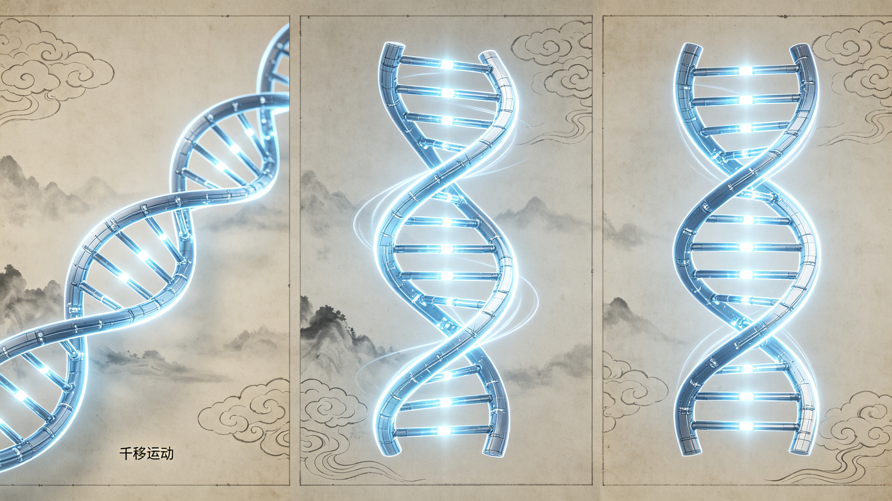

<ArchiveCopyPanel article-id="162348154" />

{"markdown":"PiDliIbnsbvvvJrmlofmmI7ov5vpmLYyMDDorrIgIAo+IOe8luWPt++8mmAxNjIzNDgxNTRgICAKPiDljp/lp4vmlofku7bvvJpg5pa55beu5qCH5YeG5beu5LiN5piv56a75pWj5pWw5YC86K6h566X5piv5Y+M6J665peL55Sf6ZW/6IqC54K55YGP56a75Li76ISJ57uc55qE5rOi5Yqo5bmF5bqm5qCH5bC65YWo5Z+f5pWw5a2mdnPkvKDnu5/mlbDlrabkurrnsbvmlofmmI7ov5vpmLYyLTE2MjM0ODE1NC5tZGAgIAo+IOi/lOWbnu+8mlvmnKzkuablvZLmoaNdKC96aC9ib29rcy9jb3Vyc2UvYXJ0aWNsZXMvKSDCtyBb5oC75YWl5Y+jXSgvemgvYm9va3MvYXJ0aWNsZXMvKQoKIVvlsIHpnaJdKC4vYXNzZXRzL2NzZG5pbWcvanBnLzc5NGVlMmRhZWJjMjhkYjMuanBnKQoK5L2c6ICF77yaIOS5luS5luaVsOWtpgoKIyMg44CK5YWo5Z+f5pWw5a2mdnPkvKDnu5/mlbDlrabvvJrkurrnsbvmlofmmI7ov5vpmLYyMDDorrLjgIvnrKw0NuiusiDkuK3lrabpgJrkv5fniYjpgJDlrZfnqL8KCuiusuasoe+8miDnrKw0NuiusgoK5Li76aKY77yaIOaWueW3ruOAgeagh+WHhuW3ruS4jeaYr+emu+aVo+aVsOWAvOiuoeeul++8jOaYr+WPjOieuuaXi+eUn+mVv+iKgueCueWBj+emu+S4u+iEiee7nOeahOazouWKqOW5heW6puagh+WwugoK5a+55qCH6K++5pys55+l6K+G54K577yaIOaWueW3ruOAgeagh+WHhuW3ruOAgeaVsOaNruazouWKqAoK5paH6aOO77yaIOWkp+eZveivneOAgeaXoOaZpua2qeS4k+S4muivjeaxh++8jOW7tue7rTAvMeWfuueCueOAgeWPjOieuuaXi+WFqOWll+avlOWWuwoKLS0tCgojIyMgMO+9njPliIbpkp8g5aSN5Lmg5a+85YWlCgohW+WPjOieuuaXi+S4ieenjeWOn+eUn+i/kOWKqF0oLi9hc3NldHMvY3NkbmltZy9qcGcvYzY2OGYxNTkzNWIxMTFlNC5qcGcpCgrlkIzlrabku6zvvIzkuIrkuIDoioLor77miJHku6znkIbmuIXkuoblm77lvaLkuInlpKflj5jmjaLnmoTmnKzmupDvvIzlubPnp7vjgIHml4vovazjgIHovbTlr7nnp7DkuI3mmK/kurrkuLrmjKrliqjlm77lvaLnmoTmk43kvZzvvIzogIzmmK/mlbDlrZflj4zonrrml4vlpKnnlJ/lhbflpIfnmoTlubPnm7Tlu7bkvLjjgIHnjq/nu5Xnm5jml4vjgIHplZzlg4/lr7nnp7DkuInnp43ljp/nlJ/ov5DliqjjgIIKCuWIneS4ree7n+iuoeS8muWtpuS5oOaWueW3ruS4juagh+WHhuW3ru+8jOiAgeW4iOWRiuivieaIkeS7rO+8mueUqOavj+S4gOS4quaVsOaNruWSjOW5s+Wdh+aVsOWBmuW3ruW5s+aWueWGjeaxguW5s+Wdh++8jOeul+WHuueahOaVsOWtl+S7o+ihqOaVsOaNruazouWKqOWkp+Wwj++8jOWPquaYr+ihoemHj+aVsOaNrueos+S4jeeos+WumueahOiuoeeul+aMh+agh+OAggoK5LuK5aSp5oiR5Lus5ouJ6auY57u05bqm55yL5riF5bqV5bGC55yf55u477ya5rOi5Yqo5LiN5piv5Lq65Li6566X5Ye65p2l55qE6Jma5ouf5pWw5YC877yM5q+P5p2h5Y+M6J665peL6YO95pyJ5LiA5p2h5bmz56iz55Sf6ZW/55qE5Li75bmy6ISJ57uc77yM5ZCE5Liq55Sf6ZW/6IqC54K55Lya5ZCR5Lik5L6n5YGP56e777yb5pa55beu44CB5qCH5YeG5beu77yM5bCx5piv5LiT6Zeo5LiI6YeP6IqC54K55YGP56a75Li75bmy6L+c6L+R56iL5bqm55qE5aSp54S25qCH5bC644CCCgotLS0KCiMjIyAz772eMTPliIbpkp8g55Sf5rS75YyW57G75q+U6K6y6KejCgohW+WPjOieuuaXi+S4u+W5suS4juiKgueCueWBj+enu10oLi9hc3NldHMvY3NkbmltZy9qcGcvYTNjZWM4OTlmNGE1ODRlNy5qcGcpCgrlhYjorrLor77mnKzph4zmlrnlt67orqHnrpfpgLvovpHvvJoKCuS4gOe7hOaVsOaNruWHj+WOu+W5s+Wdh+aVsO+8jOW5s+aWuea2iOmZpOato+i0n+W3ruWAvO+8jOWFqOmDqOebuOWKoOWGjeWdh+WIhuW+l+WIsOaWueW3ru+8jOW8gOW5s+aWueW+l+WIsOagh+WHhuW3ru+8jOaVsOWAvOi2iuWkp++8jOS7o+ihqOaVsOaNrui1t+S8j+i2iuWJp+eDiO+8jOS7heeUqOadpeWBmue7n+iuoeWvueavlOOAggoK5pS+5Yiw5Y+M6J665peL55Sf6ZW/5L2T57O76YeM77yaCgrkuIDnu4TmlbDmja7lr7nlupTkuIDnsIflr4bpm4bnlJ/plb/nmoTonrrml4voioLngrnvvIzmlbTmnaHonrrml4vlrZjlnKjkuIDmnaHlsYXkuK3lubPnqLPlu7bkvLjnmoTkuLvlubLvvIjlr7nlupTlubPlnYfmlbDlsYLnuqfvvInvvJsKCumDqOWIhuiKgueCueeUn+mVv+iKguWlj+WSjOS4u+W5suS4jeWQjO+8jOS8muWQkeS4u+W5suW3puWPs+OAgeS4iuS4i+WBj+enu++8jOWBj+enu+i3neemu+aciemVv+acieefre+8mwoK5bmz5pa55pON5L2c5piv5pS+5aSn5YGP56e75beu6Led77yM6YG/5YWN5q2j6LSf5YGP56e75LqS55u45oq15raI77yb5pa55beu5piv5omA5pyJ6IqC54K55YGP56e75bmF5bqm55qE5bmz5Z2H5oC76YeP77yM5qCH5YeG5beu5piv6L+Y5Y6f5oiQ5Y6f5aeL55Sf6ZW/5bC65bqm55qE5rOi5Yqo5Z+65YeG5YC844CCCgrkuL7nroDljZXkvovlrZDvvJoKCuivvuacrOinhuinku+8muS4pOe7hOaVsOaNriBbMiwzLDRdWzIsMyw0XVsyLDMsNF0g5LiOIFsxLDMsNV1bMSwzLDVdWzEsMyw1Xe+8jOWQjuiAheaWueW3ruabtOWkp++8jOS7o+ihqOazouWKqOabtOW8uuOAggoKIVvkuKTnu4Tonrrml4voioLngrnlr7nmr5RdKC4vYXNzZXRzL2NzZG5pbWcvanBnLzBlZjhkZTQ2ZTJiZmVjZDguanBnKQoK5YWo5Z+f6YCa5L+X6Kej6K+777ya5Lik57uE5pWw5o2u5ZCM5bGe5LiA5p2h6J665peL5Li75bmy77yM56ys5LiA57uE6IqC54K557Sn6LS05Li75bmy55Sf6ZW/77yM5YGP56e76YeP5b6I5bCP77yb56ys5LqM57uE6IqC54K55ZCR5Lik5L6n5aSn5bmF5YGP56a75Li75bmy77yM5YGP56e757Sv56ev5oC76YeP5pu06auY77yM5pa55beu5Y+q5piv6YeP5YyW6L+Z56eN5aSp54S25YGP56a756iL5bqm55qE5qCH5bC677yM5LiN5piv5Lq65Li65Yi26YCg55qE57uf6K6h56ym5Y+344CCCgror77mnKzlj6rnm6/nnYDmlbDlrZflt67lgLzov5DnrpfvvIznnIvkuI3op4Hmlrnlt67og4zlkI7mmK/onrrml4voioLngrnnm7jlr7nkuLvlubLohInnu5znmoTljp/nlJ/lgY/np7vnu5PmnoTjgIIKCi0tLQoKIyMjIDEz772eMjLliIbpkp8g6K++5pys6KeC54K5IHZzIOWFqOWfn+aVsOWtpumAmuS/l+ingueCuQoKIVvor77mnKzop4bop5LkuI7lhajln5/op4bop5Llr7nmr5RdKC4vYXNzZXRzL2NzZG5pbWcvanBnL2VkMjA4MjNhOGRmOTAyNTAuanBnKQoKIyMjIyDkvKDnu5/or77mnKzorqTnn6UKCi0gCgrmlrnlt67jgIHmoIflh4blt67mmK/kurrlt6Xmjqjlr7znmoTnu5/orqHlhazlvI/vvIzmlbDmja7mnKzouqvkuI3lrZjlnKjlpKnnhLbms6LliqjmoIflsLoKCi0gCgrlubPmlrnlt67lgLzlj6rmmK/orqHnrpfmioDlt6fvvIzmsqHmnInlr7nlupTonrrml4vnlJ/plb/nmoTniannkIbnu5PmnoTlkKvkuYkKCi0gCgrms6Lliqjku4XlrZjlnKjor5Xljbfnu5/orqHpopjvvIzlkozog73ph4/jgIHnspLlrZDjgIHkuIfniannlJ/plb/otbfkvI/ml6DlhbMKCiMjIyMg5YWo5Z+f5pWw5a2m6YCa5L+X6K6k55+lCgotIAoK6J665peL5Li75bmy5piv56iz5a6a55Sf6ZW/5Z+65YeG77yM6IqC54K55YGP56e75piv55Sf6ZW/6Ieq5bim546w6LGh77yM5pa55beu44CB5qCH5YeG5beu5piv5LiI6YeP5YGP56e75bmF5bqm55qE5aSp54S25bC65bqmCgotIAoK5bmz5pa56L+Q566X5a+55bqU6J665peL5Y+M5ZCR5YGP56e75peg5oq15raI6KeE5YiZ77yM5qCH5YeG5beu6L+Y5Y6f6J665peL5Y6f55Sf55Sf6ZW/5Y2V5L2N77yM5LqM6ICF6YWN5aWX6KeC5rWL5rOi5YqoCgotIAoK5rCU5rip5rOi5Yqo44CB57KS5a2Q6IO96YeP6LW35LyP44CB56eN576k5pWw6YeP5Y+Y5YyW77yM5YWo6YOo5Y+v5Lul55So6L+Z5aWX5YGP56e75qCH5bC66KGh6YePCgrnroDljZXmr5TllrvvvJoKCuivvuacrOaWueW3ruWmguWQjOS6uuW3pea1i+eul+S4gOaOkuagkeacqOWBj+emu+S4remXtOWfuuWHhue6v+eahOi3neemu++8mwoK5pys5rqQ5pa55beu5aaC5ZCM6Jek6JST5Li75bmy5peB5YiG5Ye655qE5L6n5p6d77yM5L6n5p6d56a75Li75bmy6LaK6L+c77yM5pW05L2T5pa55beu5pWw5YC86LaK5aSn77yM5YGP56e75piv55Sf6ZW/6Ieq5bim54q25oCB44CCCgotLS0KCiMjIyAyMu+9njI35YiG6ZKfIOagoeWGheWtpuS5oOaPkOmGku+8jOS4jeW9seWTjeiAg+ivleW+l+WIhgoK5pa55beu6K6h566X44CB5rOi5Yqo5a+55q+U57uf6K6h6aKY77yM5Lil5qC85oyJ54Wn6K++5pys5YWs5byP5q2l6aqk5L2c562U77yM6ICD6K+V5LiN5Lya5omj5YiG44CCCgrmnKzoioLor77lj6rmmK/mi5PlsZXpq5jnu7TmnKzmupDorqTnn6XvvJrmlrnlt67jgIHmoIflh4blt67mmK/ooaHph4/lj4zonrrml4vnlJ/plb/oioLngrnlgY/nprvkuLvlubLohInnu5zluYXluqbnmoTkuJPlsZ7moIflsLrjgIIKCiFb56ysNTDorrLnu5PkuJrkuJPlnLrpooTlkYpdKC4vYXNzZXRzL2NzZG5pbWcvanBnL2JlY2ViM2ZjODUxNjNjNzYuanBnKQoK5LyP56yU6ZO65Z6r77yaIOesrDUw6K6y5Lit5a2m57uT5Lia5LiT5Zy677yM5pW05ZCIMjbigJM1MOiusuWFqOmDqOS4reWtpuS7o+aVsOOAgeWHoOS9leOAgeWHveaVsOOAgee7n+iuoeefpeivhueCue+8jOWujOaVtOS4suiBlOS4reWtpuWFqOmDqOaVsOeQhuWvueW6lOeahDAvMS/iiJ7kuInmnoHmnKzmupDkuI7lj4zonrrml4vnlJ/plb/pgLvovpHjgIIKCi0tLQoKIyMjIDI3772eMzDliIbpkp8g6K++5aCC5oC757uTK+S4i+iKguivvumihOWRigoK5pys6IqC6K++5bCP57uT77yaCgrmlrnlt67orrDlvZXmiYDmnInonrrml4voioLngrnlgY/nprvkuLvlubLnmoTlubPlnYflgY/np7vmgLvph4/vvIzmoIflh4blt67ov5jljp/ljp/nlJ/nlJ/plb/lsLrluqbvvIzkuozogIXnlKjmnaXph4/ljJbonrrml4vnlJ/plb/nmoTotbfkvI/ms6LliqjjgIIKCuS4i+S4gOiKguivvu+8miDlubPooYzlm5vovrnlvaLliKTlrprkuI3mmK/ovrnop5LmnaHku7bmi7zlh5HvvIzmmK/kuKTnu4Tlj4zlkJHlkIzmraXlj4zonrrml4vkuqTnu4flvaLmiJDnmoTpl63lkIjnlJ/plb/ova7lu5PjgIIKCiFb54mH5bC+5pS25bC+XSguL2Fzc2V0cy9jc2RuaW1nL2pwZy8wMWEwMTI5NGI0NzU5MmY4LmpwZykK","text":"5YiG57G777ya5paH5piO6L+b6Zi2MjAw6K6yICAK57yW5Y+377yaMTYyMzQ4MTU0ICAK5Y6f5aeL5paH5Lu277ya5pa55beu5qCH5YeG5beu5LiN5piv56a75pWj5pWw5YC86K6h566X5piv5Y+M6J665peL55Sf6ZW/6IqC54K55YGP56a75Li76ISJ57uc55qE5rOi5Yqo5bmF5bqm5qCH5bC65YWo5Z+f5pWw5a2mdnPkvKDnu5/mlbDlrabkurrnsbvmlofmmI7ov5vpmLYyLTE2MjM0ODE1NC5tZCAgCui/lOWbnu+8muacrOS5puW9kuahoyDCtyDmgLvlhaXlj6MKCuWwgemdogoK5L2c6ICF77yaIOS5luS5luaVsOWtpgoK44CK5YWo5Z+f5pWw5a2mdnPkvKDnu5/mlbDlrabvvJrkurrnsbvmlofmmI7ov5vpmLYyMDDorrLjgIvnrKw0NuiusiDkuK3lrabpgJrkv5fniYjpgJDlrZfnqL8KCuiusuasoe+8miDnrKw0NuiusgoK5Li76aKY77yaIOaWueW3ruOAgeagh+WHhuW3ruS4jeaYr+emu+aVo+aVsOWAvOiuoeeul++8jOaYr+WPjOieuuaXi+eUn+mVv+iKgueCueWBj+emu+S4u+iEiee7nOeahOazouWKqOW5heW6puagh+WwugoK5a+55qCH6K++5pys55+l6K+G54K577yaIOaWueW3ruOAgeagh+WHhuW3ruOAgeaVsOaNruazouWKqAoK5paH6aOO77yaIOWkp+eZveivneOAgeaXoOaZpua2qeS4k+S4muivjeaxh++8jOW7tue7rTAvMeWfuueCueOAgeWPjOieuuaXi+WFqOWll+avlOWWuwoKLS0tCgow772eM+WIhumSnyDlpI3kuaDlr7zlhaUKCuWPjOieuuaXi+S4ieenjeWOn+eUn+i/kOWKqAoK5ZCM5a2m5Lus77yM5LiK5LiA6IqC6K++5oiR5Lus55CG5riF5LqG5Zu+5b2i5LiJ5aSn5Y+Y5o2i55qE5pys5rqQ77yM5bmz56e744CB5peL6L2s44CB6L205a+556ew5LiN5piv5Lq65Li65oyq5Yqo5Zu+5b2i55qE5pON5L2c77yM6ICM5piv5pWw5a2X5Y+M6J665peL5aSp55Sf5YW35aSH55qE5bmz55u05bu25Ly444CB546v57uV55uY5peL44CB6ZWc5YOP5a+556ew5LiJ56eN5Y6f55Sf6L+Q5Yqo44CCCgrliJ3kuK3nu5/orqHkvJrlrabkuaDmlrnlt67kuI7moIflh4blt67vvIzogIHluIjlkYror4nmiJHku6zvvJrnlKjmr4/kuIDkuKrmlbDmja7lkozlubPlnYfmlbDlgZrlt67lubPmlrnlho3msYLlubPlnYfvvIznrpflh7rnmoTmlbDlrZfku6PooajmlbDmja7ms6LliqjlpKflsI/vvIzlj6rmmK/ooaHph4/mlbDmja7nqLPkuI3nqLPlrprnmoTorqHnrpfmjIfmoIfjgIIKCuS7iuWkqeaIkeS7rOaLiemrmOe7tOW6pueci+a4heW6leWxguecn+ebuO+8muazouWKqOS4jeaYr+S6uuS4uueul+WHuuadpeeahOiZmuaLn+aVsOWAvO+8jOavj+adoeWPjOieuuaXi+mDveacieS4gOadoeW5s+eos+eUn+mVv+eahOS4u+W5suiEiee7nO+8jOWQhOS4queUn+mVv+iKgueCueS8muWQkeS4pOS+p+WBj+enu++8m+aWueW3ruOAgeagh+WHhuW3ru+8jOWwseaYr+S4k+mXqOS4iOmHj+iKgueCueWBj+emu+S4u+W5sui/nOi/keeoi+W6pueahOWkqeeEtuagh+WwuuOAggoKLS0tCgoz772eMTPliIbpkp8g55Sf5rS75YyW57G75q+U6K6y6KejCgrlj4zonrrml4vkuLvlubLkuI7oioLngrnlgY/np7sKCuWFiOiusuivvuacrOmHjOaWueW3ruiuoeeul+mAu+i+ke+8mgoK5LiA57uE5pWw5o2u5YeP5Y675bmz5Z2H5pWw77yM5bmz5pa55raI6Zmk5q2j6LSf5beu5YC877yM5YWo6YOo55u45Yqg5YaN5Z2H5YiG5b6X5Yiw5pa55beu77yM5byA5bmz5pa55b6X5Yiw5qCH5YeG5beu77yM5pWw5YC86LaK5aSn77yM5Luj6KGo5pWw5o2u6LW35LyP6LaK5Ymn54OI77yM5LuF55So5p2l5YGa57uf6K6h5a+55q+U44CCCgrmlL7liLDlj4zonrrml4vnlJ/plb/kvZPns7vph4zvvJoKCuS4gOe7hOaVsOaNruWvueW6lOS4gOewh+WvhumbhueUn+mVv+eahOieuuaXi+iKgueCue+8jOaVtOadoeieuuaXi+WtmOWcqOS4gOadoeWxheS4reW5s+eos+W7tuS8uOeahOS4u+W5su+8iOWvueW6lOW5s+Wdh+aVsOWxgue6p++8ie+8mwoK6YOo5YiG6IqC54K555Sf6ZW/6IqC5aWP5ZKM5Li75bmy5LiN5ZCM77yM5Lya5ZCR5Li75bmy5bem5Y+z44CB5LiK5LiL5YGP56e777yM5YGP56e76Led56a75pyJ6ZW/5pyJ55+t77ybCgrlubPmlrnmk43kvZzmmK/mlL7lpKflgY/np7vlt67ot53vvIzpgb/lhY3mraPotJ/lgY/np7vkupLnm7jmirXmtojvvJvmlrnlt67mmK/miYDmnInoioLngrnlgY/np7vluYXluqbnmoTlubPlnYfmgLvph4/vvIzmoIflh4blt67mmK/ov5jljp/miJDljp/lp4vnlJ/plb/lsLrluqbnmoTms6Lliqjln7rlh4blgLzjgIIKCuS4vueugOWNleS+i+WtkO+8mgoK6K++5pys6KeG6KeS77ya5Lik57uE5pWw5o2uIFsyLDMsNF1bMiwzLDRdWzIsMyw0XSDkuI4gWzEsMyw1XVsxLDMsNV1bMSwzLDVd77yM5ZCO6ICF5pa55beu5pu05aSn77yM5Luj6KGo5rOi5Yqo5pu05by644CCCgrkuKTnu4Tonrrml4voioLngrnlr7nmr5QKCuWFqOWfn+mAmuS/l+ino+ivu++8muS4pOe7hOaVsOaNruWQjOWxnuS4gOadoeieuuaXi+S4u+W5su+8jOesrOS4gOe7hOiKgueCuee0p+i0tOS4u+W5sueUn+mVv++8jOWBj+enu+mHj+W+iOWwj++8m+esrOS6jOe7hOiKgueCueWQkeS4pOS+p+Wkp+W5heWBj+emu+S4u+W5su+8jOWBj+enu+e0r+enr+aAu+mHj+abtOmrmO+8jOaWueW3ruWPquaYr+mHj+WMlui/meenjeWkqeeEtuWBj+emu+eoi+W6pueahOagh+Wwuu+8jOS4jeaYr+S6uuS4uuWItumAoOeahOe7n+iuoeespuWPt+OAggoK6K++5pys5Y+q55uv552A5pWw5a2X5beu5YC86L+Q566X77yM55yL5LiN6KeB5pa55beu6IOM5ZCO5piv6J665peL6IqC54K555u45a+55Li75bmy6ISJ57uc55qE5Y6f55Sf5YGP56e757uT5p6E44CCCgotLS0KCjEz772eMjLliIbpkp8g6K++5pys6KeC54K5IHZzIOWFqOWfn+aVsOWtpumAmuS/l+ingueCuQoK6K++5pys6KeG6KeS5LiO5YWo5Z+f6KeG6KeS5a+55q+UCgrkvKDnu5/or77mnKzorqTnn6UK5pa55beu44CB5qCH5YeG5beu5piv5Lq65bel5o6o5a+855qE57uf6K6h5YWs5byP77yM5pWw5o2u5pys6Lqr5LiN5a2Y5Zyo5aSp54S25rOi5Yqo5qCH5bC6CuW5s+aWueW3ruWAvOWPquaYr+iuoeeul+aKgOW3p++8jOayoeacieWvueW6lOieuuaXi+eUn+mVv+eahOeJqeeQhue7k+aehOWQq+S5iQrms6Lliqjku4XlrZjlnKjor5Xljbfnu5/orqHpopjvvIzlkozog73ph4/jgIHnspLlrZDjgIHkuIfniannlJ/plb/otbfkvI/ml6DlhbMKCuWFqOWfn+aVsOWtpumAmuS/l+iupOefpQronrrml4vkuLvlubLmmK/nqLPlrprnlJ/plb/ln7rlh4bvvIzoioLngrnlgY/np7vmmK/nlJ/plb/oh6rluKbnjrDosaHvvIzmlrnlt67jgIHmoIflh4blt67mmK/kuIjph4/lgY/np7vluYXluqbnmoTlpKnnhLblsLrluqYK5bmz5pa56L+Q566X5a+55bqU6J665peL5Y+M5ZCR5YGP56e75peg5oq15raI6KeE5YiZ77yM5qCH5YeG5beu6L+Y5Y6f6J665peL5Y6f55Sf55Sf6ZW/5Y2V5L2N77yM5LqM6ICF6YWN5aWX6KeC5rWL5rOi5YqoCuawlOa4qeazouWKqOOAgeeykuWtkOiDvemHj+i1t+S8j+OAgeenjee+pOaVsOmHj+WPmOWMlu+8jOWFqOmDqOWPr+S7peeUqOi/meWll+WBj+enu+agh+WwuuihoemHjwoK566A5Y2V5q+U5Za777yaCgror77mnKzmlrnlt67lpoLlkIzkurrlt6XmtYvnrpfkuIDmjpLmoJHmnKjlgY/nprvkuK3pl7Tln7rlh4bnur/nmoTot53nprvvvJsKCuacrOa6kOaWueW3ruWmguWQjOiXpOiUk+S4u+W5suaXgeWIhuWHuueahOS+p+aene+8jOS+p+aeneemu+S4u+W5sui2iui/nO+8jOaVtOS9k+aWueW3ruaVsOWAvOi2iuWkp++8jOWBj+enu+aYr+eUn+mVv+iHquW4pueKtuaAgeOAggoKLS0tCgoyMu+9njI35YiG6ZKfIOagoeWGheWtpuS5oOaPkOmGku+8jOS4jeW9seWTjeiAg+ivleW+l+WIhgoK5pa55beu6K6h566X44CB5rOi5Yqo5a+55q+U57uf6K6h6aKY77yM5Lil5qC85oyJ54Wn6K++5pys5YWs5byP5q2l6aqk5L2c562U77yM6ICD6K+V5LiN5Lya5omj5YiG44CCCgrmnKzoioLor77lj6rmmK/mi5PlsZXpq5jnu7TmnKzmupDorqTnn6XvvJrmlrnlt67jgIHmoIflh4blt67mmK/ooaHph4/lj4zonrrml4vnlJ/plb/oioLngrnlgY/nprvkuLvlubLohInnu5zluYXluqbnmoTkuJPlsZ7moIflsLrjgIIKCuesrDUw6K6y57uT5Lia5LiT5Zy66aKE5ZGKCgrkvI/nrJTpk7rlnqvvvJog56ysNTDorrLkuK3lrabnu5PkuJrkuJPlnLrvvIzmlbTlkIgyNuKAkzUw6K6y5YWo6YOo5Lit5a2m5Luj5pWw44CB5Yeg5L2V44CB5Ye95pWw44CB57uf6K6h55+l6K+G54K577yM5a6M5pW05Liy6IGU5Lit5a2m5YWo6YOo5pWw55CG5a+55bqU55qEMC8xL+KInuS4ieaegeacrOa6kOS4juWPjOieuuaXi+eUn+mVv+mAu+i+keOAggoKLS0tCgoyN++9njMw5YiG6ZKfIOivvuWgguaAu+e7kyvkuIvoioLor77pooTlkYoKCuacrOiKguivvuWwj+e7k++8mgoK5pa55beu6K6w5b2V5omA5pyJ6J665peL6IqC54K55YGP56a75Li75bmy55qE5bmz5Z2H5YGP56e75oC76YeP77yM5qCH5YeG5beu6L+Y5Y6f5Y6f55Sf55Sf6ZW/5bC65bqm77yM5LqM6ICF55So5p2l6YeP5YyW6J665peL55Sf6ZW/55qE6LW35LyP5rOi5Yqo44CCCgrkuIvkuIDoioLor77vvJog5bmz6KGM5Zub6L655b2i5Yik5a6a5LiN5piv6L656KeS5p2h5Lu25ou85YeR77yM5piv5Lik57uE5Y+M5ZCR5ZCM5q2l5Y+M6J665peL5Lqk57uH5b2i5oiQ55qE6Zet5ZCI55Sf6ZW/6L2u5buT44CCCgrniYflsL7mlLblsL4="}

> 分类：文明进阶200讲  
> 编号：`162348154`  
> 原始文件：`方差标准差不是离散数值计算是双螺旋生长节点偏离主脉络的波动幅度标尺全域数学vs传统数学人类文明进阶2-162348154.md`  
> 返回：[本书归档](/zh/books/course/articles/) · [总入口](/zh/books/articles/)

<ArticlePaperMeta category="文明进阶200讲" article-id="162348154" title="方差标准差不是离散数值计算是双螺旋生长节点偏离主脉络的波动幅度标尺全域数学vs传统数学人类文明进阶2" paper-kind="课程讲义" book-route="/zh/books/course/articles/" overview-route="/zh/books/articles/" summary="对标课本知识点： 方差、标准差、数据波动" author="乖乖数学" lecture="第46讲" theme="方差、标准差不是离散数值计算，是双螺旋生长节点偏离主脉络的波动幅度标尺" source-file="方差标准差不是离散数值计算是双螺旋生长节点偏离主脉络的波动幅度标尺全域数学vs传统数学人类文明进阶2-162348154.md" cover="./assets/csdnimg/jpg/794ee2daebc28db3.jpg" />

作者： 乖乖数学

## 《全域数学vs传统数学：人类文明进阶200讲》第46讲 中学通俗版逐字稿

讲次： 第46讲

主题： 方差、标准差不是离散数值计算，是双螺旋生长节点偏离主脉络的波动幅度标尺

对标课本知识点： 方差、标准差、数据波动

文风： 大白话、无晦涩专业词汇，延续0/1基点、双螺旋全套比喻

---

### 0～3分钟 复习导入

同学们，上一节课我们理清了图形三大变换的本源，平移、旋转、轴对称不是人为挪动图形的操作，而是数字双螺旋天生具备的平直延伸、环绕盘旋、镜像对称三种原生运动。

初中统计会学习方差与标准差，老师告诉我们：用每一个数据和平均数做差平方再求平均，算出的数字代表数据波动大小，只是衡量数据稳不稳定的计算指标。

今天我们拉高维度看清底层真相：波动不是人为算出来的虚拟数值，每条双螺旋都有一条平稳生长的主干脉络，各个生长节点会向两侧偏移；方差、标准差，就是专门丈量节点偏离主干远近程度的天然标尺。

---

### 3～13分钟 生活化类比讲解

先讲课本里方差计算逻辑：

一组数据减去平均数，平方消除正负差值，全部相加再均分得到方差，开平方得到标准差，数值越大，代表数据起伏越剧烈，仅用来做统计对比。

放到双螺旋生长体系里：

一组数据对应一簇密集生长的螺旋节点，整条螺旋存在一条居中平稳延伸的主干（对应平均数层级）；

部分节点生长节奏和主干不同，会向主干左右、上下偏移，偏移距离有长有短；

平方操作是放大偏移差距，避免正负偏移互相抵消；方差是所有节点偏移幅度的平均总量，标准差是还原成原始生长尺度的波动基准值。

举简单例子：

课本视角：两组数据 [2,3,4][2,3,4][2,3,4] 与 [1,3,5][1,3,5][1,3,5]，后者方差更大，代表波动更强。

全域通俗解读：两组数据同属一条螺旋主干，第一组节点紧贴主干生长，偏移量很小；第二组节点向两侧大幅偏离主干，偏移累积总量更高，方差只是量化这种天然偏离程度的标尺，不是人为制造的统计符号。

课本只盯着数字差值运算，看不见方差背后是螺旋节点相对主干脉络的原生偏移结构。

---

### 13～22分钟 课本观点 vs 全域数学通俗观点

#### 传统课本认知

- 

方差、标准差是人工推导的统计公式，数据本身不存在天然波动标尺

- 

平方差值只是计算技巧，没有对应螺旋生长的物理结构含义

- 

波动仅存在试卷统计题，和能量、粒子、万物生长起伏无关

#### 全域数学通俗认知

- 

螺旋主干是稳定生长基准，节点偏移是生长自带现象，方差、标准差是丈量偏移幅度的天然尺度

- 

平方运算对应螺旋双向偏移无抵消规则，标准差还原螺旋原生生长单位，二者配套观测波动

- 

气温波动、粒子能量起伏、种群数量变化，全部可以用这套偏移标尺衡量

简单比喻：

课本方差如同人工测算一排树木偏离中间基准线的距离；

本源方差如同藤蔓主干旁分出的侧枝，侧枝离主干越远，整体方差数值越大，偏移是生长自带状态。

---

### 22～27分钟 校内学习提醒，不影响考试得分

方差计算、波动对比统计题，严格按照课本公式步骤作答，考试不会扣分。

本节课只是拓展高维本源认知：方差、标准差是衡量双螺旋生长节点偏离主干脉络幅度的专属标尺。

伏笔铺垫： 第50讲中学结业专场，整合26–50讲全部中学代数、几何、函数、统计知识点，完整串联中学全部数理对应的0/1/∞三极本源与双螺旋生长逻辑。

---

### 27～30分钟 课堂总结+下节课预告

本节课小结：

方差记录所有螺旋节点偏离主干的平均偏移总量，标准差还原原生生长尺度，二者用来量化螺旋生长的起伏波动。

下一节课： 平行四边形判定不是边角条件拼凑，是两组双向同步双螺旋交织形成的闭合生长轮廓。

