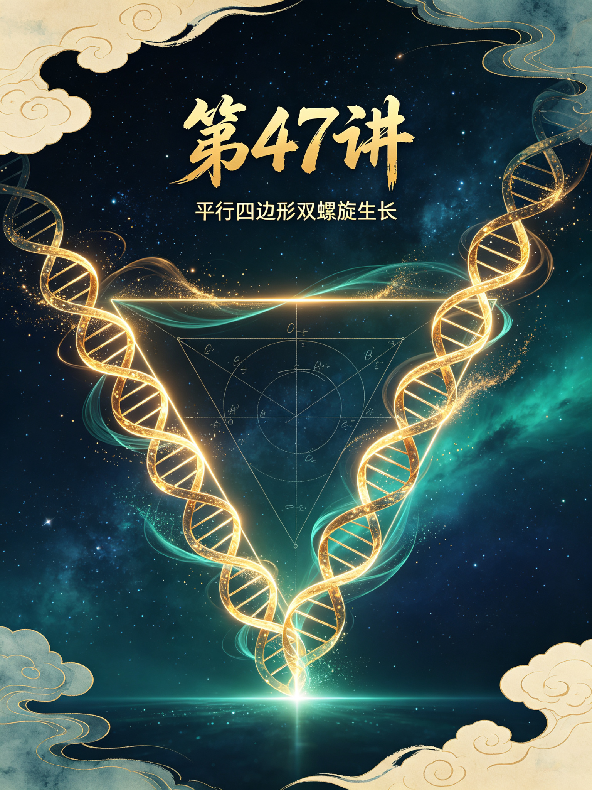

<ArchiveCopyPanel article-id="162348221" />

{"markdown":"PiDliIbnsbvvvJrmlofmmI7ov5vpmLYyMDDorrIgIAo+IOe8luWPt++8mmAxNjIzNDgyMjFgICAKPiDljp/lp4vmlofku7bvvJpg5bmz6KGM5Zub6L655b2i5Yik5a6a5LiN5piv6L656KeS5p2h5Lu25ou85YeR5piv5Lik57uE5Y+M5ZCR5ZCM5q2l5Y+M6J665peL5Lqk57uH5b2i5oiQ55qE6Zet5ZCI55Sf6ZW/6L2u5buTLeWFqOWfn+aVsOWtpnZz5Lyg57uf5pWw5a2m5Lq657G75paHLTE2MjM0ODIyMS5tZGAgIAo+IOi/lOWbnu+8mlvmnKzkuablvZLmoaNdKC96aC9ib29rcy9jb3Vyc2UvYXJ0aWNsZXMvKSDCtyBb5oC75YWl5Y+jXSgvemgvYm9va3MvYXJ0aWNsZXMvKQoKIVvnrKw0N+iusiDlubPooYzlm5vovrnlvaLlj4zonrrml4vnlJ/plb9dKC4vYXNzZXRzL2NzZG5pbWcvanBnL2Q3MDI5OTNmYjMxYjMwZjkuanBnKQoK5L2c6ICF77yaIOS5luS5luaVsOWtpgoKIyMg44CK5YWo5Z+f5pWw5a2mdnPkvKDnu5/mlbDlrabvvJrkurrnsbvmlofmmI7ov5vpmLYyMDDorrLjgIvnrKw0N+iusiDkuK3lrabpgJrkv5fniYjpgJDlrZfnqL8KCi0tLQoK6K6y5qyh77yaIOesrDQ36K6yCgrkuLvpopjvvJog5bmz6KGM5Zub6L655b2i5Yik5a6a5LiN5piv6L656KeS5p2h5Lu25ou85YeR77yM5piv5Lik57uE5Y+M5ZCR5ZCM5q2l5Y+M6J665peL5Lqk57uH5b2i5oiQ55qE6Zet5ZCI55Sf6ZW/6L2u5buTCgrlr7nmoIfor77mnKznn6Xor4bngrnvvJog5bmz6KGM5Zub6L655b2i5Yik5a6a5a6a55CG44CB5oCn6LSoCgrmlofpo47vvJog5aSn55m96K+d44CB5peg5pmm5rap5LiT5Lia6K+N5rGH77yM5bu257utMC8x5Z+654K544CB5Y+M6J665peL5YWo5aWX5q+U5Za7CgotLS0KCiMjIyAw772eM+WIhumSnyDlpI3kuaDlr7zlhaUKCiFb5aSN5Lmg5a+85YWlXSguL2Fzc2V0cy9jc2RuaW1nL2pwZy82OGE3YWEyY2FiZjc5ZWVhLmpwZykKCuWQjOWtpuS7rO+8jOS4iuS4gOiKguivvuaIkeS7rOW8hOaHguS6huaWueW3ruOAgeagh+WHhuW3rueahOacrOa6kO+8jOWug+S4jeaYr+WNlee6r+eahOe7n+iuoeiuoeeul+WFrOW8j++8jOaYr+eUqOadpeS4iOmHj+WPjOieuuaXi+eUn+mVv+iKgueCueWBj+emu+S4u+W5suiEiee7nOi/nOi/keW5heW6pueahOWkqeeEtuagh+WwuuOAggoK5Yid5Lit5Yeg5L2V5qC45b+D5Zu+5b2i5bmz6KGM5Zub6L655b2i77yM6K++5aCC5LiK6ICB5biI5Lya572X5YiX5aW95Yeg5p2h5Yik5a6a6KeE5YiZ77ya5Lik57uE5a+56L655bmz6KGM44CB5Lik57uE5a+56L6555u4562J44CB5LiA57uE5a+56L655bmz6KGM5LiU55u4562J44CB5a+56KeS57q/5LqS55u45bmz5YiG77yM5YWo6YOo5piv6Z2g6L656KeS44CB57q/5q615p2h5Lu25Y675Yik5pat5Zu+5b2i44CCCgotLS0KCiMjIyAz772eMTPliIbpkp8g55Sf5rS75YyW57G75q+U6K6y6KejCgohW+eUn+a0u+WMluexu+avlF0oLi9hc3NldHMvY3NkbmltZy9qcGcvYTdmZWQxYWM2MmQ2ZjQzNS5qcGcpCgrlhYjorrLor77mnKzph4zlubPooYzlm5vovrnlvaLliKTlrprpgLvovpHvvJoKCuWPquimgea7oei2s+S7u+aEj+S4gOadoeWIpOWumuadoeS7tu+8jOWwseiDveehruWumuaYr+W5s+ihjOWbm+i+ueW9ou+8jOWBmumimOS+nemdoOi+ueinkuOAgeWvueinkue6v+etiemHj+WFs+ezu+ivgeaYju+8jOS7heS9nOS4uuWHoOS9leivgeaYjuW3peWFt+OAggoK5pS+5Yiw5Y+M6J665peL55Sf6ZW/5L2T57O76YeM77yaCgrku47lkIzkuIDln7rngrnliIbljJblh7rkuKTlpZfni6znq4vnmoTlj4zonrrml4vohInnu5zvvIznrKzkuIDnu4Tonrrml4vnu5/kuIDmnJ3lt6bkuIrmlrnljIDpgJ/lu7bkvLjvvIznrKzkuoznu4Tonrrml4vnu5/kuIDmnJ3lj7PkuIrmlrnljIDpgJ/lu7bkvLjvvJsKCuS4pOe7hOieuuaXi+WQhOiHquW7tuS8uOebuOWQjOmVv+W6puWQju+8jOmmluWwvuS6kuebuOi/nuaOpemXreWQiO+8jOWbm+adoei+uee6v+WwseaYr+S4pOe7hOieuuaXi+eahOeUn+mVv+aute+8jOWkqeeEtuW9ouaIkOWvuei+ueW5s+ihjOOAgeWvuei+ueebuOetieeahOWwgemXrei9ruW7k+OAggoK5a+56KeS57q/5LqS55u45bmz5YiG77yM5pys6LSo5piv5Lik57uE6J665peL55u45Lqk55qE5Lqk5rGH54K55Yia5aW95aSE5Zyo5Lik5aWX6ISJ57uc55qE55Sf6ZW/5Lit54K577yM5piv5ZCM5q2l55Sf6ZW/6Ieq5bim55qE5bmz6KGh54m55b6B44CCCgrkuL7nroDljZXkvovlrZDvvJoKCuivvuacrOinhuinku+8muWbm+i+ueW9ouS4pOe7hOWvuei+ueWIhuWIq+W5s+ihjO+8jOaJgOS7peaYr+W5s+ihjOWbm+i+ueW9ouOAggoK5YWo5Z+f6YCa5L+X6Kej6K+777ya5Lik57uE5ZCM5q2l5ZCM5ZCR55qE5Y+M6J665peL6ISJ57uc5Lqk57uH6Zet5ZCI77yM6L6557q/5aSp54S25L+d5oyB5bmz6KGM562J6ZW/77ybIuWvuei+ueW5s+ihjCLlj6rmmK/ov5nlpZfonrrml4vnlJ/plb/nu5PmnoTmmL7njrDlh7rmnaXnmoTooajlsYLnibnlvoHvvIzkuI3mmK/kurrkuLrop4TlrprnmoTliKTlrprmoIflh4bjgIIKCuivvuacrOWPquaIquWPluWbvuW9oui+ueinkuetiemHj+WFs+ezu+WBmuivgeaYju+8jOW/veeVpeW5s+ihjOWbm+i+ueW9ouW6leWxguaYr+S4pOe7hOWQjOatpeWPjOieuuaXi+S6pOe7h+mXreWQiOeahOWOn+eUn+eUn+mVv+e7k+aehOOAggoKLS0tCgojIyMgMTPvvZ4yMuWIhumSnyDor77mnKzop4LngrkgdnMg5YWo5Z+f5pWw5a2m6YCa5L+X6KeC54K5CgohW+ivvuacrHZz5YWo5Z+f5a+55q+UXSguL2Fzc2V0cy9jc2RuaW1nL2pwZy8wYTI3N2YwZTNlYzg5MGEyLmpwZykKCiMjIyMg5Lyg57uf6K++5pys6K6k55+lCgotIAoK5bmz6KGM5Zub6L655b2i5piv5L6d6Z2g6L656KeS5p2h5Lu25Lq65Li65a6a5LmJ55qE5Zu+5b2i77yM5LiN5a2Y5Zyo5Y6f55Sf6J665peL55Sf6ZW/57uT5p6ECgotIAoK5aSa5p2h5Yik5a6a5a6a55CG5piv5Lq65Li65oC757uT55qE5YGa6aKY5aWX6Lev77yM5b285q2k5LmL6Ze05rKh5pyJ57uf5LiA5bqV5bGC6YC76L6RCgotIAoK5a+56KeS57q/5bmz5YiG44CB5a+56KeS55u4562J5Y+q5piv6K6h566X6KGN55Sf57uT6K6677yM5ZKM6J665peL5ZCM5q2l55Sf6ZW/5peg5YWzCgojIyMjIOWFqOWfn+aVsOWtpumAmuS/l+iupOefpQoKLSAKCuW5s+ihjOWbm+i+ueW9ouacrOa6kOaYr+S4pOe7hOWQjOWQkeWQjOatpeWPjOieuuaXi+mmluWwvuS6pOe7h+mXreWQiO+8jOe7k+aehOWkqeeUn+iHquW4puWvuei+ueW5s+ihjOetiemVv+OAgeWvueinkuebuOetiQoKLSAKCuaJgOacieWIpOWumuWumueQhu+8jOmDveaYr+WQjOS4gOWll+WPjOieuuaXi+S6pOe7h+e7k+aehOS7juS4jeWQjOingua1i+inkuW6pueci+WIsOeahOWkluWcqOeJueW+gQoKLSAKCuefqeW9ouOAgeiPseW9ouOAgeato+aWueW9oumDveaYr+W5s+ihjOWbm+i+ueW9oueahOeJueauiuW9ouaAge+8jOWvueW6lOieuuaXi+eUn+mVv+WPoOWKoOWeguebtOOAgeetieWAjeeOh+WvueensOe6puadnwoK566A5Y2V5q+U5Za777yaCgror77mnKzliKTlrprlpoLlkIzmi7/nnYDlsLrlrZDmr5Tlr7nlm5vmnaHovrnjgIHlm5vkuKrop5LvvIzlvLrooYzljLnphY3mnaHku7bvvJsKCuacrOa6kOW5s+ihjOWbm+i+ueW9ouWmguWQjOS4pOadoeW5s+ihjOiXpOiUk+OAgeWPpuS4gOe7hOW5s+ihjOiXpOiUk+S6pOWPieWbtOaIkOmXreWQiOi9ruW7k++8jOW5s+ihjOetiemVv+aYr+iXpOiUk+WQjOatpeeUn+mVv+iHquW4pueahOW9ouaAgeOAggoKLS0tCgojIyMgMjLvvZ4yN+WIhumSnyDmoKHlhoXlrabkuaDmj5DphpLvvIzkuI3lvbHlk43ogIPor5XlvpfliIYKCiFb5qCh5YaF5o+Q6YaS5LiO5LyP56yU6ZO65Z6rXSguL2Fzc2V0cy9jc2RuaW1nL2pwZy8wOTAyZTMwYWZmZmNiZDEzLmpwZykKCuW5s+ihjOWbm+i+ueW9ouivgeaYjuOAgeWIpOWumuOAgei+uemVv+inkuW6puiuoeeul+mimO+8jOS4peagvOaMieeFp+ivvuacrOWIpOWumuWumueQhuS5puWGmeatpemqpO+8jOiAg+ivleS4jeS8muaJo+WIhuOAggoK5pys6IqC6K++5Y+q5piv5ouT5bGV6auY57u05pys5rqQ6K6k55+l77ya5bmz6KGM5Zub6L655b2i5piv5Lik57uE5ZCM5ZCR5ZCM5q2l5Y+M6J665peL5Lqk57uH6Zet5ZCI5b2i5oiQ55qE5Y6f55Sf6L2u5buT77yM5ZCE57G75Yik5a6a5p2h5Lu25Y+q5piv57uT5p6E5aSW5Zyo6KGo6LGh44CCCgotLS0KCiMjIyAyN++9njMw5YiG6ZKfIOivvuWgguaAu+e7kyvkuIvoioLor77pooTlkYoKCiFb6K++5aCC5oC757uTK+S4i+iKguivvumihOWRil0oLi9hc3NldHMvY3NkbmltZy9qcGcvMmUwYTkxNjJmODE2M2U4OC5qcGcpCgojIyMjIOacrOiKguivvuWwj+e7k++8mgoK5bmz6KGM5Zub6L655b2i55Sx5Lik57uE5ZCM5ZCR5ZCM5q2l5Y+M6J665peL5Lqk57uH6Zet5ZCI55Sf5oiQ77yM5a+56L655bmz6KGM44CB5a+56KeS57q/5bmz5YiG562J5oCn6LSo6YO95piv5ZCM5q2l55Sf6ZW/6Ieq5bim54m55b6B77yM5ZCE57G75Yik5a6a5a6a55CG5LuF5Li66KGo5bGC6KeC5rWL57uT6K6644CCCgojIyMjIOS4i+S4gOiKguivvu+8mgoK5YiG5byP5LiN5piv5YiG5a2Q5YiG5q+N5ouG5YiG6L+Q566X77yM5piv5Lik5p2h5bGC57qn5LiN5ZCM55qE5Y+M6J665peL55Sf6ZW/5oC76YeP55qE5q+U5YC86KeC5rWL5b2i5oCB44CCCgotLS0KCiFb5pS25bC+54mH5bC+XSguL2Fzc2V0cy9jc2RuaW1nL2pwZy8wOWUyZDQ1OTIzNzMwOGJjLmpwZykK","text":"5YiG57G777ya5paH5piO6L+b6Zi2MjAw6K6yICAK57yW5Y+377yaMTYyMzQ4MjIxICAK5Y6f5aeL5paH5Lu277ya5bmz6KGM5Zub6L655b2i5Yik5a6a5LiN5piv6L656KeS5p2h5Lu25ou85YeR5piv5Lik57uE5Y+M5ZCR5ZCM5q2l5Y+M6J665peL5Lqk57uH5b2i5oiQ55qE6Zet5ZCI55Sf6ZW/6L2u5buTLeWFqOWfn+aVsOWtpnZz5Lyg57uf5pWw5a2m5Lq657G75paHLTE2MjM0ODIyMS5tZCAgCui/lOWbnu+8muacrOS5puW9kuahoyDCtyDmgLvlhaXlj6MKCuesrDQ36K6yIOW5s+ihjOWbm+i+ueW9ouWPjOieuuaXi+eUn+mVvwoK5L2c6ICF77yaIOS5luS5luaVsOWtpgoK44CK5YWo5Z+f5pWw5a2mdnPkvKDnu5/mlbDlrabvvJrkurrnsbvmlofmmI7ov5vpmLYyMDDorrLjgIvnrKw0N+iusiDkuK3lrabpgJrkv5fniYjpgJDlrZfnqL8KCi0tLQoK6K6y5qyh77yaIOesrDQ36K6yCgrkuLvpopjvvJog5bmz6KGM5Zub6L655b2i5Yik5a6a5LiN5piv6L656KeS5p2h5Lu25ou85YeR77yM5piv5Lik57uE5Y+M5ZCR5ZCM5q2l5Y+M6J665peL5Lqk57uH5b2i5oiQ55qE6Zet5ZCI55Sf6ZW/6L2u5buTCgrlr7nmoIfor77mnKznn6Xor4bngrnvvJog5bmz6KGM5Zub6L655b2i5Yik5a6a5a6a55CG44CB5oCn6LSoCgrmlofpo47vvJog5aSn55m96K+d44CB5peg5pmm5rap5LiT5Lia6K+N5rGH77yM5bu257utMC8x5Z+654K544CB5Y+M6J665peL5YWo5aWX5q+U5Za7CgotLS0KCjDvvZ4z5YiG6ZKfIOWkjeS5oOWvvOWFpQoK5aSN5Lmg5a+85YWlCgrlkIzlrabku6zvvIzkuIrkuIDoioLor77miJHku6zlvITmh4Lkuobmlrnlt67jgIHmoIflh4blt67nmoTmnKzmupDvvIzlroPkuI3mmK/ljZXnuq/nmoTnu5/orqHorqHnrpflhazlvI/vvIzmmK/nlKjmnaXkuIjph4/lj4zonrrml4vnlJ/plb/oioLngrnlgY/nprvkuLvlubLohInnu5zov5zov5HluYXluqbnmoTlpKnnhLbmoIflsLrjgIIKCuWIneS4reWHoOS9leaguOW/g+WbvuW9ouW5s+ihjOWbm+i+ueW9ou+8jOivvuWgguS4iuiAgeW4iOS8mue9l+WIl+WlveWHoOadoeWIpOWumuinhOWIme+8muS4pOe7hOWvuei+ueW5s+ihjOOAgeS4pOe7hOWvuei+ueebuOetieOAgeS4gOe7hOWvuei+ueW5s+ihjOS4lOebuOetieOAgeWvueinkue6v+S6kuebuOW5s+WIhu+8jOWFqOmDqOaYr+mdoOi+ueinkuOAgee6v+auteadoeS7tuWOu+WIpOaWreWbvuW9ouOAggoKLS0tCgoz772eMTPliIbpkp8g55Sf5rS75YyW57G75q+U6K6y6KejCgrnlJ/mtLvljJbnsbvmr5QKCuWFiOiusuivvuacrOmHjOW5s+ihjOWbm+i+ueW9ouWIpOWumumAu+i+ke+8mgoK5Y+q6KaB5ruh6Laz5Lu75oSP5LiA5p2h5Yik5a6a5p2h5Lu277yM5bCx6IO956Gu5a6a5piv5bmz6KGM5Zub6L655b2i77yM5YGa6aKY5L6d6Z2g6L656KeS44CB5a+56KeS57q/562J6YeP5YWz57O76K+B5piO77yM5LuF5L2c5Li65Yeg5L2V6K+B5piO5bel5YW344CCCgrmlL7liLDlj4zonrrml4vnlJ/plb/kvZPns7vph4zvvJoKCuS7juWQjOS4gOWfuueCueWIhuWMluWHuuS4pOWll+eLrOeri+eahOWPjOieuuaXi+iEiee7nO+8jOesrOS4gOe7hOieuuaXi+e7n+S4gOacneW3puS4iuaWueWMgOmAn+W7tuS8uO+8jOesrOS6jOe7hOieuuaXi+e7n+S4gOacneWPs+S4iuaWueWMgOmAn+W7tuS8uO+8mwoK5Lik57uE6J665peL5ZCE6Ieq5bu25Ly455u45ZCM6ZW/5bqm5ZCO77yM6aaW5bC+5LqS55u46L+e5o6l6Zet5ZCI77yM5Zub5p2h6L6557q/5bCx5piv5Lik57uE6J665peL55qE55Sf6ZW/5q6177yM5aSp54S25b2i5oiQ5a+56L655bmz6KGM44CB5a+56L6555u4562J55qE5bCB6Zet6L2u5buT44CCCgrlr7nop5Lnur/kupLnm7jlubPliIbvvIzmnKzotKjmmK/kuKTnu4Tonrrml4vnm7jkuqTnmoTkuqTmsYfngrnliJrlpb3lpITlnKjkuKTlpZfohInnu5znmoTnlJ/plb/kuK3ngrnvvIzmmK/lkIzmraXnlJ/plb/oh6rluKbnmoTlubPooaHnibnlvoHjgIIKCuS4vueugOWNleS+i+WtkO+8mgoK6K++5pys6KeG6KeS77ya5Zub6L655b2i5Lik57uE5a+56L655YiG5Yir5bmz6KGM77yM5omA5Lul5piv5bmz6KGM5Zub6L655b2i44CCCgrlhajln5/pgJrkv5fop6Por7vvvJrkuKTnu4TlkIzmraXlkIzlkJHnmoTlj4zonrrml4vohInnu5zkuqTnu4fpl63lkIjvvIzovrnnur/lpKnnhLbkv53mjIHlubPooYznrYnplb/vvJsi5a+56L655bmz6KGMIuWPquaYr+i/meWll+ieuuaXi+eUn+mVv+e7k+aehOaYvueOsOWHuuadpeeahOihqOWxgueJueW+ge+8jOS4jeaYr+S6uuS4uuinhOWumueahOWIpOWumuagh+WHhuOAggoK6K++5pys5Y+q5oiq5Y+W5Zu+5b2i6L656KeS562J6YeP5YWz57O75YGa6K+B5piO77yM5b+955Wl5bmz6KGM5Zub6L655b2i5bqV5bGC5piv5Lik57uE5ZCM5q2l5Y+M6J665peL5Lqk57uH6Zet5ZCI55qE5Y6f55Sf55Sf6ZW/57uT5p6E44CCCgotLS0KCjEz772eMjLliIbpkp8g6K++5pys6KeC54K5IHZzIOWFqOWfn+aVsOWtpumAmuS/l+ingueCuQoK6K++5pysdnPlhajln5/lr7nmr5QKCuS8oOe7n+ivvuacrOiupOefpQrlubPooYzlm5vovrnlvaLmmK/kvp3pnaDovrnop5LmnaHku7bkurrkuLrlrprkuYnnmoTlm77lvaLvvIzkuI3lrZjlnKjljp/nlJ/onrrml4vnlJ/plb/nu5PmnoQK5aSa5p2h5Yik5a6a5a6a55CG5piv5Lq65Li65oC757uT55qE5YGa6aKY5aWX6Lev77yM5b285q2k5LmL6Ze05rKh5pyJ57uf5LiA5bqV5bGC6YC76L6RCuWvueinkue6v+W5s+WIhuOAgeWvueinkuebuOetieWPquaYr+iuoeeul+ihjeeUn+e7k+iuuu+8jOWSjOieuuaXi+WQjOatpeeUn+mVv+aXoOWFswoK5YWo5Z+f5pWw5a2m6YCa5L+X6K6k55+lCuW5s+ihjOWbm+i+ueW9ouacrOa6kOaYr+S4pOe7hOWQjOWQkeWQjOatpeWPjOieuuaXi+mmluWwvuS6pOe7h+mXreWQiO+8jOe7k+aehOWkqeeUn+iHquW4puWvuei+ueW5s+ihjOetiemVv+OAgeWvueinkuebuOetiQrmiYDmnInliKTlrprlrprnkIbvvIzpg73mmK/lkIzkuIDlpZflj4zonrrml4vkuqTnu4fnu5PmnoTku47kuI3lkIzop4LmtYvop5LluqbnnIvliLDnmoTlpJblnKjnibnlvoEK55+p5b2i44CB6I+x5b2i44CB5q2j5pa55b2i6YO95piv5bmz6KGM5Zub6L655b2i55qE54m55q6K5b2i5oCB77yM5a+55bqU6J665peL55Sf6ZW/5Y+g5Yqg5Z6C55u044CB562J5YCN546H5a+556ew57qm5p2fCgrnroDljZXmr5TllrvvvJoKCuivvuacrOWIpOWumuWmguWQjOaLv+edgOWwuuWtkOavlOWvueWbm+adoei+ueOAgeWbm+S4quinku+8jOW8uuihjOWMuemFjeadoeS7tu+8mwoK5pys5rqQ5bmz6KGM5Zub6L655b2i5aaC5ZCM5Lik5p2h5bmz6KGM6Jek6JST44CB5Y+m5LiA57uE5bmz6KGM6Jek6JST5Lqk5Y+J5Zu05oiQ6Zet5ZCI6L2u5buT77yM5bmz6KGM562J6ZW/5piv6Jek6JST5ZCM5q2l55Sf6ZW/6Ieq5bim55qE5b2i5oCB44CCCgotLS0KCjIy772eMjfliIbpkp8g5qCh5YaF5a2m5Lmg5o+Q6YaS77yM5LiN5b2x5ZON6ICD6K+V5b6X5YiGCgrmoKHlhoXmj5DphpLkuI7kvI/nrJTpk7rlnqsKCuW5s+ihjOWbm+i+ueW9ouivgeaYjuOAgeWIpOWumuOAgei+uemVv+inkuW6puiuoeeul+mimO+8jOS4peagvOaMieeFp+ivvuacrOWIpOWumuWumueQhuS5puWGmeatpemqpO+8jOiAg+ivleS4jeS8muaJo+WIhuOAggoK5pys6IqC6K++5Y+q5piv5ouT5bGV6auY57u05pys5rqQ6K6k55+l77ya5bmz6KGM5Zub6L655b2i5piv5Lik57uE5ZCM5ZCR5ZCM5q2l5Y+M6J665peL5Lqk57uH6Zet5ZCI5b2i5oiQ55qE5Y6f55Sf6L2u5buT77yM5ZCE57G75Yik5a6a5p2h5Lu25Y+q5piv57uT5p6E5aSW5Zyo6KGo6LGh44CCCgotLS0KCjI3772eMzDliIbpkp8g6K++5aCC5oC757uTK+S4i+iKguivvumihOWRigoK6K++5aCC5oC757uTK+S4i+iKguivvumihOWRigoK5pys6IqC6K++5bCP57uT77yaCgrlubPooYzlm5vovrnlvaLnlLHkuKTnu4TlkIzlkJHlkIzmraXlj4zonrrml4vkuqTnu4fpl63lkIjnlJ/miJDvvIzlr7novrnlubPooYzjgIHlr7nop5Lnur/lubPliIbnrYnmgKfotKjpg73mmK/lkIzmraXnlJ/plb/oh6rluKbnibnlvoHvvIzlkITnsbvliKTlrprlrprnkIbku4XkuLrooajlsYLop4LmtYvnu5PorrrjgIIKCuS4i+S4gOiKguivvu+8mgoK5YiG5byP5LiN5piv5YiG5a2Q5YiG5q+N5ouG5YiG6L+Q566X77yM5piv5Lik5p2h5bGC57qn5LiN5ZCM55qE5Y+M6J665peL55Sf6ZW/5oC76YeP55qE5q+U5YC86KeC5rWL5b2i5oCB44CCCgotLS0KCuaUtuWwvueJh+Wwvg=="}

> 分类：文明进阶200讲  
> 编号：`162348221`  
> 原始文件：`平行四边形判定不是边角条件拼凑是两组双向同步双螺旋交织形成的闭合生长轮廓-全域数学vs传统数学人类文-162348221.md`  
> 返回：[本书归档](/zh/books/course/articles/) · [总入口](/zh/books/articles/)

<ArticlePaperMeta category="文明进阶200讲" article-id="162348221" title="平行四边形判定不是边角条件拼凑是两组双向同步双螺旋交织形成的闭合生长轮廓-全域数学vs传统数学人类文" paper-kind="课程讲义" book-route="/zh/books/course/articles/" overview-route="/zh/books/articles/" summary="对标课本知识点： 平行四边形判定定理、性质" author="乖乖数学" lecture="第47讲" theme="平行四边形判定不是边角条件拼凑，是两组双向同步双螺旋交织形成的闭合生长轮廓" source-file="平行四边形判定不是边角条件拼凑是两组双向同步双螺旋交织形成的闭合生长轮廓-全域数学vs传统数学人类文-162348221.md" cover="./assets/csdnimg/jpg/d702993fb31b30f9.jpg" />

作者： 乖乖数学

## 《全域数学vs传统数学：人类文明进阶200讲》第47讲 中学通俗版逐字稿

---

讲次： 第47讲

主题： 平行四边形判定不是边角条件拼凑，是两组双向同步双螺旋交织形成的闭合生长轮廓

对标课本知识点： 平行四边形判定定理、性质

文风： 大白话、无晦涩专业词汇，延续0/1基点、双螺旋全套比喻

---

### 0～3分钟 复习导入

同学们，上一节课我们弄懂了方差、标准差的本源，它不是单纯的统计计算公式，是用来丈量双螺旋生长节点偏离主干脉络远近幅度的天然标尺。

初中几何核心图形平行四边形，课堂上老师会罗列好几条判定规则：两组对边平行、两组对边相等、一组对边平行且相等、对角线互相平分，全部是靠边角、线段条件去判断图形。

---

### 3～13分钟 生活化类比讲解

先讲课本里平行四边形判定逻辑：

只要满足任意一条判定条件，就能确定是平行四边形，做题依靠边角、对角线等量关系证明，仅作为几何证明工具。

放到双螺旋生长体系里：

从同一基点分化出两套独立的双螺旋脉络，第一组螺旋统一朝左上方匀速延伸，第二组螺旋统一朝右上方匀速延伸；

两组螺旋各自延伸相同长度后，首尾互相连接闭合，四条边线就是两组螺旋的生长段，天然形成对边平行、对边相等的封闭轮廓。

对角线互相平分，本质是两组螺旋相交的交汇点刚好处在两套脉络的生长中点，是同步生长自带的平衡特征。

举简单例子：

课本视角：四边形两组对边分别平行，所以是平行四边形。

全域通俗解读：两组同步同向的双螺旋脉络交织闭合，边线天然保持平行等长；"对边平行"只是这套螺旋生长结构显现出来的表层特征，不是人为规定的判定标准。

课本只截取图形边角等量关系做证明，忽略平行四边形底层是两组同步双螺旋交织闭合的原生生长结构。

---

### 13～22分钟 课本观点 vs 全域数学通俗观点

#### 传统课本认知

- 

平行四边形是依靠边角条件人为定义的图形，不存在原生螺旋生长结构

- 

多条判定定理是人为总结的做题套路，彼此之间没有统一底层逻辑

- 

对角线平分、对角相等只是计算衍生结论，和螺旋同步生长无关

#### 全域数学通俗认知

- 

平行四边形本源是两组同向同步双螺旋首尾交织闭合，结构天生自带对边平行等长、对角相等

- 

所有判定定理，都是同一套双螺旋交织结构从不同观测角度看到的外在特征

- 

矩形、菱形、正方形都是平行四边形的特殊形态，对应螺旋生长叠加垂直、等倍率对称约束

简单比喻：

课本判定如同拿着尺子比对四条边、四个角，强行匹配条件；

本源平行四边形如同两条平行藤蔓、另一组平行藤蔓交叉围成闭合轮廓，平行等长是藤蔓同步生长自带的形态。

---

### 22～27分钟 校内学习提醒，不影响考试得分

平行四边形证明、判定、边长角度计算题，严格按照课本判定定理书写步骤，考试不会扣分。

本节课只是拓展高维本源认知：平行四边形是两组同向同步双螺旋交织闭合形成的原生轮廓，各类判定条件只是结构外在表象。

---

### 27～30分钟 课堂总结+下节课预告

#### 本节课小结：

平行四边形由两组同向同步双螺旋交织闭合生成，对边平行、对角线平分等性质都是同步生长自带特征，各类判定定理仅为表层观测结论。

#### 下一节课：

分式不是分子分母拆分运算，是两条层级不同的双螺旋生长总量的比值观测形态。

---

