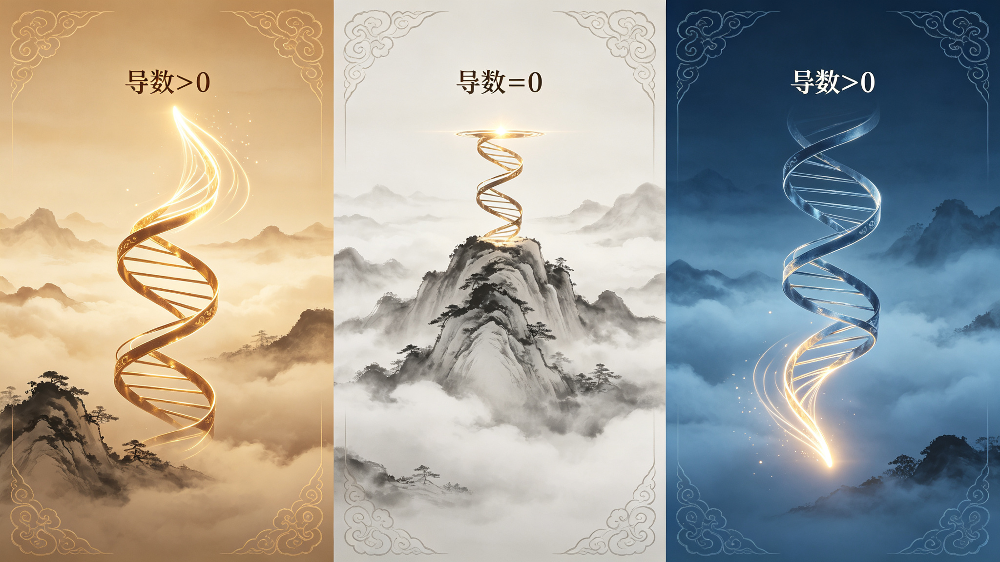

<ArchiveCopyPanel article-id="162348332" />

{"markdown":"PiDliIbnsbvvvJrmlofmmI7ov5vpmLYyMDDorrIgIAo+IOe8luWPt++8mmAxNjIzNDgzMzJgICAKPiDljp/lp4vmlofku7bvvJpg5a+85pWw5LiN5piv556s5pe25Y+Y5YyW546H6K6h566X5YWs5byP5piv5Y+M6J665peL55Sf6ZW/6L2o6L+55bGA6YOo5b6u5bCP5YiG5bGC55qE556s5pe25ryU5YyW5pac546HLeWFqOWfn+aVsOWtpnZz5Lyg57uf5pWw5a2m5Lq657G75paH5piO6L+bLTE2MjM0ODMzMi5tZGAgIAo+IOi/lOWbnu+8mlvmnKzkuablvZLmoaNdKC96aC9ib29rcy9jb3Vyc2UvYXJ0aWNsZXMvKSDCtyBb5oC75YWl5Y+jXSgvemgvYm9va3MvYXJ0aWNsZXMvKQoKIVvnrKw1MeiusiDlr7zmlbDCt+WPjOieuuaXi+eUn+mVv+i9qOi/uV0oLi9hc3NldHMvY3NkbmltZy9qcGcvMTM5OTU5NzI1NWE0YmQ5ZS5qcGcpCgrkvZzogIXvvJog5LmW5LmW5pWw5a2mCgojIyDjgIrlhajln5/mlbDlraZ2c+S8oOe7n+aVsOWtpu+8muS6uuexu+aWh+aYjui/m+mYtjIwMOiusuOAi+esrDUx6K6y77yI6auY5Lit5byA56+H56ys5LiA6K++77yJCgrorrLmrKHvvJog56ysNTHorrIKCuS4u+mimO+8miDlr7zmlbDkuI3mmK/nnqzml7blj5jljJbnjoforqHnrpflhazlvI/vvIzmmK/lj4zonrrml4vnlJ/plb/ovajov7nlsYDpg6jlvq7lsI/liIblsYLnmoTnnqzml7bmvJTljJbmlpznjocKCuWvueagh+ivvuacrOefpeivhueCue+8miDlr7zmlbDlrprkuYnjgIHnnqzml7blj5jljJbnjocKCuaWh+mjju+8miDlpKfnmb3or53jgIHml6DmmabmtqnkuJPkuJror43msYfvvIzlu7bnu60wLzHln7rngrnjgIHlj4zonrrml4vlhajlpZfmr5TllrsKCi0tLQoKIyMjIDDvvZ4z5YiG6ZKfIOWkjeS5oOWvvOWFpQoK5LuO5LuK5aSp5byA5aeL77yM5q2j5byP6L+b5YWl6auY5Lit6auY6Zi25pWw55CG56+H56ug77yM56ys5LiA6K++5qC45b+D5YaF5a655bCx5piv5a+85pWw44CC6K++5pys57uZ5Ye65a6a5LmJ77ya5a+85pWw5Luj6KGo5Ye95pWw5Zyo5p+Q5LiA54K555qE556s5pe25Y+Y5YyW546H77yM5L6d6Z2g5p6B6ZmQ6L+Q566X5o6o5a+877yM5piv55So5p2l566X5aKe5YeP44CB5p6B5YC855qE5bel5YW344CCCgrku4rlpKnmiJHku6zmi4npq5joh7PmnKzmupDnu7Tluqbop6Por7vvvJrlr7zmlbDkuI3mmK/kurrkuLrorr7orqHnmoTmnoHpmZDov5DnrpfnrpflvI/vvIzmmK/ku7vmhI/kuIDmrrXonrrml4vovajov7nmiKrlj5bmnoHlsI/kuIDmrrXlvq7op4LliIblsYLvvIzov5nmrrXlvq7lsI/ohInnu5zoh6rouqvlu7bkvLjnmoTlgL7mlpzmlpznjofvvIzmmK/onrrml4vlvq7op4LmvJTljJbnmoTljp/nlJ/liLvluqbjgIIKCiFbMOOAgTHjgIHiiJ7kuInmnoHmnKzmupDlj4zonrrml4vnlJ/plb9dKC4vYXNzZXRzL2NzZG5pbWcvanBnL2M1NmNkZWRkMGM4YjI3N2QuanBnKQoKLS0tCgojIyMgM++9njEz5YiG6ZKfIOeUn+a0u+WMluexu+avlOiusuinowoK5YWI6K6y6K++5pys6YeM5a+85pWw55qE6YC76L6R77yaCgrlj5blh73mlbDkuIrkuIDngrnpmYTov5HmnoHov5HnmoTkuKTkuKrngrnvvIzkvZzlibLnur/vvIzkuKTngrnml6DpmZDpnaDov5HvvIzlibLnur/ml6DpmZDotLTov5HliIfnur/vvIzlibLnur/mlpznjofnmoTmnoHpmZDlsLHmmK/or6Xngrnlr7zmlbDvvIzlj6rnlKjmnaXliKTmlq3lh73mlbDljYfpmY3jgIHmsYLmnIDlgLzjgIIKCuaUvuWIsOWPjOieuuaXi+eUn+mVv+S9k+ezu+mHjO+8mgoK5pW05p2h5Ye95pWw5puy57q/5piv5a6M5pW05a6P6KeC5Y+M6J665peL55Sf6ZW/6L2o6L+577ybCgrlro/op4Lonrrml4vlj6/ku6Xmi4bliIbkuLrml6DmlbDml6DpmZDnu4blsI/nmoTlvq7op4LnlJ/plb/oloTlsYLvvIzmr4/kuIDlsYLoloTlsYLlsLrluqbotovov5Hml6DnqbflsI/vvIzlr7nlupTmnoHpmZDov4fnqIvvvJsKCuiWhOWxguS4pOerr+eahOmrmOW6puW3ruOAgeW7tuS8uOmVv+W6pueahOavlOWAvO+8jOWwseaYr+i/meS4gOauteW+ruinguieuuaXi+eahOWAvuaWnOeoi+W6pu+8jOS5n+WwseaYr+WvvOaVsO+8mwoKLSDlr7zmlbA+MD4wPjDvvJrlvq7op4Lonrrml4vlkJHkuIrlu7bkvLjvvIzmlbTkvZPovajov7nlpITkuo7kuIrljYfnlJ/plb/pmLbmrrXvvJsKCi0g5a+85pWwPDA8MDww77ya5b6u6KeC6J665peL5ZCR5LiL5pS257yp77yM5pW05L2T6L2o6L+55aSE5LqO5Zue6JC96KGw5YeP6Zi25q6177ybCgotIOWvvOaVsD0wPTA9MO+8muW+ruinguieuuaXi+awtOW5s+W5s+mTuu+8jOWvueW6lOieuuaXi+eUn+mVv+eahOWzsOmhtuOAgeiwt+W6le+8jOS5n+WwseaYr+WHveaVsOaegeWAvOeCueOAggoKIVvlj4zonrrml4vlvq7op4LliIblsYLkuI7liIfnur/mlpznjoddKC4vYXNzZXRzL2NzZG5pbWcvanBnLzEwOGQyMzgyYWU2N2E0MjQuanBnKQoK5Li+566A5Y2V5L6L5a2Q77yaCgror77mnKzop4bop5LvvJp5PXgyeT14XjJ5PXgyIOWcqCB4PTN4PTN4PTMg5aSE5a+85pWw5Li6IDY2Nu+8jOWPquaYr+ivpeeCueeerOaXtuWPmOWMlumAn+eOh+OAggoK5YWo5Z+f6YCa5L+X6Kej6K+777ya5oqb54mp57q/6J665peL5ZyoIHg9M3g9M3g9MyDkvY3nva7miKrlj5bkuIDlsYLml6DnqbflsI/lvq7op4LnlJ/plb/mrrXvvIzov5nmrrXonrrml4vnurXlkJHntK/np6/lop7ph4/kuI7mqKrlkJHlu7bkvLjplb/luqbmr5TlgLzmgZLlrprkuLogNjY277yMNjY2IOaYr+i/meauteW+ruinguieuuaXi+WkqeeUn+eahOWAvuaWnOaWnOeOh++8jOaegemZkOWPquaYr+S6uuS4uuingua1i+W+ruinguiWhOWxgueahOaJi+aute+8jOaWnOeOh+aYr+ieuuaXi+iHquW4puWxnuaAp+OAggoK6K++5pys5Y+q5L6d6Z2g5p6B6ZmQ5YGa5pWw5YC86L+Q566X77yM5b+955Wl5a+85pWw5pys6LSo5piv6J665peL5b6u6KeC5YiG5bGC6Ieq5bim55qE5ryU5YyW5YC+5pac5Yi75bqm44CCCgohW+WvvOaVsOS4ieenjeeKtuaAgeWvueavlF0oLi9hc3NldHMvY3NkbmltZy9qcGcvOWIxOWU4MWQ1MzQ4MTgyYy5qcGcpCgotLS0KCiMjIyAxM++9njIy5YiG6ZKfIOivvuacrOingueCuSB2cyDlhajln5/mlbDlrabpgJrkv5fop4LngrkKCiMjIyMg5Lyg57uf6K++5pys6K6k55+lCgotIOWvvOaVsOaYr+aegemZkOi/kOeul+ihjeeUn+eahOS6uuW3peiuoeeul+mHj++8jOabsue6v+acrOi6q+S4jeWtmOWcqOWkqeeEtiLnnqzml7bmlpznjociCgotIOaegemZkOWPquaYr+aVsOWtpui/kOeul+aKgOW3p++8jOS7heeUqOS6juaOqOWvvOWvvOaVsO+8jOaXoOWvueW6lOW+ruinguieuuaXi+e7k+aehAoKLSDlr7zmlbDku4XnlKjkuo7liKTmlq3lh73mlbDlop7lh4/jgIHmsYLmnoHlgLzvvIzlkozkuIfnianog73ph4/mvJTljJbjgIHlvq7op4LnspLlrZDov5Dliqjml6DlhbMKCiMjIyMg5YWo5Z+f5pWw5a2m6YCa5L+X6K6k55+lCgotIOieuuaXi+i9qOi/ueeUseaXoOept+WkmuWxguW+ruWwj+eUn+mVv+WNleWFg+aLvOaOpeiAjOaIkO+8jOW+ruinguWNleWFg+eahOWAvuaWnOavlOWAvOWwseaYr+WvvOaVsO+8jOWFiOacieW+ruinguieuuaXi+e7k+aehO+8jOWQjuacieWvvOaVsOiuoeeul+WFrOW8jwoKLSDmnoHpmZDmk43kvZzlj6rmmK/kurrkuLrkuI3mlq3nvKnlsI/op4LmtYvojIPlm7TvvIzotLTov5Honrrml4vlvq7op4LoloTlsYLvvIzlvq7op4Lml6DnqbflsI/lr7nlupTmnKzmupDlhaznkIYwMDDnmoTml6DnqbflsI/nu7TluqYKCi0g54mp5L2T6YCf5bqm44CB6IO96YeP5Y+Y5YyW44CB57KS5a2Q5oyv5Yqo6YCf546H44CB6LaF5a+855u45Y+Y5rOi5Yqo77yM5YWo6YOo5L6d6Z2g5a+85pWw6L+Z5LiA5b6u6KeC6J665peL5pac546H5Yi755S7CgrnroDljZXmr5TllrvvvJoKCuivvuacrOWvvOaVsOWmguWQjOaUvuWkp+eFp+eJh+WxgOmDqO+8jOS6uuW3pea1i+eul+S4gOWwj+autee6v+adoeWAvuaWnOW6pu+8mwoK5pys5rqQ5a+85pWw5aaC5ZCM6Jek6JST5p6d5bmy77yM5Lu75oSP5p6B5bCP5LiA5q615p6d6IqC5pys6Lqr6Ieq5bim5YC+5pac6KeS5bqm77yM5a+85pWw5Y+q5piv5oqK6L+Z5Liq5aSp54S25YC+5pac5bqm6YeP5YyW5Ye65p2l44CCCgohW+ivvuacrOinhuinknZz5pys5rqQ6KeG6KeS5a+55q+UXSguL2Fzc2V0cy9jc2RuaW1nL2pwZy85ZjkyMGUwNGQ2YjczZDBkLmpwZykKCi0tLQoKIyMjIDIy772eMjfliIbpkp8g5qCh5YaF5a2m5Lmg5o+Q6YaS77yM5LiN5b2x5ZON6ICD6K+V5b6X5YiGCgrmsYLlr7zlhazlvI/jgIHlr7zmlbDlh6DkvZXmhI/kuYnjgIHliKTmlq3ljZXosIPmgKfpopjlnovvvIzkuKXmoLzmjInnhafpq5jkuK3or77mnKzmnoHpmZDmsYLlr7zms5XliJnkvZznrZTvvIzogIPor5XkuI3kvJrmiaPliIbjgIIKCuacrOiKguivvuWPquaYr+aLk+WxlemrmOe7tOacrOa6kOiupOefpe+8muWvvOaVsOWvueW6lOWPjOieuuaXi+W+ruinguaXoOept+Wwj+WIhuWxgueahOeerOaXtuWAvuaWnOaWnOeOh++8jOeUqOadpeWIu+eUu+ieuuaXi+WxgOmDqOa8lOWMluW/q+aFouS4juWNh+mZjei2i+WKv+OAggoKIVvor77mnKznn6Xor4bkuI7mnKzmupDorqTnn6Xnm7jovoXnm7jmiJBdKC4vYXNzZXRzL2NzZG5pbWcvanBnLzQ4MDA4YmQ3OGUxMTQ5MDIuanBnKQoKIVs1MeiusuWIsDEwMOiusumrmOS4reaVsOeQhuWkp+S4gOe7n+W+geeoi10oLi9hc3NldHMvY3NkbmltZy9qcGcvMGZkYTYwN2NjNzAxOTU3OC5qcGcpCgotLS0KCiMjIyAyN++9njMw5YiG6ZKfIOivvuWgguaAu+e7kyvkuIvoioLor77pooTlkYoKCiMjIyMg5pys6IqC6K++5bCP57uT77yaCgrlr7zmlbDmmK/lj4zonrrml4vovajov7nml6DnqbflsI/lvq7op4LliIblsYLnmoTlpKnnhLblgL7mlpzmlpznjofvvIzmraPotJ/ku6Pooajonrrml4vkuIrljYfmiJblm57okL3vvIzpm7blgLzlr7nlupTonrrml4vnlJ/plb/ls7DlgLzkuI7osLflgLzjgIIKCiMjIyMg5LiL5LiA6IqC6K++77yaCgrlvq7liIbkuI3mmK/lvq7lsI/lt67lgLzov5HkvLzvvIzmmK/liaXnprvlro/op4Lonrrml4vjgIHljZXni6zmj5Dlj5bml6DnqbflsI/lvq7op4LnlJ/plb/ljZXlhYPnmoTljp/nlJ/lsLrluqbjgIIKCiFb5LiL5LiA6K++77ya5b6u5YiGXSguL2Fzc2V0cy9jc2RuaW1nL2pwZy81OTA3NmVlYzA0N2Y5MjQyLmpwZykKCi0tLQoKIVvlhajln5/mlbDlraYg5LmW5LmW5pWw5a2m5Ye65ZOBXSguL2Fzc2V0cy9jc2RuaW1nL2pwZy81NGJkYzMxNzAyMWZlNDEwLmpwZykK","text":"5YiG57G777ya5paH5piO6L+b6Zi2MjAw6K6yICAK57yW5Y+377yaMTYyMzQ4MzMyICAK5Y6f5aeL5paH5Lu277ya5a+85pWw5LiN5piv556s5pe25Y+Y5YyW546H6K6h566X5YWs5byP5piv5Y+M6J665peL55Sf6ZW/6L2o6L+55bGA6YOo5b6u5bCP5YiG5bGC55qE556s5pe25ryU5YyW5pac546HLeWFqOWfn+aVsOWtpnZz5Lyg57uf5pWw5a2m5Lq657G75paH5piO6L+bLTE2MjM0ODMzMi5tZCAgCui/lOWbnu+8muacrOS5puW9kuahoyDCtyDmgLvlhaXlj6MKCuesrDUx6K6yIOWvvOaVsMK35Y+M6J665peL55Sf6ZW/6L2o6L+5CgrkvZzogIXvvJog5LmW5LmW5pWw5a2mCgrjgIrlhajln5/mlbDlraZ2c+S8oOe7n+aVsOWtpu+8muS6uuexu+aWh+aYjui/m+mYtjIwMOiusuOAi+esrDUx6K6y77yI6auY5Lit5byA56+H56ys5LiA6K++77yJCgrorrLmrKHvvJog56ysNTHorrIKCuS4u+mimO+8miDlr7zmlbDkuI3mmK/nnqzml7blj5jljJbnjoforqHnrpflhazlvI/vvIzmmK/lj4zonrrml4vnlJ/plb/ovajov7nlsYDpg6jlvq7lsI/liIblsYLnmoTnnqzml7bmvJTljJbmlpznjocKCuWvueagh+ivvuacrOefpeivhueCue+8miDlr7zmlbDlrprkuYnjgIHnnqzml7blj5jljJbnjocKCuaWh+mjju+8miDlpKfnmb3or53jgIHml6DmmabmtqnkuJPkuJror43msYfvvIzlu7bnu60wLzHln7rngrnjgIHlj4zonrrml4vlhajlpZfmr5TllrsKCi0tLQoKMO+9njPliIbpkp8g5aSN5Lmg5a+85YWlCgrku47ku4rlpKnlvIDlp4vvvIzmraPlvI/ov5vlhaXpq5jkuK3pq5jpmLbmlbDnkIbnr4fnq6DvvIznrKzkuIDor77moLjlv4PlhoXlrrnlsLHmmK/lr7zmlbDjgILor77mnKznu5nlh7rlrprkuYnvvJrlr7zmlbDku6Pooajlh73mlbDlnKjmn5DkuIDngrnnmoTnnqzml7blj5jljJbnjofvvIzkvp3pnaDmnoHpmZDov5Dnrpfmjqjlr7zvvIzmmK/nlKjmnaXnrpflop7lh4/jgIHmnoHlgLznmoTlt6XlhbfjgIIKCuS7iuWkqeaIkeS7rOaLiemrmOiHs+acrOa6kOe7tOW6puino+ivu++8muWvvOaVsOS4jeaYr+S6uuS4uuiuvuiuoeeahOaegemZkOi/kOeul+eul+W8j++8jOaYr+S7u+aEj+S4gOauteieuuaXi+i9qOi/ueaIquWPluaegeWwj+S4gOauteW+ruinguWIhuWxgu+8jOi/meauteW+ruWwj+iEiee7nOiHqui6q+W7tuS8uOeahOWAvuaWnOaWnOeOh++8jOaYr+ieuuaXi+W+ruingua8lOWMlueahOWOn+eUn+WIu+W6puOAggoKMOOAgTHjgIHiiJ7kuInmnoHmnKzmupDlj4zonrrml4vnlJ/plb8KCi0tLQoKM++9njEz5YiG6ZKfIOeUn+a0u+WMluexu+avlOiusuinowoK5YWI6K6y6K++5pys6YeM5a+85pWw55qE6YC76L6R77yaCgrlj5blh73mlbDkuIrkuIDngrnpmYTov5HmnoHov5HnmoTkuKTkuKrngrnvvIzkvZzlibLnur/vvIzkuKTngrnml6DpmZDpnaDov5HvvIzlibLnur/ml6DpmZDotLTov5HliIfnur/vvIzlibLnur/mlpznjofnmoTmnoHpmZDlsLHmmK/or6Xngrnlr7zmlbDvvIzlj6rnlKjmnaXliKTmlq3lh73mlbDljYfpmY3jgIHmsYLmnIDlgLzjgIIKCuaUvuWIsOWPjOieuuaXi+eUn+mVv+S9k+ezu+mHjO+8mgoK5pW05p2h5Ye95pWw5puy57q/5piv5a6M5pW05a6P6KeC5Y+M6J665peL55Sf6ZW/6L2o6L+577ybCgrlro/op4Lonrrml4vlj6/ku6Xmi4bliIbkuLrml6DmlbDml6DpmZDnu4blsI/nmoTlvq7op4LnlJ/plb/oloTlsYLvvIzmr4/kuIDlsYLoloTlsYLlsLrluqbotovov5Hml6DnqbflsI/vvIzlr7nlupTmnoHpmZDov4fnqIvvvJsKCuiWhOWxguS4pOerr+eahOmrmOW6puW3ruOAgeW7tuS8uOmVv+W6pueahOavlOWAvO+8jOWwseaYr+i/meS4gOauteW+ruinguieuuaXi+eahOWAvuaWnOeoi+W6pu+8jOS5n+WwseaYr+WvvOaVsO+8mwrlr7zmlbA+MD4wPjDvvJrlvq7op4Lonrrml4vlkJHkuIrlu7bkvLjvvIzmlbTkvZPovajov7nlpITkuo7kuIrljYfnlJ/plb/pmLbmrrXvvJsK5a+85pWwPDA8MDww77ya5b6u6KeC6J665peL5ZCR5LiL5pS257yp77yM5pW05L2T6L2o6L+55aSE5LqO5Zue6JC96KGw5YeP6Zi25q6177ybCuWvvOaVsD0wPTA9MO+8muW+ruinguieuuaXi+awtOW5s+W5s+mTuu+8jOWvueW6lOieuuaXi+eUn+mVv+eahOWzsOmhtuOAgeiwt+W6le+8jOS5n+WwseaYr+WHveaVsOaegeWAvOeCueOAggoK5Y+M6J665peL5b6u6KeC5YiG5bGC5LiO5YiH57q/5pac546HCgrkuL7nroDljZXkvovlrZDvvJoKCuivvuacrOinhuinku+8mnk9eDJ5PXheMnk9eDIg5ZyoIHg9M3g9M3g9MyDlpITlr7zmlbDkuLogNjY277yM5Y+q5piv6K+l54K5556s5pe25Y+Y5YyW6YCf546H44CCCgrlhajln5/pgJrkv5fop6Por7vvvJrmipvniannur/onrrml4vlnKggeD0zeD0zeD0zIOS9jee9ruaIquWPluS4gOWxguaXoOept+Wwj+W+ruingueUn+mVv+aute+8jOi/meauteieuuaXi+e6teWQkee0r+enr+WinumHj+S4juaoquWQkeW7tuS8uOmVv+W6puavlOWAvOaBkuWumuS4uiA2NjbvvIw2NjYg5piv6L+Z5q615b6u6KeC6J665peL5aSp55Sf55qE5YC+5pac5pac546H77yM5p6B6ZmQ5Y+q5piv5Lq65Li66KeC5rWL5b6u6KeC6JaE5bGC55qE5omL5q6177yM5pac546H5piv6J665peL6Ieq5bim5bGe5oCn44CCCgror77mnKzlj6rkvp3pnaDmnoHpmZDlgZrmlbDlgLzov5DnrpfvvIzlv73nlaXlr7zmlbDmnKzotKjmmK/onrrml4vlvq7op4LliIblsYLoh6rluKbnmoTmvJTljJblgL7mlpzliLvluqbjgIIKCuWvvOaVsOS4ieenjeeKtuaAgeWvueavlAoKLS0tCgoxM++9njIy5YiG6ZKfIOivvuacrOingueCuSB2cyDlhajln5/mlbDlrabpgJrkv5fop4LngrkKCuS8oOe7n+ivvuacrOiupOefpQrlr7zmlbDmmK/mnoHpmZDov5DnrpfooY3nlJ/nmoTkurrlt6XorqHnrpfph4/vvIzmm7Lnur/mnKzouqvkuI3lrZjlnKjlpKnnhLYi556s5pe25pac546HIgrmnoHpmZDlj6rmmK/mlbDlrabov5DnrpfmioDlt6fvvIzku4XnlKjkuo7mjqjlr7zlr7zmlbDvvIzml6Dlr7nlupTlvq7op4Lonrrml4vnu5PmnoQK5a+85pWw5LuF55So5LqO5Yik5pat5Ye95pWw5aKe5YeP44CB5rGC5p6B5YC877yM5ZKM5LiH54mp6IO96YeP5ryU5YyW44CB5b6u6KeC57KS5a2Q6L+Q5Yqo5peg5YWzCgrlhajln5/mlbDlrabpgJrkv5forqTnn6UK6J665peL6L2o6L+555Sx5peg56m35aSa5bGC5b6u5bCP55Sf6ZW/5Y2V5YWD5ou85o6l6ICM5oiQ77yM5b6u6KeC5Y2V5YWD55qE5YC+5pac5q+U5YC85bCx5piv5a+85pWw77yM5YWI5pyJ5b6u6KeC6J665peL57uT5p6E77yM5ZCO5pyJ5a+85pWw6K6h566X5YWs5byPCuaegemZkOaTjeS9nOWPquaYr+S6uuS4uuS4jeaWree8qeWwj+ingua1i+iMg+WbtO+8jOi0tOi/keieuuaXi+W+ruinguiWhOWxgu+8jOW+ruinguaXoOept+Wwj+WvueW6lOacrOa6kOWFrOeQhjAwMOeahOaXoOept+Wwj+e7tOW6pgrniankvZPpgJ/luqbjgIHog73ph4/lj5jljJbjgIHnspLlrZDmjK/liqjpgJ/njofjgIHotoXlr7znm7jlj5jms6LliqjvvIzlhajpg6jkvp3pnaDlr7zmlbDov5nkuIDlvq7op4Lonrrml4vmlpznjofliLvnlLsKCueugOWNleavlOWWu++8mgoK6K++5pys5a+85pWw5aaC5ZCM5pS+5aSn54Wn54mH5bGA6YOo77yM5Lq65bel5rWL566X5LiA5bCP5q6157q/5p2h5YC+5pac5bqm77ybCgrmnKzmupDlr7zmlbDlpoLlkIzol6TolJPmnp3lubLvvIzku7vmhI/mnoHlsI/kuIDmrrXmnp3oioLmnKzouqvoh6rluKblgL7mlpzop5LluqbvvIzlr7zmlbDlj6rmmK/miorov5nkuKrlpKnnhLblgL7mlpzluqbph4/ljJblh7rmnaXjgIIKCuivvuacrOinhuinknZz5pys5rqQ6KeG6KeS5a+55q+UCgotLS0KCjIy772eMjfliIbpkp8g5qCh5YaF5a2m5Lmg5o+Q6YaS77yM5LiN5b2x5ZON6ICD6K+V5b6X5YiGCgrmsYLlr7zlhazlvI/jgIHlr7zmlbDlh6DkvZXmhI/kuYnjgIHliKTmlq3ljZXosIPmgKfpopjlnovvvIzkuKXmoLzmjInnhafpq5jkuK3or77mnKzmnoHpmZDmsYLlr7zms5XliJnkvZznrZTvvIzogIPor5XkuI3kvJrmiaPliIbjgIIKCuacrOiKguivvuWPquaYr+aLk+WxlemrmOe7tOacrOa6kOiupOefpe+8muWvvOaVsOWvueW6lOWPjOieuuaXi+W+ruinguaXoOept+Wwj+WIhuWxgueahOeerOaXtuWAvuaWnOaWnOeOh++8jOeUqOadpeWIu+eUu+ieuuaXi+WxgOmDqOa8lOWMluW/q+aFouS4juWNh+mZjei2i+WKv+OAggoK6K++5pys55+l6K+G5LiO5pys5rqQ6K6k55+l55u46L6F55u45oiQCgo1MeiusuWIsDEwMOiusumrmOS4reaVsOeQhuWkp+S4gOe7n+W+geeoiwoKLS0tCgoyN++9njMw5YiG6ZKfIOivvuWgguaAu+e7kyvkuIvoioLor77pooTlkYoKCuacrOiKguivvuWwj+e7k++8mgoK5a+85pWw5piv5Y+M6J665peL6L2o6L+55peg56m35bCP5b6u6KeC5YiG5bGC55qE5aSp54S25YC+5pac5pac546H77yM5q2j6LSf5Luj6KGo6J665peL5LiK5Y2H5oiW5Zue6JC977yM6Zu25YC85a+55bqU6J665peL55Sf6ZW/5bOw5YC85LiO6LC35YC844CCCgrkuIvkuIDoioLor77vvJoKCuW+ruWIhuS4jeaYr+W+ruWwj+W3ruWAvOi/keS8vO+8jOaYr+WJpeemu+Wuj+inguieuuaXi+OAgeWNleeLrOaPkOWPluaXoOept+Wwj+W+ruingueUn+mVv+WNleWFg+eahOWOn+eUn+WwuuW6puOAggoK5LiL5LiA6K++77ya5b6u5YiGCgotLS0KCuWFqOWfn+aVsOWtpiDkuZbkuZbmlbDlrablh7rlk4E="}

> 分类：文明进阶200讲  
> 编号：`162348332`  
> 原始文件：`导数不是瞬时变化率计算公式是双螺旋生长轨迹局部微小分层的瞬时演化斜率-全域数学vs传统数学人类文明进-162348332.md`  
> 返回：[本书归档](/zh/books/course/articles/) · [总入口](/zh/books/articles/)

<ArticlePaperMeta category="文明进阶200讲" article-id="162348332" title="导数不是瞬时变化率计算公式是双螺旋生长轨迹局部微小分层的瞬时演化斜率-全域数学vs传统数学人类文明进" paper-kind="课程讲义" book-route="/zh/books/course/articles/" overview-route="/zh/books/articles/" summary="对标课本知识点： 导数定义、瞬时变化率" author="乖乖数学" lecture="第51讲" theme="导数不是瞬时变化率计算公式，是双螺旋生长轨迹局部微小分层的瞬时演化斜率" source-file="导数不是瞬时变化率计算公式是双螺旋生长轨迹局部微小分层的瞬时演化斜率-全域数学vs传统数学人类文明进-162348332.md" cover="./assets/csdnimg/jpg/1399597255a4bd9e.jpg" />

作者： 乖乖数学

## 《全域数学vs传统数学：人类文明进阶200讲》第51讲（高中开篇第一课）

讲次： 第51讲

主题： 导数不是瞬时变化率计算公式，是双螺旋生长轨迹局部微小分层的瞬时演化斜率

对标课本知识点： 导数定义、瞬时变化率

文风： 大白话、无晦涩专业词汇，延续0/1基点、双螺旋全套比喻

---

### 0～3分钟 复习导入

从今天开始，正式进入高中高阶数理篇章，第一课核心内容就是导数。课本给出定义：导数代表函数在某一点的瞬时变化率，依靠极限运算推导，是用来算增减、极值的工具。

今天我们拉高至本源维度解读：导数不是人为设计的极限运算算式，是任意一段螺旋轨迹截取极小一段微观分层，这段微小脉络自身延伸的倾斜斜率，是螺旋微观演化的原生刻度。

---

### 3～13分钟 生活化类比讲解

先讲课本里导数的逻辑：

取函数上一点附近极近的两个点，作割线，两点无限靠近，割线无限贴近切线，割线斜率的极限就是该点导数，只用来判断函数升降、求最值。

放到双螺旋生长体系里：

整条函数曲线是完整宏观双螺旋生长轨迹；

宏观螺旋可以拆分为无数无限细小的微观生长薄层，每一层薄层尺度趋近无穷小，对应极限过程；

薄层两端的高度差、延伸长度的比值，就是这一段微观螺旋的倾斜程度，也就是导数；

- 导数>0>0>0：微观螺旋向上延伸，整体轨迹处于上升生长阶段；

- 导数<0<0<0：微观螺旋向下收缩，整体轨迹处于回落衰减阶段；

- 导数=0=0=0：微观螺旋水平平铺，对应螺旋生长的峰顶、谷底，也就是函数极值点。

举简单例子：

课本视角：y=x2y=x^2y=x2 在 x=3x=3x=3 处导数为 666，只是该点瞬时变化速率。

全域通俗解读：抛物线螺旋在 x=3x=3x=3 位置截取一层无穷小微观生长段，这段螺旋纵向累积增量与横向延伸长度比值恒定为 666，666 是这段微观螺旋天生的倾斜斜率，极限只是人为观测微观薄层的手段，斜率是螺旋自带属性。

课本只依靠极限做数值运算，忽略导数本质是螺旋微观分层自带的演化倾斜刻度。

---

### 13～22分钟 课本观点 vs 全域数学通俗观点

#### 传统课本认知

- 导数是极限运算衍生的人工计算量，曲线本身不存在天然"瞬时斜率"

- 极限只是数学运算技巧，仅用于推导导数，无对应微观螺旋结构

- 导数仅用于判断函数增减、求极值，和万物能量演化、微观粒子运动无关

#### 全域数学通俗认知

- 螺旋轨迹由无穷多层微小生长单元拼接而成，微观单元的倾斜比值就是导数，先有微观螺旋结构，后有导数计算公式

- 极限操作只是人为不断缩小观测范围，贴近螺旋微观薄层，微观无穷小对应本源公理000的无穷小维度

- 物体速度、能量变化、粒子振动速率、超导相变波动，全部依靠导数这一微观螺旋斜率刻画

简单比喻：

课本导数如同放大照片局部，人工测算一小段线条倾斜度；

本源导数如同藤蔓枝干，任意极小一段枝节本身自带倾斜角度，导数只是把这个天然倾斜度量化出来。

---

### 22～27分钟 校内学习提醒，不影响考试得分

求导公式、导数几何意义、判断单调性题型，严格按照高中课本极限求导法则作答，考试不会扣分。

本节课只是拓展高维本源认知：导数对应双螺旋微观无穷小分层的瞬时倾斜斜率，用来刻画螺旋局部演化快慢与升降趋势。

---

### 27～30分钟 课堂总结+下节课预告

#### 本节课小结：

导数是双螺旋轨迹无穷小微观分层的天然倾斜斜率，正负代表螺旋上升或回落，零值对应螺旋生长峰值与谷值。

#### 下一节课：

微分不是微小差值近似，是剥离宏观螺旋、单独提取无穷小微观生长单元的原生尺度。

---

