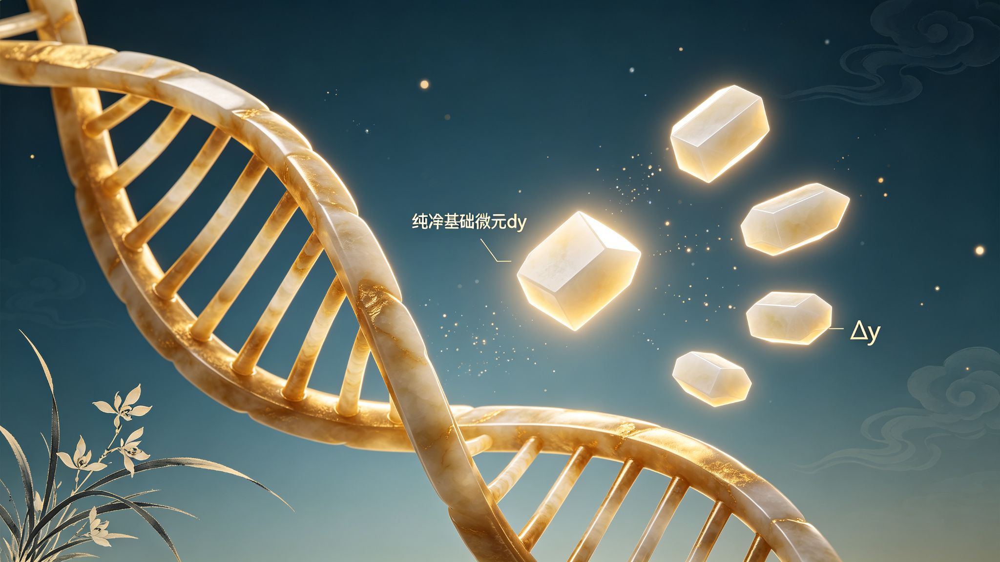

<ArchiveCopyPanel article-id="162348379" />

{"markdown":"PiDliIbnsbvvvJrmlofmmI7ov5vpmLYyMDDorrIgIAo+IOe8luWPt++8mmAxNjIzNDgzNzlgICAKPiDljp/lp4vmlofku7bvvJpg5b6u5YiG5LiN5piv5b6u5bCP5beu5YC86L+R5Ly85piv5Yml56a75a6P6KeC6J665peL5Y2V54us5o+Q5Y+W5peg56m35bCP5b6u6KeC55Sf6ZW/5Y2V5YWD55qE5Y6f55Sf5bC65bqmLeWFqOWfn+aVsOWtpnZz5Lyg57uf5pWw5a2m5Lq657G75paH5piOLTE2MjM0ODM3OS5tZGAgIAo+IOi/lOWbnu+8mlvmnKzkuablvZLmoaNdKC96aC9ib29rcy9jb3Vyc2UvYXJ0aWNsZXMvKSDCtyBb5oC75YWl5Y+jXSgvemgvYm9va3MvYXJ0aWNsZXMvKQoKIVvlvq7liIbnmoTmnKzmupBdKC4vYXNzZXRzL2NzZG5pbWcvanBnL2ZkYmE1YzQ0OWJkNDFhMWMuanBnKQoK5L2c6ICF77yaIOS5luS5luaVsOWtpgoKIyMg44CK5YWo5Z+f5pWw5a2mdnPkvKDnu5/mlbDlrabvvJrkurrnsbvmlofmmI7ov5vpmLYyMDDorrLjgIvnrKw1MuiusiDpq5jkuK3pgJrkv5fniYjpgJDlrZfnqL8KCuiusuasoe+8miDnrKw1MuiusgoK5Li76aKY77yaIOW+ruWIhuS4jeaYr+W+ruWwj+W3ruWAvOi/keS8vO+8jOaYr+WJpeemu+Wuj+inguieuuaXi+OAgeWNleeLrOaPkOWPluaXoOept+Wwj+W+ruingueUn+mVv+WNleWFg+eahOWOn+eUn+WwuuW6pgoK5a+55qCH6K++5pys55+l6K+G54K577yaIOW+ruWIhueahOWumuS5ieOAgWR5ZHlkeeS4js6UeVxEZWx0YSB5zpR544CB5b6u5YiG6L+R5Ly86K6h566XCgrmlofpo47vvJog5aSn55m96K+d44CB5peg5pmm5rap5LiT5Lia6K+N5rGH77yM5bu257utMC8x5Z+654K544CB5Y+M6J665peL5YWo5aWX5q+U5Za7CgotLS0KCiMjIyAw772eM+WIhumSnyDlpI3kuaDlr7zlhaUKCiFb5a+85pWw6J665peL6L2o6L+5XSguL2Fzc2V0cy9jc2RuaW1nL2pwZy9iNzBhYmEwNTU1ZWM3NWI5LmpwZykKCuWQjOWtpuS7rO+8jOS4iuS4gOiKguivvuaIkeS7rOWQg+mAj+S6huWvvOaVsOeahOacrOa6kO+8jOWvvOaVsOaYr+WHveaVsOieuuaXi+i9qOi/ueS4iuaXoOept+Wwj+iWhOWxgueahOWAvuaWnOaWnOeOh++8jOeUqOadpeWIu+eUu+WxgOmDqOeUn+mVv+W/q+aFouOAgeWNh+mZjei2i+WKv+OAggoK6auY5Lit5b6u56ev5YiG57Sn5o6l552A5b6u5YiG55+l6K+G54K577yM6K++5pys6K6y6Kej77yazpR5XERlbHRhIHnOlHnmmK/lh73mlbDnnJ/lrp7lj5jljJbph4/vvIxkeWR5ZHnmmK/nur/mgKfov5HkvLzlvq7lsI/lop7ph4/vvIzlvq7liIbnlKjmnaXlgZrkvLDnrpfjgIHor6/lt67liIbmnpDvvIzlj6rmmK/nroDljJborqHnrpfnmoTov5HkvLzlt6XlhbfjgIIKCuS7iuWkqeaIkeS7rOWbnuW9kjAvMS/iiJ7kuInmnoHmnKzmupDop4bop5LvvJrlvq7liIbkuI3mmK/kurrkuLrliLbpgKDnmoTov5HkvLzkvLDnrpflt6XlhbfvvIzlro/op4Llj4zonrrml4vnlLHml6DmlbDml6DnqbflsI/ljp/nlJ/lvq7op4LljZXlhYPmi7zmjqXogIzmiJDvvIzlvq7liIZkeWR5ZHnvvIzlsLHmmK/ljZXni6zliaXnprvjgIHmj5Dlj5blh7rmnaXnmoTljZXkuIDml6DnqbflsI/nlJ/plb/ljZXlhYPmnKzouqvvvIzOlHlcRGVsdGEgec6UeeaYr+WkmuauteW+ruinguWNleWFg+WPoOWKoOWQjueahOecn+WunuaAu+i1t+S8j+OAggoKLS0tCgojIyMgM++9njEz5YiG6ZKfIOeUn+a0u+WMluexu+avlOiusuinowoKIVvlvq7op4LnlJ/plb/ljZXlhYPmi4bop6NdKC4vYXNzZXRzL2NzZG5pbWcvanBnLzdiMTc2ZjdmNjc1MGMzOWIuanBnKQoK5YWI6K6y6K++5pys6YeM5b6u5YiG6YC76L6R77yaCgroh6rlj5jph494eHjkuqfnlJ/lvq7lsI/lj5jljJbOlHhcRGVsdGEgeM6UeO+8jOWHveaVsOecn+WunuaUueWPmOmHj86UeVxEZWx0YSB5zpR577yb55So5YiH57q/5bCP5q61ZHlkeWR56L+R5Ly85Luj5pu/5puy57q/5bCP5q61zpR5XERlbHRhIHnOlHnvvIzkuozogIXlrZjlnKjlvq7lsI/or6/lt67vvIzlpJrnlKjkuo7ov5HkvLzmsYLlgLzjgIHor6/lt67orqHnrpfjgIIKCuaUvuWIsOWPjOieuuaXi+eUn+mVv+S9k+ezu+mHjO+8mgoK5pW05p2h5puy57q/5piv5a6M5pW05a6P6KeC6J665peL77yM5a6P6KeC6ISJ57uc5Y+v5Lul5peg6ZmQ5ouG5YiG6Iez6LaL6L+RMOWwuuW6pueahOWfuuehgOeUn+mVv+W+ruWFg++8jOi/meS4gOS7veacgOWwj+S4jeWPr+aLhuWIhueahOWNleWFg+WwseaYr+W+ruWIhmR5ZHlkee+8mwoKzpR4XERlbHRhIHjOlHjku6Pooajonrrml4vmqKrlkJHlu7bkvLjnmoTlvq7lsI/liLvluqbvvIzlr7nlupTop4LmtYvln7rlh4bnmoTml6DnqbflsI/lop7ph4/vvJsKCs6UeVxEZWx0YSB5zpR55piv5LiA5q616L+e57ut5b6u6KeC5b6u5YWD5Y+g5Yqg6LW35p2l55qE5oC76LW35LyP77yM5YyF5ZCr5puy57q/5pys6Lqr55qE5byv5puy6LW35LyP77ybCgpkeWR5ZHnlj6rlj5blvq7lhYPlubPnm7TlgL7mlpzpg6jliIbvvIzlr7nlupTlr7zmlbDmlpznjofkuZjmqKrlkJHlvq7lhYPvvIzmmK/nuq/lh4DnmoTln7rnoYDlvq7op4LljZXlhYPlsLrluqbjgIIKCuivr+W3rumDqOWIhu+8jOWwseaYr+WkmuWxguW+ruWFg+WPoOWKoOS6p+eUn+eahOW8r+absuWBj+enu++8jOWxnuS6jumrmOmYtuaXoOept+Wwj++8jOi2i+i/keingua1i+WfuueCuTDml7blj6/ku6Xlv73nlaXjgIIKCuS4vueugOWNleS+i+WtkO+8mgoK6K++5pys5Y+q55yL6YeN5b6u5YiG55qE5Lyw566X5Yqf6IO977yM55yL5LiN6KeB5b6u5YiG5a+55bqU6J665peL5b6u6KeC5bqV5bGC5Y2V5YWD55qE5pys5rqQ57uT5p6E44CCCgotLS0KCiMjIyAxM++9njIy5YiG6ZKfIOivvuacrOingueCuSB2cyDlhajln5/mlbDlrabpgJrkv5fop4LngrkKCiFb6K++5pys5LiO5YWo5Z+f5a+55q+UXSguL2Fzc2V0cy9jc2RuaW1nL2pwZy8xNGUxOWVmNmUwZWE5Mjk1LmpwZykKCiMjIyMg5Lyg57uf6K++5pys6K6k55+lCgotIAoK5b6u5YiG5Y+q5piv5Lq65Li65p6E6YCg55qE6L+R5Ly86K6h566X56ym5Y+377yM5puy57q/5LiN5a2Y5Zyo54us56uL55qE5b6u6KeC5pyA5bCP55Sf6ZW/5Y2V5YWDCgotIAoKZHlkeWR55LiOzpR5XERlbHRhIHnOlHnnmoTlt67lgLzlj6rmmK/orqHnrpfor6/lt67vvIzml6DlupXlsYLonrrml4vliIblsYLnu5PmnoTlkKvkuYkKCi0gCgrlvq7liIbku4XnlKjkuo7mlbDlgLzkvLDnrpfvvIzlkozlvq7op4LnspLlrZDjgIHog73ph4/lvq7lj5jljJbjgIHml7bnqbrlvq7lvaLlj5jml6DlhbMKCiMjIyMg5YWo5Z+f5pWw5a2m6YCa5L+X6K6k55+lCgotIAoK5a6P6KeC6J665peL5aSp54S255Sx5peg56m35Lu96LaL6L+RMOWwuuW6pueahOW+ruinguWNleWFg+aLvOaOpeiAjOaIkO+8jOW+ruWIhmR5ZHlkeeWwseaYr+ivpeWfuuehgOWNleWFg+eahOagh+WHhuWwuuW6pu+8jOaYr+Wuh+WumeWOn+eUn+aVsOeQhue7k+aehAoKLSAKCs6UeVxEZWx0YSB5zpR55piv5aSa5Lu95b6u5YWD5Y+g5Yqg5ZCO55qE5oC76LW35LyP77yM5LqM6ICF5beu5YC85piv6auY6Zi25peg56m35bCP5byv5puy5YGP56e777yM6Z2g6L+RMOWfuueCueaXtuiHqueEtuaUtuaVm+a2iOWksQoKLSAKCueykuWtkOiDvemHj+W+ruWinumHj+OAgeadkOaWmeW+ruWwj+W9ouWPmOOAgei2heWvvOW+ruingueUtemYu+azouWKqOOAgeaXtuepuuWxgOmDqOeVuOWPmO+8jOWFqOmDqOS+nemdoOW+ruWIhuWwuuW6puaPj+i/sAoK566A5Y2V5q+U5Za777yaCgror77mnKzlvq7liIblpb3mr5Tmi7/nm7TlsLrkuIDlsI/mrrXvvIzov5HkvLzku6Pmm7/kuIDlsI/mrrXlvK/mm7Lol6TolJPvvJsKCuacrOa6kOW+ruWIhuWmguWQjOiXpOiUk+aLhuWIhuWIsOacgOWwj+OAgeS4jeWPr+WGjeWIhueahOWOn+eUn+e7huaene+8jGR5ZHlkeeWwseaYr+i/meaguee7huaeneacrOi6q++8jM6UeVxEZWx0YSB5zpR55piv5Yeg5qC557uG5p6d6L+e6LW35p2l5bim5byn5bqm55qE5bCP5q6144CCCgotLS0KCiMjIyAyMu+9njI35YiG6ZKfIOagoeWGheWtpuS5oOaPkOmGku+8jOS4jeW9seWTjeiAg+ivleW+l+WIhgoK5b6u5YiG6K6h566X44CB6L+R5Ly85Lyw566X44CB6K+v5beu5YiG5p6Q6aKY5Z6L77yM5Lil5qC85oyJ54Wn6auY5Lit6K++5pys5b6u5YiG5YWs5byP44CB6L+Q566X5rOV5YiZ5L2c562U77yM6ICD6K+V5LiN5Lya5omj5YiG44CCCgrmnKzoioLor77lj6rmmK/mi5PlsZXpq5jnu7TmnKzmupDorqTnn6XvvJrlvq7liIZkeWR5ZHnmmK/lro/op4Llj4zonrrml4vmi4bliIblkI7vvIzni6znq4vmj5Dlj5bnmoTml6DnqbflsI/lvq7op4Lljp/nlJ/nlJ/plb/ljZXlhYPvvIzmmK/liLvnlLvkuIfnianlvq7lsI/lj5jljJbnmoTln7rnoYDlsLrluqbjgIIKCuS8j+eslOmTuuWeq++8muesrDEwMOiusumrmOS4ree7k+S4muS4k+Wcuu+8jOaVtOWQiDUx4oCTMTAw6K6y5YWo6YOo6auY5Lit5b6u56ev5YiG44CB56uL5L2T5Yeg5L2V44CB5aSN5pWw44CB5pWw5YiX44CB5ZyG6ZSl5puy57q/5YaF5a6577yM57uf5LiA55SoMC8xL+KInuS4ieaegeWPjOieuuaXi+WujOaIkOWIneetieOAgemrmOetieaVsOeQhuWkp+S4gOe7n+mXreeOr+OAggoKLS0tCgojIyMgMjfvvZ4zMOWIhumSnyDor77loILmgLvnu5Mr5LiL6IqC6K++6aKE5ZGKCgohW+W+ruWIhuacrOa6kOaAu+e7k10oLi9hc3NldHMvY3NkbmltZy9qcGcvMDNkY2NjMWI4YTM3NzhhNS5qcGcpCgojIyMjIOacrOiKguivvuWwj+e7k++8mgoK5b6u5YiG5a+55bqU5Y+M6J665peL5ouG5YiG6Iez5p6B6ZmQ55qE5peg56m35bCP5b6u6KeC55Sf6ZW/5Y2V5YWD77yMzpR5XERlbHRhIHnOlHnmmK/lpJrljZXlhYPlj6DliqDnmoTnnJ/lrp7otbfkvI/vvIxkeWR5ZHnmmK/nuq/lh4Dln7rnoYDlvq7lhYPlsLrluqbvvIzov5HkvLzlj6rmmK/op4LmtYvlsYLpnaLnmoTlupTnlKjjgIIKCiMjIyMg5LiL5LiA6IqC6K++77yaCgrkuI3lrprnp6/liIbkuI3mmK/lr7zmlbDpgIblkJHorqHnrpfvvIzmmK/msr/nnYDonrrml4vovajov7nlj43lkJHntK/liqDlhajpg6jml6DnqbflsI/lvq7op4LnlJ/plb/ljZXlhYPvvIzov5jljp/lrozmlbTlro/op4LohInnu5zjgIIKCi0tLQoKIVvkuI3lrprnp6/liIbpooTlkYpdKC4vYXNzZXRzL2NzZG5pbWcvanBnL2I3MWYxNDVlZWFiYmJjNDkuanBnKQo=","text":"5YiG57G777ya5paH5piO6L+b6Zi2MjAw6K6yICAK57yW5Y+377yaMTYyMzQ4Mzc5ICAK5Y6f5aeL5paH5Lu277ya5b6u5YiG5LiN5piv5b6u5bCP5beu5YC86L+R5Ly85piv5Yml56a75a6P6KeC6J665peL5Y2V54us5o+Q5Y+W5peg56m35bCP5b6u6KeC55Sf6ZW/5Y2V5YWD55qE5Y6f55Sf5bC65bqmLeWFqOWfn+aVsOWtpnZz5Lyg57uf5pWw5a2m5Lq657G75paH5piOLTE2MjM0ODM3OS5tZCAgCui/lOWbnu+8muacrOS5puW9kuahoyDCtyDmgLvlhaXlj6MKCuW+ruWIhueahOacrOa6kAoK5L2c6ICF77yaIOS5luS5luaVsOWtpgoK44CK5YWo5Z+f5pWw5a2mdnPkvKDnu5/mlbDlrabvvJrkurrnsbvmlofmmI7ov5vpmLYyMDDorrLjgIvnrKw1MuiusiDpq5jkuK3pgJrkv5fniYjpgJDlrZfnqL8KCuiusuasoe+8miDnrKw1MuiusgoK5Li76aKY77yaIOW+ruWIhuS4jeaYr+W+ruWwj+W3ruWAvOi/keS8vO+8jOaYr+WJpeemu+Wuj+inguieuuaXi+OAgeWNleeLrOaPkOWPluaXoOept+Wwj+W+ruingueUn+mVv+WNleWFg+eahOWOn+eUn+WwuuW6pgoK5a+55qCH6K++5pys55+l6K+G54K577yaIOW+ruWIhueahOWumuS5ieOAgWR5ZHlkeeS4js6UeVxEZWx0YSB5zpR544CB5b6u5YiG6L+R5Ly86K6h566XCgrmlofpo47vvJog5aSn55m96K+d44CB5peg5pmm5rap5LiT5Lia6K+N5rGH77yM5bu257utMC8x5Z+654K544CB5Y+M6J665peL5YWo5aWX5q+U5Za7CgotLS0KCjDvvZ4z5YiG6ZKfIOWkjeS5oOWvvOWFpQoK5a+85pWw6J665peL6L2o6L+5CgrlkIzlrabku6zvvIzkuIrkuIDoioLor77miJHku6zlkIPpgI/kuoblr7zmlbDnmoTmnKzmupDvvIzlr7zmlbDmmK/lh73mlbDonrrml4vovajov7nkuIrml6DnqbflsI/oloTlsYLnmoTlgL7mlpzmlpznjofvvIznlKjmnaXliLvnlLvlsYDpg6jnlJ/plb/lv6vmhaLjgIHljYfpmY3otovlir/jgIIKCumrmOS4reW+ruenr+WIhue0p+aOpeedgOW+ruWIhuefpeivhueCue+8jOivvuacrOiusuino++8ms6UeVxEZWx0YSB5zpR55piv5Ye95pWw55yf5a6e5Y+Y5YyW6YeP77yMZHlkeWR55piv57q/5oCn6L+R5Ly85b6u5bCP5aKe6YeP77yM5b6u5YiG55So5p2l5YGa5Lyw566X44CB6K+v5beu5YiG5p6Q77yM5Y+q5piv566A5YyW6K6h566X55qE6L+R5Ly85bel5YW344CCCgrku4rlpKnmiJHku6zlm57lvZIwLzEv4oie5LiJ5p6B5pys5rqQ6KeG6KeS77ya5b6u5YiG5LiN5piv5Lq65Li65Yi26YCg55qE6L+R5Ly85Lyw566X5bel5YW377yM5a6P6KeC5Y+M6J665peL55Sx5peg5pWw5peg56m35bCP5Y6f55Sf5b6u6KeC5Y2V5YWD5ou85o6l6ICM5oiQ77yM5b6u5YiGZHlkeWR577yM5bCx5piv5Y2V54us5Yml56a744CB5o+Q5Y+W5Ye65p2l55qE5Y2V5LiA5peg56m35bCP55Sf6ZW/5Y2V5YWD5pys6Lqr77yMzpR5XERlbHRhIHnOlHnmmK/lpJrmrrXlvq7op4LljZXlhYPlj6DliqDlkI7nmoTnnJ/lrp7mgLvotbfkvI/jgIIKCi0tLQoKM++9njEz5YiG6ZKfIOeUn+a0u+WMluexu+avlOiusuinowoK5b6u6KeC55Sf6ZW/5Y2V5YWD5ouG6KejCgrlhYjorrLor77mnKzph4zlvq7liIbpgLvovpHvvJoKCuiHquWPmOmHj3h4eOS6p+eUn+W+ruWwj+WPmOWMls6UeFxEZWx0YSB4zpR477yM5Ye95pWw55yf5a6e5pS55Y+Y6YePzpR5XERlbHRhIHnOlHnvvJvnlKjliIfnur/lsI/mrrVkeWR5ZHnov5HkvLzku6Pmm7/mm7Lnur/lsI/mrrXOlHlcRGVsdGEgec6Uee+8jOS6jOiAheWtmOWcqOW+ruWwj+ivr+W3ru+8jOWkmueUqOS6jui/keS8vOaxguWAvOOAgeivr+W3ruiuoeeul+OAggoK5pS+5Yiw5Y+M6J665peL55Sf6ZW/5L2T57O76YeM77yaCgrmlbTmnaHmm7Lnur/mmK/lrozmlbTlro/op4Lonrrml4vvvIzlro/op4LohInnu5zlj6/ku6Xml6DpmZDmi4bliIboh7Potovov5Ew5bC65bqm55qE5Z+656GA55Sf6ZW/5b6u5YWD77yM6L+Z5LiA5Lu95pyA5bCP5LiN5Y+v5ouG5YiG55qE5Y2V5YWD5bCx5piv5b6u5YiGZHlkeWR577ybCgrOlHhcRGVsdGEgeM6UeOS7o+ihqOieuuaXi+aoquWQkeW7tuS8uOeahOW+ruWwj+WIu+W6pu+8jOWvueW6lOingua1i+WfuuWHhueahOaXoOept+Wwj+WinumHj++8mwoKzpR5XERlbHRhIHnOlHnmmK/kuIDmrrXov57nu63lvq7op4Llvq7lhYPlj6DliqDotbfmnaXnmoTmgLvotbfkvI/vvIzljIXlkKvmm7Lnur/mnKzouqvnmoTlvK/mm7LotbfkvI/vvJsKCmR5ZHlkeeWPquWPluW+ruWFg+W5s+ebtOWAvuaWnOmDqOWIhu+8jOWvueW6lOWvvOaVsOaWnOeOh+S5mOaoquWQkeW+ruWFg++8jOaYr+e6r+WHgOeahOWfuuehgOW+ruinguWNleWFg+WwuuW6puOAggoK6K+v5beu6YOo5YiG77yM5bCx5piv5aSa5bGC5b6u5YWD5Y+g5Yqg5Lqn55Sf55qE5byv5puy5YGP56e777yM5bGe5LqO6auY6Zi25peg56m35bCP77yM6LaL6L+R6KeC5rWL5Z+654K5MOaXtuWPr+S7peW/veeVpeOAggoK5Li+566A5Y2V5L6L5a2Q77yaCgror77mnKzlj6rnnIvph43lvq7liIbnmoTkvLDnrpflip/og73vvIznnIvkuI3op4Hlvq7liIblr7nlupTonrrml4vlvq7op4LlupXlsYLljZXlhYPnmoTmnKzmupDnu5PmnoTjgIIKCi0tLQoKMTPvvZ4yMuWIhumSnyDor77mnKzop4LngrkgdnMg5YWo5Z+f5pWw5a2m6YCa5L+X6KeC54K5Cgror77mnKzkuI7lhajln5/lr7nmr5QKCuS8oOe7n+ivvuacrOiupOefpQrlvq7liIblj6rmmK/kurrkuLrmnoTpgKDnmoTov5HkvLzorqHnrpfnrKblj7fvvIzmm7Lnur/kuI3lrZjlnKjni6znq4vnmoTlvq7op4LmnIDlsI/nlJ/plb/ljZXlhYMKZHlkeWR55LiOzpR5XERlbHRhIHnOlHnnmoTlt67lgLzlj6rmmK/orqHnrpfor6/lt67vvIzml6DlupXlsYLonrrml4vliIblsYLnu5PmnoTlkKvkuYkK5b6u5YiG5LuF55So5LqO5pWw5YC85Lyw566X77yM5ZKM5b6u6KeC57KS5a2Q44CB6IO96YeP5b6u5Y+Y5YyW44CB5pe256m65b6u5b2i5Y+Y5peg5YWzCgrlhajln5/mlbDlrabpgJrkv5forqTnn6UK5a6P6KeC6J665peL5aSp54S255Sx5peg56m35Lu96LaL6L+RMOWwuuW6pueahOW+ruinguWNleWFg+aLvOaOpeiAjOaIkO+8jOW+ruWIhmR5ZHlkeeWwseaYr+ivpeWfuuehgOWNleWFg+eahOagh+WHhuWwuuW6pu+8jOaYr+Wuh+WumeWOn+eUn+aVsOeQhue7k+aehArOlHlcRGVsdGEgec6UeeaYr+WkmuS7veW+ruWFg+WPoOWKoOWQjueahOaAu+i1t+S8j++8jOS6jOiAheW3ruWAvOaYr+mrmOmYtuaXoOept+Wwj+W8r+absuWBj+enu++8jOmdoOi/kTDln7rngrnml7boh6rnhLbmlLbmlZvmtojlpLEK57KS5a2Q6IO96YeP5b6u5aKe6YeP44CB5p2Q5paZ5b6u5bCP5b2i5Y+Y44CB6LaF5a+85b6u6KeC55S16Zi75rOi5Yqo44CB5pe256m65bGA6YOo55W45Y+Y77yM5YWo6YOo5L6d6Z2g5b6u5YiG5bC65bqm5o+P6L+wCgrnroDljZXmr5TllrvvvJoKCuivvuacrOW+ruWIhuWlveavlOaLv+ebtOWwuuS4gOWwj+aute+8jOi/keS8vOS7o+abv+S4gOWwj+auteW8r+absuiXpOiUk++8mwoK5pys5rqQ5b6u5YiG5aaC5ZCM6Jek6JST5ouG5YiG5Yiw5pyA5bCP44CB5LiN5Y+v5YaN5YiG55qE5Y6f55Sf57uG5p6d77yMZHlkeWR55bCx5piv6L+Z5qC557uG5p6d5pys6Lqr77yMzpR5XERlbHRhIHnOlHnmmK/lh6DmoLnnu4bmnp3ov57otbfmnaXluKblvKfluqbnmoTlsI/mrrXjgIIKCi0tLQoKMjLvvZ4yN+WIhumSnyDmoKHlhoXlrabkuaDmj5DphpLvvIzkuI3lvbHlk43ogIPor5XlvpfliIYKCuW+ruWIhuiuoeeul+OAgei/keS8vOS8sOeul+OAgeivr+W3ruWIhuaekOmimOWei++8jOS4peagvOaMieeFp+mrmOS4reivvuacrOW+ruWIhuWFrOW8j+OAgei/kOeul+azleWImeS9nOetlO+8jOiAg+ivleS4jeS8muaJo+WIhuOAggoK5pys6IqC6K++5Y+q5piv5ouT5bGV6auY57u05pys5rqQ6K6k55+l77ya5b6u5YiGZHlkeWR55piv5a6P6KeC5Y+M6J665peL5ouG5YiG5ZCO77yM54us56uL5o+Q5Y+W55qE5peg56m35bCP5b6u6KeC5Y6f55Sf55Sf6ZW/5Y2V5YWD77yM5piv5Yi755S75LiH54mp5b6u5bCP5Y+Y5YyW55qE5Z+656GA5bC65bqm44CCCgrkvI/nrJTpk7rlnqvvvJrnrKwxMDDorrLpq5jkuK3nu5PkuJrkuJPlnLrvvIzmlbTlkIg1MeKAkzEwMOiusuWFqOmDqOmrmOS4reW+ruenr+WIhuOAgeeri+S9k+WHoOS9leOAgeWkjeaVsOOAgeaVsOWIl+OAgeWchumUpeabsue6v+WGheWuue+8jOe7n+S4gOeUqDAvMS/iiJ7kuInmnoHlj4zonrrml4vlrozmiJDliJ3nrYnjgIHpq5jnrYnmlbDnkIblpKfkuIDnu5/pl63njq/jgIIKCi0tLQoKMjfvvZ4zMOWIhumSnyDor77loILmgLvnu5Mr5LiL6IqC6K++6aKE5ZGKCgrlvq7liIbmnKzmupDmgLvnu5MKCuacrOiKguivvuWwj+e7k++8mgoK5b6u5YiG5a+55bqU5Y+M6J665peL5ouG5YiG6Iez5p6B6ZmQ55qE5peg56m35bCP5b6u6KeC55Sf6ZW/5Y2V5YWD77yMzpR5XERlbHRhIHnOlHnmmK/lpJrljZXlhYPlj6DliqDnmoTnnJ/lrp7otbfkvI/vvIxkeWR5ZHnmmK/nuq/lh4Dln7rnoYDlvq7lhYPlsLrluqbvvIzov5HkvLzlj6rmmK/op4LmtYvlsYLpnaLnmoTlupTnlKjjgIIKCuS4i+S4gOiKguivvu+8mgoK5LiN5a6a56ev5YiG5LiN5piv5a+85pWw6YCG5ZCR6K6h566X77yM5piv5rK/552A6J665peL6L2o6L+55Y+N5ZCR57Sv5Yqg5YWo6YOo5peg56m35bCP5b6u6KeC55Sf6ZW/5Y2V5YWD77yM6L+Y5Y6f5a6M5pW05a6P6KeC6ISJ57uc44CCCgotLS0KCuS4jeWumuenr+WIhumihOWRig=="}

> 分类：文明进阶200讲  
> 编号：`162348379`  
> 原始文件：`微分不是微小差值近似是剥离宏观螺旋单独提取无穷小微观生长单元的原生尺度-全域数学vs传统数学人类文明-162348379.md`  
> 返回：[本书归档](/zh/books/course/articles/) · [总入口](/zh/books/articles/)

<ArticlePaperMeta category="文明进阶200讲" article-id="162348379" title="微分不是微小差值近似是剥离宏观螺旋单独提取无穷小微观生长单元的原生尺度-全域数学vs传统数学人类文明" paper-kind="课程讲义" book-route="/zh/books/course/articles/" overview-route="/zh/books/articles/" summary="对标课本知识点： 微分的定义、dydydy与Δy\Delta yΔy、微分近似计算" author="乖乖数学" lecture="第52讲" theme="微分不是微小差值近似，是剥离宏观螺旋、单独提取无穷小微观生长单元的原生尺度" source-file="微分不是微小差值近似是剥离宏观螺旋单独提取无穷小微观生长单元的原生尺度-全域数学vs传统数学人类文明-162348379.md" cover="./assets/csdnimg/jpg/fdba5c449bd41a1c.jpg" />

作者： 乖乖数学

## 《全域数学vs传统数学：人类文明进阶200讲》第52讲 高中通俗版逐字稿

讲次： 第52讲

主题： 微分不是微小差值近似，是剥离宏观螺旋、单独提取无穷小微观生长单元的原生尺度

对标课本知识点： 微分的定义、dydydy与Δy\Delta yΔy、微分近似计算

文风： 大白话、无晦涩专业词汇，延续0/1基点、双螺旋全套比喻

---

### 0～3分钟 复习导入

同学们，上一节课我们吃透了导数的本源，导数是函数螺旋轨迹上无穷小薄层的倾斜斜率，用来刻画局部生长快慢、升降趋势。

高中微积分紧接着微分知识点，课本讲解：Δy\Delta yΔy是函数真实变化量，dydydy是线性近似微小增量，微分用来做估算、误差分析，只是简化计算的近似工具。

今天我们回归0/1/∞三极本源视角：微分不是人为制造的近似估算工具，宏观双螺旋由无数无穷小原生微观单元拼接而成，微分dydydy，就是单独剥离、提取出来的单一无穷小生长单元本身，Δy\Delta yΔy是多段微观单元叠加后的真实总起伏。

---

### 3～13分钟 生活化类比讲解

先讲课本里微分逻辑：

自变量xxx产生微小变化Δx\Delta xΔx，函数真实改变量Δy\Delta yΔy；用切线小段dydydy近似代替曲线小段Δy\Delta yΔy，二者存在微小误差，多用于近似求值、误差计算。

放到双螺旋生长体系里：

整条曲线是完整宏观螺旋，宏观脉络可以无限拆分至趋近0尺度的基础生长微元，这一份最小不可拆分的单元就是微分dydydy；

Δx\Delta xΔx代表螺旋横向延伸的微小刻度，对应观测基准的无穷小增量；

Δy\Delta yΔy是一段连续微观微元叠加起来的总起伏，包含曲线本身的弯曲起伏；

dydydy只取微元平直倾斜部分，对应导数斜率乘横向微元，是纯净的基础微观单元尺度。

误差部分，就是多层微元叠加产生的弯曲偏移，属于高阶无穷小，趋近观测基点0时可以忽略。

举简单例子：

课本只看重微分的估算功能，看不见微分对应螺旋微观底层单元的本源结构。

---

### 13～22分钟 课本观点 vs 全域数学通俗观点

#### 传统课本认知

- 

微分只是人为构造的近似计算符号，曲线不存在独立的微观最小生长单元

- 

dydydy与Δy\Delta yΔy的差值只是计算误差，无底层螺旋分层结构含义

- 

微分仅用于数值估算，和微观粒子、能量微变化、时空微形变无关

#### 全域数学通俗认知

- 

宏观螺旋天然由无穷份趋近0尺度的微观单元拼接而成，微分dydydy就是该基础单元的标准尺度，是宇宙原生数理结构

- 

Δy\Delta yΔy是多份微元叠加后的总起伏，二者差值是高阶无穷小弯曲偏移，靠近0基点时自然收敛消失

- 

粒子能量微增量、材料微小形变、超导微观电阻波动、时空局部畸变，全部依靠微分尺度描述

简单比喻：

课本微分好比拿直尺一小段，近似代替一小段弯曲藤蔓；

本源微分如同藤蔓拆分到最小、不可再分的原生细枝，dydydy就是这根细枝本身，Δy\Delta yΔy是几根细枝连起来带弧度的小段。

---

### 22～27分钟 校内学习提醒，不影响考试得分

微分计算、近似估算、误差分析题型，严格按照高中课本微分公式、运算法则作答，考试不会扣分。

本节课只是拓展高维本源认知：微分dydydy是宏观双螺旋拆分后，独立提取的无穷小微观原生生长单元，是刻画万物微小变化的基础尺度。

伏笔铺垫：第100讲高中结业专场，整合51–100讲全部高中微积分、立体几何、复数、数列、圆锥曲线内容，统一用0/1/∞三极双螺旋完成初等、高等数理大一统闭环。

---

### 27～30分钟 课堂总结+下节课预告

#### 本节课小结：

微分对应双螺旋拆分至极限的无穷小微观生长单元，Δy\Delta yΔy是多单元叠加的真实起伏，dydydy是纯净基础微元尺度，近似只是观测层面的应用。

#### 下一节课：

不定积分不是导数逆向计算，是沿着螺旋轨迹反向累加全部无穷小微观生长单元，还原完整宏观脉络。

---

