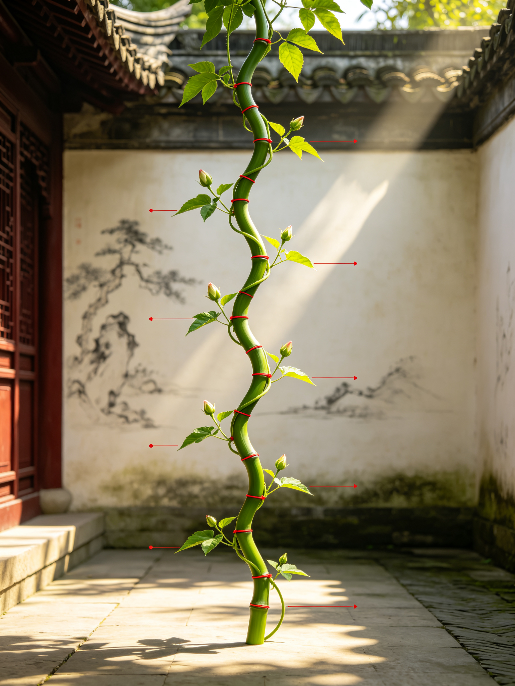

<ArchiveCopyPanel article-id="162374074" />

{"markdown":"PiDliIbnsbvvvJrmlofmmI7ov5vpmLYyMDDorrIgIAo+IOe8luWPt++8mmAxNjIzNzQwNzRgICAKPiDljp/lp4vmlofku7bvvJpg5pWw5YiX5LiN5piv56a75pWj5pWw5a2X572X5YiX5piv5Y+M6J665peL5YiG5bGC55Sf6ZW/5YiG5q615oiq5Y+W55qE56a75pWj6IqC54K55bqP5YiXLeWFqOWfn+aVsOWtpnZz5Lyg57uf5pWw5a2m5Lq657G75paH5piO6L+b6Zi2MjAw6K6yLTE2MjM3NDA3NC5tZGAgIAo+IOi/lOWbnu+8mlvmnKzkuablvZLmoaNdKC96aC9ib29rcy9jb3Vyc2UvYXJ0aWNsZXMvKSDCtyBb5oC75YWl5Y+jXSgvemgvYm9va3MvYXJ0aWNsZXMvKQoKIVvmlbDliJflj4zonrrml4vnlJ/plb/lsIHpnaJdKC4vYXNzZXRzL2NzZG5pbWcvanBnL2Y3YzUyNTEwZjRjZDZkYmMuanBnKQoKIyMg44CK5YWo5Z+f5pWw5a2mdnPkvKDnu5/mlbDlrabvvJrkurrnsbvmlofmmI7ov5vpmLYyMDDorrLjgIvnrKw1NeiusgoKIyMjIOmrmOS4remAmuS/l+eJiOmAkOWtl+eovwoK6K6y5qyh77yaIOesrDU16K6yCgrkuLvpopjvvJog5pWw5YiX5LiN5piv56a75pWj5pWw5a2X572X5YiX77yM5piv5Y+M6J665peL5YiG5bGC55Sf6ZW/77yM5YiG5q615oiq5Y+W55qE56a75pWj6IqC54K55bqP5YiXCgrlr7nmoIfor77mnKznn6Xor4bngrnvvJog5pWw5YiX44CB6YCa6aG544CB6YCS5o6o44CB562J5beu562J5q+U5pWw5YiXCgrmlofpo47vvJog5aSn55m96K+d44CB5peg5pmm5rap5LiT5Lia6K+N5rGH77yM5bu257utMC8xL+KInuS4ieaegeOAgeWPjOieuuaXi+WFqOWll+avlOWWuwoKLS0tCgojIyMgMO+9njPliIbpkp8g5aSN5Lmg5a+85YWlCgohW+WPjOieuuaXi+WIhuWxguaIquWPluiKgueCueW9ouaIkOaVsOWIl10oLi9hc3NldHMvY3NkbmltZy9qcGcvZjU0ZjdjMmI1NmQxZDJmMS5qcGcpCgrlkIzlrabku6zvvIzkuIrkuIDoioLor77miJHku6zlkIPpgI/kuoblrprnp6/liIbnmoTmnKzmupDvvJrlrprnp6/liIbliJLlrpronrrml4vnlJ/plb/ljLrpl7TvvIzntK/liqDljLrpl7TlhoXlhajpg6jml6DnqbflsI/lvq7lhYPvvIzmsYLlh7rkuIDmrrXonrrml4vnmoTntK/np6/mgLvkvZPph4/vvJvkuI3lrprnp6/liIbmmK/ml6DovrnnlYzlrozmlbTonrrml4vlpI3ljp/vvIzkuozogIXkuIDlhajkuIDlsYDpg6jvvIzmnoTmiJDnp6/liIblrozmlbTkvZPns7vjgIIKCumrmOS4reS7o+aVsOaWsOWinuaVsOWIl+adv+Wdl++8jOivvuacrOWumuS5ie+8muaMiemhuuW6j+aOkuWIl+eahOS4gOS4suaVsOWtl+WwseaYr+aVsOWIl++8jOWIhuetieW3ruaVsOWIl+OAgeetieavlOaVsOWIl++8jOS+nemdoOmAmumhueOAgemAkuaOqOWFrOW8j+iuoeeul+axguWSjO+8jOWPquaYr+S4gOe7hOemu+aVo+aVsOWtl+iuoeeul+mimOOAggoK5LuK5aSp5oiR5Lus5Zue5b2SMC8xL+KInuS4ieaegeacrOa6kOinhuinku+8muaVsOWIl+S4jeaYr+S6uuS4uumaj+S+v+aOkuWIl+eahOaVsOWtl+S4su+8jOi/nue7reWPjOieuuaXi+S4gOWxguS4gOWxguWIhuWxgueUn+mVv++8jOaIkeS7rOavj+malOWbuuWumuWxguaVsOaIquWPluS4gOWkhOeUn+mVv+iKgueCue+8jOWFqOmDqOaIquWPlueCueS9jeS+neasoeaOkuWIl++8jOWwseW9ouaIkOaVsOWIl++8m+etieW3ruOAgeetieavlOWPquaYr+S4pOenjeacgOWfuuehgOeahOieuuaXi+WIhuWxgueUn+mVv+iKguWlj+OAggoKLS0tCgojIyMgM++9njEz5YiG6ZKfIOeUn+a0u+WMluexu+avlOiusuinowoK5YWI6K6y6K++5pys5pWw5YiX5Z+656GA6YC76L6R77yaCgrmlbDliJcmIzEyMzthbiYjMTI1O1wmIzEyMzthX25cJiMxMjU7JiMxMjM7YW7igIsmIzEyNTvvvIxubm7kuLrpobnmlbDvvIzku6PooajnrKxubm7kuKrmlbDlrZfvvJvnrYnlt67nm7jpgrvkuKTpobnlt67lgLzlm7rlrprvvIznrYnmr5Tnm7jpgrvkuKTpobnmr5TlgLzlm7rlrprvvIzmnInpgJrpobnlhazlvI/jgIHliY1ubm7pobnlkozlhazlvI/vvIznlKjkuo7msYLlgLzjgIHmsYLlkozlupTnlKjpopjjgIIKCuaUvuWIsOWPjOieuuaXi+eUn+mVv+S9k+ezu+mHjO+8mgoK5a6M5pW05Y+M6J665peL5piv6L+e57ut5LiN6Ze05pat55Sf6ZW/6ISJ57uc77yM5oiR5Lus6K6+5a6a5Zu65a6a6Ze06ZqU77yM5q+P55Sf6ZW/a2tr5bGC6K6w5b2V5LiA5qyh6IqC54K55pWw5YC877yM5L6d5qyh5pS26ZuG5omA5pyJ6K6w5b2V54K577yM5pyJ5bqP5o6S5biD5bCx5piv5pWw5YiX44CCCgohW+etieW3ruaVsOWIl+ieuuaXi+Wdh+WMgOWinumHj+eUn+mVv10oLi9hc3NldHMvY3NkbmltZy9qcGcvYjU1NDkyM2EyMmM5YTg1Yi5qcGcpCgoxLiDnrYnlt67mlbDliJfvvJog6J665peL5q+P5bGC5Y+g5Yqg5Zu65a6a5aKe6YeP77yM5q+P6Ze06ZqU5LiA5bGC6IqC54K55pWw5YC85aKe5Yqg5oGS5a6a5beu5YC877yM5a+55bqU562J5beu44CCCgohW+etieavlOaVsOWIl+ieuuaXi+aIkOWAjeiGqOiDgOeUn+mVv10oLi9hc3NldHMvY3NkbmltZy9qcGcvZThjZmFhM2MzYjkyNTU2YS5qcGcpCgoyLiDnrYnmr5TmlbDliJfvvJog6J665peL5q+P5bGC5a6M5pW05aSN5Yi76Ieq6Lqr44CB5oiQ5YCN5Y+g5Yqg77yM5q+P6Ze06ZqU5LiA5bGC6IqC54K55pWw5YC85pS+5aSn5Zu65a6a5YCN546H77yM5a+55bqU562J5q+U44CCCgrpgJrpobnlhazlvI/vvIzmmK/nm7TmjqXnrpflh7rnrKxubm7lsYLmiKrlj5boioLngrnnmoTljp/nlJ/mlbDlgLzvvJsKCuWJjW5ubumhueWSjO+8jOaYr+aKiuWJjW5ubuS4quaIquWPluiKgueCueWvueW6lOeahOieuuaXi+eUn+mVv+S9k+mHj+WFqOmDqOe0r+WKoOaxh+aAu+OAggoK5Li+566A5Y2V5L6L5a2Q77yaCgror77mnKzop4bop5LvvJrnrYnlt67mlbDliJcxLDMsNSw34oCmMSwzLDUsN1xsZG90czEsMyw1LDfigKbvvIzlhazlt64yMjLvvIzpgJrpoblhbj0ybuKIkjFhX249Mm4tMWFu4oCLPTJu4oiSMeOAggoK5YWo5Z+f6YCa5L+X6Kej6K+777ya5Y+M6J665peL5q+P5bGC5Zu65a6a5Y+g5YqgMjIy5Y2V5L2N55Sf6ZW/6YeP77yM5q+P6ZqU5LiA5bGC5oiq5Y+W6IqC54K577yM5L6d5qyh6K6w5b2V5b6X5Yiw6L+Z5Liy5pWw5a2X77yb6YCa6aG55YWs5byP55u05o6l5a6a5L2N56ysbm5u5bGC5oiq5Y+W54K55L2N55qE6J665peL5L2T6YeP77yM5beu5YC8MjIy5piv6J665peL5Y2V5bGC5Zu65a6a5aKe6YeP77yM5LiN5piv5Lq65Li66K6+5a6a55qE5pWw5a2X5beu44CCCgror77mnKzlj6rmiormlbDliJflvZPmiJDlraTnq4vnprvmlaPmlbDlrZfvvIznnIvkuI3liLDmlbDliJfmmK/ov57nu63lj4zonrrml4vliIblsYLmiKrlj5boioLngrnlvaLmiJDnmoTmnInluo/luo/liJfjgIIKCi0tLQoKIyMjIDEz772eMjLliIbpkp8g6K++5pys6KeC54K5IHZzIOWFqOWfn+aVsOWtpumAmuS/l+ingueCuQoKIVvkvKDnu5/or77mnKzop4bop5J2c+WFqOWfn+aVsOWtpuinhuinkuWvueavlF0oLi9hc3NldHMvY3NkbmltZy9qcGcvM2Q2YWMwZjE1ZjFlZDU0NC5qcGcpCgojIyMjIOS8oOe7n+ivvuacrOiupOefpQoKLSDmlbDliJfmmK/kurrlt6XmjpLluo/nmoTmlbDlrZfpm4blkIjvvIzlkozov57nu63onrrml4vnlJ/plb/ohInnu5zml6DlhbMKCi0g562J5beu44CB562J5q+U55qE5beu5YC844CB5q+U5YC85Y+q5piv5Lq65Li66K6+5a6a6K6h566X5p2h5Lu277yM5peg5bqV5bGC5YiG5bGC55Sf6ZW/6YC76L6RCgotIOmAmumhueOAgeaxguWSjOWFrOW8j+WPquaYr+ino+mimOW3peWFt++8jOS7heeUqOS6juaVsOWAvOiuoeeulwoKIyMjIyDlhajln5/mlbDlrabpgJrkv5forqTnn6UKCi0g5pWw5YiX5piv6L+e57ut5Y+M6J665peL5ZGo5pyf5oCn5YiG5bGC5oiq5Y+W55qE56a75pWj6IqC54K56ZuG5ZCI77yM6L+e57ut5Ye95pWw5LiO5pWw5YiX5pys6LSo5ZCM5rqQ77yM5Y+q5piv5LiA5Liq6L+e57ut6KeC5rWL44CB5LiA5Liq5YiG5bGC5a6a54K56YeH5qC3CgotIOetieW3ruWvueW6lOieuuaXi+WNleWxguWbuuWumuWinumHj+WPoOWKoO+8jOetieavlOWvueW6lOieuuaXi+WIhuWxguWkjeWIu+aIkOWAjeiGqOiDgO+8jOS4pOenjeaYr+Wuh+WumeacgOWfuuehgOS4pOexu+WIhuWxgueUn+mVv+aooeW8jwoKLSDnspLlrZDliIblsYLog73nuqfjgIHnp43nvqTov63ku6Plop7plb/jgIHog73ph4/liIblsYLntK/np6/jgIHotoXlr7zlpJrlsYLoloTohpzlj6DliqDlj4LmlbDvvIzlhajpg6jog73nlKjnrYnlt67jgIHnrYnmr5TmlbDliJfmj4/ov7DliIblsYLmvJTljJbop4TlvosKCiFb6Jek6JST55Sf6ZW/6IqC54K55qCH6K6w5q+U5Za75pWw5YiXXSguL2Fzc2V0cy9jc2RuaW1nL2pwZy9mOWEwMGE3MTYwMDhhZGRlLmpwZykKCueugOWNleavlOWWu++8mgoK6K++5pys5pWw5YiX5aaC5ZCM5omL5Yqo5oyJ6KeE5b6L5YaZ5LiL5LiA5Liy5pWw5a2X77ybCgrmnKzmupDmlbDliJflpoLlkIzol6TolJPmr4/nlJ/plb/kuIDlsYLlsLHmoIforrDkuIDmrKHnspfnu4bmlbDlgLzvvIzkuIDkuLLmoIforrDngrnmjInnlJ/plb/pobrluo/mjpLliJfvvIzoh6rnhLblvaLmiJDmlbDliJfjgIIKCi0tLQoKIyMjIDIy772eMjfliIbpkp8g5qCh5YaF5a2m5Lmg5o+Q6YaSICsg5LyP56yU6ZO65Z6rCgrnrYnlt67nrYnmr5TpgJrpobnjgIHpgJLmjqjjgIHmsYLlkozpopjlnovvvIzkuKXmoLzmjInnhafpq5jkuK3or77mnKzlhazlvI/jgIHop6PpopjmraXpqqTkvZznrZTvvIzogIPor5XkuI3kvJrmiaPliIbjgIIKCuacrOiKguivvuWPquaYr+aLk+WxlemrmOe7tOacrOa6kOiupOefpe+8muaVsOWIl+aYr+i/nue7reWPjOieuuaXi+WIhuWxguWumueCueaIquWPlueahOemu+aVo+iKgueCueW6j+WIl++8jOetieW3ruOAgeetieavlOWvueW6lOS4pOenjeWfuuehgOieuuaXi+WIhuWxgueUn+mVv+iKguWlj+OAggoKIVswLzEv4oie5LiJ5p6B5Y+M6J665peL5aSn5LiA57ufXSguL2Fzc2V0cy9jc2RuaW1nL2pwZy82ZmYxYjJjYjAxYTUxMjIzLmpwZykKCuS8j+eslOmTuuWeq++8miDnrKwxMDDorrLpq5jkuK3nu5PkuJrkuJPlnLrvvIzmlbTlkIg1MeKAkzEwMOiusuWFqOmDqOmrmOS4reW+ruenr+WIhuOAgeeri+S9k+WHoOS9leOAgeWkjeaVsOOAgeaVsOWIl+OAgeWchumUpeabsue6v+WGheWuue+8jOe7n+S4gOeUqDAvMS/iiJ7kuInmnoHlj4zonrrml4vlrozmiJDliJ3nrYnjgIHpq5jnrYnmlbDnkIblpKfkuIDnu5/pl63njq/jgIIKCi0tLQoKIyMjIDI3772eMzDliIbpkp8g6K++5aCC5oC757uTICsg5LiL6IqC6K++6aKE5ZGKCgohW+WkjeaVsOS6jOe7tOWeguebtOWPjOieuuaXi+eUn+mVv+e7k+aehF0oLi9hc3NldHMvY3NkbmltZy9qcGcvNjliY2M3M2U4ZDlmOWE3OS5qcGcpCgojIyMjIOacrOiKguivvuWwj+e7kwoK5pWw5YiX5rqQ6Ieq6L+e57ut5Y+M6J665peL5YiG5bGC5a6a54K56YeH5qC377yb562J5beu5Li65Zu65a6a5Y2V5bGC5aKe6YeP55Sf6ZW/77yM562J5q+U5Li65YiG5bGC5oiQ5YCN5Y+g5Yqg55Sf6ZW/77yM6YCa6aG55a6a5L2N5Y2V5LiA5bGC6IqC54K577yM5rGC5ZKM57Sv5Yqg5aSa5bGC5oC75L2T6YeP44CCCgojIyMjIOS4i+iKguivvumihOWRigoK5LiL5LiA6IqC6K++77ya5aSN5pWw5LiN5piv6Jma5pWw5ou85YeR566X5byP77yM5pivMOWfuueCueWPjOWQkeWeguebtOWPjOieuuaXi+WQjOatpeeUn+mVv+eahOS6jOe7tOWkjeWQiOeUn+mVv+WdkOagh+OAggoKLS0tCgrkvZzogIXvvJog5LmW5LmW5pWw5a2mCg==","text":"5YiG57G777ya5paH5piO6L+b6Zi2MjAw6K6yICAK57yW5Y+377yaMTYyMzc0MDc0ICAK5Y6f5aeL5paH5Lu277ya5pWw5YiX5LiN5piv56a75pWj5pWw5a2X572X5YiX5piv5Y+M6J665peL5YiG5bGC55Sf6ZW/5YiG5q615oiq5Y+W55qE56a75pWj6IqC54K55bqP5YiXLeWFqOWfn+aVsOWtpnZz5Lyg57uf5pWw5a2m5Lq657G75paH5piO6L+b6Zi2MjAw6K6yLTE2MjM3NDA3NC5tZCAgCui/lOWbnu+8muacrOS5puW9kuahoyDCtyDmgLvlhaXlj6MKCuaVsOWIl+WPjOieuuaXi+eUn+mVv+WwgemdogoK44CK5YWo5Z+f5pWw5a2mdnPkvKDnu5/mlbDlrabvvJrkurrnsbvmlofmmI7ov5vpmLYyMDDorrLjgIvnrKw1NeiusgoK6auY5Lit6YCa5L+X54mI6YCQ5a2X56i/CgrorrLmrKHvvJog56ysNTXorrIKCuS4u+mimO+8miDmlbDliJfkuI3mmK/nprvmlaPmlbDlrZfnvZfliJfvvIzmmK/lj4zonrrml4vliIblsYLnlJ/plb/vvIzliIbmrrXmiKrlj5bnmoTnprvmlaPoioLngrnluo/liJcKCuWvueagh+ivvuacrOefpeivhueCue+8miDmlbDliJfjgIHpgJrpobnjgIHpgJLmjqjjgIHnrYnlt67nrYnmr5TmlbDliJcKCuaWh+mjju+8miDlpKfnmb3or53jgIHml6DmmabmtqnkuJPkuJror43msYfvvIzlu7bnu60wLzEv4oie5LiJ5p6B44CB5Y+M6J665peL5YWo5aWX5q+U5Za7CgotLS0KCjDvvZ4z5YiG6ZKfIOWkjeS5oOWvvOWFpQoK5Y+M6J665peL5YiG5bGC5oiq5Y+W6IqC54K55b2i5oiQ5pWw5YiXCgrlkIzlrabku6zvvIzkuIrkuIDoioLor77miJHku6zlkIPpgI/kuoblrprnp6/liIbnmoTmnKzmupDvvJrlrprnp6/liIbliJLlrpronrrml4vnlJ/plb/ljLrpl7TvvIzntK/liqDljLrpl7TlhoXlhajpg6jml6DnqbflsI/lvq7lhYPvvIzmsYLlh7rkuIDmrrXonrrml4vnmoTntK/np6/mgLvkvZPph4/vvJvkuI3lrprnp6/liIbmmK/ml6DovrnnlYzlrozmlbTonrrml4vlpI3ljp/vvIzkuozogIXkuIDlhajkuIDlsYDpg6jvvIzmnoTmiJDnp6/liIblrozmlbTkvZPns7vjgIIKCumrmOS4reS7o+aVsOaWsOWinuaVsOWIl+adv+Wdl++8jOivvuacrOWumuS5ie+8muaMiemhuuW6j+aOkuWIl+eahOS4gOS4suaVsOWtl+WwseaYr+aVsOWIl++8jOWIhuetieW3ruaVsOWIl+OAgeetieavlOaVsOWIl++8jOS+nemdoOmAmumhueOAgemAkuaOqOWFrOW8j+iuoeeul+axguWSjO+8jOWPquaYr+S4gOe7hOemu+aVo+aVsOWtl+iuoeeul+mimOOAggoK5LuK5aSp5oiR5Lus5Zue5b2SMC8xL+KInuS4ieaegeacrOa6kOinhuinku+8muaVsOWIl+S4jeaYr+S6uuS4uumaj+S+v+aOkuWIl+eahOaVsOWtl+S4su+8jOi/nue7reWPjOieuuaXi+S4gOWxguS4gOWxguWIhuWxgueUn+mVv++8jOaIkeS7rOavj+malOWbuuWumuWxguaVsOaIquWPluS4gOWkhOeUn+mVv+iKgueCue+8jOWFqOmDqOaIquWPlueCueS9jeS+neasoeaOkuWIl++8jOWwseW9ouaIkOaVsOWIl++8m+etieW3ruOAgeetieavlOWPquaYr+S4pOenjeacgOWfuuehgOeahOieuuaXi+WIhuWxgueUn+mVv+iKguWlj+OAggoKLS0tCgoz772eMTPliIbpkp8g55Sf5rS75YyW57G75q+U6K6y6KejCgrlhYjorrLor77mnKzmlbDliJfln7rnoYDpgLvovpHvvJoKCuaVsOWIl3thbn1ce2FuXH17YW7igIt977yMbm5u5Li66aG55pWw77yM5Luj6KGo56ysbm5u5Liq5pWw5a2X77yb562J5beu55u46YK75Lik6aG55beu5YC85Zu65a6a77yM562J5q+U55u46YK75Lik6aG55q+U5YC85Zu65a6a77yM5pyJ6YCa6aG55YWs5byP44CB5YmNbm5u6aG55ZKM5YWs5byP77yM55So5LqO5rGC5YC844CB5rGC5ZKM5bqU55So6aKY44CCCgrmlL7liLDlj4zonrrml4vnlJ/plb/kvZPns7vph4zvvJoKCuWujOaVtOWPjOieuuaXi+aYr+i/nue7reS4jemXtOaWreeUn+mVv+iEiee7nO+8jOaIkeS7rOiuvuWumuWbuuWumumXtOmalO+8jOavj+eUn+mVv2tra+WxguiusOW9leS4gOasoeiKgueCueaVsOWAvO+8jOS+neasoeaUtumbhuaJgOacieiusOW9leeCue+8jOacieW6j+aOkuW4g+WwseaYr+aVsOWIl+OAggoK562J5beu5pWw5YiX6J665peL5Z2H5YyA5aKe6YeP55Sf6ZW/CuetieW3ruaVsOWIl++8miDonrrml4vmr4/lsYLlj6DliqDlm7rlrprlop7ph4/vvIzmr4/pl7TpmpTkuIDlsYLoioLngrnmlbDlgLzlop7liqDmgZLlrprlt67lgLzvvIzlr7nlupTnrYnlt67jgIIKCuetieavlOaVsOWIl+ieuuaXi+aIkOWAjeiGqOiDgOeUn+mVvwrnrYnmr5TmlbDliJfvvJog6J665peL5q+P5bGC5a6M5pW05aSN5Yi76Ieq6Lqr44CB5oiQ5YCN5Y+g5Yqg77yM5q+P6Ze06ZqU5LiA5bGC6IqC54K55pWw5YC85pS+5aSn5Zu65a6a5YCN546H77yM5a+55bqU562J5q+U44CCCgrpgJrpobnlhazlvI/vvIzmmK/nm7TmjqXnrpflh7rnrKxubm7lsYLmiKrlj5boioLngrnnmoTljp/nlJ/mlbDlgLzvvJsKCuWJjW5ubumhueWSjO+8jOaYr+aKiuWJjW5ubuS4quaIquWPluiKgueCueWvueW6lOeahOieuuaXi+eUn+mVv+S9k+mHj+WFqOmDqOe0r+WKoOaxh+aAu+OAggoK5Li+566A5Y2V5L6L5a2Q77yaCgror77mnKzop4bop5LvvJrnrYnlt67mlbDliJcxLDMsNSw34oCmMSwzLDUsN1xsZG90czEsMyw1LDfigKbvvIzlhazlt64yMjLvvIzpgJrpoblhbj0ybuKIkjFhbj0ybi0xYW7igIs9Mm7iiJIx44CCCgrlhajln5/pgJrkv5fop6Por7vvvJrlj4zonrrml4vmr4/lsYLlm7rlrprlj6DliqAyMjLljZXkvY3nlJ/plb/ph4/vvIzmr4/pmpTkuIDlsYLmiKrlj5boioLngrnvvIzkvp3mrKHorrDlvZXlvpfliLDov5nkuLLmlbDlrZfvvJvpgJrpobnlhazlvI/nm7TmjqXlrprkvY3nrKxubm7lsYLmiKrlj5bngrnkvY3nmoTonrrml4vkvZPph4/vvIzlt67lgLwyMjLmmK/onrrml4vljZXlsYLlm7rlrprlop7ph4/vvIzkuI3mmK/kurrkuLrorr7lrprnmoTmlbDlrZflt67jgIIKCuivvuacrOWPquaKiuaVsOWIl+W9k+aIkOWtpOeri+emu+aVo+aVsOWtl++8jOeci+S4jeWIsOaVsOWIl+aYr+i/nue7reWPjOieuuaXi+WIhuWxguaIquWPluiKgueCueW9ouaIkOeahOacieW6j+W6j+WIl+OAggoKLS0tCgoxM++9njIy5YiG6ZKfIOivvuacrOingueCuSB2cyDlhajln5/mlbDlrabpgJrkv5fop4LngrkKCuS8oOe7n+ivvuacrOinhuinknZz5YWo5Z+f5pWw5a2m6KeG6KeS5a+55q+UCgrkvKDnu5/or77mnKzorqTnn6UK5pWw5YiX5piv5Lq65bel5o6S5bqP55qE5pWw5a2X6ZuG5ZCI77yM5ZKM6L+e57ut6J665peL55Sf6ZW/6ISJ57uc5peg5YWzCuetieW3ruOAgeetieavlOeahOW3ruWAvOOAgeavlOWAvOWPquaYr+S6uuS4uuiuvuWumuiuoeeul+adoeS7tu+8jOaXoOW6leWxguWIhuWxgueUn+mVv+mAu+i+kQrpgJrpobnjgIHmsYLlkozlhazlvI/lj6rmmK/op6Ppopjlt6XlhbfvvIzku4XnlKjkuo7mlbDlgLzorqHnrpcKCuWFqOWfn+aVsOWtpumAmuS/l+iupOefpQrmlbDliJfmmK/ov57nu63lj4zonrrml4vlkajmnJ/mgKfliIblsYLmiKrlj5bnmoTnprvmlaPoioLngrnpm4blkIjvvIzov57nu63lh73mlbDkuI7mlbDliJfmnKzotKjlkIzmupDvvIzlj6rmmK/kuIDkuKrov57nu63op4LmtYvjgIHkuIDkuKrliIblsYLlrprngrnph4fmoLcK562J5beu5a+55bqU6J665peL5Y2V5bGC5Zu65a6a5aKe6YeP5Y+g5Yqg77yM562J5q+U5a+55bqU6J665peL5YiG5bGC5aSN5Yi75oiQ5YCN6Iao6IOA77yM5Lik56eN5piv5a6H5a6Z5pyA5Z+656GA5Lik57G75YiG5bGC55Sf6ZW/5qih5byPCueykuWtkOWIhuWxguiDvee6p+OAgeenjee+pOi/reS7o+WinumVv+OAgeiDvemHj+WIhuWxgue0r+enr+OAgei2heWvvOWkmuWxguiWhOiGnOWPoOWKoOWPguaVsO+8jOWFqOmDqOiDveeUqOetieW3ruOAgeetieavlOaVsOWIl+aPj+i/sOWIhuWxgua8lOWMluinhOW+iwoK6Jek6JST55Sf6ZW/6IqC54K55qCH6K6w5q+U5Za75pWw5YiXCgrnroDljZXmr5TllrvvvJoKCuivvuacrOaVsOWIl+WmguWQjOaJi+WKqOaMieinhOW+i+WGmeS4i+S4gOS4suaVsOWtl++8mwoK5pys5rqQ5pWw5YiX5aaC5ZCM6Jek6JST5q+P55Sf6ZW/5LiA5bGC5bCx5qCH6K6w5LiA5qyh57KX57uG5pWw5YC877yM5LiA5Liy5qCH6K6w54K55oyJ55Sf6ZW/6aG65bqP5o6S5YiX77yM6Ieq54S25b2i5oiQ5pWw5YiX44CCCgotLS0KCjIy772eMjfliIbpkp8g5qCh5YaF5a2m5Lmg5o+Q6YaSICsg5LyP56yU6ZO65Z6rCgrnrYnlt67nrYnmr5TpgJrpobnjgIHpgJLmjqjjgIHmsYLlkozpopjlnovvvIzkuKXmoLzmjInnhafpq5jkuK3or77mnKzlhazlvI/jgIHop6PpopjmraXpqqTkvZznrZTvvIzogIPor5XkuI3kvJrmiaPliIbjgIIKCuacrOiKguivvuWPquaYr+aLk+WxlemrmOe7tOacrOa6kOiupOefpe+8muaVsOWIl+aYr+i/nue7reWPjOieuuaXi+WIhuWxguWumueCueaIquWPlueahOemu+aVo+iKgueCueW6j+WIl++8jOetieW3ruOAgeetieavlOWvueW6lOS4pOenjeWfuuehgOieuuaXi+WIhuWxgueUn+mVv+iKguWlj+OAggoKMC8xL+KInuS4ieaegeWPjOieuuaXi+Wkp+S4gOe7nwoK5LyP56yU6ZO65Z6r77yaIOesrDEwMOiusumrmOS4ree7k+S4muS4k+Wcuu+8jOaVtOWQiDUx4oCTMTAw6K6y5YWo6YOo6auY5Lit5b6u56ev5YiG44CB56uL5L2T5Yeg5L2V44CB5aSN5pWw44CB5pWw5YiX44CB5ZyG6ZSl5puy57q/5YaF5a6577yM57uf5LiA55SoMC8xL+KInuS4ieaegeWPjOieuuaXi+WujOaIkOWIneetieOAgemrmOetieaVsOeQhuWkp+S4gOe7n+mXreeOr+OAggoKLS0tCgoyN++9njMw5YiG6ZKfIOivvuWgguaAu+e7kyArIOS4i+iKguivvumihOWRigoK5aSN5pWw5LqM57u05Z6C55u05Y+M6J665peL55Sf6ZW/57uT5p6ECgrmnKzoioLor77lsI/nu5MKCuaVsOWIl+a6kOiHqui/nue7reWPjOieuuaXi+WIhuWxguWumueCuemHh+agt++8m+etieW3ruS4uuWbuuWumuWNleWxguWinumHj+eUn+mVv++8jOetieavlOS4uuWIhuWxguaIkOWAjeWPoOWKoOeUn+mVv++8jOmAmumhueWumuS9jeWNleS4gOWxguiKgueCue+8jOaxguWSjOe0r+WKoOWkmuWxguaAu+S9k+mHj+OAggoK5LiL6IqC6K++6aKE5ZGKCgrkuIvkuIDoioLor77vvJrlpI3mlbDkuI3mmK/omZrmlbDmi7zlh5HnrpflvI/vvIzmmK8w5Z+654K55Y+M5ZCR5Z6C55u05Y+M6J665peL5ZCM5q2l55Sf6ZW/55qE5LqM57u05aSN5ZCI55Sf6ZW/5Z2Q5qCH44CCCgotLS0KCuS9nOiAhe+8miDkuZbkuZbmlbDlraY="}

> 分类：文明进阶200讲  
> 编号：`162374074`  
> 原始文件：`数列不是离散数字罗列是双螺旋分层生长分段截取的离散节点序列-全域数学vs传统数学人类文明进阶200讲-162374074.md`  
> 返回：[本书归档](/zh/books/course/articles/) · [总入口](/zh/books/articles/)

<ArticlePaperMeta category="文明进阶200讲" article-id="162374074" title="数列不是离散数字罗列是双螺旋分层生长分段截取的离散节点序列-全域数学vs传统数学人类文明进阶200讲" paper-kind="课程讲义" book-route="/zh/books/course/articles/" overview-route="/zh/books/articles/" summary="对标课本知识点： 数列、通项、递推、等差等比数列" author="乖乖数学" lecture="第55讲" theme="数列不是离散数字罗列，是双螺旋分层生长，分段截取的离散节点序列" source-file="数列不是离散数字罗列是双螺旋分层生长分段截取的离散节点序列-全域数学vs传统数学人类文明进阶200讲-162374074.md" cover="./assets/csdnimg/jpg/f7c52510f4cd6dbc.jpg" />

## 《全域数学vs传统数学：人类文明进阶200讲》第55讲

### 高中通俗版逐字稿

讲次： 第55讲

主题： 数列不是离散数字罗列，是双螺旋分层生长，分段截取的离散节点序列

对标课本知识点： 数列、通项、递推、等差等比数列

文风： 大白话、无晦涩专业词汇，延续0/1/∞三极、双螺旋全套比喻

---

### 0～3分钟 复习导入

同学们，上一节课我们吃透了定积分的本源：定积分划定螺旋生长区间，累加区间内全部无穷小微元，求出一段螺旋的累积总体量；不定积分是无边界完整螺旋复原，二者一全一局部，构成积分完整体系。

高中代数新增数列板块，课本定义：按顺序排列的一串数字就是数列，分等差数列、等比数列，依靠通项、递推公式计算求和，只是一组离散数字计算题。

今天我们回归0/1/∞三极本源视角：数列不是人为随便排列的数字串，连续双螺旋一层一层分层生长，我们每隔固定层数截取一处生长节点，全部截取点位依次排列，就形成数列；等差、等比只是两种最基础的螺旋分层生长节奏。

---

### 3～13分钟 生活化类比讲解

先讲课本数列基础逻辑：

数列&#123;an&#125;\&#123;a_n\&#125;&#123;an​&#125;，nnn为项数，代表第nnn个数字；等差相邻两项差值固定，等比相邻两项比值固定，有通项公式、前nnn项和公式，用于求值、求和应用题。

放到双螺旋生长体系里：

完整双螺旋是连续不间断生长脉络，我们设定固定间隔，每生长kkk层记录一次节点数值，依次收集所有记录点，有序排布就是数列。

1. 等差数列： 螺旋每层叠加固定增量，每间隔一层节点数值增加恒定差值，对应等差。

2. 等比数列： 螺旋每层完整复刻自身、成倍叠加，每间隔一层节点数值放大固定倍率，对应等比。

通项公式，是直接算出第nnn层截取节点的原生数值；

前nnn项和，是把前nnn个截取节点对应的螺旋生长体量全部累加汇总。

举简单例子：

课本视角：等差数列1,3,5,7…1,3,5,7\ldots1,3,5,7…，公差222，通项an=2n−1a_n=2n-1an​=2n−1。

全域通俗解读：双螺旋每层固定叠加222单位生长量，每隔一层截取节点，依次记录得到这串数字；通项公式直接定位第nnn层截取点位的螺旋体量，差值222是螺旋单层固定增量，不是人为设定的数字差。

课本只把数列当成孤立离散数字，看不到数列是连续双螺旋分层截取节点形成的有序序列。

---

### 13～22分钟 课本观点 vs 全域数学通俗观点

#### 传统课本认知

- 数列是人工排序的数字集合，和连续螺旋生长脉络无关

- 等差、等比的差值、比值只是人为设定计算条件，无底层分层生长逻辑

- 通项、求和公式只是解题工具，仅用于数值计算

#### 全域数学通俗认知

- 数列是连续双螺旋周期性分层截取的离散节点集合，连续函数与数列本质同源，只是一个连续观测、一个分层定点采样

- 等差对应螺旋单层固定增量叠加，等比对应螺旋分层复刻成倍膨胀，两种是宇宙最基础两类分层生长模式

- 粒子分层能级、种群迭代增长、能量分层累积、超导多层薄膜叠加参数，全部能用等差、等比数列描述分层演化规律

简单比喻：

课本数列如同手动按规律写下一串数字；

本源数列如同藤蔓每生长一层就标记一次粗细数值，一串标记点按生长顺序排列，自然形成数列。

---

### 22～27分钟 校内学习提醒 + 伏笔铺垫

等差等比通项、递推、求和题型，严格按照高中课本公式、解题步骤作答，考试不会扣分。

本节课只是拓展高维本源认知：数列是连续双螺旋分层定点截取的离散节点序列，等差、等比对应两种基础螺旋分层生长节奏。

伏笔铺垫： 第100讲高中结业专场，整合51–100讲全部高中微积分、立体几何、复数、数列、圆锥曲线内容，统一用0/1/∞三极双螺旋完成初等、高等数理大一统闭环。

---

### 27～30分钟 课堂总结 + 下节课预告

#### 本节课小结

数列源自连续双螺旋分层定点采样；等差为固定单层增量生长，等比为分层成倍叠加生长，通项定位单一层节点，求和累加多层总体量。

#### 下节课预告

下一节课：复数不是虚数拼凑算式，是0基点双向垂直双螺旋同步生长的二维复合生长坐标。

---

作者： 乖乖数学
