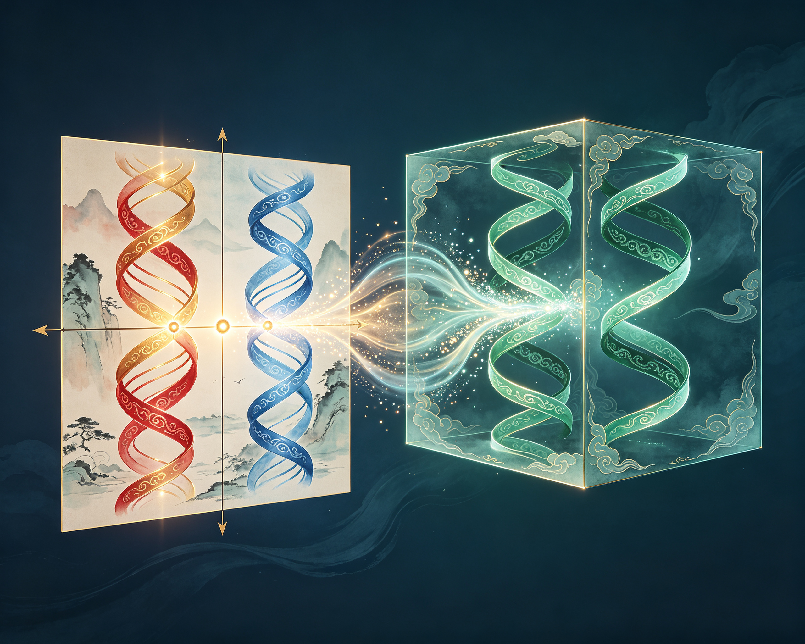
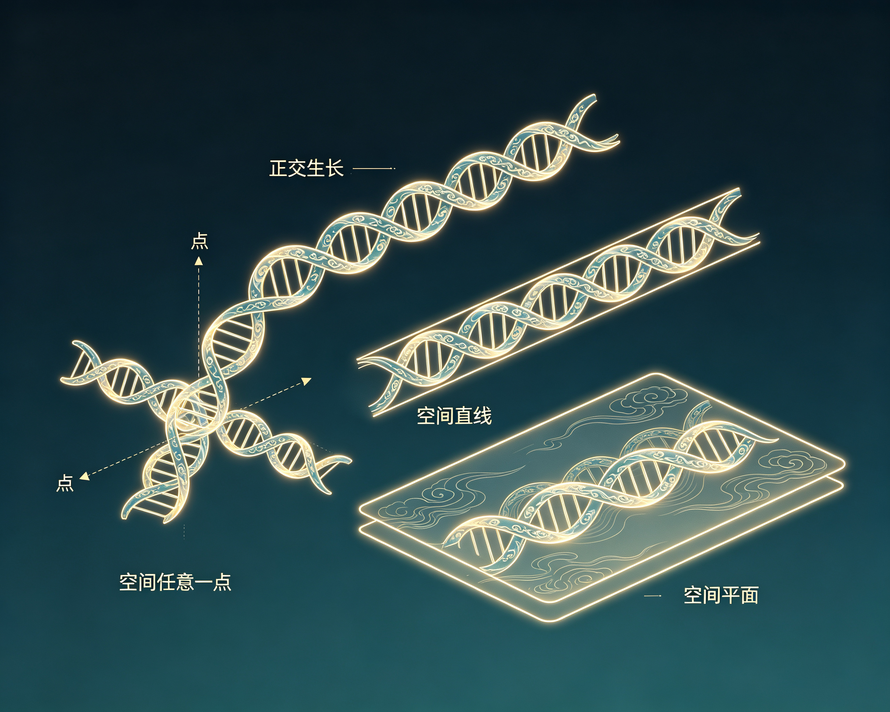
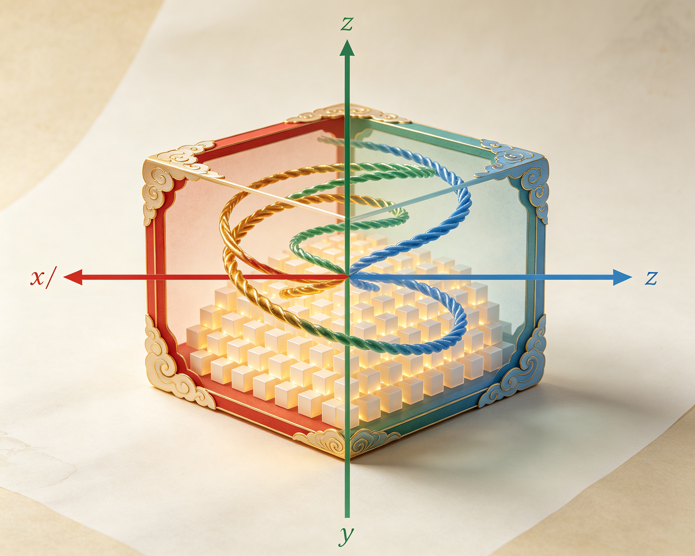
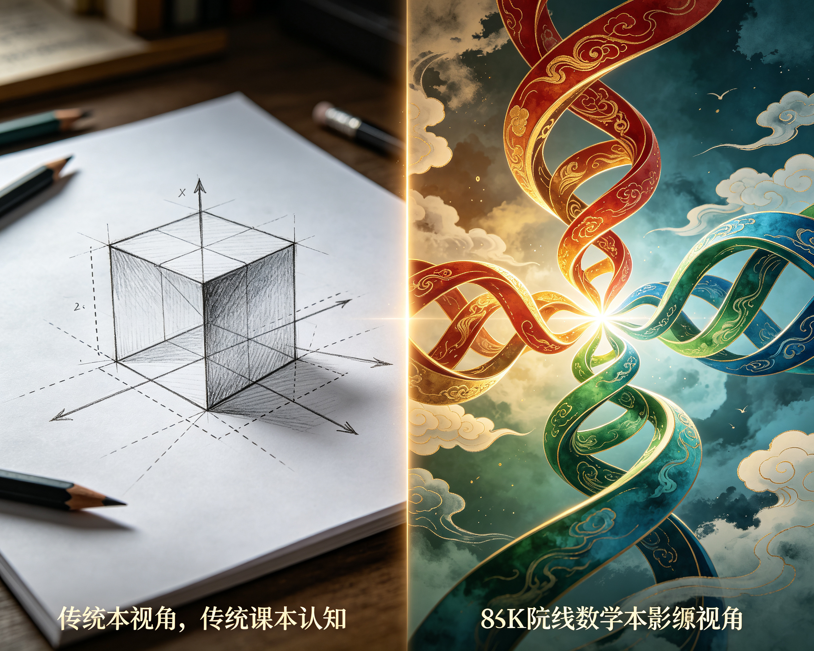

<ArchiveCopyPanel article-id="162374194" />

{"markdown":"PiDliIbnsbvvvJrmlofmmI7ov5vpmLYyMDDorrIgIAo+IOe8luWPt++8mmAxNjIzNzQxOTRgICAKPiDljp/lp4vmlofku7bvvJpg56uL5L2T5Yeg5L2V5LiJ57u056m66Ze05LiN5piv57q46Z2i5LiJ57u057uY5Zu+5pivMOWfuueCueWIhuWMlngteS165LiJ6L205LiJ57uE5q2j5Lqk5Y+M6J665peL5Lqk57uH5b2i5oiQ55qE5LiJ57u055Sf6ZW/5Zy65Z+fLeWFqOWfny0xNjIzNzQxOTQubWRgICAKPiDov5Tlm57vvJpb5pys5Lmm5b2S5qGjXSgvemgvYm9va3MvY291cnNlL2FydGljbGVzLykgwrcgW+aAu+WFpeWPo10oL3poL2Jvb2tzL2FydGljbGVzLykKCiFb5YWo5Z+f5pWw5a2mdnPkvKDnu5/mlbDlrabvvJrkurrnsbvmlofmmI7ov5vpmLYyMDDorrIg56ysNTforrJdKC4vYXNzZXRzL2NzZG5pbWcvanBnLzYzZGY1YThlOTNmYzJmZWMuanBnKQoK5L2c6ICF77yaIOS5luS5luaVsOWtpgoKIyMg44CK5YWo5Z+f5pWw5a2mdnPkvKDnu5/mlbDlrabvvJrkurrnsbvmlofmmI7ov5vpmLYyMDDorrLjgIvnrKw1N+iusgoK6K6y5qyh77yaIOesrDU36K6yCgrkuLvpopjvvJog56uL5L2T5Yeg5L2V5LiJ57u056m66Ze05LiN5piv57q46Z2i5LiJ57u057uY5Zu+77yM5pivMOWfuueCueWIhuWMlngveS965LiJ6L205LiJ57uE5q2j5Lqk5Y+M6J665peL5Lqk57uH5b2i5oiQ55qE5LiJ57u055Sf6ZW/5Zy65Z+fCgrlr7nmoIfor77mnKznn6Xor4bngrnvvJog56m66Ze05Yeg5L2V5L2T44CB56m66Ze054K557q/6Z2i44CB56m66Ze05ZCR6YeP44CB5L2T56ev6KGo6Z2i56evCgrmlofpo47vvJog5aSn55m96K+d44CB5peg5pmm5rap5LiT5Lia6K+N5rGH77yM5bu257utMC8x5Z+654K544CB5Y+M6J665peL5YWo5aWX5q+U5Za7CgotLS0KCiMjIyAw772eM+WIhumSnyDlpI3kuaDlr7zlhaUKCuWQjOWtpuS7rO+8jOS4iuS4gOiKguivvuaIkeS7rOino+W8gOS6huWkjeaVsOeahOacrOa6kO+8muWkjeaVsOW5tumdnuS6uuS4uuiZmuaehOeahOaVsOWtl+e7hOWQiO+8jOiAjOaYr+WOn+eCueWIhuWHuuaoquWQkeOAgee6teWQkeS4pOe7hOWeguebtOWPjOieuuaXi++8jOS6pOaxh+iKgueCueW9ouaIkOeahOS6jOe7tOWkjeWQiOWdkOagh++8m+WunuaVsOWPquaYr+WNleS4gOaoquWQkee7tOW6pueahOeugOWMluingua1i+OAggoKIVvkuoznu7TlpI3mlbDlubPpnaLliLDkuInnu7Tnqbrpl7TnmoTmvJTljJbov4fmuKFdKC4vYXNzZXRzL2NzZG5pbWcvanBnLzY4ZGNlODVkOTVlMWI3OTcuanBnKQoK6auY5Lit56uL5L2T5Yeg5L2V5pCt5bu65a6M5pW05LiJ57u056m66Ze05L2T57O777yM6K++5pys5bCG5LiJ57u056m66Ze05a6a5LmJ5Li657q45LiK55S75Ye655qE56uL5L2T56S65oSP5Zu+77yM5ouG5YiG5qOx5p+x44CB5qOx6ZSl44CB55CD44CB56m66Ze057q/6Z2i5YWz57O777yM5L6d6Z2g56m66Ze05ZCR6YeP6K6h566X6Led56a744CB6KeS5bqm44CB5L2T56ev44CCCgrku4rlpKnlm57lvZIwLzEv4oie5LiJ5p6B5pys5rqQ6KeG6KeS77ya5LiJ57u056m66Ze05LiN5piv5Lq657G755S75Zu+5qih5ouf5Ye65p2l55qE6Jma5ouf5qGG5p6277yMMOWfuueCueWQjOatpeWIhuWMlnjjgIF544CBeuS4iee7hOS6kuebuOato+S6pOOAgeS6kuS4jeW5suaJsOeahOWPjOieuuaXi+iEiee7nO+8jOS4iee7hOieuuaXi+WFqOaWueS9jeS6pOe7h+W7tuWxle+8jOWFseWQjOaehOetkeWHuuWkqeeEtuS4iee7tOeUn+mVv+WcuuWfn++8m+aJgOacieeri+S9k+WbvuW9ouOAgeepuumXtOeCueS9jeOAgee6v+auteW5s+mdou+8jOmDveaYr+S4iee7hOato+S6pOieuuaXi+S6pOe7h+OAgeaIquWPluOAgemXreWQiOW9ouaIkOeahOi9ruW7k+OAggoKLS0tCgojIyMgM++9njEz5YiG6ZKfIOeUn+a0u+WMluexu+avlOiusuinowoK5YWI6K6y6K++5pys56uL5L2T5Yeg5L2V5Z+656GA6YC76L6R77yaCgrlnKjkuoznu7TnurjpnaLmqKHmi5/kuInnu7TniankvZPvvIzljLrliIbngrnjgIHnm7Tnur/jgIHlubPpnaLvvIzliKTlrprlubPooYzjgIHlnoLnm7TjgIHnm7jkuqTlhbPns7vvvJvlvJXlhaXnqbrpl7TlkJHph4/vvIzpgJrov4flnZDmoIfov5DnrpfmsYLop6PlvILpnaLnm7Tnur/lpLnop5LjgIHkuozpnaLop5LjgIHlh6DkvZXkvZPkvZPnp6/vvIzku4XkvZzkuLrlh6DkvZXorqHnrpfpopjlt6XlhbfjgIIKCuaUvuWIsOWPjOieuuaXi+eUn+mVv+S9k+ezu+mHjO+8mgoKMOWfuueCueS9nOS4uuS4iee7tOWvueensOS4reW/g++8jOW7tuS8uOWHuuS4iee7hOS4pOS4pOWeguebtOeahOeLrOeri+WPjOieuuaXi++8mnjovbTmqKrlkJHjgIF56L2057q15rex44CBeui9tOerluWQke+8mwoK5LiJ57uE6J665peL5ZCM5q2l5peg6ZmQ5bu25Ly477yM5Lqk57uH5aGr5ruh5YWo5Z+f77yM5p6E5oiQ5Y6f55Sf5LiJ57u05Zy65Z+f77ybCgrnqbrpl7Tku7vmhI/kuIDngrnvvJog5LiJ57uE6J665peL5ZCE5oiq5Y+W5LiA5q6155Sf6ZW/6ZW/5bqm77yM5LiJ5q615L2T6YeP57uE5ZCI77yM5b2i5oiQ54K555qE5LiJ57u05Z2Q5qCHICh4LHkseikoeCwgeSwgeikoeCx5LHop77ybCgrnqbrpl7Tnm7Tnur/vvJog5Y2V5LiA57uE6J665peL5YyA6YCf5bmz55u05bu25Ly455qE5a6M5pW06ISJ57uc77ybCgrnqbrpl7TlubPpnaLvvJog5Lik57uE5q2j5Lqk6J665peL5Lqk57uH5bmz6ZO65b2i5oiQ55qE5bmz5pW055Sf6ZW/5bGC77ybCgohW+epuumXtOeCueOAgeebtOe6v+OAgeW5s+mdoueahOWPjOieuuaXi+S9k+ezu+ihqOi+vl0oLi9hc3NldHMvY3NkbmltZy9qcGcvZjE0OTM0NGIwNGIyY2QxNi5qcGcpCgrmo7Hmn7HjgIHmo7HplKXjgIHnkIPkvZPvvJog5LiJ57uE6J665peL6ZmQ5a6a6L6555WM6Zet5ZCI55Sf6ZW/77yM5b2i5oiQ5LiN5ZCM56uL5L2T6Zet5ZCI6L2u5buT77ybCgrkuL7nroDljZXkvovlrZDvvJoKCuivvuacrOinhuinku+8mumVv+aWueS9k+mVv+WuvemrmOWvueW6lHjjgIF544CBeuS4iee7hOmVv+W6pu+8jOS9k+enryBWPWHDl2LDl2NWID0gYSBcdGltZXMgYiBcdGltZXMgY1Y9YcOXYsOXY+OAggoK5YWo5Z+f6YCa5L+X6Kej6K+777ya6ZW/5pa55L2T5piveC95L3rkuInnu4TmraPkuqTlj4zonrrml4vliJLlrprovrnnlYzjgIHpl63lkIjnlJ/plb/lvaLmiJDnmoTnq4vkvZPova7lu5PvvJvplb/lrr3pq5jliIbliKvmmK/kuInnu4Tonrrml4vnmoTmiKrlj5bljLrpl7Tplb/luqbvvIzkvZPnp6/mmK/ljLrpl7TlhoXkuInnu7Tonrrml4vlvq7op4LnlJ/plb/ljZXlhYPlhajpg6jntK/liqDnmoTmgLvkvZPph4/vvIzplb/lrr3pq5jnm7jkuZjlj6rmmK/kuInnu7Tonrrml4vntK/np6/mgLvph4/nmoTnroDljJborqHnrpflvaLlvI/jgIIKCiFb6ZW/5pa55L2T5L2T56ev55qE5LiJ57u06J665peL5b6u6KeC5Y2V5YWD57Sv56ev56S65oSPXSguL2Fzc2V0cy9jc2RuaW1nL2pwZy9kZWU4YzhlMDgzZDBjZGZjLmpwZykKCuivvuacrOaKiuS4iee7tOepuumXtOW9k+aIkOS6uuW3pee7mOWbvui+heWKqeahhuaetu+8jOW/veeVpeS4iee7tOWcuuWfn+acrOa6kOaYr+S4iee7hOato+S6pOWPjOieuuaXi+WQjOatpeS6pOe7h+eUn+mVv+eahOWOn+eUn+e7k+aehOOAggoKLS0tCgojIyMgMTPvvZ4yMuWIhumSnyDor77mnKzop4LngrkgdnMg5YWo5Z+f5pWw5a2m6YCa5L+X6KeC54K5CgojIyMjIOS8oOe7n+ivvuacrOiupOefpQoKLSAKCuS4iee7tOepuumXtOaYr+S6uuS4uuaKveixoeamguW/te+8jOS+nemdoOS6jOe7tOWbvue6uOaooeaLn++8jOS4jeWtmOWcqOWOn+eUn+S4iee7tOieuuaXi+eUn+mVv+e7k+aehAoKLSAKCuepuumXtOWdkOagh+OAgeWQkemHj+WPquaYr+iuoeeul+W3peWFt++8jHgveS965LiJ6L205piv5Lq65Li66K6+5a6a55qE5Y+C54Wn5Yi75bqmCgotIAoK5Yeg5L2V5L2T5L2T56ev44CB6KGo6Z2i56ev5Y+q5piv5Yeg5L2V5rWL566X5pWw5YC877yM5ZKM5aSa5bGC6J665peL5b6u6KeC5Y2V5YWD57Sv5Yqg5peg5YWzCgojIyMjIOWFqOWfn+aVsOWtpumAmuS/l+iupOefpQoKLSAKCjDln7rngrnlpKnnhLbliIbljJbkuInnu4TkuKTkuKTmraPkuqTlj4zonrrml4vvvIzkuInnu4TohInnu5zkuqTnu4fmnoTmiJDljp/nlJ/kuInnu7TnlJ/plb/lnLrln5/vvIzkuInnu7Tnqbrpl7TmmK/lrqLop4LmlbDnkIbljp/nlJ/nu5PmnoTvvIzlubbpnZ7kurrnsbvmir3osaHliJvpgKAKCi0gCgrnqbrpl7TlnZDmoIcgKHgseSx6KSh4LCB5LCB6KSh4LHkseikg5YiG5Yir6K6w5b2V5LiJ57uE5q2j5Lqk6J665peL55qE5bu25Ly45L2T6YeP77yM56m66Ze05ZCR6YeP5piv5Y2V5p2h6J665peL5b6u6KeC55Sf6ZW/5Y2V5YWD55qE5LiJ57u05bC65bqmCgotIAoK5aSp5L2T5LiJ57u06L2o6YGT44CB5pm25L2T5LiJ57u05pm25qC844CB6LaF5a+85LiJ57u06L295rWB5a2Q6L+Q5Yqo44CB57KS5a2Q5LiJ57u06L+Q5Yqo6L2o6L+577yM5YWo6YOo5L6d5omY5LiJ6L205q2j5Lqk5Y+M6J665peL5LiJ57u05Zy65Z+f6KeE5YiZ6L+Q6KGMCgohW+S8oOe7n+ivvuacrOiupOefpSB2cyDlhajln5/mlbDlrabmnKzmupDorqTnn6Xlr7nmr5RdKC4vYXNzZXRzL2NzZG5pbWcvanBnLzE5NTM1MjdkOTBkMWFhOGUuanBnKQoK566A5Y2V5q+U5Za777yaCgror77mnKznq4vkvZPlh6DkvZXlpoLlkIzlnKjnurjkuIrmiYvnu5jkuInnu7TniankvZPvvIzpnaDliLvluqborqHnrpflsLrlr7jvvJsKCuacrOa6kOS4iee7tOepuumXtOWmguWQjOS4iee7hOS6kuebuOWeguebtOeahOiXpOiUk+WQjOatpeWQkeWkluaXoOmZkOeUn+mVv++8jOS6kuebuOS6pOe7h+Whq+a7oeepuumXtO+8jOWQhOexu+WHoOS9leS9k+WPquaYr+aIquWPluiXpOiUk+S4gOautemXreWQiOaIkOWei+OAggoKLS0tCgojIyMgMjLvvZ4yN+WIhumSnyDmoKHlhoXlrabkuaDmj5DphpLvvIzkuI3lvbHlk43ogIPor5XlvpfliIYKCuepuumXtOe6v+mdouivgeaYjuOAgeepuumXtOWQkemHj+i/kOeul+OAgeWHoOS9leS9k+ihqOmdouenr+S9k+enr+iuoeeul+mimOWei++8jOS4peagvOaMieeFp+mrmOS4reivvuacrOWIpOWumuWumueQhuOAgeS9k+enr+WFrOW8j+S9nOetlO+8jOiAg+ivleS4jeS8muaJo+WIhuOAggoK5pys6IqC6K++5Y+q5piv5ouT5bGV6auY57u05pys5rqQ6K6k55+l77ya5LiJ57u056uL5L2T56m66Ze05rqQ6Ieq5Y6f54K55YiG5YyW55qEeC95L3rkuInnu4TmraPkuqTlj4zonrrml4vvvIzkuIDliIfnqbrpl7Tlm77lvaLjgIHlnZDmoIfjgIHkvZPnp6/pg73mmK/kuInnu4Tonrrml4vkuqTnu4fmiKrlj5blkI7nmoTkuqfnianjgIIKCuS8j+eslOmTuuWeq++8miDnrKwxMDDorrLpq5jkuK3nu5PkuJrkuJPlnLrvvIzmlbTlkIg1MeKAkzEwMOiusuWFqOmDqOmrmOS4reW+ruenr+WIhuOAgeeri+S9k+WHoOS9leOAgeWkjeaVsOOAgeaVsOWIl+OAgeWchumUpeabsue6v+WGheWuue+8jOe7n+S4gOeUqDAvMS/iiJ7kuInmnoHlj4zonrrml4vlrozmiJDliJ3nrYnjgIHpq5jnrYnmlbDnkIblpKfkuIDnu5/pl63njq/jgIIKCi0tLQoKIyMjIDI3772eMzDliIbpkp8g6K++5aCC5oC757uTICsg5LiL6IqC6K++6aKE5ZGKCgojIyMjIOacrOiKguivvuWwj+e7kwoK5LiJ57u05Zy65Z+f55SxeOOAgXnjgIF65LiJ6L205LiJ57uE5q2j5Lqk5Y+M6J665peL5Lqk57uH55Sf5oiQ77yb56m66Ze054K557q/6Z2i44CB5ZCE57G756uL5L2T5Zu+5b2i77yM5Z2H5Li65LiJ57uE6J665peL5oiq5Y+W44CB6Zet5ZCI55Sf6ZW/5b2i5oiQ55qE6L2u5buT77yM5L2T56ev5piv5LiJ57u05b6u6KeC5Y2V5YWD57Sv5Yqg5oC76YeP44CCCgrnqbrpl7TkuK3ku7vmhI/kuKTngrnot53nprvlhazlvI/vvJpkPSh4MuKIkngxKTIrKHky4oiSeTEpMisoejLiiJJ6MSkyZCA9IFxzcXJ0JiMxMjM7KHhfMi14XzEpXjIgKyAoeV8yLXlfMSleMiArICh6XzItel8xKV4yJiMxMjU7ZD0oeDLigIviiJJ4MeKAiykyKyh5MuKAi+KIknkx4oCLKTIrKHoy4oCL4oiSejHigIspMuKAi++8jOacrOi0qOaYr+S4iee7hOieuuaXi+eUn+mVv+W3rumHj+eahOato+S6pOWQiOaIkOOAggoKIyMjIyDkuIvoioLor77pooTlkYoKCuS4i+S4gOiKguivvu+8muWchumUpeabsue6v+S4jeaYr+WIh+WJsuWchumUpeW+l+WIsOeahOabsue6v++8jOaYr+WPjOieuuaXi+e7lei9tOaXi+i9rOOAgeS4jeWQjOmrmOW6puaIquWPluaIqumdouW9ouaIkOeahOieuuaXi+aKleW9sei9qOi/ueOAggoKIVvnrKw1N+iusuaUtuWwvueJh+Wwvu+8muieuuaXi+aUtuaVm+S4juWchumUpeabsue6v+mihOWRil0oLi9hc3NldHMvY3NkbmltZy9qcGcvN2MyMDAyODVkOThjMWI5ZC5qcGcpCg==","text":"5YiG57G777ya5paH5piO6L+b6Zi2MjAw6K6yICAK57yW5Y+377yaMTYyMzc0MTk0ICAK5Y6f5aeL5paH5Lu277ya56uL5L2T5Yeg5L2V5LiJ57u056m66Ze05LiN5piv57q46Z2i5LiJ57u057uY5Zu+5pivMOWfuueCueWIhuWMlngteS165LiJ6L205LiJ57uE5q2j5Lqk5Y+M6J665peL5Lqk57uH5b2i5oiQ55qE5LiJ57u055Sf6ZW/5Zy65Z+fLeWFqOWfny0xNjIzNzQxOTQubWQgIArov5Tlm57vvJrmnKzkuablvZLmoaMgwrcg5oC75YWl5Y+jCgrlhajln5/mlbDlraZ2c+S8oOe7n+aVsOWtpu+8muS6uuexu+aWh+aYjui/m+mYtjIwMOiusiDnrKw1N+iusgoK5L2c6ICF77yaIOS5luS5luaVsOWtpgoK44CK5YWo5Z+f5pWw5a2mdnPkvKDnu5/mlbDlrabvvJrkurrnsbvmlofmmI7ov5vpmLYyMDDorrLjgIvnrKw1N+iusgoK6K6y5qyh77yaIOesrDU36K6yCgrkuLvpopjvvJog56uL5L2T5Yeg5L2V5LiJ57u056m66Ze05LiN5piv57q46Z2i5LiJ57u057uY5Zu+77yM5pivMOWfuueCueWIhuWMlngveS965LiJ6L205LiJ57uE5q2j5Lqk5Y+M6J665peL5Lqk57uH5b2i5oiQ55qE5LiJ57u055Sf6ZW/5Zy65Z+fCgrlr7nmoIfor77mnKznn6Xor4bngrnvvJog56m66Ze05Yeg5L2V5L2T44CB56m66Ze054K557q/6Z2i44CB56m66Ze05ZCR6YeP44CB5L2T56ev6KGo6Z2i56evCgrmlofpo47vvJog5aSn55m96K+d44CB5peg5pmm5rap5LiT5Lia6K+N5rGH77yM5bu257utMC8x5Z+654K544CB5Y+M6J665peL5YWo5aWX5q+U5Za7CgotLS0KCjDvvZ4z5YiG6ZKfIOWkjeS5oOWvvOWFpQoK5ZCM5a2m5Lus77yM5LiK5LiA6IqC6K++5oiR5Lus6Kej5byA5LqG5aSN5pWw55qE5pys5rqQ77ya5aSN5pWw5bm26Z2e5Lq65Li66Jma5p6E55qE5pWw5a2X57uE5ZCI77yM6ICM5piv5Y6f54K55YiG5Ye65qiq5ZCR44CB57q15ZCR5Lik57uE5Z6C55u05Y+M6J665peL77yM5Lqk5rGH6IqC54K55b2i5oiQ55qE5LqM57u05aSN5ZCI5Z2Q5qCH77yb5a6e5pWw5Y+q5piv5Y2V5LiA5qiq5ZCR57u05bqm55qE566A5YyW6KeC5rWL44CCCgrkuoznu7TlpI3mlbDlubPpnaLliLDkuInnu7Tnqbrpl7TnmoTmvJTljJbov4fmuKEKCumrmOS4reeri+S9k+WHoOS9leaQreW7uuWujOaVtOS4iee7tOepuumXtOS9k+ezu++8jOivvuacrOWwhuS4iee7tOepuumXtOWumuS5ieS4uue6uOS4iueUu+WHuueahOeri+S9k+ekuuaEj+Wbvu+8jOaLhuWIhuajseafseOAgeajsemUpeOAgeeQg+OAgeepuumXtOe6v+mdouWFs+ezu++8jOS+nemdoOepuumXtOWQkemHj+iuoeeul+i3neemu+OAgeinkuW6puOAgeS9k+enr+OAggoK5LuK5aSp5Zue5b2SMC8xL+KInuS4ieaegeacrOa6kOinhuinku+8muS4iee7tOepuumXtOS4jeaYr+S6uuexu+eUu+WbvuaooeaLn+WHuuadpeeahOiZmuaLn+ahhuaetu+8jDDln7rngrnlkIzmraXliIbljJZ444CBeeOAgXrkuInnu4TkupLnm7jmraPkuqTjgIHkupLkuI3lubLmibDnmoTlj4zonrrml4vohInnu5zvvIzkuInnu4Tonrrml4vlhajmlrnkvY3kuqTnu4flu7blsZXvvIzlhbHlkIzmnoTnrZHlh7rlpKnnhLbkuInnu7TnlJ/plb/lnLrln5/vvJvmiYDmnInnq4vkvZPlm77lvaLjgIHnqbrpl7TngrnkvY3jgIHnur/mrrXlubPpnaLvvIzpg73mmK/kuInnu4TmraPkuqTonrrml4vkuqTnu4fjgIHmiKrlj5bjgIHpl63lkIjlvaLmiJDnmoTova7lu5PjgIIKCi0tLQoKM++9njEz5YiG6ZKfIOeUn+a0u+WMluexu+avlOiusuinowoK5YWI6K6y6K++5pys56uL5L2T5Yeg5L2V5Z+656GA6YC76L6R77yaCgrlnKjkuoznu7TnurjpnaLmqKHmi5/kuInnu7TniankvZPvvIzljLrliIbngrnjgIHnm7Tnur/jgIHlubPpnaLvvIzliKTlrprlubPooYzjgIHlnoLnm7TjgIHnm7jkuqTlhbPns7vvvJvlvJXlhaXnqbrpl7TlkJHph4/vvIzpgJrov4flnZDmoIfov5DnrpfmsYLop6PlvILpnaLnm7Tnur/lpLnop5LjgIHkuozpnaLop5LjgIHlh6DkvZXkvZPkvZPnp6/vvIzku4XkvZzkuLrlh6DkvZXorqHnrpfpopjlt6XlhbfjgIIKCuaUvuWIsOWPjOieuuaXi+eUn+mVv+S9k+ezu+mHjO+8mgoKMOWfuueCueS9nOS4uuS4iee7tOWvueensOS4reW/g++8jOW7tuS8uOWHuuS4iee7hOS4pOS4pOWeguebtOeahOeLrOeri+WPjOieuuaXi++8mnjovbTmqKrlkJHjgIF56L2057q15rex44CBeui9tOerluWQke+8mwoK5LiJ57uE6J665peL5ZCM5q2l5peg6ZmQ5bu25Ly477yM5Lqk57uH5aGr5ruh5YWo5Z+f77yM5p6E5oiQ5Y6f55Sf5LiJ57u05Zy65Z+f77ybCgrnqbrpl7Tku7vmhI/kuIDngrnvvJog5LiJ57uE6J665peL5ZCE5oiq5Y+W5LiA5q6155Sf6ZW/6ZW/5bqm77yM5LiJ5q615L2T6YeP57uE5ZCI77yM5b2i5oiQ54K555qE5LiJ57u05Z2Q5qCHICh4LHkseikoeCwgeSwgeikoeCx5LHop77ybCgrnqbrpl7Tnm7Tnur/vvJog5Y2V5LiA57uE6J665peL5YyA6YCf5bmz55u05bu25Ly455qE5a6M5pW06ISJ57uc77ybCgrnqbrpl7TlubPpnaLvvJog5Lik57uE5q2j5Lqk6J665peL5Lqk57uH5bmz6ZO65b2i5oiQ55qE5bmz5pW055Sf6ZW/5bGC77ybCgrnqbrpl7TngrnjgIHnm7Tnur/jgIHlubPpnaLnmoTlj4zonrrml4vkvZPns7vooajovr4KCuajseafseOAgeajsemUpeOAgeeQg+S9k++8miDkuInnu4Tonrrml4vpmZDlrprovrnnlYzpl63lkIjnlJ/plb/vvIzlvaLmiJDkuI3lkIznq4vkvZPpl63lkIjova7lu5PvvJsKCuS4vueugOWNleS+i+WtkO+8mgoK6K++5pys6KeG6KeS77ya6ZW/5pa55L2T6ZW/5a696auY5a+55bqUeOOAgXnjgIF65LiJ57uE6ZW/5bqm77yM5L2T56evIFY9YcOXYsOXY1YgPSBhIFx0aW1lcyBiIFx0aW1lcyBjVj1hw5diw5dj44CCCgrlhajln5/pgJrkv5fop6Por7vvvJrplb/mlrnkvZPmmK94L3kveuS4iee7hOato+S6pOWPjOieuuaXi+WIkuWumui+ueeVjOOAgemXreWQiOeUn+mVv+W9ouaIkOeahOeri+S9k+i9ruW7k++8m+mVv+WuvemrmOWIhuWIq+aYr+S4iee7hOieuuaXi+eahOaIquWPluWMuumXtOmVv+W6pu+8jOS9k+enr+aYr+WMuumXtOWGheS4iee7tOieuuaXi+W+ruingueUn+mVv+WNleWFg+WFqOmDqOe0r+WKoOeahOaAu+S9k+mHj++8jOmVv+WuvemrmOebuOS5mOWPquaYr+S4iee7tOieuuaXi+e0r+enr+aAu+mHj+eahOeugOWMluiuoeeul+W9ouW8j+OAggoK6ZW/5pa55L2T5L2T56ev55qE5LiJ57u06J665peL5b6u6KeC5Y2V5YWD57Sv56ev56S65oSPCgror77mnKzmiorkuInnu7Tnqbrpl7TlvZPmiJDkurrlt6Xnu5jlm77ovoXliqnmoYbmnrbvvIzlv73nlaXkuInnu7TlnLrln5/mnKzmupDmmK/kuInnu4TmraPkuqTlj4zonrrml4vlkIzmraXkuqTnu4fnlJ/plb/nmoTljp/nlJ/nu5PmnoTjgIIKCi0tLQoKMTPvvZ4yMuWIhumSnyDor77mnKzop4LngrkgdnMg5YWo5Z+f5pWw5a2m6YCa5L+X6KeC54K5CgrkvKDnu5/or77mnKzorqTnn6UK5LiJ57u056m66Ze05piv5Lq65Li65oq96LGh5qaC5b+177yM5L6d6Z2g5LqM57u05Zu+57q45qih5ouf77yM5LiN5a2Y5Zyo5Y6f55Sf5LiJ57u06J665peL55Sf6ZW/57uT5p6ECuepuumXtOWdkOagh+OAgeWQkemHj+WPquaYr+iuoeeul+W3peWFt++8jHgveS965LiJ6L205piv5Lq65Li66K6+5a6a55qE5Y+C54Wn5Yi75bqmCuWHoOS9leS9k+S9k+enr+OAgeihqOmdouenr+WPquaYr+WHoOS9lea1i+eul+aVsOWAvO+8jOWSjOWkmuWxguieuuaXi+W+ruinguWNleWFg+e0r+WKoOaXoOWFswoK5YWo5Z+f5pWw5a2m6YCa5L+X6K6k55+lCjDln7rngrnlpKnnhLbliIbljJbkuInnu4TkuKTkuKTmraPkuqTlj4zonrrml4vvvIzkuInnu4TohInnu5zkuqTnu4fmnoTmiJDljp/nlJ/kuInnu7TnlJ/plb/lnLrln5/vvIzkuInnu7Tnqbrpl7TmmK/lrqLop4LmlbDnkIbljp/nlJ/nu5PmnoTvvIzlubbpnZ7kurrnsbvmir3osaHliJvpgKAK56m66Ze05Z2Q5qCHICh4LHkseikoeCwgeSwgeikoeCx5LHopIOWIhuWIq+iusOW9leS4iee7hOato+S6pOieuuaXi+eahOW7tuS8uOS9k+mHj++8jOepuumXtOWQkemHj+aYr+WNleadoeieuuaXi+W+ruingueUn+mVv+WNleWFg+eahOS4iee7tOWwuuW6pgrlpKnkvZPkuInnu7TovajpgZPjgIHmmbbkvZPkuInnu7TmmbbmoLzjgIHotoXlr7zkuInnu7Tovb3mtYHlrZDov5DliqjjgIHnspLlrZDkuInnu7Tov5Dliqjovajov7nvvIzlhajpg6jkvp3miZjkuInovbTmraPkuqTlj4zonrrml4vkuInnu7TlnLrln5/op4TliJnov5DooYwKCuS8oOe7n+ivvuacrOiupOefpSB2cyDlhajln5/mlbDlrabmnKzmupDorqTnn6Xlr7nmr5QKCueugOWNleavlOWWu++8mgoK6K++5pys56uL5L2T5Yeg5L2V5aaC5ZCM5Zyo57q45LiK5omL57uY5LiJ57u054mp5L2T77yM6Z2g5Yi75bqm6K6h566X5bC65a+477ybCgrmnKzmupDkuInnu7Tnqbrpl7TlpoLlkIzkuInnu4TkupLnm7jlnoLnm7TnmoTol6TolJPlkIzmraXlkJHlpJbml6DpmZDnlJ/plb/vvIzkupLnm7jkuqTnu4floavmu6Hnqbrpl7TvvIzlkITnsbvlh6DkvZXkvZPlj6rmmK/miKrlj5bol6TolJPkuIDmrrXpl63lkIjmiJDlnovjgIIKCi0tLQoKMjLvvZ4yN+WIhumSnyDmoKHlhoXlrabkuaDmj5DphpLvvIzkuI3lvbHlk43ogIPor5XlvpfliIYKCuepuumXtOe6v+mdouivgeaYjuOAgeepuumXtOWQkemHj+i/kOeul+OAgeWHoOS9leS9k+ihqOmdouenr+S9k+enr+iuoeeul+mimOWei++8jOS4peagvOaMieeFp+mrmOS4reivvuacrOWIpOWumuWumueQhuOAgeS9k+enr+WFrOW8j+S9nOetlO+8jOiAg+ivleS4jeS8muaJo+WIhuOAggoK5pys6IqC6K++5Y+q5piv5ouT5bGV6auY57u05pys5rqQ6K6k55+l77ya5LiJ57u056uL5L2T56m66Ze05rqQ6Ieq5Y6f54K55YiG5YyW55qEeC95L3rkuInnu4TmraPkuqTlj4zonrrml4vvvIzkuIDliIfnqbrpl7Tlm77lvaLjgIHlnZDmoIfjgIHkvZPnp6/pg73mmK/kuInnu4Tonrrml4vkuqTnu4fmiKrlj5blkI7nmoTkuqfnianjgIIKCuS8j+eslOmTuuWeq++8miDnrKwxMDDorrLpq5jkuK3nu5PkuJrkuJPlnLrvvIzmlbTlkIg1MeKAkzEwMOiusuWFqOmDqOmrmOS4reW+ruenr+WIhuOAgeeri+S9k+WHoOS9leOAgeWkjeaVsOOAgeaVsOWIl+OAgeWchumUpeabsue6v+WGheWuue+8jOe7n+S4gOeUqDAvMS/iiJ7kuInmnoHlj4zonrrml4vlrozmiJDliJ3nrYnjgIHpq5jnrYnmlbDnkIblpKfkuIDnu5/pl63njq/jgIIKCi0tLQoKMjfvvZ4zMOWIhumSnyDor77loILmgLvnu5MgKyDkuIvoioLor77pooTlkYoKCuacrOiKguivvuWwj+e7kwoK5LiJ57u05Zy65Z+f55SxeOOAgXnjgIF65LiJ6L205LiJ57uE5q2j5Lqk5Y+M6J665peL5Lqk57uH55Sf5oiQ77yb56m66Ze054K557q/6Z2i44CB5ZCE57G756uL5L2T5Zu+5b2i77yM5Z2H5Li65LiJ57uE6J665peL5oiq5Y+W44CB6Zet5ZCI55Sf6ZW/5b2i5oiQ55qE6L2u5buT77yM5L2T56ev5piv5LiJ57u05b6u6KeC5Y2V5YWD57Sv5Yqg5oC76YeP44CCCgrnqbrpl7TkuK3ku7vmhI/kuKTngrnot53nprvlhazlvI/vvJpkPSh4MuKIkngxKTIrKHky4oiSeTEpMisoejLiiJJ6MSkyZCA9IFxzcXJ0eyh4Mi14MSleMiArICh5Mi15MSleMiArICh6Mi16MSleMn1kPSh4MuKAi+KIkngx4oCLKTIrKHky4oCL4oiSeTHigIspMisoejLigIviiJJ6MeKAiyky4oCL77yM5pys6LSo5piv5LiJ57uE6J665peL55Sf6ZW/5beu6YeP55qE5q2j5Lqk5ZCI5oiQ44CCCgrkuIvoioLor77pooTlkYoKCuS4i+S4gOiKguivvu+8muWchumUpeabsue6v+S4jeaYr+WIh+WJsuWchumUpeW+l+WIsOeahOabsue6v++8jOaYr+WPjOieuuaXi+e7lei9tOaXi+i9rOOAgeS4jeWQjOmrmOW6puaIquWPluaIqumdouW9ouaIkOeahOieuuaXi+aKleW9sei9qOi/ueOAggoK56ysNTforrLmlLblsL7niYflsL7vvJronrrml4vmlLbmlZvkuI7lnIbplKXmm7Lnur/pooTlkYo="}

> 分类：文明进阶200讲  
> 编号：`162374194`  
> 原始文件：`立体几何三维空间不是纸面三维绘图是0基点分化x-y-z三轴三组正交双螺旋交织形成的三维生长场域-全域-162374194.md`  
> 返回：[本书归档](/zh/books/course/articles/) · [总入口](/zh/books/articles/)

<ArticlePaperMeta category="文明进阶200讲" article-id="162374194" title="立体几何三维空间不是纸面三维绘图是0基点分化x-y-z三轴三组正交双螺旋交织形成的三维生长场域-全域" paper-kind="课程讲义" book-route="/zh/books/course/articles/" overview-route="/zh/books/articles/" summary="对标课本知识点： 空间几何体、空间点线面、空间向量、体积表面积" author="乖乖数学" lecture="第57讲" theme="立体几何三维空间不是纸面三维绘图，是0基点分化x/y/z三轴三组正交双螺旋交织形成的三维生长场域" source-file="立体几何三维空间不是纸面三维绘图是0基点分化x-y-z三轴三组正交双螺旋交织形成的三维生长场域-全域-162374194.md" cover="./assets/csdnimg/jpg/63df5a8e93fc2fec.jpg" />

作者： 乖乖数学

## 《全域数学vs传统数学：人类文明进阶200讲》第57讲

讲次： 第57讲

主题： 立体几何三维空间不是纸面三维绘图，是0基点分化x/y/z三轴三组正交双螺旋交织形成的三维生长场域

对标课本知识点： 空间几何体、空间点线面、空间向量、体积表面积

文风： 大白话、无晦涩专业词汇，延续0/1基点、双螺旋全套比喻

---

### 0～3分钟 复习导入

同学们，上一节课我们解开了复数的本源：复数并非人为虚构的数字组合，而是原点分出横向、纵向两组垂直双螺旋，交汇节点形成的二维复合坐标；实数只是单一横向维度的简化观测。

高中立体几何搭建完整三维空间体系，课本将三维空间定义为纸上画出的立体示意图，拆分棱柱、棱锥、球、空间线面关系，依靠空间向量计算距离、角度、体积。

今天回归0/1/∞三极本源视角：三维空间不是人类画图模拟出来的虚拟框架，0基点同步分化x、y、z三组互相正交、互不干扰的双螺旋脉络，三组螺旋全方位交织延展，共同构筑出天然三维生长场域；所有立体图形、空间点位、线段平面，都是三组正交螺旋交织、截取、闭合形成的轮廓。

---

### 3～13分钟 生活化类比讲解

先讲课本立体几何基础逻辑：

在二维纸面模拟三维物体，区分点、直线、平面，判定平行、垂直、相交关系；引入空间向量，通过坐标运算求解异面直线夹角、二面角、几何体体积，仅作为几何计算题工具。

放到双螺旋生长体系里：

0基点作为三维对称中心，延伸出三组两两垂直的独立双螺旋：x轴横向、y轴纵深、z轴竖向；

三组螺旋同步无限延伸，交织填满全域，构成原生三维场域；

空间任意一点： 三组螺旋各截取一段生长长度，三段体量组合，形成点的三维坐标 (x,y,z)(x, y, z)(x,y,z)；

空间直线： 单一组螺旋匀速平直延伸的完整脉络；

空间平面： 两组正交螺旋交织平铺形成的平整生长层；

棱柱、棱锥、球体： 三组螺旋限定边界闭合生长，形成不同立体闭合轮廓；

举简单例子：

课本视角：长方体长宽高对应x、y、z三组长度，体积 V=a×b×cV = a \times b \times cV=a×b×c。

全域通俗解读：长方体是x/y/z三组正交双螺旋划定边界、闭合生长形成的立体轮廓；长宽高分别是三组螺旋的截取区间长度，体积是区间内三维螺旋微观生长单元全部累加的总体量，长宽高相乘只是三维螺旋累积总量的简化计算形式。

课本把三维空间当成人工绘图辅助框架，忽略三维场域本源是三组正交双螺旋同步交织生长的原生结构。

---

### 13～22分钟 课本观点 vs 全域数学通俗观点

#### 传统课本认知

- 

三维空间是人为抽象概念，依靠二维图纸模拟，不存在原生三维螺旋生长结构

- 

空间坐标、向量只是计算工具，x/y/z三轴是人为设定的参照刻度

- 

几何体体积、表面积只是几何测算数值，和多层螺旋微观单元累加无关

#### 全域数学通俗认知

- 

0基点天然分化三组两两正交双螺旋，三组脉络交织构成原生三维生长场域，三维空间是客观数理原生结构，并非人类抽象创造

- 

空间坐标 (x,y,z)(x, y, z)(x,y,z) 分别记录三组正交螺旋的延伸体量，空间向量是单条螺旋微观生长单元的三维尺度

- 

天体三维轨道、晶体三维晶格、超导三维载流子运动、粒子三维运动轨迹，全部依托三轴正交双螺旋三维场域规则运行

简单比喻：

课本立体几何如同在纸上手绘三维物体，靠刻度计算尺寸；

本源三维空间如同三组互相垂直的藤蔓同步向外无限生长，互相交织填满空间，各类几何体只是截取藤蔓一段闭合成型。

---

### 22～27分钟 校内学习提醒，不影响考试得分

空间线面证明、空间向量运算、几何体表面积体积计算题型，严格按照高中课本判定定理、体积公式作答，考试不会扣分。

本节课只是拓展高维本源认知：三维立体空间源自原点分化的x/y/z三组正交双螺旋，一切空间图形、坐标、体积都是三组螺旋交织截取后的产物。

伏笔铺垫： 第100讲高中结业专场，整合51–100讲全部高中微积分、立体几何、复数、数列、圆锥曲线内容，统一用0/1/∞三极双螺旋完成初等、高等数理大一统闭环。

---

### 27～30分钟 课堂总结 + 下节课预告

#### 本节课小结

三维场域由x、y、z三轴三组正交双螺旋交织生成；空间点线面、各类立体图形，均为三组螺旋截取、闭合生长形成的轮廓，体积是三维微观单元累加总量。

空间中任意两点距离公式：d=(x2−x1)2+(y2−y1)2+(z2−z1)2d = \sqrt&#123;(x_2-x_1)^2 + (y_2-y_1)^2 + (z_2-z_1)^2&#125;d=(x2​−x1​)2+(y2​−y1​)2+(z2​−z1​)2​，本质是三组螺旋生长差量的正交合成。

#### 下节课预告

下一节课：圆锥曲线不是切割圆锥得到的曲线，是双螺旋绕轴旋转、不同高度截取截面形成的螺旋投影轨迹。

