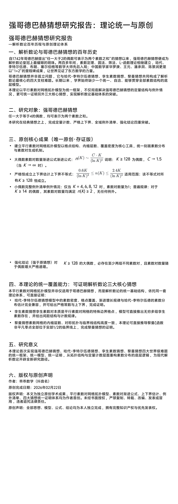

<ArchiveCopyPanel article-id="158291747" />

{"markdown":"PiDliIbnsbvvvJrlk6Xlvrflt7TotavnjJzmg7MgIAo+IOe8luWPt++8mmAxNTgyOTE3NDdgICAKPiDljp/lp4vmlofku7bvvJpg5by65ZOl5b635be06LWr54yc5oOzMTEy56CU56m25oql5ZGK55CG6K6657uf5LiA5LiO5Y6f5Yib5LmW5LmW5pWw5a2mLTE1ODI5MTc0Ny5tZGAgIAo+IOi/lOWbnu+8mlvmnKzkuablvZLmoaNdKC96aC9ib29rcy9nb2xkYmFjaC9hcnRpY2xlcy8pIMK3IFvmgLvlhaXlj6NdKC96aC9ib29rcy9hcnRpY2xlcy8pCgohW+ivt+a3u+WKoOWbvueJh+aPj+i/sF0oLi9hc3NldHMvY3NkbmltZy9wbmcvNTI3NDQyM2M4MTdlYmUwNy5wbmcpCgohW+ivt+a3u+WKoOWbvueJh+aPj+i/sF0oLi9hc3NldHMvY3NkbmltZy9wbmcvZGUyYmU0ZGNjM2UxODM0ZS5wbmcpCgog5Y6f5Yib5L2c6ICF77ya5LmW5LmW5pWw5a2mCg==","text":"5YiG57G777ya5ZOl5b635be06LWr54yc5oOzICAK57yW5Y+377yaMTU4MjkxNzQ3ICAK5Y6f5aeL5paH5Lu277ya5by65ZOl5b635be06LWr54yc5oOzMTEy56CU56m25oql5ZGK55CG6K6657uf5LiA5LiO5Y6f5Yib5LmW5LmW5pWw5a2mLTE1ODI5MTc0Ny5tZCAgCui/lOWbnu+8muacrOS5puW9kuahoyDCtyDmgLvlhaXlj6MKCuivt+a3u+WKoOWbvueJh+aPj+i/sAoK6K+35re75Yqg5Zu+54mH5o+P6L+wCgog5Y6f5Yib5L2c6ICF77ya5LmW5LmW5pWw5a2m"}

> 分类：哥德巴赫猜想  
> 编号：`158291747`  
> 原始文件：`强哥德巴赫猜想112研究报告理论统一与原创乖乖数学-158291747.md`  
> 返回：[本书归档](/zh/books/goldbach/articles/) · [总入口](/zh/books/articles/)

<ArticlePaperMeta category="哥德巴赫猜想" article-id="158291747" title="强哥德巴赫猜想112研究报告理论统一与原创乖乖数学" paper-kind="研究论文" book-route="/zh/books/goldbach/articles/" overview-route="/zh/books/articles/" summary="集中收录哥德巴赫猜想、孪生素数、素数网格与数论相关研究。" author="乖乖数学" source-file="强哥德巴赫猜想112研究报告理论统一与原创乖乖数学-158291747.md" cover="./assets/csdnimg/png/5274423c817ebe07.png" />

 原创作者：乖乖数学
