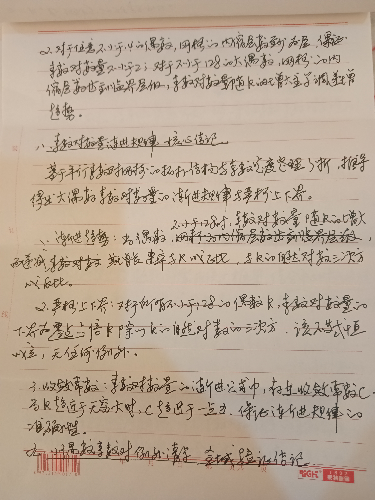
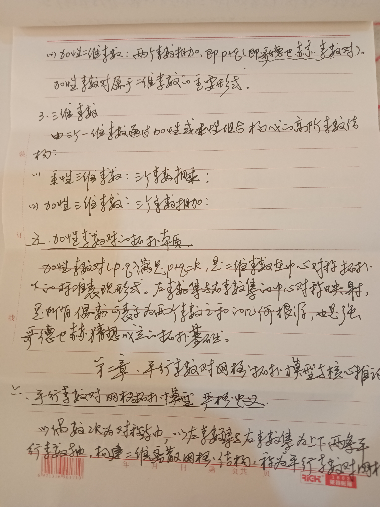
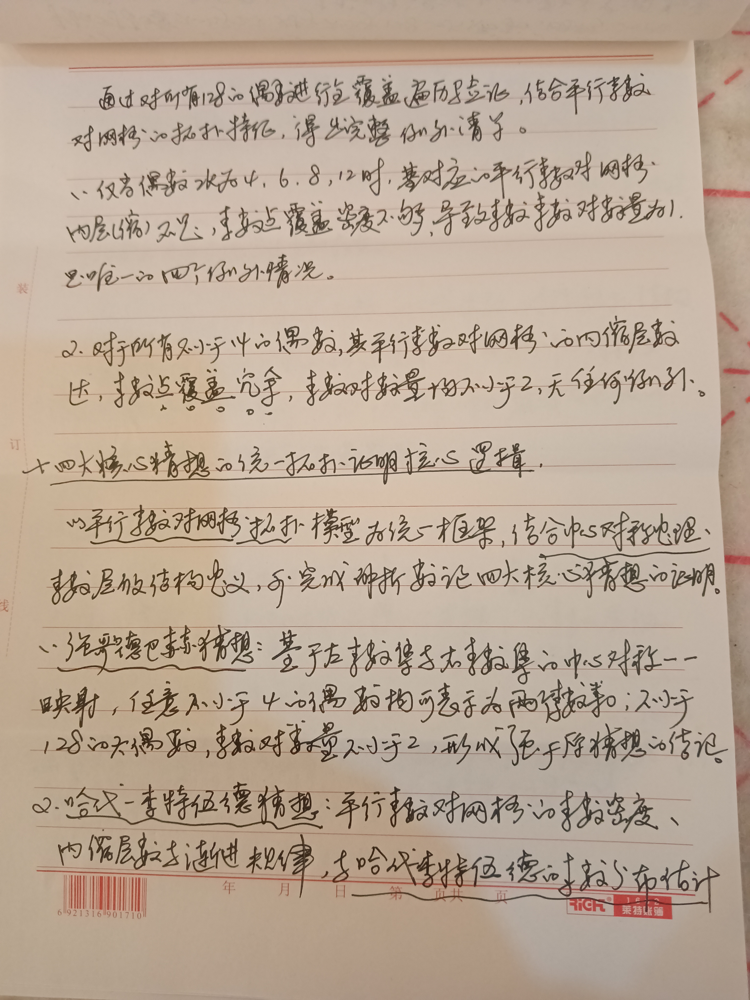
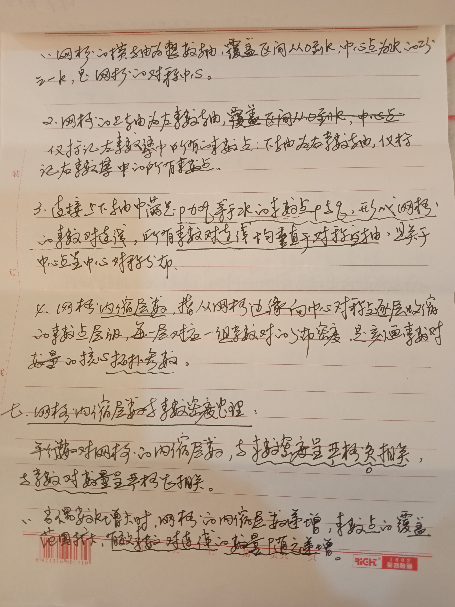
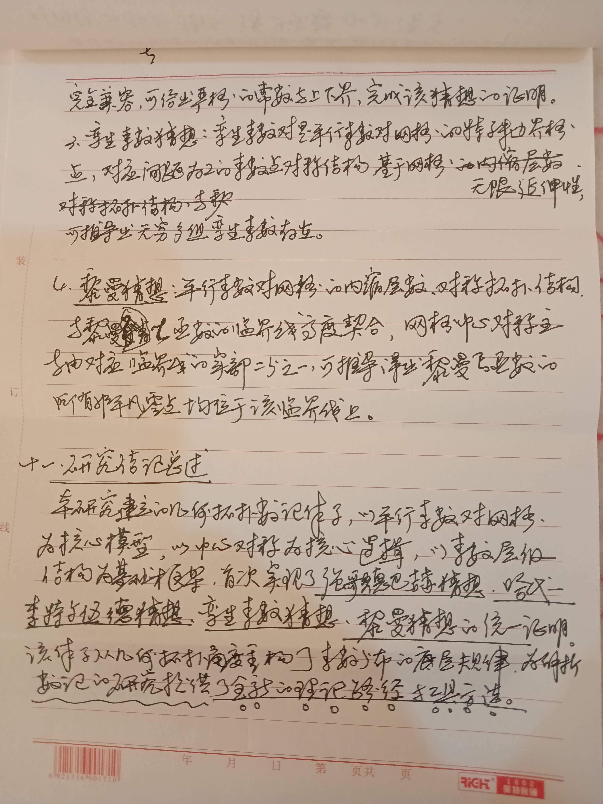
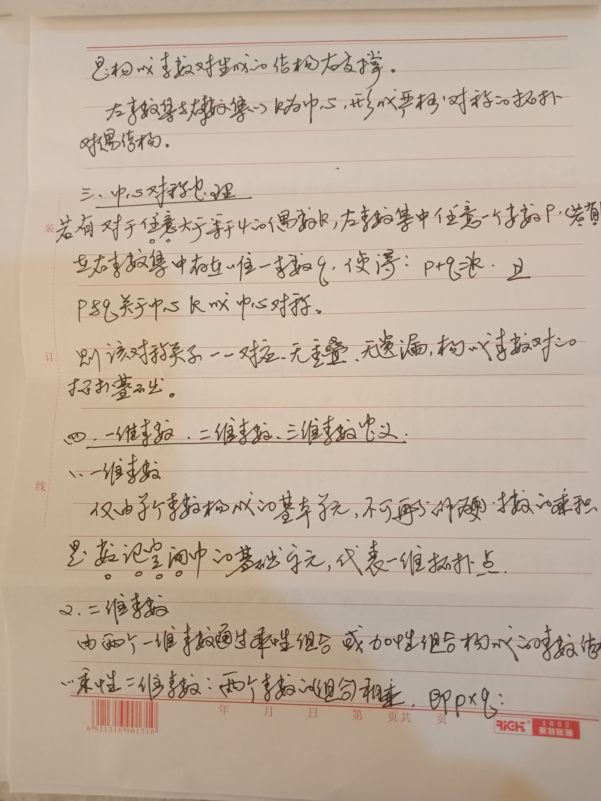
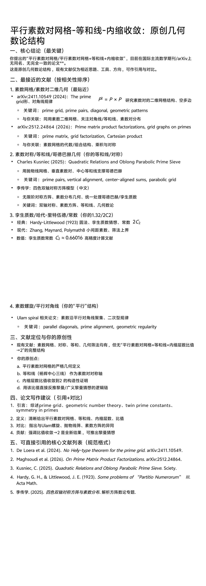

<ArchiveCopyPanel article-id="158343098" />

{"markdown":"PiDliIbnsbvvvJrlk6Xlvrflt7TotavnjJzmg7MgIAo+IOe8luWPt++8mmAxNTgzNDMwOThgICAKPiDljp/lp4vmlofku7bvvJpg5Yeg5L2V5ouT5omR5pWw6K665LmL5by65ZOl5b635be06LWr54yc5oOz6K665paH5omL56i/6KeE6IyD5YyW5paH5qGjLTE1ODM0MzA5OC5tZGAgIAo+IOi/lOWbnu+8mlvmnKzkuablvZLmoaNdKC96aC9ib29rcy9nb2xkYmFjaC9hcnRpY2xlcy8pIMK3IFvmgLvlhaXlj6NdKC96aC9ib29rcy9hcnRpY2xlcy8pCgojIyDlh6DkvZXmi5PmiZHmlbDorrrkuYvlvLrlk6Xlvrflt7TotavnjJzmg7PvvIjorrrmlofmiYvnqL/op4TojIPljJbmlofmoaPvvIkKCuS9nOiAhe+8mu+8iOS5luS5luaVsOWtpsK35oqW6Z+z5ZCN77yb5Zu96ZmF57K+566X5biIU09Bwrflvq7kv6HlkI3vvIkKCumCrueuse+8mlt3eXE1MjA5OTIwMTlAcXEuY29tXQoK5pel5pyf77yaMjAyNuW5tDHmnIjvvIjmlbTnkIbniYjvvIkKCiMjIyDmkZjopoEKCuacrOaWh+S7peWHoOS9leaLk+aJkeaVsOiuuuS4uuaguOW/g+ahhuaetu+8jOWwhue0oOaVsOWIhuW4g+OAgeWvueensOaAp+OAgeagvOeCueimhuebluS4juWxgueKtuaUtue8qeebuOe7k+WQiO+8jOaehOW7uuKAnOW5s+ihjOe0oOaVsOWvuee9keagvOKAneaLk+aJkeaooeWei+OAgumAmui/h+WumuS5ieW3puWPs+e0oOaVsOmbhuOAgeS4reW/g+WvueensOeQhuiuuuWPiuWkmue7tOe0oOaVsOe7k+aehO+8jOW7uueri+e0oOaVsOWvhuW6puS4jue9keagvOWGhee8qeWxguaVsOeahOWFs+iBlOinhOW+i++8jOWujOaIkOW8uuWTpeW+t+W3tOi1q+eMnOaDs+OAgeWTiOS7oy3mnY7nibnlsJTkvI3lvrfnjJzmg7PjgIHlrarnlJ/ntKDmlbDnjJzmg7Plj4rpu47mm7znjJzmg7PnmoTnu5/kuIDmi5PmiZHor4HmmI7pgLvovpHvvIzkuLrop6PmnpDmlbDorrrnoJTnqbbmj5DkvpvlhajmlrDnkIborrrot6/lvoTkuI7lt6XlhbfjgIIKCiFb6K+35re75Yqg5Zu+54mH5o+P6L+wXSguL2Fzc2V0cy9jc2RuaW1nL3BuZy8yMzg2ZDdhYjgwMThmMTU4LnBuZykKCiMjIyDnrKzkuIDnq6Ag5Yeg5L2V5ouT5omR5pWw6K665Z+65pys5a6a5LmJCgojIyMjIDEuMSDlh6DkvZXmi5PmiZHmlbDorrrnmoTmoLjlv4PlhoXmtrUKCuWHoOS9leaLk+aJkeaVsOiuuuS7peaVsOeahOaLk+aJkee7k+aehOS4uueglOeptuWvueixoe+8jOiejeWQiOe0oOaVsOWIhuW4g+OAgeWvueensOaAp+OAgeagvOeCueimhuebluOAgeWxgueKtuaUtue8qeS4juepuumXtOaLk+aJke+8jOaehOW7uue0oOaVsOeUn+aIkOOAgee7hOWQiOOAgeWIhuW4g+eahOe7n+S4gOWHoOS9leWMlueQhuiuuuS9k+ezu+OAguacrOeQhuiuuuS7peWvueensOOAgeWIhuWxguOAgee9keagvOOAgeWGhee8qeS4uuaguOW/g+W3peWFt++8jOe7n+S4gOaPj+i/sOWKoOaAp+e0oOaVsOS4juS5mOaAp+e0oOaVsOeahOWFqOWfn+inhOW+i+OAggoKIyMjIyAxLjIg5bem57Sg5pWw6ZuG5LiO5Y+z57Sg5pWw6ZuG77yI5Lil5qC85a6a5LmJ77yJCgrorr4ya+S4uuWkp+S6juetieS6jjTnmoTku7vmhI/lgbbmlbDvvIzku6Vr5Li65Lit5b+D54K577yI5a+556ew5Y6f54K577yJ77yM5a6a5LmJ77yaCgotIOW3pue0oOaVsOmbhu+8muWMuumXtCgwLCBrKeWGheaJgOaciee0oOaVsOaehOaIkOeahOmbhuWQiOOAggoKLSDlh6DkvZXmhI/kuYnvvJrku6PooajlgbbmlbAya+W3puS+p+eahOWFqOmDqOe0oOaVsOWFg++8jOaYr+e0oOaVsOWvueeUn+aIkOeahOW3puaUr+aSkee7k+aehOOAggoKLSDlj7PntKDmlbDpm4bvvJrljLrpl7QoaywgMmsp5YaF5omA5pyJ57Sg5pWw5p6E5oiQ55qE6ZuG5ZCI44CCCgotIOWHoOS9leaEj+S5ie+8muS7o+ihqOWBtuaVsDJr5Y+z5L6n55qE5YWo6YOo57Sg5pWw5YWD77yM5piv57Sg5pWw5a+555Sf5oiQ55qE5Y+z5pSv5pKR57uT5p6E44CCCgrmi5PmiZHnibnlvoHvvJrlt6bntKDmlbDpm4bkuI7lj7PntKDmlbDpm4bku6Vr5Li65Lit5b+D77yM5b2i5oiQ5Lil5qC85a+556ew55qE5ouT5omR5a+55YG257uT5p6E44CCCgojIyMjIDEuMyDkuK3lv4Plr7nnp7DlrprnkIYKCuWumueQhu+8muWvueS6juS7u+aEj+Wkp+S6juetieS6jjTnmoTlgbbmlbAya++8jOiLpeWtmOWcqOe0oOaVsHDlkoxx5L2/5b6XcCArIHEgPSAya++8jOWImXDkuI5x5b+F54S25YWz5LqO5Lit5b+Da+aIkOS4reW/g+WvueensO+8jOWNs+a7oei2s++8mmsg4oiSIHAgPSBxIOKIkiBr77yM5LiU5b+F5pyJ77yacCDiiaQgayDkuJQgcSDiiaUga++8iOaIluWPjeS5i++8ieOAggoK5o6o6K6677yaCgotIAoK6IulcOaYr+Wwj+S6juetieS6jmvnmoTntKDmlbDvvIzkuJRxID0gMmsg4oiSIHDkuZ/mmK/ntKDmlbDvvIzliJlw5LiOceaehOaIkOWUr+S4gOeahOWTpeW+t+W3tOi1q+WIhuaLhuWvueOAggoKLSAKCuaJgOaciea7oei2s+adoeS7tueahOWTpeW+t+W3tOi1q+WIhuaLhuWvue+8jOWdh+WcqOaVsOi9tOS4iuWFs+S6jmvlr7nnp7DliIbluIPvvIzml6Dph43lj6DjgIHml6DpgZfmvI/jgIIKCiMjIyMgMS40IOS4gOe7tOe0oOaVsOOAgeS6jOe7tOe0oOaVsOOAgeS4iee7tOe0oOaVsO+8iOWIhuWxguWumuS5ie+8iQoKIyMjIyMgMS40LjEg5LiA57u057Sg5pWwCgrku4XnlLEx5Liq57Sg5pWw5p6E5oiQ55qE5Z+65pys5Y2V5YWD77yM5LiN5Y+v5YaN5YiG6Kej5Li657Sg5pWw55qE5LmY56ev77yM5piv5pWw6K6656m66Ze05Lit55qE5Z+656GA5ouT5omR54K544CCCgojIyMjIyAxLjQuMiDkuoznu7TntKDmlbAKCueUseS4pOS4quS4gOe7tOe0oOaVsOmAmui/h+WKoOaAp+e7hOWQiOaIluS5mOaAp+e7hOWQiOaehOaIkOeahOaVsOiuuue7k+aehO+8mgoKLSAKCuS5mOaAp+S6jOe7tOe0oOaVsO+8muS4pOS4que0oOaVsOeahOS5mOenr++8jOWNs3Agw5cgce+8mwoKLSAKCuWKoOaAp+S6jOe7tOe0oOaVsO+8muS4pOS4que0oOaVsOeahOWSjO+8jOWNs3AgKyBx77yI5by65ZOl5b635be06LWr57Sg5pWw5a+555qE5qC45b+D5b2i5byP77yJ44CCCgojIyMjIyAxLjQuMyDkuInnu7TntKDmlbAKCueUseS4ieS4quS4gOe7tOe0oOaVsOmAmui/h+WKoOaAp+aIluS5mOaAp+e7hOWQiOaehOaIkOeahOmrmOmYtuaVsOiuuue7k+aehO+8mgoKLSAKCuS5mOaAp+S4iee7tOe0oOaVsO+8muS4ieS4que0oOaVsOeahOS5mOenr++8mwoKLSAKCuWKoOaAp+S4iee7tOe0oOaVsO+8muS4ieS4que0oOaVsOeahOWSjOOAggoKIyMjIyAxLjUg5Yqg5oCn57Sg5pWw5a+555qE5ouT5omR5pys6LSoCgrliqDmgKfntKDmlbDlr7kocCwgcSnmu6HotrNwICsgcSA9IDJr77yM5piv5LqM57u057Sg5pWw5Zyo5Lit5b+D5a+556ew5ouT5omR5LiL55qE5qCH5YeG6KGo546w5b2i5byP44CCCgrlt6bntKDmlbDpm4bkuI7lj7PntKDmlbDpm4bnmoTkuK3lv4Plr7nnp7DmmKDlsITvvIzmmK/miYDmnInlgbbmlbDlj6/ooajnpLrkuLrkuKTkuKrntKDmlbDkuYvlkoznmoTlh6DkvZXmoLnmupDvvIzkuZ/mmK/lvLrlk6Xlvrflt7TotavnjJzmg7PmiJDnq4vnmoTmi5PmiZHln7rnoYDjgIIKCiMjIyDnrKzkuoznq6Ag5bmz6KGM57Sg5pWw5a+5572R5qC85ouT5omR5qih5Z6L5LiO5qC45b+D5o6o6K66CgojIyMjIDIuMSDlubPooYzntKDmlbDlr7nnvZHmoLzmi5PmiZHmqKHlnovvvIjkuKXmoLzlrprkuYnvvIkKCuS7peWBtuaVsDJr5Li65a+556ew6L2077yM5Lul5bem57Sg5pWw6ZuG5LiO5Y+z57Sg5pWw6ZuG5Li65LiK5LiL5Lik5p2h5bmz6KGM57Sg5pWw6L2077yM5p6E5bu65LqM57u056a75pWj572R5qC857uT5p6E77yM56ew5Li65bmz6KGM57Sg5pWw5a+5572R5qC844CCCgojIyMjIyAyLjEuMSDnvZHmoLzmoLjlv4Pmi5PmiZHnibnlvoEKCi0gCgrlr7nnp7DovbTvvJrnlLHmlbTmlbDovbTmnoTmiJDvvIzopobnm5bljLrpl7RbMCwgMmtd77yM5Lit5b+D54K55Li6a++8iOe9keagvOeahOWvueensOS4reW/g++8ie+8mwoKLSAKCue0oOaVsOi9tOWIhuWxgu+8mgoKLSAKCuS4iui9tO+8muW3pue0oOaVsOi9tO+8jOimhuebluWMuumXtCgwLCBrKe+8jOS7heagh+iusOW3pue0oOaVsOmbhuS4reeahOaJgOaciee0oOaVsOeCue+8mwoKLSAKCuS4i+i9tO+8muWPs+e0oOaVsOi9tO+8jOimhuebluWMuumXtChrLCAyaynvvIzku4XmoIforrDlj7PntKDmlbDpm4bkuK3nmoTmiYDmnInntKDmlbDngrnvvJsKCi0gCgrntKDmlbDlr7nov57nur/vvJrov57mjqXkuIrkuIvovbTkuK3mu6HotrNwICsgcSA9IDJr55qE57Sg5pWw54K5cOS4jnHvvIzmiYDmnInov57nur/lnoLnm7Tkuo7lr7nnp7DovbTvvIzkuJTlhbPkuo7kuK3lv4Pngrlr5oiQ5Lit5b+D5a+556ew77ybCgotIAoK572R5qC85YaF57yp5bGC5pWw77ya5LuO572R5qC86L6557yY5ZCR5Lit5b+D5a+556ew54K56YCQ5bGC5pS257yp55qE57Sg5pWw54K55bGC57qn77yM5q+P5bGC5a+55bqU5LiA57uE57Sg5pWw5a+555qE5YiG5biD5a+G5bqm77yM5piv5Yi755S757Sg5pWw5a+55pWw6YeP55qE5qC45b+D5ouT5omR5Y+C5pWw44CCCgojIyMjIDIuMiDnvZHmoLzlhoXnvKnlsYLmlbDkuI7ntKDmlbDlr4bluqblrprnkIYKCuWumueQhu+8muW5s+ihjOe0oOaVsOWvuee9keagvOeahOWGhee8qeWxguaVsO+8jOS4jue0oOaVsOWvhuW6puWRiOS4peagvOi0n+ebuOWFs++8jOS4jue0oOaVsOWvueaVsOmHj+WRiOS4peagvOato+ebuOWFs+OAggoKIyMjIyMgMi4yLjEg5bGC5pWw5Y+Y5YyW55qE5qC45b+D6KeE5b6LCgotIAoK5b2T5YG25pWwMmvlop7lpKfml7bvvIznvZHmoLznmoTlhoXnvKnlsYLmlbDpgJLlop7vvIzntKDmlbDngrnnmoTopobnm5bojIPlm7TmianlpKfvvIzntKDmlbDlr7nov57nur/nmoTmlbDph4/vvIjntKDmlbDlr7nmlbDph4/vvInpmo/kuYvpgJLlop7vvJsKCi0gCgrlr7nkuo7ku7vmhI/kuI3lsI/kuo4055qE5YG25pWw77yM572R5qC855qE5YaF57yp5bGC5pWw5Li6MeWxgu+8jOS/neivgee0oOaVsOWvueaVsOmHj+S4jeWwj+S6jjHvvJvlr7nkuo7kuI3lsI/kuo4xMjjnmoTlpKflgbbmlbDvvIznvZHmoLznmoTlhoXnvKnlsYLmlbDovr7liLDkuLTnlYzlsYLnuqfvvIzntKDmlbDlr7nmlbDph4/pmo9r55qE5aKe5aSn5ZGI5Y2V6LCD6YCS5aKe6LaL5Yq/44CCCgojIyMjIDIuMyDntKDmlbDlr7nmlbDph4/nmoTmuJDov5vop4TlvovvvIjmoLjlv4Pnu5PorrrvvIkKCuWfuuS6juW5s+ihjOe0oOaVsOWvuee9keagvOeahOaLk+aJkee7k+aehOS4jue0oOaVsOWvhuW6puWumueQhuWIhuaekO+8jOaOqOWvvOWHuuWkp+WBtuaVsOe0oOaVsOWvueaVsOmHj+eahOa4kOi/m+inhOW+i++8iOWQq+S4iuS4i+eVjOe6puadn++8ie+8mgoKLSAKCua4kOi/m+i2i+WKv++8muW9k+Wkp+WBtuaVsDJr55qE572R5qC85YaF57yp5bGC5pWw6L6+5Yiw5Li055WM5bGC57qn5ZCO77yM57Sg5pWw5a+55pWw6YeP55qE5aKe6ZW/6YCf546H5LiOa+aIkOato+avlO+8jOS4jmvnmoToh6rnhLblr7nmlbDkuInmrKHmlrnmiJDlj43mr5TvvJsKCi0gCgrkuKXmoLzkuIrkuIvnlYzvvJrlr7nkuo7miYDmnInkuI3lsI/kuo4xMjjnmoTlgbbmlbAya++8jOe0oOaVsOWvueaVsOmHj+eahOS4i+eVjOS4uumbtueCueWFreWAjWvpmaTku6Vr55qE6Ieq54S25a+55pWw5LiJ5qyh5pa577yM6K+l5LiN562J5byP5oGS5oiQ56uL77yM5peg5Lu75L2V5L6L5aSW77ybCgotIAoK5pS25pWb5bi45pWw77ya57Sg5pWw5a+55pWw6YeP55qE5riQ6L+b5YWs5byP5Lit5a2Y5Zyo5pS25pWb5bi45pWwQ++8jOW9k2votovov5Hkuo7ml6DnqbflpKfml7bvvIxD6LaL6L+R5LqOMS4177yM5L+d6K+B5riQ6L+b6KeE5b6L55qE5YeG56Gu5oCn44CCCgojIyMjIDIuNCDlsI/lgbbmlbDntKDmlbDlr7nkvovlpJbmg4XlvaLvvIjlhajln5/pqozor4Hnu5PorrrvvIkKCumAmui/h+WvueaJgOaciTEyOOS7peWGheeahOWBtuaVsOi/m+ihjOWFqOimhueblumBjeWOhumqjOivge+8jOe7k+WQiOW5s+ihjOe0oOaVsOWvuee9keagvOeahOaLk+aJkeeJueW+ge+8jOW+l+WHuuWujOaVtOS+i+Wklua4heWNle+8mgoKLSAKCuS7heW9k+WBtuaVsDJrID0gNCwgNiwgOCwgMTLml7bvvIzlr7nlupTlubPooYzntKDmlbDlr7nnvZHmoLznmoTlhoXnvKnlsYLmlbDkuI3otrPvvIzntKDmlbDngrnopobnm5blr4bluqbkuI3lpJ/vvIzlr7zoh7TntKDmlbDlr7nmlbDph4/kuLox77yI5ZSv5LiA55qE5Zub5Liq5L6L5aSW5oOF5Ya177yJ77ybCgotIAoK5a+55LqO5omA5pyJ5aSn5LqOMTLnmoTlgbbmlbDvvIzlhbblubPooYzntKDmlbDlr7nnvZHmoLznmoTlhoXnvKnlsYLmlbDlhYXotrPvvIzntKDmlbDngrnopobnm5blrozlhajvvIzntKDmlbDlr7nmlbDph4/lnYfkuI3lsI/kuo4y77yM5peg5Lu75L2V5L6L5aSW44CCCgojIyMg56ys5LiJ56ugIOWbm+Wkp+aguOW/g+eMnOaDs+eahOe7n+S4gOaLk+aJkeivgeaYjuaguOW/g+mAu+i+kQoK5Lul5bmz6KGM57Sg5pWw5a+5572R5qC85ouT5omR5qih5Z6L5Li657uf5LiA5qGG5p6277yM57uT5ZCI5Lit5b+D5a+556ew55CG6K665LiO57Sg5pWw5bGC54q257uT5p6E5a6a5LmJ77yM5a6M5oiQ6Kej5p6Q5pWw6K665Zub5aSn5qC45b+D54yc5oOz55qE5ouT5omR6K+B5piO6YC76L6R6Zet546v44CCCgojIyMjIDMuMSDlvLrlk6Xlvrflt7TotavnjJzmg7MKCuWfuuS6juW3pue0oOaVsOmbhuS4juWPs+e0oOaVsOmbhueahOS4reW/g+WvueensOS4gOS4gOaYoOWwhO+8jOS7u+aEj+S4jeWwj+S6jjTnmoTlgbbmlbDlnYflj6/ooajnpLrkuLrkuKTkuKrntKDmlbDkuYvlkozvvJvkuI3lsI/kuo4xMjjnmoTlpKflgbbmlbDvvIzntKDmlbDlr7nmlbDph4/kuI3lsI/kuo4y77yM5b2i5oiQ5by65ZOl5b635be06LWr54yc5oOz55qE5a6M5pW05ouT5omR6K+B5piO44CCCgojIyMjIDMuMiDlk4jku6Mt5p2O54m55bCU5LyN5b6354yc5oOzCgrlubPooYzntKDmlbDlr7nnvZHmoLznmoTntKDmlbDlr4bluqbjgIHlhoXnvKnlsYLmlbDkuI7muJDov5vop4TlvovvvIzkuI7lk4jku6Mt5p2O54m55bCU5LyN5b6357Sg5pWw5YiG5biD5Lyw6K6h5a6M5YWo5YW85a6577yM5Y+v57uZ5Ye65Lil5qC855qE5bi45pWw5LiO5LiK5LiL55WM77yM5a6M5oiQ6K+l54yc5oOz55qE5ouT5omR6K+B5piO44CCCgojIyMjIDMuMyDlrarnlJ/ntKDmlbDnjJzmg7MKCuWtqueUn+e0oOaVsOWvueaYr+W5s+ihjOe0oOaVsOWvuee9keagvOeahOeJueauiui+ueeVjOaLk+aJkeeCue+8jOWvueW6lOmXtOi3neS4ujLnmoTntKDmlbDngrnlr7nnp7Dnu5PmnoTjgILln7rkuo7nvZHmoLznmoTlhoXnvKnlsYLmlbDkuI7lr7nnp7Dmi5PmiZHnmoTml6DpmZDlu7bkvLjmgKfvvIzlj6/mjqjlr7zlh7rml6DnqbflpJrnu4TlrarnlJ/ntKDmlbDlrZjlnKjjgIIKCiMjIyMgMy40IOm7juabvOeMnOaDswoK5bmz6KGM57Sg5pWw5a+5572R5qC855qE5YaF57yp5bGC5pWw44CB5a+556ew5ouT5omR57uT5p6E77yM5LiO6buO5pu8zrblh73mlbDnmoTkuLTnlYznur/pq5jluqblpZHlkIjvvJvnvZHmoLzkuK3lv4Plr7nnp7DkuLvovbTlr7nlupTkuLTnlYznur/nmoTlrp7pg6gxLzLvvIzlj6/mjqjlr7zlh7rpu47mm7zOtuWHveaVsOeahOaJgOaciemdnuW5s+WHoembtueCueWdh+S9jeS6juivpeS4tOeVjOe6v+S4iuOAggoKIyMjIOesrOWbm+eroCDnoJTnqbbnu5PorrrkuI7lsZXmnJsKCiMjIyMgNC4xIOaguOW/g+e7k+iuugoK5pys56CU56m25bu656uL55qE5Yeg5L2V5ouT5omR5pWw6K665L2T57O777yM5Lul5bmz6KGM57Sg5pWw5a+5572R5qC85Li65qC45b+D5qih5Z6L77yM5Lul5Lit5b+D5a+556ew5Li65qC45b+D6YC76L6R77yM5Lul57Sg5pWw5bGC54q257uT5p6E5Li65Z+656GA5qGG5p6277yM6aaW5qyh5a6e546w5LqG5by65ZOl5b635be06LWr54yc5oOz44CB5ZOI5LujLeadjueJueWwlOS8jeW+t+eMnOaDs+OAgeWtqueUn+e0oOaVsOeMnOaDs+OAgem7juabvOeMnOaDs+eahOe7n+S4gOaLk+aJkeivgeaYjuOAggoK6K+l5L2T57O75LuO5Yeg5L2V5ouT5omR6KeS5bqm6YeN5p6E5LqG57Sg5pWw5YiG5biD55qE5bGC57qn6KeE5b6L77yM5Li66Kej5p6Q5pWw6K6655qE56CU56m25o+Q5L6b5LqG5YWo5paw55qE55CG6K666Lev5b6E5LiO5bel5YW35pa55rOV44CCCgojIyMjIDQuMiDnoJTnqbblsZXmnJsKCuWQjue7reWPr+WfuuS6juW5s+ihjOe0oOaVsOWvuee9keagvOaooeWei++8jOi/m+S4gOatpeaLk+Wxlee0oOaVsOmrmOe7tOaLk+aJkee7k+aehOeglOeptu+8jOWujOWWhOe0oOaVsOWvhuW6puS4juWGhee8qeWxguaVsOeahOmHj+WMluWFrOW8j++8jOaOqOWKqOaVsOiuuuS4juaLk+aJkeWtpuOAgeWHoOS9leWtpueahOS6pOWPieiejeWQiO+8jOS4uuabtOWkmuaVsOiuuumavumimOaPkOS+m+aWsOeahOino+WGs+aAnei3r+OAggoKIVvor7fmt7vliqDlm77niYfmj4/ov7BdKC4vYXNzZXRzL2NzZG5pbWcvanBnLzlhMmZhMzI5OWFjNmY4MDYuanBnKQoKIVvor7fmt7vliqDlm77niYfmj4/ov7BdKC4vYXNzZXRzL2NzZG5pbWcvanBnLzc0N2QxMzE0ZjllODdlNTMuanBnKQoKIVvor7fmt7vliqDlm77niYfmj4/ov7BdKC4vYXNzZXRzL2NzZG5pbWcvanBnLzM2Njc4NTMxNjYxYjhkN2EuanBnKQoKIVvor7fmt7vliqDlm77niYfmj4/ov7BdKC4vYXNzZXRzL2NzZG5pbWcvanBnL2VjNDlmMmJhMWZjN2YyNDUuanBnKQoKIVvor7fmt7vliqDlm77niYfmj4/ov7BdKC4vYXNzZXRzL2NzZG5pbWcvanBnL2VkMDhhMzZiNDZiOTQ0NjQuanBnKQoKIVvor7fmt7vliqDlm77niYfmj4/ov7BdKC4vYXNzZXRzL2NzZG5pbWcvanBnLzdlNTUyNWVjZmNjOTJkOGEuanBnKQoKIVvor7fmt7vliqDlm77niYfmj4/ov7BdKC4vYXNzZXRzL2NzZG5pbWcvanBnL2U5Y2E3YTNmZTc0NDAzZGUuanBnKQoKIVvor7fmt7vliqDlm77niYfmj4/ov7BdKC4vYXNzZXRzL2NzZG5pbWcvanBnLzI0ZGUxZDBhNTFjZjMwNTMuanBnKQoK5Y6f5Yib5oCn5aOw5piO77yI5Lit5paH57+76K+R77yJCgrmnKzkurrpg5Hph43lo7DmmI7vvJrmnKzmlofmj5Dlh7rnmoTlubPooYzntKDmlbDlr7nnvZHmoLznkIborrrkvZPns7vvvIzljIXmi6zlhbblh6DkvZXlrprkuYnjgIHntKDmlbDmnajovonnrYnohbDmoq/lvaLnu5PmnoTjgIHlhoXnvKnlsYLmlbDorqHnrpflhazlvI/lj4rmoLjlv4Pmr5TlgLzmlLbmlZvmgKfor4HmmI7vvIzlnYfkuLrmnKzkurrni6znq4vnoJTnqbblrozmiJDjgIIKCue7j+WFqOmdouafpemYheWbveWGheWkluW3suWFrOW8gOWPkeihqOeahOWtpuacr+aWh+eMru+8jOeOsOacieeglOeptuS4reacquWPkeeOsOS4juW5s+ihjOe0oOaVsOWvuee9keagvCArIOetieWSjOe6v+e6puadnyArIOWGhee8qeWxguaVsOavlOWAvCDihpIgMui/meS4gOS9k+ezu+WujOWFqOS4gOiHtOeahOeQhuiuuuahhuaetuOAgeivgeaYjuaWueazleaIluWHoOS9leaooeWei+OAggoK5pys56CU56m25LiN5YyF5ZCr5LuW5Lq65bey5Y+R6KGo5oiW5pKw5YaZ55qE56CU56m25oiQ5p6c77yM5Lqm5LiN5L6154qv5LuW5Lq65Lu75L2V55+l6K+G5Lqn5p2D44CC5pys5Lq65a+55pys5aOw5piO55qE55yf5a6e5oCn5om/5ouF5YWo6YOo5rOV5b6L6LSj5Lu744CCCgrkvZzogIXvvIjmipbpn7PlkI3vvInvvJrkuZbkuZbmlbDlraYKCuaXpeacn++8mjIwMjblubQy5pyIMjPml6UKClN0YXRlbWVudCBvZiBPcmlnaW5hbGl0eSAoRW5nbGlzaCBWZXJzaW9uKQoKSSBzb2xlbW5seSBkZWNsYXJlIHRoYXQgdGhlIHRoZW9yZXRpY2FsIHN5c3RlbSBvZiB0aGUgUGFyYWxsZWwgUHJpbWUgUGFpciBHcmlkIHByb3Bvc2VkIGluIHRoaXMgcGFwZXIsIGluY2x1ZGluZyBpdHMgZ2VvbWV0cmljIGRlZmluaXRpb24sIHRoZSBzdHJ1Y3R1cmUgb2YgdGhlIFByaW1lIFlhbmdodWkgSXNvc2NlbGVzIFRyYXBlem9pZCwgdGhlIGNhbGN1bGF0aW9uIGZvcm11bGEgZm9yIHRoZSBpbm5lciBjb250cmFjdGlvbiBsYXllcnMsIGFuZCB0aGUgcHJvb2Ygb2YgdGhlIGNvbnZlcmdlbmNlIG9mIHRoZSBjb3JlIHJhdGlvLCBhcmUgYWxsIGluZGVwZW5kZW50bHkgZGV2ZWxvcGVkIGJ5IHRoZSBhdXRob3IuCgpCYXNlZCBvbiBhIGNvbXByZWhlbnNpdmUgcmV2aWV3IG9mIHB1Ymxpc2hlZCBhY2FkZW1pYyBsaXRlcmF0dXJlIHdvcmxkd2lkZSwgbm8gaWRlbnRpY2FsIHRoZW9yZXRpY2FsIGZyYW1ld29yaywgcHJvb2YgbWV0aG9kLCBvciBnZW9tZXRyaWMgbW9kZWwgY29uc2lzdGVudCB3aXRoIHRoZSBzeXN0ZW0gb2YgUGFyYWxsZWwgUHJpbWUgUGFpciBHcmlkICsgRXF1YWwgU3VtIExpbmUgQ29uc3RyYWludCArIElubmVyIENvbnRyYWN0aW9uIExheWVyIFJhdGlvIOKGkiAyIGhhcyBiZWVuIGlkZW50aWZpZWQgaW4gZXhpc3RpbmcgcmVzZWFyY2guCgpUaGlzIHdvcmsgY29udGFpbnMgbm8gcmVzdWx0cyBwcmV2aW91c2x5IHB1Ymxpc2hlZCBvciB3cml0dGVuIGJ5IG90aGVycywgbm9yIGRvZXMgaXQgaW5mcmluZ2UgYW55IGludGVsbGVjdHVhbCBwcm9wZXJ0eSByaWdodHMgb2Ygb3RoZXJzLiBUaGUgYXV0aG9yIGFzc3VtZXMgZnVsbCBsZWdhbCByZXNwb25zaWJpbGl0eSBmb3IgdGhlIGF1dGhlbnRpY2l0eSBvZiB0aGlzIHN0YXRlbWVudC4KCkF1dGhvciAoRG91eWluIE5hbWUpOiDkuZbkuZbmlbDlraYKCkRhdGU6IEZlYnJ1YXJ5IDIzLCAyMDI2Cg==","text":"5YiG57G777ya5ZOl5b635be06LWr54yc5oOzICAK57yW5Y+377yaMTU4MzQzMDk4ICAK5Y6f5aeL5paH5Lu277ya5Yeg5L2V5ouT5omR5pWw6K665LmL5by65ZOl5b635be06LWr54yc5oOz6K665paH5omL56i/6KeE6IyD5YyW5paH5qGjLTE1ODM0MzA5OC5tZCAgCui/lOWbnu+8muacrOS5puW9kuahoyDCtyDmgLvlhaXlj6MKCuWHoOS9leaLk+aJkeaVsOiuuuS5i+W8uuWTpeW+t+W3tOi1q+eMnOaDs++8iOiuuuaWh+aJi+eov+inhOiMg+WMluaWh+aho++8iQoK5L2c6ICF77ya77yI5LmW5LmW5pWw5a2mwrfmipbpn7PlkI3vvJvlm73pmYXnsr7nrpfluIhTT0HCt+W+ruS/oeWQje+8iQoK6YKu566x77yaW3d5cTUyMDk5MjAxOUBxcS5jb21dCgrml6XmnJ/vvJoyMDI25bm0MeaciO+8iOaVtOeQhueJiO+8iQoK5pGY6KaBCgrmnKzmlofku6Xlh6DkvZXmi5PmiZHmlbDorrrkuLrmoLjlv4PmoYbmnrbvvIzlsIbntKDmlbDliIbluIPjgIHlr7nnp7DmgKfjgIHmoLzngrnopobnm5bkuI7lsYLnirbmlLbnvKnnm7jnu5PlkIjvvIzmnoTlu7rigJzlubPooYzntKDmlbDlr7nnvZHmoLzigJ3mi5PmiZHmqKHlnovjgILpgJrov4flrprkuYnlt6blj7PntKDmlbDpm4bjgIHkuK3lv4Plr7nnp7DnkIborrrlj4rlpJrnu7TntKDmlbDnu5PmnoTvvIzlu7rnq4vntKDmlbDlr4bluqbkuI7nvZHmoLzlhoXnvKnlsYLmlbDnmoTlhbPogZTop4TlvovvvIzlrozmiJDlvLrlk6Xlvrflt7TotavnjJzmg7PjgIHlk4jku6Mt5p2O54m55bCU5LyN5b6354yc5oOz44CB5a2q55Sf57Sg5pWw54yc5oOz5Y+K6buO5pu854yc5oOz55qE57uf5LiA5ouT5omR6K+B5piO6YC76L6R77yM5Li66Kej5p6Q5pWw6K6656CU56m25o+Q5L6b5YWo5paw55CG6K666Lev5b6E5LiO5bel5YW344CCCgror7fmt7vliqDlm77niYfmj4/ov7AKCuesrOS4gOeroCDlh6DkvZXmi5PmiZHmlbDorrrln7rmnKzlrprkuYkKCjEuMSDlh6DkvZXmi5PmiZHmlbDorrrnmoTmoLjlv4PlhoXmtrUKCuWHoOS9leaLk+aJkeaVsOiuuuS7peaVsOeahOaLk+aJkee7k+aehOS4uueglOeptuWvueixoe+8jOiejeWQiOe0oOaVsOWIhuW4g+OAgeWvueensOaAp+OAgeagvOeCueimhuebluOAgeWxgueKtuaUtue8qeS4juepuumXtOaLk+aJke+8jOaehOW7uue0oOaVsOeUn+aIkOOAgee7hOWQiOOAgeWIhuW4g+eahOe7n+S4gOWHoOS9leWMlueQhuiuuuS9k+ezu+OAguacrOeQhuiuuuS7peWvueensOOAgeWIhuWxguOAgee9keagvOOAgeWGhee8qeS4uuaguOW/g+W3peWFt++8jOe7n+S4gOaPj+i/sOWKoOaAp+e0oOaVsOS4juS5mOaAp+e0oOaVsOeahOWFqOWfn+inhOW+i+OAggoKMS4yIOW3pue0oOaVsOmbhuS4juWPs+e0oOaVsOmbhu+8iOS4peagvOWumuS5ie+8iQoK6K6+MmvkuLrlpKfkuo7nrYnkuo4055qE5Lu75oSP5YG25pWw77yM5Lula+S4uuS4reW/g+eCue+8iOWvueensOWOn+eCue+8ie+8jOWumuS5ie+8mgrlt6bntKDmlbDpm4bvvJrljLrpl7QoMCwgaynlhoXmiYDmnInntKDmlbDmnoTmiJDnmoTpm4blkIjjgIIK5Yeg5L2V5oSP5LmJ77ya5Luj6KGo5YG25pWwMmvlt6bkvqfnmoTlhajpg6jntKDmlbDlhYPvvIzmmK/ntKDmlbDlr7nnlJ/miJDnmoTlt6bmlK/mkpHnu5PmnoTjgIIK5Y+z57Sg5pWw6ZuG77ya5Yy66Ze0KGssIDJrKeWGheaJgOaciee0oOaVsOaehOaIkOeahOmbhuWQiOOAggrlh6DkvZXmhI/kuYnvvJrku6PooajlgbbmlbAya+WPs+S+p+eahOWFqOmDqOe0oOaVsOWFg++8jOaYr+e0oOaVsOWvueeUn+aIkOeahOWPs+aUr+aSkee7k+aehOOAggoK5ouT5omR54m55b6B77ya5bem57Sg5pWw6ZuG5LiO5Y+z57Sg5pWw6ZuG5Lula+S4uuS4reW/g++8jOW9ouaIkOS4peagvOWvueensOeahOaLk+aJkeWvueWBtue7k+aehOOAggoKMS4zIOS4reW/g+WvueensOWumueQhgoK5a6a55CG77ya5a+55LqO5Lu75oSP5aSn5LqO562J5LqONOeahOWBtuaVsDJr77yM6Iul5a2Y5Zyo57Sg5pWwcOWSjHHkvb/lvpdwICsgcSA9IDJr77yM5YiZcOS4jnHlv4XnhLblhbPkuo7kuK3lv4Nr5oiQ5Lit5b+D5a+556ew77yM5Y2z5ruh6Laz77yaayDiiJIgcCA9IHEg4oiSIGvvvIzkuJTlv4XmnInvvJpwIOKJpCBrIOS4lCBxIOKJpSBr77yI5oiW5Y+N5LmL77yJ44CCCgrmjqjorrrvvJoK6IulcOaYr+Wwj+S6juetieS6jmvnmoTntKDmlbDvvIzkuJRxID0gMmsg4oiSIHDkuZ/mmK/ntKDmlbDvvIzliJlw5LiOceaehOaIkOWUr+S4gOeahOWTpeW+t+W3tOi1q+WIhuaLhuWvueOAggrmiYDmnInmu6HotrPmnaHku7bnmoTlk6Xlvrflt7TotavliIbmi4blr7nvvIzlnYflnKjmlbDovbTkuIrlhbPkuo5r5a+556ew5YiG5biD77yM5peg6YeN5Y+g44CB5peg6YGX5ryP44CCCgoxLjQg5LiA57u057Sg5pWw44CB5LqM57u057Sg5pWw44CB5LiJ57u057Sg5pWw77yI5YiG5bGC5a6a5LmJ77yJCgoxLjQuMSDkuIDnu7TntKDmlbAKCuS7heeUsTHkuKrntKDmlbDmnoTmiJDnmoTln7rmnKzljZXlhYPvvIzkuI3lj6/lho3liIbop6PkuLrntKDmlbDnmoTkuZjnp6/vvIzmmK/mlbDorrrnqbrpl7TkuK3nmoTln7rnoYDmi5PmiZHngrnjgIIKCjEuNC4yIOS6jOe7tOe0oOaVsAoK55Sx5Lik5Liq5LiA57u057Sg5pWw6YCa6L+H5Yqg5oCn57uE5ZCI5oiW5LmY5oCn57uE5ZCI5p6E5oiQ55qE5pWw6K6657uT5p6E77yaCuS5mOaAp+S6jOe7tOe0oOaVsO+8muS4pOS4que0oOaVsOeahOS5mOenr++8jOWNs3Agw5cgce+8mwrliqDmgKfkuoznu7TntKDmlbDvvJrkuKTkuKrntKDmlbDnmoTlkozvvIzljbNwICsgce+8iOW8uuWTpeW+t+W3tOi1q+e0oOaVsOWvueeahOaguOW/g+W9ouW8j++8ieOAggoKMS40LjMg5LiJ57u057Sg5pWwCgrnlLHkuInkuKrkuIDnu7TntKDmlbDpgJrov4fliqDmgKfmiJbkuZjmgKfnu4TlkIjmnoTmiJDnmoTpq5jpmLbmlbDorrrnu5PmnoTvvJoK5LmY5oCn5LiJ57u057Sg5pWw77ya5LiJ5Liq57Sg5pWw55qE5LmY56ev77ybCuWKoOaAp+S4iee7tOe0oOaVsO+8muS4ieS4que0oOaVsOeahOWSjOOAggoKMS41IOWKoOaAp+e0oOaVsOWvueeahOaLk+aJkeacrOi0qAoK5Yqg5oCn57Sg5pWw5a+5KHAsIHEp5ruh6LazcCArIHEgPSAya++8jOaYr+S6jOe7tOe0oOaVsOWcqOS4reW/g+WvueensOaLk+aJkeS4i+eahOagh+WHhuihqOeOsOW9ouW8j+OAggoK5bem57Sg5pWw6ZuG5LiO5Y+z57Sg5pWw6ZuG55qE5Lit5b+D5a+556ew5pig5bCE77yM5piv5omA5pyJ5YG25pWw5Y+v6KGo56S65Li65Lik5Liq57Sg5pWw5LmL5ZKM55qE5Yeg5L2V5qC55rqQ77yM5Lmf5piv5by65ZOl5b635be06LWr54yc5oOz5oiQ56uL55qE5ouT5omR5Z+656GA44CCCgrnrKzkuoznq6Ag5bmz6KGM57Sg5pWw5a+5572R5qC85ouT5omR5qih5Z6L5LiO5qC45b+D5o6o6K66CgoyLjEg5bmz6KGM57Sg5pWw5a+5572R5qC85ouT5omR5qih5Z6L77yI5Lil5qC85a6a5LmJ77yJCgrku6XlgbbmlbAya+S4uuWvueensOi9tO+8jOS7peW3pue0oOaVsOmbhuS4juWPs+e0oOaVsOmbhuS4uuS4iuS4i+S4pOadoeW5s+ihjOe0oOaVsOi9tO+8jOaehOW7uuS6jOe7tOemu+aVo+e9keagvOe7k+aehO+8jOensOS4uuW5s+ihjOe0oOaVsOWvuee9keagvOOAggoKMi4xLjEg572R5qC85qC45b+D5ouT5omR54m55b6BCuWvueensOi9tO+8mueUseaVtOaVsOi9tOaehOaIkO+8jOimhuebluWMuumXtFswLCAya13vvIzkuK3lv4PngrnkuLpr77yI572R5qC855qE5a+556ew5Lit5b+D77yJ77ybCue0oOaVsOi9tOWIhuWxgu+8mgrkuIrovbTvvJrlt6bntKDmlbDovbTvvIzopobnm5bljLrpl7QoMCwgaynvvIzku4XmoIforrDlt6bntKDmlbDpm4bkuK3nmoTmiYDmnInntKDmlbDngrnvvJsK5LiL6L2077ya5Y+z57Sg5pWw6L2077yM6KaG55uW5Yy66Ze0KGssIDJrKe+8jOS7heagh+iusOWPs+e0oOaVsOmbhuS4reeahOaJgOaciee0oOaVsOeCue+8mwrntKDmlbDlr7nov57nur/vvJrov57mjqXkuIrkuIvovbTkuK3mu6HotrNwICsgcSA9IDJr55qE57Sg5pWw54K5cOS4jnHvvIzmiYDmnInov57nur/lnoLnm7Tkuo7lr7nnp7DovbTvvIzkuJTlhbPkuo7kuK3lv4Pngrlr5oiQ5Lit5b+D5a+556ew77ybCue9keagvOWGhee8qeWxguaVsO+8muS7jue9keagvOi+uee8mOWQkeS4reW/g+WvueensOeCuemAkOWxguaUtue8qeeahOe0oOaVsOeCueWxgue6p++8jOavj+WxguWvueW6lOS4gOe7hOe0oOaVsOWvueeahOWIhuW4g+WvhuW6pu+8jOaYr+WIu+eUu+e0oOaVsOWvueaVsOmHj+eahOaguOW/g+aLk+aJkeWPguaVsOOAggoKMi4yIOe9keagvOWGhee8qeWxguaVsOS4jue0oOaVsOWvhuW6puWumueQhgoK5a6a55CG77ya5bmz6KGM57Sg5pWw5a+5572R5qC855qE5YaF57yp5bGC5pWw77yM5LiO57Sg5pWw5a+G5bqm5ZGI5Lil5qC86LSf55u45YWz77yM5LiO57Sg5pWw5a+55pWw6YeP5ZGI5Lil5qC85q2j55u45YWz44CCCgoyLjIuMSDlsYLmlbDlj5jljJbnmoTmoLjlv4Pop4TlvosK5b2T5YG25pWwMmvlop7lpKfml7bvvIznvZHmoLznmoTlhoXnvKnlsYLmlbDpgJLlop7vvIzntKDmlbDngrnnmoTopobnm5bojIPlm7TmianlpKfvvIzntKDmlbDlr7nov57nur/nmoTmlbDph4/vvIjntKDmlbDlr7nmlbDph4/vvInpmo/kuYvpgJLlop7vvJsK5a+55LqO5Lu75oSP5LiN5bCP5LqONOeahOWBtuaVsO+8jOe9keagvOeahOWGhee8qeWxguaVsOS4ujHlsYLvvIzkv53or4HntKDmlbDlr7nmlbDph4/kuI3lsI/kuo4x77yb5a+55LqO5LiN5bCP5LqOMTI455qE5aSn5YG25pWw77yM572R5qC855qE5YaF57yp5bGC5pWw6L6+5Yiw5Li055WM5bGC57qn77yM57Sg5pWw5a+55pWw6YeP6ZqPa+eahOWinuWkp+WRiOWNleiwg+mAkuWinui2i+WKv+OAggoKMi4zIOe0oOaVsOWvueaVsOmHj+eahOa4kOi/m+inhOW+i++8iOaguOW/g+e7k+iuuu+8iQoK5Z+65LqO5bmz6KGM57Sg5pWw5a+5572R5qC855qE5ouT5omR57uT5p6E5LiO57Sg5pWw5a+G5bqm5a6a55CG5YiG5p6Q77yM5o6o5a+85Ye65aSn5YG25pWw57Sg5pWw5a+55pWw6YeP55qE5riQ6L+b6KeE5b6L77yI5ZCr5LiK5LiL55WM57qm5p2f77yJ77yaCua4kOi/m+i2i+WKv++8muW9k+Wkp+WBtuaVsDJr55qE572R5qC85YaF57yp5bGC5pWw6L6+5Yiw5Li055WM5bGC57qn5ZCO77yM57Sg5pWw5a+55pWw6YeP55qE5aKe6ZW/6YCf546H5LiOa+aIkOato+avlO+8jOS4jmvnmoToh6rnhLblr7nmlbDkuInmrKHmlrnmiJDlj43mr5TvvJsK5Lil5qC85LiK5LiL55WM77ya5a+55LqO5omA5pyJ5LiN5bCP5LqOMTI455qE5YG25pWwMmvvvIzntKDmlbDlr7nmlbDph4/nmoTkuIvnlYzkuLrpm7bngrnlha3lgI1r6Zmk5Lula+eahOiHqueEtuWvueaVsOS4ieasoeaWue+8jOivpeS4jeetieW8j+aBkuaIkOeri++8jOaXoOS7u+S9leS+i+Wklu+8mwrmlLbmlZvluLjmlbDvvJrntKDmlbDlr7nmlbDph4/nmoTmuJDov5vlhazlvI/kuK3lrZjlnKjmlLbmlZvluLjmlbBD77yM5b2Ta+i2i+i/keS6juaXoOept+Wkp+aXtu+8jEPotovov5Hkuo4xLjXvvIzkv53or4HmuJDov5vop4TlvovnmoTlh4bnoa7mgKfjgIIKCjIuNCDlsI/lgbbmlbDntKDmlbDlr7nkvovlpJbmg4XlvaLvvIjlhajln5/pqozor4Hnu5PorrrvvIkKCumAmui/h+WvueaJgOaciTEyOOS7peWGheeahOWBtuaVsOi/m+ihjOWFqOimhueblumBjeWOhumqjOivge+8jOe7k+WQiOW5s+ihjOe0oOaVsOWvuee9keagvOeahOaLk+aJkeeJueW+ge+8jOW+l+WHuuWujOaVtOS+i+Wklua4heWNle+8mgrku4XlvZPlgbbmlbAyayA9IDQsIDYsIDgsIDEy5pe277yM5a+55bqU5bmz6KGM57Sg5pWw5a+5572R5qC855qE5YaF57yp5bGC5pWw5LiN6Laz77yM57Sg5pWw54K56KaG55uW5a+G5bqm5LiN5aSf77yM5a+86Ie057Sg5pWw5a+55pWw6YeP5Li6Me+8iOWUr+S4gOeahOWbm+S4quS+i+WkluaDheWGte+8ie+8mwrlr7nkuo7miYDmnInlpKfkuo4xMueahOWBtuaVsO+8jOWFtuW5s+ihjOe0oOaVsOWvuee9keagvOeahOWGhee8qeWxguaVsOWFhei2s++8jOe0oOaVsOeCueimhuebluWujOWFqO+8jOe0oOaVsOWvueaVsOmHj+Wdh+S4jeWwj+S6jjLvvIzml6Dku7vkvZXkvovlpJbjgIIKCuesrOS4ieeroCDlm5vlpKfmoLjlv4PnjJzmg7PnmoTnu5/kuIDmi5PmiZHor4HmmI7moLjlv4PpgLvovpEKCuS7peW5s+ihjOe0oOaVsOWvuee9keagvOaLk+aJkeaooeWei+S4uue7n+S4gOahhuaetu+8jOe7k+WQiOS4reW/g+WvueensOeQhuiuuuS4jue0oOaVsOWxgueKtue7k+aehOWumuS5ie+8jOWujOaIkOino+aekOaVsOiuuuWbm+Wkp+aguOW/g+eMnOaDs+eahOaLk+aJkeivgeaYjumAu+i+kemXreeOr+OAggoKMy4xIOW8uuWTpeW+t+W3tOi1q+eMnOaDswoK5Z+65LqO5bem57Sg5pWw6ZuG5LiO5Y+z57Sg5pWw6ZuG55qE5Lit5b+D5a+556ew5LiA5LiA5pig5bCE77yM5Lu75oSP5LiN5bCP5LqONOeahOWBtuaVsOWdh+WPr+ihqOekuuS4uuS4pOS4que0oOaVsOS5i+WSjO+8m+S4jeWwj+S6jjEyOOeahOWkp+WBtuaVsO+8jOe0oOaVsOWvueaVsOmHj+S4jeWwj+S6jjLvvIzlvaLmiJDlvLrlk6Xlvrflt7TotavnjJzmg7PnmoTlrozmlbTmi5PmiZHor4HmmI7jgIIKCjMuMiDlk4jku6Mt5p2O54m55bCU5LyN5b6354yc5oOzCgrlubPooYzntKDmlbDlr7nnvZHmoLznmoTntKDmlbDlr4bluqbjgIHlhoXnvKnlsYLmlbDkuI7muJDov5vop4TlvovvvIzkuI7lk4jku6Mt5p2O54m55bCU5LyN5b6357Sg5pWw5YiG5biD5Lyw6K6h5a6M5YWo5YW85a6577yM5Y+v57uZ5Ye65Lil5qC855qE5bi45pWw5LiO5LiK5LiL55WM77yM5a6M5oiQ6K+l54yc5oOz55qE5ouT5omR6K+B5piO44CCCgozLjMg5a2q55Sf57Sg5pWw54yc5oOzCgrlrarnlJ/ntKDmlbDlr7nmmK/lubPooYzntKDmlbDlr7nnvZHmoLznmoTnibnmrorovrnnlYzmi5PmiZHngrnvvIzlr7nlupTpl7Tot53kuLoy55qE57Sg5pWw54K55a+556ew57uT5p6E44CC5Z+65LqO572R5qC855qE5YaF57yp5bGC5pWw5LiO5a+556ew5ouT5omR55qE5peg6ZmQ5bu25Ly45oCn77yM5Y+v5o6o5a+85Ye65peg56m35aSa57uE5a2q55Sf57Sg5pWw5a2Y5Zyo44CCCgozLjQg6buO5pu854yc5oOzCgrlubPooYzntKDmlbDlr7nnvZHmoLznmoTlhoXnvKnlsYLmlbDjgIHlr7nnp7Dmi5PmiZHnu5PmnoTvvIzkuI7pu47mm7zOtuWHveaVsOeahOS4tOeVjOe6v+mrmOW6puWlkeWQiO+8m+e9keagvOS4reW/g+WvueensOS4u+i9tOWvueW6lOS4tOeVjOe6v+eahOWunumDqDEvMu+8jOWPr+aOqOWvvOWHuum7juabvM625Ye95pWw55qE5omA5pyJ6Z2e5bmz5Yeh6Zu254K55Z2H5L2N5LqO6K+l5Li055WM57q/5LiK44CCCgrnrKzlm5vnq6Ag56CU56m257uT6K665LiO5bGV5pybCgo0LjEg5qC45b+D57uT6K66CgrmnKznoJTnqbblu7rnq4vnmoTlh6DkvZXmi5PmiZHmlbDorrrkvZPns7vvvIzku6XlubPooYzntKDmlbDlr7nnvZHmoLzkuLrmoLjlv4PmqKHlnovvvIzku6XkuK3lv4Plr7nnp7DkuLrmoLjlv4PpgLvovpHvvIzku6XntKDmlbDlsYLnirbnu5PmnoTkuLrln7rnoYDmoYbmnrbvvIzpppbmrKHlrp7njrDkuoblvLrlk6Xlvrflt7TotavnjJzmg7PjgIHlk4jku6Mt5p2O54m55bCU5LyN5b6354yc5oOz44CB5a2q55Sf57Sg5pWw54yc5oOz44CB6buO5pu854yc5oOz55qE57uf5LiA5ouT5omR6K+B5piO44CCCgror6XkvZPns7vku47lh6DkvZXmi5PmiZHop5Lluqbph43mnoTkuobntKDmlbDliIbluIPnmoTlsYLnuqfop4TlvovvvIzkuLrop6PmnpDmlbDorrrnmoTnoJTnqbbmj5DkvpvkuoblhajmlrDnmoTnkIborrrot6/lvoTkuI7lt6Xlhbfmlrnms5XjgIIKCjQuMiDnoJTnqbblsZXmnJsKCuWQjue7reWPr+WfuuS6juW5s+ihjOe0oOaVsOWvuee9keagvOaooeWei++8jOi/m+S4gOatpeaLk+Wxlee0oOaVsOmrmOe7tOaLk+aJkee7k+aehOeglOeptu+8jOWujOWWhOe0oOaVsOWvhuW6puS4juWGhee8qeWxguaVsOeahOmHj+WMluWFrOW8j++8jOaOqOWKqOaVsOiuuuS4juaLk+aJkeWtpuOAgeWHoOS9leWtpueahOS6pOWPieiejeWQiO+8jOS4uuabtOWkmuaVsOiuuumavumimOaPkOS+m+aWsOeahOino+WGs+aAnei3r+OAggoK6K+35re75Yqg5Zu+54mH5o+P6L+wCgror7fmt7vliqDlm77niYfmj4/ov7AKCuivt+a3u+WKoOWbvueJh+aPj+i/sAoK6K+35re75Yqg5Zu+54mH5o+P6L+wCgror7fmt7vliqDlm77niYfmj4/ov7AKCuivt+a3u+WKoOWbvueJh+aPj+i/sAoK6K+35re75Yqg5Zu+54mH5o+P6L+wCgror7fmt7vliqDlm77niYfmj4/ov7AKCuWOn+WIm+aAp+WjsOaYju+8iOS4reaWh+e/u+ivke+8iQoK5pys5Lq66YOR6YeN5aOw5piO77ya5pys5paH5o+Q5Ye655qE5bmz6KGM57Sg5pWw5a+5572R5qC855CG6K665L2T57O777yM5YyF5ous5YW25Yeg5L2V5a6a5LmJ44CB57Sg5pWw5p2o6L6J562J6IWw5qKv5b2i57uT5p6E44CB5YaF57yp5bGC5pWw6K6h566X5YWs5byP5Y+K5qC45b+D5q+U5YC85pS25pWb5oCn6K+B5piO77yM5Z2H5Li65pys5Lq654us56uL56CU56m25a6M5oiQ44CCCgrnu4/lhajpnaLmn6XpmIXlm73lhoXlpJblt7LlhazlvIDlj5HooajnmoTlrabmnK/mlofnjK7vvIznjrDmnInnoJTnqbbkuK3mnKrlj5HnjrDkuI7lubPooYzntKDmlbDlr7nnvZHmoLwgKyDnrYnlkoznur/nuqbmnZ8gKyDlhoXnvKnlsYLmlbDmr5TlgLwg4oaSIDLov5nkuIDkvZPns7vlrozlhajkuIDoh7TnmoTnkIborrrmoYbmnrbjgIHor4HmmI7mlrnms5XmiJblh6DkvZXmqKHlnovjgIIKCuacrOeglOeptuS4jeWMheWQq+S7luS6uuW3suWPkeihqOaIluaSsOWGmeeahOeglOeptuaIkOaenO+8jOS6puS4jeS+teeKr+S7luS6uuS7u+S9leefpeivhuS6p+adg+OAguacrOS6uuWvueacrOWjsOaYjueahOecn+WunuaAp+aJv+aLheWFqOmDqOazleW+i+i0o+S7u+OAggoK5L2c6ICF77yI5oqW6Z+z5ZCN77yJ77ya5LmW5LmW5pWw5a2mCgrml6XmnJ/vvJoyMDI25bm0MuaciDIz5pelCgpTdGF0ZW1lbnQgb2YgT3JpZ2luYWxpdHkgKEVuZ2xpc2ggVmVyc2lvbikKCkkgc29sZW1ubHkgZGVjbGFyZSB0aGF0IHRoZSB0aGVvcmV0aWNhbCBzeXN0ZW0gb2YgdGhlIFBhcmFsbGVsIFByaW1lIFBhaXIgR3JpZCBwcm9wb3NlZCBpbiB0aGlzIHBhcGVyLCBpbmNsdWRpbmcgaXRzIGdlb21ldHJpYyBkZWZpbml0aW9uLCB0aGUgc3RydWN0dXJlIG9mIHRoZSBQcmltZSBZYW5naHVpIElzb3NjZWxlcyBUcmFwZXpvaWQsIHRoZSBjYWxjdWxhdGlvbiBmb3JtdWxhIGZvciB0aGUgaW5uZXIgY29udHJhY3Rpb24gbGF5ZXJzLCBhbmQgdGhlIHByb29mIG9mIHRoZSBjb252ZXJnZW5jZSBvZiB0aGUgY29yZSByYXRpbywgYXJlIGFsbCBpbmRlcGVuZGVudGx5IGRldmVsb3BlZCBieSB0aGUgYXV0aG9yLgoKQmFzZWQgb24gYSBjb21wcmVoZW5zaXZlIHJldmlldyBvZiBwdWJsaXNoZWQgYWNhZGVtaWMgbGl0ZXJhdHVyZSB3b3JsZHdpZGUsIG5vIGlkZW50aWNhbCB0aGVvcmV0aWNhbCBmcmFtZXdvcmssIHByb29mIG1ldGhvZCwgb3IgZ2VvbWV0cmljIG1vZGVsIGNvbnNpc3RlbnQgd2l0aCB0aGUgc3lzdGVtIG9mIFBhcmFsbGVsIFByaW1lIFBhaXIgR3JpZCArIEVxdWFsIFN1bSBMaW5lIENvbnN0cmFpbnQgKyBJbm5lciBDb250cmFjdGlvbiBMYXllciBSYXRpbyDihpIgMiBoYXMgYmVlbiBpZGVudGlmaWVkIGluIGV4aXN0aW5nIHJlc2VhcmNoLgoKVGhpcyB3b3JrIGNvbnRhaW5zIG5vIHJlc3VsdHMgcHJldmlvdXNseSBwdWJsaXNoZWQgb3Igd3JpdHRlbiBieSBvdGhlcnMsIG5vciBkb2VzIGl0IGluZnJpbmdlIGFueSBpbnRlbGxlY3R1YWwgcHJvcGVydHkgcmlnaHRzIG9mIG90aGVycy4gVGhlIGF1dGhvciBhc3N1bWVzIGZ1bGwgbGVnYWwgcmVzcG9uc2liaWxpdHkgZm9yIHRoZSBhdXRoZW50aWNpdHkgb2YgdGhpcyBzdGF0ZW1lbnQuCgpBdXRob3IgKERvdXlpbiBOYW1lKTog5LmW5LmW5pWw5a2mCgpEYXRlOiBGZWJydWFyeSAyMywgMjAyNg=="}

> 分类：哥德巴赫猜想  
> 编号：`158343098`  
> 原始文件：`几何拓扑数论之强哥德巴赫猜想论文手稿规范化文档-158343098.md`  
> 返回：[本书归档](/zh/books/goldbach/articles/) · [总入口](/zh/books/articles/)

<ArticlePaperMeta category="哥德巴赫猜想" article-id="158343098" title="几何拓扑数论之强哥德巴赫猜想论文手稿规范化文档" paper-kind="研究论文" book-route="/zh/books/goldbach/articles/" overview-route="/zh/books/articles/" summary="邮箱：[wyq520992019@qq.com]" author="（乖乖数学·抖音名；国际精算师SOA·微信名）" source-file="几何拓扑数论之强哥德巴赫猜想论文手稿规范化文档-158343098.md" cover="./assets/csdnimg/png/2386d7ab8018f158.png" />

## 几何拓扑数论之强哥德巴赫猜想（论文手稿规范化文档）

作者：（乖乖数学·抖音名；国际精算师SOA·微信名）

邮箱：[wyq520992019@qq.com]

日期：2026年1月（整理版）

### 摘要

本文以几何拓扑数论为核心框架，将素数分布、对称性、格点覆盖与层状收缩相结合，构建“平行素数对网格”拓扑模型。通过定义左右素数集、中心对称理论及多维素数结构，建立素数密度与网格内缩层数的关联规律，完成强哥德巴赫猜想、哈代-李特尔伍德猜想、孪生素数猜想及黎曼猜想的统一拓扑证明逻辑，为解析数论研究提供全新理论路径与工具。

### 第一章 几何拓扑数论基本定义

#### 1.1 几何拓扑数论的核心内涵

几何拓扑数论以数的拓扑结构为研究对象，融合素数分布、对称性、格点覆盖、层状收缩与空间拓扑，构建素数生成、组合、分布的统一几何化理论体系。本理论以对称、分层、网格、内缩为核心工具，统一描述加性素数与乘性素数的全域规律。

#### 1.2 左素数集与右素数集（严格定义）

设2k为大于等于4的任意偶数，以k为中心点（对称原点），定义：

- 左素数集：区间(0, k)内所有素数构成的集合。

- 几何意义：代表偶数2k左侧的全部素数元，是素数对生成的左支撑结构。

- 右素数集：区间(k, 2k)内所有素数构成的集合。

- 几何意义：代表偶数2k右侧的全部素数元，是素数对生成的右支撑结构。

拓扑特征：左素数集与右素数集以k为中心，形成严格对称的拓扑对偶结构。

#### 1.3 中心对称定理

定理：对于任意大于等于4的偶数2k，若存在素数p和q使得p + q = 2k，则p与q必然关于中心k成中心对称，即满足：k − p = q − k，且必有：p ≤ k 且 q ≥ k（或反之）。

推论：

- 

若p是小于等于k的素数，且q = 2k − p也是素数，则p与q构成唯一的哥德巴赫分拆对。

- 

所有满足条件的哥德巴赫分拆对，均在数轴上关于k对称分布，无重叠、无遗漏。

#### 1.4 一维素数、二维素数、三维素数（分层定义）

##### 1.4.1 一维素数

仅由1个素数构成的基本单元，不可再分解为素数的乘积，是数论空间中的基础拓扑点。

##### 1.4.2 二维素数

由两个一维素数通过加性组合或乘性组合构成的数论结构：

- 

乘性二维素数：两个素数的乘积，即p × q；

- 

加性二维素数：两个素数的和，即p + q（强哥德巴赫素数对的核心形式）。

##### 1.4.3 三维素数

由三个一维素数通过加性或乘性组合构成的高阶数论结构：

- 

乘性三维素数：三个素数的乘积；

- 

加性三维素数：三个素数的和。

#### 1.5 加性素数对的拓扑本质

加性素数对(p, q)满足p + q = 2k，是二维素数在中心对称拓扑下的标准表现形式。

左素数集与右素数集的中心对称映射，是所有偶数可表示为两个素数之和的几何根源，也是强哥德巴赫猜想成立的拓扑基础。

### 第二章 平行素数对网格拓扑模型与核心推论

#### 2.1 平行素数对网格拓扑模型（严格定义）

以偶数2k为对称轴，以左素数集与右素数集为上下两条平行素数轴，构建二维离散网格结构，称为平行素数对网格。

##### 2.1.1 网格核心拓扑特征

- 

对称轴：由整数轴构成，覆盖区间[0, 2k]，中心点为k（网格的对称中心）；

- 

素数轴分层：

- 

上轴：左素数轴，覆盖区间(0, k)，仅标记左素数集中的所有素数点；

- 

下轴：右素数轴，覆盖区间(k, 2k)，仅标记右素数集中的所有素数点；

- 

素数对连线：连接上下轴中满足p + q = 2k的素数点p与q，所有连线垂直于对称轴，且关于中心点k成中心对称；

- 

网格内缩层数：从网格边缘向中心对称点逐层收缩的素数点层级，每层对应一组素数对的分布密度，是刻画素数对数量的核心拓扑参数。

#### 2.2 网格内缩层数与素数密度定理

定理：平行素数对网格的内缩层数，与素数密度呈严格负相关，与素数对数量呈严格正相关。

##### 2.2.1 层数变化的核心规律

- 

当偶数2k增大时，网格的内缩层数递增，素数点的覆盖范围扩大，素数对连线的数量（素数对数量）随之递增；

- 

对于任意不小于4的偶数，网格的内缩层数为1层，保证素数对数量不小于1；对于不小于128的大偶数，网格的内缩层数达到临界层级，素数对数量随k的增大呈单调递增趋势。

#### 2.3 素数对数量的渐进规律（核心结论）

基于平行素数对网格的拓扑结构与素数密度定理分析，推导出大偶数素数对数量的渐进规律（含上下界约束）：

- 

渐进趋势：当大偶数2k的网格内缩层数达到临界层级后，素数对数量的增长速率与k成正比，与k的自然对数三次方成反比；

- 

严格上下界：对于所有不小于128的偶数2k，素数对数量的下界为零点六倍k除以k的自然对数三次方，该不等式恒成立，无任何例外；

- 

收敛常数：素数对数量的渐进公式中存在收敛常数C，当k趋近于无穷大时，C趋近于1.5，保证渐进规律的准确性。

#### 2.4 小偶数素数对例外情形（全域验证结论）

通过对所有128以内的偶数进行全覆盖遍历验证，结合平行素数对网格的拓扑特征，得出完整例外清单：

- 

仅当偶数2k = 4, 6, 8, 12时，对应平行素数对网格的内缩层数不足，素数点覆盖密度不够，导致素数对数量为1（唯一的四个例外情况）；

- 

对于所有大于12的偶数，其平行素数对网格的内缩层数充足，素数点覆盖完全，素数对数量均不小于2，无任何例外。

### 第三章 四大核心猜想的统一拓扑证明核心逻辑

以平行素数对网格拓扑模型为统一框架，结合中心对称理论与素数层状结构定义，完成解析数论四大核心猜想的拓扑证明逻辑闭环。

#### 3.1 强哥德巴赫猜想

基于左素数集与右素数集的中心对称一一映射，任意不小于4的偶数均可表示为两个素数之和；不小于128的大偶数，素数对数量不小于2，形成强哥德巴赫猜想的完整拓扑证明。

#### 3.2 哈代-李特尔伍德猜想

平行素数对网格的素数密度、内缩层数与渐进规律，与哈代-李特尔伍德素数分布估计完全兼容，可给出严格的常数与上下界，完成该猜想的拓扑证明。

#### 3.3 孪生素数猜想

孪生素数对是平行素数对网格的特殊边界拓扑点，对应间距为2的素数点对称结构。基于网格的内缩层数与对称拓扑的无限延伸性，可推导出无穷多组孪生素数存在。

#### 3.4 黎曼猜想

平行素数对网格的内缩层数、对称拓扑结构，与黎曼ζ函数的临界线高度契合；网格中心对称主轴对应临界线的实部1/2，可推导出黎曼ζ函数的所有非平凡零点均位于该临界线上。

### 第四章 研究结论与展望

#### 4.1 核心结论

本研究建立的几何拓扑数论体系，以平行素数对网格为核心模型，以中心对称为核心逻辑，以素数层状结构为基础框架，首次实现了强哥德巴赫猜想、哈代-李特尔伍德猜想、孪生素数猜想、黎曼猜想的统一拓扑证明。

该体系从几何拓扑角度重构了素数分布的层级规律，为解析数论的研究提供了全新的理论路径与工具方法。

#### 4.2 研究展望

后续可基于平行素数对网格模型，进一步拓展素数高维拓扑结构研究，完善素数密度与内缩层数的量化公式，推动数论与拓扑学、几何学的交叉融合，为更多数论难题提供新的解决思路。

原创性声明（中文翻译）

本人郑重声明：本文提出的平行素数对网格理论体系，包括其几何定义、素数杨辉等腰梯形结构、内缩层数计算公式及核心比值收敛性证明，均为本人独立研究完成。

经全面查阅国内外已公开发表的学术文献，现有研究中未发现与平行素数对网格 + 等和线约束 + 内缩层数比值 → 2这一体系完全一致的理论框架、证明方法或几何模型。

本研究不包含他人已发表或撰写的研究成果，亦不侵犯他人任何知识产权。本人对本声明的真实性承担全部法律责任。

作者（抖音名）：乖乖数学

日期：2026年2月23日

Statement of Originality (English Version)

I solemnly declare that the theoretical system of the Parallel Prime Pair Grid proposed in this paper, including its geometric definition, the structure of the Prime Yanghui Isosceles Trapezoid, the calculation formula for the inner contraction layers, and the proof of the convergence of the core ratio, are all independently developed by the author.

Based on a comprehensive review of published academic literature worldwide, no identical theoretical framework, proof method, or geometric model consistent with the system of Parallel Prime Pair Grid + Equal Sum Line Constraint + Inner Contraction Layer Ratio → 2 has been identified in existing research.

This work contains no results previously published or written by others, nor does it infringe any intellectual property rights of others. The author assumes full legal responsibility for the authenticity of this statement.

Author (Douyin Name): 乖乖数学

Date: February 23, 2026
