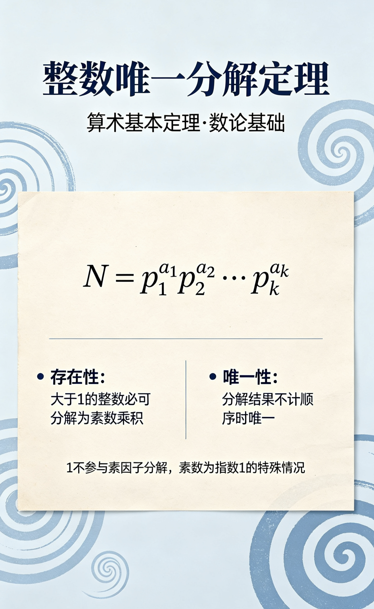
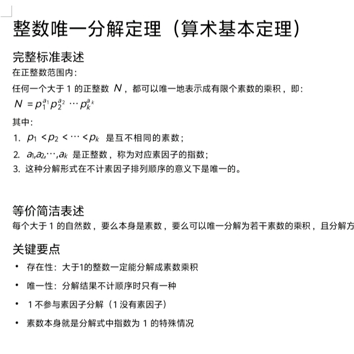

<ArchiveCopyPanel article-id="160159197" />

{"markdown":"PiDliIbnsbvvvJrlk6Xlvrflt7TotavnjJzmg7MgIAo+IOe8luWPt++8mmAxNjAxNTkxOTdgICAKPiDljp/lp4vmlofku7bvvJpg5pW05pWw5ZSv5LiA5YiG6Kej5a6a55CG566X5pyv5Z+65pys5a6a55CG5LmW5LmW5pWw5a2mLTE2MDE1OTE5Ny5tZGAgIAo+IOi/lOWbnu+8mlvmnKzkuablvZLmoaNdKC96aC9ib29rcy9nb2xkYmFjaC9hcnRpY2xlcy8pIMK3IFvmgLvlhaXlj6NdKC96aC9ib29rcy9hcnRpY2xlcy8pCgojIyDmlbTmlbDllK/kuIDliIbop6PlrprnkIbvvIjnrpfmnK/ln7rmnKzlrprnkIbvvInjgJDkuZbkuZbmlbDlrabjgJEKCuS9nOiAhTog5LmW5LmW5pWw5a2mCgohW+WcqOi/memHjOaPkuWFpeWbvueJh+aPj+i/sF0oLi9hc3NldHMvY3NkbmltZy9wbmcvNDYyYjI5NjcyZjBkZGY1NS5wbmcpCgrlrozmlbTmoIflh4booajov7AKCuWcqOato+aVtOaVsOiMg+WbtOWGhe+8mgoK5Lu75L2V5LiA5Liq5aSn5LqOIDEg55qE5q2j5pW05pWwIE4g77yM6YO95Y+v5Lul5ZSv5LiA5Zyw6KGo4r2w5oiQ5pyJ6ZmQ5Liq57Sg5pWw55qE5LmY56evIO+8jOWNs++8mgoKTiA9IHAxIHAyIOKLryBwawoK5YW25Lit77yaCgotIHAxIDwgcDIgPCDii68gPCBwayDmmK/kupLkuI3nm7jlkIznmoTntKDmlbDvvJsKCi0gYTEgLGEyICwg4oCmICxhayDmmK/mraPmlbTmlbAg77yM56ew5Li65a+55bqU57Sg5Zug5a2Q55qE5oyH5pWw77ybCgotIOi/meenjeWIhuino+W9ouW8j+WcqOS4jeiuoee0oOWboOWtkOaOkuWIl+mhuuW6j+eahOaEj+S5ieS4i+aYr+WUr+S4gOeahOOAggoK562J5Lu3566A5rSB6KGo6L+wCgrmr4/kuKrlpKfkuo4gMSDnmoToh6rnhLbmlbAg77yM6KaB5LmI5pys6Lqr5piv57Sg5pWwIO+8jOimgeS5iOWPr+S7peWUr+S4gOWIhuino+S4uuiLpeW5sue0oOaVsOeahOS5mOenryDvvIzkuJTliIbop6PmlrnlvI/llK/kuIDjgIIKCuWFs+mUruimgeeCuQoK4oCiIOWtmOWcqOaAp++8muWkp+S6jjHnmoTmlbTmlbDkuIDlrprog73liIbop6PmiJDntKDmlbDkuZjnp68KCuKAoiDllK/kuIDmgKfvvJrliIbop6Pnu5PmnpzkuI3orqHpobrluo/ml7blj6rmnInkuIDnp40KCuKAoiAxIOS4jeWPguS4jue0oOWboOWtkOWIhuino++8iCAxIOayoeaciee0oOWboOWtkO+8iQoK4oCiIOe0oOaVsOacrOi6q+WwseaYr+WIhuino+W8j+S4reaMh+aVsOS4uiAxIOeahOeJueauiuaDheWGtQoKIVvlnKjov5nph4zmj5LlhaXlm77niYfmj4/ov7BdKC4vYXNzZXRzL2NzZG5pbWcvanBnL2Q3MGNjZjYwZjU3MmVkMGEuanBnKQo=","text":"5YiG57G777ya5ZOl5b635be06LWr54yc5oOzICAK57yW5Y+377yaMTYwMTU5MTk3ICAK5Y6f5aeL5paH5Lu277ya5pW05pWw5ZSv5LiA5YiG6Kej5a6a55CG566X5pyv5Z+65pys5a6a55CG5LmW5LmW5pWw5a2mLTE2MDE1OTE5Ny5tZCAgCui/lOWbnu+8muacrOS5puW9kuahoyDCtyDmgLvlhaXlj6MKCuaVtOaVsOWUr+S4gOWIhuino+WumueQhu+8iOeul+acr+WfuuacrOWumueQhu+8ieOAkOS5luS5luaVsOWtpuOAkQoK5L2c6ICFOiDkuZbkuZbmlbDlraYKCuWcqOi/memHjOaPkuWFpeWbvueJh+aPj+i/sAoK5a6M5pW05qCH5YeG6KGo6L+wCgrlnKjmraPmlbTmlbDojIPlm7TlhoXvvJoKCuS7u+S9leS4gOS4quWkp+S6jiAxIOeahOato+aVtOaVsCBOIO+8jOmDveWPr+S7peWUr+S4gOWcsOihqOK9sOaIkOaciemZkOS4que0oOaVsOeahOS5mOenryDvvIzljbPvvJoKCk4gPSBwMSBwMiDii68gcGsKCuWFtuS4re+8mgpwMSA8IHAyIDwg4ouvIDwgcGsg5piv5LqS5LiN55u45ZCM55qE57Sg5pWw77ybCmExICxhMiAsIOKApiAsYWsg5piv5q2j5pW05pWwIO+8jOensOS4uuWvueW6lOe0oOWboOWtkOeahOaMh+aVsO+8mwrov5nnp43liIbop6PlvaLlvI/lnKjkuI3orqHntKDlm6DlrZDmjpLliJfpobrluo/nmoTmhI/kuYnkuIvmmK/llK/kuIDnmoTjgIIKCuetieS7t+eugOa0geihqOi/sAoK5q+P5Liq5aSn5LqOIDEg55qE6Ieq54S25pWwIO+8jOimgeS5iOacrOi6q+aYr+e0oOaVsCDvvIzopoHkuYjlj6/ku6XllK/kuIDliIbop6PkuLroi6XlubLntKDmlbDnmoTkuZjnp68g77yM5LiU5YiG6Kej5pa55byP5ZSv5LiA44CCCgrlhbPplK7opoHngrkKCuKAoiDlrZjlnKjmgKfvvJrlpKfkuo4x55qE5pW05pWw5LiA5a6a6IO95YiG6Kej5oiQ57Sg5pWw5LmY56evCgrigKIg5ZSv5LiA5oCn77ya5YiG6Kej57uT5p6c5LiN6K6h6aG65bqP5pe25Y+q5pyJ5LiA56eNCgrigKIgMSDkuI3lj4LkuI7ntKDlm6DlrZDliIbop6PvvIggMSDmsqHmnInntKDlm6DlrZDvvIkKCuKAoiDntKDmlbDmnKzouqvlsLHmmK/liIbop6PlvI/kuK3mjIfmlbDkuLogMSDnmoTnibnmrormg4XlhrUKCuWcqOi/memHjOaPkuWFpeWbvueJh+aPj+i/sA=="}

> 分类：哥德巴赫猜想  
> 编号：`160159197`  
> 原始文件：`整数唯一分解定理算术基本定理乖乖数学-160159197.md`  
> 返回：[本书归档](/zh/books/goldbach/articles/) · [总入口](/zh/books/articles/)

<ArticlePaperMeta category="哥德巴赫猜想" article-id="160159197" title="整数唯一分解定理算术基本定理乖乖数学" paper-kind="研究论文" book-route="/zh/books/goldbach/articles/" overview-route="/zh/books/articles/" summary="任何一个大于 1 的正整数 N ，都可以唯一地表⽰成有限个素数的乘积 ，即：" author="乖乖数学" source-file="整数唯一分解定理算术基本定理乖乖数学-160159197.md" cover="./assets/csdnimg/png/462b29672f0ddf55.png" />

## 整数唯一分解定理（算术基本定理）【乖乖数学】

作者: 乖乖数学

完整标准表述

在正整数范围内：

任何一个大于 1 的正整数 N ，都可以唯一地表⽰成有限个素数的乘积 ，即：

N = p1 p2 ⋯ pk

其中：

- p1 < p2 < ⋯ < pk 是互不相同的素数；

- a1 ,a2 , … ,ak 是正整数 ，称为对应素因子的指数；

- 这种分解形式在不计素因子排列顺序的意义下是唯一的。

等价简洁表述

每个大于 1 的自然数 ，要么本身是素数 ，要么可以唯一分解为若干素数的乘积 ，且分解方式唯一。

关键要点

• 存在性：大于1的整数一定能分解成素数乘积

• 唯一性：分解结果不计顺序时只有一种

• 1 不参与素因子分解（ 1 没有素因子）

• 素数本身就是分解式中指数为 1 的特殊情况

