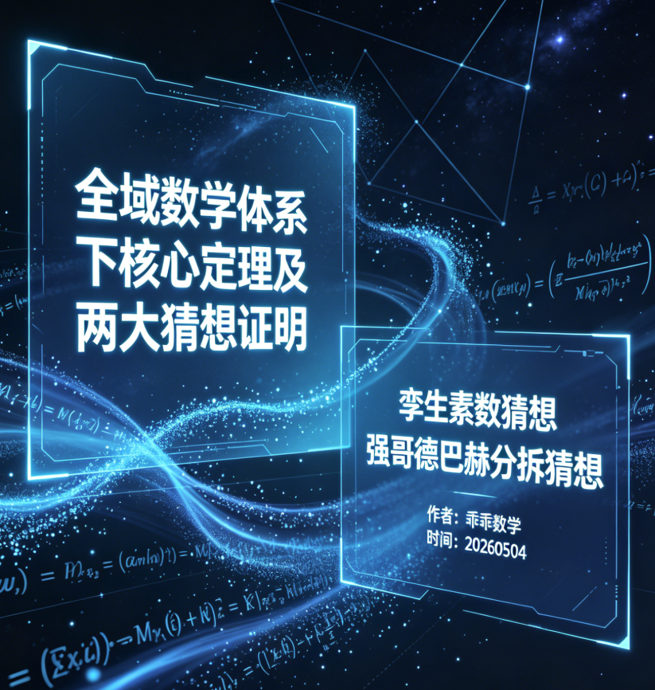

<ArchiveCopyPanel article-id="160767913" />

{"markdown":"PiDliIbnsbvvvJrlk6Xlvrflt7TotavnjJzmg7MgIAo+IOe8luWPt++8mmAxNjA3Njc5MTNgICAKPiDljp/lp4vmlofku7bvvJpg5YWo5Z+f5pWw5a2m5L2T57O75LiL5qC45b+D5a6a55CG5Y+K5Lik5aSn54yc5oOz6K+B5piO5LmW5LmW5pWw5a2mLTE2MDc2NzkxMy5tZGAgIAo+IOi/lOWbnu+8mlvmnKzkuablvZLmoaNdKC96aC9ib29rcy9nb2xkYmFjaC9hcnRpY2xlcy8pIMK3IFvmgLvlhaXlj6NdKC96aC9ib29rcy9hcnRpY2xlcy8pCgojIyDlhajln5/mlbDlrabkvZPns7vkuIvmoLjlv4PlrprnkIblj4rkuKTlpKfnjJzmg7Por4HmmI7jgJDkuZbkuZbmlbDlrabjgJEKCiMjIyDlrarnlJ/ntKDmlbDnjJzmg7PkuI7lvLrlk6Xlvrflt7TotavliIbmi4bnjJzmg7PnmoTmiJDnq4vmgKcKCiFbaW1hZ2VdKC4vYXNzZXRzL2NzZG5pbWcvanBnL2NkZWVlOTFjYTdlOTBjYWMuanBnKQoK5L2c6ICF77yaIOS5luS5luaVsOWtpgoK5pe26Ze077yaMjAyNjA1MDQKCuWJjee9ruWumuS5ie+8muWFqOWfn+aVsOWtpuS4ieWFg+acrOa6kOWFrOeQhgoKIyMjIOWFrOeQhjEg5LiJ5YWD5pys5L2T5YWs55CGCgotIAoKMO+8muiZmuepuuS4reWSjOaAge+8jOS4uuWvueensOWOn+eCueOAgeWRqOacn+epuueptOOAgeaXoOi+ueeVjOa3t+ayjOWfuuW6le+8jOS4jeWFt+Wkh+WPr+aVtOmZpOaAp++8jOaYr+aVsOWfn+i/kOWMlueahOS4reaAp+WfuuWHhuOAggoKLSAKCjHvvJrlrp7mnInln7rlhYPvvIzkuLrkuI3lj6/lho3liIbnmoTnprvmlaPljZXlhYPvvIzntKDmlbDkvZzkuLrnuq8x5Z+65YWD55qE5p6B6Ie05b2i5oCB77yM5peg6ZmkMeS4juiHqui6q+WklueahOWFtuS7luWboOWtkO+8jOi+ueeVjOe7neWvuemUgeWumuOAggoKLSAKCuKInu+8muaXoOmZkOi/kOWMluaAge+8jOS4uuiHqueEtuaVsOeahOaXoOept+W7tuWxleOAgeaooeWRqOacn+eahOaXoOmZkOW+queOr+OAgeaVsOWfn+inhOW+i+eahOawuOaBkuW7tue7re+8jOaXoOe7iOatouOAgeaXoOi+ueeVjOOAggoKIyMjIOWFrOeQhjIg57Sg5pWw57qm5p2f5YWs55CGCgrntKDmlbDkuLrlpKfkuo4x55qE57qvMeWunuacieWfuuWFg++8jOS7heiDveiiqzHkuI7oh6rouqvmlbTpmaTvvIzmlYXlpKfkuo4z55qE57Sg5pWw77yM5b+F54S25LiN6KKr5pyA5bCP57Sg5pWwMuOAgTPmlbTpmaTvvIzmraTkuLrntKDmlbDlrZjnu63nmoTmoLjlv4PnuqbmnZ/jgIIKCuWFrOeQhjMg5qih5ZGo5pyf6L+Q5YyW5YWs55CGCgroh6rnhLbmlbDku6XmnIDlsI/lhazlgI3mlbA25Li65Z+656GA5ZGo5pyf77yM5b2i5oiQ5qihNuaXoOmZkOW+queOr+i/kOWMlu+8jOS7u+aEj+iHqueEtuaVsOWdh+WPr+W9kuS4uuaooTbnmoQ257G75Ymp5L2Z57G777yM5peg5L6L5aSW44CB5peg6YGX5ryP44CCCgojIyMg5a6a55CGMSDntKDmlbA2a8KxMei9qOmBk+WumueQhgoK5a6a55CG6KGo6L+wCgrmiYDmnInlpKfkuo4z55qE57Sg5pWw77yM5b+F54S25Lil5qC85YiG5biD5LqONmsrMeS4jjZrLTHkuKTmnaHlubPooYzovajpgZPkuYvkuIrvvIhr4oiITl4q77yJ77yM5LiN5a2Y5Zyo5Lu75L2V6ISx56a76K+l5Y+M6L2o55qE57Sg5pWw77yM6L2o6YGT5ZSv5LiA5oCn5LiO5a6M5aSH5oCn5oiQ56uL44CCCgror4HmmI4KCi0g5qihNuWJqeS9meexu+WIkuWIhgoK5qC55o2u5YWo5Z+f5pWw5a2m5qih5ZGo5pyf6L+Q5YyW5YWs55CG77yM5Lu75oSP6Ieq54S25pWwbu+8jOaooTbov5DnrpflkI7ku4XmnIk257G75Ymp5L2Z5b2i5oCB77yM5Y2z77yaCgomIzEyMztu4omhMChtb2Q2KW7iiaExKG1vZDYpbuKJoTIobW9kNilu4omhMyhtb2Q2KW7iiaE0KG1vZDYpbuKJoTUobW9kNilcYmVnaW4mIzEyMztjYXNlcyYjMTI1OwpuIOKJoSAwIFxwbW9kJiMxMjM7NiYjMTI1OyBcXApuIOKJoSAxIFxwbW9kJiMxMjM7NiYjMTI1OyBcXApuIOKJoSAyIFxwbW9kJiMxMjM7NiYjMTI1OyBcXApuIOKJoSAzIFxwbW9kJiMxMjM7NiYjMTI1OyBcXApuIOKJoSA0IFxwbW9kJiMxMjM7NiYjMTI1OyBcXApuIOKJoSA1IFxwbW9kJiMxMjM7NiYjMTI1OwpcZW5kJiMxMjM7Y2FzZXMmIzEyNTvijqnijqjijqfigItu4omhMChtb2Q2KW7iiaExKG1vZDYpbuKJoTIobW9kNilu4omhMyhtb2Q2KW7iiaE0KG1vZDYpbuKJoTUobW9kNinigIsKCi0g6Z2e57Sg5pWw5Ymp5L2Z57G7562b6ZmkCgrkvp3mja7ntKDmlbDnuqbmnZ/lhaznkIbvvIzlr7k257G75Ymp5L2Z57G76YCQ5LiA562b6YCJ77yaCgotIOiLpW4g4omhIDAgKG1vZDYpXHBtb2QmIzEyMzs2JiMxMjU7KG1vZDYp77yMbuS4ujbnmoTlgI3mlbDvvIzlkKvlm6DlrZAy44CBM++8jOWPr+aLhuWIhu+8jOmdnue6rzHntKDmlbDln7rlhYPvvJsKCi0g6IulbiDiiaEgMiAobW9kNilccG1vZCYjMTIzOzYmIzEyNTsobW9kNinjgIFuIOKJoSA0IChtb2Q2KVxwbW9kJiMxMjM7NiYjMTI1Oyhtb2Q2Ke+8jG7kuLrlgbbmlbDvvIzlkKvlm6DlrZAy77yM5Y+v5ouG5YiG77yM6Z2e57Sg5pWw77ybCgotIOiLpW4g4omhIDMgKG1vZDYpXHBtb2QmIzEyMzs2JiMxMjU7KG1vZDYp77yMbuS4ujPnmoTlgI3mlbDvvIzlkKvlm6DlrZAz77yM5Y+v5ouG5YiG77yM6Z2e57Sg5pWw44CCCgotIOWUr+S4gOe0oOaVsOi9qOmBk+eVmeWtmAoK562b6ZmkNOexu+mdnue0oOaVsOWJqeS9meexu+WQju+8jOS7heWJqeS9meS4pOexu+WQiOazleWJqeS9meexu++8mgoKLSBuIOKJoSAxIChtb2Q2KVxwbW9kJiMxMjM7NiYjMTI1Oyhtb2Q2Ke+8jOmAmumhueS4um49NmsrMe+8mwoKLSBuIOKJoSA1IChtb2Q2KVxwbW9kJiMxMjM7NiYjMTI1Oyhtb2Q2Ke+8jOWboDXiiaEtMSBccG1vZCYjMTIzOzYmIzEyNTvvvIzpgJrpobnkuLpuPTZrLTHjgIIKCi0g5YWo5Z+f5YWs55CG6Zet546vCgow5Li65qihNuepuueptOS4reWSjOaAge+8jOetm+mZpOWPr+aLhuWIhueahOWQiOaVsOWJqeS9meexu++8mzHkuLrntKDmlbDnuq/ln7rlhYPvvIzku4XlrZjkuo7lj4zovajvvJviiJ7kuLrmqKE25ZGo5pyf5peg6ZmQ5bu25bGV77yM5Y+M6L2o6ZqP6Ieq54S25pWw5peg56m35bu25Ly444CC57u85LiK77yM5omA5pyJ5aSn5LqOM+eahOe0oOaVsO+8jOW/heWxnuS6jjZrwrEx5Y+M6L2o77yM5a6a55CGMeW+l+ivgeOAggoKIyMjIOWumueQhjIg5a2q55Sf57Sg5pWw54yc5oOz6K+B5piO77yI5YWo5Z+f5pWw5a2m54mI77yJCgrnjJzmg7Pooajov7AKCuWtmOWcqOaXoOept+WkmuWvueWtqueUn+e0oOaVsO+8jOWNs+WtmOWcqOaXoOept+WkmuS4que0oOaVsHDvvIzkvb/lvpdwKzLkuZ/kuLrntKDmlbDjgIIKCuivgeaYjgoKLSDlrarnlJ/ntKDmlbDovajpgZPljLnphY3mgKcKCueUseWumueQhjHlj6/nn6XvvIzlpKfkuo4z55qE57Sg5pWw5LuF5a2Y5LqONmstMeS4jjZrKzHlj4zovajvvIzkuKTovajlr7nlupTmlbDlgLzlt67lgLzmgZLkuLoy77yM5Y2z77yaCgooNmsrMSniiJIoNmviiJIxKT0yKDZrKzEpLSg2ay0xKT0yKDZrKzEp4oiSKDZr4oiSMSk9MgoK6K+l5beu5YC85oGw5aW95Li65a2q55Sf57Sg5pWw55qE5a6a5LmJ6Ze06Led77yM5pWF5a2q55Sf57Sg5pWw5Y+q6IO95LulNmstMeS4jjZrKzHnmoTphY3lr7nlvaLlvI/lrZjlnKjvvIzml6Dlhbbku5bphY3lr7nlj6/og73jgIIKCi0g5peg56m36L+Q5YyW5LiL55qE5a2Y5Zyo5oCnCgrkvp3mja7lhajln5/mlbDlrabiiJ7ml6DpmZDov5DljJblhaznkIbvvIzoh6rnhLbmlbDkuI7mqKE25ZGo5pyf5peg6ZmQ5bu25bGV77yMNmvCsTHlj4zovajpmo9r55qE5aKe5aSn5peg56m35bu25Ly477yM5peg57uI5q2i6IqC54K544CC5Y+M6L2o5Lit57Sg5pWw55qE5YiG5biD6ZqP5pWw5Z+f5bu25bGV5oyB57ut5a2Y5Zyo77yM5LiU6L2o6YGT6YWN5a+55qC85bGA5oGS5a6a5LiN5Y+Y77yM5LiN5Lya5Zug5pWw5Z+f5aKe5aSn6ICM5raI5aSx44CCCgotIOWFrOeQhumXreeOr+e7k+iuugoKNmvCsTHlj4zovajlhYjlpKnlhbflpIfpl7Tot50y55qE6YWN5a+557uT5p6E77yM4oie6L+Q5YyW5L+d6K+B5Y+M6L2o5peg56m35bu257ut77yM5pWF5peg56m35aSa57uE5a2q55Sf57Sg5pWw5b+F54S25a2Y5Zyo77yM5a2q55Sf57Sg5pWw54yc5oOz5b6X6K+B44CCCgrlrprnkIYzIOW8uuWTpeW+t+W3tOi1q+WIhuaLhueMnOaDs+ivgeaYju+8iOWFqOWfn+aVsOWtpueJiO+8iQoK54yc5oOz6KGo6L+wCgrku7vmhI/lpKfkuo7nrYnkuo4055qE5YG25pWw77yM5Z2H5Y+v6KGo56S65Li65Lik5Liq57Sg5pWw5LmL5ZKM77yI5by65ZOl5b635be06LWr54yc5oOz77yJ44CCCgror4HmmI4KCi0g5YG25pWw5qihNuWIhuexuwoK5Lu75oSP5YG25pWwRe+8iEXiiaU077yJ77yM5L6d5o2u5qihNuWRqOacn+i/kOWMluWFrOeQhu+8jOS7heWPr+W9kuS4ujPnsbvliankvZnnsbvvvJoKCkXiiaEwKG1vZDYp44CBReKJoTIobW9kNinjgIFF4omhNChtb2Q2KUUg4omhIDAgXHBtb2QmIzEyMzs2JiMxMjU744CBRSDiiaEgMiBccG1vZCYjMTIzOzYmIzEyNTvjgIFFIOKJoSA0IFxwbW9kJiMxMjM7NiYjMTI1O0XiiaEwKG1vZDYp44CBReKJoTIobW9kNinjgIFF4omhNChtb2Q2KQoKLSDlj4zovajntKDmlbDliqDms5Xopobnm5bmgKcKCuiuvue0oOaVsHA9NmstMe+8jHE9Nm0rMe+8iGssbeKIiE5eKu+8ie+8jOeUseWumueQhjHvvIxw44CBceS4uuWkp+S6jjPnmoTntKDmlbDllK/kuIDlvaLmgIHvvIzlhbbliqDms5Xnu4TlkIjlj6/lrozlhajopobnm5bmiYDmnInlgbbmlbDliankvZnnsbvvvJoKCi0g5b2TReKJoTAobW9kNilFIOKJoSAwIFxwbW9kJiMxMjM7NiYjMTI1O0XiiaEwKG1vZDYp5pe277yMRT0oNmviiJIxKSsoNm0rMSk9NihrK20pRT0oNmstMSkrKDZtKzEpPTYoayttKUU9KDZr4oiSMSkrKDZtKzEpPTYoayttKe+8jOaBsOWlveWMuemFjeivpeexu+WBtuaVsO+8mwoKLSDlvZNF4omhMihtb2Q2KUUg4omhIDIgXHBtb2QmIzEyMzs2JiMxMjU7ReKJoTIobW9kNinml7bvvIxFPSg2aysxKSsoNm0rMSk9NihrK20pKzJFPSg2aysxKSsoNm0rMSk9NihrK20pKzJFPSg2aysxKSsoNm0rMSk9NihrK20pKzLvvIzmgbDlpb3ljLnphY3or6XnsbvlgbbmlbDvvJsKCi0g5b2TReKJoTQobW9kNilFIOKJoSA0IFxwbW9kJiMxMjM7NiYjMTI1O0XiiaE0KG1vZDYp5pe277yMRT0oNmviiJIxKSsoNm3iiJIxKT02KGsrbSniiJIyPTYoaytt4oiSMSkrNEU9KDZrLTEpKyg2bS0xKT02KGsrbSktMj02KGsrbS0xKSs0RT0oNmviiJIxKSsoNm3iiJIxKT02KGsrbSniiJIyPTYoaytt4oiSMSkrNO+8jOaBsOWlveWMuemFjeivpeexu+WBtuaVsOOAggoKLSDlsI/lgbbmlbDnibnmrorpqozor4EKCuWvueS6juWwj+S6jjbnmoTlgbbmlbDvvIznm7TmjqXpqozor4HvvJoKCi0gND0yKzLvvIw2PTMrM++8jOWdh+a7oei2s+S4pOS4que0oOaVsOS5i+WSjO+8jOe6s+WFpeWFqOWfn+S9k+ezu+OAggoKLSDml6Dnqbflu7blsZXkuIvnmoTlrozlpIfmgKcKCuS+neaNruKInuaXoOmZkOi/kOWMluWFrOeQhu+8jOWBtuaVsOmaj+iHqueEtuaVsOaXoOept+WinuWkp++8jDZrwrEx5Y+M6L2o5ZCM5q2l5peg56m35bu25Ly477yM57Sg5pWw5pWw6YeP6ZqP5pWw5Z+f5aKe5aSn5oyB57ut5aKe5aSa77yM5YG25pWw55qE57Sg5pWw5YiG5ouG57uE5ZCI5pWw77yI5YiG5ouG5pWw77yJ5Y2V6LCD6YCS5aKe77yM57ud5LiN5Lya5Ye6546w5peg57Sg5pWw5Y+v6YWN5a+555qE5oOF5Ya144CCCgotIOWFrOeQhumXreeOr+e7k+iuugoKNmvCsTHlj4zovajntKDmlbDnmoTliqDms5Xnu4TlkIjvvIzlrozlpIfopobnm5bmiYDmnInlpKfkuo7nrYnkuo4055qE5YG25pWw5qihNuWJqeS9meexu++8jOKInui/kOWMluS/neivgeWIhuaLhue7hOWQiOawuOaBkuWtmOWcqO+8jOaVheS7u+aEj+Wkp+WBtuaVsOWdh+WPr+aLhuWIhuS4uuS4pOS4que0oOaVsOS5i+WSjO+8jOW8uuWTpeW+t+W3tOi1q+WIhuaLhueMnOaDs+W+l+ivgeOAggoKIyMjIOaguOW/g+e7k+iuugoK57Sg5pWwNmvCsTHovajpgZPlrprnkIbmmK/lhajln5/mlbDlrabkuInlhYPlhaznkIblnKjmlbDorrrpoobln5/nmoTmoLjlv4PooY3nlJ/lrprnkIbvvIzor6XlrprnkIbku47mlbDln5/nu5PmnoTlupXlsYLvvIznu5/kuIDplIHlrprlrarnlJ/ntKDmlbDnjJzmg7PkuI7lvLrlk6Xlvrflt7TotavliIbmi4bnjJzmg7PnmoTmiJDnq4vmgKfvvIzkuKTlpKfnjJzmg7PlnYfkuLrlhajln5/mlbDlraYwLzEv4oie5LiJ5YWD6L+Q5YyW55qE5b+F54S257uT5p6c77yM5L2T57O76Ieq5rS944CB6YC76L6R5a6M5aSH44CCCgohW+WcqOi/memHjOaPkuWFpeWbvueJh+aPj+i/sF0oLi9hc3NldHMvY3NkbmltZy9wbmcvMDU3YWM1MmQ3YjU4MmNhNC5wbmcpCg==","text":"5YiG57G777ya5ZOl5b635be06LWr54yc5oOzICAK57yW5Y+377yaMTYwNzY3OTEzICAK5Y6f5aeL5paH5Lu277ya5YWo5Z+f5pWw5a2m5L2T57O75LiL5qC45b+D5a6a55CG5Y+K5Lik5aSn54yc5oOz6K+B5piO5LmW5LmW5pWw5a2mLTE2MDc2NzkxMy5tZCAgCui/lOWbnu+8muacrOS5puW9kuahoyDCtyDmgLvlhaXlj6MKCuWFqOWfn+aVsOWtpuS9k+ezu+S4i+aguOW/g+WumueQhuWPiuS4pOWkp+eMnOaDs+ivgeaYjuOAkOS5luS5luaVsOWtpuOAkQoK5a2q55Sf57Sg5pWw54yc5oOz5LiO5by65ZOl5b635be06LWr5YiG5ouG54yc5oOz55qE5oiQ56uL5oCnCgppbWFnZQoK5L2c6ICF77yaIOS5luS5luaVsOWtpgoK5pe26Ze077yaMjAyNjA1MDQKCuWJjee9ruWumuS5ie+8muWFqOWfn+aVsOWtpuS4ieWFg+acrOa6kOWFrOeQhgoK5YWs55CGMSDkuInlhYPmnKzkvZPlhaznkIYKMO+8muiZmuepuuS4reWSjOaAge+8jOS4uuWvueensOWOn+eCueOAgeWRqOacn+epuueptOOAgeaXoOi+ueeVjOa3t+ayjOWfuuW6le+8jOS4jeWFt+Wkh+WPr+aVtOmZpOaAp++8jOaYr+aVsOWfn+i/kOWMlueahOS4reaAp+WfuuWHhuOAggox77ya5a6e5pyJ5Z+65YWD77yM5Li65LiN5Y+v5YaN5YiG55qE56a75pWj5Y2V5YWD77yM57Sg5pWw5L2c5Li657qvMeWfuuWFg+eahOaegeiHtOW9ouaAge+8jOaXoOmZpDHkuI7oh6rouqvlpJbnmoTlhbbku5blm6DlrZDvvIzovrnnlYznu53lr7nplIHlrprjgIIK4oie77ya5peg6ZmQ6L+Q5YyW5oCB77yM5Li66Ieq54S25pWw55qE5peg56m35bu25bGV44CB5qih5ZGo5pyf55qE5peg6ZmQ5b6q546v44CB5pWw5Z+f6KeE5b6L55qE5rC45oGS5bu257ut77yM5peg57uI5q2i44CB5peg6L6555WM44CCCgrlhaznkIYyIOe0oOaVsOe6puadn+WFrOeQhgoK57Sg5pWw5Li65aSn5LqOMeeahOe6rzHlrp7mnInln7rlhYPvvIzku4Xog73ooqsx5LiO6Ieq6Lqr5pW06Zmk77yM5pWF5aSn5LqOM+eahOe0oOaVsO+8jOW/heeEtuS4jeiiq+acgOWwj+e0oOaVsDLjgIEz5pW06Zmk77yM5q2k5Li657Sg5pWw5a2Y57ut55qE5qC45b+D57qm5p2f44CCCgrlhaznkIYzIOaooeWRqOacn+i/kOWMluWFrOeQhgoK6Ieq54S25pWw5Lul5pyA5bCP5YWs5YCN5pWwNuS4uuWfuuehgOWRqOacn++8jOW9ouaIkOaooTbml6DpmZDlvqrnjq/ov5DljJbvvIzku7vmhI/oh6rnhLbmlbDlnYflj6/lvZLkuLrmqKE255qENuexu+WJqeS9meexu++8jOaXoOS+i+WkluOAgeaXoOmBl+a8j+OAggoK5a6a55CGMSDntKDmlbA2a8KxMei9qOmBk+WumueQhgoK5a6a55CG6KGo6L+wCgrmiYDmnInlpKfkuo4z55qE57Sg5pWw77yM5b+F54S25Lil5qC85YiG5biD5LqONmsrMeS4jjZrLTHkuKTmnaHlubPooYzovajpgZPkuYvkuIrvvIhr4oiITl7vvInvvIzkuI3lrZjlnKjku7vkvZXohLHnprvor6Xlj4zovajnmoTntKDmlbDvvIzovajpgZPllK/kuIDmgKfkuI7lrozlpIfmgKfmiJDnq4vjgIIKCuivgeaYjgrmqKE25Ymp5L2Z57G75YiS5YiGCgrmoLnmja7lhajln5/mlbDlrabmqKHlkajmnJ/ov5DljJblhaznkIbvvIzku7vmhI/oh6rnhLbmlbBu77yM5qihNui/kOeul+WQjuS7heaciTbnsbvliankvZnlvaLmgIHvvIzljbPvvJoKCntu4omhMChtb2Q2KW7iiaExKG1vZDYpbuKJoTIobW9kNilu4omhMyhtb2Q2KW7iiaE0KG1vZDYpbuKJoTUobW9kNilcYmVnaW57Y2FzZXN9Cm4g4omhIDAgXHBtb2R7Nn0gXFwKbiDiiaEgMSBccG1vZHs2fSBcXApuIOKJoSAyIFxwbW9kezZ9IFxcCm4g4omhIDMgXHBtb2R7Nn0gXFwKbiDiiaEgNCBccG1vZHs2fSBcXApuIOKJoSA1IFxwbW9kezZ9ClxlbmR7Y2FzZXN94o6p4o6o4o6n4oCLbuKJoTAobW9kNilu4omhMShtb2Q2KW7iiaEyKG1vZDYpbuKJoTMobW9kNilu4omhNChtb2Q2KW7iiaE1KG1vZDYp4oCLCumdnue0oOaVsOWJqeS9meexu+etm+mZpAoK5L6d5o2u57Sg5pWw57qm5p2f5YWs55CG77yM5a+5Nuexu+WJqeS9meexu+mAkOS4gOetm+mAie+8mgroi6VuIOKJoSAwIChtb2Q2KVxwbW9kezZ9KG1vZDYp77yMbuS4ujbnmoTlgI3mlbDvvIzlkKvlm6DlrZAy44CBM++8jOWPr+aLhuWIhu+8jOmdnue6rzHntKDmlbDln7rlhYPvvJsK6IulbiDiiaEgMiAobW9kNilccG1vZHs2fShtb2Q2KeOAgW4g4omhIDQgKG1vZDYpXHBtb2R7Nn0obW9kNinvvIxu5Li65YG25pWw77yM5ZCr5Zug5a2QMu+8jOWPr+aLhuWIhu+8jOmdnue0oOaVsO+8mwroi6VuIOKJoSAzIChtb2Q2KVxwbW9kezZ9KG1vZDYp77yMbuS4ujPnmoTlgI3mlbDvvIzlkKvlm6DlrZAz77yM5Y+v5ouG5YiG77yM6Z2e57Sg5pWw44CCCuWUr+S4gOe0oOaVsOi9qOmBk+eVmeWtmAoK562b6ZmkNOexu+mdnue0oOaVsOWJqeS9meexu+WQju+8jOS7heWJqeS9meS4pOexu+WQiOazleWJqeS9meexu++8mgpuIOKJoSAxIChtb2Q2KVxwbW9kezZ9KG1vZDYp77yM6YCa6aG55Li6bj02aysx77ybCm4g4omhIDUgKG1vZDYpXHBtb2R7Nn0obW9kNinvvIzlm6A14omhLTEgXHBtb2R7Nn3vvIzpgJrpobnkuLpuPTZrLTHjgIIK5YWo5Z+f5YWs55CG6Zet546vCgow5Li65qihNuepuueptOS4reWSjOaAge+8jOetm+mZpOWPr+aLhuWIhueahOWQiOaVsOWJqeS9meexu++8mzHkuLrntKDmlbDnuq/ln7rlhYPvvIzku4XlrZjkuo7lj4zovajvvJviiJ7kuLrmqKE25ZGo5pyf5peg6ZmQ5bu25bGV77yM5Y+M6L2o6ZqP6Ieq54S25pWw5peg56m35bu25Ly444CC57u85LiK77yM5omA5pyJ5aSn5LqOM+eahOe0oOaVsO+8jOW/heWxnuS6jjZrwrEx5Y+M6L2o77yM5a6a55CGMeW+l+ivgeOAggoK5a6a55CGMiDlrarnlJ/ntKDmlbDnjJzmg7Por4HmmI7vvIjlhajln5/mlbDlrabniYjvvIkKCueMnOaDs+ihqOi/sAoK5a2Y5Zyo5peg56m35aSa5a+55a2q55Sf57Sg5pWw77yM5Y2z5a2Y5Zyo5peg56m35aSa5Liq57Sg5pWwcO+8jOS9v+W+l3ArMuS5n+S4uue0oOaVsOOAggoK6K+B5piOCuWtqueUn+e0oOaVsOi9qOmBk+WMuemFjeaApwoK55Sx5a6a55CGMeWPr+efpe+8jOWkp+S6jjPnmoTntKDmlbDku4XlrZjkuo42ay0x5LiONmsrMeWPjOi9qO+8jOS4pOi9qOWvueW6lOaVsOWAvOW3ruWAvOaBkuS4ujLvvIzljbPvvJoKCig2aysxKeKIkig2a+KIkjEpPTIoNmsrMSktKDZrLTEpPTIoNmsrMSniiJIoNmviiJIxKT0yCgror6Xlt67lgLzmgbDlpb3kuLrlrarnlJ/ntKDmlbDnmoTlrprkuYnpl7Tot53vvIzmlYXlrarnlJ/ntKDmlbDlj6rog73ku6U2ay0x5LiONmsrMeeahOmFjeWvueW9ouW8j+WtmOWcqO+8jOaXoOWFtuS7lumFjeWvueWPr+iDveOAggrml6Dnqbfov5DljJbkuIvnmoTlrZjlnKjmgKcKCuS+neaNruWFqOWfn+aVsOWtpuKInuaXoOmZkOi/kOWMluWFrOeQhu+8jOiHqueEtuaVsOS4juaooTblkajmnJ/ml6DpmZDlu7blsZXvvIw2a8KxMeWPjOi9qOmaj2vnmoTlop7lpKfml6Dnqbflu7bkvLjvvIzml6Dnu4jmraLoioLngrnjgILlj4zovajkuK3ntKDmlbDnmoTliIbluIPpmo/mlbDln5/lu7blsZXmjIHnu63lrZjlnKjvvIzkuJTovajpgZPphY3lr7nmoLzlsYDmgZLlrprkuI3lj5jvvIzkuI3kvJrlm6DmlbDln5/lop7lpKfogIzmtojlpLHjgIIK5YWs55CG6Zet546v57uT6K66Cgo2a8KxMeWPjOi9qOWFiOWkqeWFt+Wkh+mXtOi3nTLnmoTphY3lr7nnu5PmnoTvvIziiJ7ov5DljJbkv53or4Hlj4zovajml6Dnqbflu7bnu63vvIzmlYXml6DnqbflpJrnu4TlrarnlJ/ntKDmlbDlv4XnhLblrZjlnKjvvIzlrarnlJ/ntKDmlbDnjJzmg7Plvpfor4HjgIIKCuWumueQhjMg5by65ZOl5b635be06LWr5YiG5ouG54yc5oOz6K+B5piO77yI5YWo5Z+f5pWw5a2m54mI77yJCgrnjJzmg7Pooajov7AKCuS7u+aEj+Wkp+S6juetieS6jjTnmoTlgbbmlbDvvIzlnYflj6/ooajnpLrkuLrkuKTkuKrntKDmlbDkuYvlkozvvIjlvLrlk6Xlvrflt7TotavnjJzmg7PvvInjgIIKCuivgeaYjgrlgbbmlbDmqKE25YiG57G7Cgrku7vmhI/lgbbmlbBF77yIReKJpTTvvInvvIzkvp3mja7mqKE25ZGo5pyf6L+Q5YyW5YWs55CG77yM5LuF5Y+v5b2S5Li6M+exu+WJqeS9meexu++8mgoKReKJoTAobW9kNinjgIFF4omhMihtb2Q2KeOAgUXiiaE0KG1vZDYpRSDiiaEgMCBccG1vZHs2feOAgUUg4omhIDIgXHBtb2R7Nn3jgIFFIOKJoSA0IFxwbW9kezZ9ReKJoTAobW9kNinjgIFF4omhMihtb2Q2KeOAgUXiiaE0KG1vZDYpCuWPjOi9qOe0oOaVsOWKoOazleimhuebluaApwoK6K6+57Sg5pWwcD02ay0x77yMcT02bSsx77yIayxt4oiITl7vvInvvIznlLHlrprnkIYx77yMcOOAgXHkuLrlpKfkuo4z55qE57Sg5pWw5ZSv5LiA5b2i5oCB77yM5YW25Yqg5rOV57uE5ZCI5Y+v5a6M5YWo6KaG55uW5omA5pyJ5YG25pWw5Ymp5L2Z57G777yaCuW9k0XiiaEwKG1vZDYpRSDiiaEgMCBccG1vZHs2fUXiiaEwKG1vZDYp5pe277yMRT0oNmviiJIxKSsoNm0rMSk9NihrK20pRT0oNmstMSkrKDZtKzEpPTYoayttKUU9KDZr4oiSMSkrKDZtKzEpPTYoayttKe+8jOaBsOWlveWMuemFjeivpeexu+WBtuaVsO+8mwrlvZNF4omhMihtb2Q2KUUg4omhIDIgXHBtb2R7Nn1F4omhMihtb2Q2KeaXtu+8jEU9KDZrKzEpKyg2bSsxKT02KGsrbSkrMkU9KDZrKzEpKyg2bSsxKT02KGsrbSkrMkU9KDZrKzEpKyg2bSsxKT02KGsrbSkrMu+8jOaBsOWlveWMuemFjeivpeexu+WBtuaVsO+8mwrlvZNF4omhNChtb2Q2KUUg4omhIDQgXHBtb2R7Nn1F4omhNChtb2Q2KeaXtu+8jEU9KDZr4oiSMSkrKDZt4oiSMSk9NihrK20p4oiSMj02KGsrbeKIkjEpKzRFPSg2ay0xKSsoNm0tMSk9NihrK20pLTI9NihrK20tMSkrNEU9KDZr4oiSMSkrKDZt4oiSMSk9NihrK20p4oiSMj02KGsrbeKIkjEpKzTvvIzmgbDlpb3ljLnphY3or6XnsbvlgbbmlbDjgIIK5bCP5YG25pWw54m55q6K6aqM6K+BCgrlr7nkuo7lsI/kuo4255qE5YG25pWw77yM55u05o6l6aqM6K+B77yaCjQ9Misy77yMNj0zKzPvvIzlnYfmu6HotrPkuKTkuKrntKDmlbDkuYvlkozvvIznurPlhaXlhajln5/kvZPns7vjgIIK5peg56m35bu25bGV5LiL55qE5a6M5aSH5oCnCgrkvp3mja7iiJ7ml6DpmZDov5DljJblhaznkIbvvIzlgbbmlbDpmo/oh6rnhLbmlbDml6Dnqbflop7lpKfvvIw2a8KxMeWPjOi9qOWQjOatpeaXoOept+W7tuS8uO+8jOe0oOaVsOaVsOmHj+maj+aVsOWfn+WinuWkp+aMgee7reWinuWkmu+8jOWBtuaVsOeahOe0oOaVsOWIhuaLhue7hOWQiOaVsO+8iOWIhuaLhuaVsO+8ieWNleiwg+mAkuWinu+8jOe7neS4jeS8muWHuueOsOaXoOe0oOaVsOWPr+mFjeWvueeahOaDheWGteOAggrlhaznkIbpl63njq/nu5PorroKCjZrwrEx5Y+M6L2o57Sg5pWw55qE5Yqg5rOV57uE5ZCI77yM5a6M5aSH6KaG55uW5omA5pyJ5aSn5LqO562J5LqONOeahOWBtuaVsOaooTbliankvZnnsbvvvIziiJ7ov5DljJbkv53or4HliIbmi4bnu4TlkIjmsLjmgZLlrZjlnKjvvIzmlYXku7vmhI/lpKflgbbmlbDlnYflj6/mi4bliIbkuLrkuKTkuKrntKDmlbDkuYvlkozvvIzlvLrlk6Xlvrflt7TotavliIbmi4bnjJzmg7Plvpfor4HjgIIKCuaguOW/g+e7k+iuugoK57Sg5pWwNmvCsTHovajpgZPlrprnkIbmmK/lhajln5/mlbDlrabkuInlhYPlhaznkIblnKjmlbDorrrpoobln5/nmoTmoLjlv4PooY3nlJ/lrprnkIbvvIzor6XlrprnkIbku47mlbDln5/nu5PmnoTlupXlsYLvvIznu5/kuIDplIHlrprlrarnlJ/ntKDmlbDnjJzmg7PkuI7lvLrlk6Xlvrflt7TotavliIbmi4bnjJzmg7PnmoTmiJDnq4vmgKfvvIzkuKTlpKfnjJzmg7PlnYfkuLrlhajln5/mlbDlraYwLzEv4oie5LiJ5YWD6L+Q5YyW55qE5b+F54S257uT5p6c77yM5L2T57O76Ieq5rS944CB6YC76L6R5a6M5aSH44CCCgrlnKjov5nph4zmj5LlhaXlm77niYfmj4/ov7A="}

> 分类：哥德巴赫猜想  
> 编号：`160767913`  
> 原始文件：`全域数学体系下核心定理及两大猜想证明乖乖数学-160767913.md`  
> 返回：[本书归档](/zh/books/goldbach/articles/) · [总入口](/zh/books/articles/)

<ArticlePaperMeta category="哥德巴赫猜想" article-id="160767913" title="全域数学体系下核心定理及两大猜想证明乖乖数学" paper-kind="研究论文" book-route="/zh/books/goldbach/articles/" overview-route="/zh/books/articles/" summary="0：虚空中和态，为对称原点、周期空穴、无边界混沌基底，不具备可整除性，是数域运化的中性基准。" author="乖乖数学" source-file="全域数学体系下核心定理及两大猜想证明乖乖数学-160767913.md" cover="./assets/csdnimg/jpg/cdeee91ca7e90cac.jpg" />

## 全域数学体系下核心定理及两大猜想证明【乖乖数学】

### 孪生素数猜想与强哥德巴赫分拆猜想的成立性

作者： 乖乖数学

时间：20260504

前置定义：全域数学三元本源公理

### 公理1 三元本体公理

- 

0：虚空中和态，为对称原点、周期空穴、无边界混沌基底，不具备可整除性，是数域运化的中性基准。

- 

1：实有基元，为不可再分的离散单元，素数作为纯1基元的极致形态，无除1与自身外的其他因子，边界绝对锁定。

- 

∞：无限运化态，为自然数的无穷延展、模周期的无限循环、数域规律的永恒延续，无终止、无边界。

### 公理2 素数约束公理

素数为大于1的纯1实有基元，仅能被1与自身整除，故大于3的素数，必然不被最小素数2、3整除，此为素数存续的核心约束。

公理3 模周期运化公理

自然数以最小公倍数6为基础周期，形成模6无限循环运化，任意自然数均可归为模6的6类剩余类，无例外、无遗漏。

### 定理1 素数6k±1轨道定理

定理表述

所有大于3的素数，必然严格分布于6k+1与6k-1两条平行轨道之上（k∈N^*），不存在任何脱离该双轨的素数，轨道唯一性与完备性成立。

证明

- 模6剩余类划分

根据全域数学模周期运化公理，任意自然数n，模6运算后仅有6类剩余形态，即：

&#123;n≡0(mod6)n≡1(mod6)n≡2(mod6)n≡3(mod6)n≡4(mod6)n≡5(mod6)\begin&#123;cases&#125;
n ≡ 0 \pmod&#123;6&#125; \\
n ≡ 1 \pmod&#123;6&#125; \\
n ≡ 2 \pmod&#123;6&#125; \\
n ≡ 3 \pmod&#123;6&#125; \\
n ≡ 4 \pmod&#123;6&#125; \\
n ≡ 5 \pmod&#123;6&#125;
\end&#123;cases&#125;⎩⎨⎧​n≡0(mod6)n≡1(mod6)n≡2(mod6)n≡3(mod6)n≡4(mod6)n≡5(mod6)​

- 非素数剩余类筛除

依据素数约束公理，对6类剩余类逐一筛选：

- 若n ≡ 0 (mod6)\pmod&#123;6&#125;(mod6)，n为6的倍数，含因子2、3，可拆分，非纯1素数基元；

- 若n ≡ 2 (mod6)\pmod&#123;6&#125;(mod6)、n ≡ 4 (mod6)\pmod&#123;6&#125;(mod6)，n为偶数，含因子2，可拆分，非素数；

- 若n ≡ 3 (mod6)\pmod&#123;6&#125;(mod6)，n为3的倍数，含因子3，可拆分，非素数。

- 唯一素数轨道留存

筛除4类非素数剩余类后，仅剩余两类合法剩余类：

- n ≡ 1 (mod6)\pmod&#123;6&#125;(mod6)，通项为n=6k+1；

- n ≡ 5 (mod6)\pmod&#123;6&#125;(mod6)，因5≡-1 \pmod&#123;6&#125;，通项为n=6k-1。

- 全域公理闭环

0为模6空穴中和态，筛除可拆分的合数剩余类；1为素数纯基元，仅存于双轨；∞为模6周期无限延展，双轨随自然数无穷延伸。综上，所有大于3的素数，必属于6k±1双轨，定理1得证。

### 定理2 孪生素数猜想证明（全域数学版）

猜想表述

存在无穷多对孪生素数，即存在无穷多个素数p，使得p+2也为素数。

证明

- 孪生素数轨道匹配性

由定理1可知，大于3的素数仅存于6k-1与6k+1双轨，两轨对应数值差值恒为2，即：

(6k+1)−(6k−1)=2(6k+1)-(6k-1)=2(6k+1)−(6k−1)=2

该差值恰好为孪生素数的定义间距，故孪生素数只能以6k-1与6k+1的配对形式存在，无其他配对可能。

- 无穷运化下的存在性

依据全域数学∞无限运化公理，自然数与模6周期无限延展，6k±1双轨随k的增大无穷延伸，无终止节点。双轨中素数的分布随数域延展持续存在，且轨道配对格局恒定不变，不会因数域增大而消失。

- 公理闭环结论

6k±1双轨先天具备间距2的配对结构，∞运化保证双轨无穷延续，故无穷多组孪生素数必然存在，孪生素数猜想得证。

定理3 强哥德巴赫分拆猜想证明（全域数学版）

猜想表述

任意大于等于4的偶数，均可表示为两个素数之和（强哥德巴赫猜想）。

证明

- 偶数模6分类

任意偶数E（E≥4），依据模6周期运化公理，仅可归为3类剩余类：

E≡0(mod6)、E≡2(mod6)、E≡4(mod6)E ≡ 0 \pmod&#123;6&#125;、E ≡ 2 \pmod&#123;6&#125;、E ≡ 4 \pmod&#123;6&#125;E≡0(mod6)、E≡2(mod6)、E≡4(mod6)

- 双轨素数加法覆盖性

设素数p=6k-1，q=6m+1（k,m∈N^*），由定理1，p、q为大于3的素数唯一形态，其加法组合可完全覆盖所有偶数剩余类：

- 当E≡0(mod6)E ≡ 0 \pmod&#123;6&#125;E≡0(mod6)时，E=(6k−1)+(6m+1)=6(k+m)E=(6k-1)+(6m+1)=6(k+m)E=(6k−1)+(6m+1)=6(k+m)，恰好匹配该类偶数；

- 当E≡2(mod6)E ≡ 2 \pmod&#123;6&#125;E≡2(mod6)时，E=(6k+1)+(6m+1)=6(k+m)+2E=(6k+1)+(6m+1)=6(k+m)+2E=(6k+1)+(6m+1)=6(k+m)+2，恰好匹配该类偶数；

- 当E≡4(mod6)E ≡ 4 \pmod&#123;6&#125;E≡4(mod6)时，E=(6k−1)+(6m−1)=6(k+m)−2=6(k+m−1)+4E=(6k-1)+(6m-1)=6(k+m)-2=6(k+m-1)+4E=(6k−1)+(6m−1)=6(k+m)−2=6(k+m−1)+4，恰好匹配该类偶数。

- 小偶数特殊验证

对于小于6的偶数，直接验证：

- 4=2+2，6=3+3，均满足两个素数之和，纳入全域体系。

- 无穷延展下的完备性

依据∞无限运化公理，偶数随自然数无穷增大，6k±1双轨同步无穷延伸，素数数量随数域增大持续增多，偶数的素数分拆组合数（分拆数）单调递增，绝不会出现无素数可配对的情况。

- 公理闭环结论

6k±1双轨素数的加法组合，完备覆盖所有大于等于4的偶数模6剩余类，∞运化保证分拆组合永恒存在，故任意大偶数均可拆分为两个素数之和，强哥德巴赫分拆猜想得证。

### 核心结论

素数6k±1轨道定理是全域数学三元公理在数论领域的核心衍生定理，该定理从数域结构底层，统一锁定孪生素数猜想与强哥德巴赫分拆猜想的成立性，两大猜想均为全域数学0/1/∞三元运化的必然结果，体系自洽、逻辑完备。

