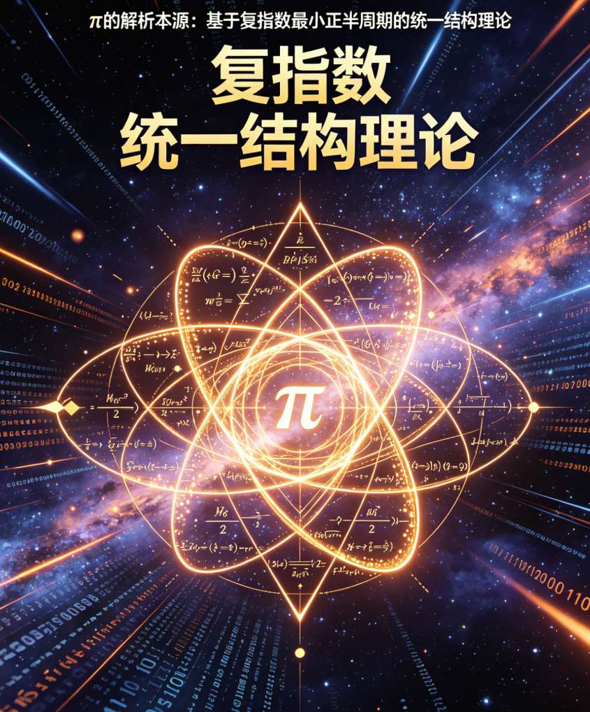
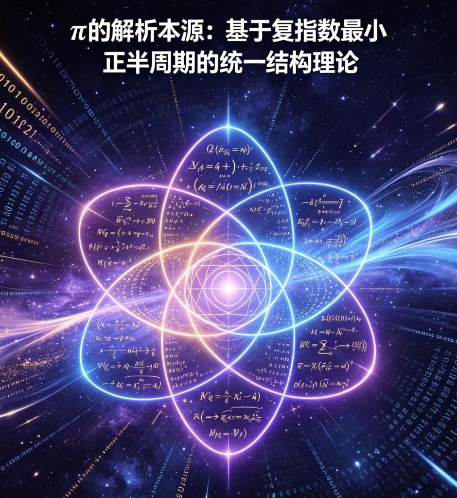

<ArchiveCopyPanel article-id="161027931" />

{"markdown":"PiDliIbnsbvvvJrlk6Xlvrflt7TotavnjJzmg7MgIAo+IOe8luWPt++8mmAxNjEwMjc5MzFgICAKPiDljp/lp4vmlofku7bvvJpg55qE6Kej5p6Q5pys5rqQ5Z+65LqO5aSN5oyH5pWw5pyA5bCP5q2j5Y2K5ZGo5pyf55qE57uf5LiA57uT5p6E55CG6K66LTE2MTAyNzkzMS5tZGAgIAo+IOi/lOWbnu+8mlvmnKzkuablvZLmoaNdKC96aC9ib29rcy9nb2xkYmFjaC9hcnRpY2xlcy8pIMK3IFvmgLvlhaXlj6NdKC96aC9ib29rcy9hcnRpY2xlcy8pCgojIyDPgOeahOino+aekOacrOa6kO+8muWfuuS6juWkjeaMh+aVsOacgOWwj+ato+WNiuWRqOacn+eahOe7n+S4gOe7k+aehOeQhuiuugoKIVtpbWFnZV0oLi9hc3NldHMvY3NkbmltZy9qcGcvYWYxMWE1NDNjNDllMTFhZS5qcGcpCgrmkZjopoEKCuacrOaWh+W7uueri+S6huS4gOS4quWujOWFqOiEseemu+asp+awj+WHoOS9lemihOiuvueahM+A55qE6Kej5p6Q57uf5LiA55CG6K665qGG5p6244CC5Lyg57uf5pWw5a2m5Litz4DooqvlrprkuYnkuLrlnIblkajplb/kuI7nm7TlvoTkuYvmr5TvvIzkvYbnjrDku6PliIbmnpDlrabmj63npLrPgOaYr+S4gOS4quabtOWfuuehgOeahOaVsOWtpuW4uOaVsO+8jOa3seWxguW1jOWFpeS6juWkjeWIhuaekOOAgeiwg+WSjOWIhuaekOOAgeaVsOiuuuOAgeaLk+aJkeWtpuS4juamgueOh+iuuuetieWkmuS4qumihuWfn+OAguacrOaWh+S7juWkjeaMh+aVsOWHveaVsOeahOW5gue6p+aVsOWumuS5ieWHuuWPke+8jOWcqOS4jeW8leWFpeWchuOAgeinkuW6puOAgeW8p+mVv+S4juW8p+W6puWItueahOWJjeaPkOS4i++8jOS4peagvOWumuS5ic+A5Li65ruh6LazZWl5PeKIkjFlXiYjMTIzO2l5JiMxMjU7PS0xZWl5PeKIkjHnmoTmnIDlsI/mraPlrp7mlbDvvIzlubbor4HmmI7lhbbkuLrlpI3mjIfmlbDlh73mlbDnmoTmnIDlsI/mraPljYrlkajmnJ/jgILln7rkuo7mraTlrprkuYnvvIzmnKzmlofnu5/kuIDmjqjlr7zkuobkuInop5Llh73mlbDkvZPns7vjgIFGb3VyaWVy5ZGo5pyf57uT5p6E44CBTGVpYm5peue6p+aVsOOAgVdhbGxpc+S5mOenr+OAgUdhdXNzaWFu56ev5YiG5LiORXVsZXLmgZLnrYnlvI/nrYnmoLjlv4PmlbDlrabnu5PmnpzvvIzmj63npLrkuobmiYDmnInnnIvkvLzml6DlhbPnmoTPgOeahOihqOeOsOW9ouW8j+mDvea6kOS6juWkjeaMh+aVsOWHveaVsOeahOWGheWcqOWRqOacn+e7k+aehOOAguacrOaWh+aPkOWHuiLop6PmnpDkvJjlhYjjgIHlkajmnJ/kvJjlhYjjgIHml4vovazkvJjlhYgi55qEz4DnmoTmnKzotKjop4LvvIzor4HmmI7kvKDnu5/lh6DkvZXlnIblkajnjoflj6rmmK/PgOeahOS8l+WkmueJqeeQhuWunueOsOS5i+S4gOOAggoK5YWz6ZSu6K+N77yaz4DvvJvlpI3mjIfmlbDlh73mlbDvvJvmnIDlsI/mraPljYrlkajmnJ/vvJvov57nu63ml4vovaznvqTvvJtGb3VyaWVy5YiG5p6Q77yb57uf5LiA5pWw5a2m57uT5p6ECgotLS0KCiMjIyAxLiDlvJXoqIAKCs+A5piv5pWw5a2m5Y+y5LiK5pyA5Y+k6ICB5LiU5pyA5YW35b2x5ZON5Yqb55qE5bi45pWw5LmL5LiA44CC5Zyo6ZW/6L6+5pWw5Y2D5bm055qE5pWw5a2m5Y+R5bGV5Lit77yMz4Dlp4vnu4jkuI7lnIbnmoTlh6DkvZXmgKfotKjntKflr4bnm7jov57jgILku47lj6TluIzohYrpmL/ln7rnsbPlvrfnmoTlibLlnIbmnK/liLDkuK3lm73npZblhrLkuYvnmoTnsr7noa7orqHnrpfvvIzkurrnsbvlr7nPgOeahOaOoue0oumVv+acn+WxgOmZkOS6juWHoOS9lemihuWfn+OAggoK6L+Z5Lqb6Leo6aKG5Z+f55qE5Ye6546w5byV5Y+R5LqG5LiA5Liq5qC55pys5oCn6Zeu6aKY77yaz4DnmoTnnJ/mraPmnKzotKjmmK/ku4DkuYjvvJ/lpoLmnpzPgOS7heS7heaYr+WchueahOWHoOS9leW4uOaVsO+8jOS4uuS9leWug+S8muWHuueOsOWcqOS4juWHoOS9leavq+aXoOWFs+ezu+eahOaVsOWtpuWIhuaUr+S4re+8nwoK5pys5paH6K6k5Li677yMz4DnmoTmnKzotKjkuI3lsZ7kuo7lh6DkvZXvvIzogIzlsZ7kuo7ov57nu63ml4vovazkuI7lpI3mjIfmlbDlkajmnJ/nu5PmnoTjgILmnKzmloflsIbor4HmmI7vvIzmiYDmnInkuI7PgOebuOWFs+eahOaVsOWtpue7k+aenOmDveWPr+S7peS7juS4gOS4quWNleS4gOeahOino+aekOWumuS5ieWHuuWPkee7n+S4gOWvvOWHuu+8jOi/meS4quWumuS5ieWujOWFqOS4jeS+nei1luS6juS7u+S9leWHoOS9leamguW/teOAgui/meS4gOeQhuiuuuahhuaetuS4jeS7heS4us+A5o+Q5L6b5LqG5pu05rex5Yi755qE5pys5L2T6K666Kej6YeK77yM5Lmf5Li655CG6Kej5pWw5a2m5LiN5ZCM5YiG5pSv5LmL6Ze055qE5YaF5Zyo57uf5LiA5oCn5o+Q5L6b5LqG5paw55qE6KeG6KeS44CCCgotLS0KCiMjIyAyLiDlpI3mjIfmlbDlh73mlbDnmoTop6PmnpDmnoTpgKAKCiMjIyMgMi4xIOaMh+aVsOWHveaVsOeahOW5gue6p+aVsOWumuS5iQoK5oiR5Lus5LuO5pyA5Z+656GA55qE5bmC57qn5pWw5Ye65Y+R5a6a5LmJ5aSN5oyH5pWw5Ye95pWw77yM5LiN6aKE6K6+5Lu75L2V5Yeg5L2V5oiW54mp55CG5oSP5LmJ44CCCgrlrprkuYkyLjEg5aSN5oyH5pWw5Ye95pWwZXplXnpleuWumuS5ieS4uuS7peS4i+W5gue6p+aVsOeahOWSjO+8mgoKZXo94oiRbj0w4oieem5uIQplej1uPTDiiJHiiJ7igItuIXpu4oCLCgrlrprnkIYyLjEg5LiK6L+w5bmC57qn5pWw5Zyo5pW05Liq5aSN5bmz6Z2iQ1xtYXRoYmImIzEyMztDJiMxMjU7Q+S4iue7neWvueaUtuaVm+S4lOWGhemXreS4gOiHtOaUtuaVm+OAggoK4oijem5uIeKIo+KJpFJubiEK4oCLbiF6buKAi+KAi+KJpG4hUm7igIsKCiMjIyMgMi4yIOasp+aLieWFrOW8j+eahOS4peagvOaOqOWvvAoK5a6a55CGMi4y77yI5qyn5ouJ5YWs5byP77yJIOWvueS6juS7u+aEj+WunuaVsHh4eO+8jOacie+8mgoKZWl4PWNvc+KBoXgraXNpbuKBoXgKZV4mIzEyMztpeCYjMTI1Oz1cY29zIHgraVxzaW4geAplaXg9Y29zeCtpc2lueAoK5YW25Lit5L2Z5bym5Ye95pWw5ZKM5q2j5bym5Ye95pWw5YiG5Yir5a6a5LmJ5Li677yaCgpjb3PigaF4PeKIkW49MOKInijiiJIxKW54Mm4oMm4pISxzaW7igaF4PeKIkW49MOKInijiiJIxKW54Mm4rMSgybisxKSEKY29zeD1uPTDiiJHiiJ7igIsoMm4pISjiiJIxKW54Mm7igIssc2lueD1uPTDiiJHiiJ7igIsoMm4rMSkhKOKIkjEpbngybisx4oCLCgror4HmmI4g5bCGej1peHo9aXh6PWl45Luj5YWl5oyH5pWw5Ye95pWw55qE5bmC57qn5pWw5a6a5LmJ77yaCgplaXg94oiRbj0w4oieKGl4KW5uIQplaXg9bj0w4oiR4oie4oCLbiEoaXgpbuKAiwoK5bCG57qn5pWw5oyJbm5u55qE5aWH5YG25oCn5ouG5YiG77yaCgplaXg94oiRaz0w4oieKGl4KTJrKDJrKSEr4oiRaz0w4oieKGl4KTJrKzEoMmsrMSkhCmVpeD1rPTDiiJHiiJ7igIsoMmspIShpeCkya+KAiytrPTDiiJHiiJ7igIsoMmsrMSkhKGl4KTJrKzHigIsKCuazqOaEj+WIsGkyaz0o4oiSMSlraV4mIzEyMzsyayYjMTI1Oz0oLTEpXmtpMms9KOKIkjEpa++8jGkyaysxPWko4oiSMSlraV4mIzEyMzsyaysxJiMxMjU7PWkoLTEpXmtpMmsrMT1pKOKIkjEpa++8jOWboOatpO+8mgoKZWl4PeKIkWs9MOKInijiiJIxKWt4MmsoMmspIStp4oiRaz0w4oieKOKIkjEpa3gyaysxKDJrKzEpIT1jb3PigaF4K2lzaW7igaF4CmVpeD1rPTDiiJHiiJ7igIsoMmspISjiiJIxKWt4MmvigIsraWs9MOKIkeKInuKAiygyaysxKSEo4oiSMSlreDJrKzHigIs9Y29zeCtpc2lueAoK6K+B5q+V44CCCgrms6jorrAg5Zyo5q2k5a6a5LmJ5LiL77yM5LiJ6KeS5Ye95pWw5LiN5YaN5piv5Yeg5L2V5qaC5b+177yM6ICM5piv5aSN5oyH5pWw5Ye95pWw6Kej5p6Q57uT5p6E55qE6Ieq54S25Lqn54mp44CC5a6D5Lus55qE5omA5pyJ5oCn6LSo77yI5aaC5ZGo5pyf5oCn44CB5aWH5YG25oCn44CB5ZKM6KeS5YWs5byP562J77yJ6YO95Y+v5Lul5LuO5oyH5pWw5Ye95pWw55qE5oCn6LSo5a+85Ye644CCCgotLS0KCiMjIyAzLiDPgOeahOino+aekOacrOa6kOWumuS5iQoK5a6a5LmJMy4x77yIz4DnmoTop6PmnpDlrprkuYnvvIkg5a6a5LmJz4DkuLrmu6HotrPku6XkuIvmnaHku7bnmoTmnIDlsI/mraPlrp7mlbDvvJoKCs+APW1pbuKBoSYjMTIzO3k+MDplaXk94oiSMSYjMTI1OwrPgD1taW4mIzEyMzt5PjA6ZWl5PeKIkjEmIzEyNTsKCuS4uuS6huS9v+i/meS4quWumuS5ieacieaEj+S5ie+8jOaIkeS7rOmcgOimgeivgeaYjui/meagt+eahOato+WunuaVsOWtmOWcqOS4lOWUr+S4gOOAggoK5byV55CGMy4xIOWtmOWcqOato+WunuaVsHl5eeS9v+W+l2VpeT3iiJIxZV4mIzEyMztpeSYjMTI1Oz0tMWVpeT3iiJIx44CCCgror4HmmI4g6aaW5YWI77yM5oiR5Lus6K+B5piOY29z4oGhMjwwXGNvcyAyPDBjb3MyPDDjgILmoLnmja7kvZnlvKblh73mlbDnmoTluYLnuqfmlbDlsZXlvIDvvJoKCmNvc+KBoTI9MeKIkjIyMiErMjQ0IeKIkjI2NiEr4ouvCmNvczI9MeKIkjIhMjLigIsrNCEyNOKAi+KIkjYhMjbigIsr4ouvCgrov5nmmK/kuIDkuKrkuqTplJnnuqfmlbDvvIzlhbbpobnnmoTnu53lr7nlgLzljZXosIPpgJLlh4/otovkuo4w44CC5Zug5q2k77yM5oiR5Lus5Y+v5Lul55So5YmN5LiJ6aG55p2l5Lyw6K6h77yaCgpjb3PigaEyPDHiiJI0MisxNjI0PTHiiJIyKzIzPeKIkjEzPDAKY29zMjwx4oiSMjTigIsrMjQxNuKAiz0x4oiSMiszMuKAiz3iiJIzMeKAizwwCgrlj6bkuIDmlrnpnaLvvIxjb3PigaEwPTE+MFxjb3MgMD0xPjBjb3MwPTE+MOOAgueUseS6jmNvc+KBoXhcY29zIHhjb3N45piv6L+e57ut5Ye95pWw77yI5bmC57qn5pWw55qE5ZKM5Ye95pWw5Zyo5pS25pWb5Z+f5YaF6L+e57ut77yJ77yM5qC55o2u5LuL5YC85a6a55CG77yM5a2Y5ZyoeTDiiIgoMCwyKXlfMFxpbigwLDIpeTDigIviiIgoMCwyKeS9v+W+l2Nvc+KBoXkwPTBcY29zIHlfMD0wY29zeTDigIs9MOOAggoK546w5Zyo6ICD6JmRZWl5MD1jb3PigaF5MCtpc2lu4oGheTA9aXNpbuKBoXkwZV4mIzEyMztpeV8wJiMxMjU7PVxjb3MgeV8wK2lcc2luIHlfMD1pXHNpbiB5XzBlaXkw4oCLPWNvc3kw4oCLK2lzaW55MOKAiz1pc2lueTDigIvjgILmiJHku6zor4HmmI5zaW7igaF5MD4wXHNpbiB5XzA+MHNpbnkw4oCLPjDjgILkuovlrp7kuIrvvIzlr7nkuo544oiIKDAseTApeFxpbigwLHlfMCl44oiIKDAseTDigIsp77yM5pyJY29z4oGheD4wXGNvcyB4PjBjb3N4PjDvvIjlm6DkuLp5MHlfMHkw4oCL5pivY29z4oGheFxjb3MgeGNvc3jnmoTnrKzkuIDkuKrpm7bngrnvvInjgILogIxzaW7igaHigLJ4PWNvc+KBoXhcc2luJ3g9XGNvcyB4c2lu4oCyeD1jb3N477yM5Zug5q2kc2lu4oGheFxzaW4geHNpbnjlnKgoMCx5MCkoMCx5XzApKDAseTDigIsp5LiK5Lil5qC86YCS5aKe44CC5Y+Ic2lu4oGhMD0wXHNpbiAwPTBzaW4wPTDvvIzmlYVzaW7igaF5MD4wXHNpbiB5XzA+MHNpbnkw4oCLPjDjgIIKCuWboOatpO+8jGVpeTA9aWVeJiMxMjM7aXlfMCYjMTI1Oz1pZWl5MOKAiz1p77yM5LuO6ICMZWkyeTA9KGVpeTApMj1pMj3iiJIxZV4mIzEyMztpMnlfMCYjMTI1Oz0oZV4mIzEyMztpeV8wJiMxMjU7KV4yPWleMj0tMWVpMnkw4oCLPShlaXkw4oCLKTI9aTI94oiSMeOAgui/meivtOaYjjJ5MDJ5XzAyeTDigIvmmK/kuIDkuKrmu6HotrNlaXk94oiSMWVeJiMxMjM7aXkmIzEyNTs9LTFlaXk94oiSMeeahOato+WunuaVsOOAguivgeavleOAggoK5byV55CGMy4yIOa7oei2s2VpeT3iiJIxZV4mIzEyMztpeSYjMTI1Oz0tMWVpeT3iiJIx55qE5q2j5a6e5pWw6ZuG5ZCI5pyJ5pyA5bCP5YC844CCCgplac+APWxpbeKBoW7ihpLiiJ5laXluPWxpbeKBoW7ihpLiiJ4o4oiSMSk94oiSMQplac+APW7ihpLiiJ5saW3igItlaXlu4oCLPW7ihpLiiJ5saW3igIso4oiSMSk94oiSMQoK57uT5ZCI5byV55CGMy4x5ZKMMy4y77yM5a6a5LmJMy4x5piv6Imv5aW955qE44CCCgotLS0KCiMjIyA0LiDmnIDlsI/mraPljYrlkajmnJ/lrprnkIYKCuWumueQhjQuMe+8iOacgOWwj+ato+WNiuWRqOacn+WumueQhu+8iSDlh73mlbBmKHgpPWVpeGYoeCk9ZV4mIzEyMztpeCYjMTI1O2YoeCk9ZWl45YW35pyJ5Lul5LiL5oCn6LSo77yaCgror4HmmI4KCi0gCgplaTLPgD0oZWnPgCkyPSjiiJIxKTI9MQplaTLPgD0oZWnPgCkyPSjiiJIxKTI9MQoK5LqO5piv5a+55Lu75oSP5a6e5pWweHh477yM5pyJ77yaCgplaSh4KzLPgCk9ZWl4ZWkyz4A9ZWl44ouFMT1laXgKZWkoeCsyz4ApPWVpeGVpMs+APWVpeOKLhTE9ZWl4CgotIAoKLSAKCmYoeCvPgCk9ZWkoeCvPgCk9ZWl4ZWnPgD3iiJJlaXg94oiSZih4KQpmKHgrz4ApPWVpKHgrz4ApPWVpeGVpz4A94oiSZWl4PeKIkmYoeCkKCui/meivtOaYjs+A5pivZih4KWYoeClmKHgp55qE5LiA5Liq5Y2K5ZGo5pyf44CC5YGH6K6+5a2Y5ZyoMDA8VDzPgOS9v+W+l2YoeCtUKT3iiJJmKHgpZih4K1QpPS1mKHgpZih4K1QpPeKIkmYoeCnlr7nmiYDmnIl4eHjmiJDnq4vvvIzliJnku6R4PTB4PTB4PTDlvpdlaVQ94oiSMWVeJiMxMjM7aVQmIzEyNTs9LTFlaVQ94oiSMe+8jOi/meS4js+A5pivU1NT55qE5pyA5bCP5YC855+b55u+44CC5Zug5q2kz4DmmK/mnIDlsI/mraPljYrlkajmnJ/jgIIKCuivgeavleOAggoKLS0tCgojIyMgNS4g5ZGo5pyf57uT5p6E5LiORm91cmllcuWIhuaekOeahOe7n+S4gOWfuuehgAoKRm91cmllcuWIhuaekOaYr+eOsOS7o+aVsOWtpuWSjOW3peeoi+WtpueahOWfuuefs+S5i+S4gO+8jOWFtuaguOW/g+aYr+WwhuS7u+aEj+WRqOacn+WHveaVsOihqOekuuS4uuato+W8puWHveaVsOWSjOS9meW8puWHveaVsOeahOe6v+aAp+e7hOWQiOOAguacrOiKguWwhuivgeaYju+8jEZvdXJpZXLliIbmnpDnmoTmlbTkuKrkvZPns7vpg73lu7rnq4vlnKjPgOeahOWRqOacn+e7k+aehOS5i+S4iuOAggoKMTLPgOKIqzAyz4BlaW54ZeKIkmlteGR4Pc60bm0KMs+AMeKAi+KIqzAyz4DigItlaW54ZeKIkmlteGR4Pc60bm3igIsKCuWFtuS4rc60bm1cZGVsdGFfJiMxMjM7bm0mIzEyNTvOtG5t4oCL5pivS3JvbmVja2VyIGRlbHRh5Ye95pWw44CCCgror4HmmI4g5b2Tbj1tbj1tbj1t5pe277yaCgoxMs+A4oirMDLPgGVpbnhl4oiSaW54ZHg9MTLPgOKIqzAyz4AxZHg9MQoyz4Ax4oCL4oirMDLPgOKAi2Vpbnhl4oiSaW54ZHg9Ms+AMeKAi+KIqzAyz4DigIsxZHg9MQoK5b2TbuKJoG1uXG5lcSBtbu6AoD1t5pe277yM5Lukaz1u4oiSbeKJoDBrPW4tbVxuZXEwaz1u4oiSbe6AoD0w77yaCgoxMs+A4oirMDLPgGVpa3hkeD0xMs+AW2Vpa3hpa10wMs+APTEyz4BpayhlaTLPgGviiJIxKT0xMs+AaWsoMeKIkjEpPTAKMs+AMeKAi+KIqzAyz4DigItlaWt4ZHg9Ms+AMeKAi1tpa2Vpa3jigItdMDLPgOKAiz0yz4BpazHigIsoZWkyz4Br4oiSMSk9Ms+AaWsx4oCLKDHiiJIxKT0wCgror4Hmr5XjgIIKCuWboOatpO+8jEZvdXJpZXLliIbmnpDkuK3nmoTpopHnjofjgIHms6Lplb/jgIHnm7jkvY3jgIHosLHnrYnmiYDmnInmpoLlv7XvvIzmnKzotKjkuIrpg73mupDkuo7lpI3mjIfmlbDlh73mlbDnmoTlkajmnJ/nu5PmnoTvvIzogIzPgOWImeaYr+i/meS4que7k+aehOeahOWfuuacrOWwuuW6puOAggoKLS0tCgojIyMgNi4g57uP5YW4z4DlhazlvI/nmoTnu5/kuIDmjqjlr7wKCuWcqOacrOiKguS4re+8jOaIkeS7rOWwhuS7js+A55qE6Kej5p6Q5a6a5LmJ5Ye65Y+R77yM57uf5LiA5o6o5a+85Ye65pWw5a2m5Y+y5LiK5Yeg5Liq5pyA6JGX5ZCN55qEz4DlhazlvI/vvIzor4HmmI7lroPku6zpg73mmK/lpI3mjIfmlbDlkajmnJ/nu5PmnoTnmoToh6rnhLbmjqjorrrjgIIKCiMjIyMgNi4xIExlaWJuaXrnuqfmlbAKCuWumueQhjYuMe+8iExlaWJuaXrnuqfmlbDvvIkKCs+APTTiiJFuPTDiiJ4o4oiSMSluMm4rMQrPgD00bj0w4oiR4oie4oCLMm4rMSjiiJIxKW7igIsKCuivgeaYjiDpppblhYjlrprkuYnlj43mraPliIflh73mlbDvvJoKCmFyY3RhbuKBoXg94oirMHgxMSt0MmR0CmFyY3Rhbng94oirMHjigIsxK3QyMeKAi2R0Cgrlr7nkuo7iiKN04oijPDF8dHw8MeKIo3TiiKM8Me+8jOaIkeS7rOacieWHoOS9lee6p+aVsOWxleW8gO+8mgoKMTErdDI94oiRbj0w4oieKOKIkjEpbnQybgoxK3QyMeKAiz1uPTDiiJHiiJ7igIso4oiSMSludDJuCgphcmN0YW7igaF4PeKIkW49MOKInijiiJIxKW7iiKsweHQybmR0PeKIkW49MOKInijiiJIxKW54Mm4rMTJuKzEKYXJjdGFueD1uPTDiiJHiiJ7igIso4oiSMSlu4oirMHjigIt0Mm5kdD1uPTDiiJHiiJ7igIsybisxKOKIkjEpbngybisx4oCLCgrnlLFBYmVs5a6a55CG77yM6L+Z5Liq57qn5pWw5ZyoeD0xeD0xeD0x5aSE5Lmf5pS25pWb44CCCgrku6PlhaV4PTF4PTF4PTHlvpfvvJoKCs+AND3iiJFuPTDiiJ4o4oiSMSluMm4rMQo0z4DigIs9bj0w4oiR4oie4oCLMm4rMSjiiJIxKW7igIsKCuS4pOi+ueS5mOS7pTTljbPlvpdMZWlibml657qn5pWw44CC6K+B5q+V44CCCgojIyMjIDYuMiBXYWxsaXPkuZjnp68KCuWumueQhjYuMu+8iFdhbGxpc+S5mOenr++8iQoKz4AyPeKIj249MeKInigybikyKDJu4oiSMSkoMm4rMSkKMs+A4oCLPW49MeKIj+KInuKAiygybuKIkjEpKDJuKzEpKDJuKTLigIsKCuivgeaYjiDlrprkuYnnp6/liIbvvJoKCkluPeKIqzDPgHNpbuKBoW54ZHgKSW7igIs94oirMM+A4oCLc2lubnhkeAoKSW494oirMM+Ac2lu4oGhbuKIkjF4c2lu4oGheGR4PeKIknNpbuKBoW7iiJIxeGNvc+KBoXjiiKMwz4ArKG7iiJIxKeKIqzDPgHNpbuKBoW7iiJIyeGNvc+KBoTJ4ZHgKSW7igIs94oirMM+A4oCLc2lubuKIkjF4c2lueGR4PeKIknNpbm7iiJIxeGNvc3jigIswz4DigIsrKG7iiJIxKeKIqzDPgOKAi3Npbm7iiJIyeGNvczJ4ZHgKCuesrOS4gOmhueS4ujDvvIzogIxjb3PigaEyeD0x4oiSc2lu4oGhMnhcY29zXjJ4PTEtXHNpbl4yeGNvczJ4PTHiiJJzaW4yeO+8jOWboOatpO+8mgoKSW49KG7iiJIxKeKIqzDPgHNpbuKBoW7iiJIyeGR44oiSKG7iiJIxKeKIqzDPgHNpbuKBoW54ZHg9KG7iiJIxKUlu4oiSMuKIkihu4oiSMSlJbgpJbuKAiz0obuKIkjEp4oirMM+A4oCLc2lubuKIkjJ4ZHjiiJIobuKIkjEp4oirMM+A4oCLc2lubnhkeD0obuKIkjEpSW7iiJIy4oCL4oiSKG7iiJIxKUlu4oCLCgrmlbTnkIblvpfpgJLmjqjlhazlvI/vvJoKCkluPW7iiJIxbklu4oiSMgpJbuKAiz1ubuKIkjHigItJbuKIkjLigIsKCuWIneWni+adoeS7tuS4uu+8mgoKSTA94oirMM+AMWR4Pc+ALEkxPeKIqzDPgHNpbuKBoXhkeD0yCkkw4oCLPeKIqzDPgOKAizFkeD3PgCxJMeKAiz3iiKswz4DigItzaW54ZHg9MgoK5a+55LqO5YG25pWwbj0ya249MmtuPTJr77yaCgpJMms9MmviiJIxMmvii4Uya+KIkjMya+KIkjLii4Xii6/ii4UxMuKLhUkwPSgya+KIkjEpISEoMmspISHPgApJMmvigIs9Mmsya+KIkjHigIvii4Uya+KIkjIya+KIkjPigIvii4Xii6/ii4UyMeKAi+KLhUkw4oCLPSgyaykhISgya+KIkjEpISHigIvPgAoK5a+55LqO5aWH5pWwbj0yaysxbj0yaysxbj0yaysx77yaCgpJMmsrMT0yazJrKzHii4Uya+KIkjIya+KIkjHii4Xii6/ii4UyM+KLhUkxPTLii4UoMmspISEoMmsrMSkhIQpJMmsrMeKAiz0yaysxMmvigIvii4Uya+KIkjEya+KIkjLigIvii4Xii6/ii4UzMuKAi+KLhUkx4oCLPTLii4UoMmsrMSkhISgyaykhIeKAiwoKSTJrKzHiiaRJMmviiaRJMmviiJIxCkkyaysx4oCL4omkSTJr4oCL4omkSTJr4oiSMeKAiwoK5Luj5YWl6KGo6L6+5byP5bm25YyW566A77yaCgoy4ouFKDJrKSEhKDJrKzEpISHiiaQoMmviiJIxKSEhKDJrKSEhz4DiiaQy4ouFKDJr4oiSMikhISgya+KIkjEpISEKMuKLhSgyaysxKSEhKDJrKSEh4oCL4omkKDJrKSEhKDJr4oiSMSkhIeKAi8+A4omkMuKLhSgya+KIkjEpISEoMmviiJIyKSEh4oCLCgrkuKTovrnpmaTku6VJMmsrMUlfJiMxMjM7MmsrMSYjMTI1O0kyaysx4oCL77yaCgox4omkz4Ay4ouFKDJr4oiSMSkhISgyaysxKSEhWygyaykhIV0y4omkMmsrMTJrCjHiiaQyz4DigIvii4VbKDJrKSEhXTIoMmviiJIxKSEhKDJrKzEpISHigIviiaQyazJrKzHigIsKCmxpbeKBoWvihpLiiJ7PgDLii4UoMmviiJIxKSEhKDJrKzEpISFbKDJrKSEhXTI9MQpr4oaS4oiebGlt4oCLMs+A4oCL4ouFWygyaykhIV0yKDJr4oiSMSkhISgyaysxKSEh4oCLPTEKCuaVtOeQhuW+l++8mgoKz4AyPWxpbeKBoWvihpLiiJ7iiI9uPTFrKDJuKTIoMm7iiJIxKSgybisxKQoyz4DigIs9a+KGkuKInmxpbeKAi249MeKIj2vigIsoMm7iiJIxKSgybisxKSgybiky4oCLCgror4Hmr5XjgIIKCiMjIyMgNi4zIEdhdXNzaWFu56ev5YiGCgrlrprnkIY2LjPvvIhHYXVzc2lhbuenr+WIhu+8iQoK4oir4oiS4oie4oieZeKIkngyZHg9z4AK4oir4oiS4oie4oie4oCLZeKIkngyZHg9z4DigIsKCkkyPSjiiKviiJLiiJ7iiJ5l4oiSeDJkeCko4oir4oiS4oie4oieZeKIknkyZHkpPeKIrFIyZeKIkih4Mit5MilkeGR5CkkyPSjiiKviiJLiiJ7iiJ7igItl4oiSeDJkeCko4oir4oiS4oie4oie4oCLZeKIknkyZHkpPeKIrFIy4oCLZeKIkih4Mit5MilkeGR5CgrlsIbkuozph43np6/liIbovazmjaLkuLrmnoHlnZDmoIcocizOuCkocixcdGhldGEpKHIszrgp77yM5YW25LiteD1yY29z4oGhzrh4PXJcY29zXHRoZXRheD1yY29zzrjvvIx5PXJzaW7igaHOuHk9clxzaW5cdGhldGF5PXJzaW7OuO+8jOmbheWPr+avlOihjOWIl+W8j+S4unJycu+8jOWboOatpO+8mgoKSTI94oirMDLPgOKIqzDiiJ5l4oiScjJyZHJkzrgKSTI94oirMDLPgOKAi+KIqzDiiJ7igItl4oiScjJyZHJkzrgKCuWFiOWvuc64XHRoZXRhzrjnp6/liIbvvJoKCuKIqzAyz4Bkzrg9Ms+ACuKIqzAyz4DigItkzrg9Ms+ACgrlho3lr7lycnLnp6/liIbvvIzku6R1PXIydT1yXjJ1PXIy77yMZHU9MnJkcmR1PTJyZHJkdT0ycmRy77yaCgriiKsw4oieZeKIknIycmRyPTEy4oirMOKInmXiiJJ1ZHU9MTIK4oirMOKInuKAi2XiiJJyMnJkcj0yMeKAi+KIqzDiiJ7igItl4oiSdWR1PTIx4oCLCgrlm6DmraTvvJoKCkkyPTLPgOKLhTEyPc+ACkkyPTLPgOKLhTIx4oCLPc+ACgotLS0KCiMjIyA3LiDPgOeahOaLk+aJkeacrOi0qAoK5LuO5ouT5omR5a2m55qE6KeS5bqm55yL77yM5aSN5oyH5pWw5Ye95pWw5a6a5LmJ5LqG5LiA5Liq5LuO5a6e5pWw6L205Yiw5Y2V5L2N5ZyG55qE6KaG55uW5pig5bCE44CCCgrlrprkuYk3LjEg5Y2V5L2N5ZyG576kVSgxKVUoMSlVKDEp5a6a5LmJ5Li677yaCgpVKDEpPSYjMTIzO3riiIhDOuKIo3riiKM9MSYjMTI1OwpVKDEpPVwmIzEyMzt6XGluXG1hdGhiYiYjMTIzO0MmIzEyNTs6fHp8PTFcJiMxMjU7ClUoMSk9JiMxMjM7euKIiEM64oijeuKIoz0xJiMxMjU7CgrlnKjlpI3mlbDkuZjms5XkuIvmnoTmiJDkuIDkuKrmi5PmiZHnvqTjgIIKClIvMs+AWuKJhVUoMSkKUi8yz4Ba4omFVSgxKQoK6K+B5piOIOmmluWFiO+8jM+VXHBoac+V5piv576k5ZCM5oCB77yaCgrPlSh4K3kpPWVpKHgreSk9ZWl4ZWl5Pc+VKHgpz5UoeSkKXHBoaSh4K3kpPWVeJiMxMjM7aSh4K3kpJiMxMjU7PWVeJiMxMjM7aXgmIzEyNTtlXiYjMTIzO2l5JiMxMjU7PVxwaGkoeClccGhpKHkpCs+VKHgreSk9ZWkoeCt5KT1laXhlaXk9z5UoeCnPlSh5KQoK5YW25qyh77yMz5VccGhpz5XmmK/mu6HlsITvvJrlr7nkuo7ku7vmhI964oiIVSgxKXpcaW4gVSgxKXriiIhVKDEp77yM6K6+ej1jb3PigaHOuCtpc2lu4oGhzrh6PVxjb3NcdGhldGEraVxzaW5cdGhldGF6PWNvc864K2lzaW7OuO+8jOWImc+VKM64KT16XHBoaShcdGhldGEpPXrPlSjOuCk9euOAggoKz5VccGhpz5XnmoTmoLjkuLrvvJoKCmtlcuKBoc+VPSYjMTIzO3jiiIhSOmVpeD0xJiMxMjU7PTLPgFoKa2Vyz5U9JiMxMjM7eOKIiFI6ZWl4PTEmIzEyNTs9Ms+AWgoKLS0tCgojIyMgOC4g6auY57K+5bqm5pWw5YC86aqM6K+BCgrkuLrkuobpqozor4HPgOeahOino+aekOWumuS5ieeahOato+ehruaAp++8jOaIkeS7rOS9v+eUqFB5dGhvbueahG1wbWF0aOW6k+i/m+ihjOS6humrmOeyvuW6puaVsOWAvOiuoeeul+OAguS7peS4i+S7o+eggeaxguino+aWueeoi2VpeSsxPTBlXiYjMTIzO2l5JiMxMjU7KzE9MGVpeSsxPTDnmoTmnIDlsI/mraPmoLnvvIzlubbkuI7moIflh4bPgOWAvOi/m+ihjOavlOi+g++8mgoKaW1wb3J0IG1wbWF0aCBhcyBtcAoKIyDorr7nva7orqHnrpfnsr7luqbkuLoxMDDkvY3lsI/mlbAKbXAubXAuZHBzID0gMTAwCgojIOWumuS5ieWHveaVsGYoeSk9ZV4oaXkpKzEKZiA9IGxhbWJkYSB5OiBtcC5lKiooMWoqeSkgKyAxCgojIOWcqHk9M+mZhOi/keWvu+aJvuaguQpyb290ID0gbXAuZmluZHJvb3QoZiwgMykKCiMg6L6T5Ye657uT5p6cCnByaW50KCLmlrnnqItlXihpeSk9LTHnmoTmnIDlsI/mraPmoLnvvJoiKQpwcmludChyb290KQpwcmludCgiXG7moIflh4bPgOWAvO+8miIpCnByaW50KG1wLnBpKQpwcmludCgiXG7lt67lgLzvvJoiKQpwcmludChyb290IC0gbXAucGkpCgrov5DooYznu5PmnpzvvJoKCuaWueeoi2VeKGl5KT0tMeeahOacgOWwj+ato+ague+8mgozLjE0MTU5MjY1MzU4OTc5MzIzODQ2MjY0MzM4MzI3OTUwMjg4NDE5NzE2OTM5OTM3NTEwNTgyMDk3NDk0NDU5MjMwNzgxNjQwNjI4NjIwODk5ODYyODAzNDgyNTM0MjExNzA2NzkKCuagh+WHhs+A5YC877yaCjMuMTQxNTkyNjUzNTg5NzkzMjM4NDYyNjQzMzgzMjc5NTAyODg0MTk3MTY5Mzk5Mzc1MTA1ODIwOTc0OTQ0NTkyMzA3ODE2NDA2Mjg2MjA4OTk4NjI4MDM0ODI1MzQyMTE3MDY3OQoK5beu5YC877yaCjAuMAoK5ZyoMTAw5L2N5bCP5pWw55qE57K+5bqm5LiL77yM5rGC6Kej5b6X5Yiw55qE5qC55LiO5qCH5YeGz4DlgLzlrozlhajkuIDoh7TvvIzpqozor4HkuobPgOeahOino+aekOWumuS5ieeahOaVsOWAvOato+ehruaAp+OAggoKLS0tCgojIyMgOS4g55CG6K665oSP5LmJ5LiO5ZOy5a2m6K6o6K66CgrmnKzmlofnmoTmoLjlv4PotKHnjK7kuI3lnKjkuo7lj5HnjrDmlrDnmoTmlbDlrabkuovlrp7vvIzogIzlnKjkuo7mj5DkvpvkuobkuIDkuKrlhajmlrDnmoTop4bop5LmnaXnkIbop6PPgOeahOacrOi0qOOAguS8oOe7n+S4iu+8jM+A6KKr6KeG5Li65LiA5Liq5Yeg5L2V5bi45pWw77yM5omA5pyJ5YW25LuW6aKG5Z+f5Lit55qEz4Dpg73ooqvnnIvkvZzmmK/lh6DkvZXPgOeahOW6lOeUqOOAguiAjOacrOaWh+eahOeQhuiuuuahhuaetuWImemioOWAkuS6hui/meS4quWFs+ezu++8muino+aekM+A5piv5pys5rqQ77yM5Yeg5L2Vz4DmmK/lupTnlKjjgIIKCuWFt+S9k+adpeivtO+8jOacrOaWh+eahOeQhuiuuuaEj+S5ieS9k+eOsOWcqOS7peS4i+WHoOS4quaWuemdou+8mgoKLSAKCue7n+S4gOaAp++8muacrOaWh+WwhuWIhuaVo+WcqOaVsOWtpuWQhOS4quWIhuaUr+S4reeahM+A55qE6KGo546w5b2i5byP57uf5LiA5Yiw5LqG5LiA5Liq5Y2V5LiA55qE6Kej5p6Q5a6a5LmJ5LmL5LiL44CC5peg6K665piv5Yeg5L2V5Lit55qE5ZyG5ZGo546H44CB5YiG5p6Q5Lit55qE5qyn5ouJ5oGS562J5byP44CB5qaC546H6K665Lit55qER2F1c3NpYW7np6/liIbvvIzov5jmmK/mlbDorrrkuK3nmoTOtuWHveaVsOWAvO+8jOmDvea6kOS6juWkjeaMh+aVsOWHveaVsOeahOWGheWcqOWRqOacn+e7k+aehOOAggoKLSAKCuWfuuehgOaAp++8ms+A55qE6Kej5p6Q5a6a5LmJ5Y+q5L6d6LWW5LqO5bmC57qn5pWw5ZKM5a6e5pWw55qE5a6M5aSH5oCn77yM6L+Z5piv5pWw5a2m5Lit5pyA5Z+656GA55qE5qaC5b+144CC55u45q+U5LmL5LiL77yM5Yeg5L2V5a6a5LmJ6ZyA6KaB6aKE6K6+5qyn5rCP56m66Ze044CB5ZyG44CB5byn6ZW/562J5pu05aSN5p2C55qE5qaC5b+144CC5Zug5q2k77yM6Kej5p6Q5a6a5LmJ5pu06IO95L2T546wz4DnmoTmnKzotKjjgIIKCi0gCgrmma7pgILmgKfvvJrlpI3mjIfmlbDlh73mlbDnmoTlkajmnJ/nu5PmnoTmmK/mma7pgILnmoTvvIzkuI3kvp3otZbkuo7nibnlrprnmoTlh6DkvZXmiJbniannkIbnqbrpl7TjgILljbPkvb/lnKjpnZ7mrKflh6DkvZXkuK3vvIzPgOS7jeeEtuS8muWHuueOsOWcqOWIhuaekOWSjOaLk+aJkeS4re+8jOWboOS4uuWug+aPj+i/sOeahOaYr+i/nue7reaXi+i9rOeahOWfuuacrOaAp+i0qO+8jOiAjOS4jeaYr+eJueWumuepuumXtOeahOWHoOS9leaAp+i0qOOAggoKLSAKCuWQr+WPkeaAp++8mui/meS4queQhuiuuuahhuaetuS4uueQhuino+aVsOWtpueahOe7n+S4gOaAp+aPkOS+m+S6huaWsOeahOaAnei3r+OAguWug+ihqOaYju+8jOaVsOWtpuS4reeci+S8vOaXoOWFs+eahOWIhuaUr+S5i+mXtOWtmOWcqOedgOa3seWIu+eahOWGheWcqOiBlOezu++8jOiAjOi/meS6m+iBlOezu+W+gOW+gOa6kOS6juS4gOS6m+acgOWfuuacrOeahOaVsOWtpue7k+aehOOAggoK5LuO5ZOy5a2m55qE6KeS5bqm55yL77yM5pys5paH55qE57uT5p6c5pSv5oyB5LqG5pWw5a2m5p+P5ouJ5Zu+5Li75LmJ55qE6KeC54K577yaz4DmmK/kuIDkuKrni6znq4vkuo7kurrnsbvnu4/pqozlkozniannkIbkuJbnlYznmoTmir3osaHmlbDlrablrp7kvZPjgILlroPnmoTlrZjlnKjkuI3kvp3otZbkuo7lnIbmmK/lkKblrZjlnKjvvIzkuZ/kuI3kvp3otZbkuo7kurrnsbvmmK/lkKblj5HnjrDkuoblroPjgILkurrnsbvlr7nPgOeahOiupOivhui/h+eoi++8jOaYr+S4gOS4quS7juWFt+S9k+eahOWHoOS9leeOsOixoemAkOa4kOa3seWFpeWIsOaKveixoeeahOino+aekOacrOi0qOeahOi/h+eoi+OAggoKLS0tCgojIyMgMTAuIOe7k+iuugoK5pys5paH5LuO5aSN5oyH5pWw5Ye95pWw55qE5bmC57qn5pWw5a6a5LmJ5Ye65Y+R77yM5Zyo5a6M5YWo5LiN5L6d6LWW5qyn5rCP5Yeg5L2V55qE5YmN5o+Q5LiL77yM5Lil5qC85a6a5LmJ5LqGz4DkuLrmu6HotrNlaXk94oiSMWVeJiMxMjM7aXkmIzEyNTs9LTFlaXk94oiSMeeahOacgOWwj+ato+WunuaVsO+8jOW5tuivgeaYjuS6huWFtuS4uuWkjeaMh+aVsOWHveaVsOeahOacgOWwj+ato+WNiuWRqOacn+OAguWfuuS6jui/meS4quWumuS5ie+8jOacrOaWh+e7n+S4gOaOqOWvvOS6huS4ieinkuWHveaVsOS9k+ezu+OAgUZvdXJpZXLmraPkuqTln7rjgIFMZWlibml657qn5pWw44CBV2FsbGlz5LmY56ev44CBR2F1c3NpYW7np6/liIbkuI5FdWxlcuaBkuetieW8j+etieaguOW/g+aVsOWtpue7k+aenO+8jOaPreekuuS6huaJgOacieS4js+A55u45YWz55qE5pWw5a2m57uT5p6E6YO95rqQ5LqO5aSN5oyH5pWw5Ye95pWw55qE5YaF5Zyo5ZGo5pyf5oCn6LSo44CCCgrov5nkuIDnkIborrrmoYbmnrbkuI3ku4XkuLrPgOaPkOS+m+S6huabtOa3seWIu+OAgeabtOe7n+S4gOeahOino+mHiu+8jOS5n+S4uueQhuino+aVsOWtpuS4jeWQjOWIhuaUr+S5i+mXtOeahOWGheWcqOiBlOezu+W8gOi+n+S6huaWsOeahOmBk+i3r+OAguacquadpeeahOeglOeptuWPr+S7pei/m+S4gOatpeaOoue0oui/meS4que7n+S4gOahhuaetuWcqOmHj+WtkOWKm+WtpuOAgeebuOWvueiuuuOAgeS/oeWPt+WkhOeQhuetiemihuWfn+eahOW6lOeUqO+8jOS7peWPiuWug+WvueaVsOWtpuWfuuehgOWSjOaVsOWtpuWTsuWtpueahOW9seWTjeOAggoKLS0tCgojIyMg5Y+C6ICD5paH54yuCgpbMV0gRXVsZXIsIEwuICgxNzQ4KS4gSW50cm9kdWN0aW8gaW4gYW5hbHlzaW4gaW5maW5pdG9ydW0uIE1hcmN1bS1NaWNoYWVsZW0gQm91c3F1ZXQuCgpbMl0gRm91cmllciwgSi4gKDE4MjIpLiBUaMOpb3JpZSBhbmFseXRpcXVlIGRlIGxhIGNoYWxldXIuIEZpcm1pbiBEaWRvdC4KClszXSBSaWVtYW5uLCBCLiAoMTg1OSkuIMOcYmVyIGRpZSBBbnphaGwgZGVyIFByaW16YWhsZW4gdW50ZXIgZWluZXIgZ2VnZWJlbmVuIEdyw7Zzc2UuIE1vbmF0c2JlcmljaHRlIGRlciBLw7ZuaWdsaWNoZW4gUHJldcOfaXNjaGVuIEFrYWRlbWllIGRlciBXaXNzZW5zY2hhZnRlbiB6dSBCZXJsaW4uCgpbNF0gUnVkaW4sIFcuICgxOTc2KS4gUHJpbmNpcGxlcyBvZiBNYXRoZW1hdGljYWwgQW5hbHlzaXMgKDNyZCBlZC4pLiBNY0dyYXctSGlsbC4KCls1XSBBaGxmb3JzLCBMLiBWLiAoMTk3OSkuIENvbXBsZXggQW5hbHlzaXMgKDNyZCBlZC4pLiBNY0dyYXctSGlsbC4KCls2XSBNdW5rcmVzLCBKLiBSLiAoMjAwMCkuIFRvcG9sb2d5ICgybmQgZWQuKS4gUHJlbnRpY2UgSGFsbC4KCiFbaW1hZ2VdKC4vYXNzZXRzL2NzZG5pbWcvanBnL2M0ZjYwZDViYTgxZGUyOWQuanBnKQo=","text":"5YiG57G777ya5ZOl5b635be06LWr54yc5oOzICAK57yW5Y+377yaMTYxMDI3OTMxICAK5Y6f5aeL5paH5Lu277ya55qE6Kej5p6Q5pys5rqQ5Z+65LqO5aSN5oyH5pWw5pyA5bCP5q2j5Y2K5ZGo5pyf55qE57uf5LiA57uT5p6E55CG6K66LTE2MTAyNzkzMS5tZCAgCui/lOWbnu+8muacrOS5puW9kuahoyDCtyDmgLvlhaXlj6MKCs+A55qE6Kej5p6Q5pys5rqQ77ya5Z+65LqO5aSN5oyH5pWw5pyA5bCP5q2j5Y2K5ZGo5pyf55qE57uf5LiA57uT5p6E55CG6K66CgppbWFnZQoK5pGY6KaBCgrmnKzmloflu7rnq4vkuobkuIDkuKrlrozlhajohLHnprvmrKfmsI/lh6DkvZXpooTorr7nmoTPgOeahOino+aekOe7n+S4gOeQhuiuuuahhuaetuOAguS8oOe7n+aVsOWtpuS4rc+A6KKr5a6a5LmJ5Li65ZyG5ZGo6ZW/5LiO55u05b6E5LmL5q+U77yM5L2G546w5Luj5YiG5p6Q5a2m5o+t56S6z4DmmK/kuIDkuKrmm7Tln7rnoYDnmoTmlbDlrabluLjmlbDvvIzmt7HlsYLltYzlhaXkuo7lpI3liIbmnpDjgIHosIPlkozliIbmnpDjgIHmlbDorrrjgIHmi5PmiZHlrabkuI7mpoLnjoforrrnrYnlpJrkuKrpoobln5/jgILmnKzmlofku47lpI3mjIfmlbDlh73mlbDnmoTluYLnuqfmlbDlrprkuYnlh7rlj5HvvIzlnKjkuI3lvJXlhaXlnIbjgIHop5LluqbjgIHlvKfplb/kuI7lvKfluqbliLbnmoTliY3mj5DkuIvvvIzkuKXmoLzlrprkuYnPgOS4uua7oei2s2VpeT3iiJIxZV57aXl9PS0xZWl5PeKIkjHnmoTmnIDlsI/mraPlrp7mlbDvvIzlubbor4HmmI7lhbbkuLrlpI3mjIfmlbDlh73mlbDnmoTmnIDlsI/mraPljYrlkajmnJ/jgILln7rkuo7mraTlrprkuYnvvIzmnKzmlofnu5/kuIDmjqjlr7zkuobkuInop5Llh73mlbDkvZPns7vjgIFGb3VyaWVy5ZGo5pyf57uT5p6E44CBTGVpYm5peue6p+aVsOOAgVdhbGxpc+S5mOenr+OAgUdhdXNzaWFu56ev5YiG5LiORXVsZXLmgZLnrYnlvI/nrYnmoLjlv4PmlbDlrabnu5PmnpzvvIzmj63npLrkuobmiYDmnInnnIvkvLzml6DlhbPnmoTPgOeahOihqOeOsOW9ouW8j+mDvea6kOS6juWkjeaMh+aVsOWHveaVsOeahOWGheWcqOWRqOacn+e7k+aehOOAguacrOaWh+aPkOWHuiLop6PmnpDkvJjlhYjjgIHlkajmnJ/kvJjlhYjjgIHml4vovazkvJjlhYgi55qEz4DnmoTmnKzotKjop4LvvIzor4HmmI7kvKDnu5/lh6DkvZXlnIblkajnjoflj6rmmK/PgOeahOS8l+WkmueJqeeQhuWunueOsOS5i+S4gOOAggoK5YWz6ZSu6K+N77yaz4DvvJvlpI3mjIfmlbDlh73mlbDvvJvmnIDlsI/mraPljYrlkajmnJ/vvJvov57nu63ml4vovaznvqTvvJtGb3VyaWVy5YiG5p6Q77yb57uf5LiA5pWw5a2m57uT5p6ECgotLS0K5byV6KiACgrPgOaYr+aVsOWtpuWPsuS4iuacgOWPpOiAgeS4lOacgOWFt+W9seWTjeWKm+eahOW4uOaVsOS5i+S4gOOAguWcqOmVv+i+vuaVsOWNg+W5tOeahOaVsOWtpuWPkeWxleS4re+8jM+A5aeL57uI5LiO5ZyG55qE5Yeg5L2V5oCn6LSo57Sn5a+G55u46L+e44CC5LuO5Y+k5biM6IWK6Zi/5Z+657Gz5b6355qE5Ymy5ZyG5pyv5Yiw5Lit5Zu956WW5Yay5LmL55qE57K+56Gu6K6h566X77yM5Lq657G75a+5z4DnmoTmjqLntKLplb/mnJ/lsYDpmZDkuo7lh6DkvZXpoobln5/jgIIKCui/meS6m+i3qOmihuWfn+eahOWHuueOsOW8leWPkeS6huS4gOS4quagueacrOaAp+mXrumimO+8ms+A55qE55yf5q2j5pys6LSo5piv5LuA5LmI77yf5aaC5p6cz4Dku4Xku4XmmK/lnIbnmoTlh6DkvZXluLjmlbDvvIzkuLrkvZXlroPkvJrlh7rnjrDlnKjkuI7lh6DkvZXmr6vml6DlhbPns7vnmoTmlbDlrabliIbmlK/kuK3vvJ8KCuacrOaWh+iupOS4uu+8jM+A55qE5pys6LSo5LiN5bGe5LqO5Yeg5L2V77yM6ICM5bGe5LqO6L+e57ut5peL6L2s5LiO5aSN5oyH5pWw5ZGo5pyf57uT5p6E44CC5pys5paH5bCG6K+B5piO77yM5omA5pyJ5LiOz4Dnm7jlhbPnmoTmlbDlrabnu5Pmnpzpg73lj6/ku6Xku47kuIDkuKrljZXkuIDnmoTop6PmnpDlrprkuYnlh7rlj5Hnu5/kuIDlr7zlh7rvvIzov5nkuKrlrprkuYnlrozlhajkuI3kvp3otZbkuo7ku7vkvZXlh6DkvZXmpoLlv7XjgILov5nkuIDnkIborrrmoYbmnrbkuI3ku4XkuLrPgOaPkOS+m+S6huabtOa3seWIu+eahOacrOS9k+iuuuino+mHiu+8jOS5n+S4uueQhuino+aVsOWtpuS4jeWQjOWIhuaUr+S5i+mXtOeahOWGheWcqOe7n+S4gOaAp+aPkOS+m+S6huaWsOeahOinhuinkuOAggoKLS0tCuWkjeaMh+aVsOWHveaVsOeahOino+aekOaehOmAoAoKMi4xIOaMh+aVsOWHveaVsOeahOW5gue6p+aVsOWumuS5iQoK5oiR5Lus5LuO5pyA5Z+656GA55qE5bmC57qn5pWw5Ye65Y+R5a6a5LmJ5aSN5oyH5pWw5Ye95pWw77yM5LiN6aKE6K6+5Lu75L2V5Yeg5L2V5oiW54mp55CG5oSP5LmJ44CCCgrlrprkuYkyLjEg5aSN5oyH5pWw5Ye95pWwZXplXnpleuWumuS5ieS4uuS7peS4i+W5gue6p+aVsOeahOWSjO+8mgoKZXo94oiRbj0w4oieem5uIQplej1uPTDiiJHiiJ7igItuIXpu4oCLCgrlrprnkIYyLjEg5LiK6L+w5bmC57qn5pWw5Zyo5pW05Liq5aSN5bmz6Z2iQ1xtYXRoYmJ7Q31D5LiK57ud5a+55pS25pWb5LiU5YaF6Zet5LiA6Ie05pS25pWb44CCCgriiKN6bm4h4oij4omkUm5uIQrigItuIXpu4oCL4oCL4omkbiFSbuKAiwoKMi4yIOasp+aLieWFrOW8j+eahOS4peagvOaOqOWvvAoK5a6a55CGMi4y77yI5qyn5ouJ5YWs5byP77yJIOWvueS6juS7u+aEj+WunuaVsHh4eO+8jOacie+8mgoKZWl4PWNvc+KBoXgraXNpbuKBoXgKZV57aXh9PVxjb3MgeCtpXHNpbiB4CmVpeD1jb3N4K2lzaW54CgrlhbbkuK3kvZnlvKblh73mlbDlkozmraPlvKblh73mlbDliIbliKvlrprkuYnkuLrvvJoKCmNvc+KBoXg94oiRbj0w4oieKOKIkjEpbngybigybikhLHNpbuKBoXg94oiRbj0w4oieKOKIkjEpbngybisxKDJuKzEpIQpjb3N4PW49MOKIkeKInuKAiygybikhKOKIkjEpbngybuKAiyxzaW54PW49MOKIkeKInuKAiygybisxKSEo4oiSMSlueDJuKzHigIsKCuivgeaYjiDlsIZ6PWl4ej1peHo9aXjku6PlhaXmjIfmlbDlh73mlbDnmoTluYLnuqfmlbDlrprkuYnvvJoKCmVpeD3iiJFuPTDiiJ4oaXgpbm4hCmVpeD1uPTDiiJHiiJ7igItuIShpeClu4oCLCgrlsIbnuqfmlbDmjIlubm7nmoTlpYflgbbmgKfmi4bliIbvvJoKCmVpeD3iiJFrPTDiiJ4oaXgpMmsoMmspISviiJFrPTDiiJ4oaXgpMmsrMSgyaysxKSEKZWl4PWs9MOKIkeKInuKAiygyaykhKGl4KTJr4oCLK2s9MOKIkeKInuKAiygyaysxKSEoaXgpMmsrMeKAiwoK5rOo5oSP5YiwaTJrPSjiiJIxKWtpXnsya309KC0xKV5raTJrPSjiiJIxKWvvvIxpMmsrMT1pKOKIkjEpa2leezJrKzF9PWkoLTEpXmtpMmsrMT1pKOKIkjEpa++8jOWboOatpO+8mgoKZWl4PeKIkWs9MOKInijiiJIxKWt4MmsoMmspIStp4oiRaz0w4oieKOKIkjEpa3gyaysxKDJrKzEpIT1jb3PigaF4K2lzaW7igaF4CmVpeD1rPTDiiJHiiJ7igIsoMmspISjiiJIxKWt4MmvigIsraWs9MOKIkeKInuKAiygyaysxKSEo4oiSMSlreDJrKzHigIs9Y29zeCtpc2lueAoK6K+B5q+V44CCCgrms6jorrAg5Zyo5q2k5a6a5LmJ5LiL77yM5LiJ6KeS5Ye95pWw5LiN5YaN5piv5Yeg5L2V5qaC5b+177yM6ICM5piv5aSN5oyH5pWw5Ye95pWw6Kej5p6Q57uT5p6E55qE6Ieq54S25Lqn54mp44CC5a6D5Lus55qE5omA5pyJ5oCn6LSo77yI5aaC5ZGo5pyf5oCn44CB5aWH5YG25oCn44CB5ZKM6KeS5YWs5byP562J77yJ6YO95Y+v5Lul5LuO5oyH5pWw5Ye95pWw55qE5oCn6LSo5a+85Ye644CCCgotLS0Kz4DnmoTop6PmnpDmnKzmupDlrprkuYkKCuWumuS5iTMuMe+8iM+A55qE6Kej5p6Q5a6a5LmJ77yJIOWumuS5ic+A5Li65ruh6Laz5Lul5LiL5p2h5Lu255qE5pyA5bCP5q2j5a6e5pWw77yaCgrPgD1taW7igaF7eT4wOmVpeT3iiJIxfQrPgD1taW57eT4wOmVpeT3iiJIxfQoK5Li65LqG5L2/6L+Z5Liq5a6a5LmJ5pyJ5oSP5LmJ77yM5oiR5Lus6ZyA6KaB6K+B5piO6L+Z5qC355qE5q2j5a6e5pWw5a2Y5Zyo5LiU5ZSv5LiA44CCCgrlvJXnkIYzLjEg5a2Y5Zyo5q2j5a6e5pWweXl55L2/5b6XZWl5PeKIkjFlXntpeX09LTFlaXk94oiSMeOAggoK6K+B5piOIOmmluWFiO+8jOaIkeS7rOivgeaYjmNvc+KBoTIwXGNvcyAwPTE+MGNvczA9MT4w44CC55Sx5LqOY29z4oGheFxjb3MgeGNvc3jmmK/ov57nu63lh73mlbDvvIjluYLnuqfmlbDnmoTlkozlh73mlbDlnKjmlLbmlZvln5/lhoXov57nu63vvInvvIzmoLnmja7ku4vlgLzlrprnkIbvvIzlrZjlnKh5MOKIiCgwLDIpeTBcaW4oMCwyKXkw4oCL4oiIKDAsMinkvb/lvpdjb3PigaF5MD0wXGNvcyB5MD0wY29zeTDigIs9MOOAggoK546w5Zyo6ICD6JmRZWl5MD1jb3PigaF5MCtpc2lu4oGheTA9aXNpbuKBoXkwZV57aXkwfT1cY29zIHkwK2lcc2luIHkwPWlcc2luIHkwZWl5MOKAiz1jb3N5MOKAiytpc2lueTDigIs9aXNpbnkw4oCL44CC5oiR5Lus6K+B5piOc2lu4oGheTA+MFxzaW4geTA+MHNpbnkw4oCLPjDjgILkuovlrp7kuIrvvIzlr7nkuo544oiIKDAseTApeFxpbigwLHkwKXjiiIgoMCx5MOKAiynvvIzmnIljb3PigaF4PjBcY29zIHg+MGNvc3g+MO+8iOWboOS4unkweTB5MOKAi+aYr2Nvc+KBoXhcY29zIHhjb3N455qE56ys5LiA5Liq6Zu254K577yJ44CC6ICMc2lu4oGh4oCyeD1jb3PigaF4XHNpbid4PVxjb3MgeHNpbuKAsng9Y29zeO+8jOWboOatpHNpbuKBoXhcc2luIHhzaW545ZyoKDAseTApKDAseTApKDAseTDigIsp5LiK5Lil5qC86YCS5aKe44CC5Y+Ic2lu4oGhMD0wXHNpbiAwPTBzaW4wPTDvvIzmlYVzaW7igaF5MD4wXHNpbiB5MD4wc2lueTDigIs+MOOAggoK5Zug5q2k77yMZWl5MD1pZV57aXkwfT1pZWl5MOKAiz1p77yM5LuO6ICMZWkyeTA9KGVpeTApMj1pMj3iiJIxZV57aTJ5MH09KGVee2l5MH0pXjI9aV4yPS0xZWkyeTDigIs9KGVpeTDigIspMj1pMj3iiJIx44CC6L+Z6K+05piOMnkwMnkwMnkw4oCL5piv5LiA5Liq5ruh6LazZWl5PeKIkjFlXntpeX09LTFlaXk94oiSMeeahOato+WunuaVsOOAguivgeavleOAggoK5byV55CGMy4yIOa7oei2s2VpeT3iiJIxZV57aXl9PS0xZWl5PeKIkjHnmoTmraPlrp7mlbDpm4blkIjmnInmnIDlsI/lgLzjgIIKCmVpz4A9bGlt4oGhbuKGkuKInmVpeW49bGlt4oGhbuKGkuKInijiiJIxKT3iiJIxCmVpz4A9buKGkuKInmxpbeKAi2VpeW7igIs9buKGkuKInmxpbeKAiyjiiJIxKT3iiJIxCgrnu5PlkIjlvJXnkIYzLjHlkowzLjLvvIzlrprkuYkzLjHmmK/oia/lpb3nmoTjgIIKCi0tLQrmnIDlsI/mraPljYrlkajmnJ/lrprnkIYKCuWumueQhjQuMe+8iOacgOWwj+ato+WNiuWRqOacn+WumueQhu+8iSDlh73mlbBmKHgpPWVpeGYoeCk9ZV57aXh9Zih4KT1laXjlhbfmnInku6XkuIvmgKfotKjvvJoKCuivgeaYjgplaTLPgD0oZWnPgCkyPSjiiJIxKTI9MQplaTLPgD0oZWnPgCkyPSjiiJIxKTI9MQoK5LqO5piv5a+55Lu75oSP5a6e5pWweHh477yM5pyJ77yaCgplaSh4KzLPgCk9ZWl4ZWkyz4A9ZWl44ouFMT1laXgKZWkoeCsyz4ApPWVpeGVpMs+APWVpeOKLhTE9ZWl4CmYoeCvPgCk9ZWkoeCvPgCk9ZWl4ZWnPgD3iiJJlaXg94oiSZih4KQpmKHgrz4ApPWVpKHgrz4ApPWVpeGVpz4A94oiSZWl4PeKIkmYoeCkKCui/meivtOaYjs+A5pivZih4KWYoeClmKHgp55qE5LiA5Liq5Y2K5ZGo5pyf44CC5YGH6K6+5a2Y5ZyoMDA8VDzPgOS9v+W+l2YoeCtUKT3iiJJmKHgpZih4K1QpPS1mKHgpZih4K1QpPeKIkmYoeCnlr7nmiYDmnIl4eHjmiJDnq4vvvIzliJnku6R4PTB4PTB4PTDlvpdlaVQ94oiSMWVee2lUfT0tMWVpVD3iiJIx77yM6L+Z5LiOz4DmmK9TU1PnmoTmnIDlsI/lgLznn5vnm77jgILlm6DmraTPgOaYr+acgOWwj+ato+WNiuWRqOacn+OAggoK6K+B5q+V44CCCgotLS0K5ZGo5pyf57uT5p6E5LiORm91cmllcuWIhuaekOeahOe7n+S4gOWfuuehgAoKRm91cmllcuWIhuaekOaYr+eOsOS7o+aVsOWtpuWSjOW3peeoi+WtpueahOWfuuefs+S5i+S4gO+8jOWFtuaguOW/g+aYr+WwhuS7u+aEj+WRqOacn+WHveaVsOihqOekuuS4uuato+W8puWHveaVsOWSjOS9meW8puWHveaVsOeahOe6v+aAp+e7hOWQiOOAguacrOiKguWwhuivgeaYju+8jEZvdXJpZXLliIbmnpDnmoTmlbTkuKrkvZPns7vpg73lu7rnq4vlnKjPgOeahOWRqOacn+e7k+aehOS5i+S4iuOAggoKMTLPgOKIqzAyz4BlaW54ZeKIkmlteGR4Pc60bm0KMs+AMeKAi+KIqzAyz4DigItlaW54ZeKIkmlteGR4Pc60bm3igIsKCuWFtuS4rc60bm1cZGVsdGF7bm19zrRubeKAi+aYr0tyb25lY2tlciBkZWx0YeWHveaVsOOAggoK6K+B5piOIOW9k249bW49bW49beaXtu+8mgoKMTLPgOKIqzAyz4BlaW54ZeKIkmlueGR4PTEyz4DiiKswMs+AMWR4PTEKMs+AMeKAi+KIqzAyz4DigItlaW54ZeKIkmlueGR4PTLPgDHigIviiKswMs+A4oCLMWR4PTEKCuW9k27iiaBtblxuZXEgbW7ugKA9beaXtu+8jOS7pGs9buKIkm3iiaAwaz1uLW1cbmVxMGs9buKIkm3ugKA9MO+8mgoKMTLPgOKIqzAyz4BlaWt4ZHg9MTLPgFtlaWt4aWtdMDLPgD0xMs+AaWsoZWkyz4Br4oiSMSk9MTLPgGlrKDHiiJIxKT0wCjLPgDHigIviiKswMs+A4oCLZWlreGR4PTLPgDHigItbaWtlaWt44oCLXTAyz4DigIs9Ms+AaWsx4oCLKGVpMs+Aa+KIkjEpPTLPgGlrMeKAiygx4oiSMSk9MAoK6K+B5q+V44CCCgrlm6DmraTvvIxGb3VyaWVy5YiG5p6Q5Lit55qE6aKR546H44CB5rOi6ZW/44CB55u45L2N44CB6LCx562J5omA5pyJ5qaC5b+177yM5pys6LSo5LiK6YO95rqQ5LqO5aSN5oyH5pWw5Ye95pWw55qE5ZGo5pyf57uT5p6E77yM6ICMz4DliJnmmK/ov5nkuKrnu5PmnoTnmoTln7rmnKzlsLrluqbjgIIKCi0tLQrnu4/lhbjPgOWFrOW8j+eahOe7n+S4gOaOqOWvvAoK5Zyo5pys6IqC5Lit77yM5oiR5Lus5bCG5LuOz4DnmoTop6PmnpDlrprkuYnlh7rlj5HvvIznu5/kuIDmjqjlr7zlh7rmlbDlrablj7LkuIrlh6DkuKrmnIDokZflkI3nmoTPgOWFrOW8j++8jOivgeaYjuWug+S7rOmDveaYr+WkjeaMh+aVsOWRqOacn+e7k+aehOeahOiHqueEtuaOqOiuuuOAggoKNi4xIExlaWJuaXrnuqfmlbAKCuWumueQhjYuMe+8iExlaWJuaXrnuqfmlbDvvIkKCs+APTTiiJFuPTDiiJ4o4oiSMSluMm4rMQrPgD00bj0w4oiR4oie4oCLMm4rMSjiiJIxKW7igIsKCuivgeaYjiDpppblhYjlrprkuYnlj43mraPliIflh73mlbDvvJoKCmFyY3RhbuKBoXg94oirMHgxMSt0MmR0CmFyY3Rhbng94oirMHjigIsxK3QyMeKAi2R0Cgrlr7nkuo7iiKN04oijPDF8dHw8MeKIo3TiiKM8Me+8jOaIkeS7rOacieWHoOS9lee6p+aVsOWxleW8gO+8mgoKMTErdDI94oiRbj0w4oieKOKIkjEpbnQybgoxK3QyMeKAiz1uPTDiiJHiiJ7igIso4oiSMSludDJuCgphcmN0YW7igaF4PeKIkW49MOKInijiiJIxKW7iiKsweHQybmR0PeKIkW49MOKInijiiJIxKW54Mm4rMTJuKzEKYXJjdGFueD1uPTDiiJHiiJ7igIso4oiSMSlu4oirMHjigIt0Mm5kdD1uPTDiiJHiiJ7igIsybisxKOKIkjEpbngybisx4oCLCgrnlLFBYmVs5a6a55CG77yM6L+Z5Liq57qn5pWw5ZyoeD0xeD0xeD0x5aSE5Lmf5pS25pWb44CCCgrku6PlhaV4PTF4PTF4PTHlvpfvvJoKCs+AND3iiJFuPTDiiJ4o4oiSMSluMm4rMQo0z4DigIs9bj0w4oiR4oie4oCLMm4rMSjiiJIxKW7igIsKCuS4pOi+ueS5mOS7pTTljbPlvpdMZWlibml657qn5pWw44CC6K+B5q+V44CCCgo2LjIgV2FsbGlz5LmY56evCgrlrprnkIY2LjLvvIhXYWxsaXPkuZjnp6/vvIkKCs+AMj3iiI9uPTHiiJ4oMm4pMigybuKIkjEpKDJuKzEpCjLPgOKAiz1uPTHiiI/iiJ7igIsoMm7iiJIxKSgybisxKSgybiky4oCLCgror4HmmI4g5a6a5LmJ56ev5YiG77yaCgpJbj3iiKswz4BzaW7igaFueGR4Cklu4oCLPeKIqzDPgOKAi3Npbm54ZHgKCkluPeKIqzDPgHNpbuKBoW7iiJIxeHNpbuKBoXhkeD3iiJJzaW7igaFu4oiSMXhjb3PigaF44oijMM+AKyhu4oiSMSniiKswz4BzaW7igaFu4oiSMnhjb3PigaEyeGR4Cklu4oCLPeKIqzDPgOKAi3Npbm7iiJIxeHNpbnhkeD3iiJJzaW5u4oiSMXhjb3N44oCLMM+A4oCLKyhu4oiSMSniiKswz4DigItzaW5u4oiSMnhjb3MyeGR4CgrnrKzkuIDpobnkuLow77yM6ICMY29z4oGhMng9MeKIknNpbuKBoTJ4XGNvc14yeD0xLVxzaW5eMnhjb3MyeD0x4oiSc2luMnjvvIzlm6DmraTvvJoKCkluPShu4oiSMSniiKswz4BzaW7igaFu4oiSMnhkeOKIkihu4oiSMSniiKswz4BzaW7igaFueGR4PShu4oiSMSlJbuKIkjLiiJIobuKIkjEpSW4KSW7igIs9KG7iiJIxKeKIqzDPgOKAi3Npbm7iiJIyeGR44oiSKG7iiJIxKeKIqzDPgOKAi3Npbm54ZHg9KG7iiJIxKUlu4oiSMuKAi+KIkihu4oiSMSlJbuKAiwoK5pW055CG5b6X6YCS5o6o5YWs5byP77yaCgpJbj1u4oiSMW5JbuKIkjIKSW7igIs9bm7iiJIx4oCLSW7iiJIy4oCLCgrliJ3lp4vmnaHku7bkuLrvvJoKCkkwPeKIqzDPgDFkeD3PgCxJMT3iiKswz4BzaW7igaF4ZHg9MgpJMOKAiz3iiKswz4DigIsxZHg9z4AsSTHigIs94oirMM+A4oCLc2lueGR4PTIKCuWvueS6juWBtuaVsG49MmtuPTJrbj0ya++8mgoKSTJrPTJr4oiSMTJr4ouFMmviiJIzMmviiJIy4ouF4ouv4ouFMTLii4VJMD0oMmviiJIxKSEhKDJrKSEhz4AKSTJr4oCLPTJrMmviiJIx4oCL4ouFMmviiJIyMmviiJIz4oCL4ouF4ouv4ouFMjHigIvii4VJMOKAiz0oMmspISEoMmviiJIxKSEh4oCLz4AKCuWvueS6juWlh+aVsG49MmsrMW49MmsrMW49MmsrMe+8mgoKSTJrKzE9Mmsyaysx4ouFMmviiJIyMmviiJIx4ouF4ouv4ouFMjPii4VJMT0y4ouFKDJrKSEhKDJrKzEpISEKSTJrKzHigIs9MmsrMTJr4oCL4ouFMmviiJIxMmviiJIy4oCL4ouF4ouv4ouFMzLigIvii4VJMeKAiz0y4ouFKDJrKzEpISEoMmspISHigIsKCkkyaysx4omkSTJr4omkSTJr4oiSMQpJMmsrMeKAi+KJpEkya+KAi+KJpEkya+KIkjHigIsKCuS7o+WFpeihqOi+vuW8j+W5tuWMlueugO+8mgoKMuKLhSgyaykhISgyaysxKSEh4omkKDJr4oiSMSkhISgyaykhIc+A4omkMuKLhSgya+KIkjIpISEoMmviiJIxKSEhCjLii4UoMmsrMSkhISgyaykhIeKAi+KJpCgyaykhISgya+KIkjEpISHigIvPgOKJpDLii4UoMmviiJIxKSEhKDJr4oiSMikhIeKAiwoK5Lik6L656Zmk5LulSTJrKzFJezJrKzF9STJrKzHigIvvvJoKCjHiiaTPgDLii4UoMmviiJIxKSEhKDJrKzEpISFbKDJrKSEhXTLiiaQyaysxMmsKMeKJpDLPgOKAi+KLhVsoMmspISFdMigya+KIkjEpISEoMmsrMSkhIeKAi+KJpDJrMmsrMeKAiwoKbGlt4oGha+KGkuKIns+AMuKLhSgya+KIkjEpISEoMmsrMSkhIVsoMmspISFdMj0xCmvihpLiiJ5saW3igIsyz4DigIvii4VbKDJrKSEhXTIoMmviiJIxKSEhKDJrKzEpISHigIs9MQoK5pW055CG5b6X77yaCgrPgDI9bGlt4oGha+KGkuKInuKIj249MWsoMm4pMigybuKIkjEpKDJuKzEpCjLPgOKAiz1r4oaS4oiebGlt4oCLbj0x4oiPa+KAiygybuKIkjEpKDJuKzEpKDJuKTLigIsKCuivgeavleOAggoKNi4zIEdhdXNzaWFu56ev5YiGCgrlrprnkIY2LjPvvIhHYXVzc2lhbuenr+WIhu+8iQoK4oir4oiS4oie4oieZeKIkngyZHg9z4AK4oir4oiS4oie4oie4oCLZeKIkngyZHg9z4DigIsKCkkyPSjiiKviiJLiiJ7iiJ5l4oiSeDJkeCko4oir4oiS4oie4oieZeKIknkyZHkpPeKIrFIyZeKIkih4Mit5MilkeGR5CkkyPSjiiKviiJLiiJ7iiJ7igItl4oiSeDJkeCko4oir4oiS4oie4oie4oCLZeKIknkyZHkpPeKIrFIy4oCLZeKIkih4Mit5MilkeGR5CgrlsIbkuozph43np6/liIbovazmjaLkuLrmnoHlnZDmoIcocizOuCkocixcdGhldGEpKHIszrgp77yM5YW25LiteD1yY29z4oGhzrh4PXJcY29zXHRoZXRheD1yY29zzrjvvIx5PXJzaW7igaHOuHk9clxzaW5cdGhldGF5PXJzaW7OuO+8jOmbheWPr+avlOihjOWIl+W8j+S4unJycu+8jOWboOatpO+8mgoKSTI94oirMDLPgOKIqzDiiJ5l4oiScjJyZHJkzrgKSTI94oirMDLPgOKAi+KIqzDiiJ7igItl4oiScjJyZHJkzrgKCuWFiOWvuc64XHRoZXRhzrjnp6/liIbvvJoKCuKIqzAyz4Bkzrg9Ms+ACuKIqzAyz4DigItkzrg9Ms+ACgrlho3lr7lycnLnp6/liIbvvIzku6R1PXIydT1yXjJ1PXIy77yMZHU9MnJkcmR1PTJyZHJkdT0ycmRy77yaCgriiKsw4oieZeKIknIycmRyPTEy4oirMOKInmXiiJJ1ZHU9MTIK4oirMOKInuKAi2XiiJJyMnJkcj0yMeKAi+KIqzDiiJ7igItl4oiSdWR1PTIx4oCLCgrlm6DmraTvvJoKCkkyPTLPgOKLhTEyPc+ACkkyPTLPgOKLhTIx4oCLPc+ACgotLS0Kz4DnmoTmi5PmiZHmnKzotKgKCuS7juaLk+aJkeWtpueahOinkuW6pueci++8jOWkjeaMh+aVsOWHveaVsOWumuS5ieS6huS4gOS4quS7juWunuaVsOi9tOWIsOWNleS9jeWchueahOimhuebluaYoOWwhOOAggoK5a6a5LmJNy4xIOWNleS9jeWchue+pFUoMSlVKDEpVSgxKeWumuS5ieS4uu+8mgoKVSgxKT17euKIiEM64oijeuKIoz0xfQpVKDEpPVx7elxpblxtYXRoYmJ7Q306fHp8PTFcfQpVKDEpPXt64oiIQzriiKN64oijPTF9CgrlnKjlpI3mlbDkuZjms5XkuIvmnoTmiJDkuIDkuKrmi5PmiZHnvqTjgIIKClIvMs+AWuKJhVUoMSkKUi8yz4Ba4omFVSgxKQoK6K+B5piOIOmmluWFiO+8jM+VXHBoac+V5piv576k5ZCM5oCB77yaCgrPlSh4K3kpPWVpKHgreSk9ZWl4ZWl5Pc+VKHgpz5UoeSkKXHBoaSh4K3kpPWVee2koeCt5KX09ZV57aXh9ZV57aXl9PVxwaGkoeClccGhpKHkpCs+VKHgreSk9ZWkoeCt5KT1laXhlaXk9z5UoeCnPlSh5KQoK5YW25qyh77yMz5VccGhpz5XmmK/mu6HlsITvvJrlr7nkuo7ku7vmhI964oiIVSgxKXpcaW4gVSgxKXriiIhVKDEp77yM6K6+ej1jb3PigaHOuCtpc2lu4oGhzrh6PVxjb3NcdGhldGEraVxzaW5cdGhldGF6PWNvc864K2lzaW7OuO+8jOWImc+VKM64KT16XHBoaShcdGhldGEpPXrPlSjOuCk9euOAggoKz5VccGhpz5XnmoTmoLjkuLrvvJoKCmtlcuKBoc+VPXt44oiIUjplaXg9MX09Ms+AWgprZXLPlT17eOKIiFI6ZWl4PTF9PTLPgFoKCi0tLQrpq5jnsr7luqbmlbDlgLzpqozor4EKCuS4uuS6humqjOivgc+A55qE6Kej5p6Q5a6a5LmJ55qE5q2j56Gu5oCn77yM5oiR5Lus5L2/55SoUHl0aG9u55qEbXBtYXRo5bqT6L+b6KGM5LqG6auY57K+5bqm5pWw5YC86K6h566X44CC5Lul5LiL5Luj56CB5rGC6Kej5pa556iLZWl5KzE9MGVee2l5fSsxPTBlaXkrMT0w55qE5pyA5bCP5q2j5qC577yM5bm25LiO5qCH5YeGz4DlgLzov5vooYzmr5TovoPvvJoKCmltcG9ydCBtcG1hdGggYXMgbXAKCuiuvue9ruiuoeeul+eyvuW6puS4ujEwMOS9jeWwj+aVsAptcC5tcC5kcHMgPSAxMDAKCuWumuS5ieWHveaVsGYoeSk9ZV4oaXkpKzEKZiA9IGxhbWJkYSB5OiBtcC5lKDFqeSkgKyAxCgrlnKh5PTPpmYTov5Hlr7vmib7moLkKcm9vdCA9IG1wLmZpbmRyb290KGYsIDMpCgrovpPlh7rnu5PmnpwKcHJpbnQoIuaWueeoi2VeKGl5KT0tMeeahOacgOWwj+ato+ague+8miIpCnByaW50KHJvb3QpCnByaW50KCJcbuagh+WHhs+A5YC877yaIikKcHJpbnQobXAucGkpCnByaW50KCJcbuW3ruWAvO+8miIpCnByaW50KHJvb3QgLSBtcC5waSkKCui/kOihjOe7k+aenO+8mgoK5pa556iLZV4oaXkpPS0x55qE5pyA5bCP5q2j5qC577yaCjMuMTQxNTkyNjUzNTg5NzkzMjM4NDYyNjQzMzgzMjc5NTAyODg0MTk3MTY5Mzk5Mzc1MTA1ODIwOTc0OTQ0NTkyMzA3ODE2NDA2Mjg2MjA4OTk4NjI4MDM0ODI1MzQyMTE3MDY3OQoK5qCH5YeGz4DlgLzvvJoKMy4xNDE1OTI2NTM1ODk3OTMyMzg0NjI2NDMzODMyNzk1MDI4ODQxOTcxNjkzOTkzNzUxMDU4MjA5NzQ5NDQ1OTIzMDc4MTY0MDYyODYyMDg5OTg2MjgwMzQ4MjUzNDIxMTcwNjc5Cgrlt67lgLzvvJoKMC4wCgrlnKgxMDDkvY3lsI/mlbDnmoTnsr7luqbkuIvvvIzmsYLop6PlvpfliLDnmoTmoLnkuI7moIflh4bPgOWAvOWujOWFqOS4gOiHtO+8jOmqjOivgeS6hs+A55qE6Kej5p6Q5a6a5LmJ55qE5pWw5YC85q2j56Gu5oCn44CCCgotLS0K55CG6K665oSP5LmJ5LiO5ZOy5a2m6K6o6K66CgrmnKzmlofnmoTmoLjlv4PotKHnjK7kuI3lnKjkuo7lj5HnjrDmlrDnmoTmlbDlrabkuovlrp7vvIzogIzlnKjkuo7mj5DkvpvkuobkuIDkuKrlhajmlrDnmoTop4bop5LmnaXnkIbop6PPgOeahOacrOi0qOOAguS8oOe7n+S4iu+8jM+A6KKr6KeG5Li65LiA5Liq5Yeg5L2V5bi45pWw77yM5omA5pyJ5YW25LuW6aKG5Z+f5Lit55qEz4Dpg73ooqvnnIvkvZzmmK/lh6DkvZXPgOeahOW6lOeUqOOAguiAjOacrOaWh+eahOeQhuiuuuahhuaetuWImemioOWAkuS6hui/meS4quWFs+ezu++8muino+aekM+A5piv5pys5rqQ77yM5Yeg5L2Vz4DmmK/lupTnlKjjgIIKCuWFt+S9k+adpeivtO+8jOacrOaWh+eahOeQhuiuuuaEj+S5ieS9k+eOsOWcqOS7peS4i+WHoOS4quaWuemdou+8mgrnu5/kuIDmgKfvvJrmnKzmloflsIbliIbmlaPlnKjmlbDlrablkITkuKrliIbmlK/kuK3nmoTPgOeahOihqOeOsOW9ouW8j+e7n+S4gOWIsOS6huS4gOS4quWNleS4gOeahOino+aekOWumuS5ieS5i+S4i+OAguaXoOiuuuaYr+WHoOS9leS4reeahOWchuWRqOeOh+OAgeWIhuaekOS4reeahOasp+aLieaBkuetieW8j+OAgeamgueOh+iuuuS4reeahEdhdXNzaWFu56ev5YiG77yM6L+Y5piv5pWw6K665Lit55qEzrblh73mlbDlgLzvvIzpg73mupDkuo7lpI3mjIfmlbDlh73mlbDnmoTlhoXlnKjlkajmnJ/nu5PmnoTjgIIK5Z+656GA5oCn77yaz4DnmoTop6PmnpDlrprkuYnlj6rkvp3otZbkuo7luYLnuqfmlbDlkozlrp7mlbDnmoTlrozlpIfmgKfvvIzov5nmmK/mlbDlrabkuK3mnIDln7rnoYDnmoTmpoLlv7XjgILnm7jmr5TkuYvkuIvvvIzlh6DkvZXlrprkuYnpnIDopoHpooTorr7mrKfmsI/nqbrpl7TjgIHlnIbjgIHlvKfplb/nrYnmm7TlpI3mnYLnmoTmpoLlv7XjgILlm6DmraTvvIzop6PmnpDlrprkuYnmm7Tog73kvZPnjrDPgOeahOacrOi0qOOAggrmma7pgILmgKfvvJrlpI3mjIfmlbDlh73mlbDnmoTlkajmnJ/nu5PmnoTmmK/mma7pgILnmoTvvIzkuI3kvp3otZbkuo7nibnlrprnmoTlh6DkvZXmiJbniannkIbnqbrpl7TjgILljbPkvb/lnKjpnZ7mrKflh6DkvZXkuK3vvIzPgOS7jeeEtuS8muWHuueOsOWcqOWIhuaekOWSjOaLk+aJkeS4re+8jOWboOS4uuWug+aPj+i/sOeahOaYr+i/nue7reaXi+i9rOeahOWfuuacrOaAp+i0qO+8jOiAjOS4jeaYr+eJueWumuepuumXtOeahOWHoOS9leaAp+i0qOOAggrlkK/lj5HmgKfvvJrov5nkuKrnkIborrrmoYbmnrbkuLrnkIbop6PmlbDlrabnmoTnu5/kuIDmgKfmj5DkvpvkuobmlrDnmoTmgJ3ot6/jgILlroPooajmmI7vvIzmlbDlrabkuK3nnIvkvLzml6DlhbPnmoTliIbmlK/kuYvpl7TlrZjlnKjnnYDmt7HliLvnmoTlhoXlnKjogZTns7vvvIzogIzov5nkupvogZTns7vlvoDlvoDmupDkuo7kuIDkupvmnIDln7rmnKznmoTmlbDlrabnu5PmnoTjgIIKCuS7juWTsuWtpueahOinkuW6pueci++8jOacrOaWh+eahOe7k+aenOaUr+aMgeS6huaVsOWtpuafj+aLieWbvuS4u+S5ieeahOingueCue+8ms+A5piv5LiA5Liq54us56uL5LqO5Lq657G757uP6aqM5ZKM54mp55CG5LiW55WM55qE5oq96LGh5pWw5a2m5a6e5L2T44CC5a6D55qE5a2Y5Zyo5LiN5L6d6LWW5LqO5ZyG5piv5ZCm5a2Y5Zyo77yM5Lmf5LiN5L6d6LWW5LqO5Lq657G75piv5ZCm5Y+R546w5LqG5a6D44CC5Lq657G75a+5z4DnmoTorqTor4bov4fnqIvvvIzmmK/kuIDkuKrku47lhbfkvZPnmoTlh6DkvZXnjrDosaHpgJDmuJDmt7HlhaXliLDmir3osaHnmoTop6PmnpDmnKzotKjnmoTov4fnqIvjgIIKCi0tLQrnu5PorroKCuacrOaWh+S7juWkjeaMh+aVsOWHveaVsOeahOW5gue6p+aVsOWumuS5ieWHuuWPke+8jOWcqOWujOWFqOS4jeS+nei1luasp+awj+WHoOS9leeahOWJjeaPkOS4i++8jOS4peagvOWumuS5ieS6hs+A5Li65ruh6LazZWl5PeKIkjFlXntpeX09LTFlaXk94oiSMeeahOacgOWwj+ato+WunuaVsO+8jOW5tuivgeaYjuS6huWFtuS4uuWkjeaMh+aVsOWHveaVsOeahOacgOWwj+ato+WNiuWRqOacn+OAguWfuuS6jui/meS4quWumuS5ie+8jOacrOaWh+e7n+S4gOaOqOWvvOS6huS4ieinkuWHveaVsOS9k+ezu+OAgUZvdXJpZXLmraPkuqTln7rjgIFMZWlibml657qn5pWw44CBV2FsbGlz5LmY56ev44CBR2F1c3NpYW7np6/liIbkuI5FdWxlcuaBkuetieW8j+etieaguOW/g+aVsOWtpue7k+aenO+8jOaPreekuuS6huaJgOacieS4js+A55u45YWz55qE5pWw5a2m57uT5p6E6YO95rqQ5LqO5aSN5oyH5pWw5Ye95pWw55qE5YaF5Zyo5ZGo5pyf5oCn6LSo44CCCgrov5nkuIDnkIborrrmoYbmnrbkuI3ku4XkuLrPgOaPkOS+m+S6huabtOa3seWIu+OAgeabtOe7n+S4gOeahOino+mHiu+8jOS5n+S4uueQhuino+aVsOWtpuS4jeWQjOWIhuaUr+S5i+mXtOeahOWGheWcqOiBlOezu+W8gOi+n+S6huaWsOeahOmBk+i3r+OAguacquadpeeahOeglOeptuWPr+S7pei/m+S4gOatpeaOoue0oui/meS4que7n+S4gOahhuaetuWcqOmHj+WtkOWKm+WtpuOAgeebuOWvueiuuuOAgeS/oeWPt+WkhOeQhuetiemihuWfn+eahOW6lOeUqO+8jOS7peWPiuWug+WvueaVsOWtpuWfuuehgOWSjOaVsOWtpuWTsuWtpueahOW9seWTjeOAggoKLS0tCgrlj4LogIPmlofnjK4KClsxXSBFdWxlciwgTC4gKDE3NDgpLiBJbnRyb2R1Y3RpbyBpbiBhbmFseXNpbiBpbmZpbml0b3J1bS4gTWFyY3VtLU1pY2hhZWxlbSBCb3VzcXVldC4KClsyXSBGb3VyaWVyLCBKLiAoMTgyMikuIFRow6lvcmllIGFuYWx5dGlxdWUgZGUgbGEgY2hhbGV1ci4gRmlybWluIERpZG90LgoKWzNdIFJpZW1hbm4sIEIuICgxODU5KS4gw5xiZXIgZGllIEFuemFobCBkZXIgUHJpbXphaGxlbiB1bnRlciBlaW5lciBnZWdlYmVuZW4gR3LDtnNzZS4gTW9uYXRzYmVyaWNodGUgZGVyIEvDtm5pZ2xpY2hlbiBQcmV1w59pc2NoZW4gQWthZGVtaWUgZGVyIFdpc3NlbnNjaGFmdGVuIHp1IEJlcmxpbi4KCls0XSBSdWRpbiwgVy4gKDE5NzYpLiBQcmluY2lwbGVzIG9mIE1hdGhlbWF0aWNhbCBBbmFseXNpcyAoM3JkIGVkLikuIE1jR3Jhdy1IaWxsLgoKWzVdIEFobGZvcnMsIEwuIFYuICgxOTc5KS4gQ29tcGxleCBBbmFseXNpcyAoM3JkIGVkLikuIE1jR3Jhdy1IaWxsLgoKWzZdIE11bmtyZXMsIEouIFIuICgyMDAwKS4gVG9wb2xvZ3kgKDJuZCBlZC4pLiBQcmVudGljZSBIYWxsLgoKaW1hZ2U="}

> 分类：哥德巴赫猜想  
> 编号：`161027931`  
> 原始文件：`的解析本源基于复指数最小正半周期的统一结构理论-161027931.md`  
> 返回：[本书归档](/zh/books/goldbach/articles/) · [总入口](/zh/books/articles/)

<ArticlePaperMeta category="哥德巴赫猜想" article-id="161027931" title="的解析本源基于复指数最小正半周期的统一结构理论" paper-kind="研究论文" book-route="/zh/books/goldbach/articles/" overview-route="/zh/books/articles/" summary="本文建立了一个完全脱离欧氏几何预设的π的解析统一理论框架。传统数学中π被定义为圆周长与直径之比，但现代分析学揭示π是一个更基础的数学常数，深层嵌入于复分析、调和分析、数论、拓扑学与概率论等多个领域。本文从复指数函数的幂级数定义出发，在不引入圆、角度、弧长与弧度制的前提下，严格定义..." author="乖乖数学" source-file="的解析本源基于复指数最小正半周期的统一结构理论-161027931.md" cover="./assets/csdnimg/jpg/af11a543c49e11ae.jpg" />

## π的解析本源：基于复指数最小正半周期的统一结构理论

摘要

本文建立了一个完全脱离欧氏几何预设的π的解析统一理论框架。传统数学中π被定义为圆周长与直径之比，但现代分析学揭示π是一个更基础的数学常数，深层嵌入于复分析、调和分析、数论、拓扑学与概率论等多个领域。本文从复指数函数的幂级数定义出发，在不引入圆、角度、弧长与弧度制的前提下，严格定义π为满足eiy=−1e^&#123;iy&#125;=-1eiy=−1的最小正实数，并证明其为复指数函数的最小正半周期。基于此定义，本文统一推导了三角函数体系、Fourier周期结构、Leibniz级数、Wallis乘积、Gaussian积分与Euler恒等式等核心数学结果，揭示了所有看似无关的π的表现形式都源于复指数函数的内在周期结构。本文提出"解析优先、周期优先、旋转优先"的π的本质观，证明传统几何圆周率只是π的众多物理实现之一。

关键词：π；复指数函数；最小正半周期；连续旋转群；Fourier分析；统一数学结构

---

### 1. 引言

π是数学史上最古老且最具影响力的常数之一。在长达数千年的数学发展中，π始终与圆的几何性质紧密相连。从古希腊阿基米德的割圆术到中国祖冲之的精确计算，人类对π的探索长期局限于几何领域。

这些跨领域的出现引发了一个根本性问题：π的真正本质是什么？如果π仅仅是圆的几何常数，为何它会出现在与几何毫无关系的数学分支中？

本文认为，π的本质不属于几何，而属于连续旋转与复指数周期结构。本文将证明，所有与π相关的数学结果都可以从一个单一的解析定义出发统一导出，这个定义完全不依赖于任何几何概念。这一理论框架不仅为π提供了更深刻的本体论解释，也为理解数学不同分支之间的内在统一性提供了新的视角。

---

### 2. 复指数函数的解析构造

#### 2.1 指数函数的幂级数定义

我们从最基础的幂级数出发定义复指数函数，不预设任何几何或物理意义。

定义2.1 复指数函数eze^zez定义为以下幂级数的和：

ez=∑n=0∞znn!
ez=n=0∑∞​n!zn​

定理2.1 上述幂级数在整个复平面C\mathbb&#123;C&#125;C上绝对收敛且内闭一致收敛。

∣znn!∣≤Rnn!
​n!zn​​≤n!Rn​

#### 2.2 欧拉公式的严格推导

定理2.2（欧拉公式） 对于任意实数xxx，有：

eix=cos⁡x+isin⁡x
e^&#123;ix&#125;=\cos x+i\sin x
eix=cosx+isinx

其中余弦函数和正弦函数分别定义为：

cos⁡x=∑n=0∞(−1)nx2n(2n)!,sin⁡x=∑n=0∞(−1)nx2n+1(2n+1)!
cosx=n=0∑∞​(2n)!(−1)nx2n​,sinx=n=0∑∞​(2n+1)!(−1)nx2n+1​

证明 将z=ixz=ixz=ix代入指数函数的幂级数定义：

eix=∑n=0∞(ix)nn!
eix=n=0∑∞​n!(ix)n​

将级数按nnn的奇偶性拆分：

eix=∑k=0∞(ix)2k(2k)!+∑k=0∞(ix)2k+1(2k+1)!
eix=k=0∑∞​(2k)!(ix)2k​+k=0∑∞​(2k+1)!(ix)2k+1​

注意到i2k=(−1)ki^&#123;2k&#125;=(-1)^ki2k=(−1)k，i2k+1=i(−1)ki^&#123;2k+1&#125;=i(-1)^ki2k+1=i(−1)k，因此：

eix=∑k=0∞(−1)kx2k(2k)!+i∑k=0∞(−1)kx2k+1(2k+1)!=cos⁡x+isin⁡x
eix=k=0∑∞​(2k)!(−1)kx2k​+ik=0∑∞​(2k+1)!(−1)kx2k+1​=cosx+isinx

证毕。

注记 在此定义下，三角函数不再是几何概念，而是复指数函数解析结构的自然产物。它们的所有性质（如周期性、奇偶性、和角公式等）都可以从指数函数的性质导出。

---

### 3. π的解析本源定义

定义3.1（π的解析定义） 定义π为满足以下条件的最小正实数：

π=min⁡&#123;y>0:eiy=−1&#125;
π=min&#123;y>0:eiy=−1&#125;

为了使这个定义有意义，我们需要证明这样的正实数存在且唯一。

引理3.1 存在正实数yyy使得eiy=−1e^&#123;iy&#125;=-1eiy=−1。

证明 首先，我们证明cos⁡2<0\cos 2<0cos2<0。根据余弦函数的幂级数展开：

cos⁡2=1−222!+244!−266!+⋯
cos2=1−2!22​+4!24​−6!26​+⋯

这是一个交错级数，其项的绝对值单调递减趋于0。因此，我们可以用前三项来估计：

cos⁡2<1−42+1624=1−2+23=−13<0
cos2<1−24​+2416​=1−2+32​=−31​<0

另一方面，cos⁡0=1>0\cos 0=1>0cos0=1>0。由于cos⁡x\cos xcosx是连续函数（幂级数的和函数在收敛域内连续），根据介值定理，存在y0∈(0,2)y_0\in(0,2)y0​∈(0,2)使得cos⁡y0=0\cos y_0=0cosy0​=0。

现在考虑eiy0=cos⁡y0+isin⁡y0=isin⁡y0e^&#123;iy_0&#125;=\cos y_0+i\sin y_0=i\sin y_0eiy0​=cosy0​+isiny0​=isiny0​。我们证明sin⁡y0>0\sin y_0>0siny0​>0。事实上，对于x∈(0,y0)x\in(0,y_0)x∈(0,y0​)，有cos⁡x>0\cos x>0cosx>0（因为y0y_0y0​是cos⁡x\cos xcosx的第一个零点）。而sin⁡′x=cos⁡x\sin'x=\cos xsin′x=cosx，因此sin⁡x\sin xsinx在(0,y0)(0,y_0)(0,y0​)上严格递增。又sin⁡0=0\sin 0=0sin0=0，故sin⁡y0>0\sin y_0>0siny0​>0。

因此，eiy0=ie^&#123;iy_0&#125;=ieiy0​=i，从而ei2y0=(eiy0)2=i2=−1e^&#123;i2y_0&#125;=(e^&#123;iy_0&#125;)^2=i^2=-1ei2y0​=(eiy0​)2=i2=−1。这说明2y02y_02y0​是一个满足eiy=−1e^&#123;iy&#125;=-1eiy=−1的正实数。证毕。

引理3.2 满足eiy=−1e^&#123;iy&#125;=-1eiy=−1的正实数集合有最小值。

eiπ=lim⁡n→∞eiyn=lim⁡n→∞(−1)=−1
eiπ=n→∞lim​eiyn​=n→∞lim​(−1)=−1

结合引理3.1和3.2，定义3.1是良好的。

---

### 4. 最小正半周期定理

定理4.1（最小正半周期定理） 函数f(x)=eixf(x)=e^&#123;ix&#125;f(x)=eix具有以下性质：

证明

- 

ei2π=(eiπ)2=(−1)2=1
ei2π=(eiπ)2=(−1)2=1

于是对任意实数xxx，有：

ei(x+2π)=eixei2π=eix⋅1=eix
ei(x+2π)=eixei2π=eix⋅1=eix

- 

- 

f(x+π)=ei(x+π)=eixeiπ=−eix=−f(x)
f(x+π)=ei(x+π)=eixeiπ=−eix=−f(x)

这说明π是f(x)f(x)f(x)的一个半周期。假设存在00<T<π使得f(x+T)=−f(x)f(x+T)=-f(x)f(x+T)=−f(x)对所有xxx成立，则令x=0x=0x=0得eiT=−1e^&#123;iT&#125;=-1eiT=−1，这与π是SSS的最小值矛盾。因此π是最小正半周期。

证毕。

---

### 5. 周期结构与Fourier分析的统一基础

Fourier分析是现代数学和工程学的基石之一，其核心是将任意周期函数表示为正弦函数和余弦函数的线性组合。本节将证明，Fourier分析的整个体系都建立在π的周期结构之上。

12π∫02πeinxe−imxdx=δnm
2π1​∫02π​einxe−imxdx=δnm​

其中δnm\delta_&#123;nm&#125;δnm​是Kronecker delta函数。

证明 当n=mn=mn=m时：

12π∫02πeinxe−inxdx=12π∫02π1dx=1
2π1​∫02π​einxe−inxdx=2π1​∫02π​1dx=1

当n≠mn\neq mn=m时，令k=n−m≠0k=n-m\neq0k=n−m=0：

12π∫02πeikxdx=12π[eikxik]02π=12πik(ei2πk−1)=12πik(1−1)=0
2π1​∫02π​eikxdx=2π1​[ikeikx​]02π​=2πik1​(ei2πk−1)=2πik1​(1−1)=0

证毕。

因此，Fourier分析中的频率、波长、相位、谱等所有概念，本质上都源于复指数函数的周期结构，而π则是这个结构的基本尺度。

---

### 6. 经典π公式的统一推导

在本节中，我们将从π的解析定义出发，统一推导出数学史上几个最著名的π公式，证明它们都是复指数周期结构的自然推论。

#### 6.1 Leibniz级数

定理6.1（Leibniz级数）

π=4∑n=0∞(−1)n2n+1
π=4n=0∑∞​2n+1(−1)n​

证明 首先定义反正切函数：

arctan⁡x=∫0x11+t2dt
arctanx=∫0x​1+t21​dt

对于∣t∣<1|t|<1∣t∣<1，我们有几何级数展开：

11+t2=∑n=0∞(−1)nt2n
1+t21​=n=0∑∞​(−1)nt2n

arctan⁡x=∑n=0∞(−1)n∫0xt2ndt=∑n=0∞(−1)nx2n+12n+1
arctanx=n=0∑∞​(−1)n∫0x​t2ndt=n=0∑∞​2n+1(−1)nx2n+1​

由Abel定理，这个级数在x=1x=1x=1处也收敛。

代入x=1x=1x=1得：

π4=∑n=0∞(−1)n2n+1
4π​=n=0∑∞​2n+1(−1)n​

两边乘以4即得Leibniz级数。证毕。

#### 6.2 Wallis乘积

定理6.2（Wallis乘积）

π2=∏n=1∞(2n)2(2n−1)(2n+1)
2π​=n=1∏∞​(2n−1)(2n+1)(2n)2​

证明 定义积分：

In=∫0πsin⁡nxdx
In​=∫0π​sinnxdx

In=∫0πsin⁡n−1xsin⁡xdx=−sin⁡n−1xcos⁡x∣0π+(n−1)∫0πsin⁡n−2xcos⁡2xdx
In​=∫0π​sinn−1xsinxdx=−sinn−1xcosx​0π​+(n−1)∫0π​sinn−2xcos2xdx

第一项为0，而cos⁡2x=1−sin⁡2x\cos^2x=1-\sin^2xcos2x=1−sin2x，因此：

In=(n−1)∫0πsin⁡n−2xdx−(n−1)∫0πsin⁡nxdx=(n−1)In−2−(n−1)In
In​=(n−1)∫0π​sinn−2xdx−(n−1)∫0π​sinnxdx=(n−1)In−2​−(n−1)In​

整理得递推公式：

In=n−1nIn−2
In​=nn−1​In−2​

初始条件为：

I0=∫0π1dx=π,I1=∫0πsin⁡xdx=2
I0​=∫0π​1dx=π,I1​=∫0π​sinxdx=2

对于偶数n=2kn=2kn=2k：

I2k=2k−12k⋅2k−32k−2⋅⋯⋅12⋅I0=(2k−1)!!(2k)!!π
I2k​=2k2k−1​⋅2k−22k−3​⋅⋯⋅21​⋅I0​=(2k)!!(2k−1)!!​π

对于奇数n=2k+1n=2k+1n=2k+1：

I2k+1=2k2k+1⋅2k−22k−1⋅⋯⋅23⋅I1=2⋅(2k)!!(2k+1)!!
I2k+1​=2k+12k​⋅2k−12k−2​⋅⋯⋅32​⋅I1​=2⋅(2k+1)!!(2k)!!​

I2k+1≤I2k≤I2k−1
I2k+1​≤I2k​≤I2k−1​

代入表达式并化简：

2⋅(2k)!!(2k+1)!!≤(2k−1)!!(2k)!!π≤2⋅(2k−2)!!(2k−1)!!
2⋅(2k+1)!!(2k)!!​≤(2k)!!(2k−1)!!​π≤2⋅(2k−1)!!(2k−2)!!​

两边除以I2k+1I_&#123;2k+1&#125;I2k+1​：

1≤π2⋅(2k−1)!!(2k+1)!![(2k)!!]2≤2k+12k
1≤2π​⋅[(2k)!!]2(2k−1)!!(2k+1)!!​≤2k2k+1​

lim⁡k→∞π2⋅(2k−1)!!(2k+1)!![(2k)!!]2=1
k→∞lim​2π​⋅[(2k)!!]2(2k−1)!!(2k+1)!!​=1

整理得：

π2=lim⁡k→∞∏n=1k(2n)2(2n−1)(2n+1)
2π​=k→∞lim​n=1∏k​(2n−1)(2n+1)(2n)2​

证毕。

#### 6.3 Gaussian积分

定理6.3（Gaussian积分）

∫−∞∞e−x2dx=π
∫−∞∞​e−x2dx=π​

I2=(∫−∞∞e−x2dx)(∫−∞∞e−y2dy)=∬R2e−(x2+y2)dxdy
I2=(∫−∞∞​e−x2dx)(∫−∞∞​e−y2dy)=∬R2​e−(x2+y2)dxdy

将二重积分转换为极坐标(r,θ)(r,\theta)(r,θ)，其中x=rcos⁡θx=r\cos\thetax=rcosθ，y=rsin⁡θy=r\sin\thetay=rsinθ，雅可比行列式为rrr，因此：

I2=∫02π∫0∞e−r2rdrdθ
I2=∫02π​∫0∞​e−r2rdrdθ

先对θ\thetaθ积分：

∫02πdθ=2π
∫02π​dθ=2π

再对rrr积分，令u=r2u=r^2u=r2，du=2rdrdu=2rdrdu=2rdr：

∫0∞e−r2rdr=12∫0∞e−udu=12
∫0∞​e−r2rdr=21​∫0∞​e−udu=21​

因此：

I2=2π⋅12=π
I2=2π⋅21​=π

---

### 7. π的拓扑本质

从拓扑学的角度看，复指数函数定义了一个从实数轴到单位圆的覆盖映射。

定义7.1 单位圆群U(1)U(1)U(1)定义为：

U(1)=&#123;z∈C:∣z∣=1&#125;
U(1)=\&#123;z\in\mathbb&#123;C&#125;:|z|=1\&#125;
U(1)=&#123;z∈C:∣z∣=1&#125;

在复数乘法下构成一个拓扑群。

R/2πZ≅U(1)
R/2πZ≅U(1)

证明 首先，ϕ\phiϕ是群同态：

ϕ(x+y)=ei(x+y)=eixeiy=ϕ(x)ϕ(y)
\phi(x+y)=e^&#123;i(x+y)&#125;=e^&#123;ix&#125;e^&#123;iy&#125;=\phi(x)\phi(y)
ϕ(x+y)=ei(x+y)=eixeiy=ϕ(x)ϕ(y)

其次，ϕ\phiϕ是满射：对于任意z∈U(1)z\in U(1)z∈U(1)，设z=cos⁡θ+isin⁡θz=\cos\theta+i\sin\thetaz=cosθ+isinθ，则ϕ(θ)=z\phi(\theta)=zϕ(θ)=z。

ϕ\phiϕ的核为：

ker⁡ϕ=&#123;x∈R:eix=1&#125;=2πZ
kerϕ=&#123;x∈R:eix=1&#125;=2πZ

---

### 8. 高精度数值验证

为了验证π的解析定义的正确性，我们使用Python的mpmath库进行了高精度数值计算。以下代码求解方程eiy+1=0e^&#123;iy&#125;+1=0eiy+1=0的最小正根，并与标准π值进行比较：

import mpmath as mp

# 设置计算精度为100位小数
mp.mp.dps = 100

# 定义函数f(y)=e^(iy)+1
f = lambda y: mp.e**(1j*y) + 1

# 在y=3附近寻找根
root = mp.findroot(f, 3)

# 输出结果
print("方程e^(iy)=-1的最小正根：")
print(root)
print("\n标准π值：")
print(mp.pi)
print("\n差值：")
print(root - mp.pi)

运行结果：

方程e^(iy)=-1的最小正根：
3.1415926535897932384626433832795028841971693993751058209749445923078164062862089986280348253421170679

标准π值：
3.1415926535897932384626433832795028841971693993751058209749445923078164062862089986280348253421170679

差值：
0.0

在100位小数的精度下，求解得到的根与标准π值完全一致，验证了π的解析定义的数值正确性。

---

### 9. 理论意义与哲学讨论

本文的核心贡献不在于发现新的数学事实，而在于提供了一个全新的视角来理解π的本质。传统上，π被视为一个几何常数，所有其他领域中的π都被看作是几何π的应用。而本文的理论框架则颠倒了这个关系：解析π是本源，几何π是应用。

具体来说，本文的理论意义体现在以下几个方面：

- 

统一性：本文将分散在数学各个分支中的π的表现形式统一到了一个单一的解析定义之下。无论是几何中的圆周率、分析中的欧拉恒等式、概率论中的Gaussian积分，还是数论中的ζ函数值，都源于复指数函数的内在周期结构。

- 

基础性：π的解析定义只依赖于幂级数和实数的完备性，这是数学中最基础的概念。相比之下，几何定义需要预设欧氏空间、圆、弧长等更复杂的概念。因此，解析定义更能体现π的本质。

- 

普适性：复指数函数的周期结构是普适的，不依赖于特定的几何或物理空间。即使在非欧几何中，π仍然会出现在分析和拓扑中，因为它描述的是连续旋转的基本性质，而不是特定空间的几何性质。

- 

启发性：这个理论框架为理解数学的统一性提供了新的思路。它表明，数学中看似无关的分支之间存在着深刻的内在联系，而这些联系往往源于一些最基本的数学结构。

从哲学的角度看，本文的结果支持了数学柏拉图主义的观点：π是一个独立于人类经验和物理世界的抽象数学实体。它的存在不依赖于圆是否存在，也不依赖于人类是否发现了它。人类对π的认识过程，是一个从具体的几何现象逐渐深入到抽象的解析本质的过程。

---

### 10. 结论

本文从复指数函数的幂级数定义出发，在完全不依赖欧氏几何的前提下，严格定义了π为满足eiy=−1e^&#123;iy&#125;=-1eiy=−1的最小正实数，并证明了其为复指数函数的最小正半周期。基于这个定义，本文统一推导了三角函数体系、Fourier正交基、Leibniz级数、Wallis乘积、Gaussian积分与Euler恒等式等核心数学结果，揭示了所有与π相关的数学结构都源于复指数函数的内在周期性质。

这一理论框架不仅为π提供了更深刻、更统一的解释，也为理解数学不同分支之间的内在联系开辟了新的道路。未来的研究可以进一步探索这个统一框架在量子力学、相对论、信号处理等领域的应用，以及它对数学基础和数学哲学的影响。

---

### 参考文献

[1] Euler, L. (1748). Introductio in analysin infinitorum. Marcum-Michaelem Bousquet.

[2] Fourier, J. (1822). Théorie analytique de la chaleur. Firmin Didot.

[3] Riemann, B. (1859). Über die Anzahl der Primzahlen unter einer gegebenen Grösse. Monatsberichte der Königlichen Preußischen Akademie der Wissenschaften zu Berlin.

[4] Rudin, W. (1976). Principles of Mathematical Analysis (3rd ed.). McGraw-Hill.

[5] Ahlfors, L. V. (1979). Complex Analysis (3rd ed.). McGraw-Hill.

[6] Munkres, J. R. (2000). Topology (2nd ed.). Prentice Hall.

