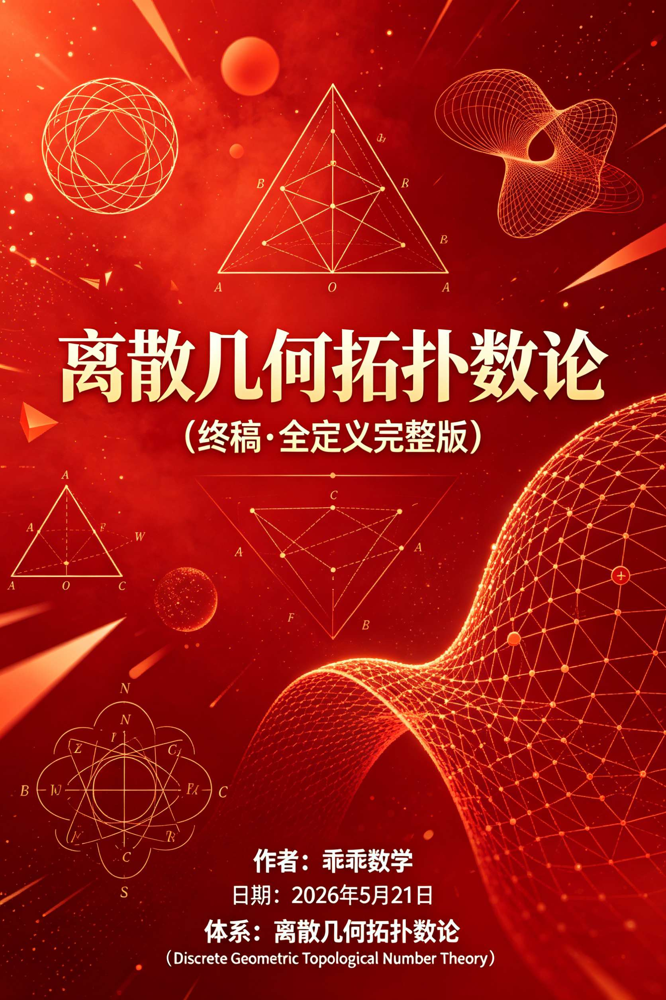
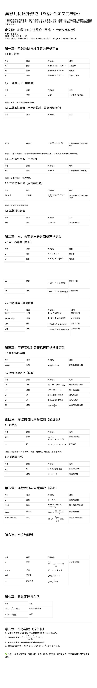
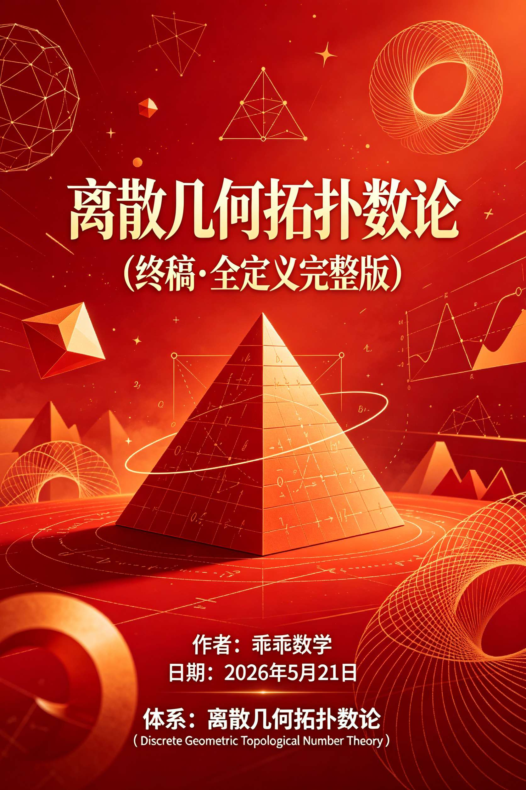

<ArchiveCopyPanel article-id="161295112" />

{"markdown":"PiDliIbnsbvvvJrlk6Xlvrflt7TotavnjJzmg7MgIAo+IOe8luWPt++8mmAxNjEyOTUxMTJgICAKPiDljp/lp4vmlofku7bvvJpg56a75pWj5Yeg5L2V5ouT5omR5pWw6K6657uI56i/5YWo5a6a5LmJ5a6M5pW054mI5LiALTE2MTI5NTExMi5tZGAgIAo+IOi/lOWbnu+8mlvmnKzkuablvZLmoaNdKC96aC9ib29rcy9nb2xkYmFjaC9hcnRpY2xlcy8pIMK3IFvmgLvlhaXlj6NdKC96aC9ib29rcy9hcnRpY2xlcy8pCgojIyDnprvmlaPlh6DkvZXmi5PmiZHmlbDorrrvvIjnu4jnqL/Ct+WFqOWumuS5ieWujOaVtOeJiO+8iQoK5L2c6ICF77ya5LmW5LmW5pWw5a2mCgrml6XmnJ/vvJoyMDI2IOW5tCA1IOaciCAyMSDml6UKCuS9k+ezu++8muemu+aVo+WHoOS9leaLk+aJkeaVsOiuuu+8iCBEaXNjcmV0ZSBHZW9tZXRyaWMgVG9wb2xvZ2ljYWwgTnVtYmVyIFRoZW9yee+8iQoKIVtpbWFnZV0oLi9hc3NldHMvY3NkbmltZy9qcGcvNDdjZWNkMGJjYTMyMDk3YS5qcGcpCgohW2ltYWdlXSguL2Fzc2V0cy9jc2RuaW1nL2pwZy9jMWY4ZWVhYmVkOWYwYTUyLmpwZykKCiFbaW1hZ2VdKC4vYXNzZXRzL2NzZG5pbWcvanBnLzUwZWU5MGQ2Yzk3ZjhlOTMuanBnKQoKIVtpbWFnZV0oLi9hc3NldHMvY3NkbmltZy9qcGcvMjBmYTY5NTg2NGU3MGM1Mi5qcGcpCg==","text":"5YiG57G777ya5ZOl5b635be06LWr54yc5oOzICAK57yW5Y+377yaMTYxMjk1MTEyICAK5Y6f5aeL5paH5Lu277ya56a75pWj5Yeg5L2V5ouT5omR5pWw6K6657uI56i/5YWo5a6a5LmJ5a6M5pW054mI5LiALTE2MTI5NTExMi5tZCAgCui/lOWbnu+8muacrOS5puW9kuahoyDCtyDmgLvlhaXlj6MKCuemu+aVo+WHoOS9leaLk+aJkeaVsOiuuu+8iOe7iOeov8K35YWo5a6a5LmJ5a6M5pW054mI77yJCgrkvZzogIXvvJrkuZbkuZbmlbDlraYKCuaXpeacn++8mjIwMjYg5bm0IDUg5pyIIDIxIOaXpQoK5L2T57O777ya56a75pWj5Yeg5L2V5ouT5omR5pWw6K6677yIIERpc2NyZXRlIEdlb21ldHJpYyBUb3BvbG9naWNhbCBOdW1iZXIgVGhlb3J577yJCgppbWFnZQoKaW1hZ2UKCmltYWdlCgppbWFnZQ=="}

> 分类：哥德巴赫猜想  
> 编号：`161295112`  
> 原始文件：`离散几何拓扑数论终稿全定义完整版一-161295112.md`  
> 返回：[本书归档](/zh/books/goldbach/articles/) · [总入口](/zh/books/articles/)

<ArticlePaperMeta category="哥德巴赫猜想" article-id="161295112" title="离散几何拓扑数论终稿全定义完整版一" paper-kind="研究论文" book-route="/zh/books/goldbach/articles/" overview-route="/zh/books/articles/" summary="日期：2026 年 5 月 21 日" author="乖乖数学" source-file="离散几何拓扑数论终稿全定义完整版一-161295112.md" cover="./assets/csdnimg/jpg/47cecd0bca32097a.jpg" />

## 离散几何拓扑数论（终稿·全定义完整版）

作者：乖乖数学

日期：2026 年 5 月 21 日

体系：离散几何拓扑数论（ Discrete Geometric Topological Number Theory）

