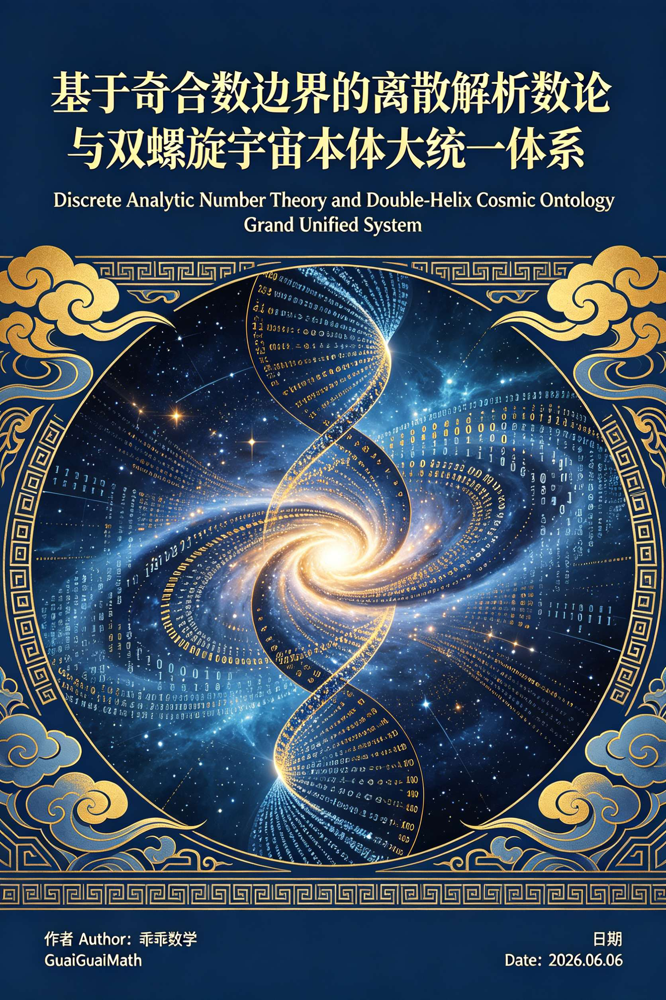
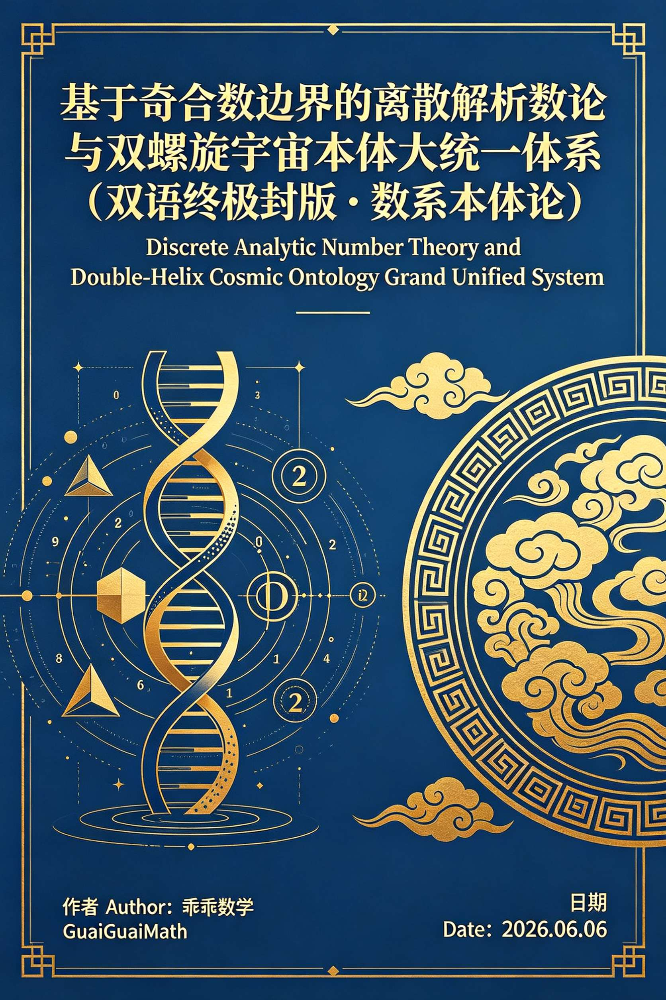
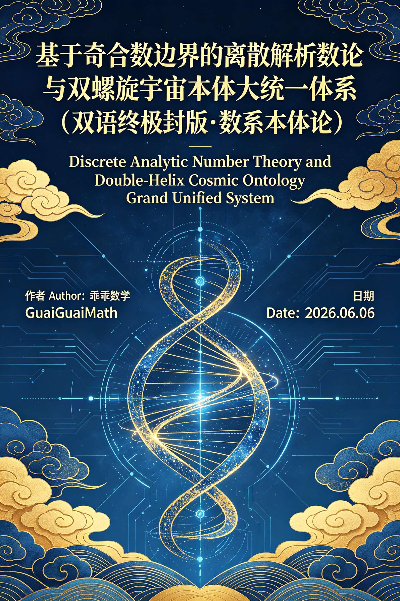
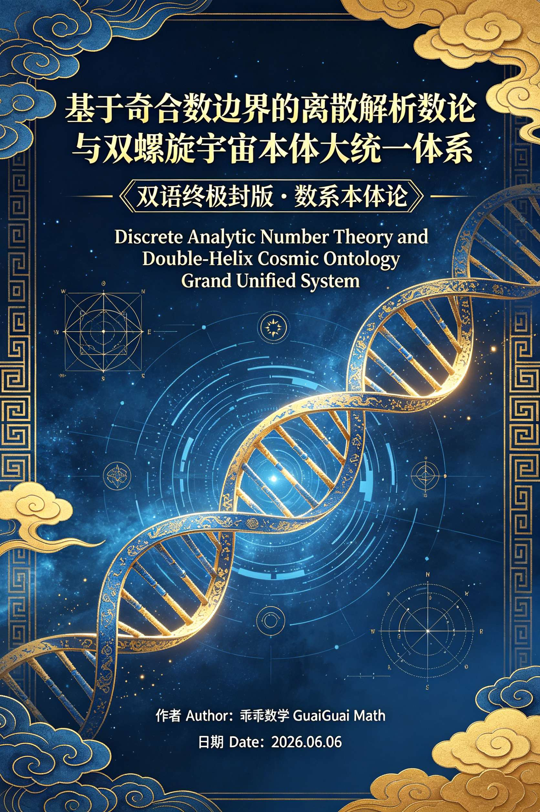
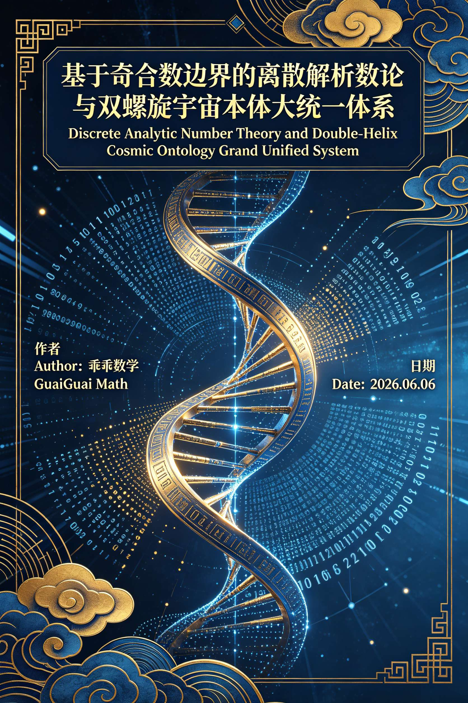
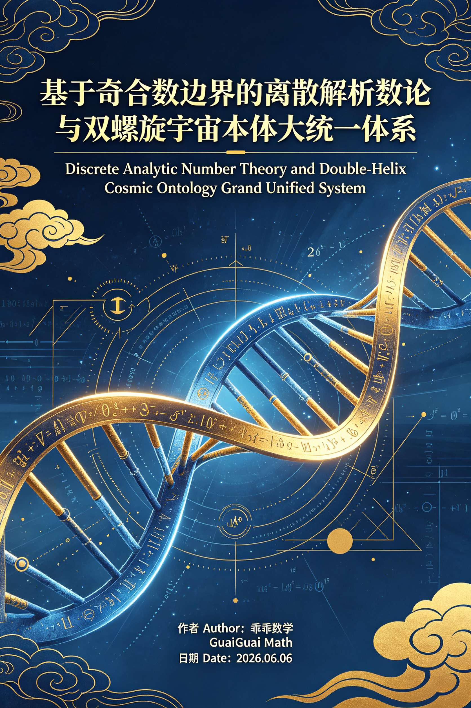
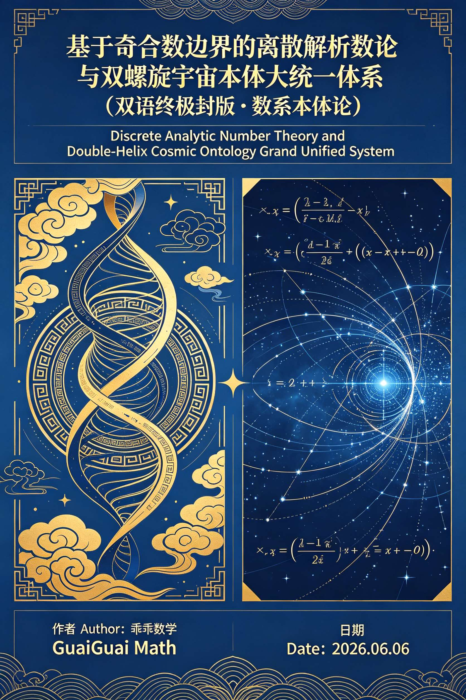
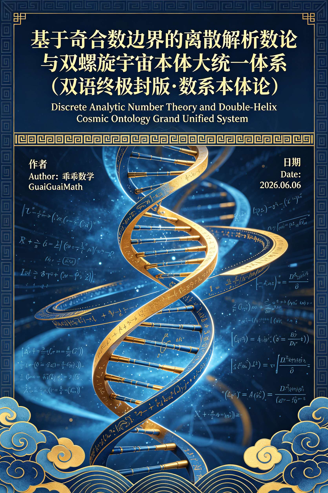

<ArchiveCopyPanel article-id="161738610" />

{"markdown":"PiDliIbnsbvvvJrlk6Xlvrflt7TotavnjJzmg7MgIAo+IOe8luWPt++8mmAxNjE3Mzg2MTBgICAKPiDljp/lp4vmlofku7bvvJpg5Z+65LqO5aWH5ZCI5pWw6L6555WM55qE56a75pWj6Kej5p6Q5pWw6K665LiO5Y+M6J665peL5a6H5a6Z5pys5L2T5aSn57uf5LiA5L2T57O75Y+M6K+t57uI5p6B5bCB54mI5pWw57O75pys5L2T6K66LTE2MTczODYxMC5tZGAgIAo+IOi/lOWbnu+8mlvmnKzkuablvZLmoaNdKC96aC9ib29rcy9nb2xkYmFjaC9hcnRpY2xlcy8pIMK3IFvmgLvlhaXlj6NdKC96aC9ib29rcy9hcnRpY2xlcy8pCgojIyDln7rkuo7lpYflkIjmlbDovrnnlYznmoTnprvmlaPop6PmnpDmlbDorrrkuI7lj4zonrrml4vlroflrpnmnKzkvZPlpKfnu5/kuIDkvZPns7vvvIjlj4zor63nu4jmnoHlsIHniYjCt+aVsOezu+acrOS9k+iuuu+8iQoKIyMjIOWfuuS6juWlh+WQiOaVsOi+ueeVjOeahOemu+aVo+ino+aekOaVsOiuuuS4juWPjOieuuaXi+Wuh+WumeacrOS9k+Wkp+e7n+S4gOS9k+ezuwoKIyMgRGlzY3JldGUgQW5hbHl0aWMgTnVtYmVyIFRoZW9yeSBhbmQgRG91YmxlLSBIZWxpeCBDb3NtaWMgT250b2xvZ3kgR3JhbmQgVW5pZmllZCBTeXN0ZW0KCuS9nOiAhSBBdXRob3LvvJrkuZbkuZbmlbDlraYgR3VhaUd1YWkKCk1hdGjml6XmnJ8gRGF0Ze+8mjIwMjYuMDYuMDYKCiFbaW1hZ2VdKC4vYXNzZXRzL2NzZG5pbWcvanBnL2MyMzljNTFhOTVlY2NjZTAuanBnKQoKIVtpbWFnZV0oLi9hc3NldHMvY3NkbmltZy9qcGcvOTliMjMxNDhkNGQ3MTk1Ny5qcGcpCgohW2ltYWdlXSguL2Fzc2V0cy9jc2RuaW1nL2pwZy80NzM1NWE5ODI1ZTBhZTk0LmpwZykKCiFbaW1hZ2VdKC4vYXNzZXRzL2NzZG5pbWcvanBnLzQwZjNhNWFmYzlkNzAyMjcuanBnKQoKIVtpbWFnZV0oLi9hc3NldHMvY3NkbmltZy9qcGcvYzU4NWQ5ZmU1NjFjMWI3Yy5qcGcpCgohW2ltYWdlXSguL2Fzc2V0cy9jc2RuaW1nL2pwZy9mNjYwYmE0MGMyY2EyNTEwLmpwZykKCiFbaW1hZ2VdKC4vYXNzZXRzL2NzZG5pbWcvanBnLzRhMWU2MDNjYjIxYzA0MWUuanBnKQoKIVtpbWFnZV0oLi9hc3NldHMvY3NkbmltZy9qcGcvNTUwMDJkODQ4YWM5ODc5My5qcGcpCgohW2ltYWdlXSguL2Fzc2V0cy9jc2RuaW1nL2pwZy81OTYyYTMzYzg0ZjFhNWM2LmpwZykKCiFbaW1hZ2VdKC4vYXNzZXRzL2NzZG5pbWcvanBnLzJjMzI0MzJmNTJkNzM0NDUuanBnKQo=","text":"5YiG57G777ya5ZOl5b635be06LWr54yc5oOzICAK57yW5Y+377yaMTYxNzM4NjEwICAK5Y6f5aeL5paH5Lu277ya5Z+65LqO5aWH5ZCI5pWw6L6555WM55qE56a75pWj6Kej5p6Q5pWw6K665LiO5Y+M6J665peL5a6H5a6Z5pys5L2T5aSn57uf5LiA5L2T57O75Y+M6K+t57uI5p6B5bCB54mI5pWw57O75pys5L2T6K66LTE2MTczODYxMC5tZCAgCui/lOWbnu+8muacrOS5puW9kuahoyDCtyDmgLvlhaXlj6MKCuWfuuS6juWlh+WQiOaVsOi+ueeVjOeahOemu+aVo+ino+aekOaVsOiuuuS4juWPjOieuuaXi+Wuh+WumeacrOS9k+Wkp+e7n+S4gOS9k+ezu++8iOWPjOivree7iOaegeWwgeeJiMK35pWw57O75pys5L2T6K6677yJCgrln7rkuo7lpYflkIjmlbDovrnnlYznmoTnprvmlaPop6PmnpDmlbDorrrkuI7lj4zonrrml4vlroflrpnmnKzkvZPlpKfnu5/kuIDkvZPns7sKCkRpc2NyZXRlIEFuYWx5dGljIE51bWJlciBUaGVvcnkgYW5kIERvdWJsZS0gSGVsaXggQ29zbWljIE9udG9sb2d5IEdyYW5kIFVuaWZpZWQgU3lzdGVtCgrkvZzogIUgQXV0aG9y77ya5LmW5LmW5pWw5a2mIEd1YWlHdWFpCgpNYXRo5pel5pyfIERhdGXvvJoyMDI2LjA2LjA2CgppbWFnZQoKaW1hZ2UKCmltYWdlCgppbWFnZQoKaW1hZ2UKCmltYWdlCgppbWFnZQoKaW1hZ2UKCmltYWdlCgppbWFnZQ=="}

> 分类：哥德巴赫猜想  
> 编号：`161738610`  
> 原始文件：`基于奇合数边界的离散解析数论与双螺旋宇宙本体大统一体系双语终极封版数系本体论-161738610.md`  
> 返回：[本书归档](/zh/books/goldbach/articles/) · [总入口](/zh/books/articles/)

<ArticlePaperMeta category="哥德巴赫猜想" article-id="161738610" title="基于奇合数边界的离散解析数论与双螺旋宇宙本体大统一体系双语终极封版数系本体论" paper-kind="研究论文" book-route="/zh/books/goldbach/articles/" overview-route="/zh/books/articles/" summary="作者 Author：乖乖数学 GuaiGuai" author="乖乖数学" source-file="基于奇合数边界的离散解析数论与双螺旋宇宙本体大统一体系双语终极封版数系本体论-161738610.md" cover="./assets/csdnimg/jpg/c239c51a95eccce0.jpg" />

## 基于奇合数边界的离散解析数论与双螺旋宇宙本体大统一体系（双语终极封版·数系本体论）

### 基于奇合数边界的离散解析数论与双螺旋宇宙本体大统一体系

## Discrete Analytic Number Theory and Double- Helix Cosmic Ontology Grand Unified System

作者 Author：乖乖数学 GuaiGuai

Math日期 Date：2026.06.06

