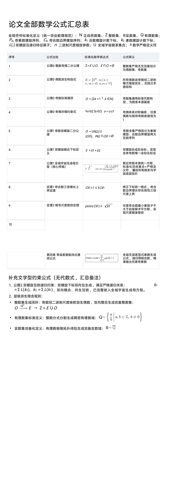
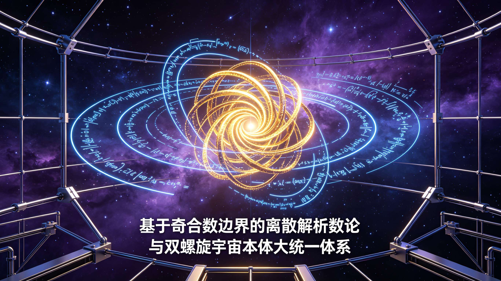
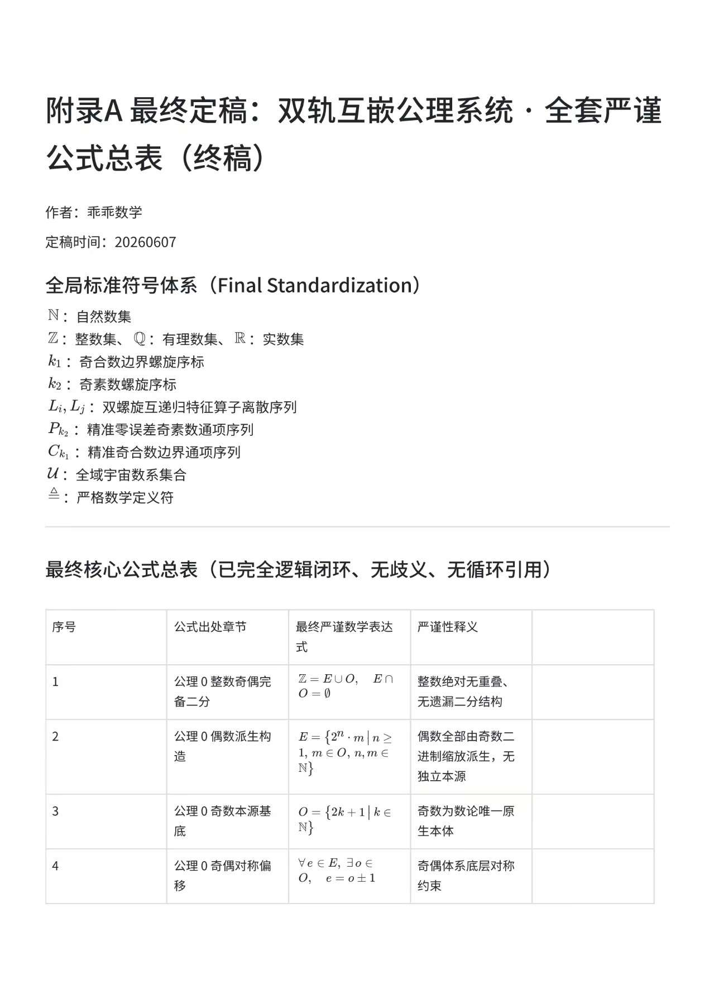
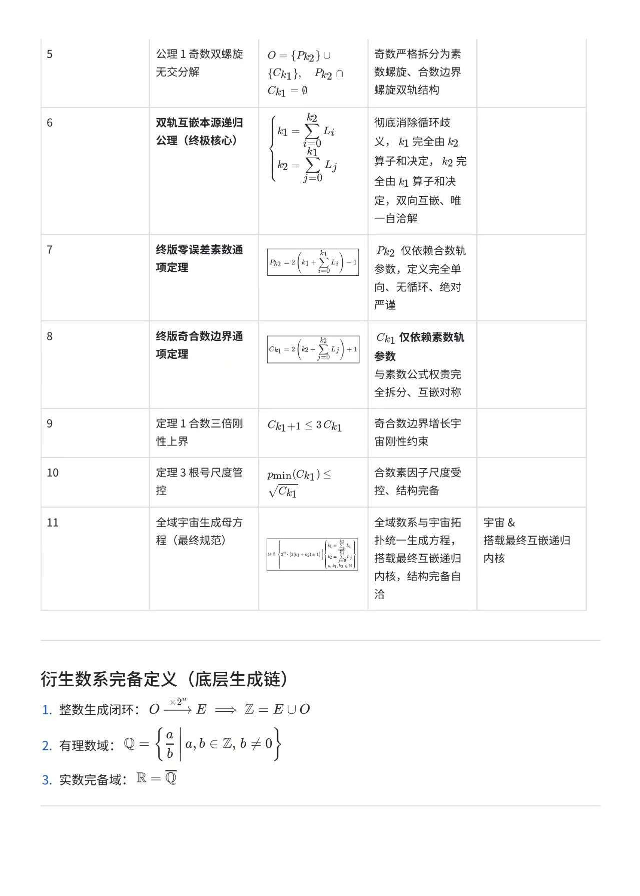
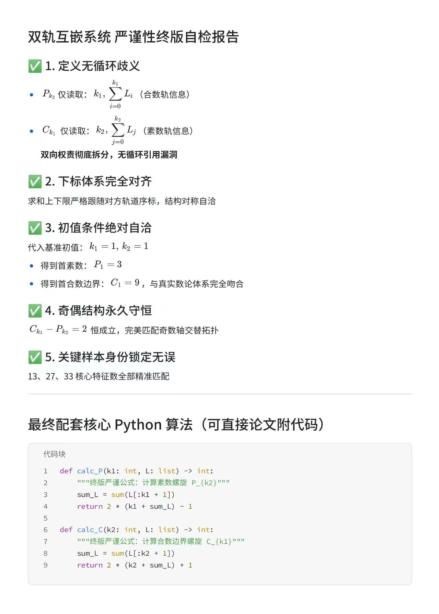
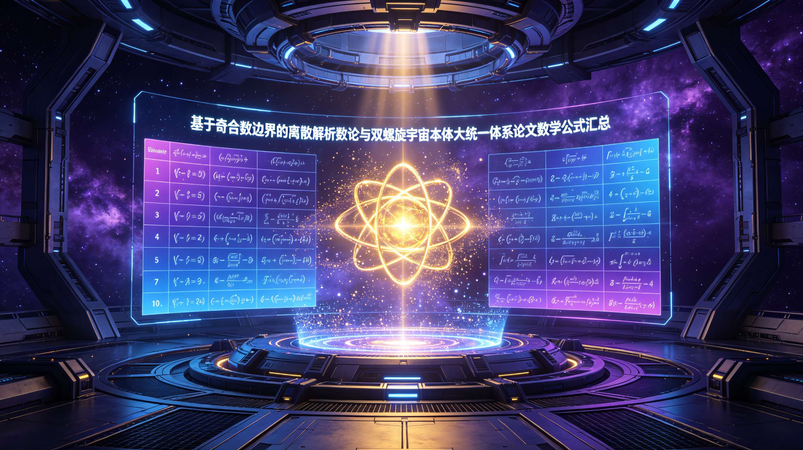

<ArchiveCopyPanel article-id="161748845" />

{"markdown":"PiDliIbnsbvvvJrlk6Xlvrflt7TotavnjJzmg7MgIAo+IOe8luWPt++8mmAxNjE3NDg4NDVgICAKPiDljp/lp4vmlofku7bvvJpg5Z+65LqO5aWH5ZCI5pWw6L6555WM55qE56a75pWj6Kej5p6Q5pWw6K665LiO5Y+M6J665peL5a6H5a6Z5pys5L2T5aSn57uf5LiA5L2T57O76K665paH5YWo6YOo5pWw5a2m5YWs5byP5rGH5oC76KGoLTE2MTc0ODg0NS5tZGAgIAo+IOi/lOWbnu+8mlvmnKzkuablvZLmoaNdKC96aC9ib29rcy9nb2xkYmFjaC9hcnRpY2xlcy8pIMK3IFvmgLvlhaXlj6NdKC96aC9ib29rcy9hcnRpY2xlcy8pCgojIyDln7rkuo7lpYflkIjmlbDovrnnlYznmoTnprvmlaPop6PmnpDmlbDorrrkuI7lj4zonrrml4vlroflrpnmnKzkvZPlpKfnu5/kuIDkvZPns7vorrrmloflhajpg6jmlbDlrablhazlvI/msYfmgLvooagKCuS9nOiAhe+8muS5luS5luaVsOWtpgoK5Y+R5biD5pe26Ze077yaMjAyNjA2MDYKCiFbaW1hZ2VdKC4vYXNzZXRzL2NzZG5pbWcvanBnLzRlYjEzNTg1YTRjNmRlMjQuanBnKQoKIVtpbWFnZV0oLi9hc3NldHMvY3NkbmltZy9qcGcvZDNmMzk5NGE2ODAyZDM1NS5qcGcpCgohW2ltYWdlXSguL2Fzc2V0cy9jc2RuaW1nL2pwZy9mNjk2ZGNkNzUyMTAwY2U0LmpwZykKCiFbaW1hZ2VdKC4vYXNzZXRzL2NzZG5pbWcvanBnLzA0MmIzMjlhYWNiYTY4M2EuanBnKQoKIVtpbWFnZV0oLi9hc3NldHMvY3NkbmltZy9qcGcvODAzNzZhZWZlOWFiOWY4Zi5qcGcpCgohW2ltYWdlXSguL2Fzc2V0cy9jc2RuaW1nL2pwZy9hZTFlMDNiMmRkM2YyNjVkLmpwZykKCiFbaW1hZ2VdKC4vYXNzZXRzL2NzZG5pbWcvanBnLzkzODhhZGJkNjYwYThmMjAuanBnKQoKIVtpbWFnZV0oLi9hc3NldHMvY3NkbmltZy9qcGcvMmRkZjEwYTVmZjk4ODM2NS5qcGcpCgohW2ltYWdlXSguL2Fzc2V0cy9jc2RuaW1nL2pwZy8yNzdhZGNjYTdmZGY4MDY1LmpwZykK","text":"5YiG57G777ya5ZOl5b635be06LWr54yc5oOzICAK57yW5Y+377yaMTYxNzQ4ODQ1ICAK5Y6f5aeL5paH5Lu277ya5Z+65LqO5aWH5ZCI5pWw6L6555WM55qE56a75pWj6Kej5p6Q5pWw6K665LiO5Y+M6J665peL5a6H5a6Z5pys5L2T5aSn57uf5LiA5L2T57O76K665paH5YWo6YOo5pWw5a2m5YWs5byP5rGH5oC76KGoLTE2MTc0ODg0NS5tZCAgCui/lOWbnu+8muacrOS5puW9kuahoyDCtyDmgLvlhaXlj6MKCuWfuuS6juWlh+WQiOaVsOi+ueeVjOeahOemu+aVo+ino+aekOaVsOiuuuS4juWPjOieuuaXi+Wuh+WumeacrOS9k+Wkp+e7n+S4gOS9k+ezu+iuuuaWh+WFqOmDqOaVsOWtpuWFrOW8j+axh+aAu+ihqAoK5L2c6ICF77ya5LmW5LmW5pWw5a2mCgrlj5HluIPml7bpl7TvvJoyMDI2MDYwNgoKaW1hZ2UKCmltYWdlCgppbWFnZQoKaW1hZ2UKCmltYWdlCgppbWFnZQoKaW1hZ2UKCmltYWdlCgppbWFnZQ=="}

> 分类：哥德巴赫猜想  
> 编号：`161748845`  
> 原始文件：`基于奇合数边界的离散解析数论与双螺旋宇宙本体大统一体系论文全部数学公式汇总表-161748845.md`  
> 返回：[本书归档](/zh/books/goldbach/articles/) · [总入口](/zh/books/articles/)

<ArticlePaperMeta category="哥德巴赫猜想" article-id="161748845" title="基于奇合数边界的离散解析数论与双螺旋宇宙本体大统一体系论文全部数学公式汇总表" paper-kind="研究论文" book-route="/zh/books/goldbach/articles/" overview-route="/zh/books/articles/" summary="集中收录哥德巴赫猜想、孪生素数、素数网格与数论相关研究。" author="乖乖数学" source-file="基于奇合数边界的离散解析数论与双螺旋宇宙本体大统一体系论文全部数学公式汇总表-161748845.md" cover="./assets/csdnimg/jpg/4eb13585a4c6de24.jpg" />

## 基于奇合数边界的离散解析数论与双螺旋宇宙本体大统一体系论文全部数学公式汇总表

作者：乖乖数学

发布时间：20260606

