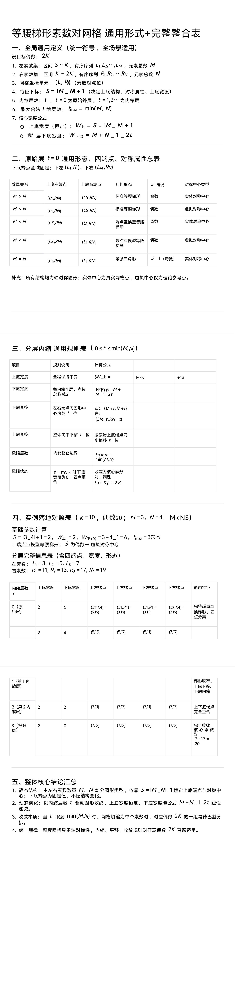

<ArchiveCopyPanel article-id="162013513" />

{"markdown":"PiDliIbnsbvvvJrlk6Xlvrflt7TotavnjJzmg7MgIAo+IOe8luWPt++8mmAxNjIwMTM1MTNgICAKPiDljp/lp4vmlofku7bvvJpg562J6IWw5qKv5b2i57Sg5pWw5a+5572R5qC86YCa55So5b2i5byP5a6M5pW05pW05ZCI6KGoLTE2MjAxMzUxMy5tZGAgIAo+IOi/lOWbnu+8mlvmnKzkuablvZLmoaNdKC96aC9ib29rcy9nb2xkYmFjaC9hcnRpY2xlcy8pIMK3IFvmgLvlhaXlj6NdKC96aC9ib29rcy9hcnRpY2xlcy8pCgohW2ltYWdlXSguL2Fzc2V0cy9jc2RuaW1nL2pwZy8yZGMwMjc3MDVlOWZkZWM0LmpwZykKCiMjIOetieiFsOair+W9oue0oOaVsOWvuee9keagvOmAmueUqOW9ouW8jyvlrozmlbTmlbTlkIjooagKCuS9nOiAhe+8muS5luS5luaVsOWtpgoKIVtpbWFnZV0oLi9hc3NldHMvY3NkbmltZy9qcGcvYzgyODI4YzhmZmQyMzEyMy5qcGcpCgohW2ltYWdlXSguL2Fzc2V0cy9jc2RuaW1nL2pwZy8xMWRhMWJkYjI5NGMzMTMzLmpwZykK","text":"5YiG57G777ya5ZOl5b635be06LWr54yc5oOzICAK57yW5Y+377yaMTYyMDEzNTEzICAK5Y6f5aeL5paH5Lu277ya562J6IWw5qKv5b2i57Sg5pWw5a+5572R5qC86YCa55So5b2i5byP5a6M5pW05pW05ZCI6KGoLTE2MjAxMzUxMy5tZCAgCui/lOWbnu+8muacrOS5puW9kuahoyDCtyDmgLvlhaXlj6MKCmltYWdlCgrnrYnohbDmoq/lvaLntKDmlbDlr7nnvZHmoLzpgJrnlKjlvaLlvI8r5a6M5pW05pW05ZCI6KGoCgrkvZzogIXvvJrkuZbkuZbmlbDlraYKCmltYWdlCgppbWFnZQ=="}

> 分类：哥德巴赫猜想  
> 编号：`162013513`  
> 原始文件：`等腰梯形素数对网格通用形式完整整合表-162013513.md`  
> 返回：[本书归档](/zh/books/goldbach/articles/) · [总入口](/zh/books/articles/)

<ArticlePaperMeta category="哥德巴赫猜想" article-id="162013513" title="等腰梯形素数对网格通用形式完整整合表" paper-kind="研究论文" book-route="/zh/books/goldbach/articles/" overview-route="/zh/books/articles/" summary="集中收录哥德巴赫猜想、孪生素数、素数网格与数论相关研究。" author="乖乖数学" source-file="等腰梯形素数对网格通用形式完整整合表-162013513.md" cover="./assets/csdnimg/jpg/2dc027705e9fdec4.jpg" />

## 等腰梯形素数对网格通用形式+完整整合表

作者：乖乖数学

