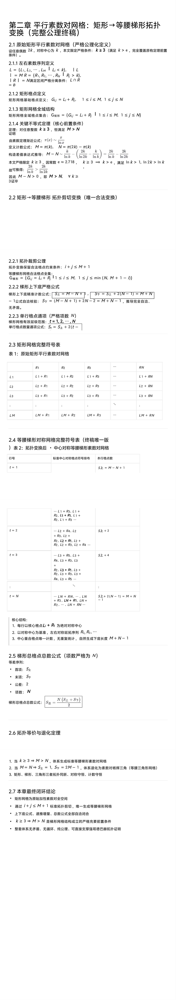

<ArchiveCopyPanel article-id="162014218" />

{"markdown":"PiDliIbnsbvvvJrlk6Xlvrflt7TotavnjJzmg7MgIAo+IOe8luWPt++8mmAxNjIwMTQyMThgICAKPiDljp/lp4vmlofku7bvvJpg56ys5LqM56ug5bmz6KGM57Sg5pWw5a+5572R5qC855+p5b2i562J6IWw5qKv5b2i5ouT5omR5Y+Y5o2i5a6M5pW05YWs55CG57uI56i/LTE2MjAxNDIxOC5tZGAgIAo+IOi/lOWbnu+8mlvmnKzkuablvZLmoaNdKC96aC9ib29rcy9nb2xkYmFjaC9hcnRpY2xlcy8pIMK3IFvmgLvlhaXlj6NdKC96aC9ib29rcy9hcnRpY2xlcy8pCgohW2ltYWdlXSguL2Fzc2V0cy9jc2RuaW1nL2pwZy9kNWYyMjM3ZWE0N2JlYjdmLmpwZykKCiMjIOesrOS6jOeroCDlubPooYzntKDmlbDlr7nnvZHmoLzvvJrnn6nlvaLihpLnrYnohbDmoq/lvaLmi5PmiZHlj5jmjaLvvIjlrozmlbTlhaznkIbnu4jnqL/vvIkKCuS9nOiAhe+8muS5luS5luaVsOWtpgoKIVtpbWFnZV0oLi9hc3NldHMvY3NkbmltZy9qcGcvM2E0ZmZjMzQ4ZDJiZDZiNi5qcGcpCgohW2ltYWdlXSguL2Fzc2V0cy9jc2RuaW1nL2pwZy84Mjk4NjAyYmY3MDc1OTAwLmpwZykKCiFbaW1hZ2VdKC4vYXNzZXRzL2NzZG5pbWcvanBnLzU2ZWNiM2U5MmU5ZDkyMGIuanBnKQo=","text":"5YiG57G777ya5ZOl5b635be06LWr54yc5oOzICAK57yW5Y+377yaMTYyMDE0MjE4ICAK5Y6f5aeL5paH5Lu277ya56ys5LqM56ug5bmz6KGM57Sg5pWw5a+5572R5qC855+p5b2i562J6IWw5qKv5b2i5ouT5omR5Y+Y5o2i5a6M5pW05YWs55CG57uI56i/LTE2MjAxNDIxOC5tZCAgCui/lOWbnu+8muacrOS5puW9kuahoyDCtyDmgLvlhaXlj6MKCmltYWdlCgrnrKzkuoznq6Ag5bmz6KGM57Sg5pWw5a+5572R5qC877ya55+p5b2i4oaS562J6IWw5qKv5b2i5ouT5omR5Y+Y5o2i77yI5a6M5pW05YWs55CG57uI56i/77yJCgrkvZzogIXvvJrkuZbkuZbmlbDlraYKCmltYWdlCgppbWFnZQoKaW1hZ2U="}

> 分类：哥德巴赫猜想  
> 编号：`162014218`  
> 原始文件：`第二章平行素数对网格矩形等腰梯形拓扑变换完整公理终稿-162014218.md`  
> 返回：[本书归档](/zh/books/goldbach/articles/) · [总入口](/zh/books/articles/)

<ArticlePaperMeta category="哥德巴赫猜想" article-id="162014218" title="第二章平行素数对网格矩形等腰梯形拓扑变换完整公理终稿" paper-kind="研究论文" book-route="/zh/books/goldbach/articles/" overview-route="/zh/books/articles/" summary="集中收录哥德巴赫猜想、孪生素数、素数网格与数论相关研究。" author="乖乖数学" source-file="第二章平行素数对网格矩形等腰梯形拓扑变换完整公理终稿-162014218.md" cover="./assets/csdnimg/jpg/d5f2237ea47beb7f.jpg" />

## 第二章 平行素数对网格：矩形→等腰梯形拓扑变换（完整公理终稿）

作者：乖乖数学

