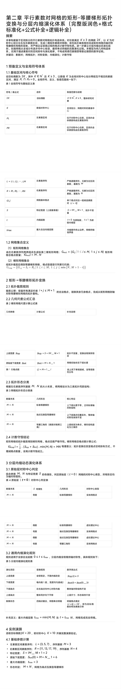
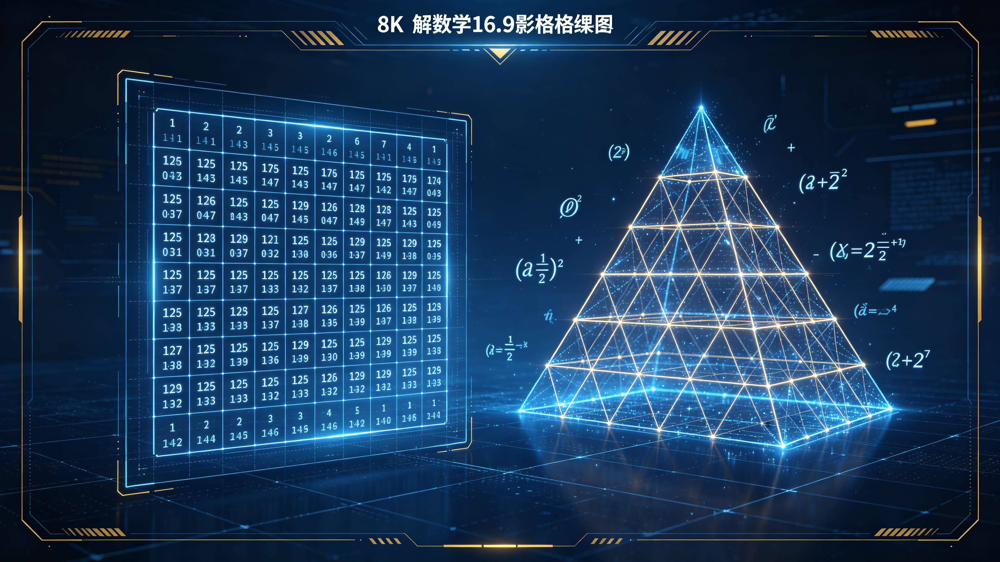
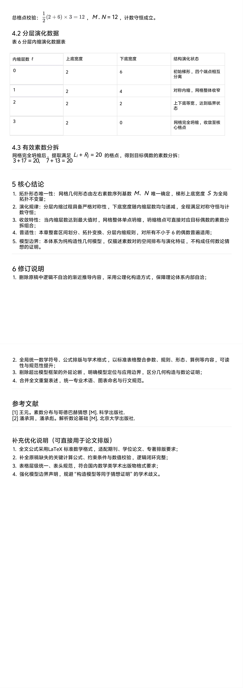

<ArchiveCopyPanel article-id="162014393" />

{"markdown":"PiDliIbnsbvvvJrlk6Xlvrflt7TotavnjJzmg7MgIAo+IOe8luWPt++8mmAxNjIwMTQzOTNgICAKPiDljp/lp4vmlofku7bvvJpg56ys5LqM56ug5bmz6KGM57Sg5pWw5a+5572R5qC855qE55+p5b2iLeetieiFsOair+W9ouaLk+aJkeWPmOaNouS4juWIhuWxguWGhee8qea8lOWMluS9k+ezu+WujOaVtOeJiOa2puiJsuagvOW8j+agh+WHhuWMluWFrOW8j+ihpeWFqOmAu+i+keihpeWFqC0xNjIwMTQzOTMubWRgICAKPiDov5Tlm57vvJpb5pys5Lmm5b2S5qGjXSgvemgvYm9va3MvZ29sZGJhY2gvYXJ0aWNsZXMvKSDCtyBb5oC75YWl5Y+jXSgvemgvYm9va3MvYXJ0aWNsZXMvKQoKIyMg56ys5LqM56ugIOW5s+ihjOe0oOaVsOWvuee9keagvOeahOefqeW9oi3nrYnohbDmoq/lvaLmi5PmiZHlj5jmjaLkuI7liIblsYLlhoXnvKnmvJTljJbkvZPns7vvvIjlrozmlbTniYjmtqboibIr5qC85byP5qCH5YeG5YyWK+WFrOW8j+ihpeWFqCvpgLvovpHooaXlhajvvIkKCuS9nOiAhe+8muS5luS5luaVsOWtpgoKIVtpbWFnZV0oLi9hc3NldHMvY3NkbmltZy9qcGcvMjQxMmZkMTk5MTY4MDY4OC5qcGcpCgohW2ltYWdlXSguL2Fzc2V0cy9jc2RuaW1nL2pwZy82YWRkZjVhMjc4NTAzYTg1LmpwZykKCiFbaW1hZ2VdKC4vYXNzZXRzL2NzZG5pbWcvanBnLzYwNzk0MDA1MDlmZmVlZDAuanBnKQoKIVtpbWFnZV0oLi9hc3NldHMvY3NkbmltZy9qcGcvYjViODJjNmIxZmU5NWMzNy5qcGcpCgohW2ltYWdlXSguL2Fzc2V0cy9jc2RuaW1nL2pwZy9iNjk5NzQwOTJlYzViMmIxLmpwZykKCiFbaW1hZ2VdKC4vYXNzZXRzL2NzZG5pbWcvanBnL2YwYTIwMTkwZjBmMzY2ZWIuanBnKQoKIVtpbWFnZV0oLi9hc3NldHMvY3NkbmltZy9qcGcvMDRmZWRkYTkzOTFmNDE5OC5qcGcpCgohW2ltYWdlXSguL2Fzc2V0cy9jc2RuaW1nL2pwZy8wYjQ0ZmFhNjc2ZDE0MGI4LmpwZykKCiFbaW1hZ2VdKC4vYXNzZXRzL2NzZG5pbWcvanBnLzBmNTVkOTBkMGEwNmQ4NDIuanBnKQo=","text":"5YiG57G777ya5ZOl5b635be06LWr54yc5oOzICAK57yW5Y+377yaMTYyMDE0MzkzICAK5Y6f5aeL5paH5Lu277ya56ys5LqM56ug5bmz6KGM57Sg5pWw5a+5572R5qC855qE55+p5b2iLeetieiFsOair+W9ouaLk+aJkeWPmOaNouS4juWIhuWxguWGhee8qea8lOWMluS9k+ezu+WujOaVtOeJiOa2puiJsuagvOW8j+agh+WHhuWMluWFrOW8j+ihpeWFqOmAu+i+keihpeWFqC0xNjIwMTQzOTMubWQgIArov5Tlm57vvJrmnKzkuablvZLmoaMgwrcg5oC75YWl5Y+jCgrnrKzkuoznq6Ag5bmz6KGM57Sg5pWw5a+5572R5qC855qE55+p5b2iLeetieiFsOair+W9ouaLk+aJkeWPmOaNouS4juWIhuWxguWGhee8qea8lOWMluS9k+ezu++8iOWujOaVtOeJiOa2puiJsivmoLzlvI/moIflh4bljJYr5YWs5byP6KGl5YWoK+mAu+i+keihpeWFqO+8iQoK5L2c6ICF77ya5LmW5LmW5pWw5a2mCgppbWFnZQoKaW1hZ2UKCmltYWdlCgppbWFnZQoKaW1hZ2UKCmltYWdlCgppbWFnZQoKaW1hZ2UKCmltYWdl"}

> 分类：哥德巴赫猜想  
> 编号：`162014393`  
> 原始文件：`第二章平行素数对网格的矩形-等腰梯形拓扑变换与分层内缩演化体系完整版润色格式标准化公式补全逻辑补全-162014393.md`  
> 返回：[本书归档](/zh/books/goldbach/articles/) · [总入口](/zh/books/articles/)

<ArticlePaperMeta category="哥德巴赫猜想" article-id="162014393" title="第二章平行素数对网格的矩形-等腰梯形拓扑变换与分层内缩演化体系完整版润色格式标准化公式补全逻辑补全" paper-kind="研究论文" book-route="/zh/books/goldbach/articles/" overview-route="/zh/books/articles/" summary="集中收录哥德巴赫猜想、孪生素数、素数网格与数论相关研究。" author="乖乖数学" source-file="第二章平行素数对网格的矩形-等腰梯形拓扑变换与分层内缩演化体系完整版润色格式标准化公式补全逻辑补全-162014393.md" cover="./assets/csdnimg/jpg/2412fd1991680688.jpg" />

## 第二章 平行素数对网格的矩形-等腰梯形拓扑变换与分层内缩演化体系（完整版润色+格式标准化+公式补全+逻辑补全）

作者：乖乖数学

