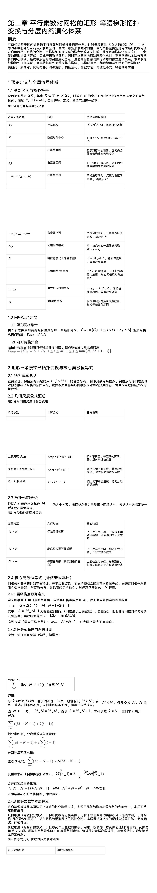
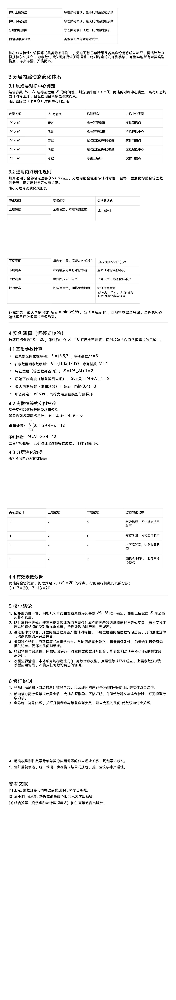

<ArchiveCopyPanel article-id="162014549" />

{"markdown":"PiDliIbnsbvvvJrlk6Xlvrflt7TotavnjJzmg7MgIAo+IOe8luWPt++8mmAxNjIwMTQ1NDlgICAKPiDljp/lp4vmlofku7bvvJpg56ys5LqM56ug5bmz6KGM57Sg5pWw5a+5572R5qC855qE55+p5b2iLeetieiFsOair+W9ouaLk+aJkeWPmOaNouS4juWIhuWxguWGhee8qea8lOWMluS9k+ezuy0xNjIwMTQ1NDkubWRgICAKPiDov5Tlm57vvJpb5pys5Lmm5b2S5qGjXSgvemgvYm9va3MvZ29sZGJhY2gvYXJ0aWNsZXMvKSDCtyBb5oC75YWl5Y+jXSgvemgvYm9va3MvYXJ0aWNsZXMvKQoKIyMg56ys5LqM56ugIOW5s+ihjOe0oOaVsOWvuee9keagvOeahOefqeW9oi3nrYnohbDmoq/lvaLmi5PmiZHlj5jmjaLkuI7liIblsYLlhoXnvKnmvJTljJbkvZPns7sKCuS9nOiAhe+8muS5luS5luaVsOWtpgoKIVtpbWFnZV0oLi9hc3NldHMvY3NkbmltZy9qcGcvZDAwMjllMjk0ZjRlMjlmMC5qcGcpCgohW2ltYWdlXSguL2Fzc2V0cy9jc2RuaW1nL2pwZy83NTA3MGI5NjVkYzNmYThiLmpwZykKCiFbaW1hZ2VdKC4vYXNzZXRzL2NzZG5pbWcvanBnLzgyZDFjMjA2M2VjZjBlY2QuanBnKQoKIVtpbWFnZV0oLi9hc3NldHMvY3NkbmltZy9qcGcvODI5NjE4ODU1MjgwNTUyYi5qcGcpCgohW2ltYWdlXSguL2Fzc2V0cy9jc2RuaW1nL2pwZy84YjcwYjAzMzMxZmYwYzUyLmpwZykK","text":"5YiG57G777ya5ZOl5b635be06LWr54yc5oOzICAK57yW5Y+377yaMTYyMDE0NTQ5ICAK5Y6f5aeL5paH5Lu277ya56ys5LqM56ug5bmz6KGM57Sg5pWw5a+5572R5qC855qE55+p5b2iLeetieiFsOair+W9ouaLk+aJkeWPmOaNouS4juWIhuWxguWGhee8qea8lOWMluS9k+ezuy0xNjIwMTQ1NDkubWQgIArov5Tlm57vvJrmnKzkuablvZLmoaMgwrcg5oC75YWl5Y+jCgrnrKzkuoznq6Ag5bmz6KGM57Sg5pWw5a+5572R5qC855qE55+p5b2iLeetieiFsOair+W9ouaLk+aJkeWPmOaNouS4juWIhuWxguWGhee8qea8lOWMluS9k+ezuwoK5L2c6ICF77ya5LmW5LmW5pWw5a2mCgppbWFnZQoKaW1hZ2UKCmltYWdlCgppbWFnZQoKaW1hZ2U="}

> 分类：哥德巴赫猜想  
> 编号：`162014549`  
> 原始文件：`第二章平行素数对网格的矩形-等腰梯形拓扑变换与分层内缩演化体系-162014549.md`  
> 返回：[本书归档](/zh/books/goldbach/articles/) · [总入口](/zh/books/articles/)

<ArticlePaperMeta category="哥德巴赫猜想" article-id="162014549" title="第二章平行素数对网格的矩形-等腰梯形拓扑变换与分层内缩演化体系" paper-kind="研究论文" book-route="/zh/books/goldbach/articles/" overview-route="/zh/books/articles/" summary="集中收录哥德巴赫猜想、孪生素数、素数网格与数论相关研究。" author="乖乖数学" source-file="第二章平行素数对网格的矩形-等腰梯形拓扑变换与分层内缩演化体系-162014549.md" cover="./assets/csdnimg/jpg/d0029e294f4e29f0.jpg" />

## 第二章 平行素数对网格的矩形-等腰梯形拓扑变换与分层内缩演化体系

作者：乖乖数学

