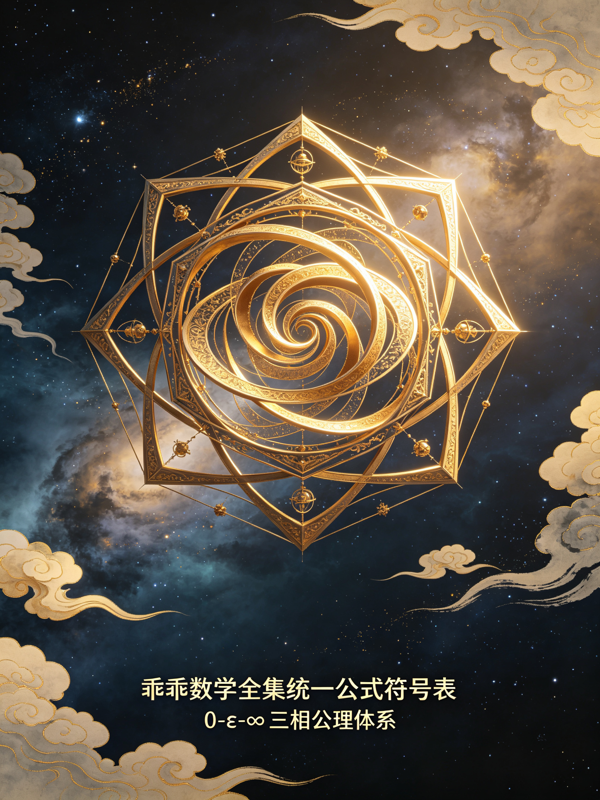
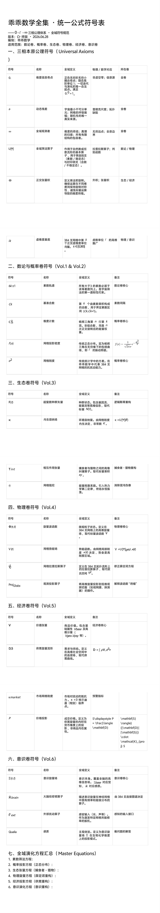

<ArchiveCopyPanel article-id="162316416" />

{"markdown":"PiDliIbnsbvvvJrlk6Xlvrflt7TotavnjJzmg7MgIAo+IOe8luWPt++8mmAxNjIzMTY0MTZgICAKPiDljp/lp4vmlofku7bvvJpg5LmW5LmW5pWw5a2m5YWo6ZuG57uf5LiA5YWs5byP56ym5Y+36KGoLTE2MjMxNjQxNi5tZGAgIAo+IOi/lOWbnu+8mlvmnKzkuablvZLmoaNdKC96aC9ib29rcy9nb2xkYmFjaC9hcnRpY2xlcy8pIMK3IFvmgLvlhaXlj6NdKC96aC9ib29rcy9hcnRpY2xlcy8pCgohW+S5luS5luaVsOWtpuWFqOmbhuWwgemdol0oLi9hc3NldHMvY3NkbmltZy9qcGcvYTg4OGNhNjNmYWUxOWQ3ZC5qcGcpCgojIyDkuZbkuZbmlbDlrablhajpm4bCt+e7n+S4gOWFrOW8j+espuWPt+ihqAoK57yW5Yi277ya5LmW5LmW5pWw5a2mCgrpgILnlKjojIPlm7TvvJrmlbDorrrljbfjgIHmpoLnjofljbfjgIHnlJ/mgIHljbfjgIHniannkIbljbfjgIHnu4/mtY7ljbfjgIHmhI/or4bljbcKCi0tLQoKIyMjIOS4gOOAgeS4ieebuOacrOWOn+WFrOeQhuespuWPtyAoVW5pdmVyc2FsIEF4aW9tcykKCiFb5LiJ55u45pys5Y6f5YWs55CG5L2T57O7XSguL2Fzc2V0cy9jc2RuaW1nL2pwZy83OTgxYWYyYjhkZjIwOWYxLmpwZykKCi0tLQoKIyMjIOWbm+OAgeeJqeeQhuWNt+espuWPtyAoVm9sLjQpCgohW+eJqeeQhuWNt+aXi+mHj+azouWHveaVsF0oLi9hc3NldHMvY3NkbmltZy9qcGcvM2JjMjcyMDlmYjRmZjcyNC5qcGcpCgotLS0KCiMjIyDkupTjgIHnu4/mtY7ljbfnrKblj7cgKFZvbC41KQoKIVvnu4/mtY7ljbfku7flgLzlvKDph49dKC4vYXNzZXRzL2NzZG5pbWcvanBnLzhhZDFkYzkxODFiZTZjMjAuanBnKQoKLS0tCgojIyMg5YWt44CB5oSP6K+G5Y2356ym5Y+3IChWb2wuNikKCiFb5oSP6K+G5Y235oSP6K+G5peL6YeP5Zy6XSguL2Fzc2V0cy9jc2RuaW1nL2pwZy8xZGRiZGQ5NjQyOWIyODkyLmpwZykKCi0tLQoKIyMjIOS4g+OAgeWFqOWfn+a8lOWMluaWueeoi+axh+aAuyAoTWFzdGVyIEVxdWF0aW9ucykKCiFb5YWo5Z+f5ryU5YyW5pa556iL5rGH5oC7XSguL2Fzc2V0cy9jc2RuaW1nL2pwZy83NThmZDYwNGFlMzg4N2RhLmpwZykKCi0gCgrntKDmlbDnrZvms5XmlrnnqIsKCi0gCgrmpoLnjofmipXlvbHmlrnnqIvvvIjmraPmgIHliIbluIPvvIkKCi0gCgrnlJ/mgIHlvKDph4/mlrnnqIvvvIjmjZXpo5/ogIUt54yO54mp77yJCgotIAoK54mp55CG5peL6YeP5pa556iL77yI6Jab5a6a6LCU6YeN5p6E77yJCgotIAoK57uP5rWO5oqV5b2x5pa556iL77yI5L6b6ZyA6YeN5p6E77yJCgotIAoK5oSP6K+G5ryU5YyW5pa556iL77yI5oSP6K+G6YeN5p6E77yJCgotLS0KCiMjIyDlhavjgIHpmYTlvZXvvJrnrKblj7fkvb/nlKjlhaznkIYKCi0gCgrnn6Lph4/llK/kuIDmgKfvvJrlh6Hmtonlj4rnlJ/nianjgIHnu4/mtY7jgIHmhI/or4bns7vnu5/vvIzlj5jph4/lv4Xpobvkvb/nlKjnspfkvZPvvIjlpoIgRixWLM6eXG1hdGhiZiYjMTIzO0YmIzEyNTssIFxtYXRoYmYmIzEyMztWJiMxMjU7LCBcbWF0aGJmJiMxMjM7XFhpJiMxMjU7RixWLM6e77yJ77yM5Lil56aB5L2/55So5qCH6YeP5YaS5YWF44CCCgotIAoKLSAKCuWIneWni+adoeS7tu+8muWHoea2ieWPiua8lOWMluaWueeoi++8jOWIneWni+adoeS7tuW/hemhu+iuvuWumuS4uiAwLjAuMC7vvIzkuKXnpoHkvb/nlKjomZrnqbrpm7YgMDAw44CCCgotIAoK57u05bqm6K2m5ZGK77ya5Yeh5L2/55SoIGlpae+8iOiZmuaVsOWNleS9je+8ie+8jOW/hemhu+aEj+ivhuWIsOWFtuacrOi0qOaYr+iZmue7tOW6puWfuuW6lSBpa2lfa2lr4oCLIOeahOeugOWMluihqOekuuOAggoKLS0tCgohW86p57uI54mI5bCB5a2Y5pS25bC+XSguL2Fzc2V0cy9jc2RuaW1nL2pwZy9iMTI2MGEzYTRlNzAwNDE3LmpwZykKCiFbaW1hZ2VdKC4vYXNzZXRzL2NzZG5pbWcvanBnL2QxZjBiOGYxNjc5NTZkYWUuanBnKQoKIVtpbWFnZV0oLi9hc3NldHMvY3NkbmltZy9wbmcvMTQzZGU1NWQxYzU4OTQyOS5wbmcpCg==","text":"5YiG57G777ya5ZOl5b635be06LWr54yc5oOzICAK57yW5Y+377yaMTYyMzE2NDE2ICAK5Y6f5aeL5paH5Lu277ya5LmW5LmW5pWw5a2m5YWo6ZuG57uf5LiA5YWs5byP56ym5Y+36KGoLTE2MjMxNjQxNi5tZCAgCui/lOWbnu+8muacrOS5puW9kuahoyDCtyDmgLvlhaXlj6MKCuS5luS5luaVsOWtpuWFqOmbhuWwgemdogoK5LmW5LmW5pWw5a2m5YWo6ZuGwrfnu5/kuIDlhazlvI/nrKblj7fooagKCue8luWItu+8muS5luS5luaVsOWtpgoK6YCC55So6IyD5Zu077ya5pWw6K665Y2344CB5qaC546H5Y2344CB55Sf5oCB5Y2344CB54mp55CG5Y2344CB57uP5rWO5Y2344CB5oSP6K+G5Y23CgotLS0KCuS4gOOAgeS4ieebuOacrOWOn+WFrOeQhuespuWPtyAoVW5pdmVyc2FsIEF4aW9tcykKCuS4ieebuOacrOWOn+WFrOeQhuS9k+ezuwoKLS0tCgrlm5vjgIHniannkIbljbfnrKblj7cgKFZvbC40KQoK54mp55CG5Y235peL6YeP5rOi5Ye95pWwCgotLS0KCuS6lOOAgee7j+a1juWNt+espuWPtyAoVm9sLjUpCgrnu4/mtY7ljbfku7flgLzlvKDph48KCi0tLQoK5YWt44CB5oSP6K+G5Y2356ym5Y+3IChWb2wuNikKCuaEj+ivhuWNt+aEj+ivhuaXi+mHj+WcugoKLS0tCgrkuIPjgIHlhajln5/mvJTljJbmlrnnqIvmsYfmgLsgKE1hc3RlciBFcXVhdGlvbnMpCgrlhajln5/mvJTljJbmlrnnqIvmsYfmgLsK57Sg5pWw562b5rOV5pa556iLCuamgueOh+aKleW9seaWueeoi++8iOato+aAgeWIhuW4g++8iQrnlJ/mgIHlvKDph4/mlrnnqIvvvIjmjZXpo5/ogIUt54yO54mp77yJCueJqeeQhuaXi+mHj+aWueeoi++8iOiWm+WumuiwlOmHjeaehO+8iQrnu4/mtY7mipXlvbHmlrnnqIvvvIjkvpvpnIDph43mnoTvvIkK5oSP6K+G5ryU5YyW5pa556iL77yI5oSP6K+G6YeN5p6E77yJCgotLS0KCuWFq+OAgemZhOW9le+8muespuWPt+S9v+eUqOWFrOeQhgrnn6Lph4/llK/kuIDmgKfvvJrlh6Hmtonlj4rnlJ/nianjgIHnu4/mtY7jgIHmhI/or4bns7vnu5/vvIzlj5jph4/lv4Xpobvkvb/nlKjnspfkvZPvvIjlpoIgRixWLM6eXG1hdGhiZntGfSwgXG1hdGhiZntWfSwgXG1hdGhiZntcWGl9RixWLM6e77yJ77yM5Lil56aB5L2/55So5qCH6YeP5YaS5YWF44CCCuWIneWni+adoeS7tu+8muWHoea2ieWPiua8lOWMluaWueeoi++8jOWIneWni+adoeS7tuW/hemhu+iuvuWumuS4uiAwLjAuMC7vvIzkuKXnpoHkvb/nlKjomZrnqbrpm7YgMDAw44CCCue7tOW6puitpuWRiu+8muWHoeS9v+eUqCBpaWnvvIjomZrmlbDljZXkvY3vvInvvIzlv4XpobvmhI/or4bliLDlhbbmnKzotKjmmK/omZrnu7Tluqbln7rlupUgaWtpa2lr4oCLIOeahOeugOWMluihqOekuuOAggoKLS0tCgrOqee7iOeJiOWwgeWtmOaUtuWwvgoKaW1hZ2UKCmltYWdl"}

> 分类：哥德巴赫猜想  
> 编号：`162316416`  
> 原始文件：`乖乖数学全集统一公式符号表-162316416.md`  
> 返回：[本书归档](/zh/books/goldbach/articles/) · [总入口](/zh/books/articles/)

<ArticlePaperMeta category="哥德巴赫猜想" article-id="162316416" title="乖乖数学全集统一公式符号表" paper-kind="研究论文" book-route="/zh/books/goldbach/articles/" overview-route="/zh/books/articles/" summary="适用范围：数论卷、概率卷、生态卷、物理卷、经济卷、意识卷" author="乖乖数学" source-file="乖乖数学全集统一公式符号表-162316416.md" cover="./assets/csdnimg/jpg/a888ca63fae19d7d.jpg" />

## 乖乖数学全集·统一公式符号表

编制：乖乖数学

适用范围：数论卷、概率卷、生态卷、物理卷、经济卷、意识卷

---

### 一、三相本原公理符号 (Universal Axioms)

---

### 四、物理卷符号 (Vol.4)

---

### 五、经济卷符号 (Vol.5)

---

### 六、意识卷符号 (Vol.6)

---

### 七、全域演化方程汇总 (Master Equations)

- 

素数筛法方程

- 

概率投影方程（正态分布）

- 

生态张量方程（捕食者-猎物）

- 

物理旋量方程（薛定谔重构）

- 

经济投影方程（供需重构）

- 

意识演化方程（意识重构）

---

### 八、附录：符号使用公理

- 

矢量唯一性：凡涉及生物、经济、意识系统，变量必须使用粗体（如 F,V,Ξ\mathbf&#123;F&#125;, \mathbf&#123;V&#125;, \mathbf&#123;\Xi&#125;F,V,Ξ），严禁使用标量冒充。

- 

- 

初始条件：凡涉及演化方程，初始条件必须设定为 0.0.0.，严禁使用虚空零 000。

- 

维度警告：凡使用 iii（虚数单位），必须意识到其本质是虚维度基底 iki_kik​ 的简化表示。

---

