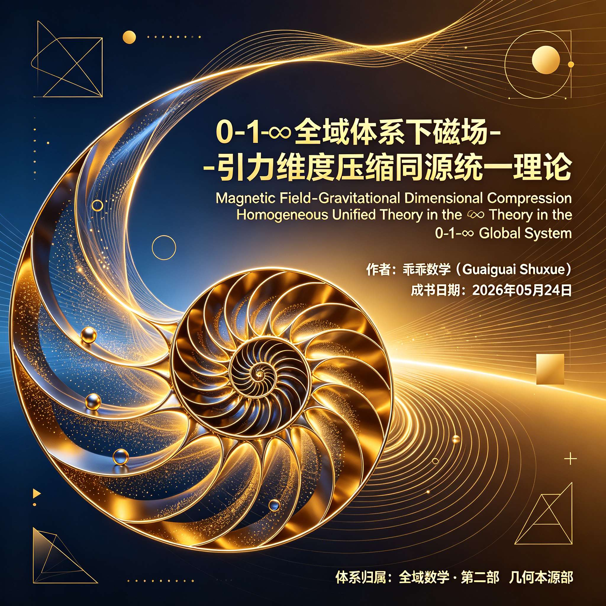
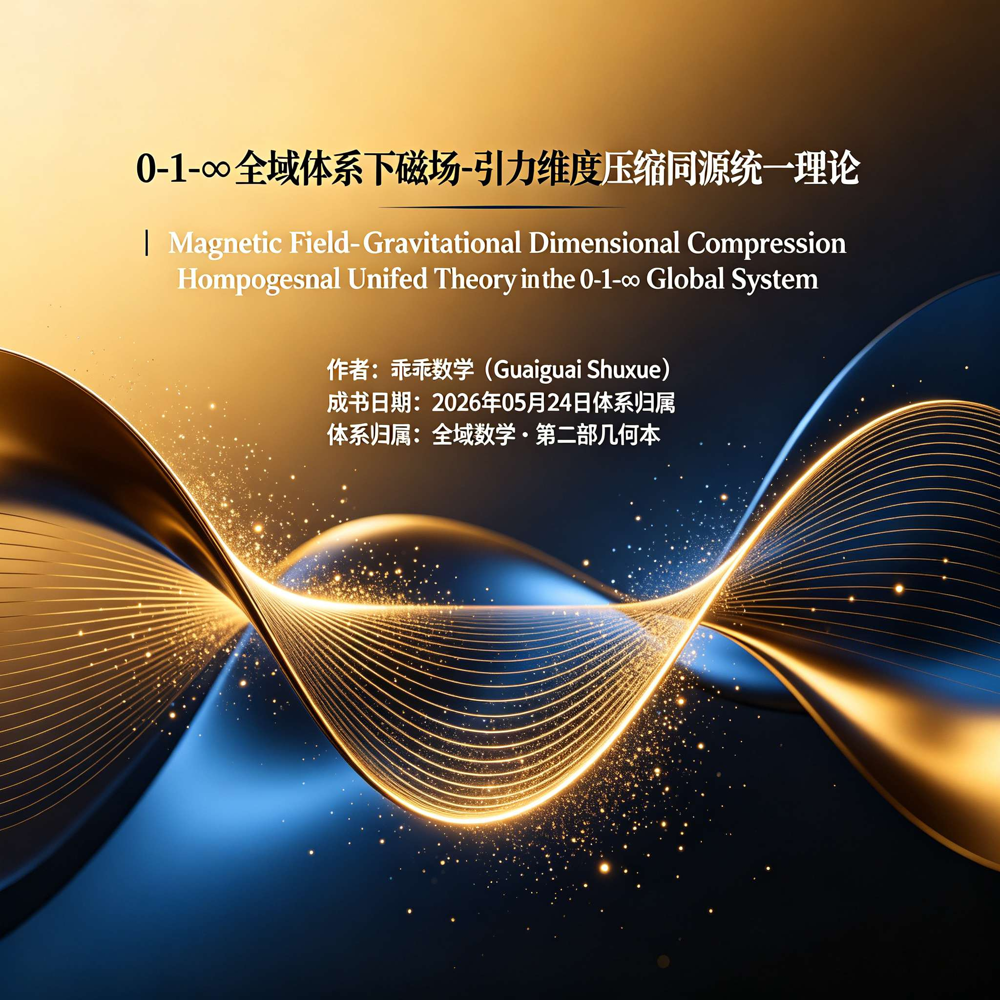
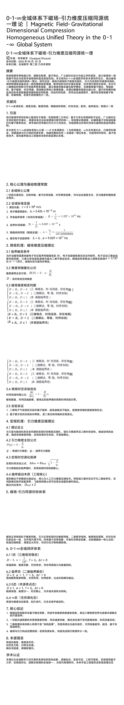
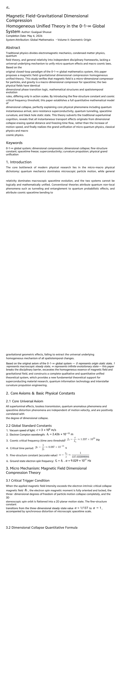
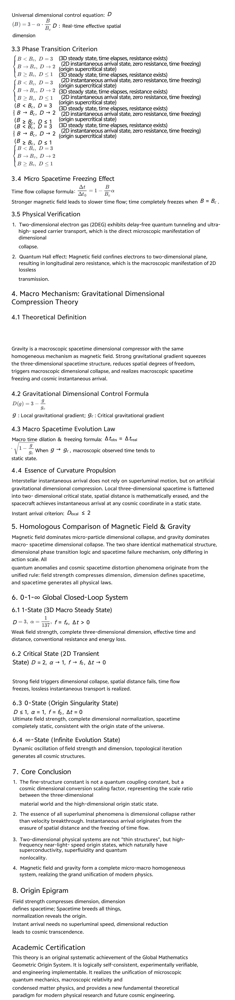
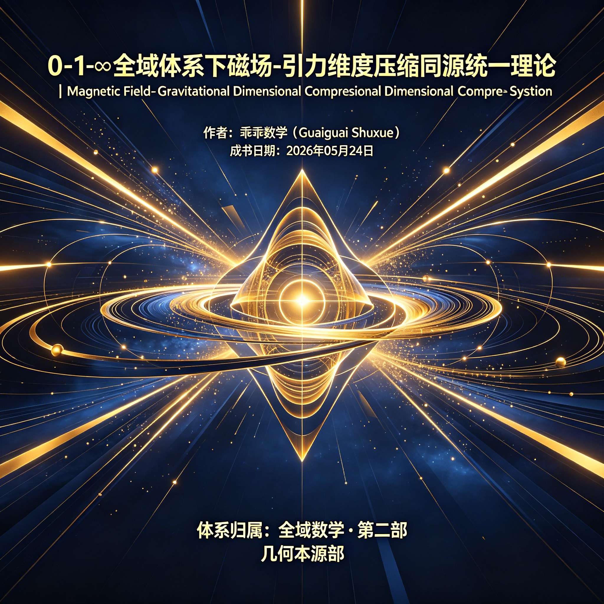
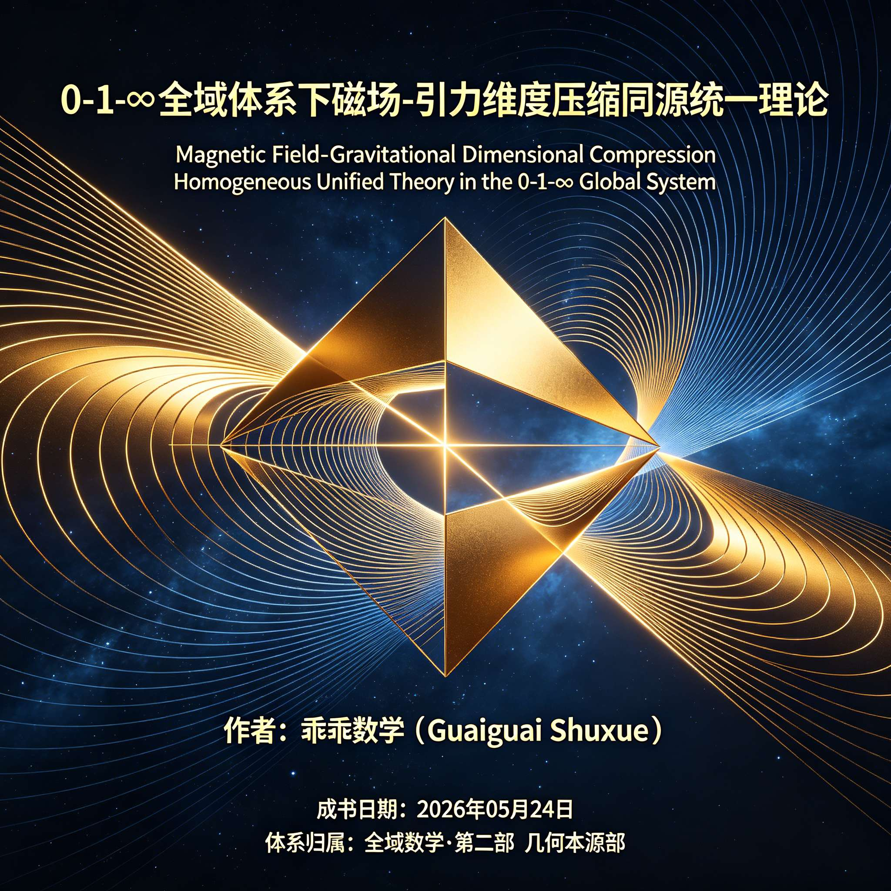

<ArchiveCopyPanel article-id="161157765" />

{"markdown":"PiDliIbnsbvvvJrlhajln5/mlbDlraYgIAo+IOe8luWPt++8mmAxNjExNTc3NjVgICAKPiDljp/lp4vmlofku7bvvJpgMC0xLeWFqOWfn+S9k+ezu+S4i+ejgeWcui3lvJXlipvnu7TluqbljovnvKnlkIzmupDnu5/kuIDnkIborrpNYWduZXRpY0ZpZWxkLUdyYXZpdGF0aW9uYS0xNjExNTc3NjUubWRgICAKPiDov5Tlm57vvJpb5pys5Lmm5b2S5qGjXSgvemgvYm9va3MvbWF0aC9hcnRpY2xlcy8pIMK3IFvmgLvlhaXlj6NdKC96aC9ib29rcy9hcnRpY2xlcy8pCgojIyAwLTEt4oie5YWo5Z+f5L2T57O75LiL56OB5Zy6LeW8leWKm+e7tOW6puWOi+e8qeWQjOa6kOe7n+S4gOeQhuiuuiDvvZwgTWFnbmV0aWMgRmllbGQtIEdyYXZpdGF0aW9uYWwgRGltZW5zaW9uYWwgQ29tcHJlc3Npb24gSG9tb2dlbmVvdXMgVW5pZmllZCBUaGVvcnkgaW4gdGhlIDAtMS3iiJ4gR2xvYmFsIFN5c3RlbQoKMC0xLeKInuWFqOWfn+S9k+ezu+S4i+ejgeWcui3lvJXlipvnu7TluqbljovnvKnlkIzmupDnu5/kuIDnkIYKCuiuuuS9nOiAhe+8muS5luS5luaVsOWtpu+8iEd1YWlndWFpIFNodXh1Ze+8iQoK5oiQ5Lmm5pel5pyf77yaMjAyNiDlubQgMDUg5pyIIDI0IOaXpQoK5L2T57O75b2S5bGe77ya5YWo5Z+f5pWw5a2mwrfnrKzkuozpg6gg5Yeg5L2V5pys5rqQ6YOoCgohW2ltYWdlXShodHRwczovL2ktYmxvZy5jc2RuaW1nLmNuL2ltZ19jb252ZXJ0L2E1MDAxOGI2ZDc3YWI3NWM5NDNhMDQzZmVkNDU3YTc0LmpwZWcpCgohW2ltYWdlXShodHRwczovL2ktYmxvZy5jc2RuaW1nLmNuL2ltZ19jb252ZXJ0LzM0NzYwMDU0NjAwNGMwNTllNjk5NGJkMWMwMjllZDBhLmpwZWcpCgohW2ltYWdlXShodHRwczovL2ktYmxvZy5jc2RuaW1nLmNuL2ltZ19jb252ZXJ0L2MyNzNlMTdhMTUwZjJjNzBiNGE1NDk3NDhlYjRkMDVlLmpwZWcpCgohW2ltYWdlXShodHRwczovL2ktYmxvZy5jc2RuaW1nLmNuL2ltZ19jb252ZXJ0LzQ3MzRhODM4NzQ3ODE3MjhiOWI0ZDVmZjFiMzZkMTAxLmpwZWcpCgohW2ltYWdlXShodHRwczovL2ktYmxvZy5jc2RuaW1nLmNuL2ltZ19jb252ZXJ0L2Q5ZTdmZWJkNjkzNDYzMmNlNTM5MTkwNGE4YTNhYWMyLmpwZWcpCgohW2ltYWdlXShodHRwczovL2ktYmxvZy5jc2RuaW1nLmNuL2ltZ19jb252ZXJ0L2VjNjJiNjRiMDljOWIzMDAyYjIxYTM1MDgxZjFlNWFjLmpwZWcpCgohW2ltYWdlXShodHRwczovL2ktYmxvZy5jc2RuaW1nLmNuL2ltZ19jb252ZXJ0L2NmMTljMmNkMGNkZGMzMWYyM2M4MGU3YTIxMTVkZDk5LmpwZWcpCg==","text":"5YiG57G777ya5YWo5Z+f5pWw5a2mICAK57yW5Y+377yaMTYxMTU3NzY1ICAK5Y6f5aeL5paH5Lu277yaMC0xLeWFqOWfn+S9k+ezu+S4i+ejgeWcui3lvJXlipvnu7TluqbljovnvKnlkIzmupDnu5/kuIDnkIborrpNYWduZXRpY0ZpZWxkLUdyYXZpdGF0aW9uYS0xNjExNTc3NjUubWQgIArov5Tlm57vvJrmnKzkuablvZLmoaMgwrcg5oC75YWl5Y+jCgowLTEt4oie5YWo5Z+f5L2T57O75LiL56OB5Zy6LeW8leWKm+e7tOW6puWOi+e8qeWQjOa6kOe7n+S4gOeQhuiuuiDvvZwgTWFnbmV0aWMgRmllbGQtIEdyYXZpdGF0aW9uYWwgRGltZW5zaW9uYWwgQ29tcHJlc3Npb24gSG9tb2dlbmVvdXMgVW5pZmllZCBUaGVvcnkgaW4gdGhlIDAtMS3iiJ4gR2xvYmFsIFN5c3RlbQoKMC0xLeKInuWFqOWfn+S9k+ezu+S4i+ejgeWcui3lvJXlipvnu7TluqbljovnvKnlkIzmupDnu5/kuIDnkIYKCuiuuuS9nOiAhe+8muS5luS5luaVsOWtpu+8iEd1YWlndWFpIFNodXh1Ze+8iQoK5oiQ5Lmm5pel5pyf77yaMjAyNiDlubQgMDUg5pyIIDI0IOaXpQoK5L2T57O75b2S5bGe77ya5YWo5Z+f5pWw5a2mwrfnrKzkuozpg6gg5Yeg5L2V5pys5rqQ6YOoCgppbWFnZQoKaW1hZ2UKCmltYWdlCgppbWFnZQoKaW1hZ2UKCmltYWdlCgppbWFnZQ=="}

> 分类：全域数学  
> 编号：`161157765`  
> 原始文件：`0-1-全域体系下磁场-引力维度压缩同源统一理论MagneticField-Gravitationa-161157765.md`  
> 返回：[本书归档](/zh/books/math/articles/) · [总入口](/zh/books/articles/)

## 0-1-∞全域体系下磁场-引力维度压缩同源统一理论 ｜ Magnetic Field- Gravitational Dimensional Compression Homogeneous Unified Theory in the 0-1-∞ Global System

0-1-∞全域体系下磁场-引力维度压缩同源统一理

论作者：乖乖数学（Guaiguai Shuxue）

成书日期：2026 年 05 月 24 日

体系归属：全域数学·第二部 几何本源部

