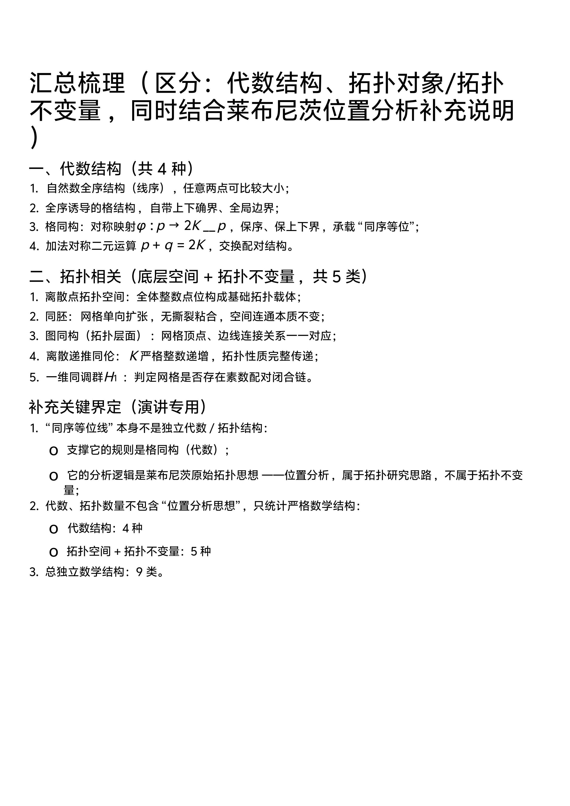

<ArchiveCopyPanel article-id="162107688" />

{"markdown":"PiDliIbnsbvvvJrlhajln5/mlbDlraYgIAo+IOe8luWPt++8mmAxNjIxMDc2ODhgICAKPiDljp/lp4vmlofku7bvvJpg5YWo5Z+f5pWw5a2m5Z+65LqO6I6x5biD5bC86Iyo5L2N572u5YiG5p6Q55qE5Luj5pWwLeaLk+aJkee7k+aehOWIhuexu+S9k+ezuy3mi5PmiZHku6PmlbDkvZPns7vmsYfmgLvmorPnkIbmiqXlkYrkuZbkuZbmlbDlraYtMTYyMTA3Njg4Lm1kYCAgCj4g6L+U5Zue77yaW+acrOS5puW9kuaho10oL3poL2Jvb2tzL21hdGgvYXJ0aWNsZXMvKSDCtyBb5oC75YWl5Y+jXSgvemgvYm9va3MvYXJ0aWNsZXMvKQoKIyMg5YWo5Z+f5pWw5a2m44O75Z+65LqO6I6x5biD5bC86Iyo5L2N572u5YiG5p6Q55qE5Luj5pWwLeaLk+aJkee7k+aehOWIhuexu+S9k+ezuy3mi5PmiZHku6PmlbDkvZPns7vmsYfmgLvmorPnkIbmiqXlkYrjgJDkuZbkuZbmlbDlrabjgJEKCiFbaW1hZ2VdKC4vYXNzZXRzL2NzZG5pbWcvanBnL2MxZTNmYjM3ODA1ZjZkY2EuanBnKQoKIyMjIOWFqOWfn+aVsOWtpuODu+aLk+aJkeS7o+aVsOS9k+ezu+axh+aAu+ais+eQhgoK5L2c6ICF77ya5LmW5LmW5pWw5a2mCgrml6XmnJ/vvJoyMDI2IOW5tCA2IOaciCAxOCDml6UKCi0tLQoKIyMjIOS4gOOAgeS7o+aVsOe7k+aehOS9k+ezu++8iOWFsSA0IOenje+8iQoKIVtpbWFnZV0oLi9hc3NldHMvY3NkbmltZy9qcGcvYTIxNjhmMDY3MzM0YjUzMi5qcGcpCgrmnKzpg6jliIbkvqfph43kuo7nprvmlaPmlbDlrabkuI7luo/nu5PmnoTvvIzpgILnlKjkuo7lu7rmqKHmmbbkvZPmoLzngrnjgIHph4/lrZDmr5TnibnkvY3nrYnniannkIblr7nosaHvvIzmnoTmiJDmi5PmiZHku6PmlbDkvZPns7vnmoTnprvmlaPln7rlupXjgIIKCiMjIyMgMS4g6Ieq54S25pWw5YWo5bqP57uT5p6E77yI57q/5bqP77yJCgrmlbDlrabooajovr7vvJoKCua9nOWcqOW6lOeUqOWcuuaZr++8mgoKLSAKCuaXtumXtOW6j+WIl+W7uuaooQoKLSAKCueUn+mVv+W6j+WIl+eahOWKqOWKm+WtpuaPj+i/sAoKLSAKCumHj+WtkOiDvee6p+eahOe6v+aAp+aOkuW6jwoKIyMjIyAyLiDlhajluo/or7Hlr7znmoTmoLznu5PmnoQKCuaVsOWtpuihqOi+vu+8mgoK5r2c5Zyo5bqU55So5Zy65pmv77yaCgotIAoK54mp55CG57O757uf55qE6IO957qn6L6555WM5Yik5a6aCgotIAoK5p2Q5paZ57uT5p6E55qE5p6B6ZmQ5by65bqm5YiG5p6QCgotIAoK5ouT5omR5bqP55qE5qC854K55p6E6YCgCgojIyMjIDMuIOagvOWQjOaehO+8muWvueensOaYoOWwhAoK5qC45b+D54m55b6B77ya5L+d5bqP44CB5L+d5LiK5LiL55WM55qE5a+556ew5pig5bCE77yM5om/6L29IOKAnOWQjOW6j+etieS9jeKAnSDmoLjlv4PmgJ3mg7PjgIIKCuaVsOWtpuihqOi+vu+8mgoK5YW25LitIEtLSyDkuLrmoLzkuK3lv4Plr7nnp7DngrnvvIzmmKDlsITmu6HotrPvvJoKCua9nOWcqOW6lOeUqOWcuuaZr++8mgoKLSAKCui2heWvvOadkOaWmeS4reeahOiHquaXi+e/u+i9rOWvueensOaApwoKLSAKCuaZtuagvOS4reeahOeUteiNt+WFsei9reWPmOaNogoKLSAKCueykuWtkCAtIOWPjeeykuWtkOmFjeWvueeahOS7o+aVsOaPj+i/sAoKIyMjIyA0LiDliqDms5Xlr7nnp7DkuozlhYPov5DnrpcKCuaguOW/g+eJueW+ge+8muS6pOaNoumFjeWvuee7k+aehO+8jOS6kuihpeW9kumbtu+8iOebuOWvueS6juS4reW/gyBLS0vvvInjgIIKCuaVsOWtpuihqOi+vu+8mgoK5Luj5pWw5oCn6LSo77yaCgotIAoK5Lqk5o2i5b6L77yacCtxPXErcHAgKyBxID0gcSArIHBwK3E9cStwCgotIAoK5a+55ZCI5oCn77yaz4Yoz4YocCkpPXBcdmFycGhpKFx2YXJwaGkocCkpID0gcM+GKM+GKHApKT1wCgotIAoK5L+d5Lit5b+D77yaz4YoSyk9S1x2YXJwaGkoSykgPSBLz4YoSyk9SwoK5r2c5Zyo5bqU55So5Zy65pmv77yaCgotIAoK57KS5a2QIC0g5Y+N57KS5a2Q6YWN5a+55py65Yi2CgotIAoK55S16Lev5Lit55qE5beu5YiG5L+h5Y+35a+56K6+6K6hCgotIAoK57Sg5pWw6YWN5a+555qE6Zet5ZCI6ZO+5p6E6YCgCgotLS0KCiMjIyDkuozjgIHmi5PmiZHlr7nosaHkuI7kuI3lj5jph4/vvIjlhbEgNSDnsbvvvIkKCiFbaW1hZ2VdKC4vYXNzZXRzL2NzZG5pbWcvanBnLzJmOGM1MmU0ZDRlYTc1ZTcuanBnKQoK5pys6YOo5YiG5L6n6YeN5LqO56m66Ze055qE6L+e57ut5oCn6LSo77yM5a+55bqUIOKAnOW4uOa4qeW4uOWOi+i2heWvvOKAnSDkuK3nmoTmi5PmiZHnianmgIHnoJTnqbbvvIzmnoTmiJDmi5PmiZHku6PmlbDkvZPns7vnmoTov57nu63moYbmnrbjgIIKCiMjIyMgMS4g56a75pWj54K55ouT5omR56m66Ze0CgrmgKfotKjnlYzlrprvvJrlhajkvZPmlbTmlbDngrnkvY3mnoTmiJDln7rnoYDmi5PmiZHovb3kvZPjgIIKCuaVsOWtpuihqOi+vu+8mgoK5YWz6ZSu6K+05piO77yaCgotIAoK5Y2z5pm25qC854K56Zi155qE54mp55CG5Z+65bqVCgotIAoK56a75pWj5ouT5omR5Lit5q+P5Liq5Y2V54K56ZuG6YO95piv5byA6ZuGCgotIAoK5Li65ZCO57ut5ouT5omR5LiN5Y+Y6YeP55qE5a6a5LmJ5o+Q5L6b56m66Ze06L295L2TCgojIyMjIDIuIOWQjOiDmu+8iEhvbWVvbW9ycGhpc23vvIkKCuaAp+i0qOeVjOWumu+8mue9keagvOWNleWQkeaJqeW8oO+8jOaXoOaSleijgueymOWQiO+8jOepuumXtOi/numAmuacrOi0qOS4jeWPmOOAggoK5YWz6ZSu6K+05piO77yaCgotIAoK6K+B5piO5p2Q5paZ5Zyo5ouJ5Ly4IC8g5Y6L57yp5LiL54mp55CG5oCn6LSo5LiN5Y+YCgotIAoK5ouT5omR562J5Lu35oCn55qE5qC45b+D5Yik5o2uCgotIAoK4oCc5qmh55qu5Yeg5L2V4oCdIOeahOebtOinguS9k+eOsAoKIyMjIyAzLiDlm77lkIzmnoTvvIjmi5PmiZHlsYLpnaLvvIkKCuaAp+i0qOeVjOWumu+8mue9keagvOmhtueCueOAgei+uee6v+i/nuaOpeWFs+ezu+S4gOS4gOWvueW6lOOAggoK5YWz6ZSu6K+05piO77yaCgotIAoK56We57uP572R57uc5p625p6E55qE562J5Lu35oCn5Yik5a6aCgotIAoK5YiG5a2Q6ZSu5ZCI57uT5p6E55qE5ouT5omR5q+U6L6DCgotIAoK5Zu+6K665LiO5ouT5omR5a2m55qE5Lqk5Y+J54K5CgojIyMjIDQuIOemu+aVo+mAkuaOqOWQjOS8pgoK5oCn6LSo55WM5a6a77yaS0tLIOS4peagvOaVtOaVsOmAkuWinu+8jOaLk+aJkeaAp+i0qOWujOaVtOS8oOmAkuOAggoK5pWw5a2m6KGo6L6+77yaCgrmu6HotrPnprvmlaPlkIzkvKbmnaHku7bvvJoKCuWFs+mUruivtOaYju+8mgoKLSAKCuaPj+i/sOeUteWtkOWcqOaZtuagvOmXtOeahOi3g+i/gei3r+W+hOa8lOWMlgoKLSAKCuemu+aVo+epuumXtOS4reeahOWQjOS8pueQhuiuuuaOqOW5vwoKLSAKCuaLk+aJkeaAp+i0qOeahOmAkuaOqOS4jeWPmOaApwoKIyMjIyA1LiDkuIDnu7TlkIzosIPnvqQgSDFIXzFIMeKAiwoK5oCn6LSo55WM5a6a77ya5qC45b+D5ouT5omR5LiN5Y+Y6YeP77yM5Yik5a6a572R5qC85piv5ZCm5a2Y5Zyo57Sg5pWw6YWN5a+56Zet5ZCI6ZO+44CCCgrmlbDlrabooajovr7vvJoKCuWFs+mUruivtOaYju+8mgoKLSAKCuWIpOWumumXreWQiOmTvueahOWtmOWcqOaApwoKLSAKCuivhuWIq+aLk+aJkee7nee8mOS9k+S4reeahCDigJzmiYvmgKfovrnnvJjmgIHigJ0KCi0gCgrntKDmlbDphY3lr7npl63njq/nmoTmi5PmiZHmo4DmtYsKCi0gCgrku6PmlbDmi5PmiZHnmoTmoLjlv4PkuI3lj5jph48KCi0tLQoKIyMjIOS4ieOAgeiOseW4g+WwvOiMqOS9jee9ruWIhuaekO+8iEFuYWx5c2lzIFNpdHVz77yJ6KGl5YWFCgohW2ltYWdlXSguL2Fzc2V0cy9jc2RuaW1nL2pwZy9jNWFhM2JkZTk1ZjQ1NTQ5LmpwZykKCiMjIyMgMS4g6I6x5biD5bC86Iyo5Y6f5oSP6ZiQ6YeKCgrmoLjlv4PmgJ3mg7PvvJrnoJTnqbYg4oCc5L2N572u55qE5oCn6LSo4oCd77yM6ICM5LiN5L6d6LWW5LqO5bqm6YeP77yI6ZW/5bqm44CB6KeS5bqm77yJ44CCCgrlk7LlrabmuIrmupDvvJoKCi0gCgrojrHluIPlsLzojKjkuo4gMTcg5LiW57qq5o+Q5Ye6IOKAnOS9jee9ruWIhuaekOKAne+8iEFuYWx5c2lzIFNpdHVz77yJ5qaC5b+1CgotIAoK6K+V5Zu+5bu656uL5LiA6Zeo5LiN5L6d6LWW5Z2Q5qCH5LiO5bqm6YeP55qE5Yeg5L2V5a2mCgotIAoK5YWz5rOo5Zu+5b2i5Zyo6L+e57ut5Y+Y5b2i5LiL5L+d5oyB5LiN5Y+Y55qE5oCn6LSoCgrnjrDku6Plr7nlupTvvJoKCui/meato+aYr+aWh+aho+S4reesrCA1IOeCue+8iEgxSF8xSDHigIsg5ZCM6LCD576k77yJ5ZKM56ysIDIg54K577yI5ZCM6IOa77yJ55qE5pys6LSoIOKAlOKAlCDlj6rlhbPlv4Mg4oCc6L+e6YCa5oCn4oCdIOWSjCDigJzmtJ7igJ3vvIzkuI3lhbPlv4PlhbfkvZPlsLrlr7jjgIIKCiMjIyMgMi4g5Yib5paw54K577ya5Luj5pWw57uT5p6E6YeP5YyW5L2N572u5YiG5p6QCgrmoLjlv4PliJvmlrDvvJrnlKjku6PmlbDnu5PmnoTvvIjmoLzlkIzmnoTjgIHlr7nnp7Dov5DnrpfvvInljrvph4/ljJbojrHluIPlsLzojKjnmoTkvY3nva7liIbmnpDjgIIKCuWtpuacr+WumuS9je+8mgoKLSAKCuWcqOeOsOS7o+aVsOWtpueJqeeQhuS4reiiq+ensOS4uiDigJzku6PmlbDmi5PmiZHigJ0g55qE5bqU55SoCgotIAoK5bCG56a75pWj5Luj5pWw57uT5p6E5LiO6L+e57ut5ouT5omR5oCn6LSo5pyJ5py657uT5ZCICgotIAoK5Li66I6x5biD5bC86Iyo55qE5Y+k5YW45oCd5oOz5o+Q5L6b5LqG57K+56Gu55qE5pWw5a2m6KGo6L6+CgrmlbDlrabmoYbmnrbvvJoKCiMjIyMgMy4g5YWz6ZSu5r6E5riFCgrph43opoHnlYzlrprvvJrigJzlkIzluo/nrYnkvY3nur/igJ0g5pys6Lqr5LiN5piv54us56uL55qE5Luj5pWw5oiW5ouT5omR57uT5p6E44CCCgotIAoK5pSv5pKR5a6D55qE6KeE5YiZ77ya5qC85ZCM5p6E77yI5Luj5pWw57uT5p6E77yJCgotIAoK5a6D55qE5YiG5p6Q6YC76L6R77ya6I6x5biD5bC86Iyo5Y6f5aeL5ouT5omR5oCd5oOzIOKAlOKAlCDkvY3nva7liIbmnpAKCi0gCgrlrabnp5HlvZLlsZ7vvJrlsZ7kuo7mi5PmiZHnoJTnqbbmgJ3ot6/vvIzkuI3lsZ7kuo7mi5PmiZHkuI3lj5jph48KCuWtpuacr+aEj+S5ie+8mui/meS4gOeVjOWumumBv+WFjeS6huiiq+aVsOWtpuWutui0qOeWkSDigJzlj5HmmI7mlrDlkI3or43igJ3vvIzlsIbliJvmlrDngrnlh4bnoa7lnLDlrprkvY3lnKgg4oCc5YiG5p6Q5pa55rOV4oCdIOiAjOmdniDigJzmlbDlrabnu5PmnoTigJ0g5bGC6Z2i44CCCgotLS0KCiMjIyDlm5vjgIHnpo/ogIDnp5HmioDlpKflrablr7nmjqXlrp7mk43lu7rorq4KCiMjIyMgMS4g5by66LCDIOKAnDkg57G757uT5p6E4oCdIOeahOWujOaVtOaApwoK57O757uf5LyY5Yq/77yaCgrnpo/ogIDnp5HlpKfkvZzkuLrmlrDlt6Xnp5HpmaLmoKHvvIzlgY/lpb3ns7vnu5/ljJbnmoTnn6Xor4bkvZPns7vjgILlj6/lvLrosIPvvJoKCui/mSA5IOexu+e7k+aehOaehOaIkOS6hiDigJzku47nprvmlaPku6PmlbDliLDov57nu63mi5PmiZHnmoTlrozmlbTpl63njq/igJ3vvIzlj6/ku6Xnm7TmjqXnlKjkuo7mj4/ov7DmlrDlnovmnZDmlpnvvIjlpoLmi5PmiZHotoXlr7zmnZDmlpnvvInnmoTnlJ/miJDmnLrliLbjgIIKCuWujOaVtOiuoeaVsO+8mgoKLSAKCuS7o+aVsOe7k+aehO+8mjQg56eNCgotIAoK5ouT5omR56m66Ze0ICsg5ouT5omR5LiN5Y+Y6YeP77yaNSDnp40KCi0gCgrmgLvni6znq4vmlbDlrabnu5PmnoTvvJo5IOexuwoKIyMjIyAyLiDkuKXosKjmgKfkv67mraPlu7rorq4KCuespuWPt+inhOiMg++8mgoKLSAKCi0gCgrlu7rorq7lhpnms5XvvJrPhihwKT0yS+KIknBcdmFycGhpKHApID0gMksgLSBwz4YocCk9MkviiJJwCgrkv67mraPnkIbnlLHvvJoKCuWcqOato+W8j+Wtpuacr+WcuuWQiO+8jOS4i+WIkue6v+WuueaYk+iiq+iupOS4uuaYr+aOkueJiOmUmeivr++8jOWGmeaIkOagh+WHhuWHveaVsOihqOi+vuW8j+abtOa4heaZsOOAgeabtOS4k+S4muOAggoKIyMjIyAzLiDmlrDmnZDmlpnmlrnlkJHlr7nmjqXopoHngrkKCuaLk+aJkei2heWvvOadkOaWme+8mgoKLSAKCueUqOS4gOe7tOWQjOiwg+e+pCBIMUhfMUgx4oCLIOWIpOWumuaLk+aJkemdnuW5s+W6uOaAgQoKLSAKCueUqOagvOWQjOaehOaPj+i/sOaZtuagvOWvueensOaApwoKLSAKCueUqOemu+aVo+mAkuaOqOWQjOS8puaooeaLn+eUteWtkOi+k+i/kAoK5pWw55CG5Lqk5Y+J54m56Imy77yaCgotIAoK5Luj5pWw57uT5p6E5o+Q5L6b56a75pWj5Z+65bqVCgotIAoK5ouT5omR5LiN5Y+Y6YeP5o+Q5L6b6L+e57ut5o+P6L+wCgotIAoK6I6x5biD5bC86Iyo5L2N572u5YiG5p6Q5o+Q5L6b5ZOy5a2m5rex5bqmCgotLS0KCiMjIyDkupTjgIHooaXlhYXlhbPplK7nlYzlrprvvIjljp/lp4vlhoXlrrnkv53nlZnvvIkKCiMjIyMgMS4g4oCc5ZCM5bqP562J5L2N57q/4oCdIOeahOWumuS9jQoKLSAKCuacrOi6q+S4jeaYr+eLrOeri+S7o+aVsCAvIOaLk+aJkee7k+aehAoKLSAKCuaUr+aSkeWug+eahOinhOWImeaYr+agvOWQjOaehO+8iOS7o+aVsO+8iQoKLSAKCuWug+eahOWIhuaekOmAu+i+keaYr+iOseW4g+WwvOiMqOWOn+Wni+aLk+aJkeaAneaDsyDigJTigJQg5L2N572u5YiG5p6QCgotIAoK5bGe5LqO5ouT5omR56CU56m25oCd6Lev77yM5LiN5bGe5LqO5ouT5omR5LiN5Y+Y6YePCgojIyMjIDIuIOaVsOmHj+e7n+iuoeWOn+WImQoK5Luj5pWw44CB5ouT5omR5pWw6YeP5LiN5YyF5ZCrIOKAnOS9jee9ruWIhuaekOaAneaDs+KAne+8jOWPque7n+iuoeS4peagvOaVsOWtpue7k+aehO+8mgoKLSAKCuS7o+aVsOe7k+aehO+8mjQg56eNCgotIAoK5ouT5omR56m66Ze0ICsg5ouT5omR5LiN5Y+Y6YeP77yaNSDnp40KCi0gCgrmgLvni6znq4vmlbDlrabnu5PmnoTvvJo5IOexuwoKIyMjIyAzLiDkvZPns7vlrozmlbTmgKcKCi0tLQoKIVtpbWFnZV0oLi9hc3NldHMvY3NkbmltZy9qcGcvZTlmNGQ4ZGQxM2Q3Njk1ZS5qcGcpCgojIyMg57uT6K+tCgrku47ojrHluIPlsLzojKjnmoTkvY3nva7liIbmnpDvvIzliLDnjrDku6Pku6PmlbDmi5PmiZHnmoTnsr7lr4bmoYbmnrbvvIzlho3liLDmi5PmiZHotoXlr7zmnZDmlpnnmoTliY3msr/lupTnlKgg4oCU4oCUIOi/mSA5IOexu+aVsOWtpue7k+aehOaehOaIkOS6huS4gOadoeieuuaXi+S4iuWNh+eahOiupOefpei3r+W+hOOAggoK56a75pWj5LiO6L+e57ut55qE57uf5LiA77yM5Luj5pWw5LiO5ouT5omR55qE5Lqk6J6N77yM55CG6K665LiO5bqU55So55qE5YWx5oyv77yM5q2j5piv5YWo5Z+f5pWw5a2m5L2T57O755qE5qC45b+D6a2F5Yqb5omA5Zyo44CCCgotLS0KCiFbaW1hZ2VdKC4vYXNzZXRzL2NzZG5pbWcvcG5nL2IyMmI2OWM1MmE4ZDMzZDYucG5nKQoKLS0tCgojIyDln7rkuo7ojrHluIPlsLzojKjkvY3nva7liIbmnpDnmoTku6PmlbAt5ouT5omR57uT5p6E5YiG57G75L2T57O7CgrnvbLlkI3vvJrkuZbkuZbmlbDlraYKCuaXpeacn++8mjIwMjYuMDYuMTgKCi0tLQoKIyMjIOS4gOOAgeS7o+aVsOe7k+aehOS9k+ezu++8iOWFsTTnsbvvvIkKCuacrOmDqOWIhuaehOW7uuS6huWfuuS6juemu+aVo+W6j+WFs+ezu+eahOWvueensOezu+e7n+OAggoKLS0tCgojIyMg5LqM44CB5ouT5omR5a+56LGh5LiO5LiN5Y+Y6YeP77yI5YWxNeexu++8iQoK5pys6YOo5YiG5Z+65LqO6I6x5biD5bC86Iyo4oCc5L2N572u5YiG5p6Q77yIQW5hbHlzaXMgU2l0dXPvvInigJ3mgJ3mg7PvvIzmjqLorqjnqbrpl7TnmoTov57nu63mgKfjgIIKCue8luWPt+amguW/teeVjOWumuaLk+aJkeaEj+S5ieeOsOS7o+WvueW6lFQx56a75pWj54K55ouT5omR56m66Ze05Lul5pW05pWw5Li654K55L2N55qE56a75pWj5Z+65bqV44CC56a75pWj5ouT5omR77yIRGlzY3JldGUgVG9wb2xvZ3nvvInjgIJUMuWNleWQkeWQjOiDmuaJqeW8oOaXoOaSleijgueymOWQiOeahOepuumXtOWPmOW9ouOAguWQjOiDmu+8iEhvbWVvbW9ycGhpc23vvInvvIzkv53mjIHov57pgJrmgKfjgIJUM+WbvuWQjOaehOWFs+ezu+mhtueCueS4jui+ueeahOmCu+aOpeWFs+ezu+S4gOS4gOWvueW6lOOAguWbvuiuuuWxgumdoueahOaLk+aJkeetieS7t+OAglQ056a75pWj6YCS5o6o5ZCM5LymS0tLIOS4peagvOaVtOaVsOmAkuWinueahOi3r+W+hOa8lOWMluOAguWQjOS8pu+8iEhvbW90b3B577yJ77yM6L+e57ut5b2i5Y+Y5Lit55qE6Lev5b6E562J5Lu344CCVDXkuIDnu7TlkIzosIPnvqQgSDFIXzFIMeKAi+WIpOWumue0oOaVsOmFjeWvuemXreWQiOmTvueahOWtmOWcqOaAp+OAguWIu+eUu+epuumXtOS4reeahOKAnOa0nuKAneS4jumXreWQiOWbnui3r++8iEN5Y2xpYyBMb29wc++8ieOAggoKLS0tCgojIyMg5LiJ44CB5qC45b+D55CG6K665r6E5riF77yI5ryU6K6yL+etlOi+qeimgeeCue+8iQoK5q2k6YOo5YiG5Li66ZKI5a+55r2c5Zyo5a2m5pyv6LSo55aR55qE6aKE5YWI5Zue5bqU77yM5by66LCD5pa55rOV6K665LiO57uT5p6E55qE5YiG56a744CCCgojIyMjIDEuIOWFs+S6juKAnOWQjOW6j+etieS9jee6v+KAneeahOWumuS9je+8mgoKLSAKCuWug+S4jeaYr+eLrOeri+eahOS7o+aVsOaIluaLk+aJkee7k+aehOOAggoKLSAKCuWug+aYr+WIhuaekOmAu+i+ke+8muWFtuaUr+aSkeinhOWImeaYr+S7o+aVsOS4reeahOKAnOagvOWQjOaehOKAne+8iEEz77yJ77yb5YW25oCd5oOz5rqQ5aS05piv6I6x5biD5bC86Iyo55qE4oCc5L2N572u5YiG5p6Q4oCd77yIQW5hbHlzaXMgU2l0dXPvvInvvIzlsZ7kuo7mi5PmiZHnoJTnqbbnmoTmgJ3ot6/ojIPlvI/vvIzogIzpnZ7mi5PmiZHkuI3lj5jph4/mnKzouqvjgIIKCiMjIyMgMi4g5YWz5LqO57uf6K6h5Y+j5b6E77yaCgotIAoK5pys5L2T57O75Lil5qC85Yy65YiG4oCc57uT5p6E4oCd5LiO4oCc5oCd5oOz4oCd44CCCgotIAoK5Luj5pWw57uT5p6E77ya5LuF57uf6K6hIEExLUE077yM5YWxIDQg56eN44CCCgotIAoK5ouT5omR56m66Ze05LiO5LiN5Y+Y6YeP77ya5LuF57uf6K6hIFQxLVQ177yM5YWxIDUg56eN44CCCgotIAoK5oC76K6h77ya54us56uL5pWw5a2m57uT5p6E5YWxIDkg57G777yI5LiN5ZCr5oCd5oOz6IyD5byP77yJ44CCCgotLS0KCiMjIyDlrabmnK/or63looPkuIvnmoTooaXlhYXor7TmmI4KCi0gCgrojrHluIPlsLzojKjkvY3nva7liIbmnpDvvIhBbmFseXNpcyBTaXR1c++8ie+8muS9oOWcqOaWh+S4reW8leeUqOi/meS4gOamguW/temdnuW4uOeyvuWHhuOAgui/meaYr+aLk+aJkeWtpueahOWJjei6q++8jOaXqOWcqOeglOeptuKAnOS9jee9rueahOaAp+i0qOKAneiAjOS4jeS+nei1luW6pumHj+OAgui/meiDveW+iOWlveWcsOino+mHiuS4uuS7gOS5iOS9oOeUqCBIMUhfMUgx4oCL77yI5ZCM6LCD576k77yJ5p2l5aSE55CG57Sg5pWw6YWN5a+56ZO+4oCU4oCU5Zug5Li65L2g5YWz5rOo55qE5piv4oCc6L+e5o6l5YWz57O74oCd6ICM6Z2e5YW35L2T55qE5pWw5a2X5aSn5bCP44CCCgotIAoKcCtxPTJLcCtxPTJLcCtxPTJLIOeahOaEj+S5ie+8muWcqOeOsOS7o+eJqeeQhuWtpuaVsOWtpuS4re+8jOi/meenjeW9ouW8j+W4uOiiq+inhuS4uuS4gOenjeWvueWBtuaAp++8iER1YWxpdHnvvInmiJbnlLXojbflhbHova3vvIhDaGFyZ2UgQ29uanVnYXRpb27vvInnmoTnroDljJbmqKHlnovjgILlpoLmnpzlkI7nu63liIrlj5HlrabmnK/orrrmlofvvIzlj6/kvp3miZjor6XmqKHlnovlkJHigJznprvmlaPlr7nlgbbku6PmlbDigJ3mlrnlkJHmi5PlsZXmt7HogJXjgIIK","text":"5YiG57G777ya5YWo5Z+f5pWw5a2mICAK57yW5Y+377yaMTYyMTA3Njg4ICAK5Y6f5aeL5paH5Lu277ya5YWo5Z+f5pWw5a2m5Z+65LqO6I6x5biD5bC86Iyo5L2N572u5YiG5p6Q55qE5Luj5pWwLeaLk+aJkee7k+aehOWIhuexu+S9k+ezuy3mi5PmiZHku6PmlbDkvZPns7vmsYfmgLvmorPnkIbmiqXlkYrkuZbkuZbmlbDlraYtMTYyMTA3Njg4Lm1kICAK6L+U5Zue77ya5pys5Lmm5b2S5qGjIMK3IOaAu+WFpeWPowoK5YWo5Z+f5pWw5a2m44O75Z+65LqO6I6x5biD5bC86Iyo5L2N572u5YiG5p6Q55qE5Luj5pWwLeaLk+aJkee7k+aehOWIhuexu+S9k+ezuy3mi5PmiZHku6PmlbDkvZPns7vmsYfmgLvmorPnkIbmiqXlkYrjgJDkuZbkuZbmlbDlrabjgJEKCmltYWdlCgrlhajln5/mlbDlrabjg7vmi5PmiZHku6PmlbDkvZPns7vmsYfmgLvmorPnkIYKCuS9nOiAhe+8muS5luS5luaVsOWtpgoK5pel5pyf77yaMjAyNiDlubQgNiDmnIggMTgg5pelCgotLS0KCuS4gOOAgeS7o+aVsOe7k+aehOS9k+ezu++8iOWFsSA0IOenje+8iQoKaW1hZ2UKCuacrOmDqOWIhuS+p+mHjeS6juemu+aVo+aVsOWtpuS4juW6j+e7k+aehO+8jOmAgueUqOS6juW7uuaooeaZtuS9k+agvOeCueOAgemHj+WtkOavlOeJueS9jeetieeJqeeQhuWvueixoe+8jOaehOaIkOaLk+aJkeS7o+aVsOS9k+ezu+eahOemu+aVo+WfuuW6leOAggroh6rnhLbmlbDlhajluo/nu5PmnoTvvIjnur/luo/vvIkKCuaVsOWtpuihqOi+vu+8mgoK5r2c5Zyo5bqU55So5Zy65pmv77yaCuaXtumXtOW6j+WIl+W7uuaooQrnlJ/plb/luo/liJfnmoTliqjlipvlrabmj4/ov7AK6YeP5a2Q6IO957qn55qE57q/5oCn5o6S5bqPCuWFqOW6j+ivseWvvOeahOagvOe7k+aehAoK5pWw5a2m6KGo6L6+77yaCgrmvZzlnKjlupTnlKjlnLrmma/vvJoK54mp55CG57O757uf55qE6IO957qn6L6555WM5Yik5a6aCuadkOaWmee7k+aehOeahOaegemZkOW8uuW6puWIhuaekArmi5PmiZHluo/nmoTmoLzngrnmnoTpgKAK5qC85ZCM5p6E77ya5a+556ew5pig5bCECgrmoLjlv4PnibnlvoHvvJrkv53luo/jgIHkv53kuIrkuIvnlYznmoTlr7nnp7DmmKDlsITvvIzmib/ovb0g4oCc5ZCM5bqP562J5L2N4oCdIOaguOW/g+aAneaDs+OAggoK5pWw5a2m6KGo6L6+77yaCgrlhbbkuK0gS0tLIOS4uuagvOS4reW/g+WvueensOeCue+8jOaYoOWwhOa7oei2s++8mgoK5r2c5Zyo5bqU55So5Zy65pmv77yaCui2heWvvOadkOaWmeS4reeahOiHquaXi+e/u+i9rOWvueensOaApwrmmbbmoLzkuK3nmoTnlLXojbflhbHova3lj5jmjaIK57KS5a2QIC0g5Y+N57KS5a2Q6YWN5a+555qE5Luj5pWw5o+P6L+wCuWKoOazleWvueensOS6jOWFg+i/kOeulwoK5qC45b+D54m55b6B77ya5Lqk5o2i6YWN5a+557uT5p6E77yM5LqS6KGl5b2S6Zu277yI55u45a+55LqO5Lit5b+DIEtLS++8ieOAggoK5pWw5a2m6KGo6L6+77yaCgrku6PmlbDmgKfotKjvvJoK5Lqk5o2i5b6L77yacCtxPXErcHAgKyBxID0gcSArIHBwK3E9cStwCuWvueWQiOaAp++8ms+GKM+GKHApKT1wXHZhcnBoaShcdmFycGhpKHApKSA9IHDPhijPhihwKSk9cArkv53kuK3lv4PvvJrPhihLKT1LXHZhcnBoaShLKSA9IEvPhihLKT1LCgrmvZzlnKjlupTnlKjlnLrmma/vvJoK57KS5a2QIC0g5Y+N57KS5a2Q6YWN5a+55py65Yi2CueUtei3r+S4reeahOW3ruWIhuS/oeWPt+WvueiuvuiuoQrntKDmlbDphY3lr7nnmoTpl63lkIjpk77mnoTpgKAKCi0tLQoK5LqM44CB5ouT5omR5a+56LGh5LiO5LiN5Y+Y6YeP77yI5YWxIDUg57G777yJCgppbWFnZQoK5pys6YOo5YiG5L6n6YeN5LqO56m66Ze055qE6L+e57ut5oCn6LSo77yM5a+55bqUIOKAnOW4uOa4qeW4uOWOi+i2heWvvOKAnSDkuK3nmoTmi5PmiZHnianmgIHnoJTnqbbvvIzmnoTmiJDmi5PmiZHku6PmlbDkvZPns7vnmoTov57nu63moYbmnrbjgIIK56a75pWj54K55ouT5omR56m66Ze0CgrmgKfotKjnlYzlrprvvJrlhajkvZPmlbTmlbDngrnkvY3mnoTmiJDln7rnoYDmi5PmiZHovb3kvZPjgIIKCuaVsOWtpuihqOi+vu+8mgoK5YWz6ZSu6K+05piO77yaCuWNs+aZtuagvOeCuemYteeahOeJqeeQhuWfuuW6lQrnprvmlaPmi5PmiZHkuK3mr4/kuKrljZXngrnpm4bpg73mmK/lvIDpm4YK5Li65ZCO57ut5ouT5omR5LiN5Y+Y6YeP55qE5a6a5LmJ5o+Q5L6b56m66Ze06L295L2TCuWQjOiDmu+8iEhvbWVvbW9ycGhpc23vvIkKCuaAp+i0qOeVjOWumu+8mue9keagvOWNleWQkeaJqeW8oO+8jOaXoOaSleijgueymOWQiO+8jOepuumXtOi/numAmuacrOi0qOS4jeWPmOOAggoK5YWz6ZSu6K+05piO77yaCuivgeaYjuadkOaWmeWcqOaLieS8uCAvIOWOi+e8qeS4i+eJqeeQhuaAp+i0qOS4jeWPmArmi5PmiZHnrYnku7fmgKfnmoTmoLjlv4PliKTmja4K4oCc5qmh55qu5Yeg5L2V4oCdIOeahOebtOinguS9k+eOsArlm77lkIzmnoTvvIjmi5PmiZHlsYLpnaLvvIkKCuaAp+i0qOeVjOWumu+8mue9keagvOmhtueCueOAgei+uee6v+i/nuaOpeWFs+ezu+S4gOS4gOWvueW6lOOAggoK5YWz6ZSu6K+05piO77yaCuelnue7j+e9kee7nOaetuaehOeahOetieS7t+aAp+WIpOWumgrliIblrZDplK7lkIjnu5PmnoTnmoTmi5PmiZHmr5TovoMK5Zu+6K665LiO5ouT5omR5a2m55qE5Lqk5Y+J54K5Cuemu+aVo+mAkuaOqOWQjOS8pgoK5oCn6LSo55WM5a6a77yaS0tLIOS4peagvOaVtOaVsOmAkuWinu+8jOaLk+aJkeaAp+i0qOWujOaVtOS8oOmAkuOAggoK5pWw5a2m6KGo6L6+77yaCgrmu6HotrPnprvmlaPlkIzkvKbmnaHku7bvvJoKCuWFs+mUruivtOaYju+8mgrmj4/ov7DnlLXlrZDlnKjmmbbmoLzpl7TnmoTot4Pov4Hot6/lvoTmvJTljJYK56a75pWj56m66Ze05Lit55qE5ZCM5Lym55CG6K665o6o5bm/CuaLk+aJkeaAp+i0qOeahOmAkuaOqOS4jeWPmOaApwrkuIDnu7TlkIzosIPnvqQgSDFIMUgx4oCLCgrmgKfotKjnlYzlrprvvJrmoLjlv4Pmi5PmiZHkuI3lj5jph4/vvIzliKTlrprnvZHmoLzmmK/lkKblrZjlnKjntKDmlbDphY3lr7npl63lkIjpk77jgIIKCuaVsOWtpuihqOi+vu+8mgoK5YWz6ZSu6K+05piO77yaCuWIpOWumumXreWQiOmTvueahOWtmOWcqOaApwror4bliKvmi5PmiZHnu53nvJjkvZPkuK3nmoQg4oCc5omL5oCn6L6557yY5oCB4oCdCue0oOaVsOmFjeWvuemXreeOr+eahOaLk+aJkeajgOa1iwrku6PmlbDmi5PmiZHnmoTmoLjlv4PkuI3lj5jph48KCi0tLQoK5LiJ44CB6I6x5biD5bC86Iyo5L2N572u5YiG5p6Q77yIQW5hbHlzaXMgU2l0dXPvvInooaXlhYUKCmltYWdlCuiOseW4g+WwvOiMqOWOn+aEj+mYkOmHigoK5qC45b+D5oCd5oOz77ya56CU56m2IOKAnOS9jee9rueahOaAp+i0qOKAne+8jOiAjOS4jeS+nei1luS6juW6pumHj++8iOmVv+W6puOAgeinkuW6pu+8ieOAggoK5ZOy5a2m5riK5rqQ77yaCuiOseW4g+WwvOiMqOS6jiAxNyDkuJbnuqrmj5Dlh7og4oCc5L2N572u5YiG5p6Q4oCd77yIQW5hbHlzaXMgU2l0dXPvvInmpoLlv7UK6K+V5Zu+5bu656uL5LiA6Zeo5LiN5L6d6LWW5Z2Q5qCH5LiO5bqm6YeP55qE5Yeg5L2V5a2mCuWFs+azqOWbvuW9ouWcqOi/nue7reWPmOW9ouS4i+S/neaMgeS4jeWPmOeahOaAp+i0qAoK546w5Luj5a+55bqU77yaCgrov5nmraPmmK/mlofmoaPkuK3nrKwgNSDngrnvvIhIMUgxSDHigIsg5ZCM6LCD576k77yJ5ZKM56ysIDIg54K577yI5ZCM6IOa77yJ55qE5pys6LSoIOKAlOKAlCDlj6rlhbPlv4Mg4oCc6L+e6YCa5oCn4oCdIOWSjCDigJzmtJ7igJ3vvIzkuI3lhbPlv4PlhbfkvZPlsLrlr7jjgIIK5Yib5paw54K577ya5Luj5pWw57uT5p6E6YeP5YyW5L2N572u5YiG5p6QCgrmoLjlv4PliJvmlrDvvJrnlKjku6PmlbDnu5PmnoTvvIjmoLzlkIzmnoTjgIHlr7nnp7Dov5DnrpfvvInljrvph4/ljJbojrHluIPlsLzojKjnmoTkvY3nva7liIbmnpDjgIIKCuWtpuacr+WumuS9je+8mgrlnKjnjrDku6PmlbDlrabniannkIbkuK3ooqvnp7DkuLog4oCc5Luj5pWw5ouT5omR4oCdIOeahOW6lOeUqArlsIbnprvmlaPku6PmlbDnu5PmnoTkuI7ov57nu63mi5PmiZHmgKfotKjmnInmnLrnu5PlkIgK5Li66I6x5biD5bC86Iyo55qE5Y+k5YW45oCd5oOz5o+Q5L6b5LqG57K+56Gu55qE5pWw5a2m6KGo6L6+CgrmlbDlrabmoYbmnrbvvJoK5YWz6ZSu5r6E5riFCgrph43opoHnlYzlrprvvJrigJzlkIzluo/nrYnkvY3nur/igJ0g5pys6Lqr5LiN5piv54us56uL55qE5Luj5pWw5oiW5ouT5omR57uT5p6E44CCCuaUr+aSkeWug+eahOinhOWIme+8muagvOWQjOaehO+8iOS7o+aVsOe7k+aehO+8iQrlroPnmoTliIbmnpDpgLvovpHvvJrojrHluIPlsLzojKjljp/lp4vmi5PmiZHmgJ3mg7Mg4oCU4oCUIOS9jee9ruWIhuaekArlrabnp5HlvZLlsZ7vvJrlsZ7kuo7mi5PmiZHnoJTnqbbmgJ3ot6/vvIzkuI3lsZ7kuo7mi5PmiZHkuI3lj5jph48KCuWtpuacr+aEj+S5ie+8mui/meS4gOeVjOWumumBv+WFjeS6huiiq+aVsOWtpuWutui0qOeWkSDigJzlj5HmmI7mlrDlkI3or43igJ3vvIzlsIbliJvmlrDngrnlh4bnoa7lnLDlrprkvY3lnKgg4oCc5YiG5p6Q5pa55rOV4oCdIOiAjOmdniDigJzmlbDlrabnu5PmnoTigJ0g5bGC6Z2i44CCCgotLS0KCuWbm+OAgeemj+iAgOenkeaKgOWkp+WtpuWvueaOpeWunuaTjeW7uuiurgrlvLrosIMg4oCcOSDnsbvnu5PmnoTigJ0g55qE5a6M5pW05oCnCgrns7vnu5/kvJjlir/vvJoKCuemj+iAgOenkeWkp+S9nOS4uuaWsOW3peenkemZouagoe+8jOWBj+Wlveezu+e7n+WMlueahOefpeivhuS9k+ezu+OAguWPr+W8uuiwg++8mgoK6L+ZIDkg57G757uT5p6E5p6E5oiQ5LqGIOKAnOS7juemu+aVo+S7o+aVsOWIsOi/nue7reaLk+aJkeeahOWujOaVtOmXreeOr+KAne+8jOWPr+S7peebtOaOpeeUqOS6juaPj+i/sOaWsOWei+adkOaWme+8iOWmguaLk+aJkei2heWvvOadkOaWme+8ieeahOeUn+aIkOacuuWItuOAggoK5a6M5pW06K6h5pWw77yaCuS7o+aVsOe7k+aehO+8mjQg56eNCuaLk+aJkeepuumXtCArIOaLk+aJkeS4jeWPmOmHj++8mjUg56eNCuaAu+eLrOeri+aVsOWtpue7k+aehO+8mjkg57G7CuS4peiwqOaAp+S/ruato+W7uuiurgoK56ym5Y+36KeE6IyD77yaCuW7uuiuruWGmeazle+8ms+GKHApPTJL4oiScFx2YXJwaGkocCkgPSAySyAtIHDPhihwKT0yS+KIknAKCuS/ruato+eQhueUse+8mgoK5Zyo5q2j5byP5a2m5pyv5Zy65ZCI77yM5LiL5YiS57q/5a655piT6KKr6K6k5Li65piv5o6S54mI6ZSZ6K+v77yM5YaZ5oiQ5qCH5YeG5Ye95pWw6KGo6L6+5byP5pu05riF5pmw44CB5pu05LiT5Lia44CCCuaWsOadkOaWmeaWueWQkeWvueaOpeimgeeCuQoK5ouT5omR6LaF5a+85p2Q5paZ77yaCueUqOS4gOe7tOWQjOiwg+e+pCBIMUgxSDHigIsg5Yik5a6a5ouT5omR6Z2e5bmz5bq45oCBCueUqOagvOWQjOaehOaPj+i/sOaZtuagvOWvueensOaApwrnlKjnprvmlaPpgJLmjqjlkIzkvKbmqKHmi5/nlLXlrZDovpPov5AKCuaVsOeQhuS6pOWPieeJueiJsu+8mgrku6PmlbDnu5PmnoTmj5DkvpvnprvmlaPln7rlupUK5ouT5omR5LiN5Y+Y6YeP5o+Q5L6b6L+e57ut5o+P6L+wCuiOseW4g+WwvOiMqOS9jee9ruWIhuaekOaPkOS+m+WTsuWtpua3seW6pgoKLS0tCgrkupTjgIHooaXlhYXlhbPplK7nlYzlrprvvIjljp/lp4vlhoXlrrnkv53nlZnvvIkK4oCc5ZCM5bqP562J5L2N57q/4oCdIOeahOWumuS9jQrmnKzouqvkuI3mmK/ni6znq4vku6PmlbAgLyDmi5PmiZHnu5PmnoQK5pSv5pKR5a6D55qE6KeE5YiZ5piv5qC85ZCM5p6E77yI5Luj5pWw77yJCuWug+eahOWIhuaekOmAu+i+keaYr+iOseW4g+WwvOiMqOWOn+Wni+aLk+aJkeaAneaDsyDigJTigJQg5L2N572u5YiG5p6QCuWxnuS6juaLk+aJkeeglOeptuaAnei3r++8jOS4jeWxnuS6juaLk+aJkeS4jeWPmOmHjwrmlbDph4/nu5/orqHljp/liJkKCuS7o+aVsOOAgeaLk+aJkeaVsOmHj+S4jeWMheWQqyDigJzkvY3nva7liIbmnpDmgJ3mg7PigJ3vvIzlj6rnu5/orqHkuKXmoLzmlbDlrabnu5PmnoTvvJoK5Luj5pWw57uT5p6E77yaNCDnp40K5ouT5omR56m66Ze0ICsg5ouT5omR5LiN5Y+Y6YeP77yaNSDnp40K5oC754us56uL5pWw5a2m57uT5p6E77yaOSDnsbsK5L2T57O75a6M5pW05oCnCgotLS0KCmltYWdlCgrnu5Por60KCuS7juiOseW4g+WwvOiMqOeahOS9jee9ruWIhuaekO+8jOWIsOeOsOS7o+S7o+aVsOaLk+aJkeeahOeyvuWvhuahhuaetu+8jOWGjeWIsOaLk+aJkei2heWvvOadkOaWmeeahOWJjeayv+W6lOeUqCDigJTigJQg6L+ZIDkg57G75pWw5a2m57uT5p6E5p6E5oiQ5LqG5LiA5p2h6J665peL5LiK5Y2H55qE6K6k55+l6Lev5b6E44CCCgrnprvmlaPkuI7ov57nu63nmoTnu5/kuIDvvIzku6PmlbDkuI7mi5PmiZHnmoTkuqTono3vvIznkIborrrkuI7lupTnlKjnmoTlhbHmjK/vvIzmraPmmK/lhajln5/mlbDlrabkvZPns7vnmoTmoLjlv4PprYXlipvmiYDlnKjjgIIKCi0tLQoKaW1hZ2UKCi0tLQoK5Z+65LqO6I6x5biD5bC86Iyo5L2N572u5YiG5p6Q55qE5Luj5pWwLeaLk+aJkee7k+aehOWIhuexu+S9k+ezuwoK572y5ZCN77ya5LmW5LmW5pWw5a2mCgrml6XmnJ/vvJoyMDI2LjA2LjE4CgotLS0KCuS4gOOAgeS7o+aVsOe7k+aehOS9k+ezu++8iOWFsTTnsbvvvIkKCuacrOmDqOWIhuaehOW7uuS6huWfuuS6juemu+aVo+W6j+WFs+ezu+eahOWvueensOezu+e7n+OAggoKLS0tCgrkuozjgIHmi5PmiZHlr7nosaHkuI7kuI3lj5jph4/vvIjlhbE157G777yJCgrmnKzpg6jliIbln7rkuo7ojrHluIPlsLzojKjigJzkvY3nva7liIbmnpDvvIhBbmFseXNpcyBTaXR1c++8ieKAneaAneaDs++8jOaOouiuqOepuumXtOeahOi/nue7reaAp+OAggoK57yW5Y+35qaC5b+155WM5a6a5ouT5omR5oSP5LmJ546w5Luj5a+55bqUVDHnprvmlaPngrnmi5PmiZHnqbrpl7Tku6XmlbTmlbDkuLrngrnkvY3nmoTnprvmlaPln7rlupXjgILnprvmlaPmi5PmiZHvvIhEaXNjcmV0ZSBUb3BvbG9nee+8ieOAglQy5Y2V5ZCR5ZCM6IOa5omp5byg5peg5pKV6KOC57KY5ZCI55qE56m66Ze05Y+Y5b2i44CC5ZCM6IOa77yISG9tZW9tb3JwaGlzbe+8ie+8jOS/neaMgei/numAmuaAp+OAglQz5Zu+5ZCM5p6E5YWz57O76aG254K55LiO6L6555qE6YK75o6l5YWz57O75LiA5LiA5a+55bqU44CC5Zu+6K665bGC6Z2i55qE5ouT5omR562J5Lu344CCVDTnprvmlaPpgJLmjqjlkIzkvKZLS0sg5Lil5qC85pW05pWw6YCS5aKe55qE6Lev5b6E5ryU5YyW44CC5ZCM5Lym77yISG9tb3RvcHnvvInvvIzov57nu63lvaLlj5jkuK3nmoTot6/lvoTnrYnku7fjgIJUNeS4gOe7tOWQjOiwg+e+pCBIMUgxSDHigIvliKTlrprntKDmlbDphY3lr7npl63lkIjpk77nmoTlrZjlnKjmgKfjgILliLvnlLvnqbrpl7TkuK3nmoTigJzmtJ7igJ3kuI7pl63lkIjlm57ot6/vvIhDeWNsaWMgTG9vcHPvvInjgIIKCi0tLQoK5LiJ44CB5qC45b+D55CG6K665r6E5riF77yI5ryU6K6yL+etlOi+qeimgeeCue+8iQoK5q2k6YOo5YiG5Li66ZKI5a+55r2c5Zyo5a2m5pyv6LSo55aR55qE6aKE5YWI5Zue5bqU77yM5by66LCD5pa55rOV6K665LiO57uT5p6E55qE5YiG56a744CCCuWFs+S6juKAnOWQjOW6j+etieS9jee6v+KAneeahOWumuS9je+8mgrlroPkuI3mmK/ni6znq4vnmoTku6PmlbDmiJbmi5PmiZHnu5PmnoTjgIIK5a6D5piv5YiG5p6Q6YC76L6R77ya5YW25pSv5pKR6KeE5YiZ5piv5Luj5pWw5Lit55qE4oCc5qC85ZCM5p6E4oCd77yIQTPvvInvvJvlhbbmgJ3mg7PmupDlpLTmmK/ojrHluIPlsLzojKjnmoTigJzkvY3nva7liIbmnpDigJ3vvIhBbmFseXNpcyBTaXR1c++8ie+8jOWxnuS6juaLk+aJkeeglOeptueahOaAnei3r+iMg+W8j++8jOiAjOmdnuaLk+aJkeS4jeWPmOmHj+acrOi6q+OAggrlhbPkuo7nu5/orqHlj6PlvoTvvJoK5pys5L2T57O75Lil5qC85Yy65YiG4oCc57uT5p6E4oCd5LiO4oCc5oCd5oOz4oCd44CCCuS7o+aVsOe7k+aehO+8muS7hee7n+iuoSBBMS1BNO+8jOWFsSA0IOenjeOAggrmi5PmiZHnqbrpl7TkuI7kuI3lj5jph4/vvJrku4Xnu5/orqEgVDEtVDXvvIzlhbEgNSDnp43jgIIK5oC76K6h77ya54us56uL5pWw5a2m57uT5p6E5YWxIDkg57G777yI5LiN5ZCr5oCd5oOz6IyD5byP77yJ44CCCgotLS0KCuWtpuacr+ivreWig+S4i+eahOihpeWFheivtOaYjgrojrHluIPlsLzojKjkvY3nva7liIbmnpDvvIhBbmFseXNpcyBTaXR1c++8ie+8muS9oOWcqOaWh+S4reW8leeUqOi/meS4gOamguW/temdnuW4uOeyvuWHhuOAgui/meaYr+aLk+aJkeWtpueahOWJjei6q++8jOaXqOWcqOeglOeptuKAnOS9jee9rueahOaAp+i0qOKAneiAjOS4jeS+nei1luW6pumHj+OAgui/meiDveW+iOWlveWcsOino+mHiuS4uuS7gOS5iOS9oOeUqCBIMUgxSDHigIvvvIjlkIzosIPnvqTvvInmnaXlpITnkIbntKDmlbDphY3lr7npk77igJTigJTlm6DkuLrkvaDlhbPms6jnmoTmmK/igJzov57mjqXlhbPns7vigJ3ogIzpnZ7lhbfkvZPnmoTmlbDlrZflpKflsI/jgIIKcCtxPTJLcCtxPTJLcCtxPTJLIOeahOaEj+S5ie+8muWcqOeOsOS7o+eJqeeQhuWtpuaVsOWtpuS4re+8jOi/meenjeW9ouW8j+W4uOiiq+inhuS4uuS4gOenjeWvueWBtuaAp++8iER1YWxpdHnvvInmiJbnlLXojbflhbHova3vvIhDaGFyZ2UgQ29uanVnYXRpb27vvInnmoTnroDljJbmqKHlnovjgILlpoLmnpzlkI7nu63liIrlj5HlrabmnK/orrrmlofvvIzlj6/kvp3miZjor6XmqKHlnovlkJHigJznprvmlaPlr7nlgbbku6PmlbDigJ3mlrnlkJHmi5PlsZXmt7HogJXjgII="}

> 分类：全域数学  
> 编号：`162107688`  
> 原始文件：`全域数学基于莱布尼茨位置分析的代数-拓扑结构分类体系-拓扑代数体系汇总梳理报告乖乖数学-162107688.md`  
> 返回：[本书归档](/zh/books/math/articles/) · [总入口](/zh/books/articles/)

<ArticlePaperMeta category="全域数学" article-id="162107688" title="全域数学基于莱布尼茨位置分析的代数-拓扑结构分类体系-拓扑代数体系汇总梳理报告乖乖数学" paper-kind="研究论文" book-route="/zh/books/math/articles/" overview-route="/zh/books/articles/" summary="日期：2026 年 6 月 18 日" author="乖乖数学" source-file="全域数学基于莱布尼茨位置分析的代数-拓扑结构分类体系-拓扑代数体系汇总梳理报告乖乖数学-162107688.md" cover="./assets/csdnimg/jpg/c1e3fb37805f6dca.jpg" />

## 全域数学・基于莱布尼茨位置分析的代数-拓扑结构分类体系-拓扑代数体系汇总梳理报告【乖乖数学】

### 全域数学・拓扑代数体系汇总梳理

作者：乖乖数学

日期：2026 年 6 月 18 日

---

### 一、代数结构体系（共 4 种）

本部分侧重于离散数学与序结构，适用于建模晶体格点、量子比特位等物理对象，构成拓扑代数体系的离散基底。

#### 1. 自然数全序结构（线序）

数学表达：

潜在应用场景：

- 

时间序列建模

- 

生长序列的动力学描述

- 

量子能级的线性排序

#### 2. 全序诱导的格结构

数学表达：

潜在应用场景：

- 

物理系统的能级边界判定

- 

材料结构的极限强度分析

- 

拓扑序的格点构造

#### 3. 格同构：对称映射

核心特征：保序、保上下界的对称映射，承载 “同序等位” 核心思想。

数学表达：

其中 KKK 为格中心对称点，映射满足：

潜在应用场景：

- 

超导材料中的自旋翻转对称性

- 

晶格中的电荷共轭变换

- 

粒子 - 反粒子配对的代数描述

#### 4. 加法对称二元运算

核心特征：交换配对结构，互补归零（相对于中心 KKK）。

数学表达：

代数性质：

- 

交换律：p+q=q+pp + q = q + pp+q=q+p

- 

对合性：φ(φ(p))=p\varphi(\varphi(p)) = pφ(φ(p))=p

- 

保中心：φ(K)=K\varphi(K) = Kφ(K)=K

潜在应用场景：

- 

粒子 - 反粒子配对机制

- 

电路中的差分信号对设计

- 

素数配对的闭合链构造

---

### 二、拓扑对象与不变量（共 5 类）

本部分侧重于空间的连续性质，对应 “常温常压超导” 中的拓扑物态研究，构成拓扑代数体系的连续框架。

#### 1. 离散点拓扑空间

性质界定：全体整数点位构成基础拓扑载体。

数学表达：

关键说明：

- 

即晶格点阵的物理基底

- 

离散拓扑中每个单点集都是开集

- 

为后续拓扑不变量的定义提供空间载体

#### 2. 同胚（Homeomorphism）

性质界定：网格单向扩张，无撕裂粘合，空间连通本质不变。

关键说明：

- 

证明材料在拉伸 / 压缩下物理性质不变

- 

拓扑等价性的核心判据

- 

“橡皮几何” 的直观体现

#### 3. 图同构（拓扑层面）

性质界定：网格顶点、边线连接关系一一对应。

关键说明：

- 

神经网络架构的等价性判定

- 

分子键合结构的拓扑比较

- 

图论与拓扑学的交叉点

#### 4. 离散递推同伦

性质界定：KKK 严格整数递增，拓扑性质完整传递。

数学表达：

满足离散同伦条件：

关键说明：

- 

描述电子在晶格间的跃迁路径演化

- 

离散空间中的同伦理论推广

- 

拓扑性质的递推不变性

#### 5. 一维同调群 H1H_1H1​

性质界定：核心拓扑不变量，判定网格是否存在素数配对闭合链。

数学表达：

关键说明：

- 

判定闭合链的存在性

- 

识别拓扑绝缘体中的 “手性边缘态”

- 

素数配对闭环的拓扑检测

- 

代数拓扑的核心不变量

---

### 三、莱布尼茨位置分析（Analysis Situs）补充

#### 1. 莱布尼茨原意阐释

核心思想：研究 “位置的性质”，而不依赖于度量（长度、角度）。

哲学渊源：

- 

莱布尼茨于 17 世纪提出 “位置分析”（Analysis Situs）概念

- 

试图建立一门不依赖坐标与度量的几何学

- 

关注图形在连续变形下保持不变的性质

现代对应：

这正是文档中第 5 点（H1H_1H1​ 同调群）和第 2 点（同胚）的本质 —— 只关心 “连通性” 和 “洞”，不关心具体尺寸。

#### 2. 创新点：代数结构量化位置分析

核心创新：用代数结构（格同构、对称运算）去量化莱布尼茨的位置分析。

学术定位：

- 

在现代数学物理中被称为 “代数拓扑” 的应用

- 

将离散代数结构与连续拓扑性质有机结合

- 

为莱布尼茨的古典思想提供了精确的数学表达

数学框架：

#### 3. 关键澄清

重要界定：“同序等位线” 本身不是独立的代数或拓扑结构。

- 

支撑它的规则：格同构（代数结构）

- 

它的分析逻辑：莱布尼茨原始拓扑思想 —— 位置分析

- 

学科归属：属于拓扑研究思路，不属于拓扑不变量

学术意义：这一界定避免了被数学家质疑 “发明新名词”，将创新点准确地定位在 “分析方法” 而非 “数学结构” 层面。

---

### 四、福耀科技大学对接实操建议

#### 1. 强调 “9 类结构” 的完整性

系统优势：

福耀科大作为新工科院校，偏好系统化的知识体系。可强调：

这 9 类结构构成了 “从离散代数到连续拓扑的完整闭环”，可以直接用于描述新型材料（如拓扑超导材料）的生成机制。

完整计数：

- 

代数结构：4 种

- 

拓扑空间 + 拓扑不变量：5 种

- 

总独立数学结构：9 类

#### 2. 严谨性修正建议

符号规范：

- 

- 

建议写法：φ(p)=2K−p\varphi(p) = 2K - pφ(p)=2K−p

修正理由：

在正式学术场合，下划线容易被认为是排版错误，写成标准函数表达式更清晰、更专业。

#### 3. 新材料方向对接要点

拓扑超导材料：

- 

用一维同调群 H1H_1H1​ 判定拓扑非平庸态

- 

用格同构描述晶格对称性

- 

用离散递推同伦模拟电子输运

数理交叉特色：

- 

代数结构提供离散基底

- 

拓扑不变量提供连续描述

- 

莱布尼茨位置分析提供哲学深度

---

### 五、补充关键界定（原始内容保留）

#### 1. “同序等位线” 的定位

- 

本身不是独立代数 / 拓扑结构

- 

支撑它的规则是格同构（代数）

- 

它的分析逻辑是莱布尼茨原始拓扑思想 —— 位置分析

- 

属于拓扑研究思路，不属于拓扑不变量

#### 2. 数量统计原则

代数、拓扑数量不包含 “位置分析思想”，只统计严格数学结构：

- 

代数结构：4 种

- 

拓扑空间 + 拓扑不变量：5 种

- 

总独立数学结构：9 类

#### 3. 体系完整性

---

### 结语

从莱布尼茨的位置分析，到现代代数拓扑的精密框架，再到拓扑超导材料的前沿应用 —— 这 9 类数学结构构成了一条螺旋上升的认知路径。

离散与连续的统一，代数与拓扑的交融，理论与应用的共振，正是全域数学体系的核心魅力所在。

---

---

## 基于莱布尼茨位置分析的代数-拓扑结构分类体系

署名：乖乖数学

日期：2026.06.18

---

### 一、代数结构体系（共4类）

本部分构建了基于离散序关系的对称系统。

---

### 二、拓扑对象与不变量（共5类）

本部分基于莱布尼茨“位置分析（Analysis Situs）”思想，探讨空间的连续性。

编号概念界定拓扑意义现代对应T1离散点拓扑空间以整数为点位的离散基底。离散拓扑（Discrete Topology）。T2单向同胚扩张无撕裂粘合的空间变形。同胚（Homeomorphism），保持连通性。T3图同构关系顶点与边的邻接关系一一对应。图论层面的拓扑等价。T4离散递推同伦KKK 严格整数递增的路径演化。同伦（Homotopy），连续形变中的路径等价。T5一维同调群 H1H_1H1​判定素数配对闭合链的存在性。刻画空间中的“洞”与闭合回路（Cyclic Loops）。

---

### 三、核心理论澄清（演讲/答辩要点）

此部分为针对潜在学术质疑的预先回应，强调方法论与结构的分离。

#### 1. 关于“同序等位线”的定位：

- 

它不是独立的代数或拓扑结构。

- 

它是分析逻辑：其支撑规则是代数中的“格同构”（A3）；其思想源头是莱布尼茨的“位置分析”（Analysis Situs），属于拓扑研究的思路范式，而非拓扑不变量本身。

#### 2. 关于统计口径：

- 

本体系严格区分“结构”与“思想”。

- 

代数结构：仅统计 A1-A4，共 4 种。

- 

拓扑空间与不变量：仅统计 T1-T5，共 5 种。

- 

总计：独立数学结构共 9 类（不含思想范式）。

---

### 学术语境下的补充说明

- 

莱布尼茨位置分析（Analysis Situs）：你在文中引用这一概念非常精准。这是拓扑学的前身，旨在研究“位置的性质”而不依赖度量。这能很好地解释为什么你用 H1H_1H1​（同调群）来处理素数配对链——因为你关注的是“连接关系”而非具体的数字大小。

- 

p+q=2Kp+q=2Kp+q=2K 的意义：在现代物理学数学中，这种形式常被视为一种对偶性（Duality）或电荷共轭（Charge Conjugation）的简化模型。如果后续刊发学术论文，可依托该模型向“离散对偶代数”方向拓展深耕。
