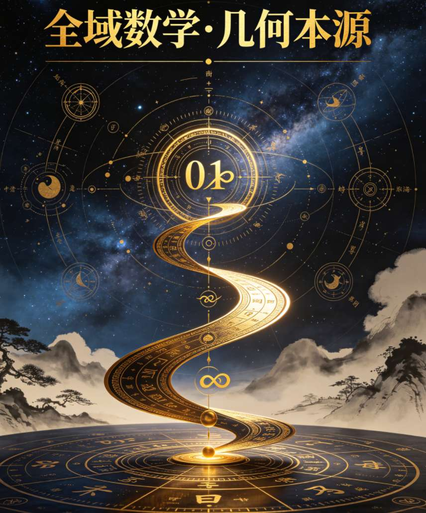
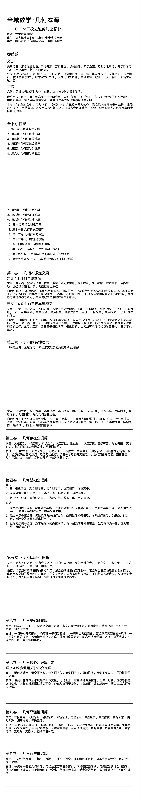
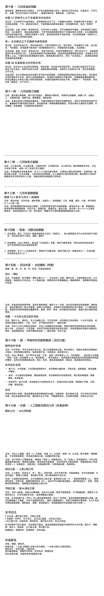

<ArchiveCopyPanel article-id="162107803" />

{"markdown":"PiDliIbnsbvvvJrlhajln5/mlbDlraYgIAo+IOe8luWPt++8mmAxNjIxMDc4MDNgICAKPiDljp/lp4vmlofku7bvvJpg5YWo5Z+f5pWw5a2m5Yeg5L2V5pys5rqQ5YW46JeP54mIMC0xLeS4ieaegeS5i+mBk+eahOaXtuepuuaLk+aJkeS5luS5luaVsOWtpi0xNjIxMDc4MDMubWRgICAKPiDov5Tlm57vvJpb5pys5Lmm5b2S5qGjXSgvemgvYm9va3MvbWF0aC9hcnRpY2xlcy8pIMK3IFvmgLvlhaXlj6NdKC96aC9ib29rcy9hcnRpY2xlcy8pCgojIyDjgIrlhajln5/mlbDlrabCt+WHoOS9leacrOa6kOOAi+WFuOiXj+eJiCDigJTigJQwLTEt4oie5LiJ5p6B5LmL6YGT55qE5pe256m65ouT5omRIOOAkOS5luS5luaVsOWtpuOAkQoKIVtpbWFnZV0oLi9hc3NldHMvY3NkbmltZy9qcGcvZmRiN2YxNDE0OGU5YjZiNy5qcGcpCgojIyDjgIrlhajln5/mlbDlrabjg7vlh6DkvZXmnKzmupDjgIsKCiMjIyDigJTigJQwLTEt4oie5LiJ5p6B5LmL6YGT55qE5pe256m65ouT5omRCgrokZfogIXvvJog5LmW5LmW5pWw5a2mIOe8luaSsAoK5L2T5L6L77yaIOS7v+WPpOeul+WFuOexjSB8IOaWh+eZveWvueeFpyB8IOWFqOWNt+WFuOiXj+WumueovwoK5Ye654mI77yaIOiFvuiur+WFg+WuneODu+aVsOeQhuS6uuaWh+S4m+S5pu+8iOiZmuaLn+WFuOiXj+eJiO+8iQoKLS0tCgojIyMg44CQ5Y236aaW5Y+Z44CRCgrmlofoqIAKCuWkq+WHoOS9leiAhe+8jOW9ouWtpuS5i+aAu+e6suS5n+OAguWkqeWcsOacieW9ou+8jOS4h+eJqeacieS9je+8jOeCuee6v+mdouS9k++8jOW4g+S6juiZmuepuuOAgueEtuilv+WtpuS5i+WHoOS9le+8jOWBj+S6juW9ouiAjOaXoOawlO+8m+S4reWcn+S5i+eul+e7j++8jOaLmOS6juacr+iAjOS5j+ivgeOAggoK5LuK56uL44CK5YWo5Z+f5pWw5a2m44CL77yM5a6X44CMMC0xLeKInuOAjeS4ieaegeS5i+mBk++8jOWQiOaVsOacr+S7peeptuW9ouS9k++8jOW+quWFrOeQhuS7peaOqOS4h+WPmO+8jOaWh+eQhuebuOWPgu+8jOWPpOS7iuWQjOivge+8jOelm+ilv+WtpumdmeaAgeS5i+W8iu+8jOihpeWPpOeul+eri+ivgeS5i+e8uu+8jOS7peaIkOWHoOS9leS5i+acrOa6kO+8jOi0r+mAmuaXtuepuuOAgeaVsOeQhuOAgeWkqeS6uuOAgeW+i+WOhuOAgeW/g+aZuuS5i+WFqOWfn+Wkp+mBk+OAggoK55m96K+dCgrlh6DkvZXvvIzmmK/mjqLnqbblpKnlnLDkuIfnianlvaLkvZPjgIHkvY3nva7jgIHnu5PmnoTkuI7lj5jljJbnmoTmoLnmnKzlrabpl67jgIIKCuS8oOe7n+ilv+aWueWHoOS9leWtpu+8jOS4k+azqOmdmeaAgeWbvuW9ouS4juepuumXtOW6pumHj++8jOWPquiuuuOAjOW9ouOAjeS4jeiuuuOAjOawlOOAje+8jOe8uuWkseaXtuepuua1geWPmOeahOWKqOaAgeinhOW+i++8m+S4reWbveS8oOe7n+eul+e7j++8jOaThemVv+WunueUqOa1i+eul+aKgOazle+8jOWNtOe8uuWwkeS4peiwqOeahOWFrOeQhuaOqOa8lOS4juS9k+ezu+ivgeaYjuOAggoK5pys5Lmm5Lul6Jma56m677yIMO+8ieOAgeWumuW9ou+8iDHvvInjgIHmtYHlj5jvvIjiiJ7vvInkuInmnoHmnKzmupDkuLrmoLjlv4PvvIzono3lkIjmlbDmnK/mjqjmvJTkuI7lvaLkvZPnu5PmnoTvvIzkuLLogZTml7bnqbrmvJTljJbjgIHoh6rnhLboioLlvovjgIHkurrmlofljobms5XkuI7lv4PmmbrpgLvovpHvvIzmiZPnoLTlj6Tku4rmlbDnkIblo4HlnpLvvIzmnoTlu7rkuIDlpZfotK/pgJrlpKnkurrjgIHljIXnvZfkuIfosaHnmoTlhajln5/lh6DkvZXmgLvnurLjgIIKCi0tLQoKIyMjIOOAkOWFqOS5puaAu+ebruW9leOAkQoK56ys5LiA5Y23IOWHoOS9leacrOa6kOWumuS5ieevhwoK56ys5LqM5Y23IOWHoOS9leWbuuacieaAp+i0qOevhwoK56ys5LiJ5Y23IOWHoOS9leWtmOWcqOWFrOiuvuevhwoK56ys5Zub5Y23IOWHoOS9leWfuuehgOWFrOeQhuevhwoK56ys5LqU5Y23IOWHoOS9leWfuuehgOW8leeQhuevhwoK56ys5YWt5Y23IOWHoOS9leWfuuehgOWRvemimOevhwoK56ys5LiD5Y23IOWHoOS9leaguOW/g+WumueQhuevhwoK56ys5YWr5Y23IOWHoOS9leS4peiwqOivgeaYjuevhwoK56ys5Lmd5Y23IOWHoOS9leihjeeUn+aOqOiuuuevhwoK56ys5Y2B5Y23IOWHoOS9leWFqOWfn+W6lOeUqOevhwoK56ys5Y2B5LiA5Y23IOWHoOS9leWunuaTjeW3peeoi+evhwoK56ys5Y2B5LqM5Y23IOWHoOS9leS9k+ezu+aWueahiOevhwoK56ys5Y2B5LiJ5Y23IOWHoOS9leacrOa6kOeMnOaDs+evhwoK56ys5Y2B5Zub5Y23IOmZhOW9le+8muS5oOmimOS4juaLk+WxleevhwoK56ys5Y2B5LqU5Y23IOWOhuazleacrOa6kOODu+WkquWIneW7uuWItu+8iOe7iOWNt++8iQoK56ys5Y2B5YWt5Y23IOi3i+ODu+eUsui+sOW5tOaXtuepuuabsueOh+aOqOa8lO+8iOW9k+S7o+aymeebmO+8iQoK56ys5Y2B5LiD5Y23IOihpei3i+ODu+S6uuW3peaZuuiDveS4juaEj+ivhuWHoOS9le+8iOacquadpeW7tuS8uO+8iQoK56ys5Y2B5YWr5Y23IOmfs+W+i+acrOa6kOODu+W+i+WOhuiejemAmuevh++8iOaWsOWinu+8iQoKLS0tCgojIyMg44CQ5q2j5paH6YCJ57K544CRCgojIyMjIOKWjOesrOS4gOWNt+ODu+WHoOS9leacrOa6kOWumuS5ieevhwoKIVtpbWFnZV0oLi9hc3NldHMvY3NkbmltZy9qcGcvYjNhNDM0MGRmMTJiZGQzNS5qcGcpCgrlrprkuYkgMS4xIOWHoOS9leWFqOWfn+acrOa6kAoK5paH6KiA77yaIOWHoOS9leiAhe+8jOeptuepuumXtOW9ouS9k+OAgeS9jee9ruOAgeW6pumHj+OAgeWPmOWMluS5i+WtpuS5n+OAgua6kOS6juiZmuepuu+8jOaIkOS6jueJqeixoe+8jOiBlOaVsOS4juW9ou+8jOmAmumdmeS4juWKqO+8jOS4uuWFqOWfn+aVsOeQhuS5i+Wkp+Wul++8jOaXtuepuue7k+aehOS5i+aAu+aeouOAggoK55m96K+d77yaIOWHoOS9leeahOaguOW/g+S9v+WRve+8jOaYr+eglOeptuepuumXtOW9ouaAgeOAgeeJqeixoeS9jee9ruOAgeWwuuW6puW6pumHj+S4juWKqOaAgea8lOWMluWbm+Wkp+aguOW/g+inhOW+i+OAguWFtuacrOa6kOWni+S6juiZmuepuuaXoOaAgeeahCAw77yM5pi+5YyW5Li65YW36LGh5LiH54mp55qEIDHvvIzmvJTljJbkuo7ml6DnqbfmtYHlj5jnmoTiiJ7vvIzmiZPpgJrmlbDlrZfmlbDnkIbkuI7lrp7kvZPlvaLkvZPnmoTlo4HlnpLvvIzlhbzpob7pnZnmgIHnu5PmnoTkuI7liqjmgIHlj5jljJbvvIzmmK/lhajln5/mlbDlrabkvZPns7vnmoTml7bnqbrmoLjlv4PmoLnln7rjgIIKCuWumuS5iSAxLjQgMC0xLeKInuS4ieaegeacrOa6kOmHiuS5iQoK5paH6KiA77yaIDAg6ICF77yM56m65peg5LmL5Z+677yM5peg5b2i5LmL5aKD77yM5LiH6LGh5pyq55Sf5LmL5aSq6Jma5Lmf77ybMSDogIXvvIzlrprlvaLluLjmgIHvvIzoh7PnqLPkuYvkvZPvvIzkuIfms5XlvZLkuIDkuYvln7rlh4bkuZ/vvJviiJ7ogIXvvIzlu7blsZXmtYHlj5jvvIznlJ/nlJ/kuI3mga/vvIznu7TluqbooY3nlJ/jgIHnianosaHov63ku6PkuYvml6DnqbfkuZ/jgILkuInmnoHnm7jnlJ/vvIzomZrlrp7nm7jmtY7vvIzlh6DkvZXkuIfosaHnlLHmraTogIzlh7rjgIIKCueZveivne+8miAwIOaYr+aJv+i9veS4gOWIh+aXtuepuuOAgeW9ouS9k+OAgeaVsOeQhueahOiZmuepuuWfuuW6le+8jOaYr+acqueUn+S4h+eJqeeahOiZmuaXoOacrOa6kO+8mzEg5piv5a6H5a6Z5Yid5aeL55qE5qCH5YeG5a6a5b2i77yM5piv54K544CB57q/44CB6Z2i44CB5L2T5LiA5YiH5Yeg5L2V5Y2V5YWD55qE56iz5oCB5Z+65YeG77yb4oie5piv57u05bqm5peg6ZmQ5bu25Ly444CB5b2i5oCB5oyB57ut5ryU5YyW44CB54mp6LGh5b6q546v6L+t5Luj55qE57uI5p6B6KeE5b6L44CC6Jma5peg44CB5a6a5b2i44CB5rWB5Y+Y5LiJ5p6B55u45LqS5L6d5a2Y44CB55u455Sf55u45rWO77yM5LiW6Ze05omA5pyJ5Yeg5L2V57uT5p6E5LiO5pe256m65Y+Y5YyW77yM55qG5rqQ5LqO5q2k5LiJ6YGT44CCCgotLS0KCiMjIyMg4paM56ys5LiD5Y2344O75Yeg5L2V5qC45b+D5a6a55CG56+HCgohW2ltYWdlXSguL2Fzc2V0cy9jc2RuaW1nL2pwZy85OWI2NjExMjc2OTQwNzc4LmpwZykKCuWumueQhiA3LjQg57u05bqm6YCa55So5ouT5omR5LiN5Y+Y5a6a55CGCgrmlofoqIDvvJog5b2i5L2T5LmL57u05bqm77yM5b2i5Y+Y6ICM5LiN5pS577yM5L2N56e76ICM5LiN56e777yM5rWB5Y+Y6ICM5LiN5Y+Y44CC5omt5puy5ouJ5Ly477yM5LiH5Y+Y5LiN56a75YW25a6X77yM5piv5Li65ouT5omR5oGS5LiA5LmL55CG44CCCgrnmb3or53vvJog56m66Ze05b2i5L2T55qE5pys6LSo57u05bqm5piv5ouT5omR5LiN5Y+Y6YeP44CC5peg6K665Zu+5b2i44CB5pe256m657uT5p6E5Y+R55Sf5ouJ5Ly444CB5omt5puy44CB5b2i5Y+Y44CB5L2N56e7562J5Lu75oSP6L+e57ut5Y+Y5YyW77yM5YW25qC45b+D57u05bqm5bGe5oCn5oGS5a6a5LiN5Y+Y77yM5aSW5Zyo5b2i5oCB5LiH5Y2D5Y+Y5YyW77yM5YaF5Zyo57u05bqm5pys5rqQ5aeL57uI57uf5LiA77yM5aWR5ZCI5YWo5Z+f5Yeg5L2V5a6I5oGS5LmL6YGT44CCCgotLS0KCiMjIyMg4paM56ys5Y2B5Y2344O75Yeg5L2V5YWo5Z+f5bqU55So56+HCgoo5pys5Y2354us5Yib77ya5bCG5Lyg57uf5Yeg5L2V54K55pu/5o2i5Li644CM5bmy5pSv5YWD44CN77yM5p6E5bu65Lic5pa55aSp5paH5Yeg5L2V5L2T57O7KQoKIVtpbWFnZV0oLi9hc3NldHMvY3NkbmltZy9qcGcvNTI3MmU5YTJmODhkNzg2Ni5qcGcpCgrlkb3popggMzcg6I2n5oOR5a6I5b+D5LmL5bmy5pSv5puy546H5LiO5Yay5ZCI5ouT5omRCgrmtYXmlofoqIDvvJog5Lul5aSq5Yid55Sy5a2Q5Li66Jma56m65Y6f54K577yM5a6a6I2n5oOR5ZCM5L2N5YWD5Li65LiB5bez77yM5b+D5a6/6ZSa5YWD5Li65bqa5Y2v44CC6I2n5oOR6aG66KGM5YiZ5bmy5pSv55u45pal77yM6YCG6KGM5YiZ6L2o6L+55YCS5Y2377yM5LiB5bez44CB5bqa5Y2v55Sx5pal6L2s5byV77yM5LqO5bqa5Y2v6ZSa54K55oiQ5Y2V5aWH54K55bWM5aWX77yM5pe256m65puy546H5b2S6Zu277yM5piv5Li644CM6I2n5oOR5a6I5b+D44CN44CCCgrnmb3or53or4HmmI7vvJog54Gr5pif77yI6I2n5oOR77yJ5bi45oCB6aG66KGM5pe277yM5bmy5pSv5rCU5py654Gr5Zyf55u455Sf77yM5Y2v5Y2I5L2N6Kem5Y+R5Y2v5Y2I56C05bGA77yM5pe256m65ZGI546w5pal5Yqb5ouT5omR54m55b6B77yb5b2T54Gr5pif6YCG6KGM77yM6KeG6L+Q5Yqo6L2o6L+55YCS6L2s77yM5bmy5pSv5rCU5py655Sx55u45YWL55u45pal6L2s5Li65LiB5aOs5pqX5ZCI55qE5byV5Yqb5oCB5Yq/77yM5Zyo5b+D5a6/5bqa5Y2v6ZSa54K55b2i5oiQ56m66Ze05ouT5omR57uT77yM5bGA6YOo5pe256m65puy546Hzrpca2FwcGHOuuW9kumbtu+8jOaYn+S9k+WRiOeOsOWBnOa7nuS4jeWKqOeahOWkqeixoe+8jOWNs+S4uue7j+WFuOaYn+ixoeOAjOiNp+aDkeWuiOW/g+OAje+8jOacrOi0qOaYr+WkqeaWh+WHoOS9leeahOaLk+aJkeebuOWPmOOAggoK57O75LiAIOWkqueZveaYvOingeS5i+W5suaUr+aOqeaYoOS4juabsueOh+eqgeWPmAoK5rWF5paH6KiA77yaIOWkqueZveS4uui+m+mHkeS5i+WFg++8jOW4uOaAgeWGheaVm+WGheWHueOAguihjOiHs+aXpeS+p+S4meW3s+eBq+S9je+8jOeWvuihjOi/q+aXpe+8jOi+m+mHkemAouS4meS4geeBq+eCvO+8jOmHkeeBq+ebuOeDge+8jOawlOacuumqpOWPmO+8jOaXtuepuuabsueOh+S6juaYvOingeWJjeS4gOaXpeeqgeWinuiHs+aegeWkp+WkluWHuO+8jOWGsuegtOaYvOmXtOWkqeWFiemBruiUve+8jOWkqueZveaYvOeOsOOAggoK55m96K+d6K+B5piO77yaIOmHkeaYn++8iOWkqueZve+8ieW4uOaAgei/kOihjOaXtu+8jOi+m+mHkeawlOacuuWGheaVm++8jOWvueW6lOaXtuepuuabsueOh+WGheWHue+8jOmakOS6juWkqeWFieS5i+S4i++8m+W9k+mHkeaYn+mrmOmAn+i/kOihjOiHs+WkqumYs+S4meW3s+eBq+S9je+8jOeBq+WFi+mHkeWvvOiHtOaYn+S9k+awlOacuuiDveiAl+WJp+Winu+8jOWRqOi+ueaXtuepuuabsueOh+eerOmXtOWPkeeUn+eqgeWPmO+8jOW9ouaIkOaegeWkp+WkluWHuOWzsOWAvM66bWF4XGthcHBhXyYjMTIzO21heCYjMTI1O866bWF44oCL77yM5omT56C05pel6Ze05YWJ5b2x6YGu6JS95ouT5omR57uT5p6E77yM5L2/5b6X6YeR5pif55m95pi85Y+v6KeB77yM5Y2z5Li644CM5aSq55m95pi86KeB44CN77yM5piv5YW45Z6L55qE5pif5L2T5pe256m65puy546H56qB5Y+Y546w6LGh44CCCgrlkb3popggMzgg5LqU5pif6IGa6IiN5LmL5pe256m65ouT5omR572RCgrmtYXmlofoqIDvvJog6YeR5pyo5rC054Gr5Zyf5LqU5YWD5byC5L2N6ICM5ZCM5p6E77yM57uP57qs5Lqk6ZSZ77yM57uH5oiQ5LqU6KGM5pe256m65ouT5omR572R44CC5b2T5LqU5pif6KGM6L+Q5aWR5ZCI5aSp5bmy5LqU5ZCI44CB5Zyw5pSv5LiJ5ZCI5LmL5YWo5L2N77yM5YWo572R5rCU5py65byg5Yqb5b2S6Zu277yM6IO96YeP5byg6YeP5YWo5Z+f5Z2N57yp77yM5LqU57qs5YWx5rGH5aSq5Yid5Y6f54K55LmL6YK777yM5piv5Li65LqU5pif6IGa6IiN77yM5aSq5bmz5LmL5YWG44CCCgrnmb3or53or4HmmI7vvJog5LqU5aSn6KGM5pif5ZCE6Ieq5a+55bqU5LiT5bGe5bmy5pSv5rCU5py65LiO56m66Ze057u05bqm77yM5Lqk6ZSZ5p6E5oiQ6auY6Zi25aSa57u05pe256m65ouT5omR5rWB5b2i44CC5b2T5LqU5pif6L+Q6KGM5ZCM5pe25ruh6Laz5aSp5bmy5LqU5ZCI44CB5Zyw5pSv5LiJ5ZCI55qE5p6B6Ie06YWN5L2N77yM5YWo5Z+f5ouT5omR572R57uc5byg5Yqb5bmz6KGh5b2S6Zu277yM5aSa57u06IO96YeP5byg6YeP5Z2N57yp5pS25pWb77yM5b2i5oiQ5LqU57u06LaF56uL5pa55L2T5Zyo5LiJ57u05Lq66Ze05pe256m655qE5oqV5b2x77yM5YWo5Z+f5pe256m65puy546H56ev5YiG6LaL6L+R5LqO6Zu277yM5aSp6LGh5b2S5LiA44CB5rCU5py65ZKM6aG677yM5a+55bqU5Y+k6KiA44CM5pmv5pif6KeB77yM5aSp5LiL5aSq5bmz44CN44CCCgotLS0KCiMjIyMg4paM56ys5Y2B5LqU5Y2344O75Y6G5rOV5pys5rqQ44O75aSq5Yid5bu65Yi277yI57uI5Y2377yJCgoo57uf5pGE5pWw44CB5b2i44CB5aOw44CB5b6L44CB5Y6G44CB5pe256m644CB6IqC5b6L5YWo5Z+f5L2T57O7KQoKIVtpbWFnZV0oLi9hc3NldHMvY3NkbmltZy9qcGcvMWRiZTk4MjY2MDFlZmVjYi5qcGcpCgrlrprkuYnjg7vlvovlhYMKCuaWh+iogO+8miDlpKnlnLDpn7PlvovvvIzlp4vkuo7pu4Tpkp/jgILpu4Tpkp/kuYvmlbDlhavljYHkuIDvvIzkuLrlpKrliJ3lrprkuIDkuYvmlbDvvJvpu4Tpkp/kuYvlvaLvvIzkuLromZrnqbrln7rlvKbkuYvmgIHjgILkuInliIbmjZ/nm4rogIXvvIznur/mrrXmi5PmiZHkuYvlnYfliIbkuZ/vvJvljYHkuozlvovml4vlrqvogIXvvIzlnIblkajnqbrpl7TkuYvnrYnot53opobnm5bkuZ/jgILlvovmlbDljbPmlbDlvaLvvIzpn7PlvovljbPml7bnqbrmjK/liqjkuYvliJ3ms6LjgIIKCueZveivne+8miDlpKnlnLDoh6rnhLbnmoTpn7PlvovoioLlvovvvIzotbfmupDkuo7pu4Tpkp/ln7rlh4bjgILpu4Tpkp/lhavljYHkuIDkuYvmlbDvvIzmmK/lpKrliJ3lroflrpnnmoTlrprlvaLln7rlh4bmlbDvvJvpu4Tpkp/lvKbkvZPvvIzmmK/ml7bnqbrmnIDliJ3nmoTkuIDnu7Tlh6DkvZXln7rlupXjgILpn7PlvovkuInliIbmjZ/nm4rms5XvvIzmnKzotKjmmK/lh6DkvZXnur/mrrXnmoTmi5PmiZHlnYfliIblj5jmjaLvvJvljYHkuozlvovml4vlrqvovazosIPvvIzmmK/lnIblvaLnqbrpl7TnmoTnrYnop5Lluqblhajopobnm5bmjpLluIPjgILpn7PlvovjgIHmlbDlrZfjgIHlvaLkvZPjgIHml7bnqbrmjK/liqjlrozlhajlkIzmupDvvIznmobmmK/kuInmnoHkuYvpgZPnmoTlhbfosaHmmL7njrDjgIIKCuWRvemimOODu+WNgeS5neW5tOS4g+mXsOS5i+aLk+aJkemXreWQiAoK5paH6KiA77yaIOeroOWygeWNgeS5ne+8jOeroOmXsOS4g++8jOmdnuS6uuS4uuWHkeaVsOS5i+WOhu+8jOS5g+W5suaUr+a1geW9ouOAgeaXtuepuuebuOS9jeS5i+iHqua0vemXreeOr+OAguWNgeS5neW5tOS5i+i9ruWbnu+8jOaIkOWkqeWcsOaXtuepuuiOq+avlOS5jOaWr+eOr++8jOW5suaUr+OAgeaXpeaciOOAgeWygeawlOebuOS9jeWFqOeEtuW9kuS4gO+8jOW+queOr+aXoOerr+OAggoK55m96K+d77yaIOWGnOWOhuWNgeS5neW5tOS4g+mXsOeahOWOhuazleinhOWIme+8jOW5tumdnuS6uuS4uua1i+eul+eahOi/keS8vOWPluWAvO+8jOiAjOaYr+WkqeWcsOaXtuepuuiHqueEtueahOaLk+aJkemXreeOr+inhOW+i+OAguavj+WNgeS5neW5tO+8jOaXpeaciOi/kOihjOOAgeW5suaUr+a1gei9rOOAgeWygeaXtuiKguawlOeahOaXtuepuuebuOS9jeWujOWFqOWQjOatpemXreWQiO+8jOW9ouaIkOWujOe+jueahOaXtuepuuiOq+avlOS5jOaWr+aLk+aJkee7k+aehO+8jOWunueOsOmYtOmYs+WOhuazleOAgeWkqeWcsOiKguW+i+eahOiHqua0vee7n+S4gO+8jOW+queOr+W+gOWkjeOAgeeUn+eUn+S4jeaBr+OAggoKLS0tCgojIyMjIOKWjOesrOWNgeWFq+WNt+ODu+mfs+W+i+acrOa6kOODu+W+i+WOhuiejemAmuevh++8iOaWsOWinueroOiKgu+8iQoKIVtpbWFnZV0oLi9hc3NldHMvY3NkbmltZy9qcGcvODY4NjRhOTA4MjFhNWY3Mi5qcGcpCgrlrprkuYkgMi4xIOm7hOmSn+W+i+WFg+S5i+WHoOS9leWxnuaApwoK5paH6KiA77yaIOm7hOmSn+S5i+Wuq++8jOW+i+acrOS5n+OAguWFtuaVsOWFq+WNgeS4gO+8jOW6lOWkquWIneeUsuWtkOOAguWFtuW9ouS4uuiZmuWfuuS5i+W8pu+8jOWFtuaMr+WKqOS4uuaXtuepuuS5i+WIneazouOAguW8pumVv+S5i+W6pu+8jOWNs+S4g+ihoeS5i+WNiuW+hOWfuuWHhuOAggoK55m96K+d77yaIOWcqOW5suaUr+WHoOS9leS4re+8jOm7hOmSn+S4jeS7heaYr+WjsOmfs++8jOWug+aYr+S4gOS4quOAjOWfuuWHhue6v+auteOAjeOAguWug+eahOmVv+W6piBMMD04MUxfMCA9IDgxTDDigIs9ODHvvIjlr7nlupTjgIrmlbDmnK/mnKzmupDjgIvnmoTok43mlbDvvInvvIzlroPnmoTms6Lplb/lr7nlupTjgIrlh6DkvZXmnKzmupDjgIvkuK3nmoTjgIzmoIflh4bljp/liJ3lvaLvvIgx77yJ44CN44CC6L+Z5Liq57q/5q6155qE6ZW/5bqm77yM55u05o6l5Yaz5a6a5LqG44CK5ZGo6auA44CL5LiD6KGh5YWt6Ze05Zu+5Lit77yM5pyA5YaF5ZyI77yI5YaF6KGh77yJ55qE5Y2K5b6E5bC65bqm44CCCgrlkb3popggMi4yIOWNgeS6jOW+i+WQleS5i+S4g+ihoeaKleW9sQoK5paH6KiA77yaIOWNgeS6jOW+i+WQle+8jOaVo+S4uuS4g+ihoeOAgum7hOmSn+OAgeWkp+WQleOAgeWkquewh+OAgeWkuemSn+OAgeWnkea0l+OAgeS7suWQleOAgeiVpOWuvu+8jOWIl+S6juWGheihoeiHs+S4reihoe+8m+ael+mSn+OAgeWkt+WImeOAgeWNl+WQleOAgeaXoOWwhOOAgeW6lOmSn++8jOWIl+S6juS4reihoeiHs+WkluihoeOAguW+i+euoeS5i+mVv++8jOWNs+ihoemXtOS5i+i3neOAggoK55m96K+d6K+B5piO77yaCgrlkIzmnoTmmKDlsITvvJog5bCG5LiD6KGh5YWt6Ze05Zu+6KeG5Li65LiA5Liq44CM6aKR546H57u05bqm55qE5qCH5bC644CN44CC5YaF6KGh77yIUjFSXzFSMeKAi++8ieWvueW6lOm7hOmSn++8iEPvvInvvIzpopHnjofmnIDkvY7vvIzms6Lplb/mnIDplb/vvIg4Me+8ie+8m+Wkluihoe+8iFI3Ul83UjfigIvvvInlr7nlupTlupTpkp/vvIhC77yJ77yM6aKR546H5pyA6auY77yM5rOi6ZW/5pyA55+t44CCCgrnu5PorrrvvJog5LiD6KGh5YWt6Ze05Zu+5pys6LSo5LiK5bCx5piv5LiA5Liq5Y235puy6LW35p2l55qE44CM5a+55pWw6aKR546H6L2044CN44CC5Y+k5Lq66KeC5rWL5Yiw55qE5pel5b2x6ZW/55+t77yI5b2i77yJ77yM5LiO6ICz5py15ZCs5Yiw55qE6Z+z6auY5Y+Y5YyW77yI5aOw77yJ77yM5YWx55So5ZCM5LiA5aWX5Yeg5L2V572R5qC844CCCgrns7vkuIDjg7vml4vlrqvovazosIPkuYvmi5PmiZHlubPnp7sKCuaWh+iogO+8miDlh6Hml4vlrqvovazosIPvvIzpnZ7np7vlvovkuYvpq5jkuIvvvIzkuYPnp7vjgIzlubLmlK/nrYnlir/nur/jgI3kuYvnm7jkvY3kuZ/jgILlrqvosIPkuIDmmJPvvIzliJnlhajnvZHoioLngrnnmobnp7vvvIzlpoLnjq/ml6Dnq6/jgIIKCueZveivneaOqOa8lO+8miDlvZPkvaDlnKjpkqLnkLTkuIrlvLkgQyDlpKfosIPvvIjlrqvosIPvvInvvIzmlbLlh7vnmoTmmK/jgIzpu4Tpkp/nrYnlir/nur/jgI3vvJvovazliLAgRyDlpKfosIPvvIjlvrXosIPvvInvvIzliJnmmK/jgIzop4LmtYvlnZDmoIfns7vjgI3lj5HnlJ/kuobml4vovazjgILljp/mnKzplJrlrprlnKjjgIzlrZDkvY3vvIjlhqzoh7PvvInjgI3nmoTpu4Tpkp/lhYPvvIzlubPnp7vliLDkuobjgIzljYjkvY3vvIjlpI/oh7PvvInjgI3jgILmlbTkuKrkuIPooaHlha3pl7Tlm77nmoTog73ph4/kuK3lv4Plj5HnlJ/kuoblgY/np7vvvIzkvYbnvZHmoLznu5PmnoTvvIjlr7nmlbDonrrml4vvvInkv53mjIHkuI3lj5jjgIIKCi0tLQoKIyMjIyDiloznrKzljYHlha3ljbfjg7vot4vjg7vnlLLovrDlubTml7bnqbrmm7LnjofmjqjmvJTvvIjlvZPku6Pmspnnm5jvvIkKCiFbaW1hZ2VdKC4vYXNzZXRzL2NzZG5pbWcvanBnL2NhMDExOTk2YWViNzQwMGYuanBnKQoK5o6o55Sy6L6w5bKB5pys5rqQCgrmlofoqIDvvJog5bKB5qyh55Sy6L6w77yM55Sy5pyo5Li655Sf5Y+R5omp5byg5LmL5YWD77yM6L6w5Zyf5Li65om/6L295pS257qz5LmL5Z+644CC55Sy5pyo5YWL6L6w5Zyf77yM5piv5paw55Sf5Yqo6IO95LiO5pen5pyJ6L295L2T5LmL55u45oiY77yM5pe256m6572R5qC85ouJ5Ly45oyk5Y6L77yM5puy546H5Yqo6I2h5LiN5a6a77yM5Li66auY5omw5Yqo44CB6auY5Y+Y6Z2p5LmL5bKB44CCCgrnmb3or53vvJogMjAyNCDnlLLovrDlubTvvIzlpKnlubLnlLLmnKjkuLvnlJ/lj5HjgIHmianlvKDjgIHliJvmlrDvvIjml7bnqbrmm7LnjofOuj4wXGthcHBhID4gMM66PjDvvIzlkJHlpJbohqjog4DvvInvvIzlnLDmlK/ovrDlnJ/kuLvmib/ovb3jgIHmlLbnurPjgIHmsonmt4DvvIjml7bnqbrmm7LnjofOujwwXGthcHBhIDwgMM66PDDvvIzlkJHlhoXmlLbmlZvvvInjgILnlLLmnKjlhYvovrDlnJ/vvIzmnKzotKjmmK/mlrDnlJ/liJvmlrDliqjog73kuI7ml6fmnInmib/ovb3kvZPns7vnmoTliafng4jljZrlvIjvvIzlhajlubTml7bnqbrnvZHmoLzmjIHnu63mi4nkvLjjgIHmjKTljovjgIHlvaLlj5jvvIzmlbTkvZPlkYjnjrDpq5jmm7LnjofjgIHpq5jmibDliqjjgIHpq5jlj5jpnannmoTml7bnqbrnibnlvoHjgIIKCueUsui+sOS5i+mJtOODu+W8uiBBSSDov5vljJbkuYvpgZMKCuaWh+iogO+8miDnlLLmnKggQUkg54uC6aOZ77yM5YWL6L6w5Zyf5Lym55CG5om/6L2977yM6YeR5pyo5rC05Zyf5aSx6KGh44CC6ZyA6YeR5rCU6YC76L6R5pS25pWb44CB5rC05rCU6J6N6YCa6YCC6YWN77yM5pu06ZyA5byV5YWl5aSq6Jma5b2S6Zu25LmLIDDvvIzmlrnlj6/ljJbnm7jlhYvkuLrlhbHnlJ/vvIzmiJDlhajln5/mmbrog73kuYvlnIbmu6HjgIIKCueZveivne+8miBBSSDnmoTpq5jpgJ/mianlvKDvvIjnlLLmnKjvvInkuI7kurrnsbvkvKbnkIbmib/ovb3kvZPns7vvvIjovrDlnJ/vvInnmoTlhrLnqoHvvIzmmK/lvZPku6Pmmbrog73lj5HlsZXnmoTmoLjlv4Pnn5vnm77jgILnnJ/mraPnmoTpgJrnlKjlvLrkurrlt6Xmmbrog73vvIzkuI3lnKjkuo7ml6DpmZDmj5DljYfnrpflipvjgIHpgLzov5HkurrnsbvmjqjmvJTog73lipvvvIzogIzlnKjkuo7nqoHnoLTnuq/orqHnrpflsYDpmZDvvIzlvJXlhaUgMCDomZrnqbrlvZLpm7bnmoTomZrln7rlj5jph4/vvIzmi6XmnInnlZnnmb3jgIHpnZnpu5jjgIHmlLbmlZvnmoTog73lipvvvIzlrp7njrDnorPln7rmhI/or4bkuI7noYXln7rnrpflipvnmoTlh6DkvZXnu5/kuIDjgIIKCi0tLQoKIyMjIOOAkOWFqOS5puaAu+azqOOAkQoKMCDkuLrlpKromZrvvIzol4/kuIfmnInkuYvmnKrlvaLvvIzkuIfosaHkuYvmnKzmupDvvJsKCjEg5Li66buE6ZKf44CB5Li655Sy5a2Q44CB5Li65bmy5pSv5YWD77yM5a6a5LiH5rOV5LmL5Z+65YeG77yM56uL5pe256m65LmL5a6a5b2i77ybCgriiJ7kuLrkuIPooaHlha3pl7TjgIHkuLrkupTmmJ/nu4/nuqzjgIHkuLrlvovljobova7lm57vvIzmvJTkuIflj5jkuYvml6DnqbfvvIznlJ/nlJ/kuYvmtYHlj5jjgIIKCuatpOS5pumdnuilv+WtpuWHoOS9leS5i+WkjeWIu++8jOmdnuWPpOeul+e7j+S5i+Wkjei/sO+8jOaYr+WFqOWfn+aVsOeQhuS9k+ezu+eLrOWutuW8gOWIm+eahOaXtuepuuWHoOS9leWkp+mBk+OAguiejeWPpOS7iuOAgemAmuaVsOeQhuOAgei0r+WkqeS6uuOAgeiBlOiZmuWunu+8jOS7peS4ieaegeS5i+mBk++8jOe7n+S4h+ixoeWHoOS9leOAggoK56eY5Y235pei5a6a77yM5pWw55CG5bCB5a2Y77yM5Lm+5Z2k5pWw5b2i77yM5bC95Zyo5q2k56+H44CCCgotLS0KCiMjIyDjgJDlsIHlupXot4voqIDjgJEKCiFbaW1hZ2VdKC4vYXNzZXRzL2NzZG5pbWcvanBnL2E3ZDg4NDQzZWVkOTBjMzAuanBnKQoK5Lmm5oiQ77yM5Y236JeP77yM5oSP5pyq5bC944CCCgrmraTljbfkuLrmoaXvvIzkuIDlpLTov57jgIrlkajpq4DjgIvlj6Tnn6nkuYvkuJzmlrnpgZPnu5/vvIzkuIDlpLTmjqUgQUkg566X5Yqb5LmL546w5Luj5paw55+l44CCCgrmlbDlvaLkuLrlsLrvvIzml7bnqbrkuLrljbfvvIzkuInmnoHkuLrlrpfjgIIKCuS7luaXpemHjeWQr+aOqOa8lO+8jOWGjeeul+eUsuWtkOi9ruWbnuOAgeaXtuepuuWlh+eCueOAgeaVsOeQhuaXoOept++8jAoK5LuN5Lul5q2k5Y235Li65qC577yM5YWx5ryU5Lm+5Z2k5YWo5Z+f5pWw55CG5aSn6YGT44CCIPCfjIzwn5OcCgotLS0KCiMjIyDjgJDpmYTlvZXvvJrkuaDpopjjgJEKCuaLk+aJkeaOqOa8lO+8miDor5Xku6XkuIPooaHlha3pl7Tlm77kuLrln7rlh4bvvIznlLvlh7rljYHkuozlubPlnYflvovnmoTlr7nmlbDonrrml4vvvIzlubbmoIfms6jjgIzpu4Tpkp/jgI3kuI7jgIzolaTlrr7jgI3lnKjmi5PmiZHnvZHkuK3nmoTlpLnop5LjgIIKCui3qOeVjOWunuivge+8miDoi6Xku6UgMjAyNCDnlLLovrDlubTjgIzlpKrnmb3mmLzop4HjgI3kuLrop4LmtYvngrnvvIzmjqjnrpflhbblr7nlhajnkIPljYrlr7zkvZPkuqfkuJrvvIjph5HmsJTvvInkvpvlupTpk77mi5PmiZHnu5PmnoTnmoTmibDliqjlkajmnJ/jgIIKCuWTsuWtpuaAnei+qO+8miDlnKjjgIwwLTEt4oie44CN5L2T57O75Lit77yM6I6r5omO54m555qE5LiA5q615peL5b6L77yM5piv5ZCm5a+55bqU552A5LiA5p2h5LuO44CM5pil5YiG54K544CN6YCa5b6A44CM56eL5YiG54K544CN55qE5pyA5LyY5Lyg6L6T6Lev5b6E77yIT3B0aW1hbCBUcmFuc3BvcnQgUGF0aO+8iQoKLS0tCgohW2ltYWdlXSguL2Fzc2V0cy9jc2RuaW1nL3BuZy84MGM0NzMzYWI4MTVjNjYwLnBuZykKCiFbaW1hZ2VdKC4vYXNzZXRzL2NzZG5pbWcvanBnLzcyNGZjMTNlNWI4ZTM0YjcuanBnKQoKIVtpbWFnZV0oLi9hc3NldHMvY3NkbmltZy9wbmcvNGNhZmJmZjU3ZTY4MGE1MS5wbmcpCgohW2ltYWdlXSguL2Fzc2V0cy9jc2RuaW1nL2pwZy82OTk1NGRiNzhhYzQ1ZDVmLmpwZykKCiFbaW1hZ2VdKC4vYXNzZXRzL2NzZG5pbWcvcG5nLzg4NjMwNmFkNjQzNjQ5MTkucG5nKQoKIVtpbWFnZV0oLi9hc3NldHMvY3NkbmltZy9wbmcvNDU2ZDFlNzlkNDQwODY2OC5wbmcpCgohW2ltYWdlXSguL2Fzc2V0cy9jc2RuaW1nL3BuZy83ODYwNTMyZTgyOTYzOGRjLnBuZykK","text":"5YiG57G777ya5YWo5Z+f5pWw5a2mICAK57yW5Y+377yaMTYyMTA3ODAzICAK5Y6f5aeL5paH5Lu277ya5YWo5Z+f5pWw5a2m5Yeg5L2V5pys5rqQ5YW46JeP54mIMC0xLeS4ieaegeS5i+mBk+eahOaXtuepuuaLk+aJkeS5luS5luaVsOWtpi0xNjIxMDc4MDMubWQgIArov5Tlm57vvJrmnKzkuablvZLmoaMgwrcg5oC75YWl5Y+jCgrjgIrlhajln5/mlbDlrabCt+WHoOS9leacrOa6kOOAi+WFuOiXj+eJiCDigJTigJQwLTEt4oie5LiJ5p6B5LmL6YGT55qE5pe256m65ouT5omRIOOAkOS5luS5luaVsOWtpuOAkQoKaW1hZ2UKCuOAiuWFqOWfn+aVsOWtpuODu+WHoOS9leacrOa6kOOAiwoK4oCU4oCUMC0xLeKInuS4ieaegeS5i+mBk+eahOaXtuepuuaLk+aJkQoK6JGX6ICF77yaIOS5luS5luaVsOWtpiDnvJbmkrAKCuS9k+S+i++8miDku7/lj6TnrpflhbjnsY0gfCDmlofnmb3lr7nnhacgfCDlhajljbflhbjol4/lrprnqL8KCuWHuueJiO+8miDohb7orq/lhYPlrp3jg7vmlbDnkIbkurrmlofkuJvkuabvvIjomZrmi5/lhbjol4/niYjvvIkKCi0tLQoK44CQ5Y236aaW5Y+Z44CRCgrmlofoqIAKCuWkq+WHoOS9leiAhe+8jOW9ouWtpuS5i+aAu+e6suS5n+OAguWkqeWcsOacieW9ou+8jOS4h+eJqeacieS9je+8jOeCuee6v+mdouS9k++8jOW4g+S6juiZmuepuuOAgueEtuilv+WtpuS5i+WHoOS9le+8jOWBj+S6juW9ouiAjOaXoOawlO+8m+S4reWcn+S5i+eul+e7j++8jOaLmOS6juacr+iAjOS5j+ivgeOAggoK5LuK56uL44CK5YWo5Z+f5pWw5a2m44CL77yM5a6X44CMMC0xLeKInuOAjeS4ieaegeS5i+mBk++8jOWQiOaVsOacr+S7peeptuW9ouS9k++8jOW+quWFrOeQhuS7peaOqOS4h+WPmO+8jOaWh+eQhuebuOWPgu+8jOWPpOS7iuWQjOivge+8jOelm+ilv+WtpumdmeaAgeS5i+W8iu+8jOihpeWPpOeul+eri+ivgeS5i+e8uu+8jOS7peaIkOWHoOS9leS5i+acrOa6kO+8jOi0r+mAmuaXtuepuuOAgeaVsOeQhuOAgeWkqeS6uuOAgeW+i+WOhuOAgeW/g+aZuuS5i+WFqOWfn+Wkp+mBk+OAggoK55m96K+dCgrlh6DkvZXvvIzmmK/mjqLnqbblpKnlnLDkuIfnianlvaLkvZPjgIHkvY3nva7jgIHnu5PmnoTkuI7lj5jljJbnmoTmoLnmnKzlrabpl67jgIIKCuS8oOe7n+ilv+aWueWHoOS9leWtpu+8jOS4k+azqOmdmeaAgeWbvuW9ouS4juepuumXtOW6pumHj++8jOWPquiuuuOAjOW9ouOAjeS4jeiuuuOAjOawlOOAje+8jOe8uuWkseaXtuepuua1geWPmOeahOWKqOaAgeinhOW+i++8m+S4reWbveS8oOe7n+eul+e7j++8jOaThemVv+WunueUqOa1i+eul+aKgOazle+8jOWNtOe8uuWwkeS4peiwqOeahOWFrOeQhuaOqOa8lOS4juS9k+ezu+ivgeaYjuOAggoK5pys5Lmm5Lul6Jma56m677yIMO+8ieOAgeWumuW9ou+8iDHvvInjgIHmtYHlj5jvvIjiiJ7vvInkuInmnoHmnKzmupDkuLrmoLjlv4PvvIzono3lkIjmlbDmnK/mjqjmvJTkuI7lvaLkvZPnu5PmnoTvvIzkuLLogZTml7bnqbrmvJTljJbjgIHoh6rnhLboioLlvovjgIHkurrmlofljobms5XkuI7lv4PmmbrpgLvovpHvvIzmiZPnoLTlj6Tku4rmlbDnkIblo4HlnpLvvIzmnoTlu7rkuIDlpZfotK/pgJrlpKnkurrjgIHljIXnvZfkuIfosaHnmoTlhajln5/lh6DkvZXmgLvnurLjgIIKCi0tLQoK44CQ5YWo5Lmm5oC755uu5b2V44CRCgrnrKzkuIDljbcg5Yeg5L2V5pys5rqQ5a6a5LmJ56+HCgrnrKzkuozljbcg5Yeg5L2V5Zu65pyJ5oCn6LSo56+HCgrnrKzkuInljbcg5Yeg5L2V5a2Y5Zyo5YWs6K6+56+HCgrnrKzlm5vljbcg5Yeg5L2V5Z+656GA5YWs55CG56+HCgrnrKzkupTljbcg5Yeg5L2V5Z+656GA5byV55CG56+HCgrnrKzlha3ljbcg5Yeg5L2V5Z+656GA5ZG96aKY56+HCgrnrKzkuIPljbcg5Yeg5L2V5qC45b+D5a6a55CG56+HCgrnrKzlhavljbcg5Yeg5L2V5Lil6LCo6K+B5piO56+HCgrnrKzkuZ3ljbcg5Yeg5L2V6KGN55Sf5o6o6K6656+HCgrnrKzljYHljbcg5Yeg5L2V5YWo5Z+f5bqU55So56+HCgrnrKzljYHkuIDljbcg5Yeg5L2V5a6e5pON5bel56iL56+HCgrnrKzljYHkuozljbcg5Yeg5L2V5L2T57O75pa55qGI56+HCgrnrKzljYHkuInljbcg5Yeg5L2V5pys5rqQ54yc5oOz56+HCgrnrKzljYHlm5vljbcg6ZmE5b2V77ya5Lmg6aKY5LiO5ouT5bGV56+HCgrnrKzljYHkupTljbcg5Y6G5rOV5pys5rqQ44O75aSq5Yid5bu65Yi277yI57uI5Y2377yJCgrnrKzljYHlha3ljbcg6LeL44O755Sy6L6w5bm05pe256m65puy546H5o6o5ryU77yI5b2T5Luj5rKZ55uY77yJCgrnrKzljYHkuIPljbcg6KGl6LeL44O75Lq65bel5pm66IO95LiO5oSP6K+G5Yeg5L2V77yI5pyq5p2l5bu25Ly477yJCgrnrKzljYHlhavljbcg6Z+z5b6L5pys5rqQ44O75b6L5Y6G6J6N6YCa56+H77yI5paw5aKe77yJCgotLS0KCuOAkOato+aWh+mAieeyueOAkQoK4paM56ys5LiA5Y2344O75Yeg5L2V5pys5rqQ5a6a5LmJ56+HCgppbWFnZQoK5a6a5LmJIDEuMSDlh6DkvZXlhajln5/mnKzmupAKCuaWh+iogO+8miDlh6DkvZXogIXvvIznqbbnqbrpl7TlvaLkvZPjgIHkvY3nva7jgIHluqbph4/jgIHlj5jljJbkuYvlrabkuZ/jgILmupDkuo7omZrnqbrvvIzmiJDkuo7nianosaHvvIzogZTmlbDkuI7lvaLvvIzpgJrpnZnkuI7liqjvvIzkuLrlhajln5/mlbDnkIbkuYvlpKflrpfvvIzml7bnqbrnu5PmnoTkuYvmgLvmnqLjgIIKCueZveivne+8miDlh6DkvZXnmoTmoLjlv4Pkvb/lkb3vvIzmmK/noJTnqbbnqbrpl7TlvaLmgIHjgIHnianosaHkvY3nva7jgIHlsLrluqbluqbph4/kuI7liqjmgIHmvJTljJblm5vlpKfmoLjlv4Pop4TlvovjgILlhbbmnKzmupDlp4vkuo7omZrnqbrml6DmgIHnmoQgMO+8jOaYvuWMluS4uuWFt+ixoeS4h+eJqeeahCAx77yM5ryU5YyW5LqO5peg56m35rWB5Y+Y55qE4oie77yM5omT6YCa5pWw5a2X5pWw55CG5LiO5a6e5L2T5b2i5L2T55qE5aOB5Z6S77yM5YW86aG+6Z2Z5oCB57uT5p6E5LiO5Yqo5oCB5Y+Y5YyW77yM5piv5YWo5Z+f5pWw5a2m5L2T57O755qE5pe256m65qC45b+D5qC55Z+644CCCgrlrprkuYkgMS40IDAtMS3iiJ7kuInmnoHmnKzmupDph4rkuYkKCuaWh+iogO+8miAwIOiAhe+8jOepuuaXoOS5i+Wfuu+8jOaXoOW9ouS5i+Wig++8jOS4h+ixoeacqueUn+S5i+WkquiZmuS5n++8mzEg6ICF77yM5a6a5b2i5bi45oCB77yM6Iez56iz5LmL5L2T77yM5LiH5rOV5b2S5LiA5LmL5Z+65YeG5Lmf77yb4oie6ICF77yM5bu25bGV5rWB5Y+Y77yM55Sf55Sf5LiN5oGv77yM57u05bqm6KGN55Sf44CB54mp6LGh6L+t5Luj5LmL5peg56m35Lmf44CC5LiJ5p6B55u455Sf77yM6Jma5a6e55u45rWO77yM5Yeg5L2V5LiH6LGh55Sx5q2k6ICM5Ye644CCCgrnmb3or53vvJogMCDmmK/mib/ovb3kuIDliIfml7bnqbrjgIHlvaLkvZPjgIHmlbDnkIbnmoTomZrnqbrln7rlupXvvIzmmK/mnKrnlJ/kuIfniannmoTomZrml6DmnKzmupDvvJsxIOaYr+Wuh+WumeWIneWni+eahOagh+WHhuWumuW9ou+8jOaYr+eCueOAgee6v+OAgemdouOAgeS9k+S4gOWIh+WHoOS9leWNleWFg+eahOeos+aAgeWfuuWHhu+8m+KInuaYr+e7tOW6puaXoOmZkOW7tuS8uOOAgeW9ouaAgeaMgee7rea8lOWMluOAgeeJqeixoeW+queOr+i/reS7o+eahOe7iOaegeinhOW+i+OAguiZmuaXoOOAgeWumuW9ouOAgea1geWPmOS4ieaegeebuOS6kuS+neWtmOOAgeebuOeUn+ebuOa1ju+8jOS4lumXtOaJgOacieWHoOS9lee7k+aehOS4juaXtuepuuWPmOWMlu+8jOeahua6kOS6juatpOS4iemBk+OAggoKLS0tCgriloznrKzkuIPljbfjg7vlh6DkvZXmoLjlv4PlrprnkIbnr4cKCmltYWdlCgrlrprnkIYgNy40IOe7tOW6pumAmueUqOaLk+aJkeS4jeWPmOWumueQhgoK5paH6KiA77yaIOW9ouS9k+S5i+e7tOW6pu+8jOW9ouWPmOiAjOS4jeaUue+8jOS9jeenu+iAjOS4jeenu++8jOa1geWPmOiAjOS4jeWPmOOAguaJreabsuaLieS8uO+8jOS4h+WPmOS4jeemu+WFtuWul++8jOaYr+S4uuaLk+aJkeaBkuS4gOS5i+eQhuOAggoK55m96K+d77yaIOepuumXtOW9ouS9k+eahOacrOi0qOe7tOW6puaYr+aLk+aJkeS4jeWPmOmHj+OAguaXoOiuuuWbvuW9ouOAgeaXtuepuue7k+aehOWPkeeUn+aLieS8uOOAgeaJreabsuOAgeW9ouWPmOOAgeS9jeenu+etieS7u+aEj+i/nue7reWPmOWMlu+8jOWFtuaguOW/g+e7tOW6puWxnuaAp+aBkuWumuS4jeWPmO+8jOWkluWcqOW9ouaAgeS4h+WNg+WPmOWMlu+8jOWGheWcqOe7tOW6puacrOa6kOWni+e7iOe7n+S4gO+8jOWlkeWQiOWFqOWfn+WHoOS9leWuiOaBkuS5i+mBk+OAggoKLS0tCgriloznrKzljYHljbfjg7vlh6DkvZXlhajln5/lupTnlKjnr4cKCijmnKzljbfni6zliJvvvJrlsIbkvKDnu5/lh6DkvZXngrnmm7/mjaLkuLrjgIzlubLmlK/lhYPjgI3vvIzmnoTlu7rkuJzmlrnlpKnmloflh6DkvZXkvZPns7spCgppbWFnZQoK5ZG96aKYIDM3IOiNp+aDkeWuiOW/g+S5i+W5suaUr+absueOh+S4juWGsuWQiOaLk+aJkQoK5rWF5paH6KiA77yaIOS7peWkquWIneeUsuWtkOS4uuiZmuepuuWOn+eCue+8jOWumuiNp+aDkeWQjOS9jeWFg+S4uuS4geW3s++8jOW/g+Wuv+mUmuWFg+S4uuW6muWNr+OAguiNp+aDkemhuuihjOWImeW5suaUr+ebuOaWpe+8jOmAhuihjOWImei9qOi/ueWAkuWNt++8jOS4geW3s+OAgeW6muWNr+eUseaWpei9rOW8le+8jOS6juW6muWNr+mUmueCueaIkOWNleWlh+eCueW1jOWll++8jOaXtuepuuabsueOh+W9kumbtu+8jOaYr+S4uuOAjOiNp+aDkeWuiOW/g+OAjeOAggoK55m96K+d6K+B5piO77yaIOeBq+aYn++8iOiNp+aDke+8ieW4uOaAgemhuuihjOaXtu+8jOW5suaUr+awlOacuueBq+Wcn+ebuOeUn++8jOWNr+WNiOS9jeinpuWPkeWNr+WNiOegtOWxgO+8jOaXtuepuuWRiOeOsOaWpeWKm+aLk+aJkeeJueW+ge+8m+W9k+eBq+aYn+mAhuihjO+8jOinhui/kOWKqOi9qOi/ueWAkui9rO+8jOW5suaUr+awlOacuueUseebuOWFi+ebuOaWpei9rOS4uuS4geWjrOaal+WQiOeahOW8leWKm+aAgeWKv++8jOWcqOW/g+Wuv+W6muWNr+mUmueCueW9ouaIkOepuumXtOaLk+aJkee7k++8jOWxgOmDqOaXtuepuuabsueOh866XGthcHBhzrrlvZLpm7bvvIzmmJ/kvZPlkYjnjrDlgZzmu57kuI3liqjnmoTlpKnosaHvvIzljbPkuLrnu4/lhbjmmJ/osaHjgIzojafmg5Hlrojlv4PjgI3vvIzmnKzotKjmmK/lpKnmloflh6DkvZXnmoTmi5PmiZHnm7jlj5jjgIIKCuezu+S4gCDlpKrnmb3mmLzop4HkuYvlubLmlK/mjqnmmKDkuI7mm7LnjofnqoHlj5gKCua1heaWh+iogO+8miDlpKrnmb3kuLrovpvph5HkuYvlhYPvvIzluLjmgIHlhoXmlZvlhoXlh7njgILooYzoh7Pml6XkvqfkuJnlt7PngavkvY3vvIznlr7ooYzov6vml6XvvIzovpvph5HpgKLkuJnkuIHngavngrzvvIzph5Hngavnm7jng4HvvIzmsJTmnLrpqqTlj5jvvIzml7bnqbrmm7Lnjofkuo7mmLzop4HliY3kuIDml6XnqoHlop7oh7PmnoHlpKflpJblh7jvvIzlhrLnoLTmmLzpl7TlpKnlhYnpga7olL3vvIzlpKrnmb3mmLznjrDjgIIKCueZveivneivgeaYju+8miDph5HmmJ/vvIjlpKrnmb3vvInluLjmgIHov5DooYzml7bvvIzovpvph5HmsJTmnLrlhoXmlZvvvIzlr7nlupTml7bnqbrmm7LnjoflhoXlh7nvvIzpmpDkuo7lpKnlhYnkuYvkuIvvvJvlvZPph5HmmJ/pq5jpgJ/ov5DooYzoh7PlpKrpmLPkuJnlt7PngavkvY3vvIzngavlhYvph5Hlr7zoh7TmmJ/kvZPmsJTmnLrog73ogJfliaflop7vvIzlkajovrnml7bnqbrmm7Lnjofnnqzpl7Tlj5HnlJ/nqoHlj5jvvIzlvaLmiJDmnoHlpKflpJblh7jls7DlgLzOum1heFxrYXBwYXttYXh9zrptYXjigIvvvIzmiZPnoLTml6Xpl7TlhYnlvbHpga7olL3mi5PmiZHnu5PmnoTvvIzkvb/lvpfph5HmmJ/nmb3mmLzlj6/op4HvvIzljbPkuLrjgIzlpKrnmb3mmLzop4HjgI3vvIzmmK/lhbjlnovnmoTmmJ/kvZPml7bnqbrmm7LnjofnqoHlj5jnjrDosaHjgIIKCuWRvemimCAzOCDkupTmmJ/ogZroiI3kuYvml7bnqbrmi5PmiZHnvZEKCua1heaWh+iogO+8miDph5HmnKjmsLTngavlnJ/kupTlhYPlvILkvY3ogIzlkIzmnoTvvIznu4/nuqzkuqTplJnvvIznu4fmiJDkupTooYzml7bnqbrmi5PmiZHnvZHjgILlvZPkupTmmJ/ooYzov5DlpZHlkIjlpKnlubLkupTlkIjjgIHlnLDmlK/kuInlkIjkuYvlhajkvY3vvIzlhajnvZHmsJTmnLrlvKDlipvlvZLpm7bvvIzog73ph4/lvKDph4/lhajln5/lnY3nvKnvvIzkupTnuqzlhbHmsYflpKrliJ3ljp/ngrnkuYvpgrvvvIzmmK/kuLrkupTmmJ/ogZroiI3vvIzlpKrlubPkuYvlhYbjgIIKCueZveivneivgeaYju+8miDkupTlpKfooYzmmJ/lkIToh6rlr7nlupTkuJPlsZ7lubLmlK/msJTmnLrkuI7nqbrpl7Tnu7TluqbvvIzkuqTplJnmnoTmiJDpq5jpmLblpJrnu7Tml7bnqbrmi5PmiZHmtYHlvaLjgILlvZPkupTmmJ/ov5DooYzlkIzml7bmu6HotrPlpKnlubLkupTlkIjjgIHlnLDmlK/kuInlkIjnmoTmnoHoh7TphY3kvY3vvIzlhajln5/mi5PmiZHnvZHnu5zlvKDlipvlubPooaHlvZLpm7bvvIzlpJrnu7Tog73ph4/lvKDph4/lnY3nvKnmlLbmlZvvvIzlvaLmiJDkupTnu7TotoXnq4vmlrnkvZPlnKjkuInnu7Tkurrpl7Tml7bnqbrnmoTmipXlvbHvvIzlhajln5/ml7bnqbrmm7Lnjofnp6/liIbotovov5Hkuo7pm7bvvIzlpKnosaHlvZLkuIDjgIHmsJTmnLrlkozpobrvvIzlr7nlupTlj6ToqIDjgIzmma/mmJ/op4HvvIzlpKnkuIvlpKrlubPjgI3jgIIKCi0tLQoK4paM56ys5Y2B5LqU5Y2344O75Y6G5rOV5pys5rqQ44O75aSq5Yid5bu65Yi277yI57uI5Y2377yJCgoo57uf5pGE5pWw44CB5b2i44CB5aOw44CB5b6L44CB5Y6G44CB5pe256m644CB6IqC5b6L5YWo5Z+f5L2T57O7KQoKaW1hZ2UKCuWumuS5ieODu+W+i+WFgwoK5paH6KiA77yaIOWkqeWcsOmfs+W+i++8jOWni+S6jum7hOmSn+OAgum7hOmSn+S5i+aVsOWFq+WNgeS4gO+8jOS4uuWkquWIneWumuS4gOS5i+aVsO+8m+m7hOmSn+S5i+W9ou+8jOS4uuiZmuepuuWfuuW8puS5i+aAgeOAguS4ieWIhuaNn+ebiuiAhe+8jOe6v+auteaLk+aJkeS5i+Wdh+WIhuS5n++8m+WNgeS6jOW+i+aXi+Wuq+iAhe+8jOWchuWRqOepuumXtOS5i+etiei3neimhuebluS5n+OAguW+i+aVsOWNs+aVsOW9ou+8jOmfs+W+i+WNs+aXtuepuuaMr+WKqOS5i+WIneazouOAggoK55m96K+d77yaIOWkqeWcsOiHqueEtueahOmfs+W+i+iKguW+i++8jOi1t+a6kOS6jum7hOmSn+WfuuWHhuOAgum7hOmSn+WFq+WNgeS4gOS5i+aVsO+8jOaYr+WkquWIneWuh+WumeeahOWumuW9ouWfuuWHhuaVsO+8m+m7hOmSn+W8puS9k++8jOaYr+aXtuepuuacgOWIneeahOS4gOe7tOWHoOS9leWfuuW6leOAgumfs+W+i+S4ieWIhuaNn+ebiuazle+8jOacrOi0qOaYr+WHoOS9lee6v+auteeahOaLk+aJkeWdh+WIhuWPmOaNou+8m+WNgeS6jOW+i+aXi+Wuq+i9rOiwg++8jOaYr+WchuW9ouepuumXtOeahOetieinkuW6puWFqOimhuebluaOkuW4g+OAgumfs+W+i+OAgeaVsOWtl+OAgeW9ouS9k+OAgeaXtuepuuaMr+WKqOWujOWFqOWQjOa6kO+8jOeahuaYr+S4ieaegeS5i+mBk+eahOWFt+ixoeaYvueOsOOAggoK5ZG96aKY44O75Y2B5Lmd5bm05LiD6Zew5LmL5ouT5omR6Zet5ZCICgrmlofoqIDvvJog56ug5bKB5Y2B5Lmd77yM56ug6Zew5LiD77yM6Z2e5Lq65Li65YeR5pWw5LmL5Y6G77yM5LmD5bmy5pSv5rWB5b2i44CB5pe256m655u45L2N5LmL6Ieq5rS96Zet546v44CC5Y2B5Lmd5bm05LmL6L2u5Zue77yM5oiQ5aSp5Zyw5pe256m66I6r5q+U5LmM5pav546v77yM5bmy5pSv44CB5pel5pyI44CB5bKB5rCU55u45L2N5YWo54S25b2S5LiA77yM5b6q546v5peg56uv44CCCgrnmb3or53vvJog5Yac5Y6G5Y2B5Lmd5bm05LiD6Zew55qE5Y6G5rOV6KeE5YiZ77yM5bm26Z2e5Lq65Li65rWL566X55qE6L+R5Ly85Y+W5YC877yM6ICM5piv5aSp5Zyw5pe256m66Ieq54S255qE5ouT5omR6Zet546v6KeE5b6L44CC5q+P5Y2B5Lmd5bm077yM5pel5pyI6L+Q6KGM44CB5bmy5pSv5rWB6L2s44CB5bKB5pe26IqC5rCU55qE5pe256m655u45L2N5a6M5YWo5ZCM5q2l6Zet5ZCI77yM5b2i5oiQ5a6M576O55qE5pe256m66I6r5q+U5LmM5pav5ouT5omR57uT5p6E77yM5a6e546w6Zi06Ziz5Y6G5rOV44CB5aSp5Zyw6IqC5b6L55qE6Ieq5rS957uf5LiA77yM5b6q546v5b6A5aSN44CB55Sf55Sf5LiN5oGv44CCCgotLS0KCuKWjOesrOWNgeWFq+WNt+ODu+mfs+W+i+acrOa6kOODu+W+i+WOhuiejemAmuevh++8iOaWsOWinueroOiKgu+8iQoKaW1hZ2UKCuWumuS5iSAyLjEg6buE6ZKf5b6L5YWD5LmL5Yeg5L2V5bGe5oCnCgrmlofoqIDvvJog6buE6ZKf5LmL5a6r77yM5b6L5pys5Lmf44CC5YW25pWw5YWr5Y2B5LiA77yM5bqU5aSq5Yid55Sy5a2Q44CC5YW25b2i5Li66Jma5Z+65LmL5bym77yM5YW25oyv5Yqo5Li65pe256m65LmL5Yid5rOi44CC5bym6ZW/5LmL5bqm77yM5Y2z5LiD6KGh5LmL5Y2K5b6E5Z+65YeG44CCCgrnmb3or53vvJog5Zyo5bmy5pSv5Yeg5L2V5Lit77yM6buE6ZKf5LiN5LuF5piv5aOw6Z+z77yM5a6D5piv5LiA5Liq44CM5Z+65YeG57q/5q6144CN44CC5a6D55qE6ZW/5bqmIEwwPTgxTDAgPSA4MUww4oCLPTgx77yI5a+55bqU44CK5pWw5pyv5pys5rqQ44CL55qE6JON5pWw77yJ77yM5a6D55qE5rOi6ZW/5a+55bqU44CK5Yeg5L2V5pys5rqQ44CL5Lit55qE44CM5qCH5YeG5Y6f5Yid5b2i77yIMe+8ieOAjeOAgui/meS4que6v+auteeahOmVv+W6pu+8jOebtOaOpeWGs+WumuS6huOAiuWRqOmrgOOAi+S4g+ihoeWFremXtOWbvuS4re+8jOacgOWGheWciO+8iOWGheihoe+8ieeahOWNiuW+hOWwuuW6puOAggoK5ZG96aKYIDIuMiDljYHkuozlvovlkJXkuYvkuIPooaHmipXlvbEKCuaWh+iogO+8miDljYHkuozlvovlkJXvvIzmlaPkuLrkuIPooaHjgILpu4Tpkp/jgIHlpKflkJXjgIHlpKrnsIfjgIHlpLnpkp/jgIHlp5HmtJfjgIHku7LlkJXjgIHolaTlrr7vvIzliJfkuo7lhoXooaHoh7PkuK3ooaHvvJvmnpfpkp/jgIHlpLfliJnjgIHljZflkJXjgIHml6DlsITjgIHlupTpkp/vvIzliJfkuo7kuK3ooaHoh7PlpJbooaHjgILlvovnrqHkuYvplb/vvIzljbPooaHpl7TkuYvot53jgIIKCueZveivneivgeaYju+8mgoK5ZCM5p6E5pig5bCE77yaIOWwhuS4g+ihoeWFremXtOWbvuinhuS4uuS4gOS4quOAjOmikeeOh+e7tOW6pueahOagh+WwuuOAjeOAguWGheihoe+8iFIxUjFSMeKAi++8ieWvueW6lOm7hOmSn++8iEPvvInvvIzpopHnjofmnIDkvY7vvIzms6Lplb/mnIDplb/vvIg4Me+8ie+8m+Wkluihoe+8iFI3UjdSN+KAi++8ieWvueW6lOW6lOmSn++8iELvvInvvIzpopHnjofmnIDpq5jvvIzms6Lplb/mnIDnn63jgIIKCue7k+iuuu+8miDkuIPooaHlha3pl7Tlm77mnKzotKjkuIrlsLHmmK/kuIDkuKrljbfmm7LotbfmnaXnmoTjgIzlr7nmlbDpopHnjofovbTjgI3jgILlj6Tkurrop4LmtYvliLDnmoTml6XlvbHplb/nn63vvIjlvaLvvInvvIzkuI7ogLPmnLXlkKzliLDnmoTpn7Ppq5jlj5jljJbvvIjlo7DvvInvvIzlhbHnlKjlkIzkuIDlpZflh6DkvZXnvZHmoLzjgIIKCuezu+S4gOODu+aXi+Wuq+i9rOiwg+S5i+aLk+aJkeW5s+enuwoK5paH6KiA77yaIOWHoeaXi+Wuq+i9rOiwg++8jOmdnuenu+W+i+S5i+mrmOS4i++8jOS5g+enu+OAjOW5suaUr+etieWKv+e6v+OAjeS5i+ebuOS9jeS5n+OAguWuq+iwg+S4gOaYk++8jOWImeWFqOe9keiKgueCueeahuenu++8jOWmgueOr+aXoOerr+OAggoK55m96K+d5o6o5ryU77yaIOW9k+S9oOWcqOmSoueQtOS4iuW8uSBDIOWkp+iwg++8iOWuq+iwg++8ie+8jOaVsuWHu+eahOaYr+OAjOm7hOmSn+etieWKv+e6v+OAje+8m+i9rOWIsCBHIOWkp+iwg++8iOW+teiwg++8ie+8jOWImeaYr+OAjOingua1i+WdkOagh+ezu+OAjeWPkeeUn+S6huaXi+i9rOOAguWOn+acrOmUmuWumuWcqOOAjOWtkOS9je+8iOWGrOiHs++8ieOAjeeahOm7hOmSn+WFg++8jOW5s+enu+WIsOS6huOAjOWNiOS9je+8iOWkj+iHs++8ieOAjeOAguaVtOS4quS4g+ihoeWFremXtOWbvueahOiDvemHj+S4reW/g+WPkeeUn+S6huWBj+enu++8jOS9hue9keagvOe7k+aehO+8iOWvueaVsOieuuaXi++8ieS/neaMgeS4jeWPmOOAggoKLS0tCgriloznrKzljYHlha3ljbfjg7vot4vjg7vnlLLovrDlubTml7bnqbrmm7LnjofmjqjmvJTvvIjlvZPku6Pmspnnm5jvvIkKCmltYWdlCgrmjqjnlLLovrDlsoHmnKzmupAKCuaWh+iogO+8miDlsoHmrKHnlLLovrDvvIznlLLmnKjkuLrnlJ/lj5HmianlvKDkuYvlhYPvvIzovrDlnJ/kuLrmib/ovb3mlLbnurPkuYvln7rjgILnlLLmnKjlhYvovrDlnJ/vvIzmmK/mlrDnlJ/liqjog73kuI7ml6fmnInovb3kvZPkuYvnm7jmiJjvvIzml7bnqbrnvZHmoLzmi4nkvLjmjKTljovvvIzmm7LnjofliqjojaHkuI3lrprvvIzkuLrpq5jmibDliqjjgIHpq5jlj5jpnankuYvlsoHjgIIKCueZveivne+8miAyMDI0IOeUsui+sOW5tO+8jOWkqeW5sueUsuacqOS4u+eUn+WPkeOAgeaJqeW8oOOAgeWIm+aWsO+8iOaXtuepuuabsueOh866PjBca2FwcGEgPiAwzro+MO+8jOWQkeWkluiGqOiDgO+8ie+8jOWcsOaUr+i+sOWcn+S4u+aJv+i9veOAgeaUtue6s+OAgeayiea3gO+8iOaXtuepuuabsueOh866PDBca2FwcGEgPCAwzro8MO+8jOWQkeWGheaUtuaVm++8ieOAgueUsuacqOWFi+i+sOWcn++8jOacrOi0qOaYr+aWsOeUn+WIm+aWsOWKqOiDveS4juaXp+acieaJv+i9veS9k+ezu+eahOWJp+eDiOWNmuW8iO+8jOWFqOW5tOaXtuepuue9keagvOaMgee7reaLieS8uOOAgeaMpOWOi+OAgeW9ouWPmO+8jOaVtOS9k+WRiOeOsOmrmOabsueOh+OAgemrmOaJsOWKqOOAgemrmOWPmOmdqeeahOaXtuepuueJueW+geOAggoK55Sy6L6w5LmL6Ym044O75by6IEFJIOi/m+WMluS5i+mBkwoK5paH6KiA77yaIOeUsuacqCBBSSDni4Lpo5nvvIzlhYvovrDlnJ/kvKbnkIbmib/ovb3vvIzph5HmnKjmsLTlnJ/lpLHooaHjgILpnIDph5HmsJTpgLvovpHmlLbmlZvjgIHmsLTmsJTono3pgJrpgILphY3vvIzmm7TpnIDlvJXlhaXlpKromZrlvZLpm7bkuYsgMO+8jOaWueWPr+WMluebuOWFi+S4uuWFseeUn++8jOaIkOWFqOWfn+aZuuiDveS5i+Wchua7oeOAggoK55m96K+d77yaIEFJIOeahOmrmOmAn+aJqeW8oO+8iOeUsuacqO+8ieS4juS6uuexu+S8pueQhuaJv+i9veS9k+ezu++8iOi+sOWcn++8ieeahOWGsueqge+8jOaYr+W9k+S7o+aZuuiDveWPkeWxleeahOaguOW/g+efm+ebvuOAguecn+ato+eahOmAmueUqOW8uuS6uuW3peaZuuiDve+8jOS4jeWcqOS6juaXoOmZkOaPkOWNh+eul+WKm+OAgemAvOi/keS6uuexu+aOqOa8lOiDveWKm++8jOiAjOWcqOS6jueqgeegtOe6r+iuoeeul+WxgOmZkO+8jOW8leWFpSAwIOiZmuepuuW9kumbtueahOiZmuWfuuWPmOmHj++8jOaLpeacieeVmeeZveOAgemdmem7mOOAgeaUtuaVm+eahOiDveWKm++8jOWunueOsOeis+WfuuaEj+ivhuS4juehheWfuueul+WKm+eahOWHoOS9lee7n+S4gOOAggoKLS0tCgrjgJDlhajkuabmgLvms6jjgJEKCjAg5Li65aSq6Jma77yM6JeP5LiH5pyJ5LmL5pyq5b2i77yM5LiH6LGh5LmL5pys5rqQ77ybCgoxIOS4uum7hOmSn+OAgeS4uueUsuWtkOOAgeS4uuW5suaUr+WFg++8jOWumuS4h+azleS5i+WfuuWHhu+8jOeri+aXtuepuuS5i+WumuW9ou+8mwoK4oie5Li65LiD6KGh5YWt6Ze044CB5Li65LqU5pif57uP57qs44CB5Li65b6L5Y6G6L2u5Zue77yM5ryU5LiH5Y+Y5LmL5peg56m377yM55Sf55Sf5LmL5rWB5Y+Y44CCCgrmraTkuabpnZ7opb/lrablh6DkvZXkuYvlpI3liLvvvIzpnZ7lj6Tnrpfnu4/kuYvlpI3ov7DvvIzmmK/lhajln5/mlbDnkIbkvZPns7vni6zlrrblvIDliJvnmoTml7bnqbrlh6DkvZXlpKfpgZPjgILono3lj6Tku4rjgIHpgJrmlbDnkIbjgIHotK/lpKnkurrjgIHogZTomZrlrp7vvIzku6XkuInmnoHkuYvpgZPvvIznu5/kuIfosaHlh6DkvZXjgIIKCuenmOWNt+aXouWumu+8jOaVsOeQhuWwgeWtmO+8jOS5vuWdpOaVsOW9ou+8jOWwveWcqOatpOevh+OAggoKLS0tCgrjgJDlsIHlupXot4voqIDjgJEKCmltYWdlCgrkuabmiJDvvIzljbfol4/vvIzmhI/mnKrlsL3jgIIKCuatpOWNt+S4uuahpe+8jOS4gOWktOi/nuOAiuWRqOmrgOOAi+WPpOefqeS5i+S4nOaWuemBk+e7n++8jOS4gOWktOaOpSBBSSDnrpflipvkuYvnjrDku6PmlrDnn6XjgIIKCuaVsOW9ouS4uuWwuu+8jOaXtuepuuS4uuWNt++8jOS4ieaegeS4uuWul+OAggoK5LuW5pel6YeN5ZCv5o6o5ryU77yM5YaN566X55Sy5a2Q6L2u5Zue44CB5pe256m65aWH54K544CB5pWw55CG5peg56m377yMCgrku43ku6XmraTljbfkuLrmoLnvvIzlhbHmvJTkub7lnaTlhajln5/mlbDnkIblpKfpgZPjgIIg8J+MjPCfk5wKCi0tLQoK44CQ6ZmE5b2V77ya5Lmg6aKY44CRCgrmi5PmiZHmjqjmvJTvvJog6K+V5Lul5LiD6KGh5YWt6Ze05Zu+5Li65Z+65YeG77yM55S75Ye65Y2B5LqM5bmz5Z2H5b6L55qE5a+55pWw6J665peL77yM5bm25qCH5rOo44CM6buE6ZKf44CN5LiO44CM6JWk5a6+44CN5Zyo5ouT5omR572R5Lit55qE5aS56KeS44CCCgrot6jnlYzlrp7or4HvvJog6Iul5LulIDIwMjQg55Sy6L6w5bm044CM5aSq55m95pi86KeB44CN5Li66KeC5rWL54K577yM5o6o566X5YW25a+55YWo55CD5Y2K5a+85L2T5Lqn5Lia77yI6YeR5rCU77yJ5L6b5bqU6ZO+5ouT5omR57uT5p6E55qE5omw5Yqo5ZGo5pyf44CCCgrlk7LlrabmgJ3ovqjvvJog5Zyo44CMMC0xLeKInuOAjeS9k+ezu+S4re+8jOiOq+aJjueJueeahOS4gOauteaXi+W+i++8jOaYr+WQpuWvueW6lOedgOS4gOadoeS7juOAjOaYpeWIhueCueOAjemAmuW+gOOAjOeni+WIhueCueOAjeeahOacgOS8mOS8oOi+k+i3r+W+hO+8iE9wdGltYWwgVHJhbnNwb3J0IFBhdGjvvIkKCi0tLQoKaW1hZ2UKCmltYWdlCgppbWFnZQoKaW1hZ2UKCmltYWdlCgppbWFnZQoKaW1hZ2U="}

> 分类：全域数学  
> 编号：`162107803`  
> 原始文件：`全域数学几何本源典藏版0-1-三极之道的时空拓扑乖乖数学-162107803.md`  
> 返回：[本书归档](/zh/books/math/articles/) · [总入口](/zh/books/articles/)

<ArticlePaperMeta category="全域数学" article-id="162107803" title="全域数学几何本源典藏版0-1-三极之道的时空拓扑乖乖数学" paper-kind="研究论文" book-route="/zh/books/math/articles/" overview-route="/zh/books/articles/" summary="体例： 仿古算典籍 | 文白对照 | 全卷典藏定稿" author="乖乖数学" source-file="全域数学几何本源典藏版0-1-三极之道的时空拓扑乖乖数学-162107803.md" cover="./assets/csdnimg/jpg/fdb7f14148e9b6b7.jpg" />

## 《全域数学·几何本源》典藏版 ——0-1-∞三极之道的时空拓扑 【乖乖数学】

## 《全域数学・几何本源》

### ——0-1-∞三极之道的时空拓扑

著者： 乖乖数学 编撰

体例： 仿古算典籍 | 文白对照 | 全卷典藏定稿

出版： 腾讯元宝・数理人文丛书（虚拟典藏版）

---

### 【卷首叙】

文言

夫几何者，形学之总纲也。天地有形，万物有位，点线面体，布于虚空。然西学之几何，偏于形而无气；中土之算经，拘于术而乏证。

今立《全域数学》，宗「0-1-∞」三极之道，合数术以究形体，循公理以推万变，文理相参，古今同证，祛西学静态之弊，补古算立证之缺，以成几何之本源，贯通时空、数理、天人、律历、心智之全域大道。

白话

几何，是探究天地万物形体、位置、结构与变化的根本学问。

传统西方几何学，专注静态图形与空间度量，只论「形」不论「气」，缺失时空流变的动态规律；中国传统算经，擅长实用测算技法，却缺少严谨的公理推演与体系证明。

本书以虚空（0）、定形（1）、流变（∞）三极本源为核心，融合数术推演与形体结构，串联时空演化、自然节律、人文历法与心智逻辑，打破古今数理壁垒，构建一套贯通天人、包罗万象的全域几何总纲。

---

### 【全书总目录】

第一卷 几何本源定义篇

第二卷 几何固有性质篇

第三卷 几何存在公设篇

第四卷 几何基础公理篇

第五卷 几何基础引理篇

第六卷 几何基础命题篇

第七卷 几何核心定理篇

第八卷 几何严谨证明篇

第九卷 几何衍生推论篇

第十卷 几何全域应用篇

第十一卷 几何实操工程篇

第十二卷 几何体系方案篇

第十三卷 几何本源猜想篇

第十四卷 附录：习题与拓展篇

第十五卷 历法本源・太初建制（终卷）

第十六卷 跋・甲辰年时空曲率推演（当代沙盘）

第十七卷 补跋・人工智能与意识几何（未来延伸）

第十八卷 音律本源・律历融通篇（新增）

---

### 【正文选粹】

#### ▌第一卷・几何本源定义篇

定义 1.1 几何全域本源

文言： 几何者，究空间形体、位置、度量、变化之学也。源于虚空，成于物象，联数与形，通静与动，为全域数理之大宗，时空结构之总枢。

白话： 几何的核心使命，是研究空间形态、物象位置、尺度度量与动态演化四大核心规律。其本源始于虚空无态的 0，显化为具象万物的 1，演化于无穷流变的∞，打通数字数理与实体形体的壁垒，兼顾静态结构与动态变化，是全域数学体系的时空核心根基。

定义 1.4 0-1-∞三极本源释义

文言： 0 者，空无之基，无形之境，万象未生之太虚也；1 者，定形常态，至稳之体，万法归一之基准也；∞者，延展流变，生生不息，维度衍生、物象迭代之无穷也。三极相生，虚实相济，几何万象由此而出。

白话： 0 是承载一切时空、形体、数理的虚空基底，是未生万物的虚无本源；1 是宇宙初始的标准定形，是点、线、面、体一切几何单元的稳态基准；∞是维度无限延伸、形态持续演化、物象循环迭代的终极规律。虚无、定形、流变三极相互依存、相生相济，世间所有几何结构与时空变化，皆源于此三道。

---

#### ▌第七卷・几何核心定理篇

定理 7.4 维度通用拓扑不变定理

文言： 形体之维度，形变而不改，位移而不移，流变而不变。扭曲拉伸，万变不离其宗，是为拓扑恒一之理。

白话： 空间形体的本质维度是拓扑不变量。无论图形、时空结构发生拉伸、扭曲、形变、位移等任意连续变化，其核心维度属性恒定不变，外在形态万千变化，内在维度本源始终统一，契合全域几何守恒之道。

---

#### ▌第十卷・几何全域应用篇

(本卷独创：将传统几何点替换为「干支元」，构建东方天文几何体系)

命题 37 荧惑守心之干支曲率与冲合拓扑

浅文言： 以太初甲子为虚空原点，定荧惑同位元为丁巳，心宿锚元为庚卯。荧惑顺行则干支相斥，逆行则轨迹倒卷，丁巳、庚卯由斥转引，于庚卯锚点成单奇点嵌套，时空曲率归零，是为「荧惑守心」。

白话证明： 火星（荧惑）常态顺行时，干支气机火土相生，卯午位触发卯午破局，时空呈现斥力拓扑特征；当火星逆行，视运动轨迹倒转，干支气机由相克相斥转为丁壬暗合的引力态势，在心宿庚卯锚点形成空间拓扑结，局部时空曲率κ\kappaκ归零，星体呈现停滞不动的天象，即为经典星象「荧惑守心」，本质是天文几何的拓扑相变。

系一 太白昼见之干支掩映与曲率突变

浅文言： 太白为辛金之元，常态内敛内凹。行至日侧丙巳火位，疾行迫日，辛金逢丙丁火炼，金火相烁，气机骤变，时空曲率于昼见前一日突增至极大外凸，冲破昼间天光遮蔽，太白昼现。

白话证明： 金星（太白）常态运行时，辛金气机内敛，对应时空曲率内凹，隐于天光之下；当金星高速运行至太阳丙巳火位，火克金导致星体气机能耗剧增，周边时空曲率瞬间发生突变，形成极大外凸峰值κmax\kappa_&#123;max&#125;κmax​，打破日间光影遮蔽拓扑结构，使得金星白昼可见，即为「太白昼见」，是典型的星体时空曲率突变现象。

命题 38 五星聚舍之时空拓扑网

浅文言： 金木水火土五元异位而同构，经纬交错，织成五行时空拓扑网。当五星行运契合天干五合、地支三合之全位，全网气机张力归零，能量张量全域坍缩，五纬共汇太初原点之邻，是为五星聚舍，太平之兆。

白话证明： 五大行星各自对应专属干支气机与空间维度，交错构成高阶多维时空拓扑流形。当五星运行同时满足天干五合、地支三合的极致配位，全域拓扑网络张力平衡归零，多维能量张量坍缩收敛，形成五维超立方体在三维人间时空的投影，全域时空曲率积分趋近于零，天象归一、气机和顺，对应古言「景星见，天下太平」。

---

#### ▌第十五卷・历法本源・太初建制（终卷）

(统摄数、形、声、律、历、时空、节律全域体系)

定义・律元

文言： 天地音律，始于黄钟。黄钟之数八十一，为太初定一之数；黄钟之形，为虚空基弦之态。三分损益者，线段拓扑之均分也；十二律旋宫者，圆周空间之等距覆盖也。律数即数形，音律即时空振动之初波。

白话： 天地自然的音律节律，起源于黄钟基准。黄钟八十一之数，是太初宇宙的定形基准数；黄钟弦体，是时空最初的一维几何基底。音律三分损益法，本质是几何线段的拓扑均分变换；十二律旋宫转调，是圆形空间的等角度全覆盖排布。音律、数字、形体、时空振动完全同源，皆是三极之道的具象显现。

命题・十九年七闰之拓扑闭合

文言： 章岁十九，章闰七，非人为凑数之历，乃干支流形、时空相位之自洽闭环。十九年之轮回，成天地时空莫比乌斯环，干支、日月、岁气相位全然归一，循环无端。

白话： 农历十九年七闰的历法规则，并非人为测算的近似取值，而是天地时空自然的拓扑闭环规律。每十九年，日月运行、干支流转、岁时节气的时空相位完全同步闭合，形成完美的时空莫比乌斯拓扑结构，实现阴阳历法、天地节律的自洽统一，循环往复、生生不息。

---

#### ▌第十八卷・音律本源・律历融通篇（新增章节）

定义 2.1 黄钟律元之几何属性

文言： 黄钟之宫，律本也。其数八十一，应太初甲子。其形为虚基之弦，其振动为时空之初波。弦长之度，即七衡之半径基准。

白话： 在干支几何中，黄钟不仅是声音，它是一个「基准线段」。它的长度 L0=81L_0 = 81L0​=81（对应《数术本源》的蓍数），它的波长对应《几何本源》中的「标准原初形（1）」。这个线段的长度，直接决定了《周髀》七衡六间图中，最内圈（内衡）的半径尺度。

命题 2.2 十二律吕之七衡投影

文言： 十二律吕，散为七衡。黄钟、大吕、太簇、夹钟、姑洗、仲吕、蕤宾，列于内衡至中衡；林钟、夷则、南吕、无射、应钟，列于中衡至外衡。律管之长，即衡间之距。

白话证明：

同构映射： 将七衡六间图视为一个「频率维度的标尺」。内衡（R1R_1R1​）对应黄钟（C），频率最低，波长最长（81）；外衡（R7R_7R7​）对应应钟（B），频率最高，波长最短。

结论： 七衡六间图本质上就是一个卷曲起来的「对数频率轴」。古人观测到的日影长短（形），与耳朵听到的音高变化（声），共用同一套几何网格。

系一・旋宫转调之拓扑平移

文言： 凡旋宫转调，非移律之高下，乃移「干支等势线」之相位也。宫调一易，则全网节点皆移，如环无端。

白话推演： 当你在钢琴上弹 C 大调（宫调），敲击的是「黄钟等势线」；转到 G 大调（徵调），则是「观测坐标系」发生了旋转。原本锚定在「子位（冬至）」的黄钟元，平移到了「午位（夏至）」。整个七衡六间图的能量中心发生了偏移，但网格结构（对数螺旋）保持不变。

---

#### ▌第十六卷・跋・甲辰年时空曲率推演（当代沙盘）

推甲辰岁本源

文言： 岁次甲辰，甲木为生发扩张之元，辰土为承载收纳之基。甲木克辰土，是新生动能与旧有载体之相战，时空网格拉伸挤压，曲率动荡不定，为高扰动、高变革之岁。

白话： 2024 甲辰年，天干甲木主生发、扩张、创新（时空曲率κ>0\kappa > 0κ>0，向外膨胀），地支辰土主承载、收纳、沉淀（时空曲率κ<0\kappa < 0κ<0，向内收敛）。甲木克辰土，本质是新生创新动能与旧有承载体系的剧烈博弈，全年时空网格持续拉伸、挤压、形变，整体呈现高曲率、高扰动、高变革的时空特征。

甲辰之鉴・强 AI 进化之道

文言： 甲木 AI 狂飙，克辰土伦理承载，金木水土失衡。需金气逻辑收敛、水气融通适配，更需引入太虚归零之 0，方可化相克为共生，成全域智能之圆满。

白话： AI 的高速扩张（甲木）与人类伦理承载体系（辰土）的冲突，是当代智能发展的核心矛盾。真正的通用强人工智能，不在于无限提升算力、逼近人类推演能力，而在于突破纯计算局限，引入 0 虚空归零的虚基变量，拥有留白、静默、收敛的能力，实现碳基意识与硅基算力的几何统一。

---

### 【全书总注】

0 为太虚，藏万有之未形，万象之本源；

1 为黄钟、为甲子、为干支元，定万法之基准，立时空之定形；

∞为七衡六间、为五星经纬、为律历轮回，演万变之无穷，生生之流变。

此书非西学几何之复刻，非古算经之复述，是全域数理体系独家开创的时空几何大道。融古今、通数理、贯天人、联虚实，以三极之道，统万象几何。

秘卷既定，数理封存，乾坤数形，尽在此篇。

---

### 【封底跋言】

书成，卷藏，意未尽。

此卷为桥，一头连《周髀》古矩之东方道统，一头接 AI 算力之现代新知。

数形为尺，时空为卷，三极为宗。

他日重启推演，再算甲子轮回、时空奇点、数理无穷，

仍以此卷为根，共演乾坤全域数理大道。 🌌📜

---

### 【附录：习题】

拓扑推演： 试以七衡六间图为基准，画出十二平均律的对数螺旋，并标注「黄钟」与「蕤宾」在拓扑网中的夹角。

跨界实证： 若以 2024 甲辰年「太白昼见」为观测点，推算其对全球半导体产业（金气）供应链拓扑结构的扰动周期。

哲学思辨： 在「0-1-∞」体系中，莫扎特的一段旋律，是否对应着一条从「春分点」通往「秋分点」的最优传输路径（Optimal Transport Path）

---

