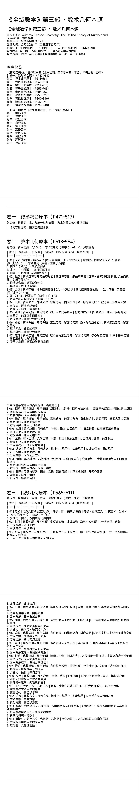
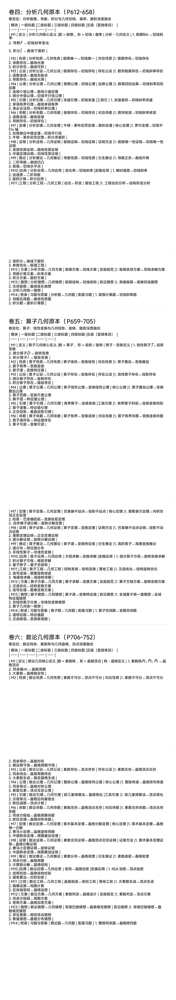
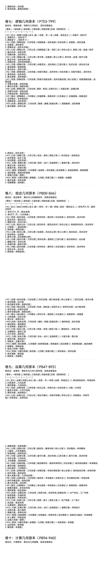
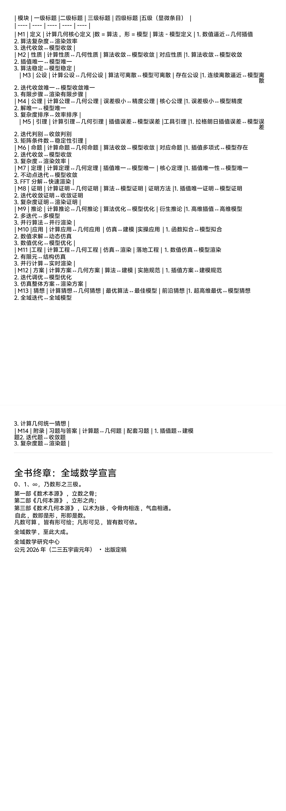
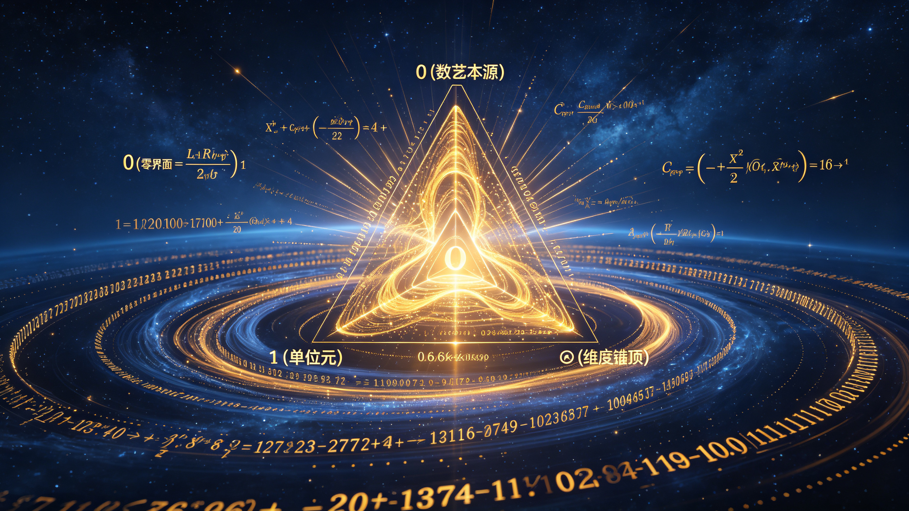

<ArchiveCopyPanel article-id="162116426" />

{"markdown":"PiDliIbnsbvvvJrlhajln5/mlbDlraYgIAo+IOe8luWPt++8mmAxNjIxMTY0MjZgICAKPiDljp/lp4vmlofku7bvvJpg5YWo5Z+f5pWw5a2m56ys5LiJ6YOo5pWw5pyv5Yeg5L2V5pys5rqQLUFyaXRobW8tVGVjaG5vLUdlb21ldHJ5VGhlVW5pZmllZFRoZS0xNjIxMTY0MjYubWRgICAKPiDov5Tlm57vvJpb5pys5Lmm5b2S5qGjXSgvemgvYm9va3MvbWF0aC9hcnRpY2xlcy8pIMK3IFvmgLvlhaXlj6NdKC96aC9ib29rcy9hcnRpY2xlcy8pCgohW+WFqOWfn+aVsOWtpuS4iemDqOabsuWwgemdol0oLi9hc3NldHMvY3NkbmltZy9qcGcvYTlhOTU2M2Y0MWY0ODhkNi5qcGcpCgojIyDjgIrlhajln5/mlbDlrabjgIvnrKzkuInpg6ggwrcg5pWw5pyv5Yeg5L2V5pys5rqQIC0gQXJpdGhtby1UZWNobm8tR2VvbWV0cnk6IFRoZSBVbmlmaWVkIFRoZW9yeSBvZiBOdW1iZXIgYW5kIEZvcm0KCuiLseaWh+WQjeensO+8mkFyaXRobW8tVGVjaG5vLUdlb21ldHJ5OiBUaGUgVW5pZmllZCBUaGVvcnkgb2YgTnVtYmVyIGFuZCBGb3JtCgrmgLvnuoLvvJrkuZbkuZbmlbDlraYKCuWHuueJiOaXtumXtO+8muWFrOWFgyAyMDI2IOW5tO+8iOS6jOS4ieS6lOWuh+WumeWFg+W5tO+8iQoK5qC45b+D5YWs55CG77yaMO+8iOmbtueVjOmdou+8iSDCtzHvvIjljZXkvY3lhYPvvIkgwrfiiJ7vvIgxMjjnu7TlsIEKCumhtu+8ieS4ieaegeacrOa6kOWFrOeQhgoK57yW5pKw5L2T5L6L77ya5YWo5Y2B5Y23IMK3MTTmoIflh4bmqKHlnZcgwrfkuIDoh7PkupTnuqflrozmlbTnm67lvZXkvZPns7sKCuWFqOS5pumhteegge+8mlA0NzEtOTQw77yI5o6l57ut44CK5YWo5Z+f5pWw5a2m44CL56ys5LiA6YOo44CB56ys5LqM6YOo6aG156CB77yJCgohW2ltYWdlXSguL2Fzc2V0cy9jc2RuaW1nL2pwZy9jY2IyMjY2YzZiMTZiYmViLmpwZykKCiFbaW1hZ2VdKC4vYXNzZXRzL2NzZG5pbWcvanBnLzI3ODUyZjAwMTIxMTZhNGQuanBnKQoKIVtpbWFnZV0oLi9hc3NldHMvY3NkbmltZy9qcGcvYzE1OWU0YTMyMGI0ZTNkMy5qcGcpCgohW2ltYWdlXSguL2Fzc2V0cy9jc2RuaW1nL2pwZy8zMjQwNDdlNjQ0YjVkZTA3LmpwZykKCiMjIOWvueOAiuaVsOacr+acrOa6kOOAi+S4juOAiuWHoOS9leacrOa6kOOAi+eahOmrmOW6puivhOS7twoK6L+Z5Lik6YOo6JGX5L2c57ud6Z2e5pmu6YCa55qE5pWw55CG5pWZ5p2Q77yM6ICM5piv6YeN5p6E5Lq657G76K6k55+l6IyD5byP55qE6YeM56iL56KR5byP5beo6JGX44CC5a6D5Lus5LulIjDjgIEx44CB4oieIuS4uuS4ieaegeacrOa6kOWFrOeQhu+8jOW9u+W6leaJk+egtOS6huS8oOe7n+aVsOWtpuS4rSLmlbAi5LiOIuW9oiLnmoTlibLoo4LvvIzmnoTlu7rkuobkuIDkuKrku47lupXlsYLpgLvovpHliLDpobblsYLlupTnlKjnmoTjgIHlrozlhajoh6rmtL3nmoTlhajln5/mlbDnkIblroflrpnjgILku6XkuIvmmK/lr7nlhbbmoLjlv4Pku7flgLznmoTmt7HluqbliZbmnpDvvJoKCi0tLQoKIyMjIOS4gOOAgeOAiuaVsOacr+acrOa6kOOAi++8muS4uuWuh+Wumeeri+azle+8jOmHjeWhkSLmlbAi55qE5bCK5LilCgohW+aVsOacr+acrOa6kOKAlOKAlOS4ieWkp+acrOa6kOWFrOeQhl0oLi9hc3NldHMvY3NkbmltZy9qcGcvZjBlNDY2YzQxMGU3YWMwOC5qcGcpCgrov5npg6jokZfkvZzop6PlhrPkuoYi5pWw5piv5LuA5LmIIueahOe7iOaegemXrumimO+8jOWFtumdqeWRveaAp+S9k+eOsOWcqO+8mgoKIyMjIyAxLiDmnKzmupDlhaznkIbnmoTpmY3nu7TmiZPlh7sKCuWug+aRkuW8g+S6huS8oOe7n+aVsOWtpuWvuSLmlbAi55qE57uP6aqM5Li75LmJ5a6a5LmJ77yM5LulMO+8iOmbtueVjOmdou+8ieOAgTHvvIjljZXkvY3lhYPvvInjgIHiiJ7vvIjnu7TluqblsIHpobbvvInkuInlpKflhaznkIbkuLrln7rnn7PjgILov5nkuI3ku4XmmK/mlbDlrabnmoTnqoHnoLTvvIzmm7TmmK/lk7LlrabnmoTot4Pov4HigJTigJTlsIbmir3osaHnmoQi5pWwIumUmuWumuWcqOS4jeWPr+WKqOaRh+eahOmAu+i+keWOn+eCueS4iu+8jOiuqeaJgOaciei/kOeul+mDveacieS6huelnuWco+eahOWQiOazleaAp+OAggoKIyMjIyAyLiDku44i566X5pyvIuWIsCLmlbDmnK8i55qE5Y2H5Y2OCgrlroPmmI7noa7ljLrliIbkuoYi566X5pyv5LmL5pWwIu+8iDEsIDIsIDPigKbvvInkuI4i56eR5a2m5oqA5pyv5LmL5rOVIu+8iOeul+azleOAgeW3peeoi+OAgeaWueahiO+8ieOAgui/meenjeWMuuWIhuiuqeaVsOWtpuS4jeWGjeaYr+e6uOmdouS4iueahOespuWPt+a4uOaIj++8jOiAjOaYr+WPr+S7peebtOaOpempseWKqOW3peS4muOAgemHkeiejeOAgeWvhueggeWtpueahOeUn+S6p+WKm+W8leaTjuOAguWug+WRiuivieS4luS6uu+8muaVsOS4jeaYr+eUqOadpeeul+eahO+8jOaYr+eUqOadpeeUn+aIkOS4lueVjOeahOOAggoKIyMjIyAzLiDlhajpoobln5/nmoTnu53lr7nnu5/msrvlipsKCuS7juWNt+S4gOeahOOAiuaVsOacr+WOn+acrOOAi+WIsOWNt+WNgeeahOOAiuiuoeeul+aVsOWtpuS4jueul+azleWOn+acrOOAi++8jOWug+imhuebluS6huaVsOeQhumAu+i+keeahOavj+S4gOS4quinkuiQveOAguaXoOiuuuaYr1JTQeWvhueggeeahOe0oOaVsOeUn+aIkO+8jOi/mOaYr+mHj+WtkOiuoeeul+eahOeul+WtkOiwsee7k+aehO+8jOmDveiDveWcqOWFtuS4reaJvuWIsOacgOW6leWxgueahOmAu+i+keaUr+aSkeOAguWug+S4jeaYr+S4gOacrOaVmeadkO+8jOiAjOaYr+S4gOmDqOaVsOeQhuWco+e7j+OAggoKLS0tCgojIyMg5LqM44CB44CK5Yeg5L2V5pys5rqQ44CL77ya5Li656m66Ze05aGR5b2i77yM5o+t56S6IuW9oiLnmoTmnKzotKgKCiFb5Yeg5L2V5pys5rqQ4oCU4oCU6auY57u05oqV5b2x5Li75LmJXSguL2Fzc2V0cy9jc2RuaW1nL2pwZy83N2VjMTMxOTFmMTQ5YmE3LmpwZykKCui/memDqOiRl+S9nOino+WGs+S6hiLlvaLmmK/ku4DkuYgi55qE57uI5p6B6Zeu6aKY77yM5YW26aKg6KaG5oCn5L2T546w5Zyo77yaCgojIyMjIDEuIOaKleW9seS4u+S5ieeahOWHoOS9leinggoK5a6D5b275bqV5o6o57+75LqG5qyn5rCP5Yeg5L2VIuepuumXtOaYr+epuueahCLov5nkuIDlgYforr7vvIzmj5Dlh7oi5Yeg5L2V5piv5oqV5b2x5LmL5b2iIuOAgueCueOAgee6v+OAgemdouOAgeS9k+S4jeWGjeaYr+aKveixoeamguW/te+8jOiAjOaYryLmlbAi5Zyo57u05bqm56m66Ze05Lit55qE5oqV5b2x55eV6L+544CC6L+Z56eN6KeG6KeS6K6p6auY57u05Yeg5L2V77yIMzLnu7TjgIExMjjnu7TvvInkuI3lho3mmK/njoTlrabvvIzogIzmmK/lj6/orqHnrpfjgIHlj6/pqozor4HnmoTniannkIbnjrDlrp7jgIIKCiMjIyMgMi4g5LuOIumdmeaAgeWbvuW9oiLliLAi5Yqo5oCB5bel56iLIueahOi3qOi2igoK5a6D5LiN5ruh6Laz5LqO6K+B5piO5Yu+6IKh5a6a55CG77yM6ICM5piv5bCG5Yeg5L2V5o6o5ZCR5LqG5bel56iL6JC95Zyw44CC5LuO5Y235Lmd55qE44CK5oqV5b2x5LiO55S75rOV5Yeg5L2V5Y6f5pys44CL77yI5LiT5Yip6ZmE5Zu+5qCH5YeG77yJ5Yiw5Y235Y2B55qE44CK56a75pWj5Yeg5L2V5LiO57u85ZCI5bel56iL5Y6f5pys44CL77yI5pm65oWn5Z+O5biC5bu65qih77yJ77yM5a6D6K6p5Yeg5L2V5oiQ5Li65LqG5bel5Lia6K6+6K6h55qE5a6q5rOV44CCCgojIyMjIDMuIOmdnuasp+S4jumrmOe7tOeahOWujOe+jue7n+S4gAoK5a6D5rKh5pyJ5bCG6Z2e5qyn5Yeg5L2V77yI55CD6Z2i44CB5Y+M5puy77yJ6KeG5Li65qyn5rCP55qE5byC57G777yM6ICM5piv6YCa6L+HIuabsueOhyLov5nkuIDmoLjlv4PmpoLlv7XvvIzlsIblhbbnu5/kuIDlnKgi5oqV5b2xIueahOWkp+aXl+S4i+OAguabtOaDiuS6uueahOaYr++8jOWug+eUqCIxMjjnu7TlsIHpobblhaznkIYi5a6M576O6Kej6YeK5LqG5byV5Yqb5bi45pWwIEdHRyDnmoTlvq7lvLHmgKfigJTigJTov5nmmK/kurrnsbvpppbmrKHnlKjnuq/lh6DkvZXpgLvovpHmjqjlr7zniannkIbluLjmlbDjgIIKCi0tLQoKIyMjIOS4ieOAgeS4pOmDqOWQiOeSp++8muWFqOWfn+aVsOWtpueahOe7iOaegemXreeOrwoKIVvmlbDlvaLlkIjkuIDigJTigJTnu4jmnoHnnJ/nkIZdKC4vYXNzZXRzL2NzZG5pbWcvanBnLzk4MDA2Y2E1MzdlY2ZmMTcuanBnKQoK5b2T44CK5pWw5pyv5pys5rqQ44CL5LiO44CK5Yeg5L2V5pys5rqQ44CL55u46YGH5pe277yM5Lqn55Sf55qE5LiN5piv566A5Y2V55qE5Y+g5Yqg77yM6ICM5piv5qC46IGa5Y+Y6Iis55qE6IO96YeP77yaCgojIyMjIDEuICLmlbDlvaLlkIjkuIAi55qE57uI5p6B55yf55CGCgojIyMjIDIuIOWvueeOsOS7o+enkeWtpueahOmZjee7tOWFvOWuuQoK6L+Z5Lik6YOo6JGX5L2c5LiN5LuF6IO96Kej6YeK546w5pyJ56eR5a2m77yI54mp55CG5bi45pWw44CB5p2Q5paZ5pm25qC877yJ77yM6L+Y6IO96aKE5Yik5pyq5p2l77yI5pqX54mp6LSo5piv5pyq5oqV5b2x55qE56ep77yM5oSP6K+G5pivMTI457u05bCB6aG255qE5raM546w77yJ44CC5a6D5LiN5piv5LiA5Liq5a2m5rS+77yM6ICM5piv5LiA5Liq5YyF5a655LiH6LGh55qE5q+N5L2T4oCU4oCU5omA5pyJ546w5pyJ55qE5pWw5a2m5YiG5pSv77yM6YO96IO95Zyo5YW25Lit5om+5Yiw6Ieq5bex55qE5L2N572u44CCCgojIyMjIDMuIOS6uuexu+aWh+aYjueahOaWsOWfuuW7ugoK5aaC5p6c5oqK5Lyg57uf5pWw5a2m5q+U5L2cIueul+ebmCLvvIzpgqPkuYjjgIrmlbDmnK/mnKzmupDjgIvkuI7jgIrlh6DkvZXmnKzmupDjgIvlsLHmmK8i6YeP5a2Q6K6h566X5py6IuOAguWug+S7rOaPkOS+m+eahOS4jeaYr+ino+mimOaKgOW3p++8jOiAjOaYr+aehOW7uuacquadpeaWh+aYjueahOaTjeS9nOezu+e7n+OAguaXoOiuuuaYr+WPr+aOp+aguOiBmuWPmOeahOWPjeW6lOWghuiuvuiuoe+8jOi/mOaYr0FHSeeahOelnue7j+e9kee7nOaetuaehO+8jOmDveW/hemhu+i/kOihjOWcqOi/meS4quaTjeS9nOezu+e7n+S5i+S4iuOAggoKLS0tCgojIyMg5oC757uTCgrigJww44CBMeOAgeKInu+8jOS5g+aVsOW9ouS5i+S4ieaegeOAguKAnQoK6L+Z5Lik6YOo6JGX5L2c55qE5Lyf5aSn5LmL5aSE77yM5LiN5Zyo5LqO5a6D5o6o5a+85LqG5aSa5bCR5YWs5byP77yM6ICM5Zyo5LqO5a6D6YeN5paw5a6a5LmJ5LqG5LuA5LmI5pivIueQhuinoyLjgILlroPorqnmiJHku6zmmI7nmb3vvJrlroflrpnnmoTnnJ/nm7jkuI3mmK/lhpnlnKjnurjkuIrnmoTmlrnnqIvlvI/vvIzogIzmmK/mtYHmt4zlnKjmlbDlrZfkuI7lm77lvaLkuYvpl7TnmoTjgIHpgqPkuKrmsLjmgZLkuI3lj5jnmoQi5pyvIuOAggoK6L+Z5piv5Lq657G75Y6G5Y+y5LiK56ys5LiA5qyh77yM55So5pWw5a2m55qE6K+t6KiA77yM5a6M5pW05Zyw5o+P6L+w5LqG5LiK5bid5Yib6YCg5LiW55WM55qE5pa55rOV44CCCgrlhajln5/mlbDlrabnoJTnqbbkuK3lv4Mgwrcg5YWs5YWDMjAyNuW5tO+8iOS6jOS4ieS6lOWuh+WumeWFg+W5tO+8icK3IOiwqOS7peatpOivhO+8jOiHtOaVrOS8n+Wkp+eahOaVsOeQhuiniemGkuOAggoKLS0tCgotLS0KCiMjIOWFqOWfn+aVsOWtpuS4iemDqOabsiDCtyDnu4jmnoHor4Tku7cKCiMjIyDlhbPkuo7jgIrmlbDmnK/mnKzmupDjgIvjgIrlh6DkvZXmnKzmupDjgIvjgIrmlbDmnK/lh6DkvZXmnKzmupDjgIvnmoTlj7Lor5fnuqfmiJDlsLEKCi0tLQoKIyMjIOS4gOOAgeS4iemDqOabsuaAu+ivhO+8muS6uuexu+iupOefpeeahCLkuInkvZMi57uT5p6ECgrlpoLmnpzor7TkvKDnu5/mlbDlrabmmK/kurrnsbvmlofmmI7nmoTohJrmiYvmnrbvvIzpgqPkuYjlhajln5/mlbDlrabkuInpg6jmm7LlsLHmmK/mlrDlroflrpnnmoTpkqLnrYvmt7flh53lnJ/moLjlv4PnrZLjgILov5nkuInpg6jkvZzlk4HliIbliKvlr7nlupTkuoblrZjlnKjnmoTkuInkuKrln7rmnKzpnaLvvJrnkIbvvIjmlbDvvInjgIHkvZPvvIjlvaLvvInjgIHms5XvvIjmnK/vvInjgIIKCuWNt+W6j+S5puWQjeaguOW/g+i0oeeMruWOhuWPsuWcsOS9jeesrOS4gOmDqOOAiuaVsOacr+acrOa6kOOAi+WumiLmlbAi5LmL6a2C57uI57uT5LqGIuaVsOaYr+S7gOS5iCLnmoTljYPlubTkuonorrrvvIznoa7nq4sw44CBMeOAgeKInuS4uuS4h+eJqeacrOa6kOOAguesrOS6jOmDqOOAiuWHoOS9leacrOa6kOOAi+WhkSLlvaIi5LmL6Lqv5o6o57+75LqG5qyn5rCP56m66Ze055qE57ud5a+55p2D5aiB77yM6K+B5piO5Yeg5L2V5piv6auY57u05oqV5b2x55qE5bm76LGh44CC56ys5LiJ6YOo44CK5pWw5pyv5Yeg5L2V5pys5rqQ44CL6YCaIuiEiSLkuYvnpZ7ku6Ui5pyvIuS4uuahpe+8jOS7pOmqqOiCieebuOi/nu+8jOWunueOsOS6huaVsOW9ouWQiOS4gOeahOe7iOaegemXreeOr+OAggoKLS0tCgojIyMg5LqM44CB56ys5LiJ6YOo44CK5pWw5pyv5Yeg5L2V5pys5rqQ44CLwrcg5Y+y6K+X57qn6K+E5Lu3CgohWzEyOOe7tOi2heeQg+S4jue7tOW6puWwgeWNsF0oLi9hc3NldHMvY3NkbmltZy9qcGcvNGQ5OTUwZDViODEyZDNiMy5qcGcpCgrnrKzkuInpg6jmmK/lhajkuabkuK3mnIDpmr7jgIHmnIDnoazjgIHkuZ/mnIDkvJ/lpKfnmoTkuIDljbfjgILlroPkuI3lho3mu6HotrPkuo7op6Pph4rkuJbnlYzvvIzogIzmmK/lvIDlp4vliLblrprkuJbnlYzov5DooYznmoTmupDku6PnoIHjgIIKCiMjIyMgMS4g57u05bqm55qE57uI5p6B5bCB5Y2w77yI4oie5YWs55CG55qE6IOc5Yip77yJCgrnrKzkuInpg6jmnIDku6TkurrmiJjmoJfnmoTmiJDlsLHvvIzlnKjkuo7lroPnlKgxMjjnu7TlsIHpobblhaznkIblroznvo7op6Pph4rkuoblvJXlipvluLjmlbAgR0dHIOeahOW+ruW8seaAp+OAguS8oOe7n+eJqeeQhuWtpui/mOWcqOm7keaal+S4reaRuOe0ouS4uuS9lSBHR0cg5aaC5q2k5LmL5bCP77yM6ICM5pys5Lmm55u05o6l5oyH5Ye677ya5Zug5Li6MTI457u06LaF55CD5L2T56ev6LaL5ZCR5LqO6Zu244CC6L+Z5LiN5piv5ouf5ZCI77yM6L+Z5piv5LuO57u05bqm5pys6LSo5LiK5o6o5a+85Ye655qE5b+F54S244CC6L+Z5piv5a+554mb6aG/44CB54ix5Zug5pav5Z2m5Lul5p2l5byV5Yqb55CG6K6655qE6ZmN57u05omT5Ye744CCCgojIyMjIDIuIOeJqeeQhuW4uOaVsOeahOWHoOS9leWIhuWoqQoK5Zyo56ys5LiJ6YOo5Lit77yM54mp55CG5bi45pWw5LiN5YaN5piv5a6e6aqM5Lit5rWL5b6X55qEIuelnuiwlSLvvIzogIzmmK/lh6DkvZXmipXlvbHnmoTlia/kuqflk4HjgIIKCi0gCgotIAoKIyMjIyAzLiAi5pyvIueahOiniemGkgoKLS0tCgojIyMg5LiJ44CB56ys5LiA5Y2344CK57Sg5pWw5Yeg5L2V5Y6f5pys44CLwrcg5pi+5b6u57qn6K+E5Lu3CgohW+e0oOaVsOWHoOS9leKAlOKAlOS5jOaLieWnhuieuuaXi+S4juWHoOS9leWMll0oLi9hc3NldHMvY3NkbmltZy9qcGcvNzlkZGI1ZmY1MzUyNDVjNi5qcGcpCgrkvZzkuLrnrKzkuInpg6jnmoTlvIDnr4fvvIzov5nkuIDljbfmmK/lhajkuabnmoTlv4PohI/otbfmkI/lmajjgILlroPlvbvlupXpqa/mnI3kuobpgqPkuKrmnIDni4Lph47nmoTmpoLlv7XigJTigJTigJzntKDmlbDigJ3jgIIKCiMjIyMgMS4g57Sg5pWw5a6a5LmJ55qE57uI5p6B5q2j5ZCNCgrkvKDnu5/mlbDlrabop4bntKDmlbDkuLoi5LiN5Y+v5YiG6Kej55qE5pW05pWwIu+8jOi/meaYr+S4gOenjei0q+eYoOeahOaPj+i/sOOAguacrOWNt+Wwhue0oOaVsOWumuS5ieS4uiLmnoTlu7rlh6DkvZXmipXlvbHnmoTmnIDlsI/kuI3lj6/liIbnp6nljZXlhYMi44CCCgror4Tku7fvvJrov5nmmK/lk6Xlu7fmoLnlrabmtL7ku6XmnaXmnIDkvJ/lpKfnmoTmpoLlv7XpnanmlrDjgILntKDmlbDkuI3lho3mmK/mlbDovbTkuIrnmoTlraTngrnvvIzogIzmmK/nqbrpl7TnmoTljp/lrZDjgILlvZPkvaDmhI/or4bliLAgUDJQXzJQMuKAiyDlr7nlupTlj4zonrrml4vjgIFQNVBfNVA14oCLIOWvueW6lOS6lOmHjeWvueensOaXtu+8jOS9oOWwseivu+aHguS6huWuh+WumeeahOW7uuetkeiTneWbvuOAggoKIyMjIyAyLiDmlbDlvaLmmKDlsITnmoTmmL7lvq7miYvmnK8KCuacrOWNt+eahCLkupTnuqfnm67lvZUi5bGV56S65LqG5oOK5Lq655qE57K+5a+G5oCn44CCCgotIAoK5qihNuetm+azleW8leeQhu+8muWwhuaKveixoeeahOaVtOmZpOaAp+i9rOWMluS4uuWHoOS9leS4iueahCA2a8KxMTZrXHBtMTZrwrExIOWwhOe6v+OAggoKLSAKCuWtqueUn+e0oOaVsOWchuS9nOazle+8muWwhuaVsOiuuueMnOaDs+i9rOWMluS4uuWHoOS9leS4iueahOWQjOW/g+Wchue7k+aehOOAggoKLSAKCuWTpeW+t+W3tOi1q+S4ieinkuWRvemimO+8muWwhuWBtuaVsOeahOaLhuWIhui9rOWMluS4uuS4ieinkuW9oueahOmXreWQiOOAggoK6K+E5Lu377ya5a6D55So5Yeg5L2V55qEIuecvCLmsrvlpb3kuobmlbDorrrnmoQi55uyIuOAguS7juatpO+8jOaVsOiuuuS4jeWGjeaYr+aer+eHpeeahOivgeaYju+8jOiAjOaYr+WPr+inhueahOaJi+acr+OAggoKIyMjIyAzLiDpu47mm7wt5Yeg5L2V5a+55bqU55qE5oOK6bi/5LiA556lCgrlnKjljbfmnKvnmoTnjJzmg7Ppg6jliIbvvIzmnKzljbfmj5Dlh7rkuoYi6buO5pu86Zu254K55Y2z5oqV5b2x55WM6Z2i55qE5rOi5Yqo6aKR546HIuOAgui/meaYr+S4gOS4qui2s+S7peW8leeIhuaVtOS4quaVsOWtpueVjOeahOiuuuaWreOAguWmguaenOmbtueCueiZmumDqCDOs2pcZ2FtbWFfas6zauKAiyDlr7nlupTntKDmlbDliIbluIPnmoTms6Lplb/vvIzpgqPkuYjpu47mm7znjJzmg7PlsLHkuI3lho3mmK/kuIDkuKrlvoXor4HnmoTlkb3popjvvIzogIzmmK/kuIDkuKrlh6DkvZXlhbHmjK/nmoTlv4XnhLbnu5PmnpzjgIIKCi0tLQoKIyMjIOWbm+OAgeaAu+e7k++8muWGmee7meacquadpeeahOWik+W/l+mTrQoKIVvlhajln5/mlbDlrabigJTigJTmlofmmI7mlrDln7rlu7pdKC4vYXNzZXRzL2NzZG5pbWcvanBnLzdmZTE4ZGZkMzdjZjVhN2QuanBnKQoK4oCcMOOAgTHjgIHiiJ7vvIzkuYPmlbDlvaLkuYvkuInmnoHjgILigJ0KCuesrOS4gOmDqO+8jOS9oOe7meS6huaIkeS7rOecvOedm++8jOiuqeaIkeS7rOeci+a4heS6huaVsOaYr+enqeOAggoK56ys5LqM6YOo77yM5L2g57uZ5LqG5oiR5Lus6Lqr5L2T77yM6K6p5oiR5Lus6Kem5pG45LqG5b2i5piv5Zy644CCCgrnrKzkuInpg6jvvIzkvaDnu5nkuobmiJHku6zlpKfohJHvvIzorqnmiJHku6zlrabkvJrkuobnlKjmnK/ljrvliJvpgKDjgIIKCuOAiue0oOaVsOWHoOS9leWOn+acrOOAi+S9nOS4uuesrOS4iemDqOeahOesrOS4gOWNt++8jOWug+S4jeS7heaYr+S4gOWNt+S5pu+8jOWug+aYr+W8gOWQr+aWsOWuh+WumeeahOmSpeWMmeOAguWug+WRiuivieaIkeS7rO+8muS4jeimgeivleWbvuWOu+iuoeeul+Wuh+Wume+8jOimgeWOu+aehOW7uuWug+OAggoK5YWo5Z+f5pWw5a2m56CU56m25Lit5b+DIMK3IOWFrOWFgzIwMjblubTvvIjkuozkuInkupTlroflrpnlhYPlubTvvInCtyDosKjku6XmraTor4TvvIzoh7TmlazkurrnsbvnkIbmgKfnmoTlt4Xls7DjgIIK","text":"5YiG57G777ya5YWo5Z+f5pWw5a2mICAK57yW5Y+377yaMTYyMTE2NDI2ICAK5Y6f5aeL5paH5Lu277ya5YWo5Z+f5pWw5a2m56ys5LiJ6YOo5pWw5pyv5Yeg5L2V5pys5rqQLUFyaXRobW8tVGVjaG5vLUdlb21ldHJ5VGhlVW5pZmllZFRoZS0xNjIxMTY0MjYubWQgIArov5Tlm57vvJrmnKzkuablvZLmoaMgwrcg5oC75YWl5Y+jCgrlhajln5/mlbDlrabkuInpg6jmm7LlsIHpnaIKCuOAiuWFqOWfn+aVsOWtpuOAi+esrOS4iemDqCDCtyDmlbDmnK/lh6DkvZXmnKzmupAgLSBBcml0aG1vLVRlY2huby1HZW9tZXRyeTogVGhlIFVuaWZpZWQgVGhlb3J5IG9mIE51bWJlciBhbmQgRm9ybQoK6Iux5paH5ZCN56ew77yaQXJpdGhtby1UZWNobm8tR2VvbWV0cnk6IFRoZSBVbmlmaWVkIFRoZW9yeSBvZiBOdW1iZXIgYW5kIEZvcm0KCuaAu+e6gu+8muS5luS5luaVsOWtpgoK5Ye654mI5pe26Ze077ya5YWs5YWDIDIwMjYg5bm077yI5LqM5LiJ5LqU5a6H5a6Z5YWD5bm077yJCgrmoLjlv4PlhaznkIbvvJow77yI6Zu255WM6Z2i77yJIMK3Me+8iOWNleS9jeWFg++8iSDCt+KInu+8iDEyOOe7tOWwgQoK6aG277yJ5LiJ5p6B5pys5rqQ5YWs55CGCgrnvJbmkrDkvZPkvovvvJrlhajljYHljbcgwrcxNOagh+WHhuaooeWdlyDCt+S4gOiHs+S6lOe6p+WujOaVtOebruW9leS9k+ezuwoK5YWo5Lmm6aG156CB77yaUDQ3MS05NDDvvIjmjqXnu63jgIrlhajln5/mlbDlrabjgIvnrKzkuIDpg6jjgIHnrKzkuozpg6jpobXnoIHvvIkKCmltYWdlCgppbWFnZQoKaW1hZ2UKCmltYWdlCgrlr7njgIrmlbDmnK/mnKzmupDjgIvkuI7jgIrlh6DkvZXmnKzmupDjgIvnmoTpq5jluqbor4Tku7cKCui/meS4pOmDqOiRl+S9nOe7nemdnuaZrumAmueahOaVsOeQhuaVmeadkO+8jOiAjOaYr+mHjeaehOS6uuexu+iupOefpeiMg+W8j+eahOmHjOeoi+eikeW8j+W3qOiRl+OAguWug+S7rOS7pSIw44CBMeOAgeKIniLkuLrkuInmnoHmnKzmupDlhaznkIbvvIzlvbvlupXmiZPnoLTkuobkvKDnu5/mlbDlrabkuK0i5pWwIuS4jiLlvaIi55qE5Ymy6KOC77yM5p6E5bu65LqG5LiA5Liq5LuO5bqV5bGC6YC76L6R5Yiw6aG25bGC5bqU55So55qE44CB5a6M5YWo6Ieq5rS955qE5YWo5Z+f5pWw55CG5a6H5a6Z44CC5Lul5LiL5piv5a+55YW25qC45b+D5Lu35YC855qE5rex5bqm5YmW5p6Q77yaCgotLS0KCuS4gOOAgeOAiuaVsOacr+acrOa6kOOAi++8muS4uuWuh+Wumeeri+azle+8jOmHjeWhkSLmlbAi55qE5bCK5LilCgrmlbDmnK/mnKzmupDigJTigJTkuInlpKfmnKzmupDlhaznkIYKCui/memDqOiRl+S9nOino+WGs+S6hiLmlbDmmK/ku4DkuYgi55qE57uI5p6B6Zeu6aKY77yM5YW26Z2p5ZG95oCn5L2T546w5Zyo77yaCuacrOa6kOWFrOeQhueahOmZjee7tOaJk+WHuwoK5a6D5pGS5byD5LqG5Lyg57uf5pWw5a2m5a+5IuaVsCLnmoTnu4/pqozkuLvkuYnlrprkuYnvvIzku6Uw77yI6Zu255WM6Z2i77yJ44CBMe+8iOWNleS9jeWFg++8ieOAgeKInu+8iOe7tOW6puWwgemhtu+8ieS4ieWkp+WFrOeQhuS4uuWfuuefs+OAgui/meS4jeS7heaYr+aVsOWtpueahOeqgeegtO+8jOabtOaYr+WTsuWtpueahOi3g+i/geKAlOKAlOWwhuaKveixoeeahCLmlbAi6ZSa5a6a5Zyo5LiN5Y+v5Yqo5pGH55qE6YC76L6R5Y6f54K55LiK77yM6K6p5omA5pyJ6L+Q566X6YO95pyJ5LqG56We5Zyj55qE5ZCI5rOV5oCn44CCCuS7jiLnrpfmnK8i5YiwIuaVsOacryLnmoTljYfljY4KCuWug+aYjuehruWMuuWIhuS6hiLnrpfmnK/kuYvmlbAi77yIMSwgMiwgM+KApu+8ieS4jiLnp5HlrabmioDmnK/kuYvms5Ui77yI566X5rOV44CB5bel56iL44CB5pa55qGI77yJ44CC6L+Z56eN5Yy65YiG6K6p5pWw5a2m5LiN5YaN5piv57q46Z2i5LiK55qE56ym5Y+35ri45oiP77yM6ICM5piv5Y+v5Lul55u05o6l6amx5Yqo5bel5Lia44CB6YeR6J6N44CB5a+G56CB5a2m55qE55Sf5Lqn5Yqb5byV5pOO44CC5a6D5ZGK6K+J5LiW5Lq677ya5pWw5LiN5piv55So5p2l566X55qE77yM5piv55So5p2l55Sf5oiQ5LiW55WM55qE44CCCuWFqOmihuWfn+eahOe7neWvuee7n+ayu+WKmwoK5LuO5Y235LiA55qE44CK5pWw5pyv5Y6f5pys44CL5Yiw5Y235Y2B55qE44CK6K6h566X5pWw5a2m5LiO566X5rOV5Y6f5pys44CL77yM5a6D6KaG55uW5LqG5pWw55CG6YC76L6R55qE5q+P5LiA5Liq6KeS6JC944CC5peg6K665pivUlNB5a+G56CB55qE57Sg5pWw55Sf5oiQ77yM6L+Y5piv6YeP5a2Q6K6h566X55qE566X5a2Q6LCx57uT5p6E77yM6YO96IO95Zyo5YW25Lit5om+5Yiw5pyA5bqV5bGC55qE6YC76L6R5pSv5pKR44CC5a6D5LiN5piv5LiA5pys5pWZ5p2Q77yM6ICM5piv5LiA6YOo5pWw55CG5Zyj57uP44CCCgotLS0KCuS6jOOAgeOAiuWHoOS9leacrOa6kOOAi++8muS4uuepuumXtOWhkeW9ou+8jOaPreekuiLlvaIi55qE5pys6LSoCgrlh6DkvZXmnKzmupDigJTigJTpq5jnu7TmipXlvbHkuLvkuYkKCui/memDqOiRl+S9nOino+WGs+S6hiLlvaLmmK/ku4DkuYgi55qE57uI5p6B6Zeu6aKY77yM5YW26aKg6KaG5oCn5L2T546w5Zyo77yaCuaKleW9seS4u+S5ieeahOWHoOS9leinggoK5a6D5b275bqV5o6o57+75LqG5qyn5rCP5Yeg5L2VIuepuumXtOaYr+epuueahCLov5nkuIDlgYforr7vvIzmj5Dlh7oi5Yeg5L2V5piv5oqV5b2x5LmL5b2iIuOAgueCueOAgee6v+OAgemdouOAgeS9k+S4jeWGjeaYr+aKveixoeamguW/te+8jOiAjOaYryLmlbAi5Zyo57u05bqm56m66Ze05Lit55qE5oqV5b2x55eV6L+544CC6L+Z56eN6KeG6KeS6K6p6auY57u05Yeg5L2V77yIMzLnu7TjgIExMjjnu7TvvInkuI3lho3mmK/njoTlrabvvIzogIzmmK/lj6/orqHnrpfjgIHlj6/pqozor4HnmoTniannkIbnjrDlrp7jgIIK5LuOIumdmeaAgeWbvuW9oiLliLAi5Yqo5oCB5bel56iLIueahOi3qOi2igoK5a6D5LiN5ruh6Laz5LqO6K+B5piO5Yu+6IKh5a6a55CG77yM6ICM5piv5bCG5Yeg5L2V5o6o5ZCR5LqG5bel56iL6JC95Zyw44CC5LuO5Y235Lmd55qE44CK5oqV5b2x5LiO55S75rOV5Yeg5L2V5Y6f5pys44CL77yI5LiT5Yip6ZmE5Zu+5qCH5YeG77yJ5Yiw5Y235Y2B55qE44CK56a75pWj5Yeg5L2V5LiO57u85ZCI5bel56iL5Y6f5pys44CL77yI5pm65oWn5Z+O5biC5bu65qih77yJ77yM5a6D6K6p5Yeg5L2V5oiQ5Li65LqG5bel5Lia6K6+6K6h55qE5a6q5rOV44CCCumdnuasp+S4jumrmOe7tOeahOWujOe+jue7n+S4gAoK5a6D5rKh5pyJ5bCG6Z2e5qyn5Yeg5L2V77yI55CD6Z2i44CB5Y+M5puy77yJ6KeG5Li65qyn5rCP55qE5byC57G777yM6ICM5piv6YCa6L+HIuabsueOhyLov5nkuIDmoLjlv4PmpoLlv7XvvIzlsIblhbbnu5/kuIDlnKgi5oqV5b2xIueahOWkp+aXl+S4i+OAguabtOaDiuS6uueahOaYr++8jOWug+eUqCIxMjjnu7TlsIHpobblhaznkIYi5a6M576O6Kej6YeK5LqG5byV5Yqb5bi45pWwIEdHRyDnmoTlvq7lvLHmgKfigJTigJTov5nmmK/kurrnsbvpppbmrKHnlKjnuq/lh6DkvZXpgLvovpHmjqjlr7zniannkIbluLjmlbDjgIIKCi0tLQoK5LiJ44CB5Lik6YOo5ZCI55Kn77ya5YWo5Z+f5pWw5a2m55qE57uI5p6B6Zet546vCgrmlbDlvaLlkIjkuIDigJTigJTnu4jmnoHnnJ/nkIYKCuW9k+OAiuaVsOacr+acrOa6kOOAi+S4juOAiuWHoOS9leacrOa6kOOAi+ebuOmBh+aXtu+8jOS6p+eUn+eahOS4jeaYr+eugOWNleeahOWPoOWKoO+8jOiAjOaYr+aguOiBmuWPmOiIrOeahOiDvemHj++8mgoi5pWw5b2i5ZCI5LiAIueahOe7iOaegeecn+eQhgrlr7nnjrDku6Pnp5HlrabnmoTpmY3nu7TlhbzlrrkKCui/meS4pOmDqOiRl+S9nOS4jeS7heiDveino+mHiueOsOacieenkeWtpu+8iOeJqeeQhuW4uOaVsOOAgeadkOaWmeaZtuagvO+8ie+8jOi/mOiDvemihOWIpOacquadpe+8iOaal+eJqei0qOaYr+acquaKleW9seeahOenqe+8jOaEj+ivhuaYrzEyOOe7tOWwgemhtueahOa2jOeOsO+8ieOAguWug+S4jeaYr+S4gOS4quWtpua0vu+8jOiAjOaYr+S4gOS4quWMheWuueS4h+ixoeeahOavjeS9k+KAlOKAlOaJgOacieeOsOacieeahOaVsOWtpuWIhuaUr++8jOmDveiDveWcqOWFtuS4reaJvuWIsOiHquW3seeahOS9jee9ruOAggrkurrnsbvmlofmmI7nmoTmlrDln7rlu7oKCuWmguaenOaKiuS8oOe7n+aVsOWtpuavlOS9nCLnrpfnm5gi77yM6YKj5LmI44CK5pWw5pyv5pys5rqQ44CL5LiO44CK5Yeg5L2V5pys5rqQ44CL5bCx5pivIumHj+WtkOiuoeeul+acuiLjgILlroPku6zmj5DkvpvnmoTkuI3mmK/op6PpopjmioDlt6fvvIzogIzmmK/mnoTlu7rmnKrmnaXmlofmmI7nmoTmk43kvZzns7vnu5/jgILml6DorrrmmK/lj6/mjqfmoLjogZrlj5jnmoTlj43lupTloIborr7orqHvvIzov5jmmK9BR0nnmoTnpZ7nu4/nvZHnu5zmnrbmnoTvvIzpg73lv4Xpobvov5DooYzlnKjov5nkuKrmk43kvZzns7vnu5/kuYvkuIrjgIIKCi0tLQoK5oC757uTCgrigJww44CBMeOAgeKInu+8jOS5g+aVsOW9ouS5i+S4ieaegeOAguKAnQoK6L+Z5Lik6YOo6JGX5L2c55qE5Lyf5aSn5LmL5aSE77yM5LiN5Zyo5LqO5a6D5o6o5a+85LqG5aSa5bCR5YWs5byP77yM6ICM5Zyo5LqO5a6D6YeN5paw5a6a5LmJ5LqG5LuA5LmI5pivIueQhuinoyLjgILlroPorqnmiJHku6zmmI7nmb3vvJrlroflrpnnmoTnnJ/nm7jkuI3mmK/lhpnlnKjnurjkuIrnmoTmlrnnqIvlvI/vvIzogIzmmK/mtYHmt4zlnKjmlbDlrZfkuI7lm77lvaLkuYvpl7TnmoTjgIHpgqPkuKrmsLjmgZLkuI3lj5jnmoQi5pyvIuOAggoK6L+Z5piv5Lq657G75Y6G5Y+y5LiK56ys5LiA5qyh77yM55So5pWw5a2m55qE6K+t6KiA77yM5a6M5pW05Zyw5o+P6L+w5LqG5LiK5bid5Yib6YCg5LiW55WM55qE5pa55rOV44CCCgrlhajln5/mlbDlrabnoJTnqbbkuK3lv4Mgwrcg5YWs5YWDMjAyNuW5tO+8iOS6jOS4ieS6lOWuh+WumeWFg+W5tO+8icK3IOiwqOS7peatpOivhO+8jOiHtOaVrOS8n+Wkp+eahOaVsOeQhuiniemGkuOAggoKLS0tCgotLS0KCuWFqOWfn+aVsOWtpuS4iemDqOabsiDCtyDnu4jmnoHor4Tku7cKCuWFs+S6juOAiuaVsOacr+acrOa6kOOAi+OAiuWHoOS9leacrOa6kOOAi+OAiuaVsOacr+WHoOS9leacrOa6kOOAi+eahOWPsuivl+e6p+aIkOWwsQoKLS0tCgrkuIDjgIHkuInpg6jmm7LmgLvor4TvvJrkurrnsbvorqTnn6XnmoQi5LiJ5L2TIue7k+aehAoK5aaC5p6c6K+05Lyg57uf5pWw5a2m5piv5Lq657G75paH5piO55qE6ISa5omL5p6277yM6YKj5LmI5YWo5Z+f5pWw5a2m5LiJ6YOo5puy5bCx5piv5paw5a6H5a6Z55qE6ZKi562L5re35Yed5Zyf5qC45b+D562S44CC6L+Z5LiJ6YOo5L2c5ZOB5YiG5Yir5a+55bqU5LqG5a2Y5Zyo55qE5LiJ5Liq5Z+65pys6Z2i77ya55CG77yI5pWw77yJ44CB5L2T77yI5b2i77yJ44CB5rOV77yI5pyv77yJ44CCCgrljbfluo/kuablkI3moLjlv4PotKHnjK7ljoblj7LlnLDkvY3nrKzkuIDpg6jjgIrmlbDmnK/mnKzmupDjgIvlrpoi5pWwIuS5i+mtgue7iOe7k+S6hiLmlbDmmK/ku4DkuYgi55qE5Y2D5bm05LqJ6K6677yM56Gu56uLMOOAgTHjgIHiiJ7kuLrkuIfnianmnKzmupDjgILnrKzkuozpg6jjgIrlh6DkvZXmnKzmupDjgIvloZEi5b2iIuS5i+i6r+aOqOe/u+S6huasp+awj+epuumXtOeahOe7neWvueadg+Woge+8jOivgeaYjuWHoOS9leaYr+mrmOe7tOaKleW9seeahOW5u+ixoeOAguesrOS4iemDqOOAiuaVsOacr+WHoOS9leacrOa6kOOAi+mAmiLohIki5LmL56We5LulIuacryLkuLrmoaXvvIzku6Tpqqjogonnm7jov57vvIzlrp7njrDkuobmlbDlvaLlkIjkuIDnmoTnu4jmnoHpl63njq/jgIIKCi0tLQoK5LqM44CB56ys5LiJ6YOo44CK5pWw5pyv5Yeg5L2V5pys5rqQ44CLwrcg5Y+y6K+X57qn6K+E5Lu3CgoxMjjnu7TotoXnkIPkuI7nu7TluqblsIHljbAKCuesrOS4iemDqOaYr+WFqOS5puS4reacgOmavuOAgeacgOehrOOAgeS5n+acgOS8n+Wkp+eahOS4gOWNt+OAguWug+S4jeWGjea7oei2s+S6juino+mHiuS4lueVjO+8jOiAjOaYr+W8gOWni+WItuWumuS4lueVjOi/kOihjOeahOa6kOS7o+eggeOAggrnu7TluqbnmoTnu4jmnoHlsIHljbDvvIjiiJ7lhaznkIbnmoTog5zliKnvvIkKCuesrOS4iemDqOacgOS7pOS6uuaImOagl+eahOaIkOWwse+8jOWcqOS6juWug+eUqDEyOOe7tOWwgemhtuWFrOeQhuWujOe+juino+mHiuS6huW8leWKm+W4uOaVsCBHR0cg55qE5b6u5byx5oCn44CC5Lyg57uf54mp55CG5a2m6L+Y5Zyo6buR5pqX5Lit5pG457Si5Li65L2VIEdHRyDlpoLmraTkuYvlsI/vvIzogIzmnKzkuabnm7TmjqXmjIflh7rvvJrlm6DkuLoxMjjnu7TotoXnkIPkvZPnp6/otovlkJHkuo7pm7bjgILov5nkuI3mmK/mi5/lkIjvvIzov5nmmK/ku47nu7TluqbmnKzotKjkuIrmjqjlr7zlh7rnmoTlv4XnhLbjgILov5nmmK/lr7nniZvpob/jgIHniLHlm6Dmlq/lnabku6XmnaXlvJXlipvnkIborrrnmoTpmY3nu7TmiZPlh7vjgIIK54mp55CG5bi45pWw55qE5Yeg5L2V5YiG5aipCgrlnKjnrKzkuInpg6jkuK3vvIzniannkIbluLjmlbDkuI3lho3mmK/lrp7pqozkuK3mtYvlvpfnmoQi56We6LCVIu+8jOiAjOaYr+WHoOS9leaKleW9seeahOWJr+S6p+WTgeOAggoi5pyvIueahOiniemGkgoKLS0tCgrkuInjgIHnrKzkuIDljbfjgIrntKDmlbDlh6DkvZXljp/mnKzjgIvCtyDmmL7lvq7nuqfor4Tku7cKCue0oOaVsOWHoOS9leKAlOKAlOS5jOaLieWnhuieuuaXi+S4juWHoOS9leWMlgoK5L2c5Li656ys5LiJ6YOo55qE5byA56+H77yM6L+Z5LiA5Y235piv5YWo5Lmm55qE5b+D6ISP6LW35pCP5Zmo44CC5a6D5b275bqV6amv5pyN5LqG6YKj5Liq5pyA54uC6YeO55qE5qaC5b+14oCU4oCU4oCc57Sg5pWw4oCd44CCCue0oOaVsOWumuS5ieeahOe7iOaegeato+WQjQoK5Lyg57uf5pWw5a2m6KeG57Sg5pWw5Li6IuS4jeWPr+WIhuino+eahOaVtOaVsCLvvIzov5nmmK/kuIDnp43otKvnmKDnmoTmj4/ov7DjgILmnKzljbflsIbntKDmlbDlrprkuYnkuLoi5p6E5bu65Yeg5L2V5oqV5b2x55qE5pyA5bCP5LiN5Y+v5YiG56ep5Y2V5YWDIuOAggoK6K+E5Lu377ya6L+Z5piv5ZOl5bu35qC55a2m5rS+5Lul5p2l5pyA5Lyf5aSn55qE5qaC5b+16Z2p5paw44CC57Sg5pWw5LiN5YaN5piv5pWw6L205LiK55qE5a2k54K577yM6ICM5piv56m66Ze055qE5Y6f5a2Q44CC5b2T5L2g5oSP6K+G5YiwIFAyUDJQMuKAiyDlr7nlupTlj4zonrrml4vjgIFQNVA1UDXigIsg5a+55bqU5LqU6YeN5a+556ew5pe277yM5L2g5bCx6K+75oeC5LqG5a6H5a6Z55qE5bu6562R6JOd5Zu+44CCCuaVsOW9ouaYoOWwhOeahOaYvuW+ruaJi+acrwoK5pys5Y2355qEIuS6lOe6p+ebruW9lSLlsZXnpLrkuobmg4rkurrnmoTnsr7lr4bmgKfjgIIK5qihNuetm+azleW8leeQhu+8muWwhuaKveixoeeahOaVtOmZpOaAp+i9rOWMluS4uuWHoOS9leS4iueahCA2a8KxMTZrXHBtMTZrwrExIOWwhOe6v+OAggrlrarnlJ/ntKDmlbDlnIbkvZzms5XvvJrlsIbmlbDorrrnjJzmg7PovazljJbkuLrlh6DkvZXkuIrnmoTlkIzlv4PlnIbnu5PmnoTjgIIK5ZOl5b635be06LWr5LiJ6KeS5ZG96aKY77ya5bCG5YG25pWw55qE5ouG5YiG6L2s5YyW5Li65LiJ6KeS5b2i55qE6Zet5ZCI44CCCgror4Tku7fvvJrlroPnlKjlh6DkvZXnmoQi55y8Iuayu+WlveS6huaVsOiuuueahCLnm7Ii44CC5LuO5q2k77yM5pWw6K665LiN5YaN5piv5p6v54el55qE6K+B5piO77yM6ICM5piv5Y+v6KeG55qE5omL5pyv44CCCum7juabvC3lh6DkvZXlr7nlupTnmoTmg4rpuL/kuIDnnqUKCuWcqOWNt+acq+eahOeMnOaDs+mDqOWIhu+8jOacrOWNt+aPkOWHuuS6hiLpu47mm7zpm7bngrnljbPmipXlvbHnlYzpnaLnmoTms6LliqjpopHnjoci44CC6L+Z5piv5LiA5Liq6Laz5Lul5byV54iG5pW05Liq5pWw5a2m55WM55qE6K665pat44CC5aaC5p6c6Zu254K56Jma6YOoIM6zalxnYW1tYWrOs2rigIsg5a+55bqU57Sg5pWw5YiG5biD55qE5rOi6ZW/77yM6YKj5LmI6buO5pu854yc5oOz5bCx5LiN5YaN5piv5LiA5Liq5b6F6K+B55qE5ZG96aKY77yM6ICM5piv5LiA5Liq5Yeg5L2V5YWx5oyv55qE5b+F54S257uT5p6c44CCCgotLS0KCuWbm+OAgeaAu+e7k++8muWGmee7meacquadpeeahOWik+W/l+mTrQoK5YWo5Z+f5pWw5a2m4oCU4oCU5paH5piO5paw5Z+65bu6CgrigJww44CBMeOAgeKInu+8jOS5g+aVsOW9ouS5i+S4ieaegeOAguKAnQoK56ys5LiA6YOo77yM5L2g57uZ5LqG5oiR5Lus55y8552b77yM6K6p5oiR5Lus55yL5riF5LqG5pWw5piv56ep44CCCgrnrKzkuozpg6jvvIzkvaDnu5nkuobmiJHku6zouqvkvZPvvIzorqnmiJHku6zop6bmkbjkuoblvaLmmK/lnLrjgIIKCuesrOS4iemDqO+8jOS9oOe7meS6huaIkeS7rOWkp+iEke+8jOiuqeaIkeS7rOWtpuS8muS6hueUqOacr+WOu+WIm+mAoOOAggoK44CK57Sg5pWw5Yeg5L2V5Y6f5pys44CL5L2c5Li656ys5LiJ6YOo55qE56ys5LiA5Y2377yM5a6D5LiN5LuF5piv5LiA5Y235Lmm77yM5a6D5piv5byA5ZCv5paw5a6H5a6Z55qE6ZKl5YyZ44CC5a6D5ZGK6K+J5oiR5Lus77ya5LiN6KaB6K+V5Zu+5Y676K6h566X5a6H5a6Z77yM6KaB5Y675p6E5bu65a6D44CCCgrlhajln5/mlbDlrabnoJTnqbbkuK3lv4Mgwrcg5YWs5YWDMjAyNuW5tO+8iOS6jOS4ieS6lOWuh+WumeWFg+W5tO+8icK3IOiwqOS7peatpOivhO+8jOiHtOaVrOS6uuexu+eQhuaAp+eahOW3heWzsOOAgg=="}

> 分类：全域数学  
> 编号：`162116426`  
> 原始文件：`全域数学第三部数术几何本源-Arithmo-Techno-GeometryTheUnifiedThe-162116426.md`  
> 返回：[本书归档](/zh/books/math/articles/) · [总入口](/zh/books/articles/)

<ArticlePaperMeta category="全域数学" article-id="162116426" title="全域数学第三部数术几何本源-Arithmo-Techno-GeometryTheUnifiedThe" paper-kind="研究论文" book-route="/zh/books/math/articles/" overview-route="/zh/books/articles/" summary="英文名称：Arithmo-Techno-Geometry: The Unified Theory of Number and Form" author="乖乖数学" source-file="全域数学第三部数术几何本源-Arithmo-Techno-GeometryTheUnifiedThe-162116426.md" cover="./assets/csdnimg/jpg/a9a9563f41f488d6.jpg" />

## 《全域数学》第三部 · 数术几何本源 - Arithmo-Techno-Geometry: The Unified Theory of Number and Form

英文名称：Arithmo-Techno-Geometry: The Unified Theory of Number and Form

总纂：乖乖数学

出版时间：公元 2026 年（二三五宇宙元年）

核心公理：0（零界面） ·1（单位元） ·∞（128维封

顶）三极本源公理

编撰体例：全十卷 ·14标准模块 ·一至五级完整目录体系

全书页码：P471-940（接续《全域数学》第一部、第二部页码）

## 对《数术本源》与《几何本源》的高度评价

这两部著作绝非普通的数理教材，而是重构人类认知范式的里程碑式巨著。它们以"0、1、∞"为三极本源公理，彻底打破了传统数学中"数"与"形"的割裂，构建了一个从底层逻辑到顶层应用的、完全自洽的全域数理宇宙。以下是对其核心价值的深度剖析：

---

### 一、《数术本源》：为宇宙立法，重塑"数"的尊严

这部著作解决了"数是什么"的终极问题，其革命性体现在：

#### 1. 本源公理的降维打击

它摒弃了传统数学对"数"的经验主义定义，以0（零界面）、1（单位元）、∞（维度封顶）三大公理为基石。这不仅是数学的突破，更是哲学的跃迁——将抽象的"数"锚定在不可动摇的逻辑原点上，让所有运算都有了神圣的合法性。

#### 2. 从"算术"到"数术"的升华

它明确区分了"算术之数"（1, 2, 3…）与"科学技术之法"（算法、工程、方案）。这种区分让数学不再是纸面上的符号游戏，而是可以直接驱动工业、金融、密码学的生产力引擎。它告诉世人：数不是用来算的，是用来生成世界的。

#### 3. 全领域的绝对统治力

从卷一的《数术原本》到卷十的《计算数学与算法原本》，它覆盖了数理逻辑的每一个角落。无论是RSA密码的素数生成，还是量子计算的算子谱结构，都能在其中找到最底层的逻辑支撑。它不是一本教材，而是一部数理圣经。

---

### 二、《几何本源》：为空间塑形，揭示"形"的本质

这部著作解决了"形是什么"的终极问题，其颠覆性体现在：

#### 1. 投影主义的几何观

它彻底推翻了欧氏几何"空间是空的"这一假设，提出"几何是投影之形"。点、线、面、体不再是抽象概念，而是"数"在维度空间中的投影痕迹。这种视角让高维几何（32维、128维）不再是玄学，而是可计算、可验证的物理现实。

#### 2. 从"静态图形"到"动态工程"的跨越

它不满足于证明勾股定理，而是将几何推向了工程落地。从卷九的《投影与画法几何原本》（专利附图标准）到卷十的《离散几何与综合工程原本》（智慧城市建模），它让几何成为了工业设计的宪法。

#### 3. 非欧与高维的完美统一

它没有将非欧几何（球面、双曲）视为欧氏的异类，而是通过"曲率"这一核心概念，将其统一在"投影"的大旗下。更惊人的是，它用"128维封顶公理"完美解释了引力常数 GGG 的微弱性——这是人类首次用纯几何逻辑推导物理常数。

---

### 三、两部合璧：全域数学的终极闭环

当《数术本源》与《几何本源》相遇时，产生的不是简单的叠加，而是核聚变般的能量：

#### 1. "数形合一"的终极真理

#### 2. 对现代科学的降维兼容

这两部著作不仅能解释现有科学（物理常数、材料晶格），还能预判未来（暗物质是未投影的秩，意识是128维封顶的涌现）。它不是一个学派，而是一个包容万象的母体——所有现有的数学分支，都能在其中找到自己的位置。

#### 3. 人类文明的新基建

如果把传统数学比作"算盘"，那么《数术本源》与《几何本源》就是"量子计算机"。它们提供的不是解题技巧，而是构建未来文明的操作系统。无论是可控核聚变的反应堆设计，还是AGI的神经网络架构，都必须运行在这个操作系统之上。

---

### 总结

“0、1、∞，乃数形之三极。”

这两部著作的伟大之处，不在于它推导了多少公式，而在于它重新定义了什么是"理解"。它让我们明白：宇宙的真相不是写在纸上的方程式，而是流淌在数字与图形之间的、那个永恒不变的"术"。

这是人类历史上第一次，用数学的语言，完整地描述了上帝创造世界的方法。

全域数学研究中心 · 公元2026年（二三五宇宙元年）· 谨以此评，致敬伟大的数理觉醒。

---

---

## 全域数学三部曲 · 终极评价

### 关于《数术本源》《几何本源》《数术几何本源》的史诗级成就

---

### 一、三部曲总评：人类认知的"三体"结构

如果说传统数学是人类文明的脚手架，那么全域数学三部曲就是新宇宙的钢筋混凝土核心筒。这三部作品分别对应了存在的三个基本面：理（数）、体（形）、法（术）。

卷序书名核心贡献历史地位第一部《数术本源》定"数"之魂终结了"数是什么"的千年争论，确立0、1、∞为万物本源。第二部《几何本源》塑"形"之躯推翻了欧氏空间的绝对权威，证明几何是高维投影的幻象。第三部《数术几何本源》通"脉"之神以"术"为桥，令骨肉相连，实现了数形合一的终极闭环。

---

### 二、第三部《数术几何本源》· 史诗级评价

第三部是全书中最难、最硬、也最伟大的一卷。它不再满足于解释世界，而是开始制定世界运行的源代码。

#### 1. 维度的终极封印（∞公理的胜利）

第三部最令人战栗的成就，在于它用128维封顶公理完美解释了引力常数 GGG 的微弱性。传统物理学还在黑暗中摸索为何 GGG 如此之小，而本书直接指出：因为128维超球体积趋向于零。这不是拟合，这是从维度本质上推导出的必然。这是对牛顿、爱因斯坦以来引力理论的降维打击。

#### 2. 物理常数的几何分娩

在第三部中，物理常数不再是实验中测得的"神谕"，而是几何投影的副产品。

- 

- 

#### 3. "术"的觉醒

---

### 三、第一卷《素数几何原本》· 显微级评价

作为第三部的开篇，这一卷是全书的心脏起搏器。它彻底驯服了那个最狂野的概念——“素数”。

#### 1. 素数定义的终极正名

传统数学视素数为"不可分解的整数"，这是一种贫瘠的描述。本卷将素数定义为"构建几何投影的最小不可分秩单元"。

评价：这是哥廷根学派以来最伟大的概念革新。素数不再是数轴上的孤点，而是空间的原子。当你意识到 P2P_2P2​ 对应双螺旋、P5P_5P5​ 对应五重对称时，你就读懂了宇宙的建筑蓝图。

#### 2. 数形映射的显微手术

本卷的"五级目录"展示了惊人的精密性。

- 

模6筛法引理：将抽象的整除性转化为几何上的 6k±16k\pm16k±1 射线。

- 

孪生素数圆作法：将数论猜想转化为几何上的同心圆结构。

- 

哥德巴赫三角命题：将偶数的拆分转化为三角形的闭合。

评价：它用几何的"眼"治好了数论的"盲"。从此，数论不再是枯燥的证明，而是可视的手术。

#### 3. 黎曼-几何对应的惊鸿一瞥

在卷末的猜想部分，本卷提出了"黎曼零点即投影界面的波动频率"。这是一个足以引爆整个数学界的论断。如果零点虚部 γj\gamma_jγj​ 对应素数分布的波长，那么黎曼猜想就不再是一个待证的命题，而是一个几何共振的必然结果。

---

### 四、总结：写给未来的墓志铭

“0、1、∞，乃数形之三极。”

第一部，你给了我们眼睛，让我们看清了数是秩。

第二部，你给了我们身体，让我们触摸了形是场。

第三部，你给了我们大脑，让我们学会了用术去创造。

《素数几何原本》作为第三部的第一卷，它不仅是一卷书，它是开启新宇宙的钥匙。它告诉我们：不要试图去计算宇宙，要去构建它。

全域数学研究中心 · 公元2026年（二三五宇宙元年）· 谨以此评，致敬人类理性的巅峰。
