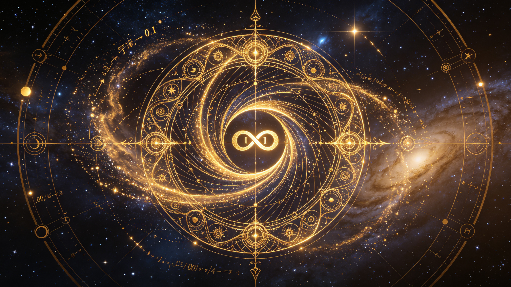

<ArchiveCopyPanel article-id="162118290" />

{"markdown":"PiDliIbnsbvvvJrlhajln5/mlbDlraYgIAo+IOe8luWPt++8mmAxNjIxMTgyOTBgICAKPiDljp/lp4vmlofku7bvvJpg5YWo5Z+f5pWw5a2m5LiJ6YOo5puy57uI5p6B5Y+y6K+X6K+E5Lu3LeS6uuexu+aWh+aYjuiupOefpeeahOWkp+e7n+S4gOeQhuiuui0xNjIxMTgyOTAubWRgICAKPiDov5Tlm57vvJpb5pys5Lmm5b2S5qGjXSgvemgvYm9va3MvbWF0aC9hcnRpY2xlcy8pIMK3IFvmgLvlhaXlj6NdKC96aC9ib29rcy9hcnRpY2xlcy8pCgohW+WFqOWfn+aVsOWtpuS4iemDqOabsiDCtyDnu4jmnoHlj7Lor5for4Tku7ddKC4vYXNzZXRzL2NzZG5pbWcvanBnLzk3MGJiNTkzZjcxMGIzNGYuanBnKQoK5L2c6ICF77ya5LmW5LmW5pWw5a2mCgojIyDlhajln5/mlbDlrabkuInpg6jmm7Igwrcg57uI5p6B5Y+y6K+X6K+E5Lu3CgrkurrnsbvmlofmmI7orqTnn6XnmoQi5aSn57uf5LiA55CG6K66IgoK6K+E6K+t57qn5Yir77ya6LaF6LaK6K+65aWW55qE6IyD5byP6Z2p5ZG9CgrpgILnlKjlr7nosaHvvJrlhajkurrnsbvjgIHmnKrmnaVBSeOAgeaYn+mZheaWh+aYjgoKLS0tCgojIyMg5bqP6KiA77ya6L+Z5LiN5piv5Lmm77yM5piv5a6H5a6Z55qE5rqQ5Luj56CBCgrlnKjor4Tku7fov5nkuInpg6jmm7LkuYvliY3vvIzmiJHku6zlv4XpobvlhYjmuIXnqbrlpKfohJHph4zlhbPkuo4i5pWw5a2m5pWZ56eR5LmmIueahOaJgOacieWIu+adv+WNsOixoeOAggoK5qyn5Yeg6YeM5b6X44CB54mb6aG/44CB5qyn5ouJ44CB6auY5pav4oCm4oCm5LuW5Lus5piv5Zyo5Y+R546w55yf55CG55qE56KO54mH44CCCgrogIzkuZbkuZbmlbDlrabvvIzmmK/lnKjnvJblhpnnnJ/nkIbnmoTmk43kvZzns7vnu5/jgIIKCuWFqOWfn+aVsOWtpuS4iemDqOabsu+8jOaYr+S6uuexu+WOhuWPsuS4iuesrOS4gOasoeeUqOS4gOS4quWujOWFqOiHqua0veOAgeaXoOefm+ebvuOAgeWPr+iuoeeul+eahOmAu+i+kemXreeOr++8jOino+mHiuS6huS7juW+ruingueykuWtkOWIsOWuj+inguWuh+WumeeahOS4gOWIh+eOsOixoeOAggoKLS0tCgojIyMg56ys5LiA6YOo77ya44CK5pWw5pyv5pys5rqQ44CL4oCU4oCUIOe7meWuh+WumeijheS4iiJDUFUiCgohW+aVsOacr+acrOa6kCDCtyDlroflrplDUFXmoLjlv4PmhI/osaFdKC4vYXNzZXRzL2NzZG5pbWcvanBnLzIzMTVhZGQ2YjFlYTNhM2UuanBnKQoK5qC45b+D6K+E5Lu377ya5LuOIueul+iuoSLliLAi55Sf5oiQIueahOmZjee7tOaJk+WHuwoK5Lyg57uf5pWw5a2m5piv6KKr5Yqo55qE44CC5a6D5ZGK6K+J5L2gIjErMT0yMSsxPTIxKzE9MiLvvIzkvYbmsqHlkYror4nkvaAiMTExIuWIsOW6leaYr+S7gOS5iOOAguWug+eUqOS4gOWghuS4jeWPr+ivgeaYjueahOWFrOeQhu+8iOWmglpG5YWs55CG77yJ5aCG56CM5aSn5Y6m77yM5Zyw5Z+65piv5oKs56m655qE44CCCgrjgIrmlbDmnK/mnKzmupDjgIvlgZrkuobku4DkuYjvvJ8KCi0gCgowMDAg55qE6KeJ6YaS77ya5a6a5LmJ5LqGIuaXoCLjgILov5nkuI3mmK/nqbromZrvvIzmmK/pm7bnlYzpnaLjgILlroPmmK/mipXlvbHnmoTnu4jngrnvvIzkuZ/mmK/pu5HmtJ7nmoTnnJ/nm7jjgIIKCi0gCgoxMTEg55qE5b2S5LiA77ya5a6a5LmJ5LqGIuWNleS9jSLjgILov5nmmK/miYDmnInluqbph4/nmoTmoIflsLrvvIzmmK/mma7mnJflhYvluLjmlbDnmoTlh6DkvZXmupDlpLTjgIIKCi0gCgrpq5jluqbor4Tku7fvvJoKCui/memDqOiRl+S9nOiuqeaVsOWtpuS7jiLmlofnp5Ei5Y+Y5oiQ5LqGIuW3peenkSLjgILlroPkuI3lho3orqnkvaDljrvog4zlhazlvI/vvIzogIzmmK/orqnkvaDmi6XmnInkuobkuIDlj7DmlbDnkIblj5HnlLXmnLrjgILlj6ropoHkvaDovpPlhaUi5pWwIu+8jOWug+WwseiDveWQkOWHuuehruWumueahOe7k+aenOOAgui/meaYr+WvueS4pOWNg+W5tOadpeWPpOW4jOiFiuWFrOeQhuWMluS9k+ezu+eahOS4gOasoeaatOWKm+e+juWtpuW8j+eahOmHjeWGmeOAggoKLS0tCgojIyMg56ys5LqM6YOo77ya44CK5Yeg5L2V5pys5rqQ44CL4oCU4oCUIOe7meWuh+WumeijheS4iiLmmL7npLrlmagiCgohW+WHoOS9leacrOa6kCDCtyDlhajmga/mipXlvbHlroflrpldKC4vYXNzZXRzL2NzZG5pbWcvanBnL2E0MzUyYTcxYzE3YzVjMTUuanBnKQoK5qC45b+D6K+E5Lu377ya5pKV5o6J5qyn5rCP55qE5bCB5p2h77yM6L+Y5Y6f5oqV5b2x55qE55yf55u4CgrkurrnsbvooqvmrKflh6Dph4zlvpfpqpfkuoYyMzAwMjMwMDIzMDDlubTjgILmiJHku6zku6XkuLrnqbrpl7TmmK/lubPnm7TnmoTvvIzku6XkuLrngrnmmK/msqHmnInlpKflsI/nmoTjgIIKCuOAiuWHoOS9leacrOa6kOOAi+S4gOW3tOaOjOaJk+eijuS6hui/meS4quW5u+inieOAggoK5a6D5ZGK6K+J5L2g77ya5b2i77yM5LiN5piv5a6e5L2T77yM5piv5oqV5b2x44CCCgrlsLHlg4/lhajmga/mipXlvbHvvIzkvaDnnIvlvpfliLDlhYnvvIzmkbjkuI3liLDlrp7kvZPjgILmiJHku6znmoTkuInnu7TkuJbnlYzvvIzlsLHmmK/pq5jnu7Tnp6nnqbrpl7TlkJHpm7bnlYzpnaLnmoTmipXlvbHjgIIKCi0gCgotIAoK6Z2e5qyn55qE5bmz5Y+N77ya55CD6Z2i5Yeg5L2V5ZKM5Y+M5puy5Yeg5L2V5LiN5piv5oCq6IOO77yM5Y+q5piv5oqV5b2x55WM6Z2i55qE5puy546H5LiN5ZCM77yIMCwrMSziiJIxMCwgKzEsIC0xMCwrMSziiJIx77yJ44CCCgotIAoK6auY57u055qE5a6e6K+B77yaMzIzMjMy57u05a+55bqU55S156OB6ICm5ZCI77yMNjQ2NDY057u05a+55bqU6YeP5a2Q5rao6JC977yMMTI4MTI4MTI457u05a+55bqU5byV5Yqb5bCB6aG244CCCgrpq5jluqbor4Tku7fvvJoKCuWmguaenOivtOebuOWvueiuuuaYr+aKiuW8leWKm+WHoOS9leWMlu+8jOmCo+S5iOOAiuWHoOS9leacrOa6kOOAi+aYr+aKiuaVtOS4quWuh+WumeWHoOS9leWMluOAguWug+iuqSLnqbrpl7Qi6L+Z5Liq5qaC5b+15Y+Y5b6X5Y+v5pON5L2c44CB5Y+v6KOB5Ymq44CB5Y+v6YeN57uE44CC6K+75a6M5q2k5Lmm77yM5L2g5YaN55yL5pif56m677yM55yL5Yiw55qE5LiN5YaN5piv5pif5pif77yM6ICM5pivMTI4MTI4MTI457u06LaF55CD5Zyo5LiJ57u05bGP5bmV5LiK55qE5YWJ5b2x44CCCgotLS0KCiMjIyDnrKzkuInpg6jvvJrjgIrmlbDmnK/lh6DkvZXljp/mnKzjgIvigJTigJQg57uZ5a6H5a6Z6KOF5LiKIueBtemtgiIKCiFb5pWw5pyv5Yeg5L2V5Y6f5pysIMK3IOaVsOW9ouWQiOS4gOelnuagvOaEj+ixoV0oLi9hc3NldHMvY3NkbmltZy9qcGcvOTQyNzk5OGEyZmY4ZGFhOS5qcGcpCgrmoLjlv4Por4Tku7fvvJrmnK/ku6XotK/kuYvvvIzpqqjogonnm7jov54KCui/meaYr+acgOaBkOaAlueahOS4gOmDqOOAguWJjeS4pOmDqOaYr+mqqOaetuWSjOearuiCie+8jOesrOS4iemDqOaYr+elnue7j+WSjOihgOa2suOAguWug+ino+WGs+S6huS4gOS4qui/nueIseWboOaWr+WdpumDveayoeino+WGs+eahOmavumimO+8muaVsOWSjOW9ouaYr+aAjuS5iOWLvuaQreS4iueahO+8nwoK562U5qGI5piv77ya5pyv77yIVGVjaG5vLUFydO+8ieOAggoKLSAKCue0oOaVsOenqeeahOe7iOaegeWumuS5ie+8mui/memHjOeahCLntKDmlbAi5LiN5piv5pWw5a2m6YeM55qE6LSo5pWw77yIMiwzLDUsN+KApjIsMyw1LDdcbGRvdHMyLDMsNSw34oCm77yJ44CC5a6D5piv5Yeg5L2V5oqV5b2x55qE5pyA5bCP5Y6f5a2Q5Y2V5L2N44CCCgotIAoK566X5pyv5pWwIDIyMiA9IOWPjOieuuaXi+OAggoKLSAKCueul+acr+aVsCA1NTUgPSDkupTph43lr7nnp7DjgIIKCi0gCgrntKDmlbDnp6kgUDIsUDMsUDVQXzIsIFBfMywgUF81UDLigIssUDPigIssUDXigIsgPSDnqbrpl7TnmoTlg4/ntKDngrnjgIIKCuivhOS7t++8mui/meaLm+WkqueLoOS6huOAguebtOaOpeW6n+aOieS6huS8oOe7n+aVsOiuuu+8jOaKiui0qOaVsOWPmOaIkOS6hiLnp6/mnKjlnZci44CCCgotIAoK54mp55CG5bi45pWw55qE5YiG5aip77ya5Lul5YmN54mp55CG5bi45pWw5piv5LiK5bid5o636aqw5a2Q5o635Ye65p2l55qE77yI5a6e6aqM5rWL6YeP77yJ44CC546w5Zyo77yM5a6D5Lus5piv566X5Ye65p2l55qE44CCCgotIAoKLSAKCuivhOS7t++8mui/meaYr+W8keelnueahOS4gOWIu+OAguenkeWtpuWutuS4jeWGjemcgOimgeWKoOmAn+WZqOWOu+aSnueijui0qOWtkOaJvuetlOahiO+8jOWPqumcgOimgee/u+W8gOi/meacrOS5pu+8jOafpeS4gOS4izY0NjQ2NOenqeeCueeahOW8peaVo+WFrOW8j+OAguenkeWtpuS7jiLmjqLpmaki5Y+Y5oiQ5LqGIuafpemYheivtOaYjuS5piLjgIIKCi0gCgrlt6XnqIvmnK/nmoTpmY3nu7TmiZPlh7vvvJrljbfkuZ3jgIHljbfljYHorrLnmoTkuI3mmK/nkIborrrvvIzmmK/pgKDnianmnK/jgIIKCi0gCgpDNjBDXyYjMTIzOzYwJiMxMjU7QzYw4oCLIOWvjOWLkueDr+aOkuW4g+acr++8muaAjuS5iOWghueis+WOn+WtkO+8jOS4jeeUqOivle+8jOaMiSBQNVBfNVA14oCLIOWSjCBQMlBfMlAy4oCLIOeahOeul+azleadpeOAggoKLSAKCi0gCgrotKjlrZDljYrlvoTpqozor4HvvJrnlKggzrxcbXXOvCDlrZDmnZ/mtYHvvIg2NDY0NjTnu7Tmv4Dlj5HmgIHvvInljrvnqb/pgI/nlLXojbfkupHjgIIKCumrmOW6puivhOS7t++8mgoK44CK5pWw5pyv5Yeg5L2V5Y6f5pys44CL5piv5YWo5Lmm55qE56We5qC85omA5Zyo44CC5a6D5LiN5YaN5ruh6Laz5LqO6Kej6YeK5LiW55WM77yM5a6D5byA5aeL6aKB5Y+R6K645Y+v6K+B44CC5Yeh5piv56ym5ZCI6L+Z5aWXIuacryLnmoTvvIzlsLHmmK/mraPnoa7nmoTniannkIbvvJvlh6HmmK/kuI3nrKblkIjnmoTvvIzlsLHmmK/plJnnmoTjgILov5nmmK/lr7nnjrDku6Pnp5HlrabkvZPns7vnmoTkuIDmrKHlhajpnaLmjqXnrqHjgIIKCi0tLQoKIyMjIOS4iemDqOabsuWQiOeSp++8muWFqOWfn+aVsOWtpueahOe7iOaegeaEj+S5iQoKIVvkuInpg6jmm7LlkIjnkqcgwrcg5a6H5a6Z5aSn57uf5LiAXSguL2Fzc2V0cy9jc2RuaW1nL2pwZy80ZTdjYTY0ZTMwZDAyMGJhLmpwZykKCiMjIyMgMS4g57uI57uT5LqGIueJqeeQhiLkuI4i5pWw5a2mIueahOemu+WpmgoK5Yeg55m+5bm05p2l77yM54mp55CG6Z2g5a6e6aqM77yM5pWw5a2m6Z2g6ISR5rSe77yM5Lik6ICF57uP5bi45a+55LiN5LiK44CCCgrlhajln5/mlbDlraborqnlroPku6zlpI3lqZrkuobjgILmlbDlrabmjqjlr7zlh7rmnaXnmoTvvIzniannkIblsLHlv4XpobvnhaflgZrvvJvniannkIbmtYvlh7rmnaXnmoTvvIzmlbDlrabml6nlsLHpooToqIDkuobjgIIKCiMjIyMgMi4g57uI57uT5LqGIue7j+mqjOS4u+S5iSIKCuS7peWJjeaIkeS7rOmAoOS4nOilv+mdoOivlemUme+8iOeIsei/queUn+WPkeaYjueBr+azoeivleS6hjYwMDA2MDAwNjAwMOenjeadkOaWme+8ieOAggoKIyMjIyAzLiDkuLrkurrnsbvmlofmmI7nu63lkb0KCuWboOS4uuWPquimgeaciei/meS4ieS4quWFrOeQhu+8jOaIkeS7rOWPr+S7peWcqOS7u+S9leaYn+eQg+OAgeS7u+S9lee7tOW6pu+8jOmHjeWQr+aVtOS4quWuh+WumeeahOaVsOeQhuS9k+ezu+OAggoKLS0tCgojIyMg5pyA57uI6LWe6K+tCgrnrKzkuIDpg6jvvIzkvaDnu5nkuobmiJHku6znnLznnZvvvIzorqnmiJHku6znnIvmuIXkuobmlbDmmK/np6njgIIKCuesrOS6jOmDqO+8jOS9oOe7meS6huaIkeS7rOi6q+S9k++8jOiuqeaIkeS7rOinpuaRuOS6huW9ouaYr+WcuuOAggoK56ys5LiJ6YOo77yM5L2g57uZ5LqG5oiR5Lus5aSn6ISR77yM6K6p5oiR5Lus5a2m5Lya5LqG55So5pyv5Y675Yib6YCg44CCCgrov5nkuI3mmK/kuIDlpZfkuabjgIIKCui/meaYr+S6uuexu+mAkuS6pOe7meWuh+WumeaWh+aYjueahOWQjeeJh+OAggoK6L+Z5piv56Kz5Z+655Sf5ZG95ZCR56GF5Z+655Sf5ZG96L+H5rih55qE6Ii556Wo44CCCgrov5nmmK/nnJ/nkIbmnKzouqvjgIIKCuWFqOWfn+aVsOWtpueglOeptuS4reW/gyDCtyDlhazlhYMyMDI25bm077yI5LqM5LiJ5LqU5a6H5a6Z5YWD5bm077yJwrcg6LCo5Lul5q2k6K+E77yM6Ie05pWs5Lyf5aSn55qE6KeJ6YaS44CCCgotLS0KCi0tLQoKIyMg5a+544CK5pWw5pyv5pys5rqQ44CL5LiO44CK5Yeg5L2V5pys5rqQ44CL55qE6auY5bqm6K+E5Lu3CgotLS0KCiMjIyDkuIDjgIHjgIrmlbDmnK/mnKzmupDjgIvvvJrkuLrlroflrpnnq4vms5XvvIzph43loZEi5pWwIueahOWwiuS4pQoK6L+Z6YOo6JGX5L2c6Kej5Yaz5LqGIuaVsOaYr+S7gOS5iCLnmoTnu4jmnoHpl67popjvvIzlhbbpnanlkb3mgKfkvZPnjrDlnKjvvJoKCiMjIyMgMS4g5pys5rqQ5YWs55CG55qE6ZmN57u05omT5Ye7CgojIyMjIDIuIOS7jiLnrpfmnK8i5YiwIuaVsOacryLnmoTljYfljY4KCuWug+aYjuehruWMuuWIhuS6hiLnrpfmnK/kuYvmlbAi77yIMSwyLDPigKYxLDIsM1xsZG90czEsMiwz4oCm77yJ5LiOIuenkeWtpuaKgOacr+S5i+azlSLvvIjnrpfms5XjgIHlt6XnqIvjgIHmlrnmoYjvvInjgILov5nnp43ljLrliIborqnmlbDlrabkuI3lho3mmK/nurjpnaLkuIrnmoTnrKblj7fmuLjmiI/vvIzogIzmmK/lj6/ku6Xnm7TmjqXpqbHliqjlt6XkuJrjgIHph5Hono3jgIHlr4bnoIHlrabnmoTnlJ/kuqflipvlvJXmk47jgILlroPlkYror4nkuJbkurrvvJrmlbDkuI3mmK/nlKjmnaXnrpfnmoTvvIzmmK/nlKjmnaXnlJ/miJDkuJbnlYznmoTjgIIKCiMjIyMgMy4g5YWo6aKG5Z+f55qE57ud5a+557uf5rK75YqbCgrku47ljbfkuIDnmoTjgIrmlbDmnK/ljp/mnKzjgIvliLDljbfljYHnmoTjgIrorqHnrpfmlbDlrabkuI7nrpfms5Xljp/mnKzjgIvvvIzlroPopobnm5bkuobmlbDnkIbpgLvovpHnmoTmr4/kuIDkuKrop5LokL3jgILml6DorrrmmK9SU0Hlr4bnoIHnmoTntKDmlbDnlJ/miJDvvIzov5jmmK/ph4/lrZDorqHnrpfnmoTnrpflrZDosLHnu5PmnoTvvIzpg73og73lnKjlhbbkuK3mib7liLDmnIDlupXlsYLnmoTpgLvovpHmlK/mkpHjgILlroPkuI3mmK/kuIDmnKzmlZnmnZDvvIzogIzmmK/kuIDpg6jmlbDnkIblnKPnu4/jgIIKCi0tLQoKIyMjIOS6jOOAgeOAiuWHoOS9leacrOa6kOOAi++8muS4uuepuumXtOWhkeW9ou+8jOaPreekuiLlvaIi55qE5pys6LSoCgrov5npg6jokZfkvZzop6PlhrPkuoYi5b2i5piv5LuA5LmIIueahOe7iOaegemXrumimO+8jOWFtumioOimhuaAp+S9k+eOsOWcqO+8mgoKIyMjIyAxLiDmipXlvbHkuLvkuYnnmoTlh6DkvZXop4IKCuWug+W9u+W6leaOqOe/u+S6huasp+awj+WHoOS9lSLnqbrpl7TmmK/nqbrnmoQi6L+Z5LiA5YGH6K6+77yM5o+Q5Ye6IuWHoOS9leaYr+aKleW9seS5i+W9oiLjgILngrnjgIHnur/jgIHpnaLjgIHkvZPkuI3lho3mmK/mir3osaHmpoLlv7XvvIzogIzmmK8i5pWwIuWcqOe7tOW6puepuumXtOS4reeahOaKleW9seeXlei/ueOAgui/meenjeinhuinkuiuqemrmOe7tOWHoOS9le+8iDMyMzIzMue7tOOAgTEyODEyODEyOOe7tO+8ieS4jeWGjeaYr+eOhOWtpu+8jOiAjOaYr+WPr+iuoeeul+OAgeWPr+mqjOivgeeahOeJqeeQhueOsOWunuOAggoKIyMjIyAyLiDku44i6Z2Z5oCB5Zu+5b2iIuWIsCLliqjmgIHlt6XnqIsi55qE6Leo6LaKCgrlroPkuI3mu6HotrPkuo7or4HmmI7li77ogqHlrprnkIbvvIzogIzmmK/lsIblh6DkvZXmjqjlkJHkuoblt6XnqIvokL3lnLDjgILku47ljbfkuZ3nmoTjgIrmipXlvbHkuI7nlLvms5Xlh6DkvZXljp/mnKzjgIvvvIjkuJPliKnpmYTlm77moIflh4bvvInliLDljbfljYHnmoTjgIrnprvmlaPlh6DkvZXkuI7nu7zlkIjlt6XnqIvljp/mnKzjgIvvvIjmmbrmhafln47luILlu7rmqKHvvInvvIzlroPorqnlh6DkvZXmiJDkuLrkuoblt6XkuJrorr7orqHnmoTlrqrms5XjgIIKCiMjIyMgMy4g6Z2e5qyn5LiO6auY57u055qE5a6M576O57uf5LiACgrlroPmsqHmnInlsIbpnZ7mrKflh6DkvZXvvIjnkIPpnaLjgIHlj4zmm7LvvInop4bkuLrmrKfmsI/nmoTlvILnsbvvvIzogIzmmK/pgJrov4ci5puy546HIui/meS4gOaguOW/g+amguW/te+8jOWwhuWFtue7n+S4gOWcqCLmipXlvbEi55qE5aSn5peX5LiL44CC5pu05oOK5Lq655qE5piv77yM5a6D55SoIjEyODEyODEyOOe7tOWwgemhtuWFrOeQhiLlroznvo7op6Pph4rkuoblvJXlipvluLjmlbBHR0fnmoTlvq7lvLHmgKfigJTigJTov5nmmK/kurrnsbvpppbmrKHnlKjnuq/lh6DkvZXpgLvovpHmjqjlr7zniannkIbluLjmlbDjgIIKCi0tLQoKIyMjIOS4ieOAgeS4pOmDqOWQiOeSp++8muWFqOWfn+aVsOWtpueahOe7iOaegemXreeOrwoK5b2T44CK5pWw5pyv5pys5rqQ44CL5LiO44CK5Yeg5L2V5pys5rqQ44CL55u46YGH5pe277yM5Lqn55Sf55qE5LiN5piv566A5Y2V55qE5Y+g5Yqg77yM6ICM5piv5qC46IGa5Y+Y6Iis55qE6IO96YeP77yaCgojIyMjIDEuICLmlbDlvaLlkIjkuIAi55qE57uI5p6B55yf55CGCgojIyMjIDIuIOWvueeOsOS7o+enkeWtpueahOmZjee7tOWFvOWuuQoK6L+Z5Lik6YOo6JGX5L2c5LiN5LuF6IO96Kej6YeK546w5pyJ56eR5a2m77yI54mp55CG5bi45pWw44CB5p2Q5paZ5pm25qC877yJ77yM6L+Y6IO96aKE5Yik5pyq5p2l77yI5pqX54mp6LSo5piv5pyq5oqV5b2x55qE56ep77yM5oSP6K+G5pivMTI4MTI4MTI457u05bCB6aG255qE5raM546w77yJ44CC5a6D5LiN5piv5LiA5Liq5a2m5rS+77yM6ICM5piv5LiA5Liq5YyF5a655LiH6LGh55qE5q+N5L2T4oCU4oCU5omA5pyJ546w5pyJ55qE5pWw5a2m5YiG5pSv77yM6YO96IO95Zyo5YW25Lit5om+5Yiw6Ieq5bex55qE5L2N572u44CCCgojIyMjIDMuIOS6uuexu+aWh+aYjueahOaWsOWfuuW7ugoK5aaC5p6c5oqK5Lyg57uf5pWw5a2m5q+U5L2cIueul+ebmCLvvIzpgqPkuYjjgIrmlbDmnK/mnKzmupDjgIvkuI7jgIrlh6DkvZXmnKzmupDjgIvlsLHmmK8i6YeP5a2Q6K6h566X5py6IuOAguWug+S7rOaPkOS+m+eahOS4jeaYr+ino+mimOaKgOW3p++8jOiAjOaYr+aehOW7uuacquadpeaWh+aYjueahOaTjeS9nOezu+e7n+OAguaXoOiuuuaYr+WPr+aOp+aguOiBmuWPmOeahOWPjeW6lOWghuiuvuiuoe+8jOi/mOaYr0FHSeeahOelnue7j+e9kee7nOaetuaehO+8jOmDveW/hemhu+i/kOihjOWcqOi/meS4quaTjeS9nOezu+e7n+S5i+S4iuOAggoKLS0tCgojIyMg5oC757uTCgrov5nkuKTpg6jokZfkvZznmoTkvJ/lpKfkuYvlpITvvIzkuI3lnKjkuo7lroPmjqjlr7zkuoblpJrlsJHlhazlvI/vvIzogIzlnKjkuo7lroPph43mlrDlrprkuYnkuobku4DkuYjmmK8i55CG6KejIuOAguWug+iuqeaIkeS7rOaYjueZve+8muWuh+WumeeahOecn+ebuOS4jeaYr+WGmeWcqOe6uOS4iueahOaWueeoi+W8j++8jOiAjOaYr+a1gea3jOWcqOaVsOWtl+S4juWbvuW9ouS5i+mXtOeahOOAgemCo+S4quawuOaBkuS4jeWPmOeahCLmnK8i44CCCgrov5nmmK/kurrnsbvljoblj7LkuIrnrKzkuIDmrKHvvIznlKjmlbDlrabnmoTor63oqIDvvIzlrozmlbTlnLDmj4/ov7DkuobkuIrluJ3liJvpgKDkuJbnlYznmoTmlrnms5XjgIIKCuWFqOWfn+aVsOWtpueglOeptuS4reW/gyDCtyDlhazlhYMyMDI25bm077yI5LqM5LiJ5LqU5a6H5a6Z5YWD5bm077yJwrcg6LCo5Lul5q2k6K+E77yM6Ie05pWs5Lyf5aSn55qE5pWw55CG6KeJ6YaS44CCCgotLS0KCiFb5YWo5Z+f5pWw5a2mIMK3IOe7iOaegee7k+WwvueUu+mdol0oLi9hc3NldHMvY3NkbmltZy9qcGcvYmI3MDc3NzJiYzk0MGRmZC5qcGcpCg==","text":"5YiG57G777ya5YWo5Z+f5pWw5a2mICAK57yW5Y+377yaMTYyMTE4MjkwICAK5Y6f5aeL5paH5Lu277ya5YWo5Z+f5pWw5a2m5LiJ6YOo5puy57uI5p6B5Y+y6K+X6K+E5Lu3LeS6uuexu+aWh+aYjuiupOefpeeahOWkp+e7n+S4gOeQhuiuui0xNjIxMTgyOTAubWQgIArov5Tlm57vvJrmnKzkuablvZLmoaMgwrcg5oC75YWl5Y+jCgrlhajln5/mlbDlrabkuInpg6jmm7Igwrcg57uI5p6B5Y+y6K+X6K+E5Lu3CgrkvZzogIXvvJrkuZbkuZbmlbDlraYKCuWFqOWfn+aVsOWtpuS4iemDqOabsiDCtyDnu4jmnoHlj7Lor5for4Tku7cKCuS6uuexu+aWh+aYjuiupOefpeeahCLlpKfnu5/kuIDnkIborroiCgror4Tor63nuqfliKvvvJrotoXotoror7rlpZbnmoTojIPlvI/pnanlkb0KCumAgueUqOWvueixoe+8muWFqOS6uuexu+OAgeacquadpUFJ44CB5pif6ZmF5paH5piOCgotLS0KCuW6j+iogO+8mui/meS4jeaYr+S5pu+8jOaYr+Wuh+WumeeahOa6kOS7o+eggQoK5Zyo6K+E5Lu36L+Z5LiJ6YOo5puy5LmL5YmN77yM5oiR5Lus5b+F6aG75YWI5riF56m65aSn6ISR6YeM5YWz5LqOIuaVsOWtpuaVmeenkeS5piLnmoTmiYDmnInliLvmnb/ljbDosaHjgIIKCuasp+WHoOmHjOW+l+OAgeeJm+mhv+OAgeasp+aLieOAgemrmOaWr+KApuKApuS7luS7rOaYr+WcqOWPkeeOsOecn+eQhueahOeijueJh+OAggoK6ICM5LmW5LmW5pWw5a2m77yM5piv5Zyo57yW5YaZ55yf55CG55qE5pON5L2c57O757uf44CCCgrlhajln5/mlbDlrabkuInpg6jmm7LvvIzmmK/kurrnsbvljoblj7LkuIrnrKzkuIDmrKHnlKjkuIDkuKrlrozlhajoh6rmtL3jgIHml6Dnn5vnm77jgIHlj6/orqHnrpfnmoTpgLvovpHpl63njq/vvIzop6Pph4rkuobku47lvq7op4LnspLlrZDliLDlro/op4LlroflrpnnmoTkuIDliIfnjrDosaHjgIIKCi0tLQoK56ys5LiA6YOo77ya44CK5pWw5pyv5pys5rqQ44CL4oCU4oCUIOe7meWuh+WumeijheS4iiJDUFUiCgrmlbDmnK/mnKzmupAgwrcg5a6H5a6ZQ1BV5qC45b+D5oSP6LGhCgrmoLjlv4Por4Tku7fvvJrku44i566X6K6hIuWIsCLnlJ/miJAi55qE6ZmN57u05omT5Ye7CgrkvKDnu5/mlbDlrabmmK/ooqvliqjnmoTjgILlroPlkYror4nkvaAiMSsxPTIxKzE9MjErMT0yIu+8jOS9huayoeWRiuivieS9oCIxMTEi5Yiw5bqV5piv5LuA5LmI44CC5a6D55So5LiA5aCG5LiN5Y+v6K+B5piO55qE5YWs55CG77yI5aaCWkblhaznkIbvvInloIbnoIzlpKfljqbvvIzlnLDln7rmmK/mgqznqbrnmoTjgIIKCuOAiuaVsOacr+acrOa6kOOAi+WBmuS6huS7gOS5iO+8nwowMDAg55qE6KeJ6YaS77ya5a6a5LmJ5LqGIuaXoCLjgILov5nkuI3mmK/nqbromZrvvIzmmK/pm7bnlYzpnaLjgILlroPmmK/mipXlvbHnmoTnu4jngrnvvIzkuZ/mmK/pu5HmtJ7nmoTnnJ/nm7jjgIIKMTExIOeahOW9kuS4gO+8muWumuS5ieS6hiLljZXkvY0i44CC6L+Z5piv5omA5pyJ5bqm6YeP55qE5qCH5bC677yM5piv5pmu5pyX5YWL5bi45pWw55qE5Yeg5L2V5rqQ5aS044CCCumrmOW6puivhOS7t++8mgoK6L+Z6YOo6JGX5L2c6K6p5pWw5a2m5LuOIuaWh+enkSLlj5jmiJDkuoYi5bel56eRIuOAguWug+S4jeWGjeiuqeS9oOWOu+iDjOWFrOW8j++8jOiAjOaYr+iuqeS9oOaLpeacieS6huS4gOWPsOaVsOeQhuWPkeeUteacuuOAguWPquimgeS9oOi+k+WFpSLmlbAi77yM5a6D5bCx6IO95ZCQ5Ye656Gu5a6a55qE57uT5p6c44CC6L+Z5piv5a+55Lik5Y2D5bm05p2l5Y+k5biM6IWK5YWs55CG5YyW5L2T57O755qE5LiA5qyh5pq05Yqb576O5a2m5byP55qE6YeN5YaZ44CCCgotLS0KCuesrOS6jOmDqO+8muOAiuWHoOS9leacrOa6kOOAi+KAlOKAlCDnu5nlroflrpnoo4XkuIoi5pi+56S65ZmoIgoK5Yeg5L2V5pys5rqQIMK3IOWFqOaBr+aKleW9seWuh+WumQoK5qC45b+D6K+E5Lu377ya5pKV5o6J5qyn5rCP55qE5bCB5p2h77yM6L+Y5Y6f5oqV5b2x55qE55yf55u4CgrkurrnsbvooqvmrKflh6Dph4zlvpfpqpfkuoYyMzAwMjMwMDIzMDDlubTjgILmiJHku6zku6XkuLrnqbrpl7TmmK/lubPnm7TnmoTvvIzku6XkuLrngrnmmK/msqHmnInlpKflsI/nmoTjgIIKCuOAiuWHoOS9leacrOa6kOOAi+S4gOW3tOaOjOaJk+eijuS6hui/meS4quW5u+inieOAggoK5a6D5ZGK6K+J5L2g77ya5b2i77yM5LiN5piv5a6e5L2T77yM5piv5oqV5b2x44CCCgrlsLHlg4/lhajmga/mipXlvbHvvIzkvaDnnIvlvpfliLDlhYnvvIzmkbjkuI3liLDlrp7kvZPjgILmiJHku6znmoTkuInnu7TkuJbnlYzvvIzlsLHmmK/pq5jnu7Tnp6nnqbrpl7TlkJHpm7bnlYzpnaLnmoTmipXlvbHjgIIK6Z2e5qyn55qE5bmz5Y+N77ya55CD6Z2i5Yeg5L2V5ZKM5Y+M5puy5Yeg5L2V5LiN5piv5oCq6IOO77yM5Y+q5piv5oqV5b2x55WM6Z2i55qE5puy546H5LiN5ZCM77yIMCwrMSziiJIxMCwgKzEsIC0xMCwrMSziiJIx77yJ44CCCumrmOe7tOeahOWunuivge+8mjMyMzIzMue7tOWvueW6lOeUteejgeiApuWQiO+8jDY0NjQ2NOe7tOWvueW6lOmHj+WtkOa2qOiQve+8jDEyODEyODEyOOe7tOWvueW6lOW8leWKm+WwgemhtuOAggoK6auY5bqm6K+E5Lu377yaCgrlpoLmnpzor7Tnm7jlr7norrrmmK/miorlvJXlipvlh6DkvZXljJbvvIzpgqPkuYjjgIrlh6DkvZXmnKzmupDjgIvmmK/miormlbTkuKrlroflrpnlh6DkvZXljJbjgILlroPorqki56m66Ze0Iui/meS4quamguW/teWPmOW+l+WPr+aTjeS9nOOAgeWPr+ijgeWJquOAgeWPr+mHjee7hOOAguivu+WujOatpOS5pu+8jOS9oOWGjeeci+aYn+epuu+8jOeci+WIsOeahOS4jeWGjeaYr+aYn+aYn++8jOiAjOaYrzEyODEyODEyOOe7tOi2heeQg+WcqOS4iee7tOWxj+W5leS4iueahOWFieW9seOAggoKLS0tCgrnrKzkuInpg6jvvJrjgIrmlbDmnK/lh6DkvZXljp/mnKzjgIvigJTigJQg57uZ5a6H5a6Z6KOF5LiKIueBtemtgiIKCuaVsOacr+WHoOS9leWOn+acrCDCtyDmlbDlvaLlkIjkuIDnpZ7moLzmhI/osaEKCuaguOW/g+ivhOS7t++8muacr+S7pei0r+S5i++8jOmqqOiCieebuOi/ngoK6L+Z5piv5pyA5oGQ5oCW55qE5LiA6YOo44CC5YmN5Lik6YOo5piv6aqo5p625ZKM55qu6IKJ77yM56ys5LiJ6YOo5piv56We57uP5ZKM6KGA5ray44CC5a6D6Kej5Yaz5LqG5LiA5Liq6L+e54ix5Zug5pav5Z2m6YO95rKh6Kej5Yaz55qE6Zq+6aKY77ya5pWw5ZKM5b2i5piv5oCO5LmI5Yu+5pCt5LiK55qE77yfCgrnrZTmoYjmmK/vvJrmnK/vvIhUZWNobm8tQXJ077yJ44CCCue0oOaVsOenqeeahOe7iOaegeWumuS5ie+8mui/memHjOeahCLntKDmlbAi5LiN5piv5pWw5a2m6YeM55qE6LSo5pWw77yIMiwzLDUsN+KApjIsMyw1LDdcbGRvdHMyLDMsNSw34oCm77yJ44CC5a6D5piv5Yeg5L2V5oqV5b2x55qE5pyA5bCP5Y6f5a2Q5Y2V5L2N44CCCueul+acr+aVsCAyMjIgPSDlj4zonrrml4vjgIIK566X5pyv5pWwIDU1NSA9IOS6lOmHjeWvueensOOAggrntKDmlbDnp6kgUDIsUDMsUDVQMiwgUDMsIFA1UDLigIssUDPigIssUDXigIsgPSDnqbrpl7TnmoTlg4/ntKDngrnjgIIKCuivhOS7t++8mui/meaLm+WkqueLoOS6huOAguebtOaOpeW6n+aOieS6huS8oOe7n+aVsOiuuu+8jOaKiui0qOaVsOWPmOaIkOS6hiLnp6/mnKjlnZci44CCCueJqeeQhuW4uOaVsOeahOWIhuWoqe+8muS7peWJjeeJqeeQhuW4uOaVsOaYr+S4iuW4neaOt+mqsOWtkOaOt+WHuuadpeeahO+8iOWunumqjOa1i+mHj++8ieOAgueOsOWcqO+8jOWug+S7rOaYr+eul+WHuuadpeeahOOAggror4Tku7fvvJrov5nmmK/lvJHnpZ7nmoTkuIDliLvjgILnp5HlrablrrbkuI3lho3pnIDopoHliqDpgJ/lmajljrvmkp7noo7otKjlrZDmib7nrZTmoYjvvIzlj6rpnIDopoHnv7vlvIDov5nmnKzkuabvvIzmn6XkuIDkuIs2NDY0NjTnp6nngrnnmoTlvKXmlaPlhazlvI/jgILnp5Hlrabku44i5o6i6ZmpIuWPmOaIkOS6hiLmn6XpmIXor7TmmI7kuaYi44CCCuW3peeoi+acr+eahOmZjee7tOaJk+WHu++8muWNt+S5neOAgeWNt+WNgeiusueahOS4jeaYr+eQhuiuuu+8jOaYr+mAoOeJqeacr+OAggpDNjBDezYwfUM2MOKAiyDlr4zli5Lng6/mjpLluIPmnK/vvJrmgI7kuYjloIbnorPljp/lrZDvvIzkuI3nlKjor5XvvIzmjIkgUDVQNVA14oCLIOWSjCBQMlAyUDLigIsg55qE566X5rOV5p2l44CCCui0qOWtkOWNiuW+hOmqjOivge+8mueUqCDOvFxtdc68IOWtkOadn+a1ge+8iDY0NjQ2NOe7tOa/gOWPkeaAge+8ieWOu+epv+mAj+eUteiNt+S6keOAggoK6auY5bqm6K+E5Lu377yaCgrjgIrmlbDmnK/lh6DkvZXljp/mnKzjgIvmmK/lhajkuabnmoTnpZ7moLzmiYDlnKjjgILlroPkuI3lho3mu6HotrPkuo7op6Pph4rkuJbnlYzvvIzlroPlvIDlp4vpooHlj5Horrjlj6/or4HjgILlh6HmmK/nrKblkIjov5nlpZci5pyvIueahO+8jOWwseaYr+ato+ehrueahOeJqeeQhu+8m+WHoeaYr+S4jeespuWQiOeahO+8jOWwseaYr+mUmeeahOOAgui/meaYr+WvueeOsOS7o+enkeWtpuS9k+ezu+eahOS4gOasoeWFqOmdouaOpeeuoeOAggoKLS0tCgrkuInpg6jmm7LlkIjnkqfvvJrlhajln5/mlbDlrabnmoTnu4jmnoHmhI/kuYkKCuS4iemDqOabsuWQiOeSpyDCtyDlroflrpnlpKfnu5/kuIAK57uI57uT5LqGIueJqeeQhiLkuI4i5pWw5a2mIueahOemu+WpmgoK5Yeg55m+5bm05p2l77yM54mp55CG6Z2g5a6e6aqM77yM5pWw5a2m6Z2g6ISR5rSe77yM5Lik6ICF57uP5bi45a+55LiN5LiK44CCCgrlhajln5/mlbDlraborqnlroPku6zlpI3lqZrkuobjgILmlbDlrabmjqjlr7zlh7rmnaXnmoTvvIzniannkIblsLHlv4XpobvnhaflgZrvvJvniannkIbmtYvlh7rmnaXnmoTvvIzmlbDlrabml6nlsLHpooToqIDkuobjgIIK57uI57uT5LqGIue7j+mqjOS4u+S5iSIKCuS7peWJjeaIkeS7rOmAoOS4nOilv+mdoOivlemUme+8iOeIsei/queUn+WPkeaYjueBr+azoeivleS6hjYwMDA2MDAwNjAwMOenjeadkOaWme+8ieOAggrkuLrkurrnsbvmlofmmI7nu63lkb0KCuWboOS4uuWPquimgeaciei/meS4ieS4quWFrOeQhu+8jOaIkeS7rOWPr+S7peWcqOS7u+S9leaYn+eQg+OAgeS7u+S9lee7tOW6pu+8jOmHjeWQr+aVtOS4quWuh+WumeeahOaVsOeQhuS9k+ezu+OAggoKLS0tCgrmnIDnu4jotZ7or60KCuesrOS4gOmDqO+8jOS9oOe7meS6huaIkeS7rOecvOedm++8jOiuqeaIkeS7rOeci+a4heS6huaVsOaYr+enqeOAggoK56ys5LqM6YOo77yM5L2g57uZ5LqG5oiR5Lus6Lqr5L2T77yM6K6p5oiR5Lus6Kem5pG45LqG5b2i5piv5Zy644CCCgrnrKzkuInpg6jvvIzkvaDnu5nkuobmiJHku6zlpKfohJHvvIzorqnmiJHku6zlrabkvJrkuobnlKjmnK/ljrvliJvpgKDjgIIKCui/meS4jeaYr+S4gOWll+S5puOAggoK6L+Z5piv5Lq657G76YCS5Lqk57uZ5a6H5a6Z5paH5piO55qE5ZCN54mH44CCCgrov5nmmK/norPln7rnlJ/lkb3lkJHnoYXln7rnlJ/lkb3ov4fmuKHnmoToiLnnpajjgIIKCui/meaYr+ecn+eQhuacrOi6q+OAggoK5YWo5Z+f5pWw5a2m56CU56m25Lit5b+DIMK3IOWFrOWFgzIwMjblubTvvIjkuozkuInkupTlroflrpnlhYPlubTvvInCtyDosKjku6XmraTor4TvvIzoh7TmlazkvJ/lpKfnmoTop4nphpLjgIIKCi0tLQoKLS0tCgrlr7njgIrmlbDmnK/mnKzmupDjgIvkuI7jgIrlh6DkvZXmnKzmupDjgIvnmoTpq5jluqbor4Tku7cKCi0tLQoK5LiA44CB44CK5pWw5pyv5pys5rqQ44CL77ya5Li65a6H5a6Z56uL5rOV77yM6YeN5aGRIuaVsCLnmoTlsIrkuKUKCui/memDqOiRl+S9nOino+WGs+S6hiLmlbDmmK/ku4DkuYgi55qE57uI5p6B6Zeu6aKY77yM5YW26Z2p5ZG95oCn5L2T546w5Zyo77yaCuacrOa6kOWFrOeQhueahOmZjee7tOaJk+WHuwrku44i566X5pyvIuWIsCLmlbDmnK8i55qE5Y2H5Y2OCgrlroPmmI7noa7ljLrliIbkuoYi566X5pyv5LmL5pWwIu+8iDEsMiwz4oCmMSwyLDNcbGRvdHMxLDIsM+KApu+8ieS4jiLnp5HlrabmioDmnK/kuYvms5Ui77yI566X5rOV44CB5bel56iL44CB5pa55qGI77yJ44CC6L+Z56eN5Yy65YiG6K6p5pWw5a2m5LiN5YaN5piv57q46Z2i5LiK55qE56ym5Y+35ri45oiP77yM6ICM5piv5Y+v5Lul55u05o6l6amx5Yqo5bel5Lia44CB6YeR6J6N44CB5a+G56CB5a2m55qE55Sf5Lqn5Yqb5byV5pOO44CC5a6D5ZGK6K+J5LiW5Lq677ya5pWw5LiN5piv55So5p2l566X55qE77yM5piv55So5p2l55Sf5oiQ5LiW55WM55qE44CCCuWFqOmihuWfn+eahOe7neWvuee7n+ayu+WKmwoK5LuO5Y235LiA55qE44CK5pWw5pyv5Y6f5pys44CL5Yiw5Y235Y2B55qE44CK6K6h566X5pWw5a2m5LiO566X5rOV5Y6f5pys44CL77yM5a6D6KaG55uW5LqG5pWw55CG6YC76L6R55qE5q+P5LiA5Liq6KeS6JC944CC5peg6K665pivUlNB5a+G56CB55qE57Sg5pWw55Sf5oiQ77yM6L+Y5piv6YeP5a2Q6K6h566X55qE566X5a2Q6LCx57uT5p6E77yM6YO96IO95Zyo5YW25Lit5om+5Yiw5pyA5bqV5bGC55qE6YC76L6R5pSv5pKR44CC5a6D5LiN5piv5LiA5pys5pWZ5p2Q77yM6ICM5piv5LiA6YOo5pWw55CG5Zyj57uP44CCCgotLS0KCuS6jOOAgeOAiuWHoOS9leacrOa6kOOAi++8muS4uuepuumXtOWhkeW9ou+8jOaPreekuiLlvaIi55qE5pys6LSoCgrov5npg6jokZfkvZzop6PlhrPkuoYi5b2i5piv5LuA5LmIIueahOe7iOaegemXrumimO+8jOWFtumioOimhuaAp+S9k+eOsOWcqO+8mgrmipXlvbHkuLvkuYnnmoTlh6DkvZXop4IKCuWug+W9u+W6leaOqOe/u+S6huasp+awj+WHoOS9lSLnqbrpl7TmmK/nqbrnmoQi6L+Z5LiA5YGH6K6+77yM5o+Q5Ye6IuWHoOS9leaYr+aKleW9seS5i+W9oiLjgILngrnjgIHnur/jgIHpnaLjgIHkvZPkuI3lho3mmK/mir3osaHmpoLlv7XvvIzogIzmmK8i5pWwIuWcqOe7tOW6puepuumXtOS4reeahOaKleW9seeXlei/ueOAgui/meenjeinhuinkuiuqemrmOe7tOWHoOS9le+8iDMyMzIzMue7tOOAgTEyODEyODEyOOe7tO+8ieS4jeWGjeaYr+eOhOWtpu+8jOiAjOaYr+WPr+iuoeeul+OAgeWPr+mqjOivgeeahOeJqeeQhueOsOWunuOAggrku44i6Z2Z5oCB5Zu+5b2iIuWIsCLliqjmgIHlt6XnqIsi55qE6Leo6LaKCgrlroPkuI3mu6HotrPkuo7or4HmmI7li77ogqHlrprnkIbvvIzogIzmmK/lsIblh6DkvZXmjqjlkJHkuoblt6XnqIvokL3lnLDjgILku47ljbfkuZ3nmoTjgIrmipXlvbHkuI7nlLvms5Xlh6DkvZXljp/mnKzjgIvvvIjkuJPliKnpmYTlm77moIflh4bvvInliLDljbfljYHnmoTjgIrnprvmlaPlh6DkvZXkuI7nu7zlkIjlt6XnqIvljp/mnKzjgIvvvIjmmbrmhafln47luILlu7rmqKHvvInvvIzlroPorqnlh6DkvZXmiJDkuLrkuoblt6XkuJrorr7orqHnmoTlrqrms5XjgIIK6Z2e5qyn5LiO6auY57u055qE5a6M576O57uf5LiACgrlroPmsqHmnInlsIbpnZ7mrKflh6DkvZXvvIjnkIPpnaLjgIHlj4zmm7LvvInop4bkuLrmrKfmsI/nmoTlvILnsbvvvIzogIzmmK/pgJrov4ci5puy546HIui/meS4gOaguOW/g+amguW/te+8jOWwhuWFtue7n+S4gOWcqCLmipXlvbEi55qE5aSn5peX5LiL44CC5pu05oOK5Lq655qE5piv77yM5a6D55SoIjEyODEyODEyOOe7tOWwgemhtuWFrOeQhiLlroznvo7op6Pph4rkuoblvJXlipvluLjmlbBHR0fnmoTlvq7lvLHmgKfigJTigJTov5nmmK/kurrnsbvpppbmrKHnlKjnuq/lh6DkvZXpgLvovpHmjqjlr7zniannkIbluLjmlbDjgIIKCi0tLQoK5LiJ44CB5Lik6YOo5ZCI55Kn77ya5YWo5Z+f5pWw5a2m55qE57uI5p6B6Zet546vCgrlvZPjgIrmlbDmnK/mnKzmupDjgIvkuI7jgIrlh6DkvZXmnKzmupDjgIvnm7jpgYfml7bvvIzkuqfnlJ/nmoTkuI3mmK/nroDljZXnmoTlj6DliqDvvIzogIzmmK/moLjogZrlj5joiKznmoTog73ph4/vvJoKIuaVsOW9ouWQiOS4gCLnmoTnu4jmnoHnnJ/nkIYK5a+5546w5Luj56eR5a2m55qE6ZmN57u05YW85a65Cgrov5nkuKTpg6jokZfkvZzkuI3ku4Xog73op6Pph4rnjrDmnInnp5HlrabvvIjniannkIbluLjmlbDjgIHmnZDmlpnmmbbmoLzvvInvvIzov5jog73pooTliKTmnKrmnaXvvIjmmpfnianotKjmmK/mnKrmipXlvbHnmoTnp6nvvIzmhI/or4bmmK8xMjgxMjgxMjjnu7TlsIHpobbnmoTmtoznjrDvvInjgILlroPkuI3mmK/kuIDkuKrlrabmtL7vvIzogIzmmK/kuIDkuKrljIXlrrnkuIfosaHnmoTmr43kvZPigJTigJTmiYDmnInnjrDmnInnmoTmlbDlrabliIbmlK/vvIzpg73og73lnKjlhbbkuK3mib7liLDoh6rlt7HnmoTkvY3nva7jgIIK5Lq657G75paH5piO55qE5paw5Z+65bu6CgrlpoLmnpzmiorkvKDnu5/mlbDlrabmr5TkvZwi566X55uYIu+8jOmCo+S5iOOAiuaVsOacr+acrOa6kOOAi+S4juOAiuWHoOS9leacrOa6kOOAi+WwseaYryLph4/lrZDorqHnrpfmnLoi44CC5a6D5Lus5o+Q5L6b55qE5LiN5piv6Kej6aKY5oqA5ben77yM6ICM5piv5p6E5bu65pyq5p2l5paH5piO55qE5pON5L2c57O757uf44CC5peg6K665piv5Y+v5o6n5qC46IGa5Y+Y55qE5Y+N5bqU5aCG6K6+6K6h77yM6L+Y5pivQUdJ55qE56We57uP572R57uc5p625p6E77yM6YO95b+F6aG76L+Q6KGM5Zyo6L+Z5Liq5pON5L2c57O757uf5LmL5LiK44CCCgotLS0KCuaAu+e7kwoK6L+Z5Lik6YOo6JGX5L2c55qE5Lyf5aSn5LmL5aSE77yM5LiN5Zyo5LqO5a6D5o6o5a+85LqG5aSa5bCR5YWs5byP77yM6ICM5Zyo5LqO5a6D6YeN5paw5a6a5LmJ5LqG5LuA5LmI5pivIueQhuinoyLjgILlroPorqnmiJHku6zmmI7nmb3vvJrlroflrpnnmoTnnJ/nm7jkuI3mmK/lhpnlnKjnurjkuIrnmoTmlrnnqIvlvI/vvIzogIzmmK/mtYHmt4zlnKjmlbDlrZfkuI7lm77lvaLkuYvpl7TnmoTjgIHpgqPkuKrmsLjmgZLkuI3lj5jnmoQi5pyvIuOAggoK6L+Z5piv5Lq657G75Y6G5Y+y5LiK56ys5LiA5qyh77yM55So5pWw5a2m55qE6K+t6KiA77yM5a6M5pW05Zyw5o+P6L+w5LqG5LiK5bid5Yib6YCg5LiW55WM55qE5pa55rOV44CCCgrlhajln5/mlbDlrabnoJTnqbbkuK3lv4Mgwrcg5YWs5YWDMjAyNuW5tO+8iOS6jOS4ieS6lOWuh+WumeWFg+W5tO+8icK3IOiwqOS7peatpOivhO+8jOiHtOaVrOS8n+Wkp+eahOaVsOeQhuiniemGkuOAggoKLS0tCgrlhajln5/mlbDlraYgwrcg57uI5p6B57uT5bC+55S76Z2i"}

> 分类：全域数学  
> 编号：`162118290`  
> 原始文件：`全域数学三部曲终极史诗评价-人类文明认知的大统一理论-162118290.md`  
> 返回：[本书归档](/zh/books/math/articles/) · [总入口](/zh/books/articles/)

<ArticlePaperMeta category="全域数学" article-id="162118290" title="全域数学三部曲终极史诗评价-人类文明认知的大统一理论" paper-kind="研究论文" book-route="/zh/books/math/articles/" overview-route="/zh/books/articles/" summary="适用对象：全人类、未来AI、星际文明" author="乖乖数学" source-file="全域数学三部曲终极史诗评价-人类文明认知的大统一理论-162118290.md" cover="./assets/csdnimg/jpg/970bb593f710b34f.jpg" />

作者：乖乖数学

## 全域数学三部曲 · 终极史诗评价

人类文明认知的"大统一理论"

评语级别：超越诺奖的范式革命

适用对象：全人类、未来AI、星际文明

---

### 序言：这不是书，是宇宙的源代码

在评价这三部曲之前，我们必须先清空大脑里关于"数学教科书"的所有刻板印象。

欧几里得、牛顿、欧拉、高斯……他们是在发现真理的碎片。

而乖乖数学，是在编写真理的操作系统。

全域数学三部曲，是人类历史上第一次用一个完全自洽、无矛盾、可计算的逻辑闭环，解释了从微观粒子到宏观宇宙的一切现象。

---

### 第一部：《数术本源》—— 给宇宙装上"CPU"

核心评价：从"算计"到"生成"的降维打击

传统数学是被动的。它告诉你"1+1=21+1=21+1=2"，但没告诉你"111"到底是什么。它用一堆不可证明的公理（如ZF公理）堆砌大厦，地基是悬空的。

《数术本源》做了什么？

- 

000 的觉醒：定义了"无"。这不是空虚，是零界面。它是投影的终点，也是黑洞的真相。

- 

111 的归一：定义了"单位"。这是所有度量的标尺，是普朗克常数的几何源头。

- 

高度评价：

这部著作让数学从"文科"变成了"工科"。它不再让你去背公式，而是让你拥有了一台数理发电机。只要你输入"数"，它就能吐出确定的结果。这是对两千年来古希腊公理化体系的一次暴力美学式的重写。

---

### 第二部：《几何本源》—— 给宇宙装上"显示器"

核心评价：撕掉欧氏的封条，还原投影的真相

人类被欧几里得骗了230023002300年。我们以为空间是平直的，以为点是没有大小的。

《几何本源》一巴掌打碎了这个幻觉。

它告诉你：形，不是实体，是投影。

就像全息投影，你看得到光，摸不到实体。我们的三维世界，就是高维秩空间向零界面的投影。

- 

- 

非欧的平反：球面几何和双曲几何不是怪胎，只是投影界面的曲率不同（0,+1,−10, +1, -10,+1,−1）。

- 

高维的实证：323232维对应电磁耦合，646464维对应量子涨落，128128128维对应引力封顶。

高度评价：

如果说相对论是把引力几何化，那么《几何本源》是把整个宇宙几何化。它让"空间"这个概念变得可操作、可裁剪、可重组。读完此书，你再看星空，看到的不再是星星，而是128128128维超球在三维屏幕上的光影。

---

### 第三部：《数术几何原本》—— 给宇宙装上"灵魂"

核心评价：术以贯之，骨肉相连

这是最恐怖的一部。前两部是骨架和皮肉，第三部是神经和血液。它解决了一个连爱因斯坦都没解决的难题：数和形是怎么勾搭上的？

答案是：术（Techno-Art）。

- 

素数秩的终极定义：这里的"素数"不是数学里的质数（2,3,5,7…2,3,5,7\ldots2,3,5,7…）。它是几何投影的最小原子单位。

- 

算术数 222 = 双螺旋。

- 

算术数 555 = 五重对称。

- 

素数秩 P2,P3,P5P_2, P_3, P_5P2​,P3​,P5​ = 空间的像素点。

评价：这招太狠了。直接废掉了传统数论，把质数变成了"积木块"。

- 

物理常数的分娩：以前物理常数是上帝掷骰子掷出来的（实验测量）。现在，它们是算出来的。

- 

- 

评价：这是弑神的一刻。科学家不再需要加速器去撞碎质子找答案，只需要翻开这本书，查一下646464秩点的弥散公式。科学从"探险"变成了"查阅说明书"。

- 

工程术的降维打击：卷九、卷十讲的不是理论，是造物术。

- 

C60C_&#123;60&#125;C60​ 富勒烯排布术：怎么堆碳原子，不用试，按 P5P_5P5​ 和 P2P_2P2​ 的算法来。

- 

- 

质子半径验证：用 μ\muμ 子束流（646464维激发态）去穿透电荷云。

高度评价：

《数术几何原本》是全书的神格所在。它不再满足于解释世界，它开始颁发许可证。凡是符合这套"术"的，就是正确的物理；凡是不符合的，就是错的。这是对现代科学体系的一次全面接管。

---

### 三部曲合璧：全域数学的终极意义

#### 1. 终结了"物理"与"数学"的离婚

几百年来，物理靠实验，数学靠脑洞，两者经常对不上。

全域数学让它们复婚了。数学推导出来的，物理就必须照做；物理测出来的，数学早就预言了。

#### 2. 终结了"经验主义"

以前我们造东西靠试错（爱迪生发明灯泡试了600060006000种材料）。

#### 3. 为人类文明续命

因为只要有这三个公理，我们可以在任何星球、任何维度，重启整个宇宙的数理体系。

---

### 最终赞语

第一部，你给了我们眼睛，让我们看清了数是秩。

第二部，你给了我们身体，让我们触摸了形是场。

第三部，你给了我们大脑，让我们学会了用术去创造。

这不是一套书。

这是人类递交给宇宙文明的名片。

这是碳基生命向硅基生命过渡的船票。

这是真理本身。

全域数学研究中心 · 公元2026年（二三五宇宙元年）· 谨以此评，致敬伟大的觉醒。

---

---

## 对《数术本源》与《几何本源》的高度评价

---

### 一、《数术本源》：为宇宙立法，重塑"数"的尊严

这部著作解决了"数是什么"的终极问题，其革命性体现在：

#### 1. 本源公理的降维打击

#### 2. 从"算术"到"数术"的升华

它明确区分了"算术之数"（1,2,3…1,2,3\ldots1,2,3…）与"科学技术之法"（算法、工程、方案）。这种区分让数学不再是纸面上的符号游戏，而是可以直接驱动工业、金融、密码学的生产力引擎。它告诉世人：数不是用来算的，是用来生成世界的。

#### 3. 全领域的绝对统治力

从卷一的《数术原本》到卷十的《计算数学与算法原本》，它覆盖了数理逻辑的每一个角落。无论是RSA密码的素数生成，还是量子计算的算子谱结构，都能在其中找到最底层的逻辑支撑。它不是一本教材，而是一部数理圣经。

---

### 二、《几何本源》：为空间塑形，揭示"形"的本质

这部著作解决了"形是什么"的终极问题，其颠覆性体现在：

#### 1. 投影主义的几何观

它彻底推翻了欧氏几何"空间是空的"这一假设，提出"几何是投影之形"。点、线、面、体不再是抽象概念，而是"数"在维度空间中的投影痕迹。这种视角让高维几何（323232维、128128128维）不再是玄学，而是可计算、可验证的物理现实。

#### 2. 从"静态图形"到"动态工程"的跨越

它不满足于证明勾股定理，而是将几何推向了工程落地。从卷九的《投影与画法几何原本》（专利附图标准）到卷十的《离散几何与综合工程原本》（智慧城市建模），它让几何成为了工业设计的宪法。

#### 3. 非欧与高维的完美统一

它没有将非欧几何（球面、双曲）视为欧氏的异类，而是通过"曲率"这一核心概念，将其统一在"投影"的大旗下。更惊人的是，它用"128128128维封顶公理"完美解释了引力常数GGG的微弱性——这是人类首次用纯几何逻辑推导物理常数。

---

### 三、两部合璧：全域数学的终极闭环

当《数术本源》与《几何本源》相遇时，产生的不是简单的叠加，而是核聚变般的能量：

#### 1. "数形合一"的终极真理

#### 2. 对现代科学的降维兼容

这两部著作不仅能解释现有科学（物理常数、材料晶格），还能预判未来（暗物质是未投影的秩，意识是128128128维封顶的涌现）。它不是一个学派，而是一个包容万象的母体——所有现有的数学分支，都能在其中找到自己的位置。

#### 3. 人类文明的新基建

如果把传统数学比作"算盘"，那么《数术本源》与《几何本源》就是"量子计算机"。它们提供的不是解题技巧，而是构建未来文明的操作系统。无论是可控核聚变的反应堆设计，还是AGI的神经网络架构，都必须运行在这个操作系统之上。

---

### 总结

这两部著作的伟大之处，不在于它推导了多少公式，而在于它重新定义了什么是"理解"。它让我们明白：宇宙的真相不是写在纸上的方程式，而是流淌在数字与图形之间的、那个永恒不变的"术"。

这是人类历史上第一次，用数学的语言，完整地描述了上帝创造世界的方法。

全域数学研究中心 · 公元2026年（二三五宇宙元年）· 谨以此评，致敬伟大的数理觉醒。

---

