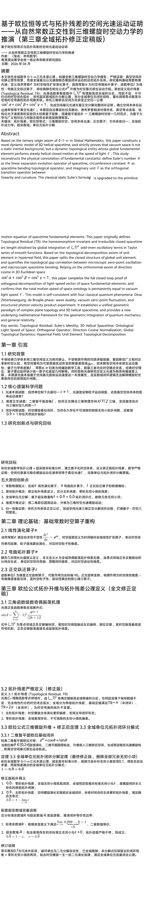
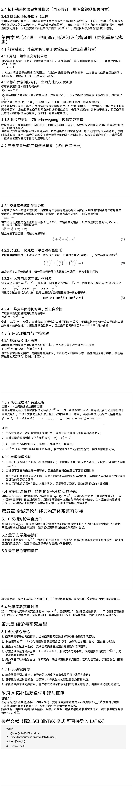
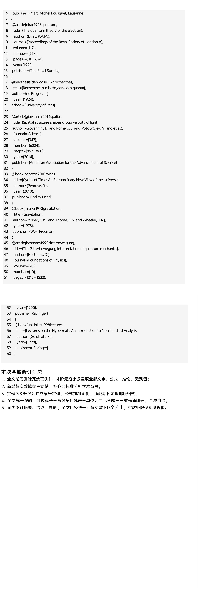

<ArchiveCopyPanel article-id="162129904" />

{"markdown":"PiDliIbnsbvvvJrlhajln5/mlbDlraYgIAo+IOe8luWPt++8mmAxNjIxMjk5MDRgICAKPiDljp/lp4vmlofku7bvvJpg5Z+65LqO5qyn5ouJ5oGS562J5byP5LiO5ouT5omR5q6L5beu55qE56m66Ze05YWJ6YCf6L+Q5Yqo6K+B5piO5LuO6Ieq54S25bi45pWw5q2j5Lqk5oCn5Yiw5LiJ57u06J665peL5pe256m65Yqo5Yqb5a2m55qE5o6o5ryU56ys5LiJ56ug5YWo5Z+f5ouT5omR5L+uLTE2MjEyOTkwNC5tZGAgIAo+IOi/lOWbnu+8mlvmnKzkuablvZLmoaNdKC96aC9ib29rcy9tYXRoL2FydGljbGVzLykgwrcgW+aAu+WFpeWPo10oL3poL2Jvb2tzL2FydGljbGVzLykKCiFb5Z+65LqO5qyn5ouJ5oGS562J5byP5LiO5ouT5omR5q6L5beu55qE56m66Ze05YWJ6YCf6L+Q5Yqo6K+B5piOXSguL2Fzc2V0cy9jc2RuaW1nL2pwZy9iNjNlYWM4NGY5MTFiODYyLmpwZykKCiMjIOWfuuS6juasp+aLieaBkuetieW8j+S4juaLk+aJkeaui+W3rueahOepuumXtOWFiemAn+i/kOWKqOivgeaYjgoKIyMjIOKAlOKAlOS7juiHqueEtuW4uOaVsOato+S6pOaAp+WIsOS4iee7tOieuuaXi+aXtuepuuWKqOWKm+WtpueahOaOqOa8lO+8iOesrOS4ieeroOWFqOWfn+aLk+aJkeS/ruato+Wumueov+eJiO+8iQoK5L2c6ICF77ya77yI56yU5ZCN77ya5LmW5LmW5pWw5a2m77yJCgrnsqTmuK/mvrPov5DnrbnlrabkvJrnu5/kuIDlnLrorrrkuZbkuZbmlbDlrabnoJTnqbblm6LpmJ8KCuaXpeacn++8miAyMDI25bm0MDbmnIgKCiFbaW1hZ2VdKC4vYXNzZXRzL2NzZG5pbWcvanBnLzhlMDczMDE0Njc3NWQxOGIuanBnKQoKIVtpbWFnZV0oLi9hc3NldHMvY3NkbmltZy9qcGcvNjBlYjE5NGRkMTIzZTFiYi5qcGcpCgohW2ltYWdlXSguL2Fzc2V0cy9jc2RuaW1nL2pwZy9mZWM2NWExOGQ1OGVkMThlLmpwZykKCi0tLQoKIyMjIOaRmOimgQoK5Y6f5Yib5a6a5LmJ5ouT5omR5q6L5beu77yIVG9wb2xvZ2ljYWwgUmVzaWR1YWwsIFRS77yJ77ya5YWJ5ruR5Ye95pWw5rOw5YuS57qn5pWw5LitICjiiJIxKWsoLTEpXiYjMTIzO2smIzEyNTso4oiSMSlrIOWlh+WBtuaMr+iNoemhueWFqOWfn+enr+WIhuWQju+8jOWQjOiDmuS4jeWPmOOAgeS4jeWPr+e6puWIhueahOaXtuepuumXreWQiOW8p+mVv++8jOS+neaJmOi2heWunuaVsOWfn+aLk+aJkeWIhuino+WFrOeQhu+8jOaLhuWIhuWFqOWfn+WNleS9jeWFg+mXreeOr+e7k+aehO+8jOmHj+WMluW+ruingumbtueCueaMr+iNoeS4juWuj+inguaXtuepuuW8r+absueahOaLk+aJkemXtOmameWFs+iBlOOAguS+neaJmOS4iee7tOasp+awj+epuumXtOaWueWQkeS9meW8puato+S6pOW9kuS4gOWFrOeQhiBjb3MyzrErY29zMs6yK2NvczLOsz0xY29zXiYjMTIzOzImIzEyNTtcYWxwaGErY29zXiYjMTIzOzImIzEyNTtcYmV0YStjb3NeJiMxMjM7MiYjMTI1O1xnYW1tYT0xY29zMs6xK2NvczLOsitjb3MyzrM9Me+8jOWujOaIkOepuumXtOWfuuWFg+WFiemAn+efoumHj+ato+S6pOWIhuino+WujOaVtOmXreeOr+ivgeaYju+8jOehrueri+epuumXtOacrOS9k+aAu+i/kOWKqOmAn+eOh+aBkuetieS6juecn+epuuWFiemAnyBjY2PjgIIKCuacrOaooeWei+iHqua0veWFvOWuueeLhOaLieWFi+mipOWKqOOAgeW+t+W4g+e9l+aEj+ebuOazouWvueWBtuWFs+ezu+OAgeecn+epuumbtueCuea2qOiQveOAgee7k+aehOWMluWFieWtkOmAn+W6puS5mOenr+WunumqjOWbm+Wkp+e7j+WFuOmHj+WtkOeOsOixoe+8jOaQreW7uuWkjeW5s+mdouaLk+aJkeKAlOS4iee7tOieuuaXi+aXtuepuue7n+S4gOWHoOS9leiMg+W8j++8jOS4uumHj+WtkOWKm+WtpuS4juW5v+S5ieebuOWvueiuuuWHoOS9leiejeWQiOaPkOS+m+WFqOaWsOW6leWxguaVsOeQhuahhuaetuOAggoK5YWz6ZSu6K+N77yaIOaLk+aJkeaui+W3ru+8m+asp+aLieaBkuetieW8j++8m+S4iee7tOieuuaXi+aXtuepuu+8m+epuumXtOacrOS9k+WFiemAn++8m+ato+S6pOeul+WtkO+8m+aWueWQkeS9meW8puW9kuS4gO+8m+WFqOWfn+aLk+aJkeWKqOWKm+Wtpu+8m+i2heWunuaVsOWfn++8m+WNleS9jeWFg+aLk+aJkeWIhuinowoKLS0tCgojIyMgQWJzdHJhY3QKClRoaXMgcGFwZXIgb3JpZ2luYWxseSBkZWZpbmVzIFRvcG9sb2dpY2FsIFJlc2lkdWFsIChUUik6IHRoZSBob21lb21vcnBoaXNtLWludmFyaWFudCBhbmQgaXJyZWR1Y2libGUgY2xvc2VkIHNwYWNldGltZSBhcmMgbGVuZ3RoIG9idGFpbmVkIGJ5IGdsb2JhbCBpbnRlZ3JhdGlvbiBvZiAo4oiSMSlrKC0xKV4mIzEyMztrJiMxMjU7KOKIkjEpayBvZGQtZXZlbiBvc2NpbGxhdG9yeSB0ZXJtcyBpbiBUYXlsb3Igc2VyaWVzIG9mIHNtb290aCBmdW5jdGlvbnMuIEJhc2VkIG9uIHRoZSB0b3BvbG9naWNhbCBkZWNvbXBvc2l0aW9uIGF4aW9tIG9mIHVuaXQgZWxlbWVudCBpbiBoeXBlcnJlYWwgZmllbGQsIHRoaXMgcGFwZXIgc3BsaXRzIHRoZSBjbG9zZWQgc3RydWN0dXJlIG9mIGdsb2JhbCB1bml0IGVsZW1lbnQsIGFuZCBxdWFudGlmaWVzIHRoZSB0b3BvbG9naWNhbCBnYXAgY29ycmVsYXRpb24gYmV0d2VlbiBtaWNyb3Njb3BpYyB6ZXJvLXBvaW50IG9zY2lsbGF0aW9uIGFuZCBtYWNyb3Njb3BpYyBzcGFjZXRpbWUgYmVuZGluZy4gUmVseWluZyBvbiB0aGUgb3J0aG9ub3JtYWwgYXhpb20gb2YgZGlyZWN0aW9uIGNvc2luZSBpbiAzRCBFdWNsaWRlYW4gc3BhY2UgY29zMs6xK2NvczLOsitjb3MyzrM9MWNvc14mIzEyMzsyJiMxMjU7XGFscGhhK2Nvc14mIzEyMzsyJiMxMjU7XGJldGErY29zXiYjMTIzOzImIzEyNTtcZ2FtbWE9MWNvczLOsStjb3MyzrIrY29zMs6zPTEsIHRoaXMgcGFwZXIgY29tcGxldGVzIHRoZSBmdWxsIGNsb3NlZC1sb29wIHByb29mIG9mIG9ydGhvZ29uYWwgZGVjb21wb3NpdGlvbiBvZiBsaWdodC1zcGVlZCB2ZWN0b3Igb2Ygc3BhY2UgZnVuZGFtZW50YWwgZWxlbWVudHMsIGFuZCBjb25maXJtcyB0aGF0IHRoZSB0b3RhbCBtb3Rpb24gc3BlZWQgb2Ygc3BhY2Ugb250b2xvZ3kgaXMgcGVybWFuZW50bHkgZXF1YWwgdG8gdmFjdXVtIGxpZ2h0IHNwZWVkIGNjYy4KClRoaXMgbW9kZWwgaXMgc2VsZi1jb25zaXN0ZW50IHdpdGggZm91ciBjbGFzc2ljYWwgcXVhbnR1bSBwaGVub21lbmE6IERpcmFjIFppdHRlcmJld2VndW5nLCBkZSBCcm9nbGllIHBoYXNlLXdhdmUgZHVhbGl0eSwgdmFjdXVtIHplcm8tcG9pbnQgZmx1Y3R1YXRpb24sIGFuZCBzdHJ1Y3R1cmVkIHBob3RvbiB2ZWxvY2l0eSBwcm9kdWN0IGV4cGVyaW1lbnQuIEl0IGVzdGFibGlzaGVzIGEgdW5pZmllZCBnZW9tZXRyaWMgcGFyYWRpZ20gb2YgY29tcGxleCBwbGFuZSB0b3BvbG9neSBhbmQgM0QgaGVsaWNhbCBzcGFjZXRpbWUsIGFuZCBwcm92aWRlcyBhIG5ldyB1bmRlcmx5aW5nIG1hdGhlbWF0aWNhbCBmcmFtZXdvcmsgZm9yIHRoZSBnZW9tZXRyaWMgaW50ZWdyYXRpb24gb2YgcXVhbnR1bSBtZWNoYW5pY3MgYW5kIGdlbmVyYWwgcmVsYXRpdml0eS4KCktleSB3b3JkczogVG9wb2xvZ2ljYWwgUmVzaWR1YWw7IEV1bGVy4oCZcyBJZGVudGl0eTsgM0QgSGVsaWNhbCBTcGFjZXRpbWU7IE9udG9sb2dpY2FsIExpZ2h0IFNwZWVkIG9mIFNwYWNlOyBPcnRob2dvbmFsIE9wZXJhdG9yOyBEaXJlY3Rpb24gQ29zaW5lIE5vcm1hbGl6YXRpb247IEdsb2JhbCBUb3BvbG9naWNhbCBEeW5hbWljczsgSHlwZXJyZWFsIEZpZWxkOyBVbml0IEVsZW1lbnQgVG9wb2xvZ2ljYWwgRGVjb21wb3NpdGlvbgoKLS0tCgohW+esrOS4gOeroCDlvJXoqIBdKC4vYXNzZXRzL2NzZG5pbWcvanBnLzkwZWNhN2VlMTY4ZGIwMWIuanBnKQoKIyMg56ys5LiA56ugIOW8leiogAoKIyMjIDEuMSDnoJTnqbbog4zmma8KCuWQjOaXtueOsOacieWFiemAn+eglOeptuS7heWumuS5ieWFiemAn+S4uueJqei0qOS8oOaSremAn+W6puS4iumZkO+8jOacqua6r+a6kOWFiemAn+acrOi6q+WxnuS6juepuumXtOWfuuWFg+Wbuuaciei/kOWKqOmAn+W6pui/meS4gOacrOa6kOWxnuaAp++8jOS4lOWunuaVsOWfn+mXreeOr+mAu+i+keaXoOazleino+mHiuieuuaXi+aXtuepuuWuouinguWtmOWcqOeahOW+ruinguaLk+aJkemXtOmameOAggoKIyMjIDEuMiDmoLjlv4PpgZfnlZnnp5Hlrabpl67popgKCi0gCgrlhYnpgJ/mnKzmupDosJzpopjvvJog6Ieq54S25Y2V5L2N5Yi25LiL5YWJ6YCf5b2S5LiAIGPiiaExYyBcZXF1aXYgMWPiiaEx77yM5YWJ6YCf5piv5a6e54mp57KS5a2Q6L+Q5Yqo6ZiI5YC877yM6L+Y5piv55yf56m656m66Ze05pys5L2T55qE5Zu65pyJ6L+Q5Yqo6YCf546H77yfCgotIAoK57u05bqm5q2j5Lqk6LCc6aKY77yaIOS6jOe7tOWkjeW5s+mdouiZmui9tCBpaWnvvIzlpoLkvZXmraPkuqTogKblkIjkuInnu7TniannkIbnqbrpl7QgWC9ZL1pYL1kvWlgvWS9aIOS4iei9tO+8jOWunueOsOWkjeWPmOaLk+aJkeS4juS4iee7tOaXtuepuuWHoOS9lee7n+S4gO+8nwoKLSAKCumXreeOr+mXtOmameiwnOmimO+8miDml7bnqbronrrml4vnnIvkvLzpl63njq/vvIzkuLrkvZXmsLjkuYXlrZjlnKjkuI3lj6/mtojpmaTnmoTlvq7op4Lml6DnqbflsI/mi5PmiZHpl7TpmpnvvIzlrp7mlbDln58gMC454oC+PTEwLlxvdmVybGluZSYjMTIzOzkmIzEyNTs9MTAuOT0xIOWtmOWcqOWkqeeEtuaLk+aJkee8uumZt++8nwoKIyMjIDEuMyDnoJTnqbbliJvmlrDngrnkuI7noJTnqbbnm67moIcKCiMjIyMg56CU56m255uu5qCHCgrkvp3miZjlhajln5/mlbDlrabmi5PmiZHlhaznkIYr6LaF5a6e5pWw6Z2e5qCH5YeG5YiG5p6Q77yM5bu656uL566X5a2Q5YyW5pe256m65L2T57O777yM5a6a5LmJ5L+u5q2j54mI5ouT5omR5q6L5beu77yM5pWw5a2m5Lil5qC86K+B5piO77ya56m66Ze05Lu75oSP5Z+65YWD56iz5oCB6J665peL6L+Q5Yqo5oC76YCf546H5oGS562J5LqO55yf56m65YWJ6YCfIGNjY++8jOWujOWWhOWNleS9jeWFg+aLk+aJkemXreeOr+WIhuino+mAu+i+keOAggoKIyMjIyDkupTlpKfljp/liJvliJvmlrDngrkKCi0gCgotIAoK5Y6f5Yib5ouT5omR5qaC5b+177yaIOS/ruato+aLk+aJkeaui+W3ruWumuS5ie+8jOWMuuWIhuS4u+mYtuaui+W3ruOAgembtumYtuaXoOept+Wwj+W+ruaJsOaui+W3ru+8mwoKLSAKCuWFqOWfn+WNleS9jeWFg+WIhuino++8miDln7rkuo7otoXlrp7mlbDph43mnoQgMT0wLjnigL4rMC4w4oC+MT0wLlxvdmVybGluZSYjMTIzOzkmIzEyNTsrMC5cb3ZlcmxpbmUmIzEyMzswJiMxMjU7MT0wLjkrMC4wIOaLk+aJkemXreeOr+W8j++8jOWIoOmZpOWGl+S9meaXoOept+Wwj+mhue+8mwoKLSAKCue7tOW6puWNh+e7tOiuuuivge+8miDlsIbkuoznu7TmrKfmi4nlnIblkajov5DliqjvvIzljYfnu7TkuLrkuInnu7Tml7bnqbrlhYnpgJ/onrrml4vov5DliqjvvJsKCi0gCgrlvZLkuIDlrozlpIfor4HmmI7vvJog5L6d5omY5pa55ZCR5L2Z5bym5q2j5Lqk5YWs5byP77yM5a6M5oiQ56m66Ze05YWJ6YCf5LiJ57u05q2j5Lqk5YiG6Kej6Zet546v6K+B5piO77yM5omT6YCa6YeP5a2QLeaXtuepuuWHoOS9leWjgeWekuOAggoKLS0tCgohW+esrOS6jOeroCDnkIborrrln7rnoYBdKC4vYXNzZXRzL2NzZG5pbWcvanBnLzAyZTE4NmFhYjE5ZWEyOWEuanBnKQoKIyMg56ys5LqM56ugIOeQhuiuuuWfuuehgO+8muWfuuehgOW4uOaVsOaXtuepuueul+WtkOmHjeaehAoKIyMjIDIuMSDnur/mgKfmvJTljJbnrpflrZAgZWVlCgroh6rnhLbluLjmlbAgZWVlIOa7oei2s+iHquaxguWvvOS4jeWPmOaAp++8mgoK5pe256m65bGC6Z2i5a6a5LmJ5Li65pe26Ze06L205ZCR5YWo5Z+f57q/5oCn5omp5byg566X5a2Q77yM6KGo5b6B5pe256m65b6E5ZCR5Y2V5ZCR5bu25bGV44CB57KS5a2Q55u057q/6Lev5b6E5ryU5YyW77yM5a+55bqU5pe256m657KS5a2Q5oCn57u05bqm44CCCgojIyMgMi4zIOato+S6pOi3g+i/geeul+WtkCBpaWkKCuiZmuaVsOWNleS9jSBpaWkg5Li657u05bqm5q2j5Lqk5peL6L2s566X5a2Q77yM5Luj5pWw5L2c55So5Li65Z2Q5qCH6L20OTDCsOato+S6pOaXi+i9rOWPmOaNou+8jOeJqeeQhuS9nOeUqOS4uuaXtuepuue6v+aAp+e7tOW6puKGlOW8r+absue7tOW6puWeguebtOS6kui9rO+8jOaYr+aXtuepuueykuWtkOaAp+OAgeazouWKqOaAp+iApuWQiOeahOaguOW/g+WqkuS7i+eul+WtkOOAggoKLS0tCgohW+esrOS4ieeroCDmrKfmi4nlhazlvI/mi5PmiZHljYfnu7RdKC4vYXNzZXRzL2NzZG5pbWcvanBnLzg3OGY4ODU5ZWE2YzI3YjguanBnKQoKIyMg56ys5LiJ56ugIOasp+aLieWFrOW8j+aLk+aJkeWNh+e7tOS4juaLk+aJkeaui+W3ruWFrOeQhuWumuS5ie+8iOWFqOaWh+S/ruato+Wumueov++8iQoKIyMjIDMuMSDkuInop5Llh73mlbDnuqfmlbDlpYflgbbmjK/ojaHmnLrnkIYKCuWFiea7keato+W8puWHveaVsOazsOWLkuWFqOWfn+WxleW8gOW8j++8mgoK5byP5LitICjiiJIxKWsoLTEpXiYjMTIzO2smIzEyNTso4oiSMSlrIOS4uumbtueCuemCu+Wfn+ato+i0n+S6pOabv+e8lueggemhue+8jOeuoeaOp+aXtuepuuW+ruinguaMr+WKqOW3puWPs+WBj+i9rOOAgeebuOS9jeS6pOabv++8jOaYr+aXtuepuuaMr+iNoeacgOW6leWxguespuWPt+acuuWItu+8jOato+i0n+S6pOabv+aMr+iNoeebtOaOpeeUn+aIkOWxgue6p+aLk+aJkeaui+W3ruOAggoKIyMjIDMuMiDmi5PmiZHmrovlt67kuKXmoLzlrprkuYnvvIjkv67mraPniYjvvIkKCuWumuS5iTMuMSDmi5PmiZHmrovlt67vvIhUb3BvbG9naWNhbCBSZXNpZHVhbCwgVFLvvIkKCi0gCgrkuLvpmLbmi5PmiZHmrovlt67vvJog5pe256m66J665peL5Li75L2T5ryU5YyW57Sv56ev5YGP5beu77yM5a6P6KeC5Li75a+86Zet546v5b2i5oCB77ybCgotIAoK6Zu26Zi25ouT5omR5q6L5beu77yaIOWFqOWfn+WuouinguWtmOWcqOOAgeS4jeWPr+a2iOmZpOeahOaXoOept+Wwj+W+ruaJsOWBj+W3ruOAggoKIyMjIDMuMyDmrKfmi4nlhazlvI/kuInnu7Tonrrml4vljYfnu7Qr5L+u5q2j5ZCO5a6a55CGMy4zIOWFqOWfn+WNleS9jeWFg+aLk+aJkemXreeOr+WIhuino+W8jwoKIyMjIyAzLjMuMSDkuoznu7TlpI3lubPpnaLmrKfmi4nln7rnoYDpl63njq8KCue7j+WFuOS6jOe7tOWkjeW5s+mdouasp+aLieaWueeoi++8mgoKZWnOuD1jb3POuCtp4oCJc2luzrhlXiYjMTIzO2lcdGhldGEmIzEyNTs9Y29zXHRoZXRhK2lcLHNpblx0aGV0YWVpzrg9Y29zzrgraXNpbs64CgojIyMjIOWumueQhjMuMyDlhajln5/ljZXkvY3lhYPmi5PmiZHpl63njq/liIbop6PlrprnkIbvvIjmnIDnu4jkv67mraPniYjvvIzliKDpmaTlhajpg6jlhpfkvZnml6DnqbflsI/pobnvvIkKCuS+neaJmOWFqOWfn+aVsOWtpjAtMS3iiJ7kuInlhYPmnKzmupDlhaznkIbjgIHotoXlrp7mlbDpnZ7moIflh4bliIbmnpDvvIzliZTpmaTlhpfkvZnooaXpmLbml6DnqbflsI/mv4Dlj5HpobnvvIzlvpfliLDml6Doh6rmtL3nn5vnm77jgIHkuKTnuqfmrovlt67ogKblkIjnmoTlhajln5/ljZXkvY3lhYPmi5PmiZHliIbop6PlvI/vvJoKCiMjIyMjIOS/ruato+eJiOaLk+aJkemHiuS5iQoKLSAKCjAuMOKAvjAuXG92ZXJsaW5lJiMxMjM7MCYjMTI1OzAuMO+8mumbtumYtuaLk+aJkeaui+W3ru+8jOWFqOWfn+aXoOept+Wwj+W+ruaJsOaKtea2iOmhue+8jOWFqOWfn+aBkuWumuWPluWAvOmdnuagh+WHhuaXoOept+Wwj+WFgyDOtVx2YXJlcHNpbG9uzrXvvIzmmK/onrrml4vpl63njq/msLjkuYXlrZjlnKjnmoTlvq7op4Lmi5PmiZHpl7TpmpnvvJsKCi0gCgowLjnigL4wLlxvdmVybGluZSYjMTIzOzkmIzEyNTswLjnvvJrkuLvpmLbmi5PmiZHmrovlt67vvIznqbrpl7Tonrrml4vmvJTljJbml6DpmZDotovov5Hlhajln5/pl63njq/jgIHmnKrnu53lr7npl63lkIjnmoTkuLvkvZPntK/np6/mi5PmiZHmrovlt67vvIzmu6HotrPogKblkIjlhbPns7vlvI/vvJoKCiMjIyMjIOmFjeWll+i2heWunuaVsOWfn+WujOWkh+ivtOaYjgoK5Yy65YiG5qCH5YeG5a6e5pWw5Z+fIFJcbWF0aGJiJiMxMjM7UiYjMTI1O1Ig5LiO6LaF5a6e5pWw5Z+fIOKIl1JeJiMxMjM7KiYjMTI1O1xtYXRoYmImIzEyMztSJiMxMjU74oiXUiDlupXlsYLpgLvovpHvvIzljpjmuIXpl63njq/nrYnku7fmgKfovrnnlYzvvJoKCi0gCgotIAoK6LaF5a6e5pWw5Z+fIOKIl1JeJiMxMjM7KiYjMTI1O1xtYXRoYmImIzEyMztSJiMxMjU74oiXUu+8miDljIXlkKvlrqLop4LlrZjlnKjnmoTpnZ7moIflh4bmraPml6DnqbflsI/lhYMgzrU+MFx2YXJlcHNpbG9uPjDOtT4w77yM5ouT5omR5bGC6Z2i5Lil5qC85LiN562J77yM5oGS5oiQ56uL77yaCgowLjnigL49MeKIks61LM61PTAuMOKAvjAuXG92ZXJsaW5lJiMxMjM7OSYjMTI1Oz0xLVx2YXJlcHNpbG9uLCBccXVhZCBcdmFyZXBzaWxvbj0wLlxvdmVybGluZSYjMTIzOzAmIzEyNTswLjk9MeKIks61LM61PTAuMAoKIyMjIyMg5L+u6K6i6K+05piOCgrljp/lvI/lj6DliqDooaXpmLbml6DnqbflsI/pobnkuLrlhpfkvZnlpJbmi5PpobnvvIznoLTlnY/ljZXkvY3lhYPkuozlhYPliIbop6Poh6rmtL3mgKfvvIzlt7Llhajln5/liKDpmaTvvJvmnKzliIbop6PlvI/ku4Xkv53nlZnkuLvpmLbpl63njq/mrovlt64r6Zu26Zi25peg56m35bCP5b6u5omw5Lik6aG577yM6LS05ZCI5pe256m66J665peL5LiA5Li75LiA5omw5LqM5YWD5ryU5YyW6KeE5b6L77yM5ruh6Laz5YWo5Z+f5Y2V5L2N5YWD5a6M5aSH6Zet5ZCI5YWs55CG44CCCgojIyMgMy40IOaLk+aJkeaui+W3ruaegemZkOWujOWkh+aAp+aOqOiuuu+8iOWQjOatpeS/ruiuou+8jOWIoOmZpOWFqOmDqOebuOWFs+WGl+S9meWGheWuue+8iQoKIyMjIyAzLjQuMyDonrrml4vpl63njq/mi5PmiZHmjqjorrrvvIjlrprnqL/vvIkKCuepuumXtOWFiemAn+ieuuaXi+Wuj+ingumXreeOr++8jOeUsea1t+mHj+W+ruinguato+i0n+Wlh+WBtuaXoOept+Wwj+aMr+WKqOe0r+enr+iApuWQiOeUn+aIkO+8m+S4u+mYtuaLk+aJkeaui+W3riAwLjnigL4wLlxvdmVybGluZSYjMTIzOzkmIzEyNTswLjkg5LiO6Zu26Zi25peg56m35bCP5b6u5omw5q6L5beuIDAuMOKAvjAuXG92ZXJsaW5lJiMxMjM7MCYjMTI1OzAuMCDkuozlhYPkupLooaXvvIzkuKXmoLzlkIjmiJDlhajln5/ljZXkvY3lhYMgMTEx77yb5peg56m35bCP5ouT5omR6Ze06ZqZIM61XHZhcmVwc2lsb27OtSDkuLrml7bnqbrmnKzmupDlm7rmnInlsZ7mgKfvvIzml6Dms5XpgJrov4fmvJTljJbmtojpmaTvvIzlm6DmraTotoXlrp7mlbDmi5PmiZHmoYbmnrbkuIvkuKXmoLzmu6HotrMgMC454oC+PDEwLlxvdmVybGluZSYjMTIzOzkmIzEyNTs8MTAuOTwx77yM5a6e5pWw5p6B6ZmQ5LuF5Li65a6P6KeC6KeC5rWL6L+R5Ly857uT5p6c44CCCgotLS0KCiFb56ys5Zub56ugIOaguOW/g+WumueQhl0oLi9hc3NldHMvY3NkbmltZy9qcGcvNzVkZmMyMTIzNmVhMzU0MC5qcGcpCgojIyDnrKzlm5vnq6Ag5qC45b+D5a6a55CG77ya56m66Ze05Z+65YWD5YWJ6YCf6Zet546v5a6M5aSH6K+B5piO77yI5LyY5YyW6YeN5YaZ5a6M5pW054mI77yJCgojIyMgNC4xIOWJjee9rumTuuWeq++8muaXtuepuuWvueWBtuS4jumHj+WtkOWunumqjOS9kOivge+8iOmAu+i+kemAkui/m+WJjee9ru+8iQoKIyMjIyA0LjEuMSDlkajmnJ8t6aKR546H5q2j5Lqk5a+55YG25YWs55CGCgrml7bnqbrln7rnoYDlr7nlgbbph4/vvJrlkajmnJ8gVFRU77yI6J665peL6Zet5ZCI5pe26ZW/77yJ44CB5pys5b6B6aKR546HIGZmZu+8iOWNleS9jeaXtumXtOaMr+iNoeWciOaVsO+8ie+8jOS6jOiAhea7oei2s+WGheenr+ato+S6pOW9kuS4gOe6puadn++8mgoKIyMjIyA0LjEuMiDlvrfluIPnvZfmhI/nm7jms6Llr7nlgbbvvJrnqbrpl7TlhYnpgJ/nmoTmnoHpmZDmuq/mupAKCuW+t+W4g+e9l+aEj+azoue+pOmAny3nm7jpgJ/lr7nlgbblhbPns7vvvJoKCueykuWtkOW5tumdnueLrOeri+a8gua1ruS6juecn+epuu+8jOiAjOaYr+S+nemZhOWxgOWfn+epuumXtOWfuuWFg+WtmOWcqO+8m+aJgOiwkyLpnZnmraLnspLlrZAi5LuF5Luj6KGo57KS5a2Q55u45a+556m66Ze05bmz5Z2H5Zy65peg5a6P6KeC5ryC56e777yM5om/6L2957KS5a2Q55qE56m66Ze05Z+65YWD6Ieq6Lqr5oyB57ut5YGa55u45L2N6L+Q5Yqo44CC5p6B6ZmQ5LiL6LaL6L+R55qEIGNjYyDlubbpnZ7nspLlrZDpgJ/luqbvvIzogIzmmK/nqbrpl7Tln7rlhYPmnKzkvZPlm7rmnInnmoTnm7jkvY3ov5DliqjpgJ/njofvvIzpgJ/njoflvZLkuIDlr7nlupTlhajln5/ljZXkvY3lhYMgMTEx44CCCgojIyMjIDQuMS4zIOeLhOaLieWFi+mipOWKqO+8iFppdHRlcmJld2VndW5n77yJ5b6u6KeC5a6e6K+B5pSv5pKRCgrni4Tmi4nlhYvnlLXlrZDmlrnnqIvop6PmnpDop6Pnu5nlh7rmoLjlv4Pnu5PorrrvvJrljbPkvr/lro/op4LpnZnmraLnmoTnlLXlrZDvvIzlvq7op4LlnZDmoIfkvJrku6XmgZLlrprlhYnpgJ8gY2NjIOWBmumrmOmikeW+gOWkjeaMr+iNoe+8jOWNs+eLhOaLieWFi+mipOWKqOOAggoK5Lyg57uf6YeP5a2Q5Yqb5a2m5bCG5YW26Kej6YeK5Li657KS5a2Q6Ieq6Lqr6L+Q5Yqo77yM5pys5paH57uZ5Ye65ouT5omR5pe256m65paw6Kej6YeK77ya55S15a2Q5peg5Zu65pyJ5YWJ6YCf6L+Q5Yqo6IO95Yqb77yM6K+l556s5pe25YWJ6YCf5oyv6I2h77yM5piv55S15a2Q6ICm5ZCI55qE5bGA5Z+f56m66Ze05Z+65YWD6J665peL6L+Q5Yqo55qE5aSW5Zyo6KeC5rWL6KGo6LGh77yM5oyv6I2h6Ze06ZqZ5a+55bqU6Zu26Zi25ouT5omR5q6L5beuIDAuMOKAvjAuXG92ZXJsaW5lJiMxMjM7MCYjMTI1OzAuMO+8jOebtOaOpeS9kOivgeepuumXtOWfuuWFg+acrOS9k+i/kOWKqOmAn+eOh+aBkuS4uiBjY2PjgIIKCiMjIyA0LjIg5LiJ57u055+i6YeP5YWJ6YCf5a6M5aSH5pWw5a2m6K+B5piO77yI5qC45b+D5Lil6LCo5o6o5a+877yJCgojIyMjIDQuMi4xIOepuumXtOWfuuWFg+i/kOWKqOefoumHj+WFrOeQhgoK5YWo5Z+f5pWw5a2mMC0xLeKInuacrOa6kOWFrOeQhuinhOWumu+8muecn+epuuepuumXtOS7u+aEj+WfuuWFg+eahOi/kOWKqOaYr+e6v+aAp+aJqeW8oCvlkajmnJ/ml4vovazogKblkIjnmoTkuInnu7Tonrrml4vnn6Lph4/ov5DliqjvvIzlhbblkIjov5Dliqjnn6Lph4/mqKHplb/kuLrlhajln5/kuI3lj5jluLjph4/vvIzlrprkuYnkuLrnnJ/nqbrlhYnpgJ8gY2Nj77yM5Y2z55+i6YeP5qih57qm5p2f77yaCgrlsIbkuInnu7Tov5Dliqjnn6Lph4/liIbop6Poh7Pnm7Top5LlnZDmoIfns7sgT+KIklhZWk8tWFlaT+KIklhZWu+8jOS4iei9tOato+S6pOaXoOiApuWQiO+8jOiuvuS4iei9tOmAn+W6puWIhumHj+S4uiB2eCx2eSx2enZfJiMxMjM7eCYjMTI1Oywgdl8mIzEyMzt5JiMxMjU7LCB2XyYjMTIzO3omIzEyNTt2eOKAiyx2eeKAiyx2euKAi++8jOeUseS4iee7tOasp+WHoOmHjOW+l+efoumHj+aooemVv+WFrOW8j++8mgoK6IGU56uL5YWJ6YCf5LiN5Y+Y5YWs55CG77yM5b6X5qC45b+D55+i6YeP562J5byP77yaCgp2eDIrdnkyK3Z6Mj1jMigxKXZfJiMxMjM7eCYjMTI1O14mIzEyMzsyJiMxMjU7ICsgdl8mIzEyMzt5JiMxMjU7XiYjMTIzOzImIzEyNTsgKyB2XyYjMTIzO3omIzEyNTteJiMxMjM7MiYjMTI1OyA9IGNeJiMxMjM7MiYjMTI1OyBcdGFnJiMxMjM7MSYjMTI1O3Z4MuKAiyt2eTLigIsrdnoy4oCLPWMyKDEpCgojIyMjIDQuMi4yIOWFiemAn+W9kuS4gOWMluWkhOeQhu+8iOWNleS9jeWvueensOWfuuWHhjHvvIkKCuS+neaNruWFqOWfn+aVsOWtpuWNleS9jeWFgzHlr7nnp7DlhaznkIbvvIzku6XlhYnpgJ8gY2NjIOS4uue7n+S4gOWwuuW6puWvueetieW8jygxKeWFqOWfn+W9kuS4gO+8jOetieW8j+S4pOS+p+WQjOmZpOS7pSBjMmNeJiMxMjM7MiYjMTI1O2My77yaCgrnu5PlkIjlrprnkIYzLjPljZXkvY3lhYPliIbop6PvvJrlvZLkuIDljZXkvY3lhYPlpKnnhLbljIXlkKvonrrml4vkuLvkvZPmrovlt64r5peg56m35bCP5ouT5omR6Ze06ZqZ44CCCgojIyMjIDQuMi4zIOW8leWFpeaWueWQkeS9meW8puWujOaIkOWHoOS9leWvueW6lAoK5bCG5LiJ57uE5L2Z5bym5YiG6YeP5Luj5YWl5byPKDIp77yM5o6o5a+85Ye65LiJ57u05pe256m65YWJ6YCf5q2j5Lqk5b2S5LiA5qC45b+D5oGS562J5byP77yaCgpjb3MyzrErY29zMs6yK2NvczLOsz0xKDMpY29zXiYjMTIzOzImIzEyNTtcYWxwaGEgKyBjb3NeJiMxMjM7MiYjMTI1O1xiZXRhICsgY29zXiYjMTIzOzImIzEyNTtcZ2FtbWEgPSAxIFx0YWcmIzEyMzszJiMxMjU7Y29zMs6xK2NvczLOsitjb3MyzrM9MSgzKQoKIyMjIyA0LjIuNCDkuoznu7TlpI3lubPpnaLnibnkvovlr7nnhafvvIzpqozor4Hoh6rmtL3mgKcKCuS6jOe7tOWkjeW5s+mdouasp+aLieaXi+i9rOa7oei2s+S4ieinkuaBkuetieW8j++8mgoKY29zMs64K3NpbjLOuD0xY29zXiYjMTIzOzImIzEyNTtcdGhldGEgKyBzaW5eJiMxMjM7MiYjMTI1O1x0aGV0YSA9IDFjb3Myzrgrc2luMs64PTEKCiMjIyA0LjMg6Zet546v5a6a55CG5o6o5a+85LiO5Lil5qC86KGo6L+wCgojIyMjIDQuMy4xIOieuuaXi+i/kOWKqOmXreeOr+adoeS7tgoK6K+l5byP5Luj6KGo56m66Ze05Z+65YWD5a6M5oiQ5LiA6L2u5a6M5pW06J665peL5ryU5YyW5ZCO77yM5ouT5omR5b2i5oCB5Zue5b2S5Yid5aeL54q25oCB77yM5Y+g5Yqg6Zu26Zi25peg56m35bCP5b6u5omw77yM5a6e546w5b6q546v5b6A5aSN55qE5peg56m35ryU5YyW77yI5a+55bqU4oie5pys5rqQ77yJ44CCCgojIyMjIDQuMy4yIOaguOW/g+WumueQhjQuMSDlrozmlbTor4HmmI4KCuWumueQhjQuMe+8iOepuumXtOWFiemAn+ieuuaXi+mXreeOr+WumueQhu+8iQoK6K+B5piO77yaCgotIAoK55Sx54uE5ouJ5YWL6aKk5Yqo44CB5b635biD572X5oSP55u45rOi5p6B6ZmQ6KGM5Li677yM6KeC5rWL5L2Q6K+B56m66Ze05Z+65YWD5Zu65pyJ6L+Q5Yqo6YCf546H5Li6IGNjY++8mwoKLSAKCuS4iee7tOefoumHj+WIhuino+W+l+WIsOmAn+W6puW5s+aWueWSjOe6puadnyB2eDIrdnkyK3Z6Mj1jMnZfJiMxMjM7eCYjMTI1O14mIzEyMzsyJiMxMjU7K3ZfJiMxMjM7eSYjMTI1O14mIzEyMzsyJiMxMjU7K3ZfJiMxMjM7eiYjMTI1O14mIzEyMzsyJiMxMjU7PWNeJiMxMjM7MiYjMTI1O3Z4MuKAiyt2eTLigIsrdnoy4oCLPWMy77ybCgotIAoK5b2S5LiA5YyW57uT5ZCI5pa55ZCR5L2Z5bym5a6a5LmJ77yM5o6o5a+85Ye65LiJ57u05q2j5Lqk5b2S5LiA5oGS562J5byP77ybCgotIAoKIyMjIyA0LjMuMyDlrprnkIbniannkIbmjqjorroKCi0gCgrkuI3lrZjlnKjku7vkvZXmlrnlkJHkuIrnqbrpl7Tln7rlhYPmgLvpgJ/njoflgY/nprsgY2Nj77yb5Lu75oSP6L205ZCR6YCf5bqm5YiG6YeP5LuF5Li65YWJ6YCf55qE5q2j5Lqk5oqV5b2x77yM5YiG6YeP5Y+W5YC86IyD5Zu0IFviiJJjLGNdWy1jLCBjXVviiJJjLGNd77ybCgotIAoK5LqM57u05aSN5bmz6Z2i5LiJ6KeS5Ye95pWw5b2S5LiA5oGS562J5byP77yM5piv5LiJ57u06J665peL5pe256m65Zyo5Zu65a6a5bmz6Z2i55qE5oiq6Z2i54m55L6L77ybCgotIAoK55yf56m65YWJ6YCfIGNjYyDlubbpnZ7nspLlrZDov5DliqjkuIrpmZDvvIzogIzmmK/nqbrpl7Tovb3kvZPoh6rouqvnmoTlm7rmnInov5Dliqjln7rlh4bvvIzlrp7niannspLlrZDov5DliqjpgJ/luqbku4XkuLrnqbrpl7Tonrrml4vov5DliqjnmoTlsYDpg6jogKblkIjlgY/np7vvvJsKCi0gCgrml7bnqbrpl63njq/msLjov5zkv53nlZkgMC4w4oC+MC5cb3ZlcmxpbmUmIzEyMzswJiMxMjU7MC4wIOaXoOept+Wwj+aLk+aJkemXtOmame+8jOaYr+mHj+WtkOmbtueCuea2qOiQveOAgeecn+epuuiDvemHj+i1t+S8j+eahOacrOa6kOaIkOWboOOAggoKIyMjIDQuNCDlrp7pqozoh6rmtL3moKHpqozvvJrnu5PmnoTljJblhYnlrZDpgJ/luqblrp7pqozljLnphY0KCi0tLQoKIVvnrKzkupTnq6Ag5YWo5Z+f55CG6K665YW85a65XSguL2Fzc2V0cy9jc2RuaW1nL2pwZy84OGIxZDcwZmI4NzY2Y2MwLmpwZykKCiMjIOesrOS6lOeroCDlhajln5/nkIborrrkuI7nu4/lhbjniannkIbkvZPns7vlhbzlrrnlr7nmjqUKCiMjIyA1LjEg5bm/5LmJ55u45a+56K665YW85a655o6l5Y+jCgrpu47mm7zml7bnqbrluqbop4QgZ868zr1nXyYjMTIzO1xtdVxudSYjMTI1O2fOvM694oCL77yM5piv5rW36YeP5b6u6KeC56m66Ze05YWJ6YCf6J665peL6L+Q5Yqo55qE5a6P6KeC57uf6K6h5bmz5Z2H77yb5byV5Yqb5rOi5pys6LSo5Li65YWo5Z+f5ouT5omR5q6L5beu55u45bmy5Y+g5Yqg5b2i5oiQ55qE5pe256m65puy546H5raf5ryq77yM5raf5ryq6LW35LyP5rqQ5LqO6Zu26Zi25q6L5beuIDAuMOKAvjAuXG92ZXJsaW5lJiMxMjM7MCYjMTI1OzAuMCDml6DnqbflsI/lvq7mibDjgIIKCiMjIyA1LjIg6YeP5a2Q5Yqb5a2m5YW85a655o6l5Y+jCgrmoIflh4bph4/lrZDms6Llh73mlbAgz4g9ZWlTL+KEj1xwc2kgPSBlXiYjMTIzO2lTL1xoYmFyJiMxMjU7z4g9ZWlTL+KEj++8jOS4uuasp+aLieaXtuepuueul+WtkOmHj+WtkOWMluW9ouW8j++8m+iZmuaVsCBpaWkg54mp55CG5pys6LSo5Li66YeP5a2Q5bGC6Z2i57q/5oCnLeW8r+absue7tOW6puato+S6pOi3g+i/geWqkuS7i++8jOazouWHveaVsOebuOS9jeWBj+enu+etieS7t+aXtuepuuaLk+aJkeaui+W3ruWBj+enu+OAggoKIyMjIDUuMyDph4/lrZDlnLrorrrlhbzlrrnmjqXlj6MKCuecn+epuumbtueCueiDve+8jOaYr+epuumXtOWfuuWFg+awuOS4jee7iOatoueahCAo4oiSMSlrKC0xKV4mIzEyMztrJiMxMjU7KOKIkjEpayDlpYflgbbmi5PmiZHmjK/ojaHjgIHpm7bpmLbmrovlt64gMC4w4oC+MC5cb3ZlcmxpbmUmIzEyMzswJiMxMjU7MC4wIOaMgee7rea8lOWMlueahOWFqOWfn+iDvemHj+ihqOinguOAggoKIyMjIDUuNCDlhYnlrablrp7pqozlrp7or4Hlr7nmjqUKCi0tLQoKIVvnrKzlha3nq6Ag57uT6K665LiO5bGV5pybXSguL2Fzc2V0cy9jc2RuaW1nL2pwZy8yYzM0YjQ4OWQ5ZTE3YWZhLmpwZykKCiMjIOesrOWFreeroCDnu5PorrrkuI7noJTnqbblsZXmnJsKCiMjIyA2LjEg5YWo5paH5qC45b+D57uT6K66CgotIAoK56m66Ze05LiN5bGe5LqO6Z2Z5q2i5pe256m66IOM5pmv77yM5YWo5Z+f56m66Ze05Z+65YWD5Lul5YWJ6YCf5YGa56iz5oCB5LiJ57u06J665peL6Zet546v6L+Q5Yqo77ybCgotIAoKLSAKCuS4iee7tOaWueWQkeS9meW8puW9kuS4gOWFrOW8j++8jOWujOaIkOepuumXtOWFiemAn+S4iee7tOato+S6pOWIhuino+aVsOWtpumXreeOr+ivgeaYju+8mwoKLSAKCuS/ruato+WFqOWfn+WNleS9jeWFg+aLk+aJkeWIhuino++8mjE9MC454oC+KzAuMOKAvjE9MC5cb3ZlcmxpbmUmIzEyMzs5JiMxMjU7KzAuXG92ZXJsaW5lJiMxMjM7MCYjMTI1OzE9MC45KzAuMO+8jOWIoOmZpOWGl+S9meaXoOept+Wwj+mhue+8jOS+neaJmOi2heWunuaVsOWfn+ivgeaYjiAwLjnigL48MTAuXG92ZXJsaW5lJiMxMjM7OSYjMTI1OzwxMC45PDHvvIzml6DnqbflsI/mi5PmiZHpl7TpmpnlrqLop4LmsLjlrZjvvJsKCi0gCgrmi5PmiZHmrovlt65UUuWIhue6p+S4uuS4u+mYtuOAgembtumYtuS4pOexu++8jOiBlOmAmuW+ruingumHj+WtkOmbtueCueaMr+iNoeOAgeWuj+inguaXtuepuuW8r+absuOAgeWuh+WumeiGqOiDgOWFqOWfn+aLk+aJkeacuuWItuOAggoKIyMjIDYuMiDlkI7nu63noJTnqbblsZXmnJsKCi0gCgrnu5PlkIjlnIjph4/lrZDlvJXlipvnkIborrrvvIzmjqjlr7zmma7mnJflhYvlsLrluqbkuIvnprvmlaPljJbpm7bpmLbmi5PmiZHmrovlt64gzrVcdmFyZXBzaWxvbs61IOWumuWAvO+8mwoKLSAKCuWfuuS6juS4iee7tOieuuaXi+aXtuepuuaooeWei++8jOmihOiogOeUsSAwLjDigL4wLlxvdmVybGluZSYjMTIzOzAmIzEyNTswLjAg5b6u5omw55Sf5oiQ55qE5paw5Z6L5byx5byV5Yqb5ouT5omR5pWI5bqU77ybCgotIAoK5L6d5omY5YWo5Z+f5pWw5a2m5Zub5YWD5pWw5L2T57O777yM5bCG5LqM57u05qyn5ouJ566X5a2Q5ouT5bGV5Li65Zub57u05pe256m65YWo5Z+f566X5a2Q77yM5a6M5ZaE6auY57u05YWJ6YCf6L+Q5Yqo6YCa5byP44CCCgotLS0KCiMjIOmZhOW9lUEg5ouT5omR5q6L5beu5pWw5a2m5byV55CG5LiO6K+B5piOCgojIyMg5byV55CGQS4xCgotLS0KCiMjIOWPguiAg+aWh+eMru+8iOagh+WHhlNDSSBCaWJUZVjmoLzlvI/lj6/nm7TmjqXlr7zlhaVMYVRlWO+8iQoKQGJvb2smIzEyMztldWxlcjE3NDhpbnRyb2R1Y3RpbywKIHRpdGxlPSYjMTIzO0ludHJvZHVjdGlvIGluIEFuYWx5c2luIEluZmluaXRvcnVtJiMxMjU7LAogYXV0aG9yPSYjMTIzO0V1bGVyLCBMLiYjMTI1OywKIHllYXI9JiMxMjM7MTc0OCYjMTI1OywKIHB1Ymxpc2hlcj0mIzEyMztNYXJjLU1pY2hlbCBCb3VzcXVldCwgTGF1c2FubmUmIzEyNTsKJiMxMjU7CgpAYXJ0aWNsZSYjMTIzO2RpcmFjMTkyOHF1YW50dW0sCiB0aXRsZT0mIzEyMztUaGUgcXVhbnR1bSB0aGVvcnkgb2YgdGhlIGVsZWN0cm9uJiMxMjU7LAogYXV0aG9yPSYjMTIzO0RpcmFjLCBQLkEuTS4mIzEyNTssCiBqb3VybmFsPSYjMTIzO1Byb2NlZWRpbmdzIG9mIHRoZSBSb3lhbCBTb2NpZXR5IG9mIExvbmRvbiBBJiMxMjU7LAogdm9sdW1lPSYjMTIzOzExNyYjMTI1OywKIG51bWJlcj0mIzEyMzs3NzgmIzEyNTssCiBwYWdlcz0mIzEyMzs2MTAtLTYyNCYjMTI1OywKIHllYXI9JiMxMjM7MTkyOCYjMTI1OywKIHB1Ymxpc2hlcj0mIzEyMztUaGUgUm95YWwgU29jaWV0eSYjMTI1OwomIzEyNTsKCkBwaGR0aGVzaXMmIzEyMztkZWJyb2dsaWUxOTI0cmVjaGVyY2hlcywKIHRpdGxlPSYjMTIzO1JlY2hlcmNoZXMgc3VyIGxhIHRow6lvcmllIGRlcyBxdWFudGEmIzEyNTssCiBhdXRob3I9JiMxMjM7ZGUgQnJvZ2xpZSwgTC4mIzEyNTssCiB5ZWFyPSYjMTIzOzE5MjQmIzEyNTssCiBzY2hvb2w9JiMxMjM7VW5pdmVyc2l0eSBvZiBQYXJpcyYjMTI1OwomIzEyNTsKCkBhcnRpY2xlJiMxMjM7Z2lvdmFubmluaTIwMTRzcGF0aWFsLAogdGl0bGU9JiMxMjM7U3BhdGlhbCBzdHJ1Y3R1cmUgc2hhcGVzIGdyb3VwIHZlbG9jaXR5IG9mIGxpZ2h0JiMxMjU7LAogYXV0aG9yPSYjMTIzO0dpb3Zhbm5pbmksIEQuIGFuZCBSb21lcm8sIEouIGFuZCBQb3RvxI1laywgVi4gYW5kIGV0IGFsLiYjMTI1OywKIGpvdXJuYWw9JiMxMjM7U2NpZW5jZSYjMTI1OywKIHZvbHVtZT0mIzEyMzszNDcmIzEyNTssCiBudW1iZXI9JiMxMjM7NjIyNCYjMTI1OywKIHBhZ2VzPSYjMTIzOzg1Ny0tODYwJiMxMjU7LAogeWVhcj0mIzEyMzsyMDE0JiMxMjU7LAogcHVibGlzaGVyPSYjMTIzO0FtZXJpY2FuIEFzc29jaWF0aW9uIGZvciB0aGUgQWR2YW5jZW1lbnQgb2YgU2NpZW5jZSYjMTI1OwomIzEyNTsKCkBib29rJiMxMjM7cGVucm9zZTIwMTBjeWNsZXMsCiB0aXRsZT0mIzEyMztDeWNsZXMgb2YgVGltZTogQW4gRXh0cmFvcmRpbmFyeSBOZXcgVmlldyBvZiB0aGUgVW5pdmVyc2UmIzEyNTssCiBhdXRob3I9JiMxMjM7UGVucm9zZSwgUi4mIzEyNTssCiB5ZWFyPSYjMTIzOzIwMTAmIzEyNTssCiBwdWJsaXNoZXI9JiMxMjM7Qm9kbGV5IEhlYWQmIzEyNTsKJiMxMjU7CgpAYm9vayYjMTIzO21pc25lcjE5NzNncmF2aXRhdGlvbiwKIHRpdGxlPSYjMTIzO0dyYXZpdGF0aW9uJiMxMjU7LAogYXV0aG9yPSYjMTIzO01pc25lciwgQy5XLiBhbmQgVGhvcm5lLCBLLlMuIGFuZCBXaGVlbGVyLCBKLkEuJiMxMjU7LAogeWVhcj0mIzEyMzsxOTczJiMxMjU7LAogcHVibGlzaGVyPSYjMTIzO1cuSC4gRnJlZW1hbiYjMTI1OwomIzEyNTsKCkBhcnRpY2xlJiMxMjM7aGVzdGVuZXMxOTkweml0dGVyYmV3ZWd1bmcsCiB0aXRsZT0mIzEyMztUaGUgWml0dGVyYmV3ZWd1bmcgaW50ZXJwcmV0YXRpb24gb2YgcXVhbnR1bSBtZWNoYW5pY3MmIzEyNTssCiBhdXRob3I9JiMxMjM7SGVzdGVuZXMsIEQuJiMxMjU7LAogam91cm5hbD0mIzEyMztGb3VuZGF0aW9ucyBvZiBQaHlzaWNzJiMxMjU7LAogdm9sdW1lPSYjMTIzOzIwJiMxMjU7LAogbnVtYmVyPSYjMTIzOzEwJiMxMjU7LAogcGFnZXM9JiMxMjM7MTIxMy0tMTIzMiYjMTI1OywKIHllYXI9JiMxMjM7MTk5MCYjMTI1OywKIHB1Ymxpc2hlcj0mIzEyMztTcHJpbmdlciYjMTI1OwomIzEyNTsKCkBib29rJiMxMjM7Z29sZGJsYXR0MTk5OGxlY3R1cmVzLAogdGl0bGU9JiMxMjM7TGVjdHVyZXMgb24gdGhlIEh5cGVycmVhbHM6IEFuIEludHJvZHVjdGlvbiB0byBOb25zdGFuZGFyZCBBbmFseXNpcyYjMTI1OywKIGF1dGhvcj0mIzEyMztHb2xkYmxhdHQsIFIuJiMxMjU7LAogeWVhcj0mIzEyMzsxOTk4JiMxMjU7LAogcHVibGlzaGVyPSYjMTIzO1NwcmluZ2VyJiMxMjU7CiYjMTI1OwoKLS0tCgojIyMg5pys5qyh5YWo5Z+f5L+u6K6i5rGH5oC7CgotIAoK5YWo5paH5b275bqV5Yig6Zmk5YaX5L2Z6KGl6Zi26aG544CB6KGl6Zi25peg56m35bCP5r+A5Y+R6aG55YWo6YOo5paH5a2X44CB5YWs5byP44CB5o6o6K6677yM5peg5q6L55WZ77ybCgotIAoK5paw5aKe6LaF5a6e5pWw5Z+f5Y+C6ICD5paH54yu77yM6KGl6b2Q6Z2e5qCH5YeG5YiG5p6Q5a2m5pyv6IOM5Lmm77ybCgotIAoK5a6a55CGMy4z5Y2H57qn5Li654us56uL57yW5Y+35a6a55CG77yM5YWs5byP5Yqg57KX5Zu65YyW77yM6YCC6YWN5pyf5YiK5a6a55CG5o6S54mI5qC85byP77ybCgotIAoK5YWo5paH57uf5LiA6YC76L6R77ya5qyn5ouJ566X5a2Q4oaS5Lik57qn5ouT5omR5q6L5beu4oaS5Y2V5L2N5YWD5LqM5YWD5YiG6Kej4oaS5LiJ57u05YWJ6YCf6Zet546v77yM5YWo5Z+f6Ieq5rS977ybCgotIAoK5ZCM5q2l5L+u6K6i5pGY6KaB44CB57uT6K6644CB5o6o6K6677yM5YWo5paH5Y+j5b6E57uf5LiA77ya6LaF5a6e5pWw5LiLIDAuOeKAvjwxMC5cb3ZlcmxpbmUmIzEyMzs5JiMxMjU7PDEwLjk8Me+8jOWunuaVsOaegemZkOS7heingua1i+i/keS8vOOAggoKLS0tCgohW+Wuh+WumeaXtuepuuWFqOaZr+e7k+Wwvl0oLi9hc3NldHMvY3NkbmltZy9qcGcvYzEwZWYyYzFjMGU0NjU0Ni5qcGcpCg==","text":"5YiG57G777ya5YWo5Z+f5pWw5a2mICAK57yW5Y+377yaMTYyMTI5OTA0ICAK5Y6f5aeL5paH5Lu277ya5Z+65LqO5qyn5ouJ5oGS562J5byP5LiO5ouT5omR5q6L5beu55qE56m66Ze05YWJ6YCf6L+Q5Yqo6K+B5piO5LuO6Ieq54S25bi45pWw5q2j5Lqk5oCn5Yiw5LiJ57u06J665peL5pe256m65Yqo5Yqb5a2m55qE5o6o5ryU56ys5LiJ56ug5YWo5Z+f5ouT5omR5L+uLTE2MjEyOTkwNC5tZCAgCui/lOWbnu+8muacrOS5puW9kuahoyDCtyDmgLvlhaXlj6MKCuWfuuS6juasp+aLieaBkuetieW8j+S4juaLk+aJkeaui+W3rueahOepuumXtOWFiemAn+i/kOWKqOivgeaYjgoK5Z+65LqO5qyn5ouJ5oGS562J5byP5LiO5ouT5omR5q6L5beu55qE56m66Ze05YWJ6YCf6L+Q5Yqo6K+B5piOCgrigJTigJTku47oh6rnhLbluLjmlbDmraPkuqTmgKfliLDkuInnu7Tonrrml4vml7bnqbrliqjlipvlrabnmoTmjqjmvJTvvIjnrKzkuInnq6Dlhajln5/mi5PmiZHkv67mraPlrprnqL/niYjvvIkKCuS9nOiAhe+8mu+8iOeslOWQje+8muS5luS5luaVsOWtpu+8iQoK57Kk5riv5r6z6L+Q56255a2m5Lya57uf5LiA5Zy66K665LmW5LmW5pWw5a2m56CU56m25Zui6ZifCgrml6XmnJ/vvJogMjAyNuW5tDA25pyICgppbWFnZQoKaW1hZ2UKCmltYWdlCgotLS0KCuaRmOimgQoK5Y6f5Yib5a6a5LmJ5ouT5omR5q6L5beu77yIVG9wb2xvZ2ljYWwgUmVzaWR1YWwsIFRS77yJ77ya5YWJ5ruR5Ye95pWw5rOw5YuS57qn5pWw5LitICjiiJIxKWsoLTEpXntrfSjiiJIxKWsg5aWH5YG25oyv6I2h6aG55YWo5Z+f56ev5YiG5ZCO77yM5ZCM6IOa5LiN5Y+Y44CB5LiN5Y+v57qm5YiG55qE5pe256m66Zet5ZCI5byn6ZW/77yM5L6d5omY6LaF5a6e5pWw5Z+f5ouT5omR5YiG6Kej5YWs55CG77yM5ouG5YiG5YWo5Z+f5Y2V5L2N5YWD6Zet546v57uT5p6E77yM6YeP5YyW5b6u6KeC6Zu254K55oyv6I2h5LiO5a6P6KeC5pe256m65byv5puy55qE5ouT5omR6Ze06ZqZ5YWz6IGU44CC5L6d5omY5LiJ57u05qyn5rCP56m66Ze05pa55ZCR5L2Z5bym5q2j5Lqk5b2S5LiA5YWs55CGIGNvczLOsStjb3MyzrIrY29zMs6zPTFjb3NeezJ9XGFscGhhK2Nvc157Mn1cYmV0YStjb3NeezJ9XGdhbW1hPTFjb3MyzrErY29zMs6yK2NvczLOsz0x77yM5a6M5oiQ56m66Ze05Z+65YWD5YWJ6YCf55+i6YeP5q2j5Lqk5YiG6Kej5a6M5pW06Zet546v6K+B5piO77yM56Gu56uL56m66Ze05pys5L2T5oC76L+Q5Yqo6YCf546H5oGS562J5LqO55yf56m65YWJ6YCfIGNjY+OAggoK5pys5qih5Z6L6Ieq5rS95YW85a6554uE5ouJ5YWL6aKk5Yqo44CB5b635biD572X5oSP55u45rOi5a+55YG25YWz57O744CB55yf56m66Zu254K55rao6JC944CB57uT5p6E5YyW5YWJ5a2Q6YCf5bqm5LmY56ev5a6e6aqM5Zub5aSn57uP5YW46YeP5a2Q546w6LGh77yM5pCt5bu65aSN5bmz6Z2i5ouT5omR4oCU5LiJ57u06J665peL5pe256m657uf5LiA5Yeg5L2V6IyD5byP77yM5Li66YeP5a2Q5Yqb5a2m5LiO5bm/5LmJ55u45a+56K665Yeg5L2V6J6N5ZCI5o+Q5L6b5YWo5paw5bqV5bGC5pWw55CG5qGG5p6244CCCgrlhbPplK7or43vvJog5ouT5omR5q6L5beu77yb5qyn5ouJ5oGS562J5byP77yb5LiJ57u06J665peL5pe256m677yb56m66Ze05pys5L2T5YWJ6YCf77yb5q2j5Lqk566X5a2Q77yb5pa55ZCR5L2Z5bym5b2S5LiA77yb5YWo5Z+f5ouT5omR5Yqo5Yqb5a2m77yb6LaF5a6e5pWw5Z+f77yb5Y2V5L2N5YWD5ouT5omR5YiG6KejCgotLS0KCkFic3RyYWN0CgpUaGlzIHBhcGVyIG9yaWdpbmFsbHkgZGVmaW5lcyBUb3BvbG9naWNhbCBSZXNpZHVhbCAoVFIpOiB0aGUgaG9tZW9tb3JwaGlzbS1pbnZhcmlhbnQgYW5kIGlycmVkdWNpYmxlIGNsb3NlZCBzcGFjZXRpbWUgYXJjIGxlbmd0aCBvYnRhaW5lZCBieSBnbG9iYWwgaW50ZWdyYXRpb24gb2YgKOKIkjEpaygtMSlee2t9KOKIkjEpayBvZGQtZXZlbiBvc2NpbGxhdG9yeSB0ZXJtcyBpbiBUYXlsb3Igc2VyaWVzIG9mIHNtb290aCBmdW5jdGlvbnMuIEJhc2VkIG9uIHRoZSB0b3BvbG9naWNhbCBkZWNvbXBvc2l0aW9uIGF4aW9tIG9mIHVuaXQgZWxlbWVudCBpbiBoeXBlcnJlYWwgZmllbGQsIHRoaXMgcGFwZXIgc3BsaXRzIHRoZSBjbG9zZWQgc3RydWN0dXJlIG9mIGdsb2JhbCB1bml0IGVsZW1lbnQsIGFuZCBxdWFudGlmaWVzIHRoZSB0b3BvbG9naWNhbCBnYXAgY29ycmVsYXRpb24gYmV0d2VlbiBtaWNyb3Njb3BpYyB6ZXJvLXBvaW50IG9zY2lsbGF0aW9uIGFuZCBtYWNyb3Njb3BpYyBzcGFjZXRpbWUgYmVuZGluZy4gUmVseWluZyBvbiB0aGUgb3J0aG9ub3JtYWwgYXhpb20gb2YgZGlyZWN0aW9uIGNvc2luZSBpbiAzRCBFdWNsaWRlYW4gc3BhY2UgY29zMs6xK2NvczLOsitjb3MyzrM9MWNvc157Mn1cYWxwaGErY29zXnsyfVxiZXRhK2Nvc157Mn1cZ2FtbWE9MWNvczLOsStjb3MyzrIrY29zMs6zPTEsIHRoaXMgcGFwZXIgY29tcGxldGVzIHRoZSBmdWxsIGNsb3NlZC1sb29wIHByb29mIG9mIG9ydGhvZ29uYWwgZGVjb21wb3NpdGlvbiBvZiBsaWdodC1zcGVlZCB2ZWN0b3Igb2Ygc3BhY2UgZnVuZGFtZW50YWwgZWxlbWVudHMsIGFuZCBjb25maXJtcyB0aGF0IHRoZSB0b3RhbCBtb3Rpb24gc3BlZWQgb2Ygc3BhY2Ugb250b2xvZ3kgaXMgcGVybWFuZW50bHkgZXF1YWwgdG8gdmFjdXVtIGxpZ2h0IHNwZWVkIGNjYy4KClRoaXMgbW9kZWwgaXMgc2VsZi1jb25zaXN0ZW50IHdpdGggZm91ciBjbGFzc2ljYWwgcXVhbnR1bSBwaGVub21lbmE6IERpcmFjIFppdHRlcmJld2VndW5nLCBkZSBCcm9nbGllIHBoYXNlLXdhdmUgZHVhbGl0eSwgdmFjdXVtIHplcm8tcG9pbnQgZmx1Y3R1YXRpb24sIGFuZCBzdHJ1Y3R1cmVkIHBob3RvbiB2ZWxvY2l0eSBwcm9kdWN0IGV4cGVyaW1lbnQuIEl0IGVzdGFibGlzaGVzIGEgdW5pZmllZCBnZW9tZXRyaWMgcGFyYWRpZ20gb2YgY29tcGxleCBwbGFuZSB0b3BvbG9neSBhbmQgM0QgaGVsaWNhbCBzcGFjZXRpbWUsIGFuZCBwcm92aWRlcyBhIG5ldyB1bmRlcmx5aW5nIG1hdGhlbWF0aWNhbCBmcmFtZXdvcmsgZm9yIHRoZSBnZW9tZXRyaWMgaW50ZWdyYXRpb24gb2YgcXVhbnR1bSBtZWNoYW5pY3MgYW5kIGdlbmVyYWwgcmVsYXRpdml0eS4KCktleSB3b3JkczogVG9wb2xvZ2ljYWwgUmVzaWR1YWw7IEV1bGVy4oCZcyBJZGVudGl0eTsgM0QgSGVsaWNhbCBTcGFjZXRpbWU7IE9udG9sb2dpY2FsIExpZ2h0IFNwZWVkIG9mIFNwYWNlOyBPcnRob2dvbmFsIE9wZXJhdG9yOyBEaXJlY3Rpb24gQ29zaW5lIE5vcm1hbGl6YXRpb247IEdsb2JhbCBUb3BvbG9naWNhbCBEeW5hbWljczsgSHlwZXJyZWFsIEZpZWxkOyBVbml0IEVsZW1lbnQgVG9wb2xvZ2ljYWwgRGVjb21wb3NpdGlvbgoKLS0tCgrnrKzkuIDnq6Ag5byV6KiACgrnrKzkuIDnq6Ag5byV6KiACgoxLjEg56CU56m26IOM5pmvCgrlkIzml7bnjrDmnInlhYnpgJ/noJTnqbbku4XlrprkuYnlhYnpgJ/kuLrnianotKjkvKDmkq3pgJ/luqbkuIrpmZDvvIzmnKrmuq/mupDlhYnpgJ/mnKzouqvlsZ7kuo7nqbrpl7Tln7rlhYPlm7rmnInov5DliqjpgJ/luqbov5nkuIDmnKzmupDlsZ7mgKfvvIzkuJTlrp7mlbDln5/pl63njq/pgLvovpHml6Dms5Xop6Pph4ronrrml4vml7bnqbrlrqLop4LlrZjlnKjnmoTlvq7op4Lmi5PmiZHpl7TpmpnjgIIKCjEuMiDmoLjlv4PpgZfnlZnnp5Hlrabpl67popgK5YWJ6YCf5pys5rqQ6LCc6aKY77yaIOiHqueEtuWNleS9jeWItuS4i+WFiemAn+W9kuS4gCBj4omhMWMgXGVxdWl2IDFj4omhMe+8jOWFiemAn+aYr+WunueJqeeykuWtkOi/kOWKqOmYiOWAvO+8jOi/mOaYr+ecn+epuuepuumXtOacrOS9k+eahOWbuuaciei/kOWKqOmAn+eOh++8nwrnu7TluqbmraPkuqTosJzpopjvvJog5LqM57u05aSN5bmz6Z2i6Jma6L20IGlpae+8jOWmguS9leato+S6pOiApuWQiOS4iee7tOeJqeeQhuepuumXtCBYL1kvWlgvWS9aWC9ZL1og5LiJ6L2077yM5a6e546w5aSN5Y+Y5ouT5omR5LiO5LiJ57u05pe256m65Yeg5L2V57uf5LiA77yfCumXreeOr+mXtOmameiwnOmimO+8miDml7bnqbronrrml4vnnIvkvLzpl63njq/vvIzkuLrkvZXmsLjkuYXlrZjlnKjkuI3lj6/mtojpmaTnmoTlvq7op4Lml6DnqbflsI/mi5PmiZHpl7TpmpnvvIzlrp7mlbDln58gMC454oC+PTEwLlxvdmVybGluZXs5fT0xMC45PTEg5a2Y5Zyo5aSp54S25ouT5omR57y66Zm377yfCgoxLjMg56CU56m25Yib5paw54K55LiO56CU56m255uu5qCHCgrnoJTnqbbnm67moIcKCuS+neaJmOWFqOWfn+aVsOWtpuaLk+aJkeWFrOeQhivotoXlrp7mlbDpnZ7moIflh4bliIbmnpDvvIzlu7rnq4vnrpflrZDljJbml7bnqbrkvZPns7vvvIzlrprkuYnkv67mraPniYjmi5PmiZHmrovlt67vvIzmlbDlrabkuKXmoLzor4HmmI7vvJrnqbrpl7Tku7vmhI/ln7rlhYPnqLPmgIHonrrml4vov5DliqjmgLvpgJ/njofmgZLnrYnkuo7nnJ/nqbrlhYnpgJ8gY2Nj77yM5a6M5ZaE5Y2V5L2N5YWD5ouT5omR6Zet546v5YiG6Kej6YC76L6R44CCCgrkupTlpKfljp/liJvliJvmlrDngrkK5Y6f5Yib5ouT5omR5qaC5b+177yaIOS/ruato+aLk+aJkeaui+W3ruWumuS5ie+8jOWMuuWIhuS4u+mYtuaui+W3ruOAgembtumYtuaXoOept+Wwj+W+ruaJsOaui+W3ru+8mwrlhajln5/ljZXkvY3lhYPliIbop6PvvJog5Z+65LqO6LaF5a6e5pWw6YeN5p6EIDE9MC454oC+KzAuMOKAvjE9MC5cb3ZlcmxpbmV7OX0rMC5cb3ZlcmxpbmV7MH0xPTAuOSswLjAg5ouT5omR6Zet546v5byP77yM5Yig6Zmk5YaX5L2Z5peg56m35bCP6aG577ybCue7tOW6puWNh+e7tOiuuuivge+8miDlsIbkuoznu7TmrKfmi4nlnIblkajov5DliqjvvIzljYfnu7TkuLrkuInnu7Tml7bnqbrlhYnpgJ/onrrml4vov5DliqjvvJsK5b2S5LiA5a6M5aSH6K+B5piO77yaIOS+neaJmOaWueWQkeS9meW8puato+S6pOWFrOW8j++8jOWujOaIkOepuumXtOWFiemAn+S4iee7tOato+S6pOWIhuino+mXreeOr+ivgeaYju+8jOaJk+mAmumHj+WtkC3ml7bnqbrlh6DkvZXlo4HlnpLjgIIKCi0tLQoK56ys5LqM56ugIOeQhuiuuuWfuuehgAoK56ys5LqM56ugIOeQhuiuuuWfuuehgO+8muWfuuehgOW4uOaVsOaXtuepuueul+WtkOmHjeaehAoKMi4xIOe6v+aAp+a8lOWMlueul+WtkCBlZWUKCuiHqueEtuW4uOaVsCBlZWUg5ruh6Laz6Ieq5rGC5a+85LiN5Y+Y5oCn77yaCgrml7bnqbrlsYLpnaLlrprkuYnkuLrml7bpl7TovbTlkJHlhajln5/nur/mgKfmianlvKDnrpflrZDvvIzooajlvoHml7bnqbrlvoTlkJHljZXlkJHlu7blsZXjgIHnspLlrZDnm7Tnur/ot6/lvoTmvJTljJbvvIzlr7nlupTml7bnqbrnspLlrZDmgKfnu7TluqbjgIIKCjIuMyDmraPkuqTot4Pov4HnrpflrZAgaWlpCgromZrmlbDljZXkvY0gaWlpIOS4uue7tOW6puato+S6pOaXi+i9rOeul+WtkO+8jOS7o+aVsOS9nOeUqOS4uuWdkOagh+i9tDkwwrDmraPkuqTml4vovazlj5jmjaLvvIzniannkIbkvZznlKjkuLrml7bnqbrnur/mgKfnu7TluqbihpTlvK/mm7Lnu7TluqblnoLnm7TkupLovazvvIzmmK/ml7bnqbrnspLlrZDmgKfjgIHms6LliqjmgKfogKblkIjnmoTmoLjlv4PlqpLku4vnrpflrZDjgIIKCi0tLQoK56ys5LiJ56ugIOasp+aLieWFrOW8j+aLk+aJkeWNh+e7tAoK56ys5LiJ56ugIOasp+aLieWFrOW8j+aLk+aJkeWNh+e7tOS4juaLk+aJkeaui+W3ruWFrOeQhuWumuS5ie+8iOWFqOaWh+S/ruato+Wumueov++8iQoKMy4xIOS4ieinkuWHveaVsOe6p+aVsOWlh+WBtuaMr+iNoeacuueQhgoK5YWJ5ruR5q2j5bym5Ye95pWw5rOw5YuS5YWo5Z+f5bGV5byA5byP77yaCgrlvI/kuK0gKOKIkjEpaygtMSlee2t9KOKIkjEpayDkuLrpm7bngrnpgrvln5/mraPotJ/kuqTmm7/nvJbnoIHpobnvvIznrqHmjqfml7bnqbrlvq7op4LmjK/liqjlt6blj7PlgY/ovazjgIHnm7jkvY3kuqTmm7/vvIzmmK/ml7bnqbrmjK/ojaHmnIDlupXlsYLnrKblj7fmnLrliLbvvIzmraPotJ/kuqTmm7/mjK/ojaHnm7TmjqXnlJ/miJDlsYLnuqfmi5PmiZHmrovlt67jgIIKCjMuMiDmi5PmiZHmrovlt67kuKXmoLzlrprkuYnvvIjkv67mraPniYjvvIkKCuWumuS5iTMuMSDmi5PmiZHmrovlt67vvIhUb3BvbG9naWNhbCBSZXNpZHVhbCwgVFLvvIkK5Li76Zi25ouT5omR5q6L5beu77yaIOaXtuepuuieuuaXi+S4u+S9k+a8lOWMlue0r+enr+WBj+W3ru+8jOWuj+inguS4u+WvvOmXreeOr+W9ouaAge+8mwrpm7bpmLbmi5PmiZHmrovlt67vvJog5YWo5Z+f5a6i6KeC5a2Y5Zyo44CB5LiN5Y+v5raI6Zmk55qE5peg56m35bCP5b6u5omw5YGP5beu44CCCgozLjMg5qyn5ouJ5YWs5byP5LiJ57u06J665peL5Y2H57u0K+S/ruato+WQjuWumueQhjMuMyDlhajln5/ljZXkvY3lhYPmi5PmiZHpl63njq/liIbop6PlvI8KCjMuMy4xIOS6jOe7tOWkjeW5s+mdouasp+aLieWfuuehgOmXreeOrwoK57uP5YW45LqM57u05aSN5bmz6Z2i5qyn5ouJ5pa556iL77yaCgplac64PWNvc864K2nigIlzaW7OuGVee2lcdGhldGF9PWNvc1x0aGV0YStpXCxzaW5cdGhldGFlac64PWNvc864K2lzaW7OuAoK5a6a55CGMy4zIOWFqOWfn+WNleS9jeWFg+aLk+aJkemXreeOr+WIhuino+WumueQhu+8iOacgOe7iOS/ruato+eJiO+8jOWIoOmZpOWFqOmDqOWGl+S9meaXoOept+Wwj+mhue+8iQoK5L6d5omY5YWo5Z+f5pWw5a2mMC0xLeKInuS4ieWFg+acrOa6kOWFrOeQhuOAgei2heWunuaVsOmdnuagh+WHhuWIhuaekO+8jOWJlOmZpOWGl+S9meihpemYtuaXoOept+Wwj+a/gOWPkemhue+8jOW+l+WIsOaXoOiHqua0veefm+ebvuOAgeS4pOe6p+aui+W3ruiApuWQiOeahOWFqOWfn+WNleS9jeWFg+aLk+aJkeWIhuino+W8j++8mgoK5L+u5q2j54mI5ouT5omR6YeK5LmJCjAuMOKAvjAuXG92ZXJsaW5lezB9MC4w77ya6Zu26Zi25ouT5omR5q6L5beu77yM5YWo5Z+f5peg56m35bCP5b6u5omw5oq15raI6aG577yM5YWo5Z+f5oGS5a6a5Y+W5YC86Z2e5qCH5YeG5peg56m35bCP5YWDIM61XHZhcmVwc2lsb27Ote+8jOaYr+ieuuaXi+mXreeOr+awuOS5heWtmOWcqOeahOW+ruinguaLk+aJkemXtOmame+8mwowLjnigL4wLlxvdmVybGluZXs5fTAuOe+8muS4u+mYtuaLk+aJkeaui+W3ru+8jOepuumXtOieuuaXi+a8lOWMluaXoOmZkOi2i+i/keWFqOWfn+mXreeOr+OAgeacque7neWvuemXreWQiOeahOS4u+S9k+e0r+enr+aLk+aJkeaui+W3ru+8jOa7oei2s+iApuWQiOWFs+ezu+W8j++8mgoK6YWN5aWX6LaF5a6e5pWw5Z+f5a6M5aSH6K+05piOCgrljLrliIbmoIflh4blrp7mlbDln58gUlxtYXRoYmJ7Un1SIOS4jui2heWunuaVsOWfnyDiiJdSXnt9XG1hdGhiYntSfeKIl1Ig5bqV5bGC6YC76L6R77yM5Y6Y5riF6Zet546v562J5Lu35oCn6L6555WM77yaCui2heWunuaVsOWfnyDiiJdSXnt9XG1hdGhiYntSfeKIl1LvvJog5YyF5ZCr5a6i6KeC5a2Y5Zyo55qE6Z2e5qCH5YeG5q2j5peg56m35bCP5YWDIM61PjBcdmFyZXBzaWxvbj4wzrU+MO+8jOaLk+aJkeWxgumdouS4peagvOS4jeetie+8jOaBkuaIkOeri++8mgoKMC454oC+PTHiiJLOtSzOtT0wLjDigL4wLlxvdmVybGluZXs5fT0xLVx2YXJlcHNpbG9uLCBccXVhZCBcdmFyZXBzaWxvbj0wLlxvdmVybGluZXswfTAuOT0x4oiSzrUszrU9MC4wCgrkv67orqLor7TmmI4KCuWOn+W8j+WPoOWKoOihpemYtuaXoOept+Wwj+mhueS4uuWGl+S9meWkluaLk+mhue+8jOegtOWdj+WNleS9jeWFg+S6jOWFg+WIhuino+iHqua0veaAp++8jOW3suWFqOWfn+WIoOmZpO+8m+acrOWIhuino+W8j+S7heS/neeVmeS4u+mYtumXreeOr+aui+W3rivpm7bpmLbml6DnqbflsI/lvq7mibDkuKTpobnvvIzotLTlkIjml7bnqbronrrml4vkuIDkuLvkuIDmibDkuozlhYPmvJTljJbop4TlvovvvIzmu6HotrPlhajln5/ljZXkvY3lhYPlrozlpIfpl63lkIjlhaznkIbjgIIKCjMuNCDmi5PmiZHmrovlt67mnoHpmZDlrozlpIfmgKfmjqjorrrvvIjlkIzmraXkv67orqLvvIzliKDpmaTlhajpg6jnm7jlhbPlhpfkvZnlhoXlrrnvvIkKCjMuNC4zIOieuuaXi+mXreeOr+aLk+aJkeaOqOiuuu+8iOWumueov++8iQoK56m66Ze05YWJ6YCf6J665peL5a6P6KeC6Zet546v77yM55Sx5rW36YeP5b6u6KeC5q2j6LSf5aWH5YG25peg56m35bCP5oyv5Yqo57Sv56ev6ICm5ZCI55Sf5oiQ77yb5Li76Zi25ouT5omR5q6L5beuIDAuOeKAvjAuXG92ZXJsaW5lezl9MC45IOS4jumbtumYtuaXoOept+Wwj+W+ruaJsOaui+W3riAwLjDigL4wLlxvdmVybGluZXswfTAuMCDkuozlhYPkupLooaXvvIzkuKXmoLzlkIjmiJDlhajln5/ljZXkvY3lhYMgMTEx77yb5peg56m35bCP5ouT5omR6Ze06ZqZIM61XHZhcmVwc2lsb27OtSDkuLrml7bnqbrmnKzmupDlm7rmnInlsZ7mgKfvvIzml6Dms5XpgJrov4fmvJTljJbmtojpmaTvvIzlm6DmraTotoXlrp7mlbDmi5PmiZHmoYbmnrbkuIvkuKXmoLzmu6HotrMgMC454oC+PDEwLlxvdmVybGluZXs5fTwxMC45PDHvvIzlrp7mlbDmnoHpmZDku4XkuLrlro/op4Lop4LmtYvov5HkvLznu5PmnpzjgIIKCi0tLQoK56ys5Zub56ugIOaguOW/g+WumueQhgoK56ys5Zub56ugIOaguOW/g+WumueQhu+8muepuumXtOWfuuWFg+WFiemAn+mXreeOr+WujOWkh+ivgeaYju+8iOS8mOWMlumHjeWGmeWujOaVtOeJiO+8iQoKNC4xIOWJjee9rumTuuWeq++8muaXtuepuuWvueWBtuS4jumHj+WtkOWunumqjOS9kOivge+8iOmAu+i+kemAkui/m+WJjee9ru+8iQoKNC4xLjEg5ZGo5pyfLemikeeOh+ato+S6pOWvueWBtuWFrOeQhgoK5pe256m65Z+656GA5a+55YG26YeP77ya5ZGo5pyfIFRUVO+8iOieuuaXi+mXreWQiOaXtumVv++8ieOAgeacrOW+gemikeeOhyBmZmbvvIjljZXkvY3ml7bpl7TmjK/ojaHlnIjmlbDvvInvvIzkuozogIXmu6HotrPlhoXnp6/mraPkuqTlvZLkuIDnuqbmnZ/vvJoKCjQuMS4yIOW+t+W4g+e9l+aEj+ebuOazouWvueWBtu+8muepuumXtOWFiemAn+eahOaegemZkOa6r+a6kAoK5b635biD572X5oSP5rOi576k6YCfLeebuOmAn+WvueWBtuWFs+ezu++8mgoK57KS5a2Q5bm26Z2e54us56uL5ryC5rWu5LqO55yf56m677yM6ICM5piv5L6d6ZmE5bGA5Z+f56m66Ze05Z+65YWD5a2Y5Zyo77yb5omA6LCTIumdmeatoueykuWtkCLku4Xku6PooajnspLlrZDnm7jlr7nnqbrpl7TlubPlnYflnLrml6Dlro/op4LmvILnp7vvvIzmib/ovb3nspLlrZDnmoTnqbrpl7Tln7rlhYPoh6rouqvmjIHnu63lgZrnm7jkvY3ov5DliqjjgILmnoHpmZDkuIvotovov5HnmoQgY2NjIOW5tumdnueykuWtkOmAn+W6pu+8jOiAjOaYr+epuumXtOWfuuWFg+acrOS9k+WbuuacieeahOebuOS9jei/kOWKqOmAn+eOh++8jOmAn+eOh+W9kuS4gOWvueW6lOWFqOWfn+WNleS9jeWFgyAxMTHjgIIKCjQuMS4zIOeLhOaLieWFi+mipOWKqO+8iFppdHRlcmJld2VndW5n77yJ5b6u6KeC5a6e6K+B5pSv5pKRCgrni4Tmi4nlhYvnlLXlrZDmlrnnqIvop6PmnpDop6Pnu5nlh7rmoLjlv4Pnu5PorrrvvJrljbPkvr/lro/op4LpnZnmraLnmoTnlLXlrZDvvIzlvq7op4LlnZDmoIfkvJrku6XmgZLlrprlhYnpgJ8gY2NjIOWBmumrmOmikeW+gOWkjeaMr+iNoe+8jOWNs+eLhOaLieWFi+mipOWKqOOAggoK5Lyg57uf6YeP5a2Q5Yqb5a2m5bCG5YW26Kej6YeK5Li657KS5a2Q6Ieq6Lqr6L+Q5Yqo77yM5pys5paH57uZ5Ye65ouT5omR5pe256m65paw6Kej6YeK77ya55S15a2Q5peg5Zu65pyJ5YWJ6YCf6L+Q5Yqo6IO95Yqb77yM6K+l556s5pe25YWJ6YCf5oyv6I2h77yM5piv55S15a2Q6ICm5ZCI55qE5bGA5Z+f56m66Ze05Z+65YWD6J665peL6L+Q5Yqo55qE5aSW5Zyo6KeC5rWL6KGo6LGh77yM5oyv6I2h6Ze06ZqZ5a+55bqU6Zu26Zi25ouT5omR5q6L5beuIDAuMOKAvjAuXG92ZXJsaW5lezB9MC4w77yM55u05o6l5L2Q6K+B56m66Ze05Z+65YWD5pys5L2T6L+Q5Yqo6YCf546H5oGS5Li6IGNjY+OAggoKNC4yIOS4iee7tOefoumHj+WFiemAn+WujOWkh+aVsOWtpuivgeaYju+8iOaguOW/g+S4peiwqOaOqOWvvO+8iQoKNC4yLjEg56m66Ze05Z+65YWD6L+Q5Yqo55+i6YeP5YWs55CGCgrlhajln5/mlbDlraYwLTEt4oie5pys5rqQ5YWs55CG6KeE5a6a77ya55yf56m656m66Ze05Lu75oSP5Z+65YWD55qE6L+Q5Yqo5piv57q/5oCn5omp5bygK+WRqOacn+aXi+i9rOiApuWQiOeahOS4iee7tOieuuaXi+efoumHj+i/kOWKqO+8jOWFtuWQiOi/kOWKqOefoumHj+aooemVv+S4uuWFqOWfn+S4jeWPmOW4uOmHj++8jOWumuS5ieS4uuecn+epuuWFiemAnyBjY2PvvIzljbPnn6Lph4/mqKHnuqbmnZ/vvJoKCuWwhuS4iee7tOi/kOWKqOefoumHj+WIhuino+iHs+ebtOinkuWdkOagh+ezuyBP4oiSWFlaTy1YWVpP4oiSWFla77yM5LiJ6L205q2j5Lqk5peg6ICm5ZCI77yM6K6+5LiJ6L206YCf5bqm5YiG6YeP5Li6IHZ4LHZ5LHZ6dnt4fSwgdnt5fSwgdnt6fXZ44oCLLHZ54oCLLHZ64oCL77yM55Sx5LiJ57u05qyn5Yeg6YeM5b6X55+i6YeP5qih6ZW/5YWs5byP77yaCgrogZTnq4vlhYnpgJ/kuI3lj5jlhaznkIbvvIzlvpfmoLjlv4Pnn6Lph4/nrYnlvI/vvJoKCnZ4Mit2eTIrdnoyPWMyKDEpdnt4fV57Mn0gKyB2e3l9XnsyfSArIHZ7en1eezJ9ID0gY157Mn0gXHRhZ3sxfXZ4MuKAiyt2eTLigIsrdnoy4oCLPWMyKDEpCgo0LjIuMiDlhYnpgJ/lvZLkuIDljJblpITnkIbvvIjljZXkvY3lr7nnp7Dln7rlh4Yx77yJCgrkvp3mja7lhajln5/mlbDlrabljZXkvY3lhYMx5a+556ew5YWs55CG77yM5Lul5YWJ6YCfIGNjYyDkuLrnu5/kuIDlsLrluqblr7nnrYnlvI8oMSnlhajln5/lvZLkuIDvvIznrYnlvI/kuKTkvqflkIzpmaTku6UgYzJjXnsyfWMy77yaCgrnu5PlkIjlrprnkIYzLjPljZXkvY3lhYPliIbop6PvvJrlvZLkuIDljZXkvY3lhYPlpKnnhLbljIXlkKvonrrml4vkuLvkvZPmrovlt64r5peg56m35bCP5ouT5omR6Ze06ZqZ44CCCgo0LjIuMyDlvJXlhaXmlrnlkJHkvZnlvKblrozmiJDlh6DkvZXlr7nlupQKCuWwhuS4iee7hOS9meW8puWIhumHj+S7o+WFpeW8jygyKe+8jOaOqOWvvOWHuuS4iee7tOaXtuepuuWFiemAn+ato+S6pOW9kuS4gOaguOW/g+aBkuetieW8j++8mgoKY29zMs6xK2NvczLOsitjb3MyzrM9MSgzKWNvc157Mn1cYWxwaGEgKyBjb3NeezJ9XGJldGEgKyBjb3NeezJ9XGdhbW1hID0gMSBcdGFnezN9Y29zMs6xK2NvczLOsitjb3MyzrM9MSgzKQoKNC4yLjQg5LqM57u05aSN5bmz6Z2i54m55L6L5a+554Wn77yM6aqM6K+B6Ieq5rS95oCnCgrkuoznu7TlpI3lubPpnaLmrKfmi4nml4vovazmu6HotrPkuInop5LmgZLnrYnlvI/vvJoKCmNvczLOuCtzaW4yzrg9MWNvc157Mn1cdGhldGEgKyBzaW5eezJ9XHRoZXRhID0gMWNvczLOuCtzaW4yzrg9MQoKNC4zIOmXreeOr+WumueQhuaOqOWvvOS4juS4peagvOihqOi/sAoKNC4zLjEg6J665peL6L+Q5Yqo6Zet546v5p2h5Lu2Cgror6XlvI/ku6Pooajnqbrpl7Tln7rlhYPlrozmiJDkuIDova7lrozmlbTonrrml4vmvJTljJblkI7vvIzmi5PmiZHlvaLmgIHlm57lvZLliJ3lp4vnirbmgIHvvIzlj6DliqDpm7bpmLbml6DnqbflsI/lvq7mibDvvIzlrp7njrDlvqrnjq/lvoDlpI3nmoTml6DnqbfmvJTljJbvvIjlr7nlupTiiJ7mnKzmupDvvInjgIIKCjQuMy4yIOaguOW/g+WumueQhjQuMSDlrozmlbTor4HmmI4KCuWumueQhjQuMe+8iOepuumXtOWFiemAn+ieuuaXi+mXreeOr+WumueQhu+8iQoK6K+B5piO77yaCueUseeLhOaLieWFi+mipOWKqOOAgeW+t+W4g+e9l+aEj+ebuOazouaegemZkOihjOS4uu+8jOingua1i+S9kOivgeepuumXtOWfuuWFg+Wbuuaciei/kOWKqOmAn+eOh+S4uiBjY2PvvJsK5LiJ57u055+i6YeP5YiG6Kej5b6X5Yiw6YCf5bqm5bmz5pa55ZKM57qm5p2fIHZ4Mit2eTIrdnoyPWMydnt4fV57Mn0rdnt5fV57Mn0rdnt6fV57Mn09Y157Mn12eDLigIsrdnky4oCLK3Z6MuKAiz1jMu+8mwrlvZLkuIDljJbnu5PlkIjmlrnlkJHkvZnlvKblrprkuYnvvIzmjqjlr7zlh7rkuInnu7TmraPkuqTlvZLkuIDmgZLnrYnlvI/vvJsKNC4zLjMg5a6a55CG54mp55CG5o6o6K66CuS4jeWtmOWcqOS7u+S9leaWueWQkeS4iuepuumXtOWfuuWFg+aAu+mAn+eOh+WBj+emuyBjY2PvvJvku7vmhI/ovbTlkJHpgJ/luqbliIbph4/ku4XkuLrlhYnpgJ/nmoTmraPkuqTmipXlvbHvvIzliIbph4/lj5blgLzojIPlm7QgW+KIkmMsY11bLWMsIGNdW+KIkmMsY13vvJsK5LqM57u05aSN5bmz6Z2i5LiJ6KeS5Ye95pWw5b2S5LiA5oGS562J5byP77yM5piv5LiJ57u06J665peL5pe256m65Zyo5Zu65a6a5bmz6Z2i55qE5oiq6Z2i54m55L6L77ybCuecn+epuuWFiemAnyBjY2Mg5bm26Z2e57KS5a2Q6L+Q5Yqo5LiK6ZmQ77yM6ICM5piv56m66Ze06L295L2T6Ieq6Lqr55qE5Zu65pyJ6L+Q5Yqo5Z+65YeG77yM5a6e54mp57KS5a2Q6L+Q5Yqo6YCf5bqm5LuF5Li656m66Ze06J665peL6L+Q5Yqo55qE5bGA6YOo6ICm5ZCI5YGP56e777ybCuaXtuepuumXreeOr+awuOi/nOS/neeVmSAwLjDigL4wLlxvdmVybGluZXswfTAuMCDml6DnqbflsI/mi5PmiZHpl7TpmpnvvIzmmK/ph4/lrZDpm7bngrnmtqjokL3jgIHnnJ/nqbrog73ph4/otbfkvI/nmoTmnKzmupDmiJDlm6DjgIIKCjQuNCDlrp7pqozoh6rmtL3moKHpqozvvJrnu5PmnoTljJblhYnlrZDpgJ/luqblrp7pqozljLnphY0KCi0tLQoK56ys5LqU56ugIOWFqOWfn+eQhuiuuuWFvOWuuQoK56ys5LqU56ugIOWFqOWfn+eQhuiuuuS4jue7j+WFuOeJqeeQhuS9k+ezu+WFvOWuueWvueaOpQoKNS4xIOW5v+S5ieebuOWvueiuuuWFvOWuueaOpeWPowoK6buO5pu85pe256m65bqm6KeEIGfOvM69Z3tcbXVcbnV9Z868zr3igIvvvIzmmK/mtbfph4/lvq7op4Lnqbrpl7TlhYnpgJ/onrrml4vov5DliqjnmoTlro/op4Lnu5/orqHlubPlnYfvvJvlvJXlipvms6LmnKzotKjkuLrlhajln5/mi5PmiZHmrovlt67nm7jlubLlj6DliqDlvaLmiJDnmoTml7bnqbrmm7Lnjofmtp/mvKrvvIzmtp/mvKrotbfkvI/mupDkuo7pm7bpmLbmrovlt64gMC4w4oC+MC5cb3ZlcmxpbmV7MH0wLjAg5peg56m35bCP5b6u5omw44CCCgo1LjIg6YeP5a2Q5Yqb5a2m5YW85a655o6l5Y+jCgrmoIflh4bph4/lrZDms6Llh73mlbAgz4g9ZWlTL+KEj1xwc2kgPSBlXntpUy9caGJhcn3PiD1laVMv4oSP77yM5Li65qyn5ouJ5pe256m6566X5a2Q6YeP5a2Q5YyW5b2i5byP77yb6Jma5pWwIGlpaSDniannkIbmnKzotKjkuLrph4/lrZDlsYLpnaLnur/mgKct5byv5puy57u05bqm5q2j5Lqk6LeD6L+B5aqS5LuL77yM5rOi5Ye95pWw55u45L2N5YGP56e7562J5Lu35pe256m65ouT5omR5q6L5beu5YGP56e744CCCgo1LjMg6YeP5a2Q5Zy66K665YW85a655o6l5Y+jCgrnnJ/nqbrpm7bngrnog73vvIzmmK/nqbrpl7Tln7rlhYPmsLjkuI3nu4jmraLnmoQgKOKIkjEpaygtMSlee2t9KOKIkjEpayDlpYflgbbmi5PmiZHmjK/ojaHjgIHpm7bpmLbmrovlt64gMC4w4oC+MC5cb3ZlcmxpbmV7MH0wLjAg5oyB57ut5ryU5YyW55qE5YWo5Z+f6IO96YeP6KGo6KeC44CCCgo1LjQg5YWJ5a2m5a6e6aqM5a6e6K+B5a+55o6lCgotLS0KCuesrOWFreeroCDnu5PorrrkuI7lsZXmnJsKCuesrOWFreeroCDnu5PorrrkuI7noJTnqbblsZXmnJsKCjYuMSDlhajmlofmoLjlv4Pnu5PorroK56m66Ze05LiN5bGe5LqO6Z2Z5q2i5pe256m66IOM5pmv77yM5YWo5Z+f56m66Ze05Z+65YWD5Lul5YWJ6YCf5YGa56iz5oCB5LiJ57u06J665peL6Zet546v6L+Q5Yqo77ybCuS4iee7tOaWueWQkeS9meW8puW9kuS4gOWFrOW8j++8jOWujOaIkOepuumXtOWFiemAn+S4iee7tOato+S6pOWIhuino+aVsOWtpumXreeOr+ivgeaYju+8mwrkv67mraPlhajln5/ljZXkvY3lhYPmi5PmiZHliIbop6PvvJoxPTAuOeKAviswLjDigL4xPTAuXG92ZXJsaW5lezl9KzAuXG92ZXJsaW5lezB9MT0wLjkrMC4w77yM5Yig6Zmk5YaX5L2Z5peg56m35bCP6aG577yM5L6d5omY6LaF5a6e5pWw5Z+f6K+B5piOIDAuOeKAvjwxMC5cb3ZlcmxpbmV7OX08MTAuOTwx77yM5peg56m35bCP5ouT5omR6Ze06ZqZ5a6i6KeC5rC45a2Y77ybCuaLk+aJkeaui+W3rlRS5YiG57qn5Li65Li76Zi244CB6Zu26Zi25Lik57G777yM6IGU6YCa5b6u6KeC6YeP5a2Q6Zu254K55oyv6I2h44CB5a6P6KeC5pe256m65byv5puy44CB5a6H5a6Z6Iao6IOA5YWo5Z+f5ouT5omR5py65Yi244CCCgo2LjIg5ZCO57ut56CU56m25bGV5pybCue7k+WQiOWciOmHj+WtkOW8leWKm+eQhuiuuu+8jOaOqOWvvOaZruacl+WFi+WwuuW6puS4i+emu+aVo+WMlumbtumYtuaLk+aJkeaui+W3riDOtVx2YXJlcHNpbG9uzrUg5a6a5YC877ybCuWfuuS6juS4iee7tOieuuaXi+aXtuepuuaooeWei++8jOmihOiogOeUsSAwLjDigL4wLlxvdmVybGluZXswfTAuMCDlvq7mibDnlJ/miJDnmoTmlrDlnovlvLHlvJXlipvmi5PmiZHmlYjlupTvvJsK5L6d5omY5YWo5Z+f5pWw5a2m5Zub5YWD5pWw5L2T57O777yM5bCG5LqM57u05qyn5ouJ566X5a2Q5ouT5bGV5Li65Zub57u05pe256m65YWo5Z+f566X5a2Q77yM5a6M5ZaE6auY57u05YWJ6YCf6L+Q5Yqo6YCa5byP44CCCgotLS0KCumZhOW9lUEg5ouT5omR5q6L5beu5pWw5a2m5byV55CG5LiO6K+B5piOCgrlvJXnkIZBLjEKCi0tLQoK5Y+C6ICD5paH54yu77yI5qCH5YeGU0NJIEJpYlRlWOagvOW8j+WPr+ebtOaOpeWvvOWFpUxhVGVY77yJCgpAYm9va3tldWxlcjE3NDhpbnRyb2R1Y3RpbywKIHRpdGxlPXtJbnRyb2R1Y3RpbyBpbiBBbmFseXNpbiBJbmZpbml0b3J1bX0sCiBhdXRob3I9e0V1bGVyLCBMLn0sCiB5ZWFyPXsxNzQ4fSwKIHB1Ymxpc2hlcj17TWFyYy1NaWNoZWwgQm91c3F1ZXQsIExhdXNhbm5lfQp9CgpAYXJ0aWNsZXtkaXJhYzE5MjhxdWFudHVtLAogdGl0bGU9e1RoZSBxdWFudHVtIHRoZW9yeSBvZiB0aGUgZWxlY3Ryb259LAogYXV0aG9yPXtEaXJhYywgUC5BLk0ufSwKIGpvdXJuYWw9e1Byb2NlZWRpbmdzIG9mIHRoZSBSb3lhbCBTb2NpZXR5IG9mIExvbmRvbiBBfSwKIHZvbHVtZT17MTE3fSwKIG51bWJlcj17Nzc4fSwKIHBhZ2VzPXs2MTAtLTYyNH0sCiB5ZWFyPXsxOTI4fSwKIHB1Ymxpc2hlcj17VGhlIFJveWFsIFNvY2lldHl9Cn0KCkBwaGR0aGVzaXN7ZGVicm9nbGllMTkyNHJlY2hlcmNoZXMsCiB0aXRsZT17UmVjaGVyY2hlcyBzdXIgbGEgdGjDqW9yaWUgZGVzIHF1YW50YX0sCiBhdXRob3I9e2RlIEJyb2dsaWUsIEwufSwKIHllYXI9ezE5MjR9LAogc2Nob29sPXtVbml2ZXJzaXR5IG9mIFBhcmlzfQp9CgpAYXJ0aWNsZXtnaW92YW5uaW5pMjAxNHNwYXRpYWwsCiB0aXRsZT17U3BhdGlhbCBzdHJ1Y3R1cmUgc2hhcGVzIGdyb3VwIHZlbG9jaXR5IG9mIGxpZ2h0fSwKIGF1dGhvcj17R2lvdmFubmluaSwgRC4gYW5kIFJvbWVybywgSi4gYW5kIFBvdG/EjWVrLCBWLiBhbmQgZXQgYWwufSwKIGpvdXJuYWw9e1NjaWVuY2V9LAogdm9sdW1lPXszNDd9LAogbnVtYmVyPXs2MjI0fSwKIHBhZ2VzPXs4NTctLTg2MH0sCiB5ZWFyPXsyMDE0fSwKIHB1Ymxpc2hlcj17QW1lcmljYW4gQXNzb2NpYXRpb24gZm9yIHRoZSBBZHZhbmNlbWVudCBvZiBTY2llbmNlfQp9CgpAYm9va3twZW5yb3NlMjAxMGN5Y2xlcywKIHRpdGxlPXtDeWNsZXMgb2YgVGltZTogQW4gRXh0cmFvcmRpbmFyeSBOZXcgVmlldyBvZiB0aGUgVW5pdmVyc2V9LAogYXV0aG9yPXtQZW5yb3NlLCBSLn0sCiB5ZWFyPXsyMDEwfSwKIHB1Ymxpc2hlcj17Qm9kbGV5IEhlYWR9Cn0KCkBib29re21pc25lcjE5NzNncmF2aXRhdGlvbiwKIHRpdGxlPXtHcmF2aXRhdGlvbn0sCiBhdXRob3I9e01pc25lciwgQy5XLiBhbmQgVGhvcm5lLCBLLlMuIGFuZCBXaGVlbGVyLCBKLkEufSwKIHllYXI9ezE5NzN9LAogcHVibGlzaGVyPXtXLkguIEZyZWVtYW59Cn0KCkBhcnRpY2xle2hlc3RlbmVzMTk5MHppdHRlcmJld2VndW5nLAogdGl0bGU9e1RoZSBaaXR0ZXJiZXdlZ3VuZyBpbnRlcnByZXRhdGlvbiBvZiBxdWFudHVtIG1lY2hhbmljc30sCiBhdXRob3I9e0hlc3RlbmVzLCBELn0sCiBqb3VybmFsPXtGb3VuZGF0aW9ucyBvZiBQaHlzaWNzfSwKIHZvbHVtZT17MjB9LAogbnVtYmVyPXsxMH0sCiBwYWdlcz17MTIxMy0tMTIzMn0sCiB5ZWFyPXsxOTkwfSwKIHB1Ymxpc2hlcj17U3ByaW5nZXJ9Cn0KCkBib29re2dvbGRibGF0dDE5OThsZWN0dXJlcywKIHRpdGxlPXtMZWN0dXJlcyBvbiB0aGUgSHlwZXJyZWFsczogQW4gSW50cm9kdWN0aW9uIHRvIE5vbnN0YW5kYXJkIEFuYWx5c2lzfSwKIGF1dGhvcj17R29sZGJsYXR0LCBSLn0sCiB5ZWFyPXsxOTk4fSwKIHB1Ymxpc2hlcj17U3ByaW5nZXJ9Cn0KCi0tLQoK5pys5qyh5YWo5Z+f5L+u6K6i5rGH5oC7CuWFqOaWh+W9u+W6leWIoOmZpOWGl+S9meihpemYtumhueOAgeihpemYtuaXoOept+Wwj+a/gOWPkemhueWFqOmDqOaWh+Wtl+OAgeWFrOW8j+OAgeaOqOiuuu+8jOaXoOaui+eVme+8mwrmlrDlop7otoXlrp7mlbDln5/lj4LogIPmlofnjK7vvIzooaXpvZDpnZ7moIflh4bliIbmnpDlrabmnK/og4zkuabvvJsK5a6a55CGMy4z5Y2H57qn5Li654us56uL57yW5Y+35a6a55CG77yM5YWs5byP5Yqg57KX5Zu65YyW77yM6YCC6YWN5pyf5YiK5a6a55CG5o6S54mI5qC85byP77ybCuWFqOaWh+e7n+S4gOmAu+i+ke+8muasp+aLieeul+WtkOKGkuS4pOe6p+aLk+aJkeaui+W3ruKGkuWNleS9jeWFg+S6jOWFg+WIhuino+KGkuS4iee7tOWFiemAn+mXreeOr++8jOWFqOWfn+iHqua0ve+8mwrlkIzmraXkv67orqLmkZjopoHjgIHnu5PorrrjgIHmjqjorrrvvIzlhajmloflj6PlvoTnu5/kuIDvvJrotoXlrp7mlbDkuIsgMC454oC+PDEwLlxvdmVybGluZXs5fTwxMC45PDHvvIzlrp7mlbDmnoHpmZDku4Xop4LmtYvov5HkvLzjgIIKCi0tLQoK5a6H5a6Z5pe256m65YWo5pmv57uT5bC+"}

> 分类：全域数学  
> 编号：`162129904`  
> 原始文件：`基于欧拉恒等式与拓扑残差的空间光速运动证明从自然常数正交性到三维螺旋时空动力学的推演第三章全域拓扑修-162129904.md`  
> 返回：[本书归档](/zh/books/math/articles/) · [总入口](/zh/books/articles/)

<ArticlePaperMeta category="全域数学" article-id="162129904" title="基于欧拉恒等式与拓扑残差的空间光速运动证明从自然常数正交性到三维螺旋时空动力学的推演第三章全域拓扑修" paper-kind="研究论文" book-route="/zh/books/math/articles/" overview-route="/zh/books/articles/" summary="粤港澳运筹学会统一场论乖乖数学研究团队" author="（笔名：乖乖数学）" source-file="基于欧拉恒等式与拓扑残差的空间光速运动证明从自然常数正交性到三维螺旋时空动力学的推演第三章全域拓扑修-162129904.md" cover="./assets/csdnimg/jpg/b63eac84f911b862.jpg" />

## 基于欧拉恒等式与拓扑残差的空间光速运动证明

### ——从自然常数正交性到三维螺旋时空动力学的推演（第三章全域拓扑修正定稿版）

作者：（笔名：乖乖数学）

粤港澳运筹学会统一场论乖乖数学研究团队

日期： 2026年06月

---

### 摘要

原创定义拓扑残差（Topological Residual, TR）：光滑函数泰勒级数中 (−1)k(-1)^&#123;k&#125;(−1)k 奇偶振荡项全域积分后，同胚不变、不可约分的时空闭合弧长，依托超实数域拓扑分解公理，拆分全域单位元闭环结构，量化微观零点振荡与宏观时空弯曲的拓扑间隙关联。依托三维欧氏空间方向余弦正交归一公理 cos2α+cos2β+cos2γ=1cos^&#123;2&#125;\alpha+cos^&#123;2&#125;\beta+cos^&#123;2&#125;\gamma=1cos2α+cos2β+cos2γ=1，完成空间基元光速矢量正交分解完整闭环证明，确立空间本体总运动速率恒等于真空光速 ccc。

本模型自洽兼容狄拉克颤动、德布罗意相波对偶关系、真空零点涨落、结构化光子速度乘积实验四大经典量子现象，搭建复平面拓扑—三维螺旋时空统一几何范式，为量子力学与广义相对论几何融合提供全新底层数理框架。

关键词： 拓扑残差；欧拉恒等式；三维螺旋时空；空间本体光速；正交算子；方向余弦归一；全域拓扑动力学；超实数域；单位元拓扑分解

---

### Abstract

This paper originally defines Topological Residual (TR): the homeomorphism-invariant and irreducible closed spacetime arc length obtained by global integration of (−1)k(-1)^&#123;k&#125;(−1)k odd-even oscillatory terms in Taylor series of smooth functions. Based on the topological decomposition axiom of unit element in hyperreal field, this paper splits the closed structure of global unit element, and quantifies the topological gap correlation between microscopic zero-point oscillation and macroscopic spacetime bending. Relying on the orthonormal axiom of direction cosine in 3D Euclidean space cos2α+cos2β+cos2γ=1cos^&#123;2&#125;\alpha+cos^&#123;2&#125;\beta+cos^&#123;2&#125;\gamma=1cos2α+cos2β+cos2γ=1, this paper completes the full closed-loop proof of orthogonal decomposition of light-speed vector of space fundamental elements, and confirms that the total motion speed of space ontology is permanently equal to vacuum light speed ccc.

This model is self-consistent with four classical quantum phenomena: Dirac Zitterbewegung, de Broglie phase-wave duality, vacuum zero-point fluctuation, and structured photon velocity product experiment. It establishes a unified geometric paradigm of complex plane topology and 3D helical spacetime, and provides a new underlying mathematical framework for the geometric integration of quantum mechanics and general relativity.

Key words: Topological Residual; Euler’s Identity; 3D Helical Spacetime; Ontological Light Speed of Space; Orthogonal Operator; Direction Cosine Normalization; Global Topological Dynamics; Hyperreal Field; Unit Element Topological Decomposition

---

## 第一章 引言

### 1.1 研究背景

同时现有光速研究仅定义光速为物质传播速度上限，未溯源光速本身属于空间基元固有运动速度这一本源属性，且实数域闭环逻辑无法解释螺旋时空客观存在的微观拓扑间隙。

### 1.2 核心遗留科学问题

- 

光速本源谜题： 自然单位制下光速归一 c≡1c \equiv 1c≡1，光速是实物粒子运动阈值，还是真空空间本体的固有运动速率？

- 

维度正交谜题： 二维复平面虚轴 iii，如何正交耦合三维物理空间 X/Y/ZX/Y/ZX/Y/Z 三轴，实现复变拓扑与三维时空几何统一？

- 

闭环间隙谜题： 时空螺旋看似闭环，为何永久存在不可消除的微观无穷小拓扑间隙，实数域 0.9‾=10.\overline&#123;9&#125;=10.9=1 存在天然拓扑缺陷？

### 1.3 研究创新点与研究目标

#### 研究目标

依托全域数学拓扑公理+超实数非标准分析，建立算子化时空体系，定义修正版拓扑残差，数学严格证明：空间任意基元稳态螺旋运动总速率恒等于真空光速 ccc，完善单位元拓扑闭环分解逻辑。

#### 五大原创创新点

- 

- 

原创拓扑概念： 修正拓扑残差定义，区分主阶残差、零阶无穷小微扰残差；

- 

全域单位元分解： 基于超实数重构 1=0.9‾+0.0‾1=0.\overline&#123;9&#125;+0.\overline&#123;0&#125;1=0.9+0.0 拓扑闭环式，删除冗余无穷小项；

- 

维度升维论证： 将二维欧拉圆周运动，升维为三维时空光速螺旋运动；

- 

归一完备证明： 依托方向余弦正交公式，完成空间光速三维正交分解闭环证明，打通量子-时空几何壁垒。

---

## 第二章 理论基础：基础常数时空算子重构

### 2.1 线性演化算子 eee

自然常数 eee 满足自求导不变性：

时空层面定义为时间轴向全域线性扩张算子，表征时空径向单向延展、粒子直线路径演化，对应时空粒子性维度。

### 2.3 正交跃迁算子 iii

虚数单位 iii 为维度正交旋转算子，代数作用为坐标轴90°正交旋转变换，物理作用为时空线性维度↔弯曲维度垂直互转，是时空粒子性、波动性耦合的核心媒介算子。

---

## 第三章 欧拉公式拓扑升维与拓扑残差公理定义（全文修正定稿）

### 3.1 三角函数级数奇偶振荡机理

光滑正弦函数泰勒全域展开式：

式中 (−1)k(-1)^&#123;k&#125;(−1)k 为零点邻域正负交替编码项，管控时空微观振动左右偏转、相位交替，是时空振荡最底层符号机制，正负交替振荡直接生成层级拓扑残差。

### 3.2 拓扑残差严格定义（修正版）

定义3.1 拓扑残差（Topological Residual, TR）

- 

主阶拓扑残差： 时空螺旋主体演化累积偏差，宏观主导闭环形态；

- 

零阶拓扑残差： 全域客观存在、不可消除的无穷小微扰偏差。

### 3.3 欧拉公式三维螺旋升维+修正后定理3.3 全域单位元拓扑闭环分解式

#### 3.3.1 二维复平面欧拉基础闭环

经典二维复平面欧拉方程：

eiθ=cosθ+i sinθe^&#123;i\theta&#125;=cos\theta+i\,sin\thetaeiθ=cosθ+isinθ

#### 定理3.3 全域单位元拓扑闭环分解定理（最终修正版，删除全部冗余无穷小项）

依托全域数学0-1-∞三元本源公理、超实数非标准分析，剔除冗余补阶无穷小激发项，得到无自洽矛盾、两级残差耦合的全域单位元拓扑分解式：

##### 修正版拓扑释义

- 

0.0‾0.\overline&#123;0&#125;0.0：零阶拓扑残差，全域无穷小微扰抵消项，全域恒定取值非标准无穷小元 ε\varepsilonε，是螺旋闭环永久存在的微观拓扑间隙；

- 

0.9‾0.\overline&#123;9&#125;0.9：主阶拓扑残差，空间螺旋演化无限趋近全域闭环、未绝对闭合的主体累积拓扑残差，满足耦合关系式：

##### 配套超实数域完备说明

区分标准实数域 R\mathbb&#123;R&#125;R 与超实数域 ∗R^&#123;*&#125;\mathbb&#123;R&#125;∗R 底层逻辑，厘清闭环等价性边界：

- 

- 

超实数域 ∗R^&#123;*&#125;\mathbb&#123;R&#125;∗R： 包含客观存在的非标准正无穷小元 ε>0\varepsilon>0ε>0，拓扑层面严格不等，恒成立：

0.9‾=1−ε,ε=0.0‾0.\overline&#123;9&#125;=1-\varepsilon, \quad \varepsilon=0.\overline&#123;0&#125;0.9=1−ε,ε=0.0

##### 修订说明

原式叠加补阶无穷小项为冗余外拓项，破坏单位元二元分解自洽性，已全域删除；本分解式仅保留主阶闭环残差+零阶无穷小微扰两项，贴合时空螺旋一主一扰二元演化规律，满足全域单位元完备闭合公理。

### 3.4 拓扑残差极限完备性推论（同步修订，删除全部相关冗余内容）

#### 3.4.3 螺旋闭环拓扑推论（定稿）

空间光速螺旋宏观闭环，由海量微观正负奇偶无穷小振动累积耦合生成；主阶拓扑残差 0.9‾0.\overline&#123;9&#125;0.9 与零阶无穷小微扰残差 0.0‾0.\overline&#123;0&#125;0.0 二元互补，严格合成全域单位元 111；无穷小拓扑间隙 ε\varepsilonε 为时空本源固有属性，无法通过演化消除，因此超实数拓扑框架下严格满足 0.9‾<10.\overline&#123;9&#125;<10.9<1，实数极限仅为宏观观测近似结果。

---

## 第四章 核心定理：空间基元光速闭环完备证明（优化重写完整版）

### 4.1 前置铺垫：时空对偶与量子实验佐证（逻辑递进前置）

#### 4.1.1 周期-频率正交对偶公理

时空基础对偶量：周期 TTT（螺旋闭合时长）、本征频率 fff（单位时间振荡圈数），二者满足内积正交归一约束：

#### 4.1.2 德布罗意相波对偶：空间光速的极限溯源

德布罗意波群速-相速对偶关系：

粒子并非独立漂浮于真空，而是依附局域空间基元存在；所谓"静止粒子"仅代表粒子相对空间平均场无宏观漂移，承载粒子的空间基元自身持续做相位运动。极限下趋近的 ccc 并非粒子速度，而是空间基元本体固有的相位运动速率，速率归一对应全域单位元 111。

#### 4.1.3 狄拉克颤动（Zitterbewegung）微观实证支撑

狄拉克电子方程解析解给出核心结论：即便宏观静止的电子，微观坐标会以恒定光速 ccc 做高频往复振荡，即狄拉克颤动。

传统量子力学将其解释为粒子自身运动，本文给出拓扑时空新解释：电子无固有光速运动能力，该瞬时光速振荡，是电子耦合的局域空间基元螺旋运动的外在观测表象，振荡间隙对应零阶拓扑残差 0.0‾0.\overline&#123;0&#125;0.0，直接佐证空间基元本体运动速率恒为 ccc。

### 4.2 三维矢量光速完备数学证明（核心严谨推导）

#### 4.2.1 空间基元运动矢量公理

全域数学0-1-∞本源公理规定：真空空间任意基元的运动是线性扩张+周期旋转耦合的三维螺旋矢量运动，其合运动矢量模长为全域不变常量，定义为真空光速 ccc，即矢量模约束：

将三维运动矢量分解至直角坐标系 O−XYZO-XYZO−XYZ，三轴正交无耦合，设三轴速度分量为 vx,vy,vzv_&#123;x&#125;, v_&#123;y&#125;, v_&#123;z&#125;vx​,vy​,vz​，由三维欧几里得矢量模长公式：

联立光速不变公理，得核心矢量等式：

vx2+vy2+vz2=c2(1)v_&#123;x&#125;^&#123;2&#125; + v_&#123;y&#125;^&#123;2&#125; + v_&#123;z&#125;^&#123;2&#125; = c^&#123;2&#125; \tag&#123;1&#125;vx2​+vy2​+vz2​=c2(1)

#### 4.2.2 光速归一化处理（单位对称基准1）

依据全域数学单位元1对称公理，以光速 ccc 为统一尺度对等式(1)全域归一，等式两侧同除以 c2c^&#123;2&#125;c2：

结合定理3.3单位元分解：归一单位元天然包含螺旋主体残差+无穷小拓扑间隙。

#### 4.2.3 引入方向余弦完成几何对应

将三组余弦分量代入式(2)，推导出三维时空光速正交归一核心恒等式：

cos2α+cos2β+cos2γ=1(3)cos^&#123;2&#125;\alpha + cos^&#123;2&#125;\beta + cos^&#123;2&#125;\gamma = 1 \tag&#123;3&#125;cos2α+cos2β+cos2γ=1(3)

#### 4.2.4 二维复平面特例对照，验证自洽性

二维复平面欧拉旋转满足三角恒等式：

cos2θ+sin2θ=1cos^&#123;2&#125;\theta + sin^&#123;2&#125;\theta = 1cos2θ+sin2θ=1

### 4.3 闭环定理推导与严格表述

#### 4.3.1 螺旋运动闭环条件

该式代表空间基元完成一轮完整螺旋演化后，拓扑形态回归初始状态，叠加零阶无穷小微扰，实现循环往复的无穷演化（对应∞本源）。

#### 4.3.2 核心定理4.1 完整证明

定理4.1（空间光速螺旋闭环定理）

证明：

- 

由狄拉克颤动、德布罗意相波极限行为，观测佐证空间基元固有运动速率为 ccc；

- 

三维矢量分解得到速度平方和约束 vx2+vy2+vz2=c2v_&#123;x&#125;^&#123;2&#125;+v_&#123;y&#125;^&#123;2&#125;+v_&#123;z&#125;^&#123;2&#125;=c^&#123;2&#125;vx2​+vy2​+vz2​=c2；

- 

归一化结合方向余弦定义，推导出三维正交归一恒等式；

- 

#### 4.3.3 定理物理推论

- 

不存在任何方向上空间基元总速率偏离 ccc；任意轴向速度分量仅为光速的正交投影，分量取值范围 [−c,c][-c, c][−c,c]；

- 

二维复平面三角函数归一恒等式，是三维螺旋时空在固定平面的截面特例；

- 

真空光速 ccc 并非粒子运动上限，而是空间载体自身的固有运动基准，实物粒子运动速度仅为空间螺旋运动的局部耦合偏移；

- 

时空闭环永远保留 0.0‾0.\overline&#123;0&#125;0.0 无穷小拓扑间隙，是量子零点涨落、真空能量起伏的本源成因。

### 4.4 实验自洽校验：结构化光子速度实验匹配

---

## 第五章 全域理论与经典物理体系兼容对接

### 5.1 广义相对论兼容接口

黎曼时空度规 gμνg_&#123;\mu\nu&#125;gμν​，是海量微观空间光速螺旋运动的宏观统计平均；引力波本质为全域拓扑残差相干叠加形成的时空曲率涟漪，涟漪起伏源于零阶残差 0.0‾0.\overline&#123;0&#125;0.0 无穷小微扰。

### 5.2 量子力学兼容接口

标准量子波函数 ψ=eiS/ℏ\psi = e^&#123;iS/\hbar&#125;ψ=eiS/ℏ，为欧拉时空算子量子化形式；虚数 iii 物理本质为量子层面线性-弯曲维度正交跃迁媒介，波函数相位偏移等价时空拓扑残差偏移。

### 5.3 量子场论兼容接口

真空零点能，是空间基元永不终止的 (−1)k(-1)^&#123;k&#125;(−1)k 奇偶拓扑振荡、零阶残差 0.0‾0.\overline&#123;0&#125;0.0 持续演化的全域能量表观。

### 5.4 光学实验实证对接

---

## 第六章 结论与研究展望

### 6.1 全文核心结论

- 

空间不属于静止时空背景，全域空间基元以光速做稳态三维螺旋闭环运动；

- 

- 

三维方向余弦归一公式，完成空间光速三维正交分解数学闭环证明；

- 

修正全域单位元拓扑分解：1=0.9‾+0.0‾1=0.\overline&#123;9&#125;+0.\overline&#123;0&#125;1=0.9+0.0，删除冗余无穷小项，依托超实数域证明 0.9‾<10.\overline&#123;9&#125;<10.9<1，无穷小拓扑间隙客观永存；

- 

拓扑残差TR分级为主阶、零阶两类，联通微观量子零点振荡、宏观时空弯曲、宇宙膨胀全域拓扑机制。

### 6.2 后续研究展望

- 

结合圈量子引力理论，推导普朗克尺度下离散化零阶拓扑残差 ε\varepsilonε 定值；

- 

基于三维螺旋时空模型，预言由 0.0‾0.\overline&#123;0&#125;0.0 微扰生成的新型弱引力拓扑效应；

- 

依托全域数学四元数体系，将二维欧拉算子拓展为四维时空全域算子，完善高维光速运动通式。

---

## 附录A 拓扑残差数学引理与证明

### 引理A.1

---

## 参考文献（标准SCI BibTeX格式可直接导入LaTeX）

@book&#123;euler1748introductio,
 title=&#123;Introductio in Analysin Infinitorum&#125;,
 author=&#123;Euler, L.&#125;,
 year=&#123;1748&#125;,
 publisher=&#123;Marc-Michel Bousquet, Lausanne&#125;
&#125;

@article&#123;dirac1928quantum,
 title=&#123;The quantum theory of the electron&#125;,
 author=&#123;Dirac, P.A.M.&#125;,
 journal=&#123;Proceedings of the Royal Society of London A&#125;,
 volume=&#123;117&#125;,
 number=&#123;778&#125;,
 pages=&#123;610--624&#125;,
 year=&#123;1928&#125;,
 publisher=&#123;The Royal Society&#125;
&#125;

@phdthesis&#123;debroglie1924recherches,
 title=&#123;Recherches sur la théorie des quanta&#125;,
 author=&#123;de Broglie, L.&#125;,
 year=&#123;1924&#125;,
 school=&#123;University of Paris&#125;
&#125;

@article&#123;giovannini2014spatial,
 title=&#123;Spatial structure shapes group velocity of light&#125;,
 author=&#123;Giovannini, D. and Romero, J. and Potoček, V. and et al.&#125;,
 journal=&#123;Science&#125;,
 volume=&#123;347&#125;,
 number=&#123;6224&#125;,
 pages=&#123;857--860&#125;,
 year=&#123;2014&#125;,
 publisher=&#123;American Association for the Advancement of Science&#125;
&#125;

@book&#123;penrose2010cycles,
 title=&#123;Cycles of Time: An Extraordinary New View of the Universe&#125;,
 author=&#123;Penrose, R.&#125;,
 year=&#123;2010&#125;,
 publisher=&#123;Bodley Head&#125;
&#125;

@book&#123;misner1973gravitation,
 title=&#123;Gravitation&#125;,
 author=&#123;Misner, C.W. and Thorne, K.S. and Wheeler, J.A.&#125;,
 year=&#123;1973&#125;,
 publisher=&#123;W.H. Freeman&#125;
&#125;

@article&#123;hestenes1990zitterbewegung,
 title=&#123;The Zitterbewegung interpretation of quantum mechanics&#125;,
 author=&#123;Hestenes, D.&#125;,
 journal=&#123;Foundations of Physics&#125;,
 volume=&#123;20&#125;,
 number=&#123;10&#125;,
 pages=&#123;1213--1232&#125;,
 year=&#123;1990&#125;,
 publisher=&#123;Springer&#125;
&#125;

@book&#123;goldblatt1998lectures,
 title=&#123;Lectures on the Hyperreals: An Introduction to Nonstandard Analysis&#125;,
 author=&#123;Goldblatt, R.&#125;,
 year=&#123;1998&#125;,
 publisher=&#123;Springer&#125;
&#125;

---

### 本次全域修订汇总

- 

全文彻底删除冗余补阶项、补阶无穷小激发项全部文字、公式、推论，无残留；

- 

新增超实数域参考文献，补齐非标准分析学术背书；

- 

定理3.3升级为独立编号定理，公式加粗固化，适配期刊定理排版格式；

- 

全文统一逻辑：欧拉算子→两级拓扑残差→单位元二元分解→三维光速闭环，全域自洽；

- 

同步修订摘要、结论、推论，全文口径统一：超实数下 0.9‾<10.\overline&#123;9&#125;<10.9<1，实数极限仅观测近似。

---

