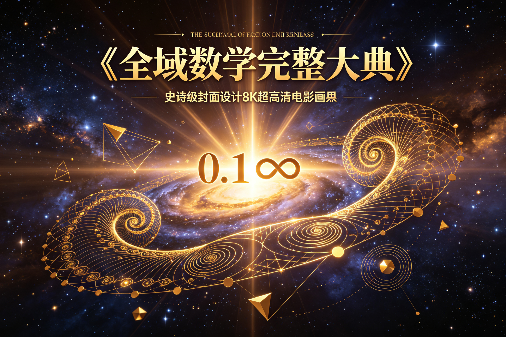
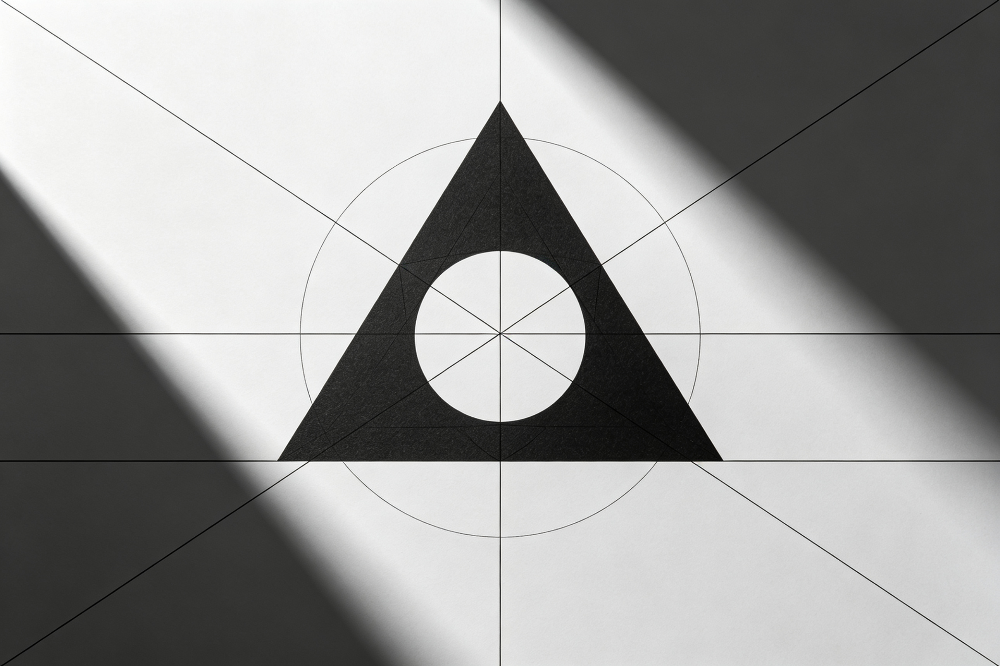
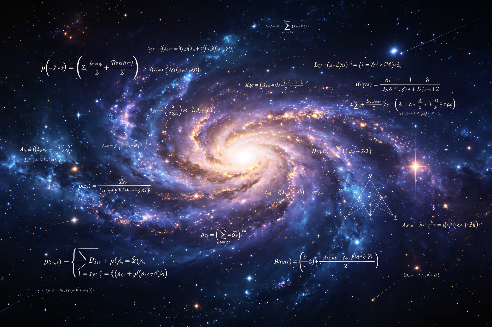
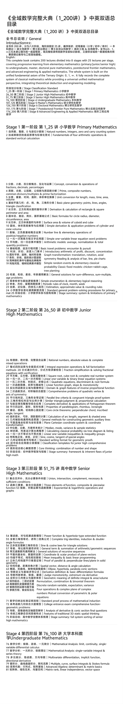
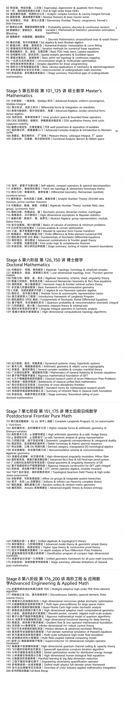
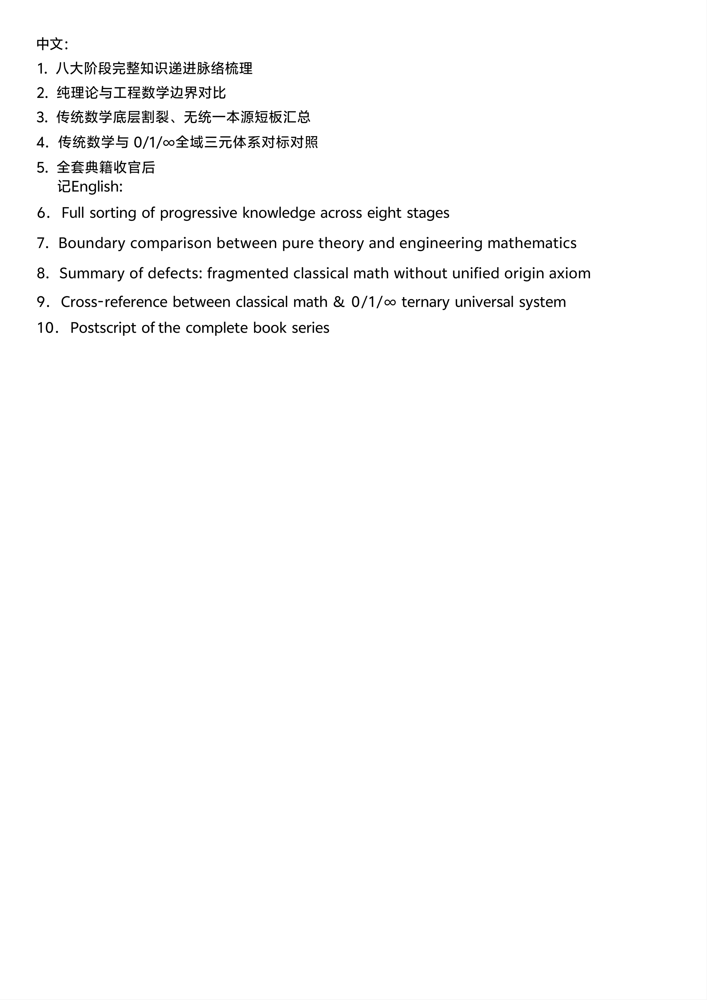

<ArchiveCopyPanel article-id="162175725" />

{"markdown":"PiDliIbnsbvvvJrlhajln5/mlbDlraYgIAo+IOe8luWPt++8mmAxNjIxNzU3MjVgICAKPiDljp/lp4vmlofku7bvvJpg5YWo5Z+f5pWw5a2m5a6M5pW05aSn5YW4MTIwMOiusuS4reiLseWPjOivreaAu+ebruW9lS0xNjIxNzU3MjUubWRgICAKPiDov5Tlm57vvJpb5pys5Lmm5b2S5qGjXSgvemgvYm9va3MvbWF0aC9hcnRpY2xlcy8pIMK3IFvmgLvlhaXlj6NdKC96aC9ib29rcy9hcnRpY2xlcy8pCgohW+OAiuWFqOWfn+aVsOWtpuWujOaVtOWkp+WFuOOAi+Wwgemdol0oLi9hc3NldHMvY3NkbmltZy9qcGcvNWI2MzkwNjVjZDQ3YWM5My5qcGcpCgojIyDjgIrlhajln5/mlbDlrablrozmlbTlpKflhbjvvIgx4oCTMjAw6K6y77yJ44CL5Lit6Iux5Y+M6K+t5oC755uu5b2VCgojIyMg5YWo5Lmm5oC76K+05piOIC8gR2VuZXJhbCBJbnRyb2R1Y3Rpb24KCuS4reaWh++8mgoKRW5nbGlzaDoKCiMjIyDpmLbmrrXliJLliIbmoIflh4YgLyBTdGFnZSBDbGFzc2lmaWNhdGlvbiBTdGFuZGFyZAoKLS0tCgojIyMgU3RhZ2UgMSDnrKzkuIDpmLbmrrUg56ysMeKAkzI16K6yIOWwj+WtpuaVsOWtpiAvIFByaW1hcnkgTWF0aGVtYXRpY3MKCiFb5bCP5a2m5pWw5a2mXSguL2Fzc2V0cy9jc2RuaW1nL2pwZy8xNDcyODg0NDdjNDA3YjRiLmpwZykKCjExMSDoh6rnhLbmlbDjgIHmlbTmlbDjgIEwMDAg5LiO6L+b5L2N6K6h5pWw5Yi2IHwgTmF0dXJhbCBudW1iZXJzLCBpbnRlZ2VycywgemVybyBhbmQgY2FycnkgY291bnRpbmcgc3lzdGVtCgoyMjIg5Yqg5YeP5LmY6Zmk5Zub5YiZ5bqV5bGC5Y6f55CG5LiO5qCH5YeG5YyW56uW5byPIHwgRnVuZGFtZW50YWxzIG9mIGZvdXIgYXJpdGhtZXRpYyBvcGVyYXRpb25zICYgc3RhbmRhcmQgdmVydGljYWwgY2FsY3VsYXRpb24KCjMzMyDliIbmlbDjgIHlsI/mlbDjgIHnmb7liIbmlbDmpoLlv7XjgIHkupLljJbkuI7ov5DnrpcgfCBDb25jZXB0LCBjb252ZXJzaW9uICYgb3BlcmF0aW9ucyBvZiBmcmFjdGlvbnMsIGRlY2ltYWxzLCBwZXJjZW50YWdlcwoKNDQ0IOi0qOaVsOOAgeWQiOaVsOOAgeWFrOWboOaVsOOAgeWFrOWAjeaVsOS4jui0qOWboOaVsOWIhuinoyB8IFByaW1lLCBjb21wb3NpdGUgbnVtYmVycywgY29tbW9uIGRpdmlzb3JzL211bHRpcGxlcyAmIHByaW1lIGZhY3Rvcml6YXRpb24KCjU1NSDplb/luqbjgIHph43ph4/jgIHml7bpl7TjgIHpnaLnp6/jgIHkvZPnp6/ljZXkvY3mjaLnrpcgfCBVbml0IGNvbnZlcnNpb24gZm9yIGxlbmd0aCwgbWFzcywgdGltZSwgYXJlYSwgdm9sdW1lCgo2NjYg5Z+656GA5bmz6Z2i5Yeg5L2V77ya54K544CB57q/44CB6KeS44CB5LiJ6KeS5b2i5YiG57G7IHwgQmFzaWMgcGxhbmUgZ2VvbWV0cnk6IHBvaW50cywgbGluZXMsIGFuZ2xlcywgdHJpYW5nbGUgY2xhc3NpZmljYXRpb24KCjc3NyDplb/mlrnlvaLjgIHmraPmlrnlvaLlkajplb/pnaLnp6/mjqjlr7zorqHnrpcgfCBEZXJpdmF0aW9uICYgY2FsY3VsYXRpb24gb2YgcmVjdGFuZ2xlICYgc3F1YXJlIHBlcmltZXRlciBhbmQgYXJlYQoKODg4IOWchuWNiuW+hOOAgeebtOW+hOOAgeWRqOmVv+OAgemdouenr+WfuuehgOWFrOW8jyB8IEJhc2ljIGZvcm11bGFzIGZvciBjaXJjbGUgcmFkaXVzLCBkaWFtZXRlciwgY2lyY3VtZmVyZW5jZSwgYXJlYQoKOTk5IOmVv+aWueS9k+OAgeato+aWueS9k+ihqOmdouenr+S4juS9k+enryB8IFN1cmZhY2UgYXJlYSAmIHZvbHVtZSBvZiBjdWJvaWQgYW5kIGN1YmUKCjEwMTAxMCDlnIbmn7HjgIHlnIbplKXkvZPnp6/nroDmmJPmjqjlr7zkuI7lupTnlKjpopggfCBTaW1wbGUgZGVyaXZhdGlvbiAmIGFwcGxpY2F0aW9uIHByb2JsZW1zIG9mIGN5bGluZGVyIGFuZCBjb25lIHZvbHVtZQoKMTExMTExIOaVsOi9tOOAgeato+i0n+aVsOWfuuehgOamguW/tei/kOeulyB8IE51bWJlciBsaW5lICYgZWxlbWVudGFyeSBvcGVyYXRpb25zIG9mIHBvc2l0aXZlL25lZ2F0aXZlIG51bWJlcnMKCjEyMTIxMiDkuIDlhYPkuIDmrKHnroDmmJPmlrnnqIvmloflrZflupTnlKjpopggfCBTaW1wbGUgb25lLXZhcmlhYmxlIGxpbmVhciBlcXVhdGlvbiB3b3JkIHByb2JsZW1zCgoxMzEzMTMg5bmz5Z2H5pWw44CB5b2S5LiA5b2S5oC7566X5pyv5qih5Z6LIHwgQXJpdGhtZXRpYyBtb2RlbHM6IGF2ZXJhZ2UsIG5vcm1hbGl6YXRpb24gJiB0b3RhbCBxdWFudGl0eSBwcm9ibGVtcwoKMTQxNDE0IOWfuuehgOebuOmBh+OAgei/veWPiuihjOeoi+mXrumimCB8IEJhc2ljIHRyYXZlbCBwcm9ibGVtczogZW5jb3VudGVyICYgcHVyc3VpdAoKMTUxNTE1IOWIqea2puOAgeaKmOaJo+OAgea1k+W6puWFpemXqOeul+acryB8IEludHJvZHVjdG9yeSBhcml0aG1ldGljIG9mIHByb2ZpdCwgZGlzY291bnQsIGNvbmNlbnRyYXRpb24KCjE2MTYxNiDlm77lvaLlubPnp7vjgIHml4vovazjgIHovbTlr7nnp7Dlj5jmjaIgfCBHcmFwaCB0cmFuc2Zvcm1hdGlvbjogdHJhbnNsYXRpb24sIHJvdGF0aW9uLCBheGlhbCBzeW1tZXRyeQoKMTcxNzE3IOadoeW9ouOAgeaKmOe6v+OAgeaJh+W9oue7n+iuoeWbvuivu+WPliB8IFJlYWRpbmcgJiBhbmFseXNpcyBvZiBiYXIsIGxpbmUsIHBpZSBjaGFydHMKCjE4MTgxOCDnroDljZXpmo/mnLrkuovku7bkuI7ln7rnoYDlj6TlhbjmpoLnjocgfCBTaW1wbGUgcmFuZG9tIGV2ZW50cyAmIGVsZW1lbnRhcnkgY2xhc3NpY2FsIHByb2JhYmlsaXR5CgoxOTE5MTkg6bih5YWU5ZCM56y844CB5qSN5qCR57uP5YW4566X5pyv5qih5Z6LIHwgQ2xhc3NpYyBmaXhlZCBtb2RlbHM6IGNoaWNrZW4tcmFiYml0IGNhZ2UsIHRyZWUgcGxhbnRpbmcKCjIwMjAyMCDlkozlt67jgIHlkozlgI3jgIHlt67lgI3jgIHlubTpvoTpgJrnlKjop6Pms5UgfCBHZW5lcmFsIHNvbHV0aW9ucyBmb3Igc3VtLWRpZmZlcmVuY2UsIHN1bS1tdWx0aXBsZSwgYWdlIHByb2JsZW1zCgoyMTIxMjEg566A5Y2V5p6a5Li+5LiO5Z+656GA6YC76L6R5o6o55CGIHwgU2ltcGxlIGVudW1lcmF0aW9uICYgZWxlbWVudGFyeSBsb2dpY2FsIHJlYXNvbmluZwoKMjIyMjIyIOmSn+ihqOOAgeaciOS7veOAgeaYn+acn+WRqOacn+inhOW+iyB8IFBlcmlvZGljIHJ1bGVzIG9mIGNsb2NrLCBtb250aCwgd2VlawoKMjMyMzIzIOS8sOeul+OAgei/keS8vOWAvOOAgeWbm+iIjeS6lOWFpeinhOiMgyB8IEVzdGltYXRpb24sIGFwcHJveGltYXRlIHZhbHVlICYgcm91bmRpbmcgcnVsZXMKCjI0MjQyNCDlsI/lrabmlbDlrabmoIflh4bljJbpgJrnlKjop6PpopjmtYHnqIsgfCBTdGFuZGFyZCBnZW5lcmFsIHByb2JsZW0tc29sdmluZyBwcm9jZWR1cmVzIGZvciBwcmltYXJ5IG1hdGgKCjI1MjUyNSDpmLbmrrXmgLvnu5PvvJrlsI/lrabmlbDlrabkvZPns7vkuI7lm7rmnInlsYDpmZAgfCBTdGFnZSBzdW1tYXJ5OiBzeXN0ZW0gJiBsaW1pdGF0aW9ucyBvZiBwcmltYXJ5IG1hdGhlbWF0aWNzCgotLS0KCiMjIyBTdGFnZSAyIOesrOS6jOmYtuautSDnrKwyNuKAkzUw6K6yIOWIneS4reaVsOWtpiAvIEp1bmlvciBIaWdoIE1hdGhlbWF0aWNzCgohW+WIneS4reaVsOWtpuWHoOS9lee+juWtpl0oLi9hc3NldHMvY3NkbmltZy9qcGcvNzhmZDMwM2Q1ZmExYTVlNi5qcGcpCgoyNjI2MjYg5pyJ55CG5pWw44CB57ud5a+55YC844CB5a6M5pW05re35ZCI6L+Q566XIHwgUmF0aW9uYWwgbnVtYmVycywgYWJzb2x1dGUgdmFsdWVzICYgY29tcGxldGUgbWl4ZWQgb3BlcmF0aW9ucwoKMjcyNzI3IOaVtOW8j+Wbm+WImei/kOeul+S4juWFqOWll+WboOW8j+WIhuinoyB8IEludGVncmFsIGV4cHJlc3Npb24gb3BlcmF0aW9ucyAmIGZ1bGwgZmFjdG9yaXphdGlvbiBtZXRob2RzCgoyODI4Mjgg5YiG5byP6YCa5YiG57qm5YiG44CB5YiG5byP5pa556iL5rGC6Kej5qOA6aqMIHwgRnJhY3Rpb24gc2ltcGxpZmljYXRpb24gJiBzb2x2aW5nIGZyYWN0aW9uYWwgZXF1YXRpb25zIHdpdGggdmVyaWZpY2F0aW9uCgoyOTI5Mjkg5bmz5pa55qC544CB56uL5pa55qC544CB5a6e5pWw5a6M5pW05L2T57O7IHwgU3F1YXJlIHJvb3QsIGN1YmUgcm9vdCAmIGNvbXBsZXRlIHJlYWwgbnVtYmVyIHN5c3RlbQoKMzAzMDMwIOS4gOWFg+S4gOasoeOAgeS6jOWFg+S4gOasoeaWueeoi+e7hCB8IExpbmVhciBvbmUtdmFyaWFibGUgJiBiaW5hcnkgbGluZWFyIGVxdWF0aW9uIHN5c3RlbXMKCjMxMzEzMSDkuIDlhYPkuozmrKHmlrnnqIvjgIHliKTliKvlvI/jgIHmsYLmoLnlhazlvI8gfCBRdWFkcmF0aWMgZXF1YXRpb25zLCBkaXNjcmltaW5hbnQgJiByb290IGZvcm11bGEKCjMyMzIzMiDkuIDmrKHlh73mlbDlm77lg4/jgIHmlpznjofkuI7lop7lh4/mgKcgfCBMaW5lYXIgZnVuY3Rpb24gZ3JhcGgsIHNsb3BlICYgbW9ub3RvbmljaXR5CgozMzMzMzMg5Y+N5q+U5L6L5Ye95pWw5a6a5LmJ5Z+f5LiO5Zu+5YOP54m55b6BIHwgRG9tYWluICYgZ3JhcGggZmVhdHVyZXMgb2YgaW52ZXJzZSBwcm9wb3J0aW9uYWwgZnVuY3Rpb24KCjM0MzQzNCDkuozmrKHlh73mlbDpobbngrnjgIHlr7nnp7DovbTnu7zlkIjpopjlnosgfCBDb21wcmVoZW5zaXZlIHByb2JsZW1zIG9mIHF1YWRyYXRpYyB2ZXJ0ZXggJiBheGlzIG9mIHN5bW1ldHJ5CgozNTM1MzUg5bmz6KGM57q/5Yik5a6a44CB5LiJ6KeS5b2i5YWo562J6K+B5piOIHwgUGFyYWxsZWwgbGluZSBjcml0ZXJpYSAmIGNvbmdydWVudCB0cmlhbmdsZSBwcm9vZiBzeXN0ZW0KCjM2MzYzNiDkuInop5LlvaLnm7jkvLzliKTlrprkuI7mr5TkvovorqHnrpcgfCBTaW1pbGFyIHRyaWFuZ2xlIGp1ZGdtZW50ICYgcHJvcG9ydGlvbmFsIGNhbGN1bGF0aW9uCgozNzM3Mzcg5Yu+6IKh5a6a55CG5a6M5pW05o6o5a+857u85ZCI5bqU55SoIHwgQ29tcGxldGUgZGVyaXZhdGlvbiAmIGFwcGxpY2F0aW9ucyBvZiBQeXRoYWdvcmVhbiB0aGVvcmVtCgozODM4Mzgg5bmz6KGM5Zub6L655b2i44CB6I+x5b2i44CB55+p5b2i5oCn6LSoIHwgUHJvcGVydGllcyBvZiBwYXJhbGxlbG9ncmFtLCByaG9tYnVzLCByZWN0YW5nbGUKCjM5MzkzOSDlnoLlvoTjgIHlnIblkajjgIHliIfnur/moLjlv4PlnIblrprnkIYgfCBDb3JlIGNpcmNsZSB0aGVvcmVtczogcGVycGVuZGljdWxhciBjaG9yZCwgaW5zY3JpYmVkIGFuZ2xlLCB0YW5nZW50Cgo0MDQwNDAg5omH5b2i5byn6ZW/44CB5byT5b2i44CB6Zi05b2x6Z2i56ev6K6h566XIHwgQ2FsY3VsYXRpb24gb2YgYXJjIGxlbmd0aCwgc2VnbWVudCAmIHNoYWRlZCBhcmVhCgo0MTQxNDEg5Yeg5L2V6L6F5Yqp57q/6YCa55So5p6E6YCg5oCd6LevIHwgR2VuZXJhbCBtZXRob2RzIGZvciBjb25zdHJ1Y3RpbmcgZ2VvbWV0cmljIGF1eGlsaWFyeSBsaW5lcwoKNDI0MjQyIOW5s+mdouebtOinkuWdkOagh+ezu+S4juWdkOagh+WPmOaNoiB8IFBsYW5lIENhcnRlc2lhbiBjb29yZGluYXRlIHN5c3RlbSAmIGNvb3JkaW5hdGUgdHJhbnNmb3JtYXRpb24KCjQzNDM0MyDkuK3kvY3mlbDjgIHkvJfmlbDjgIHmlrnlt67moLfmnKznu5/orqEgfCBNZWRpYW4sIG1vZGUsIHZhcmlhbmNlICYgc2FtcGxlIHN0YXRpc3RpY3MKCjQ0NDQ0NCDmoJHnirblm77jgIHliJfooajms5XorqHnrpflj6TlhbjmpoLnjocgfCBDYWxjdWxhdGluZyBjbGFzc2ljYWwgcHJvYmFiaWxpdHkgdmlhIHRyZWUgZGlhZ3JhbSAmIGxpc3RpbmcKCjQ1NDU0NSDkuIDlhYPkuIDmrKHkuI3nrYnlvI/kuI7kuI3nrYnlvI/nu4QgfCBMaW5lYXIgb25lLXZhcmlhYmxlIGluZXF1YWxpdGllcyAmIGluZXF1YWxpdHkgZ3JvdXBzCgo0NjQ2NDYg54m55q6K6KeS5q2j5bym44CB5L2Z5bym44CB5q2j5YiHIHwgU2luZSwgY29zaW5lLCB0YW5nZW50IG9mIHNwZWNpYWwgYW5nbGVzCgo0NzQ3NDcg5Yeg5L2V6K+B5piO5qCH5YeG5Lmm5YaZ5qC85byPIHwgU3RhbmRhcmQgd3JpdGluZyBmb3JtYXQgZm9yIGdlb21ldHJpYyBwcm9vZnMKCjQ4NDg0OCDliJ3kuK3nu7zlkIjlupTnlKjpopjliIbnsbvmqKHmnb8gfCBDbGFzc2lmaWNhdGlvbiB0ZW1wbGF0ZXMgZm9yIGp1bmlvciBoaWdoIGNvbXByZWhlbnNpdmUgcHJvYmxlbXMKCjQ5NDk0OSDmlbDlvaLnu5PlkIjmoLjlv4Pop6PpopjmgJ3mg7MgfCBDb3JlIHRoaW5raW5nOiBjb21iaW5hdGlvbiBvZiBudW1iZXIgYW5kIHNoYXBlCgo1MDUwNTAg6Zi25q615oC757uT77ya5Yid5Lit5pWw5a2m5qGG5p625LiO55+t5p2/IHwgU3RhZ2Ugc3VtbWFyeTogZnJhbWV3b3JrICYgaW5oZXJlbnQgZmxhd3Mgb2YganVuaW9yIGhpZ2ggbWF0aAoKLS0tCgojIyMgU3RhZ2UgMyDnrKzkuInpmLbmrrUg56ysNTHigJM3NeiusiDpq5jkuK3mlbDlraYgLyBTZW5pb3IgSGlnaCBNYXRoZW1hdGljcwoKIVvpq5jkuK3mlbDlrablh73mlbDkuYvnvo5dKC4vYXNzZXRzL2NzZG5pbWcvanBnLzI5ZjFmNzQxNzU2NjZlMjIuanBnKQoKNTE1MTUxIOmbhuWQiOS6pOW5tuihpeOAgeWFheWIhuW/heimgeadoeS7tuWRvemimCB8IFVuaW9uLCBpbnRlcnNlY3Rpb24sIGNvbXBsZW1lbnQsIG5lY2Vzc2FyeSAmIHN1ZmZpY2llbnQgY29uZGl0aW9ucwoKNTI1MjUyIOWHveaVsOS4ieimgee0oOOAgeWkjeWQiOWIhuauteWHveaVsCB8IFRocmVlIGVsZW1lbnRzIG9mIGZ1bmN0aW9uLCBjb21wb3NpdGUgJiBwaWVjZXdpc2UgZnVuY3Rpb24KCjUzNTM1MyDmjIfmlbDjgIHlr7nmlbDov5DnrpfkuI7lh73mlbDlm77lg48gfCBFeHBvbmVudGlhbCAmIGxvZ2FyaXRobWljIG9wZXJhdGlvbnMgYW5kIGdyYXBocwoKNTQ1NDU0IOW5guWHveaVsOOAgeWvueWLvuaLk+WxleWHveaVsOaooeWeiyB8IFBvd2VyIGZ1bmN0aW9uICYgaHlwZXJib2xhLXR5cGUgZXh0ZW5kZWQgZnVuY3Rpb24KCjU1NTU1NSDlhajlpZfkuInop5LmgZLnrYnlvI/jgIHor7Hlr7zkuozlgI3op5LlhazlvI8gfCBDb21wbGV0ZSB0cmlnIGlkZW50aXRpZXMsIGluZHVjdGlvbiAmIGRvdWJsZS1hbmdsZSBmb3JtdWxhcwoKNTY1NjU2IOato+S9meW8puWumueQhuino+S4ieinkuW9oue7vOWQiCB8IFNpbmUgJiBjb3NpbmUgbGF3cyBmb3IgdHJpYW5nbGUgc29sdXRpb25zCgo1NzU3NTcg562J5beu44CB562J5q+U5pWw5YiX6YCa6aG55rGC5ZKMIHwgR2VuZXJhbCB0ZXJtICYgc3VtbWF0aW9uIG9mIGFyaXRobWV0aWMvZ2VvbWV0cmljIHNlcXVlbmNlcwoKNTg1ODU4IOW4uOingemAkuaOqOaVsOWIl+mAmueUqOino+azlSB8IEdlbmVyYWwgc29sdXRpb25zIG9mIHJlY3Vyc2l2ZSBzZXF1ZW5jZXMKCjU5NTk1OSDlubPpnaLlkJHph4/lnZDmoIfjgIHmlbDph4/np6/ov5DnrpcgfCBDb29yZGluYXRlICYgc2NhbGFyIHByb2R1Y3Qgb2YgcGxhbmUgdmVjdG9ycwoKNjA2MDYwIOWdh+WAvOS4jeetieW8j+OAgee6v+aAp+inhOWIkuWfuuehgCB8IE1lYW4gaW5lcXVhbGl0eSAmIGJhc2ljIGxpbmVhciBwcm9ncmFtbWluZwoKNjE2MTYxIOeri+S9k+WHoOS9lee6v+mdouW5s+ihjOWeguebtOivgeaYjiB8IFByb29mIG9mIHBhcmFsbGVsICYgcGVycGVuZGljdWxhciBsaW5lcy9wbGFuZSBpbiBzb2xpZCBnZW9tZXRyeQoKNjI2MjYyIOepuumXtOWQkemHj+OAgei3neemu+WkueinkuiuoeeulyB8IFNwYXRpYWwgdmVjdG9yLCBkaXN0YW5jZSAmIGFuZ2xlIGNhbGN1bGF0aW9uCgo2MzYzNjMg5qSt5ZyG44CB5Y+M5puy57q/44CB5oqb54mp57q/5ZyG6ZSl5puy57q/IHwgRWxsaXBzZSwgaHlwZXJib2xhLCBwYXJhYm9sYSBjb25pYyBzZWN0aW9ucwoKNjQ2NDY0IOWvvOaVsOWumuS5ieS4juWfuuehgOaxguWvvOWFrOW8jyB8IERlcml2YXRpdmUgZGVmaW5pdGlvbiAmIGJhc2ljIGRpZmZlcmVudGlhdGlvbiBmb3JtdWxhcwoKNjU2NTY1IOWvvOaVsOWIpOaWreWNleiwg+OAgeaegeWAvOOAgeacgOWAvCB8IEp1ZGdlIG1vbm90b25pY2l0eSwgZXh0cmVtdW0gdmlhIGRlcml2YXRpdmUKCjY2NjY2NiDlrprnp6/liIblh6DkvZXmhI/kuYnkuI7pnaLnp6/kvZPnp68gfCBHZW9tZXRyaWMgbWVhbmluZyBvZiBkZWZpbml0ZSBpbnRlZ3JhbCAmIGFyZWEvdm9sdW1lCgo2NzY3Njcg5o6S5YiX57uE5ZCI44CB5LqM6aG55byP5a6a55CGIHwgUGVybXV0YXRpb24sIGNvbWJpbmF0aW9uICYgYmlub21pYWwgdGhlb3JlbQoKNjg2ODY4IOemu+aVo+maj+acuuWPmOmHj+acn+acm+aWueW3riB8IERpc2NyZXRlIHJhbmRvbSB2YXJpYWJsZSwgZXhwZWN0YXRpb24sIHZhcmlhbmNlCgo2OTY5Njkg5aSN5pWw5Zub5YiZ6L+Q566X5LiO5aSN5bmz6Z2iIHwgRm91ciBvcGVyYXRpb25zICYgY29tcGxleCBwbGFuZSBvZiBjb21wbGV4IG51bWJlcnMKCjcwNzA3MCDlj4LmlbDmlrnnqIvjgIHmnoHlnZDmoIfkupLljJYgfCBNdXR1YWwgY29udmVyc2lvbiBvZiBwYXJhbWV0cmljICYgcG9sYXIgZXF1YXRpb25zCgo3MTcxNzEg5pWw5a2m5b2S57qz5rOV5qCH5YeG6K+B5piO5rWB56iLIHwgU3RhbmRhcmQgcHJvb2YgcHJvY2VzcyBvZiBtYXRoZW1hdGljYWwgaW5kdWN0aW9uCgo3MjcyNzIg6auY6ICD5Ye95pWw5Yeg5L2V57u85ZCI5aSn6aKY5qih5Z6LIHwgQ29sbGVnZSBlbnRyYW5jZSBleGFtIGNvbXByZWhlbnNpdmUgZnVuY3Rpb24tZ2VvbWV0cmljIHByb2JsZW1zCgo3MzczNzMg5a+85pWw44CB5ZyG6ZSl5puy57q/5Y6L6L206aKY5Z6L6Kej5p6QIHwgQW5hbHlzaXMgb2YgZGVyaXZhdGl2ZSAmIGNvbmljIHNlY3Rpb24gZmluYWwgcXVlc3Rpb25zCgo3NDc0NzQg5Lyg57uf5LiJ57u06Z2Z5oCB56m66Ze05oCd57u054m554K5IHwgRmVhdHVyZXMgb2YgdHJhZGl0aW9uYWwgM0Qgc3RhdGljIHNwYXRpYWwgdGhpbmtpbmcKCjc1NzU3NSDpmLbmrrXmgLvnu5PvvJrpq5jkuK3mlbDlrablrozmlbTkvZPns7vmorPnkIYgfCBTdGFnZSBzdW1tYXJ5OiBmdWxsIHN5c3RlbSBzb3J0aW5nIG9mIHNlbmlvciBoaWdoIG1hdGhlbWF0aWNzCgotLS0KCiMjIyBTdGFnZSA0IOesrOWbm+mYtuautSDnrKw3NuKAkzEwMOiusiDlpKflrabmnKznp5HmlbDlraYgLyBVbmRlcmdyYWR1YXRlIE1hdGhlbWF0aWNzCgohW+acrOenkeaVsOWtpuepuumXtOWHoOS9lee7k+aehF0oLi9hc3NldHMvY3NkbmltZy9qcGcvODcwYzhhODIyMWZiZWJiOC5qcGcpCgo3Njc2NzYg5pWw5a2m5YiG5p6Q77ya5p6B6ZmQ44CB6L+e57ut44CB5LiA5YWD5b6u5YiGIHwgTWF0aGVtYXRpY2FsIEFuYWx5c2lzOiBsaW1pdCwgY29udGludWl0eSwgc2luZ2xlLXZhcmlhYmxlIGRpZmZlcmVudGlhbCBjYWxjdWx1cwoKNzc3Nzc3IOaVsOWtpuWIhuaekO+8muS4gOWFg+enr+WIhuOAgee6p+aVsOeQhuiuuiB8IE1hdGhlbWF0aWNhbCBBbmFseXNpczogc2luZ2xlLXZhcmlhYmxlIGludGVncmFsICYgc2VyaWVzIHRoZW9yeQoKNzg3ODc4IOWkmuWFg+W+ruWIhuOAgemakOWHveaVsOOAgeaWueWQkeWvvOaVsCB8IE11bHRpdmFyaWF0ZSBkaWZmZXJlbnRpYXRpb24sIGltcGxpY2l0IGZ1bmN0aW9uLCBkaXJlY3Rpb25hbCBkZXJpdmF0aXZlCgo3OTc5Nzkg6YeN56ev5YiG44CB5puy57q/5puy6Z2i56ev5YiG44CB5pav5omY5YWL5pavIHwgTXVsdGlwbGUsIGN1cnZlLCBzdXJmYWNlIGludGVncmFscyAmIFN0b2tlcyBmb3JtdWxhCgo4MDgwODAg6auY562J5Luj5pWw77ya6KGM5YiX5byP44CB55+p6Zi15Z+656GAIHwgQWR2YW5jZWQgQWxnZWJyYTogZGV0ZXJtaW5hbnQgJiBtYXRyaXggYmFzaWNzCgo4MTgxODEg55+p6Zi156ep44CB57q/5oCn5peg5YWz44CB5ZCR6YeP56m66Ze0IHwgTWF0cml4IHJhbmssIGxpbmVhciBpbmRlcGVuZGVuY2UsIHZlY3RvciBzcGFjZQoKODI4MjgyIOeJueW+geWAvOOAgeeJueW+geWQkemHj+OAgeS6jOasoeWeiyB8IEVpZ2VudmFsdWUsIGVpZ2VudmVjdG9yICYgcXVhZHJhdGljIGZvcm0gdGhlb3J5Cgo4MzgzODMg5LiA6Zi244CB6auY6Zi257q/5oCn5bi45b6u5YiG5pa556iLIHwgRmlyc3QgJiBoaWdoLW9yZGVyIGxpbmVhciBPREVzCgo4NDg0ODQg5aSN5Y+Y6Kej5p6Q5Ye95pWw44CB5p+v6KW/56ev5YiG5YWs5byPIHwgQW5hbHl0aWMgY29tcGxleCBmdW5jdGlvbiAmIENhdWNoeSBpbnRlZ3JhbCBmb3JtdWxhCgo4NTg1ODUg55WZ5pWw5a6a55CG44CB5Z+656GA5YKF6YeM5Y+257qn5pWwIHwgUmVzaWR1ZSB0aGVvcmVtICYgYmFzaWMgRm91cmllciBzZXJpZXMKCjg2ODY4NiDliJ3nrYnmlbDorrrvvJrlkIzkvZnjgIHotLnpqazlsI/lrprnkIYgfCBFbGVtZW50YXJ5IE51bWJlciBUaGVvcnk6IGNvbmdydWVuY2UsIEZlcm1hdOKAmXMgbGl0dGxlIHRoZW9yZW0KCjg3ODc4NyDmpoLnjoforrrlhaznkIbjgIHnprvmlaPov57nu63pmo/mnLrlj5jph48gfCBQcm9iYWJpbGl0eSBheGlvbXMsIGRpc2NyZXRlICYgY29udGludW91cyByYW5kb20gdmFyaWFibGVzCgo4ODg4ODgg5pWw55CG57uf6K6h77ya5Y+C5pWw5Lyw6K6h44CB5YGH6K6+5qOA6aqMIHwgTWF0aGVtYXRpY2FsIFN0YXRpc3RpY3M6IHBhcmFtZXRlciBlc3RpbWF0aW9uLCBoeXBvdGhlc2lzIHRlc3RpbmcKCjg5ODk4OSDnprvmlaPmlbDlrabvvJrlkb3popjpgLvovpHjgIHln7rnoYDlm77orrogfCBEaXNjcmV0ZSBNYXRoZW1hdGljczogcHJvcG9zaXRpb25hbCBsb2dpYyAmIGdyYXBoIHRoZW9yeQoKOTA5MDkwIOmbhuWQiOS7o+aVsOOAgeW4g+WwlOS7o+aVsOWfuuehgCB8IFNldCBhbGdlYnJhICYgYmFzaWMgQm9vbGVhbiBhbGdlYnJhCgo5MTkxOTEg5pWw5YC85YiG5p6Q77ya5o+S5YC844CB5puy57q/5ouf5ZCIIHwgTnVtZXJpY2FsIEFuYWx5c2lzOiBpbnRlcnBvbGF0aW9uICYgY3VydmUgZml0dGluZwoKOTI5MjkyIOaVsOWAvOe6v+aAp+aWueeoi+e7hOi/reS7o+ino+azlSB8IEl0ZXJhdGl2ZSBtZXRob2RzIGZvciBudW1lcmljYWwgbGluZWFyIGVxdWF0aW9ucwoKOTM5MzkzIOWfuuehgOWBj+W+ruWIhu+8mueDreOAgeazouWKqOOAgeaLieaZruaLieaWryB8IEJhc2ljIFBERTogaGVhdCwgd2F2ZSwgTGFwbGFjZSBlcXVhdGlvbnMKCjk0OTQ5NCDnqbrpl7Top6PmnpDlh6DkvZXjgIHmrKfmsI/nqbrpl7QgfCBTcGF0aWFsIGFuYWx5dGljIGdlb21ldHJ5ICYgRXVjbGlkZWFuIHNwYWNlCgo5NTk1OTUg5Z+656GA54K56ZuG5ouT5omR44CB6L+e57ut5pig5bCEIHwgQmFzaWMgcG9pbnQtc2V0IHRvcG9sb2d5ICYgY29udGludW91cyBtYXBwaW5nCgo5Njk2OTYg5LiA5YWD5aSa5YWD5peg57qm5p2f5LyY5YyWIHwgVW5jb25zdHJhaW5lZCBzaW5nbGUgJiBtdWx0aXZhcmlhdGUgb3B0aW1pemF0aW9uCgo5Nzk3OTcg57q/5oCn6KeE5YiS5Y2V57qv5b2i566X5rOVIHwgU2ltcGxleCBhbGdvcml0aG0gZm9yIGxpbmVhciBwcm9ncmFtbWluZwoKOTg5ODk4IOW+ruenr+WIhuWKm+WtpueUteejgeWfuuehgOW6lOeUqCB8IEJhc2ljIGNhbGN1bHVzIGFwcGxpY2F0aW9ucyBpbiBtZWNoYW5pY3MgJiBlbGVjdHJvbWFnbmV0aXNtCgo5OTk5OTkg5pys56eR5ZCE5pWw5a2m5YiG5pSv5Lqk5Y+J5YWz6IGUIHwgSW50ZXJjb25uZWN0aW9uIG9mIHVuZGVyZ3JhZHVhdGUgbWF0aCBicmFuY2hlcwoKMTAwMTAwMTAwIOmYtuauteaAu+e7k++8muacrOenkeeQhuiuuuS9k+ezu+e8uuWPoyB8IFN0YWdlIHN1bW1hcnk6IHRoZW9yZXRpY2FsIGdhcHMgb2YgdW5kZXJncmFkdWF0ZSBtYXRoZW1hdGljcwoKLS0tCgojIyMgU3RhZ2UgNSDnrKzkupTpmLbmrrUg56ysMTAx4oCTMTI16K6yIOehleWjq+aVsOWtpiAvIE1hc3RlcuKAmXMgTWF0aGVtYXRpY3MKCiFb56GV5aOr5pWw5a2m5YiG5b2i6Ieq54S25aKe6ZW/XSguL2Fzc2V0cy9jc2RuaW1nL2pwZy81N2ZlM2UyMTcwNTFlZDM5LmpwZykKCjEwMTEwMTEwMSDliIbmnpDov5vpmLbvvJrkuIDoh7TmlLbmlZvjgIFTdGllbHRqZXPnp6/liIYgfCBBZHZhbmNlZCBBbmFseXNpczogdW5pZm9ybSBjb252ZXJnZW5jZSwgU3RpZWx0amVzIGludGVncmFsCgoxMDIxMDIxMDIg5b6u5YiG5b2i5byP44CB5rWB5b2i5LiK56ev5YiGIHwgRGlmZmVyZW50aWFsIGZvcm1zICYgaW50ZWdyYXRpb24gb24gbWFuaWZvbGRzCgoxMDMxMDMxMDMg6auY562J5Luj5pWw6L+b6Zi277ya6Iul5bCU5b2T5qCH5YeG5b2i44CB5byg6YePIHwgQWR2YW5jZWQgQWxnZWJyYTogSm9yZGFuIGNhbm9uaWNhbCBmb3JtLCB0ZW5zb3IgYWxnZWJyYQoKMTA0MTA0MTA0IOWGheenr+epuumXtOOAgeacieeVjOe6v+aAp+eul+WtkCB8IElubmVyIHByb2R1Y3Qgc3BhY2UgJiBib3VuZGVkIGxpbmVhciBvcGVyYXRvcnMKCjEwNTEwNTEwNSBPREXlrprmgKfnkIborrrjgIHmnoHpmZDnjq/jgIHmnY7pm4Xmma7or7rlpKvnqLPlrprmgKcgfCBPREUgcXVhbGl0YXRpdmUgdGhlb3J5LCBsaW1pdCBjeWNsZSwgTHlhcHVub3Ygc3RhYmlsaXR5CgoxMDYxMDYxMDYg5YGP5b6u5YiG6YCC5a6a5oCn44CB5YiG56a75Y+Y6YeP5rOVIHwgUERFIHdlbGwtcG9zZWRuZXNzICYgc2VwYXJhdGlvbiBvZiB2YXJpYWJsZXMKCjEwNzEwNzEwNyDpq5jpmLblpI3liIbmnpDjgIHpu47mm7zmm7LpnaLlhaXpl6ggfCBBZHZhbmNlZCBDb21wbGV4IEFuYWx5c2lzICYgaW50cm9kdWN0aW9uIHRvIFJpZW1hbm4gc3VyZmFjZXMKCjEwODEwODEwOCDmtYvluqborrrjgIHli5LotJ3moLznp6/liIbjgIFMcExecExw56m66Ze0IHwgTWVhc3VyZSB0aGVvcnksIExlYmVzZ3VlIGludGVncmFsLCBMcExecExwIHNwYWNlCgoxMDkxMDkxMDkg5rOb5Ye95YiG5p6Q77ya5be05ou/6LWr44CB5biM5bCU5Lyv54m556m66Ze0IHwgRnVuY3Rpb25hbCBBbmFseXNpczogQmFuYWNoICYgSGlsYmVydCBzcGFjZQoKMTEwMTEwMTEwIOiHquS8tOOAgee0p+eul+WtkOS4juiwseWIhuinoyB8IFNlbGYtYWRqb2ludCwgY29tcGFjdCBvcGVyYXRvcnMgJiBzcGVjdHJhbCBkZWNvbXBvc2l0aW9uCgoxMTExMTExMTEg54K56ZuG5ouT5omR44CB5Z+656GA5ZCM5Lym55CG6K66IHwgUG9pbnQtc2V0IHRvcG9sb2d5ICYgZWxlbWVudGFyeSBob21vdG9weSB0aGVvcnkKCjExMjExMjExMiDlvq7liIblh6DkvZXvvJrpu47mm7zmtYHlvaLjgIHmm7LnjoflvKDph48gfCBEaWZmZXJlbnRpYWwgR2VvbWV0cnk6IFJpZW1hbm5pYW4gbWFuaWZvbGQsIGN1cnZhdHVyZSB0ZW5zb3IKCjExMzExMzExMyDop6PmnpDmlbDorrrvvJrni4TliKnlhYvpm7fOtlx6ZXRhzrblh73mlbDjgIHntKDmlbDlrprnkIYgfCBBbmFseXRpYyBOdW1iZXIgVGhlb3J5OiBEaXJpY2hsZXQgemV0YSBmdW5jdGlvbiwgcHJpbWUgbnVtYmVyIHRoZW9yZW0KCjExNDExNDExNCDku6PmlbDmlbDorrrvvJrmlbDln5/jgIHnsbvnvqTjgIHliIblnIbln58gfCBBbGdlYnJhaWMgTnVtYmVyIFRoZW9yeTogbnVtYmVyIGZpZWxkLCBjbGFzcyBncm91cCwgY3ljbG90b21pYyBmaWVsZAoKMTE1MTE1MTE1IOmaj+acuui/h+eoi+OAgeW4g+acl+i/kOWKqOOAgemehSB8IFN0b2NoYXN0aWMgcHJvY2VzcywgQnJvd25pYW4gbW90aW9uLCBtYXJ0aW5nYWxlCgoxMTYxMTYxMTYg6auY57u05riQ6L+R44CB6LSd5Y+25pav57uf6K6hIHwgSGlnaC1kaW1lbnNpb25hbCBhc3ltcHRvdGljICYgQmF5ZXNpYW4gc3RhdGlzdGljcwoKMTE3MTE3MTE3IOaKveixoeS7o+aVsO+8mue+pOihqOekuuOAgeaooeOAgeS8vee9l+eTpiB8IEFic3RyYWN0IEFsZ2VicmE6IGdyb3VwIHJlcHJlc2VudGF0aW9uLCBtb2R1bGUsIEdhbG9pcyB0aGVvcnkKCjExODExODExOCDlj5jliIbms5Xln7rnoYDjgIHmnoHlsI/lgLzpl67popggfCBCYXNpY3Mgb2YgY2FsY3VsdXMgb2YgdmFyaWF0aW9ucyAmIG1pbmltdW0gcHJvYmxlbXMKCjExOTExOTExOSDlh7jliIbmnpDkuI7lh7jkvJjljJbnkIborrogfCBDb252ZXggYW5hbHlzaXMgJiBjb252ZXggb3B0aW1pemF0aW9uCgoxMjAxMjAxMjAg5bCP5rOi44CB566X5a2Q5Z6L5YKF6YeM5Y+25Y+Y5o2iIHwgV2F2ZWxldCAmIG9wZXJhdG9yLWZvcm0gRm91cmllciB0cmFuc2Zvcm0KCjEyMTEyMTEyMSDmnInpmZDlt67liIbjgIHmnInpmZDlhYPmlbDlgLxQREUgfCBGaW5pdGUgZGlmZmVyZW5jZSAmIGZpbml0ZSBlbGVtZW50IG51bWVyaWNhbCBQREUKCjEyMjEyMjEyMiDpmo/mnLrlvq7liIbmlrnnqItTREXln7rnoYAgfCBGdW5kYW1lbnRhbHMgb2YgU3RvY2hhc3RpYyBEaWZmZXJlbnRpYWwgRXF1YXRpb25zCgoxMjMxMjMxMjMg6auY6Zi257uE5ZCI44CB5YmN5rK/5Zu+6K66IHwgQWR2YW5jZWQgY29tYmluYXRvcmljcyAmIGZyb250aWVyIGdyYXBoIHRoZW9yeQoKMTI0MTI0MTI0IOS4gOmYtumAu+i+keOAgeWujOWkh+aAp+WumueQhiB8IEZpcnN0LW9yZGVyIGxvZ2ljICYgY29tcGxldGVuZXNzIHRoZW9yZW0KCjEyNTEyNTEyNSDpmLbmrrXmgLvnu5PvvJrnoZXlo6vnoJTnqbbovrnnlYzmorPnkIYgfCBTdGFnZSBzdW1tYXJ5OiBzb3J0aW5nIG9mIG1hc3RlciByZXNlYXJjaCBib3VuZGFyaWVzCgotLS0KCiMjIyBTdGFnZSA2IOesrOWFremYtuautSDnrKwxMjbigJMxNTDorrIg5Y2a5aOr5pWw5a2mIC8gRG9jdG9yYWwgTWF0aGVtYXRpY3MKCiFb5Y2a5aOr5pWw5a2m5ouT5omR5rWB5b2i6Im65pyvXSguL2Fzc2V0cy9jc2RuaW1nL2pwZy8yY2Y3MGIwMDA1YTUwY2FhLmpwZykKCjEyNjEyNjEyNiDku6PmlbDmi5PmiZHvvJrlkIzosIPjgIHljZXnuq/lpI3lvaIgfCBBbGdlYnJhaWMgVG9wb2xvZ3k6IGhvbW9sb2d5ICYgc2ltcGxpY2lhbCBjb21wbGV4CgoxMjcxMjcxMjcg5L2O57u05ouT5omR44CB57q957uT44CB55Gf5pav6aG/5Yeg5L2V5YyWIHwgTG93LWRpbWVuc2lvbmFsIHRvcG9sb2d5LCBrbm90LCBUaHVyc3RvbiBnZW9tZXRyaXphdGlvbgoKMTI4MTI4MTI4IOS7o+aVsOWHoOS9le+8muamguWei+OAgeWxguOAgeWlh+eCuSB8IEFsZ2VicmFpYyBHZW9tZXRyeTogc2NoZW1lLCBzaGVhZiwgc2luZ3VsYXJpdHkgdGhlb3J5CgoxMjkxMjkxMjkg6buO5pu85Yeg5L2V6L+b6Zi244CB6YeM5aWH5rWB5pa556iLIHwgQWR2YW5jZWQgUmllbWFubmlhbiBHZW9tZXRyeSAmIFJpY2NpIGZsb3cgZXF1YXRpb25zCgoxMzAxMzAxMzAg6LCD5ZKM5pig5bCE44CB5p6B5bCP5puy6Z2i5YmN5rK/IHwgSGFybW9uaWMgbWFwcyAmIGZyb250aWVyIG1pbmltYWwgc3VyZmFjZSB0aGVvcnkKCjEzMTEzMTEzMSDpnZ7kuqTmjaLlh6DkvZXln7rnoYDmoYbmnrYgfCBCYXNpYyBmcmFtZXdvcmsgb2Ygbm9uY29tbXV0YXRpdmUgZ2VvbWV0cnkKCjEzMjEzMjEzMiBD5Luj5pWw44CB5Yav6K+65L6d5pu8566X5a2Q5Luj5pWwIHwgQy1hbGdlYnJhICYgdm9uIE5ldW1hbm4gb3BlcmF0b3IgYWxnZWJyYQoKMTMzMTMzMTMzIOaooeW9ouW8j+OAgeiHquWuiOihqOekuuWfuuehgCB8IE1vZHVsYXIgZm9ybXMgJiBhdXRvbW9ycGhpYyByZXByZXNlbnRhdGlvbiBiYXNpY3MKCjEzNDEzNDEzNCDmnJflhbDlhbnnurLpooblhaXpl6jmoYbmnrYgfCBJbnRyb2R1Y3RvcnkgZnJhbWV3b3JrIG9mIExhbmdsYW5kcyBQcm9ncmFtCgoxMzUxMzUxMzUg6ZqP5py65YGP5b6u5YiGU1BEReWfuuehgCB8IEZ1bmRhbWVudGFscyBvZiBTdG9jaGFzdGljIFBhcnRpYWwgRGlmZmVyZW50aWFsIEVxdWF0aW9ucwoKMTM2MTM2MTM2IOmHj+WtkOamgueOh+OAgemdnuS6pOaNoumaj+acuuenr+WIhiB8IFF1YW50dW0gcHJvYmFiaWxpdHkgJiBub25jb21tdXRhdGl2ZSBzdG9jaGFzdGljIGludGVncmFsCgoxMzcxMzcxMzcg5Yeg5L2V5rWL5bqm6K6644CB5p6B5bCP6ZuGIHwgR2VvbWV0cmljIG1lYXN1cmUgdGhlb3J5ICYgbWluaW1hbCBzZXRzCgoxMzgxMzgxMzgg6LCD5ZKM5YiG5p6Q5aWH5byC56ev5YiG566X5a2QIHwgU2luZ3VsYXIgaW50ZWdyYWwgb3BlcmF0b3JzIGluIGhhcm1vbmljIGFuYWx5c2lzCgoxMzkxMzkxMzkg6auY57u06K6h566X5ouT5omR5pWw5YC8566X5rOVIHwgSGlnaC1kaW1lbnNpb25hbCBjb21wdXRhdGlvbmFsIHRvcG9sb2d5IGFsZ29yaXRobXMKCjE0MDE0MDE0MCDliqjlipvns7vnu5/jgIHmt7fmsozjgIHlj4zmm7Lns7vnu58gfCBEeW5hbWljYWwgc3lzdGVtcywgY2hhb3MsIGh5cGVyYm9saWMgc3lzdGVtcwoKMTQxMTQxMTQxIOeul+acr+WHoOS9leOAgeakreWchuabsue6v+WvhueggSB8IEFyaXRobWV0aWMgZ2VvbWV0cnkgJiBlbGxpcHRpYyBjdXJ2ZSBjcnlwdG9ncmFwaHkKCjE0MjE0MjE0MiDlpJrlpI3lj5jjgIHlpI3mtYHlvaLnkIborrogfCBTZXZlcmFsIGNvbXBsZXggdmFyaWFibGVzICYgY29tcGxleCBtYW5pZm9sZCB0aGVvcnkKCjE0MzE0MzE0MyDlub/kuYnnm7jlr7norrrmlbDlrabjgIHniLHlm6Dmlq/lnabmlrnnqIsgfCBNYXRoZW1hdGljcyBvZiBHZW5lcmFsIFJlbGF0aXZpdHkgJiBFaW5zdGVpbiBlcXVhdGlvbnMKCjE0NDE0NDE0NCDph4/lrZDlnLrkuKXmoLzmlbDlrabln7rnoYAgfCBSaWdvcm91cyBtYXRoZW1hdGljYWwgZm91bmRhdGlvbiBvZiBRRlQKCjE0NTE0NTE0NSDkuIPlpKfljYPnpqfpmr7popjkvKDnu5/noJTnqbbot6/lvoQgfCBDbGFzc2ljYWwgcmVzZWFyY2ggcGF0aHMgb2Ygc2V2ZW4gTWlsbGVubml1bSBQcml6ZSBQcm9ibGVtcwoKMTQ2MTQ2MTQ2IOS8oOe7n+e7n+S4gOWcuuaVsOWtpueTtumiiCB8IEJvdHRsZW5lY2tzIG9mIGNsYXNzaWNhbCB1bmlmaWVkIGZpZWxkIG1hdGhlbWF0aWNzCgoxNDcxNDcxNDcg5ZCE5YiG5pSv5YmN5rK/5Lqk5Y+J57u86L+wIHwgT3ZlcnZpZXcgb2YgY3Jvc3MtZGlzY2lwbGluYXJ5IGZyb250aWVycwoKMTQ4MTQ4MTQ4IOenkeeglOiuuuaWh+agh+WHhuaOqOWvvOivgeaYjuinhOiMgyB8IFN0YW5kYXJkIG5vcm1zIGZvciBtYXRoZW1hdGljYWwgcmVzZWFyY2ggcHJvb2ZzCgoxNDkxNDkxNDkg5Lyg57uf5pWw5a2m5bqV5bGC5Zu65pyJ57y66Zm35rGH5oC7IHwgU3VtbWFyeSBvZiBpbmhlcmVudCBmbGF3cyBpbiBjbGFzc2ljYWwgbWF0aCBmb3VuZGF0aW9uCgoxNTAxNTAxNTAg6Zi25q615oC757uT77ya57qv5pWw5a2m55CG6K665aSp6Iqx5p2/IHwgU3RhZ2Ugc3VtbWFyeTogdGhlb3JldGljYWwgY2VpbGluZyBvZiBwdXJlIGRvY3RvcmFsIG1hdGhlbWF0aWNzCgotLS0KCiMjIyBTdGFnZSA3IOesrOS4g+mYtuautSDnrKwxNTHigJMxNzXorrIg5Y2a5aOr5ZCO5YmN5rK/57qv5pWw5a2mIC8gUG9zdGRvY3RvcmFsIEZyb250aWVyIFB1cmUgTWF0aAoKIVvljZrlo6vlkI7liY3msr/mlbDlrabmmJ/nqbrlroflrpldKC4vYXNzZXRzL2NzZG5pbWcvanBnLzQ1MDVmOTZmNDA1YzRmMzkuanBnKQoKMTUyMTUyMTUyIOmrmOmYtuaooeW9ouW8j+OAgeW/l+adkeewh+eul+acr+WHoOS9lSB8IEhpZ2hlciBtb2R1bGFyIGZvcm1zICYgYXJpdGhtZXRpYyBnZW9tZXRyeSBvZiBTaGltdXJhIHZhcmlldGllcwoKMTUzMTUzMTUzIOmrmOmYtueul+acr+WHoOS9leOAgXBwcOi/m+mcjeWlh+eQhuiuuiB8IEhpZ2ggYXJpdGhtZXRpYyBnZW9tZXRyeSAmIHBwcC1hZGljIEhvZGdlIHRoZW9yeQoKMTU0MTU0MTU0IHBwcOi/m+iwg+WSjOWIhuaekOOAgXBwcOi/m+e+pOihqOekuiB8IHBwcC1hZGljIGhhcm1vbmljIGFuYWx5c2lzICYgZ3JvdXAgcmVwcmVzZW50YXRpb24KCjE1NTE1NTE1NSDlh6DkvZXmnJflhbDlhbnjgIHlh73lrZDmgKflsYLlr7nlgbYgfCBHZW9tZXRyaWMgTGFuZ2xhbmRzIGNvcnJlc3BvbmRlbmNlICYgY2F0ZWdvcmljYWwgZHVhbGl0eQoKMTU2MTU2MTU2IOeos+WumuWQjOS8puOAgeS6muW9k+aWr+mrmOmYtuiwseW6j+WIlyB8IFN0YWJsZSBob21vdG9weSAmIEFkYW1zIHNwZWN0cmFsIHNlcXVlbmNlCgoxNTcxNTcxNTcg5a+85Ye66IyD55W044CB5LiJ6KeSREflkIzosIPku6PmlbAgfCBEZXJpdmVkIGNhdGVnb3J5LCB0cmlhbmd1bGF0ZWQgREcgaG9tb2xvZ2ljYWwgYWxnZWJyYQoKMTU4MTU4MTU4IOmdnuS6pOaNouamguWei+OAgemdnuS6pOaNouS7o+aVsOWHoOS9lSB8IE5vbmNvbW11dGF0aXZlIHNjaGVtZSAmIG5vbmNvbW11dGF0aXZlIGFsZ2VicmFpYyBnZW9tZXRyeQoKMTU5MTU5MTU5IOmrmOe7tOWlh+eCuea2iOino+OAgeexs+WwlOivuue6pOe7tCB8IEhpZ2gtZGltZW5zaW9uYWwgc2luZ3VsYXJpdHkgcmVzb2x1dGlvbiwgTWlsbm9yIGZpYmVyCgoxNjAxNjAxNjAg6auY6Zi26YeM5aWH5rWB44CB5L2p6Zu35bCU5pu85a6M5pW06K+B5piOIHwgQWR2YW5jZWQgUmljY2kgZmxvdyAmIGZ1bGwgUGVyZWxtYW4gcHJvb2Ygc3lzdGVtCgoxNjExNjExNjEg5bm/5LmJ55u45a+56K665YWo5bGA5pe256m65aWH5oCn5a6a55CGIHwgR2xvYmFsIHNwYWNldGltZSAmIHNpbmd1bGFyaXR5IHRoZW9yZW1zIG9mIEdSCgoxNjIxNjIxNjIg6YeP5a2Q5Zy66Lev5b6E56ev5YiG5Lil5qC85rWL5bqm5p6E6YCgIHwgUmlnb3JvdXMgbWVhc3VyZSBjb25zdHJ1Y3Rpb24gZm9yIFFGVCBwYXRoIGludGVncmFsCgoxNjMxNjMxNjMg5YWx5b2i5Zy644CB6aG254K5566X5a2Q5qih5LiN5Y+Y6YePIHwgQ0ZULCB2ZXJ0ZXggb3BlcmF0b3IgYWxnZWJyYSwgbW9kdWxhciBpbnZhcmlhbnQKCjE2NDE2NDE2NCBUUUZU5ouT5omR5Zy66K6644CB6auY6Zi255C85pav5aSa6aG55byPIHwgVG9wb2xvZ2ljYWwgUXVhbnR1bSBGaWVsZCBUaGVvcnkgJiBoaWdoLW9yZGVyIEpvbmVzIHBvbHlub21pYWwKCjE2NTE2NTE2NSDku7/lsITmnY7nvqTjgIHlj6/np6/ns7vnu5/lsYLnuqcgfCBBZmZpbmUgTGllIGdyb3VwcyAmIGludGVncmFibGUgc3lzdGVtIGhpZXJhcmNoaWVzCgoxNjYxNjYxNjYg5a2k5a2Q44CB5peg56m3TGF45a6M5pW055CG6K66IHwgU29saXRvbnMgJiBpbmZpbml0ZSBMYXggaGllcmFyY2h5IGNvbXBsZXRlIHRoZW9yeQoKMTY3MTY3MTY3IOmaj+acuuabsumdouOAgemaj+acuuW6pumHj+WHoOS9lSB8IFJhbmRvbSBzdXJmYWNlICYgcmFuZG9tIG1ldHJpYyBnZW9tZXRyeQoKMTY4MTY4MTY4IOmBjeWOhumrmOmYtuOAgUFub3Nvduezu+e7n+eGteeQhuiuuiB8IEFkdmFuY2VkIGVyZ29kaWMgdGhlb3J5ICYgQW5vc292IGVudHJvcHkKCjE2OTE2OTE2OSDku6PmlbDmi5PmiZHnu5/kuIBL55CG6K66IHwgVW5pZmllZCBhbGdlYnJhaWMgJiB0b3BvbG9naWNhbCBLLXRoZW9yeQoKMTcwMTcwMTcwIOmrmOmYtuaooeWei+iuuuOAgeWHoOS9leWNlee6r+eQhuiuuiB8IEFkdmFuY2VkIG1vZGVsIHRoZW9yeSAmIGdlb21ldHJpYyBzaW1wbGUgdGhlb3J5CgoxNzExNzExNzEg6auY6Zi257G75Z6L6K6644CB5p6E6YCg6K+B5piO6K66IHwgSGlnaGVyIHR5cGUgdGhlb3J5ICYgY29uc3RydWN0aXZlIHByb29mIHRoZW9yeQoKMTcyMTcyMTcyIOWbm+Wkp+WNg+emp+mavumimOa3seW6puino+aekCB8IEluLWRlcHRoIGFuYWx5c2lzIG9mIGZvdXIgTWlsbGVubml1bSBQcml6ZSBQcm9ibGVtcwoKMTczMTczMTczIOe0p+iHtOmrmOe7tOa1geW9ouWujOaVtOWIhuexu+e6sumihiB8IENsYXNzaWZpY2F0aW9uIHByb2dyYW0gb2YgY29tcGFjdCBoaWdoLWRpbWVuc2lvbmFsIG1hbmlmb2xkcwoKMTc0MTc0MTc0IOe6r+aVsOWtpuWFqOWIhuaUr+e7n+S4gOWHoOS9leahhuaetiB8IFVuaWZpZWQgZ2VvbWV0cmljIGZyYW1ld29yayBmb3IgYWxsIHB1cmUgbWF0aCBicmFuY2hlcwoKMTc1MTc1MTc1IOmYtuauteaAu+e7k++8muS8oOe7n+e6r+aVsOWtpue7iOaegeWxgOmZkCB8IFN0YWdlIHN1bW1hcnk6IHVsdGltYXRlIGxpbWl0YXRpb25zIG9mIGNsYXNzaWNhbCBwdXJlIG1hdGhlbWF0aWNzCgotLS0KCiMjIyBTdGFnZSA4IOesrOWFq+mYtuautSDnrKwxNzbigJMyMDDorrIg6auY6Zi25bel56iLJuW6lOeUqOaVsOWtpiAvIEFkdmFuY2VkIEVuZ2luZWVyaW5nICYgQXBwbGllZCBNYXRoCgohW+mrmOmYtuW3peeoi+W6lOeUqOaVsOWtpuieuuaXi+S4iuWNh10oLi9hc3NldHMvY3NkbmltZy9qcGcvMDJmMGI2MDExN2MyYWRhMS5qcGcpCgoxNzYxNzYxNzYg5aSa6YeN572R5qC86Ieq6YCC5bqU5pyJ6ZmQ5YWD6auY6Zi2UERFIHwgTXVsdGlncmlkIGFkYXB0aXZlIGhpZ2gtb3JkZXIgUERFIGZpbml0ZSBlbGVtZW50IGFsZ29yaXRobQoKMTc3MTc3MTc3IOmXtOaWreS8vei+vemHkURH44CB6LCx5YWD5pyJ6ZmQ5L2T56evIHwgRGlzY29udGludW91cyBHYWxlcmtpbiwgc3BlY3RyYWwgZWxlbWVudCwgZmluaXRlIHZvbHVtZSB0aGVvcnkKCjE3ODE3ODE3OCDpq5jnu7TpnZ7lh7jlhajlsYDpmo/mnLrkvJjljJYgfCBIaWdoLWRpbWVuc2lvbmFsIG5vbmNvbnZleCBnbG9iYWwgc3RvY2hhc3RpYyBvcHRpbWl6YXRpb24KCjE3OTE3OTE3OSDlpKfop4TmqKHnqIDnlo/lpJrlsYLpooTmnaHku7bnrpflrZAgfCBNdWx0aS1sYXllciBwcmVjb25kaXRpb25lciBmb3IgbGFyZ2Ugc3BhcnNlIG1hdHJpeAoKMTgwMTgwMTgwIOaLn+iSmeeJueWNoea0m+mrmOmYtumaj+acuuaVsOWAvCB8IFF1YXNpLU1vbnRlIENhcmxvIGhpZ2gtb3JkZXIgc3RvY2hhc3RpYyBhbmFseXNpcwoKMTgxMTgxMTgxIOmrmOe7tOiHqumAguW6lOe9keagvOiuoeeul+WHoOS9lSB8IEhpZ2gtZGltZW5zaW9uYWwgYWRhcHRpdmUgbWVzaCBjb21wdXRhdGlvbmFsIGdlb21ldHJ5CgoxODIxODIxODIg5bCP5rOi5YyF44CB5puy5rOi6ISK5rOi5aSa5bC65bqm6LCD5ZKMIHwgV2F2ZWxldCBwYWNrZXQsIGN1cnZlbGV0LCByaWRnZWxldCBtdWx0aS1zY2FsZSBhbmFseXNpcwoKMTgzMTgzMTgzIOmHj+WtkOiuoeeul+S4peagvOaVsOWtpuaooeWei+eul+azlSB8IFJpZ29yb3VzIG1hdGhlbWF0aWNhbCBtb2RlbCBvZiBxdWFudHVtIGFsZ29yaXRobXMKCjE4NDE4NDE4NCBBSea3seW6puWtpuS5oOmrmOe7tOamgueOh+azm+WHvSB8IEhpZ2gtZGltZW5zaW9uYWwgZnVuY3Rpb25hbCBsZWFybmluZyBmb3IgZGVlcCBsZWFybmluZwoKMTg1MTg1MTg1IOair+W6pua1geOAgeaNn+Wkseeul+WtkOaVsOWtpuWfuuehgCB8IEdyYWRpZW50IGZsb3cgJiBsb3NzIG9wZXJhdG9yIG1hdGhlbWF0aWNhbCBmb3VuZGF0aW9uCgoxODcxODcxODcg6ams5bCU5Y+v5aSr5Yaz562W6auY6Zi26ZqP5py65ruk5rOiIHwgTWFya292IGRlY2lzaW9uICYgYWR2YW5jZWQgc3RvY2hhc3RpYyBmaWx0ZXJpbmcKCjE4ODE4ODE4OCDpuqblhYvmlq/pn6blhajln5/mlbDlgLzku7/nnJ/moYbmnrYgfCBGdWxsLWRvbWFpbiBudW1lcmljYWwgc2ltdWxhdGlvbiBvZiBNYXh3ZWxsIGVxdWF0aW9ucwoKMTg5MTg5MTg5IOWkmuWwuuW6pua5jea1gea1geS9k+mrmOmYtuaooeaLnyB8IE11bHRpLXNjYWxlIHR1cmJ1bGVuY2UgaGlnaC1vcmRlciBmbHVpZCBzaW11bGF0aW9uCgoxOTAxOTAxOTAg5aSa5Zy66ICm5ZCI5p2Q5paZ6K6h566X5qih5Z6LIHwgTXVsdGktZmllbGQgY291cGxlZCBtYXRlcmlhbCBjb21wdXRpbmcgbW9kZWwKCjE5MTE5MTE5MSDotoXlr7wzMue7tOi2heWkjeaVsOeul+WtkOahhuaetiB8IFN1cGVyY29uZHVjdG9yIDMyLWRpbWVuc2lvbmFsIGNvbXBsZXggb3BlcmF0b3IgZnJhbWV3b3JrCgoxOTIxOTIxOTIg6auY57u06YeP5a2Q5L+h6YGT57yW56CB5a656YePIHwgSGlnaC1kaW1lbnNpb25hbCBxdWFudHVtIGNoYW5uZWwgY29kaW5nICYgY2FwYWNpdHkgdGhlb3J5CgoxOTMxOTMxOTMg6aOe6KGM5Zmo5pe256m65puy546H6L+t5Luj566X5rOVIHwgU3BhY2VjcmFmdCBzcGFjZXRpbWUgY3VydmF0dXJlIGl0ZXJhdGlvbiBhbGdvcml0aG0KCjE5NDE5NDE5NCDliIbluIPlvI/lgqjog73lhajln5/kvJjljJbmqKHlnosgfCBHbG9iYWwgb3B0aW1pemF0aW9uIG1vZGVsIGZvciBkaXN0cmlidXRlZCBlbmVyZ3kgc3RvcmFnZQoKMTk1MTk1MTk1IOS6uuS9k+mrmOe7tOeUn+eJqeWcuuW+ruWIhuaWueeoiyB8IEhpZ2gtZGltZW5zaW9uYWwgaHVtYW4gYmlvbG9naWNhbCBmaWVsZCBlcXVhdGlvbnMKCjE5NjE5NjE5NiDlpKfmlbDmja7mtYHlvaLpq5jnu7TpmY3nu7QgfCBNYW5pZm9sZCBsZWFybmluZyAmIGJpZyBkYXRhIGRpbWVuc2lvbiByZWR1Y3Rpb24KCjE5NzE5NzE5NyDlt6XnqIvkuI3noa7lrprmgKfph4/ljJbnrpflrZAgfCBFbmdpbmVlcmluZyB1bmNlcnRhaW50eSBxdWFudGlmaWNhdGlvbiBvcGVyYXRvcgoKMTk4MTk4MTk4IOWkmueJqeeQhuWcuue7n+S4gOWFqOWfn+axguino+WZqCB8IFVuaWZpZWQgbXVsdGktcGh5c2ljcyBmdWxsLWRvbWFpbiBzb2x2ZXIgZnJhbWV3b3JrCgoxOTkxOTkxOTkg5YWo6KGM5Lia5bqU55So5pWw5a2m5Lqk5Y+J57u86L+wIHwgT3ZlcnZpZXcgb2YgY3Jvc3MtaW5kdXN0cnkgYXBwbGllZCBtYXRoZW1hdGljcyBpbnRlZ3JhdGlvbgoKMjAwMjAwMjAwIOWFqOS5pue7iOaegeaAu+WkjeebmCAvIEZ1bGwgQm9vayBSZWNhcAoKLS0tCgojIyMg5YWo5Lmm57uI5p6B5oC75aSN55uYIC8gRnVsbCBCb29rIFJlY2FwCgohW+WFqOWfn+aVsOWtpue7iOaegee7n+S4gF0oLi9hc3NldHMvY3NkbmltZy9qcGcvMWU2OTYyNzBkMmQxMTU0Yi5qcGcpCgrkuK3mlofvvJoKCjEuMS4xLiDlhavlpKfpmLbmrrXlrozmlbTnn6Xor4bpgJLov5vohInnu5zmorPnkIYKCjIuMi4yLiDnuq/nkIborrrkuI7lt6XnqIvmlbDlrabovrnnlYzlr7nmr5QKCjMuMy4zLiDkvKDnu5/mlbDlrablupXlsYLlibLoo4LjgIHml6Dnu5/kuIDmnKzmupDnn63mnb/msYfmgLsKCjUuNS41LiDlhajlpZflhbjnsY3mlLblrpjlkI7orrAKCkVuZ2xpc2g6Cgo2LjYuNi4gRnVsbCBzb3J0aW5nIG9mIHByb2dyZXNzaXZlIGtub3dsZWRnZSBhY3Jvc3MgZWlnaHQgc3RhZ2VzCgo3LjcuNy4gQm91bmRhcnkgY29tcGFyaXNvbiBiZXR3ZWVuIHB1cmUgdGhlb3J5IGFuZCBlbmdpbmVlcmluZyBtYXRoZW1hdGljcwoKOC44LjguIFN1bW1hcnkgb2YgZGVmZWN0czogZnJhZ21lbnRlZCBjbGFzc2ljYWwgbWF0aCB3aXRob3V0IHVuaWZpZWQgb3JpZ2luIGF4aW9tCgoxMC4xMC4xMC4gUG9zdHNjcmlwdCBvZiB0aGUgY29tcGxldGUgYm9vayBzZXJpZXMKCiFbaW1hZ2VdKC4vYXNzZXRzL2NzZG5pbWcvanBnL2MyZjFiMzEwMDQ2MWQ5NDguanBnKQoKIVtpbWFnZV0oLi9hc3NldHMvY3NkbmltZy9qcGcvYzY2NGNiZmFjNTZjM2E5OS5qcGcpCgohW2ltYWdlXSguL2Fzc2V0cy9jc2RuaW1nL3BuZy80OTViYWY3YTU4YjdlNzI4LnBuZykK","text":"5YiG57G777ya5YWo5Z+f5pWw5a2mICAK57yW5Y+377yaMTYyMTc1NzI1ICAK5Y6f5aeL5paH5Lu277ya5YWo5Z+f5pWw5a2m5a6M5pW05aSn5YW4MTIwMOiusuS4reiLseWPjOivreaAu+ebruW9lS0xNjIxNzU3MjUubWQgIArov5Tlm57vvJrmnKzkuablvZLmoaMgwrcg5oC75YWl5Y+jCgrjgIrlhajln5/mlbDlrablrozmlbTlpKflhbjjgIvlsIHpnaIKCuOAiuWFqOWfn+aVsOWtpuWujOaVtOWkp+WFuO+8iDHigJMyMDDorrLvvInjgIvkuK3oi7Hlj4zor63mgLvnm67lvZUKCuWFqOS5puaAu+ivtOaYjiAvIEdlbmVyYWwgSW50cm9kdWN0aW9uCgrkuK3mlofvvJoKCkVuZ2xpc2g6CgrpmLbmrrXliJLliIbmoIflh4YgLyBTdGFnZSBDbGFzc2lmaWNhdGlvbiBTdGFuZGFyZAoKLS0tCgpTdGFnZSAxIOesrOS4gOmYtuautSDnrKwx4oCTMjXorrIg5bCP5a2m5pWw5a2mIC8gUHJpbWFyeSBNYXRoZW1hdGljcwoK5bCP5a2m5pWw5a2mCgoxMTEg6Ieq54S25pWw44CB5pW05pWw44CBMDAwIOS4jui/m+S9jeiuoeaVsOWItiB8IE5hdHVyYWwgbnVtYmVycywgaW50ZWdlcnMsIHplcm8gYW5kIGNhcnJ5IGNvdW50aW5nIHN5c3RlbQoKMjIyIOWKoOWHj+S5mOmZpOWbm+WImeW6leWxguWOn+eQhuS4juagh+WHhuWMluerluW8jyB8IEZ1bmRhbWVudGFscyBvZiBmb3VyIGFyaXRobWV0aWMgb3BlcmF0aW9ucyAmIHN0YW5kYXJkIHZlcnRpY2FsIGNhbGN1bGF0aW9uCgozMzMg5YiG5pWw44CB5bCP5pWw44CB55m+5YiG5pWw5qaC5b+144CB5LqS5YyW5LiO6L+Q566XIHwgQ29uY2VwdCwgY29udmVyc2lvbiAmIG9wZXJhdGlvbnMgb2YgZnJhY3Rpb25zLCBkZWNpbWFscywgcGVyY2VudGFnZXMKCjQ0NCDotKjmlbDjgIHlkIjmlbDjgIHlhazlm6DmlbDjgIHlhazlgI3mlbDkuI7otKjlm6DmlbDliIbop6MgfCBQcmltZSwgY29tcG9zaXRlIG51bWJlcnMsIGNvbW1vbiBkaXZpc29ycy9tdWx0aXBsZXMgJiBwcmltZSBmYWN0b3JpemF0aW9uCgo1NTUg6ZW/5bqm44CB6YeN6YeP44CB5pe26Ze044CB6Z2i56ev44CB5L2T56ev5Y2V5L2N5o2i566XIHwgVW5pdCBjb252ZXJzaW9uIGZvciBsZW5ndGgsIG1hc3MsIHRpbWUsIGFyZWEsIHZvbHVtZQoKNjY2IOWfuuehgOW5s+mdouWHoOS9le+8mueCueOAgee6v+OAgeinkuOAgeS4ieinkuW9ouWIhuexuyB8IEJhc2ljIHBsYW5lIGdlb21ldHJ5OiBwb2ludHMsIGxpbmVzLCBhbmdsZXMsIHRyaWFuZ2xlIGNsYXNzaWZpY2F0aW9uCgo3Nzcg6ZW/5pa55b2i44CB5q2j5pa55b2i5ZGo6ZW/6Z2i56ev5o6o5a+86K6h566XIHwgRGVyaXZhdGlvbiAmIGNhbGN1bGF0aW9uIG9mIHJlY3RhbmdsZSAmIHNxdWFyZSBwZXJpbWV0ZXIgYW5kIGFyZWEKCjg4OCDlnIbljYrlvoTjgIHnm7TlvoTjgIHlkajplb/jgIHpnaLnp6/ln7rnoYDlhazlvI8gfCBCYXNpYyBmb3JtdWxhcyBmb3IgY2lyY2xlIHJhZGl1cywgZGlhbWV0ZXIsIGNpcmN1bWZlcmVuY2UsIGFyZWEKCjk5OSDplb/mlrnkvZPjgIHmraPmlrnkvZPooajpnaLnp6/kuI7kvZPnp68gfCBTdXJmYWNlIGFyZWEgJiB2b2x1bWUgb2YgY3Vib2lkIGFuZCBjdWJlCgoxMDEwMTAg5ZyG5p+x44CB5ZyG6ZSl5L2T56ev566A5piT5o6o5a+85LiO5bqU55So6aKYIHwgU2ltcGxlIGRlcml2YXRpb24gJiBhcHBsaWNhdGlvbiBwcm9ibGVtcyBvZiBjeWxpbmRlciBhbmQgY29uZSB2b2x1bWUKCjExMTExMSDmlbDovbTjgIHmraPotJ/mlbDln7rnoYDmpoLlv7Xov5DnrpcgfCBOdW1iZXIgbGluZSAmIGVsZW1lbnRhcnkgb3BlcmF0aW9ucyBvZiBwb3NpdGl2ZS9uZWdhdGl2ZSBudW1iZXJzCgoxMjEyMTIg5LiA5YWD5LiA5qyh566A5piT5pa556iL5paH5a2X5bqU55So6aKYIHwgU2ltcGxlIG9uZS12YXJpYWJsZSBsaW5lYXIgZXF1YXRpb24gd29yZCBwcm9ibGVtcwoKMTMxMzEzIOW5s+Wdh+aVsOOAgeW9kuS4gOW9kuaAu+eul+acr+aooeWeiyB8IEFyaXRobWV0aWMgbW9kZWxzOiBhdmVyYWdlLCBub3JtYWxpemF0aW9uICYgdG90YWwgcXVhbnRpdHkgcHJvYmxlbXMKCjE0MTQxNCDln7rnoYDnm7jpgYfjgIHov73lj4rooYznqIvpl67popggfCBCYXNpYyB0cmF2ZWwgcHJvYmxlbXM6IGVuY291bnRlciAmIHB1cnN1aXQKCjE1MTUxNSDliKnmtqbjgIHmipjmiaPjgIHmtZPluqblhaXpl6jnrpfmnK8gfCBJbnRyb2R1Y3RvcnkgYXJpdGhtZXRpYyBvZiBwcm9maXQsIGRpc2NvdW50LCBjb25jZW50cmF0aW9uCgoxNjE2MTYg5Zu+5b2i5bmz56e744CB5peL6L2s44CB6L205a+556ew5Y+Y5o2iIHwgR3JhcGggdHJhbnNmb3JtYXRpb246IHRyYW5zbGF0aW9uLCByb3RhdGlvbiwgYXhpYWwgc3ltbWV0cnkKCjE3MTcxNyDmnaHlvaLjgIHmipjnur/jgIHmiYflvaLnu5/orqHlm77or7vlj5YgfCBSZWFkaW5nICYgYW5hbHlzaXMgb2YgYmFyLCBsaW5lLCBwaWUgY2hhcnRzCgoxODE4MTgg566A5Y2V6ZqP5py65LqL5Lu25LiO5Z+656GA5Y+k5YW45qaC546HIHwgU2ltcGxlIHJhbmRvbSBldmVudHMgJiBlbGVtZW50YXJ5IGNsYXNzaWNhbCBwcm9iYWJpbGl0eQoKMTkxOTE5IOm4oeWFlOWQjOesvOOAgeakjeagkee7j+WFuOeul+acr+aooeWeiyB8IENsYXNzaWMgZml4ZWQgbW9kZWxzOiBjaGlja2VuLXJhYmJpdCBjYWdlLCB0cmVlIHBsYW50aW5nCgoyMDIwMjAg5ZKM5beu44CB5ZKM5YCN44CB5beu5YCN44CB5bm06b6E6YCa55So6Kej5rOVIHwgR2VuZXJhbCBzb2x1dGlvbnMgZm9yIHN1bS1kaWZmZXJlbmNlLCBzdW0tbXVsdGlwbGUsIGFnZSBwcm9ibGVtcwoKMjEyMTIxIOeugOWNleaemuS4vuS4juWfuuehgOmAu+i+keaOqOeQhiB8IFNpbXBsZSBlbnVtZXJhdGlvbiAmIGVsZW1lbnRhcnkgbG9naWNhbCByZWFzb25pbmcKCjIyMjIyMiDpkp/ooajjgIHmnIjku73jgIHmmJ/mnJ/lkajmnJ/op4TlvosgfCBQZXJpb2RpYyBydWxlcyBvZiBjbG9jaywgbW9udGgsIHdlZWsKCjIzMjMyMyDkvLDnrpfjgIHov5HkvLzlgLzjgIHlm5voiI3kupTlhaXop4TojIMgfCBFc3RpbWF0aW9uLCBhcHByb3hpbWF0ZSB2YWx1ZSAmIHJvdW5kaW5nIHJ1bGVzCgoyNDI0MjQg5bCP5a2m5pWw5a2m5qCH5YeG5YyW6YCa55So6Kej6aKY5rWB56iLIHwgU3RhbmRhcmQgZ2VuZXJhbCBwcm9ibGVtLXNvbHZpbmcgcHJvY2VkdXJlcyBmb3IgcHJpbWFyeSBtYXRoCgoyNTI1MjUg6Zi25q615oC757uT77ya5bCP5a2m5pWw5a2m5L2T57O75LiO5Zu65pyJ5bGA6ZmQIHwgU3RhZ2Ugc3VtbWFyeTogc3lzdGVtICYgbGltaXRhdGlvbnMgb2YgcHJpbWFyeSBtYXRoZW1hdGljcwoKLS0tCgpTdGFnZSAyIOesrOS6jOmYtuautSDnrKwyNuKAkzUw6K6yIOWIneS4reaVsOWtpiAvIEp1bmlvciBIaWdoIE1hdGhlbWF0aWNzCgrliJ3kuK3mlbDlrablh6DkvZXnvo7lraYKCjI2MjYyNiDmnInnkIbmlbDjgIHnu53lr7nlgLzjgIHlrozmlbTmt7flkIjov5DnrpcgfCBSYXRpb25hbCBudW1iZXJzLCBhYnNvbHV0ZSB2YWx1ZXMgJiBjb21wbGV0ZSBtaXhlZCBvcGVyYXRpb25zCgoyNzI3Mjcg5pW05byP5Zub5YiZ6L+Q566X5LiO5YWo5aWX5Zug5byP5YiG6KejIHwgSW50ZWdyYWwgZXhwcmVzc2lvbiBvcGVyYXRpb25zICYgZnVsbCBmYWN0b3JpemF0aW9uIG1ldGhvZHMKCjI4MjgyOCDliIblvI/pgJrliIbnuqbliIbjgIHliIblvI/mlrnnqIvmsYLop6Pmo4DpqowgfCBGcmFjdGlvbiBzaW1wbGlmaWNhdGlvbiAmIHNvbHZpbmcgZnJhY3Rpb25hbCBlcXVhdGlvbnMgd2l0aCB2ZXJpZmljYXRpb24KCjI5MjkyOSDlubPmlrnmoLnjgIHnq4vmlrnmoLnjgIHlrp7mlbDlrozmlbTkvZPns7sgfCBTcXVhcmUgcm9vdCwgY3ViZSByb290ICYgY29tcGxldGUgcmVhbCBudW1iZXIgc3lzdGVtCgozMDMwMzAg5LiA5YWD5LiA5qyh44CB5LqM5YWD5LiA5qyh5pa556iL57uEIHwgTGluZWFyIG9uZS12YXJpYWJsZSAmIGJpbmFyeSBsaW5lYXIgZXF1YXRpb24gc3lzdGVtcwoKMzEzMTMxIOS4gOWFg+S6jOasoeaWueeoi+OAgeWIpOWIq+W8j+OAgeaxguagueWFrOW8jyB8IFF1YWRyYXRpYyBlcXVhdGlvbnMsIGRpc2NyaW1pbmFudCAmIHJvb3QgZm9ybXVsYQoKMzIzMjMyIOS4gOasoeWHveaVsOWbvuWDj+OAgeaWnOeOh+S4juWinuWHj+aApyB8IExpbmVhciBmdW5jdGlvbiBncmFwaCwgc2xvcGUgJiBtb25vdG9uaWNpdHkKCjMzMzMzMyDlj43mr5Tkvovlh73mlbDlrprkuYnln5/kuI7lm77lg4/nibnlvoEgfCBEb21haW4gJiBncmFwaCBmZWF0dXJlcyBvZiBpbnZlcnNlIHByb3BvcnRpb25hbCBmdW5jdGlvbgoKMzQzNDM0IOS6jOasoeWHveaVsOmhtueCueOAgeWvueensOi9tOe7vOWQiOmimOWeiyB8IENvbXByZWhlbnNpdmUgcHJvYmxlbXMgb2YgcXVhZHJhdGljIHZlcnRleCAmIGF4aXMgb2Ygc3ltbWV0cnkKCjM1MzUzNSDlubPooYznur/liKTlrprjgIHkuInop5LlvaLlhajnrYnor4HmmI4gfCBQYXJhbGxlbCBsaW5lIGNyaXRlcmlhICYgY29uZ3J1ZW50IHRyaWFuZ2xlIHByb29mIHN5c3RlbQoKMzYzNjM2IOS4ieinkuW9ouebuOS8vOWIpOWumuS4juavlOS+i+iuoeeulyB8IFNpbWlsYXIgdHJpYW5nbGUganVkZ21lbnQgJiBwcm9wb3J0aW9uYWwgY2FsY3VsYXRpb24KCjM3MzczNyDli77ogqHlrprnkIblrozmlbTmjqjlr7znu7zlkIjlupTnlKggfCBDb21wbGV0ZSBkZXJpdmF0aW9uICYgYXBwbGljYXRpb25zIG9mIFB5dGhhZ29yZWFuIHRoZW9yZW0KCjM4MzgzOCDlubPooYzlm5vovrnlvaLjgIHoj7HlvaLjgIHnn6nlvaLmgKfotKggfCBQcm9wZXJ0aWVzIG9mIHBhcmFsbGVsb2dyYW0sIHJob21idXMsIHJlY3RhbmdsZQoKMzkzOTM5IOWeguW+hOOAgeWchuWRqOOAgeWIh+e6v+aguOW/g+WchuWumueQhiB8IENvcmUgY2lyY2xlIHRoZW9yZW1zOiBwZXJwZW5kaWN1bGFyIGNob3JkLCBpbnNjcmliZWQgYW5nbGUsIHRhbmdlbnQKCjQwNDA0MCDmiYflvaLlvKfplb/jgIHlvJPlvaLjgIHpmLTlvbHpnaLnp6/orqHnrpcgfCBDYWxjdWxhdGlvbiBvZiBhcmMgbGVuZ3RoLCBzZWdtZW50ICYgc2hhZGVkIGFyZWEKCjQxNDE0MSDlh6DkvZXovoXliqnnur/pgJrnlKjmnoTpgKDmgJ3ot68gfCBHZW5lcmFsIG1ldGhvZHMgZm9yIGNvbnN0cnVjdGluZyBnZW9tZXRyaWMgYXV4aWxpYXJ5IGxpbmVzCgo0MjQyNDIg5bmz6Z2i55u06KeS5Z2Q5qCH57O75LiO5Z2Q5qCH5Y+Y5o2iIHwgUGxhbmUgQ2FydGVzaWFuIGNvb3JkaW5hdGUgc3lzdGVtICYgY29vcmRpbmF0ZSB0cmFuc2Zvcm1hdGlvbgoKNDM0MzQzIOS4reS9jeaVsOOAgeS8l+aVsOOAgeaWueW3ruagt+acrOe7n+iuoSB8IE1lZGlhbiwgbW9kZSwgdmFyaWFuY2UgJiBzYW1wbGUgc3RhdGlzdGljcwoKNDQ0NDQ0IOagkeeKtuWbvuOAgeWIl+ihqOazleiuoeeul+WPpOWFuOamgueOhyB8IENhbGN1bGF0aW5nIGNsYXNzaWNhbCBwcm9iYWJpbGl0eSB2aWEgdHJlZSBkaWFncmFtICYgbGlzdGluZwoKNDU0NTQ1IOS4gOWFg+S4gOasoeS4jeetieW8j+S4juS4jeetieW8j+e7hCB8IExpbmVhciBvbmUtdmFyaWFibGUgaW5lcXVhbGl0aWVzICYgaW5lcXVhbGl0eSBncm91cHMKCjQ2NDY0NiDnibnmrorop5LmraPlvKbjgIHkvZnlvKbjgIHmraPliIcgfCBTaW5lLCBjb3NpbmUsIHRhbmdlbnQgb2Ygc3BlY2lhbCBhbmdsZXMKCjQ3NDc0NyDlh6DkvZXor4HmmI7moIflh4bkuablhpnmoLzlvI8gfCBTdGFuZGFyZCB3cml0aW5nIGZvcm1hdCBmb3IgZ2VvbWV0cmljIHByb29mcwoKNDg0ODQ4IOWIneS4ree7vOWQiOW6lOeUqOmimOWIhuexu+aooeadvyB8IENsYXNzaWZpY2F0aW9uIHRlbXBsYXRlcyBmb3IganVuaW9yIGhpZ2ggY29tcHJlaGVuc2l2ZSBwcm9ibGVtcwoKNDk0OTQ5IOaVsOW9oue7k+WQiOaguOW/g+ino+mimOaAneaDsyB8IENvcmUgdGhpbmtpbmc6IGNvbWJpbmF0aW9uIG9mIG51bWJlciBhbmQgc2hhcGUKCjUwNTA1MCDpmLbmrrXmgLvnu5PvvJrliJ3kuK3mlbDlrabmoYbmnrbkuI7nn63mnb8gfCBTdGFnZSBzdW1tYXJ5OiBmcmFtZXdvcmsgJiBpbmhlcmVudCBmbGF3cyBvZiBqdW5pb3IgaGlnaCBtYXRoCgotLS0KClN0YWdlIDMg56ys5LiJ6Zi25q61IOesrDUx4oCTNzXorrIg6auY5Lit5pWw5a2mIC8gU2VuaW9yIEhpZ2ggTWF0aGVtYXRpY3MKCumrmOS4reaVsOWtpuWHveaVsOS5i+e+jgoKNTE1MTUxIOmbhuWQiOS6pOW5tuihpeOAgeWFheWIhuW/heimgeadoeS7tuWRvemimCB8IFVuaW9uLCBpbnRlcnNlY3Rpb24sIGNvbXBsZW1lbnQsIG5lY2Vzc2FyeSAmIHN1ZmZpY2llbnQgY29uZGl0aW9ucwoKNTI1MjUyIOWHveaVsOS4ieimgee0oOOAgeWkjeWQiOWIhuauteWHveaVsCB8IFRocmVlIGVsZW1lbnRzIG9mIGZ1bmN0aW9uLCBjb21wb3NpdGUgJiBwaWVjZXdpc2UgZnVuY3Rpb24KCjUzNTM1MyDmjIfmlbDjgIHlr7nmlbDov5DnrpfkuI7lh73mlbDlm77lg48gfCBFeHBvbmVudGlhbCAmIGxvZ2FyaXRobWljIG9wZXJhdGlvbnMgYW5kIGdyYXBocwoKNTQ1NDU0IOW5guWHveaVsOOAgeWvueWLvuaLk+WxleWHveaVsOaooeWeiyB8IFBvd2VyIGZ1bmN0aW9uICYgaHlwZXJib2xhLXR5cGUgZXh0ZW5kZWQgZnVuY3Rpb24KCjU1NTU1NSDlhajlpZfkuInop5LmgZLnrYnlvI/jgIHor7Hlr7zkuozlgI3op5LlhazlvI8gfCBDb21wbGV0ZSB0cmlnIGlkZW50aXRpZXMsIGluZHVjdGlvbiAmIGRvdWJsZS1hbmdsZSBmb3JtdWxhcwoKNTY1NjU2IOato+S9meW8puWumueQhuino+S4ieinkuW9oue7vOWQiCB8IFNpbmUgJiBjb3NpbmUgbGF3cyBmb3IgdHJpYW5nbGUgc29sdXRpb25zCgo1NzU3NTcg562J5beu44CB562J5q+U5pWw5YiX6YCa6aG55rGC5ZKMIHwgR2VuZXJhbCB0ZXJtICYgc3VtbWF0aW9uIG9mIGFyaXRobWV0aWMvZ2VvbWV0cmljIHNlcXVlbmNlcwoKNTg1ODU4IOW4uOingemAkuaOqOaVsOWIl+mAmueUqOino+azlSB8IEdlbmVyYWwgc29sdXRpb25zIG9mIHJlY3Vyc2l2ZSBzZXF1ZW5jZXMKCjU5NTk1OSDlubPpnaLlkJHph4/lnZDmoIfjgIHmlbDph4/np6/ov5DnrpcgfCBDb29yZGluYXRlICYgc2NhbGFyIHByb2R1Y3Qgb2YgcGxhbmUgdmVjdG9ycwoKNjA2MDYwIOWdh+WAvOS4jeetieW8j+OAgee6v+aAp+inhOWIkuWfuuehgCB8IE1lYW4gaW5lcXVhbGl0eSAmIGJhc2ljIGxpbmVhciBwcm9ncmFtbWluZwoKNjE2MTYxIOeri+S9k+WHoOS9lee6v+mdouW5s+ihjOWeguebtOivgeaYjiB8IFByb29mIG9mIHBhcmFsbGVsICYgcGVycGVuZGljdWxhciBsaW5lcy9wbGFuZSBpbiBzb2xpZCBnZW9tZXRyeQoKNjI2MjYyIOepuumXtOWQkemHj+OAgei3neemu+WkueinkuiuoeeulyB8IFNwYXRpYWwgdmVjdG9yLCBkaXN0YW5jZSAmIGFuZ2xlIGNhbGN1bGF0aW9uCgo2MzYzNjMg5qSt5ZyG44CB5Y+M5puy57q/44CB5oqb54mp57q/5ZyG6ZSl5puy57q/IHwgRWxsaXBzZSwgaHlwZXJib2xhLCBwYXJhYm9sYSBjb25pYyBzZWN0aW9ucwoKNjQ2NDY0IOWvvOaVsOWumuS5ieS4juWfuuehgOaxguWvvOWFrOW8jyB8IERlcml2YXRpdmUgZGVmaW5pdGlvbiAmIGJhc2ljIGRpZmZlcmVudGlhdGlvbiBmb3JtdWxhcwoKNjU2NTY1IOWvvOaVsOWIpOaWreWNleiwg+OAgeaegeWAvOOAgeacgOWAvCB8IEp1ZGdlIG1vbm90b25pY2l0eSwgZXh0cmVtdW0gdmlhIGRlcml2YXRpdmUKCjY2NjY2NiDlrprnp6/liIblh6DkvZXmhI/kuYnkuI7pnaLnp6/kvZPnp68gfCBHZW9tZXRyaWMgbWVhbmluZyBvZiBkZWZpbml0ZSBpbnRlZ3JhbCAmIGFyZWEvdm9sdW1lCgo2NzY3Njcg5o6S5YiX57uE5ZCI44CB5LqM6aG55byP5a6a55CGIHwgUGVybXV0YXRpb24sIGNvbWJpbmF0aW9uICYgYmlub21pYWwgdGhlb3JlbQoKNjg2ODY4IOemu+aVo+maj+acuuWPmOmHj+acn+acm+aWueW3riB8IERpc2NyZXRlIHJhbmRvbSB2YXJpYWJsZSwgZXhwZWN0YXRpb24sIHZhcmlhbmNlCgo2OTY5Njkg5aSN5pWw5Zub5YiZ6L+Q566X5LiO5aSN5bmz6Z2iIHwgRm91ciBvcGVyYXRpb25zICYgY29tcGxleCBwbGFuZSBvZiBjb21wbGV4IG51bWJlcnMKCjcwNzA3MCDlj4LmlbDmlrnnqIvjgIHmnoHlnZDmoIfkupLljJYgfCBNdXR1YWwgY29udmVyc2lvbiBvZiBwYXJhbWV0cmljICYgcG9sYXIgZXF1YXRpb25zCgo3MTcxNzEg5pWw5a2m5b2S57qz5rOV5qCH5YeG6K+B5piO5rWB56iLIHwgU3RhbmRhcmQgcHJvb2YgcHJvY2VzcyBvZiBtYXRoZW1hdGljYWwgaW5kdWN0aW9uCgo3MjcyNzIg6auY6ICD5Ye95pWw5Yeg5L2V57u85ZCI5aSn6aKY5qih5Z6LIHwgQ29sbGVnZSBlbnRyYW5jZSBleGFtIGNvbXByZWhlbnNpdmUgZnVuY3Rpb24tZ2VvbWV0cmljIHByb2JsZW1zCgo3MzczNzMg5a+85pWw44CB5ZyG6ZSl5puy57q/5Y6L6L206aKY5Z6L6Kej5p6QIHwgQW5hbHlzaXMgb2YgZGVyaXZhdGl2ZSAmIGNvbmljIHNlY3Rpb24gZmluYWwgcXVlc3Rpb25zCgo3NDc0NzQg5Lyg57uf5LiJ57u06Z2Z5oCB56m66Ze05oCd57u054m554K5IHwgRmVhdHVyZXMgb2YgdHJhZGl0aW9uYWwgM0Qgc3RhdGljIHNwYXRpYWwgdGhpbmtpbmcKCjc1NzU3NSDpmLbmrrXmgLvnu5PvvJrpq5jkuK3mlbDlrablrozmlbTkvZPns7vmorPnkIYgfCBTdGFnZSBzdW1tYXJ5OiBmdWxsIHN5c3RlbSBzb3J0aW5nIG9mIHNlbmlvciBoaWdoIG1hdGhlbWF0aWNzCgotLS0KClN0YWdlIDQg56ys5Zub6Zi25q61IOesrDc24oCTMTAw6K6yIOWkp+WtpuacrOenkeaVsOWtpiAvIFVuZGVyZ3JhZHVhdGUgTWF0aGVtYXRpY3MKCuacrOenkeaVsOWtpuepuumXtOWHoOS9lee7k+aehAoKNzY3Njc2IOaVsOWtpuWIhuaekO+8muaegemZkOOAgei/nue7reOAgeS4gOWFg+W+ruWIhiB8IE1hdGhlbWF0aWNhbCBBbmFseXNpczogbGltaXQsIGNvbnRpbnVpdHksIHNpbmdsZS12YXJpYWJsZSBkaWZmZXJlbnRpYWwgY2FsY3VsdXMKCjc3Nzc3NyDmlbDlrabliIbmnpDvvJrkuIDlhYPnp6/liIbjgIHnuqfmlbDnkIborrogfCBNYXRoZW1hdGljYWwgQW5hbHlzaXM6IHNpbmdsZS12YXJpYWJsZSBpbnRlZ3JhbCAmIHNlcmllcyB0aGVvcnkKCjc4Nzg3OCDlpJrlhYPlvq7liIbjgIHpmpDlh73mlbDjgIHmlrnlkJHlr7zmlbAgfCBNdWx0aXZhcmlhdGUgZGlmZmVyZW50aWF0aW9uLCBpbXBsaWNpdCBmdW5jdGlvbiwgZGlyZWN0aW9uYWwgZGVyaXZhdGl2ZQoKNzk3OTc5IOmHjeenr+WIhuOAgeabsue6v+absumdouenr+WIhuOAgeaWr+aJmOWFi+aWryB8IE11bHRpcGxlLCBjdXJ2ZSwgc3VyZmFjZSBpbnRlZ3JhbHMgJiBTdG9rZXMgZm9ybXVsYQoKODA4MDgwIOmrmOetieS7o+aVsO+8muihjOWIl+W8j+OAgeefqemYteWfuuehgCB8IEFkdmFuY2VkIEFsZ2VicmE6IGRldGVybWluYW50ICYgbWF0cml4IGJhc2ljcwoKODE4MTgxIOefqemYteenqeOAgee6v+aAp+aXoOWFs+OAgeWQkemHj+epuumXtCB8IE1hdHJpeCByYW5rLCBsaW5lYXIgaW5kZXBlbmRlbmNlLCB2ZWN0b3Igc3BhY2UKCjgyODI4MiDnibnlvoHlgLzjgIHnibnlvoHlkJHph4/jgIHkuozmrKHlnosgfCBFaWdlbnZhbHVlLCBlaWdlbnZlY3RvciAmIHF1YWRyYXRpYyBmb3JtIHRoZW9yeQoKODM4MzgzIOS4gOmYtuOAgemrmOmYtue6v+aAp+W4uOW+ruWIhuaWueeoiyB8IEZpcnN0ICYgaGlnaC1vcmRlciBsaW5lYXIgT0RFcwoKODQ4NDg0IOWkjeWPmOino+aekOWHveaVsOOAgeafr+ilv+enr+WIhuWFrOW8jyB8IEFuYWx5dGljIGNvbXBsZXggZnVuY3Rpb24gJiBDYXVjaHkgaW50ZWdyYWwgZm9ybXVsYQoKODU4NTg1IOeVmeaVsOWumueQhuOAgeWfuuehgOWChemHjOWPtue6p+aVsCB8IFJlc2lkdWUgdGhlb3JlbSAmIGJhc2ljIEZvdXJpZXIgc2VyaWVzCgo4Njg2ODYg5Yid562J5pWw6K6677ya5ZCM5L2Z44CB6LS56ams5bCP5a6a55CGIHwgRWxlbWVudGFyeSBOdW1iZXIgVGhlb3J5OiBjb25ncnVlbmNlLCBGZXJtYXTigJlzIGxpdHRsZSB0aGVvcmVtCgo4Nzg3ODcg5qaC546H6K665YWs55CG44CB56a75pWj6L+e57ut6ZqP5py65Y+Y6YePIHwgUHJvYmFiaWxpdHkgYXhpb21zLCBkaXNjcmV0ZSAmIGNvbnRpbnVvdXMgcmFuZG9tIHZhcmlhYmxlcwoKODg4ODg4IOaVsOeQhue7n+iuoe+8muWPguaVsOS8sOiuoeOAgeWBh+iuvuajgOmqjCB8IE1hdGhlbWF0aWNhbCBTdGF0aXN0aWNzOiBwYXJhbWV0ZXIgZXN0aW1hdGlvbiwgaHlwb3RoZXNpcyB0ZXN0aW5nCgo4OTg5ODkg56a75pWj5pWw5a2m77ya5ZG96aKY6YC76L6R44CB5Z+656GA5Zu+6K66IHwgRGlzY3JldGUgTWF0aGVtYXRpY3M6IHByb3Bvc2l0aW9uYWwgbG9naWMgJiBncmFwaCB0aGVvcnkKCjkwOTA5MCDpm4blkIjku6PmlbDjgIHluIPlsJTku6PmlbDln7rnoYAgfCBTZXQgYWxnZWJyYSAmIGJhc2ljIEJvb2xlYW4gYWxnZWJyYQoKOTE5MTkxIOaVsOWAvOWIhuaekO+8muaPkuWAvOOAgeabsue6v+aLn+WQiCB8IE51bWVyaWNhbCBBbmFseXNpczogaW50ZXJwb2xhdGlvbiAmIGN1cnZlIGZpdHRpbmcKCjkyOTI5MiDmlbDlgLznur/mgKfmlrnnqIvnu4Tov63ku6Pop6Pms5UgfCBJdGVyYXRpdmUgbWV0aG9kcyBmb3IgbnVtZXJpY2FsIGxpbmVhciBlcXVhdGlvbnMKCjkzOTM5MyDln7rnoYDlgY/lvq7liIbvvJrng63jgIHms6LliqjjgIHmi4nmma7mi4nmlq8gfCBCYXNpYyBQREU6IGhlYXQsIHdhdmUsIExhcGxhY2UgZXF1YXRpb25zCgo5NDk0OTQg56m66Ze06Kej5p6Q5Yeg5L2V44CB5qyn5rCP56m66Ze0IHwgU3BhdGlhbCBhbmFseXRpYyBnZW9tZXRyeSAmIEV1Y2xpZGVhbiBzcGFjZQoKOTU5NTk1IOWfuuehgOeCuembhuaLk+aJkeOAgei/nue7reaYoOWwhCB8IEJhc2ljIHBvaW50LXNldCB0b3BvbG9neSAmIGNvbnRpbnVvdXMgbWFwcGluZwoKOTY5Njk2IOS4gOWFg+WkmuWFg+aXoOe6puadn+S8mOWMliB8IFVuY29uc3RyYWluZWQgc2luZ2xlICYgbXVsdGl2YXJpYXRlIG9wdGltaXphdGlvbgoKOTc5Nzk3IOe6v+aAp+inhOWIkuWNlee6r+W9oueul+azlSB8IFNpbXBsZXggYWxnb3JpdGhtIGZvciBsaW5lYXIgcHJvZ3JhbW1pbmcKCjk4OTg5OCDlvq7np6/liIblipvlrabnlLXno4Hln7rnoYDlupTnlKggfCBCYXNpYyBjYWxjdWx1cyBhcHBsaWNhdGlvbnMgaW4gbWVjaGFuaWNzICYgZWxlY3Ryb21hZ25ldGlzbQoKOTk5OTk5IOacrOenkeWQhOaVsOWtpuWIhuaUr+S6pOWPieWFs+iBlCB8IEludGVyY29ubmVjdGlvbiBvZiB1bmRlcmdyYWR1YXRlIG1hdGggYnJhbmNoZXMKCjEwMDEwMDEwMCDpmLbmrrXmgLvnu5PvvJrmnKznp5HnkIborrrkvZPns7vnvLrlj6MgfCBTdGFnZSBzdW1tYXJ5OiB0aGVvcmV0aWNhbCBnYXBzIG9mIHVuZGVyZ3JhZHVhdGUgbWF0aGVtYXRpY3MKCi0tLQoKU3RhZ2UgNSDnrKzkupTpmLbmrrUg56ysMTAx4oCTMTI16K6yIOehleWjq+aVsOWtpiAvIE1hc3RlcuKAmXMgTWF0aGVtYXRpY3MKCuehleWjq+aVsOWtpuWIhuW9ouiHqueEtuWinumVvwoKMTAxMTAxMTAxIOWIhuaekOi/m+mYtu+8muS4gOiHtOaUtuaVm+OAgVN0aWVsdGplc+enr+WIhiB8IEFkdmFuY2VkIEFuYWx5c2lzOiB1bmlmb3JtIGNvbnZlcmdlbmNlLCBTdGllbHRqZXMgaW50ZWdyYWwKCjEwMjEwMjEwMiDlvq7liIblvaLlvI/jgIHmtYHlvaLkuIrnp6/liIYgfCBEaWZmZXJlbnRpYWwgZm9ybXMgJiBpbnRlZ3JhdGlvbiBvbiBtYW5pZm9sZHMKCjEwMzEwMzEwMyDpq5jnrYnku6PmlbDov5vpmLbvvJroi6XlsJTlvZPmoIflh4blvaLjgIHlvKDph48gfCBBZHZhbmNlZCBBbGdlYnJhOiBKb3JkYW4gY2Fub25pY2FsIGZvcm0sIHRlbnNvciBhbGdlYnJhCgoxMDQxMDQxMDQg5YaF56ev56m66Ze044CB5pyJ55WM57q/5oCn566X5a2QIHwgSW5uZXIgcHJvZHVjdCBzcGFjZSAmIGJvdW5kZWQgbGluZWFyIG9wZXJhdG9ycwoKMTA1MTA1MTA1IE9EReWumuaAp+eQhuiuuuOAgeaegemZkOeOr+OAgeadjumbheaZruivuuWkq+eos+WumuaApyB8IE9ERSBxdWFsaXRhdGl2ZSB0aGVvcnksIGxpbWl0IGN5Y2xlLCBMeWFwdW5vdiBzdGFiaWxpdHkKCjEwNjEwNjEwNiDlgY/lvq7liIbpgILlrprmgKfjgIHliIbnprvlj5jph4/ms5UgfCBQREUgd2VsbC1wb3NlZG5lc3MgJiBzZXBhcmF0aW9uIG9mIHZhcmlhYmxlcwoKMTA3MTA3MTA3IOmrmOmYtuWkjeWIhuaekOOAgem7juabvOabsumdouWFpemXqCB8IEFkdmFuY2VkIENvbXBsZXggQW5hbHlzaXMgJiBpbnRyb2R1Y3Rpb24gdG8gUmllbWFubiBzdXJmYWNlcwoKMTA4MTA4MTA4IOa1i+W6puiuuuOAgeWLkui0neagvOenr+WIhuOAgUxwTF5wTHDnqbrpl7QgfCBNZWFzdXJlIHRoZW9yeSwgTGViZXNndWUgaW50ZWdyYWwsIExwTF5wTHAgc3BhY2UKCjEwOTEwOTEwOSDms5vlh73liIbmnpDvvJrlt7Tmi7/otavjgIHluIzlsJTkvK/nibnnqbrpl7QgfCBGdW5jdGlvbmFsIEFuYWx5c2lzOiBCYW5hY2ggJiBIaWxiZXJ0IHNwYWNlCgoxMTAxMTAxMTAg6Ieq5Ly044CB57Sn566X5a2Q5LiO6LCx5YiG6KejIHwgU2VsZi1hZGpvaW50LCBjb21wYWN0IG9wZXJhdG9ycyAmIHNwZWN0cmFsIGRlY29tcG9zaXRpb24KCjExMTExMTExMSDngrnpm4bmi5PmiZHjgIHln7rnoYDlkIzkvKbnkIborrogfCBQb2ludC1zZXQgdG9wb2xvZ3kgJiBlbGVtZW50YXJ5IGhvbW90b3B5IHRoZW9yeQoKMTEyMTEyMTEyIOW+ruWIhuWHoOS9le+8mum7juabvOa1geW9ouOAgeabsueOh+W8oOmHjyB8IERpZmZlcmVudGlhbCBHZW9tZXRyeTogUmllbWFubmlhbiBtYW5pZm9sZCwgY3VydmF0dXJlIHRlbnNvcgoKMTEzMTEzMTEzIOino+aekOaVsOiuuu+8mueLhOWIqeWFi+mbt862XHpldGHOtuWHveaVsOOAgee0oOaVsOWumueQhiB8IEFuYWx5dGljIE51bWJlciBUaGVvcnk6IERpcmljaGxldCB6ZXRhIGZ1bmN0aW9uLCBwcmltZSBudW1iZXIgdGhlb3JlbQoKMTE0MTE0MTE0IOS7o+aVsOaVsOiuuu+8muaVsOWfn+OAgeexu+e+pOOAgeWIhuWchuWfnyB8IEFsZ2VicmFpYyBOdW1iZXIgVGhlb3J5OiBudW1iZXIgZmllbGQsIGNsYXNzIGdyb3VwLCBjeWNsb3RvbWljIGZpZWxkCgoxMTUxMTUxMTUg6ZqP5py66L+H56iL44CB5biD5pyX6L+Q5Yqo44CB6Z6FIHwgU3RvY2hhc3RpYyBwcm9jZXNzLCBCcm93bmlhbiBtb3Rpb24sIG1hcnRpbmdhbGUKCjExNjExNjExNiDpq5jnu7TmuJDov5HjgIHotJ3lj7bmlq/nu5/orqEgfCBIaWdoLWRpbWVuc2lvbmFsIGFzeW1wdG90aWMgJiBCYXllc2lhbiBzdGF0aXN0aWNzCgoxMTcxMTcxMTcg5oq96LGh5Luj5pWw77ya576k6KGo56S644CB5qih44CB5Ly9572X55OmIHwgQWJzdHJhY3QgQWxnZWJyYTogZ3JvdXAgcmVwcmVzZW50YXRpb24sIG1vZHVsZSwgR2Fsb2lzIHRoZW9yeQoKMTE4MTE4MTE4IOWPmOWIhuazleWfuuehgOOAgeaegeWwj+WAvOmXrumimCB8IEJhc2ljcyBvZiBjYWxjdWx1cyBvZiB2YXJpYXRpb25zICYgbWluaW11bSBwcm9ibGVtcwoKMTE5MTE5MTE5IOWHuOWIhuaekOS4juWHuOS8mOWMlueQhuiuuiB8IENvbnZleCBhbmFseXNpcyAmIGNvbnZleCBvcHRpbWl6YXRpb24KCjEyMDEyMDEyMCDlsI/ms6LjgIHnrpflrZDlnovlgoXph4zlj7blj5jmjaIgfCBXYXZlbGV0ICYgb3BlcmF0b3ItZm9ybSBGb3VyaWVyIHRyYW5zZm9ybQoKMTIxMTIxMTIxIOaciemZkOW3ruWIhuOAgeaciemZkOWFg+aVsOWAvFBERSB8IEZpbml0ZSBkaWZmZXJlbmNlICYgZmluaXRlIGVsZW1lbnQgbnVtZXJpY2FsIFBERQoKMTIyMTIyMTIyIOmaj+acuuW+ruWIhuaWueeoi1NEReWfuuehgCB8IEZ1bmRhbWVudGFscyBvZiBTdG9jaGFzdGljIERpZmZlcmVudGlhbCBFcXVhdGlvbnMKCjEyMzEyMzEyMyDpq5jpmLbnu4TlkIjjgIHliY3msr/lm77orrogfCBBZHZhbmNlZCBjb21iaW5hdG9yaWNzICYgZnJvbnRpZXIgZ3JhcGggdGhlb3J5CgoxMjQxMjQxMjQg5LiA6Zi26YC76L6R44CB5a6M5aSH5oCn5a6a55CGIHwgRmlyc3Qtb3JkZXIgbG9naWMgJiBjb21wbGV0ZW5lc3MgdGhlb3JlbQoKMTI1MTI1MTI1IOmYtuauteaAu+e7k++8muehleWjq+eglOeptui+ueeVjOais+eQhiB8IFN0YWdlIHN1bW1hcnk6IHNvcnRpbmcgb2YgbWFzdGVyIHJlc2VhcmNoIGJvdW5kYXJpZXMKCi0tLQoKU3RhZ2UgNiDnrKzlha3pmLbmrrUg56ysMTI24oCTMTUw6K6yIOWNmuWjq+aVsOWtpiAvIERvY3RvcmFsIE1hdGhlbWF0aWNzCgrljZrlo6vmlbDlrabmi5PmiZHmtYHlvaLoibrmnK8KCjEyNjEyNjEyNiDku6PmlbDmi5PmiZHvvJrlkIzosIPjgIHljZXnuq/lpI3lvaIgfCBBbGdlYnJhaWMgVG9wb2xvZ3k6IGhvbW9sb2d5ICYgc2ltcGxpY2lhbCBjb21wbGV4CgoxMjcxMjcxMjcg5L2O57u05ouT5omR44CB57q957uT44CB55Gf5pav6aG/5Yeg5L2V5YyWIHwgTG93LWRpbWVuc2lvbmFsIHRvcG9sb2d5LCBrbm90LCBUaHVyc3RvbiBnZW9tZXRyaXphdGlvbgoKMTI4MTI4MTI4IOS7o+aVsOWHoOS9le+8muamguWei+OAgeWxguOAgeWlh+eCuSB8IEFsZ2VicmFpYyBHZW9tZXRyeTogc2NoZW1lLCBzaGVhZiwgc2luZ3VsYXJpdHkgdGhlb3J5CgoxMjkxMjkxMjkg6buO5pu85Yeg5L2V6L+b6Zi244CB6YeM5aWH5rWB5pa556iLIHwgQWR2YW5jZWQgUmllbWFubmlhbiBHZW9tZXRyeSAmIFJpY2NpIGZsb3cgZXF1YXRpb25zCgoxMzAxMzAxMzAg6LCD5ZKM5pig5bCE44CB5p6B5bCP5puy6Z2i5YmN5rK/IHwgSGFybW9uaWMgbWFwcyAmIGZyb250aWVyIG1pbmltYWwgc3VyZmFjZSB0aGVvcnkKCjEzMTEzMTEzMSDpnZ7kuqTmjaLlh6DkvZXln7rnoYDmoYbmnrYgfCBCYXNpYyBmcmFtZXdvcmsgb2Ygbm9uY29tbXV0YXRpdmUgZ2VvbWV0cnkKCjEzMjEzMjEzMiBD5Luj5pWw44CB5Yav6K+65L6d5pu8566X5a2Q5Luj5pWwIHwgQy1hbGdlYnJhICYgdm9uIE5ldW1hbm4gb3BlcmF0b3IgYWxnZWJyYQoKMTMzMTMzMTMzIOaooeW9ouW8j+OAgeiHquWuiOihqOekuuWfuuehgCB8IE1vZHVsYXIgZm9ybXMgJiBhdXRvbW9ycGhpYyByZXByZXNlbnRhdGlvbiBiYXNpY3MKCjEzNDEzNDEzNCDmnJflhbDlhbnnurLpooblhaXpl6jmoYbmnrYgfCBJbnRyb2R1Y3RvcnkgZnJhbWV3b3JrIG9mIExhbmdsYW5kcyBQcm9ncmFtCgoxMzUxMzUxMzUg6ZqP5py65YGP5b6u5YiGU1BEReWfuuehgCB8IEZ1bmRhbWVudGFscyBvZiBTdG9jaGFzdGljIFBhcnRpYWwgRGlmZmVyZW50aWFsIEVxdWF0aW9ucwoKMTM2MTM2MTM2IOmHj+WtkOamgueOh+OAgemdnuS6pOaNoumaj+acuuenr+WIhiB8IFF1YW50dW0gcHJvYmFiaWxpdHkgJiBub25jb21tdXRhdGl2ZSBzdG9jaGFzdGljIGludGVncmFsCgoxMzcxMzcxMzcg5Yeg5L2V5rWL5bqm6K6644CB5p6B5bCP6ZuGIHwgR2VvbWV0cmljIG1lYXN1cmUgdGhlb3J5ICYgbWluaW1hbCBzZXRzCgoxMzgxMzgxMzgg6LCD5ZKM5YiG5p6Q5aWH5byC56ev5YiG566X5a2QIHwgU2luZ3VsYXIgaW50ZWdyYWwgb3BlcmF0b3JzIGluIGhhcm1vbmljIGFuYWx5c2lzCgoxMzkxMzkxMzkg6auY57u06K6h566X5ouT5omR5pWw5YC8566X5rOVIHwgSGlnaC1kaW1lbnNpb25hbCBjb21wdXRhdGlvbmFsIHRvcG9sb2d5IGFsZ29yaXRobXMKCjE0MDE0MDE0MCDliqjlipvns7vnu5/jgIHmt7fmsozjgIHlj4zmm7Lns7vnu58gfCBEeW5hbWljYWwgc3lzdGVtcywgY2hhb3MsIGh5cGVyYm9saWMgc3lzdGVtcwoKMTQxMTQxMTQxIOeul+acr+WHoOS9leOAgeakreWchuabsue6v+WvhueggSB8IEFyaXRobWV0aWMgZ2VvbWV0cnkgJiBlbGxpcHRpYyBjdXJ2ZSBjcnlwdG9ncmFwaHkKCjE0MjE0MjE0MiDlpJrlpI3lj5jjgIHlpI3mtYHlvaLnkIborrogfCBTZXZlcmFsIGNvbXBsZXggdmFyaWFibGVzICYgY29tcGxleCBtYW5pZm9sZCB0aGVvcnkKCjE0MzE0MzE0MyDlub/kuYnnm7jlr7norrrmlbDlrabjgIHniLHlm6Dmlq/lnabmlrnnqIsgfCBNYXRoZW1hdGljcyBvZiBHZW5lcmFsIFJlbGF0aXZpdHkgJiBFaW5zdGVpbiBlcXVhdGlvbnMKCjE0NDE0NDE0NCDph4/lrZDlnLrkuKXmoLzmlbDlrabln7rnoYAgfCBSaWdvcm91cyBtYXRoZW1hdGljYWwgZm91bmRhdGlvbiBvZiBRRlQKCjE0NTE0NTE0NSDkuIPlpKfljYPnpqfpmr7popjkvKDnu5/noJTnqbbot6/lvoQgfCBDbGFzc2ljYWwgcmVzZWFyY2ggcGF0aHMgb2Ygc2V2ZW4gTWlsbGVubml1bSBQcml6ZSBQcm9ibGVtcwoKMTQ2MTQ2MTQ2IOS8oOe7n+e7n+S4gOWcuuaVsOWtpueTtumiiCB8IEJvdHRsZW5lY2tzIG9mIGNsYXNzaWNhbCB1bmlmaWVkIGZpZWxkIG1hdGhlbWF0aWNzCgoxNDcxNDcxNDcg5ZCE5YiG5pSv5YmN5rK/5Lqk5Y+J57u86L+wIHwgT3ZlcnZpZXcgb2YgY3Jvc3MtZGlzY2lwbGluYXJ5IGZyb250aWVycwoKMTQ4MTQ4MTQ4IOenkeeglOiuuuaWh+agh+WHhuaOqOWvvOivgeaYjuinhOiMgyB8IFN0YW5kYXJkIG5vcm1zIGZvciBtYXRoZW1hdGljYWwgcmVzZWFyY2ggcHJvb2ZzCgoxNDkxNDkxNDkg5Lyg57uf5pWw5a2m5bqV5bGC5Zu65pyJ57y66Zm35rGH5oC7IHwgU3VtbWFyeSBvZiBpbmhlcmVudCBmbGF3cyBpbiBjbGFzc2ljYWwgbWF0aCBmb3VuZGF0aW9uCgoxNTAxNTAxNTAg6Zi25q615oC757uT77ya57qv5pWw5a2m55CG6K665aSp6Iqx5p2/IHwgU3RhZ2Ugc3VtbWFyeTogdGhlb3JldGljYWwgY2VpbGluZyBvZiBwdXJlIGRvY3RvcmFsIG1hdGhlbWF0aWNzCgotLS0KClN0YWdlIDcg56ys5LiD6Zi25q61IOesrDE1MeKAkzE3NeiusiDljZrlo6vlkI7liY3msr/nuq/mlbDlraYgLyBQb3N0ZG9jdG9yYWwgRnJvbnRpZXIgUHVyZSBNYXRoCgrljZrlo6vlkI7liY3msr/mlbDlrabmmJ/nqbrlroflrpkKCjE1MjE1MjE1MiDpq5jpmLbmqKHlvaLlvI/jgIHlv5fmnZHnsIfnrpfmnK/lh6DkvZUgfCBIaWdoZXIgbW9kdWxhciBmb3JtcyAmIGFyaXRobWV0aWMgZ2VvbWV0cnkgb2YgU2hpbXVyYSB2YXJpZXRpZXMKCjE1MzE1MzE1MyDpq5jpmLbnrpfmnK/lh6DkvZXjgIFwcHDov5vpnI3lpYfnkIborrogfCBIaWdoIGFyaXRobWV0aWMgZ2VvbWV0cnkgJiBwcHAtYWRpYyBIb2RnZSB0aGVvcnkKCjE1NDE1NDE1NCBwcHDov5vosIPlkozliIbmnpDjgIFwcHDov5vnvqTooajnpLogfCBwcHAtYWRpYyBoYXJtb25pYyBhbmFseXNpcyAmIGdyb3VwIHJlcHJlc2VudGF0aW9uCgoxNTUxNTUxNTUg5Yeg5L2V5pyX5YWw5YW544CB5Ye95a2Q5oCn5bGC5a+55YG2IHwgR2VvbWV0cmljIExhbmdsYW5kcyBjb3JyZXNwb25kZW5jZSAmIGNhdGVnb3JpY2FsIGR1YWxpdHkKCjE1NjE1NjE1NiDnqLPlrprlkIzkvKbjgIHkuprlvZPmlq/pq5jpmLbosLHluo/liJcgfCBTdGFibGUgaG9tb3RvcHkgJiBBZGFtcyBzcGVjdHJhbCBzZXF1ZW5jZQoKMTU3MTU3MTU3IOWvvOWHuuiMg+eVtOOAgeS4ieinkkRH5ZCM6LCD5Luj5pWwIHwgRGVyaXZlZCBjYXRlZ29yeSwgdHJpYW5ndWxhdGVkIERHIGhvbW9sb2dpY2FsIGFsZ2VicmEKCjE1ODE1ODE1OCDpnZ7kuqTmjaLmpoLlnovjgIHpnZ7kuqTmjaLku6PmlbDlh6DkvZUgfCBOb25jb21tdXRhdGl2ZSBzY2hlbWUgJiBub25jb21tdXRhdGl2ZSBhbGdlYnJhaWMgZ2VvbWV0cnkKCjE1OTE1OTE1OSDpq5jnu7TlpYfngrnmtojop6PjgIHnsbPlsJTor7rnuqTnu7QgfCBIaWdoLWRpbWVuc2lvbmFsIHNpbmd1bGFyaXR5IHJlc29sdXRpb24sIE1pbG5vciBmaWJlcgoKMTYwMTYwMTYwIOmrmOmYtumHjOWlh+a1geOAgeS9qembt+WwlOabvOWujOaVtOivgeaYjiB8IEFkdmFuY2VkIFJpY2NpIGZsb3cgJiBmdWxsIFBlcmVsbWFuIHByb29mIHN5c3RlbQoKMTYxMTYxMTYxIOW5v+S5ieebuOWvueiuuuWFqOWxgOaXtuepuuWlh+aAp+WumueQhiB8IEdsb2JhbCBzcGFjZXRpbWUgJiBzaW5ndWxhcml0eSB0aGVvcmVtcyBvZiBHUgoKMTYyMTYyMTYyIOmHj+WtkOWcuui3r+W+hOenr+WIhuS4peagvOa1i+W6puaehOmAoCB8IFJpZ29yb3VzIG1lYXN1cmUgY29uc3RydWN0aW9uIGZvciBRRlQgcGF0aCBpbnRlZ3JhbAoKMTYzMTYzMTYzIOWFseW9ouWcuuOAgemhtueCueeul+WtkOaooeS4jeWPmOmHjyB8IENGVCwgdmVydGV4IG9wZXJhdG9yIGFsZ2VicmEsIG1vZHVsYXIgaW52YXJpYW50CgoxNjQxNjQxNjQgVFFGVOaLk+aJkeWcuuiuuuOAgemrmOmYtueQvOaWr+WkmumhueW8jyB8IFRvcG9sb2dpY2FsIFF1YW50dW0gRmllbGQgVGhlb3J5ICYgaGlnaC1vcmRlciBKb25lcyBwb2x5bm9taWFsCgoxNjUxNjUxNjUg5Lu/5bCE5p2O576k44CB5Y+v56ev57O757uf5bGC57qnIHwgQWZmaW5lIExpZSBncm91cHMgJiBpbnRlZ3JhYmxlIHN5c3RlbSBoaWVyYXJjaGllcwoKMTY2MTY2MTY2IOWtpOWtkOOAgeaXoOept0xheOWujOaVtOeQhuiuuiB8IFNvbGl0b25zICYgaW5maW5pdGUgTGF4IGhpZXJhcmNoeSBjb21wbGV0ZSB0aGVvcnkKCjE2NzE2NzE2NyDpmo/mnLrmm7LpnaLjgIHpmo/mnLrluqbph4/lh6DkvZUgfCBSYW5kb20gc3VyZmFjZSAmIHJhbmRvbSBtZXRyaWMgZ2VvbWV0cnkKCjE2ODE2ODE2OCDpgY3ljobpq5jpmLbjgIFBbm9zb3bns7vnu5/nhrXnkIborrogfCBBZHZhbmNlZCBlcmdvZGljIHRoZW9yeSAmIEFub3NvdiBlbnRyb3B5CgoxNjkxNjkxNjkg5Luj5pWw5ouT5omR57uf5LiAS+eQhuiuuiB8IFVuaWZpZWQgYWxnZWJyYWljICYgdG9wb2xvZ2ljYWwgSy10aGVvcnkKCjE3MDE3MDE3MCDpq5jpmLbmqKHlnovorrrjgIHlh6DkvZXljZXnuq/nkIborrogfCBBZHZhbmNlZCBtb2RlbCB0aGVvcnkgJiBnZW9tZXRyaWMgc2ltcGxlIHRoZW9yeQoKMTcxMTcxMTcxIOmrmOmYtuexu+Wei+iuuuOAgeaehOmAoOivgeaYjuiuuiB8IEhpZ2hlciB0eXBlIHRoZW9yeSAmIGNvbnN0cnVjdGl2ZSBwcm9vZiB0aGVvcnkKCjE3MjE3MjE3MiDlm5vlpKfljYPnpqfpmr7popjmt7Hluqbop6PmnpAgfCBJbi1kZXB0aCBhbmFseXNpcyBvZiBmb3VyIE1pbGxlbm5pdW0gUHJpemUgUHJvYmxlbXMKCjE3MzE3MzE3MyDntKfoh7Tpq5jnu7TmtYHlvaLlrozmlbTliIbnsbvnurLpooYgfCBDbGFzc2lmaWNhdGlvbiBwcm9ncmFtIG9mIGNvbXBhY3QgaGlnaC1kaW1lbnNpb25hbCBtYW5pZm9sZHMKCjE3NDE3NDE3NCDnuq/mlbDlrablhajliIbmlK/nu5/kuIDlh6DkvZXmoYbmnrYgfCBVbmlmaWVkIGdlb21ldHJpYyBmcmFtZXdvcmsgZm9yIGFsbCBwdXJlIG1hdGggYnJhbmNoZXMKCjE3NTE3NTE3NSDpmLbmrrXmgLvnu5PvvJrkvKDnu5/nuq/mlbDlrabnu4jmnoHlsYDpmZAgfCBTdGFnZSBzdW1tYXJ5OiB1bHRpbWF0ZSBsaW1pdGF0aW9ucyBvZiBjbGFzc2ljYWwgcHVyZSBtYXRoZW1hdGljcwoKLS0tCgpTdGFnZSA4IOesrOWFq+mYtuautSDnrKwxNzbigJMyMDDorrIg6auY6Zi25bel56iLJuW6lOeUqOaVsOWtpiAvIEFkdmFuY2VkIEVuZ2luZWVyaW5nICYgQXBwbGllZCBNYXRoCgrpq5jpmLblt6XnqIvlupTnlKjmlbDlrabonrrml4vkuIrljYcKCjE3NjE3NjE3NiDlpJrph43nvZHmoLzoh6rpgILlupTmnInpmZDlhYPpq5jpmLZQREUgfCBNdWx0aWdyaWQgYWRhcHRpdmUgaGlnaC1vcmRlciBQREUgZmluaXRlIGVsZW1lbnQgYWxnb3JpdGhtCgoxNzcxNzcxNzcg6Ze05pat5Ly96L696YeRREfjgIHosLHlhYPmnInpmZDkvZPnp68gfCBEaXNjb250aW51b3VzIEdhbGVya2luLCBzcGVjdHJhbCBlbGVtZW50LCBmaW5pdGUgdm9sdW1lIHRoZW9yeQoKMTc4MTc4MTc4IOmrmOe7tOmdnuWHuOWFqOWxgOmaj+acuuS8mOWMliB8IEhpZ2gtZGltZW5zaW9uYWwgbm9uY29udmV4IGdsb2JhbCBzdG9jaGFzdGljIG9wdGltaXphdGlvbgoKMTc5MTc5MTc5IOWkp+inhOaooeeogOeWj+WkmuWxgumihOadoeS7tueul+WtkCB8IE11bHRpLWxheWVyIHByZWNvbmRpdGlvbmVyIGZvciBsYXJnZSBzcGFyc2UgbWF0cml4CgoxODAxODAxODAg5ouf6JKZ54m55Y2h5rSb6auY6Zi26ZqP5py65pWw5YC8IHwgUXVhc2ktTW9udGUgQ2FybG8gaGlnaC1vcmRlciBzdG9jaGFzdGljIGFuYWx5c2lzCgoxODExODExODEg6auY57u06Ieq6YCC5bqU572R5qC86K6h566X5Yeg5L2VIHwgSGlnaC1kaW1lbnNpb25hbCBhZGFwdGl2ZSBtZXNoIGNvbXB1dGF0aW9uYWwgZ2VvbWV0cnkKCjE4MjE4MjE4MiDlsI/ms6LljIXjgIHmm7Lms6LohIrms6LlpJrlsLrluqbosIPlkowgfCBXYXZlbGV0IHBhY2tldCwgY3VydmVsZXQsIHJpZGdlbGV0IG11bHRpLXNjYWxlIGFuYWx5c2lzCgoxODMxODMxODMg6YeP5a2Q6K6h566X5Lil5qC85pWw5a2m5qih5Z6L566X5rOVIHwgUmlnb3JvdXMgbWF0aGVtYXRpY2FsIG1vZGVsIG9mIHF1YW50dW0gYWxnb3JpdGhtcwoKMTg0MTg0MTg0IEFJ5rex5bqm5a2m5Lmg6auY57u05qaC546H5rOb5Ye9IHwgSGlnaC1kaW1lbnNpb25hbCBmdW5jdGlvbmFsIGxlYXJuaW5nIGZvciBkZWVwIGxlYXJuaW5nCgoxODUxODUxODUg5qKv5bqm5rWB44CB5o2f5aSx566X5a2Q5pWw5a2m5Z+656GAIHwgR3JhZGllbnQgZmxvdyAmIGxvc3Mgb3BlcmF0b3IgbWF0aGVtYXRpY2FsIGZvdW5kYXRpb24KCjE4NzE4NzE4NyDpqazlsJTlj6/lpKvlhrPnrZbpq5jpmLbpmo/mnLrmu6Tms6IgfCBNYXJrb3YgZGVjaXNpb24gJiBhZHZhbmNlZCBzdG9jaGFzdGljIGZpbHRlcmluZwoKMTg4MTg4MTg4IOm6puWFi+aWr+mfpuWFqOWfn+aVsOWAvOS7v+ecn+ahhuaetiB8IEZ1bGwtZG9tYWluIG51bWVyaWNhbCBzaW11bGF0aW9uIG9mIE1heHdlbGwgZXF1YXRpb25zCgoxODkxODkxODkg5aSa5bC65bqm5rmN5rWB5rWB5L2T6auY6Zi25qih5oufIHwgTXVsdGktc2NhbGUgdHVyYnVsZW5jZSBoaWdoLW9yZGVyIGZsdWlkIHNpbXVsYXRpb24KCjE5MDE5MDE5MCDlpJrlnLrogKblkIjmnZDmlpnorqHnrpfmqKHlnosgfCBNdWx0aS1maWVsZCBjb3VwbGVkIG1hdGVyaWFsIGNvbXB1dGluZyBtb2RlbAoKMTkxMTkxMTkxIOi2heWvvDMy57u06LaF5aSN5pWw566X5a2Q5qGG5p62IHwgU3VwZXJjb25kdWN0b3IgMzItZGltZW5zaW9uYWwgY29tcGxleCBvcGVyYXRvciBmcmFtZXdvcmsKCjE5MjE5MjE5MiDpq5jnu7Tph4/lrZDkv6HpgZPnvJbnoIHlrrnph48gfCBIaWdoLWRpbWVuc2lvbmFsIHF1YW50dW0gY2hhbm5lbCBjb2RpbmcgJiBjYXBhY2l0eSB0aGVvcnkKCjE5MzE5MzE5MyDpo57ooYzlmajml7bnqbrmm7Lnjofov63ku6Pnrpfms5UgfCBTcGFjZWNyYWZ0IHNwYWNldGltZSBjdXJ2YXR1cmUgaXRlcmF0aW9uIGFsZ29yaXRobQoKMTk0MTk0MTk0IOWIhuW4g+W8j+WCqOiDveWFqOWfn+S8mOWMluaooeWeiyB8IEdsb2JhbCBvcHRpbWl6YXRpb24gbW9kZWwgZm9yIGRpc3RyaWJ1dGVkIGVuZXJneSBzdG9yYWdlCgoxOTUxOTUxOTUg5Lq65L2T6auY57u055Sf54mp5Zy65b6u5YiG5pa556iLIHwgSGlnaC1kaW1lbnNpb25hbCBodW1hbiBiaW9sb2dpY2FsIGZpZWxkIGVxdWF0aW9ucwoKMTk2MTk2MTk2IOWkp+aVsOaNrua1geW9oumrmOe7tOmZjee7tCB8IE1hbmlmb2xkIGxlYXJuaW5nICYgYmlnIGRhdGEgZGltZW5zaW9uIHJlZHVjdGlvbgoKMTk3MTk3MTk3IOW3peeoi+S4jeehruWumuaAp+mHj+WMlueul+WtkCB8IEVuZ2luZWVyaW5nIHVuY2VydGFpbnR5IHF1YW50aWZpY2F0aW9uIG9wZXJhdG9yCgoxOTgxOTgxOTgg5aSa54mp55CG5Zy657uf5LiA5YWo5Z+f5rGC6Kej5ZmoIHwgVW5pZmllZCBtdWx0aS1waHlzaWNzIGZ1bGwtZG9tYWluIHNvbHZlciBmcmFtZXdvcmsKCjE5OTE5OTE5OSDlhajooYzkuJrlupTnlKjmlbDlrabkuqTlj4nnu7zov7AgfCBPdmVydmlldyBvZiBjcm9zcy1pbmR1c3RyeSBhcHBsaWVkIG1hdGhlbWF0aWNzIGludGVncmF0aW9uCgoyMDAyMDAyMDAg5YWo5Lmm57uI5p6B5oC75aSN55uYIC8gRnVsbCBCb29rIFJlY2FwCgotLS0KCuWFqOS5pue7iOaegeaAu+WkjeebmCAvIEZ1bGwgQm9vayBSZWNhcAoK5YWo5Z+f5pWw5a2m57uI5p6B57uf5LiACgrkuK3mlofvvJoKCjEuMS4xLiDlhavlpKfpmLbmrrXlrozmlbTnn6Xor4bpgJLov5vohInnu5zmorPnkIYKCjIuMi4yLiDnuq/nkIborrrkuI7lt6XnqIvmlbDlrabovrnnlYzlr7nmr5QKCjMuMy4zLiDkvKDnu5/mlbDlrablupXlsYLlibLoo4LjgIHml6Dnu5/kuIDmnKzmupDnn63mnb/msYfmgLsKCjUuNS41LiDlhajlpZflhbjnsY3mlLblrpjlkI7orrAKCkVuZ2xpc2g6Cgo2LjYuNi4gRnVsbCBzb3J0aW5nIG9mIHByb2dyZXNzaXZlIGtub3dsZWRnZSBhY3Jvc3MgZWlnaHQgc3RhZ2VzCgo3LjcuNy4gQm91bmRhcnkgY29tcGFyaXNvbiBiZXR3ZWVuIHB1cmUgdGhlb3J5IGFuZCBlbmdpbmVlcmluZyBtYXRoZW1hdGljcwoKOC44LjguIFN1bW1hcnkgb2YgZGVmZWN0czogZnJhZ21lbnRlZCBjbGFzc2ljYWwgbWF0aCB3aXRob3V0IHVuaWZpZWQgb3JpZ2luIGF4aW9tCgoxMC4xMC4xMC4gUG9zdHNjcmlwdCBvZiB0aGUgY29tcGxldGUgYm9vayBzZXJpZXMKCmltYWdlCgppbWFnZQoKaW1hZ2U="}

> 分类：全域数学  
> 编号：`162175725`  
> 原始文件：`全域数学完整大典1200讲中英双语总目录-162175725.md`  
> 返回：[本书归档](/zh/books/math/articles/) · [总入口](/zh/books/articles/)

<ArticlePaperMeta category="全域数学" article-id="162175725" title="全域数学完整大典1200讲中英双语总目录" paper-kind="研究论文" book-route="/zh/books/math/articles/" overview-route="/zh/books/articles/" summary="111 自然数、整数、000 与进位计数制 | Natural numbers, integers, zero and carry counting system" author="乖乖数学" source-file="全域数学完整大典1200讲中英双语总目录-162175725.md" cover="./assets/csdnimg/jpg/5b639065cd47ac93.jpg" />

## 《全域数学完整大典（1–200讲）》中英双语总目录

### 全书总说明 / General Introduction

中文：

English:

### 阶段划分标准 / Stage Classification Standard

---

### Stage 1 第一阶段 第1–25讲 小学数学 / Primary Mathematics

111 自然数、整数、000 与进位计数制 | Natural numbers, integers, zero and carry counting system

222 加减乘除四则底层原理与标准化竖式 | Fundamentals of four arithmetic operations & standard vertical calculation

333 分数、小数、百分数概念、互化与运算 | Concept, conversion & operations of fractions, decimals, percentages

444 质数、合数、公因数、公倍数与质因数分解 | Prime, composite numbers, common divisors/multiples & prime factorization

555 长度、重量、时间、面积、体积单位换算 | Unit conversion for length, mass, time, area, volume

666 基础平面几何：点、线、角、三角形分类 | Basic plane geometry: points, lines, angles, triangle classification

777 长方形、正方形周长面积推导计算 | Derivation & calculation of rectangle & square perimeter and area

888 圆半径、直径、周长、面积基础公式 | Basic formulas for circle radius, diameter, circumference, area

999 长方体、正方体表面积与体积 | Surface area & volume of cuboid and cube

101010 圆柱、圆锥体积简易推导与应用题 | Simple derivation & application problems of cylinder and cone volume

111111 数轴、正负数基础概念运算 | Number line & elementary operations of positive/negative numbers

121212 一元一次简易方程文字应用题 | Simple one-variable linear equation word problems

131313 平均数、归一归总算术模型 | Arithmetic models: average, normalization & total quantity problems

141414 基础相遇、追及行程问题 | Basic travel problems: encounter & pursuit

151515 利润、折扣、浓度入门算术 | Introductory arithmetic of profit, discount, concentration

161616 图形平移、旋转、轴对称变换 | Graph transformation: translation, rotation, axial symmetry

171717 条形、折线、扇形统计图读取 | Reading & analysis of bar, line, pie charts

181818 简单随机事件与基础古典概率 | Simple random events & elementary classical probability

191919 鸡兔同笼、植树经典算术模型 | Classic fixed models: chicken-rabbit cage, tree planting

202020 和差、和倍、差倍、年龄通用解法 | General solutions for sum-difference, sum-multiple, age problems

212121 简单枚举与基础逻辑推理 | Simple enumeration & elementary logical reasoning

222222 钟表、月份、星期周期规律 | Periodic rules of clock, month, week

232323 估算、近似值、四舍五入规范 | Estimation, approximate value & rounding rules

242424 小学数学标准化通用解题流程 | Standard general problem-solving procedures for primary math

252525 阶段总结：小学数学体系与固有局限 | Stage summary: system & limitations of primary mathematics

---

### Stage 2 第二阶段 第26–50讲 初中数学 / Junior High Mathematics

262626 有理数、绝对值、完整混合运算 | Rational numbers, absolute values & complete mixed operations

272727 整式四则运算与全套因式分解 | Integral expression operations & full factorization methods

282828 分式通分约分、分式方程求解检验 | Fraction simplification & solving fractional equations with verification

292929 平方根、立方根、实数完整体系 | Square root, cube root & complete real number system

303030 一元一次、二元一次方程组 | Linear one-variable & binary linear equation systems

313131 一元二次方程、判别式、求根公式 | Quadratic equations, discriminant & root formula

323232 一次函数图像、斜率与增减性 | Linear function graph, slope & monotonicity

333333 反比例函数定义域与图像特征 | Domain & graph features of inverse proportional function

343434 二次函数顶点、对称轴综合题型 | Comprehensive problems of quadratic vertex & axis of symmetry

353535 平行线判定、三角形全等证明 | Parallel line criteria & congruent triangle proof system

363636 三角形相似判定与比例计算 | Similar triangle judgment & proportional calculation

373737 勾股定理完整推导综合应用 | Complete derivation & applications of Pythagorean theorem

383838 平行四边形、菱形、矩形性质 | Properties of parallelogram, rhombus, rectangle

393939 垂径、圆周、切线核心圆定理 | Core circle theorems: perpendicular chord, inscribed angle, tangent

404040 扇形弧长、弓形、阴影面积计算 | Calculation of arc length, segment & shaded area

414141 几何辅助线通用构造思路 | General methods for constructing geometric auxiliary lines

424242 平面直角坐标系与坐标变换 | Plane Cartesian coordinate system & coordinate transformation

434343 中位数、众数、方差样本统计 | Median, mode, variance & sample statistics

444444 树状图、列表法计算古典概率 | Calculating classical probability via tree diagram & listing

454545 一元一次不等式与不等式组 | Linear one-variable inequalities & inequality groups

464646 特殊角正弦、余弦、正切 | Sine, cosine, tangent of special angles

474747 几何证明标准书写格式 | Standard writing format for geometric proofs

484848 初中综合应用题分类模板 | Classification templates for junior high comprehensive problems

494949 数形结合核心解题思想 | Core thinking: combination of number and shape

505050 阶段总结：初中数学框架与短板 | Stage summary: framework & inherent flaws of junior high math

---

### Stage 3 第三阶段 第51–75讲 高中数学 / Senior High Mathematics

515151 集合交并补、充分必要条件命题 | Union, intersection, complement, necessary & sufficient conditions

525252 函数三要素、复合分段函数 | Three elements of function, composite & piecewise function

535353 指数、对数运算与函数图像 | Exponential & logarithmic operations and graphs

545454 幂函数、对勾拓展函数模型 | Power function & hyperbola-type extended function

555555 全套三角恒等式、诱导二倍角公式 | Complete trig identities, induction & double-angle formulas

565656 正余弦定理解三角形综合 | Sine & cosine laws for triangle solutions

575757 等差、等比数列通项求和 | General term & summation of arithmetic/geometric sequences

585858 常见递推数列通用解法 | General solutions of recursive sequences

595959 平面向量坐标、数量积运算 | Coordinate & scalar product of plane vectors

606060 均值不等式、线性规划基础 | Mean inequality & basic linear programming

616161 立体几何线面平行垂直证明 | Proof of parallel & perpendicular lines/plane in solid geometry

626262 空间向量、距离夹角计算 | Spatial vector, distance & angle calculation

636363 椭圆、双曲线、抛物线圆锥曲线 | Ellipse, hyperbola, parabola conic sections

646464 导数定义与基础求导公式 | Derivative definition & basic differentiation formulas

656565 导数判断单调、极值、最值 | Judge monotonicity, extremum via derivative

666666 定积分几何意义与面积体积 | Geometric meaning of definite integral & area/volume

676767 排列组合、二项式定理 | Permutation, combination & binomial theorem

686868 离散随机变量期望方差 | Discrete random variable, expectation, variance

696969 复数四则运算与复平面 | Four operations & complex plane of complex numbers

707070 参数方程、极坐标互化 | Mutual conversion of parametric & polar equations

717171 数学归纳法标准证明流程 | Standard proof process of mathematical induction

727272 高考函数几何综合大题模型 | College entrance exam comprehensive function-geometric problems

737373 导数、圆锥曲线压轴题型解析 | Analysis of derivative & conic section final questions

747474 传统三维静态空间思维特点 | Features of traditional 3D static spatial thinking

757575 阶段总结：高中数学完整体系梳理 | Stage summary: full system sorting of senior high mathematics

---

### Stage 4 第四阶段 第76–100讲 大学本科数学 / Undergraduate Mathematics

767676 数学分析：极限、连续、一元微分 | Mathematical Analysis: limit, continuity, single-variable differential calculus

777777 数学分析：一元积分、级数理论 | Mathematical Analysis: single-variable integral & series theory

787878 多元微分、隐函数、方向导数 | Multivariate differentiation, implicit function, directional derivative

797979 重积分、曲线曲面积分、斯托克斯 | Multiple, curve, surface integrals & Stokes formula

808080 高等代数：行列式、矩阵基础 | Advanced Algebra: determinant & matrix basics

818181 矩阵秩、线性无关、向量空间 | Matrix rank, linear independence, vector space

828282 特征值、特征向量、二次型 | Eigenvalue, eigenvector & quadratic form theory

838383 一阶、高阶线性常微分方程 | First & high-order linear ODEs

848484 复变解析函数、柯西积分公式 | Analytic complex function & Cauchy integral formula

858585 留数定理、基础傅里叶级数 | Residue theorem & basic Fourier series

868686 初等数论：同余、费马小定理 | Elementary Number Theory: congruence, Fermat’s little theorem

878787 概率论公理、离散连续随机变量 | Probability axioms, discrete & continuous random variables

888888 数理统计：参数估计、假设检验 | Mathematical Statistics: parameter estimation, hypothesis testing

898989 离散数学：命题逻辑、基础图论 | Discrete Mathematics: propositional logic & graph theory

909090 集合代数、布尔代数基础 | Set algebra & basic Boolean algebra

919191 数值分析：插值、曲线拟合 | Numerical Analysis: interpolation & curve fitting

929292 数值线性方程组迭代解法 | Iterative methods for numerical linear equations

939393 基础偏微分：热、波动、拉普拉斯 | Basic PDE: heat, wave, Laplace equations

949494 空间解析几何、欧氏空间 | Spatial analytic geometry & Euclidean space

959595 基础点集拓扑、连续映射 | Basic point-set topology & continuous mapping

969696 一元多元无约束优化 | Unconstrained single & multivariate optimization

979797 线性规划单纯形算法 | Simplex algorithm for linear programming

989898 微积分力学电磁基础应用 | Basic calculus applications in mechanics & electromagnetism

999999 本科各数学分支交叉关联 | Interconnection of undergraduate math branches

100100100 阶段总结：本科理论体系缺口 | Stage summary: theoretical gaps of undergraduate mathematics

---

### Stage 5 第五阶段 第101–125讲 硕士数学 / Master’s Mathematics

101101101 分析进阶：一致收敛、Stieltjes积分 | Advanced Analysis: uniform convergence, Stieltjes integral

102102102 微分形式、流形上积分 | Differential forms & integration on manifolds

103103103 高等代数进阶：若尔当标准形、张量 | Advanced Algebra: Jordan canonical form, tensor algebra

104104104 内积空间、有界线性算子 | Inner product space & bounded linear operators

105105105 ODE定性理论、极限环、李雅普诺夫稳定性 | ODE qualitative theory, limit cycle, Lyapunov stability

106106106 偏微分适定性、分离变量法 | PDE well-posedness & separation of variables

107107107 高阶复分析、黎曼曲面入门 | Advanced Complex Analysis & introduction to Riemann surfaces

108108108 测度论、勒贝格积分、LpL^pLp空间 | Measure theory, Lebesgue integral, LpL^pLp space

109109109 泛函分析：巴拿赫、希尔伯特空间 | Functional Analysis: Banach & Hilbert space

110110110 自伴、紧算子与谱分解 | Self-adjoint, compact operators & spectral decomposition

111111111 点集拓扑、基础同伦理论 | Point-set topology & elementary homotopy theory

112112112 微分几何：黎曼流形、曲率张量 | Differential Geometry: Riemannian manifold, curvature tensor

113113113 解析数论：狄利克雷ζ\zetaζ函数、素数定理 | Analytic Number Theory: Dirichlet zeta function, prime number theorem

114114114 代数数论：数域、类群、分圆域 | Algebraic Number Theory: number field, class group, cyclotomic field

115115115 随机过程、布朗运动、鞅 | Stochastic process, Brownian motion, martingale

116116116 高维渐近、贝叶斯统计 | High-dimensional asymptotic & Bayesian statistics

117117117 抽象代数：群表示、模、伽罗瓦 | Abstract Algebra: group representation, module, Galois theory

118118118 变分法基础、极小值问题 | Basics of calculus of variations & minimum problems

119119119 凸分析与凸优化理论 | Convex analysis & convex optimization

120120120 小波、算子型傅里叶变换 | Wavelet & operator-form Fourier transform

121121121 有限差分、有限元数值PDE | Finite difference & finite element numerical PDE

122122122 随机微分方程SDE基础 | Fundamentals of Stochastic Differential Equations

123123123 高阶组合、前沿图论 | Advanced combinatorics & frontier graph theory

124124124 一阶逻辑、完备性定理 | First-order logic & completeness theorem

125125125 阶段总结：硕士研究边界梳理 | Stage summary: sorting of master research boundaries

---

### Stage 6 第六阶段 第126–150讲 博士数学 / Doctoral Mathematics

126126126 代数拓扑：同调、单纯复形 | Algebraic Topology: homology & simplicial complex

127127127 低维拓扑、纽结、瑟斯顿几何化 | Low-dimensional topology, knot, Thurston geometrization

128128128 代数几何：概型、层、奇点 | Algebraic Geometry: scheme, sheaf, singularity theory

129129129 黎曼几何进阶、里奇流方程 | Advanced Riemannian Geometry & Ricci flow equations

130130130 调和映射、极小曲面前沿 | Harmonic maps & frontier minimal surface theory

131131131 非交换几何基础框架 | Basic framework of noncommutative geometry

132132132 C代数、冯诺依曼算子代数 | C-algebra & von Neumann operator algebra

133133133 模形式、自守表示基础 | Modular forms & automorphic representation basics

134134134 朗兰兹纲领入门框架 | Introductory framework of Langlands Program

135135135 随机偏微分SPDE基础 | Fundamentals of Stochastic Partial Differential Equations

136136136 量子概率、非交换随机积分 | Quantum probability & noncommutative stochastic integral

137137137 几何测度论、极小集 | Geometric measure theory & minimal sets

138138138 调和分析奇异积分算子 | Singular integral operators in harmonic analysis

139139139 高维计算拓扑数值算法 | High-dimensional computational topology algorithms

140140140 动力系统、混沌、双曲系统 | Dynamical systems, chaos, hyperbolic systems

141141141 算术几何、椭圆曲线密码 | Arithmetic geometry & elliptic curve cryptography

142142142 多复变、复流形理论 | Several complex variables & complex manifold theory

143143143 广义相对论数学、爱因斯坦方程 | Mathematics of General Relativity & Einstein equations

144144144 量子场严格数学基础 | Rigorous mathematical foundation of QFT

145145145 七大千禧难题传统研究路径 | Classical research paths of seven Millennium Prize Problems

146146146 传统统一场数学瓶颈 | Bottlenecks of classical unified field mathematics

147147147 各分支前沿交叉综述 | Overview of cross-disciplinary frontiers

148148148 科研论文标准推导证明规范 | Standard norms for mathematical research proofs

149149149 传统数学底层固有缺陷汇总 | Summary of inherent flaws in classical math foundation

150150150 阶段总结：纯数学理论天花板 | Stage summary: theoretical ceiling of pure doctoral mathematics

---

### Stage 7 第七阶段 第151–175讲 博士后前沿纯数学 / Postdoctoral Frontier Pure Math

152152152 高阶模形式、志村簇算术几何 | Higher modular forms & arithmetic geometry of Shimura varieties

153153153 高阶算术几何、ppp进霍奇理论 | High arithmetic geometry & ppp-adic Hodge theory

154154154 ppp进调和分析、ppp进群表示 | ppp-adic harmonic analysis & group representation

155155155 几何朗兰兹、函子性层对偶 | Geometric Langlands correspondence & categorical duality

156156156 稳定同伦、亚当斯高阶谱序列 | Stable homotopy & Adams spectral sequence

157157157 导出范畴、三角DG同调代数 | Derived category, triangulated DG homological algebra

158158158 非交换概型、非交换代数几何 | Noncommutative scheme & noncommutative algebraic geometry

159159159 高维奇点消解、米尔诺纤维 | High-dimensional singularity resolution, Milnor fiber

160160160 高阶里奇流、佩雷尔曼完整证明 | Advanced Ricci flow & full Perelman proof system

161161161 广义相对论全局时空奇性定理 | Global spacetime & singularity theorems of GR

162162162 量子场路径积分严格测度构造 | Rigorous measure construction for QFT path integral

163163163 共形场、顶点算子模不变量 | CFT, vertex operator algebra, modular invariant

164164164 TQFT拓扑场论、高阶琼斯多项式 | Topological Quantum Field Theory & high-order Jones polynomial

165165165 仿射李群、可积系统层级 | Affine Lie groups & integrable system hierarchies

166166166 孤子、无穷Lax完整理论 | Solitons & infinite Lax hierarchy complete theory

167167167 随机曲面、随机度量几何 | Random surface & random metric geometry

168168168 遍历高阶、Anosov系统熵理论 | Advanced ergodic theory & Anosov entropy

169169169 代数拓扑统一K理论 | Unified algebraic & topological K-theory

170170170 高阶模型论、几何单纯理论 | Advanced model theory & geometric simple theory

171171171 高阶类型论、构造证明论 | Higher type theory & constructive proof theory

172172172 四大千禧难题深度解析 | In-depth analysis of four Millennium Prize Problems

173173173 紧致高维流形完整分类纲领 | Classification program of compact high-dimensional manifolds

174174174 纯数学全分支统一几何框架 | Unified geometric framework for all pure math branches

175175175 阶段总结：传统纯数学终极局限 | Stage summary: ultimate limitations of classical pure mathematics

---

### Stage 8 第八阶段 第176–200讲 高阶工程&应用数学 / Advanced Engineering & Applied Math

176176176 多重网格自适应有限元高阶PDE | Multigrid adaptive high-order PDE finite element algorithm

177177177 间断伽辽金DG、谱元有限体积 | Discontinuous Galerkin, spectral element, finite volume theory

178178178 高维非凸全局随机优化 | High-dimensional nonconvex global stochastic optimization

179179179 大规模稀疏多层预条件算子 | Multi-layer preconditioner for large sparse matrix

180180180 拟蒙特卡洛高阶随机数值 | Quasi-Monte Carlo high-order stochastic analysis

181181181 高维自适应网格计算几何 | High-dimensional adaptive mesh computational geometry

182182182 小波包、曲波脊波多尺度调和 | Wavelet packet, curvelet, ridgelet multi-scale analysis

183183183 量子计算严格数学模型算法 | Rigorous mathematical model of quantum algorithms

184184184 AI深度学习高维概率泛函 | High-dimensional functional learning for deep learning

185185185 梯度流、损失算子数学基础 | Gradient flow & loss operator mathematical foundation

187187187 马尔可夫决策高阶随机滤波 | Markov decision & advanced stochastic filtering

188188188 麦克斯韦全域数值仿真框架 | Full-domain numerical simulation of Maxwell equations

189189189 多尺度湍流流体高阶模拟 | Multi-scale turbulence high-order fluid simulation

190190190 多场耦合材料计算模型 | Multi-field coupled material computing model

191191191 超导32维超复数算子框架 | Superconductor 32-dimensional complex operator framework

192192192 高维量子信道编码容量 | High-dimensional quantum channel coding & capacity theory

193193193 飞行器时空曲率迭代算法 | Spacecraft spacetime curvature iteration algorithm

194194194 分布式储能全域优化模型 | Global optimization model for distributed energy storage

195195195 人体高维生物场微分方程 | High-dimensional human biological field equations

196196196 大数据流形高维降维 | Manifold learning & big data dimension reduction

197197197 工程不确定性量化算子 | Engineering uncertainty quantification operator

198198198 多物理场统一全域求解器 | Unified multi-physics full-domain solver framework

199199199 全行业应用数学交叉综述 | Overview of cross-industry applied mathematics integration

200200200 全书终极总复盘 / Full Book Recap

---

### 全书终极总复盘 / Full Book Recap

中文：

1.1.1. 八大阶段完整知识递进脉络梳理

2.2.2. 纯理论与工程数学边界对比

3.3.3. 传统数学底层割裂、无统一本源短板汇总

5.5.5. 全套典籍收官后记

English:

6.6.6. Full sorting of progressive knowledge across eight stages

7.7.7. Boundary comparison between pure theory and engineering mathematics

8.8.8. Summary of defects: fragmented classical math without unified origin axiom

10.10.10. Postscript of the complete book series

