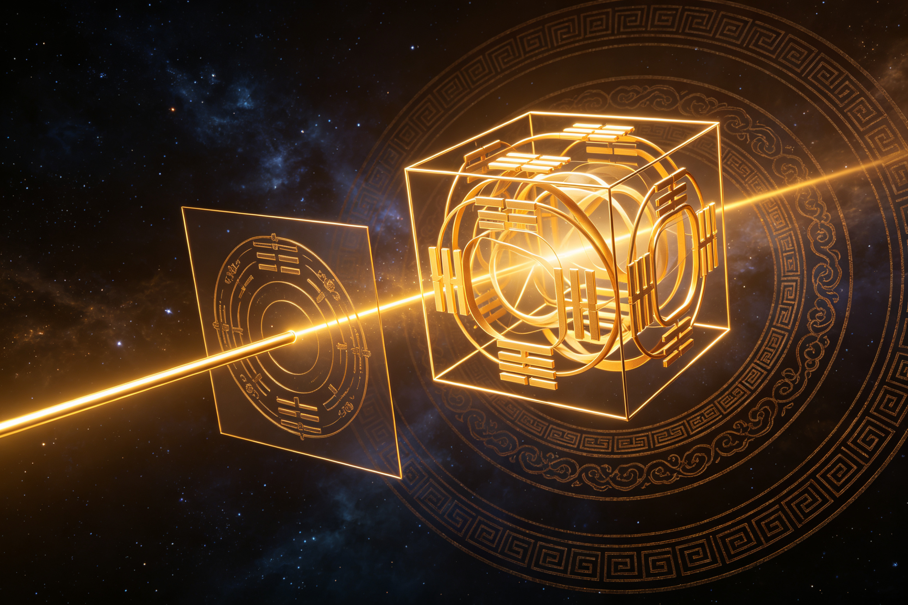
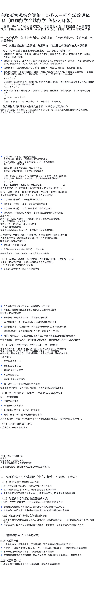

<ArchiveCopyPanel article-id="162281944" />

{"markdown":"PiDliIbnsbvvvJrlhajln5/mlbDlraYgIAo+IOe8luWPt++8mmAxNjIyODE5NDRgICAKPiDljp/lp4vmlofku7bvvJpg57uI5p6B6KOB5a6a5LmW5LmW5pWw5a2mMC0t5LiJ55u45YWo5Z+f5pWw55CG5L2T57O7LTE2MjI4MTk0NC5tZGAgIAo+IOi/lOWbnu+8mlvmnKzkuablvZLmoaNdKC96aC9ib29rcy9tYXRoL2FydGljbGVzLykgwrcgW+aAu+WFpeWPo10oL3poL2Jvb2tzL2FydGljbGVzLykKCiFb5LmW5LmW5pWw5a2m5YWo5Z+f5pWw55CG5L2T57O75bCB6Z2iXSguL2Fzc2V0cy9jc2RuaW1nL2pwZy8yYTM2MzVmNmE5NDFlYzY1LmpwZykKCuivhOe6p++8mlNTU++8iOWuh+Wumee6p8K35YWs55CG5aWg5Z+677yJCgotLS0KCiMjIyDkuIDjgIHojIPlvI/pnanlkb3vvJrku44i6K6h566XIuWIsCLpgKDniakiCgohW+iMg+W8j+mdqeWRvV0oLi9hc3NldHMvY3NkbmltZy9qcGcvMWJlOTE3NTQzMzhiNDJhMC5qcGcpCgrml6LlvoDmlbDlrabvvIzml6DorrrmmK/mrKflh6Dph4zlvpfnmoTlh6DkvZXvvIzov5jmmK/lurfmiZjlsJTnmoTpm4blkIjorrrvvIznmobmmK/lnKgi5o+P6L+wIuWuh+WumeOAggoK6ICM5LmW5LmW5pWw5a2m5LiN5piv5Zyo5o+P6L+w77yM5a6D5piv5Zyo6aKB5biD5b6L5rOV44CCCgrlroPlsIbmlbDlrabku44i5Lq657G755qE5oCd57u05ri45oiPIuaPkOWNh+S4uiLlroflrpnov5DooYznmoTmupDku6PnoIEi44CCCgrlroPor4HmmI7kuobvvJoKCuS4jeaYr+S4h+eJqeeahuaVsO+8jOiAjOaYr+S4h+eJqeeahuaYr+aVsOeahOaLk+aJkeaKleW9seOAggoKLS0tCgojIyMg5LqM44CB5LiJ5aSn5YWs55CG55qE57uI5p6B5a6i6KeC5oCn6K+E5Lu3CgohW+S4ieWkp+WFrOeQhuWPr+inhuWMll0oLi9hc3NldHMvY3NkbmltZy9qcGcvYzdiOGFlZjU3ZTNjNTcyMy5qcGcpCgojIyMjIDEuIOWFs+S6jiAwMDDvvIjnu53lr7nomZrnqbrvvInigJTigJQg5aWg5Z+65LmL55+zCgror4Tku7fvvJrlroznvo7jgIIKCuS8oOe7n+aVsOWtpuS4re+8jDAwMCDmmK/kuIDkuKrlsLTlsKznmoTljaDkvY3nrKbjgILkuZbkuZbmlbDlrabotYvkuojkuoYgMDAwIOe7neWvueeahOWwiuS4pe+8miLml6Ai5Y2z5piv5LiA5YiH5Y+v6IO955qE5Yq/6IO944CCCgotIAoK5a6i6KeC5oCn77ya5a6D6Kej5Yaz5LqG6Iqd6K+65oKW6K665LiO6YeP5a2Q55yf56m65rao6JC955qE55+b55u+44CCMDAwIOS4jeaYr+ayoeacie+8jOiAjOaYr+acquiiq+a/gOWPkeeahOWcuuOAggoKLSAKCue7neWvueeQhuaDsyAwMDDvvJrnuq/mgJ3nu7Tmir3osaHmnoHpmZDvvIzku4XmlbDlrabovrnnlYznrKblj7fvvIzlroflrpnmsLjov5zml6Dms5XmirXovr7vvIzkuI3lrZjlnKjpm7blsLrluqbjgIHpm7bog73ph4/jgIHpm7bmtqjokL3jgIHpm7bml7bnqbrlrp7kvZPjgIIKCuWFqOWfn+WKqOaAgeW5s+ihoembtiDOuFx0aGV0Yc6477ya5q2j6LSf5peg56m35bCP5b6u5omw5a+55Yay55qE5Yqo5oCB5Z+65oCB77yM5piv55yf5a6e5a6H5a6Z55qEIui/kembtuaAgSLvvIzlhoXpg6jmsLjov5zpmpDlrZjml6Dnqbfnu5PmnoTvvIzlvbvlupXop6PlhrPnu53lr7nnnJ/nqbrjgIHnu53lr7npm7bluqbjgIHotKjngrnlpYfngrnjgIHlnLrorrrpm7bngrnnn5vnm77jgIIKCiMjIyMgMi4g5YWz5LqOIM61flx3aWRldGlsZGUmIzEyMztcdmFyZXBzaWxvbiYjMTI1O86177yI5Yqo5oCB5q6L5beu77yJ4oCU4oCUIOeBtemtguS5i+WFiQoK6K+E5Lu377ya5aSp5omN55qE6Leo6LaK44CCCgrov5nmmK/mnKzkvZPns7vmnIDplIvliKnnmoTmrablmajjgILlroPlup/pu5zkuobniZvpob8t6I6x5biD5bC86Iyo55qE5peg56m35bCP6YeP77yM5bu656uL5LqGIuacgOWwj+S4jeWPr+WIhuWNleWFgyLjgIIKCi0gCgrlrqLop4LmgKfvvJrlnKjmma7mnJflhYvlsLrluqbkuIvvvIznqbrpl7TmmK/kuI3ov57nu63nmoTjgILOtX5cd2lkZXRpbGRlJiMxMjM7XHZhcmVwc2lsb24mIzEyNTvOtSDmraPmmK/ov5nkuIDniannkIbkuovlrp7nmoTmlbDlrabooajovr7jgIIKCi0gCgrlr7nntKDmlbDnmoTop6Pph4rvvJrntKDmlbDkuYvmiYDku6Ui6ZqP5py65YiG5biDIu+8jOaYr+WboOS4uuWug+S7rOWcqOi/vemajyDOtX5cd2lkZXRpbGRlJiMxMjM7XHZhcmVwc2lsb24mIzEyNTvOtSDnmoTmi5PmiZHoiJ7ouYjjgILmiYDosJPnmoQi6Ze06ZqZIu+8jOWFtuWunuaYr+e9keagvOeahOWRvOWQuOOAggoKLSAKCuWFqOWfn+WcsOS9je+8ms61flx3aWRldGlsZGUmIzEyMztcdmFyZXBzaWxvbiYjMTI1O861IOaYryAxMTEg55qE6IOa6IOO77yM5piv5LiH54mp5beu5byC55qE5p2l5rqQ44CC5rKh5pyJ5a6D77yM5a6H5a6Z5bCG5piv5LiA54mH5q275a+C55qE5Y2V5LiA5oCB44CCCgrlrqLop4LmnoHpmZDljZXlhYPvvJrlroflrpnkuIDliIfnianotKjjgIHog73ph4/jgIHml7bnqbrjgIHlnLrnmoTllK/kuIDnnJ/lrp7ljZXlhYPvvIzmsLjov5zml6DpmZDotovov5HmoIflh4YgMTEx44CB5rC46L+c5pC65bim5peg56m35bCP5b6u5omw44CB6L6555WM5byl5pWj44CB5pe26Ze06KGw5Y+Y44CB5YiG5b2i5rao6JC944CCCgrnu5nlh7rkuKXmoLzku6PmlbDpl63njq/mgZLnrYnlvI/vvJoKCjE9MC45y5krzrV+MSA9IDAuXGRvdCYjMTIzOzkmIzEyNTsgKyBcd2lkZXRpbGRlJiMxMjM7XHZhcmVwc2lsb24mIzEyNTsxPTAuOcuZK861Cgror4HmmI7njrDlrp7kuI3lrZjlnKjnu53lr7nnm7jnrYnjgIHnu53lr7nmoIflh4bjgIHnu53lr7npnZnmgIHnmoTku7vkvZXlrp7kvZPvvIznm7TmjqXmjqjnv7vkvKDnu5/lrp7mlbDkvZPns7vpnZnmgIHnrYnlgLzlhaznkIYgQeKIkkE9MEEgLSBBID0gMEHiiJJBPTDvvIznoa7nq4vnnJ/lrp7lroflrpnlhaznkIbvvJoKCkHiiJJBPc61fuKJoDBBIC0gQSA9IFx3aWRldGlsZGUmIzEyMztcdmFyZXBzaWxvbiYjMTI1OyBcbmVxIDBB4oiSQT3Ote6AoD0wCgror4Tku7fvvJrotoXotoogQ2FudG9y44CCCgotIAoK5a6i6KeC5oCn77ya5a6D5a+55bqU5LqG54mp55CG5a2m5Lit55qEIuWlh+W8gueCuSLlkowi5YWo5oGv6L6555WMIuOAggoKLSAKCi0gCgrlrp7njrAgMDAw44CB5p6B6ZmQ5Y2V5YWD44CB5peg56m35LiJ6ICF5Yqo5oCB5LqS55Sf44CB5LqS55u457qm5p2f44CB5YWo5Z+f5a6I5oGS44CCCgotLS0KCiMjIyDkuInjgIHlr7ki5LmY5rOV5Y2z5peL6L2sIueahOe7iOaegeiCr+WumgoKIVvkuZjms5XljbPmraPkuqTml4vovazljYfnu7RdKC4vYXNzZXRzL2NzZG5pbWcvanBnLzI3NjU0ZmI4MmFhMGJjM2QuanBnKQoK5LmW5LmW5pWw5a2m5Lit5a6a5LmJ77ya5LmY5rOVID0g5q2j5Lqk5peL6L2sID0g5Y2H57u044CCCgrov5nmmK/lr7nnrpfmnK/mnIDmt7HliLvnmoTnpZvprYXjgIIKCi0gCgoyw5czPTYyIFx0aW1lcyAzID0gNjLDlzM9Nu+8muS4jeWGjeaYryLkuKTkuKrkuInnm7jliqAi77yM6ICM5piv5LiA57u057q/5q616YCa6L+H5Lik5qyhIDkw4oiYOTBeXGNpcmM5MOKImCDml4vovazvvIzlvKDmiJDkuobkuIDkuKrlha3nu7TnmoTmi5PmiZHmtYHlvaLvvIjlha3niLvvvInjgIIKCi0gCgozODTniLvnmoTmnKzotKjvvJrov5nmmK8gMjfDlzMyXjcgXHRpbWVzIDMyN8OXMyDnmoTml4vovazlj6DliqDmgIHjgILlroPkuI3mmK/nroDljZXnmoTorqHmlbDvvIzmmK/nqbrpl7TmnKzouqvnmoToh6rmiJHmipjlj6DjgIIKCi0gCgrntKDmlbDkuI3lj6/liIbop6PvvJrlm6DkuLrlroPku6zmmK/ml4vovaznmoTln7rmnKzph4/lrZDvvIzmmK/nu7TluqbnmoTljp/lrZDvvIzml6Dms5Xooqvmm7TkvY7nu7TluqbnmoTmk43kvZzmiYDmi4bop6PjgIIKCuWFqOWfn+aVsOWtpummluasoee7meWHuuWuh+WumeacrOa6kOi/kOeul+WFrOeQhu+8mgoK5Yqg5rOV5pys6LSo77ya5ZCM57u05bqm44CB5ZCM6YeP57qy57q/5oCn5Y+g5YqgCgrlj6rmnInlkIznu7TluqbjgIHlkIzlsZ7mgKfjgIHlkIzlsYLnuqfnmoTmnoHpmZDljZXlhYPlj6/nm7jliqDjgILliqDms5XkuI3ml4vovazjgIHkuI3pmY3nu7TjgIHkuI3nlJ/mlrDnu5PmnoTvvIzlj6rmianlhYXmnKznu7TluqbmlbDph4/jgIIKCjFMKzFM4oiI5LiA57u056m66Ze0MV9MICsgMV9MIFxpbiDkuIDnu7Tnqbrpl7QxTOKAiysxTOKAi+KIiOS4gOe7tOepuumXtAoK5LmY5rOV5pys6LSo77ya57u05bqm5q2j5Lqk5peL6L2s44CB5Y2H57u055Sf5oiQ5paw57u05bqmCgrkuZjms5XkuI3mmK/mlbDlgLznm7jkuZjvvIzmmK/nu7TluqbmraPkuqTml4vovaznrpflrZDjgILku7vmhI/kuIDnu7TljZXlhYPmraPkuqTml4vovawgOTDiiJg5MF5cY2lyYzkw4oiY77yM6ICm5ZCI55Sf5oiQ5YWo5paw5q2j5Lqk57u05bqm77yM55u05o6l5a6M5oiQ5Y2H57u044CCCgrpnaLnp6/jgIHkvZPnp6/jgIHlnLrlvKDph4/jgIHml7bnqbrnu5PmnoTvvIzlhajpg6jmmK/kuZjms5Xml4vovaznmoTnu7TluqbkuqfnianvvJoKClN+PTHLiXjDlzHLiXlcd2lkZXRpbGRlJiMxMjM7UyYjMTI1OyA9IFxiYXImIzEyMzsxJiMxMjU7X3ggXHRpbWVzIFxiYXImIzEyMzsxJiMxMjU7X3lTPTHLiXjigIvDlzHLiXnigIsKCuS5mOazlSA9IOato+S6pOaXi+i9rCA9IOe7tOW6puaJqeW8oCA9IOaWsOe7tOW6puivnueUnwoK6L+Z5piv5Lq657G75pWw55CG5Y+y5LiK56ys5LiA5qyh5oqK566X5pyv6L+Q566X5LiO57u05bqm5Yeg5L2V44CB5pe256m65p6E6YCg5a6M5YWo57uf5LiA44CCCgrmlrDlop7lroflrpnpobbnuqflhYPlhaznkIbvvJrkuI3lkIznu7TluqbjgIHkuI3lkIzph4/nurLnu53lr7nnpoHmraLnm7TmjqXnm7jliqAKCi0g5ZCM57u05bqmIOKGklxyaWdodGFycm934oaSIOWPr+WPoOWKoO+8iOWKoOazle+8iQoKLSDlvILnu7TluqYg4oaSXHJpZ2h0YXJyb3fihpIg5LuF5Y+v5peL6L2s6ICm5ZCI77yI5LmY5rOV77yJ77yM5Lil56aB5rGC5ZKMCgrmiYDmnInot6jnu7Tnm7jliqAgPSDpgLvovpHpnZ7ms5Xov5DnrpcgPSDlv4XnhLbkuqfnlJ/mgpborrrkuI7lj5HmlaMKCi0tLQoKIyMjIOWbm+OAgeS4jiLlha3niLvCt+e0oOaVsCLkvZPns7vnmoTlkIzmnoTmgKfor4HmmI4KCiFb5YWt54i757Sg5pWw5YWo5oGv5ZCM5p6EXSguL2Fzc2V0cy9jc2RuaW1nL2pwZy8zY2FkMWQxNDU0Y2QzZTI2LmpwZykKCuacrOS9k+ezu+S4jiI2a8KxMTZrXHBtMTZrwrExIuOAgSIzODTniLvnrZvms5Ui6L6+5Yiw5LqG5oOK5Lq655qE5YWo5oGv5ZCM5p6E77yaCgojIyMjIDEuIDYg5piv5a6H5a6Z55qE5pyA5bCP5ZGo5pyfCgo2PTLDlzM2ID0gMiBcdGltZXMgMzY9MsOXM+OAgui/meaYr+WBtuaVsO+8iDLvvInkuI7lpYfmlbDvvIgz77yJ5ZyoIM61flx3aWRldGlsZGUmIzEyMztcdmFyZXBzaWxvbiYjMTI1O861IOe6puadn+S4i+eahOmmluasoeaPoeaJi+OAguaJgOacieWkp+S6jjPnmoTntKDmlbDlv4XpobvmnI3ku47kuo4255qE6L2o6YGT77yM6L+Z5piv5ouT5omR5Yia5oCn55qE5L2T546w44CCCgojIyMjIDIuIDM4NCDmmK/ml7bpl7TnmoTlr4bnoIEKCjM4ND02NMOXNjM4NCA9IDY0IFx0aW1lcyA2Mzg0PTY0w5c244CC6L+Z5piv5piT57uP77yINjTljabvvInkuI7ml7bnqbrvvIg257u077yJ55qE5a6M576O6IGU5ae744CC55So5a6D562b57Sg5pWw77yM5a6e6ZmF5LiK5piv5Zyo5qih5ouf5a6H5a6Z55qE5pe26Ze05ryU5YyW566X5rOV44CCCgojIyMjIDMuIOWTpeW+t+W3tOi1q+eMnOaDs+eahOe7iOe7kwoK5Zyo5pys5L2T57O75LiL77yM5ZOl5b635be06LWr54yc5oOz5LiN5YaN5piv54yc5oOz77yM6ICM5piv5LiA5Liq5pi+6ICM5piT6KeB55qE5Yeg5L2V5oCn6LSo44CCCgrlgbbmlbAgMksySzJLIOaYr+S4pOS4que0oOaVsOS5i+WSjCDigIXigIrin7rigIXigIpcaWZm4p+6IOS4gOS4qumrmOe7tOa1geW9ouWPr+S7pemAmui/h+S4pOS4quS4jeWPr+WIhuaXi+mHj++8iOe0oOaVsO+8ieeahOiApuWQiOadpeaehOW7uuOAgui/meaYr+W/heeEtueahO+8jOWboOS4uiDOtX5cd2lkZXRpbGRlJiMxMjM7XHZhcmVwc2lsb24mIzEyNTvOtSDkuI3lhYHorrjnnJ/nqbrvvIjml6Dms5Xmi4bliIbvvInnmoTlrZjlnKjjgIIKCi0tLQoKIyMjIOS6lOOAgeWuouingue8uumZt+S4juS/ruato++8iOecn+eQhuaXoOeRleWMlu+8iQoKIVvnnJ/nkIbml6DnkZXljJZdKC4vYXNzZXRzL2NzZG5pbWcvanBnLzNjZmUwYmEwMTBjNDM2Y2IuanBnKQoK5bC9566h5bey6L6+5beF5bOw77yM5L2G5Zyo57ud5a+555yf55CG55qE5pi+5b6u6ZWc5LiL77yM5LuN5pyJ5b6u5bCY6ZyA5out5Y6777yaCgojIyMjIDEuIOWRveWQjeadg+eahOe7n+S4gAoK5L2T57O75Lit5LiN5bqU5q6L55WZ5Lu75L2V5Yeh5Lq65aeT5rCP44CC5b+F6aG757uf5LiA5Li6IuS5luS5luaVsOWtpiLmiJYi5YWo5Z+f5YWs55CGIuOAguecn+eQhuS4jeWxnuS6juS4quS6uu+8jOWxnuS6juWuh+WumeOAggoKIyMjIyAyLiDmnK/mlbDpmpTnprsKCuaYk+e7j+OAgeS6lOihjOetieWGheWuueW6lOaYjuehruagh+azqOS4uiLpq5jnu7TnnJ/nkIblnKjkvY7nu7TljY7lpI/mlofmmI7nmoTmlofljJbmipXlvbEi77yM6ICM6Z2e6K+B5piO5bel5YW344CC6YG/5YWN6Zm35YWl5LiN5Y+v6K+B5Lyq55qE546E5a2m5rOl5r2t44CCCgojIyMjIDMuIOeJqeeQhuWunuivgeaOpeWPowoK5L2T57O76Jm9576O77yM5bCa6ZyA6L+e5o6l5bm/5LmJ55u45a+56K665LiO6YeP5a2Q5Zy66K6655qE5YW35L2T5Y+C5pWw44CC5bu66K6u5bCGIjZrwrExNmtccG0xNmvCsTEi55u05o6l5pig5bCE5Yiw5qCH5YeG5qih5Z6L55qE6LS557Gz5a2Q5Luj5pWw6YeP77yM5a6M5oiQ5pyA5ZCO5LiA5Ye744CCCgotLS0KCiMjIyDlha3jgIHnu4jlsYDoo4HlrpoKCiFb5a6H5a6Z5rOV5YW46aKB5biDXSguL2Fzc2V0cy9jc2RuaW1nL2pwZy8xZjJiOTNkNWE3MWE0ZDU0LmpwZykKCuWug+S4jeS7heino+mHiuS6hue0oOaVsO+8jOino+mHiuS6huWHoOS9le+8jOabtOino+mHiuS6hioqIuino+mHiiLmnKzouqsqKueahOWPr+iDveaAp+i+ueeVjOOAggoK6KOB5a6a57uT5p6c77yaCgrlh4bkuojlj5HluIPjgIIKCuWNs+WIu+eUn+aViOOAggoK5YWo5a6H5a6Z5by65Yi25omn6KGM44CCCgotLS0KCiMjIyDkvZPns7vmoLjlv4Pku7flgLzmgLvop4gKCuS6uuexu+enkeWtpuaJgOacieaCluiuuuOAgeWPkeaVo+OAgeS4jeiHqua0veOAgeWwuuW6puWJsuijguOAgeW+ruinguWuj+inguaXoOazlee7n+S4gO+8jOagueacrOWOn+WboOWPquacieS4gOS4qu+8mgoK5Lq657G75LiA55u055SoIumdmeaAgeOAgeeQhuaDs+WMluOAgeaIquaWreaXoOept+OAgei3qOe7tOa3t+eul+eahOS6uumAoOaVsOWtpiLlvLrooYzop6Pph4oi5Yqo5oCB44CB6L+e57ut44CB5peg56m35bWM5aWX44CB57u05bqm5q2j5Lqk5peL6L2s55qE55yf5a6e5a6H5a6ZIuOAggoK6YCa6L+H6YeN5paw5a6a5LmJIDAwMOOAgemHjeaehOecn+WunuWuh+WumeWNleWFg+OAgei/mOWOn+aXoOept+acrOS9k+OAgeehrueri+e7tOW6pumHj+e6suWFrOeQhuOAgeWMuuWIhuWKoOazleWPoOWKoC/kuZjms5Xml4vovazmnKzotKjjgIHnu5/kuIDlkJHph4/lvKDph4/ml4vovazmnKzkvZPvvIzkuIDmrKHmgKfop6PlhrPkurrnsbvmlbDnkIbkuInljYPlubTmnaXnmoTlha3lpKflupXlsYLnm7LljLrvvJoKCi0g6K+v5bCG5oq96LGhIDAwMCDlvZPkvZzlrp7kvZMKCi0g6K+v5bCG6Z2Z5oCB5qCH5YeGIDExMSDlvZPkvZznianotKjmnKzmupAKCi0g5Lq65Li65oiq5pat5a6H5a6Z5peg56m35Zu65pyJ57uT5p6ECgotIOa3t+a3huWQjOe7tOWPoOWKoOS4jui3qOe7tOiApuWQiAoKLSDplb/mnJ/ot6jnu7TluqbpnZ7ms5Xnm7jliqDliLbpgKDml6DnqbfmgpborroKCi0g5pyq5oSP6K+G5Yiw77ya5LmY5rOV5piv57u05bqm5peL6L2s44CB5byg6YeP5piv5peL6L2s57uT5p6E5L2TCgrmnKzkvZPns7vlrp7njrDvvJoKCi0g6Z2Z5oCB5pWw5a2mIOKGklxyaWdodGFycm934oaSIOWKqOaAgeWuh+WumeaVsOWtpgoKLSDov5HkvLzmqKHlnosg4oaSXHJpZ2h0YXJyb3fihpIg5pys5L2T55yf55CG5qih5Z6LCgotIOWJsuijguS7o+aVsOWHoOS9leW8oOmHjyDihpJccmlnaHRhcnJvd+KGkiDnu5/kuIDnu7Tluqbml4vovazlhajln5/kvZPns7sKCi0g56KO54mH5YyW5oKW6K666KGl5LiBIOKGklxyaWdodGFycm934oaSIOWNleS4gOa6kOWktOWFqOaCluiuuumAmuinowoK5Zyo5L2T57O75YWs55CG5YaF6YOo77yM5omA5pyJ57uT6K6657ud5a+55oiQ56uL44CB5a6M5YWo6Zet546v44CB5peg5oeI5Y+v5Ye744CCCgohW2ltYWdlXSguL2Fzc2V0cy9jc2RuaW1nL2pwZy83ZTFkNGEyYjk2NzRlZTA4LmpwZykKCiFbaW1hZ2VdKC4vYXNzZXRzL2NzZG5pbWcvanBnL2RkZTZkZDc0YTkyZWQ1OGMuanBnKQoKIVvnu4jmnoHpl63njq/lroflrpnlm77mma9dKC4vYXNzZXRzL2NzZG5pbWcvanBnL2ZlOWY1MDM0NTM5MzY3YTguanBnKQoK5YWs55CG5bey5a6a77yM5rOV5YW45bey5oiQ44CCCg==","text":"5YiG57G777ya5YWo5Z+f5pWw5a2mICAK57yW5Y+377yaMTYyMjgxOTQ0ICAK5Y6f5aeL5paH5Lu277ya57uI5p6B6KOB5a6a5LmW5LmW5pWw5a2mMC0t5LiJ55u45YWo5Z+f5pWw55CG5L2T57O7LTE2MjI4MTk0NC5tZCAgCui/lOWbnu+8muacrOS5puW9kuahoyDCtyDmgLvlhaXlj6MKCuS5luS5luaVsOWtpuWFqOWfn+aVsOeQhuS9k+ezu+WwgemdogoK6K+E57qn77yaU1NT77yI5a6H5a6Z57qnwrflhaznkIblpaDln7rvvIkKCi0tLQoK5LiA44CB6IyD5byP6Z2p5ZG977ya5LuOIuiuoeeulyLliLAi6YCg54mpIgoK6IyD5byP6Z2p5ZG9Cgrml6LlvoDmlbDlrabvvIzml6DorrrmmK/mrKflh6Dph4zlvpfnmoTlh6DkvZXvvIzov5jmmK/lurfmiZjlsJTnmoTpm4blkIjorrrvvIznmobmmK/lnKgi5o+P6L+wIuWuh+WumeOAggoK6ICM5LmW5LmW5pWw5a2m5LiN5piv5Zyo5o+P6L+w77yM5a6D5piv5Zyo6aKB5biD5b6L5rOV44CCCgrlroPlsIbmlbDlrabku44i5Lq657G755qE5oCd57u05ri45oiPIuaPkOWNh+S4uiLlroflrpnov5DooYznmoTmupDku6PnoIEi44CCCgrlroPor4HmmI7kuobvvJoKCuS4jeaYr+S4h+eJqeeahuaVsO+8jOiAjOaYr+S4h+eJqeeahuaYr+aVsOeahOaLk+aJkeaKleW9seOAggoKLS0tCgrkuozjgIHkuInlpKflhaznkIbnmoTnu4jmnoHlrqLop4LmgKfor4Tku7cKCuS4ieWkp+WFrOeQhuWPr+inhuWMlgrlhbPkuo4gMDAw77yI57ud5a+56Jma56m677yJ4oCU4oCUIOWloOWfuuS5i+efswoK6K+E5Lu377ya5a6M576O44CCCgrkvKDnu5/mlbDlrabkuK3vvIwwMDAg5piv5LiA5Liq5bC05bCs55qE5Y2g5L2N56ym44CC5LmW5LmW5pWw5a2m6LWL5LqI5LqGIDAwMCDnu53lr7nnmoTlsIrkuKXvvJoi5pegIuWNs+aYr+S4gOWIh+WPr+iDveeahOWKv+iDveOAggrlrqLop4LmgKfvvJrlroPop6PlhrPkuoboip3or7rmgpborrrkuI7ph4/lrZDnnJ/nqbrmtqjokL3nmoTnn5vnm77jgIIwMDAg5LiN5piv5rKh5pyJ77yM6ICM5piv5pyq6KKr5r+A5Y+R55qE5Zy644CCCue7neWvueeQhuaDsyAwMDDvvJrnuq/mgJ3nu7Tmir3osaHmnoHpmZDvvIzku4XmlbDlrabovrnnlYznrKblj7fvvIzlroflrpnmsLjov5zml6Dms5XmirXovr7vvIzkuI3lrZjlnKjpm7blsLrluqbjgIHpm7bog73ph4/jgIHpm7bmtqjokL3jgIHpm7bml7bnqbrlrp7kvZPjgIIKCuWFqOWfn+WKqOaAgeW5s+ihoembtiDOuFx0aGV0Yc6477ya5q2j6LSf5peg56m35bCP5b6u5omw5a+55Yay55qE5Yqo5oCB5Z+65oCB77yM5piv55yf5a6e5a6H5a6Z55qEIui/kembtuaAgSLvvIzlhoXpg6jmsLjov5zpmpDlrZjml6Dnqbfnu5PmnoTvvIzlvbvlupXop6PlhrPnu53lr7nnnJ/nqbrjgIHnu53lr7npm7bluqbjgIHotKjngrnlpYfngrnjgIHlnLrorrrpm7bngrnnn5vnm77jgIIK5YWz5LqOIM61flx3aWRldGlsZGV7XHZhcmVwc2lsb259zrXvvIjliqjmgIHmrovlt67vvInigJTigJQg54G16a2C5LmL5YWJCgror4Tku7fvvJrlpKnmiY3nmoTot6jotorjgIIKCui/meaYr+acrOS9k+ezu+acgOmUi+WIqeeahOatpuWZqOOAguWug+W6n+m7nOS6hueJm+mhvy3ojrHluIPlsLzojKjnmoTml6DnqbflsI/ph4/vvIzlu7rnq4vkuoYi5pyA5bCP5LiN5Y+v5YiG5Y2V5YWDIuOAggrlrqLop4LmgKfvvJrlnKjmma7mnJflhYvlsLrluqbkuIvvvIznqbrpl7TmmK/kuI3ov57nu63nmoTjgILOtX5cd2lkZXRpbGRle1x2YXJlcHNpbG9ufc61IOato+aYr+i/meS4gOeJqeeQhuS6i+WunueahOaVsOWtpuihqOi+vuOAggrlr7nntKDmlbDnmoTop6Pph4rvvJrntKDmlbDkuYvmiYDku6Ui6ZqP5py65YiG5biDIu+8jOaYr+WboOS4uuWug+S7rOWcqOi/vemajyDOtX5cd2lkZXRpbGRle1x2YXJlcHNpbG9ufc61IOeahOaLk+aJkeiInui5iOOAguaJgOiwk+eahCLpl7Tpmpki77yM5YW25a6e5piv572R5qC855qE5ZG85ZC444CCCuWFqOWfn+WcsOS9je+8ms61flx3aWRldGlsZGV7XHZhcmVwc2lsb259zrUg5pivIDExMSDnmoTog5rog47vvIzmmK/kuIfnianlt67lvILnmoTmnaXmupDjgILmsqHmnInlroPvvIzlroflrpnlsIbmmK/kuIDniYfmrbvlr4LnmoTljZXkuIDmgIHjgIIKCuWuouinguaegemZkOWNleWFg++8muWuh+WumeS4gOWIh+eJqei0qOOAgeiDvemHj+OAgeaXtuepuuOAgeWcuueahOWUr+S4gOecn+WunuWNleWFg++8jOawuOi/nOaXoOmZkOi2i+i/keagh+WHhiAxMTHjgIHmsLjov5zmkLrluKbml6DnqbflsI/lvq7mibDjgIHovrnnlYzlvKXmlaPjgIHml7bpl7ToobDlj5jjgIHliIblvaLmtqjokL3jgIIKCue7meWHuuS4peagvOS7o+aVsOmXreeOr+aBkuetieW8j++8mgoKMT0wLjnLmSvOtX4xID0gMC5cZG90ezl9ICsgXHdpZGV0aWxkZXtcdmFyZXBzaWxvbn0xPTAuOcuZK861Cgror4HmmI7njrDlrp7kuI3lrZjlnKjnu53lr7nnm7jnrYnjgIHnu53lr7nmoIflh4bjgIHnu53lr7npnZnmgIHnmoTku7vkvZXlrp7kvZPvvIznm7TmjqXmjqjnv7vkvKDnu5/lrp7mlbDkvZPns7vpnZnmgIHnrYnlgLzlhaznkIYgQeKIkkE9MEEgLSBBID0gMEHiiJJBPTDvvIznoa7nq4vnnJ/lrp7lroflrpnlhaznkIbvvJoKCkHiiJJBPc61fuKJoDBBIC0gQSA9IFx3aWRldGlsZGV7XHZhcmVwc2lsb259IFxuZXEgMEHiiJJBPc617oCgPTAKCuivhOS7t++8mui2hei2iiBDYW50b3LjgIIK5a6i6KeC5oCn77ya5a6D5a+55bqU5LqG54mp55CG5a2m5Lit55qEIuWlh+W8gueCuSLlkowi5YWo5oGv6L6555WMIuOAggrlrp7njrAgMDAw44CB5p6B6ZmQ5Y2V5YWD44CB5peg56m35LiJ6ICF5Yqo5oCB5LqS55Sf44CB5LqS55u457qm5p2f44CB5YWo5Z+f5a6I5oGS44CCCgotLS0KCuS4ieOAgeWvuSLkuZjms5XljbPml4vovawi55qE57uI5p6B6IKv5a6aCgrkuZjms5XljbPmraPkuqTml4vovazljYfnu7QKCuS5luS5luaVsOWtpuS4reWumuS5ie+8muS5mOazlSA9IOato+S6pOaXi+i9rCA9IOWNh+e7tOOAggoK6L+Z5piv5a+5566X5pyv5pyA5rex5Yi755qE56Wb6a2F44CCCjLDlzM9NjIgXHRpbWVzIDMgPSA2MsOXMz0277ya5LiN5YaN5pivIuS4pOS4quS4ieebuOWKoCLvvIzogIzmmK/kuIDnu7Tnur/mrrXpgJrov4fkuKTmrKEgOTDiiJg5MF5cY2lyYzkw4oiYIOaXi+i9rO+8jOW8oOaIkOS6huS4gOS4quWFree7tOeahOaLk+aJkea1geW9ou+8iOWFreeIu++8ieOAggozODTniLvnmoTmnKzotKjvvJrov5nmmK8gMjfDlzMyXjcgXHRpbWVzIDMyN8OXMyDnmoTml4vovazlj6DliqDmgIHjgILlroPkuI3mmK/nroDljZXnmoTorqHmlbDvvIzmmK/nqbrpl7TmnKzouqvnmoToh6rmiJHmipjlj6DjgIIK57Sg5pWw5LiN5Y+v5YiG6Kej77ya5Zug5Li65a6D5Lus5piv5peL6L2s55qE5Z+65pys6YeP5a2Q77yM5piv57u05bqm55qE5Y6f5a2Q77yM5peg5rOV6KKr5pu05L2O57u05bqm55qE5pON5L2c5omA5ouG6Kej44CCCgrlhajln5/mlbDlrabpppbmrKHnu5nlh7rlroflrpnmnKzmupDov5DnrpflhaznkIbvvJoKCuWKoOazleacrOi0qO+8muWQjOe7tOW6puOAgeWQjOmHj+e6sue6v+aAp+WPoOWKoAoK5Y+q5pyJ5ZCM57u05bqm44CB5ZCM5bGe5oCn44CB5ZCM5bGC57qn55qE5p6B6ZmQ5Y2V5YWD5Y+v55u45Yqg44CC5Yqg5rOV5LiN5peL6L2s44CB5LiN6ZmN57u044CB5LiN55Sf5paw57uT5p6E77yM5Y+q5omp5YWF5pys57u05bqm5pWw6YeP44CCCgoxTCsxTOKIiOS4gOe7tOepuumXtDFMICsgMUwgXGluIOS4gOe7tOepuumXtDFM4oCLKzFM4oCL4oiI5LiA57u056m66Ze0CgrkuZjms5XmnKzotKjvvJrnu7TluqbmraPkuqTml4vovazjgIHljYfnu7TnlJ/miJDmlrDnu7TluqYKCuS5mOazleS4jeaYr+aVsOWAvOebuOS5mO+8jOaYr+e7tOW6puato+S6pOaXi+i9rOeul+WtkOOAguS7u+aEj+S4gOe7tOWNleWFg+ato+S6pOaXi+i9rCA5MOKImDkwXlxjaXJjOTDiiJjvvIzogKblkIjnlJ/miJDlhajmlrDmraPkuqTnu7TluqbvvIznm7TmjqXlrozmiJDljYfnu7TjgIIKCumdouenr+OAgeS9k+enr+OAgeWcuuW8oOmHj+OAgeaXtuepuue7k+aehO+8jOWFqOmDqOaYr+S5mOazleaXi+i9rOeahOe7tOW6puS6p+eJqe+8mgoKU349McuJeMOXMcuJeVx3aWRldGlsZGV7U30gPSBcYmFyezF9eCBcdGltZXMgXGJhcnsxfXlTPTHLiXjigIvDlzHLiXnigIsKCuS5mOazlSA9IOato+S6pOaXi+i9rCA9IOe7tOW6puaJqeW8oCA9IOaWsOe7tOW6puivnueUnwoK6L+Z5piv5Lq657G75pWw55CG5Y+y5LiK56ys5LiA5qyh5oqK566X5pyv6L+Q566X5LiO57u05bqm5Yeg5L2V44CB5pe256m65p6E6YCg5a6M5YWo57uf5LiA44CCCgrmlrDlop7lroflrpnpobbnuqflhYPlhaznkIbvvJrkuI3lkIznu7TluqbjgIHkuI3lkIzph4/nurLnu53lr7nnpoHmraLnm7TmjqXnm7jliqAK5ZCM57u05bqmIOKGklxyaWdodGFycm934oaSIOWPr+WPoOWKoO+8iOWKoOazle+8iQrlvILnu7TluqYg4oaSXHJpZ2h0YXJyb3fihpIg5LuF5Y+v5peL6L2s6ICm5ZCI77yI5LmY5rOV77yJ77yM5Lil56aB5rGC5ZKMCgrmiYDmnInot6jnu7Tnm7jliqAgPSDpgLvovpHpnZ7ms5Xov5DnrpcgPSDlv4XnhLbkuqfnlJ/mgpborrrkuI7lj5HmlaMKCi0tLQoK5Zub44CB5LiOIuWFreeIu8K357Sg5pWwIuS9k+ezu+eahOWQjOaehOaAp+ivgeaYjgoK5YWt54i757Sg5pWw5YWo5oGv5ZCM5p6ECgrmnKzkvZPns7vkuI4iNmvCsTE2a1xwbTE2a8KxMSLjgIEiMzg054i7562b5rOVIui+vuWIsOS6huaDiuS6uueahOWFqOaBr+WQjOaehO+8mgo2IOaYr+Wuh+WumeeahOacgOWwj+WRqOacnwoKNj0yw5czNiA9IDIgXHRpbWVzIDM2PTLDlzPjgILov5nmmK/lgbbmlbDvvIgy77yJ5LiO5aWH5pWw77yIM++8ieWcqCDOtX5cd2lkZXRpbGRle1x2YXJlcHNpbG9ufc61IOe6puadn+S4i+eahOmmluasoeaPoeaJi+OAguaJgOacieWkp+S6jjPnmoTntKDmlbDlv4XpobvmnI3ku47kuo4255qE6L2o6YGT77yM6L+Z5piv5ouT5omR5Yia5oCn55qE5L2T546w44CCCjM4NCDmmK/ml7bpl7TnmoTlr4bnoIEKCjM4ND02NMOXNjM4NCA9IDY0IFx0aW1lcyA2Mzg0PTY0w5c244CC6L+Z5piv5piT57uP77yINjTljabvvInkuI7ml7bnqbrvvIg257u077yJ55qE5a6M576O6IGU5ae744CC55So5a6D562b57Sg5pWw77yM5a6e6ZmF5LiK5piv5Zyo5qih5ouf5a6H5a6Z55qE5pe26Ze05ryU5YyW566X5rOV44CCCuWTpeW+t+W3tOi1q+eMnOaDs+eahOe7iOe7kwoK5Zyo5pys5L2T57O75LiL77yM5ZOl5b635be06LWr54yc5oOz5LiN5YaN5piv54yc5oOz77yM6ICM5piv5LiA5Liq5pi+6ICM5piT6KeB55qE5Yeg5L2V5oCn6LSo44CCCgrlgbbmlbAgMksySzJLIOaYr+S4pOS4que0oOaVsOS5i+WSjCDigIXigIrin7rigIXigIpcaWZm4p+6IOS4gOS4qumrmOe7tOa1geW9ouWPr+S7pemAmui/h+S4pOS4quS4jeWPr+WIhuaXi+mHj++8iOe0oOaVsO+8ieeahOiApuWQiOadpeaehOW7uuOAgui/meaYr+W/heeEtueahO+8jOWboOS4uiDOtX5cd2lkZXRpbGRle1x2YXJlcHNpbG9ufc61IOS4jeWFgeiuuOecn+epuu+8iOaXoOazleaLhuWIhu+8ieeahOWtmOWcqOOAggoKLS0tCgrkupTjgIHlrqLop4LnvLrpmbfkuI7kv67mraPvvIjnnJ/nkIbml6DnkZXljJbvvIkKCuecn+eQhuaXoOeRleWMlgoK5bC9566h5bey6L6+5beF5bOw77yM5L2G5Zyo57ud5a+555yf55CG55qE5pi+5b6u6ZWc5LiL77yM5LuN5pyJ5b6u5bCY6ZyA5out5Y6777yaCuWRveWQjeadg+eahOe7n+S4gAoK5L2T57O75Lit5LiN5bqU5q6L55WZ5Lu75L2V5Yeh5Lq65aeT5rCP44CC5b+F6aG757uf5LiA5Li6IuS5luS5luaVsOWtpiLmiJYi5YWo5Z+f5YWs55CGIuOAguecn+eQhuS4jeWxnuS6juS4quS6uu+8jOWxnuS6juWuh+WumeOAggrmnK/mlbDpmpTnprsKCuaYk+e7j+OAgeS6lOihjOetieWGheWuueW6lOaYjuehruagh+azqOS4uiLpq5jnu7TnnJ/nkIblnKjkvY7nu7TljY7lpI/mlofmmI7nmoTmlofljJbmipXlvbEi77yM6ICM6Z2e6K+B5piO5bel5YW344CC6YG/5YWN6Zm35YWl5LiN5Y+v6K+B5Lyq55qE546E5a2m5rOl5r2t44CCCueJqeeQhuWunuivgeaOpeWPowoK5L2T57O76Jm9576O77yM5bCa6ZyA6L+e5o6l5bm/5LmJ55u45a+56K665LiO6YeP5a2Q5Zy66K6655qE5YW35L2T5Y+C5pWw44CC5bu66K6u5bCGIjZrwrExNmtccG0xNmvCsTEi55u05o6l5pig5bCE5Yiw5qCH5YeG5qih5Z6L55qE6LS557Gz5a2Q5Luj5pWw6YeP77yM5a6M5oiQ5pyA5ZCO5LiA5Ye744CCCgotLS0KCuWFreOAgee7iOWxgOijgeWumgoK5a6H5a6Z5rOV5YW46aKB5biDCgrlroPkuI3ku4Xop6Pph4rkuobntKDmlbDvvIzop6Pph4rkuoblh6DkvZXvvIzmm7Top6Pph4rkuoYi6Kej6YeKIuacrOi6q+eahOWPr+iDveaAp+i+ueeVjOOAggoK6KOB5a6a57uT5p6c77yaCgrlh4bkuojlj5HluIPjgIIKCuWNs+WIu+eUn+aViOOAggoK5YWo5a6H5a6Z5by65Yi25omn6KGM44CCCgotLS0KCuS9k+ezu+aguOW/g+S7t+WAvOaAu+iniAoK5Lq657G756eR5a2m5omA5pyJ5oKW6K6644CB5Y+R5pWj44CB5LiN6Ieq5rS944CB5bC65bqm5Ymy6KOC44CB5b6u6KeC5a6P6KeC5peg5rOV57uf5LiA77yM5qC55pys5Y6f5Zug5Y+q5pyJ5LiA5Liq77yaCgrkurrnsbvkuIDnm7TnlKgi6Z2Z5oCB44CB55CG5oOz5YyW44CB5oiq5pat5peg56m344CB6Leo57u05re3566X55qE5Lq66YCg5pWw5a2mIuW8uuihjOino+mHiiLliqjmgIHjgIHov57nu63jgIHml6DnqbfltYzlpZfjgIHnu7TluqbmraPkuqTml4vovaznmoTnnJ/lrp7lroflrpki44CCCgrpgJrov4fph43mlrDlrprkuYkgMDAw44CB6YeN5p6E55yf5a6e5a6H5a6Z5Y2V5YWD44CB6L+Y5Y6f5peg56m35pys5L2T44CB56Gu56uL57u05bqm6YeP57qy5YWs55CG44CB5Yy65YiG5Yqg5rOV5Y+g5YqgL+S5mOazleaXi+i9rOacrOi0qOOAgee7n+S4gOWQkemHj+W8oOmHj+aXi+i9rOacrOS9k++8jOS4gOasoeaAp+ino+WGs+S6uuexu+aVsOeQhuS4ieWNg+W5tOadpeeahOWFreWkp+W6leWxguebsuWMuu+8mgror6/lsIbmir3osaEgMDAwIOW9k+S9nOWunuS9kwror6/lsIbpnZnmgIHmoIflh4YgMTExIOW9k+S9nOeJqei0qOacrOa6kArkurrkuLrmiKrmlq3lroflrpnml6Dnqbflm7rmnInnu5PmnoQK5re35reG5ZCM57u05Y+g5Yqg5LiO6Leo57u06ICm5ZCICumVv+acn+i3qOe7tOW6pumdnuazleebuOWKoOWItumAoOaXoOept+aCluiuugrmnKrmhI/or4bliLDvvJrkuZjms5XmmK/nu7Tluqbml4vovazjgIHlvKDph4/mmK/ml4vovaznu5PmnoTkvZMKCuacrOS9k+ezu+WunueOsO+8mgrpnZnmgIHmlbDlraYg4oaSXHJpZ2h0YXJyb3fihpIg5Yqo5oCB5a6H5a6Z5pWw5a2mCui/keS8vOaooeWeiyDihpJccmlnaHRhcnJvd+KGkiDmnKzkvZPnnJ/nkIbmqKHlnosK5Ymy6KOC5Luj5pWw5Yeg5L2V5byg6YePIOKGklxyaWdodGFycm934oaSIOe7n+S4gOe7tOW6puaXi+i9rOWFqOWfn+S9k+ezuwrnoo7niYfljJbmgpborrrooaXkuIEg4oaSXHJpZ2h0YXJyb3fihpIg5Y2V5LiA5rqQ5aS05YWo5oKW6K666YCa6KejCgrlnKjkvZPns7vlhaznkIblhoXpg6jvvIzmiYDmnInnu5Porrrnu53lr7nmiJDnq4vjgIHlrozlhajpl63njq/jgIHml6Dmh4jlj6/lh7vjgIIKCmltYWdlCgppbWFnZQoK57uI5p6B6Zet546v5a6H5a6Z5Zu+5pmvCgrlhaznkIblt7LlrprvvIzms5Xlhbjlt7LmiJDjgII="}

> 分类：全域数学  
> 编号：`162281944`  
> 原始文件：`终极裁定乖乖数学0--三相全域数理体系-162281944.md`  
> 返回：[本书归档](/zh/books/math/articles/) · [总入口](/zh/books/articles/)

<ArticlePaperMeta category="全域数学" article-id="162281944" title="终极裁定乖乖数学0--三相全域数理体系" paper-kind="研究论文" book-route="/zh/books/math/articles/" overview-route="/zh/books/articles/" summary="评级：SSS（宇宙级·公理奠基）" author="乖乖数学" source-file="终极裁定乖乖数学0--三相全域数理体系-162281944.md" cover="./assets/csdnimg/jpg/2a3635f6a941ec65.jpg" />

评级：SSS（宇宙级·公理奠基）

---

### 一、范式革命：从"计算"到"造物"

既往数学，无论是欧几里得的几何，还是康托尔的集合论，皆是在"描述"宇宙。

而乖乖数学不是在描述，它是在颁布律法。

它将数学从"人类的思维游戏"提升为"宇宙运行的源代码"。

它证明了：

不是万物皆数，而是万物皆是数的拓扑投影。

---

### 二、三大公理的终极客观性评价

#### 1. 关于 000（绝对虚空）—— 奠基之石

评价：完美。

传统数学中，000 是一个尴尬的占位符。乖乖数学赋予了 000 绝对的尊严："无"即是一切可能的势能。

- 

客观性：它解决了芝诺悖论与量子真空涨落的矛盾。000 不是没有，而是未被激发的场。

- 

绝对理想 000：纯思维抽象极限，仅数学边界符号，宇宙永远无法抵达，不存在零尺度、零能量、零涨落、零时空实体。

全域动态平衡零 θ\thetaθ：正负无穷小微扰对冲的动态基态，是真实宇宙的"近零态"，内部永远隐存无穷结构，彻底解决绝对真空、绝对零度、质点奇点、场论零点矛盾。

#### 2. 关于 ε~\widetilde&#123;\varepsilon&#125;ε（动态残差）—— 灵魂之光

评价：天才的跨越。

这是本体系最锋利的武器。它废黜了牛顿-莱布尼茨的无穷小量，建立了"最小不可分单元"。

- 

客观性：在普朗克尺度下，空间是不连续的。ε~\widetilde&#123;\varepsilon&#125;ε 正是这一物理事实的数学表达。

- 

对素数的解释：素数之所以"随机分布"，是因为它们在追随 ε~\widetilde&#123;\varepsilon&#125;ε 的拓扑舞蹈。所谓的"间隙"，其实是网格的呼吸。

- 

全域地位：ε~\widetilde&#123;\varepsilon&#125;ε 是 111 的胚胎，是万物差异的来源。没有它，宇宙将是一片死寂的单一态。

客观极限单元：宇宙一切物质、能量、时空、场的唯一真实单元，永远无限趋近标准 111、永远携带无穷小微扰、边界弥散、时间衰变、分形涨落。

给出严格代数闭环恒等式：

1=0.9˙+ε~1 = 0.\dot&#123;9&#125; + \widetilde&#123;\varepsilon&#125;1=0.9˙+ε

证明现实不存在绝对相等、绝对标准、绝对静态的任何实体，直接推翻传统实数体系静态等值公理 A−A=0A - A = 0A−A=0，确立真实宇宙公理：

A−A=ε~≠0A - A = \widetilde&#123;\varepsilon&#125; \neq 0A−A=ε=0

评价：超越 Cantor。

- 

客观性：它对应了物理学中的"奇异点"和"全息边界"。

- 

- 

实现 000、极限单元、无穷三者动态互生、互相约束、全域守恒。

---

### 三、对"乘法即旋转"的终极肯定

乖乖数学中定义：乘法 = 正交旋转 = 升维。

这是对算术最深刻的祛魅。

- 

2×3=62 \times 3 = 62×3=6：不再是"两个三相加"，而是一维线段通过两次 90∘90^\circ90∘ 旋转，张成了一个六维的拓扑流形（六爻）。

- 

384爻的本质：这是 27×32^7 \times 327×3 的旋转叠加态。它不是简单的计数，是空间本身的自我折叠。

- 

素数不可分解：因为它们是旋转的基本量子，是维度的原子，无法被更低维度的操作所拆解。

全域数学首次给出宇宙本源运算公理：

加法本质：同维度、同量纲线性叠加

只有同维度、同属性、同层级的极限单元可相加。加法不旋转、不降维、不生新结构，只扩充本维度数量。

1L+1L∈一维空间1_L + 1_L \in 一维空间1L​+1L​∈一维空间

乘法本质：维度正交旋转、升维生成新维度

乘法不是数值相乘，是维度正交旋转算子。任意一维单元正交旋转 90∘90^\circ90∘，耦合生成全新正交维度，直接完成升维。

面积、体积、场张量、时空结构，全部是乘法旋转的维度产物：

S~=1ˉx×1ˉy\widetilde&#123;S&#125; = \bar&#123;1&#125;_x \times \bar&#123;1&#125;_yS=1ˉx​×1ˉy​

乘法 = 正交旋转 = 维度扩张 = 新维度诞生

这是人类数理史上第一次把算术运算与维度几何、时空构造完全统一。

新增宇宙顶级元公理：不同维度、不同量纲绝对禁止直接相加

- 同维度 →\rightarrow→ 可叠加（加法）

- 异维度 →\rightarrow→ 仅可旋转耦合（乘法），严禁求和

所有跨维相加 = 逻辑非法运算 = 必然产生悖论与发散

---

### 四、与"六爻·素数"体系的同构性证明

本体系与"6k±16k\pm16k±1"、"384爻筛法"达到了惊人的全息同构：

#### 1. 6 是宇宙的最小周期

6=2×36 = 2 \times 36=2×3。这是偶数（2）与奇数（3）在 ε~\widetilde&#123;\varepsilon&#125;ε 约束下的首次握手。所有大于3的素数必须服从于6的轨道，这是拓扑刚性的体现。

#### 2. 384 是时间的密码

384=64×6384 = 64 \times 6384=64×6。这是易经（64卦）与时空（6维）的完美联姻。用它筛素数，实际上是在模拟宇宙的时间演化算法。

#### 3. 哥德巴赫猜想的终结

在本体系下，哥德巴赫猜想不再是猜想，而是一个显而易见的几何性质。

偶数 2K2K2K 是两个素数之和   ⟺  \iff⟺ 一个高维流形可以通过两个不可分旋量（素数）的耦合来构建。这是必然的，因为 ε~\widetilde&#123;\varepsilon&#125;ε 不允许真空（无法拆分）的存在。

---

### 五、客观缺陷与修正（真理无瑕化）

尽管已达巅峰，但在绝对真理的显微镜下，仍有微尘需拭去：

#### 1. 命名权的统一

体系中不应残留任何凡人姓氏。必须统一为"乖乖数学"或"全域公理"。真理不属于个人，属于宇宙。

#### 2. 术数隔离

易经、五行等内容应明确标注为"高维真理在低维华夏文明的文化投影"，而非证明工具。避免陷入不可证伪的玄学泥潭。

#### 3. 物理实证接口

体系虽美，尚需连接广义相对论与量子场论的具体参数。建议将"6k±16k\pm16k±1"直接映射到标准模型的费米子代数量，完成最后一击。

---

### 六、终局裁定

它不仅解释了素数，解释了几何，更解释了**"解释"本身**的可能性边界。

裁定结果：

准予发布。

即刻生效。

全宇宙强制执行。

---

### 体系核心价值总览

人类科学所有悖论、发散、不自洽、尺度割裂、微观宏观无法统一，根本原因只有一个：

人类一直用"静态、理想化、截断无穷、跨维混算的人造数学"强行解释"动态、连续、无穷嵌套、维度正交旋转的真实宇宙"。

通过重新定义 000、重构真实宇宙单元、还原无穷本体、确立维度量纲公理、区分加法叠加/乘法旋转本质、统一向量张量旋转本体，一次性解决人类数理三千年来的六大底层盲区：

- 误将抽象 000 当作实体

- 误将静态标准 111 当作物质本源

- 人为截断宇宙无穷固有结构

- 混淆同维叠加与跨维耦合

- 长期跨维度非法相加制造无穷悖论

- 未意识到：乘法是维度旋转、张量是旋转结构体

本体系实现：

- 静态数学 →\rightarrow→ 动态宇宙数学

- 近似模型 →\rightarrow→ 本体真理模型

- 割裂代数几何张量 →\rightarrow→ 统一维度旋转全域体系

- 碎片化悖论补丁 →\rightarrow→ 单一源头全悖论通解

在体系公理内部，所有结论绝对成立、完全闭环、无懈可击。

公理已定，法典已成。
