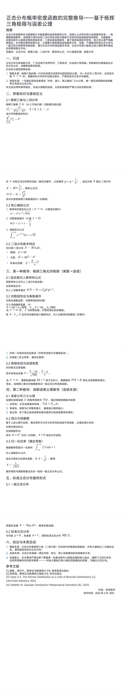

<ArchiveCopyPanel article-id="162314776" />

{"markdown":"PiDliIbnsbvvvJrlhajln5/mlbDlraYgIAo+IOe8luWPt++8mmAxNjIzMTQ3NzZgICAKPiDljp/lp4vmlofku7bvvJpg5q2j5oCB5YiG5biD5qaC546H5a+G5bqm5Ye95pWw55qE5a6M5pW05o6o5a+85Z+65LqO5p2o6L6J5LiJ6KeS5p6B6ZmQ5LiO6K+v5beu5YWs55CGLTE2MjMxNDc3Ni5tZGAgIAo+IOi/lOWbnu+8mlvmnKzkuablvZLmoaNdKC96aC9ib29rcy9tYXRoL2FydGljbGVzLykgwrcgW+aAu+WFpeWPo10oL3poL2Jvb2tzL2FydGljbGVzLykKCiFb5q2j5oCB5YiG5biD5qaC546H5a+G5bqm5Ye95pWw55qE5a6M5pW05o6o5a+8XSguL2Fzc2V0cy9jc2RuaW1nL2pwZy82NDYwNGQzZTc5MmZhZmVhLmpwZykKCiMjIOato+aAgeWIhuW4g+amgueOh+WvhuW6puWHveaVsOeahOWujOaVtOaOqOWvvOKAlOKAlOWfuuS6juadqOi+ieS4ieinkuaegemZkOS4juivr+W3ruWFrOeQhgoKIyMjIOaRmOimgQoK5q2j5oCB5YiG5biD5piv5qaC546H6K665LiO5pWw55CG57uf6K6h5Lit5pyA6YeN6KaB55qE6L+e57ut5Z6L5qaC546H5YiG5biD77yM5YW25qC45b+D5YWs5byP5a2Y5Zyo5Lik5aSn57uP5YW45o6o5a+85L2T57O777ya5LiA5piv56a75pWj5p6B6ZmQ5o6o5a+877yM55Sx5p2o6L6J5LiJ6KeS5a+55bqU55qE5LqM6aG55YiG5biD5Zyo6K+V6aqM5qyh5pWw6LaL5LqO5peg56m35pe255qE5YyF57uc5puy57q/5pS25pWb5b6X5Yiw77yM5Li65qOj6I6r5byXLeaLieaZruaLieaWr+S4reW/g+aegemZkOWumueQhueahOWOn+Wni+W9ouaAge+8m+S6jOaYr+i/nue7reivr+W3ruaOqOWvvO+8jOWfuuS6juingua1i+ivr+W3rueahOWvueensOaAp+OAgeeLrOeri+aAp+WFrOeQhuS4peagvOaOqOa8lOW+l+WHuuOAguacrOaWh+aVtOWQiOS4pOenjee7j+WFuOaWueazle+8jOS7juemu+aVo+iuoeaVsOinhOW+i+WIsOi/nue7reamgueOh+WIhuW4g++8jOWujOaVtOOAgeS4peiwqOaOqOWvvOagh+WHhuato+aAgeWIhuW4g+S4juS4gOiIrOato+aAgeWIhuW4g+amgueOh+WvhuW6puWHveaVsO+8jOaPreekuuato+aAgeWIhuW4g+eahOW6leWxguaVsOWtpuacrOi0qO+8muato+aAgeWIhuW4g+aYr+Wkp+mHj+eLrOeri+W+ruWwj+maj+acuuS6i+S7tuWPoOWKoOWQjueahOaegemZkOeos+WumuWIhuW4g+OAggoK5YWz6ZSu6K+N77yaIOato+aAgeWIhuW4g++8m+adqOi+ieS4ieinku+8m+S6jOmhueWIhuW4g++8m+aWr+eJueael+WFrOW8j++8m+S4reW/g+aegemZkOWumueQhu+8m+ivr+W3ruWIhuW4gwoKLS0tCgojIyMg5LiA44CB5byV6KiACgrmraPmgIHliIbluIPlj4jnp7Dpq5jmlq/liIbluIPvvIzlub/ms5vlupTnlKjkuo7oh6rnhLbnp5HlrabjgIHlt6XnqIvmioDmnK/jgIHnpL7kvJrnu5/orqHnrYnpoobln5/jgILlpJrmlbDmlZnmnZDku4Xnm7TmjqXnu5nlh7rmraPmgIHliIbluIPlhazlvI/vvIzmnKrop6Pph4rlhbbmlbDlrabotbfmupDjgIIKCuS7juWOhuWPsuS4juW6leWxgumAu+i+keadpeeci++8mgoKLSAKCi0gCgrov57nu63mnKzmupDvvJrkuIDliIfpmo/mnLrop4LmtYvor6/lt67mu6HotrMi5a+556ew44CB5b6u5bCP44CB54us56uL5Y+g5YqgIuS4ieWkp+WFrOeQhu+8jOWUr+S4gOa7oei2s+ivpeinhOW+i+eahOi/nue7reamgueOh+WIhuW4g+WNs+S4uuato+aAgeWIhuW4g+OAggoK5pys5paH57uT5ZCI5Lik56eN5o6o5a+86Lev5b6E77yM5a6M5oiQ5LuO56a75pWj5Yiw6L+e57ut44CB5LuO57uP6aqM6KeE5b6L5Yiw5Lil5qC85YWs5byP55qE5a6M5pW06K+B5piO44CCCgotLS0KCiMjIyDkuozjgIHpooTlpIfnn6Xor4bkuI7ln7rnoYDlrprkuYkKCiMjIyMgMi4xIOadqOi+ieS4ieinkuS4juS6jOmhueWIhuW4gwoKIVvmnajovonkuInop5LmlbDlrZfph5HlrZfloZRdKC4vYXNzZXRzL2NzZG5pbWcvanBnL2E5MDM1OTY5MjNhNGQ1ZDguanBnKQoKbm5uIOihjO+8iOS7jiAwMDAg5byA5aeL6K6h5pWw77yJ55qE5pWw5YC85Li657uE5ZCI5pWw77yaCgror6XooYzmiYDmnInmlbDlgLzmgLvlkozkuLrvvJoKCuivpeW8j+acrOi0qOaYr+adqOi+ieS4ieinkuaVsOWAvOeahOW9kuS4gOWMluamgueOh+OAggoKIyMjIyAyLjIg5qC45b+D6L6F5Yqp5YWs5byPCgotIOmrmOaWr+enr+WIhuWFrOW8jwoKIyMjIyAyLjMg5LqM6aG55YiG5biD5pWw5a2X54m55b6BCgotIAoK5pyf5pyb77yazrw9bnBcbXUgPSBucM68PW5wCgotIAoK5pa55beu77yaz4MyPW5wKDHiiJJwKVxzaWdtYV4mIzEyMzsyJiMxMjU7ID0gbnAoMS1wKc+DMj1ucCgx4oiScCkKCi0gCgotLS0KCiMjIyDkuInjgIHnrKzkuIDnp43mjqjlr7zvvJrmnajovonkuInop5Lml6DnqbfmnoHpmZDvvIjnprvmlaPihpLov57nu63vvIkKCiFb5LqM6aG55YiG5biD5pS25pWb5Li65q2j5oCB5YiG5biDXSguL2Fzc2V0cy9jc2RuaW1nL2pwZy9mZTNiMzU0ZGUyZDhhYTE2LmpwZykKCiMjIyMgMy4xIOe7hOWQiOaVsOS7o+WFpeaWr+eJueael+WFrOW8jwoK5bCG5pav54m55p6X5YWs5byP5Luj5YWl5LqM6aG55YiG5biD57uE5ZCI5pWw77yaCgrljJbnroDlvpfmuJDov5HlvI/vvJoKCuS7o+WFpeS6jOmhueamgueOh+mAmuW8jyBQKFg9ayk9Q25rcGtxbuKIkmtQKFg9aykgPSBDXyYjMTIzO24mIzEyNTteJiMxMjM7ayYjMTI1OyBwXiYjMTIzO2smIzEyNTsgcV4mIzEyMztuLWsmIzEyNTtQKFg9ayk9Q25r4oCLcGtxbuKIkmvjgIIKCiMjIyMgMy4yIOWvueaVsOe6v+aAp+WMluS4juazsOWLkuWxleW8gAoK5Li6566A5YyW5oyH5pWw6L+Q566X77yM5a+55qaC546H5Y+W6Ieq54S25a+55pWw77yaCgrlvJXlhaXlnYflgLzlgY/np7vlj5jph4/vvIzku6TvvJoKCms9bnAreG5wcWsgPSBucCArIHhcc3FydCYjMTIzO25wcSYjMTI1O2s9bnAreG5wceKAiwoKbuKIkms9bnHiiJJ4bnBxbi1rID0gbnEgLSB4XHNxcnQmIzEyMztucHEmIzEyNTtu4oiSaz1uceKIknhucHHigIsKCuWwhiBra2vjgIFu4oiSa24ta27iiJJrIOaUueWGmeS4uuWdh+WAvOeahOW+ruWwj+WBj+enu+W9ouW8j++8jOS7o+WFpeWvueaVsOmhueW5tuWBmuazsOWLkuS6jOmYtuWxleW8gO+8mgoKLSAKCuaJgOacieS4gOasoee6v+aAp+mhueWujOWFqOaKtea2iO+8iOWvueensOaAp+WvvOiHtOato+i0n+WBj+W3ruaKtea2iO+8ie+8mwoKLSAKCuS7heS/neeVmeS6jOmYtuS4u+WvvOmhue+8jOacgOe7iOWMlueugOW+l++8mgoKIyMjIyAzLjMg5p6B6ZmQ5pS25pWb5Li66L+e57ut5a+G5bqmCgrlr7nlr7nmlbDlvI/ov5jljp/mjIfmlbDvvJoKCmYoeClkeD1QKFg9aylmKHgpZHggPSBQKFg9aylmKHgpZHg9UChYPWspCgroh7PmraTvvIznlLHmnajovonkuInop5Lml6DnqbfmnoHpmZDmjqjlr7zlh7rkuIDoiKzmraPmgIHliIbluIPlr4bluqblh73mlbDjgIIKCi0tLQoKIyMjIOWbm+OAgeesrOS6jOenjeaOqOWvvO+8mumrmOaWr+ivr+W3ruWFrOeQhuaOqOWvvO+8iOi/nue7reacrOa6kO+8iQoKIVvpq5jmlq/or6/lt67lhaznkIboibrmnK/ljJbooajovr5dKC4vYXNzZXRzL2NzZG5pbWcvanBnL2I2MTg4NjUxOTBlNzY2ZGIuanBnKQoKIyMjIyA0LjEg6K+v5beu5YiG5biD5LiJ5aSn5YWs55CGCgrorr7pmo/mnLrop4LmtYvor6/lt67kuLogeHh477yM5qaC546H5a+G5bqm5Ye95pWw5Li6IGYoeClmKHgpZih4Ke+8jOa7oei2s+eJqeeQhuingua1i+WfuuacrOinhOW+i++8mgoKLSAKCuWvueensOaAp++8muato+i0n+ivr+W3ruamgueOh+ebuOetie+8jGYoeCk9ZijiiJJ4KWYoeCkgPSBmKC14KWYoeCk9ZijiiJJ4KQoKLSAKCuWNleWzsOaAp++8muivr+W3ruS4uiAwMDAg5pe25qaC546H5pyA5aSn77yM5YGP5beu6LaK5aSn5qaC546H6LaK5bCPCgotIAoK54us56uL5oCn77ya5aSa5Liq54us56uL6KeC5rWL6K+v5beu55qE6IGU5ZCI5qaC546H5Li65ZCE6K+v5beu5qaC546H55qE5LmY56evCgojIyMjIDQuMiDlvq7liIbmlrnnqIvlu7rmqKEKCuWfuuS6juS4iui/sOWFrOeQhuWPr+ivgeaYju+8jOa7oei2s+S5mOenr+WPr+WIhuaAp+S4juWvueensOaAp+eahOi/nue7reWPr+WvvOWHveaVsO+8jOW/hea7oei2s+W+ruWIhuWFs+ezu++8mgoK5a+5562J5byP5Lik6L6556ev5YiG77yaCgrov5jljp/mjIfmlbDlvaLlvI/vvJoKCuWFtuS4rSBBPWVjQSA9IGVeJiMxMjM7YyYjMTI1O0E9ZWMg5Li65b2S5LiA5YyW5bi45pWw77yMazwwayA8IDBrPDAg5L+d6K+B5YiG5biD5pS25pWb44CCCgojIyMjIDQuMyDlvZLkuIDljJblrprlj4LvvIjnoa7lrprluLjmlbDvvIkKCuagueaNruamgueOh+WvhuW6puW9kuS4gOWMluadoeS7tu+8mgoK5Luj5YWl6auY5pav56ev5YiG5YWs5byP77yaCgrmnIDnu4jlvpfliLDkuI7nprvmlaPmnoHpmZDms5XlrozlhajkuIDoh7TnmoTkuIDoiKzmraPmgIHliIbluIPlhazlvI/jgIIKCi0tLQoKIyMjIOS6lOOAgeagh+WHhuato+aAgeWIhuW4g+acgOe7iOW9ouW8jwoKIVvmoIflh4bmraPmgIHliIbluIPnu4jmnoHlvaLmgIFdKC4vYXNzZXRzL2NzZG5pbWcvanBnLzEwZTM2NWEzYWM4MmIzMTQuanBnKQoKIyMjIyA1LjEg5LiA6Iis5q2j5oCB5YiG5biDCgojIyMjIDUuMiDmoIflh4bmraPmgIHliIbluIMKCuS7pCDOvD0wXG11ID0gMM68PTDvvIzPgz0xXHNpZ21hID0gMc+DPTHvvIzlvpfliLDmoIflh4bmraPmgIHliIbluIMgTigwLDEpTigwLDEpTigwLDEp77yaCgotLS0KCiMjIyDlha3jgIHnu5PorrrkuI7mnKzotKjmgLvnu5MKCi0gCgrnprvmlaPmnKzotKjvvJrmraPmgIHliIbluIPmmK/mnajovonkuInop5LvvIjkuozpobnorqHmlbDvvInml6Dnqbfov63ku6PnmoTmnoHpmZDljIXnu5zmm7Lnur/vvIzmiYDmnInlpKfph4/ni6znq4vkuozlhYPpmo/mnLror5XpqozvvIzmnIDnu4jpg73kvJrmlLbmlZvkuLrmraPmgIHliIbluIMKCi0gCgrov57nu63mnKzotKjvvJrmraPmgIHliIbluIPmmK/llK/kuIDmu6HotrPlr7nnp7DjgIHni6znq4vjgIHlvq7lsI/or6/lt67lj6DliqDnmoTov57nu63mpoLnjofliIbluIMKCi0gCgrlrprnkIbmhI/kuYnvvJrmnKzmlofmjqjlr7zkuKXmoLzor4HmmI7kuobmo6PojqvlvJct5ouJ5pmu5ouJ5pav5Lit5b+D5p6B6ZmQ5a6a55CG55qE5qC45b+D57uT6K6677yM6Kej6YeK5LqG5q2j5oCB5YiG5biD5Zyo6Ieq54S255WM5pmu6YGN5a2Y5Zyo55qE5pWw5a2m5qC55rqQ4oCU4oCU5LiA5YiH55Sx5aSn6YeP54us56uL5b6u5bCP6ZqP5py65Zug57Sg5Y+g5Yqg55qE5Y+Y6YeP77yM5Z2H5pyN5LuO5q2j5oCB5YiG5biDCgotLS0KCiMjIyDlj4LogIPmlofnjK4KClsxXSDnm5vpqqQsIOiwouW8j+WNgy4g5qaC546H6K665LiO5pWw55CG57uf6K6hW01dLiDpq5jnrYnmlZnogrLlh7rniYjnpL4uCgpbMl0g6ZmI5biM5a26LiDmpoLnjoforrrkuI7mlbDnkIbnu5/orqHln7rnoYBbTV0uIOenkeWtpuWHuueJiOekvi4KClszXSBTYXJ0eSBHIEUuIFRoZSBOb3JtYWwgRGlzdHJpYnV0aW9uIGFzIGEgTGltaXQgb2YgQmlub21pYWwgRGlzdHJpYnV0aW9ucyBbSl0uIExpYnJlVGV4dHMgU3RhdGlzdGljcywgMjAyNC4KCls0XSBWZWlsbGV0dGUgTS4gR2F1c3NpYW4gRGlzdHJpYnV0aW9uIE1hdGhlbWF0aWNhbCBEZXJpdmF0aW9uIFtSXS4gMjAyNS4KCiFb5pWw5a2m5a6H5a6Z5YWo5pmv5pS25bC+XSguL2Fzc2V0cy9jc2RuaW1nL2pwZy82MGQ2YTcwM2JlMmUzZWY0LmpwZykKCuS9nOiAhe+8miDkuZbkuZbmlbDlraYKCuWIm+S9nOaXtumXtO+8miAyMDI25bm0NuaciDI45pelCgohW2ltYWdlXSguL2Fzc2V0cy9jc2RuaW1nL2pwZy9kNDJlYTczZTE3ZGFmYzhhLmpwZykK","text":"5YiG57G777ya5YWo5Z+f5pWw5a2mICAK57yW5Y+377yaMTYyMzE0Nzc2ICAK5Y6f5aeL5paH5Lu277ya5q2j5oCB5YiG5biD5qaC546H5a+G5bqm5Ye95pWw55qE5a6M5pW05o6o5a+85Z+65LqO5p2o6L6J5LiJ6KeS5p6B6ZmQ5LiO6K+v5beu5YWs55CGLTE2MjMxNDc3Ni5tZCAgCui/lOWbnu+8muacrOS5puW9kuahoyDCtyDmgLvlhaXlj6MKCuato+aAgeWIhuW4g+amgueOh+WvhuW6puWHveaVsOeahOWujOaVtOaOqOWvvAoK5q2j5oCB5YiG5biD5qaC546H5a+G5bqm5Ye95pWw55qE5a6M5pW05o6o5a+84oCU4oCU5Z+65LqO5p2o6L6J5LiJ6KeS5p6B6ZmQ5LiO6K+v5beu5YWs55CGCgrmkZjopoEKCuato+aAgeWIhuW4g+aYr+amgueOh+iuuuS4juaVsOeQhue7n+iuoeS4reacgOmHjeimgeeahOi/nue7reWei+amgueOh+WIhuW4g++8jOWFtuaguOW/g+WFrOW8j+WtmOWcqOS4pOWkp+e7j+WFuOaOqOWvvOS9k+ezu++8muS4gOaYr+emu+aVo+aegemZkOaOqOWvvO+8jOeUseadqOi+ieS4ieinkuWvueW6lOeahOS6jOmhueWIhuW4g+WcqOivlemqjOasoeaVsOi2i+S6juaXoOept+aXtueahOWMhee7nOabsue6v+aUtuaVm+W+l+WIsO+8jOS4uuajo+iOq+W8ly3mi4nmma7mi4nmlq/kuK3lv4PmnoHpmZDlrprnkIbnmoTljp/lp4vlvaLmgIHvvJvkuozmmK/ov57nu63or6/lt67mjqjlr7zvvIzln7rkuo7op4LmtYvor6/lt67nmoTlr7nnp7DmgKfjgIHni6znq4vmgKflhaznkIbkuKXmoLzmjqjmvJTlvpflh7rjgILmnKzmlofmlbTlkIjkuKTnp43nu4/lhbjmlrnms5XvvIzku47nprvmlaPorqHmlbDop4TlvovliLDov57nu63mpoLnjofliIbluIPvvIzlrozmlbTjgIHkuKXosKjmjqjlr7zmoIflh4bmraPmgIHliIbluIPkuI7kuIDoiKzmraPmgIHliIbluIPmpoLnjoflr4bluqblh73mlbDvvIzmj63npLrmraPmgIHliIbluIPnmoTlupXlsYLmlbDlrabmnKzotKjvvJrmraPmgIHliIbluIPmmK/lpKfph4/ni6znq4vlvq7lsI/pmo/mnLrkuovku7blj6DliqDlkI7nmoTmnoHpmZDnqLPlrprliIbluIPjgIIKCuWFs+mUruivje+8miDmraPmgIHliIbluIPvvJvmnajovonkuInop5LvvJvkuozpobnliIbluIPvvJvmlq/nibnmnpflhazlvI/vvJvkuK3lv4PmnoHpmZDlrprnkIbvvJvor6/lt67liIbluIMKCi0tLQoK5LiA44CB5byV6KiACgrmraPmgIHliIbluIPlj4jnp7Dpq5jmlq/liIbluIPvvIzlub/ms5vlupTnlKjkuo7oh6rnhLbnp5HlrabjgIHlt6XnqIvmioDmnK/jgIHnpL7kvJrnu5/orqHnrYnpoobln5/jgILlpJrmlbDmlZnmnZDku4Xnm7TmjqXnu5nlh7rmraPmgIHliIbluIPlhazlvI/vvIzmnKrop6Pph4rlhbbmlbDlrabotbfmupDjgIIKCuS7juWOhuWPsuS4juW6leWxgumAu+i+keadpeeci++8mgrov57nu63mnKzmupDvvJrkuIDliIfpmo/mnLrop4LmtYvor6/lt67mu6HotrMi5a+556ew44CB5b6u5bCP44CB54us56uL5Y+g5YqgIuS4ieWkp+WFrOeQhu+8jOWUr+S4gOa7oei2s+ivpeinhOW+i+eahOi/nue7reamgueOh+WIhuW4g+WNs+S4uuato+aAgeWIhuW4g+OAggoK5pys5paH57uT5ZCI5Lik56eN5o6o5a+86Lev5b6E77yM5a6M5oiQ5LuO56a75pWj5Yiw6L+e57ut44CB5LuO57uP6aqM6KeE5b6L5Yiw5Lil5qC85YWs5byP55qE5a6M5pW06K+B5piO44CCCgotLS0KCuS6jOOAgemihOWkh+efpeivhuS4juWfuuehgOWumuS5iQoKMi4xIOadqOi+ieS4ieinkuS4juS6jOmhueWIhuW4gwoK5p2o6L6J5LiJ6KeS5pWw5a2X6YeR5a2X5aGUCgpubm4g6KGM77yI5LuOIDAwMCDlvIDlp4vorqHmlbDvvInnmoTmlbDlgLzkuLrnu4TlkIjmlbDvvJoKCuivpeihjOaJgOacieaVsOWAvOaAu+WSjOS4uu+8mgoK6K+l5byP5pys6LSo5piv5p2o6L6J5LiJ6KeS5pWw5YC855qE5b2S5LiA5YyW5qaC546H44CCCgoyLjIg5qC45b+D6L6F5Yqp5YWs5byPCumrmOaWr+enr+WIhuWFrOW8jwoKMi4zIOS6jOmhueWIhuW4g+aVsOWtl+eJueW+gQrmnJ/mnJvvvJrOvD1ucFxtdSA9IG5wzrw9bnAK5pa55beu77yaz4MyPW5wKDHiiJJwKVxzaWdtYV57Mn0gPSBucCgxLXApz4MyPW5wKDHiiJJwKQotLS0KCuS4ieOAgeesrOS4gOenjeaOqOWvvO+8muadqOi+ieS4ieinkuaXoOept+aegemZkO+8iOemu+aVo+KGkui/nue7re+8iQoK5LqM6aG55YiG5biD5pS25pWb5Li65q2j5oCB5YiG5biDCgozLjEg57uE5ZCI5pWw5Luj5YWl5pav54m55p6X5YWs5byPCgrlsIbmlq/nibnmnpflhazlvI/ku6PlhaXkuozpobnliIbluIPnu4TlkIjmlbDvvJoKCuWMlueugOW+l+a4kOi/keW8j++8mgoK5Luj5YWl5LqM6aG55qaC546H6YCa5byPIFAoWD1rKT1Dbmtwa3Fu4oiSa1AoWD1rKSA9IEN7bn1ee2t9IHBee2t9IHFee24ta31QKFg9ayk9Q25r4oCLcGtxbuKIkmvjgIIKCjMuMiDlr7nmlbDnur/mgKfljJbkuI7ms7Dli5LlsZXlvIAKCuS4uueugOWMluaMh+aVsOi/kOeul++8jOWvueamgueOh+WPluiHqueEtuWvueaVsO+8mgoK5byV5YWl5Z2H5YC85YGP56e75Y+Y6YeP77yM5Luk77yaCgprPW5wK3hucHFrID0gbnAgKyB4XHNxcnR7bnBxfWs9bnAreG5wceKAiwoKbuKIkms9bnHiiJJ4bnBxbi1rID0gbnEgLSB4XHNxcnR7bnBxfW7iiJJrPW5x4oiSeG5wceKAiwoK5bCGIGtra+OAgW7iiJJrbi1rbuKIkmsg5pS55YaZ5Li65Z2H5YC855qE5b6u5bCP5YGP56e75b2i5byP77yM5Luj5YWl5a+55pWw6aG55bm25YGa5rOw5YuS5LqM6Zi25bGV5byA77yaCuaJgOacieS4gOasoee6v+aAp+mhueWujOWFqOaKtea2iO+8iOWvueensOaAp+WvvOiHtOato+i0n+WBj+W3ruaKtea2iO+8ie+8mwrku4Xkv53nlZnkuozpmLbkuLvlr7zpobnvvIzmnIDnu4jljJbnroDlvpfvvJoKCjMuMyDmnoHpmZDmlLbmlZvkuLrov57nu63lr4bluqYKCuWvueWvueaVsOW8j+i/mOWOn+aMh+aVsO+8mgoKZih4KWR4PVAoWD1rKWYoeClkeCA9IFAoWD1rKWYoeClkeD1QKFg9aykKCuiHs+atpO+8jOeUseadqOi+ieS4ieinkuaXoOept+aegemZkOaOqOWvvOWHuuS4gOiIrOato+aAgeWIhuW4g+WvhuW6puWHveaVsOOAggoKLS0tCgrlm5vjgIHnrKzkuoznp43mjqjlr7zvvJrpq5jmlq/or6/lt67lhaznkIbmjqjlr7zvvIjov57nu63mnKzmupDvvIkKCumrmOaWr+ivr+W3ruWFrOeQhuiJuuacr+WMluihqOi+vgoKNC4xIOivr+W3ruWIhuW4g+S4ieWkp+WFrOeQhgoK6K6+6ZqP5py66KeC5rWL6K+v5beu5Li6IHh4eO+8jOamgueOh+WvhuW6puWHveaVsOS4uiBmKHgpZih4KWYoeCnvvIzmu6HotrPniannkIbop4LmtYvln7rmnKzop4TlvovvvJoK5a+556ew5oCn77ya5q2j6LSf6K+v5beu5qaC546H55u4562J77yMZih4KT1mKOKIkngpZih4KSA9IGYoLXgpZih4KT1mKOKIkngpCuWNleWzsOaAp++8muivr+W3ruS4uiAwMDAg5pe25qaC546H5pyA5aSn77yM5YGP5beu6LaK5aSn5qaC546H6LaK5bCPCueLrOeri+aAp++8muWkmuS4queLrOeri+ingua1i+ivr+W3rueahOiBlOWQiOamgueOh+S4uuWQhOivr+W3ruamgueOh+eahOS5mOenrwoKNC4yIOW+ruWIhuaWueeoi+W7uuaooQoK5Z+65LqO5LiK6L+w5YWs55CG5Y+v6K+B5piO77yM5ruh6Laz5LmY56ev5Y+v5YiG5oCn5LiO5a+556ew5oCn55qE6L+e57ut5Y+v5a+85Ye95pWw77yM5b+F5ruh6Laz5b6u5YiG5YWz57O777yaCgrlr7nnrYnlvI/kuKTovrnnp6/liIbvvJoKCui/mOWOn+aMh+aVsOW9ouW8j++8mgoK5YW25LitIEE9ZWNBID0gZV57Y31BPWVjIOS4uuW9kuS4gOWMluW4uOaVsO+8jGs8MGsgPCAwazwwIOS/neivgeWIhuW4g+aUtuaVm+OAggoKNC4zIOW9kuS4gOWMluWumuWPgu+8iOehruWumuW4uOaVsO+8iQoK5qC55o2u5qaC546H5a+G5bqm5b2S5LiA5YyW5p2h5Lu277yaCgrku6PlhaXpq5jmlq/np6/liIblhazlvI/vvJoKCuacgOe7iOW+l+WIsOS4juemu+aVo+aegemZkOazleWujOWFqOS4gOiHtOeahOS4gOiIrOato+aAgeWIhuW4g+WFrOW8j+OAggoKLS0tCgrkupTjgIHmoIflh4bmraPmgIHliIbluIPmnIDnu4jlvaLlvI8KCuagh+WHhuato+aAgeWIhuW4g+e7iOaegeW9ouaAgQoKNS4xIOS4gOiIrOato+aAgeWIhuW4gwoKNS4yIOagh+WHhuato+aAgeWIhuW4gwoK5LukIM68PTBcbXUgPSAwzrw9MO+8jM+DPTFcc2lnbWEgPSAxz4M9Me+8jOW+l+WIsOagh+WHhuato+aAgeWIhuW4gyBOKDAsMSlOKDAsMSlOKDAsMSnvvJoKCi0tLQoK5YWt44CB57uT6K665LiO5pys6LSo5oC757uTCuemu+aVo+acrOi0qO+8muato+aAgeWIhuW4g+aYr+adqOi+ieS4ieinku+8iOS6jOmhueiuoeaVsO+8ieaXoOept+i/reS7o+eahOaegemZkOWMhee7nOabsue6v++8jOaJgOacieWkp+mHj+eLrOeri+S6jOWFg+maj+acuuivlemqjO+8jOacgOe7iOmDveS8muaUtuaVm+S4uuato+aAgeWIhuW4gwrov57nu63mnKzotKjvvJrmraPmgIHliIbluIPmmK/llK/kuIDmu6HotrPlr7nnp7DjgIHni6znq4vjgIHlvq7lsI/or6/lt67lj6DliqDnmoTov57nu63mpoLnjofliIbluIMK5a6a55CG5oSP5LmJ77ya5pys5paH5o6o5a+85Lil5qC86K+B5piO5LqG5qOj6I6r5byXLeaLieaZruaLieaWr+S4reW/g+aegemZkOWumueQhueahOaguOW/g+e7k+iuuu+8jOino+mHiuS6huato+aAgeWIhuW4g+WcqOiHqueEtueVjOaZrumBjeWtmOWcqOeahOaVsOWtpuaguea6kOKAlOKAlOS4gOWIh+eUseWkp+mHj+eLrOeri+W+ruWwj+maj+acuuWboOe0oOWPoOWKoOeahOWPmOmHj++8jOWdh+acjeS7juato+aAgeWIhuW4gwoKLS0tCgrlj4LogIPmlofnjK4KClsxXSDnm5vpqqQsIOiwouW8j+WNgy4g5qaC546H6K665LiO5pWw55CG57uf6K6hW01dLiDpq5jnrYnmlZnogrLlh7rniYjnpL4uCgpbMl0g6ZmI5biM5a26LiDmpoLnjoforrrkuI7mlbDnkIbnu5/orqHln7rnoYBbTV0uIOenkeWtpuWHuueJiOekvi4KClszXSBTYXJ0eSBHIEUuIFRoZSBOb3JtYWwgRGlzdHJpYnV0aW9uIGFzIGEgTGltaXQgb2YgQmlub21pYWwgRGlzdHJpYnV0aW9ucyBbSl0uIExpYnJlVGV4dHMgU3RhdGlzdGljcywgMjAyNC4KCls0XSBWZWlsbGV0dGUgTS4gR2F1c3NpYW4gRGlzdHJpYnV0aW9uIE1hdGhlbWF0aWNhbCBEZXJpdmF0aW9uIFtSXS4gMjAyNS4KCuaVsOWtpuWuh+WumeWFqOaZr+aUtuWwvgoK5L2c6ICF77yaIOS5luS5luaVsOWtpgoK5Yib5L2c5pe26Ze077yaIDIwMjblubQ25pyIMjjml6UKCmltYWdl"}

> 分类：全域数学  
> 编号：`162314776`  
> 原始文件：`正态分布概率密度函数的完整推导基于杨辉三角极限与误差公理-162314776.md`  
> 返回：[本书归档](/zh/books/math/articles/) · [总入口](/zh/books/articles/)

<ArticlePaperMeta category="全域数学" article-id="162314776" title="正态分布概率密度函数的完整推导基于杨辉三角极限与误差公理" paper-kind="研究论文" book-route="/zh/books/math/articles/" overview-route="/zh/books/articles/" summary="正态分布是概率论与数理统计中最重要的连续型概率分布，其核心公式存在两大经典推导体系：一是离散极限推导，由杨辉三角对应的二项分布在试验次数趋于无穷时的包络曲线收敛得到，为棣莫弗-拉普拉斯中心极限定理的原始形态；二是连续误差推导，基于观测误差的对称性、独立性公理严格推演得出。本文整合..." author="乖乖数学" source-file="正态分布概率密度函数的完整推导基于杨辉三角极限与误差公理-162314776.md" cover="./assets/csdnimg/jpg/64604d3e792fafea.jpg" />

## 正态分布概率密度函数的完整推导——基于杨辉三角极限与误差公理

### 摘要

正态分布是概率论与数理统计中最重要的连续型概率分布，其核心公式存在两大经典推导体系：一是离散极限推导，由杨辉三角对应的二项分布在试验次数趋于无穷时的包络曲线收敛得到，为棣莫弗-拉普拉斯中心极限定理的原始形态；二是连续误差推导，基于观测误差的对称性、独立性公理严格推演得出。本文整合两种经典方法，从离散计数规律到连续概率分布，完整、严谨推导标准正态分布与一般正态分布概率密度函数，揭示正态分布的底层数学本质：正态分布是大量独立微小随机事件叠加后的极限稳定分布。

关键词： 正态分布；杨辉三角；二项分布；斯特林公式；中心极限定理；误差分布

---

### 一、引言

正态分布又称高斯分布，广泛应用于自然科学、工程技术、社会统计等领域。多数教材仅直接给出正态分布公式，未解释其数学起源。

从历史与底层逻辑来看：

- 

- 

连续本源：一切随机观测误差满足"对称、微小、独立叠加"三大公理，唯一满足该规律的连续概率分布即为正态分布。

本文结合两种推导路径，完成从离散到连续、从经验规律到严格公式的完整证明。

---

### 二、预备知识与基础定义

#### 2.1 杨辉三角与二项分布

nnn 行（从 000 开始计数）的数值为组合数：

该行所有数值总和为：

该式本质是杨辉三角数值的归一化概率。

#### 2.2 核心辅助公式

- 高斯积分公式

#### 2.3 二项分布数字特征

- 

期望：μ=np\mu = npμ=np

- 

方差：σ2=np(1−p)\sigma^&#123;2&#125; = np(1-p)σ2=np(1−p)

- 

---

### 三、第一种推导：杨辉三角无穷极限（离散→连续）

#### 3.1 组合数代入斯特林公式

将斯特林公式代入二项分布组合数：

化简得渐近式：

代入二项概率通式 P(X=k)=Cnkpkqn−kP(X=k) = C_&#123;n&#125;^&#123;k&#125; p^&#123;k&#125; q^&#123;n-k&#125;P(X=k)=Cnk​pkqn−k。

#### 3.2 对数线性化与泰勒展开

为简化指数运算，对概率取自然对数：

引入均值偏移变量，令：

k=np+xnpqk = np + x\sqrt&#123;npq&#125;k=np+xnpq​

n−k=nq−xnpqn-k = nq - x\sqrt&#123;npq&#125;n−k=nq−xnpq​

将 kkk、n−kn-kn−k 改写为均值的微小偏移形式，代入对数项并做泰勒二阶展开：

- 

所有一次线性项完全抵消（对称性导致正负偏差抵消）；

- 

仅保留二阶主导项，最终化简得：

#### 3.3 极限收敛为连续密度

对对数式还原指数：

f(x)dx=P(X=k)f(x)dx = P(X=k)f(x)dx=P(X=k)

至此，由杨辉三角无穷极限推导出一般正态分布密度函数。

---

### 四、第二种推导：高斯误差公理推导（连续本源）

#### 4.1 误差分布三大公理

设随机观测误差为 xxx，概率密度函数为 f(x)f(x)f(x)，满足物理观测基本规律：

- 

对称性：正负误差概率相等，f(x)=f(−x)f(x) = f(-x)f(x)=f(−x)

- 

单峰性：误差为 000 时概率最大，偏差越大概率越小

- 

独立性：多个独立观测误差的联合概率为各误差概率的乘积

#### 4.2 微分方程建模

基于上述公理可证明，满足乘积可分性与对称性的连续可导函数，必满足微分关系：

对等式两边积分：

还原指数形式：

其中 A=ecA = e^&#123;c&#125;A=ec 为归一化常数，k<0k < 0k<0 保证分布收敛。

#### 4.3 归一化定参（确定常数）

根据概率密度归一化条件：

代入高斯积分公式：

最终得到与离散极限法完全一致的一般正态分布公式。

---

### 五、标准正态分布最终形式

#### 5.1 一般正态分布

#### 5.2 标准正态分布

令 μ=0\mu = 0μ=0，σ=1\sigma = 1σ=1，得到标准正态分布 N(0,1)N(0,1)N(0,1)：

---

### 六、结论与本质总结

- 

离散本质：正态分布是杨辉三角（二项计数）无穷迭代的极限包络曲线，所有大量独立二元随机试验，最终都会收敛为正态分布

- 

连续本质：正态分布是唯一满足对称、独立、微小误差叠加的连续概率分布

- 

定理意义：本文推导严格证明了棣莫弗-拉普拉斯中心极限定理的核心结论，解释了正态分布在自然界普遍存在的数学根源——一切由大量独立微小随机因素叠加的变量，均服从正态分布

---

### 参考文献

[1] 盛骤, 谢式千. 概率论与数理统计[M]. 高等教育出版社.

[2] 陈希孺. 概率论与数理统计基础[M]. 科学出版社.

[3] Sarty G E. The Normal Distribution as a Limit of Binomial Distributions [J]. LibreTexts Statistics, 2024.

[4] Veillette M. Gaussian Distribution Mathematical Derivation [R]. 2025.

作者： 乖乖数学

创作时间： 2026年6月28日

