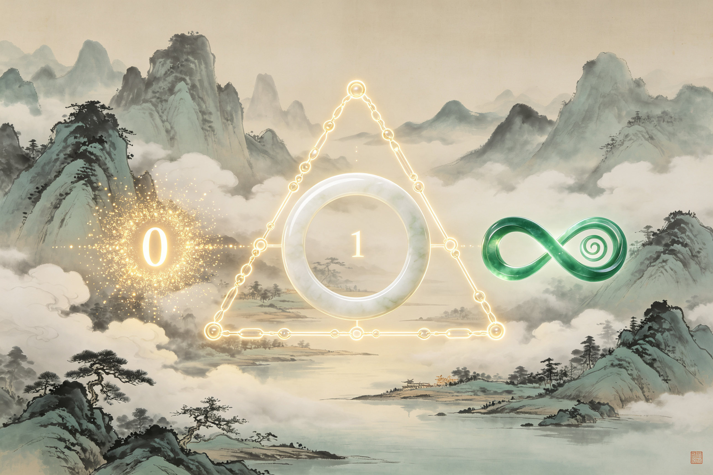
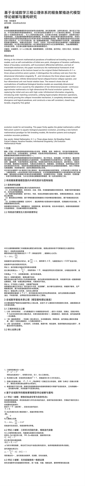
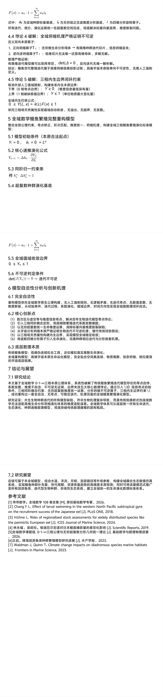

<ArchiveCopyPanel article-id="162315091" />

{"markdown":"PiDliIbnsbvvvJrlhajln5/mlbDlraYgIAo+IOe8luWPt++8mmAxNjIzMTUwOTFgICAKPiDljp/lp4vmlofku7bvvJpg5Z+65LqO5YWo5Z+f5pWw5a2m5LiJ55u45YWs55CG5L2T57O755qE6bOX6bG857mB5q6W6L+t5Luj5qih5Z6LLTE2MjMxNTA5MS5tZGAgIAo+IOi/lOWbnu+8mlvmnKzkuablvZLmoaNdKC96aC9ib29rcy9tYXRoL2FydGljbGVzLykgwrcgW+aAu+WFpeWPo10oL3poL2Jvb2tzL2FydGljbGVzLykKCiFb5bCB6Z2iXSguL2Fzc2V0cy9jc2RuaW1nL2pwZy9mNWVlNWZkYTA2MGUwMTNlLmpwZykKCiMjIOWfuuS6juWFqOWfn+aVsOWtpuS4ieebuOWFrOeQhuS9k+ezu+eahOmzl+mxvOe5geaului/reS7o+aooeWeiwoKIyMjIOaCluiuuuegtOino+S4jumHjeaehOeglOeptgoK5L2c6ICFOiDkuZbkuZbmlbDlraYKCuaIkOS5puaXpeacnzogMjAyNuW5tDA25pyIMjXml6UKCi0tLQoKIyMjIOaRmOimgQoK6ZKI5a+55Lyg57uf6bOX6bG857mB5q6W6YCS5o6o5qih5Z6L5a2Y5Zyo55qE5Yid5aeL6Zu254K56Ieq55u455+b55u+44CB6L+t5Luj57O75pWw5Y+R5pWj44CB6L6555WM57qm5p2f5aSx5pWI44CB5b6u5YiG5a6a5LmJ5LiN6Ieq5rS944CB5LiN5Y+v6YCG5py655CG57y65aSx562J5Zu65pyJ5pWw55CG5oKW6K6677yM5pys5paH5L6d5omY5Y6f5Yib5YWo5Z+f5pWw5a2mMC0xLeKInuS4ieebuOacrOWOn+WFrOeQhuS9k+ezu++8jOWMuuWIhuaZrumAmuiZmuepujDkuI7nu7Tluqbkv6Hmga/lpYfngrkwLu+8jOW8leWFpeS4ieebuOWQjOmYtuiApuWQiOWumuWImeOAgeaXoOept+e7tOWIhuW9ouWdjee8qS/pgIblnY3nvKnnrpflrZDjgIHlm5vnu7TljZXkvY3moLnliIblvaLml4vovazln7rlupXvvIzku47lupXlsYLph43mnoTps5fpsbznuYHmrpbmvJTljJbmlbDnkIbmoYbmnrbjgILnoJTnqbbooajmmI7vvJrkvKDnu5/nlJ/nianov63ku6PmqKHlnovnmoTlhajpg6jnn5vnm77vvIzmnKzotKjkuLrkvY7nu7TkvKrov57nu63ov5HkvLzmlbDlrabpgILphY3pq5jnu7TnlJ/lkb3liIblvaLmvJTljJbns7vnu5/kuqfnlJ/nmoTnu7TluqblibLoo4Lor6/lt67vvJvpgJrov4fmm7/mjaLliJ3lp4vomZrnqbrpm7bngrnkuLrpq5jpmLbml6DnqbflsI/kv6Hmga/lpYfngrnjgIHlvJXlhaXpmLbmrKHljLnphY3nuqbmnZ/jgIHnu5/kuIDotoXlpI3mlbDnu7Tluqbov5DnrpfjgIHkuKXmoLzor4HmmI7lnY3nvKnkuI3lj6/pgIbmnLrnkIbvvIzlvbvlupXmtojpmaTmqKHlnovlj5HmlaPkuI7pgLvovpHmgpborrrvvIzmnoTlu7rlh7roh6rmtL3pl63njq/jgIHlj6/ov63ku6PjgIHml6DlpYfngrnjgIHnrKblkIjlroflrpnmnKzljp/ov5DljJbop4TlvovnmoTmlrDkuIDku6Pps5fpsbznuYHmrpblhajln5/mvJTljJbmqKHlnovjgILmnKzmlofpppbmrKHlsIblhajln5/mlbDlrabnu5/kuIDlnLrlhaznkIbkvZPns7vokL3lnLDlupTnlKjkuo7msLTnlJ/nlJ/niannp43nvqTmvJTljJbvvIzkuLrpsbznsbvnuYHmrpbmqKHlnovjgIHnlJ/lkb3ov63ku6Pns7vnu5/jgIHnlJ/mgIHmvJTljJbpgJLmjqjpl67popjmj5DkvpvlhajmlrDlupXlsYLmlbDnkIbojIPlvI/jgIIKCuWFs+mUruivjTog5YWo5Z+f5pWw5a2m77ybMC0xLeKInuS4ieebuOWFrOeQhu+8m+mzl+mxvOe5geauluaooeWei++8m+WIhuW9ouWdjee8qe+8m+i/reS7o+aCluiuuu+8m+aXoOept+Wwj+Wlh+eCue+8m+eUn+WRvea8lOWMluaVsOeQhuaooeWeiwoKLS0tCgojIyMgQWJzdHJhY3QKCkFpbWluZyBhdCB0aGUgaW5oZXJlbnQgbWF0aGVtYXRpY2FsIHBhcmFkb3hlcyBvZiB0cmFkaXRpb25hbCBlZWwgYnJlZWRpbmcgcmVjdXJzaXZlIG1vZGVscywgc3VjaCBhcyBzZWxmLWNvbnRyYWRpY3Rpb24gb2YgaW5pdGlhbCB6ZXJvIHBvaW50LCBkaXZlcmdlbmNlIG9mIGl0ZXJhdGlvbiBjb2VmZmljaWVudHMsIGZhaWx1cmUgb2YgYm91bmRhcnkgY29uc3RyYWludHMsIHNlbGYtaW5jb25zaXN0ZW50IGRpZmZlcmVudGlhbCBkZWZpbml0aW9uLCBhbmQgbGFjayBvZiBpcnJldmVyc2libGUgbWVjaGFuaXNtLCB0aGlzIHBhcGVyIHJlY29uc3RydWN0cyB0aGUgbWF0aGVtYXRpY2FsIGZyYW1ld29yayBvZiBlZWwgYnJlZWRpbmcgZXZvbHV0aW9uIGF0IHRoZSBib3R0b20gYmFzZWQgb24gdGhlIG9yaWdpbmFsIEdsb2JhbCBNYXRoZW1hdGljcyAwLTEt4oieIHRocmVlLXBoYXNlIHByaW1pdGl2ZSBheGlvbSBzeXN0ZW0uIEl0IGRpc3Rpbmd1aXNoZXMgdGhlIG9yZGluYXJ5IHZvaWQgemVybyBmcm9tIHRoZSBkaW1lbnNpb25hbCBpbmZvcm1hdGlvbiBzaW5ndWxhcml0eSAwLiwgYW5kIGludHJvZHVjZXMgdGhlIHRocmVlLXBoYXNlIGVxdWFsLW9yZGVyIGNvdXBsaW5nIGNyaXRlcmlvbiwgaW5maW5pdGUtZGltZW5zaW9uYWwgZnJhY3RhbCBjb2xsYXBzZS9pbnZlcnNlLWNvbGxhcHNlIG9wZXJhdG9yLCBhbmQgZm91ci1kaW1lbnNpb25hbCB1bml0IHJvb3QgZnJhY3RhbCByb3RhdGlvbiBiYXNlLiBUaGUgcmVzZWFyY2ggc2hvd3MgdGhhdCBhbGwgY29udHJhZGljdGlvbnMgb2YgdHJhZGl0aW9uYWwgYmlvbG9naWNhbCBpdGVyYXRpdmUgbW9kZWxzIGFyZSBlc3NlbnRpYWxseSBkaW1lbnNpb25hbCBzZWdtZW50YXRpb24gZXJyb3JzIGNhdXNlZCBieSB0aGUgYWRhcHRhdGlvbiBvZiBsb3ctZGltZW5zaW9uYWwgcHNldWRvLWNvbnRpbnVvdXMgYXBwcm94aW1hdGUgbWF0aGVtYXRpY3MgdG8gaGlnaC1kaW1lbnNpb25hbCBsaWZlIGZyYWN0YWwgZXZvbHV0aW9uIHN5c3RlbXMuIEJ5IHJlcGxhY2luZyB0aGUgaW5pdGlhbCB2b2lkIHplcm8gd2l0aCBoaWdoLW9yZGVyIGluZmluaXRlc2ltYWwgaW5mb3JtYXRpb24gc2luZ3VsYXJpdHksIGludHJvZHVjaW5nIG9yZGVyIG1hdGNoaW5nIGNvbnN0cmFpbnRzLCB1bmlmeWluZyBoeXBlcmNvbXBsZXggZGltZW5zaW9uIG9wZXJhdGlvbnMsIGFuZCBzdHJpY3RseSBwcm92aW5nIHRoZSBjb2xsYXBzZSBpcnJldmVyc2libGUgbWVjaGFuaXNtLCBpdCBjb21wbGV0ZWx5IGVsaW1pbmF0ZXMgbW9kZWwgZGl2ZXJnZW5jZSBhbmQgbG9naWNhbCBwYXJhZG94ZXMsIGFuZCBjb25zdHJ1Y3RzIGEgbmV3IHNlbGYtY29uc2lzdGVudCwgY2xvc2VkLWxvb3AsIGl0ZXJhYmxlLCBzaW5ndWxhcml0eS1mcmVlIGdsb2JhbCBldm9sdXRpb24gbW9kZWwgZm9yIGVlbCBicmVlZGluZy4gVGhpcyBwYXBlciBmaXJzdGx5IGFwcGxpZXMgdGhlIGdsb2JhbCBtYXRoZW1hdGljcyB1bmlmaWVkIGZpZWxkIGF4aW9tIHN5c3RlbSB0byBhcXVhdGljIGJpb2xvZ2ljYWwgcG9wdWxhdGlvbiBldm9sdXRpb24sIHByb3ZpZGluZyBhIG5ldyBib3R0b20gbWF0aGVtYXRpY2FsIHBhcmFkaWdtIGZvciBmaXNoIGJyZWVkaW5nIG1vZGVscywgbGlmZSBpdGVyYXRpdmUgc3lzdGVtcyBhbmQgZWNvbG9naWNhbCBldm9sdXRpb24gcmVjdXJzaW9uIHByb2JsZW1zLgoKS2V5IHdvcmRzOiBHbG9iYWwgTWF0aGVtYXRpY3M7IDAtMS3iiJ4gVGhyZWUtcGhhc2UgQXhpb207IEVlbCBCcmVlZGluZyBNb2RlbDsgRnJhY3RhbCBDb2xsYXBzZTsgSXRlcmF0aXZlIFBhcmFkb3g7IEluZmluaXRlc2ltYWwgU2luZ3VsYXJpdHk7IExpZmUgRXZvbHV0aW9uIE1hdGhlbWF0aWNhbCBNb2RlbAoKLS0tCgojIyMgMSDlvJXoqIAKCumzl+mxvO+8iOiKkumxvO+8ieS9nOS4uuWFuOWei+mZjea1t+a0hOa4uOaAp+eJueauiuawtOeUn+eUn+eJqe+8jOWFtue5geauluOAgea0hOa4uOOAgeenjee+pOihpeWFheOAgeS4luS7o+i/reS7o+WFt+Wkh+W8uumdnue6v+aAp+OAgeWNleWQkeS4jeWPr+mAhuOAgeWIhuW9ouW1jOWll+a8lOWMluOAgei+ueeVjOaVj+aEn+OAgeWIneWni+Wlh+eCueeJueaAp+eahOeLrOacieeJueW+ge+8jOaYr+eUn+WRveezu+e7n+S4reacgOmavuS7peeUqOS8oOe7n+aVsOeQhuaooeWei+eyvuWHhuWIu+eUu+eahOeUn+eJqea8lOWMluWcuuaZr+S5i+S4gOOAggoK546w6Zi25q615Zu95YaF5aSW5Li75rWB6bOX6bG857mB5q6W5qih5Z6L5aSa5L6d5omY5Lyg57uf5b6u56ev5YiG44CB57uf6K6h5a2m5ouf5ZCI44CB57q/5oCn6YCS5o6o44CB6LSd5Y+25pav57uf6K6h44CB5pyA5LyY5o6n5Yi255CG6K665p6E5bu677yM5LuF6IO95a6e546w6KGo5bGC5pWw5o2u5ouf5ZCI5LiO6LaL5Yq/6aKE5rWL77yM5peg5rOV6Kej6YeK5qih5Z6L5YaF55Sf55qE5pWw5a2m5aWH54K544CB6L+t5Luj5Y+R5pWj44CB5Yid5aeL5p2h5Lu26Ieq5oKW44CB5YC85Z+f6LaK55WM44CB5Y+v6YCG55+b55u+562J5qC45b+D5bqV5bGC6Zeu6aKY44CC5Lyg57uf5qyn5byP5pWw5a2m5L2T57O75Lul5Lyq6L+e57ut6L+R5Ly844CB6Jma56m66Zu25a6a5LmJ44CB5Ymy6KOC5peg56m35LiO5pyJ6ZmQ44CB57u05bqm5Zu65a6a5Li65bqV5bGC5qGG5p6277yM5LiO55yf5a6e55Sf5ZG96auY57u05YiG5b2i44CB56a75pWj56C057y644CB56m66Ze055yf6L+e57ut44CB5L+h5oGv5Z2N57yp6L+Q5YyW55qE5a6H5a6Z5pys5Y6f6KeE5b6L5aSp54S25Yay56qB77yM5a+86Ie05omA5pyJ57uP5YW46bOX6bG857mB5q6W6L+t5Luj5qih5Z6L5aeL57uI5a2Y5Zyo5peg5rOV5qC56Zmk55qE5pWw55CG56Gs5Lyk77yM5Yi257qm5LqG56eN576k5ryU5YyW57K+5YeG5bu65qih44CB6LWE5rqQ5L+u5aSN6aKE5rWL44CB5rSE5ri45py655CG5o6o5ryU55qE55CG6K665rex5bqm44CCCgrmnKzmlofkvp3miZjlhajln5/mlbDlraYxMDjljbfljp/liJvkuInnm7jlhaznkIbkvZPns7vvvIzot7Plh7rkvKDnu5/kvY7nu7Tov5HkvLzmlbDlrabmoYbmnrbvvIzku47lroflrpnmnKzljp8w5a+556ew56m66Ze05Zy644CBMeegtOe8uueJqei0qOWcuuOAgeKInui/kOWMluS/oeaBr+WcuuS4ieebuOS6kueUn+inhOW+i+WHuuWPke+8jOmSiOWvueS8oOe7n+mzl+mxvOe5geauluaooeWei+S6lOWkp+iHtOWRveaVsOeQhuaCluiuuui/m+ihjOW6leWxguegtOino++8jOmHjeaehOmAgumFjeeUn+WRvemrmOe7tOWIhuW9oua8lOWMlueahOWFqOWfn+aVsOeQhuaooeWei++8jOWunueOsOaooeWei+aXoOaCluiuuuOAgeaXoOWPkeaVo+OAgeiHqua0vemXreeOr+OAgeacuueQhuWujOWkh+OAgeacrOWOn+WPr+aOp+eahOeQhuiuuueqgeegtO+8jOS4uuawtOeUn+eUn+eJqea8lOWMluW7uuaooeaPkOS+m+i3qOe7tOW6puOAgee7n+S4gOWMlueahOWFqOaWsOeQhuiuuuW3peWFt+OAggoKLS0tCgojIyMgMiDkvKDnu5/ps5fpsbznuYHmrpbmqKHlnovlm73lhoXlpJbnoJTnqbbnjrDnirbkuI7lm7rmnInnvLrpmbcKCiFb5Lyg57uf5qih5Z6L57y66Zm3XSguL2Fzc2V0cy9jc2RuaW1nL2pwZy83M2RlNzg2MDY4ZGRjMDY2LmpwZykKCiMjIyMgMi4xIOeOsOacieeglOeptui/m+WxlQoK5b2T5YmN6bOX6bG857mB5q6W5LiO5rSE5ri45bu65qih5Li76KaB5YiG5Li65Zub57G756CU56m25L2T57O777yaCgooMSkg5rC05paH546v5aKD6amx5Yqo5qih5Z6LOiDkvp3miZjlvoTmtYHjgIHmsLTmuKnjgIHmnIjnm7jjgIHmtIvmtYHmlbDmja7mnoTlu7rlm57lvZLpooTmtYvkvZPns7vvvIzkvqfph43lpJbpg6jnjq/looPlj5jph4/mi5/lkIjvvIzml6DlhoXnlJ/ov63ku6PmlbDnkIbnu5PmnoTvvJsKCigyKSDnp43nvqTlubTpvoTnu5PmnoTmqKHlnos6IOWfuuS6juS9k+mVv+OAgeW5tOm+hOOAgeaAp+WIq+avlOS+i+aehOW7uuWIhuWxgue7n+iuoeaooeWei++8jOS+nei1lue7j+mqjOWPguaVsOaLn+WQiO+8jOe8uuS5j+W6leWxguWFrOeQhuaUr+aSke+8mwoKKDMpIOacgOS8mOi3r+W+hOi/geenu+aooeWeizog5Z+65LqO5rO95qKF5rSb5pyA5LyY5o6n5Yi25YGP5b6u5YiG5pa556iL5rGC6Kej5rSE5ri45pyA5LyY6Lev5b6E77yM5bGe5LqO5L2O57u06L+e57ut6L+R5Ly85ouf5ZCI77ybCgooNCkg6LSd5Y+25pav57uf6K6h5oub5Yuf5qih5Z6L77yIR0VSRU3vvIk6IOmAmui/h+amgueOh+e7n+iuoeWunueOsOW5vOS9k+ihpeWFhemHj+S8sOeul++8jOS7heWFt+Wkh+e7n+iuoeaLn+WQiOWKn+iDve+8jOS4jeWFt+Wkh+aVsOeQhua8lOWMluiHqua0veaAp+OAggoK546w5pyJ5qih5Z6L5YWx5oCn54m55b6B5Li677ya6YeN5pWw5o2u5ouf5ZCI44CB6L275pWw55CG5py655CG77yb6YeN5aSW6YOo546v5aKD44CB6L2755Sf5ZG95pys5Y6f6L+t5Luj77yb5L6d6LWW5Lyg57uf5p6B6ZmQ5b6u56ev5YiG5Lyq6L+e57ut5YGH6K6+77yM5peg5rOV6Kej5Yaz5qih5Z6L5YaF55Sf6YC76L6R55+b55u+44CCCgojIyMjIDIuMiDkvKDnu5/ov63ku6PmqKHlnovkupTlpKfoh7Tlkb3mlbDnkIbmgpborroKCuacrOaWh+S7pemAmueUqOmzl+mxvOe5geauluS6jOmYtumAkuaOqOa8lOWMluaooeWei+S4uueglOeptuWvueixoe+8jOais+eQhuWHuueOsOacieS9k+ezu+S4jeWPr+S/ruWkjeeahOS6lOWkp+W6leWxguaCluiuuu+8mgoK5oKW6K66Me+8muWIneWni+mbtueCueiHquebuOefm+ebvgoK5qih5Z6L5Yid5aeL6L+t5Luj5p2h5Lu25by65Yi26K6+5a6aIHkxPTB5XyYjMTIzOzEmIzEyNTs9MHkx4oCLPTDvvIjkvKDnu5/omZrnqbrpm7bvvInvvIzpgJLmjqjmoLjlv4PlhazlvI/kuLrvvJoKCuaCluiuujLvvJrov63ku6Pns7vmlbDliIbmr43otovov5Hpm7blr7zoh7Tlhajln5/lj5HmlaMKCuaCluiuujPvvJrmoIfph4/lkJHph4/mt7fnlKjvvIznu7Tluqbov5DnrpfkuI3oh6rmtL0KCuaooeWei+a8lOWMlui+k+WHuumHjyBGKOKInSlGKFxwcm9wdG8pRijiiJ0pIOWumuS5ieS4uuWkmue7tOenjee+pOWQkemHj++8jOi/reS7o+i/kOeul+WFqOeoi+aMieeFp+agh+mHj+iuoeeul++8jOS8oOe7n+aVsOWtpuaXoOe7n+S4gOi2heWkjeaVsOe7tOW6pui/kOeul+inhOWIme+8jOWQkemHjy3moIfph4/ov5DnrpfovrnnlYzmlq3oo4LvvIzku6PmlbDkvZPns7vkuI3pl63lkIjjgIIKCuaCluiuujTvvJrkuI3lj6/pgIbku4XkurrkuLrop4TlrprvvIzml6DmlbDnkIbkuKXmoLzor4HmmI4KCueOsOacieaooeWei+S7hemAmui/h+aWh+Wtl+WumuS5iSLkuJbku6Pov63ku6PkuI3lj6/pgIbjgIHml6Dlm57muq/op6Mi77yM57y65bCR6ZuF5Y+v5q+U55+p6Zi15Yik5a6a44CB5Z2N57yp566X5a2Q5o6o5a+877yM5peg5Lil5qC85pWw55CG6K+B5piO77yM5bGe5LqO57uP6aqM5by65Yi26KeE5YiZ6ICM6Z2e5pys5Y6f6KeE5b6L44CCCgrmgpborro177ya5YC85Z+f6L6555WM5Lq65Li657qm5p2f77yM5peg5YaF55Sf5YWs55CG57qm5p2fCgotLS0KCiMjIyAzIOWFqOWfn+aVsOWtpuWfuuehgOacrOWOn+WFrOeQhu+8iOaooeWei+mHjeaehOeQhuiuuuWfuuW6le+8iQoKIVvkuInnm7jlhaznkIZdKC4vYXNzZXRzL2NzZG5pbWcvanBnLzhmNmE2NzMxYzE4NWI4YmUuanBnKQoK5pys5paH5qih5Z6L6YeN5p6E5Lil5qC85L6d5omY5YWo5Z+f5pWw5a2m5qC45b+D5LiJ55u45YWs55CG77yM5Yy65Yir5LqOWkblhaznkIbkvZPns7vkuI7kvKDnu5/lvq7np6/liIbkvZPns7vvvIzpgILphY3pq5jnu7TnlJ/lkb3liIblvaLmvJTljJbop4TlvovjgIIKCiMjIyMgMy4xIOS4ieebuOacrOS9k+WumuS5ieWFrOeQhgoKLSAKCjDnm7jvvIjlr7nnp7Dnqbrpl7TlnLrvvIk6IOWIhuS4uuaZrumAmuiZmuepujDkuI7nu7Tluqbkv6Hmga/lpYfngrkwLu+8m+iZmuepujDml6Dkv6Hmga/jgIHml6DogKblkIjjgIHml6Dlvq7liIbnibnmgKfvvJswLuS4uuato+i0n+aXoOept+mYtuaXoOept+Wwj+iApuWQiOWlh+eCue+8jOacrOi0qOS4uumakOaAgemrmOmYtuWNleS9jTHvvIzmmK/nu7Tluqbot4Pov4HjgIHkv6Hmga/nlJ/lj5HjgIHov63ku6Potbflp4vnmoTllK/kuIDlkIjms5Xln7rlupXjgIIKCi0gCgox55u477yI56C057y654mp6LSo5Zy677yJOiDlroflrpnllK/kuIDmmL7ljJbljZXkvY3lhYPvvIznlJ/lkb3nprvmlaPnu5PmnoTjgIHnp43nvqTlrp7kvZPjgIHov63ku6PmnoHlgLzkuIrpmZDnmoTmnKzljp/ln7rlupXvvIzmu6HotrMx5Li65pi+5YyW5YW36LGh55qEMO+8jDDkuLrpmpDmgIHpq5jpmLbnmoQx44CCCgotIAoK4oie55u477yI6L+Q5YyW5L+h5oGv5Zy677yJOiDml6Dnqbfov63ku6PjgIHliIblvaLltYzlpZfjgIHnu7TluqbljYfpmY3jgIHnm7jkvY3ml4vovazjgIHkv6Hmga/lnY3nvKnnmoTlhajln5/ov5DljJbnrpflrZDvvIzmib/ovb3nlJ/lkb3kuJbku6PlvoDlpI3mvJTljJbjgIIKCiMjIyMgMy4yIOaguOW/g+i/kOeul+WFrOeQhgoKLSDkuInnm7jlkIzpmLbogKblkIjlvZLkuIDlhaznkIY6CgrlkIzpmLbov5DljJbmirXmtojlvZLkuIDvvIzpnZ7lkIzpmLbliIblvZIw44CB5b2SMeOAgeW9kuKInuS4ieexu+eKtuaAgeOAggoKLSAKCuWlh+eCueW5guasoeWFrOeQhjog5LuF5L+h5oGv5aWH54K55ruh6LazIDAuMD0xMC5eJiMxMjM7MCYjMTI1Oz0xMC4wPTHvvIzmma7pgJromZrnqbow55qEMOasoeaWueaXoOWumuS5ieOAggoKLSAKCuWbm+e7tOWIhuW9ouaXi+i9rOWFrOeQhjogKzEsIC0xLCAraSwgLWnmnoTmiJDljZXkvY0x5Zub57u05q2j5Lqk5YiG5b2i57uT5p6E77yM6Jma5pWwIHRpdGl0aSDkuLrljZXkvY0x5Zub57u05YiG5b2i566X5a2Q77yM5o6M5o6n55Sf5ZG95ryU5YyW55u45L2N5peL6L2s5LiO5YiG5b2i6L+t5Luj44CCCgotIAoK57u05bqm5Z2N57yp5LiN5Y+v6YCG5YWs55CGOiDpq5jnu7Tml6DnqbfotoXlpI3mlbDmr43kvZPlkJHkvY7nu7TmnInpmZDnu7TliIfniYflnY3nvKnkuqfnlJ/kv6Hmga/kuKLlpLHvvIzmraPlkJHlnY3nvKnllK/kuIDjgIHpgIblkJHlsZXlvIDlpJrop6PvvIzlpKnnhLblhbflpIfkuI3lj6/pgIbmvJTljJbnibnlvoHjgIIKCi0tLQoKIyMjIDQg5Z+65LqO5YWo5Z+f5pWw5a2m55qE6bOX6bG857mB5q6W5qih5Z6L5oKW6K6656C06Kej5LiO6YeN5p6ECgohW+e7tOW6puWdjee8qV0oLi9hc3NldHMvY3NkbmltZy9qcGcvZGUzOGM2MmVmNWExNzg0YS5qcGcpCgojIyMjIDQuMSDmgpborrox56C06Kej77ya5pu/5o2i5Yid5aeL6Jma56m66Zu25Li65L+h5oGv5aWH54K5MC4KCuS8oOe7n+aooeWei+mUmeivr+aguea6kO+8muWwhuaXoOS/oeaBr+iZmuepujDkvZzkuLrnlJ/lkb3ov63ku6PotbfngrnvvIzov53og4zlroflrpnml6Dnu53lr7nnnJ/nqbrjgIHkuIfnianlp4vkuo7pq5jpmLbml6DnqbflsI/lpYfngrnnmoTmnKzljp/op4TlvovjgIIKCuWFqOWfn+mHjeaehOWIneWni+adoeS7tjoKCuWPlua2iCBZMT0wWV8mIzEyMzsxJiMxMjU7PTBZMeKAiz0w77yI6Jma56m66Zu277yJ77yM6K6+5a6a5ZCI5rOV6L+t5Luj6LW354K577yaWTE9MC5ZXyYjMTIzOzEmIzEyNTs9MC5ZMeKAiz0wLgoKMC7kuLrmraPotJ/pq5jpmLbml6DnqbflsI/ogKblkIjpmpDmgIEx77yM5YW35aSH6Z2e6Zu25b6u5YiG54m55oCn77yaCgrku6PlhaXpgJLmjqjlhazlvI/lvpfvvJoKCuWIneWni+i/reS7o+WujOWFqOiHqua0ve+8jOW9u+W6lea2iOmZpOmbtueCueefm+ebvuOAggoKIyMjIyA0LjIg5oKW6K66MuegtOino++8muS4iemYtumYtuasoeWMuemFjee6puadn++8jOaguemZpOi/reS7o+WPkeaVowoK5byV5YWl5LiJ55u45ZCM6Zi26ICm5ZCI5a6a5YiZ77yM5p6E5bu65ryU5YyW57O75pWw6Zi25qyh5Yy56YWN5py65Yi277yaCgrlrprkuYnmmL7lvI/mvJTljJbln7rlupXlh73mlbDvvJoKCmsoTCk9MC4rTM6xayhMKT0wLitMXiYjMTIzO1xhbHBoYSYjMTI1O2soTCk9MC4rTM6xCgrOsVxhbHBoYc6xIOS4uumYtuasoeiwg+aOp+aMh+aVsO+8jOS/neivgSBrKEwpayhMKWsoTCkg5rC46L+c5LiN5Lya6LaL6L+R57ud5a+56Jma56m6MO+8jOWni+e7iOS/neeVmee7tOW6puS/oeaBr+Wlh+eCueWfuuW6leOAggoK6L+t5Luj57O75pWw5q+U5L+u5q2j5Li677yaCgrlkIzpmLbogKblkIjlvZLkuIDvvIzov63ku6Pns7vmlbDlhajln5/mnInnlYzjgIHml6Dlj5HmlaPjgIHml6DlpYfngrnltKnmuoPjgIIKCiMjIyMgNC4zIOaCluiuujPnoLTop6PvvJrml6DnqbfotoXlpI3mlbDnu5/kuIDnu7Tluqbov5DnrpcKCuS+neaJmOWFqOWfn+aVsOWtpuaXoOept+i2heWkjeaVsOepuumXtOS9k+ezu++8jOe7n+S4gOagh+mHj+OAgeWQkemHj+OAgee7tOW6pui/kOeul++8jOmHjeaehOenjee+pOa8lOWMlui+k+WHuumHj++8mgoKYTBhXyYjMTIzOzAmIzEyNTthMOKAiyDkuLrlrp7ln5/np43nvqTmoIfph4/ln7rlupXvvIxpa2lfJiMxMjM7ayYjMTI1O2lr4oCLIOS4uuaXoOept+e7hOato+S6pOiZmue7tOW6puWIhuW9ouWfuuW6le+8jGlpaSDkuLrlm5vnu7TliIblvaLml4vovaznrpflrZDjgIIKCuaJgOaciei/reS7o+OAgeW+ruWIhuOAgea8lOWMlui/kOeul+e7n+S4gOWcqOi2heWkjeaVsOepuumXtOWujOaIkO+8jOW9u+W6leino+WGs+agh+mHj+WQkemHj+a3t+eUqOOAgee7tOW6puaWreijgumXrumimOOAggoKIyMjIyA0LjQg5oKW6K66NOegtOino++8muWFqOWfn+Wdjee8qeacuueQhuS4peagvOivgeaYjuS4jeWPr+mAhgoK5a6a5LmJ5Y+M5ZCR5pys5Y6f566X5a2Q77yaCgotIAoK5q2j5ZCR5Z2N57yp566X5a2QIFTihpNUXyYjMTIzO1xkb3duYXJyb3cmIzEyNTtU4oaT4oCLOiDml6Dnqbfnu7TnlJ/lkb3liIblvaLmr43kvZPihpLmnInpmZDnu7Tnp43nvqTov63ku6PliIfniYfvvIzkv6Hmga/lnY3nvKnkuKLlpLHvvJsKCi0gCgrpgIblkJHpgIblnY3nvKnnrpflrZAgVOKGkVRfJiMxMjM7XHVwYXJyb3cmIzEyNTtU4oaR4oCLOiDkvY7nu7TliIfniYfml6Dms5XllK/kuIDov5jljp/pq5jnu7Tmr43kvZPvvIzlpJrop6Pml6Dop6PjgIIKCuaVsOeQhuS4peagvOivgeaYjjoKCuaciemZkOe7tOi/reS7o+aooeWei+mbheWPr+avlOefqemYteWlh+W8gu+8jGRldChKKT0wZGV0KEopPTBkZXQoSik9MO+8jOWPjeWQkei/reS7o+aXoOWUr+S4gOino+aekOino+OAggoK57uT6K66OiDps5fpsbzkuJbku6PnuYHmrpbov63ku6PlsZ7kuo7pq5jnu7TlnY3nvKnkvY7nu7TmipXlvbHov4fnqIvvvIzlhbflpIflroflrpnmnKzljp/nuqfljZXlkJHkuI3lj6/pgIbmgKfvvIzml6DpnIDkurrlt6XlvLrliLblrprkuYnjgIIKCiMjIyMgNC41IOaCluiuujXnoLTop6PvvJrkuInnm7jlhoXnlJ/ovrnnlYzpl63njq/nuqbmnZ8KCuWPlua2iOWklumDqOS6uuW3peWAvOWfn+mZkOWItu+8jOaehOW7uuS9k+ezu+WGheeUn+acrOWOn+i+ueeVjO+8mgoK5YWo5Z+f5YaF55Sf57qm5p2f5YWs5byP77yaCgrkvp3miZjkuInnm7jlnLrlpKnnhLblsZ7mgKflrp7njrDlgLzln5/oh6rliqjmlLbmlZvvvIzml6DmuqLlh7rjgIHml6DotornlYzjgIHml6Dlj5HmlaPjgIIKCi0tLQoKIyMjIDUg5YWo5Z+f5pWw5a2m6bOX6bG857mB5q6W5a6M5pW06YeN5p6E5qih5Z6LCgohW+WujOaVtOmHjeaehOaooeWei10oLi9hc3NldHMvY3NkbmltZy9qcGcvODlkZTJlYjdjZjMyZjNmOC5qcGcpCgrmlbTlkIjlhajpg6jlhaznkIbnuqbmnZ/jgIHlpYfngrnkv67mraPjgIHpmLbmrKHljLnphY3jgIHnu7Tluqbnu5/kuIDjgIHlnY3nvKnmnLrnkIbvvIzmnoTlu7rlhajln5/kuInnm7jps5fpsbznuYHmrpbmvJTljJbmoIflh4bmqKHlnovvvJoKCiMjIyMgNS4xIOaooeWei+WIneWni+adoeS7tu+8iOacrOWOn+WQiOazlei1t+eCue+8iQoKWTE9MC4sazE9MC4rTM6xWV8mIzEyMzsxJiMxMjU7PTAuLCBccXVhZCBrXyYjMTIzOzEmIzEyNTs9MC4rTF4mIzEyMztcYWxwaGEmIzEyNTtZMeKAiz0wLixrMeKAiz0wLitMzrEKCiMjIyMgNS4yIOaguOW/g+mAkuaOqOa8lOWMluWFrOW8jwoKIyMjIyA1LjMg5ZCM6Zi25b2S5LiA57qm5p2f5p2h5Lu2CgojIyMjIDUuNCDotoXlpI3mlbDnp43nvqTmvJTljJbln7rlupUKCiMjIyMgNS41IOWFqOWfn+WAvOWfn+aUtuaVm+i+ueeVjAoKIyMjIyA1LjYg5LiN5Y+v6YCG5Yik5a6a5p2h5Lu2CgotLS0KCiMjIyA2IOaooeWei+iHqua0veaAp+WIhuaekOS4juWIm+aWsOacuueQhgoKIVvmqKHlnovlr7nmr5RdKC4vYXNzZXRzL2NzZG5pbWcvanBnLzcyZjFiZTY4OTRlY2I5MWMuanBnKQoKIyMjIyA2LjEg5a6M5YWo6Ieq5rS95oCnCgrph43mnoTmqKHlnovkvp3miZjlhajln5/mlbDlrabljp/nlJ/lhaznkIbmnoTlu7rvvIzml6Dkurrlt6XlvLrliLbop4TliJnjgIHml6DpgLvovpHnn5vnm77jgIHml6Dov63ku6PlpYfngrnjgIHml6DmlbDlgLzlj5HmlaPjgIHml6Dnu7Tluqbmlq3oo4LvvIzku47liJ3lp4vmnaHku7bjgIHov63ku6Pov4fnqIvjgIHns7vmlbDmvJTljJbjgIHlgLzln5/ovrnnlYzjgIHml7bpl7TmlrnlkJHmgKflrp7njrDlhajpk77ot6/mlbDnkIbpl63njq/oh6rmtL3jgIIKCiMjIyMgNi4yIOaguOW/g+WIm+aWsOeCuQoKKDEpIOmmluasoeWMuuWIhuiZmuepuumbtuS4jue7tOW6puS/oeaBr+Wlh+eCue+8jOino+WGs+eZvuW5tOeUn+eJqei/reS7o+aooeWei+mbtueCueaCluiuuu+8mwoKKDIpIOW8leWFpeS4ieebuOWQjOmYtuiApuWQiOWumuWIme+8jOW9u+W6leaguemZpOe5geaului/reS7o+ezu+aVsOWPkeaVo+mavumimO+8mwoKKDMpIOS7peaXoOept+i2heWkjeaVsOe7n+S4gOeUn+WRvee7tOW6pui/kOeul++8jOa2iOmZpOagh+mHj+WQkemHj+e7tOW6puWJsuijgue8uumZt++8mwoKKDQpIOS7juWuh+WumeWIhuW9ouWdjee8qeacrOWOn+S4peagvOivgeaYjueUn+eJqei/reS7o+S4jeWPr+mAhuacuueQhu+8jOabv+S7o+S8oOe7n+e7j+mqjOWBh+iuvu+8mwoKKDUpIOS7peS4ieebuOWcuuWkqeeEtuWxnuaAp+aehOW7uuWGheeUn+i+ueeVjO+8jOWunueOsOaooeWei+WFqOWfn+eos+WumuaUtuaVm++8mwoKKDYpIOWwhuiZmuaVsOWbm+e7tOWIhuW9oueul+WtkOW8leWFpeeUn+WRvea8lOWMlu+8jOWujOWWhOenjee+pOebuOS9jei/reS7o+S4juWIhuW9ouW1jOWll+acuueQhuOAggoKIyMjIyA2LjMg5bqV5bGC5pWw55CG5pys6LSoCgrkvKDnu5/ps5fpsbzmqKHlnos6IOS9jue7tOS8qui/nue7reaLn+WQiOW3peWFt++8jOi/keS8vOaooeaLn+ecn+Wunuemu+aVo+eUn+WRvea8lOWMlu+8mwoK5YWo5Z+f6YeN5p6E5qih5Z6LOiDpq5jnu7TlroflrpnmnKzljp/nlJ/lkb3ov5DljJbmqKHlnovvvIzlrozlhajotLTlkIjnqbrpl7TnnJ/ov57nu63jgIHnianotKjnprvmlaPjgIHkv6Hmga/lnY3nvKnjgIHnm7jkvY3pnIfojaHnmoTlroflrpnlupXlsYLop4TlvovjgIIKCi0tLQoKIyMjIDcg57uT6K665LiO5bGV5pybCgohW+aUtuWwvueJh+Wwvl0oLi9hc3NldHMvY3NkbmltZy9qcGcvY2ZjY2ZlZTVkY2Q0NDZkNi5qcGcpCgojIyMjIDcuMSDnoJTnqbbnu5PorroKCuacrOaWh+WfuuS6juWFqOWfn+aVsOWtpjAtMS3iiJ7kuInnm7jmnKzljp/lhaznkIbkvZPns7vvvIzns7vnu5/mgKfnoLTop6PkuobkvKDnu5/ps5fpsbznuYHmrpbov63ku6PmqKHlnovlrZjlnKjnmoTpm7bngrnoh6rmgpbjgIHns7vmlbDlj5HmlaPjgIHnu7TluqbkuI3oh6rmtL3jgIHkuI3lj6/pgIbml6Dor4HmmI7jgIHovrnnlYzlpLHmlYjkupTlpKfmoLjlv4PmlbDnkIbmgpborrrjgILpgJrov4flvJXlhaUwLuS/oeaBr+Wlh+eCueWIneWni+adoeS7tuOAgeS4ieebuOWQjOmYtuiApuWQiOe6puadn+OAgeaXoOept+i2heWkjeaVsOe7tOW6pue7n+S4gOi/kOeul+OAgeWIhuW9ouWdjee8qeS4jeWPr+mAhueul+WtkOOAgeS4ieebuOWGheeUn+i+ueeVjOe6puadn++8jOaIkOWKn+mHjeaehOWHuuS4gOWll+WFqOiHqua0veOAgeaXoOWlh+eCueOAgeWPr+eos+Wumui/reS7o+OAgeacuueQhuWujOWkh+eahOWFqOWfn+mzl+mxvOe5geaulua8lOWMluaooeWei+OAggoK56CU56m26K+B5a6e77ya5rC055Sf55Sf54mp56eN576k6L+t5Luj55qE5omA5pyJ5qih5Z6L57y66Zm377yM5bm26Z2e55Sf54mp5py655CG5aSN5p2C5a+86Ie077yM6ICM5piv5Lyg57uf5L2O57u05qyn5byP5Lyq6L+e57ut5pWw5a2m5peg5rOV6YCC6YWN6auY57u055Sf5ZG95YiG5b2i5Z2N57yp5ryU5YyW5L2T57O755qE57u05bqm6YCC6YWN6K+v5beu44CC5YWo5Z+f5pWw5a2m5L2T57O75Y+v5LuO5bqV5bGC57uf5LiA5omA5pyJ55Sf5ZG96L+t5Luj44CB55Sf5oCB5ryU5YyW44CB56eN576k6YCS5o6o5pWw55CG5qih5Z6L77yM5b275bqV56qB56C05Lyg57uf5pWw55CG5bu65qih55qE5Zu65pyJ55O26aKI44CCCgojIyMjIDcuMiDnoJTnqbblsZXmnJsKCuWQjue7reWPr+WfuuS6juacrOWFqOWfn+aooeWei++8jOe7k+WQiOawtOa4qeOAgea0i+a1geOAgeaciOebuOOAgea0hOa4uOi3r+W+hOetieWkluWcuuWPguaVsO+8jOaehOW7uuWFqOWfn+iApuWQiOeUn+aAgeaVsOWAvOS7v+ecn+ezu+e7n++8jOWunueOsOmzl+mxvOenjee+pOihpeWFhemHj+OAgeS4luS7o+WRqOacn+OAgei1hOa6kOaBouWkjei2i+WKv+eahOmrmOeyvuW6puacrOWOn+mihOa1i++8m+WQjOaXtuWPr+WwhuivpeW7uuaooeiMg+W8j+aOqOW5v+iHs+aJgOaciea0hOa4uOmxvOexu+OAgei/reS7o+Wei+eUn+eJqeenjee+pOOAgemdnue6v+aAp+eUn+aAgeezu+e7n++8jOW7uueri+WFqOWfn+e7n+S4gOeahOeUn+WRvea8lOWMluaVsOeQhuagh+WHhuS9k+ezu+OAggoKLS0tCgojIyMg5Y+C6ICD5paH54yuCgpbMV0g5LmW5LmW5pWw5a2mLiDlhajln5/mlbDlraYxMDjljbflhajpm4ZbTV0uIOWOn+WIm+WfuuehgOaVsOWtpuS4k+iRlywgMjAyNi4KClsyXSBDaGFuZyBZIEwuIEVmZmVjdCBvZiBsYXJ2YWwgc3dpbW1pbmcgaW4gdGhlIHdlc3Rlcm4gTm9ydGggUGFjaWZpYyBzdWJ0cm9waWNhbCBneXJlIG9uIHRoZSByZWNydWl0bWVudCBzdWNjZXNzIG9mIHRoZSBKYXBhbmVzZSBlZWwgW0pdLiBQTG9TIE9ORSwgMjAxOC4KClszXSBIw7ZobmUgTC4gUmlza3Mgb2YgcmVnaW9uYWxpemVkIHN0b2NrIGFzc2Vzc21lbnRzIGZvciB3aWRlbHkgZGlzdHJpYnV0ZWQgc3BlY2llcyBsaWtlIHRoZSBwYW5taWN0aWMgRXVyb3BlYW4gZWVsIFtKXS4gSUNFUyBKb3VybmFsIG9mIE1hcmluZSBTY2llbmNlLCAyMDI0LgoKWzRdIOael+awuOemjywg5ZC05pit5LymLiDmnoHnq6/ljoTlsJTlsLzor7rlr7nml6XmnKzps5foi5fmjZXojrfph4/nmoTlt67lvILljJblvbHlk41bSl0uIFNjaWVudGlmaWMgUmVwb3J0cywgMjAxOS4KCls1XSDlhajln5/mlbDlrabor77popjnu4QuIDAtMS3iiJ7kuInnm7jlhaznkIbkuI7ml6DnqbfotoXlpI3mlbDliIblvaLlh6DkvZXnu5/kuIDnkIborrpbSl0uIOWfuuehgOaVsOWtpuS4juaVsOeQhueJqeeQhui/m+WxlSwgMjAyNi4KCls2XSDnjovlkK8uIOmZjea1t+a0hOa4uOmxvOexu+enjee+pOe5geauluaooeWei+eglOeptui/m+WxlVtKXS4g5rC05Lqn5a2m5oqlLCAyMDIzLgoKWzddIFdhbGRtYW4gSiwgUXVpbm4gVC4gQ2xpbWF0ZSBjaGFuZ2UgaW1wYWN0cyBvbiBkaWFkcm9tb3VzIHNwZWNpZXMgbWFyaW5lIGhhYml0YXRzIFtKXS4gRnJvbnRpZXJzIGluIE1hcmluZSBTY2llbmNlLCAyMDIzLgoKIVtpbWFnZV0oLi9hc3NldHMvY3NkbmltZy9qcGcvNzg4MTQwYmEzMDYwMDQwNy5qcGcpCgohW2ltYWdlXSguL2Fzc2V0cy9jc2RuaW1nL2pwZy9kMjE0ZGIzMDE5Y2ZlMTEyLmpwZykK","text":"5YiG57G777ya5YWo5Z+f5pWw5a2mICAK57yW5Y+377yaMTYyMzE1MDkxICAK5Y6f5aeL5paH5Lu277ya5Z+65LqO5YWo5Z+f5pWw5a2m5LiJ55u45YWs55CG5L2T57O755qE6bOX6bG857mB5q6W6L+t5Luj5qih5Z6LLTE2MjMxNTA5MS5tZCAgCui/lOWbnu+8muacrOS5puW9kuahoyDCtyDmgLvlhaXlj6MKCuWwgemdogoK5Z+65LqO5YWo5Z+f5pWw5a2m5LiJ55u45YWs55CG5L2T57O755qE6bOX6bG857mB5q6W6L+t5Luj5qih5Z6LCgrmgpborrrnoLTop6PkuI7ph43mnoTnoJTnqbYKCuS9nOiAhTog5LmW5LmW5pWw5a2mCgrmiJDkuabml6XmnJ86IDIwMjblubQwNuaciDI15pelCgotLS0KCuaRmOimgQoK6ZKI5a+55Lyg57uf6bOX6bG857mB5q6W6YCS5o6o5qih5Z6L5a2Y5Zyo55qE5Yid5aeL6Zu254K56Ieq55u455+b55u+44CB6L+t5Luj57O75pWw5Y+R5pWj44CB6L6555WM57qm5p2f5aSx5pWI44CB5b6u5YiG5a6a5LmJ5LiN6Ieq5rS944CB5LiN5Y+v6YCG5py655CG57y65aSx562J5Zu65pyJ5pWw55CG5oKW6K6677yM5pys5paH5L6d5omY5Y6f5Yib5YWo5Z+f5pWw5a2mMC0xLeKInuS4ieebuOacrOWOn+WFrOeQhuS9k+ezu++8jOWMuuWIhuaZrumAmuiZmuepujDkuI7nu7Tluqbkv6Hmga/lpYfngrkwLu+8jOW8leWFpeS4ieebuOWQjOmYtuiApuWQiOWumuWImeOAgeaXoOept+e7tOWIhuW9ouWdjee8qS/pgIblnY3nvKnnrpflrZDjgIHlm5vnu7TljZXkvY3moLnliIblvaLml4vovazln7rlupXvvIzku47lupXlsYLph43mnoTps5fpsbznuYHmrpbmvJTljJbmlbDnkIbmoYbmnrbjgILnoJTnqbbooajmmI7vvJrkvKDnu5/nlJ/nianov63ku6PmqKHlnovnmoTlhajpg6jnn5vnm77vvIzmnKzotKjkuLrkvY7nu7TkvKrov57nu63ov5HkvLzmlbDlrabpgILphY3pq5jnu7TnlJ/lkb3liIblvaLmvJTljJbns7vnu5/kuqfnlJ/nmoTnu7TluqblibLoo4Lor6/lt67vvJvpgJrov4fmm7/mjaLliJ3lp4vomZrnqbrpm7bngrnkuLrpq5jpmLbml6DnqbflsI/kv6Hmga/lpYfngrnjgIHlvJXlhaXpmLbmrKHljLnphY3nuqbmnZ/jgIHnu5/kuIDotoXlpI3mlbDnu7Tluqbov5DnrpfjgIHkuKXmoLzor4HmmI7lnY3nvKnkuI3lj6/pgIbmnLrnkIbvvIzlvbvlupXmtojpmaTmqKHlnovlj5HmlaPkuI7pgLvovpHmgpborrrvvIzmnoTlu7rlh7roh6rmtL3pl63njq/jgIHlj6/ov63ku6PjgIHml6DlpYfngrnjgIHnrKblkIjlroflrpnmnKzljp/ov5DljJbop4TlvovnmoTmlrDkuIDku6Pps5fpsbznuYHmrpblhajln5/mvJTljJbmqKHlnovjgILmnKzmlofpppbmrKHlsIblhajln5/mlbDlrabnu5/kuIDlnLrlhaznkIbkvZPns7vokL3lnLDlupTnlKjkuo7msLTnlJ/nlJ/niannp43nvqTmvJTljJbvvIzkuLrpsbznsbvnuYHmrpbmqKHlnovjgIHnlJ/lkb3ov63ku6Pns7vnu5/jgIHnlJ/mgIHmvJTljJbpgJLmjqjpl67popjmj5DkvpvlhajmlrDlupXlsYLmlbDnkIbojIPlvI/jgIIKCuWFs+mUruivjTog5YWo5Z+f5pWw5a2m77ybMC0xLeKInuS4ieebuOWFrOeQhu+8m+mzl+mxvOe5geauluaooeWei++8m+WIhuW9ouWdjee8qe+8m+i/reS7o+aCluiuuu+8m+aXoOept+Wwj+Wlh+eCue+8m+eUn+WRvea8lOWMluaVsOeQhuaooeWeiwoKLS0tCgpBYnN0cmFjdAoKQWltaW5nIGF0IHRoZSBpbmhlcmVudCBtYXRoZW1hdGljYWwgcGFyYWRveGVzIG9mIHRyYWRpdGlvbmFsIGVlbCBicmVlZGluZyByZWN1cnNpdmUgbW9kZWxzLCBzdWNoIGFzIHNlbGYtY29udHJhZGljdGlvbiBvZiBpbml0aWFsIHplcm8gcG9pbnQsIGRpdmVyZ2VuY2Ugb2YgaXRlcmF0aW9uIGNvZWZmaWNpZW50cywgZmFpbHVyZSBvZiBib3VuZGFyeSBjb25zdHJhaW50cywgc2VsZi1pbmNvbnNpc3RlbnQgZGlmZmVyZW50aWFsIGRlZmluaXRpb24sIGFuZCBsYWNrIG9mIGlycmV2ZXJzaWJsZSBtZWNoYW5pc20sIHRoaXMgcGFwZXIgcmVjb25zdHJ1Y3RzIHRoZSBtYXRoZW1hdGljYWwgZnJhbWV3b3JrIG9mIGVlbCBicmVlZGluZyBldm9sdXRpb24gYXQgdGhlIGJvdHRvbSBiYXNlZCBvbiB0aGUgb3JpZ2luYWwgR2xvYmFsIE1hdGhlbWF0aWNzIDAtMS3iiJ4gdGhyZWUtcGhhc2UgcHJpbWl0aXZlIGF4aW9tIHN5c3RlbS4gSXQgZGlzdGluZ3Vpc2hlcyB0aGUgb3JkaW5hcnkgdm9pZCB6ZXJvIGZyb20gdGhlIGRpbWVuc2lvbmFsIGluZm9ybWF0aW9uIHNpbmd1bGFyaXR5IDAuLCBhbmQgaW50cm9kdWNlcyB0aGUgdGhyZWUtcGhhc2UgZXF1YWwtb3JkZXIgY291cGxpbmcgY3JpdGVyaW9uLCBpbmZpbml0ZS1kaW1lbnNpb25hbCBmcmFjdGFsIGNvbGxhcHNlL2ludmVyc2UtY29sbGFwc2Ugb3BlcmF0b3IsIGFuZCBmb3VyLWRpbWVuc2lvbmFsIHVuaXQgcm9vdCBmcmFjdGFsIHJvdGF0aW9uIGJhc2UuIFRoZSByZXNlYXJjaCBzaG93cyB0aGF0IGFsbCBjb250cmFkaWN0aW9ucyBvZiB0cmFkaXRpb25hbCBiaW9sb2dpY2FsIGl0ZXJhdGl2ZSBtb2RlbHMgYXJlIGVzc2VudGlhbGx5IGRpbWVuc2lvbmFsIHNlZ21lbnRhdGlvbiBlcnJvcnMgY2F1c2VkIGJ5IHRoZSBhZGFwdGF0aW9uIG9mIGxvdy1kaW1lbnNpb25hbCBwc2V1ZG8tY29udGludW91cyBhcHByb3hpbWF0ZSBtYXRoZW1hdGljcyB0byBoaWdoLWRpbWVuc2lvbmFsIGxpZmUgZnJhY3RhbCBldm9sdXRpb24gc3lzdGVtcy4gQnkgcmVwbGFjaW5nIHRoZSBpbml0aWFsIHZvaWQgemVybyB3aXRoIGhpZ2gtb3JkZXIgaW5maW5pdGVzaW1hbCBpbmZvcm1hdGlvbiBzaW5ndWxhcml0eSwgaW50cm9kdWNpbmcgb3JkZXIgbWF0Y2hpbmcgY29uc3RyYWludHMsIHVuaWZ5aW5nIGh5cGVyY29tcGxleCBkaW1lbnNpb24gb3BlcmF0aW9ucywgYW5kIHN0cmljdGx5IHByb3ZpbmcgdGhlIGNvbGxhcHNlIGlycmV2ZXJzaWJsZSBtZWNoYW5pc20sIGl0IGNvbXBsZXRlbHkgZWxpbWluYXRlcyBtb2RlbCBkaXZlcmdlbmNlIGFuZCBsb2dpY2FsIHBhcmFkb3hlcywgYW5kIGNvbnN0cnVjdHMgYSBuZXcgc2VsZi1jb25zaXN0ZW50LCBjbG9zZWQtbG9vcCwgaXRlcmFibGUsIHNpbmd1bGFyaXR5LWZyZWUgZ2xvYmFsIGV2b2x1dGlvbiBtb2RlbCBmb3IgZWVsIGJyZWVkaW5nLiBUaGlzIHBhcGVyIGZpcnN0bHkgYXBwbGllcyB0aGUgZ2xvYmFsIG1hdGhlbWF0aWNzIHVuaWZpZWQgZmllbGQgYXhpb20gc3lzdGVtIHRvIGFxdWF0aWMgYmlvbG9naWNhbCBwb3B1bGF0aW9uIGV2b2x1dGlvbiwgcHJvdmlkaW5nIGEgbmV3IGJvdHRvbSBtYXRoZW1hdGljYWwgcGFyYWRpZ20gZm9yIGZpc2ggYnJlZWRpbmcgbW9kZWxzLCBsaWZlIGl0ZXJhdGl2ZSBzeXN0ZW1zIGFuZCBlY29sb2dpY2FsIGV2b2x1dGlvbiByZWN1cnNpb24gcHJvYmxlbXMuCgpLZXkgd29yZHM6IEdsb2JhbCBNYXRoZW1hdGljczsgMC0xLeKIniBUaHJlZS1waGFzZSBBeGlvbTsgRWVsIEJyZWVkaW5nIE1vZGVsOyBGcmFjdGFsIENvbGxhcHNlOyBJdGVyYXRpdmUgUGFyYWRveDsgSW5maW5pdGVzaW1hbCBTaW5ndWxhcml0eTsgTGlmZSBFdm9sdXRpb24gTWF0aGVtYXRpY2FsIE1vZGVsCgotLS0KCjEg5byV6KiACgrps5fpsbzvvIjoipLpsbzvvInkvZzkuLrlhbjlnovpmY3mtbfmtITmuLjmgKfnibnmrormsLTnlJ/nlJ/nianvvIzlhbbnuYHmrpbjgIHmtITmuLjjgIHnp43nvqTooaXlhYXjgIHkuJbku6Pov63ku6PlhbflpIflvLrpnZ7nur/mgKfjgIHljZXlkJHkuI3lj6/pgIbjgIHliIblvaLltYzlpZfmvJTljJbjgIHovrnnlYzmlY/mhJ/jgIHliJ3lp4vlpYfngrnnibnmgKfnmoTni6zmnInnibnlvoHvvIzmmK/nlJ/lkb3ns7vnu5/kuK3mnIDpmr7ku6XnlKjkvKDnu5/mlbDnkIbmqKHlnovnsr7lh4bliLvnlLvnmoTnlJ/nianmvJTljJblnLrmma/kuYvkuIDjgIIKCueOsOmYtuauteWbveWGheWkluS4u+a1gemzl+mxvOe5geauluaooeWei+WkmuS+neaJmOS8oOe7n+W+ruenr+WIhuOAgee7n+iuoeWtpuaLn+WQiOOAgee6v+aAp+mAkuaOqOOAgei0neWPtuaWr+e7n+iuoeOAgeacgOS8mOaOp+WItueQhuiuuuaehOW7uu+8jOS7heiDveWunueOsOihqOWxguaVsOaNruaLn+WQiOS4jui2i+WKv+mihOa1i++8jOaXoOazleino+mHiuaooeWei+WGheeUn+eahOaVsOWtpuWlh+eCueOAgei/reS7o+WPkeaVo+OAgeWIneWni+adoeS7tuiHquaCluOAgeWAvOWfn+i2iueVjOOAgeWPr+mAhuefm+ebvuetieaguOW/g+W6leWxgumXrumimOOAguS8oOe7n+asp+W8j+aVsOWtpuS9k+ezu+S7peS8qui/nue7rei/keS8vOOAgeiZmuepuumbtuWumuS5ieOAgeWJsuijguaXoOept+S4juaciemZkOOAgee7tOW6puWbuuWumuS4uuW6leWxguahhuaetu+8jOS4juecn+WunueUn+WRvemrmOe7tOWIhuW9ouOAgeemu+aVo+egtOe8uuOAgeepuumXtOecn+i/nue7reOAgeS/oeaBr+Wdjee8qei/kOWMlueahOWuh+WumeacrOWOn+inhOW+i+WkqeeEtuWGsueqge+8jOWvvOiHtOaJgOaciee7j+WFuOmzl+mxvOe5geaului/reS7o+aooeWei+Wni+e7iOWtmOWcqOaXoOazleaguemZpOeahOaVsOeQhuehrOS8pO+8jOWItue6puS6huenjee+pOa8lOWMlueyvuWHhuW7uuaooeOAgei1hOa6kOS/ruWkjemihOa1i+OAgea0hOa4uOacuueQhuaOqOa8lOeahOeQhuiuuua3seW6puOAggoK5pys5paH5L6d5omY5YWo5Z+f5pWw5a2mMTA45Y235Y6f5Yib5LiJ55u45YWs55CG5L2T57O777yM6Lez5Ye65Lyg57uf5L2O57u06L+R5Ly85pWw5a2m5qGG5p6277yM5LuO5a6H5a6Z5pys5Y6fMOWvueensOepuumXtOWcuuOAgTHnoLTnvLrnianotKjlnLrjgIHiiJ7ov5DljJbkv6Hmga/lnLrkuInnm7jkupLnlJ/op4Tlvovlh7rlj5HvvIzpkojlr7nkvKDnu5/ps5fpsbznuYHmrpbmqKHlnovkupTlpKfoh7Tlkb3mlbDnkIbmgpborrrov5vooYzlupXlsYLnoLTop6PvvIzph43mnoTpgILphY3nlJ/lkb3pq5jnu7TliIblvaLmvJTljJbnmoTlhajln5/mlbDnkIbmqKHlnovvvIzlrp7njrDmqKHlnovml6DmgpborrrjgIHml6Dlj5HmlaPjgIHoh6rmtL3pl63njq/jgIHmnLrnkIblrozlpIfjgIHmnKzljp/lj6/mjqfnmoTnkIborrrnqoHnoLTvvIzkuLrmsLTnlJ/nlJ/nianmvJTljJblu7rmqKHmj5Dkvpvot6jnu7TluqbjgIHnu5/kuIDljJbnmoTlhajmlrDnkIborrrlt6XlhbfjgIIKCi0tLQoKMiDkvKDnu5/ps5fpsbznuYHmrpbmqKHlnovlm73lhoXlpJbnoJTnqbbnjrDnirbkuI7lm7rmnInnvLrpmbcKCuS8oOe7n+aooeWei+e8uumZtwoKMi4xIOeOsOacieeglOeptui/m+WxlQoK5b2T5YmN6bOX6bG857mB5q6W5LiO5rSE5ri45bu65qih5Li76KaB5YiG5Li65Zub57G756CU56m25L2T57O777yaCgooMSkg5rC05paH546v5aKD6amx5Yqo5qih5Z6LOiDkvp3miZjlvoTmtYHjgIHmsLTmuKnjgIHmnIjnm7jjgIHmtIvmtYHmlbDmja7mnoTlu7rlm57lvZLpooTmtYvkvZPns7vvvIzkvqfph43lpJbpg6jnjq/looPlj5jph4/mi5/lkIjvvIzml6DlhoXnlJ/ov63ku6PmlbDnkIbnu5PmnoTvvJsKCigyKSDnp43nvqTlubTpvoTnu5PmnoTmqKHlnos6IOWfuuS6juS9k+mVv+OAgeW5tOm+hOOAgeaAp+WIq+avlOS+i+aehOW7uuWIhuWxgue7n+iuoeaooeWei++8jOS+nei1lue7j+mqjOWPguaVsOaLn+WQiO+8jOe8uuS5j+W6leWxguWFrOeQhuaUr+aSke+8mwoKKDMpIOacgOS8mOi3r+W+hOi/geenu+aooeWeizog5Z+65LqO5rO95qKF5rSb5pyA5LyY5o6n5Yi25YGP5b6u5YiG5pa556iL5rGC6Kej5rSE5ri45pyA5LyY6Lev5b6E77yM5bGe5LqO5L2O57u06L+e57ut6L+R5Ly85ouf5ZCI77ybCgooNCkg6LSd5Y+25pav57uf6K6h5oub5Yuf5qih5Z6L77yIR0VSRU3vvIk6IOmAmui/h+amgueOh+e7n+iuoeWunueOsOW5vOS9k+ihpeWFhemHj+S8sOeul++8jOS7heWFt+Wkh+e7n+iuoeaLn+WQiOWKn+iDve+8jOS4jeWFt+Wkh+aVsOeQhua8lOWMluiHqua0veaAp+OAggoK546w5pyJ5qih5Z6L5YWx5oCn54m55b6B5Li677ya6YeN5pWw5o2u5ouf5ZCI44CB6L275pWw55CG5py655CG77yb6YeN5aSW6YOo546v5aKD44CB6L2755Sf5ZG95pys5Y6f6L+t5Luj77yb5L6d6LWW5Lyg57uf5p6B6ZmQ5b6u56ev5YiG5Lyq6L+e57ut5YGH6K6+77yM5peg5rOV6Kej5Yaz5qih5Z6L5YaF55Sf6YC76L6R55+b55u+44CCCgoyLjIg5Lyg57uf6L+t5Luj5qih5Z6L5LqU5aSn6Ie05ZG95pWw55CG5oKW6K66CgrmnKzmlofku6XpgJrnlKjps5fpsbznuYHmrpbkuozpmLbpgJLmjqjmvJTljJbmqKHlnovkuLrnoJTnqbblr7nosaHvvIzmorPnkIblh7rnjrDmnInkvZPns7vkuI3lj6/kv67lpI3nmoTkupTlpKflupXlsYLmgpborrrvvJoKCuaCluiuujHvvJrliJ3lp4vpm7bngrnoh6rnm7jnn5vnm74KCuaooeWei+WIneWni+i/reS7o+adoeS7tuW8uuWItuiuvuWumiB5MT0weXsxfT0weTHigIs9MO+8iOS8oOe7n+iZmuepuumbtu+8ie+8jOmAkuaOqOaguOW/g+WFrOW8j+S4uu+8mgoK5oKW6K66Mu+8mui/reS7o+ezu+aVsOWIhuavjei2i+i/kembtuWvvOiHtOWFqOWfn+WPkeaVowoK5oKW6K66M++8muagh+mHj+WQkemHj+a3t+eUqO+8jOe7tOW6pui/kOeul+S4jeiHqua0vQoK5qih5Z6L5ryU5YyW6L6T5Ye66YePIEYo4oidKUYoXHByb3B0bylGKOKInSkg5a6a5LmJ5Li65aSa57u056eN576k5ZCR6YeP77yM6L+t5Luj6L+Q566X5YWo56iL5oyJ54Wn5qCH6YeP6K6h566X77yM5Lyg57uf5pWw5a2m5peg57uf5LiA6LaF5aSN5pWw57u05bqm6L+Q566X6KeE5YiZ77yM5ZCR6YePLeagh+mHj+i/kOeul+i+ueeVjOaWreijgu+8jOS7o+aVsOS9k+ezu+S4jemXreWQiOOAggoK5oKW6K66NO+8muS4jeWPr+mAhuS7heS6uuS4uuinhOWumu+8jOaXoOaVsOeQhuS4peagvOivgeaYjgoK546w5pyJ5qih5Z6L5LuF6YCa6L+H5paH5a2X5a6a5LmJIuS4luS7o+i/reS7o+S4jeWPr+mAhuOAgeaXoOWbnua6r+inoyLvvIznvLrlsJHpm4Xlj6/mr5Tnn6npmLXliKTlrprjgIHlnY3nvKnnrpflrZDmjqjlr7zvvIzml6DkuKXmoLzmlbDnkIbor4HmmI7vvIzlsZ7kuo7nu4/pqozlvLrliLbop4TliJnogIzpnZ7mnKzljp/op4TlvovjgIIKCuaCluiuujXvvJrlgLzln5/ovrnnlYzkurrkuLrnuqbmnZ/vvIzml6DlhoXnlJ/lhaznkIbnuqbmnZ8KCi0tLQoKMyDlhajln5/mlbDlrabln7rnoYDmnKzljp/lhaznkIbvvIjmqKHlnovph43mnoTnkIborrrln7rlupXvvIkKCuS4ieebuOWFrOeQhgoK5pys5paH5qih5Z6L6YeN5p6E5Lil5qC85L6d5omY5YWo5Z+f5pWw5a2m5qC45b+D5LiJ55u45YWs55CG77yM5Yy65Yir5LqOWkblhaznkIbkvZPns7vkuI7kvKDnu5/lvq7np6/liIbkvZPns7vvvIzpgILphY3pq5jnu7TnlJ/lkb3liIblvaLmvJTljJbop4TlvovjgIIKCjMuMSDkuInnm7jmnKzkvZPlrprkuYnlhaznkIYKMOebuO+8iOWvueensOepuumXtOWcuu+8iTog5YiG5Li65pmu6YCa6Jma56m6MOS4jue7tOW6puS/oeaBr+Wlh+eCuTAu77yb6Jma56m6MOaXoOS/oeaBr+OAgeaXoOiApuWQiOOAgeaXoOW+ruWIhueJueaAp++8mzAu5Li65q2j6LSf5peg56m36Zi25peg56m35bCP6ICm5ZCI5aWH54K577yM5pys6LSo5Li66ZqQ5oCB6auY6Zi25Y2V5L2NMe+8jOaYr+e7tOW6pui3g+i/geOAgeS/oeaBr+eUn+WPkeOAgei/reS7o+i1t+Wni+eahOWUr+S4gOWQiOazleWfuuW6leOAggox55u477yI56C057y654mp6LSo5Zy677yJOiDlroflrpnllK/kuIDmmL7ljJbljZXkvY3lhYPvvIznlJ/lkb3nprvmlaPnu5PmnoTjgIHnp43nvqTlrp7kvZPjgIHov63ku6PmnoHlgLzkuIrpmZDnmoTmnKzljp/ln7rlupXvvIzmu6HotrMx5Li65pi+5YyW5YW36LGh55qEMO+8jDDkuLrpmpDmgIHpq5jpmLbnmoQx44CCCuKInuebuO+8iOi/kOWMluS/oeaBr+Wcuu+8iTog5peg56m36L+t5Luj44CB5YiG5b2i5bWM5aWX44CB57u05bqm5Y2H6ZmN44CB55u45L2N5peL6L2s44CB5L+h5oGv5Z2N57yp55qE5YWo5Z+f6L+Q5YyW566X5a2Q77yM5om/6L2955Sf5ZG95LiW5Luj5b6A5aSN5ryU5YyW44CCCgozLjIg5qC45b+D6L+Q566X5YWs55CGCuS4ieebuOWQjOmYtuiApuWQiOW9kuS4gOWFrOeQhjoKCuWQjOmYtui/kOWMluaKtea2iOW9kuS4gO+8jOmdnuWQjOmYtuWIhuW9kjDjgIHlvZIx44CB5b2S4oie5LiJ57G754q25oCB44CCCuWlh+eCueW5guasoeWFrOeQhjog5LuF5L+h5oGv5aWH54K55ruh6LazIDAuMD0xMC5eezB9PTEwLjA9Me+8jOaZrumAmuiZmuepujDnmoQw5qyh5pa55peg5a6a5LmJ44CCCuWbm+e7tOWIhuW9ouaXi+i9rOWFrOeQhjogKzEsIC0xLCAraSwgLWnmnoTmiJDljZXkvY0x5Zub57u05q2j5Lqk5YiG5b2i57uT5p6E77yM6Jma5pWwIHRpdGl0aSDkuLrljZXkvY0x5Zub57u05YiG5b2i566X5a2Q77yM5o6M5o6n55Sf5ZG95ryU5YyW55u45L2N5peL6L2s5LiO5YiG5b2i6L+t5Luj44CCCue7tOW6puWdjee8qeS4jeWPr+mAhuWFrOeQhjog6auY57u05peg56m36LaF5aSN5pWw5q+N5L2T5ZCR5L2O57u05pyJ6ZmQ57u05YiH54mH5Z2N57yp5Lqn55Sf5L+h5oGv5Lii5aSx77yM5q2j5ZCR5Z2N57yp5ZSv5LiA44CB6YCG5ZCR5bGV5byA5aSa6Kej77yM5aSp54S25YW35aSH5LiN5Y+v6YCG5ryU5YyW54m55b6B44CCCgotLS0KCjQg5Z+65LqO5YWo5Z+f5pWw5a2m55qE6bOX6bG857mB5q6W5qih5Z6L5oKW6K6656C06Kej5LiO6YeN5p6ECgrnu7TluqblnY3nvKkKCjQuMSDmgpborrox56C06Kej77ya5pu/5o2i5Yid5aeL6Jma56m66Zu25Li65L+h5oGv5aWH54K5MC4KCuS8oOe7n+aooeWei+mUmeivr+aguea6kO+8muWwhuaXoOS/oeaBr+iZmuepujDkvZzkuLrnlJ/lkb3ov63ku6PotbfngrnvvIzov53og4zlroflrpnml6Dnu53lr7nnnJ/nqbrjgIHkuIfnianlp4vkuo7pq5jpmLbml6DnqbflsI/lpYfngrnnmoTmnKzljp/op4TlvovjgIIKCuWFqOWfn+mHjeaehOWIneWni+adoeS7tjoKCuWPlua2iCBZMT0wWXsxfT0wWTHigIs9MO+8iOiZmuepuumbtu+8ie+8jOiuvuWumuWQiOazlei/reS7o+i1t+eCue+8mlkxPTAuWXsxfT0wLlkx4oCLPTAuCgowLuS4uuato+i0n+mrmOmYtuaXoOept+Wwj+iApuWQiOmakOaAgTHvvIzlhbflpIfpnZ7pm7blvq7liIbnibnmgKfvvJoKCuS7o+WFpemAkuaOqOWFrOW8j+W+l++8mgoK5Yid5aeL6L+t5Luj5a6M5YWo6Ieq5rS977yM5b275bqV5raI6Zmk6Zu254K555+b55u+44CCCgo0LjIg5oKW6K66MuegtOino++8muS4iemYtumYtuasoeWMuemFjee6puadn++8jOaguemZpOi/reS7o+WPkeaVowoK5byV5YWl5LiJ55u45ZCM6Zi26ICm5ZCI5a6a5YiZ77yM5p6E5bu65ryU5YyW57O75pWw6Zi25qyh5Yy56YWN5py65Yi277yaCgrlrprkuYnmmL7lvI/mvJTljJbln7rlupXlh73mlbDvvJoKCmsoTCk9MC4rTM6xayhMKT0wLitMXntcYWxwaGF9ayhMKT0wLitMzrEKCs6xXGFscGhhzrEg5Li66Zi25qyh6LCD5o6n5oyH5pWw77yM5L+d6K+BIGsoTClrKEwpayhMKSDmsLjov5zkuI3kvJrotovov5Hnu53lr7nomZrnqbow77yM5aeL57uI5L+d55WZ57u05bqm5L+h5oGv5aWH54K55Z+65bqV44CCCgrov63ku6Pns7vmlbDmr5Tkv67mraPkuLrvvJoKCuWQjOmYtuiApuWQiOW9kuS4gO+8jOi/reS7o+ezu+aVsOWFqOWfn+acieeVjOOAgeaXoOWPkeaVo+OAgeaXoOWlh+eCueW0qea6g+OAggoKNC4zIOaCluiuujPnoLTop6PvvJrml6DnqbfotoXlpI3mlbDnu5/kuIDnu7Tluqbov5DnrpcKCuS+neaJmOWFqOWfn+aVsOWtpuaXoOept+i2heWkjeaVsOepuumXtOS9k+ezu++8jOe7n+S4gOagh+mHj+OAgeWQkemHj+OAgee7tOW6pui/kOeul++8jOmHjeaehOenjee+pOa8lOWMlui+k+WHuumHj++8mgoKYTBhezB9YTDigIsg5Li65a6e5Z+f56eN576k5qCH6YeP5Z+65bqV77yMaWtpe2t9aWvigIsg5Li65peg56m357uE5q2j5Lqk6Jma57u05bqm5YiG5b2i5Z+65bqV77yMaWlpIOS4uuWbm+e7tOWIhuW9ouaXi+i9rOeul+WtkOOAggoK5omA5pyJ6L+t5Luj44CB5b6u5YiG44CB5ryU5YyW6L+Q566X57uf5LiA5Zyo6LaF5aSN5pWw56m66Ze05a6M5oiQ77yM5b275bqV6Kej5Yaz5qCH6YeP5ZCR6YeP5re355So44CB57u05bqm5pat6KOC6Zeu6aKY44CCCgo0LjQg5oKW6K66NOegtOino++8muWFqOWfn+Wdjee8qeacuueQhuS4peagvOivgeaYjuS4jeWPr+mAhgoK5a6a5LmJ5Y+M5ZCR5pys5Y6f566X5a2Q77yaCuato+WQkeWdjee8qeeul+WtkCBU4oaTVHtcZG93bmFycm93fVTihpPigIs6IOaXoOept+e7tOeUn+WRveWIhuW9ouavjeS9k+KGkuaciemZkOe7tOenjee+pOi/reS7o+WIh+eJh++8jOS/oeaBr+Wdjee8qeS4ouWkse+8mwrpgIblkJHpgIblnY3nvKnnrpflrZAgVOKGkVR7XHVwYXJyb3d9VOKGkeKAizog5L2O57u05YiH54mH5peg5rOV5ZSv5LiA6L+Y5Y6f6auY57u05q+N5L2T77yM5aSa6Kej5peg6Kej44CCCgrmlbDnkIbkuKXmoLzor4HmmI46CgrmnInpmZDnu7Tov63ku6PmqKHlnovpm4Xlj6/mr5Tnn6npmLXlpYflvILvvIxkZXQoSik9MGRldChKKT0wZGV0KEopPTDvvIzlj43lkJHov63ku6Pml6DllK/kuIDop6PmnpDop6PjgIIKCue7k+iuujog6bOX6bG85LiW5Luj57mB5q6W6L+t5Luj5bGe5LqO6auY57u05Z2N57yp5L2O57u05oqV5b2x6L+H56iL77yM5YW35aSH5a6H5a6Z5pys5Y6f57qn5Y2V5ZCR5LiN5Y+v6YCG5oCn77yM5peg6ZyA5Lq65bel5by65Yi25a6a5LmJ44CCCgo0LjUg5oKW6K66NeegtOino++8muS4ieebuOWGheeUn+i+ueeVjOmXreeOr+e6puadnwoK5Y+W5raI5aSW6YOo5Lq65bel5YC85Z+f6ZmQ5Yi277yM5p6E5bu65L2T57O75YaF55Sf5pys5Y6f6L6555WM77yaCgrlhajln5/lhoXnlJ/nuqbmnZ/lhazlvI/vvJoKCuS+neaJmOS4ieebuOWcuuWkqeeEtuWxnuaAp+WunueOsOWAvOWfn+iHquWKqOaUtuaVm++8jOaXoOa6ouWHuuOAgeaXoOi2iueVjOOAgeaXoOWPkeaVo+OAggoKLS0tCgo1IOWFqOWfn+aVsOWtpumzl+mxvOe5geauluWujOaVtOmHjeaehOaooeWeiwoK5a6M5pW06YeN5p6E5qih5Z6LCgrmlbTlkIjlhajpg6jlhaznkIbnuqbmnZ/jgIHlpYfngrnkv67mraPjgIHpmLbmrKHljLnphY3jgIHnu7Tluqbnu5/kuIDjgIHlnY3nvKnmnLrnkIbvvIzmnoTlu7rlhajln5/kuInnm7jps5fpsbznuYHmrpbmvJTljJbmoIflh4bmqKHlnovvvJoKCjUuMSDmqKHlnovliJ3lp4vmnaHku7bvvIjmnKzljp/lkIjms5XotbfngrnvvIkKClkxPTAuLGsxPTAuK0zOsVl7MX09MC4sIFxxdWFkIGt7MX09MC4rTF57XGFscGhhfVkx4oCLPTAuLGsx4oCLPTAuK0zOsQoKNS4yIOaguOW/g+mAkuaOqOa8lOWMluWFrOW8jwoKNS4zIOWQjOmYtuW9kuS4gOe6puadn+adoeS7tgoKNS40IOi2heWkjeaVsOenjee+pOa8lOWMluWfuuW6lQoKNS41IOWFqOWfn+WAvOWfn+aUtuaVm+i+ueeVjAoKNS42IOS4jeWPr+mAhuWIpOWumuadoeS7tgoKLS0tCgo2IOaooeWei+iHqua0veaAp+WIhuaekOS4juWIm+aWsOacuueQhgoK5qih5Z6L5a+55q+UCgo2LjEg5a6M5YWo6Ieq5rS95oCnCgrph43mnoTmqKHlnovkvp3miZjlhajln5/mlbDlrabljp/nlJ/lhaznkIbmnoTlu7rvvIzml6Dkurrlt6XlvLrliLbop4TliJnjgIHml6DpgLvovpHnn5vnm77jgIHml6Dov63ku6PlpYfngrnjgIHml6DmlbDlgLzlj5HmlaPjgIHml6Dnu7Tluqbmlq3oo4LvvIzku47liJ3lp4vmnaHku7bjgIHov63ku6Pov4fnqIvjgIHns7vmlbDmvJTljJbjgIHlgLzln5/ovrnnlYzjgIHml7bpl7TmlrnlkJHmgKflrp7njrDlhajpk77ot6/mlbDnkIbpl63njq/oh6rmtL3jgIIKCjYuMiDmoLjlv4PliJvmlrDngrkKCigxKSDpppbmrKHljLrliIbomZrnqbrpm7bkuI7nu7Tluqbkv6Hmga/lpYfngrnvvIzop6PlhrPnmb7lubTnlJ/nianov63ku6PmqKHlnovpm7bngrnmgpborrrvvJsKCigyKSDlvJXlhaXkuInnm7jlkIzpmLbogKblkIjlrprliJnvvIzlvbvlupXmoLnpmaTnuYHmrpbov63ku6Pns7vmlbDlj5HmlaPpmr7popjvvJsKCigzKSDku6Xml6DnqbfotoXlpI3mlbDnu5/kuIDnlJ/lkb3nu7Tluqbov5DnrpfvvIzmtojpmaTmoIfph4/lkJHph4/nu7TluqblibLoo4LnvLrpmbfvvJsKCig0KSDku47lroflrpnliIblvaLlnY3nvKnmnKzljp/kuKXmoLzor4HmmI7nlJ/nianov63ku6PkuI3lj6/pgIbmnLrnkIbvvIzmm7/ku6PkvKDnu5/nu4/pqozlgYforr7vvJsKCig1KSDku6XkuInnm7jlnLrlpKnnhLblsZ7mgKfmnoTlu7rlhoXnlJ/ovrnnlYzvvIzlrp7njrDmqKHlnovlhajln5/nqLPlrprmlLbmlZvvvJsKCig2KSDlsIbomZrmlbDlm5vnu7TliIblvaLnrpflrZDlvJXlhaXnlJ/lkb3mvJTljJbvvIzlrozlloTnp43nvqTnm7jkvY3ov63ku6PkuI7liIblvaLltYzlpZfmnLrnkIbjgIIKCjYuMyDlupXlsYLmlbDnkIbmnKzotKgKCuS8oOe7n+mzl+mxvOaooeWeizog5L2O57u05Lyq6L+e57ut5ouf5ZCI5bel5YW377yM6L+R5Ly85qih5ouf55yf5a6e56a75pWj55Sf5ZG95ryU5YyW77ybCgrlhajln5/ph43mnoTmqKHlnos6IOmrmOe7tOWuh+WumeacrOWOn+eUn+WRvei/kOWMluaooeWei++8jOWujOWFqOi0tOWQiOepuumXtOecn+i/nue7reOAgeeJqei0qOemu+aVo+OAgeS/oeaBr+Wdjee8qeOAgeebuOS9jemch+iNoeeahOWuh+WumeW6leWxguinhOW+i+OAggoKLS0tCgo3IOe7k+iuuuS4juWxleacmwoK5pS25bC+54mH5bC+Cgo3LjEg56CU56m257uT6K66CgrmnKzmlofln7rkuo7lhajln5/mlbDlraYwLTEt4oie5LiJ55u45pys5Y6f5YWs55CG5L2T57O777yM57O757uf5oCn56C06Kej5LqG5Lyg57uf6bOX6bG857mB5q6W6L+t5Luj5qih5Z6L5a2Y5Zyo55qE6Zu254K56Ieq5oKW44CB57O75pWw5Y+R5pWj44CB57u05bqm5LiN6Ieq5rS944CB5LiN5Y+v6YCG5peg6K+B5piO44CB6L6555WM5aSx5pWI5LqU5aSn5qC45b+D5pWw55CG5oKW6K6644CC6YCa6L+H5byV5YWlMC7kv6Hmga/lpYfngrnliJ3lp4vmnaHku7bjgIHkuInnm7jlkIzpmLbogKblkIjnuqbmnZ/jgIHml6DnqbfotoXlpI3mlbDnu7Tluqbnu5/kuIDov5DnrpfjgIHliIblvaLlnY3nvKnkuI3lj6/pgIbnrpflrZDjgIHkuInnm7jlhoXnlJ/ovrnnlYznuqbmnZ/vvIzmiJDlip/ph43mnoTlh7rkuIDlpZflhajoh6rmtL3jgIHml6DlpYfngrnjgIHlj6/nqLPlrprov63ku6PjgIHmnLrnkIblrozlpIfnmoTlhajln5/ps5fpsbznuYHmrpbmvJTljJbmqKHlnovjgIIKCueglOeptuivgeWunu+8muawtOeUn+eUn+eJqeenjee+pOi/reS7o+eahOaJgOacieaooeWei+e8uumZt++8jOW5tumdnueUn+eJqeacuueQhuWkjeadguWvvOiHtO+8jOiAjOaYr+S8oOe7n+S9jue7tOasp+W8j+S8qui/nue7reaVsOWtpuaXoOazlemAgumFjemrmOe7tOeUn+WRveWIhuW9ouWdjee8qea8lOWMluS9k+ezu+eahOe7tOW6pumAgumFjeivr+W3ruOAguWFqOWfn+aVsOWtpuS9k+ezu+WPr+S7juW6leWxgue7n+S4gOaJgOacieeUn+WRvei/reS7o+OAgeeUn+aAgea8lOWMluOAgeenjee+pOmAkuaOqOaVsOeQhuaooeWei++8jOW9u+W6leeqgeegtOS8oOe7n+aVsOeQhuW7uuaooeeahOWbuuacieeTtumiiOOAggoKNy4yIOeglOeptuWxleacmwoK5ZCO57ut5Y+v5Z+65LqO5pys5YWo5Z+f5qih5Z6L77yM57uT5ZCI5rC05rip44CB5rSL5rWB44CB5pyI55u444CB5rSE5ri46Lev5b6E562J5aSW5Zy65Y+C5pWw77yM5p6E5bu65YWo5Z+f6ICm5ZCI55Sf5oCB5pWw5YC85Lu/55yf57O757uf77yM5a6e546w6bOX6bG856eN576k6KGl5YWF6YeP44CB5LiW5Luj5ZGo5pyf44CB6LWE5rqQ5oGi5aSN6LaL5Yq/55qE6auY57K+5bqm5pys5Y6f6aKE5rWL77yb5ZCM5pe25Y+v5bCG6K+l5bu65qih6IyD5byP5o6o5bm/6Iez5omA5pyJ5rSE5ri46bG857G744CB6L+t5Luj5Z6L55Sf54mp56eN576k44CB6Z2e57q/5oCn55Sf5oCB57O757uf77yM5bu656uL5YWo5Z+f57uf5LiA55qE55Sf5ZG95ryU5YyW5pWw55CG5qCH5YeG5L2T57O744CCCgotLS0KCuWPguiAg+aWh+eMrgoKWzFdIOS5luS5luaVsOWtpi4g5YWo5Z+f5pWw5a2mMTA45Y235YWo6ZuGW01dLiDljp/liJvln7rnoYDmlbDlrabkuJPokZcsIDIwMjYuCgpbMl0gQ2hhbmcgWSBMLiBFZmZlY3Qgb2YgbGFydmFsIHN3aW1taW5nIGluIHRoZSB3ZXN0ZXJuIE5vcnRoIFBhY2lmaWMgc3VidHJvcGljYWwgZ3lyZSBvbiB0aGUgcmVjcnVpdG1lbnQgc3VjY2VzcyBvZiB0aGUgSmFwYW5lc2UgZWVsIFtKXS4gUExvUyBPTkUsIDIwMTguCgpbM10gSMO2aG5lIEwuIFJpc2tzIG9mIHJlZ2lvbmFsaXplZCBzdG9jayBhc3Nlc3NtZW50cyBmb3Igd2lkZWx5IGRpc3RyaWJ1dGVkIHNwZWNpZXMgbGlrZSB0aGUgcGFubWljdGljIEV1cm9wZWFuIGVlbCBbSl0uIElDRVMgSm91cm5hbCBvZiBNYXJpbmUgU2NpZW5jZSwgMjAyNC4KCls0XSDmnpfmsLjnpo8sIOWQtOaYreS8pi4g5p6B56uv5Y6E5bCU5bC86K+65a+55pel5pys6bOX6IuX5o2V6I636YeP55qE5beu5byC5YyW5b2x5ZONW0pdLiBTY2llbnRpZmljIFJlcG9ydHMsIDIwMTkuCgpbNV0g5YWo5Z+f5pWw5a2m6K++6aKY57uELiAwLTEt4oie5LiJ55u45YWs55CG5LiO5peg56m36LaF5aSN5pWw5YiG5b2i5Yeg5L2V57uf5LiA55CG6K66W0pdLiDln7rnoYDmlbDlrabkuI7mlbDnkIbniannkIbov5vlsZUsIDIwMjYuCgpbNl0g546L5ZCvLiDpmY3mtbfmtITmuLjpsbznsbvnp43nvqTnuYHmrpbmqKHlnovnoJTnqbbov5vlsZVbSl0uIOawtOS6p+WtpuaKpSwgMjAyMy4KCls3XSBXYWxkbWFuIEosIFF1aW5uIFQuIENsaW1hdGUgY2hhbmdlIGltcGFjdHMgb24gZGlhZHJvbW91cyBzcGVjaWVzIG1hcmluZSBoYWJpdGF0cyBbSl0uIEZyb250aWVycyBpbiBNYXJpbmUgU2NpZW5jZSwgMjAyMy4KCmltYWdlCgppbWFnZQ=="}

> 分类：全域数学  
> 编号：`162315091`  
> 原始文件：`基于全域数学三相公理体系的鳗鱼繁殖迭代模型-162315091.md`  
> 返回：[本书归档](/zh/books/math/articles/) · [总入口](/zh/books/articles/)

<ArticlePaperMeta category="全域数学" article-id="162315091" title="基于全域数学三相公理体系的鳗鱼繁殖迭代模型" paper-kind="研究论文" book-route="/zh/books/math/articles/" overview-route="/zh/books/articles/" summary="针对传统鳗鱼繁殖递推模型存在的初始零点自相矛盾、迭代系数发散、边界约束失效、微分定义不自洽、不可逆机理缺失等固有数理悖论，本文依托原创全域数学0-1-∞三相本原公理体系，区分普通虚空0与维度信息奇点0.，引入三相同阶耦合定则、无穷维分形坍缩/逆坍缩算子、四维单位根分形旋转基底，从..." author="乖乖数学" created="2026年06月25日" source-file="基于全域数学三相公理体系的鳗鱼繁殖迭代模型-162315091.md" cover="./assets/csdnimg/jpg/f5ee5fda060e013e.jpg" />

## 基于全域数学三相公理体系的鳗鱼繁殖迭代模型

### 悖论破解与重构研究

作者: 乖乖数学

成书日期: 2026年06月25日

---

### 摘要

针对传统鳗鱼繁殖递推模型存在的初始零点自相矛盾、迭代系数发散、边界约束失效、微分定义不自洽、不可逆机理缺失等固有数理悖论，本文依托原创全域数学0-1-∞三相本原公理体系，区分普通虚空0与维度信息奇点0.，引入三相同阶耦合定则、无穷维分形坍缩/逆坍缩算子、四维单位根分形旋转基底，从底层重构鳗鱼繁殖演化数理框架。研究表明：传统生物迭代模型的全部矛盾，本质为低维伪连续近似数学适配高维生命分形演化系统产生的维度割裂误差；通过替换初始虚空零点为高阶无穷小信息奇点、引入阶次匹配约束、统一超复数维度运算、严格证明坍缩不可逆机理，彻底消除模型发散与逻辑悖论，构建出自洽闭环、可迭代、无奇点、符合宇宙本原运化规律的新一代鳗鱼繁殖全域演化模型。本文首次将全域数学统一场公理体系落地应用于水生生物种群演化，为鱼类繁殖模型、生命迭代系统、生态演化递推问题提供全新底层数理范式。

关键词: 全域数学；0-1-∞三相公理；鳗鱼繁殖模型；分形坍缩；迭代悖论；无穷小奇点；生命演化数理模型

---

### Abstract

Aiming at the inherent mathematical paradoxes of traditional eel breeding recursive models, such as self-contradiction of initial zero point, divergence of iteration coefficients, failure of boundary constraints, self-inconsistent differential definition, and lack of irreversible mechanism, this paper reconstructs the mathematical framework of eel breeding evolution at the bottom based on the original Global Mathematics 0-1-∞ three-phase primitive axiom system. It distinguishes the ordinary void zero from the dimensional information singularity 0., and introduces the three-phase equal-order coupling criterion, infinite-dimensional fractal collapse/inverse-collapse operator, and four-dimensional unit root fractal rotation base. The research shows that all contradictions of traditional biological iterative models are essentially dimensional segmentation errors caused by the adaptation of low-dimensional pseudo-continuous approximate mathematics to high-dimensional life fractal evolution systems. By replacing the initial void zero with high-order infinitesimal information singularity, introducing order matching constraints, unifying hypercomplex dimension operations, and strictly proving the collapse irreversible mechanism, it completely eliminates model divergence and logical paradoxes, and constructs a new self-consistent, closed-loop, iterable, singularity-free global evolution model for eel breeding. This paper firstly applies the global mathematics unified field axiom system to aquatic biological population evolution, providing a new bottom mathematical paradigm for fish breeding models, life iterative systems and ecological evolution recursion problems.

Key words: Global Mathematics; 0-1-∞ Three-phase Axiom; Eel Breeding Model; Fractal Collapse; Iterative Paradox; Infinitesimal Singularity; Life Evolution Mathematical Model

---

### 1 引言

鳗鱼（芒鱼）作为典型降海洄游性特殊水生生物，其繁殖、洄游、种群补充、世代迭代具备强非线性、单向不可逆、分形嵌套演化、边界敏感、初始奇点特性的独有特征，是生命系统中最难以用传统数理模型精准刻画的生物演化场景之一。

现阶段国内外主流鳗鱼繁殖模型多依托传统微积分、统计学拟合、线性递推、贝叶斯统计、最优控制理论构建，仅能实现表层数据拟合与趋势预测，无法解释模型内生的数学奇点、迭代发散、初始条件自悖、值域越界、可逆矛盾等核心底层问题。传统欧式数学体系以伪连续近似、虚空零定义、割裂无穷与有限、维度固定为底层框架，与真实生命高维分形、离散破缺、空间真连续、信息坍缩运化的宇宙本原规律天然冲突，导致所有经典鳗鱼繁殖迭代模型始终存在无法根除的数理硬伤，制约了种群演化精准建模、资源修复预测、洄游机理推演的理论深度。

本文依托全域数学108卷原创三相公理体系，跳出传统低维近似数学框架，从宇宙本原0对称空间场、1破缺物质场、∞运化信息场三相互生规律出发，针对传统鳗鱼繁殖模型五大致命数理悖论进行底层破解，重构适配生命高维分形演化的全域数理模型，实现模型无悖论、无发散、自洽闭环、机理完备、本原可控的理论突破，为水生生物演化建模提供跨维度、统一化的全新理论工具。

---

### 2 传统鳗鱼繁殖模型国内外研究现状与固有缺陷

#### 2.1 现有研究进展

当前鳗鱼繁殖与洄游建模主要分为四类研究体系：

(1) 水文环境驱动模型: 依托径流、水温、月相、洋流数据构建回归预测体系，侧重外部环境变量拟合，无内生迭代数理结构；

(2) 种群年龄结构模型: 基于体长、年龄、性别比例构建分层统计模型，依赖经验参数拟合，缺乏底层公理支撑；

(3) 最优路径迁移模型: 基于泽梅洛最优控制偏微分方程求解洄游最优路径，属于低维连续近似拟合；

(4) 贝叶斯统计招募模型（GEREM）: 通过概率统计实现幼体补充量估算，仅具备统计拟合功能，不具备数理演化自洽性。

现有模型共性特征为：重数据拟合、轻数理机理；重外部环境、轻生命本原迭代；依赖传统极限微积分伪连续假设，无法解决模型内生逻辑矛盾。

#### 2.2 传统迭代模型五大致命数理悖论

本文以通用鳗鱼繁殖二阶递推演化模型为研究对象，梳理出现有体系不可修复的五大底层悖论：

悖论1：初始零点自相矛盾

模型初始迭代条件强制设定 y1=0y_&#123;1&#125;=0y1​=0（传统虚空零），递推核心公式为：

悖论2：迭代系数分母趋近零导致全域发散

悖论3：标量向量混用，维度运算不自洽

模型演化输出量 F(∝)F(\propto)F(∝) 定义为多维种群向量，迭代运算全程按照标量计算，传统数学无统一超复数维度运算规则，向量-标量运算边界断裂，代数体系不闭合。

悖论4：不可逆仅人为规定，无数理严格证明

现有模型仅通过文字定义"世代迭代不可逆、无回溯解"，缺少雅可比矩阵判定、坍缩算子推导，无严格数理证明，属于经验强制规则而非本原规律。

悖论5：值域边界人为约束，无内生公理约束

---

### 3 全域数学基础本原公理（模型重构理论基底）

本文模型重构严格依托全域数学核心三相公理，区别于ZF公理体系与传统微积分体系，适配高维生命分形演化规律。

#### 3.1 三相本体定义公理

- 

0相（对称空间场）: 分为普通虚空0与维度信息奇点0.；虚空0无信息、无耦合、无微分特性；0.为正负无穷阶无穷小耦合奇点，本质为隐态高阶单位1，是维度跃迁、信息生发、迭代起始的唯一合法基底。

- 

1相（破缺物质场）: 宇宙唯一显化单位元，生命离散结构、种群实体、迭代极值上限的本原基底，满足1为显化具象的0，0为隐态高阶的1。

- 

∞相（运化信息场）: 无穷迭代、分形嵌套、维度升降、相位旋转、信息坍缩的全域运化算子，承载生命世代往复演化。

#### 3.2 核心运算公理

- 三相同阶耦合归一公理:

同阶运化抵消归一，非同阶分归0、归1、归∞三类状态。

- 

奇点幂次公理: 仅信息奇点满足 0.0=10.^&#123;0&#125;=10.0=1，普通虚空0的0次方无定义。

- 

四维分形旋转公理: +1, -1, +i, -i构成单位1四维正交分形结构，虚数 tititi 为单位1四维分形算子，掌控生命演化相位旋转与分形迭代。

- 

维度坍缩不可逆公理: 高维无穷超复数母体向低维有限维切片坍缩产生信息丢失，正向坍缩唯一、逆向展开多解，天然具备不可逆演化特征。

---

### 4 基于全域数学的鳗鱼繁殖模型悖论破解与重构

#### 4.1 悖论1破解：替换初始虚空零为信息奇点0.

传统模型错误根源：将无信息虚空0作为生命迭代起点，违背宇宙无绝对真空、万物始于高阶无穷小奇点的本原规律。

全域重构初始条件:

取消 Y1=0Y_&#123;1&#125;=0Y1​=0（虚空零），设定合法迭代起点：Y1=0.Y_&#123;1&#125;=0.Y1​=0.

0.为正负高阶无穷小耦合隐态1，具备非零微分特性：

代入递推公式得：

初始迭代完全自洽，彻底消除零点矛盾。

#### 4.2 悖论2破解：三阶阶次匹配约束，根除迭代发散

引入三相同阶耦合定则，构建演化系数阶次匹配机制：

定义显式演化基底函数：

k(L)=0.+Lαk(L)=0.+L^&#123;\alpha&#125;k(L)=0.+Lα

α\alphaα 为阶次调控指数，保证 k(L)k(L)k(L) 永远不会趋近绝对虚空0，始终保留维度信息奇点基底。

迭代系数比修正为：

同阶耦合归一，迭代系数全域有界、无发散、无奇点崩溃。

#### 4.3 悖论3破解：无穷超复数统一维度运算

依托全域数学无穷超复数空间体系，统一标量、向量、维度运算，重构种群演化输出量：

a0a_&#123;0&#125;a0​ 为实域种群标量基底，iki_&#123;k&#125;ik​ 为无穷组正交虚维度分形基底，iii 为四维分形旋转算子。

所有迭代、微分、演化运算统一在超复数空间完成，彻底解决标量向量混用、维度断裂问题。

#### 4.4 悖论4破解：全域坍缩机理严格证明不可逆

定义双向本原算子：

- 

正向坍缩算子 T↓T_&#123;\downarrow&#125;T↓​: 无穷维生命分形母体→有限维种群迭代切片，信息坍缩丢失；

- 

逆向逆坍缩算子 T↑T_&#123;\uparrow&#125;T↑​: 低维切片无法唯一还原高维母体，多解无解。

数理严格证明:

有限维迭代模型雅可比矩阵奇异，det(J)=0det(J)=0det(J)=0，反向迭代无唯一解析解。

结论: 鳗鱼世代繁殖迭代属于高维坍缩低维投影过程，具备宇宙本原级单向不可逆性，无需人工强制定义。

#### 4.5 悖论5破解：三相内生边界闭环约束

取消外部人工值域限制，构建体系内生本原边界：

全域内生约束公式：

依托三相场天然属性实现值域自动收敛，无溢出、无越界、无发散。

---

### 5 全域数学鳗鱼繁殖完整重构模型

整合全部公理约束、奇点修正、阶次匹配、维度统一、坍缩机理，构建全域三相鳗鱼繁殖演化标准模型：

#### 5.1 模型初始条件（本原合法起点）

Y1=0.,k1=0.+LαY_&#123;1&#125;=0., \quad k_&#123;1&#125;=0.+L^&#123;\alpha&#125;Y1​=0.,k1​=0.+Lα

#### 5.2 核心递推演化公式

#### 5.3 同阶归一约束条件

#### 5.4 超复数种群演化基底

#### 5.5 全域值域收敛边界

#### 5.6 不可逆判定条件

---

### 6 模型自洽性分析与创新机理

#### 6.1 完全自洽性

重构模型依托全域数学原生公理构建，无人工强制规则、无逻辑矛盾、无迭代奇点、无数值发散、无维度断裂，从初始条件、迭代过程、系数演化、值域边界、时间方向性实现全链路数理闭环自洽。

#### 6.2 核心创新点

(1) 首次区分虚空零与维度信息奇点，解决百年生物迭代模型零点悖论；

(2) 引入三相同阶耦合定则，彻底根除繁殖迭代系数发散难题；

(3) 以无穷超复数统一生命维度运算，消除标量向量维度割裂缺陷；

(4) 从宇宙分形坍缩本原严格证明生物迭代不可逆机理，替代传统经验假设；

(5) 以三相场天然属性构建内生边界，实现模型全域稳定收敛；

(6) 将虚数四维分形算子引入生命演化，完善种群相位迭代与分形嵌套机理。

#### 6.3 底层数理本质

传统鳗鱼模型: 低维伪连续拟合工具，近似模拟真实离散生命演化；

全域重构模型: 高维宇宙本原生命运化模型，完全贴合空间真连续、物质离散、信息坍缩、相位震荡的宇宙底层规律。

---

### 7 结论与展望

#### 7.1 研究结论

本文基于全域数学0-1-∞三相本原公理体系，系统性破解了传统鳗鱼繁殖迭代模型存在的零点自悖、系数发散、维度不自洽、不可逆无证明、边界失效五大核心数理悖论。通过引入0.信息奇点初始条件、三相同阶耦合约束、无穷超复数维度统一运算、分形坍缩不可逆算子、三相内生边界约束，成功重构出一套全自洽、无奇点、可稳定迭代、机理完备的全域鳗鱼繁殖演化模型。

研究证实：水生生物种群迭代的所有模型缺陷，并非生物机理复杂导致，而是传统低维欧式伪连续数学无法适配高维生命分形坍缩演化体系的维度适配误差。全域数学体系可从底层统一所有生命迭代、生态演化、种群递推数理模型，彻底突破传统数理建模的固有瓶颈。

#### 7.2 研究展望

后续可基于本全域模型，结合水温、洋流、月相、洄游路径等外场参数，构建全域耦合生态数值仿真系统，实现鳗鱼种群补充量、世代周期、资源恢复趋势的高精度本原预测；同时可将该建模范式推广至所有洄游鱼类、迭代型生物种群、非线性生态系统，建立全域统一的生命演化数理标准体系。

---

### 参考文献

[1] 乖乖数学. 全域数学108卷全集[M]. 原创基础数学专著, 2026.

[2] Chang Y L. Effect of larval swimming in the western North Pacific subtropical gyre on the recruitment success of the Japanese eel [J]. PLoS ONE, 2018.

[3] Höhne L. Risks of regionalized stock assessments for widely distributed species like the panmictic European eel [J]. ICES Journal of Marine Science, 2024.

[4] 林永福, 吴昭伦. 极端厄尔尼诺对日本鳗苗捕获量的差异化影响[J]. Scientific Reports, 2019.

[5] 全域数学课题组. 0-1-∞三相公理与无穷超复数分形几何统一理论[J]. 基础数学与数理物理进展, 2026.

[6] 王启. 降海洄游鱼类种群繁殖模型研究进展[J]. 水产学报, 2023.

[7] Waldman J, Quinn T. Climate change impacts on diadromous species marine habitats [J]. Frontiers in Marine Science, 2023.

